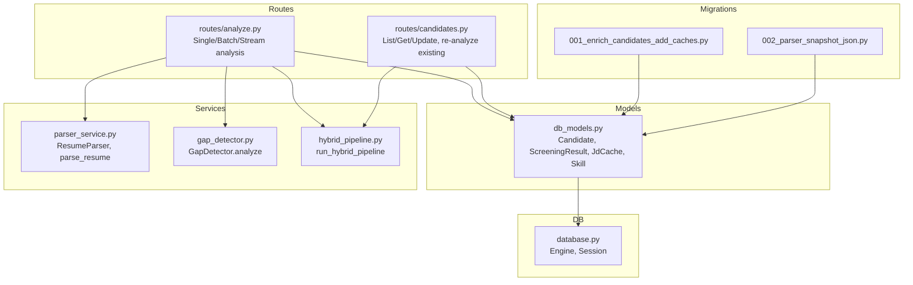
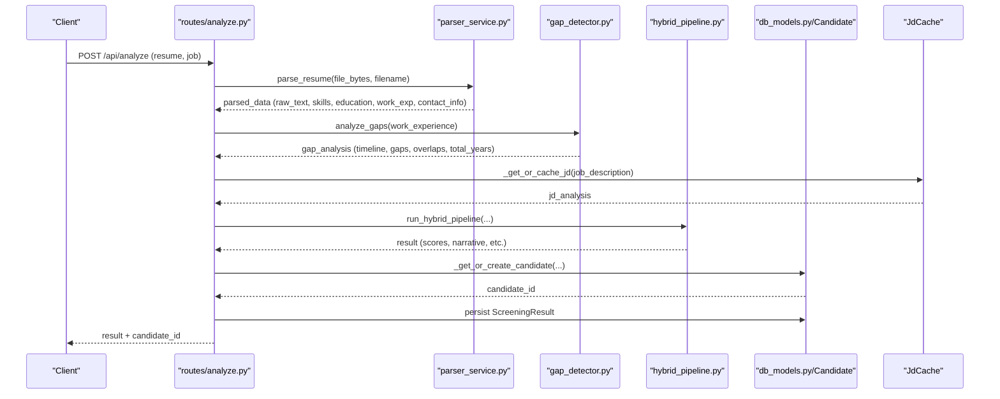
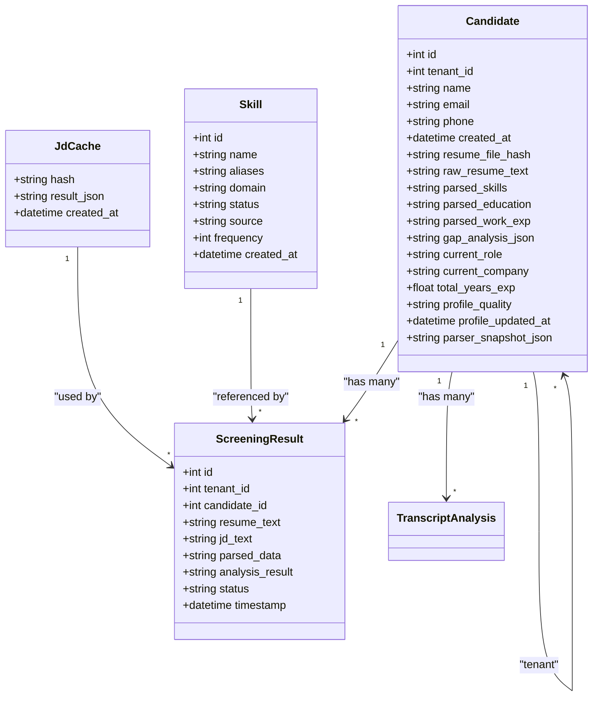
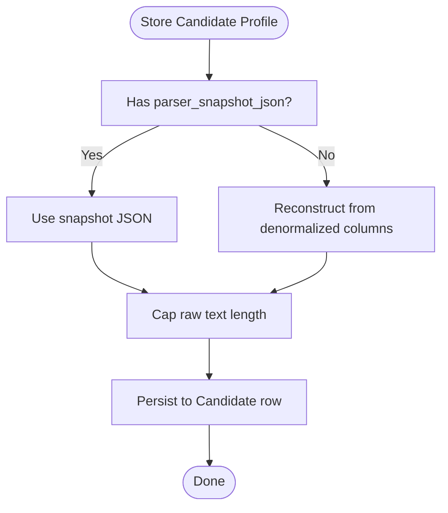
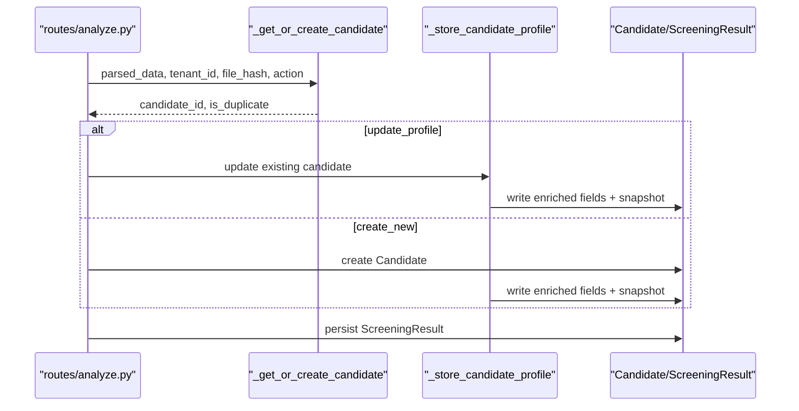
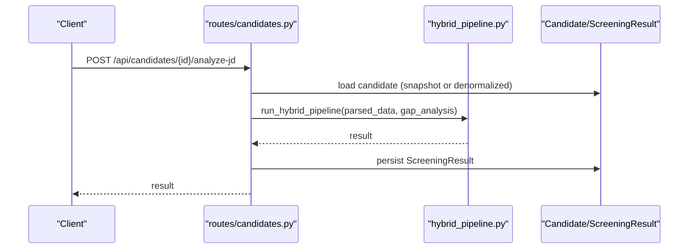
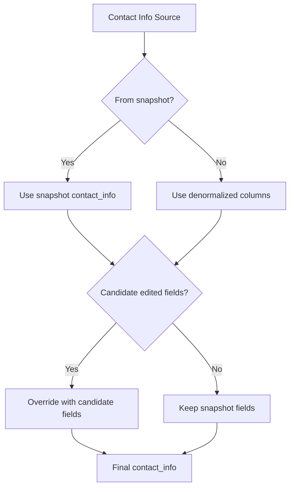
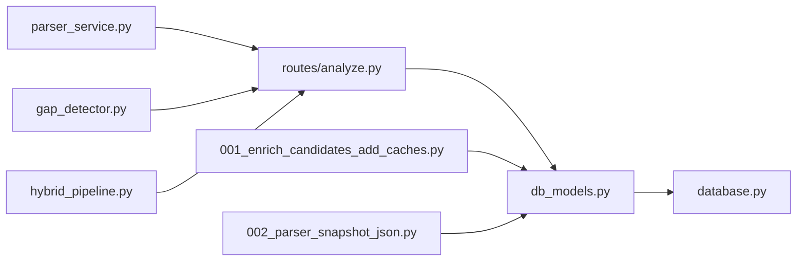

# Candidate Profile Storage

<cite>
**Referenced Files in This Document**
- [db_models.py](file://app/backend/models/db_models.py)
- [schemas.py](file://app/backend/models/schemas.py)
- [candidates.py](file://app/backend/routes/candidates.py)
- [analyze.py](file://app/backend/routes/analyze.py)
- [parser_service.py](file://app/backend/services/parser_service.py)
- [gap_detector.py](file://app/backend/services/gap_detector.py)
- [hybrid_pipeline.py](file://app/backend/services/hybrid_pipeline.py)
- [001_enrich_candidates_add_caches.py](file://alembic/versions/001_enrich_candidates_add_caches.py)
- [002_parser_snapshot_json.py](file://alembic/versions/002_parser_snapshot_json.py)
- [database.py](file://app/backend/db/database.py)
</cite>

## Table of Contents
1. [Introduction](#introduction)
2. [Project Structure](#project-structure)
3. [Core Components](#core-components)
4. [Architecture Overview](#architecture-overview)
5. [Detailed Component Analysis](#detailed-component-analysis)
6. [Dependency Analysis](#dependency-analysis)
7. [Performance Considerations](#performance-considerations)
8. [Troubleshooting Guide](#troubleshooting-guide)
9. [Conclusion](#conclusion)

## Introduction
This document explains the candidate profile storage system in Resume AI. It covers the Candidate model structure, the end-to-end data persistence workflow from resume uploads through parsing to database storage, enriched profile fields, the parser snapshot JSON role, examples of profile updates and contact info merging, and data integrity and optimization strategies.

## Project Structure
The candidate profile storage spans models, routes, services, and migrations:
- Models define the Candidate table and related entities.
- Routes orchestrate parsing, deduplication, and persistence.
- Services implement parsing, gap analysis, and hybrid scoring.
- Migrations evolve the schema to support enriched profiles and snapshots.

**Diagram sources**
- [db_models.py:97-126](file://app/backend/models/db_models.py#L97-L126)
- [analyze.py:354-501](file://app/backend/routes/analyze.py#L354-L501)
- [candidates.py:26-302](file://app/backend/routes/candidates.py#L26-L302)
- [parser_service.py:130-552](file://app/backend/services/parser_service.py#L130-L552)
- [gap_detector.py:103-219](file://app/backend/services/gap_detector.py#L103-L219)
- [hybrid_pipeline.py:1-120](file://app/backend/services/hybrid_pipeline.py#L1-L120)
- [001_enrich_candidates_add_caches.py:42-121](file://alembic/versions/001_enrich_candidates_add_caches.py#L42-L121)
- [002_parser_snapshot_json.py:21-34](file://alembic/versions/002_parser_snapshot_json.py#L21-L34)
- [database.py:1-33](file://app/backend/db/database.py#L1-L33)

**Section sources**
- [db_models.py:97-126](file://app/backend/models/db_models.py#L97-L126)
- [analyze.py:354-501](file://app/backend/routes/analyze.py#L354-L501)
- [candidates.py:26-302](file://app/backend/routes/candidates.py#L26-L302)
- [parser_service.py:130-552](file://app/backend/services/parser_service.py#L130-L552)
- [gap_detector.py:103-219](file://app/backend/services/gap_detector.py#L103-L219)
- [hybrid_pipeline.py:1-120](file://app/backend/services/hybrid_pipeline.py#L1-L120)
- [001_enrich_candidates_add_caches.py:42-121](file://alembic/versions/001_enrich_candidates_add_caches.py#L42-L121)
- [002_parser_snapshot_json.py:21-34](file://alembic/versions/002_parser_snapshot_json.py#L21-L34)
- [database.py:1-33](file://app/backend/db/database.py#L1-L33)

## Core Components
- Candidate model: stores enriched profile fields and parser snapshot for reuse.
- Parser service: extracts text and structured data from resumes.
- Gap detector: computes employment timeline, gaps, overlaps, and total experience.
- Hybrid pipeline: orchestrates Python rules and LLM scoring.
- Routes: handle upload, deduplication, storage, and re-analysis.

Key enriched profile fields on Candidate:
- resume_file_hash: MD5 of file bytes for deduplication.
- raw_resume_text: capped text for downstream use.
- parsed_skills, parsed_education, parsed_work_exp: JSON arrays of structured data.
- gap_analysis_json: JSON object with timeline, gaps, overlaps, short stints, total_years.
- current_role, current_company, total_years_exp: denormalized quick-access fields.
- profile_quality: quality label for the stored profile.
- profile_updated_at: timestamp of last enrichment.
- parser_snapshot_json: full JSON of parse_resume output for audit/re-analysis.

**Section sources**
- [db_models.py:97-126](file://app/backend/models/db_models.py#L97-L126)
- [001_enrich_candidates_add_caches.py:42-72](file://alembic/versions/001_enrich_candidates_add_caches.py#L42-L72)
- [002_parser_snapshot_json.py:21-28](file://alembic/versions/002_parser_snapshot_json.py#L21-L28)
- [analyze.py:118-145](file://app/backend/routes/analyze.py#L118-L145)

## Architecture Overview
End-to-end flow from upload to persistent candidate profile:

**Diagram sources**
- [analyze.py:354-501](file://app/backend/routes/analyze.py#L354-L501)
- [parser_service.py:547-552](file://app/backend/services/parser_service.py#L547-L552)
- [gap_detector.py:217-219](file://app/backend/services/gap_detector.py#L217-L219)
- [hybrid_pipeline.py:1-120](file://app/backend/services/hybrid_pipeline.py#L1-L120)
- [db_models.py:97-126](file://app/backend/models/db_models.py#L97-L126)

## Detailed Component Analysis

### Candidate Model and Schema
The Candidate entity stores both denormalized and normalized fields for efficient querying and re-analysis. The schema includes:
- Identity and tenant association.
- Contact info (name, email, phone).
- Enriched profile fields for reuse.
- Parser snapshot for auditability.
- Timestamps for freshness.

**Diagram sources**
- [db_models.py:97-126](file://app/backend/models/db_models.py#L97-L126)
- [db_models.py:128-146](file://app/backend/models/db_models.py#L128-L146)
- [db_models.py:229-236](file://app/backend/models/db_models.py#L229-L236)
- [db_models.py:238-250](file://app/backend/models/db_models.py#L238-L250)

**Section sources**
- [db_models.py:97-126](file://app/backend/models/db_models.py#L97-L126)

### Parser Snapshot JSON
The parser snapshot captures the complete output of parse_resume, including contact_info (which may include LinkedIn), raw_text, skills, education, work_experience. It is serialized to JSON and stored in parser_snapshot_json with a maximum byte size to bound row size.

- Purpose: Auditability and re-analysis independence from parsing heuristics.
- Fallback: If snapshot is missing, reconstructed from denormalized columns.

**Diagram sources**
- [analyze.py:109-116](file://app/backend/routes/analyze.py#L109-L116)
- [analyze.py:118-145](file://app/backend/routes/analyze.py#L118-L145)
- [candidates.py:228-266](file://app/backend/routes/candidates.py#L228-L266)

**Section sources**
- [analyze.py:109-116](file://app/backend/routes/analyze.py#L109-L116)
- [analyze.py:118-145](file://app/backend/routes/analyze.py#L118-L145)
- [candidates.py:228-266](file://app/backend/routes/candidates.py#L228-L266)
- [002_parser_snapshot_json.py:21-28](file://alembic/versions/002_parser_snapshot_json.py#L21-L28)

### Data Persistence Workflow
- Deduplication: Three-layer matching by email, file hash, and name+phone.
- Enrichment: Gap analysis, skills registry, and hybrid scoring.
- Storage: Candidate row updated with enriched fields and snapshot; ScreeningResult persisted.

**Diagram sources**
- [analyze.py:147-214](file://app/backend/routes/analyze.py#L147-L214)
- [analyze.py:118-145](file://app/backend/routes/analyze.py#L118-L145)
- [db_models.py:97-126](file://app/backend/models/db_models.py#L97-L126)

**Section sources**
- [analyze.py:147-214](file://app/backend/routes/analyze.py#L147-L214)
- [analyze.py:118-145](file://app/backend/routes/analyze.py#L118-L145)

### Enriched Profile Fields and Their Impact
- Denormalized fields enable fast queries and reduce repeated parsing costs.
- Gap analysis informs total_years_exp and highlights risks (overlaps, short stints).
- Skills registry improves coverage and consistency across resumes.
- Quality label (profile_quality) helps prioritize higher-quality profiles.

**Section sources**
- [db_models.py:107-121](file://app/backend/models/db_models.py#L107-L121)
- [gap_detector.py:103-219](file://app/backend/services/gap_detector.py#L103-L219)
- [hybrid_pipeline.py:323-427](file://app/backend/services/hybrid_pipeline.py#L323-L427)

### Re-analyzing Existing Candidates
The system supports re-analyzing an existing candidate against a new job description using the stored profile, skipping full parsing and relying on the snapshot or denormalized columns.

**Diagram sources**
- [candidates.py:192-302](file://app/backend/routes/candidates.py#L192-L302)
- [hybrid_pipeline.py:1-120](file://app/backend/services/hybrid_pipeline.py#L1-L120)
- [db_models.py:97-126](file://app/backend/models/db_models.py#L97-L126)

**Section sources**
- [candidates.py:192-302](file://app/backend/routes/candidates.py#L192-L302)

### Contact Info Merging and Validation
- Contact info precedence: snapshot contact_info merged with candidate’s edited name/email/phone.
- Validation: minimal checks on JD length and file sizes; deduplication ensures uniqueness.
- Deduplication layers: email, file hash, name+phone.

**Diagram sources**
- [candidates.py:150-171](file://app/backend/routes/candidates.py#L150-L171)
- [candidates.py:228-266](file://app/backend/routes/candidates.py#L228-L266)

**Section sources**
- [candidates.py:150-171](file://app/backend/routes/candidates.py#L150-L171)
- [candidates.py:228-266](file://app/backend/routes/candidates.py#L228-L266)
- [analyze.py:147-214](file://app/backend/routes/analyze.py#L147-L214)

### Parser Snapshot JSON Structure
The snapshot JSON mirrors the output of parse_resume:
- raw_text: extracted text.
- skills: list of identified skills.
- education: list of educational entries.
- work_experience: list of job entries.
- contact_info: dictionary with name, email, phone, and optional LinkedIn.

Constraints:
- Maximum serialized size enforced to prevent oversized rows.
- Stored as Text to accommodate large JSON.

**Section sources**
- [parser_service.py:547-552](file://app/backend/services/parser_service.py#L547-L552)
- [analyze.py:109-116](file://app/backend/routes/analyze.py#L109-L116)
- [002_parser_snapshot_json.py:21-28](file://alembic/versions/002_parser_snapshot_json.py#L21-L28)

## Dependency Analysis
- Routes depend on parser_service, gap_detector, and hybrid_pipeline.
- Candidate enrichment depends on gap_detector and skills registry.
- Persistence depends on SQLAlchemy models and Alembic migrations.

**Diagram sources**
- [analyze.py:32-39](file://app/backend/routes/analyze.py#L32-L39)
- [parser_service.py:130-552](file://app/backend/services/parser_service.py#L130-L552)
- [gap_detector.py:103-219](file://app/backend/services/gap_detector.py#L103-L219)
- [hybrid_pipeline.py:1-120](file://app/backend/services/hybrid_pipeline.py#L1-L120)
- [db_models.py:97-126](file://app/backend/models/db_models.py#L97-L126)
- [database.py:1-33](file://app/backend/db/database.py#L1-L33)
- [001_enrich_candidates_add_caches.py:42-121](file://alembic/versions/001_enrich_candidates_add_caches.py#L42-L121)
- [002_parser_snapshot_json.py:21-28](file://alembic/versions/002_parser_snapshot_json.py#L21-L28)

**Section sources**
- [analyze.py:32-39](file://app/backend/routes/analyze.py#L32-L39)
- [db_models.py:97-126](file://app/backend/models/db_models.py#L97-L126)

## Performance Considerations
- Thread pool parsing: resume parsing offloads to threads to avoid blocking the event loop.
- JD caching: shared cache across workers reduces repeated JD parsing.
- Snapshot size cap: bounds row size and memory footprint.
- Index on resume_file_hash: accelerates deduplication by file hash.
- Asynchronous streaming: SSE endpoints stream intermediate results for responsiveness.

[No sources needed since this section provides general guidance]

## Troubleshooting Guide
Common issues and remedies:
- Scanned PDFs: Parsing raises a clear error; advise uploading text-based PDFs.
- Too-short JD: Rejected with a helpful message; require at least 80 words.
- Excessive resume size: Rejected at 10 MB; compress or optimize.
- Excessive JD file size: Rejected at 5 MB; prefer text-based files.
- Deduplication not matching: Verify email, file hash, and name+phone combinations; consider update_profile action.

**Section sources**
- [analyze.py:268-290](file://app/backend/routes/analyze.py#L268-L290)
- [analyze.py:255-265](file://app/backend/routes/analyze.py#L255-L265)
- [analyze.py:369-374](file://app/backend/routes/analyze.py#L369-L374)
- [analyze.py:376-381](file://app/backend/routes/analyze.py#L376-L381)

## Conclusion
The candidate profile storage system in Resume AI combines robust parsing, gap analysis, and hybrid scoring with a durable schema that persists enriched profiles and a full parser snapshot. This enables fast re-analysis, auditability, and consistent candidate evaluation across job descriptions while maintaining data integrity and performance.