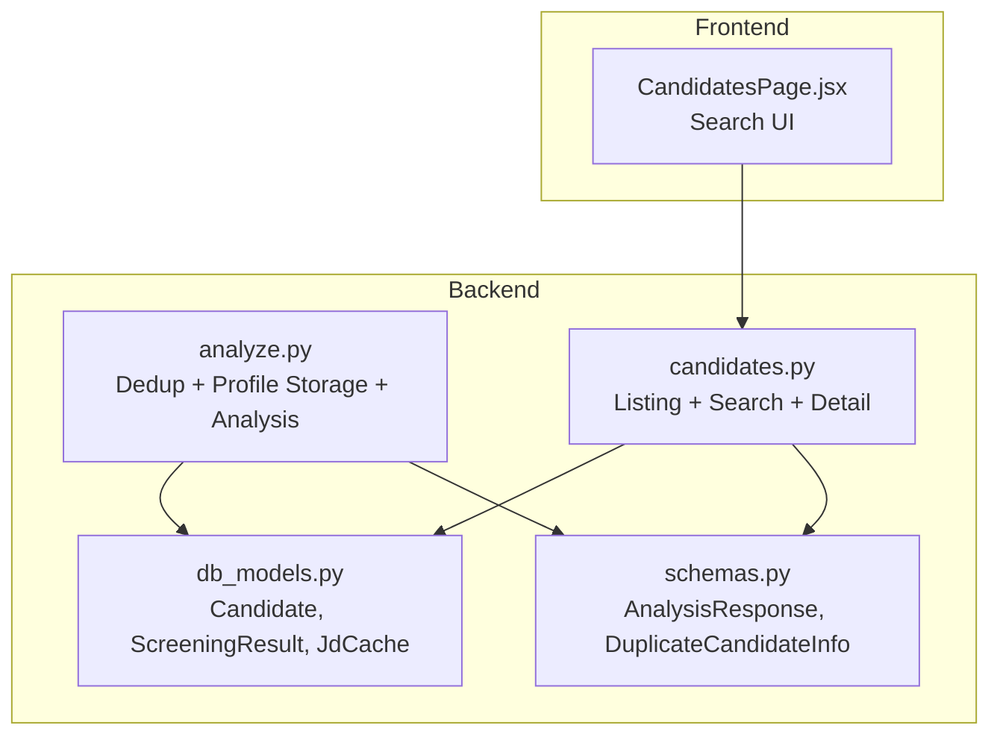
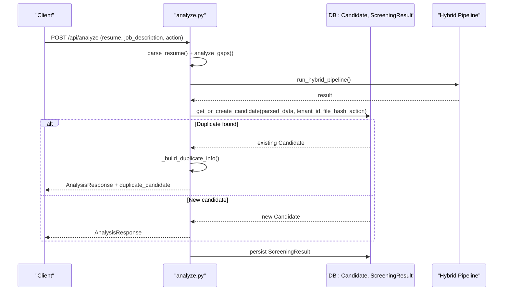
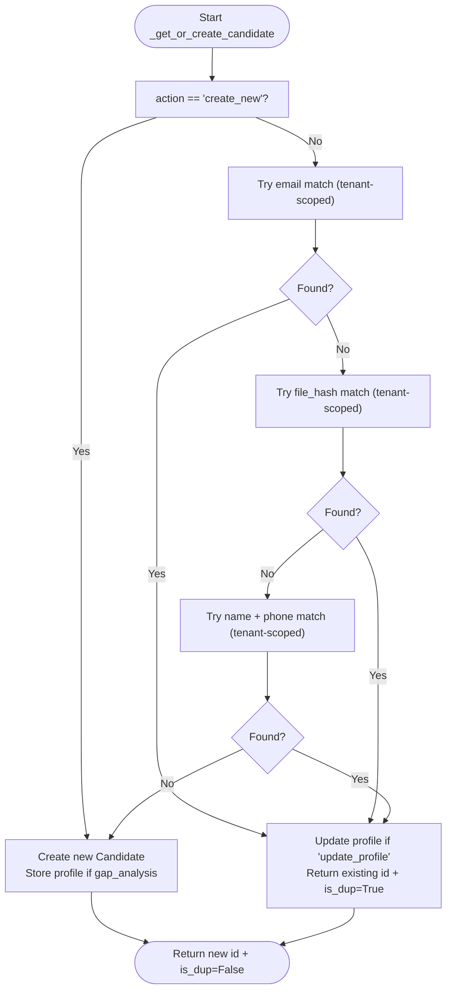
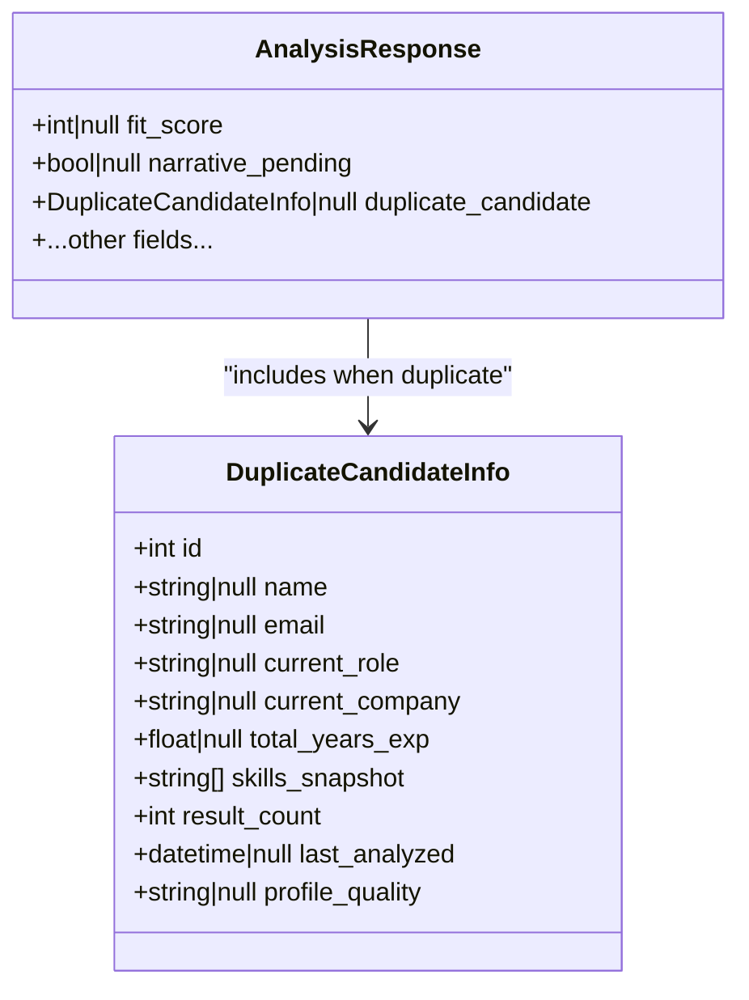
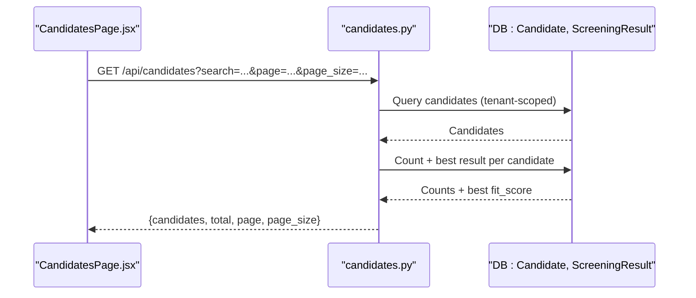
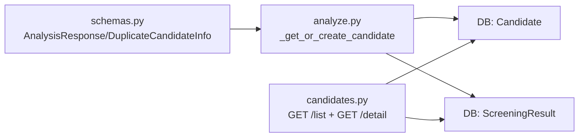

# Deduplication System

<cite>
**Referenced Files in This Document**
- [analyze.py](file://app/backend/routes/analyze.py)
- [db_models.py](file://app/backend/models/db_models.py)
- [schemas.py](file://app/backend/models/schemas.py)
- [candidates.py](file://app/backend/routes/candidates.py)
- [test_candidate_dedup.py](file://app/backend/tests/test_candidate_dedup.py)
- [CandidatesPage.jsx](file://app/frontend/src/pages/CandidatesPage.jsx)
</cite>

## Table of Contents
1. [Introduction](#introduction)
2. [Project Structure](#project-structure)
3. [Core Components](#core-components)
4. [Architecture Overview](#architecture-overview)
5. [Detailed Component Analysis](#detailed-component-analysis)
6. [Dependency Analysis](#dependency-analysis)
7. [Performance Considerations](#performance-considerations)
8. [Troubleshooting Guide](#troubleshooting-guide)
9. [Conclusion](#conclusion)

## Introduction
This document explains the candidate deduplication system used to identify duplicate candidates across resumes and analysis results. It covers the three-layer deduplication algorithm, fuzzy matching techniques for name, email, and phone number, thresholds and confidence signals, manual override capabilities, integration with search and candidate listing, examples of scenarios and false positives, performance optimization for large datasets, and privacy considerations.

## Project Structure
The deduplication logic is implemented in the analysis route module and integrated with the candidate listing and search endpoints. The database schema defines the Candidate and ScreeningResult entities, while Pydantic models define the response payloads and deduplication metadata.

**Diagram sources**
- [analyze.py:147-214](file://app/backend/routes/analyze.py#L147-L214)
- [candidates.py:26-80](file://app/backend/routes/candidates.py#L26-L80)
- [db_models.py:97-146](file://app/backend/models/db_models.py#L97-L146)
- [schemas.py:8-20](file://app/backend/models/schemas.py#L8-L20)

**Section sources**
- [analyze.py:147-214](file://app/backend/routes/analyze.py#L147-L214)
- [candidates.py:26-80](file://app/backend/routes/candidates.py#L26-L80)
- [db_models.py:97-146](file://app/backend/models/db_models.py#L97-L146)
- [schemas.py:8-20](file://app/backend/models/schemas.py#L8-L20)

## Core Components
- Three-layer deduplication:
  - Layer 1: Exact email match within the tenant scope.
  - Layer 2: Exact file hash match (MD5 of resume bytes) within the tenant scope.
  - Layer 3: Exact name and phone pair within the tenant scope.
- Manual overrides:
  - action=create_new bypasses deduplication and always creates a new candidate.
  - action=update_profile updates an existing candidate’s stored profile.
  - action=use_existing loads a stored profile and skips re-parsing.
- Confidence and duplicate signaling:
  - On duplicate detection, the analysis response includes DuplicateCandidateInfo with metadata such as result_count and last_analyzed.
- Candidate listing and search:
  - Listing supports search by name or email and pagination.
  - Detail view exposes enriched profile fields and history.

**Section sources**
- [analyze.py:147-214](file://app/backend/routes/analyze.py#L147-L214)
- [analyze.py:72-103](file://app/backend/routes/analyze.py#L72-L103)
- [candidates.py:26-80](file://app/backend/routes/candidates.py#L26-L80)
- [schemas.py:8-20](file://app/backend/models/schemas.py#L8-L20)

## Architecture Overview
The deduplication pipeline runs during resume analysis. After parsing and gap analysis, the system attempts to locate an existing candidate using the three layers. If found, the profile may be updated depending on the action; if not found, a new candidate is created and the enriched profile is persisted.

**Diagram sources**
- [analyze.py:354-501](file://app/backend/routes/analyze.py#L354-L501)
- [analyze.py:147-214](file://app/backend/routes/analyze.py#L147-L214)
- [analyze.py:72-103](file://app/backend/routes/analyze.py#L72-L103)

## Detailed Component Analysis

### Three-Layer Deduplication Logic
- Layer 1: Email match within tenant.
- Layer 2: File hash match (MD5) within tenant.
- Layer 3: Name + Phone exact match within tenant.
- Manual overrides:
  - action=create_new: skip all dedup and create a new row.
  - action=update_profile: update stored profile if gap_analysis is provided.
  - action=use_existing: load stored profile and run scoring-only.

**Diagram sources**
- [analyze.py:147-214](file://app/backend/routes/analyze.py#L147-L214)

**Section sources**
- [analyze.py:147-214](file://app/backend/routes/analyze.py#L147-L214)
- [test_candidate_dedup.py:180-235](file://app/backend/tests/test_candidate_dedup.py#L180-L235)

### Duplicate Candidate Response Model
When a duplicate is detected, the response includes DuplicateCandidateInfo with:
- id, name, email, current_role, current_company, total_years_exp
- skills_snapshot (top skills from stored profile)
- result_count (number of historical analyses)
- last_analyzed (most recent analysis timestamp)
- profile_quality

**Diagram sources**
- [schemas.py:89-125](file://app/backend/models/schemas.py#L89-L125)
- [schemas.py:8-20](file://app/backend/models/schemas.py#L8-L20)

**Section sources**
- [schemas.py:8-20](file://app/backend/models/schemas.py#L8-L20)
- [analyze.py:72-103](file://app/backend/routes/analyze.py#L72-L103)

### Candidate Listing and Search Integration
- GET /api/candidates supports:
  - search: ILIKE on name or email
  - pagination: page, page_size
- Response enrichments include current_role, total_years_exp, profile_quality.
- Frontend UI supports search by name or email and pagination.

**Diagram sources**
- [candidates.py:26-80](file://app/backend/routes/candidates.py#L26-L80)
- [CandidatesPage.jsx:77-128](file://app/frontend/src/pages/CandidatesPage.jsx#L77-L128)

**Section sources**
- [candidates.py:26-80](file://app/backend/routes/candidates.py#L26-L80)
- [CandidatesPage.jsx:77-128](file://app/frontend/src/pages/CandidatesPage.jsx#L77-L128)

### Re-analysis Without Re-upload
POST /api/candidates/{id}/analyze-jd re-runs scoring using the stored profile, skipping parsing. This leverages the same tenant-scoped deduplication logic for consistency.

**Section sources**
- [candidates.py:192-302](file://app/backend/routes/candidates.py#L192-L302)

## Dependency Analysis
- Deduplication depends on:
  - Candidate table fields: email, resume_file_hash, name, phone, tenant_id
  - ScreeningResult for result_count and last_analyzed
- The system enforces tenant isolation to prevent cross-tenant deduplication.
- Manual actions control whether deduplication occurs.

**Diagram sources**
- [analyze.py:147-214](file://app/backend/routes/analyze.py#L147-L214)
- [candidates.py:26-80](file://app/backend/routes/candidates.py#L26-L80)
- [db_models.py:97-146](file://app/backend/models/db_models.py#L97-L146)
- [schemas.py:89-125](file://app/backend/models/schemas.py#L89-L125)

**Section sources**
- [db_models.py:97-146](file://app/backend/models/db_models.py#L97-L146)
- [analyze.py:147-214](file://app/backend/routes/analyze.py#L147-L214)

## Performance Considerations
- Indexes:
  - Candidate.email and Candidate.resume_file_hash are indexed to accelerate dedup queries.
- Hashing:
  - File hash is MD5 of resume bytes; computed once per upload and reused for dedup.
- Tenant scoping:
  - All queries filter by tenant_id to avoid cross-tenant scans.
- Batch processing:
  - Batch endpoint computes file_hash per resume and performs dedup per row.
- Memory and storage:
  - Parser snapshots are truncated to a maximum size to bound row sizes.

**Section sources**
- [db_models.py:103-121](file://app/backend/models/db_models.py#L103-L121)
- [analyze.py:393](file://app/backend/routes/analyze.py#L393)
- [analyze.py:704](file://app/backend/routes/analyze.py#L704)
- [analyze.py:106](file://app/backend/routes/analyze.py#L106)

## Troubleshooting Guide
- Duplicate not detected:
  - Ensure email is present for Layer 1; otherwise rely on Layer 2 (hash) or Layer 3 (name+phone).
  - action=create_new bypasses dedup intentionally.
- Duplicate flagged unexpectedly:
  - Check if the resume bytes changed (different hash) or if name/phone differ slightly.
  - Use action=update_profile to refresh stored profile if legitimate.
- Cross-tenant false positives:
  - Tenant isolation prevents cross-tenant deduplication; ensure tenant_id is correct.
- Large dataset:
  - Confirm indexes on email and resume_file_hash are effective.
  - Monitor parser snapshot size to avoid oversized rows.

**Section sources**
- [test_candidate_dedup.py:180-264](file://app/backend/tests/test_candidate_dedup.py#L180-L264)
- [analyze.py:147-214](file://app/backend/routes/analyze.py#L147-L214)

## Conclusion
The deduplication system uses a robust three-layer approach with exact matching on email, file hash, and name+phone, scoped to tenants. It provides clear signals via DuplicateCandidateInfo, supports manual overrides, and integrates seamlessly with listing, search, and re-analysis workflows. Indexing and tenant scoping ensure scalability and correctness for large datasets.