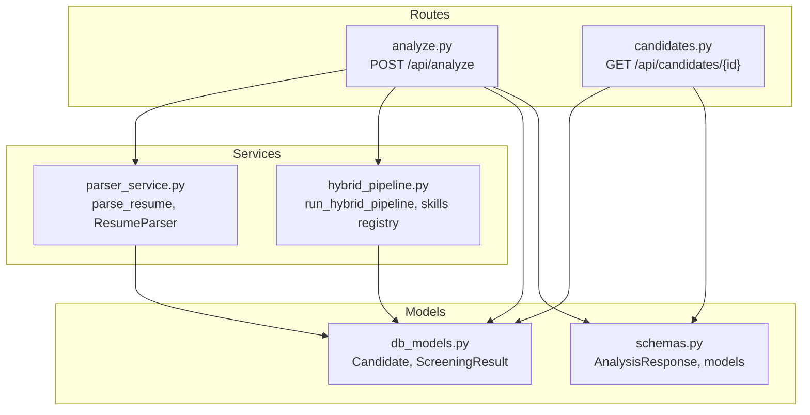
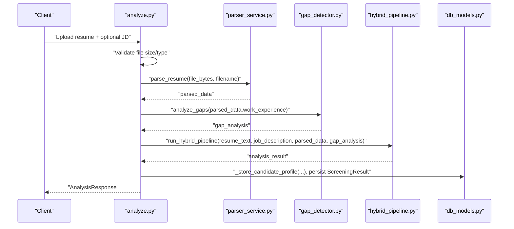
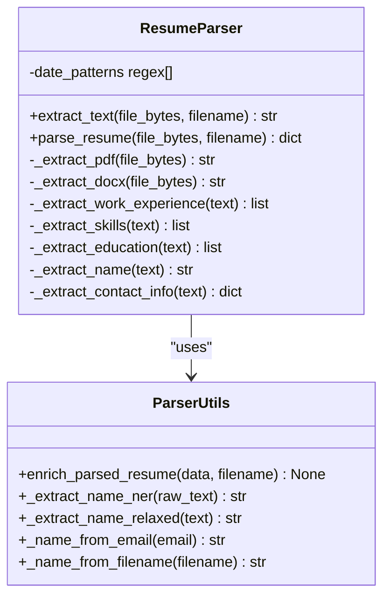
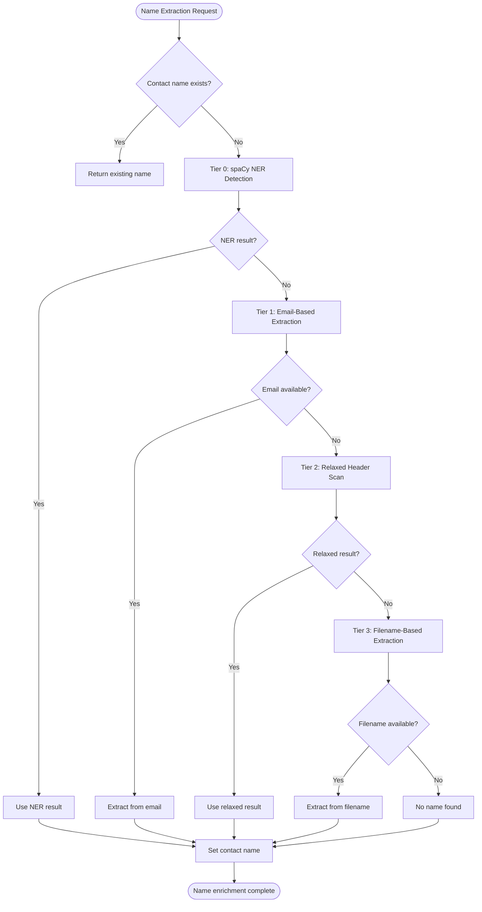
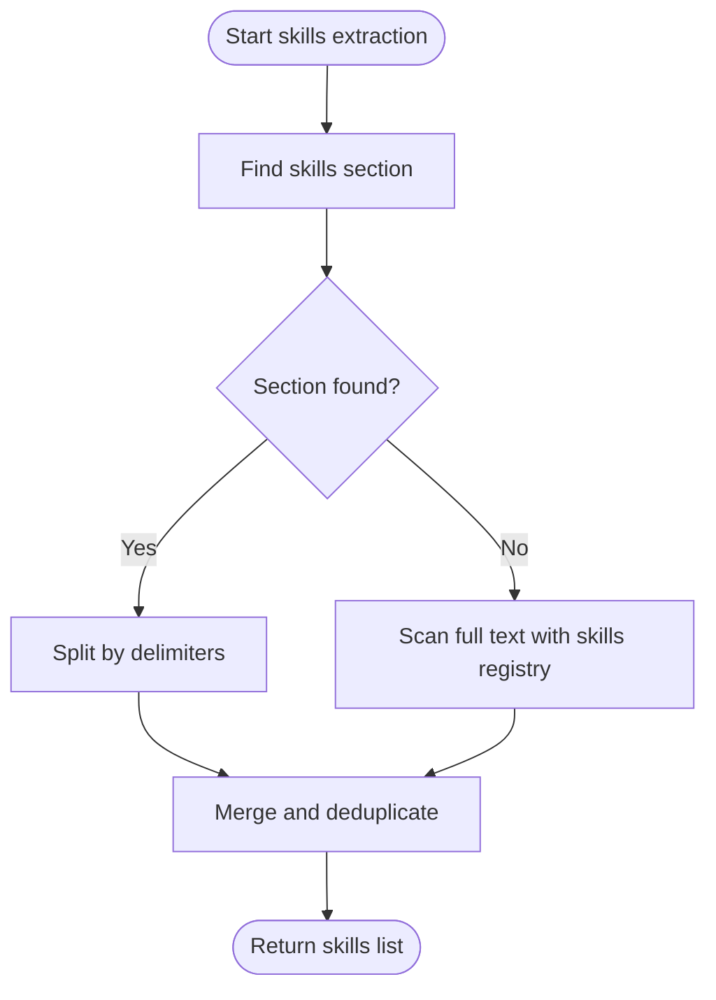
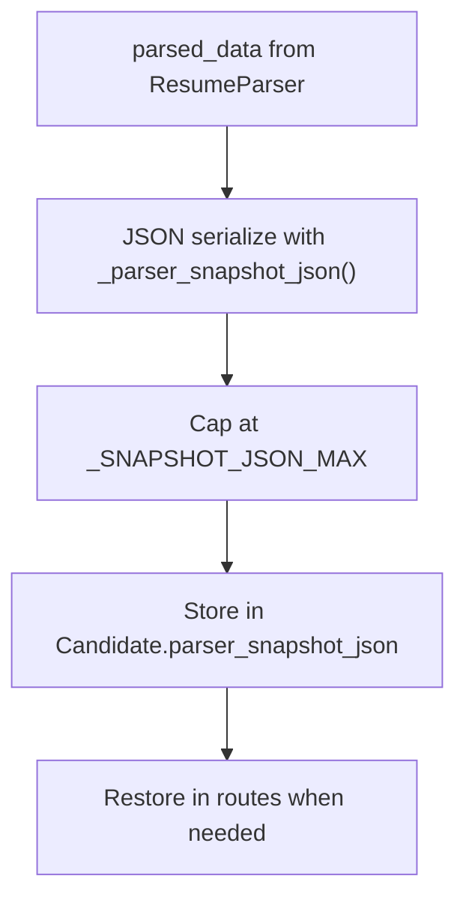
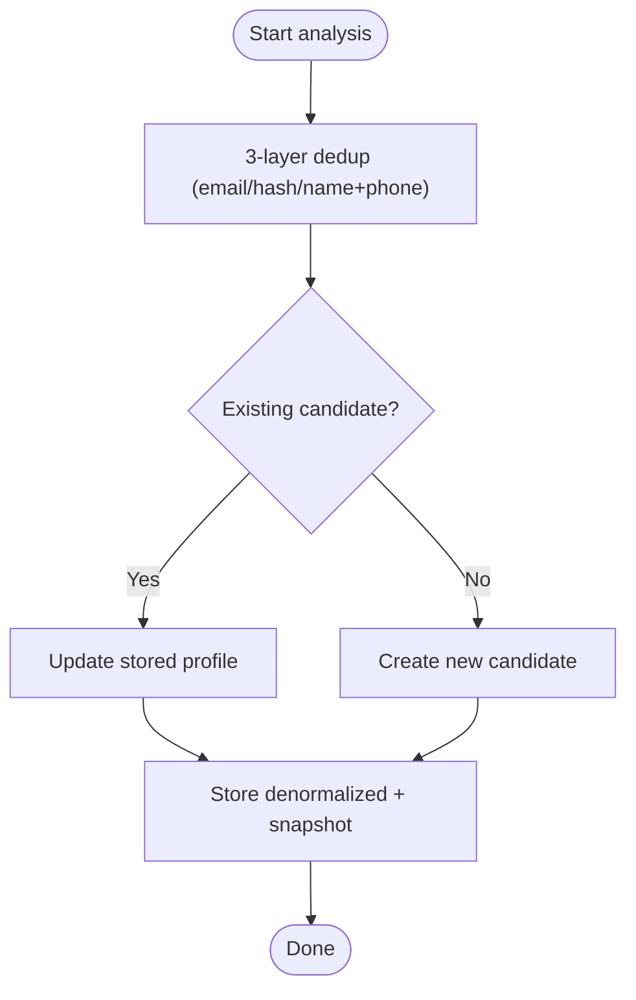
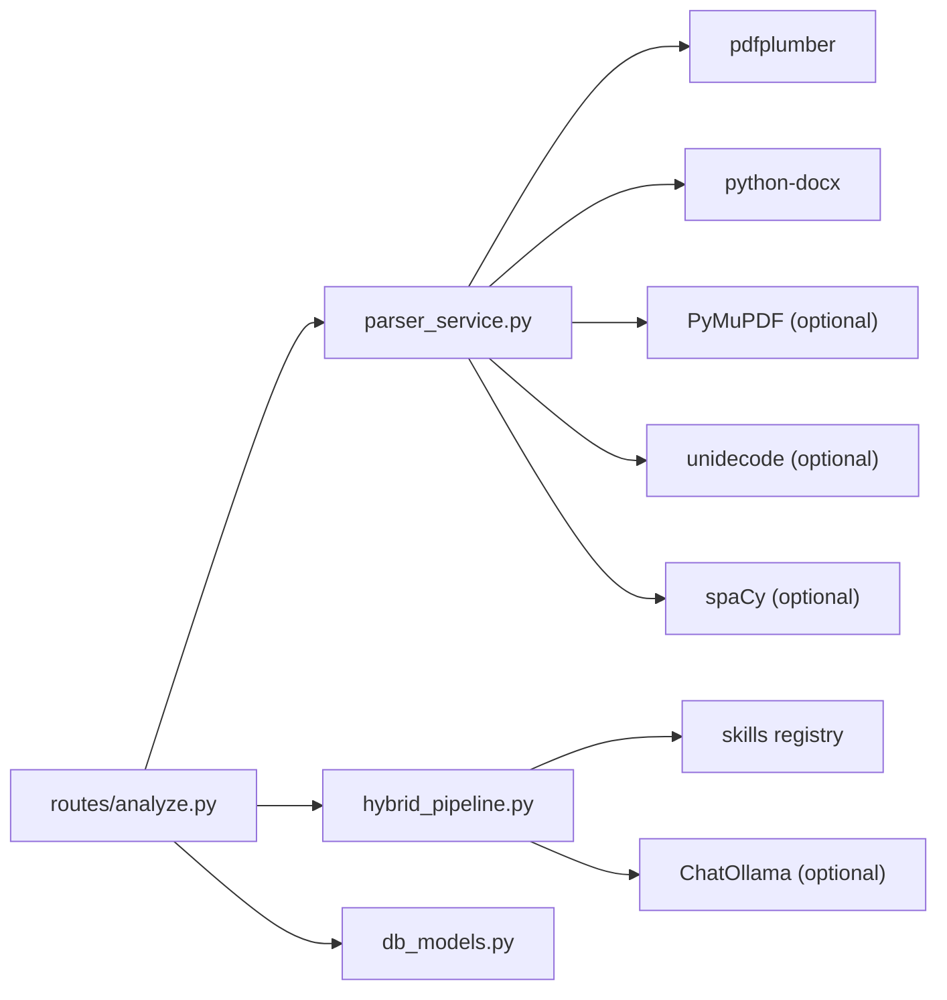

# Resume Parsing and Extraction

<cite>
**Referenced Files in This Document**
- [parser_service.py](file://app/backend/services/parser_service.py)
- [hybrid_pipeline.py](file://app/backend/services/hybrid_pipeline.py)
- [analyze.py](file://app/backend/routes/analyze.py)
- [candidates.py](file://app/backend/routes/candidates.py)
- [db_models.py](file://app/backend/models/db_models.py)
- [schemas.py](file://app/backend/models/schemas.py)
- [test_parser_service.py](file://app/backend/tests/test_parser_service.py)
- [002_parser_snapshot_json.py](file://alembic/versions/002_parser_snapshot_json.py)
</cite>

## Update Summary
**Changes Made**
- Enhanced name extraction with robust tiered fallback mechanism (NER detection, email-based extraction, relaxed header scanning, filename-based extraction)
- Added intelligent filename-based name parsing with validation rules and various naming convention support
- Updated enrichment logic to prioritize spaCy NER results while providing comprehensive fallback options
- Expanded test coverage for filename-based extraction scenarios

## Table of Contents
1. [Introduction](#introduction)
2. [Project Structure](#project-structure)
3. [Core Components](#core-components)
4. [Architecture Overview](#architecture-overview)
5. [Detailed Component Analysis](#detailed-component-analysis)
6. [Dependency Analysis](#dependency-analysis)
7. [Performance Considerations](#performance-considerations)
8. [Troubleshooting Guide](#troubleshooting-guide)
9. [Conclusion](#conclusion)
10. [Appendices](#appendices)

## Introduction
This document explains the resume parsing and extraction workflows powering the system. It covers the parser service architecture supporting PDF and DOCX formats, text extraction algorithms, and structured data parsing for contact information, work experience, education, and skills. It also documents the parsing pipeline stages, error handling for malformed documents and scanned PDFs, fallback mechanisms, parser snapshot generation, and JSON serialization format. Practical examples, edge-case handling, and performance optimization strategies are included, along with configuration and customization possibilities.

**Updated** Enhanced with robust filename-based name extraction fallback mechanism featuring a four-tier approach for maximum accuracy and reliability.

## Project Structure
The resume parsing pipeline spans several modules:
- Parser service: extracts raw text from resumes and parses structured fields.
- Hybrid pipeline: augments parsed profiles with skills discovery and scoring.
- Routes: orchestrate parsing, caching, deduplication, and persistence.
- Models: define database schema and Pydantic output models.
- Tests: validate parsing behavior and edge cases.

**Diagram sources**
- [analyze.py:1-40](file://app/backend/routes/analyze.py#L1-L40)
- [candidates.py:1-30](file://app/backend/routes/candidates.py#L1-L30)
- [parser_service.py:1-50](file://app/backend/services/parser_service.py#L1-L50)
- [hybrid_pipeline.py:1-40](file://app/backend/services/hybrid_pipeline.py#L1-L40)
- [db_models.py:97-126](file://app/backend/models/db_models.py#L97-L126)
- [schemas.py:89-125](file://app/backend/models/schemas.py#L89-L125)

**Section sources**
- [analyze.py:1-80](file://app/backend/routes/analyze.py#L1-L80)
- [parser_service.py:1-50](file://app/backend/services/parser_service.py#L1-L50)
- [db_models.py:97-126](file://app/backend/models/db_models.py#L97-L126)

## Core Components
- ResumeParser: central class extracting raw text from PDF/DOCX/TXT and structuring contact info, work experience, education, and skills.
- parse_resume: convenience function instantiating ResumeParser and returning structured output with enhanced name enrichment.
- enrich_parsed_resume: fills missing name using a four-tier fallback system (NER detection, email-based extraction, relaxed header scanning, filename-based extraction).
- Hybrid pipeline: enhances parsed data with skills discovery and scoring.
- Routes: orchestrate parsing, deduplication, caching, and persistence.

Key responsibilities:
- Text extraction: PDF via PyMuPDF with pdfplumber fallback; DOCX via python-docx; TXT via decoding.
- Structured parsing: work experience, skills, education, contact info.
- Enhanced name extraction: robust four-tier fallback system for maximum accuracy.
- Snapshot storage: full parser output serialized to JSON for auditing and re-analysis.
- Error handling: scanned PDF detection, unsupported formats, and graceful fallbacks.

**Updated** Enhanced name extraction with comprehensive fallback mechanism covering spaCy NER, email-based extraction, relaxed header scanning, and filename-based parsing.

**Section sources**
- [parser_service.py:130-202](file://app/backend/services/parser_service.py#L130-L202)
- [parser_service.py:583-610](file://app/backend/services/parser_service.py#L583-L610)
- [parser_service.py:612-653](file://app/backend/services/parser_service.py#L612-L653)
- [hybrid_pipeline.py:604-637](file://app/backend/services/hybrid_pipeline.py#L604-L637)
- [analyze.py:109-145](file://app/backend/routes/analyze.py#L109-L145)

## Architecture Overview
End-to-end flow from upload to analysis and persistence:

**Diagram sources**
- [analyze.py:354-400](file://app/backend/routes/analyze.py#L354-L400)
- [parser_service.py:656-662](file://app/backend/services/parser_service.py#L656-L662)
- [hybrid_pipeline.py:604-637](file://app/backend/services/hybrid_pipeline.py#L604-L637)
- [analyze.py:118-145](file://app/backend/routes/analyze.py#L118-L145)
- [db_models.py:128-146](file://app/backend/models/db_models.py#L128-L146)

## Detailed Component Analysis

### ResumeParser: Text Extraction and Structured Parsing
- Supported formats: PDF, DOCX, DOC, TXT, RTF, HTML/HTM, ODT, and plain text fallback.
- PDF extraction:
  - Primary: PyMuPDF for robust text extraction and correct reading order.
  - Fallback: pdfplumber if PyMuPDF is unavailable or yields empty text.
  - Guard: raises a clear error for scanned PDFs (text length < 100 characters).
  - Normalization: optional Unicode normalization for accented characters.
- DOCX extraction: reads paragraph text and table cells.
- Structured parsing:
  - Work experience: detects date patterns and infers company/title from surrounding lines; accumulates descriptions.
  - Skills: section-based extraction with broad fallback using a skills registry and regex scanning.
  - Education: identifies degree-related lines and extracts university/year.
  - Contact info: name, email, phone, LinkedIn; name enrichment via enhanced four-tier fallback system.

**Diagram sources**
- [parser_service.py:176-662](file://app/backend/services/parser_service.py#L176-L662)

**Section sources**
- [parser_service.py:188-196](file://app/backend/services/parser_service.py#L188-L196)
- [parser_service.py:198-236](file://app/backend/services/parser_service.py#L198-L236)
- [parser_service.py:238-241](file://app/backend/services/parser_service.py#L238-L241)
- [parser_service.py:242-251](file://app/backend/services/parser_service.py#L242-L251)
- [parser_service.py:253-331](file://app/backend/services/parser_service.py#L253-L331)
- [parser_service.py:368-421](file://app/backend/services/parser_service.py#L368-L421)
- [parser_service.py:423-467](file://app/backend/services/parser_service.py#L423-L467)
- [parser_service.py:469-540](file://app/backend/services/parser_service.py#L469-L540)

### Enhanced Name Extraction and Enrichment System
The system now implements a robust four-tier fallback mechanism for name extraction:

**Tier 0: spaCy NER Detection (Most Accurate)**
- Uses spaCy's Named Entity Recognition to identify PERSON entities in the first 50 lines of resume text.
- Validates results to ensure 1-5 words, no digits, and reasonable length (< 60 characters).
- Gracefully handles spaCy unavailability by falling back to next tier.

**Tier 1: Email-Based Extraction**
- Extracts name from email local part (before @) when available.
- Splits on common separators (., _, +, -) and capitalizes tokens.
- Requires at least 2 alphabetic tokens for validation.

**Tier 2: Relaxed Header Scanning**
- Searches first 35 lines for title-case name patterns.
- Skips common section headers and contact information lines.
- Validates against skip lists and contact indicators.

**Tier 3: Filename-Based Extraction (New)**
- Extracts name from filename when all other tiers fail.
- Handles various naming conventions: "john_doe_resume_2024.pdf", "Suhas Mullangi.pdf".
- Removes common prefixes (resume, cv, curriculum, vitae), dates, and non-name patterns.
- Validates resulting name has 2-5 words and no digits.

**Diagram sources**
- [parser_service.py:583-610](file://app/backend/services/parser_service.py#L583-L610)
- [parser_service.py:612-653](file://app/backend/services/parser_service.py#L612-L653)

**Section sources**
- [parser_service.py:42-63](file://app/backend/services/parser_service.py#L42-L63)
- [parser_service.py:543-553](file://app/backend/services/parser_service.py#L543-L553)
- [parser_service.py:556-580](file://app/backend/services/parser_service.py#L556-L580)
- [parser_service.py:583-610](file://app/backend/services/parser_service.py#L583-L610)
- [parser_service.py:612-653](file://app/backend/services/parser_service.py#L612-L653)

### Skills Discovery and Registry
Skills extraction combines:
- Section-based extraction from a skills header region.
- Full-text scanning using a skills registry and optional keyword extraction processor.
- Fallback to a broad skills list when processors are unavailable.

**Diagram sources**
- [parser_service.py:368-421](file://app/backend/services/parser_service.py#L368-L421)
- [hybrid_pipeline.py:589-637](file://app/backend/services/hybrid_pipeline.py#L589-L637)

**Section sources**
- [parser_service.py:368-421](file://app/backend/services/parser_service.py#L368-L421)
- [hybrid_pipeline.py:69-182](file://app/backend/services/hybrid_pipeline.py#L69-L182)
- [hybrid_pipeline.py:589-637](file://app/backend/services/hybrid_pipeline.py#L589-L637)

### Parser Snapshot Generation and JSON Serialization
- Full parser output is serialized to JSON and stored in the Candidate row for auditing and re-analysis.
- Limits: maximum serialized size enforced to keep rows bounded.
- Restoration: routes reconstruct parsed data from snapshot or denormalized columns.

**Diagram sources**
- [analyze.py:136-143](file://app/backend/routes/analyze.py#L136-L143)
- [analyze.py:145-172](file://app/backend/routes/analyze.py#L145-L172)
- [candidates.py:228-267](file://app/backend/routes/candidates.py#L228-L267)
- [002_parser_snapshot_json.py:21-33](file://alembic/versions/002_parser_snapshot_json.py#L21-L33)

**Section sources**
- [analyze.py:136-172](file://app/backend/routes/analyze.py#L136-L172)
- [candidates.py:228-267](file://app/backend/routes/candidates.py#L228-L267)
- [db_models.py:120-121](file://app/backend/models/db_models.py#L120-L121)
- [002_parser_snapshot_json.py:21-33](file://alembic/versions/002_parser_snapshot_json.py#L21-L33)

### Deduplication and Profile Storage
- Three-layer deduplication: email, file hash, and name+phone.
- On new or updated analysis, the system stores:
  - Raw text (capped)
  - Skills, education, work experience (JSON arrays)
  - Gap analysis (JSON object)
  - Current role/company and total years experience
  - Profile quality and timestamps
  - Full parser snapshot (JSON)

**Diagram sources**
- [analyze.py:174-242](file://app/backend/routes/analyze.py#L174-L242)
- [db_models.py:97-126](file://app/backend/models/db_models.py#L97-L126)

**Section sources**
- [analyze.py:174-242](file://app/backend/routes/analyze.py#L174-L242)
- [db_models.py:97-126](file://app/backend/models/db_models.py#L97-L126)

### Example Parsing Workflows
- PDF resume with skills, work experience, and education:
  - Extract text via PyMuPDF with pdfplumber fallback.
  - Detect skills section and scan full text for additional skills.
  - Parse work experience entries with inferred company/title and descriptions.
  - Extract education degrees and years.
  - Populate contact info and enrich name using the four-tier fallback system.
- DOCX resume:
  - Read paragraphs and table cells to build raw text.
  - Apply the same structured parsing logic as PDF.
- TXT/other formats:
  - Decode with multiple encodings and return raw text for downstream parsing.

**Updated** Enhanced name enrichment workflow now uses the four-tier fallback system for maximum accuracy across diverse resume formats.

**Section sources**
- [parser_service.py:188-196](file://app/backend/services/parser_service.py#L188-L196)
- [parser_service.py:198-236](file://app/backend/services/parser_service.py#L198-L236)
- [test_parser_service.py:17-128](file://app/backend/tests/test_parser_service.py#L17-L128)

### Edge Cases and Fallback Mechanisms
- Scanned PDFs:
  - Early detection with a length threshold triggers a user-friendly error advising text-based PDFs.
- Unsupported or unreadable formats:
  - Graceful ValueError raised with supported formats list.
- Skills extraction fallback:
  - If skills registry processor is unavailable, falls back to a broad skills list.
- Enhanced name enrichment:
  - Four-tier fallback system ensures name extraction success across diverse scenarios.
  - spaCy NER provides highest accuracy when available.
  - Email-based extraction handles cases where header parsing fails.
  - Relaxed header scanning accommodates varied resume layouts.
  - Filename-based extraction serves as final fallback for edge cases.

**Updated** Enhanced name extraction with comprehensive four-tier fallback system covering spaCy NER, email-based extraction, relaxed header scanning, and filename-based parsing.

**Section sources**
- [parser_service.py:224-230](file://app/backend/services/parser_service.py#L224-L230)
- [parser_service.py:170-173](file://app/backend/services/parser_service.py#L170-L173)
- [parser_service.py:414-421](file://app/backend/services/parser_service.py#L414-L421)
- [parser_service.py:583-610](file://app/backend/services/parser_service.py#L583-L610)

## Dependency Analysis
- Parser service depends on:
  - pdfplumber for PDF text extraction.
  - python-docx for DOCX text extraction.
  - Optional PyMuPDF for improved PDF extraction.
  - Optional unidecode for Unicode normalization.
  - Optional spaCy for advanced name extraction (NER detection).
- Hybrid pipeline depends on:
  - Skills registry and optional keyword extraction processor.
  - LLM (Ollama) for narrative generation with concurrency control.
- Routes depend on:
  - Parser service for raw text and structured parsing.
  - Gap detector for employment gaps.
  - Hybrid pipeline for scoring and matching.
  - Database models for persistence and retrieval.

**Diagram sources**
- [parser_service.py:1-24](file://app/backend/services/parser_service.py#L1-L24)
- [hybrid_pipeline.py:45-66](file://app/backend/services/hybrid_pipeline.py#L45-L66)
- [analyze.py:32-39](file://app/backend/routes/analyze.py#L32-L39)
- [db_models.py:97-126](file://app/backend/models/db_models.py#L97-L126)

**Section sources**
- [parser_service.py:1-24](file://app/backend/services/parser_service.py#L1-L24)
- [hybrid_pipeline.py:45-66](file://app/backend/services/hybrid_pipeline.py#L45-L66)
- [analyze.py:32-39](file://app/backend/routes/analyze.py#L32-L39)

## Performance Considerations
- PDF parsing:
  - Prefer PyMuPDF for speed and accuracy; use pdfplumber as fallback.
  - Scanned PDF guard avoids wasted computation on unreadable content.
- Concurrency:
  - Resume parsing executed in a thread pool to avoid blocking the event loop for large files.
- Caching:
  - JD parsing cached in DB for reuse across workers.
  - Snapshot JSON stored to avoid re-parsing on re-analysis.
- Memory and size limits:
  - Raw text capped at 100k characters.
  - Snapshot JSON capped at 500KB.
- Skills discovery:
  - Uses a skills registry and optional processor to balance accuracy and performance.
- Enhanced name extraction:
  - spaCy NER is lazy-loaded and cached for optimal performance.
  - Fallback tiers are ordered by computational cost and accuracy.

**Updated** Enhanced name extraction system optimizes performance through lazy loading of spaCy and tiered fallback ordering.

[No sources needed since this section provides general guidance]

## Troubleshooting Guide
Common issues and resolutions:
- Scanned PDF detected:
  - Symptom: ValueError indicating scanned image.
  - Resolution: Export PDF from a word processor or OCR tool first.
- Unsupported file format:
  - Symptom: ValueError mentioning supported formats.
  - Resolution: Convert to PDF, DOCX, DOC, TXT, RTF, HTML, ODT, or plain text.
- Very short extracted text:
  - Symptom: Error suggesting scanned PDF.
  - Resolution: Ensure the PDF contains selectable text.
- Skills list empty:
  - Symptom: No skills extracted.
  - Resolution: Verify skills section presence or rely on full-text scanning; ensure skills registry is available.
- Name missing:
  - Symptom: Contact info lacks name.
  - Resolution: Enhanced four-tier fallback system should resolve most cases; verify email presence and filename validity.
- spaCy not available:
  - Symptom: NER extraction disabled.
  - Resolution: Install spaCy model (en_core_web_sm) for improved accuracy; system will fall back to other tiers.

**Updated** Enhanced troubleshooting guidance for the new four-tier name extraction system.

**Section sources**
- [parser_service.py:224-230](file://app/backend/services/parser_service.py#L224-L230)
- [parser_service.py:170-173](file://app/backend/services/parser_service.py#L170-L173)
- [parser_service.py:414-421](file://app/backend/services/parser_service.py#L414-L421)
- [parser_service.py:583-610](file://app/backend/services/parser_service.py#L583-L610)

## Conclusion
The resume parsing pipeline integrates robust text extraction, structured parsing, and a comprehensive skills discovery layer to deliver a complete candidate profile. It includes strong error handling, deduplication, caching, and snapshot storage for auditing and re-analysis. The enhanced name extraction system provides maximum accuracy through a four-tier fallback mechanism covering spaCy NER, email-based extraction, relaxed header scanning, and filename-based parsing. The modular design allows customization of skills discovery and LLM integration while maintaining performance and reliability.

**Updated** Enhanced conclusion reflecting the robust four-tier name extraction system and improved accuracy guarantees.

[No sources needed since this section summarizes without analyzing specific files]

## Appendices

### Parser Snapshot JSON Schema
- Fields:
  - raw_text: string
  - work_experience: array of objects with company, title, start_date, end_date, description
  - skills: array of strings
  - education: array of objects with degree, field, university, year
  - contact_info: object with name, email, phone, linkedin

Storage and retrieval:
- Stored in Candidate.parser_snapshot_json as a JSON string.
- Restored in routes when present; otherwise reconstructed from denormalized columns.

**Section sources**
- [analyze.py:136-172](file://app/backend/routes/analyze.py#L136-L172)
- [candidates.py:228-267](file://app/backend/routes/candidates.py#L228-L267)
- [db_models.py:120-121](file://app/backend/models/db_models.py#L120-L121)

### Configuration Options and Customization
- Skills registry:
  - Extend MASTER_SKILLS and SKILL_ALIASES in the hybrid pipeline to customize recognized technologies.
- LLM settings:
  - Adjust model, base URL, temperature, num_predict, and num_ctx in the LLM singleton.
- Deduplication behavior:
  - Modify deduplication thresholds and actions in the routes logic.
- Parser behavior:
  - Add or refine date patterns and section headers in ResumeParser for varied resume layouts.
- Enhanced name extraction:
  - spaCy model availability affects NER accuracy; install en_core_web_sm for optimal results.
  - Email-based extraction can be customized by modifying the email parsing regex.
  - Filename-based extraction validation rules can be adjusted for specific naming conventions.
- Storage limits:
  - Tune raw text cap and snapshot JSON cap to balance fidelity and performance.

**Updated** Added configuration options for the enhanced name extraction system.

**Section sources**
- [hybrid_pipeline.py:69-182](file://app/backend/services/hybrid_pipeline.py#L69-L182)
- [hybrid_pipeline.py:45-66](file://app/backend/services/hybrid_pipeline.py#L45-L66)
- [analyze.py:174-242](file://app/backend/routes/analyze.py#L174-L242)
- [parser_service.py:42-63](file://app/backend/services/parser_service.py#L42-L63)