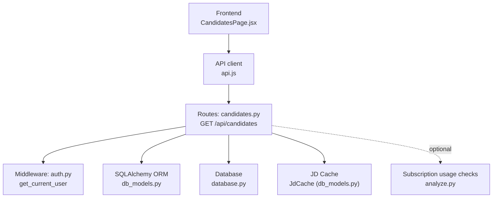
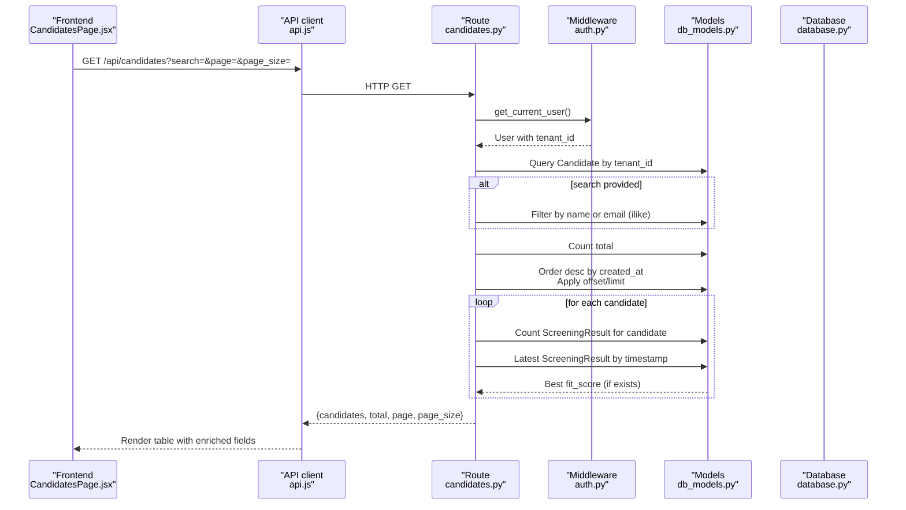
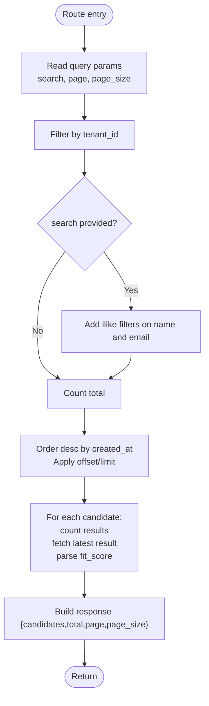
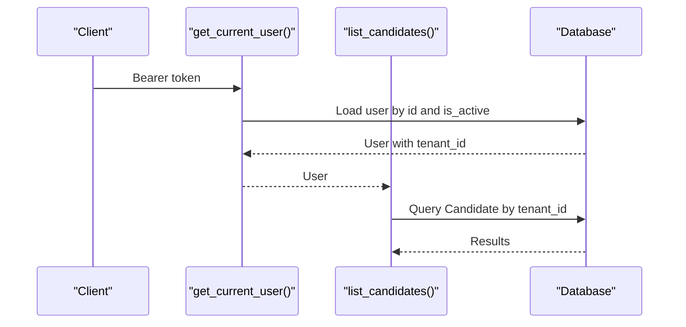
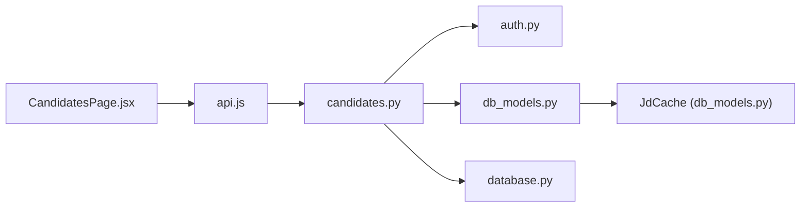

# Search and Filtering

<cite>
**Referenced Files in This Document**
- [candidates.py](file://app/backend/routes/candidates.py)
- [db_models.py](file://app/backend/models/db_models.py)
- [schemas.py](file://app/backend/models/schemas.py)
- [auth.py](file://app/backend/middleware/auth.py)
- [analyze.py](file://app/backend/routes/analyze.py)
- [001_enrich_candidates_add_caches.py](file://alembic/versions/001_enrich_candidates_add_caches.py)
- [003_subscription_system.py](file://alembic/versions/003_subscription_system.py)
- [CandidatesPage.jsx](file://app/frontend/src/pages/CandidatesPage.jsx)
- [api.js](file://app/frontend/src/lib/api.js)
- [database.py](file://app/backend/db/database.py)
- [requirements.txt](file://requirements.txt)
</cite>

## Table of Contents
1. [Introduction](#introduction)
2. [Project Structure](#project-structure)
3. [Core Components](#core-components)
4. [Architecture Overview](#architecture-overview)
5. [Detailed Component Analysis](#detailed-component-analysis)
6. [Dependency Analysis](#dependency-analysis)
7. [Performance Considerations](#performance-considerations)
8. [Troubleshooting Guide](#troubleshooting-guide)
9. [Conclusion](#conclusion)

## Introduction
This document explains the candidate search and filtering capabilities in Resume AI. It covers full-text search across names and emails, pagination, result ordering, enriched candidate fields returned in search results, tenant isolation, query optimization, ranking, caching, and performance tuning for large datasets. It also includes examples of complex search queries and filter combinations, and guidance on search result caching and optimization strategies.

## Project Structure
The search and filtering functionality spans backend routes, models, middleware, and migrations, with a simple frontend integration that passes search and pagination parameters to the backend.

**Diagram sources**
- [CandidatesPage.jsx:77-203](file://app/frontend/src/pages/CandidatesPage.jsx#L77-L203)
- [api.js:229-232](file://app/frontend/src/lib/api.js#L229-L232)
- [candidates.py:26-80](file://app/backend/routes/candidates.py#L26-L80)
- [auth.py:19-40](file://app/backend/middleware/auth.py#L19-L40)
- [db_models.py](file://app/backend/models/db_models.py)
- [database.py:27-33](file://app/backend/db/database.py#L27-L33)
- [analyze.py:323-352](file://app/backend/routes/analyze.py#L323-L352)

**Section sources**
- [candidates.py:26-80](file://app/backend/routes/candidates.py#L26-L80)
- [db_models.py](file://app/backend/models/db_models.py)
- [auth.py:19-40](file://app/backend/middleware/auth.py#L19-L40)
- [database.py:27-33](file://app/backend/db/database.py#L27-L33)
- [api.js:229-232](file://app/frontend/src/lib/api.js#L229-L232)
- [CandidatesPage.jsx:77-203](file://app/frontend/src/pages/CandidatesPage.jsx#L77-L203)

## Core Components
- Backend route for listing candidates with search, pagination, and ordering
- Tenant isolation enforced via user context
- Enriched candidate fields included in search results
- JD cache for query optimization
- Frontend integration passing search and pagination parameters

Key implementation highlights:
- Endpoint: GET /api/candidates with query parameters search, page, page_size
- Tenant isolation: filter by Candidate.tenant_id == current_user.tenant_id
- Full-text search: ilike match on Candidate.name and Candidate.email
- Pagination: offset/limit with page and page_size validated
- Ordering: descending by Candidate.created_at
- Enriched fields: current_role, total_years_exp, profile_quality; best_score derived from latest ScreeningResult
- Optional usage enforcement for analysis endpoints

**Section sources**
- [candidates.py:26-80](file://app/backend/routes/candidates.py#L26-L80)
- [db_models.py](file://app/backend/models/db_models.py)
- [schemas.py:89-125](file://app/backend/models/schemas.py#L89-L125)
- [analyze.py:323-352](file://app/backend/routes/analyze.py#L323-L352)

## Architecture Overview
The search flow integrates frontend, backend routes, middleware, and database models. The route enforces tenant isolation, applies full-text filters, paginates results, orders by creation time, enriches each candidate with best_score and profile metadata, and returns a structured response.

**Diagram sources**
- [CandidatesPage.jsx:85-96](file://app/frontend/src/pages/CandidatesPage.jsx#L85-L96)
- [api.js:229-232](file://app/frontend/src/lib/api.js#L229-L232)
- [candidates.py:26-80](file://app/backend/routes/candidates.py#L26-L80)
- [auth.py:19-40](file://app/backend/middleware/auth.py#L19-L40)
- [db_models.py](file://app/backend/models/db_models.py)
- [database.py:27-33](file://app/backend/db/database.py#L27-L33)

## Detailed Component Analysis

### Backend Route: GET /api/candidates
- Parameters:
  - search: optional substring to match name or email
  - page: integer ≥ 1
  - page_size: integer ≥ 1 and ≤ 100
- Tenant isolation:
  - Filters Candidate by tenant_id from current user
- Full-text search:
  - Case-insensitive ilike on name and email combined with OR
- Pagination and ordering:
  - Total computed via count()
  - Ordered by created_at descending
  - Paginated via offset and limit
- Enriched response fields per candidate:
  - id, name, email, phone, created_at
  - result_count: number of ScreeningResult entries
  - best_score: fit_score from latest ScreeningResult by timestamp
  - current_role, current_company, total_years_exp, profile_quality
- Response shape:
  - { candidates: [...], total, page, page_size }

**Diagram sources**
- [candidates.py:26-80](file://app/backend/routes/candidates.py#L26-L80)

**Section sources**
- [candidates.py:26-80](file://app/backend/routes/candidates.py#L26-L80)

### Tenant Isolation and Authentication
- Middleware get_current_user validates JWT and loads the active user
- Routes enforce tenant isolation by filtering Candidate.tenant_id
- Subscription usage checks are applied in analysis endpoints to prevent exceeding limits

**Diagram sources**
- [auth.py:19-40](file://app/backend/middleware/auth.py#L19-L40)
- [candidates.py:34](file://app/backend/routes/candidates.py#L34)

**Section sources**
- [auth.py:19-40](file://app/backend/middleware/auth.py#L19-L40)
- [candidates.py:31-34](file://app/backend/routes/candidates.py#L31-L34)

### Enriched Candidate Fields in Search Results
- Fields returned per candidate:
  - result_count: number of ScreeningResult records
  - best_score: fit_score from the most recent ScreeningResult
  - current_role, current_company, total_years_exp, profile_quality
- These fields are part of the enriched profile stored in Candidate rows

**Section sources**
- [candidates.py:49-80](file://app/backend/routes/candidates.py#L49-L80)
- [db_models.py:97-126](file://app/backend/models/db_models.py#L97-L126)

### Query Optimization and Caching
- Full-text search uses ilike on indexed columns (name, email). For large datasets, consider:
  - Adding composite indexes on (tenant_id, name) and (tenant_id, email)
  - Using database-specific full-text search extensions (e.g., PostgreSQL tsvector)
- ScreeningResult best_score retrieval:
  - One count() and one ordered fetch per candidate; for very large lists, consider batching or precomputing best scores
- JD cache:
  - Shared cache for job descriptions keyed by MD5 of first 2000 characters
  - Reduces repeated parsing cost across workers and requests

**Section sources**
- [candidates.py:51-63](file://app/backend/routes/candidates.py#L51-L63)
- [analyze.py:49-67](file://app/backend/routes/analyze.py#L49-L67)
- [001_enrich_candidates_add_caches.py:78-111](file://alembic/versions/001_enrich_candidates_add_caches.py#L78-L111)

### Ranking and Result Ordering
- Default ordering: descending by created_at
- No explicit ranking score is computed in the search route; best_score is retrieved from ScreeningResult
- To implement ranking by relevance or fit_score, extend the route to compute and sort by a composite score

**Section sources**
- [candidates.py:43](file://app/backend/routes/candidates.py#L43-L47)

### Frontend Integration
- The frontend calls GET /api/candidates with search, page, and page_size
- It renders a table with enriched fields including best_score and result_count
- Pagination controls update page and refetch data

**Section sources**
- [api.js:229-232](file://app/frontend/src/lib/api.js#L229-L232)
- [CandidatesPage.jsx:85-96](file://app/frontend/src/pages/CandidatesPage.jsx#L85-L96)
- [CandidatesPage.jsx:176-196](file://app/frontend/src/pages/CandidatesPage.jsx#L176-L196)

## Dependency Analysis
- Route depends on:
  - Middleware for user and tenant context
  - SQLAlchemy models for Candidate and ScreeningResult
  - Database session factory
- Models define:
  - Candidate with tenant foreign key and enriched profile fields
  - ScreeningResult linked to Candidate and Tenant
  - JdCache for shared JD parsing results
- Frontend depends on API client to call the route

**Diagram sources**
- [CandidatesPage.jsx:77-203](file://app/frontend/src/pages/CandidatesPage.jsx#L77-L203)
- [api.js:229-232](file://app/frontend/src/lib/api.js#L229-L232)
- [candidates.py:26-80](file://app/backend/routes/candidates.py#L26-L80)
- [auth.py:19-40](file://app/backend/middleware/auth.py#L19-L40)
- [db_models.py](file://app/backend/models/db_models.py)
- [database.py:27-33](file://app/backend/db/database.py#L27-L33)

**Section sources**
- [candidates.py:26-80](file://app/backend/routes/candidates.py#L26-L80)
- [db_models.py](file://app/backend/models/db_models.py)
- [auth.py:19-40](file://app/backend/middleware/auth.py#L19-L40)
- [database.py:27-33](file://app/backend/db/database.py#L27-L33)
- [api.js:229-232](file://app/frontend/src/lib/api.js#L229-L232)
- [CandidatesPage.jsx:77-203](file://app/frontend/src/pages/CandidatesPage.jsx#L77-L203)

## Performance Considerations
- Indexing:
  - Candidate.email is indexed; consider adding indexes on (tenant_id, email) and (tenant_id, name)
  - Composite indexes can improve tenant-scoped search performance
- Query patterns:
  - Current query filters by tenant_id and optionally applies ilike filters; keep tenant_id in WHERE clause
  - For large page_size, consider increasing page_size gradually and using server-side sorting only on necessary columns
- Caching:
  - Use the existing JdCache to avoid repeated JD parsing
  - Consider caching frequent search queries with small page_size for static datasets
- Concurrency:
  - ScreeningResult best_score retrieval executes per candidate; consider pre-aggregating best scores or using window functions
- Storage:
  - Enriched profile fields are persisted in Candidate; ensure appropriate indexing on frequently filtered columns

[No sources needed since this section provides general guidance]

## Troubleshooting Guide
- 401 Unauthorized:
  - Ensure a valid Bearer token is attached to requests
- 403 Forbidden:
  - Verify the user has the correct role and belongs to the expected tenant
- Empty results despite existing data:
  - Confirm search term length and tenant_id filtering
  - Verify Candidate.email and Candidate.name are populated
- Unexpected pagination counts:
  - Check page and page_size bounds and ensure consistent page numbering
- Slow search performance:
  - Add database indexes on tenant_id and name/email
  - Reduce page_size or implement server-side aggregation for best_score

**Section sources**
- [auth.py:23-40](file://app/backend/middleware/auth.py#L23-L40)
- [candidates.py:34-47](file://app/backend/routes/candidates.py#L34-L47)

## Conclusion
Resume AI’s candidate search provides tenant-isolated, full-text search across names and emails with pagination and ordering by creation time. Enriched candidate fields are included in results, and best_score is derived from the latest screening result. The system leverages a shared JD cache for optimization and supports frontend-driven pagination. For large-scale deployments, consider adding composite indexes, optimizing per-candidate best_score retrieval, and implementing additional caching strategies.