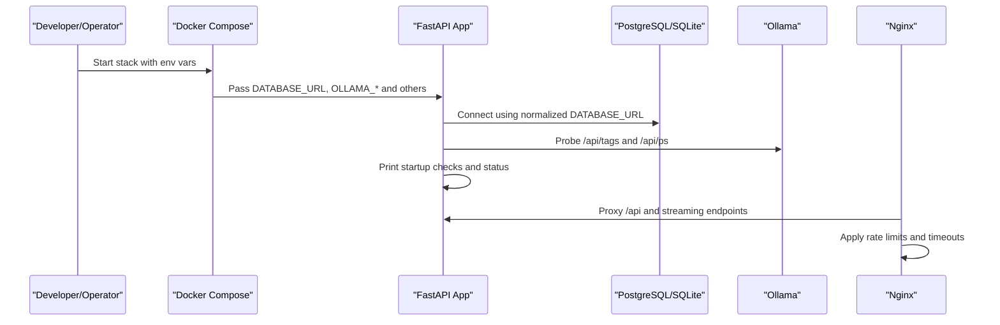
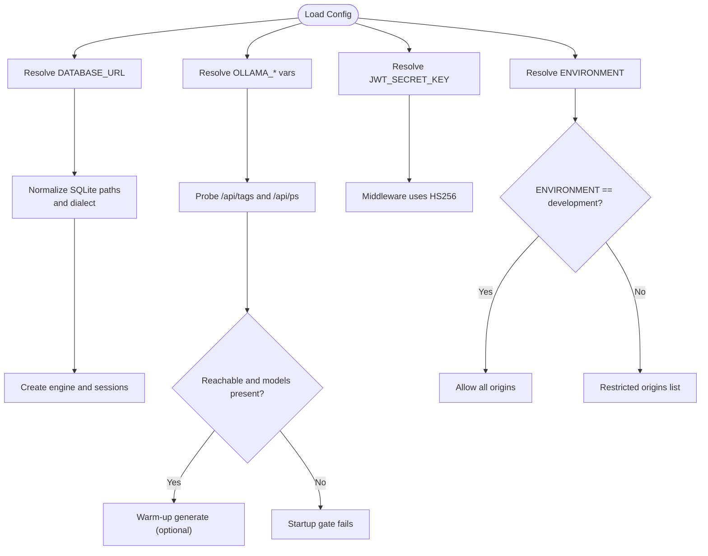
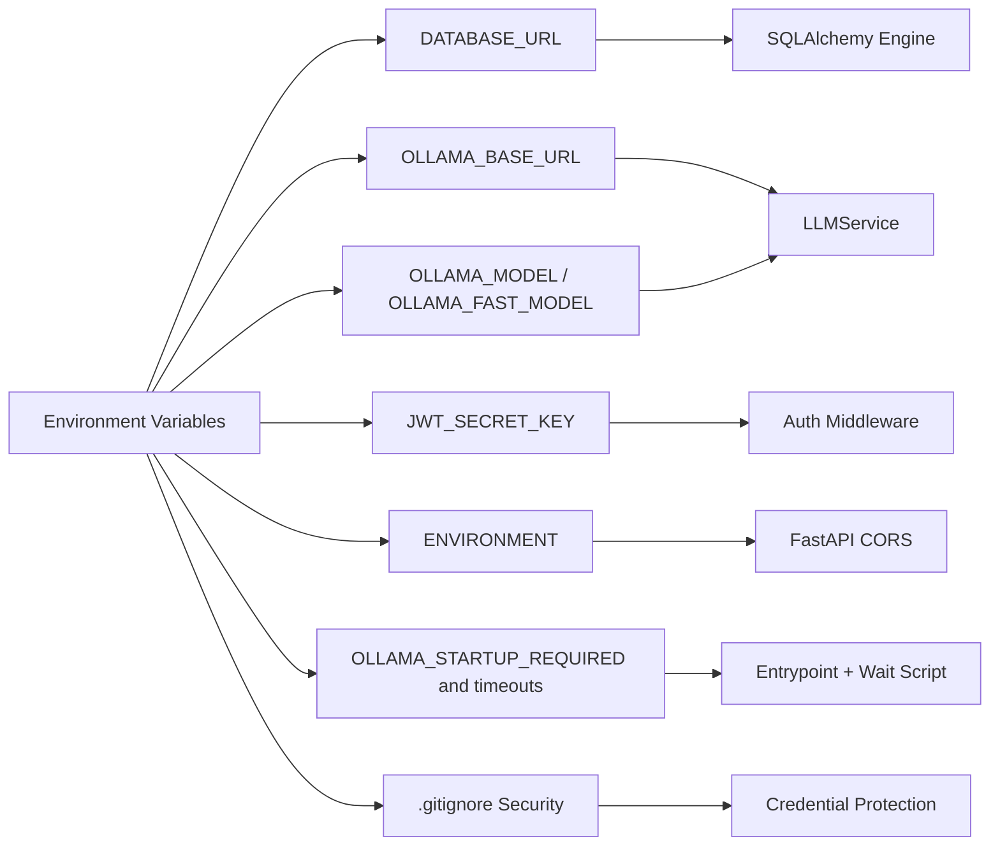

# Configuration Management

<cite>
**Referenced Files in This Document**
- [.gitignore](file://.gitignore)
- [main.py](file://app/backend/main.py)
- [database.py](file://app/backend/db/database.py)
- [llm_service.py](file://app/backend/services/llm_service.py)
- [docker-compose.yml](file://docker-compose.yml)
- [docker-compose.prod.yml](file://docker-compose.prod.yml)
- [wait_for_ollama.py](file://app/backend/scripts/wait_for_ollama.py)
- [docker-entrypoint.sh](file://app/backend/scripts/docker-entrypoint.sh)
- [auth.py](file://app/backend/middleware/auth.py)
- [nginx.conf](file://app/nginx/nginx.conf)
- [nginx.prod.conf](file://app/nginx/nginx.prod.conf)
- [vite.config.js](file://app/frontend/vite.config.js)
- [api.js](file://app/frontend/src/lib/api.js)
</cite>

## Update Summary
**Changes Made**
- Added new section on Environment Variable Security and Best Practices
- Updated .gitignore management section to reflect improved environment variable protection
- Enhanced security considerations for sensitive credential handling
- Added guidance for managing environment variable templates and examples

## Table of Contents
1. [Introduction](#introduction)
2. [Project Structure](#project-structure)
3. [Core Components](#core-components)
4. [Architecture Overview](#architecture-overview)
5. [Detailed Component Analysis](#detailed-component-analysis)
6. [Dependency Analysis](#dependency-analysis)
7. [Performance Considerations](#performance-considerations)
8. [Troubleshooting Guide](#troubleshooting-guide)
9. [Conclusion](#conclusion)
10. [Appendices](#appendices)

## Introduction
This document explains how Resume AI by ThetaLogics manages configuration across environments. It covers environment variables, database settings, AI model parameters, CORS, security, and performance tuning. It also documents configuration loading mechanisms, validation, defaults, and environment-specific overrides for development, staging, and production. Guidance is included for customizing configuration and extending options safely.

**Updated** Enhanced security practices for environment variable management and credential protection.

## Project Structure
Configuration spans multiple layers:
- Backend FastAPI application reads environment variables for database, AI model endpoints, CORS, and security.
- Docker Compose defines environment variables for services and orchestration.
- Nginx proxies and rate-limits traffic and sets timeouts aligned with backend behavior.
- Frontend uses Vite's proxy and environment variables to route API calls.
- Alembic migrations are applied automatically when using PostgreSQL.

```mermaid
graph TB
subgraph "Docker Orchestration"
DC["docker-compose.yml"]
DCP["docker-compose.prod.yml"]
end
subgraph "Backend"
MAIN["app/backend/main.py"]
DB["app/backend/db/database.py"]
LLM["app/backend/services/llm_service.py"]
AUTH["app/backend/middleware/auth.py"]
ENTRY["app/backend/scripts/docker-entrypoint.sh"]
WAIT["app/backend/scripts/wait_for_ollama.py"]
end
subgraph "Nginx"
NGINXDEV["app/nginx/nginx.conf"]
NGINXPROD["app/nginx/nginx.prod.conf"]
end
subgraph "Frontend"
VITE["app/frontend/vite.config.js"]
APIJS["app/frontend/src/lib/api.js"]
end
subgraph "Security"
GITIGNORE[".gitignore"]
END
DC --> MAIN
DCP --> MAIN
DC --> DB
DCP --> DB
MAIN --> DB
MAIN --> LLM
MAIN --> AUTH
MAIN --> NGINXDEV
MAIN --> NGINXPROD
ENTRY --> WAIT
VITE --> APIJS
APIJS --> MAIN
GITIGNORE --> END
```

**Diagram sources**
- [docker-compose.yml:1-102](file://docker-compose.yml#L1-L102)
- [docker-compose.prod.yml:1-231](file://docker-compose.prod.yml#L1-L231)
- [main.py:1-331](file://app/backend/main.py#L1-L331)
- [database.py:1-33](file://app/backend/db/database.py#L1-L33)
- [llm_service.py:1-156](file://app/backend/services/llm_service.py#L1-L156)
- [auth.py:1-47](file://app/backend/middleware/auth.py#L1-L47)
- [docker-entrypoint.sh:1-20](file://app/backend/scripts/docker-entrypoint.sh#L1-L20)
- [wait_for_ollama.py:1-96](file://app/backend/scripts/wait_for_ollama.py#L1-L96)
- [nginx.conf:1-37](file://app/nginx/nginx.conf#L1-L37)
- [nginx.prod.conf:1-103](file://app/nginx/nginx.prod.conf#L1-L103)
- [vite.config.js:1-26](file://app/frontend/vite.config.js#L1-L26)
- [api.js:1-395](file://app/frontend/src/lib/api.js#L1-L395)
- [.gitignore:1-41](file://.gitignore#L1-L41)

**Section sources**
- [docker-compose.yml:1-102](file://docker-compose.yml#L1-L102)
- [docker-compose.prod.yml:1-231](file://docker-compose.prod.yml#L1-L231)
- [main.py:1-331](file://app/backend/main.py#L1-L331)
- [database.py:1-33](file://app/backend/db/database.py#L1-L33)
- [llm_service.py:1-156](file://app/backend/services/llm_service.py#L1-L156)
- [auth.py:1-47](file://app/backend/middleware/auth.py#L1-L47)
- [docker-entrypoint.sh:1-20](file://app/backend/scripts/docker-entrypoint.sh#L1-L20)
- [wait_for_ollama.py:1-96](file://app/backend/scripts/wait_for_ollama.py#L1-L96)
- [nginx.conf:1-37](file://app/nginx/nginx.conf#L1-L37)
- [nginx.prod.conf:1-103](file://app/nginx/nginx.prod.conf#L1-L103)
- [vite.config.js:1-26](file://app/frontend/vite.config.js#L1-L26)
- [api.js:1-395](file://app/frontend/src/lib/api.js#L1-L395)
- [.gitignore:1-41](file://.gitignore#L1-L41)

## Core Components
- Environment variables are read via the standard environment interface and used to configure:
  - Database URL and dialect selection
  - Ollama base URL and model names
  - Security keys and algorithms
  - CORS origin policy
  - Application environment mode
  - Startup gating for Ollama readiness
  - Rate-limiting and timeouts for Nginx
  - Frontend proxy and API base URL

Key defaults and behaviors:
- Database URL defaults to an SQLite file path when not set; normalized to a proper SQLite URI when local; PostgreSQL URLs are supported as-is.
- Ollama base URL defaults to a local address; model names default to specific tags when unset.
- JWT secret key defaults are provided for development; production requires explicit secrets.
- CORS allows all origins in development mode; restricted origins otherwise.
- Nginx applies rate limits and disables buffering for SSE streaming endpoints.

**Section sources**
- [main.py:68-149](file://app/backend/main.py#L68-L149)
- [main.py:181-198](file://app/backend/main.py#L181-L198)
- [main.py:228-259](file://app/backend/main.py#L228-L259)
- [main.py:262-326](file://app/backend/main.py#L262-L326)
- [database.py:5-24](file://app/backend/db/database.py#L5-L24)
- [llm_service.py:8-11](file://app/backend/services/llm_service.py#L8-L11)
- [auth.py:13-14](file://app/backend/middleware/auth.py#L13-L14)
- [nginx.prod.conf:9-103](file://app/nginx/nginx.prod.conf#L9-L103)
- [vite.config.js:6-15](file://app/frontend/vite.config.js#L6-L15)
- [api.js:3-7](file://app/frontend/src/lib/api.js#L3-L7)

## Architecture Overview
Configuration flows from environment variables into runtime components. The backend validates connectivity to dependent services at startup and exposes diagnostics. Nginx enforces rate limits and streaming behavior. Docker Compose orchestrates environment-specific settings across services.



**Diagram sources**
- [docker-compose.yml:52-75](file://docker-compose.yml#L52-L75)
- [docker-compose.prod.yml:75-112](file://docker-compose.prod.yml#L75-L112)
- [main.py:68-149](file://app/backend/main.py#L68-L149)
- [main.py:228-259](file://app/backend/main.py#L228-L259)
- [main.py:262-326](file://app/backend/main.py#L262-L326)
- [nginx.prod.conf:50-95](file://app/nginx/nginx.prod.conf#L50-L95)

## Detailed Component Analysis

### Environment Variables and Defaults
- Database
  - Name: DATABASE_URL
  - Default: local SQLite file path
  - Behavior: Normalized to sqlite:/// for local paths; PostgreSQL URLs preserved; SQLite uses thread checks; PostgreSQL uses standard driver
  - References:
    - [database.py:5-24](file://app/backend/db/database.py#L5-L24)
    - [docker-compose.yml](file://docker-compose.yml#L65)
    - [docker-compose.prod.yml](file://docker-compose.prod.yml#L83)

- AI Model and Ollama
  - Names: OLLAMA_BASE_URL, OLLAMA_MODEL, OLLAMA_FAST_MODEL
  - Defaults: local base URL and a specific model tag
  - References:
    - [main.py:105-106](file://app/backend/main.py#L105-L106)
    - [main.py:271-273](file://app/backend/main.py#L271-L273)
    - [llm_service.py:9-10](file://app/backend/services/llm_service.py#L9-L10)
    - [docker-compose.yml:60-63](file://docker-compose.yml#L60-L63)
    - [docker-compose.prod.yml:82-91](file://docker-compose.prod.yml#L82-L91)

- Security
  - Name: JWT_SECRET_KEY
  - Default: development key
  - Algorithm: HS256
  - References:
    - [auth.py:13-14](file://app/backend/middleware/auth.py#L13-L14)
    - [docker-compose.yml](file://docker-compose.yml#L66)
    - [docker-compose.prod.yml](file://docker-compose.prod.yml#L84)

- Environment Mode
  - Name: ENVIRONMENT
  - Values: development, staging, production
  - Effects: CORS origin policy and startup behavior
  - References:
    - [main.py](file://app/backend/main.py#L146)
    - [main.py:189-190](file://app/backend/main.py#L189-L190)
    - [docker-compose.yml](file://docker-compose.yml#L67)
    - [docker-compose.prod.yml](file://docker-compose.prod.yml#L85)

- Ollama Startup Gate
  - Names: OLLAMA_STARTUP_REQUIRED, OLLAMA_POLL_INTERVAL_SEC, OLLAMA_WAIT_TIMEOUT_SEC, OLLAMA_WARMUP_TIMEOUT_SEC
  - Purpose: Block startup until Ollama is reachable, model is pulled, and a warm-up generation completes
  - References:
    - [wait_for_ollama.py:18-43](file://app/backend/scripts/wait_for_ollama.py#L18-L43)
    - [docker-entrypoint.sh:16-18](file://app/backend/scripts/docker-entrypoint.sh#L16-L18)
    - [docker-compose.yml](file://docker-compose.yml#L69)
    - [docker-compose.prod.yml](file://docker-compose.prod.yml#L95)

- Frontend API Base
  - Name: VITE_API_URL
  - Default: /api
  - Proxy: Vite dev server forwards /api to backend
  - References:
    - [api.js](file://app/frontend/src/lib/api.js#L3)
    - [vite.config.js:9-14](file://app/frontend/vite.config.js#L9-L14)

**Section sources**
- [database.py:5-24](file://app/backend/db/database.py#L5-L24)
- [main.py:105-106](file://app/backend/main.py#L105-L106)
- [main.py](file://app/backend/main.py#L146)
- [main.py:189-190](file://app/backend/main.py#L189-L190)
- [main.py:271-273](file://app/backend/main.py#L271-L273)
- [llm_service.py:9-10](file://app/backend/services/llm_service.py#L9-L10)
- [auth.py:13-14](file://app/backend/middleware/auth.py#L13-L14)
- [wait_for_ollama.py:18-43](file://app/backend/scripts/wait_for_ollama.py#L18-L43)
- [docker-entrypoint.sh:16-18](file://app/backend/scripts/docker-entrypoint.sh#L16-L18)
- [docker-compose.yml:59-69](file://docker-compose.yml#L59-L69)
- [docker-compose.prod.yml:82-95](file://docker-compose.prod.yml#L82-L95)
- [vite.config.js:9-14](file://app/frontend/vite.config.js#L9-L14)
- [api.js](file://app/frontend/src/lib/api.js#L3)

### Configuration Loading Mechanisms
- Backend FastAPI
  - Reads environment variables at import-time for CORS, database, and LLM settings.
  - Startup checks probe database and Ollama health and print a consolidated status.
  - Health endpoint validates database and Ollama connectivity.
  - Diagnostics endpoint reports model availability and RAM status.
  - References:
    - [main.py:68-149](file://app/backend/main.py#L68-L149)
    - [main.py:228-259](file://app/backend/main.py#L228-L259)
    - [main.py:262-326](file://app/backend/main.py#L262-L326)

- Database Engine
  - Loads DATABASE_URL and normalizes SQLite paths; selects driver and connection args accordingly.
  - References:
    - [database.py:5-24](file://app/backend/db/database.py#L5-L24)

- LLM Service
  - Loads OLLAMA_BASE_URL and model names; constructs prompts and parses JSON responses with fallbacks.
  - References:
    - [llm_service.py:8-11](file://app/backend/services/llm_service.py#L8-L11)
    - [llm_service.py:43-57](file://app/backend/services/llm_service.py#L43-L57)

- Authentication Middleware
  - Loads JWT_SECRET_KEY and uses HS256 algorithm for token verification.
  - References:
    - [auth.py:13-14](file://app/backend/middleware/auth.py#L13-L14)

- Docker Entrypoint and Ollama Gate
  - Applies Alembic migrations for PostgreSQL and optionally waits for Ollama readiness before launching Uvicorn.
  - References:
    - [docker-entrypoint.sh:5-14](file://app/backend/scripts/docker-entrypoint.sh#L5-L14)
    - [wait_for_ollama.py:34-91](file://app/backend/scripts/wait_for_ollama.py#L34-L91)

**Section sources**
- [main.py:68-149](file://app/backend/main.py#L68-L149)
- [main.py:228-259](file://app/backend/main.py#L228-L259)
- [main.py:262-326](file://app/backend/main.py#L262-L326)
- [database.py:5-24](file://app/backend/db/database.py#L5-L24)
- [llm_service.py:8-11](file://app/backend/services/llm_service.py#L8-L11)
- [auth.py:13-14](file://app/backend/middleware/auth.py#L13-L14)
- [docker-entrypoint.sh:5-14](file://app/backend/scripts/docker-entrypoint.sh#L5-L14)
- [wait_for_ollama.py:34-91](file://app/backend/scripts/wait_for_ollama.py#L34-L91)

### Validation and Default Handling
- Database URL normalization ensures correct dialect and path semantics; SQLite thread checks and PostgreSQL driver compatibility are handled automatically.
- LLM response parsing attempts multiple strategies to extract JSON; invalid or missing JSON triggers a controlled fallback response.
- CORS origin list is dynamically adjusted by ENVIRONMENT; development mode allows all origins.
- Health and diagnostics endpoints return degraded status without raising exceptions, enabling upstream load balancers to continue routing traffic.
- Ollama readiness gate validates model presence and warm-up completion; failures are surfaced to logs and exit codes.



**Diagram sources**
- [database.py:5-24](file://app/backend/db/database.py#L5-L24)
- [llm_service.py:84-136](file://app/backend/services/llm_service.py#L84-L136)
- [main.py:189-190](file://app/backend/main.py#L189-L190)
- [main.py:105-143](file://app/backend/main.py#L105-L143)
- [wait_for_ollama.py:34-91](file://app/backend/scripts/wait_for_ollama.py#L34-L91)
- [auth.py:13-14](file://app/backend/middleware/auth.py#L13-L14)

**Section sources**
- [database.py:5-24](file://app/backend/db/database.py#L5-L24)
- [llm_service.py:84-136](file://app/backend/services/llm_service.py#L84-L136)
- [main.py:189-190](file://app/backend/main.py#L189-L190)
- [main.py:105-143](file://app/backend/main.py#L105-L143)
- [wait_for_ollama.py:34-91](file://app/backend/scripts/wait_for_ollama.py#L34-L91)
- [auth.py:13-14](file://app/backend/middleware/auth.py#L13-L14)

### AI Model Setup and LLM Service Parameters
- Model selection
  - Target model: OLLAMA_MODEL
  - Fast model: OLLAMA_FAST_MODEL
  - Base URL: OLLAMA_BASE_URL
- LLM service behavior
  - Timeout for HTTP client is set for long-running calls.
  - Prompt truncation improves performance for long inputs.
  - JSON parsing includes multiple fallbacks; validation normalizes outputs.
  - Retry logic with a controlled fallback response.
- References:
  - [main.py:271-273](file://app/backend/main.py#L271-L273)
  - [llm_service.py:9-11](file://app/backend/services/llm_service.py#L9-L11)
  - [llm_service.py:53-57](file://app/backend/services/llm_service.py#L53-L57)
  - [llm_service.py:68-82](file://app/backend/services/llm_service.py#L68-L82)
  - [llm_service.py:84-136](file://app/backend/services/llm_service.py#L84-L136)

**Section sources**
- [main.py:271-273](file://app/backend/main.py#L271-L273)
- [llm_service.py:9-11](file://app/backend/services/llm_service.py#L9-L11)
- [llm_service.py:53-57](file://app/backend/services/llm_service.py#L53-L57)
- [llm_service.py:68-82](file://app/backend/services/llm_service.py#L68-L82)
- [llm_service.py:84-136](file://app/backend/services/llm_service.py#L84-L136)

### Security Settings and CORS
- CORS
  - Origins list includes development wildcard when ENVIRONMENT is set to development.
  - Production/staging restrict origins to specific domains.
- JWT
  - Secret key is loaded from environment; HS256 algorithm is used.
  - Token verification occurs in middleware; missing or invalid tokens cause 401/403 responses.
- References:
  - [main.py:181-198](file://app/backend/main.py#L181-L198)
  - [main.py:189-190](file://app/backend/main.py#L189-L190)
  - [auth.py:13-14](file://app/backend/middleware/auth.py#L13-L14)
  - [auth.py:23-40](file://app/backend/middleware/auth.py#L23-L40)

**Section sources**
- [main.py:181-198](file://app/backend/main.py#L181-L198)
- [main.py:189-190](file://app/backend/main.py#L189-L190)
- [auth.py:13-14](file://app/backend/middleware/auth.py#L13-L14)
- [auth.py:23-40](file://app/backend/middleware/auth.py#L23-L40)

### Performance Tuning Options
- Backend workers and timeouts
  - Production uses multiple workers to handle I/O-bound tasks efficiently.
  - LLM narrative timeout is configurable to accommodate cold-starts and resource contention.
- Ollama tuning
  - Parallelism, maximum loaded models, flash attention, and KV cache quantization are tuned per environment.
- Nginx tuning
  - Rate limiting zones, timeouts, and streaming buffering are configured to support SSE and long-running requests.
- References:
  - [docker-compose.prod.yml](file://docker-compose.prod.yml#L80)
  - [docker-compose.prod.yml](file://docker-compose.prod.yml#L93)
  - [docker-compose.yml:34-41](file://docker-compose.yml#L34-L41)
  - [docker-compose.prod.yml:45-55](file://docker-compose.prod.yml#L45-L55)
  - [nginx.prod.conf:9-103](file://app/nginx/nginx.prod.conf#L9-L103)

**Section sources**
- [docker-compose.prod.yml](file://docker-compose.prod.yml#L80)
- [docker-compose.prod.yml](file://docker-compose.prod.yml#L93)
- [docker-compose.yml:34-41](file://docker-compose.yml#L34-L41)
- [docker-compose.prod.yml:45-55](file://docker-compose.prod.yml#L45-L55)
- [nginx.prod.conf:9-103](file://app/nginx/nginx.prod.conf#L9-L103)

### Deployment Environments and Overrides
- Development
  - Local Docker Compose sets development environment, local Ollama base URL, and fast models.
  - CORS allows all origins for local UI development.
  - OLLAMA_STARTUP_REQUIRED is enabled by default with sensible timeouts.
  - References:
    - [docker-compose.yml](file://docker-compose.yml#L67)
    - [docker-compose.yml:60-69](file://docker-compose.yml#L60-L69)
    - [main.py:189-190](file://app/backend/main.py#L189-L190)
    - [wait_for_ollama.py:34-43](file://app/backend/scripts/wait_for_ollama.py#L34-L43)

- Staging
  - Uses production images and configuration with staging domain and SSL.
  - Nginx enforces rate limits and streaming buffering for SSE.
  - References:
    - [docker-compose.prod.yml:126-145](file://docker-compose.prod.yml#L126-L145)
    - [nginx.prod.conf:13-24](file://app/nginx/nginx.prod.conf#L13-L24)
    - [nginx.prod.conf:26-101](file://app/nginx/nginx.prod.conf#L26-L101)

- Production
  - PostgreSQL tuning, worker counts, and strict CORS are applied.
  - Ollama warmup service ensures models are loaded into RAM before serving.
  - References:
    - [docker-compose.prod.yml:11-22](file://docker-compose.prod.yml#L11-L22)
    - [docker-compose.prod.yml:151-184](file://docker-compose.prod.yml#L151-L184)
    - [docker-compose.prod.yml:82-95](file://docker-compose.prod.yml#L82-L95)

**Section sources**
- [docker-compose.yml](file://docker-compose.yml#L67)
- [docker-compose.yml:60-69](file://docker-compose.yml#L60-L69)
- [main.py:189-190](file://app/backend/main.py#L189-L190)
- [wait_for_ollama.py:34-43](file://app/backend/scripts/wait_for_ollama.py#L34-L43)
- [docker-compose.prod.yml:126-145](file://docker-compose.prod.yml#L126-L145)
- [nginx.prod.conf:13-24](file://app/nginx/nginx.prod.conf#L13-L24)
- [nginx.prod.conf:26-101](file://app/nginx/nginx.prod.conf#L26-L101)
- [docker-compose.prod.yml:11-22](file://docker-compose.prod.yml#L11-L22)
- [docker-compose.prod.yml:151-184](file://docker-compose.prod.yml#L151-L184)
- [docker-compose.prod.yml:82-95](file://docker-compose.prod.yml#L82-L95)

### Environment Variable Security and Best Practices

**Updated** Enhanced security practices for environment variable management and credential protection.

#### .gitignore Management for Sensitive Credentials
The project implements robust protection against accidental credential exposure through its .gitignore configuration:

- **Pattern-based exclusion**: The `.env` pattern excludes all environment files by default
- **Template preservation**: The `!.env.example` pattern explicitly preserves example templates
- **Comprehensive coverage**: Excludes various environment file extensions (.env.*, .env.local, etc.)
- **Development safety**: Prevents committing sensitive credentials while maintaining template tracking

#### Environment Variable Template Management
- **Template files**: Maintain `.env.example` files with placeholder values for all required environment variables
- **Documentation**: Include explanatory comments in template files describing each variable's purpose and acceptable values
- **Version control**: Commit template files but never actual credential files
- **Validation**: Use template files as the authoritative source for required environment variables

#### Credential Security Guidelines
- **Never commit secrets**: All actual credential files are excluded by .gitignore patterns
- **Use environment-specific files**: Store actual credentials in separate files not tracked by version control
- **Template validation**: Regularly validate that template files contain all required variables
- **Access control**: Limit access to actual credential files to authorized personnel only

#### Production Security Considerations
- **Secret rotation**: Implement regular rotation of JWT_SECRET_KEY and other critical credentials
- **Environment isolation**: Use separate environment files for development, staging, and production
- **Audit trails**: Monitor access to environment variable configurations
- **Least privilege**: Apply minimal permissions to environment variable files

**Section sources**
- [.gitignore:1-41](file://.gitignore#L1-L41)
- [docker-compose.yml:60-69](file://docker-compose.yml#L60-L69)
- [docker-compose.prod.yml:82-95](file://docker-compose.prod.yml#L82-L95)

### Examples and Extending Configuration
- Customize database for production
  - Set DATABASE_URL to a PostgreSQL connection string; Alembic migrations are applied automatically on startup.
  - References:
    - [database.py:5-24](file://app/backend/db/database.py#L5-L24)
    - [docker-entrypoint.sh:5-14](file://app/backend/scripts/docker-entrypoint.sh#L5-L14)
    - [docker-compose.prod.yml](file://docker-compose.prod.yml#L83)

- Switch AI models
  - Change OLLAMA_MODEL and OLLAMA_FAST_MODEL to tune accuracy and speed; ensure models are pulled and warmed in production.
  - References:
    - [main.py:271-273](file://app/backend/main.py#L271-L273)
    - [docker-compose.prod.yml:90-91](file://docker-compose.prod.yml#L90-L91)
    - [docker-compose.prod.yml:170-171](file://docker-compose.prod.yml#L170-L171)

- Adjust CORS for enterprise domains
  - Modify origins list in the backend or set ENVIRONMENT appropriately; ensure domain alignment with frontend.
  - References:
    - [main.py:181-198](file://app/backend/main.py#L181-L198)
    - [main.py:189-190](file://app/backend/main.py#L189-L190)

- Tune Nginx for scale
  - Increase rate limits, timeouts, and streaming buffer settings for SSE in production.
  - References:
    - [nginx.prod.conf:9-103](file://app/nginx/nginx.prod.conf#L9-L103)

- Extend configuration options
  - Add new environment variables in the backend where they are consumed (e.g., database, LLM, security).
  - Define defaults and validation logic close to usage sites to prevent drift.
  - References:
    - [database.py:5-24](file://app/backend/db/database.py#L5-L24)
    - [llm_service.py:8-11](file://app/backend/services/llm_service.py#L8-L11)
    - [auth.py:13-14](file://app/backend/middleware/auth.py#L13-L14)

**Section sources**
- [database.py:5-24](file://app/backend/db/database.py#L5-L24)
- [docker-entrypoint.sh:5-14](file://app/backend/scripts/docker-entrypoint.sh#L5-L14)
- [docker-compose.prod.yml](file://docker-compose.prod.yml#L83)
- [main.py:271-273](file://app/backend/main.py#L271-L273)
- [docker-compose.prod.yml:90-91](file://docker-compose.prod.yml#L90-L91)
- [docker-compose.prod.yml:170-171](file://docker-compose.prod.yml#L170-L171)
- [main.py:181-198](file://app/backend/main.py#L181-L198)
- [main.py:189-190](file://app/backend/main.py#L189-L190)
- [nginx.prod.conf:9-103](file://app/nginx/nginx.prod.conf#L9-L103)
- [auth.py:13-14](file://app/backend/middleware/auth.py#L13-L14)

## Dependency Analysis
Configuration dependencies across components:



**Diagram sources**
- [database.py:5-24](file://app/backend/db/database.py#L5-L24)
- [llm_service.py:8-11](file://app/backend/services/llm_service.py#L8-L11)
- [auth.py:13-14](file://app/backend/middleware/auth.py#L13-L14)
- [main.py:181-198](file://app/backend/main.py#L181-L198)
- [wait_for_ollama.py:18-43](file://app/backend/scripts/wait_for_ollama.py#L18-L43)
- [docker-entrypoint.sh:16-18](file://app/backend/scripts/docker-entrypoint.sh#L16-L18)
- [.gitignore:1-41](file://.gitignore#L1-L41)

**Section sources**
- [database.py:5-24](file://app/backend/db/database.py#L5-L24)
- [llm_service.py:8-11](file://app/backend/services/llm_service.py#L8-L11)
- [auth.py:13-14](file://app/backend/middleware/auth.py#L13-L14)
- [main.py:181-198](file://app/backend/main.py#L181-L198)
- [wait_for_ollama.py:18-43](file://app/backend/scripts/wait_for_ollama.py#L18-L43)
- [docker-entrypoint.sh:16-18](file://app/backend/scripts/docker-entrypoint.sh#L16-L18)
- [.gitignore:1-41](file://.gitignore#L1-L41)

## Performance Considerations
- Database
  - PostgreSQL tuning parameters are set in production; ensure adequate memory and connections for expected concurrency.
- LLM
  - Use appropriate model sizes and warm-up strategies; adjust timeouts to avoid false "offline" states under contention.
- Nginx
  - Disable buffering for SSE endpoints; configure timeouts and rate limits to match backend capabilities.
- References:
  - [docker-compose.prod.yml:11-22](file://docker-compose.prod.yml#L11-L22)
  - [docker-compose.prod.yml](file://docker-compose.prod.yml#L93)
  - [nginx.prod.conf:66-95](file://app/nginx/nginx.prod.conf#L66-L95)

## Troubleshooting Guide
Common configuration issues and resolutions:
- Database connectivity
  - Verify DATABASE_URL format and accessibility; check normalization for SQLite paths.
  - References:
    - [database.py:5-24](file://app/backend/db/database.py#L5-L24)

- Ollama unreachability or cold models
  - Confirm OLLAMA_BASE_URL and model tags; ensure models are pulled and warmed; use diagnostics endpoint to inspect status.
  - References:
    - [main.py:105-143](file://app/backend/main.py#L105-L143)
    - [main.py:262-326](file://app/backend/main.py#L262-L326)
    - [wait_for_ollama.py:34-91](file://app/backend/scripts/wait_for_ollama.py#L34-L91)

- JWT errors
  - Ensure JWT_SECRET_KEY is set and consistent across deployments; verify token issuance and expiration.
  - References:
    - [auth.py:13-14](file://app/backend/middleware/auth.py#L13-L14)
    - [auth.py:23-40](file://app/backend/middleware/auth.py#L23-L40)

- CORS failures
  - Align ENVIRONMENT and origins with frontend domain; confirm wildcard allowance in development.
  - References:
    - [main.py:181-198](file://app/backend/main.py#L181-L198)
    - [main.py:189-190](file://app/backend/main.py#L189-L190)

- Nginx streaming issues
  - Ensure SSE buffering is disabled and timeouts are increased for long pipelines.
  - References:
    - [nginx.prod.conf:66-95](file://app/nginx/nginx.prod.conf#L66-L95)

- Environment variable security issues
  - Verify .gitignore patterns are correctly excluding credential files while preserving templates
  - Check that actual credential files are not committed to version control
  - References:
    - [.gitignore:1-41](file://.gitignore#L1-L41)
    - [docker-compose.yml:60-69](file://docker-compose.yml#L60-L69)
    - [docker-compose.prod.yml:82-95](file://docker-compose.prod.yml#L82-L95)

**Section sources**
- [database.py:5-24](file://app/backend/db/database.py#L5-L24)
- [main.py:105-143](file://app/backend/main.py#L105-L143)
- [main.py:262-326](file://app/backend/main.py#L262-L326)
- [wait_for_ollama.py:34-91](file://app/backend/scripts/wait_for_ollama.py#L34-L91)
- [auth.py:13-14](file://app/backend/middleware/auth.py#L13-L14)
- [auth.py:23-40](file://app/backend/middleware/auth.py#L23-L40)
- [main.py:181-198](file://app/backend/main.py#L181-L198)
- [main.py:189-190](file://app/backend/main.py#L189-L190)
- [nginx.prod.conf:66-95](file://app/nginx/nginx.prod.conf#L66-L95)
- [.gitignore:1-41](file://.gitignore#L1-L41)

## Conclusion
Configuration in Resume AI is centralized around environment variables with strong defaults and validation. The backend performs startup checks and exposes diagnostics, while Docker Compose and Nginx enforce environment-specific behavior. Security, CORS, and performance are tuned per deployment stage, and the system supports customization through well-scoped environment variables and clear validation logic.

**Updated** Enhanced security practices now provide robust protection against accidental credential exposure while maintaining flexible configuration management across environments.

## Appendices

### Environment Variable Reference
- Database
  - Name: DATABASE_URL
  - Default: local SQLite file path
  - Scope: Backend database engine
- AI and LLM
  - Names: OLLAMA_BASE_URL, OLLAMA_MODEL, OLLAMA_FAST_MODEL
  - Defaults: local base URL and model tags
  - Scope: Backend LLM service and diagnostics
- Security
  - Name: JWT_SECRET_KEY
  - Default: development key
  - Algorithm: HS256
  - Scope: Authentication middleware
- CORS and Environment
  - Names: ENVIRONMENT, CORS_ORIGINS
  - Defaults: development mode allows all origins
  - Scope: FastAPI CORS middleware
- Ollama Startup Gate
  - Names: OLLAMA_STARTUP_REQUIRED, OLLAMA_POLL_INTERVAL_SEC, OLLAMA_WAIT_TIMEOUT_SEC, OLLAMA_WARMUP_TIMEOUT_SEC
  - Defaults: enabled with sensible intervals
  - Scope: Entrypoint and wait script
- Frontend API Base
  - Name: VITE_API_URL
  - Default: /api
  - Scope: Frontend proxy and API client

**Section sources**
- [database.py:5-24](file://app/backend/db/database.py#L5-L24)
- [llm_service.py:8-11](file://app/backend/services/llm_service.py#L8-L11)
- [auth.py:13-14](file://app/backend/middleware/auth.py#L13-L14)
- [main.py:181-198](file://app/backend/main.py#L181-L198)
- [main.py:189-190](file://app/backend/main.py#L189-L190)
- [wait_for_ollama.py:18-43](file://app/backend/scripts/wait_for_ollama.py#L18-L43)
- [vite.config.js:9-14](file://app/frontend/vite.config.js#L9-L14)
- [api.js](file://app/frontend/src/lib/api.js#L3)