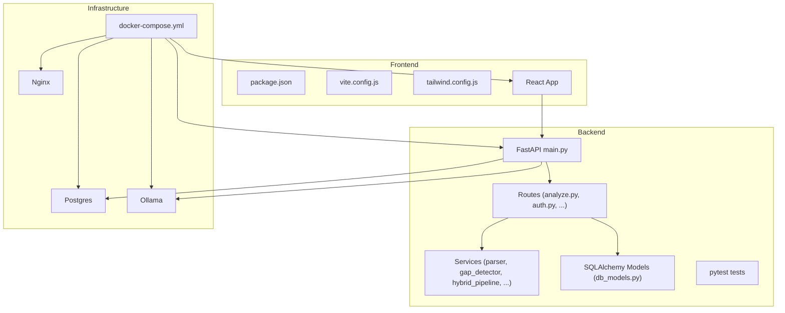
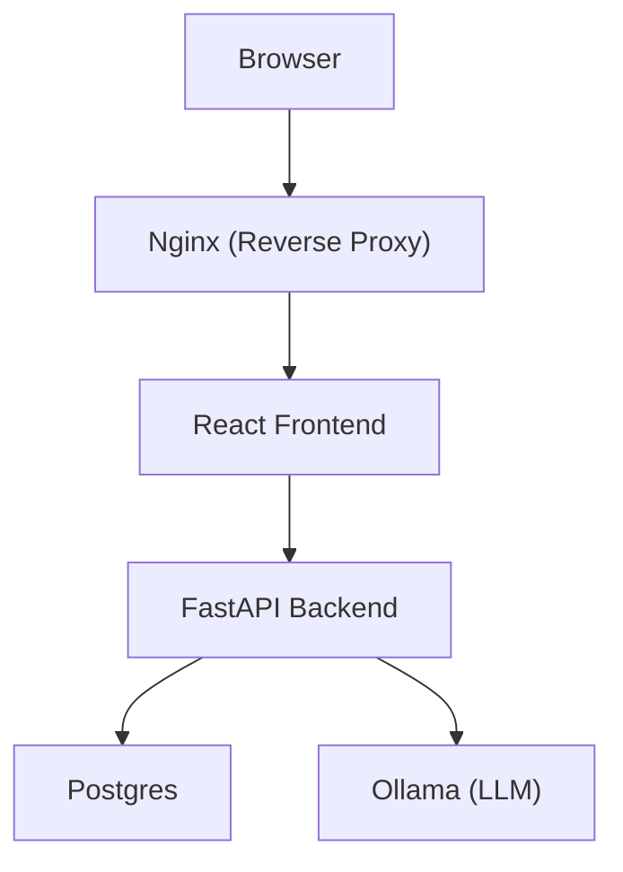
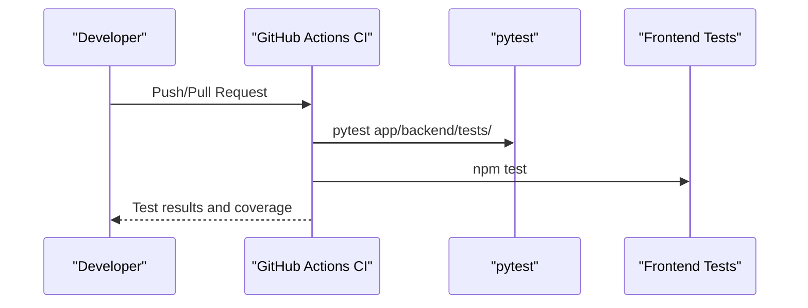
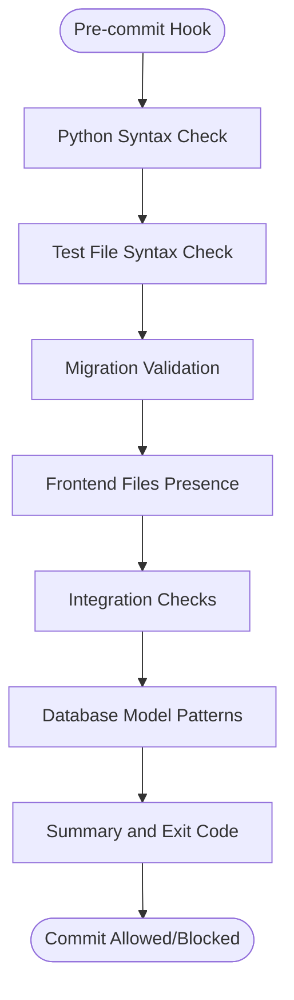
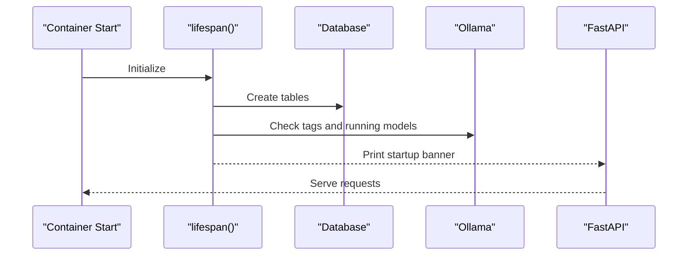
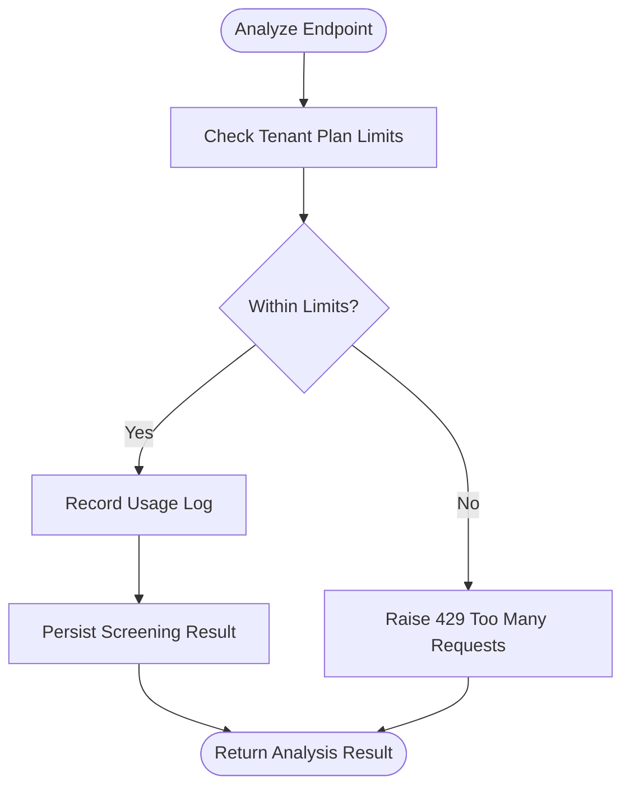
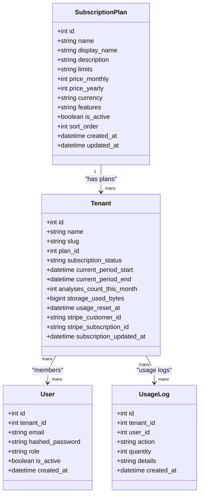
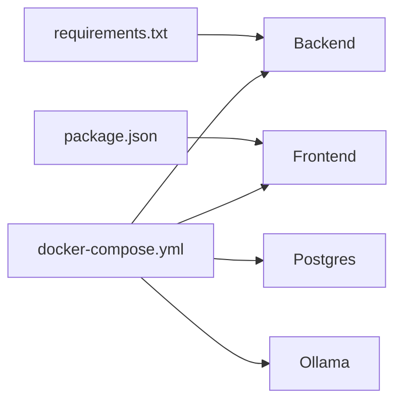

# Contributing Guidelines

<cite>
**Referenced Files in This Document**
- [README.md](file://README.md)
- [.github/workflows/ci.yml](file://.github/workflows/ci.yml)
- [.github/workflows/cd.yml](file://.github/workflows/cd.yml)
- [docker-compose.yml](file://docker-compose.yml)
- [app/backend/Dockerfile](file://app/backend/Dockerfile)
- [app/frontend/Dockerfile](file://app/frontend/Dockerfile)
- [app/backend/main.py](file://app/backend/main.py)
- [app/backend/models/db_models.py](file://app/backend/models/db_models.py)
- [app/backend/routes/analyze.py](file://app/backend/routes/analyze.py)
- [app/frontend/package.json](file://app/frontend/package.json)
- [app/frontend/vite.config.js](file://app/frontend/vite.config.js)
- [app/frontend/tailwind.config.js](file://app/frontend/tailwind.config.js)
- [scripts/pre-commit-check.ps1](file://scripts/pre-commit-check.ps1)
- [scripts/run-full-tests.sh](file://scripts/run-full-tests.sh)
- [requirements.txt](file://requirements.txt)
</cite>

## Table of Contents
1. [Introduction](#introduction)
2. [Project Structure](#project-structure)
3. [Core Components](#core-components)
4. [Architecture Overview](#architecture-overview)
5. [Development Environment Setup](#development-environment-setup)
6. [Code Standards and Conventions](#code-standards-and-conventions)
7. [Contribution Workflows](#contribution-workflows)
8. [Testing Requirements](#testing-requirements)
9. [Pre-commit Checks](#pre-commit-checks)
10. [Code Review Process](#code-review-process)
11. [Git Branching Strategy](#git-branching-strategy)
12. [Commit Message Conventions](#commit-message-conventions)
13. [Pull Request Guidelines](#pull-request-guidelines)
14. [IDE Configuration Recommendations](#ide-configuration-recommendations)
15. [Debugging Procedures](#debugging-procedures)
16. [Community Guidelines and Issue Reporting](#community-guidelines-and-issue-reporting)
17. [Maintainer Responsibilities](#maintainer-responsibilities)
18. [Onboarding Information for New Contributors](#onboarding-information-for-new-contributors)
19. [Recognition Procedures](#recognition-procedures)
20. [Troubleshooting Guide](#troubleshooting-guide)
21. [Conclusion](#conclusion)

## Introduction
This document provides comprehensive contributing guidelines for Resume AI by ThetaLogics. It covers development environment setup, code standards, contribution workflows, pre-commit checks, testing requirements, code review process, Git branching strategies, commit message conventions, pull request guidelines, IDE configuration, debugging procedures, project structure, coding conventions, architectural principles, common contribution examples, community guidelines, maintainer responsibilities, onboarding, and recognition.

## Project Structure
The project follows a full-stack architecture with a FastAPI backend, React frontend, Dockerized services, and GitHub Actions for CI/CD. The backend is organized into routes, services, models, middleware, and tests. The frontend is a React application built with Vite and styled with TailwindCSS. Docker Compose orchestrates Postgres, Ollama, backend, frontend, and Nginx.

**Diagram sources**
- [docker-compose.yml:1-101](file://docker-compose.yml#L1-L101)
- [app/backend/main.py:1-327](file://app/backend/main.py#L1-L327)
- [app/backend/routes/analyze.py:1-800](file://app/backend/routes/analyze.py#L1-L800)
- [app/backend/models/db_models.py:1-250](file://app/backend/models/db_models.py#L1-L250)
- [app/frontend/package.json:1-41](file://app/frontend/package.json#L1-L41)
- [app/frontend/vite.config.js:1-26](file://app/frontend/vite.config.js#L1-L26)
- [app/frontend/tailwind.config.js:1-67](file://app/frontend/tailwind.config.js#L1-L67)

**Section sources**
- [README.md:273-333](file://README.md#L273-L333)
- [docker-compose.yml:1-101](file://docker-compose.yml#L1-L101)

## Core Components
- Backend: FastAPI application with route registration, middleware, database initialization, and health endpoints.
- Routes: Feature-specific endpoints under app/backend/routes (e.g., analyze, auth, candidates, subscription).
- Services: Business logic modules (parser_service, gap_detector, hybrid_pipeline, llm_service, etc.).
- Models: SQLAlchemy ORM models for multi-tenancy, subscriptions, users, candidates, results, transcripts, training examples, and skills registry.
- Frontend: React SPA with Vite, TailwindCSS, React Router, and unit/integration tests via Vitest.
- Infrastructure: Docker Compose for local development and production deployment orchestration.

**Section sources**
- [app/backend/main.py:200-215](file://app/backend/main.py#L200-L215)
- [app/backend/models/db_models.py:11-250](file://app/backend/models/db_models.py#L11-L250)
- [app/backend/routes/analyze.py:41-42](file://app/backend/routes/analyze.py#L41-L42)
- [app/frontend/package.json:1-41](file://app/frontend/package.json#L1-L41)

## Architecture Overview
The system integrates a browser-based React frontend, Nginx reverse proxy, FastAPI backend, and supporting services (Postgres, Ollama). The backend exposes REST endpoints for analysis, authentication, candidate management, and subscription controls. GitHub Actions automates CI and CD pipelines.

**Diagram sources**
- [README.md:231-251](file://README.md#L231-L251)
- [docker-compose.yml:52-96](file://docker-compose.yml#L52-L96)
- [app/backend/main.py:219-259](file://app/backend/main.py#L219-L259)

## Development Environment Setup
- Prerequisites: Python 3.11+, Node.js 20+, Ollama installed locally.
- Local setup steps:
  - Start Ollama and pull required models.
  - Backend: create a virtual environment, install dependencies, and run Uvicorn with reload.
  - Frontend: install dependencies and start Vite dev server.
  - Access frontend at http://localhost:5173, backend API at http://localhost:8000, and docs at http://localhost:8000/docs.
- Docker-based development:
  - Build and start all services with docker-compose up --build.
  - Pull the model inside the Ollama container after containers are up.
  - Access the app at http://localhost:80.

Recommended local ports:
- Frontend: 5173
- Backend: 8000
- Postgres: 5432
- Ollama: 11434
- Nginx: 80

**Section sources**
- [README.md:54-108](file://README.md#L54-L108)
- [docker-compose.yml:52-96](file://docker-compose.yml#L52-L96)

## Code Standards and Conventions
- Backend (Python/FastAPI):
  - Use type hints and Pydantic models for request/response schemas.
  - Centralized route registration in main.py.
  - Logging with structured keys and JSON payloads.
  - Async I/O for blocking operations (e.g., PDF parsing) using asyncio.to_thread.
  - SQLAlchemy models for multi-tenancy and subscription usage tracking.
- Frontend (React/Vite/TailwindCSS):
  - React functional components with hooks.
  - TailwindCSS for styling; centralized theme configuration.
  - Vite proxy configured for API requests to backend.
  - Unit tests with Vitest and React Testing Library.
- Docker:
  - Separate Dockerfiles for backend and frontend.
  - Environment variables for database URLs, Ollama base URL, and model selection.
  - Health checks for Postgres and Ollama services.

**Section sources**
- [app/backend/main.py:174-179](file://app/backend/main.py#L174-L179)
- [app/backend/routes/analyze.py:268-318](file://app/backend/routes/analyze.py#L268-L318)
- [app/backend/models/db_models.py:11-250](file://app/backend/models/db_models.py#L11-L250)
- [app/frontend/vite.config.js:9-14](file://app/frontend/vite.config.js#L9-L14)
- [app/frontend/tailwind.config.js:1-67](file://app/frontend/tailwind.config.js#L1-L67)
- [app/backend/Dockerfile:1-39](file://app/backend/Dockerfile#L1-L39)
- [app/frontend/Dockerfile:1-26](file://app/frontend/Dockerfile#L1-L26)

## Contribution Workflows
- Fork and branch: Create a feature branch from the latest main or staging.
- Make changes: Follow code standards and add/update tests.
- Run pre-commit checks and full test suites locally.
- Commit messages: Use conventional prefixes and concise descriptions.
- Open a pull request targeting main or staging depending on scope.
- Ensure CI passes and address reviewer feedback promptly.

[No sources needed since this section provides general guidance]

## Testing Requirements
- Backend:
  - Run pytest on app/backend/tests/.
  - Coverage collected for app.backend.services and uploaded to Codecov.
- Frontend:
  - Run npm test for unit tests.
  - Build verification via npm run build.
- GitHub Actions:
  - CI runs on PRs to main/staging with Python 3.11 and Node 20.
  - Backend tests with coverage XML generation.
  - Frontend tests and build.

**Diagram sources**
- [.github/workflows/ci.yml:10-62](file://.github/workflows/ci.yml#L10-L62)

**Section sources**
- [README.md:255-270](file://README.md#L255-L270)
- [.github/workflows/ci.yml:10-62](file://.github/workflows/ci.yml#L10-L62)

## Pre-commit Checks
- Purpose: Validate syntax, presence of critical files, integration checks, and subscription-related patterns before committing.
- Script behavior:
  - Python syntax validation for selected backend files.
  - Test file syntax checks.
  - Migration existence checks.
  - Frontend file presence checks.
  - Integration checks for route registration and subscription provider usage.
  - Database model checks for subscription-related entities.
- Execution:
  - PowerShell script: scripts/pre-commit-check.ps1
  - Bash script: scripts/run-full-tests.sh (Docker environment)

**Diagram sources**
- [scripts/pre-commit-check.ps1:27-182](file://scripts/pre-commit-check.ps1#L27-L182)
- [scripts/run-full-tests.sh:45-231](file://scripts/run-full-tests.sh#L45-L231)

**Section sources**
- [scripts/pre-commit-check.ps1:1-183](file://scripts/pre-commit-check.ps1#L1-L183)
- [scripts/run-full-tests.sh:1-256](file://scripts/run-full-tests.sh#L1-L256)

## Code Review Process
- Reviewers: Maintainers and designated reviewers.
- Criteria:
  - Adherence to code standards and conventions.
  - Passing CI tests and coverage thresholds.
  - Clear commit messages and PR descriptions.
  - Minimal breaking changes and backward compatibility.
- Approval: At least one maintainer approval required before merging.

[No sources needed since this section provides general guidance]

## Git Branching Strategy
- Default branch: main
- Staging branch: staging
- Feature branches: feature/<issue-number>-short-description
- Hotfix branches: hotfix/<issue-number>-short-description
- Release branches: release/<version>

[No sources needed since this section provides general guidance]

## Commit Message Conventions
- Prefixes:
  - feat: New feature
  - fix: Bug fix
  - docs: Documentation changes
  - style: Formatting, missing semi colons, etc.
  - refactor: Code refactoring
  - perf: Performance improvements
  - test: Adding missing tests
  - chore: Maintenance tasks
- Example: feat(routes): add usage enforcement to analyze endpoint

[No sources needed since this section provides general guidance]

## Pull Request Guidelines
- Target appropriate branch (main or staging).
- Include a clear description of changes and rationale.
- Link related issues.
- Ensure all tests pass and coverage is acceptable.
- Update documentation if APIs or behavior change.

[No sources needed since this section provides general guidance]

## IDE Configuration Recommendations
- Backend:
  - Python interpreter set to 3.11.
  - Enable black/isort/pylint extensions.
  - Configure Uvicorn run/debug configuration with reload.
- Frontend:
  - Node.js 20 interpreter.
  - ESLint and Prettier integrations.
  - Vite proxy settings configured in IDE terminal.
- Docker:
  - Use Docker Compose configurations for local runs.
  - Health checks visible in IDE’s Docker tooling.

**Section sources**
- [app/frontend/vite.config.js:6-14](file://app/frontend/vite.config.js#L6-L14)
- [docker-compose.yml:18-22](file://docker-compose.yml#L18-L22)
- [docker-compose.yml:27-31](file://docker-compose.yml#L27-L31)

## Debugging Procedures
- Backend:
  - Use uvicorn with --reload during development.
  - Check startup banner and health endpoints for dependency status.
  - Inspect logs via docker logs for Postgres and Ollama readiness.
- Frontend:
  - Use Vite dev server with proxy to backend.
  - Run tests in watch mode for iterative debugging.
- Docker:
  - Verify service health checks and exposed ports.
  - Confirm environment variables for database and Ollama URLs.

**Section sources**
- [app/backend/main.py:37-65](file://app/backend/main.py#L37-L65)
- [app/backend/main.py:228-259](file://app/backend/main.py#L228-L259)
- [docker-compose.yml:18-22](file://docker-compose.yml#L18-L22)
- [docker-compose.yml:27-31](file://docker-compose.yml#L27-L31)

## Community Guidelines and Issue Reporting
- Issues: Use GitHub Issues for bugs, enhancements, and support requests.
- Labels: Apply appropriate labels (bug, enhancement, documentation, help wanted).
- Support: For questions, open a GitHub issue with detailed reproduction steps and environment information.

**Section sources**
- [README.md:371-375](file://README.md#L371-L375)

## Maintainer Responsibilities
- Review pull requests and provide constructive feedback.
- Ensure CI pipelines pass and deployments succeed.
- Maintain code quality and adherence to standards.
- Triage issues and coordinate releases.

[No sources needed since this section provides general guidance]

## Onboarding Information for New Contributors
- Setup: Follow the Local Development section to install prerequisites and run services.
- First contribution ideas:
  - Fix typos in documentation.
  - Add unit tests for existing components.
  - Improve error messages or logging.
  - Refactor small functions to improve readability.
- Communication: Join discussions via GitHub Issues and PR reviews.

**Section sources**
- [README.md:54-108](file://README.md#L54-L108)

## Recognition Procedures
- Contributors are acknowledged in release notes and contributor lists.
- Significant contributions may be recognized publicly via repository announcements.

[No sources needed since this section provides general guidance]

## Troubleshooting Guide
- Ollama not responding:
  - Check container logs and pull required models.
- Database locked errors:
  - Restart backend container if SQLite reports “database is locked”.
- SSL certificate issues:
  - Renew certificates and restart Nginx.
- Deploy not working:
  - Verify Docker Hub credentials, SSH keys, and VPS firewall.

**Section sources**
- [README.md:337-362](file://README.md#L337-L362)

## Detailed Component Analysis

### Backend Startup and Health

**Diagram sources**
- [app/backend/main.py:152-172](file://app/backend/main.py#L152-L172)
- [app/backend/main.py:68-149](file://app/backend/main.py#L68-L149)
- [app/backend/main.py:228-326](file://app/backend/main.py#L228-L326)

**Section sources**
- [app/backend/main.py:152-326](file://app/backend/main.py#L152-L326)

### Subscription Usage Enforcement Flow

**Diagram sources**
- [app/backend/routes/analyze.py:323-351](file://app/backend/routes/analyze.py#L323-L351)

**Section sources**
- [app/backend/routes/analyze.py:323-351](file://app/backend/routes/analyze.py#L323-L351)

### Database Models Overview

**Diagram sources**
- [app/backend/models/db_models.py:11-93](file://app/backend/models/db_models.py#L11-L93)

**Section sources**
- [app/backend/models/db_models.py:11-93](file://app/backend/models/db_models.py#L11-L93)

## Dependency Analysis
- Backend dependencies pinned in requirements.txt.
- Frontend dependencies managed via package.json.
- Docker Compose defines service dependencies and health checks.

**Diagram sources**
- [requirements.txt:1-48](file://requirements.txt#L1-L48)
- [app/frontend/package.json:14-40](file://app/frontend/package.json#L14-L40)
- [docker-compose.yml:5-101](file://docker-compose.yml#L5-L101)

**Section sources**
- [requirements.txt:1-48](file://requirements.txt#L1-L48)
- [app/frontend/package.json:14-40](file://app/frontend/package.json#L14-L40)
- [docker-compose.yml:5-101](file://docker-compose.yml#L5-L101)

## Performance Considerations
- Use async I/O for blocking operations (e.g., PDF parsing) to avoid blocking the event loop.
- Leverage database shared caches (JD cache) to reduce repeated computations.
- Optimize model loading and pre-warming in Ollama for faster cold-starts.
- Monitor container resource usage and adjust parallelism and caching settings.

[No sources needed since this section provides general guidance]

## Conclusion
These guidelines standardize development, testing, and collaboration for Resume AI by ThetaLogics. By following the setup instructions, code conventions, pre-commit checks, testing requirements, and review process, contributors can efficiently deliver high-quality features and maintain system reliability.