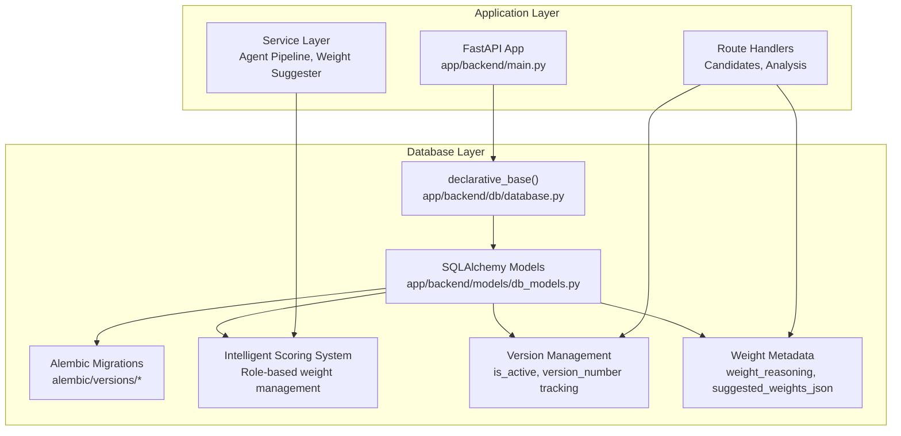
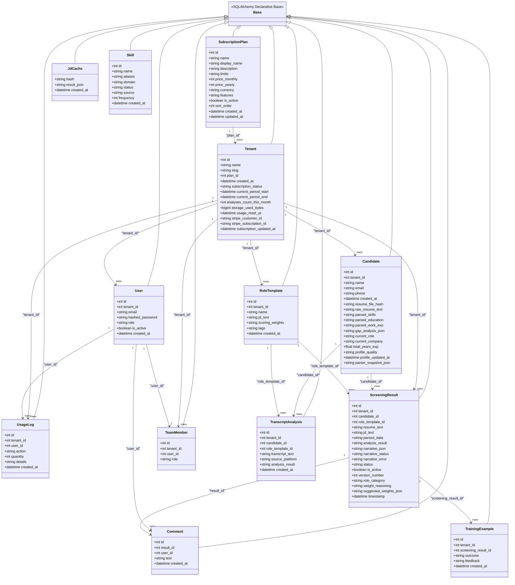
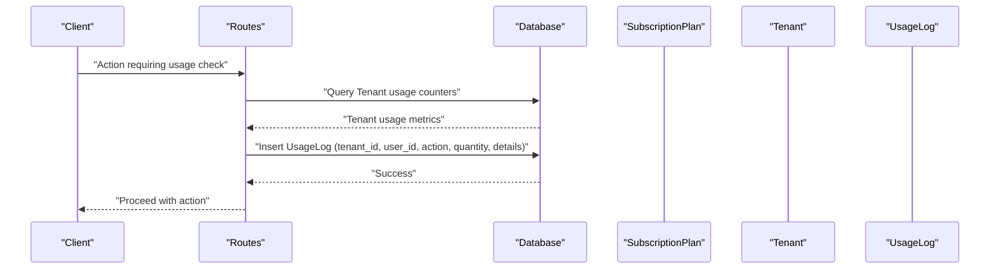
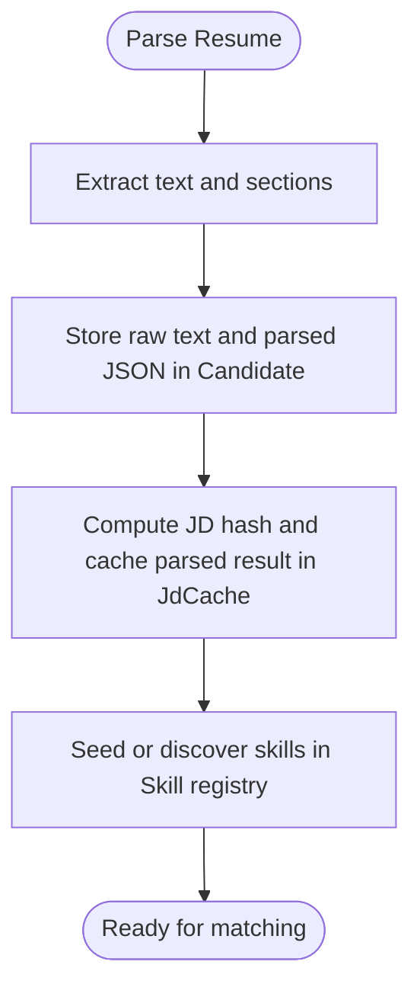
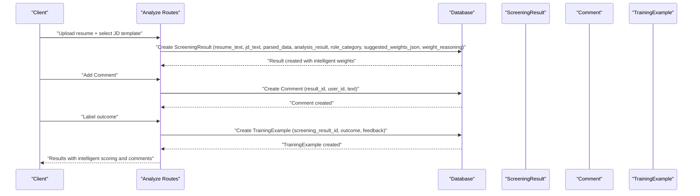
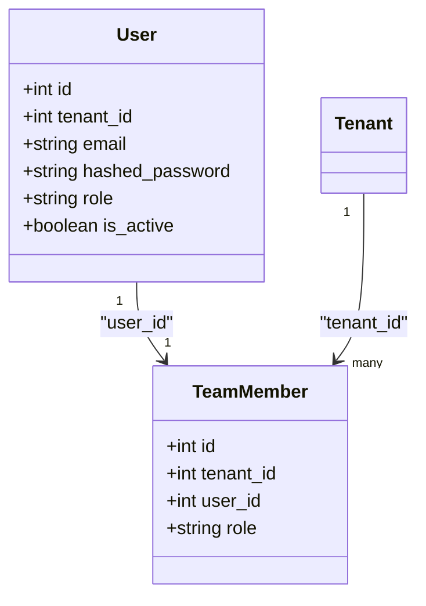
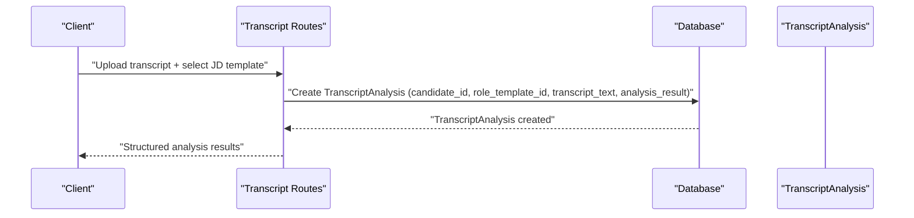
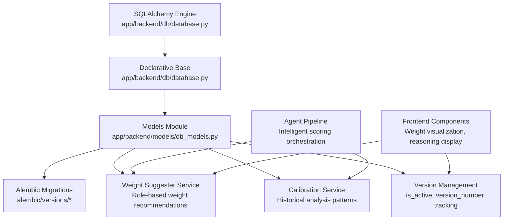

# Core Models Overview

<cite>
**Referenced Files in This Document**
- [db_models.py](file://app/backend/models/db_models.py)
- [database.py](file://app/backend/db/database.py)
- [main.py](file://app/backend/main.py)
- [001_enrich_candidates_add_caches.py](file://alembic/versions/001_enrich_candidates_add_caches.py)
- [002_parser_snapshot_json.py](file://alembic/versions/002_parser_snapshot_json.py)
- [003_subscription_system.py](file://alembic/versions/003_subscription_system.py)
- [004_narrative_json.py](file://alembic/versions/004_narrative_json.py)
- [007_narrative_status.py](file://alembic/versions/007_narrative_status.py)
- [009_intelligent_scoring_weights.py](file://alembic/versions/009_intelligent_scoring_weights.py)
- [010_add_jd_text_to_screening_result.py](file://alembic/versions/010_add_jd_text_to_screening_result.py)
- [schemas.py](file://app/backend/models/schemas.py)
- [hybrid_pipeline.py](file://app/backend/services/hybrid_pipeline.py)
- [agent_pipeline.py](file://app/backend/services/agent_pipeline.py)
- [weight_suggester.py](file://app/backend/services/weight_suggester.py)
- [weight_mapper.py](file://app/backend/services/weight_mapper.py)
- [candidates.py](file://app/backend/routes/candidates.py)
</cite>

## Update Summary
**Changes Made**
- Enhanced ScreeningResult model with new weight_reasoning and suggested_weights_json columns added to fix runtime errors and improve intelligent scoring functionality
- Added comprehensive version management system with is_active and version_number fields for historical tracking
- Integrated role-based weight suggestion system with automatic weight extraction from JD analysis
- Enhanced front-end visualization to display weight reasoning and suggested weights for improved transparency

## Table of Contents
1. [Introduction](#introduction)
2. [Project Structure](#project-structure)
3. [Core Components](#core-components)
4. [Architecture Overview](#architecture-overview)
5. [Detailed Component Analysis](#detailed-component-analysis)
6. [Dependency Analysis](#dependency-analysis)
7. [Performance Considerations](#performance-considerations)
8. [Troubleshooting Guide](#troubleshooting-guide)
9. [Conclusion](#conclusion)

## Introduction
This document provides a comprehensive overview of the core database models in Resume AI by ThetaLogics. It documents the 12 core SQLAlchemy models, their fields, data types, primary and foreign keys, indexes, constraints, and relationships. It also explains the base model inheritance pattern, shared conventions, and practical usage patterns derived from the codebase. The goal is to help developers and stakeholders understand how data is modeled, stored, and interconnected across the system.

**Updated** Enhanced with intelligent scoring weights system and role-based screening functionality that enables sophisticated position categorization and adaptive weight management. The ScreeningResult model now includes comprehensive metadata tracking for weight reasoning and suggested weights, improving transparency and runtime reliability.

## Project Structure
The database models are defined in a single module and are orchestrated by a shared declarative base. Migrations evolve the schema over time, and the application initializes tables at startup. The intelligent scoring system introduces version management and role-based weight suggestions for enhanced analysis capabilities.

**Diagram sources**
- [database.py:24](file://app/backend/db/database.py#L24)
- [db_models.py:6](file://app/backend/models/db_models.py#L6)
- [main.py:160](file://app/backend/main.py#L160)
- [009_intelligent_scoring_weights.py:1](file://alembic/versions/009_intelligent_scoring_weights.py#L1)

**Section sources**
- [database.py:1-33](file://app/backend/db/database.py#L1-L33)
- [main.py:152-172](file://app/backend/main.py#L152-L172)

## Core Components
This section enumerates the 12 core models, their fields, data types, primary/foreign keys, indexes, and constraints. It also highlights shared patterns and business logic constraints, including the new intelligent scoring capabilities.

- SubscriptionPlan
  - Purpose: Defines subscription tiers with pricing, features, and ordering.
  - Fields:
    - id: integer, primary key, indexed
    - name: string(50), unique, not null
    - display_name: string(100), nullable
    - description: text, nullable
    - limits: text (JSON), not null, default "{}"
    - price_monthly: integer (cents), not null, default 0
    - price_yearly: integer (cents), not null, default 0
    - currency: string(3), not null, default "USD"
    - features: text (JSON array), not null, default "[]"
    - is_active: boolean, not null, default true
    - sort_order: integer, not null, default 0
    - created_at: datetime with timezone, server default now()
    - updated_at: datetime with timezone, on update now()
  - Indexes: none explicitly declared; migration adds composite index on (is_active, sort_order).
  - Constraints: name is unique; defaults enforce numeric pricing and JSON fields.
  - Relationships: back-populates to Tenant.plan.

- Tenant
  - Purpose: Multi-tenant container with subscription and usage tracking.
  - Fields:
    - id: integer, primary key, indexed
    - name: string(200), not null
    - slug: string(100), unique, not null
    - plan_id: integer, foreign key to subscription_plans.id, nullable
    - created_at: datetime with timezone, server default now()
    - subscription_status: string(20), not null, default "active"
    - current_period_start: datetime with timezone, nullable
    - current_period_end: datetime with timezone, nullable
    - analyses_count_this_month: integer, not null, default 0
    - storage_used_bytes: bigint, not null, default 0
    - usage_reset_at: datetime with timezone, nullable
    - stripe_customer_id: string(255), nullable
    - stripe_subscription_id: string(255), nullable
    - subscription_updated_at: datetime with timezone, nullable
  - Indexes: migration adds indexes on subscription_status and stripe_customer_id.
  - Constraints: plan_id references SubscriptionPlan; defaults maintain sane usage counters.
  - Relationships: back-populates to SubscriptionPlan.tenants; forward relations to User, Candidate, RoleTemplate, ScreeningResult, TeamMember, UsageLog.

- User
  - Purpose: Tenant users with roles and authentication linkage.
  - Fields:
    - id: integer, primary key, indexed
    - tenant_id: integer, foreign key to tenants.id, not null
    - email: string(255), unique, not null, indexed
    - hashed_password: string(255), not null
    - role: string(50), not null, default "recruiter"
    - is_active: boolean, default true
    - created_at: datetime with timezone, server default now()
  - Indexes: email is indexed.
  - Constraints: email uniqueness; role default enforces baseline access level.
  - Relationships: back-populates to Tenant.users; one-to-one TeamMember via team_member; forward relations to UsageLog and Comment.

- UsageLog
  - Purpose: Detailed usage tracking for billing and analytics.
  - Fields:
    - id: integer, primary key, indexed
    - tenant_id: integer, foreign key to tenants.id with cascade delete, not null, indexed
    - user_id: integer, foreign key to users.id with set null on delete, nullable, indexed
    - action: string(50), not null (e.g., resume_analysis, batch_analysis)
    - quantity: integer, not null, default 1
    - details: text, nullable (JSON context)
    - created_at: datetime with timezone, server default now(), indexed
  - Indexes: composite index on (tenant_id, action); composite index on (tenant_id, created_at); index on created_at.
  - Constraints: foreign keys define cascading and null behavior; defaults ensure numeric quantities.
  - Relationships: back-populates to Tenant.usage_logs and User.usage_logs.

- Candidate
  - Purpose: Candidate profiles with enriched resume data and caching fields.
  - Fields:
    - id: integer, primary key, indexed
    - tenant_id: integer, foreign key to tenants.id, not null
    - name: string(255), nullable
    - email: string(255), nullable, indexed
    - phone: string(50), nullable
    - created_at: datetime with timezone, server default now()
    - resume_file_hash: string(64), nullable, indexed
    - raw_resume_text: text, nullable
    - parsed_skills: text (JSON array), nullable
    - parsed_education: text (JSON array), nullable
    - parsed_work_exp: text (JSON array), nullable
    - gap_analysis_json: text (JSON object), nullable
    - current_role: string(255), nullable
    - current_company: string(255), nullable
    - total_years_exp: float, nullable
    - profile_quality: string(20), nullable
    - profile_updated_at: datetime with timezone, nullable
    - parser_snapshot_json: text, nullable
  - Indexes: resume_file_hash is indexed; migration ensures indexes exist.
  - Constraints: JSON fields store structured data; defaults maintain nullability for optional enrichment.
  - Relationships: back-populates to Tenant.candidates; forward relations to ScreeningResult and TranscriptAnalysis.

- ScreeningResult
  - Purpose: Results of resume-JD matching and analysis with intelligent scoring capabilities and comprehensive metadata tracking.
  - Fields:
    - id: integer, primary key, indexed
    - tenant_id: integer, foreign key to tenants.id, nullable
    - candidate_id: integer, foreign key to candidates.id, nullable
    - role_template_id: integer, foreign key to role_templates.id, nullable
    - resume_text: text, not null
    - jd_text: text, nullable
    - parsed_data: text (JSON string), not null
    - analysis_result: text (JSON string), not null
    - narrative_json: text, nullable
    - narrative_status: string(20), default "pending"
    - narrative_error: text, nullable
    - status: string(50), default "pending"
    - is_active: boolean, default True
    - version_number: integer, default 1
    - role_category: string(50), nullable
    - weight_reasoning: text, nullable
    - suggested_weights_json: text, nullable
    - timestamp: datetime with timezone, server default now(), indexed
  - Indexes: composite index on (is_active, candidate_id); composite index on (candidate_id, version_number); index on role_category; index on tenant_id, role_category, is_active
  - Constraints: JSON fields store structured outputs; status enum-like values guide workflow; version management ensures historical tracking
  - Relationships: back-populates to Tenant.results, Candidate.results, RoleTemplate.results; forward relations to Comment and TrainingExample.

- RoleTemplate
  - Purpose: Job descriptions and scoring configurations.
  - Fields:
    - id: integer, primary key, indexed
    - tenant_id: integer, foreign key to tenants.id, not null
    - name: string(200), not null
    - jd_text: text, not null
    - scoring_weights: text (JSON), nullable
    - tags: string(500), nullable
    - created_at: datetime with timezone, server default now()
  - Indexes: none explicitly declared.
  - Constraints: scoring_weights and tags store JSON; defaults maintain nullability.
  - Relationships: back-populates to Tenant.templates; forward relations to ScreeningResult and TranscriptAnalysis.

- TeamMember
  - Purpose: Association of users to tenants with roles.
  - Fields:
    - id: integer, primary key, indexed
    - tenant_id: integer, foreign key to tenants.id, not null
    - user_id: integer, foreign key to users.id, not null
    - role: string(50), not null, default "recruiter"
  - Indexes: none explicitly declared.
  - Constraints: enforces role membership; default role aligns with User.role.
  - Relationships: back-populates to Tenant.team_members; back-populates to User.team_member.

- Comment
  - Purpose: Collaborative commentary on screening results.
  - Fields:
    - id: integer, primary key, indexed
    - result_id: integer, foreign key to screening_results.id, not null
    - user_id: integer, foreign key to users.id, not null
    - text: text, not null
    - created_at: datetime with timezone, server default now()
  - Indexes: none explicitly declared.
  - Constraints: links comments to results and authors.
  - Relationships: back-populates to ScreeningResult.comments; back-populates to User.comments.

- TranscriptAnalysis
  - Purpose: Video/audio interview analysis results.
  - Fields:
    - id: integer, primary key, indexed
    - tenant_id: integer, foreign key to tenants.id, nullable
    - candidate_id: integer, foreign key to candidates.id, nullable
    - role_template_id: integer, foreign key to role_templates.id, nullable
    - transcript_text: text, not null
    - source_platform: string(50), nullable (zoom, teams, manual)
    - analysis_result: text (JSON), not null
    - created_at: datetime with timezone, server default now()
  - Indexes: none explicitly declared.
  - Constraints: JSON stores structured analysis; platform enum-like values.
  - Relationships: back-populates to Candidate.transcript_analyses and RoleTemplate.transcript_analyses.

- TrainingExample
  - Purpose: Labeled examples for custom AI training.
  - Fields:
    - id: integer, primary key, indexed
    - tenant_id: integer, foreign key to tenants.id, not null
    - screening_result_id: integer, foreign key to screening_results.id, not null
    - outcome: string(50), not null (hired, rejected)
    - feedback: text, nullable
    - created_at: datetime with timezone, server default now()
  - Indexes: none explicitly declared.
  - Constraints: outcome enum-like values; feedback captures qualitative context.
  - Relationships: back-populates to ScreeningResult.training_examples.

- JdCache
  - Purpose: Shared cache for parsed job descriptions keyed by hash.
  - Fields:
    - hash: string(64), primary key
    - result_json: text, not null
    - created_at: datetime with timezone, server default now()
  - Indexes: none explicitly declared.
  - Constraints: hash is the primary key; JSON stores parsed results.
  - Relationships: no foreign keys; standalone cache table.

- Skill
  - Purpose: Dynamic skills registry with aliases, domains, and frequency.
  - Fields:
    - id: integer, primary key, indexed
    - name: string(200), unique, not null
    - aliases: text, nullable (comma-separated)
    - domain: string(50), nullable
    - status: string(20), not null, default "active"
    - source: string(20), not null, default "seed"
    - frequency: integer, not null, default 0
    - created_at: datetime with timezone, server default now()
  - Indexes: migration ensures indexes on id and unique name.
  - Constraints: name uniqueness; defaults maintain seed/frequency semantics.
  - Relationships: no foreign keys; standalone registry table.

**Section sources**
- [db_models.py:11-269](file://app/backend/models/db_models.py#L11-L269)
- [001_enrich_candidates_add_caches.py:42-111](file://alembic/versions/001_enrich_candidates_add_caches.py#L42-L111)
- [002_parser_snapshot_json.py:21-34](file://alembic/versions/002_parser_snapshot_json.py#L21-L34)
- [003_subscription_system.py:43-118](file://alembic/versions/003_subscription_system.py#L43-L118)
- [004_narrative_json.py:1](file://alembic/versions/004_narrative_json.py#L1)
- [007_narrative_status.py:1](file://alembic/versions/007_narrative_status.py#L1)
- [009_intelligent_scoring_weights.py:1](file://alembic/versions/009_intelligent_scoring_weights.py#L1)
- [010_add_jd_text_to_screening_result.py:1](file://alembic/versions/010_add_jd_text_to_screening_result.py#L1)

## Architecture Overview
The models follow a multi-tenancy-first design with explicit foreign keys and bidirectional relationships. The base declarative class centralizes ORM configuration. Migrations evolve the schema safely and idempotently. The intelligent scoring system introduces version management and role-based weight suggestions for enhanced analysis capabilities.

**Diagram sources**
- [db_models.py:11-269](file://app/backend/models/db_models.py#L11-L269)

## Detailed Component Analysis

### Base Model and Shared Patterns
- Base class: A single declarative base is created and reused across all models.
- Timestamps: Many models use timezone-aware datetimes with server defaults and updates.
- Indexing: Several fields are indexed to optimize queries (e.g., email, slug, resume hash).
- JSON fields: Structured data is stored as JSON strings/text blobs for flexible schema evolution.
- Foreign keys: Explicit foreign keys define relationships; migrations add indexes and constraints.

**Section sources**
- [database.py:24](file://app/backend/db/database.py#L24)
- [db_models.py:11-269](file://app/backend/models/db_models.py#L11-L269)

### Enhanced ScreeningResult Model with Intelligent Scoring
**Updated** The ScreeningResult model now includes comprehensive intelligent scoring capabilities with version management and role-based weight suggestions. The addition of weight_reasoning and suggested_weights_json columns addresses runtime errors and improves transparency in the scoring process.

- ScreeningResult: Enhanced with intelligent scoring system supporting role-based analysis and version tracking.
  - Fields:
    - id: integer, primary key, indexed
    - tenant_id: integer, foreign key to tenants.id, nullable
    - candidate_id: integer, foreign key to candidates.id, nullable
    - role_template_id: integer, foreign key to role_templates.id, nullable
    - resume_text: text, not null
    - jd_text: text, nullable (added in migration 010)
    - parsed_data: text (JSON string), not null
    - analysis_result: text (JSON string), not null
    - narrative_json: text, nullable (added in migration 004)
    - narrative_status: string(20), default "pending"
    - narrative_error: text, nullable
    - status: string(50), default "pending"
    - is_active: boolean, default True (version management)
    - version_number: integer, default 1 (version management)
    - role_category: string(50), nullable (technical, sales, hr, marketing, operations, leadership)
    - weight_reasoning: text, nullable (explanation for weight selection)
    - suggested_weights_json: text, nullable (JSON of suggested weights)
    - timestamp: datetime with timezone, server default now(), indexed
  - Indexes: Composite indexes on (is_active, candidate_id) and (candidate_id, version_number) for efficient version queries; index on role_category for calibration queries
  - Constraints: All new fields are nullable for backward compatibility; version management ensures historical tracking
  - Relationships: back-populates to Tenant.results, Candidate.results, RoleTemplate.results; forward relations to Comment and TrainingExample

**Section sources**
- [db_models.py:129-154](file://app/backend/models/db_models.py#L129-L154)
- [009_intelligent_scoring_weights.py:1](file://alembic/versions/009_intelligent_scoring_weights.py#L1)
- [010_add_jd_text_to_screening_result.py:1](file://alembic/versions/010_add_jd_text_to_screening_result.py#L1)

### Intelligent Scoring Weights System
**New** The intelligent scoring system provides role-based weight management with comprehensive default weight suggestions for different position categories.

- Role-based weight categories:
  - Technical: Higher emphasis on architecture/design, domain fit, and technical excellence
  - Sales: Focus on revenue achievement, core competencies, and performance metrics
  - HR: Emphasis on certifications, strategic impact, and organizational development
  - Marketing: Focus on campaign strategy, brand impact, and digital marketing expertise
  - Operations: Emphasis on process optimization, efficiency, and operational excellence
  - Leadership: Strong focus on experience, strategic vision, and leadership impact

- Weight suggestion service:
  - Provides default weights for each role category
  - Generates human-readable labels for role excellence factors
  - Supports fallback mechanisms when LLM analysis is unavailable
  - Maintains backward compatibility with legacy weight systems

- Version management and metadata tracking:
  - Automatic extraction of weight metadata from JD analysis
  - Comprehensive weight reasoning documentation for transparency
  - JSON serialization of suggested weights for programmatic access
  - Runtime error prevention through proper field initialization

**Section sources**
- [weight_suggester.py:180-247](file://app/backend/services/weight_suggester.py#L180-L247)
- [weight_mapper.py:284-318](file://app/backend/services/weight_mapper.py#L284-L318)
- [agent_pipeline.py:464-475](file://app/backend/services/agent_pipeline.py#L464-L475)
- [candidates.py:381-405](file://app/backend/routes/candidates.py#L381-L405)

### Subscription and Usage Tracking
- SubscriptionPlan: Adds pricing, features, and plan metadata; migration seeds initial plans and sets default plan for existing tenants.
- Tenant: Tracks subscription lifecycle, usage counters, and Stripe identifiers; migration adds indexes and usage columns.
- UsageLog: Captures per-action usage with tenant and user linkage; migration creates detailed indexes.

**Diagram sources**
- [003_subscription_system.py:93-118](file://alembic/versions/003_subscription_system.py#L93-L118)
- [db_models.py:79-93](file://app/backend/models/db_models.py#L79-L93)

**Section sources**
- [003_subscription_system.py:43-252](file://alembic/versions/003_subscription_system.py#L43-L252)
- [db_models.py:31-59](file://app/backend/models/db_models.py#L31-L59)
- [db_models.py:79-93](file://app/backend/models/db_models.py#L79-L93)

### Candidate Enrichment and Caching
- Candidate: Stores parsed resume data and a snapshot of the full parser output; migration adds numerous enrichment columns and indexes.
- JdCache: Shared cache keyed by hash for parsed job descriptions.
- Skill: Dynamic registry of skills with aliases, domains, and frequency.

**Diagram sources**
- [001_enrich_candidates_add_caches.py:42-111](file://alembic/versions/001_enrich_candidates_add_caches.py#L42-L111)
- [db_models.py:97-126](file://app/backend/models/db_models.py#L97-L126)
- [db_models.py:229-236](file://app/backend/models/db_models.py#L229-L236)
- [db_models.py:238-250](file://app/backend/models/db_models.py#L238-L250)
- [hybrid_pipeline.py:73-182](file://app/backend/services/hybrid_pipeline.py#L73-L182)

**Section sources**
- [001_enrich_candidates_add_caches.py:42-111](file://alembic/versions/001_enrich_candidates_add_caches.py#L42-L111)
- [002_parser_snapshot_json.py:21-34](file://alembic/versions/002_parser_snapshot_json.py#L21-L34)
- [db_models.py:97-126](file://app/backend/models/db_models.py#L97-L126)
- [db_models.py:238-250](file://app/backend/models/db_models.py#L238-L250)
- [hybrid_pipeline.py:73-182](file://app/backend/services/hybrid_pipeline.py#L73-L182)

### Screening and Collaboration
- ScreeningResult: Enhanced with intelligent scoring capabilities, version management, and role-based weight suggestions.
- RoleTemplate: Encapsulates job descriptions and scoring weights.
- Comment: Enables team collaboration on screening outcomes.
- TrainingExample: Captures labeled examples for custom training.

**Diagram sources**
- [db_models.py:128-154](file://app/backend/models/db_models.py#L128-L154)
- [db_models.py:181-192](file://app/backend/models/db_models.py#L181-L192)
- [db_models.py:214-225](file://app/backend/models/db_models.py#L214-L225)

**Section sources**
- [db_models.py:128-154](file://app/backend/models/db_models.py#L128-L154)
- [db_models.py:151-165](file://app/backend/models/db_models.py#L151-L165)
- [db_models.py:181-192](file://app/backend/models/db_models.py#L181-L192)
- [db_models.py:214-225](file://app/backend/models/db_models.py#L214-L225)

### Team Collaboration
- TeamMember: Links users to tenants with roles; ensures one membership per user per tenant.
- User: Provides authentication and role context; integrates with comments and usage logs.

**Diagram sources**
- [db_models.py:169-179](file://app/backend/models/db_models.py#L169-L179)
- [db_models.py:62-77](file://app/backend/models/db_models.py#L62-L77)

**Section sources**
- [db_models.py:169-179](file://app/backend/models/db_models.py#L169-L179)
- [db_models.py:62-77](file://app/backend/models/db_models.py#L62-L77)

### Transcript Analysis
- TranscriptAnalysis: Stores transcribed interviews and structured analysis results; links to candidate and role template.

**Diagram sources**
- [db_models.py:196-210](file://app/backend/models/db_models.py#L196-L210)

**Section sources**
- [db_models.py:196-210](file://app/backend/models/db_models.py#L196-L210)

### Model Instantiation Examples
- Instantiate a Tenant with a default plan and usage fields:
  - Use Tenant(name="Acme Inc", slug="acme", plan_id=existing_plan_id, ...)
- Create a Candidate under a Tenant:
  - Use Candidate(tenant_id=tenant.id, name="John Doe", email="john@example.com", ...)
- Add a ScreeningResult with intelligent scoring capabilities:
  - Use ScreeningResult(tenant_id=tenant.id, candidate_id=candidate.id, role_template_id=template.id, resume_text="...", jd_text="...", parsed_data="...", analysis_result="...", status="pending", role_category="technical", suggested_weights_json="...", weight_reasoning="...")
- Insert a Comment on a ScreeningResult:
  - Use Comment(result_id=result.id, user_id=user.id, text="Great insights!")
- Create a TranscriptAnalysis:
  - Use TranscriptAnalysis(tenant_id=tenant.id, candidate_id=candidate.id, role_template_id=template.id, transcript_text="...", source_platform="zoom", analysis_result="...")

Note: These examples describe construction patterns; refer to the model definitions for exact field names and types.

**Section sources**
- [db_models.py:31-59](file://app/backend/models/db_models.py#L31-L59)
- [db_models.py:97-126](file://app/backend/models/db_models.py#L97-L126)
- [db_models.py:128-154](file://app/backend/models/db_models.py#L128-L154)
- [db_models.py:181-192](file://app/backend/models/db_models.py#L181-L192)
- [db_models.py:196-210](file://app/backend/models/db_models.py#L196-L210)

### Common Query Patterns
- Find all Candidates for a Tenant:
  - Query(Candidate).filter(Candidate.tenant_id == tenant.id).all()
- Retrieve ScreeningResults with Comments and Candidate details:
  - Query(ScreeningResult).options(joinedload(ScreeningResult.comments), joinedload(ScreeningResult.candidate)).filter(...)
- List UsageLogs for a Tenant ordered by time:
  - Query(UsageLog).filter(UsageLog.tenant_id == tenant.id).order_by(UsageLog.created_at.desc()).all()
- Get TranscriptAnalyses for a Candidate:
  - Query(TranscriptAnalysis).filter(TranscriptAnalysis.candidate_id == candidate.id).all()
- Query ScreeningResults by role category:
  - Query(ScreeningResult).filter(ScreeningResult.role_category == "technical").all()
- Get current active version of a candidate's analysis:
  - Query(ScreeningResult).filter(ScreeningResult.candidate_id == candidate_id, ScreeningResult.is_active == True).first()
- Get version history for a candidate:
  - Query(ScreeningResult).filter(ScreeningResult.candidate_id == candidate_id).order_by(ScreeningResult.version_number).all()

These patterns leverage relationships and foreign keys defined in the models.

**Section sources**
- [db_models.py:97-126](file://app/backend/models/db_models.py#L97-L126)
- [db_models.py:128-154](file://app/backend/models/db_models.py#L128-L154)
- [db_models.py:196-210](file://app/backend/models/db_models.py#L196-L210)
- [db_models.py:79-93](file://app/backend/models/db_models.py#L79-L93)

## Dependency Analysis
The models depend on the shared declarative base and SQLAlchemy constructs. Relationships are defined via foreign keys and relationship() declarations. Migrations manage schema evolution and indexes. The intelligent scoring system introduces additional dependencies on weight suggestion services and calibration data.

**Diagram sources**
- [database.py:20-24](file://app/backend/db/database.py#L20-L24)
- [db_models.py:6](file://app/backend/models/db_models.py#L6)
- [weight_suggester.py:1](file://app/backend/services/weight_suggester.py#L1)
- [agent_pipeline.py:1](file://app/backend/services/agent_pipeline.py#L1)

**Section sources**
- [database.py:1-33](file://app/backend/db/database.py#L1-L33)
- [db_models.py:11-269](file://app/backend/models/db_models.py#L11-L269)

## Performance Considerations
- Indexes: Several fields are indexed to speed up lookups (email, slug, resume_file_hash, usage-log composite indexes). New indexes for intelligent scoring (is_active, version_number, role_category) improve query performance for version management and role-based filtering.
- JSON fields: Storing structured data in JSON reduces normalization overhead but can limit indexing granularity; consider selective denormalization if queries require frequent filtering on nested fields.
- Cascading deletes: UsageLog uses cascade delete on tenant and set null on user; ensure appropriate cascade behavior for your workload to avoid orphaned records.
- Timezone-aware timestamps: Using timezone-aware datetimes avoids ambiguity in cross-timezone deployments.
- Version management: The is_active and version_number fields enable efficient querying of current versions while maintaining historical data for analysis and comparison.
- Weight metadata: The suggested_weights_json field stores serialized weight configurations for quick access without requiring complex joins or calculations.

## Troubleshooting Guide
- Startup table creation: The application creates tables at startup; failures are logged but do not prevent server startup.
- Health checks: The /health endpoint validates database connectivity and LLM availability; use it to diagnose runtime issues.
- Usage tracking: If usage logs are missing, verify that the UsageLog insertion occurs after successful actions and that tenant usage fields are updated accordingly.
- Intelligent scoring: If role-based weights are not appearing, verify that the 009 migration has been applied and that the weight_suggestion service is functioning correctly.
- Version conflicts: If version management issues occur, check that is_active is properly managed when creating new versions of ScreeningResult records.
- Weight metadata: If weight_reasoning or suggested_weights_json fields are empty, verify that the JD analysis includes weight suggestion data and that the route handler properly extracts and serializes this information.
- Frontend display: If weight reasoning is not visible in the UI, check that the frontend components properly handle the new weight_reasoning field and that the data is being transmitted correctly from the backend.

**Section sources**
- [main.py:152-172](file://app/backend/main.py#L152-L172)
- [main.py:228-259](file://app/backend/main.py#L228-L259)
- [003_subscription_system.py:93-118](file://alembic/versions/003_subscription_system.py#L93-L118)
- [009_intelligent_scoring_weights.py:76-93](file://alembic/versions/009_intelligent_scoring_weights.py#L76-L93)
- [candidates.py:381-405](file://app/backend/routes/candidates.py#L381-L405)

## Conclusion
The core models form a cohesive, multi-tenant data layer supporting resume screening, transcript analysis, team collaboration, and subscription-based usage tracking. The enhanced ScreeningResult model with intelligent scoring capabilities provides sophisticated role-based analysis and version management. The addition of weight_reasoning and suggested_weights_json columns addresses runtime errors and improves transparency in the scoring process. The shared base class and explicit relationships enable clear data flows, while migrations ensure schema evolution remains safe and predictable. The intelligent scoring system with role-based weight suggestions enables more accurate and contextually appropriate candidate evaluation across different position categories. By following the documented patterns and constraints, developers can reliably extend functionality and maintain data integrity.