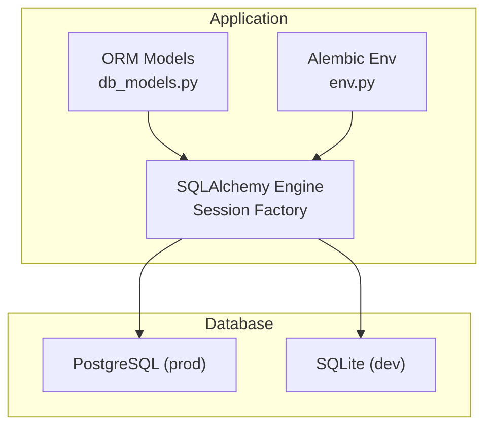
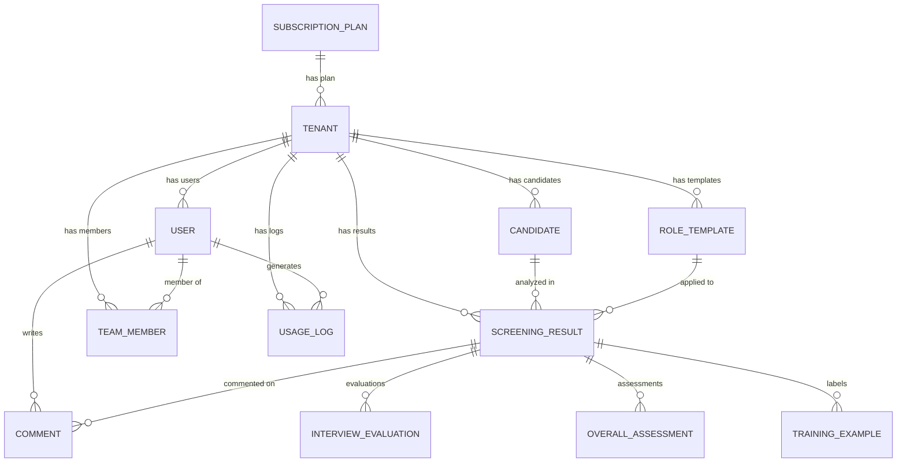
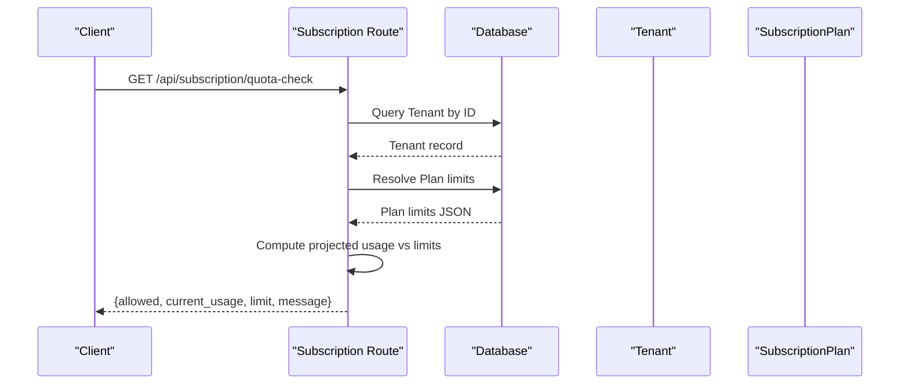
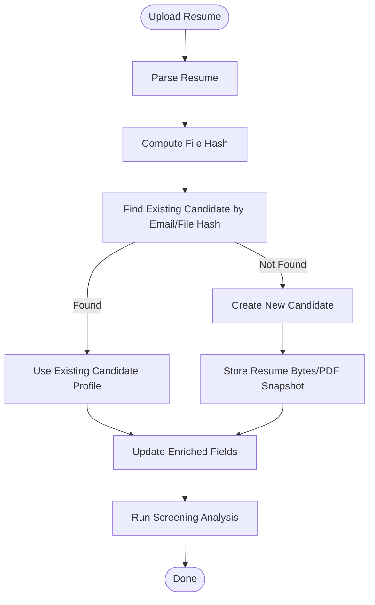
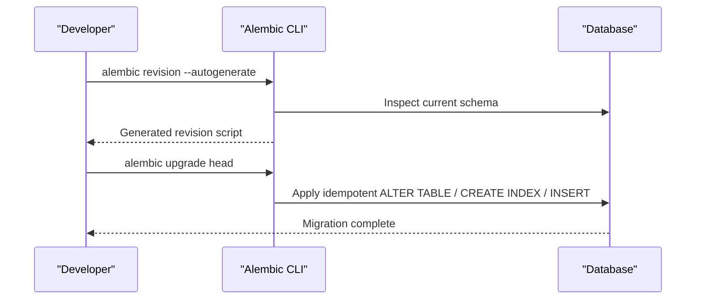
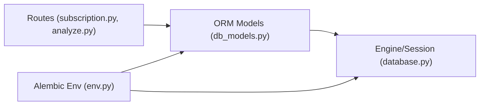
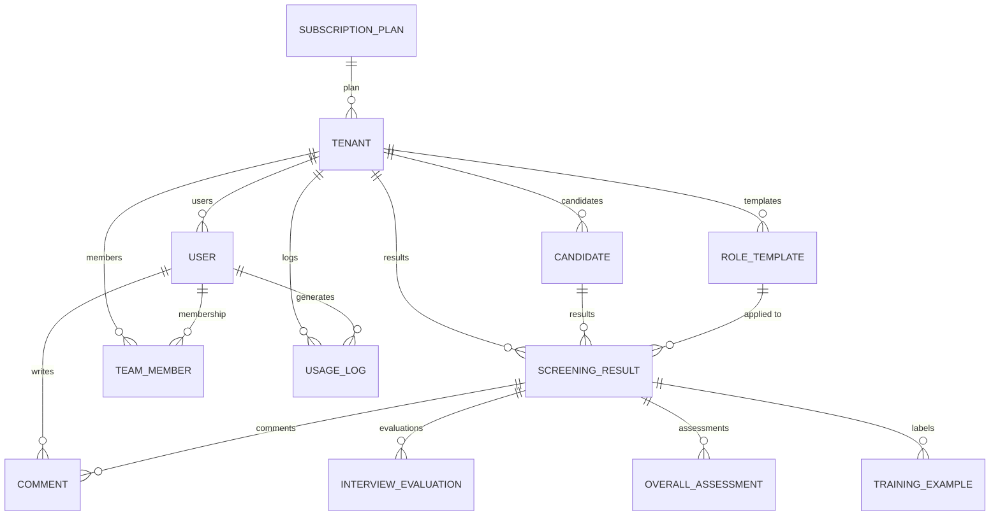

# Database Design

<cite>
**Referenced Files in This Document**
- [database.py](file://app/backend/db/database.py)
- [db_models.py](file://app/backend/models/db_models.py)
- [schemas.py](file://app/backend/models/schemas.py)
- [env.py](file://alembic/env.py)
- [script.py.mako](file://alembic/script.py.mako)
- [001_enrich_candidates_add_caches.py](file://alembic/versions/001_enrich_candidates_add_caches.py)
- [002_parser_snapshot_json.py](file://alembic/versions/002_parser_snapshot_json.py)
- [003_subscription_system.py](file://alembic/versions/003_subscription_system.py)
- [004_narrative_json.py](file://alembic/versions/004_narrative_json.py)
- [005_revoked_tokens.py](file://alembic/versions/005_revoked_tokens.py)
- [006_indexes_and_jdcache_created_at.py](file://alembic/versions/006_indexes_and_jdcache_created_at.py)
- [033_unique_constraints.py](file://alembic/versions/033_unique_constraints.py)
- [subscription.py](file://app/backend/routes/subscription.py)
- [analyze.py](file://app/backend/routes/analyze.py)
- [README.md](file://README.md)
</cite>

## Table of Contents
1. [Introduction](#introduction)
2. [Project Structure](#project-structure)
3. [Core Components](#core-components)
4. [Architecture Overview](#architecture-overview)
5. [Detailed Component Analysis](#detailed-component-analysis)
6. [Dependency Analysis](#dependency-analysis)
7. [Performance Considerations](#performance-considerations)
8. [Troubleshooting Guide](#troubleshooting-guide)
9. [Conclusion](#conclusion)
10. [Appendices](#appendices)

## Introduction
This document describes the database design for Resume AI by ThetaLogics, focusing on the multi-tenant architecture, core entities, constraints, and the Alembic-based migration system. It covers entity relationships, indexes, constraints, subscription and usage tracking, caching strategies, and operational considerations such as data lifecycle and reporting patterns.

## Project Structure
The database layer is implemented with SQLAlchemy ORM models and Alembic migrations. The backend connects to either SQLite (development) or PostgreSQL (production) using environment-driven configuration. Migrations evolve the schema over time, adding features such as subscription plans, usage logging, JD caching, and deduplication constraints.

**Diagram sources**
- [database.py:1-50](file://app/backend/db/database.py#L1-L50)
- [env.py:1-51](file://alembic/env.py#L1-L51)

**Section sources**
- [database.py:1-50](file://app/backend/db/database.py#L1-L50)
- [env.py:1-51](file://alembic/env.py#L1-L51)
- [README.md:539-578](file://README.md#L539-L578)

## Core Components
This section documents the core database entities central to multi-tenancy, candidate screening, subscriptions, and usage tracking.

- Tenant
  - Purpose: Root entity for multi-tenant isolation; tracks plan, subscription status, and usage.
  - Key fields: id, name, slug, plan_id, subscription_status, current_period_start/end, analyses_count_this_month, storage_used_bytes, usage_reset_at, stripe_* identifiers, metadata_json, scoring_weights, onboarding flags.
  - Constraints: Unique slug; indexes on subscription_status and stripe_customer_id; soft-deleted at with index.
  - Relationships: One-to-many with Users, Candidates, RoleTemplates, ScreeningResults, TeamMembers, UsageLogs; many-to-one with SubscriptionPlan.

- User
  - Purpose: Tenant-scoped user accounts with roles and platform admin compatibility.
  - Key fields: id, tenant_id, email, hashed_password, role, is_active, is_platform_admin, platform_role, email_* verification fields, created_at.
  - Constraints: UniqueConstraint on (tenant_id, email); indexes on email; default role and flags.
  - Relationships: Many-to-one with Tenant; one-to-one with TeamMember; many-to-many via comments and usage_logs.

- Candidate
  - Purpose: Tenant-scoped candidate profiles with deduplication fields and enriched parsing data.
  - Key fields: id, tenant_id, name, email, phone, resume_file_hash, resume_filename, resume_file_data, resume_converted_pdf_data, raw_resume_text, parsed_skills/education/work_exp, gap_analysis_json, current_role/company, total_years_exp, profile_quality, profile_updated_at, parser_snapshot_json, ai_professional_summary, created_at.
  - Constraints: Deduplication enforced via partial unique indexes on (tenant_id, email) and (tenant_id, resume_file_hash); indexes on email and resume_file_hash.
  - Relationships: Many-to-one with Tenant; one-to-many with ScreeningResults and TranscriptAnalyses.

- ScreeningResult
  - Purpose: Analysis outputs for a candidate against a role template; supports asynchronous narrative generation.
  - Key fields: id, tenant_id, candidate_id, role_template_id, resume_text, jd_text, parsed_data, analysis_result, narrative_json/status/error, status, is_active, version_number, role_category, weight_reasoning, suggested_weights_json, timestamp, deterministic_score/domain_match/core_skill_score, eligibility_status/reason, status_updated_at.
  - Constraints: Indexes on candidate_id and timestamp; partial uniqueness maintained via deduplication migration.
  - Relationships: Many-to-one with Tenant, Candidate, RoleTemplate; one-to-many with Comments, InterviewEvaluations, OverallAssessments, TrainingExamples.

- RoleTemplate
  - Purpose: Saved job descriptions with scoring weights and tags for reuse.
  - Key fields: id, tenant_id, name, jd_text, scoring_weights, tags, required_skills_override, nice_to_have_skills_override, created_at.
  - Relationships: Many-to-one with Tenant; one-to-many with ScreeningResults and TranscriptAnalyses.

- UsageLog
  - Purpose: Detailed usage tracking for billing and analytics.
  - Key fields: id, tenant_id (CASCADE), user_id (SET NULL), action, quantity, details, created_at.
  - Constraints: Indexes on tenant_id/action and tenant_id/created_at and created_at; foreign keys with cascades.
  - Relationships: Many-to-one with Tenant and User.

- SubscriptionPlan
  - Purpose: Tier definitions with pricing, limits, features, and ordering.
  - Key fields: id, name (unique), display_name, description, limits (JSON), price_monthly/yearly, currency, features (JSON), is_active, sort_order, timestamps.
  - Relationships: One-to-many with Tenants; many-to-many via PlanFeature.

- Additional Entities (selected)
  - JdCache: Shared JD parse cache keyed by MD5 of first 2000 characters.
  - Skill: Dynamic skills registry with aliases, domain, status, source, frequency.
  - RevokedToken: JWT token revocation tracking.
  - TranscriptAnalysis: Video interview transcript analysis results.
  - TrainingExample: Outcome-labeled examples for custom AI training.
  - HiringOutcome: Historical hiring decisions for learning.
  - TeamSkillProfile: Team-level skill profile snapshots.
  - SkillTrendSnapshot: Periodic skill demand/supply snapshots.

**Section sources**
- [db_models.py:34-76](file://app/backend/models/db_models.py#L34-L76)
- [db_models.py:78-109](file://app/backend/models/db_models.py#L78-L109)
- [db_models.py:129-170](file://app/backend/models/db_models.py#L129-L170)
- [db_models.py:188-225](file://app/backend/models/db_models.py#L188-L225)
- [db_models.py:229-245](file://app/backend/models/db_models.py#L229-L245)
- [db_models.py:111-125](file://app/backend/models/db_models.py#L111-L125)
- [db_models.py:13-32](file://app/backend/models/db_models.py#L13-L32)
- [db_models.py:372-380](file://app/backend/models/db_models.py#L372-L380)
- [db_models.py:381-393](file://app/backend/models/db_models.py#L381-L393)
- [db_models.py:397-405](file://app/backend/models/db_models.py#L397-L405)
- [db_models.py:339-354](file://app/backend/models/db_models.py#L339-L354)
- [db_models.py:357-368](file://app/backend/models/db_models.py#L357-L368)
- [db_models.py:736-766](file://app/backend/models/db_models.py#L736-L766)
- [db_models.py:768-784](file://app/backend/models/db_models.py#L768-L784)
- [db_models.py:786-800](file://app/backend/models/db_models.py#L786-L800)

## Architecture Overview
The system enforces strict tenant isolation via tenant_id on all entities. Subscription and usage tracking are centralized under Tenant and UsageLog, enabling per-plan quotas and billing analytics. The migration system evolves the schema safely with idempotent steps.

**Diagram sources**
- [db_models.py:34-76](file://app/backend/models/db_models.py#L34-L76)
- [db_models.py:78-109](file://app/backend/models/db_models.py#L78-L109)
- [db_models.py:129-170](file://app/backend/models/db_models.py#L129-L170)
- [db_models.py:188-225](file://app/backend/models/db_models.py#L188-L225)
- [db_models.py:229-245](file://app/backend/models/db_models.py#L229-L245)
- [db_models.py:111-125](file://app/backend/models/db_models.py#L111-L125)

## Detailed Component Analysis

### Multi-Tenant Architecture and Subscription Management
- Tenant isolation
  - All entities include tenant_id to ensure cross-service scoping.
  - Deduplication constraints on Candidate enforce uniqueness per tenant by email and file hash using partial unique indexes.
- Subscription and usage
  - SubscriptionPlan defines tiers with limits (analyses_per_month, batch_size, storage_gb, features).
  - Tenant stores subscription_status, billing periods, monthly counters, and Stripe identifiers.
  - UsageLog captures actions and quantities per tenant for analytics and enforcement.
- Migration-driven evolution
  - Initial seeding of plans and linking existing tenants to a default plan.
  - Idempotent upgrades/downgrades for plan fields, tenant usage columns, and usage_log indexes.

**Diagram sources**
- [subscription.py:321-380](file://app/backend/routes/subscription.py#L321-L380)
- [db_models.py:34-76](file://app/backend/models/db_models.py#L34-L76)
- [db_models.py:13-32](file://app/backend/models/db_models.py#L13-L32)

**Section sources**
- [db_models.py:34-76](file://app/backend/models/db_models.py#L34-L76)
- [db_models.py:13-32](file://app/backend/models/db_models.py#L13-L32)
- [db_models.py:111-125](file://app/backend/models/db_models.py#L111-L125)
- [003_subscription_system.py:43-252](file://alembic/versions/003_subscription_system.py#L43-L252)
- [subscription.py:321-380](file://app/backend/routes/subscription.py#L321-L380)

### Deduplication and Candidate Enrichment
- Deduplication strategy
  - Three-layer deduplication: email, file hash, and name+phone.
  - Partial unique indexes maintain uniqueness per tenant for non-null fields.
- Enrichment pipeline
  - Candidate stores resume metadata, parsed skills/education/work, gap analysis, and a parser snapshot for auditability.
  - JdCache provides shared, versioned JD parsing cache across workers.

**Diagram sources**
- [db_models.py:129-170](file://app/backend/models/db_models.py#L129-L170)
- [db_models.py:372-380](file://app/backend/models/db_models.py#L372-L380)
- [033_unique_constraints.py:12-110](file://alembic/versions/033_unique_constraints.py#L12-L110)
- [analyze.py:329-350](file://app/backend/routes/analyze.py#L329-L350)

**Section sources**
- [db_models.py:129-170](file://app/backend/models/db_models.py#L129-L170)
- [db_models.py:372-380](file://app/backend/models/db_models.py#L372-L380)
- [033_unique_constraints.py:12-110](file://alembic/versions/033_unique_constraints.py#L12-L110)
- [analyze.py:329-350](file://app/backend/routes/analyze.py#L329-L350)

### Migration System and Schema Evolution
- Alembic configuration
  - env.py loads Base and registers models for autogenerate.
  - script.py.mako provides templated upgrade/downgrade bodies.
- Migration highlights
  - 001: Enrich candidates with profile fields; add jd_cache and skills tables.
  - 002: Add parser_snapshot_json to candidates.
  - 003: Add subscription plan fields, tenant usage columns, and usage_logs table; seed plans and link tenants.
  - 004: Add narrative_json to screening_results.
  - 005: Add revoked_tokens table for token revocation.
  - 006: Add indexes to screening_results and created_at to jd_cache.
  - 033: Deduplicate screening_results and candidates; create partial unique indexes.

**Diagram sources**
- [env.py:1-51](file://alembic/env.py#L1-L51)
- [script.py.mako:1-29](file://alembic/script.py.mako#L1-L29)
- [001_enrich_candidates_add_caches.py:42-112](file://alembic/versions/001_enrich_candidates_add_caches.py#L42-L112)
- [003_subscription_system.py:43-252](file://alembic/versions/003_subscription_system.py#L43-L252)
- [006_indexes_and_jdcache_created_at.py:35-62](file://alembic/versions/006_indexes_and_jdcache_created_at.py#L35-L62)
- [033_unique_constraints.py:12-110](file://alembic/versions/033_unique_constraints.py#L12-L110)

**Section sources**
- [env.py:1-51](file://alembic/env.py#L1-L51)
- [script.py.mako:1-29](file://alembic/script.py.mako#L1-L29)
- [001_enrich_candidates_add_caches.py:42-112](file://alembic/versions/001_enrich_candidates_add_caches.py#L42-L112)
- [002_parser_snapshot_json.py:21-34](file://alembic/versions/002_parser_snapshot_json.py#L21-L34)
- [003_subscription_system.py:43-252](file://alembic/versions/003_subscription_system.py#L43-L252)
- [004_narrative_json.py:24-37](file://alembic/versions/004_narrative_json.py#L24-L37)
- [005_revoked_tokens.py:41-61](file://alembic/versions/005_revoked_tokens.py#L41-L61)
- [006_indexes_and_jdcache_created_at.py:35-62](file://alembic/versions/006_indexes_and_jdcache_created_at.py#L35-L62)
- [033_unique_constraints.py:12-110](file://alembic/versions/033_unique_constraints.py#L12-L110)

### Data Validation Rules and Business Logic Constraints
- Candidate deduplication
  - Partial unique indexes enforce uniqueness per tenant by email and file hash.
  - Deduplication migration removes duplicates and preserves the most recent row per grouping.
- ScreeningResult deduplication
  - Deduplication migration ensures only one active result per (tenant_id, candidate_id, role_template_id) group.
- Usage enforcement
  - Quota checks compute projected usage vs plan limits and return allowed/current/limit/message.
- Token revocation
  - RevokedTokens table prevents reuse of logged-out refresh tokens.

**Section sources**
- [033_unique_constraints.py:12-110](file://alembic/versions/033_unique_constraints.py#L12-L110)
- [subscription.py:321-380](file://app/backend/routes/subscription.py#L321-L380)
- [db_models.py:397-405](file://app/backend/models/db_models.py#L397-L405)

### Data Access Patterns, Caching, and Performance
- Access patterns
  - Queries scoped by tenant_id; joins across Tenant/User/Candidate/ScreeningResult are common.
  - UsageLog queries filter by tenant_id and created_at for analytics.
- Caching
  - JdCache stores MD5-keyed JD parse results with versioning; created_at index aids cleanup.
  - Skills registry supports dynamic skill discovery and fuzzy matching.
- Indexes and constraints
  - Strategic indexes on tenant_id/action, tenant_id/created_at, created_at, candidate_id, timestamp, email, resume_file_hash, jti, and subscription_status improve query performance.
- Connection pooling
  - PostgreSQL uses pool settings; SQLite uses single-threaded connections with check_same_thread disabled.

**Section sources**
- [db_models.py:111-125](file://app/backend/models/db_models.py#L111-L125)
- [db_models.py:372-380](file://app/backend/models/db_models.py#L372-L380)
- [db_models.py:381-393](file://app/backend/models/db_models.py#L381-L393)
- [006_indexes_and_jdcache_created_at.py:35-62](file://alembic/versions/006_indexes_and_jdcache_created_at.py#L35-L62)
- [database.py:18-37](file://app/backend/db/database.py#L18-L37)

### Data Lifecycle, Retention, and Backup Strategies
- JD cache retention
  - Created with server_default timestamp; migration adds created_at if missing; background tasks can prune by age.
- Deduplication and archival
  - Deduplication migrations remove stale rows; keep most recent per grouping to reduce storage and maintain referential integrity.
- Backup recommendations
  - Use logical backups for PostgreSQL; schedule regular snapshots; retain backups per regulatory requirements.

[No sources needed since this section provides general guidance]

## Dependency Analysis
The database layer depends on SQLAlchemy ORM and Alembic for schema evolution. Routes consume models for tenant-scoped operations and enforce usage quotas.

**Diagram sources**
- [subscription.py:321-380](file://app/backend/routes/subscription.py#L321-L380)
- [analyze.py:329-350](file://app/backend/routes/analyze.py#L329-L350)
- [db_models.py:13-32](file://app/backend/models/db_models.py#L13-L32)
- [database.py:1-50](file://app/backend/db/database.py#L1-L50)
- [env.py:1-51](file://alembic/env.py#L1-L51)

**Section sources**
- [subscription.py:321-380](file://app/backend/routes/subscription.py#L321-L380)
- [analyze.py:329-350](file://app/backend/routes/analyze.py#L329-L350)
- [db_models.py:13-32](file://app/backend/models/db_models.py#L13-L32)
- [database.py:1-50](file://app/backend/db/database.py#L1-L50)
- [env.py:1-51](file://alembic/env.py#L1-L51)

## Performance Considerations
- Use tenant_id filters on all queries to leverage indexes.
- Prefer batch operations for bulk inserts (e.g., usage_logs) to reduce overhead.
- Monitor slow queries on screening_results by candidate_id and timestamp.
- For PostgreSQL, tune pool settings; for SQLite, avoid multi-threaded writes.

[No sources needed since this section provides general guidance]

## Troubleshooting Guide
- Migration errors
  - Ensure env.py registers models and DATABASE_URL is set; run offline/online migrations accordingly.
- Deduplication anomalies
  - Confirm partial unique indexes exist; re-run deduplication migration if duplicates persist.
- Usage quota false positives/negatives
  - Verify plan limits JSON and tenant usage counters; confirm monthly reset logic.

**Section sources**
- [env.py:1-51](file://alembic/env.py#L1-L51)
- [033_unique_constraints.py:12-110](file://alembic/versions/033_unique_constraints.py#L12-L110)
- [subscription.py:321-380](file://app/backend/routes/subscription.py#L321-L380)

## Conclusion
The database design centers on robust multi-tenancy, subscription-driven usage enforcement, and scalable caching. Alembic’s idempotent migrations enable safe evolution, while strategic indexes and constraints ensure performance and integrity. The documented access patterns and troubleshooting steps support reliable operations.

[No sources needed since this section summarizes without analyzing specific files]

## Appendices

### Appendix A: Entity Relationship Diagram (ERD)

**Diagram sources**
- [db_models.py:34-76](file://app/backend/models/db_models.py#L34-L76)
- [db_models.py:78-109](file://app/backend/models/db_models.py#L78-L109)
- [db_models.py:129-170](file://app/backend/models/db_models.py#L129-L170)
- [db_models.py:188-225](file://app/backend/models/db_models.py#L188-L225)
- [db_models.py:229-245](file://app/backend/models/db_models.py#L229-L245)
- [db_models.py:111-125](file://app/backend/models/db_models.py#L111-L125)

### Appendix B: Sample Data Structures
- Candidate
  - Fields: tenant_id, name, email, phone, resume_file_hash, raw_resume_text, parsed_skills, parsed_education, parsed_work_exp, gap_analysis_json, current_role, current_company, total_years_exp, profile_quality, profile_updated_at, parser_snapshot_json, ai_professional_summary, created_at.
- ScreeningResult
  - Fields: tenant_id, candidate_id, role_template_id, resume_text, jd_text, parsed_data, analysis_result, narrative_json/status/error, status, is_active, version_number, role_category, weight_reasoning, suggested_weights_json, timestamp, deterministic_score/domain_match/core_skill_score, eligibility_status/reason, status_updated_at.
- UsageLog
  - Fields: tenant_id, user_id, action, quantity, details, created_at.

**Section sources**
- [db_models.py:129-170](file://app/backend/models/db_models.py#L129-L170)
- [db_models.py:188-225](file://app/backend/models/db_models.py#L188-L225)
- [db_models.py:111-125](file://app/backend/models/db_models.py#L111-L125)

### Appendix C: Complex Queries and Reporting Scenarios
- Tenant usage history
  - Filter UsageLog by tenant_id, order by created_at desc, limit N for recent activity.
- Candidate analysis trends
  - Group ScreeningResult by candidate_id and timestamp to compute pass/fail rates and score distributions.
- Hiring outcomes analytics
  - Join HiringOutcome with Candidate and RoleTemplate to analyze decision trends by category and time.

**Section sources**
- [subscription.py:382-397](file://app/backend/routes/subscription.py#L382-L397)
- [db_models.py:736-766](file://app/backend/models/db_models.py#L736-L766)