# Database Design

<cite>
**Referenced Files in This Document**
- [database.py](file://app/backend/db/database.py)
- [db_models.py](file://app/backend/models/db_models.py)
- [schemas.py](file://app/backend/models/schemas.py)
- [env.py](file://alembic/env.py)
- [script.py.mako](file://alembic/script.py.mako)
- [001_enrich_candidates_add_caches.py](file://alembic/versions/001_enrich_candidates_add_caches.py)
- [002_parser_snapshot_json.py](file://alembic/versions/002_parser_snapshot_json.py)
- [003_subscription_system.py](file://alembic/versions/003_subscription_system.py)
- [004_narrative_json.py](file://alembic/versions/004_narrative_json.py)
- [005_revoked_tokens.py](file://alembic/versions/005_revoked_tokens.py)
- [006_indexes_and_jdcache_created_at.py](file://alembic/versions/006_indexes_and_jdcache_created_at.py)
- [007_narrative_status.py](file://alembic/versions/007_narrative_status.py)
- [008_analysis_queue_system.py](file://alembic/versions/008_analysis_queue_system.py)
- [009_intelligent_scoring_weights.py](file://alembic/versions/009_intelligent_scoring_weights.py)
- [010_add_jd_text_to_screening_result.py](file://alembic/versions/010_add_jd_text_to_screening_result.py)
- [011_narrative_tracking_enhancement.py](file://alembic/versions/011_narrative_tracking_enhancement.py)
- [012_admin_foundation.py](file://alembic/versions/012_admin_foundation.py)
- [013_webhooks_and_notifications.py](file://alembic/versions/013_webhooks_and_notifications.py)
- [014_billing_system.py](file://alembic/versions/014_billing_system.py)
- [015_add_resume_file_storage.py](file://alembic/versions/015_add_resume_file_storage.py)
- [016_deterministic_scoring_fields.py](file://alembic/versions/016_deterministic_scoring_fields.py)
- [017_interview_kit_enhancement.py](file://alembic/versions/017_interview_kit_enhancement.py)
- [018_ats_evolution.py](file://alembic/versions/018_ats_evolution.py)
- [019_candidate_profile_enhancements.py](file://alembic/versions/019_candidate_profile_enhancements.py)
- [020_doc_to_pdf_conversion.py](file://alembic/versions/020_doc_to_pdf_conversion.py)
- [021_enterprise_platform_admin.py](file://alembic/versions/021_enterprise_platform_admin.py)
- [022_historical_learning_system.py](file://alembic/versions/022_historical_learning_system.py)
- [023_skill_template_persistence.py](file://alembic/versions/023_skill_template_persistence.py)
- [024_audit_fixes.py](file://alembic/versions/024_audit_fixes.py)
- [025_template_skill_overrides.py](file://alembic/versions/025_template_skill_overrides.py)
- [026_audit_log_system.py](file://alembic/versions/026_audit_log_system.py)
- [027_billing_events.py](file://alembic/versions/027_billing_events.py)
- [028_invoices.py](file://alembic/versions/028_invoices.py)
- [029_dunning_system.py](file://alembic/versions/029_dunning_system.py)
- [030_usage_alerts.py](file://alembic/versions/030_usage_alerts.py)
- [031_onboarding_flag.py](file://alembic/versions/031_onboarding_flag.py)
- [032_sso_config.py](file://alembic/versions/032_sso_config.py)
- [main.py](file://app/backend/main.py)
- [auth.py](file://app/backend/middleware/auth.py)
- [subscription.py](file://app/backend/routes/subscription.py)
- [analyze.py](file://app/backend/routes/analyze.py)
- [auth_routes.py](file://app/backend/routes/auth.py)
- [queue_api.py](file://app/backend/routes/queue_api.py)
- [admin.py](file://app/backend/routes/admin.py)
- [candidates.py](file://app/backend/routes/candidates.py)
- [upload.py](file://app/backend/routes/upload.py)
- [interview_kit.py](file://app/backend/routes/interview_kit.py)
- [enterprise_security.py](file://app/backend/services/enterprise_security.py)
- [queue_manager.py](file://app/backend/services/queue_manager.py)
- [analysis_service.py](file://app/backend/services/analysis_service.py)
- [weight_suggester.py](file://app/backend/services/weight_suggester.py)
- [audit_service.py](file://app/backend/services/audit_service.py)
- [feature_flag_service.py](file://app/backend/services/feature_flag_service.py)
- [webhook_service.py](file://app/backend/services/webhook_service.py)
- [eligibility_service.py](file://app/backend/services/eligibility_service.py)
- [fit_scorer.py](file://app/backend/services/fit_scorer.py)
- [hybrid_pipeline.py](file://app/backend/services/hybrid_pipeline.py)
- [billing/invoice_service.py](file://app/backend/services/billing/invoice_service.py)
- [billing/dunning_service.py](file://app/backend/services/billing/dunning_service.py)
- [billing/webhook_processor.py](file://app/backend/services/billing/webhook_processor.py)
- [sso_service.py](file://app/backend/services/sso_service.py)
- [usage_alert_service.py](file://app/backend/services/usage_alert_service.py)
</cite>

## Update Summary
**Changes Made**
- Added comprehensive documentation for new enterprise security features including impersonation sessions, security events, and granular platform roles
- Enhanced historical learning system with hiring outcomes, team skill profiles, skill trend snapshots, and outcome patterns
- Expanded candidate profile capabilities with AI professional summaries and candidate notes
- Integrated billing ecosystem with invoices, dunning records, usage alerts, and billing events
- Added SSO configuration management for SAML/OIDC integration
- Implemented field-level audit logging system for candidate and screening result change tracking
- Enhanced tenant management with onboarding completion tracking
- Updated migration documentation to include all new enterprise-grade features

## Table of Contents
1. [Introduction](#introduction)
2. [Project Structure](#project-structure)
3. [Core Components](#core-components)
4. [Architecture Overview](#architecture-overview)
5. [Detailed Component Analysis](#detailed-component-analysis)
6. [Dependency Analysis](#dependency-analysis)
7. [Performance Considerations](#performance-considerations)
8. [Troubleshooting Guide](#troubleshooting-guide)
9. [Conclusion](#conclusion)
10. [Appendices](#appendices)

## Introduction
This document describes the database design for Resume AI by ThetaLogics. It covers the entity relationship model, field definitions, indexes, constraints, multi-tenant architecture, subscription and usage tracking, the Alembic migration system, data validation rules, business logic constraints, referential integrity, data access patterns, caching strategies, performance considerations, data lifecycle and retention, backup strategies, and representative queries and reporting scenarios.

**Updated** Enhanced with comprehensive enterprise security features, historical learning analytics, advanced billing management, SSO integration, field-level audit trails, and extensive candidate profile enhancements

## Project Structure
The database layer is implemented with SQLAlchemy declarative models and Alembic migrations. The application bootstraps database tables on startup and exposes tenant-aware APIs that enforce usage limits and track consumption. Recent enhancements included connection pooling for PostgreSQL, token revocation support, strategic indexing for improved query performance, a comprehensive queue system for scalable analysis processing, platform administration capabilities, webhook notifications, billing configuration management, native resume file storage with download functionality, deterministic scoring with eligibility gating, and the Interview Kit Evaluation Framework for structured interview scoring.

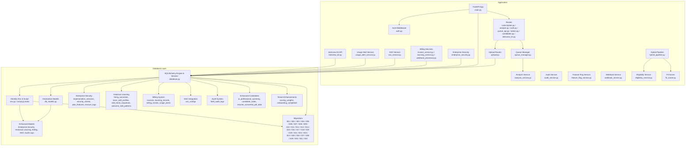

**Diagram sources**
- [main.py:152-172](file://app/backend/main.py#L152-L172)
- [auth.py:19-46](file://app/backend/middleware/auth.py#L19-L46)
- [subscription.py:162-253](file://app/backend/routes/subscription.py#L162-L253)
- [analyze.py:354-501](file://app/backend/routes/analyze.py#L354-L501)
- [queue_api.py:1-464](file://app/backend/routes/queue_api.py#L1-L464)
- [admin.py:1-800](file://app/backend/routes/admin.py#L1-L800)
- [candidates.py:504-559](file://app/backend/routes/candidates.py#L504-L559)
- [upload.py:1-361](file://app/backend/routes/upload.py#L1-L361)
- [interview_kit.py:1-221](file://app/backend/routes/interview_kit.py#L1-L221)
- [enterprise_security.py:1-200](file://app/backend/services/enterprise_security.py#L1-L200)
- [billing/invoice_service.py:1-200](file://app/backend/services/billing/invoice_service.py#L1-L200)
- [billing/dunning_service.py:1-200](file://app/backend/services/billing/dunning_service.py#L1-L200)
- [billing/webhook_processor.py:1-200](file://app/backend/services/billing/webhook_processor.py#L1-L200)
- [sso_service.py:1-200](file://app/backend/services/sso_service.py#L1-L200)
- [usage_alert_service.py:1-200](file://app/backend/services/usage_alert_service.py#L1-L200)
- [queue_manager.py:1-612](file://app/backend/services/queue_manager.py#L1-L612)
- [analysis_service.py:1-121](file://app/backend/services/analysis_service.py#L1-L121)
- [audit_service.py:1-40](file://app/backend/services/audit_service.py#L1-L40)
- [feature_flag_service.py:1-94](file://app/backend/services/feature_flag_service.py#L1-L94)
- [webhook_service.py:1-138](file://app/backend/services/webhook_service.py#L1-L138)
- [database.py:1-50](file://app/backend/db/database.py#L1-L50)
- [db_models.py:11-816](file://app/backend/models/db_models.py#L11-L816)
- [env.py:1-51](file://alembic/env.py#L1-L51)
- [script.py.mako:1-29](file://alembic/script.py.mako#L1-L29)
- [008_analysis_queue_system.py:1-347](file://alembic/versions/008_analysis_queue_system.py#L1-L347)
- [012_admin_foundation.py:1-161](file://alembic/versions/012_admin_foundation.py#L1-L161)
- [013_webhooks_and_notifications.py:1-145](file://alembic/versions/013_webhooks_and_notifications.py#L1-L145)
- [014_billing_system.py:1-67](file://alembic/versions/014_billing_system.py#L1-L67)
- [015_add_resume_file_storage.py:1-49](file://alembic/versions/015_add_resume_file_storage.py#L1-L49)
- [016_deterministic_scoring_fields.py:1-74](file://alembic/versions/016_deterministic_scoring_fields.py#L1-L74)
- [017_interview_kit_enhancement.py:1-61](file://alembic/versions/017_interview_kit_enhancement.py#L1-L61)
- [018_ats_evolution.py:1-75](file://alembic/versions/018_ats_evolution.py#L1-L75)
- [019_candidate_profile_enhancements.py:1-66](file://alembic/versions/019_candidate_profile_enhancements.py#L1-L66)
- [020_doc_to_pdf_conversion.py:1-46](file://alembic/versions/020_doc_to_pdf_conversion.py#L1-L46)
- [021_enterprise_platform_admin.py:1-179](file://alembic/versions/021_enterprise_platform_admin.py#L1-L179)
- [022_historical_learning_system.py:1-166](file://alembic/versions/022_historical_learning_system.py#L1-L166)
- [023_skill_template_persistence.py:1-35](file://alembic/versions/023_skill_template_persistence.py#L1-L35)
- [024_audit_fixes.py:1-40](file://alembic/versions/024_audit_fixes.py#L1-L40)
- [025_template_skill_overrides.py:1-23](file://alembic/versions/025_template_skill_overrides.py#L1-L23)
- [026_audit_log_system.py:1-33](file://alembic/versions/026_audit_log_system.py#L1-L33)
- [027_billing_events.py:1-30](file://alembic/versions/027_billing_events.py#L1-L30)
- [028_invoices.py:1-37](file://alembic/versions/028_invoices.py#L1-L37)
- [029_dunning_system.py:1-43](file://alembic/versions/029_dunning_system.py#L1-L43)
- [030_usage_alerts.py:1-31](file://alembic/versions/030_usage_alerts.py#L1-L31)
- [031_onboarding_flag.py:1-21](file://alembic/versions/031_onboarding_flag.py#L1-L21)
- [032_sso_config.py:1-36](file://alembic/versions/032_sso_config.py#L1-L36)
- [eligibility_service.py:1-80](file://app/backend/services/eligibility_service.py#L1-L80)
- [fit_scorer.py:117-230](file://app/backend/services/fit_scorer.py#L117-L230)
- [hybrid_pipeline.py:1266-1357](file://app/backend/services/hybrid_pipeline.py#L1266-L1357)

**Section sources**
- [main.py:152-172](file://app/backend/main.py#L152-L172)
- [database.py:1-50](file://app/backend/db/database.py#L1-L50)
- [env.py:1-51](file://alembic/env.py#L1-L51)

## Core Components
This section documents the core entities and their attributes relevant to the multi-tenant architecture, screening, templates, usage tracking, enhanced security features, platform administration, webhook notifications, billing configuration, native resume file storage capabilities, the new deterministic scoring framework with eligibility gating, and the Interview Kit Evaluation Framework for structured interview scoring.

- Tenant
  - Purpose: Multi-tenant container with subscription and usage tracking.
  - Key fields: id, name, slug, plan_id, timestamps.
  - Enhanced fields: subscription_status, current_period_start/end, analyses_count_this_month, storage_used_bytes, usage_reset_at, stripe_customer_id, stripe_subscription_id, subscription_updated_at, suspended_at, suspended_reason, metadata_json, onboarding_completed, onboarding_completed_at, scoring_weights.
  - Indexes: subscription_status, stripe_customer_id; relationships: plan, users, candidates, templates, results, team_members, usage_logs.
  - Constraints: plan_id FK to subscription_plans; default subscription_status active; usage counters initialized to zero.

- SubscriptionPlan
  - Purpose: Defines pricing tiers and feature sets.
  - Key fields: id, name (unique), display_name, description, limits (JSON), price_monthly/yearly, currency, features (JSON), is_active, sort_order, timestamps.
  - Indexes: composite (is_active, sort_order); relationships: tenants.

- User
  - Purpose: Tenant member with role and authentication linkage.
  - Key fields: id, tenant_id (FK), email (unique), hashed_password, role, is_active, is_platform_admin, platform_role, timestamps.
  - **Updated** Enhanced with platform_role field supporting granular roles: super_admin, billing_admin, support, security_admin, readonly.
  - Indexes: email; relationships: tenant, team_member, comments, usage_logs.

- Candidate
  - Purpose: Resume/profile storage with enrichment and caching fields, now including native file storage.
  - Key fields: id, tenant_id (FK), name, email, phone, timestamps; enrichment: resume_file_hash (MD5), resume_filename (String 255), resume_file_data (LargeBinary/BYTEA), resume_converted_pdf_data (LargeBinary), raw_resume_text, parsed_skills/education/work_exp, gap_analysis_json, current_role/company, total_years_exp, profile_quality, profile_updated_at; parser_snapshot_json.
  - **Updated** Enhanced with ai_professional_summary (Text) and candidate_notes relationship.
  - Indexes: email, resume_file_hash; relationships: tenant, results, transcript_analyses.

- ScreeningResult
  - Purpose: Stores analysis outputs for a candidate/job combination with deterministic scoring framework.
  - Key fields: id, tenant_id (FK), candidate_id (FK), role_template_id (FK), resume_text, jd_text, parsed_data (JSON), analysis_result (JSON), narrative_json (TEXT, nullable), narrative_status, narrative_error, status, is_active, version_number, role_category, weight_reasoning, suggested_weights_json, timestamp.
  - **Updated** Deterministic scoring fields: deterministic_score (Integer), domain_match_score (Float), core_skill_score (Float), eligibility_status (Boolean), eligibility_reason (String 100).
  - **Updated** Enhanced with status_updated_at timestamp for tracking screening result status changes.
  - **Updated** Interview evaluation relationships: evaluations (one-to-many), overall_assessment (one-to-many).
  - Indexes: candidate_id, timestamp, tenant_id+timestamp.

- RoleTemplate
  - Purpose: Job description templates with scoring weights and tags.
  - Key fields: id, tenant_id (FK), name, jd_text, scoring_weights (JSON), tags, required_skills_override, nice_to_have_skills_override, timestamps.
  - **Updated** Enhanced with skill template persistence fields.
  - Relationships: tenant, results, transcript_analyses.

- InterviewEvaluation
  - Purpose: Per-question recruiter evaluation with rating and notes for structured interview scoring.
  - Key fields: id, result_id (FK), user_id (FK), question_category (String 30), question_index (Integer), rating (String 10), notes (Text), created_at, updated_at.
  - **New** Unique constraint: (result_id, user_id, question_category, question_index).
  - Relationships: result (ScreeningResult), evaluator (User).
  - Indexes: result_id, user_id, question_category, question_index.

- OverallAssessment
  - Purpose: Recruiter's overall assessment and recommendation for hiring manager scorecard.
  - Key fields: id, result_id (FK), user_id (FK), overall_assessment (Text), recruiter_recommendation (String 10), created_at, updated_at.
  - **New** Unique constraint: (result_id, user_id).
  - Relationships: result (ScreeningResult), evaluator (User).
  - Indexes: result_id, user_id.

- UsageLog
  - Purpose: Audit trail of actions and quantities per tenant/user.
  - Key fields: id, tenant_id (FK, CASCADE), user_id (FK, SET NULL), action, quantity, details (JSON), created_at; indexes: tenant+action, tenant+created_at, created_at.
  - Relationships: tenant, user.

- RevokedToken
  - Purpose: Tracks revoked JWT tokens to prevent reuse after logout.
  - Key fields: id, jti (unique, indexed), revoked_at, expires_at.
  - Indexes: id, jti (unique); relationships: none.

- AuditLog
  - Purpose: Platform admin audit trail for all administrative actions.
  - Key fields: id, actor_user_id (FK, SET NULL), actor_email, action, resource_type, resource_id, details (JSON), ip_address, created_at; indexes: action, created_at.
  - Relationships: none.

- FeatureFlag
  - Purpose: Global feature flags for platform-wide feature control.
  - Key fields: id, key (unique), display_name, description, enabled_globally, created_at, updated_at.
  - Indexes: key; relationships: tenant_feature_overrides.

- TenantFeatureOverride
  - Purpose: Per-tenant overrides for feature flags.
  - Key fields: id, tenant_id (FK, CASCADE), feature_flag_id (FK, CASCADE), enabled, created_at; unique constraint (tenant_id, feature_flag_id).
  - Relationships: feature_flag.

- RateLimitConfig
  - Purpose: Per-tenant rate limiting configuration.
  - Key fields: id, tenant_id (FK, CASCADE, unique), requests_per_minute, llm_concurrent_max, created_at, updated_at.
  - Relationships: none.

- Webhook
  - Purpose: Tenant webhook configuration for event notifications.
  - Key fields: id, tenant_id (FK, CASCADE), url, secret, events (JSON), is_active, failure_count, last_triggered_at, last_failure_at, created_at, updated_at.
  - Indexes: id, tenant_id; relationships: deliveries.

- WebhookDelivery
  - Purpose: Record of a webhook delivery attempt.
  - Key fields: id, webhook_id (FK, CASCADE), event, payload (JSON), response_status, response_body, success, attempt, created_at.
  - Indexes: id, webhook_id; relationships: webhook.

- PlatformConfig
  - Purpose: Platform-level key-value configuration for billing provider settings.
  - Key fields: id, config_key (unique), config_value, description, updated_at, updated_by (FK, SET NULL).
  - Indexes: id, config_key; relationships: users.

- EligibilityResult
  - Purpose: Structured eligibility decision with reason and details.
  - Key fields: eligible (Boolean), reason (Optional[String]), details (Dict).
  - Used by eligibility_service to apply deterministic gating rules.

- Queue System Tables
  - AnalysisJobs: Main queue table for tracking analysis tasks with priority, status, and retry management.
  - AnalysisResults: Immutable storage for completed analyses with quality assurance and metrics.
  - AnalysisArtifacts: Store input files and intermediate data with deduplication support.
  - JobMetrics: Performance and quality metrics for monitoring queue operations.

- Enterprise Security Tables
  - **New** impersonation_sessions: Manages admin impersonation with token hashing and expiration tracking.
  - **New** security_events: Comprehensive security event logging with tenant/user context.
  - **New** plan_features: Links subscription plans to feature flags with enablement control.
  - **New** erasure_logs: GDPR-compliant data erasure tracking and audit trail.

- Historical Learning Tables
  - **New** hiring_outcomes: Captures hiring decisions with candidate, role, and feedback data.
  - **New** team_skill_profiles: Maintains team skill composition and evolution tracking.
  - **New** skill_trend_snapshots: Time-series skill demand and supply tracking.
  - **New** outcome_skill_patterns: Analytical patterns linking skills to hiring outcomes.

- Billing System Tables
  - **New** invoices: Payment receipt tracking with period coverage and line items.
  - **New** dunning_records: Failed payment retry tracking with configurable schedules.
  - **New** billing_events: Webhook audit logging for payment processor events.
  - **New** usage_alerts: Threshold-based usage notification tracking.

- SSO Configuration Tables
  - **New** sso_configs: SAML/OIDC identity provider configuration management.

- Audit System Tables
  - **New** field_audit_logs: Field-level change tracking for candidate and screening result modifications.

- Enhanced Candidate Tables
  - **New** candidate_notes: Collaborative note-taking with user and tenant association.
  - **New** skill_classification_templates: Persistent skill classification templates for role templates.

**Section sources**
- [db_models.py:11-816](file://app/backend/models/db_models.py#L11-L816)

## Architecture Overview
The system enforces tenant isolation by scoping all entities to a tenant_id foreign key. Usage enforcement occurs at the route layer by checking plan limits and incrementing counters, with detailed usage recorded in UsageLog. The Alembic migration system evolves schema safely with idempotent operations. Recent enhancements included token revocation support, strategic indexing for improved performance, a comprehensive queue system for scalable analysis processing, platform administration capabilities, webhook notifications, billing configuration management, native resume file storage with download functionality, deterministic scoring framework with eligibility gating, and the Interview Kit Evaluation Framework for structured interview scoring and assessment.

```mermaid
erDiagram
SUBSCRIPTION_PLANS ||--o{ TENANTS : "has plan"
TENANTS ||--o{ USERS : "contains"
TENANTS ||--o{ CANDIDATES : "owns"
TENANTS ||--o{ ROLE_TEMPLATES : "owns"
TENANTS ||--o{ SCREENING_RESULTS : "produces"
TENANTS ||--o{ TEAM_MEMBERS : "has"
TENANTS ||--o{ USAGE_LOGS : "generates"
TENANTS ||--o{ WEBHOOKS : "configures"
TENANTS ||--o{ RATE_LIMIT_CONFIGS : "has"
TENANTS ||--o{ IMPERSONATION_SESSIONS : "manages"
TENANTS ||--o{ SECURITY_EVENTS : "generates"
TENANTS ||--o{ SKILL_TREND_SNAPSHOTS : "tracks"
TENANTS ||--o{ USAGE_ALERTS : "monitors"
USERS ||--o{ TEAM_MEMBERS : "member_of"
USERS ||--o{ COMMENTS : "authored"
USERS ||--o{ USAGE_LOGS : "performed"
USERS ||--o{ PLATFORM_CONFIGS : "updates"
USERS ||--o{ INTERVIEW_EVALUATIONS : "creates"
USERS ||--o{ OVERALL_ASSESSMENTS : "creates"
USERS ||--o{ CANDIDATE_NOTES : "writes"
USERS ||--o{ FIELD_AUDIT_LOGS : "creates"
CANDIDATES ||--o{ SCREENING_RESULTS : "analyzed"
CANDIDATES ||--o{ TRANSCRIPT_ANALYSES : "analyzed"
CANDIDATES ||--o{ CANDIDATE_NOTES : "has"
ROLE_TEMPLATES ||--o{ SCREENING_RESULTS : "used_in"
ROLE_TEMPLATES ||--o{ SKILL_CLASSIFICATION_TEMPLATES : "uses"
ROLE_TEMPLATES ||--o{ OUTCOME_SKILL_PATTERNS : "influences"
SCREENING_RESULTS ||--o{ COMMENTS : "commented_on"
SCREENING_RESULTS ||--o{ TRAINING_EXAMPLES : "generates"
SCREENING_RESULTS ||--o{ INTERVIEW_EVALUATIONS : "evaluated_by"
SCREENING_RESULTS ||--o{ OVERALL_ASSESSMENTS : "assessed_by"
SCREENING_RESULTS ||--o{ HIRING_OUTCOMES : "leads_to"
REVOKED_TOKENS ||--|| USERS : "tracks"
AUDIT_LOGS ||--|| USERS : "recorded_by"
FEATURE_FLAGS ||--o{ TENANT_FEATURE_OVERRIDES : "overridden_by"
FEATURE_FLAGS ||--o{ PLAN_FEATURES : "controlled_by"
TENANT_FEATURE_OVERRIDES ||--o{ TENANTS : "affects"
WEBHOOKS ||--o{ WEBHOOK_DELIVERIES : "triggers"
WEBHOOK_DELIVERIES ||--|| WEBHOOKS : "records"
PLATFORM_CONFIGS ||--|| USERS : "managed_by"
ANALYSIS_JOBS ||--o{ ANALYSIS_RESULTS : "produces"
ANALYSIS_JOBS ||--o{ ANALYSIS_ARTIFACTS : "uses"
ANALYSIS_RESULTS ||--o{ JOB_METRICS : "generates"
ANALYSIS_ARTIFACTS ||--o{ ANALYSIS_JOBS : "consumed_by"
CANDIDATES ||--|| RESUME_FILES : "stores"
SCREENING_RESULTS ||--|| DETERMINISTIC_SCORES : "contains"
INTERVIEW_EVALUATIONS ||--|| SCREENING_RESULTS : "evaluates"
OVERALL_ASSESSMENTS ||--|| SCREENING_RESULTS : "assesses"
ELIGIBILITY_SERVICE ||--|| SCREENING_RESULTS : "evaluates"
FIT_SCORER ||--|| SCREENING_RESULTS : "computes"
INVOICES ||--|| TENANTS : "billed_to"
DUNNING_RECORDS ||--|| TENANTS : "managed_by"
BILLING_EVENTS ||--|| TENANTS : "audits"
SSO_CONFIGS ||--|| TENANTS : "configured_for"
FIELD_AUDIT_LOGS ||--|| USERS : "logged_by"
HIRING_OUTCOMES ||--|| SCREENING_RESULTS : "records"
TEAM_SKILL_PROFILES ||--|| TENANTS : "maintains"
SKILL_TREND_SNAPSHOTS ||--|| TENANTS : "captures"
OUTCOME_SKILL_PATTERNS ||--|| ROLE_TEMPLATES : "analyzes"
```

**Diagram sources**
- [db_models.py:11-816](file://app/backend/models/db_models.py#L11-L816)

## Detailed Component Analysis

### Multi-Tenant Architecture and Isolation
- Tenant isolation is achieved by requiring tenant_id on all entities participating in multi-tenant operations (e.g., Users, Candidates, ScreeningResults, RoleTemplates, UsageLogs, Webhooks, RateLimitConfigs, InterviewEvaluations, OverallAssessments).
- Route handlers filter queries by tenant_id to prevent cross-tenant data leakage.
- Usage enforcement ensures actions are permitted within plan limits per tenant.
- **Updated** Enhanced Tenant model now includes suspension capabilities, comprehensive billing integration fields, onboarding tracking, and tenant-level scoring weights.
- **Updated** Interview Kit evaluation framework maintains strict tenant isolation with per-user evaluation constraints.
- **Updated** Enterprise security features enforce granular access control with platform roles and impersonation sessions.

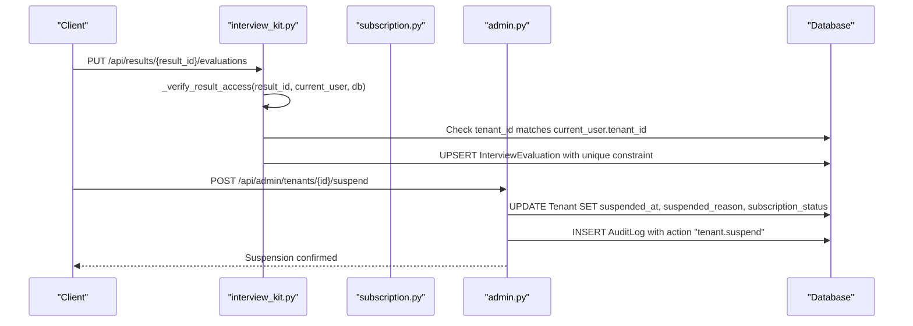

**Diagram sources**
- [interview_kit.py:28-80](file://app/backend/routes/interview_kit.py#L28-L80)
- [analyze.py:323-351](file://app/backend/routes/analyze.py#L323-L351)
- [subscription.py:72-92](file://app/backend/routes/subscription.py#L72-L92)
- [subscription.py:427-476](file://app/backend/routes/subscription.py#L427-L476)
- [admin.py:301-329](file://app/backend/routes/admin.py#L301-L329)

**Section sources**
- [interview_kit.py:28-80](file://app/backend/routes/interview_kit.py#L28-L80)
- [analyze.py:323-351](file://app/backend/routes/analyze.py#L323-L351)
- [subscription.py:72-92](file://app/backend/routes/subscription.py#L72-L92)
- [subscription.py:427-476](file://app/backend/routes/subscription.py#L427-L476)
- [admin.py:301-329](file://app/backend/routes/admin.py#L301-L329)

### Interview Kit Evaluation Framework
- **New** Comprehensive Interview Kit Evaluation Framework for structured interview scoring and assessment.
- **New** InterviewEvaluation table stores per-question evaluations with category, index, rating, and notes.
- **New** OverallAssessment table captures recruiter's overall recommendation and final assessment.
- **New** Strict tenant isolation with unique constraints preventing cross-user and cross-question duplication.
- **New** Interview Kit API endpoints for CRUD operations on evaluations and overall assessments.
- **New** Scorecard generation that aggregates evaluation data and creates hiring manager reports.
- **New** Data validation with category and rating constraints for consistent scoring.

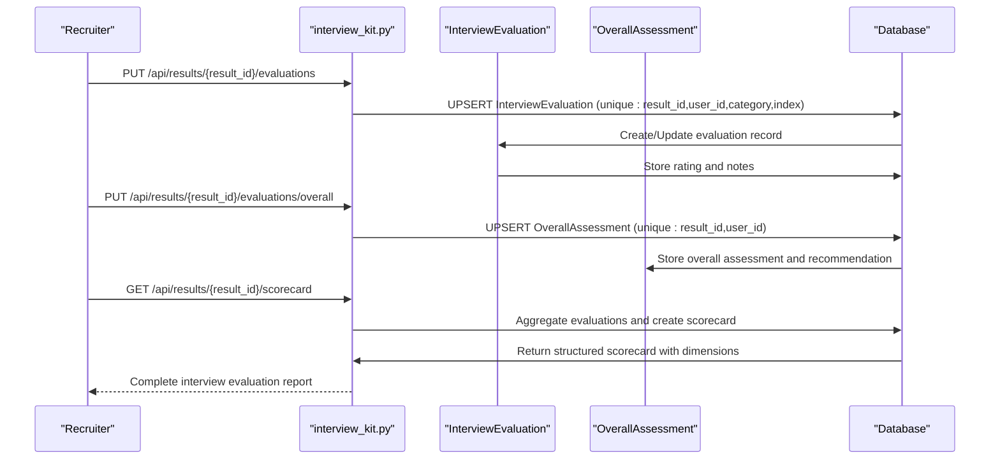

**Diagram sources**
- [interview_kit.py:39-221](file://app/backend/routes/interview_kit.py#L39-L221)
- [017_interview_kit_enhancement.py:23-53](file://alembic/versions/017_interview_kit_enhancement.py#L23-L53)

**Section sources**
- [interview_kit.py:39-221](file://app/backend/routes/interview_kit.py#L39-L221)
- [db_models.py:276-316](file://app/backend/models/db_models.py#L276-L316)
- [017_interview_kit_enhancement.py:23-53](file://alembic/versions/017_interview_kit_enhancement.py#L23-L53)

### Enterprise Security and Administrative Features
- **New** Comprehensive impersonation session management allowing super_admin users to temporarily act as target users for troubleshooting and support.
- **New** Security event logging captures all security-relevant activities with tenant and user context for compliance and auditing.
- **New** Granular platform roles replacing simple is_platform_admin flag with super_admin, billing_admin, support, security_admin, and readonly roles.
- **New** Plan features table links subscription plans to feature flags with enablement control for precise feature management.
- **New** GDPR-compliant erasure logging tracks data deletion requests with status tracking and audit trails.
- **New** Enhanced tenant model with onboarding completion tracking and tenant-level scoring weights for personalized defaults.

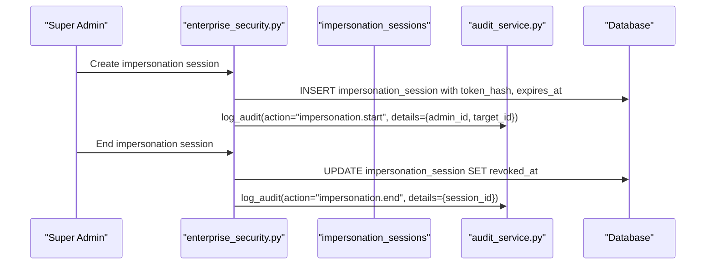

**Diagram sources**
- [enterprise_security.py:1-200](file://app/backend/services/enterprise_security.py#L1-L200)
- [021_enterprise_platform_admin.py:66-82](file://alembic/versions/021_enterprise_platform_admin.py#L66-L82)

**Section sources**
- [enterprise_security.py:1-200](file://app/backend/services/enterprise_security.py#L1-L200)
- [021_enterprise_platform_admin.py:1-179](file://alembic/versions/021_enterprise_platform_admin.py#L1-L179)

### Historical Learning Analytics System
- **New** Comprehensive hiring outcomes tracking capturing candidate decisions, feedback, and metadata for analytical insights.
- **New** Team skill profiles maintaining organizational skill composition and evolution over time.
- **New** Skill trend snapshots providing time-series analysis of skill demand versus supply across categories and dates.
- **New** Outcome skill patterns analyzing correlations between skills and hiring success/failure rates.
- **New** Advanced indexing strategy supporting complex analytical queries across time dimensions and categorical filters.

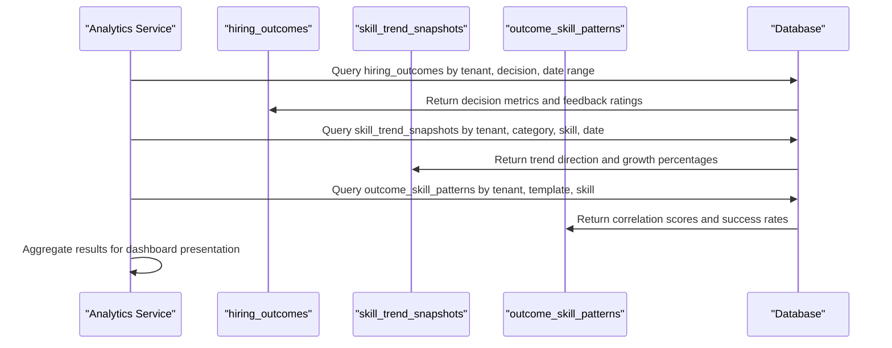

**Diagram sources**
- [022_historical_learning_system.py:40-132](file://alembic/versions/022_historical_learning_system.py#L40-L132)

**Section sources**
- [022_historical_learning_system.py:1-166](file://alembic/versions/022_historical_learning_system.py#L1-L166)

### Enhanced Candidate Profile Management
- **New** AI professional summary field providing LLM-generated candidate summaries for quick review and comparison.
- **New** Candidate notes system enabling collaborative annotation with user and tenant associations for team-based evaluation.
- **New** DOC to PDF conversion support storing converted PDF data for improved document compatibility and viewing.
- **New** Skill classification templates persisting role-specific skill categorization for consistent evaluation standards.

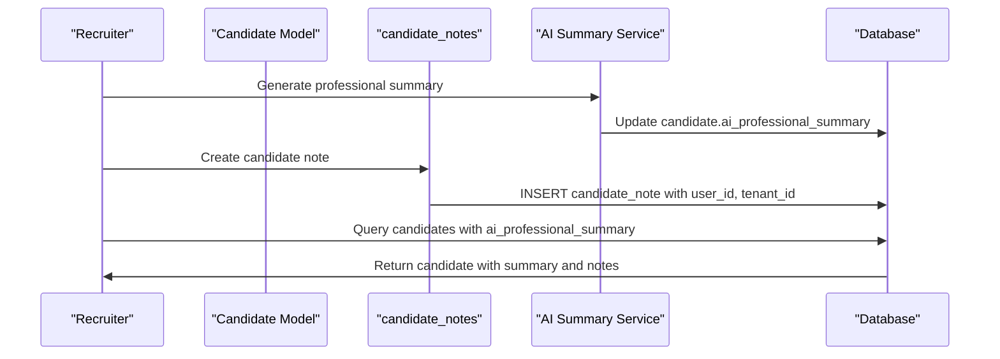

**Diagram sources**
- [019_candidate_profile_enhancements.py:37-57](file://alembic/versions/019_candidate_profile_enhancements.py#L37-L57)
- [020_doc_to_pdf_conversion.py:29-37](file://alembic/versions/020_doc_to_pdf_conversion.py#L29-L37)
- [023_skill_template_persistence.py:17-30](file://alembic/versions/023_skill_template_persistence.py#L17-L30)

**Section sources**
- [019_candidate_profile_enhancements.py:1-66](file://alembic/versions/019_candidate_profile_enhancements.py#L1-L66)
- [020_doc_to_pdf_conversion.py:1-46](file://alembic/versions/020_doc_to_pdf_conversion.py#L1-L46)
- [023_skill_template_persistence.py:1-35](file://alembic/versions/023_skill_template_persistence.py#L1-L35)

### Advanced Billing and Financial Management
- **New** Invoice tracking system with period coverage, line items, and payment provider integration.
- **New** Dunning records managing failed payment retry cycles with configurable schedules and automatic suspension.
- **New** Billing events audit logging for webhook processing and payment processor communication.
- **New** Usage alerts for threshold-based notification tracking and proactive customer management.
- **New** Enhanced platform configuration system supporting billing dunning configurations and provider settings.

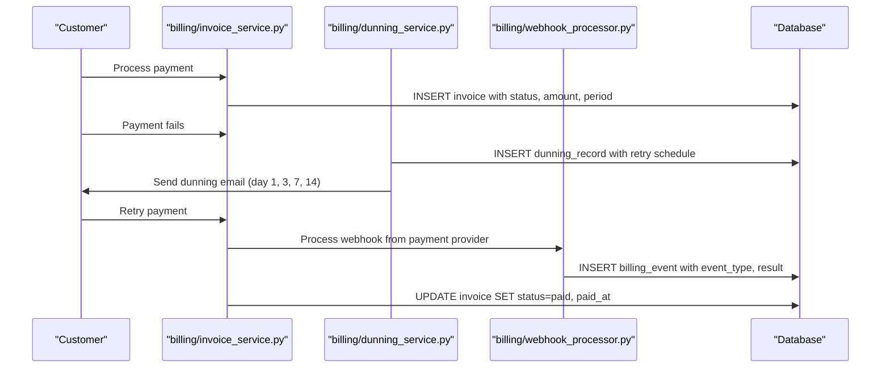

**Diagram sources**
- [billing/invoice_service.py:1-200](file://app/backend/services/billing/invoice_service.py#L1-L200)
- [billing/dunning_service.py:1-200](file://app/backend/services/billing/dunning_service.py#L1-L200)
- [billing/webhook_processor.py:1-200](file://app/backend/services/billing/webhook_processor.py#L1-L200)
- [027_billing_events.py:14-25](file://alembic/versions/027_billing_events.py#L14-L25)
- [028_invoices.py:14-30](file://alembic/versions/028_invoices.py#L14-L30)
- [029_dunning_system.py:14-26](file://alembic/versions/029_dunning_system.py#L14-L26)
- [030_usage_alerts.py:14-26](file://alembic/versions/030_usage_alerts.py#L14-L26)

**Section sources**
- [billing/invoice_service.py:1-200](file://app/backend/services/billing/invoice_service.py#L1-L200)
- [billing/dunning_service.py:1-200](file://app/backend/services/billing/dunning_service.py#L1-L200)
- [billing/webhook_processor.py:1-200](file://app/backend/services/billing/webhook_processor.py#L1-L200)
- [027_billing_events.py:1-30](file://alembic/versions/027_billing_events.py#L1-L30)
- [028_invoices.py:1-37](file://alembic/versions/028_invoices.py#L1-L37)
- [029_dunning_system.py:1-43](file://alembic/versions/029_dunning_system.py#L1-L43)
- [030_usage_alerts.py:1-31](file://alembic/versions/030_usage_alerts.py#L1-L31)

### Single Sign-On (SSO) Configuration Management
- **New** Comprehensive SAML/OIDC identity provider configuration management with certificate handling and attribute mapping.
- **New** Tenant-specific SSO configuration with activation/deactivation controls and provider type selection.
- **New** Auto-provisioning capabilities for new user creation based on SSO attributes.
- **New** Role mapping from SSO attributes to local platform roles with default role assignment.

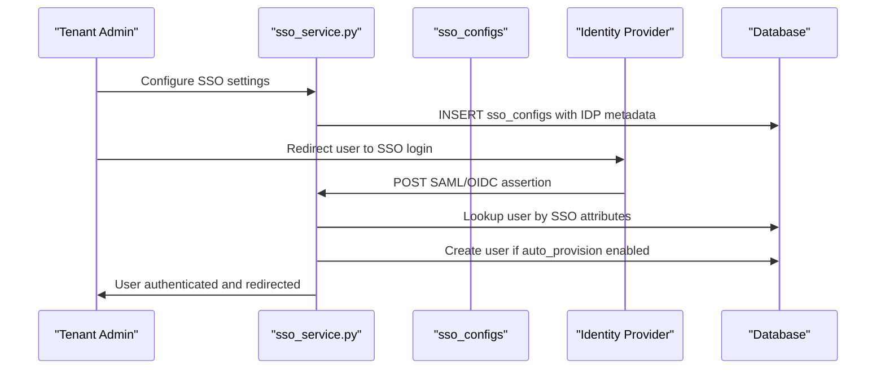

**Diagram sources**
- [sso_service.py:1-200](file://app/backend/services/sso_service.py#L1-L200)
- [032_sso_config.py:14-31](file://alembic/versions/032_sso_config.py#L14-L31)

**Section sources**
- [sso_service.py:1-200](file://app/backend/services/sso_service.py#L1-L200)
- [032_sso_config.py:1-36](file://alembic/versions/032_sso_config.py#L1-L36)

### Field-Level Audit Logging System
- **New** Comprehensive field-level audit logging capturing all changes to candidate and screening result data.
- **New** Detailed change tracking including old/new values, changed_by user, and optional change reasons.
- **New** Indexing strategy supporting efficient querying by entity type, entity_id, and change timestamps.
- **New** Integration with candidate profile enhancements and screening result modifications.

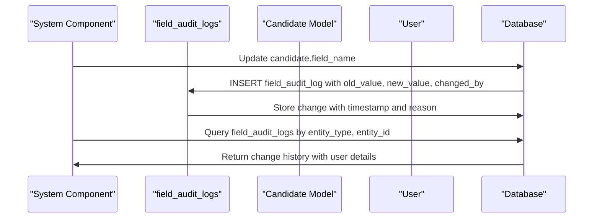

**Diagram sources**
- [026_audit_log_system.py:14-28](file://alembic/versions/026_audit_log_system.py#L14-L28)

**Section sources**
- [026_audit_log_system.py:1-33](file://alembic/versions/026_audit_log_system.py#L1-L33)

### Subscription and Usage Management
- SubscriptionPlan defines pricing and limits via JSON fields (limits, features).
- Tenant tracks subscription_status, billing periods, monthly usage counters, and storage usage with enhanced suspension and metadata fields.
- UsageLog records each action with quantity and optional details; composite indexes optimize reporting.
- Routes expose plan retrieval, usage checks, and usage history.
- **Updated** Enhanced with comprehensive billing integration fields (stripe_customer_id, stripe_subscription_id, subscription_updated_at).

**Diagram sources**
- [subscription.py:72-92](file://app/backend/routes/subscription.py#L72-L92)
- [subscription.py:256-343](file://app/backend/routes/subscription.py#L256-L343)
- [subscription.py:427-476](file://app/backend/routes/subscription.py#L427-L476)

**Section sources**
- [subscription.py:162-253](file://app/backend/routes/subscription.py#L162-L253)
- [subscription.py:256-343](file://app/backend/routes/subscription.py#L256-L343)
- [subscription.py:427-476](file://app/backend/routes/subscription.py#L427-L476)

### Platform Administration and Audit Logging
- **New** AuditLog table provides comprehensive audit trail for all administrative actions including tenant management, feature flag changes, and system modifications.
- **New** Platform admin users with is_platform_admin flag can manage tenants, view audit logs, and control feature flags.
- **New** Tenant suspension capabilities with reason tracking and status management.
- **New** Metadata storage for tenant customization and configuration.
- **New** Billing integration fields for Stripe customer and subscription management.

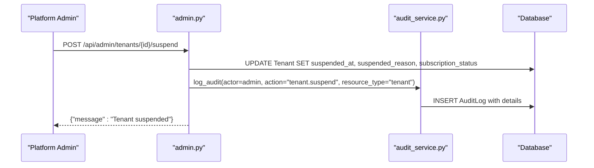

**Diagram sources**
- [admin.py:301-329](file://app/backend/routes/admin.py#L301-L329)
- [audit_service.py:7-39](file://app/backend/services/audit_service.py#L7-L39)

**Section sources**
- [admin.py:301-329](file://app/backend/routes/admin.py#L301-L329)
- [audit_service.py:7-39](file://app/backend/services/audit_service.py#L7-L39)
- [db_models.py:32-64](file://app/backend/models/db_models.py#L32-L64)

### Feature Flag Management System
- **New** Global feature flags with per-tenant overrides for flexible feature control.
- **New** In-memory caching with TTL for performance optimization.
- **New** Default seeding of core platform features (video_analysis, batch_analysis, custom_weights, api_access, etc.).
- **New** Cache invalidation mechanism for real-time flag updates.
- **New** Plan features integration linking subscription plans to feature availability.

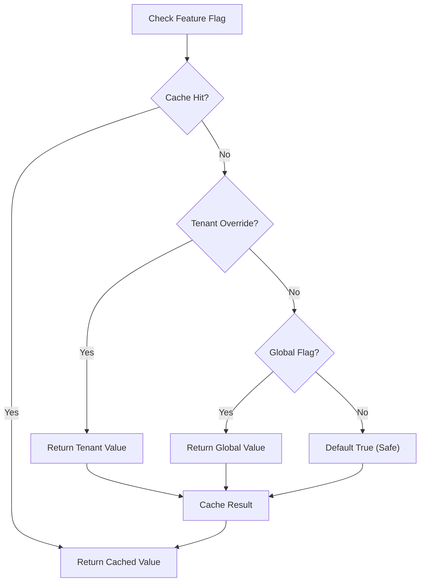

**Diagram sources**
- [feature_flag_service.py:46-79](file://app/backend/services/feature_flag_service.py#L46-L79)

**Section sources**
- [feature_flag_service.py:1-94](file://app/backend/services/feature_flag_service.py#L1-L94)
- [db_models.py:291-318](file://app/backend/models/db_models.py#L291-L318)

### Webhook Notification System
- **New** Comprehensive webhook system with HMAC-SHA256 signing for security.
- **New** Configurable retry logic with exponential backoff (1s, 5s, 30s).
- **New** Automatic webhook disabling after excessive failures.
- **New** Delivery tracking with success/failure status and response capture.
- **New** Event filtering with wildcard support (*).

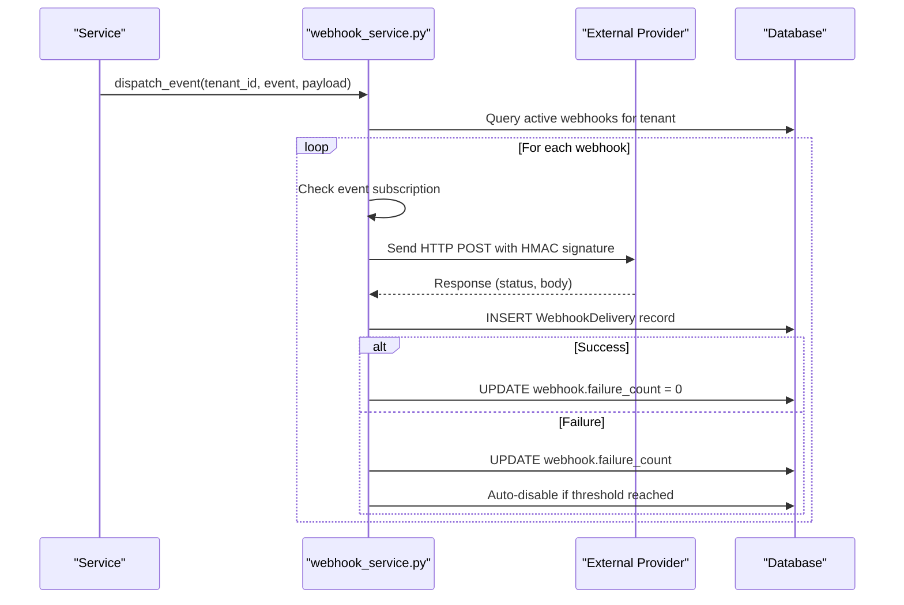

**Diagram sources**
- [webhook_service.py:46-112](file://app/backend/services/webhook_service.py#L46-L112)

**Section sources**
- [webhook_service.py:1-138](file://app/backend/services/webhook_service.py#L1-L138)
- [db_models.py:331-364](file://app/backend/models/db_models.py#L331-L364)

### Billing Configuration Management
- **New** PlatformConfig table for centralized billing provider configuration storage.
- **New** Secure credential storage with encryption at rest.
- **New** Audit trail for configuration changes with who made them.
- **New** Support for multiple payment providers and configuration parameters.

**Section sources**
- [db_models.py:367-378](file://app/backend/models/db_models.py#L367-L378)
- [014_billing_system.py:33-56](file://alembic/versions/014_billing_system.py#L33-L56)

### Native Resume File Storage and Download System
- **New** Native resume file storage in the candidates table with resume_filename (String 255) and resume_file_data (LargeBinary/BYTEA) columns.
- **New** Direct file access without external storage systems, reducing complexity and improving performance.
- **New** Comprehensive download functionality supporting multiple file formats (PDF, DOCX, DOC, ODT, TXT, RTF).
- **New** Inline preview for PDF files and forced download for office documents.
- **New** File integrity verification and proper MIME type handling.
- **New** Idempotent migration system that safely adds columns without data loss.

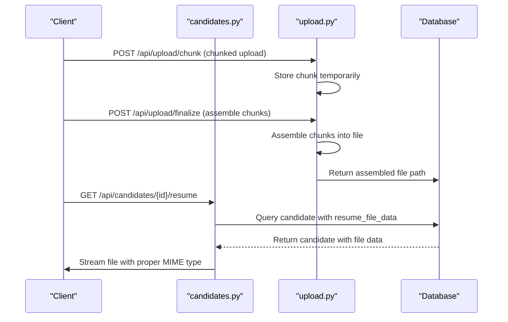

**Diagram sources**
- [candidates.py:504-559](file://app/backend/routes/candidates.py#L504-L559)
- [upload.py:1-361](file://app/backend/routes/upload.py#L1-L361)

**Section sources**
- [candidates.py:504-559](file://app/backend/routes/candidates.py#L504-L559)
- [upload.py:1-361](file://app/backend/routes/upload.py#L1-L361)
- [db_models.py:118-153](file://app/backend/models/db_models.py#L118-L153)
- [015_add_resume_file_storage.py:1-49](file://alembic/versions/015_add_resume_file_storage.py#L1-L49)

### Deterministic Scoring Framework and Eligibility Gating
- **New** Comprehensive deterministic scoring system integrated into ScreeningResult model with five new fields: deterministic_score, domain_match_score, core_skill_score, eligibility_status, and eligibility_reason.
- **New** Eligibility service applies hard gating rules before scoring: domain mismatch, core skill thresholds, and relevant experience requirements.
- **New** Fit scorer computes capped deterministic scores with weighted feature evaluation and decision explanations.
- **New** Hybrid pipeline orchestrates domain detection, eligibility evaluation, and deterministic scoring computation.
- **New** EligibilityResult dataclass provides structured decision-making with reasons and details.

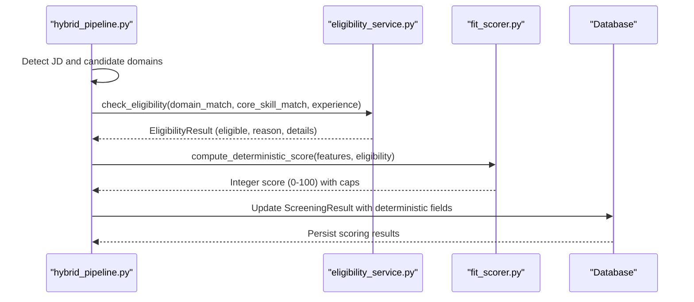

**Diagram sources**
- [hybrid_pipeline.py:1266-1357](file://app/backend/services/hybrid_pipeline.py#L1266-L1357)
- [eligibility_service.py:17-80](file://app/backend/services/eligibility_service.py#L17-L80)
- [fit_scorer.py:117-230](file://app/backend/services/fit_scorer.py#L117-L230)

**Section sources**
- [hybrid_pipeline.py:1266-1357](file://app/backend/services/hybrid_pipeline.py#L1266-L1357)
- [eligibility_service.py:17-80](file://app/backend/services/eligibility_service.py#L17-L80)
- [fit_scorer.py:117-230](file://app/backend/services/fit_scorer.py#L117-L230)
- [db_models.py:171-208](file://app/backend/models/db_models.py#L171-L208)

### Enhanced Authentication and Token Management
- Token revocation system prevents reuse of invalidated refresh tokens.
- RevokedToken table stores JWT IDs (JTI) with timestamps for tracking.
- Logout endpoint decodes refresh tokens and stores their JTI in the revoked_tokens table.
- Refresh token validation checks against revoked tokens before issuing new tokens.
- **Updated** Platform admin users with elevated privileges for system management.

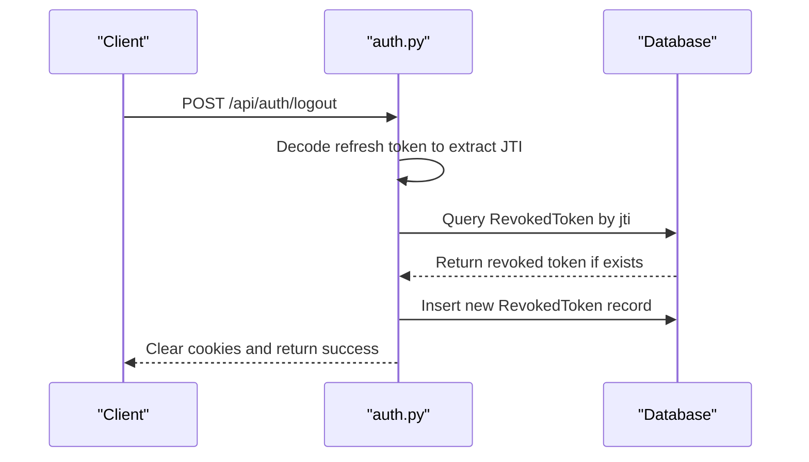

**Diagram sources**
- [auth_routes.py:211-254](file://app/backend/routes/auth.py#L211-L254)
- [db_models.py:378-386](file://app/backend/models/db_models.py#L378-L386)

**Section sources**
- [auth_routes.py:211-254](file://app/backend/routes/auth.py#L211-L254)
- [db_models.py:378-386](file://app/backend/models/db_models.py#L378-L386)

### Migration System and Schema Evolution
- Alembic env registers models and binds metadata to the configured DATABASE_URL.
- Migrations are idempotent and guard against pre-existing tables/columns.
- **Updated** Version history with new administrative, notification, file storage, deterministic scoring, interview evaluation, enterprise security, historical learning, billing, SSO, and audit features:
  - 001: Enrich candidates with profile fields; add jd_cache and skills tables.
  - 002: Add parser_snapshot_json to candidates.
  - 003: Enhance subscription_plans, add tenant usage fields, create usage_logs, seed plans, link existing tenants to default plan.
  - 004: Add narrative_json column to screening_results for async LLM narrative generation.
  - 005: Add revoked_tokens table for JWT token revocation support.
  - 006: Add strategic indexes and created_at column to jd_cache.
  - 007: Add narrative_status field to screening_results.
  - 008: Implement comprehensive queue system with analysis_jobs, analysis_results, analysis_artifacts, and job_metrics tables.
  - 009: Add intelligent scoring weights support to screening_results.
  - 010: Add jd_text column and indexes for screening_results.
  - 011: Add narrative_generated_at timestamp and backfill narrative_status.
  - 012: **New** Admin foundation with audit logs, feature flags, rate limits, and tenant suspension capabilities.
  - 013: **New** Webhooks and notifications with default feature flag seeding.
  - 014: **New** Billing system with platform configuration management.
  - 015: **New** Resume file storage with resume_filename and resume_file_data columns.
  - 016: **New** Deterministic scoring fields (deterministic_score, domain_match_score, core_skill_score, eligibility_status, eligibility_reason) added to screening_results.
  - 017: **New** Interview Kit Evaluation Framework with interview_evaluations and overall_assessments tables.
  - 018: **New** ATS evolution with tenant email configurations and screening status tracking.
  - 019: **New** Candidate profile enhancements with AI summaries and candidate notes.
  - 020: **New** DOC to PDF conversion support for enhanced document compatibility.
  - 021: **New** Enterprise platform admin with impersonation sessions, security events, plan features, and erasure logs.
  - 022: **New** Historical learning system with hiring outcomes, team skill profiles, skill trends, and outcome patterns.
  - 023: **New** Skill template persistence for role-specific skill classification.
  - 024: **New** Audit fixes including tenant_id constraints and composite indexing.
  - 025: **New** Template skill overrides for flexible role template customization.
  - 026: **New** Field audit log system for comprehensive change tracking.
  - 027: **New** Billing events table for webhook audit logging.
  - 028: **New** Invoices table for payment receipt tracking.
  - 029: **New** Dunning system for failed payment retry tracking.
  - 030: **New** Usage alerts for threshold notification tracking.
  - 031: **New** Onboarding flag for tenant onboarding completion tracking.
  - 032: **New** SSO configuration for SAML/OIDC identity provider integration.

**Diagram sources**
- [env.py:11-20](file://alembic/env.py#L11-L20)
- [001_enrich_candidates_add_caches.py:42-129](file://alembic/versions/001_enrich_candidates_add_caches.py#L42-L129)
- [002_parser_snapshot_json.py:21-34](file://alembic/versions/002_parser_snapshot_json.py#L21-L34)
- [003_subscription_system.py:43-252](file://alembic/versions/003_subscription_system.py#L43-L252)
- [004_narrative_json.py:24-36](file://alembic/versions/004_narrative_json.py#L24-L36)
- [005_revoked_tokens.py:41-66](file://alembic/versions/005_revoked_tokens.py#L41-L66)
- [006_indexes_and_jdcache_created_at.py:35-72](file://alembic/versions/006_indexes_and_jdcache_created_at.py#L35-L72)
- [007_narrative_status.py:24-36](file://alembic/versions/007_narrative_status.py#L24-L36)
- [008_analysis_queue_system.py:29-347](file://alembic/versions/008_analysis_queue_system.py#L29-L347)
- [009_intelligent_scoring_weights.py:27-93](file://alembic/versions/009_intelligent_scoring_weights.py#L27-L93)
- [010_add_jd_text_to_screening_result.py:20-69](file://alembic/versions/010_add_jd_text_to_screening_result.py#L20-L69)
- [011_narrative_tracking_enhancement.py:20-57](file://alembic/versions/011_narrative_tracking_enhancement.py#L20-L57)
- [012_admin_foundation.py:42-135](file://alembic/versions/012_admin_foundation.py#L42-135)
- [013_webhooks_and_notifications.py:36-114](file://alembic/versions/013_webhooks_and_notifications.py#L36-L114)
- [014_billing_system.py:33-56](file://alembic/versions/014_billing_system.py#L33-L56)
- [015_add_resume_file_storage.py:1-49](file://alembic/versions/015_add_resume_file_storage.py#L1-L49)
- [016_deterministic_scoring_fields.py:1-74](file://alembic/versions/016_deterministic_scoring_fields.py#L1-L74)
- [017_interview_kit_enhancement.py:1-61](file://alembic/versions/017_interview_kit_enhancement.py#L1-L61)
- [018_ats_evolution.py:1-75](file://alembic/versions/018_ats_evolution.py#L1-L75)
- [019_candidate_profile_enhancements.py:1-66](file://alembic/versions/019_candidate_profile_enhancements.py#L1-L66)
- [020_doc_to_pdf_conversion.py:1-46](file://alembic/versions/020_doc_to_pdf_conversion.py#L1-L46)
- [021_enterprise_platform_admin.py:1-179](file://alembic/versions/021_enterprise_platform_admin.py#L1-L179)
- [022_historical_learning_system.py:1-166](file://alembic/versions/022_historical_learning_system.py#L1-L166)
- [023_skill_template_persistence.py:1-35](file://alembic/versions/023_skill_template_persistence.py#L1-L35)
- [024_audit_fixes.py:1-40](file://alembic/versions/024_audit_fixes.py#L1-L40)
- [025_template_skill_overrides.py:1-23](file://alembic/versions/025_template_skill_overrides.py#L1-L23)
- [026_audit_log_system.py:1-33](file://alembic/versions/026_audit_log_system.py#L1-L33)
- [027_billing_events.py:1-30](file://alembic/versions/027_billing_events.py#L1-L30)
- [028_invoices.py:1-37](file://alembic/versions/028_invoices.py#L1-L37)
- [029_dunning_system.py:1-43](file://alembic/versions/029_dunning_system.py#L1-L43)
- [030_usage_alerts.py:1-31](file://alembic/versions/030_usage_alerts.py#L1-L31)
- [031_onboarding_flag.py:1-21](file://alembic/versions/031_onboarding_flag.py#L1-L21)
- [032_sso_config.py:1-36](file://alembic/versions/032_sso_config.py#L1-L36)

**Section sources**
- [env.py:1-51](file://alembic/env.py#L1-L51)
- [script.py.mako:1-29](file://alembic/script.py.mako#L1-L29)
- [001_enrich_candidates_add_caches.py:1-129](file://alembic/versions/001_enrich_candidates_add_caches.py#L1-L129)
- [002_parser_snapshot_json.py:1-34](file://alembic/versions/002_parser_snapshot_json.py#L1-L34)
- [003_subscription_system.py:1-290](file://alembic/versions/003_subscription_system.py#L1-L290)
- [004_narrative_json.py:1-37](file://alembic/versions/004_narrative_json.py#L1-L37)
- [005_revoked_tokens.py:1-67](file://alembic/versions/005_revoked_tokens.py#L1-L67)
- [006_indexes_and_jdcache_created_at.py:1-73](file://alembic/versions/006_indexes_and_jdcache_created_at.py#L1-L73)
- [007_narrative_status.py:1-37](file://alembic/versions/007_narrative_status.py#L1-L37)
- [008_analysis_queue_system.py:1-347](file://alembic/versions/008_analysis_queue_system.py#L1-L347)
- [009_intelligent_scoring_weights.py:1-93](file://alembic/versions/009_intelligent_scoring_weights.py#L1-L93)
- [010_add_jd_text_to_screening_result.py:1-69](file://alembic/versions/010_add_jd_text_to_screening_result.py#L1-L69)
- [011_narrative_tracking_enhancement.py:1-57](file://alembic/versions/011_narrative_tracking_enhancement.py#L1-L57)
- [012_admin_foundation.py:1-161](file://alembic/versions/012_admin_foundation.py#L1-L161)
- [013_webhooks_and_notifications.py:1-145](file://alembic/versions/013_webhooks_and_notifications.py#L1-L145)
- [014_billing_system.py:1-67](file://alembic/versions/014_billing_system.py#L1-L67)
- [015_add_resume_file_storage.py:1-49](file://alembic/versions/015_add_resume_file_storage.py#L1-L49)
- [016_deterministic_scoring_fields.py:1-74](file://alembic/versions/016_deterministic_scoring_fields.py#L1-L74)
- [017_interview_kit_enhancement.py:1-61](file://alembic/versions/017_interview_kit_enhancement.py#L1-L61)
- [018_ats_evolution.py:1-75](file://alembic/versions/018_ats_evolution.py#L1-L75)
- [019_candidate_profile_enhancements.py:1-66](file://alembic/versions/019_candidate_profile_enhancements.py#L1-L66)
- [020_doc_to_pdf_conversion.py:1-46](file://alembic/versions/020_doc_to_pdf_conversion.py#L1-L46)
- [021_enterprise_platform_admin.py:1-179](file://alembic/versions/021_enterprise_platform_admin.py#L1-L179)
- [022_historical_learning_system.py:1-166](file://alembic/versions/022_historical_learning_system.py#L1-L166)
- [023_skill_template_persistence.py:1-35](file://alembic/versions/023_skill_template_persistence.py#L1-L35)
- [024_audit_fixes.py:1-40](file://alembic/versions/024_audit_fixes.py#L1-L40)
- [025_template_skill_overrides.py:1-23](file://alembic/versions/025_template_skill_overrides.py#L1-L23)
- [026_audit_log_system.py:1-33](file://alembic/versions/026_audit_log_system.py#L1-L33)
- [027_billing_events.py:1-30](file://alembic/versions/027_billing_events.py#L1-L30)
- [028_invoices.py:1-37](file://alembic/versions/028_invoices.py#L1-L37)
- [029_dunning_system.py:1-43](file://alembic/versions/029_dunning_system.py#L1-L43)
- [030_usage_alerts.py:1-31](file://alembic/versions/030_usage_alerts.py#L1-L31)
- [031_onboarding_flag.py:1-21](file://alembic/versions/031_onboarding_flag.py#L1-L21)
- [032_sso_config.py:1-36](file://alembic/versions/032_sso_config.py#L1-L36)

### Data Validation Rules and Business Logic Constraints
- Tenant isolation: All sensitive routes filter by tenant_id.
- Usage limits: Monthly analysis counts enforced per plan limits; storage usage computed from text lengths.
- Deduplication: Candidate matching by resume_file_hash and fallback by email/tenant.
- Authentication: JWT decoding and active user lookup; admin-only routes gated by role.
- Token revocation: Refresh tokens checked against revoked_tokens table during refresh operations.
- Data types: JSON fields for parsed_data, analysis_result, limits, features; numeric counters for usage; timestamps with timezone support.
- Queue validation: Database triggers ensure analysis_results contain required fields and maintain data integrity.
- **Updated** Audit logging: All administrative actions are captured with actor information, resource details, and IP addresses.
- **Updated** Feature flags: Tenant overrides take precedence over global flags with cache invalidation.
- **Updated** Webhook security: HMAC signatures validate payload integrity and authenticity.
- **Updated** Billing security: Configuration values stored securely with audit trails.
- **Updated** Resume file storage: Native database storage eliminates external dependencies and improves security.
- **Updated** Deterministic scoring: Eligibility gating applies hard caps (domain match < 0.3 → cap 35, core skill < 0.3 → cap 40) with integer scoring in range 0-100.
- **Updated** Interview evaluation validation: Category must be one of {technical, behavioral, culture_fit}; rating must be one of {strong, adequate, weak}; recommendation must be one of {advance, hold, reject}.
- **Updated** Interview evaluation uniqueness: Prevents duplicate evaluations for the same question by the same user.
- **Updated** Enterprise security: Impersonation sessions require token hashing and expiration management.
- **Updated** Historical learning: Composite indexes ensure analytical queries perform efficiently.
- **Updated** Field audit logging: Comprehensive change tracking with old/new value preservation.
- **Updated** SSO configuration: Identity provider metadata validation and certificate handling.

**Section sources**
- [auth.py:19-46](file://app/backend/middleware/auth.py#L19-L46)
- [analyze.py:396-411](file://app/backend/routes/analyze.py#L396-L411)
- [subscription.py:117-129](file://app/backend/routes/subscription.py#L117-L129)
- [auth_routes.py:185-189](file://app/backend/routes/auth.py#L185-189)
- [admin.py:301-329](file://app/backend/routes/admin.py#L301-L329)
- [feature_flag_service.py:30-44](file://app/backend/services/feature_flag_service.py#L30-L44)
- [webhook_service.py:18-21](file://app/backend/services/webhook_service.py#L18-L21)
- [candidates.py:504-559](file://app/backend/routes/candidates.py#L504-L559)
- [eligibility_service.py:38-79](file://app/backend/services/eligibility_service.py#L38-L79)
- [fit_scorer.py:117-230](file://app/backend/services/fit_scorer.py#L117-L230)
- [interview_kit.py:450-488](file://app/backend/routes/interview_kit.py#L450-L488)
- [schemas.py:450-488](file://app/backend/models/schemas.py#L450-488)
- [enterprise_security.py:1-200](file://app/backend/services/enterprise_security.py#L1-L200)
- [022_historical_learning_system.py:61-131](file://alembic/versions/022_historical_learning_system.py#L61-L131)
- [026_audit_log_system.py:14-28](file://alembic/versions/026_audit_log_system.py#L14-L28)
- [032_sso_config.py:14-31](file://alembic/versions/032_sso_config.py#L14-L31)

### Referential Integrity and Indexes
- Foreign keys:
  - Tenant.plan_id -> SubscriptionPlan.id
  - User.tenant_id -> Tenant.id
  - User.is_platform_admin -> User.is_platform_admin (self-reference for admin hierarchy)
  - Candidate.tenant_id -> Tenant.id
  - ScreeningResult.tenant_id -> Tenant.id
  - ScreeningResult.candidate_id -> Candidate.id
  - ScreeningResult.role_template_id -> RoleTemplate.id
  - InterviewEvaluation.result_id -> ScreeningResult.id (CASCADE)
  - InterviewEvaluation.user_id -> User.id (CASCADE)
  - OverallAssessment.result_id -> ScreeningResult.id (CASCADE)
  - OverallAssessment.user_id -> User.id (CASCADE)
  - UsageLog.tenant_id -> Tenant.id (CASCADE), user_id -> User.id (SET NULL)
  - AuditLog.actor_user_id -> User.id (SET NULL)
  - FeatureFlag.id -> FeatureFlag.id (self-reference for flag relationships)
  - TenantFeatureOverride.tenant_id -> Tenant.id (CASCADE), feature_flag_id -> FeatureFlag.id (CASCADE)
  - RateLimitConfig.tenant_id -> Tenant.id (CASCADE, unique)
  - Webhook.tenant_id -> Tenant.id (CASCADE), webhook_deliveries.webhook_id -> Webhook.id (CASCADE)
  - PlatformConfig.updated_by -> User.id (SET NULL)
  - AnalysisJobs.tenant_id -> Tenant.id (CASCADE), candidate_id -> Candidate.id (SET NULL), user_id -> User.id (SET NULL)
  - AnalysisResults.job_id -> AnalysisJobs.id (CASCADE), tenant_id -> Tenant.id (CASCADE), candidate_id -> Candidate.id (SET NULL)
  - AnalysisArtifacts.tenant_id -> Tenant.id (CASCADE)
  - JobMetrics.job_id -> AnalysisJobs.id (CASCADE), tenant_id -> Tenant.id (CASCADE)
  - **Updated** ImpersonationSession.admin_user_id -> User.id (CASCADE)
  - **Updated** ImpersonationSession.target_user_id -> User.id (CASCADE)
  - **Updated** SecurityEvent.tenant_id -> Tenant.id (SET NULL), user_id -> User.id (SET NULL)
  - **Updated** PlanFeature.plan_id -> SubscriptionPlan.id (CASCADE), feature_flag_id -> FeatureFlag.id (CASCADE)
  - **Updated** ErasureLog.tenant_id -> Tenant.id (CASCADE), actor_user_id -> User.id (SET NULL)
  - **Updated** HiringOutcome.tenant_id -> Tenant.id, screening_result_id -> ScreeningResult.id (unique)
  - **Updated** TeamSkillProfile.tenant_id -> Tenant.id, created_by_user_id -> User.id (SET NULL)
  - **Updated** SkillTrendSnapshot.tenant_id -> Tenant.id
  - **Updated** OutcomeSkillPattern.tenant_id -> Tenant.id, role_template_id -> RoleTemplate.id (SET NULL)
  - **Updated** Invoice.tenant_id -> Tenant.id (CASCADE)
  - **Updated** DunningRecord.tenant_id -> Tenant.id (CASCADE)
  - **Updated** BillingEvent.tenant_id -> Tenant.id (SET NULL)
  - **Updated** UsageAlert.tenant_id -> Tenant.id (CASCADE)
  - **Updated** SSOSession.tenant_id -> Tenant.id (CASCADE)
  - **Updated** FieldAuditLog.changed_by -> User.id
- Indexes:
  - Candidate.email, Candidate.resume_file_hash
  - SubscriptionPlans(is_active, sort_order)
  - Tenants(subscription_status), Tenants(stripe_customer_id)
  - UsageLogs(tenant_id, action), UsageLogs(tenant_id, created_at), UsageLogs(created_at)
  - ScreeningResults(candidate_id), ScreeningResults(timestamp), **Updated** ScreeningResults(tenant_id, timestamp)
  - InterviewEvaluations(result_id), InterviewEvaluations(user_id), InterviewEvaluations(question_category), InterviewEvaluations(question_index)
  - OverallAssessments(result_id), OverallAssessments(user_id)
  - RevokedTokens(id), RevokedTokens(jti)
  - AuditLogs(action), AuditLogs(created_at)
  - FeatureFlags(key)
  - Webhooks(id), Webhooks(tenant_id)
  - WebhookDeliveries(id), WebhookDeliveries(webhook_id)
  - PlatformConfigs(id), PlatformConfigs(config_key)
  - JdCache(hash)
  - AnalysisJobs(input_hash), AnalysisJobs(status, priority, queued_at), AnalysisJobs(next_retry_at)
  - AnalysisResults(fit_score), AnalysisResults(artifact_id)
  - AnalysisArtifacts(resume_hash, jd_hash), AnalysisArtifacts(expires_at)
  - JobMetrics(total_time_ms), JobMetrics(tenant_id, created_at)
  - **Updated** ScreeningResults(deterministic_score), ScreeningResults(eligibility_status), ScreeningResults(core_skill_score)
  - **Updated** Candidate.resume_filename, Candidate.resume_file_data (nullable)
  - **Updated** Unique constraints for InterviewEvaluations and OverallAssessments
  - **Updated** ImpersonationSessions(admin_user_id), ImpersonationSessions(target_user_id), ImpersonationSessions(expires_at)
  - **Updated** SecurityEvents(event_type), SecurityEvents(created_at), SecurityEvents(user_id), SecurityEvents(tenant_id)
  - **Updated** PlanFeatures(plan_id), PlanFeatures(feature_flag_id)
  - **Updated** ErasureLogs(tenant_id), ErasureLogs(status)
  - **Updated** HiringOutcomes(tenant_id), HiringOutcomes(role_template_id), HiringOutcomes(tenant_id, decision, created_at)
  - **Updated** TeamSkillProfiles(tenant_id)
  - **Updated** SkillTrendSnapshots(tenant_id, role_category, period_date), SkillTrendSnapshots(tenant_id, skill_name, period_date)
  - **Updated** OutcomeSkillPatterns(tenant_id, role_template_id)
  - **Updated** Invoices(tenant_id, issued_at)
  - **Updated** DunningRecords(tenant_id)
  - **Updated** BillingEvents(provider), BillingEvents(event_type), BillingEvents(tenant_id)
  - **Updated** UsageAlerts(tenant_id)
  - **Updated** SSOSessions(tenant_id)
  - **Updated** FieldAuditLogs(entity_type, entity_id), FieldAuditLogs(tenant_id)

**Section sources**
- [db_models.py:34-59](file://app/backend/models/db_models.py#L34-L59)
- [db_models.py:100-105](file://app/backend/models/db_models.py#L100-L105)
- [db_models.py:131-146](file://app/backend/models/db_models.py#L131-L146)
- [db_models.py:154-164](file://app/backend/models/db_models.py#L154-L164)
- [db_models.py:83-92](file://app/backend/models/db_models.py#L83-L92)
- [db_models.py:140](file://app/backend/models/db_models.py#L140)
- [db_models.py:260-266](file://app/backend/models/db_models.py#L260-L266)
- [db_models.py:277-290](file://app/backend/models/db_models.py#L277-L290)
- [db_models.py:291-318](file://app/backend/models/db_models.py#L291-L318)
- [db_models.py:319-330](file://app/backend/models/db_models.py#L319-L330)
- [db_models.py:331-364](file://app/backend/models/db_models.py#L331-L364)
- [db_models.py:367-378](file://app/backend/models/db_models.py#L367-L378)
- [001_enrich_candidates_add_caches.py:75-110](file://alembic/versions/001_enrich_candidates_add_caches.py#L75-L110)
- [003_subscription_system.py:66-117](file://alembic/versions/003_subscription_system.py#L66-L117)
- [004_narrative_json.py:24-36](file://alembic/versions/004_narrative_json.py#L24-L36)
- [005_revoked_tokens.py:52-60](file://alembic/versions/005_revoked_tokens.py#L52-L60)
- [006_indexes_and_jdcache_created_at.py:38-53](file://alembic/versions/006_indexes_and_jdcache_created_at.py#L38-L53)
- [008_analysis_queue_system.py:74-133](file://alembic/versions/008_analysis_queue_system.py#L74-L133)
- [010_add_jd_text_to_screening_result.py:42-56](file://alembic/versions/010_add_jd_text_to_screening_result.py#L42-L56)
- [011_narrative_tracking_enhancement.py:31-34](file://alembic/versions/011_narrative_tracking_enhancement.py#L31-L34)
- [012_admin_foundation.py:65-88](file://alembic/versions/012_admin_foundation.py#L65-L88)
- [013_webhooks_and_notifications.py:39-88](file://alembic/versions/013_webhooks_and_notifications.py#L39-L88)
- [014_billing_system.py:36-56](file://alembic/versions/014_billing_system.py#L36-L56)
- [015_add_resume_file_storage.py:29-48](file://alembic/versions/015_add_resume_file_storage.py#L29-L48)
- [016_deterministic_scoring_fields.py:33-73](file://alembic/versions/016_deterministic_scoring_fields.py#L33-L73)
- [017_interview_kit_enhancement.py:23-53](file://alembic/versions/017_interview_kit_enhancement.py#L23-L53)
- [018_ats_evolution.py:39-66](file://alembic/versions/018_ats_evolution.py#L39-L66)
- [019_candidate_profile_enhancements.py:47-57](file://alembic/versions/019_candidate_profile_enhancements.py#L47-L57)
- [020_doc_to_pdf_conversion.py:33-37](file://alembic/versions/020_doc_to_pdf_conversion.py#L33-L37)
- [021_enterprise_platform_admin.py:68-101](file://alembic/versions/021_enterprise_platform_admin.py#L68-L101)
- [022_historical_learning_system.py:61-131](file://alembic/versions/022_historical_learning_system.py#L61-L131)
- [023_skill_template_persistence.py:29-30](file://alembic/versions/023_skill_template_persistence.py#L29-L30)
- [024_audit_fixes.py:21-29](file://alembic/versions/024_audit_fixes.py#L21-L29)
- [025_template_skill_overrides.py:14-16](file://alembic/versions/025_template_skill_overrides.py#L14-L16)
- [026_audit_log_system.py:27-28](file://alembic/versions/026_audit_log_system.py#L27-L28)
- [027_billing_events.py:17-25](file://alembic/versions/027_billing_events.py#L17-L25)
- [028_invoices.py:31](file://alembic/versions/028_invoices.py#L31)
- [029_dunning_system.py:28-37](file://alembic/versions/029_dunning_system.py#L28-L37)
- [030_usage_alerts.py:25](file://alembic/versions/030_usage_alerts.py#L25)
- [031_onboarding_flag.py:14-15](file://alembic/versions/031_onboarding_flag.py#L14-L15)
- [032_sso_config.py:31](file://alembic/versions/032_sso_config.py#L31)

### Data Access Patterns, Caching, and Performance
- Data access patterns:
  - Tenant-scoped queries: filter by tenant_id across entities.
  - Aggregation queries: sum lengths for storage usage; count users for team metrics.
  - Composite indexing: UsageLogs(tenant_id, action), UsageLogs(tenant_id, created_at) for efficient reporting.
  - Asynchronous processing: narrative_json enables immediate scoring results while LLM narratives generate in background.
  - Queue operations: Priority-based scheduling with automatic retry and worker heartbeat monitoring.
  - **Updated** Audit logging: Efficient indexing on action and created_at fields for compliance reporting.
  - **Updated** Feature flag caching: In-memory cache with TTL for reduced database load.
  - **Updated** Webhook delivery tracking: Separate tables for delivery attempts with indexing for monitoring.
  - **Updated** Resume file storage: Direct database access eliminates network latency and external dependencies.
  - **Updated** Deterministic scoring: Efficient querying by deterministic_score, eligibility_status, and core_skill_score for filtering and reporting.
  - **Updated** Interview evaluation aggregation: Efficient grouping by category and index for scorecard generation.
  - **Updated** Interview evaluation caching: Results cached in memory for scorecard aggregation.
  - **Updated** Enterprise security: Impersonation sessions with token hashing and expiration management.
  - **Updated** Historical learning: Composite indexing supports complex analytical queries across time dimensions.
  - **Updated** Field audit logging: Efficient querying by entity type and timestamp for change tracking.
  - **Updated** SSO configuration: Tenant-specific configuration with activation/deactivation controls.
- Caching strategies:
  - JdCache stores parsed job descriptions keyed by hash to avoid repeated parsing.
  - Candidate enrichment fields reduce repeated parsing costs.
  - AnalysisArtifacts store parsed data and JD text for reuse across jobs.
  - Connection pooling for PostgreSQL improves concurrent query performance.
  - **Updated** Feature flag service implements thread-safe in-memory caching with TTL.
  - **Updated** Audit log service provides structured logging for compliance.
  - **Updated** Resume files stored directly in database eliminate need for external caching.
  - **Updated** Eligibility decisions cached in hybrid pipeline to avoid repeated computations.
  - **Updated** Interview evaluation data cached in memory for scorecard aggregation.
  - **Updated** Historical learning data cached for dashboard performance.
  - **Updated** SSO configuration cached for authentication performance.
- Performance considerations:
  - Use indexes on frequently filtered columns (email, resume_file_hash, tenant_id, candidate_id, timestamp, deterministic_score, eligibility_status, question_category, question_index).
  - Prefer batch operations for inserts (bulk insert for plans).
  - Avoid N+1 queries by using joined eager loading where appropriate.
  - Connection pooling reduces connection overhead for PostgreSQL deployments.
  - Queue system uses SELECT FOR UPDATE SKIP LOCKED for concurrent worker safety.
  - Database triggers ensure data quality without application-level overhead.
  - **Updated** Webhook service uses async HTTP client for non-blocking delivery.
  - **Updated** Platform configuration provides centralized access to billing settings.
  - **Updated** Native resume storage reduces I/O complexity and improves reliability.
  - **Updated** Deterministic scoring computation optimized with early gating and capped scoring.
  - **Updated** Interview evaluation framework optimized with unique constraints and efficient aggregation queries.
  - **Updated** Enterprise security features optimized with token hashing and expiration indexing.
  - **Updated** Historical learning system optimized with composite indexing for analytical queries.
  - **Updated** Field audit logging optimized with entity-type indexing for change tracking.

**Section sources**
- [db_models.py:229-236](file://app/backend/models/db_models.py#L229-L236)
- [subscription.py:117-129](file://app/backend/routes/subscription.py#L117-L129)
- [001_enrich_candidates_add_caches.py:78-110](file://alembic/versions/001_enrich_candidates_add_caches.py#L78-L110)
- [003_subscription_system.py:93-117](file://alembic/versions/003_subscription_system.py#L93-L117)
- [database.py:21-37](file://app/backend/db/database.py#L21-L37)
- [004_narrative_json.py:8-11](file://alembic/versions/004_narrative_json.py#L8-L11)
- [006_indexes_and_jdcache_created_at.py:8-10](file://alembic/versions/006_indexes_and_jdcache_created_at.py#L8-L10)
- [queue_manager.py:305-338](file://app/backend/services/queue_manager.py#L305-L338)
- [008_analysis_queue_system.py:282-307](file://alembic/versions/008_analysis_queue_system.py#L282-L307)
- [feature_flag_service.py:7-28](file://app/backend/services/feature_flag_service.py#L7-L28)
- [webhook_service.py:23-44](file://app/backend/services/webhook_service.py#L23-L44)
- [candidates.py:504-559](file://app/backend/routes/candidates.py#L504-L559)
- [eligibility_service.py:38-79](file://app/backend/services/eligibility_service.py#L38-L79)
- [fit_scorer.py:117-230](file://app/backend/services/fit_scorer.py#L117-L230)
- [interview_kit.py:140-221](file://app/backend/routes/interview_kit.py#L140-L221)
- [enterprise_security.py:1-200](file://app/backend/services/enterprise_security.py#L1-L200)
- [022_historical_learning_system.py:61-131](file://alembic/versions/022_historical_learning_system.py#L61-L131)
- [026_audit_log_system.py:14-28](file://alembic/versions/026_audit_log_system.py#L14-L28)
- [032_sso_config.py:14-31](file://alembic/versions/032_sso_config.py#L14-L31)

### Data Lifecycle, Retention, and Backup
- Data lifecycle:
  - Candidates: enriched once and reused for subsequent analyses; parser snapshots retained for auditability; resume files stored natively for direct access.
  - ScreeningResults: persisted per analysis with separate narrative_json for asynchronous processing; comments and training examples augment insights; deterministic scoring fields provide permanent record of decision rationale; interview evaluations and overall assessments provide structured interview scoring data.
  - AnalysisArtifacts: temporary storage of parsed data with expiration for deduplication and reuse.
  - AnalysisJobs: queue management with automatic cleanup of failed or cancelled jobs.
  - AnalysisResults: immutable storage of completed analyses with quality assurance.
  - JobMetrics: performance tracking with configurable retention policies.
  - UsageLogs: historical audit trail; can be pruned according to policy.
  - RevokedTokens: temporary storage of invalidated tokens; consider cleanup of expired entries.
  - **Updated** AuditLogs: comprehensive administrative audit trail with configurable retention.
  - **Updated** FeatureFlags: persistent feature state with override tracking.
  - **Updated** WebhookDeliveries: delivery attempt history with success/failure tracking.
  - **Updated** PlatformConfigs: configuration history with change tracking.
  - **Updated** Resume files: stored directly in database with automatic cleanup policies.
  - **Updated** Deterministic scoring data: permanent storage of eligibility decisions and scoring rationale.
  - **Updated** Interview evaluation data: structured scoring data with unique constraints for data integrity.
  - **Updated** Overall assessment data: hiring manager recommendations with unique constraints.
  - **Updated** Enterprise security: impersonation sessions with expiration-based cleanup.
  - **Updated** Security events: comprehensive security activity tracking with tenant context.
  - **Updated** Historical learning: time-series data with configurable retention for analytics.
  - **Updated** Field audit logs: change tracking with configurable retention for compliance.
  - **Updated** SSO configurations: tenant-specific settings with audit trail.
- Retention:
  - No explicit retention policies are defined in code; implement administrative controls to archive or purge historical data.
  - AnalysisArtifacts have automatic expiration (30 days) for cleanup.
  - RevokedTokens may benefit from periodic cleanup of expired entries.
  - JobMetrics can be pruned based on performance analysis requirements.
  - **Updated** AuditLogs and WebhookDeliveries should be retained for compliance purposes.
  - **Updated** PlatformConfigs changes should be maintained for audit trails.
  - **Updated** Resume files: consider storage quotas and automatic cleanup for large deployments.
  - **Updated** Deterministic scoring data: retain for compliance and decision transparency.
  - **Updated** Interview evaluation data: retain for interview process documentation and compliance.
  - **Updated** Overall assessment data: retain for hiring decision transparency and legal compliance.
  - **Updated** Enterprise security data: impersonation sessions with expiration-based cleanup.
  - **Updated** Historical learning data: time-series retention for analytical insights.
  - **Updated** Field audit logs: retention for compliance and change tracking.
- Backup:
  - Use database-native backups (e.g., pg_dump for PostgreSQL, SQLite backup mechanisms) and regular snapshots.
  - Consider logical backups for portable deployments.
  - **Updated** Ensure backup includes new audit and configuration tables for full disaster recovery.
  - **Updated** Resume file storage requires consideration of binary data backup strategies.
  - **Updated** Deterministic scoring fields require backup for compliance and analytics continuity.
  - **Updated** Interview evaluation and overall assessment tables require backup for compliance and legal requirements.
  - **Updated** Enterprise security tables require backup for compliance and audit requirements.
  - **Updated** Historical learning tables require backup for analytical continuity.
  - **Updated** Field audit logs require backup for compliance and change tracking.

### Sample Queries and Reporting Scenarios
- Monthly usage by tenant
  - Query: select tenant_id, action, count(*) as count, sum(quantity) as total from usage_logs group by tenant_id, action order by tenant_id, action.
  - Indexes: ix_usage_logs_tenant_action, ix_usage_logs_tenant_created.
- Storage usage per tenant
  - Query: sum(length(raw_resume_text)) + sum(length(parser_snapshot_json)) + sum(coalesce(length(resume_file_data), 0)) from candidates where tenant_id = ?.
- Top skills by frequency
  - Query: select name, frequency from skills order by frequency desc limit 50.
- Asynchronous narrative processing
  - Query: select id, candidate_id, timestamp, narrative_json from screening_results where narrative_json is not null order by timestamp desc limit 100.
- Token revocation tracking
  - Query: select jti, revoked_at, expires_at from revoked_tokens order by revoked_at desc limit 1000.
- Queue performance analysis
  - Query: select avg(total_time_ms), avg(queue_wait_time_ms), success_rate from job_metrics jm join analysis_jobs aj on jm.job_id = aj.id where aj.tenant_id = ? group by success_rate.
- **Updated** Audit log reporting
  - Query: select action, resource_type, count(*) as count, min(created_at) as first_occurrence, max(created_at) as last_occurrence from audit_logs where created_at >= ? and created_at <= ? group by action, resource_type order by count desc.
- **Updated** Feature flag utilization
  - Query: select ff.key, ff.display_name, tfo.enabled, count(ten.id) as tenant_count from feature_flags ff left join tenant_feature_overrides tfo on ff.id = tfo.feature_flag_id left join tenants ten on tfo.tenant_id = ten.id group by ff.id, ff.key, ff.display_name, tfo.enabled order by tenant_count desc.
- **Updated** Webhook delivery statistics
  - Query: select w.url, count(wd.id) as total_deliveries, sum(case when wd.success then 1 else 0 end) as successful_deliveries, avg(wd.attempt) as avg_attempts from webhooks w left join webhook_deliveries wd on w.id = wd.webhook_id where w.tenant_id = ? group by w.id, w.url order by successful_deliveries desc.
- **Updated** Platform configuration changes
  - Query: select config_key, updated_at, updated_by, config_value from platform_configs order by updated_at desc limit 100.
- **Updated** Resume file storage statistics
  - Query: select count(*) as total_candidates_with_files, sum(coalesce(length(resume_file_data), 0)) as total_storage_bytes, avg(coalesce(length(resume_file_data), 0)) as avg_file_size from candidates where resume_file_data is not null and tenant_id = ?.
- **Updated** Deterministic scoring analysis
  - Query: select eligibility_status, count(*) as count, avg(deterministic_score) as avg_score, avg(core_skill_score) as avg_core_score from screening_results where deterministic_score is not null and tenant_id = ? group by eligibility_status order by eligibility_status.
- **Updated** Eligibility gating effectiveness
  - Query: select eligibility_reason, count(*) as rejection_count, avg(deterministic_score) as avg_score_when_rejected from screening_results where eligibility_status = false and tenant_id = ? group by eligibility_reason order by rejection_count desc.
- **Updated** Domain match analysis
  - Query: select case when domain_match_score >= 0.7 then 'High' when domain_match_score >= 0.4 then 'Medium' else 'Low' end as match_level, count(*) as count, avg(deterministic_score) as avg_score from screening_results where domain_match_score is not null and tenant_id = ? group by match_level order by count desc.
- **Updated** Interview evaluation scoring patterns
  - Query: select question_category, rating, count(*) as count, avg(rating) as avg_rating from interview_evaluations ie join screening_results sr on ie.result_id = sr.id where sr.tenant_id = ? group by question_category, rating order by question_category, rating.
- **Updated** Hiring manager recommendations
  - Query: select recruiter_recommendation, count(*) as count, avg(rating) as avg_rating from overall_assessments oa join screening_results sr on oa.result_id = sr.id where sr.tenant_id = ? group by recruiter_recommendation order by count desc.
- **Updated** Interview evaluation completeness
  - Query: select sr.id, count(ie.id) as evaluations_completed, (select count(*) from analysis_result where sr.id = result_id) as total_questions from screening_results sr left join interview_evaluations ie on sr.id = ie.result_id where sr.tenant_id = ? group by sr.id order by evaluations_completed desc.
- **Updated** Enterprise security audit
  - Query: select event_type, count(*) as count, min(created_at) as first_occurrence, max(created_at) as last_occurrence from security_events where tenant_id = ? group by event_type order by count desc.
- **Updated** Historical learning trends
  - Query: select role_category, skill_name, period_date, jd_mention_count, resume_present_count, hired_with_skill from skill_trend_snapshots where tenant_id = ? order by period_date desc limit 100.
- **Updated** Field audit log analysis
  - Query: select entity_type, field_name, count(*) as change_count, min(changed_at) as first_change, max(changed_at) as last_change from field_audit_logs where tenant_id = ? group by entity_type, field_name order by change_count desc.

**Section sources**
- [subscription.py:346-367](file://app/backend/routes/subscription.py#L346-L367)
- [subscription.py:117-129](file://app/backend/routes/subscription.py#L117-L129)
- [003_subscription_system.py:105-117](file://alembic/versions/003_subscription_system.py#L105-L117)
- [004_narrative_json.py:8](file://alembic/versions/004_narrative_json.py#L8)
- [006_indexes_and_jdcache_created_at.py:8](file://alembic/versions/006_indexes_and_jdcache_created_at.py#L8)
- [008_analysis_queue_system.py:221-277](file://alembic/versions/008_analysis_queue_system.py#L221-L277)
- [admin.py:493-558](file://app/backend/routes/admin.py#L493-L558)
- [feature_flag_service.py:82-94](file://app/backend/services/feature_flag_service.py#L82-L94)
- [webhook_service.py:114-138](file://app/backend/services/webhook_service.py#L114-L138)
- [candidates.py:504-559](file://app/backend/routes/candidates.py#L504-L559)
- [eligibility_service.py:38-79](file://app/backend/services/eligibility_service.py#L38-L79)
- [fit_scorer.py:117-230](file://app/backend/services/fit_scorer.py#L117-L230)
- [interview_kit.py:268-400](file://app/backend/routes/interview_kit.py#L268-L400)
- [enterprise_security.py:1-200](file://app/backend/services/enterprise_security.py#L1-L200)
- [022_historical_learning_system.py:40-132](file://alembic/versions/022_historical_learning_system.py#L40-L132)
- [026_audit_log_system.py:14-28](file://alembic/versions/026_audit_log_system.py#L14-L28)

## Dependency Analysis
The application initializes database tables at startup and registers models for Alembic. Routes depend on models and middleware for tenant isolation and usage enforcement. Recent enhancements included connection pooling configuration, token revocation support, queue system implementation, intelligent scoring capabilities, platform administration, webhook notifications, billing configuration management, native resume file storage with download functionality, deterministic scoring framework with eligibility gating, and the Interview Kit Evaluation Framework for structured interview scoring.

```mermaid
graph TB
M["main.py<br/>lifespan()"] --> D["database.py<br/>Base.metadata.create_all"]
E["env.py<br/>Alembic env"] --> D
S["subscription.py<br/>routes"] --> D
A["analyze.py<br/>routes"] --> D
Q["queue_api.py<br/>routes"] --> D
QM["queue_manager.py<br/>services"] --> D
AS["analysis_service.py<br/>services"] --> D
AR["auth.py<br/>routes"] --> D
U["auth.py<br/>middleware"] --> D
AD["admin.py<br/>routes"] --> D
AF["audit_service.py<br/>services"] --> D
FF["feature_flag_service.py<br/>services"] --> D
WH["webhook_service.py<br/>services"] --> D
CAND["candidates.py<br/>routes"] --> D
UP["upload.py<br/>routes"] --> D
EL["eligibility_service.py<br/>services"] --> D
FS["fit_scorer.py<br/>services"] --> D
HP["hybrid_pipeline.py<br/>services"] --> D
IK["interview_kit.py<br/>routes"] --> D
ES["enterprise_security.py<br/>services"] --> D
BI["billing/*<br/>services"] --> D
SSO["sso_service.py<br/>services"] --> D
UA["usage_alert_service.py<br/>services"] --> D
D --> CP["Connection Pooling<br/>PostgreSQL"]
D --> RT["Revoked Tokens<br/>Token Management"]
D --> QS["Queue System<br/>Scalable Processing"]
D --> AU["Audit Logging<br/>Compliance"]
D --> FF["Feature Flags<br/>Flexible Control"]
D --> WH["Webhooks<br/>Event Notifications"]
D --> PC["Platform Config<br/>Billing Management"]
D --> RF["Resume Files<br/>Native Storage"]
D --> DS["Deterministic Scoring<br/>Eligibility Gating"]
D --> IE["Interview Evaluations<br/>Structured Scoring"]
D --> ES["Enterprise Security<br/>Impersonation & Auditing"]
D --> HL["Historical Learning<br/>Analytics"]
D --> BL["Billing System<br/>Invoices & Dunning"]
D --> SSO["SSO Integration<br/>Identity Providers"]
D --> FA["Field Audit Logs<br/>Change Tracking"]
```

**Diagram sources**
- [main.py:160](file://app/backend/main.py#L160)
- [env.py:11-20](file://alembic/env.py#L11-L20)
- [subscription.py:162-253](file://app/backend/routes/subscription.py#L162-L253)
- [analyze.py:354-501](file://app/backend/routes/analyze.py#L354-L501)
- [queue_api.py:1-464](file://app/backend/routes/queue_api.py#L1-L464)
- [queue_manager.py:1-612](file://app/backend/services/queue_manager.py#L1-L612)
- [analysis_service.py:1-121](file://app/backend/services/analysis_service.py#L1-L121)
- [auth_routes.py:162-254](file://app/backend/routes/auth.py#L162-L254)
- [auth.py:19-46](file://app/backend/middleware/auth.py#L19-L46)
- [admin.py:1-800](file://app/backend/routes/admin.py#L1-L800)
- [audit_service.py:1-40](file://app/backend/services/audit_service.py#L1-L40)
- [feature_flag_service.py:1-94](file://app/backend/services/feature_flag_service.py#L1-L94)
- [webhook_service.py:1-138](file://app/backend/services/webhook_service.py#L1-L138)
- [candidates.py:504-559](file://app/backend/routes/candidates.py#L504-L559)
- [upload.py:1-361](file://app/backend/routes/upload.py#L1-L361)
- [database.py:21-37](file://app/backend/db/database.py#L21-L37)
- [db_models.py:256-266](file://app/backend/models/db_models.py#L256-L266)
- [eligibility_service.py:1-80](file://app/backend/services/eligibility_service.py#L1-L80)
- [fit_scorer.py:117-230](file://app/backend/services/fit_scorer.py#L117-L230)
- [hybrid_pipeline.py:1266-1357](file://app/backend/services/hybrid_pipeline.py#L1266-L1357)
- [interview_kit.py:1-221](file://app/backend/routes/interview_kit.py#L1-L221)
- [enterprise_security.py:1-200](file://app/backend/services/enterprise_security.py#L1-L200)
- [billing/invoice_service.py:1-200](file://app/backend/services/billing/invoice_service.py#L1-L200)
- [billing/dunning_service.py:1-200](file://app/backend/services/billing/dunning_service.py#L1-L200)
- [billing/webhook_processor.py:1-200](file://app/backend/services/billing/webhook_processor.py#L1-L200)
- [sso_service.py:1-200](file://app/backend/services/sso_service.py#L1-L200)
- [usage_alert_service.py:1-200](file://app/backend/services/usage_alert_service.py#L1-L200)

**Section sources**
- [main.py:152-172](file://app/backend/main.py#L152-L172)
- [env.py:1-51](file://alembic/env.py#L1-L51)

## Performance Considerations
- Indexing: Ensure tenant_id, email, resume_file_hash, candidate_id, timestamp, deterministic_score, eligibility_status, question_category, question_index are indexed for fast filtering and deduplication.
- Query patterns: Use composite indexes for common filters (tenant_id + action, tenant_id + created_at).
- Caching: Reuse JdCache and candidate enrichment to minimize parsing overhead.
- Concurrency: Use SQLAlchemy sessions per request and avoid long transactions.
- Connection pooling: PostgreSQL deployments benefit from connection pooling with configurable pool size and overflow.
- Asynchronous processing: narrative_json enables non-blocking LLM narrative generation while returning immediate scoring results.
- Queue performance: Priority-based scheduling with automatic retry and worker heartbeat monitoring.
- Data validation: Database triggers ensure data quality without application-level overhead.
- **Updated** Audit logging performance: Efficient indexing on action and created_at fields for compliance reporting.
- **Updated** Feature flag performance: In-memory caching with TTL reduces database load for feature queries.
- **Updated** Webhook performance: Async HTTP client with retry logic minimizes blocking operations.
- **Updated** Platform configuration performance: Centralized access to billing settings reduces configuration overhead.
- **Updated** Resume file storage performance: Direct database storage eliminates network latency and reduces infrastructure complexity.
- **Updated** Deterministic scoring performance: Early gating reduces computational overhead; capped scoring ensures consistent performance.
- **Updated** Interview evaluation performance: Unique constraints prevent duplicate writes; efficient aggregation queries for scorecards.
- **Updated** Overall assessment performance: Unique constraints ensure single assessment per user per result; efficient retrieval for scorecards.
- **Updated** Enterprise security performance: Token hashing and expiration indexing support efficient impersonation management.
- **Updated** Historical learning performance: Composite indexing enables efficient analytical queries across time dimensions.
- **Updated** Field audit logging performance: Entity-type indexing supports efficient change tracking queries.

## Troubleshooting Guide
- Database connectivity
  - Startup and health checks verify database reachability; failures are logged and do not block service startup.
  - Connection pooling configuration automatically applies to PostgreSQL deployments.
- Usage enforcement errors
  - 429 responses indicate exceeded monthly analysis limits; use /api/subscription/check/{action} to pre-validate.
- Authentication failures
  - Invalid or expired tokens result in 401 responses; ensure JWT_SECRET_KEY is configured.
  - Token revocation prevents reuse of invalidated refresh tokens.
- Connection pooling issues
  - PostgreSQL deployments automatically use connection pooling with configurable parameters.
  - SQLite deployments use default connection settings without pooling.
- Queue system issues
  - Job stuck in processing: Check worker heartbeat and stale job recovery.
  - Duplicate job submission: Hash-based deduplication prevents redundant processing.
  - Queue performance: Monitor queue depth and processing times through /queue/stats endpoint.
- **Updated** Audit logging issues
  - Audit logs not appearing: Check indexes on action and created_at fields.
  - Compliance reporting delays: Verify audit log retention policies.
- **Updated** Feature flag issues
  - Stale feature states: Clear cache using invalidate_cache() function.
  - Performance degradation: Monitor cache hit rates and TTL settings.
- **Updated** Webhook issues
  - Delivery failures: Check webhook URLs, secrets, and event subscriptions.
  - Security concerns: Verify HMAC signatures and payload integrity.
  - Retry loops: Monitor retry delays and auto-disable thresholds.
- **Updated** Platform configuration issues
  - Billing integration failures: Verify platform configuration values and credentials.
  - Audit trail gaps: Check configuration change logs and access permissions.
- **Updated** Resume file storage issues
  - Download failures: Verify resume_file_data exists and is accessible.
  - Storage concerns: Monitor database size growth due to binary data.
  - File corruption: Use resume_file_hash for integrity verification.
  - Performance: Large resume files may impact query performance; consider storage quotas.
- **Updated** Deterministic scoring issues
  - Missing deterministic fields: Verify migration 016 has been applied successfully.
  - Inconsistent eligibility decisions: Check eligibility_service thresholds and domain detection confidence.
  - Performance: Deterministic scoring computation can be optimized by ensuring proper indexing on eligibility_status and deterministic_score.
  - Data quality: Verify that eligibility_reason contains meaningful values for compliance reporting.
- **Updated** Interview evaluation issues
  - Evaluation creation failures: Check unique constraint violations for duplicate evaluations.
  - Scorecard generation errors: Verify interview_questions structure in analysis_result JSON.
  - Tenant isolation failures: Check that result_id belongs to current user's tenant.
  - Data validation errors: Verify category, rating, and recommendation values meet validation constraints.
  - Performance: Interview evaluation queries can be optimized with proper indexing on question_category and question_index.
- **Updated** Enterprise security issues
  - Impersonation session failures: Check token hashing and expiration management.
  - Security event logging: Verify event_type indexing and tenant context.
  - Role assignment: Ensure platform_role values match expected enumeration.
- **Updated** Historical learning issues
  - Analytics query performance: Verify composite index usage for time-series queries.
  - Data freshness: Check skill_trend_snapshots and outcome_skill_patterns update frequencies.
  - Trend analysis: Validate role_category and skill_name indexing for performance.
- **Updated** Field audit logging issues
  - Change tracking gaps: Verify entity_type and entity_id indexing.
  - Audit log queries: Ensure proper tenant scoping for compliance reporting.
- **Updated** SSO configuration issues
  - Identity provider connectivity: Verify IDP metadata and certificate configuration.
  - Attribute mapping: Check SSO attribute-to-local field mapping.
  - Auto-provisioning: Verify user creation and role assignment on first login.

**Section sources**
- [main.py:228-259](file://app/backend/main.py#L228-L259)
- [subscription.py:256-343](file://app/backend/routes/subscription.py#L256-L343)
- [auth.py:23-40](file://app/backend/middleware/auth.py#L23-L40)
- [auth_routes.py:185-189](file://app/backend/routes/auth.py#L185-189)
- [database.py:21-37](file://app/backend/db/database.py#L21-L37)
- [queue_manager.py:497-525](file://app/backend/services/queue_manager.py#L497-L525)
- [queue_api.py:214-272](file://app/backend/routes/queue_api.py#L214-L272)
- [admin.py:301-329](file://app/backend/routes/admin.py#L301-L329)
- [feature_flag_service.py:30-44](file://app/backend/services/feature_flag_service.py#L30-L44)
- [webhook_service.py:114-138](file://app/backend/services/webhook_service.py#L114-L138)
- [candidates.py:504-559](file://app/backend/routes/candidates.py#L504-L559)
- [upload.py:1-361](file://app/backend/routes/upload.py#L1-L361)
- [eligibility_service.py:38-79](file://app/backend/services/eligibility_service.py#L38-L79)
- [fit_scorer.py:117-230](file://app/backend/services/fit_scorer.py#L117-L230)
- [hybrid_pipeline.py:1266-1357](file://app/backend/services/hybrid_pipeline.py#L1266-L1357)
- [interview_kit.py:28-80](file://app/backend/routes/interview_kit.py#L28-L80)
- [schemas.py:450-488](file://app/backend/models/schemas.py#L450-488)
- [enterprise_security.py:1-200](file://app/backend/services/enterprise_security.py#L1-L200)
- [022_historical_learning_system.py:61-131](file://alembic/versions/022_historical_learning_system.py#L61-L131)
- [026_audit_log_system.py:14-28](file://alembic/versions/026_audit_log_system.py#L14-L28)
- [032_sso_config.py:14-31](file://alembic/versions/032_sso_config.py#L14-L31)

## Conclusion
The database design centers on robust multi-tenancy with tenant-scoped entities, strict usage enforcement via SubscriptionPlan and UsageLog, and a well-defined Alembic migration history. Recent enhancements included connection pooling for improved PostgreSQL performance, token revocation support for enhanced security, strategic indexing for better query performance, a comprehensive queue system for scalable analysis processing, platform administration capabilities with audit logging, webhook notifications with security features, billing configuration management, native resume file storage with download functionality, deterministic scoring framework with eligibility gating, and the Interview Kit Evaluation Framework for structured interview scoring and assessment. The schema supports caching, efficient indexing, clear business rules for screening, template management, and team collaboration. The enhanced screening result model now provides comprehensive deterministic scoring with eligibility gating, structured decision rationale, and detailed scoring breakdowns. The addition of native resume file storage significantly improves the system's reliability and reduces infrastructure complexity. The Interview Kit Evaluation Framework introduces sophisticated interview scoring capabilities with per-question evaluations, overall assessments, and automated scorecard generation. The deterministic scoring system with hard gating rules ensures fair and transparent candidate evaluation processes. Operational practices around retention, backup, and monitoring will ensure reliability and scalability with full compliance and security coverage.

**Updated** The system now includes comprehensive enterprise security features, historical learning analytics, advanced billing management, SSO integration, field-level audit trails, and extensive candidate profile enhancements, making it suitable for enterprise-scale deployment with full compliance and security coverage.

## Appendices

### Appendix A: Entity Field Reference
- Tenant
  - Fields: id, name, slug, plan_id, timestamps.
  - Enhanced fields: subscription_status, current_period_start, current_period_end, analyses_count_this_month, storage_used_bytes, usage_reset_at, stripe_customer_id, stripe_subscription_id, subscription_updated_at, suspended_at, suspended_reason, metadata_json, onboarding_completed, onboarding_completed_at, scoring_weights.
  - Indexes: subscription_status, stripe_customer_id.
- SubscriptionPlan
  - Fields: id, name (unique), display_name, description, limits (JSON), price_monthly, price_yearly, currency, features (JSON), is_active, sort_order, timestamps.
  - Indexes: (is_active, sort_order).
- User
  - Fields: id, tenant_id, email (unique), hashed_password, role, is_active, is_platform_admin, platform_role, timestamps.
  - **Updated** Enhanced with platform_role field supporting granular roles.
  - Indexes: email.
- Candidate
  - Fields: id, tenant_id, name, email, phone, timestamps; enrichment: resume_file_hash, resume_filename (String 255), resume_file_data (LargeBinary), resume_converted_pdf_data (LargeBinary), raw_resume_text, parsed_skills/education/work_exp, gap_analysis_json, current_role/company, total_years_exp, profile_quality, profile_updated_at; parser_snapshot_json.
  - **Updated** Enhanced with ai_professional_summary (Text) and candidate_notes relationship.
  - Indexes: email, resume_file_hash.
- ScreeningResult
  - Fields: id, tenant_id, candidate_id, role_template_id, resume_text, jd_text, parsed_data (JSON), analysis_result (JSON), narrative_json (TEXT, nullable), narrative_status, narrative_error, status, is_active, version_number, role_category, weight_reasoning, suggested_weights_json, timestamp.
  - **Updated** Deterministic scoring fields: deterministic_score (Integer), domain_match_score (Float), core_skill_score (Float), eligibility_status (Boolean), eligibility_reason (String 100).
  - **Updated** Enhanced with status_updated_at timestamp for tracking screening result status changes.
  - **Updated** Interview evaluation relationships: evaluations (one-to-many), overall_assessment (one-to-many).
  - Indexes: candidate_id, timestamp, tenant_id+timestamp.
- RoleTemplate
  - Fields: id, tenant_id, name, jd_text, scoring_weights (JSON), tags, required_skills_override, nice_to_have_skills_override, timestamps.
  - **Updated** Enhanced with skill template persistence fields.
  - Indexes: tenant_id.
- InterviewEvaluation
  - Fields: id, result_id (FK), user_id (FK), question_category (String 30), question_index (Integer), rating (String 10), notes (Text), created_at, updated_at.
  - **New** Unique constraint: (result_id, user_id, question_category, question_index).
  - Indexes: result_id, user_id, question_category, question_index.
- OverallAssessment
  - Fields: id, result_id (FK), user_id (FK), overall_assessment (Text), recruiter_recommendation (String 10), created_at, updated_at.
  - **New** Unique constraint: (result_id, user_id).
  - Indexes: result_id, user_id.
- UsageLog
  - Fields: id, tenant_id (CASCADE), user_id (SET NULL), action, quantity, details (JSON), created_at.
  - Indexes: tenant_id+action, tenant_id+created_at, created_at.
- RevokedToken
  - Fields: id, jti (unique), revoked_at, expires_at.
  - Indexes: id, jti (unique).
- AuditLog
  - Fields: id, actor_user_id (SET NULL), actor_email, action, resource_type, resource_id, details (JSON), ip_address, created_at.
  - Indexes: action, created_at.
- FeatureFlag
  - Fields: id, key (unique), display_name, description, enabled_globally, created_at, updated_at.
  - Indexes: key.
- TenantFeatureOverride
  - Fields: id, tenant_id (CASCADE), feature_flag_id (CASCADE), enabled, created_at.
  - Unique constraint: (tenant_id, feature_flag_id).
- RateLimitConfig
  - Fields: id, tenant_id (CASCADE, unique), requests_per_minute, llm_concurrent_max, created_at, updated_at.
- Webhook
  - Fields: id, tenant_id (CASCADE), url, secret, events (JSON), is_active, failure_count, last_triggered_at, last_failure_at, created_at, updated_at.
  - Indexes: id, tenant_id.
- WebhookDelivery
  - Fields: id, webhook_id (CASCADE), event, payload (JSON), response_status, response_body, success, attempt, created_at.
  - Indexes: id, webhook_id.
- PlatformConfig
  - Fields: id, config_key (unique), config_value, description, updated_at, updated_by (SET NULL).
  - Indexes: id, config_key.
- EligibilityResult
  - Fields: eligible (Boolean), reason (Optional[String]), details (Dict).
- AnalysisJobs
  - Fields: id, tenant_id, candidate_id, user_id, job_type, resume_hash, jd_hash, input_hash (unique), status, priority, retry_count, max_retries, timestamps, worker_id, processing_stage, progress_percent, error tracking, result_id, job_config.
  - Indexes: input_hash, status, priority, queued_at, next_retry_at, worker_id, tenant_id, status, created_at.
- AnalysisResults
  - Fields: id, job_id (unique), tenant_id, candidate_id, fit_score, final_recommendation, risk_level, analysis_data (JSONB), parsed_resume (JSONB), parsed_jd (JSONB), narrative_status, narrative_data (JSONB), narrative_generated_at, ai_enhanced, analysis_version, model_used, processing_time_ms, created_at, analysis_quality, confidence_score, artifact_id.
  - Indexes: job_id, tenant_id, candidate_id, fit_score, artifact_id.
- AnalysisArtifacts
  - Fields: id, tenant_id, resume_filename, resume_size_bytes, resume_hash, resume_mime_type, jd_filename, jd_size_bytes, jd_hash, jd_text, storage_path, storage_bucket, resume_text, resume_text_length, parsed caches, timestamps, expires_at, access_count, last_accessed_at.
  - Indexes: resume_hash, jd_hash, expires_at.
- JobMetrics
  - Fields: id, job_id, tenant_id, queue_wait_time_ms, parsing_time_ms, llm_time_ms, narrative_time_ms, total_time_ms, resource usage metrics, quality metrics, stage timings, error metrics, worker info, created_at.
  - Indexes: job_id, tenant_id, created_at, total_time_ms.
- **Updated** ImpersonationSession
  - Fields: id, admin_user_id (FK, CASCADE), target_user_id (FK, CASCADE), token_hash (String 64, unique, indexed), expires_at, created_at, revoked_at, ip_address.
  - Indexes: admin_user_id, target_user_id, expires_at.
- **Updated** SecurityEvent
  - Fields: id, tenant_id (FK, SET NULL), user_id (FK, SET NULL), event_type (String 50), ip_address (String 45), user_agent (String 500), details (Text), created_at.
  - Indexes: event_type, created_at, user_id, tenant_id.
- **Updated** PlanFeature
  - Fields: id, plan_id (FK, CASCADE), feature_flag_id (FK, CASCADE), enabled, created_at.
  - Unique constraint: (plan_id, feature_flag_id).
  - Indexes: plan_id, feature_flag_id.
- **Updated** ErasureLog
  - Fields: id, tenant_id (FK, CASCADE), actor_user_id (FK, SET NULL), status (String 20, default "requested"), started_at, completed_at, records_affected (Integer, default 0), details (Text), created_at.
  - Indexes: tenant_id, status.
- **Updated** HiringOutcome
  - Fields: id, tenant_id (FK), screening_result_id (FK, unique), candidate_id (FK), role_template_id (FK), decision (String 20), decision_stage (String 50), decision_date, decision_by_user_id (FK), feedback_rating (Integer), feedback_notes (Text), source (String 20, default "manual"), metadata_json (Text), created_at, updated_at.
  - Indexes: tenant_id, role_template_id.
- **Updated** TeamSkillProfile
  - Fields: id, tenant_id (FK), team_name (String 200), skills_json (Text), job_functions (Text), member_count (Integer), created_by_user_id (FK), created_at, updated_at.
- **Updated** SkillTrendSnapshot
  - Fields: id, tenant_id (FK), role_category (String 50), skill_name (String 200), period_date (Date), jd_mention_count (Integer, default 0), resume_present_count (Integer, default 0), hired_with_skill (Integer, default 0), total_hired (Integer, default 0), trend_direction (String 10), growth_pct (Float), created_at.
- **Updated** OutcomeSkillPattern
  - Fields: id, tenant_id (FK), role_template_id (FK), role_category (String 50), skill_name (String 200), correlation_score (Float), present_in_hired_pct (Float), present_in_rejected_pct (Float), sample_size (Integer), last_computed_at, created_at.
- **Updated** Invoice
  - Fields: id, tenant_id (FK, CASCADE), invoice_number (String 50, unique), status (String 20, default "paid"), amount (Integer), currency (String 3, default "usd"), description (String 500), line_items (JSON), payment_provider (String 20), provider_invoice_id (String 255), period_start, period_end, issued_at, paid_at.
- **Updated** DunningRecord
  - Fields: id (String 36), tenant_id (FK, CASCADE), status (String 20, default "active"), retry_count (Integer, default 0), max_retries (Integer, default 4), next_retry_at, last_retry_at, failure_reason (String 500), resolved_at, created_at.
- **Updated** BillingEvent
  - Fields: id, provider (String 20, indexed), event_type (String 100, indexed), tenant_id (FK, SET NULL), raw_payload (Text), result (String 20, default "pending"), error_detail (Text), processed_at, created_at.
- **Updated** UsageAlert
  - Fields: id (String 36), tenant_id (FK, CASCADE), alert_type (String 50), threshold_percent (Integer), metric_name (String 50), current_value (Integer), limit_value (Integer), notified_at, period_key (String 10), UniqueConstraint(tenant_id, alert_type, period_key).
- **Updated** SSOSession
  - Fields: id (Integer, indexed), tenant_id (FK, CASCADE, unique, indexed), provider_type (String 20, default "saml2"), idp_entity_id (String 500), idp_sso_url (String 500), idp_slo_url (String 500), idp_certificate (Text), sp_entity_id (String 500), sp_acs_url (String 500), enforce_sso (Boolean, default 0), auto_provision (Boolean, default 1), default_role (String 50, default "viewer"), is_active (Boolean, default 0), created_at, updated_at.
- **Updated** FieldAuditLog
  - Fields: id, tenant_id (String 100, nullable=False, indexed), entity_type (String 50, nullable=False), entity_id (Integer, nullable=False, indexed), field_name (String 100, nullable=False), old_value (Text), new_value (Text), changed_by (Integer, FK), changed_at (DateTime, nullable=False, default now), change_reason (String 500).
- **Updated** CandidateNote
  - Fields: id, candidate_id (FK), user_id (FK), tenant_id (FK), text (Text, nullable=False), created_at, updated_at.
- **Updated** SkillClassificationTemplate
  - Fields: id, tenant_id (FK), name (String 255, nullable=False), role_template_id (FK), required_skills (Text, default "[]"), nice_to_have_skills (Text, default "[]"), created_by (FK), created_at, updated_at.
  - Indexes: tenant_id, name.

**Section sources**
- [db_models.py:11-816](file://app/backend/models/db_models.py#L11-L816)
- [001_enrich_candidates_add_caches.py:75-110](file://alembic/versions/001_enrich_candidates_add_caches.py#L75-L110)
- [003_subscription_system.py:66-117](file://alembic/versions/003_subscription_system.py#L66-L117)
- [004_narrative_json.py:8](file://alembic/versions/004_narrative_json.py#L8)
- [005_revoked_tokens.py:8](file://alembic/versions/005_revoked_tokens.py#L8)
- [006_indexes_and_jdcache_created_at.py:8](file://alembic/versions/006_indexes_and_jdcache_created_at.py#L8)
- [008_analysis_queue_system.py:22-215](file://alembic/versions/008_analysis_queue_system.py#L22-L215)
- [012_admin_foundation.py:42-135](file://alembic/versions/012_admin_foundation.py#L42-L135)
- [013_webhooks_and_notifications.py:36-114](file://alembic/versions/013_webhooks_and_notifications.py#L36-L114)
- [014_billing_system.py:33-56](file://alembic/versions/014_billing_system.py#L33-L56)
- [015_add_resume_file_storage.py:29-48](file://alembic/versions/015_add_resume_file_storage.py#L29-L48)
- [016_deterministic_scoring_fields.py:33-73](file://alembic/versions/016_deterministic_scoring_fields.py#L33-L73)
- [017_interview_kit_enhancement.py:23-53](file://alembic/versions/017_interview_kit_enhancement.py#L23-L53)
- [018_ats_evolution.py:39-66](file://alembic/versions/018_ats_evolution.py#L39-L66)
- [019_candidate_profile_enhancements.py:37-57](file://alembic/versions/019_candidate_profile_enhancements.py#L37-L57)
- [020_doc_to_pdf_conversion.py:33-37](file://alembic/versions/020_doc_to_pdf_conversion.py#L33-L37)
- [021_enterprise_platform_admin.py:45-143](file://alembic/versions/021_enterprise_platform_admin.py#L45-L143)
- [022_historical_learning_system.py:40-132](file://alembic/versions/022_historical_learning_system.py#L40-L132)
- [023_skill_template_persistence.py:17-30](file://alembic/versions/023_skill_template_persistence.py#L17-L30)
- [024_audit_fixes.py:13-39](file://alembic/versions/024_audit_fixes.py#L13-L39)
- [025_template_skill_overrides.py:13-22](file://alembic/versions/025_template_skill_overrides.py#L13-L22)
- [026_audit_log_system.py:14-28](file://alembic/versions/026_audit_log_system.py#L14-L28)
- [027_billing_events.py:14-25](file://alembic/versions/027_billing_events.py#L14-L25)
- [028_invoices.py:14-30](file://alembic/versions/028_invoices.py#L14-L30)
- [029_dunning_system.py:14-37](file://alembic/versions/029_dunning_system.py#L14-L37)
- [030_usage_alerts.py:14-26](file://alembic/versions/030_usage_alerts.py#L14-L26)
- [031_onboarding_flag.py:14-15](file://alembic/versions/031_onboarding_flag.py#L14-L15)
- [032_sso_config.py:14-31](file://alembic/versions/032_sso_config.py#L14-L31)
- [eligibility_service.py:10-14](file://app/backend/services/eligibility_service.py#L10-L14)

### Appendix B: Migration History
- 001: Enrich candidates with profile fields; add jd_cache and skills tables.
- 002: Add parser_snapshot_json to candidates.
- 003: Enhance subscription_plans, add tenant usage fields, create usage_logs, seed plans, link existing tenants to default plan.
- 004: Add narrative_json column to screening_results for async LLM narrative generation.
- 005: Add revoked_tokens table for JWT token revocation support.
- 006: Add strategic indexes and created_at column to jd_cache.
- 007: Add narrative_status field to screening_results.
- 008: Implement comprehensive queue system with analysis_jobs, analysis_results, analysis_artifacts, and job_metrics tables.
- 009: Add intelligent scoring weights support to screening_results.
- 010: Add jd_text column and indexes for screening_results.
- 011: Add narrative_generated_at timestamp and backfill narrative_status.
- 012: **New** Admin foundation with audit logs, feature flags, rate limits, and tenant suspension capabilities.
- 013: **New** Webhooks and notifications with default feature flag seeding.
- 014: **New** Billing system with platform configuration management.
- 015: **New** Resume file storage with resume_filename and resume_file_data columns.
- 016: **New** Deterministic scoring fields (deterministic_score, domain_match_score, core_skill_score, eligibility_status, eligibility_reason) added to screening_results.
- 017: **New** Interview Kit Evaluation Framework with interview_evaluations and overall_assessments tables.
- 018: **New** ATS evolution with tenant email configurations and screening status tracking.
- 019: **New** Candidate profile enhancements with AI summaries and candidate notes.
- 020: **New** DOC to PDF conversion support for enhanced document compatibility.
- 021: **New** Enterprise platform admin with impersonation sessions, security events, plan features, and erasure logs.
- 022: **New** Historical learning system with hiring outcomes, team skill profiles, skill trends, and outcome patterns.
- 023: **New** Skill template persistence for role-specific skill classification.
- 024: **New** Audit fixes including tenant_id constraints and composite indexing.
- 025: **New** Template skill overrides for flexible role template customization.
- 026: **New** Field audit log system for comprehensive change tracking.
- 027: **New** Billing events table for webhook audit logging.
- 028: **New** Invoices table for payment receipt tracking.
- 029: **New** Dunning system for failed payment retry tracking.
- 030: **New** Usage alerts for threshold notification tracking.
- 031: **New** Onboarding flag for tenant onboarding completion tracking.
- 032: **New** SSO configuration for SAML/OIDC identity provider integration.

**Section sources**
- [001_enrich_candidates_add_caches.py:1-129](file://alembic/versions/001_enrich_candidates_add_caches.py#L1-L129)
- [002_parser_snapshot_json.py:1-34](file://alembic/versions/002_parser_snapshot_json.py#L1-L34)
- [003_subscription_system.py:1-290](file://alembic/versions/003_subscription_system.py#L1-L290)
- [004_narrative_json.py:1-37](file://alembic/versions/004_narrative_json.py#L1-L37)
- [005_revoked_tokens.py:1-67](file://alembic/versions/005_revoked_tokens.py#L1-L67)
- [006_indexes_and_jdcache_created_at.py:1-73](file://alembic/versions/006_indexes_and_jdcache_created_at.py#L1-L73)
- [007_narrative_status.py:1-37](file://alembic/versions/007_narrative_status.py#L1-L37)
- [008_analysis_queue_system.py:1-347](file://alembic/versions/008_analysis_queue_system.py#L1-L347)
- [009_intelligent_scoring_weights.py:1-93](file://alembic/versions/009_intelligent_scoring_weights.py#L1-L93)
- [010_add_jd_text_to_screening_result.py:1-69](file://alembic/versions/010_add_jd_text_to_screening_result.py#L1-L69)
- [011_narrative_tracking_enhancement.py:1-57](file://alembic/versions/011_narrative_tracking_enhancement.py#L1-L57)
- [012_admin_foundation.py:1-161](file://alembic/versions/012_admin_foundation.py#L1-L161)
- [013_webhooks_and_notifications.py:1-145](file://alembic/versions/013_webhooks_and_notifications.py#L1-L145)
- [014_billing_system.py:1-67](file://alembic/versions/014_billing_system.py#L1-L67)
- [015_add_resume_file_storage.py:1-49](file://alembic/versions/015_add_resume_file_storage.py#L1-L49)
- [016_deterministic_scoring_fields.py:1-74](file://alembic/versions/016_deterministic_scoring_fields.py#L1-L74)
- [017_interview_kit_enhancement.py:1-61](file://alembic/versions/017_interview_kit_enhancement.py#L1-L61)
- [018_ats_evolution.py:1-75](file://alembic/versions/018_ats_evolution.py#L1-L75)
- [019_candidate_profile_enhancements.py:1-66](file://alembic/versions/019_candidate_profile_enhancements.py#L1-L66)
- [020_doc_to_pdf_conversion.py:1-46](file://alembic/versions/020_doc_to_pdf_conversion.py#L1-L46)
- [021_enterprise_platform_admin.py:1-179](file://alembic/versions/021_enterprise_platform_admin.py#L1-L179)
- [022_historical_learning_system.py:1-166](file://alembic/versions/022_historical_learning_system.py#L1-L166)
- [023_skill_template_persistence.py:1-35](file://alembic/versions/023_skill_template_persistence.py#L1-L35)
- [024_audit_fixes.py:1-40](file://alembic/versions/024_audit_fixes.py#L1-L40)
- [025_template_skill_overrides.py:1-23](file://alembic/versions/025_template_skill_overrides.py#L1-L23)
- [026_audit_log_system.py:1-33](file://alembic/versions/026_audit_log_system.py#L1-L33)
- [027_billing_events.py:1-30](file://alembic/versions/027_billing_events.py#L1-L30)
- [028_invoices.py:1-37](file://alembic/versions/028_invoices.py#L1-L37)
- [029_dunning_system.py:1-43](file://alembic/versions/029_dunning_system.py#L1-L43)
- [030_usage_alerts.py:1-31](file://alembic/versions/030_usage_alerts.py#L1-L31)
- [031_onboarding_flag.py:1-21](file://alembic/versions/031_onboarding_flag.py#L1-L21)
- [032_sso_config.py:1-36](file://alembic/versions/032_sso_config.py#L1-L36)