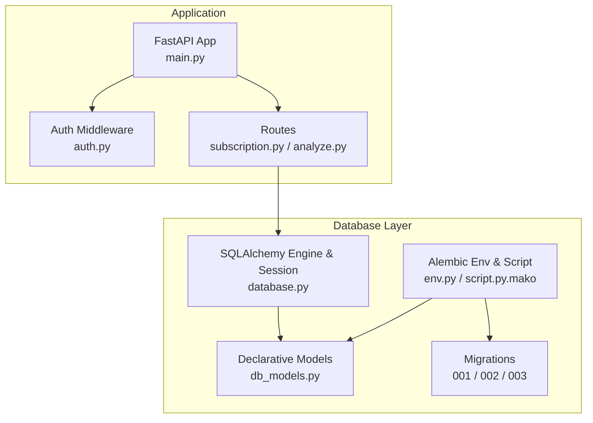
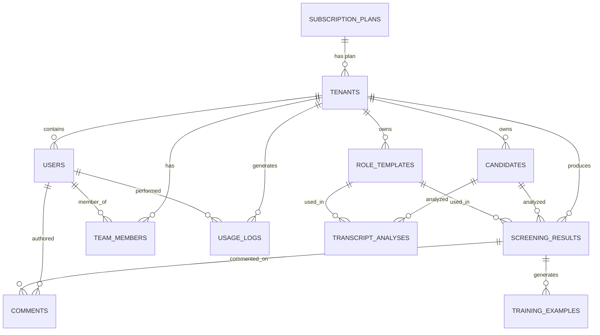
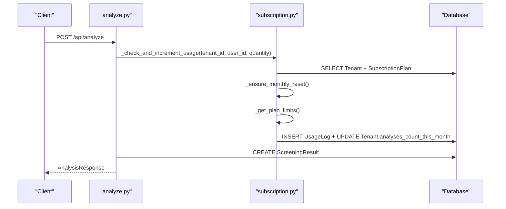
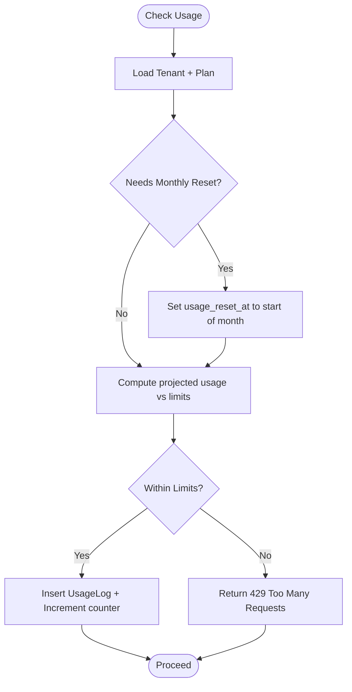
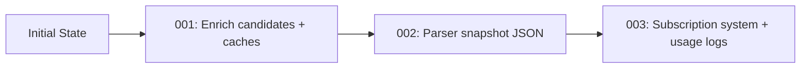
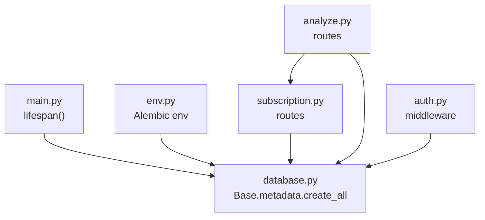

# Database Design

<cite>
**Referenced Files in This Document**
- [database.py](file://app/backend/db/database.py)
- [db_models.py](file://app/backend/models/db_models.py)
- [schemas.py](file://app/backend/models/schemas.py)
- [env.py](file://alembic/env.py)
- [script.py.mako](file://alembic/script.py.mako)
- [001_enrich_candidates_add_caches.py](file://alembic/versions/001_enrich_candidates_add_caches.py)
- [002_parser_snapshot_json.py](file://alembic/versions/002_parser_snapshot_json.py)
- [003_subscription_system.py](file://alembic/versions/003_subscription_system.py)
- [main.py](file://app/backend/main.py)
- [auth.py](file://app/backend/middleware/auth.py)
- [subscription.py](file://app/backend/routes/subscription.py)
- [analyze.py](file://app/backend/routes/analyze.py)
</cite>

## Table of Contents
1. [Introduction](#introduction)
2. [Project Structure](#project-structure)
3. [Core Components](#core-components)
4. [Architecture Overview](#architecture-overview)
5. [Detailed Component Analysis](#detailed-component-analysis)
6. [Dependency Analysis](#dependency-analysis)
7. [Performance Considerations](#performance-considerations)
8. [Troubleshooting Guide](#troubleshooting-guide)
9. [Conclusion](#conclusion)
10. [Appendices](#appendices)

## Introduction
This document describes the database design for Resume AI by ThetaLogics. It covers the entity relationship model, field definitions, indexes, constraints, multi-tenant architecture, subscription and usage tracking, the Alembic migration system, data validation rules, business logic constraints, referential integrity, data access patterns, caching strategies, performance considerations, data lifecycle and retention, backup strategies, and representative queries and reporting scenarios.

## Project Structure
The database layer is implemented with SQLAlchemy declarative models and Alembic migrations. The application bootstraps database tables on startup and exposes tenant-aware APIs that enforce usage limits and track consumption.

**Diagram sources**
- [main.py:152-172](file://app/backend/main.py#L152-L172)
- [auth.py:19-46](file://app/backend/middleware/auth.py#L19-L46)
- [subscription.py:162-253](file://app/backend/routes/subscription.py#L162-L253)
- [analyze.py:354-501](file://app/backend/routes/analyze.py#L354-L501)
- [database.py:1-33](file://app/backend/db/database.py#L1-L33)
- [db_models.py:11-250](file://app/backend/models/db_models.py#L11-L250)
- [env.py:1-51](file://alembic/env.py#L1-L51)
- [script.py.mako:1-29](file://alembic/script.py.mako#L1-L29)
- [001_enrich_candidates_add_caches.py:1-129](file://alembic/versions/001_enrich_candidates_add_caches.py#L1-L129)
- [002_parser_snapshot_json.py:1-34](file://alembic/versions/002_parser_snapshot_json.py#L1-L34)
- [003_subscription_system.py:1-290](file://alembic/versions/003_subscription_system.py#L1-L290)

**Section sources**
- [main.py:152-172](file://app/backend/main.py#L152-L172)
- [database.py:1-33](file://app/backend/db/database.py#L1-L33)
- [env.py:1-51](file://alembic/env.py#L1-L51)

## Core Components
This section documents the core entities and their attributes relevant to the multi-tenant architecture, screening, templates, and usage tracking.

- Tenant
  - Purpose: Multi-tenant container with subscription and usage tracking.
  - Key fields: id, name, slug, plan_id, subscription_status, current_period_start/end, analyses_count_this_month, storage_used_bytes, usage_reset_at, stripe_* identifiers, timestamps.
  - Indexes: subscription_status, stripe_customer_id; relationships: plan, users, candidates, templates, results, team_members, usage_logs.
  - Constraints: plan_id FK to subscription_plans; default subscription_status active; usage counters initialized to zero.

- SubscriptionPlan
  - Purpose: Defines pricing tiers and feature sets.
  - Key fields: id, name (unique), display_name, description, limits (JSON), price_monthly/yearly, currency, features (JSON), is_active, sort_order, timestamps.
  - Indexes: composite (is_active, sort_order); relationships: tenants.

- User
  - Purpose: Tenant member with role and authentication linkage.
  - Key fields: id, tenant_id (FK), email (unique), hashed_password, role, is_active, timestamps.
  - Indexes: email; relationships: tenant, team_member, comments, usage_logs.

- Candidate
  - Purpose: Resume/profile storage with enrichment and caching fields.
  - Key fields: id, tenant_id (FK), name, email, phone, timestamps; enrichment: resume_file_hash (MD5), raw_resume_text, parsed_skills/education/work_exp, gap_analysis_json, current_role/company, total_years_exp, profile_quality, profile_updated_at; parser snapshot: parser_snapshot_json.
  - Indexes: email, resume_file_hash; relationships: tenant, results, transcript_analyses.

- ScreeningResult
  - Purpose: Stores analysis outputs for a candidate/job combination.
  - Key fields: id, tenant_id (FK), candidate_id (FK), role_template_id (FK), resume_text, jd_text, parsed_data (JSON), analysis_result (JSON), status, timestamp.
  - Relationships: tenant, candidate, role_template, comments, training_examples.

- RoleTemplate
  - Purpose: Job description templates with scoring weights and tags.
  - Key fields: id, tenant_id (FK), name, jd_text, scoring_weights (JSON), tags, timestamps.
  - Relationships: tenant, results, transcript_analyses.

- UsageLog
  - Purpose: Audit trail of actions and quantities per tenant/user.
  - Key fields: id, tenant_id (FK, CASCADE), user_id (FK, SET NULL), action, quantity, details (JSON), created_at; indexes: tenant+action, tenant+created_at, created_at.
  - Relationships: tenant, user.

- Additional caching entities
  - JdCache: shared cache keyed by hash for parsed job descriptions.
  - Skill: dynamic registry of skills with aliases, domain, status, source, frequency.

**Section sources**
- [db_models.py:11-250](file://app/backend/models/db_models.py#L11-L250)

## Architecture Overview
The system enforces tenant isolation by scoping all entities to a tenant_id foreign key. Usage enforcement occurs at the route layer by checking plan limits and incrementing counters, with detailed usage recorded in UsageLog. The Alembic migration system evolves schema safely with idempotent operations.

**Diagram sources**
- [db_models.py:11-250](file://app/backend/models/db_models.py#L11-L250)

## Detailed Component Analysis

### Multi-Tenant Architecture and Isolation
- Tenant isolation is achieved by requiring tenant_id on all entities participating in multi-tenant operations (e.g., Users, Candidates, ScreeningResults, RoleTemplates, UsageLogs).
- Route handlers filter queries by tenant_id to prevent cross-tenant data leakage.
- Usage enforcement ensures actions are permitted within plan limits per tenant.

**Diagram sources**
- [analyze.py:323-351](file://app/backend/routes/analyze.py#L323-L351)
- [subscription.py:72-92](file://app/backend/routes/subscription.py#L72-L92)
- [subscription.py:427-476](file://app/backend/routes/subscription.py#L427-L476)

**Section sources**
- [analyze.py:323-351](file://app/backend/routes/analyze.py#L323-L351)
- [subscription.py:72-92](file://app/backend/routes/subscription.py#L72-L92)
- [subscription.py:427-476](file://app/backend/routes/subscription.py#L427-L476)

### Subscription and Usage Management
- SubscriptionPlan defines pricing and limits via JSON fields (limits, features).
- Tenant tracks subscription_status, billing periods, monthly usage counters, and storage usage.
- UsageLog records each action with quantity and optional details; composite indexes optimize reporting.
- Routes expose plan retrieval, usage checks, and usage history.

**Diagram sources**
- [subscription.py:72-92](file://app/backend/routes/subscription.py#L72-L92)
- [subscription.py:256-343](file://app/backend/routes/subscription.py#L256-L343)
- [subscription.py:427-476](file://app/backend/routes/subscription.py#L427-L476)

**Section sources**
- [subscription.py:162-253](file://app/backend/routes/subscription.py#L162-L253)
- [subscription.py:256-343](file://app/backend/routes/subscription.py#L256-L343)
- [subscription.py:427-476](file://app/backend/routes/subscription.py#L427-L476)

### Migration System and Schema Evolution
- Alembic env registers models and binds metadata to the configured DATABASE_URL.
- Migrations are idempotent and guard against pre-existing tables/columns.
- Version history:
  - 001: Enrich candidates with profile fields; add jd_cache and skills tables.
  - 002: Add parser_snapshot_json to candidates.
  - 003: Enhance subscription_plans, add tenant usage fields, create usage_logs, seed plans, link existing tenants to default plan.

**Diagram sources**
- [env.py:11-20](file://alembic/env.py#L11-L20)
- [001_enrich_candidates_add_caches.py:42-129](file://alembic/versions/001_enrich_candidates_add_caches.py#L42-L129)
- [002_parser_snapshot_json.py:21-34](file://alembic/versions/002_parser_snapshot_json.py#L21-L34)
- [003_subscription_system.py:43-252](file://alembic/versions/003_subscription_system.py#L43-L252)

**Section sources**
- [env.py:1-51](file://alembic/env.py#L1-L51)
- [script.py.mako:1-29](file://alembic/script.py.mako#L1-L29)
- [001_enrich_candidates_add_caches.py:1-129](file://alembic/versions/001_enrich_candidates_add_caches.py#L1-L129)
- [002_parser_snapshot_json.py:1-34](file://alembic/versions/002_parser_snapshot_json.py#L1-L34)
- [003_subscription_system.py:1-290](file://alembic/versions/003_subscription_system.py#L1-L290)

### Data Validation Rules and Business Logic Constraints
- Tenant isolation: All sensitive routes filter by tenant_id.
- Usage limits: Monthly analysis counts enforced per plan limits; storage usage computed from text lengths.
- Deduplication: Candidate matching by resume_file_hash and fallback by email/tenant.
- Authentication: JWT decoding and active user lookup; admin-only routes gated by role.
- Data types: JSON fields for parsed_data, analysis_result, limits, features; numeric counters for usage; timestamps with timezone support.

**Section sources**
- [auth.py:19-46](file://app/backend/middleware/auth.py#L19-L46)
- [analyze.py:396-411](file://app/backend/routes/analyze.py#L396-L411)
- [subscription.py:117-129](file://app/backend/routes/subscription.py#L117-L129)

### Referential Integrity and Indexes
- Foreign keys:
  - Tenant.plan_id -> SubscriptionPlan.id
  - User.tenant_id -> Tenant.id
  - Candidate.tenant_id -> Tenant.id
  - ScreeningResult.tenant_id -> Tenant.id
  - RoleTemplate.tenant_id -> Tenant.id
  - UsageLog.tenant_id -> Tenant.id (CASCADE), user_id -> User.id (SET NULL)
- Indexes:
  - Candidate.email, Candidate.resume_file_hash
  - SubscriptionPlans(is_active, sort_order)
  - Tenants(subscription_status), Tenants(stripe_customer_id)
  - UsageLogs(tenant_id, action), UsageLogs(tenant_id, created_at), UsageLogs(created_at)

**Section sources**
- [db_models.py:34-59](file://app/backend/models/db_models.py#L34-L59)
- [db_models.py:100-105](file://app/backend/models/db_models.py#L100-L105)
- [db_models.py:131-146](file://app/backend/models/db_models.py#L131-L146)
- [db_models.py:154-164](file://app/backend/models/db_models.py#L154-L164)
- [db_models.py:83-92](file://app/backend/models/db_models.py#L83-L92)
- [001_enrich_candidates_add_caches.py:75-110](file://alembic/versions/001_enrich_candidates_add_caches.py#L75-L110)
- [003_subscription_system.py:66-117](file://alembic/versions/003_subscription_system.py#L66-L117)

### Data Access Patterns, Caching, and Performance
- Data access patterns:
  - Tenant-scoped queries: filter by tenant_id across entities.
  - Aggregation queries: sum lengths for storage usage; count users for team metrics.
  - Composite indexing: UsageLogs(tenant_id, action), UsageLogs(tenant_id, created_at) for efficient reporting.
- Caching strategies:
  - JdCache stores parsed job descriptions keyed by hash to avoid repeated parsing.
  - Candidate enrichment fields reduce repeated parsing costs.
- Performance considerations:
  - Use indexes on frequently filtered columns (email, resume_file_hash, tenant_id).
  - Prefer batch operations for inserts (bulk insert for plans).
  - Avoid N+1 queries by using joined eager loading where appropriate.

**Section sources**
- [db_models.py:229-236](file://app/backend/models/db_models.py#L229-L236)
- [subscription.py:117-129](file://app/backend/routes/subscription.py#L117-L129)
- [001_enrich_candidates_add_caches.py:78-110](file://alembic/versions/001_enrich_candidates_add_caches.py#L78-L110)
- [003_subscription_system.py:93-117](file://alembic/versions/003_subscription_system.py#L93-L117)

### Data Lifecycle, Retention, and Backup
- Data lifecycle:
  - Candidates: enriched once and reused for subsequent analyses; parser snapshots retained for auditability.
  - ScreeningResults: persisted per analysis; comments and training examples augment insights.
  - UsageLogs: historical audit trail; can be pruned according to policy.
- Retention:
  - No explicit retention policies are defined in code; implement administrative controls to archive or purge historical data.
- Backup:
  - Use database-native backups (e.g., pg_dump for PostgreSQL, SQLite backup mechanisms) and regular snapshots.
  - Consider logical backups for portable deployments.

[No sources needed since this section provides general guidance]

### Sample Queries and Reporting Scenarios
- Monthly usage by tenant
  - Query: select tenant_id, action, count(*) as count, sum(quantity) as total from usage_logs group by tenant_id, action order by tenant_id, action.
  - Indexes: ix_usage_logs_tenant_action, ix_usage_logs_tenant_created.
- Storage usage per tenant
  - Query: sum(length(raw_resume_text)) + sum(length(parser_snapshot_json)) from candidates where tenant_id = ?.
- Top skills by frequency
  - Query: select name, frequency from skills order by frequency desc limit 50.

**Section sources**
- [subscription.py:346-367](file://app/backend/routes/subscription.py#L346-L367)
- [subscription.py:117-129](file://app/backend/routes/subscription.py#L117-L129)
- [003_subscription_system.py:105-117](file://alembic/versions/003_subscription_system.py#L105-L117)

## Dependency Analysis
The application initializes database tables at startup and registers models for Alembic. Routes depend on models and middleware for tenant isolation and usage enforcement.

**Diagram sources**
- [main.py:160](file://app/backend/main.py#L160)
- [env.py:11-20](file://alembic/env.py#L11-L20)
- [subscription.py:162-253](file://app/backend/routes/subscription.py#L162-L253)
- [analyze.py:354-501](file://app/backend/routes/analyze.py#L354-L501)
- [auth.py:19-46](file://app/backend/middleware/auth.py#L19-L46)

**Section sources**
- [main.py:152-172](file://app/backend/main.py#L152-L172)
- [env.py:1-51](file://alembic/env.py#L1-L51)

## Performance Considerations
- Indexing: Ensure tenant_id, email, and resume_file_hash are indexed for fast filtering and deduplication.
- Query patterns: Use composite indexes for common filters (tenant_id + action, tenant_id + created_at).
- Caching: Reuse JdCache and candidate enrichment to minimize parsing overhead.
- Concurrency: Use SQLAlchemy sessions per request and avoid long transactions.

[No sources needed since this section provides general guidance]

## Troubleshooting Guide
- Database connectivity
  - Startup and health checks verify database reachability; failures are logged and do not block service startup.
- Usage enforcement errors
  - 429 responses indicate exceeded monthly analysis limits; use /api/subscription/check/{action} to pre-validate.
- Authentication failures
  - Invalid or expired tokens result in 401 responses; ensure JWT_SECRET_KEY is configured.

**Section sources**
- [main.py:228-259](file://app/backend/main.py#L228-L259)
- [subscription.py:256-343](file://app/backend/routes/subscription.py#L256-L343)
- [auth.py:23-40](file://app/backend/middleware/auth.py#L23-L40)

## Conclusion
The database design centers on robust multi-tenancy with tenant-scoped entities, strict usage enforcement via SubscriptionPlan and UsageLog, and a well-defined Alembic migration history. The schema supports caching, efficient indexing, and clear business rules for screening, template management, and team collaboration. Operational practices around retention, backup, and monitoring will ensure reliability and scalability.

[No sources needed since this section summarizes without analyzing specific files]

## Appendices

### Appendix A: Entity Field Reference
- Tenant
  - Fields: id, name, slug, plan_id, subscription_status, current_period_start, current_period_end, analyses_count_this_month, storage_used_bytes, usage_reset_at, stripe_customer_id, stripe_subscription_id, subscription_updated_at, timestamps.
  - Indexes: subscription_status, stripe_customer_id.
- SubscriptionPlan
  - Fields: id, name (unique), display_name, description, limits (JSON), price_monthly, price_yearly, currency, features (JSON), is_active, sort_order, timestamps.
  - Indexes: (is_active, sort_order).
- User
  - Fields: id, tenant_id, email (unique), hashed_password, role, is_active, timestamps.
  - Indexes: email.
- Candidate
  - Fields: id, tenant_id, name, email, phone, timestamps; enrichment: resume_file_hash, raw_resume_text, parsed_skills/education/work_exp, gap_analysis_json, current_role/company, total_years_exp, profile_quality, profile_updated_at; parser_snapshot_json.
  - Indexes: email, resume_file_hash.
- ScreeningResult
  - Fields: id, tenant_id, candidate_id, role_template_id, resume_text, jd_text, parsed_data (JSON), analysis_result (JSON), status, timestamp.
- RoleTemplate
  - Fields: id, tenant_id, name, jd_text, scoring_weights (JSON), tags, timestamps.
- UsageLog
  - Fields: id, tenant_id (CASCADE), user_id (SET NULL), action, quantity, details (JSON), created_at.
  - Indexes: tenant_id+action, tenant_id+created_at, created_at.

**Section sources**
- [db_models.py:11-250](file://app/backend/models/db_models.py#L11-L250)
- [001_enrich_candidates_add_caches.py:75-110](file://alembic/versions/001_enrich_candidates_add_caches.py#L75-L110)
- [003_subscription_system.py:66-117](file://alembic/versions/003_subscription_system.py#L66-L117)