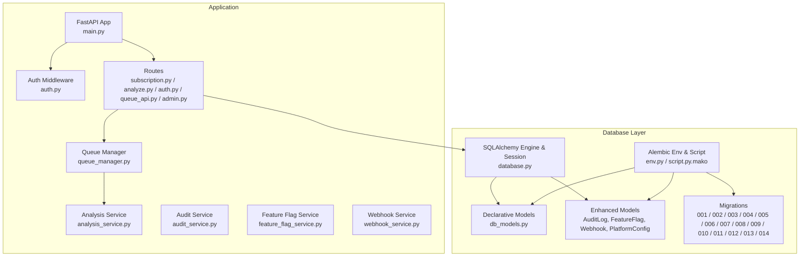
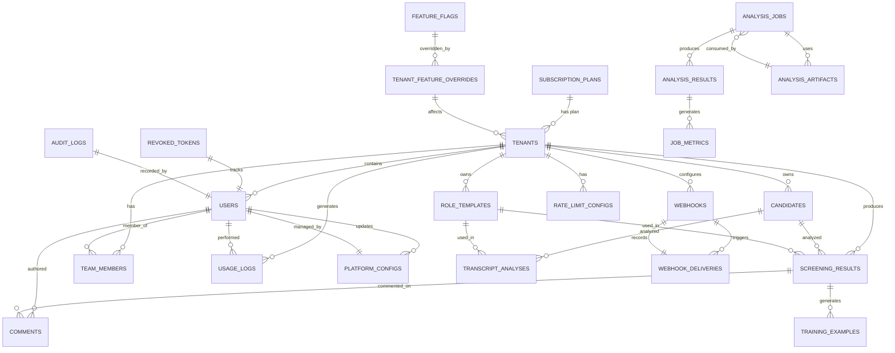
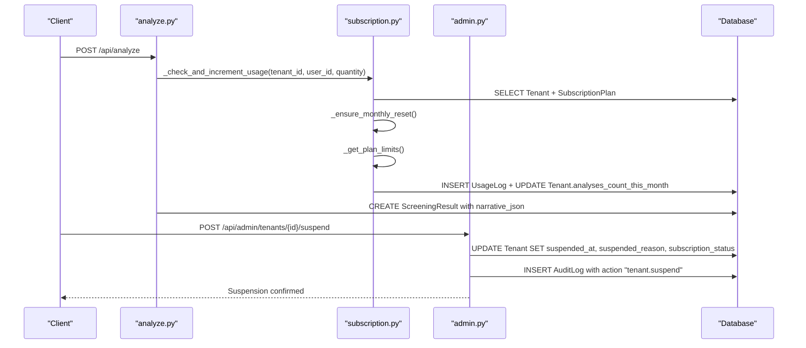
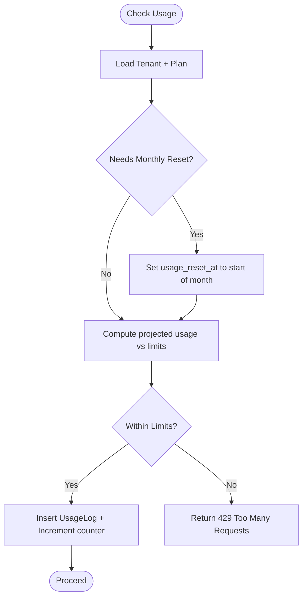
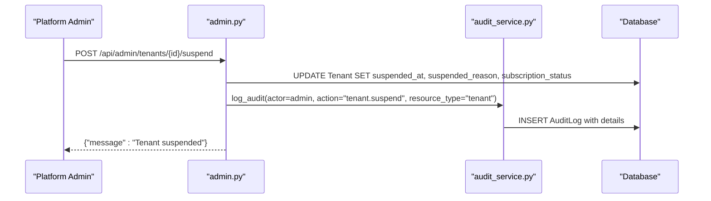
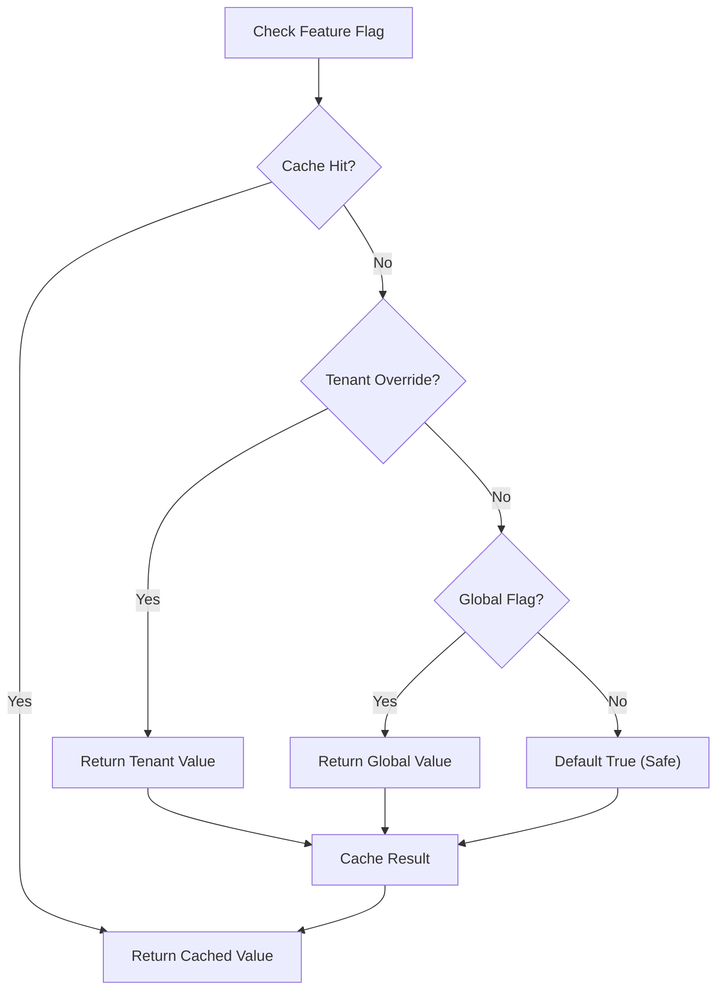
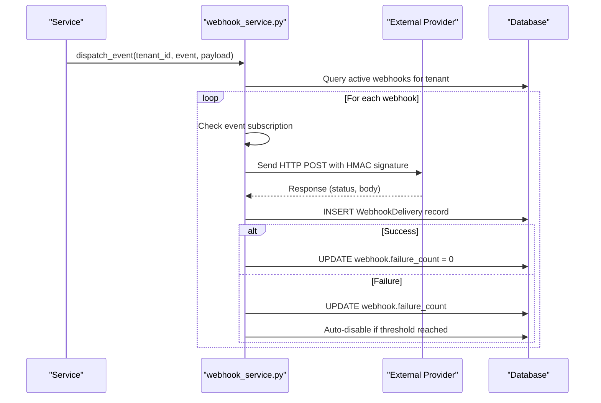
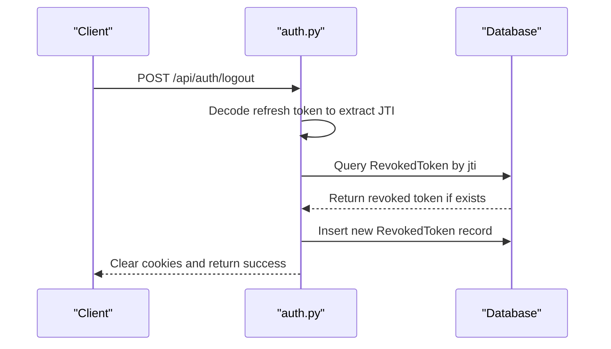
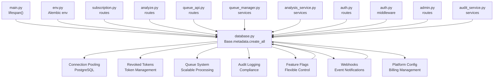

```mermaid
graph LR
A["Initial State"] --> B["001: Enrich candidates + caches"]
B --> C["002: Parser snapshot JSON"]
C --> D["003: Subscription system + usage logs"]
D --> E["004: Narrative JSON column"]
E --> F["005: Revoked tokens table"]
F --> G["006: Strategic indexes + created_at"]
G --> H["007: Narrative status field"]
H --> I["008: Queue system implementation"]
I --> J["009: Intelligent scoring weights"]
J --> K["010: JD text enhancement"]
K --> L["011: Narrative tracking enhancement"]
L --> M["012: Admin foundation"]
M --> N["013: Webhooks and notifications"]
N --> O["014: Billing system"]
```

# Database Design

<cite>
**Referenced Files in This Document**
- [database.py](file://app/backend/db/database.py)
- [db_models.py](file://app/backend/models/db_models.py)
- [schemas.py](file://app/backend/models/schemas.py)
- [env.py](file://alembic/env.py)
- [script.py.mako](file://alembic/script.py.mako)
- [001_enrich_candidates_add_caches.py](file://alembic/versions/001_enrich_candidates_add_caches.py)
- [002_parser_snapshot_json.py](file://alembic/versions/002_parser_snapshot_json.py)
- [003_subscription_system.py](file://alembic/versions/003_subscription_system.py)
- [004_narrative_json.py](file://alembic/versions/004_narrative_json.py)
- [005_revoked_tokens.py](file://alembic/versions/005_revoked_tokens.py)
- [006_indexes_and_jdcache_created_at.py](file://alembic/versions/006_indexes_and_jdcache_created_at.py)
- [007_narrative_status.py](file://alembic/versions/007_narrative_status.py)
- [008_analysis_queue_system.py](file://alembic/versions/008_analysis_queue_system.py)
- [009_intelligent_scoring_weights.py](file://alembic/versions/009_intelligent_scoring_weights.py)
- [010_add_jd_text_to_screening_result.py](file://alembic/versions/010_add_jd_text_to_screening_result.py)
- [011_narrative_tracking_enhancement.py](file://alembic/versions/011_narrative_tracking_enhancement.py)
- [012_admin_foundation.py](file://alembic/versions/012_admin_foundation.py)
- [013_webhooks_and_notifications.py](file://alembic/versions/013_webhooks_and_notifications.py)
- [014_billing_system.py](file://alembic/versions/014_billing_system.py)
- [main.py](file://app/backend/main.py)
- [auth.py](file://app/backend/middleware/auth.py)
- [subscription.py](file://app/backend/routes/subscription.py)
- [analyze.py](file://app/backend/routes/analyze.py)
- [auth_routes.py](file://app/backend/routes/auth.py)
- [queue_api.py](file://app/backend/routes/queue_api.py)
- [admin.py](file://app/backend/routes/admin.py)
- [queue_manager.py](file://app/backend/services/queue_manager.py)
- [analysis_service.py](file://app/backend/services/analysis_service.py)
- [weight_suggester.py](file://app/backend/services/weight_suggester.py)
- [audit_service.py](file://app/backend/services/audit_service.py)
- [feature_flag_service.py](file://app/backend/services/feature_flag_service.py)
- [webhook_service.py](file://app/backend/services/webhook_service.py)
</cite>

## Update Summary
**Changes Made**
- Added new tables for audit logging, feature flags, rate limiting configurations, webhooks, webhook deliveries, and platform configuration
- Enhanced Tenant model with suspension capabilities, metadata storage, and comprehensive billing integration fields
- Added platform admin functionality with tenant management, audit logging, and feature flag control
- Implemented webhook system with HMAC signing, retry logic, and delivery tracking
- Added comprehensive billing configuration management for payment providers

## Table of Contents
1. [Introduction](#introduction)
2. [Project Structure](#project-structure)
3. [Core Components](#core-components)
4. [Architecture Overview](#architecture-overview)
5. [Detailed Component Analysis](#detailed-component-analysis)
6. [Dependency Analysis](#dependency-analysis)
7. [Performance Considerations](#performance-considerations)
8. [Troubleshooting Guide](#troubleshooting-guide)
9. [Conclusion](#conclusion)
10. [Appendices](#appendices)

## Introduction
This document describes the database design for Resume AI by ThetaLogics. It covers the entity relationship model, field definitions, indexes, constraints, multi-tenant architecture, subscription and usage tracking, the Alembic migration system, data validation rules, business logic constraints, referential integrity, data access patterns, caching strategies, performance considerations, data lifecycle and retention, backup strategies, and representative queries and reporting scenarios.

**Updated** Enhanced with comprehensive audit logging, feature flag management, webhook system, and platform configuration capabilities

## Project Structure
The database layer is implemented with SQLAlchemy declarative models and Alembic migrations. The application bootstraps database tables on startup and exposes tenant-aware APIs that enforce usage limits and track consumption. Recent enhancements included connection pooling for PostgreSQL, token revocation support, strategic indexing for improved query performance, a comprehensive queue system for scalable analysis processing, platform administration capabilities, webhook notifications, and billing configuration management.

**Diagram sources**
- [main.py:152-172](file://app/backend/main.py#L152-L172)
- [auth.py:19-46](file://app/backend/middleware/auth.py#L19-L46)
- [subscription.py:162-253](file://app/backend/routes/subscription.py#L162-L253)
- [analyze.py:354-501](file://app/backend/routes/analyze.py#L354-L501)
- [queue_api.py:1-464](file://app/backend/routes/queue_api.py#L1-L464)
- [admin.py:1-800](file://app/backend/routes/admin.py#L1-L800)
- [queue_manager.py:1-612](file://app/backend/services/queue_manager.py#L1-L612)
- [analysis_service.py:1-121](file://app/backend/services/analysis_service.py#L1-L121)
- [audit_service.py:1-40](file://app/backend/services/audit_service.py#L1-L40)
- [feature_flag_service.py:1-94](file://app/backend/services/feature_flag_service.py#L1-L94)
- [webhook_service.py:1-138](file://app/backend/services/webhook_service.py#L1-L138)
- [database.py:1-50](file://app/backend/db/database.py#L1-L50)
- [db_models.py:11-378](file://app/backend/models/db_models.py#L11-L378)
- [env.py:1-51](file://alembic/env.py#L1-L51)
- [script.py.mako:1-29](file://alembic/script.py.mako#L1-L29)
- [008_analysis_queue_system.py:1-347](file://alembic/versions/008_analysis_queue_system.py#L1-L347)
- [012_admin_foundation.py:1-161](file://alembic/versions/012_admin_foundation.py#L1-L161)
- [013_webhooks_and_notifications.py:1-145](file://alembic/versions/013_webhooks_and_notifications.py#L1-L145)
- [014_billing_system.py:1-67](file://alembic/versions/014_billing_system.py#L1-L67)

**Section sources**
- [main.py:152-172](file://app/backend/main.py#L152-L172)
- [database.py:1-50](file://app/backend/db/database.py#L1-L50)
- [env.py:1-51](file://alembic/env.py#L1-L51)

## Core Components
This section documents the core entities and their attributes relevant to the multi-tenant architecture, screening, templates, usage tracking, enhanced security features, platform administration, webhook notifications, and billing configuration.

- Tenant
  - Purpose: Multi-tenant container with subscription and usage tracking.
  - Key fields: id, name, slug, plan_id, timestamps.
  - Enhanced fields: subscription_status, current_period_start/end, analyses_count_this_month, storage_used_bytes, usage_reset_at, stripe_customer_id, stripe_subscription_id, subscription_updated_at, suspended_at, suspended_reason, metadata_json.
  - Indexes: subscription_status, stripe_customer_id; relationships: plan, users, candidates, templates, results, team_members, usage_logs.
  - Constraints: plan_id FK to subscription_plans; default subscription_status active; usage counters initialized to zero.

- SubscriptionPlan
  - Purpose: Defines pricing tiers and feature sets.
  - Key fields: id, name (unique), display_name, description, limits (JSON), price_monthly/yearly, currency, features (JSON), is_active, sort_order, timestamps.
  - Indexes: composite (is_active, sort_order); relationships: tenants.

- User
  - Purpose: Tenant member with role and authentication linkage.
  - Key fields: id, tenant_id (FK), email (unique), hashed_password, role, is_active, is_platform_admin, timestamps.
  - Indexes: email; relationships: tenant, team_member, comments, usage_logs.

- Candidate
  - Purpose: Resume/profile storage with enrichment and caching fields.
  - Key fields: id, tenant_id (FK), name, email, phone, timestamps; enrichment: resume_file_hash (MD5), raw_resume_text, parsed_skills/education/work_exp, gap_analysis_json, current_role/company, total_years_exp, profile_quality, profile_updated_at; parser_snapshot_json.
  - Indexes: email, resume_file_hash; relationships: tenant, results, transcript_analyses.

- ScreeningResult
  - Purpose: Stores analysis outputs for a candidate/job combination.
  - Key fields: id, tenant_id (FK), candidate_id (FK), role_template_id (FK), resume_text, jd_text, parsed_data (JSON), analysis_result (JSON), narrative_json (TEXT, nullable), narrative_status, narrative_error, status, is_active, version_number, role_category, weight_reasoning, suggested_weights_json, timestamp.
  - Indexes: candidate_id, timestamp; relationships: tenant, candidate, role_template, comments, training_examples.

- RoleTemplate
  - Purpose: Job description templates with scoring weights and tags.
  - Key fields: id, tenant_id (FK), name, jd_text, scoring_weights (JSON), tags, timestamps.
  - Relationships: tenant, results, transcript_analyses.

- UsageLog
  - Purpose: Audit trail of actions and quantities per tenant/user.
  - Key fields: id, tenant_id (FK, CASCADE), user_id (FK, SET NULL), action, quantity, details (JSON), created_at; indexes: tenant+action, tenant+created_at, created_at.
  - Relationships: tenant, user.

- RevokedToken
  - Purpose: Tracks revoked JWT tokens to prevent reuse after logout.
  - Key fields: id, jti (unique, indexed), revoked_at, expires_at.
  - Indexes: id, jti (unique); relationships: none.

- AuditLog
  - Purpose: Platform admin audit trail for all administrative actions.
  - Key fields: id, actor_user_id (FK, SET NULL), actor_email, action, resource_type, resource_id, details (JSON), ip_address, created_at; indexes: action, created_at.
  - Relationships: none.

- FeatureFlag
  - Purpose: Global feature flags for platform-wide feature control.
  - Key fields: id, key (unique), display_name, description, enabled_globally, created_at, updated_at.
  - Indexes: key; relationships: tenant_feature_overrides.

- TenantFeatureOverride
  - Purpose: Per-tenant overrides for feature flags.
  - Key fields: id, tenant_id (FK, CASCADE), feature_flag_id (FK, CASCADE), enabled, created_at; unique constraint (tenant_id, feature_flag_id).
  - Relationships: feature_flag.

- RateLimitConfig
  - Purpose: Per-tenant rate limiting configuration.
  - Key fields: id, tenant_id (FK, CASCADE, unique), requests_per_minute, llm_concurrent_max, created_at, updated_at.
  - Relationships: none.

- Webhook
  - Purpose: Tenant webhook configuration for event notifications.
  - Key fields: id, tenant_id (FK, CASCADE), url, secret, events (JSON), is_active, failure_count, last_triggered_at, last_failure_at, created_at, updated_at.
  - Indexes: id, tenant_id; relationships: deliveries.

- WebhookDelivery
  - Purpose: Record of a webhook delivery attempt.
  - Key fields: id, webhook_id (FK, CASCADE), event, payload (JSON), response_status, response_body, success, attempt, created_at.
  - Indexes: id, webhook_id; relationships: webhook.

- PlatformConfig
  - Purpose: Platform-level key-value configuration for billing provider settings.
  - Key fields: id, config_key (unique), config_value, description, updated_at, updated_by (FK, SET NULL).
  - Indexes: id, config_key; relationships: users.

- Queue System Tables
  - AnalysisJobs: Main queue table for tracking analysis tasks with priority, status, and retry management.
  - AnalysisResults: Immutable storage for completed analyses with quality assurance and metrics.
  - AnalysisArtifacts: Store input files and intermediate data with deduplication support.
  - JobMetrics: Performance and quality metrics for monitoring queue operations.

**Section sources**
- [db_models.py:11-378](file://app/backend/models/db_models.py#L11-L378)

## Architecture Overview
The system enforces tenant isolation by scoping all entities to a tenant_id foreign key. Usage enforcement occurs at the route layer by checking plan limits and incrementing counters, with detailed usage recorded in UsageLog. The Alembic migration system evolves schema safely with idempotent operations. Recent enhancements included token revocation support, strategic indexing for improved performance, a comprehensive queue system for scalable analysis processing, platform administration capabilities, webhook notifications, and billing configuration management.

**Diagram sources**
- [db_models.py:11-378](file://app/backend/models/db_models.py#L11-L378)

## Detailed Component Analysis

### Multi-Tenant Architecture and Isolation
- Tenant isolation is achieved by requiring tenant_id on all entities participating in multi-tenant operations (e.g., Users, Candidates, ScreeningResults, RoleTemplates, UsageLogs, Webhooks, RateLimitConfigs).
- Route handlers filter queries by tenant_id to prevent cross-tenant data leakage.
- Usage enforcement ensures actions are permitted within plan limits per tenant.
- **Updated** Enhanced Tenant model now includes suspension capabilities and comprehensive billing integration fields.

**Diagram sources**
- [analyze.py:323-351](file://app/backend/routes/analyze.py#L323-L351)
- [subscription.py:72-92](file://app/backend/routes/subscription.py#L72-L92)
- [subscription.py:427-476](file://app/backend/routes/subscription.py#L427-L476)
- [admin.py:301-329](file://app/backend/routes/admin.py#L301-L329)

**Section sources**
- [analyze.py:323-351](file://app/backend/routes/analyze.py#L323-L351)
- [subscription.py:72-92](file://app/backend/routes/subscription.py#L72-L92)
- [subscription.py:427-476](file://app/backend/routes/subscription.py#L427-L476)
- [admin.py:301-329](file://app/backend/routes/admin.py#L301-L329)

### Subscription and Usage Management
- SubscriptionPlan defines pricing and limits via JSON fields (limits, features).
- Tenant tracks subscription_status, billing periods, monthly usage counters, and storage usage with enhanced suspension and metadata fields.
- UsageLog records each action with quantity and optional details; composite indexes optimize reporting.
- Routes expose plan retrieval, usage checks, and usage history.
- **Updated** Enhanced with comprehensive billing integration fields (stripe_customer_id, stripe_subscription_id, subscription_updated_at).

**Diagram sources**
- [subscription.py:72-92](file://app/backend/routes/subscription.py#L72-L92)
- [subscription.py:256-343](file://app/backend/routes/subscription.py#L256-L343)
- [subscription.py:427-476](file://app/backend/routes/subscription.py#L427-L476)

**Section sources**
- [subscription.py:162-253](file://app/backend/routes/subscription.py#L162-L253)
- [subscription.py:256-343](file://app/backend/routes/subscription.py#L256-L343)
- [subscription.py:427-476](file://app/backend/routes/subscription.py#L427-L476)

### Platform Administration and Audit Logging
- **New** AuditLog table provides comprehensive audit trail for all administrative actions including tenant management, feature flag changes, and system modifications.
- **New** Platform admin users with is_platform_admin flag can manage tenants, view audit logs, and control feature flags.
- **New** Tenant suspension capabilities with reason tracking and status management.
- **New** Metadata storage for tenant customization and configuration.
- **New** Billing integration fields for Stripe customer and subscription management.

**Diagram sources**
- [admin.py:301-329](file://app/backend/routes/admin.py#L301-L329)
- [audit_service.py:7-39](file://app/backend/services/audit_service.py#L7-L39)

**Section sources**
- [admin.py:301-329](file://app/backend/routes/admin.py#L301-L329)
- [audit_service.py:7-39](file://app/backend/services/audit_service.py#L7-L39)
- [db_models.py:32-64](file://app/backend/models/db_models.py#L32-L64)

### Feature Flag Management System
- **New** Global feature flags with per-tenant overrides for flexible feature control.
- **New** In-memory caching with TTL for performance optimization.
- **New** Default seeding of core platform features (video_analysis, batch_analysis, custom_weights, api_access, etc.).
- **New** Cache invalidation mechanism for real-time flag updates.

**Diagram sources**
- [feature_flag_service.py:46-79](file://app/backend/services/feature_flag_service.py#L46-L79)

**Section sources**
- [feature_flag_service.py:1-94](file://app/backend/services/feature_flag_service.py#L1-L94)
- [db_models.py:291-318](file://app/backend/models/db_models.py#L291-L318)

### Webhook Notification System
- **New** Comprehensive webhook system with HMAC-SHA256 signing for security.
- **New** Configurable retry logic with exponential backoff (1s, 5s, 30s).
- **New** Automatic webhook disabling after excessive failures.
- **New** Delivery tracking with success/failure status and response capture.
- **New** Event filtering with wildcard support (*).

**Diagram sources**
- [webhook_service.py:46-112](file://app/backend/services/webhook_service.py#L46-L112)

**Section sources**
- [webhook_service.py:1-138](file://app/backend/services/webhook_service.py#L1-L138)
- [db_models.py:331-364](file://app/backend/models/db_models.py#L331-L364)

### Billing Configuration Management
- **New** PlatformConfig table for centralized billing provider configuration storage.
- **New** Secure credential storage with encryption at rest.
- **New** Audit trail for configuration changes with who made them.
- **New** Support for multiple payment providers and configuration parameters.

**Section sources**
- [db_models.py:367-378](file://app/backend/models/db_models.py#L367-L378)
- [014_billing_system.py:33-56](file://alembic/versions/014_billing_system.py#L33-L56)

### Enhanced Authentication and Token Management
- Token revocation system prevents reuse of invalidated refresh tokens.
- RevokedToken table stores JWT IDs (JTI) with timestamps for tracking.
- Logout endpoint decodes refresh tokens and stores their JTI in the revoked_tokens table.
- Refresh token validation checks against revoked tokens before issuing new tokens.
- **Updated** Platform admin users with elevated privileges for system management.

**Diagram sources**
- [auth_routes.py:211-254](file://app/backend/routes/auth.py#L211-L254)
- [db_models.py:267-275](file://app/backend/models/db_models.py#L267-L275)

**Section sources**
- [auth_routes.py:211-254](file://app/backend/routes/auth.py#L211-L254)
- [db_models.py:267-275](file://app/backend/models/db_models.py#L267-L275)

### Migration System and Schema Evolution
- Alembic env registers models and binds metadata to the configured DATABASE_URL.
- Migrations are idempotent and guard against pre-existing tables/columns.
- **Updated** Version history with new administrative and notification features:
  - 001: Enrich candidates with profile fields; add jd_cache and skills tables.
  - 002: Add parser_snapshot_json to candidates.
  - 003: Enhance subscription_plans, add tenant usage fields, create usage_logs, seed plans, link existing tenants to default plan.
  - 004: Add narrative_json column to screening_results for async LLM narrative generation.
  - 005: Add revoked_tokens table for JWT token revocation support.
  - 006: Add strategic indexes and created_at column to jd_cache.
  - 007: Add narrative_status field to screening_results.
  - 008: Implement comprehensive queue system with analysis_jobs, analysis_results, analysis_artifacts, and job_metrics tables.
  - 009: Add intelligent scoring weights support to screening_results.
  - 010: Add jd_text column and indexes for screening_results.
  - 011: Add narrative_generated_at timestamp and backfill narrative_status.
  - 012: **New** Admin foundation with audit logs, feature flags, rate limits, and tenant suspension capabilities.
  - 013: **New** Webhooks and notifications with default feature flag seeding.
  - 014: **New** Billing system with platform configuration management.

**Diagram sources**
- [env.py:11-20](file://alembic/env.py#L11-L20)
- [001_enrich_candidates_add_caches.py:42-129](file://alembic/versions/001_enrich_candidates_add_caches.py#L42-L129)
- [002_parser_snapshot_json.py:21-34](file://alembic/versions/002_parser_snapshot_json.py#L21-L34)
- [003_subscription_system.py:43-252](file://alembic/versions/003_subscription_system.py#L43-L252)
- [004_narrative_json.py:24-36](file://alembic/versions/004_narrative_json.py#L24-L36)
- [005_revoked_tokens.py:41-66](file://alembic/versions/005_revoked_tokens.py#L41-L66)
- [006_indexes_and_jdcache_created_at.py:35-72](file://alembic/versions/006_indexes_and_jdcache_created_at.py#L35-L72)
- [007_narrative_status.py:24-36](file://alembic/versions/007_narrative_status.py#L24-L36)
- [008_analysis_queue_system.py:29-347](file://alembic/versions/008_analysis_queue_system.py#L29-L347)
- [009_intelligent_scoring_weights.py:27-93](file://alembic/versions/009_intelligent_scoring_weights.py#L27-L93)
- [010_add_jd_text_to_screening_result.py:20-69](file://alembic/versions/010_add_jd_text_to_screening_result.py#L20-L69)
- [011_narrative_tracking_enhancement.py:20-57](file://alembic/versions/011_narrative_tracking_enhancement.py#L20-L57)
- [012_admin_foundation.py:42-135](file://alembic/versions/012_admin_foundation.py#L42-135)
- [013_webhooks_and_notifications.py:36-114](file://alembic/versions/013_webhooks_and_notifications.py#L36-L114)
- [014_billing_system.py:33-56](file://alembic/versions/014_billing_system.py#L33-L56)

**Section sources**
- [env.py:1-51](file://alembic/env.py#L1-L51)
- [script.py.mako:1-29](file://alembic/script.py.mako#L1-L29)
- [001_enrich_candidates_add_caches.py:1-129](file://alembic/versions/001_enrich_candidates_add_caches.py#L1-L129)
- [002_parser_snapshot_json.py:1-34](file://alembic/versions/002_parser_snapshot_json.py#L1-L34)
- [003_subscription_system.py:1-290](file://alembic/versions/003_subscription_system.py#L1-L290)
- [004_narrative_json.py:1-37](file://alembic/versions/004_narrative_json.py#L1-L37)
- [005_revoked_tokens.py:1-67](file://alembic/versions/005_revoked_tokens.py#L1-L67)
- [006_indexes_and_jdcache_created_at.py:1-73](file://alembic/versions/006_indexes_and_jdcache_created_at.py#L1-L73)
- [007_narrative_status.py:1-37](file://alembic/versions/007_narrative_status.py#L1-L37)
- [008_analysis_queue_system.py:1-347](file://alembic/versions/008_analysis_queue_system.py#L1-L347)
- [009_intelligent_scoring_weights.py:1-93](file://alembic/versions/009_intelligent_scoring_weights.py#L1-L93)
- [010_add_jd_text_to_screening_result.py:1-69](file://alembic/versions/010_add_jd_text_to_screening_result.py#L1-L69)
- [011_narrative_tracking_enhancement.py:1-57](file://alembic/versions/011_narrative_tracking_enhancement.py#L1-L57)
- [012_admin_foundation.py:1-161](file://alembic/versions/012_admin_foundation.py#L1-L161)
- [013_webhooks_and_notifications.py:1-145](file://alembic/versions/013_webhooks_and_notifications.py#L1-L145)
- [014_billing_system.py:1-67](file://alembic/versions/014_billing_system.py#L1-L67)

### Data Validation Rules and Business Logic Constraints
- Tenant isolation: All sensitive routes filter by tenant_id.
- Usage limits: Monthly analysis counts enforced per plan limits; storage usage computed from text lengths.
- Deduplication: Candidate matching by resume_file_hash and fallback by email/tenant.
- Authentication: JWT decoding and active user lookup; admin-only routes gated by role.
- Token revocation: Refresh tokens checked against revoked_tokens table during refresh operations.
- Data types: JSON fields for parsed_data, analysis_result, limits, features; numeric counters for usage; timestamps with timezone support.
- Queue validation: Database triggers ensure analysis_results contain required fields and maintain data integrity.
- **Updated** Audit logging: All administrative actions are captured with actor information, resource details, and IP addresses.
- **Updated** Feature flags: Tenant overrides take precedence over global flags with cache invalidation.
- **Updated** Webhook security: HMAC signatures validate payload integrity and authenticity.
- **Updated** Billing security: Configuration values stored securely with audit trails.

**Section sources**
- [auth.py:19-46](file://app/backend/middleware/auth.py#L19-L46)
- [analyze.py:396-411](file://app/backend/routes/analyze.py#L396-L411)
- [subscription.py:117-129](file://app/backend/routes/subscription.py#L117-L129)
- [auth_routes.py:185-189](file://app/backend/routes/auth.py#L185-189)
- [admin.py:301-329](file://app/backend/routes/admin.py#L301-L329)
- [feature_flag_service.py:30-44](file://app/backend/services/feature_flag_service.py#L30-L44)
- [webhook_service.py:18-21](file://app/backend/services/webhook_service.py#L18-L21)

### Referential Integrity and Indexes
- Foreign keys:
  - Tenant.plan_id -> SubscriptionPlan.id
  - User.tenant_id -> Tenant.id
  - User.is_platform_admin -> User.is_platform_admin (self-reference for admin hierarchy)
  - Candidate.tenant_id -> Tenant.id
  - ScreeningResult.tenant_id -> Tenant.id
  - ScreeningResult.candidate_id -> Candidate.id
  - RoleTemplate.tenant_id -> Tenant.id
  - UsageLog.tenant_id -> Tenant.id (CASCADE), user_id -> User.id (SET NULL)
  - AuditLog.actor_user_id -> User.id (SET NULL)
  - FeatureFlag.id -> FeatureFlag.id (self-reference for flag relationships)
  - TenantFeatureOverride.tenant_id -> Tenant.id (CASCADE), feature_flag_id -> FeatureFlag.id (CASCADE)
  - RateLimitConfig.tenant_id -> Tenant.id (CASCADE, unique)
  - Webhook.tenant_id -> Tenant.id (CASCADE), webhook_deliveries.webhook_id -> Webhook.id (CASCADE)
  - PlatformConfig.updated_by -> User.id (SET NULL)
  - AnalysisJobs.tenant_id -> Tenant.id (CASCADE), candidate_id -> Candidate.id (SET NULL), user_id -> User.id (SET NULL)
  - AnalysisResults.job_id -> AnalysisJobs.id (CASCADE), tenant_id -> Tenant.id (CASCADE), candidate_id -> Candidate.id (SET NULL)
  - AnalysisArtifacts.tenant_id -> Tenant.id (CASCADE)
  - JobMetrics.job_id -> AnalysisJobs.id (CASCADE), tenant_id -> Tenant.id (CASCADE)
- Indexes:
  - Candidate.email, Candidate.resume_file_hash
  - SubscriptionPlans(is_active, sort_order)
  - Tenants(subscription_status), Tenants(stripe_customer_id)
  - UsageLogs(tenant_id, action), UsageLogs(tenant_id, created_at), UsageLogs(created_at)
  - ScreeningResults(candidate_id), ScreeningResults(timestamp)
  - RevokedTokens(id), RevokedTokens(jti)
  - AuditLogs(action), AuditLogs(created_at)
  - FeatureFlags(key)
  - Webhooks(id), Webhooks(tenant_id)
  - WebhookDeliveries(id), WebhookDeliveries(webhook_id)
  - PlatformConfigs(id), PlatformConfigs(config_key)
  - JdCache(hash)
  - AnalysisJobs(input_hash), AnalysisJobs(status, priority, queued_at), AnalysisJobs(next_retry_at)
  - AnalysisResults(fit_score), AnalysisResults(artifact_id)
  - AnalysisArtifacts(resume_hash, jd_hash), AnalysisArtifacts(expires_at)
  - JobMetrics(total_time_ms), JobMetrics(tenant_id, created_at)

**Section sources**
- [db_models.py:34-59](file://app/backend/models/db_models.py#L34-L59)
- [db_models.py:100-105](file://app/backend/models/db_models.py#L100-L105)
- [db_models.py:131-146](file://app/backend/models/db_models.py#L131-L146)
- [db_models.py:154-164](file://app/backend/models/db_models.py#L154-L164)
- [db_models.py:83-92](file://app/backend/models/db_models.py#L83-L92)
- [db_models.py:140](file://app/backend/models/db_models.py#L140)
- [db_models.py:260-266](file://app/backend/models/db_models.py#L260-L266)
- [db_models.py:277-290](file://app/backend/models/db_models.py#L277-L290)
- [db_models.py:291-318](file://app/backend/models/db_models.py#L291-L318)
- [db_models.py:319-330](file://app/backend/models/db_models.py#L319-L330)
- [db_models.py:331-364](file://app/backend/models/db_models.py#L331-L364)
- [db_models.py:367-378](file://app/backend/models/db_models.py#L367-L378)
- [001_enrich_candidates_add_caches.py:75-110](file://alembic/versions/001_enrich_candidates_add_caches.py#L75-L110)
- [003_subscription_system.py:66-117](file://alembic/versions/003_subscription_system.py#L66-L117)
- [004_narrative_json.py:24-36](file://alembic/versions/004_narrative_json.py#L24-L36)
- [005_revoked_tokens.py:52-60](file://alembic/versions/005_revoked_tokens.py#L52-L60)
- [006_indexes_and_jdcache_created_at.py:38-53](file://alembic/versions/006_indexes_and_jdcache_created_at.py#L38-L53)
- [008_analysis_queue_system.py:74-133](file://alembic/versions/008_analysis_queue_system.py#L74-L133)
- [010_add_jd_text_to_screening_result.py:42-56](file://alembic/versions/010_add_jd_text_to_screening_result.py#L42-L56)
- [011_narrative_tracking_enhancement.py:31-34](file://alembic/versions/011_narrative_tracking_enhancement.py#L31-L34)
- [012_admin_foundation.py:65-88](file://alembic/versions/012_admin_foundation.py#L65-L88)
- [013_webhooks_and_notifications.py:39-88](file://alembic/versions/013_webhooks_and_notifications.py#L39-L88)
- [014_billing_system.py:36-56](file://alembic/versions/014_billing_system.py#L36-L56)

### Data Access Patterns, Caching, and Performance
- Data access patterns:
  - Tenant-scoped queries: filter by tenant_id across entities.
  - Aggregation queries: sum lengths for storage usage; count users for team metrics.
  - Composite indexing: UsageLogs(tenant_id, action), UsageLogs(tenant_id, created_at) for efficient reporting.
  - Asynchronous processing: narrative_json enables immediate scoring results while LLM narratives generate in background.
  - Queue operations: Priority-based scheduling with automatic retry and worker heartbeat monitoring.
  - **Updated** Audit logging: Efficient indexing on action and created_at fields for compliance reporting.
  - **Updated** Feature flag caching: In-memory cache with TTL for reduced database load.
  - **Updated** Webhook delivery tracking: Separate tables for delivery attempts with indexing for monitoring.
- Caching strategies:
  - JdCache stores parsed job descriptions keyed by hash to avoid repeated parsing.
  - Candidate enrichment fields reduce repeated parsing costs.
  - AnalysisArtifacts store parsed data and JD text for reuse across jobs.
  - Connection pooling for PostgreSQL improves concurrent query performance.
  - **Updated** Feature flag service implements thread-safe in-memory caching with TTL.
  - **Updated** Audit log service provides structured logging for compliance.
- Performance considerations:
  - Use indexes on frequently filtered columns (email, resume_file_hash, tenant_id, candidate_id, timestamp).
  - Prefer batch operations for inserts (bulk insert for plans).
  - Avoid N+1 queries by using joined eager loading where appropriate.
  - Connection pooling reduces connection overhead for PostgreSQL deployments.
  - Queue system uses SELECT FOR UPDATE SKIP LOCKED for concurrent worker safety.
  - Database triggers ensure data quality without application-level overhead.
  - **Updated** Webhook service uses async HTTP client for non-blocking delivery.
  - **Updated** Platform configuration provides centralized access to billing settings.

**Section sources**
- [db_models.py:229-236](file://app/backend/models/db_models.py#L229-L236)
- [subscription.py:117-129](file://app/backend/routes/subscription.py#L117-L129)
- [001_enrich_candidates_add_caches.py:78-110](file://alembic/versions/001_enrich_candidates_add_caches.py#L78-L110)
- [003_subscription_system.py:93-117](file://alembic/versions/003_subscription_system.py#L93-L117)
- [database.py:21-37](file://app/backend/db/database.py#L21-L37)
- [004_narrative_json.py:8-11](file://alembic/versions/004_narrative_json.py#L8-L11)
- [006_indexes_and_jdcache_created_at.py:8-10](file://alembic/versions/006_indexes_and_jdcache_created_at.py#L8-L10)
- [queue_manager.py:305-338](file://app/backend/services/queue_manager.py#L305-L338)
- [008_analysis_queue_system.py:282-307](file://alembic/versions/008_analysis_queue_system.py#L282-L307)
- [feature_flag_service.py:7-28](file://app/backend/services/feature_flag_service.py#L7-L28)
- [webhook_service.py:23-44](file://app/backend/services/webhook_service.py#L23-L44)

### Data Lifecycle, Retention, and Backup
- Data lifecycle:
  - Candidates: enriched once and reused for subsequent analyses; parser snapshots retained for auditability.
  - ScreeningResults: persisted per analysis with separate narrative_json for asynchronous processing; comments and training examples augment insights.
  - AnalysisArtifacts: temporary storage of parsed data with expiration for deduplication and reuse.
  - AnalysisJobs: queue management with automatic cleanup of failed or cancelled jobs.
  - AnalysisResults: immutable storage of completed analyses with quality assurance.
  - JobMetrics: performance tracking with configurable retention policies.
  - UsageLogs: historical audit trail; can be pruned according to policy.
  - RevokedTokens: temporary storage of invalidated tokens; consider cleanup of expired entries.
  - **Updated** AuditLogs: comprehensive administrative audit trail with configurable retention.
  - **Updated** FeatureFlags: persistent feature state with override tracking.
  - **Updated** WebhookDeliveries: delivery attempt history with success/failure tracking.
  - **Updated** PlatformConfigs: configuration history with change tracking.
- Retention:
  - No explicit retention policies are defined in code; implement administrative controls to archive or purge historical data.
  - AnalysisArtifacts have automatic expiration (30 days) for cleanup.
  - RevokedTokens may benefit from periodic cleanup of expired entries.
  - JobMetrics can be pruned based on performance analysis requirements.
  - **Updated** AuditLogs and WebhookDeliveries should be retained for compliance purposes.
  - **Updated** PlatformConfigs changes should be maintained for audit trails.
- Backup:
  - Use database-native backups (e.g., pg_dump for PostgreSQL, SQLite backup mechanisms) and regular snapshots.
  - Consider logical backups for portable deployments.
  - **Updated** Ensure backup includes new audit and configuration tables for full disaster recovery.

### Sample Queries and Reporting Scenarios
- Monthly usage by tenant
  - Query: select tenant_id, action, count(*) as count, sum(quantity) as total from usage_logs group by tenant_id, action order by tenant_id, action.
  - Indexes: ix_usage_logs_tenant_action, ix_usage_logs_tenant_created.
- Storage usage per tenant
  - Query: sum(length(raw_resume_text)) + sum(length(parser_snapshot_json)) from candidates where tenant_id = ?.
- Top skills by frequency
  - Query: select name, frequency from skills order by frequency desc limit 50.
- Asynchronous narrative processing
  - Query: select id, candidate_id, timestamp, narrative_json from screening_results where narrative_json is not null order by timestamp desc limit 100.
- Token revocation tracking
  - Query: select jti, revoked_at, expires_at from revoked_tokens order by revoked_at desc limit 1000.
- Queue performance analysis
  - Query: select avg(total_time_ms), avg(queue_wait_time_ms), success_rate from job_metrics jm join analysis_jobs aj on jm.job_id = aj.id where aj.tenant_id = ? group by success_rate.
- **Updated** Audit log reporting
  - Query: select action, resource_type, count(*) as count, min(created_at) as first_occurrence, max(created_at) as last_occurrence from audit_logs where created_at >= ? and created_at <= ? group by action, resource_type order by count desc.
- **Updated** Feature flag utilization
  - Query: select ff.key, ff.display_name, tfo.enabled, count(ten.id) as tenant_count from feature_flags ff left join tenant_feature_overrides tfo on ff.id = tfo.feature_flag_id left join tenants ten on tfo.tenant_id = ten.id group by ff.id, ff.key, ff.display_name, tfo.enabled order by tenant_count desc.
- **Updated** Webhook delivery statistics
  - Query: select w.url, count(wd.id) as total_deliveries, sum(case when wd.success then 1 else 0 end) as successful_deliveries, avg(wd.attempt) as avg_attempts from webhooks w left join webhook_deliveries wd on w.id = wd.webhook_id where w.tenant_id = ? group by w.id, w.url order by successful_deliveries desc.
- **Updated** Platform configuration changes
  - Query: select config_key, updated_at, updated_by, config_value from platform_configs order by updated_at desc limit 100.

**Section sources**
- [subscription.py:346-367](file://app/backend/routes/subscription.py#L346-L367)
- [subscription.py:117-129](file://app/backend/routes/subscription.py#L117-L129)
- [003_subscription_system.py:105-117](file://alembic/versions/003_subscription_system.py#L105-L117)
- [004_narrative_json.py:8](file://alembic/versions/004_narrative_json.py#L8)
- [006_indexes_and_jdcache_created_at.py:8](file://alembic/versions/006_indexes_and_jdcache_created_at.py#L8)
- [008_analysis_queue_system.py:221-277](file://alembic/versions/008_analysis_queue_system.py#L221-L277)
- [admin.py:493-558](file://app/backend/routes/admin.py#L493-558)
- [feature_flag_service.py:82-94](file://app/backend/services/feature_flag_service.py#L82-L94)
- [webhook_service.py:114-138](file://app/backend/services/webhook_service.py#L114-L138)

## Dependency Analysis
The application initializes database tables at startup and registers models for Alembic. Routes depend on models and middleware for tenant isolation and usage enforcement. Recent enhancements included connection pooling configuration, token revocation support, queue system implementation, intelligent scoring capabilities, platform administration, webhook notifications, and billing configuration management.

**Diagram sources**
- [main.py:160](file://app/backend/main.py#L160)
- [env.py:11-20](file://alembic/env.py#L11-L20)
- [subscription.py:162-253](file://app/backend/routes/subscription.py#L162-L253)
- [analyze.py:354-501](file://app/backend/routes/analyze.py#L354-L501)
- [queue_api.py:1-464](file://app/backend/routes/queue_api.py#L1-L464)
- [queue_manager.py:1-612](file://app/backend/services/queue_manager.py#L1-L612)
- [analysis_service.py:1-121](file://app/backend/services/analysis_service.py#L1-L121)
- [auth_routes.py:162-254](file://app/backend/routes/auth.py#L162-L254)
- [auth.py:19-46](file://app/backend/middleware/auth.py#L19-L46)
- [admin.py:1-800](file://app/backend/routes/admin.py#L1-L800)
- [audit_service.py:1-40](file://app/backend/services/audit_service.py#L1-L40)
- [feature_flag_service.py:1-94](file://app/backend/services/feature_flag_service.py#L1-L94)
- [webhook_service.py:1-138](file://app/backend/services/webhook_service.py#L1-L138)
- [database.py:21-37](file://app/backend/db/database.py#L21-L37)
- [db_models.py:256-266](file://app/backend/models/db_models.py#L256-L266)

**Section sources**
- [main.py:152-172](file://app/backend/main.py#L152-L172)
- [env.py:1-51](file://alembic/env.py#L1-L51)

## Performance Considerations
- Indexing: Ensure tenant_id, email, resume_file_hash, candidate_id, timestamp are indexed for fast filtering and deduplication.
- Query patterns: Use composite indexes for common filters (tenant_id + action, tenant_id + created_at).
- Caching: Reuse JdCache and candidate enrichment to minimize parsing overhead.
- Concurrency: Use SQLAlchemy sessions per request and avoid long transactions.
- Connection pooling: PostgreSQL deployments benefit from connection pooling with configurable pool size and overflow.
- Asynchronous processing: narrative_json enables non-blocking LLM narrative generation while returning immediate scoring results.
- Queue performance: Priority-based scheduling with automatic retry and worker heartbeat monitoring.
- Data validation: Database triggers ensure data quality without application-level overhead.
- **Updated** Audit logging performance: Efficient indexing on action and created_at fields for compliance reporting.
- **Updated** Feature flag performance: In-memory caching with TTL reduces database load for feature queries.
- **Updated** Webhook performance: Async HTTP client with retry logic minimizes blocking operations.
- **Updated** Platform configuration performance: Centralized access to billing settings reduces configuration overhead.

## Troubleshooting Guide
- Database connectivity
  - Startup and health checks verify database reachability; failures are logged and do not block service startup.
  - Connection pooling configuration automatically applies to PostgreSQL deployments.
- Usage enforcement errors
  - 429 responses indicate exceeded monthly analysis limits; use /api/subscription/check/{action} to pre-validate.
- Authentication failures
  - Invalid or expired tokens result in 401 responses; ensure JWT_SECRET_KEY is configured.
  - Token revocation prevents reuse of invalidated refresh tokens.
- Connection pooling issues
  - PostgreSQL deployments automatically use connection pooling with configurable parameters.
  - SQLite deployments use default connection settings without pooling.
- Queue system issues
  - Job stuck in processing: Check worker heartbeat and stale job recovery.
  - Duplicate job submission: Hash-based deduplication prevents redundant processing.
  - Queue performance: Monitor queue depth and processing times through /queue/stats endpoint.
- **Updated** Audit logging issues
  - Audit logs not appearing: Check indexes on action and created_at fields.
  - Compliance reporting delays: Verify audit log retention policies.
- **Updated** Feature flag issues
  - Stale feature states: Clear cache using invalidate_cache() function.
  - Performance degradation: Monitor cache hit rates and TTL settings.
- **Updated** Webhook issues
  - Delivery failures: Check webhook URLs, secrets, and event subscriptions.
  - Security concerns: Verify HMAC signatures and payload integrity.
  - Retry loops: Monitor retry delays and auto-disable thresholds.
- **Updated** Platform configuration issues
  - Billing integration failures: Verify platform configuration values and credentials.
  - Audit trail gaps: Check configuration change logs and access permissions.

**Section sources**
- [main.py:228-259](file://app/backend/main.py#L228-L259)
- [subscription.py:256-343](file://app/backend/routes/subscription.py#L256-L343)
- [auth.py:23-40](file://app/backend/middleware/auth.py#L23-L40)
- [auth_routes.py:185-189](file://app/backend/routes/auth.py#L185-189)
- [database.py:21-37](file://app/backend/db/database.py#L21-L37)
- [queue_manager.py:497-525](file://app/backend/services/queue_manager.py#L497-L525)
- [queue_api.py:214-272](file://app/backend/routes/queue_api.py#L214-L272)
- [admin.py:301-329](file://app/backend/routes/admin.py#L301-L329)
- [feature_flag_service.py:30-44](file://app/backend/services/feature_flag_service.py#L30-L44)
- [webhook_service.py:114-138](file://app/backend/services/webhook_service.py#L114-L138)

## Conclusion
The database design centers on robust multi-tenancy with tenant-scoped entities, strict usage enforcement via SubscriptionPlan and UsageLog, and a well-defined Alembic migration history. Recent enhancements included connection pooling for improved PostgreSQL performance, token revocation support for enhanced security, strategic indexing for better query performance, a comprehensive queue system for scalable analysis processing, platform administration capabilities with audit logging, webhook notifications with security features, and billing configuration management. The schema supports caching, efficient indexing, clear business rules for screening, template management, and team collaboration. The enhanced screening result model provides straightforward analysis tracking with comprehensive administrative oversight. Operational practices around retention, backup, and monitoring will ensure reliability and scalability with full compliance and security coverage.

## Appendices

### Appendix A: Entity Field Reference
- Tenant
  - Fields: id, name, slug, plan_id, timestamps.
  - Enhanced fields: subscription_status, current_period_start, current_period_end, analyses_count_this_month, storage_used_bytes, usage_reset_at, stripe_customer_id, stripe_subscription_id, subscription_updated_at, suspended_at, suspended_reason, metadata_json.
  - Indexes: subscription_status, stripe_customer_id.
- SubscriptionPlan
  - Fields: id, name (unique), display_name, description, limits (JSON), price_monthly, price_yearly, currency, features (JSON), is_active, sort_order, timestamps.
  - Indexes: (is_active, sort_order).
- User
  - Fields: id, tenant_id, email (unique), hashed_password, role, is_active, is_platform_admin, timestamps.
  - Indexes: email.
- Candidate
  - Fields: id, tenant_id, name, email, phone, timestamps; enrichment: resume_file_hash, raw_resume_text, parsed_skills/education/work_exp, gap_analysis_json, current_role/company, total_years_exp, profile_quality, profile_updated_at; parser_snapshot_json.
  - Indexes: email, resume_file_hash.
- ScreeningResult
  - Fields: id, tenant_id, candidate_id, role_template_id, resume_text, jd_text, parsed_data (JSON), analysis_result (JSON), narrative_json (TEXT, nullable), narrative_status, narrative_error, status, is_active, version_number, role_category, weight_reasoning, suggested_weights_json, timestamp.
  - Indexes: candidate_id, timestamp.
- RoleTemplate
  - Fields: id, tenant_id, name, jd_text, scoring_weights (JSON), tags, timestamps.
- UsageLog
  - Fields: id, tenant_id (CASCADE), user_id (SET NULL), action, quantity, details (JSON), created_at.
  - Indexes: tenant_id+action, tenant_id+created_at, created_at.
- RevokedToken
  - Fields: id, jti (unique), revoked_at, expires_at.
  - Indexes: id, jti (unique).
- AuditLog
  - Fields: id, actor_user_id (SET NULL), actor_email, action, resource_type, resource_id, details (JSON), ip_address, created_at.
  - Indexes: action, created_at.
- FeatureFlag
  - Fields: id, key (unique), display_name, description, enabled_globally, created_at, updated_at.
  - Indexes: key.
- TenantFeatureOverride
  - Fields: id, tenant_id (CASCADE), feature_flag_id (CASCADE), enabled, created_at.
  - Unique constraint: (tenant_id, feature_flag_id).
- RateLimitConfig
  - Fields: id, tenant_id (CASCADE, unique), requests_per_minute, llm_concurrent_max, created_at, updated_at.
- Webhook
  - Fields: id, tenant_id (CASCADE), url, secret, events (JSON), is_active, failure_count, last_triggered_at, last_failure_at, created_at, updated_at.
  - Indexes: id, tenant_id.
- WebhookDelivery
  - Fields: id, webhook_id (CASCADE), event, payload (JSON), response_status, response_body, success, attempt, created_at.
  - Indexes: id, webhook_id.
- PlatformConfig
  - Fields: id, config_key (unique), config_value, description, updated_at, updated_by (SET NULL).
  - Indexes: id, config_key.
- AnalysisJobs
  - Fields: id, tenant_id, candidate_id, user_id, job_type, resume_hash, jd_hash, input_hash (unique), status, priority, retry_count, max_retries, timestamps, worker_id, processing_stage, progress_percent, error tracking, result_id, job_config.
  - Indexes: input_hash, status, priority, queued_at, next_retry_at, worker_id, tenant_id, status, created_at.
- AnalysisResults
  - Fields: id, job_id (unique), tenant_id, candidate_id, fit_score, final_recommendation, risk_level, analysis_data (JSONB), parsed_resume (JSONB), parsed_jd (JSONB), narrative_status, narrative_data (JSONB), narrative_generated_at, ai_enhanced, analysis_version, model_used, processing_time_ms, created_at, analysis_quality, confidence_score, artifact_id.
  - Indexes: job_id, tenant_id, candidate_id, fit_score, artifact_id.
- AnalysisArtifacts
  - Fields: id, tenant_id, resume_filename, resume_size_bytes, resume_hash, resume_mime_type, jd_filename, jd_size_bytes, jd_hash, jd_text, storage_path, storage_bucket, resume_text, resume_text_length, parsed caches, timestamps, expires_at, access_count, last_accessed_at.
  - Indexes: resume_hash, jd_hash, expires_at.
- JobMetrics
  - Fields: id, job_id, tenant_id, queue_wait_time_ms, parsing_time_ms, llm_time_ms, narrative_time_ms, total_time_ms, resource usage metrics, quality metrics, stage timings, error metrics, worker info, created_at.
  - Indexes: job_id, tenant_id, created_at, total_time_ms.

**Section sources**
- [db_models.py:11-378](file://app/backend/models/db_models.py#L11-L378)
- [001_enrich_candidates_add_caches.py:75-110](file://alembic/versions/001_enrich_candidates_add_caches.py#L75-L110)
- [003_subscription_system.py:66-117](file://alembic/versions/003_subscription_system.py#L66-L117)
- [004_narrative_json.py:8](file://alembic/versions/004_narrative_json.py#L8)
- [005_revoked_tokens.py:8](file://alembic/versions/005_revoked_tokens.py#L8)
- [006_indexes_and_jdcache_created_at.py:8](file://alembic/versions/006_indexes_and_jdcache_created_at.py#L8)
- [008_analysis_queue_system.py:22-215](file://alembic/versions/008_analysis_queue_system.py#L22-L215)
- [012_admin_foundation.py:42-135](file://alembic/versions/012_admin_foundation.py#L42-L135)
- [013_webhooks_and_notifications.py:36-114](file://alembic/versions/013_webhooks_and_notifications.py#L36-L114)
- [014_billing_system.py:33-56](file://alembic/versions/014_billing_system.py#L33-L56)

### Appendix B: Migration History
- 001: Enrich candidates with profile fields; add jd_cache and skills tables.
- 002: Add parser_snapshot_json to candidates.
- 003: Enhance subscription_plans, add tenant usage fields, create usage_logs, seed plans, link existing tenants to default plan.
- 004: Add narrative_json column to screening_results for async LLM narrative generation.
- 005: Add revoked_tokens table for JWT token revocation support.
- 006: Add strategic indexes and created_at column to jd_cache.
- 007: Add narrative_status field to screening_results.
- 008: Implement comprehensive queue system with analysis_jobs, analysis_results, analysis_artifacts, and job_metrics tables.
- 009: Add intelligent scoring weights support to screening_results.
- 010: Add jd_text column and indexes for screening_results.
- 011: Add narrative_generated_at timestamp and backfill narrative_status.
- 012: **New** Admin foundation with audit logs, feature flags, rate limits, and tenant suspension capabilities.
- 013: **New** Webhooks and notifications with default feature flag seeding.
- 014: **New** Billing system with platform configuration management.

**Section sources**
- [001_enrich_candidates_add_caches.py:1-129](file://alembic/versions/001_enrich_candidates_add_caches.py#L1-L129)
- [002_parser_snapshot_json.py:1-34](file://alembic/versions/002_parser_snapshot_json.py#L1-L34)
- [003_subscription_system.py:1-290](file://alembic/versions/003_subscription_system.py#L1-L290)
- [004_narrative_json.py:1-37](file://alembic/versions/004_narrative_json.py#L1-L37)
- [005_revoked_tokens.py:1-67](file://alembic/versions/005_revoked_tokens.py#L1-L67)
- [006_indexes_and_jdcache_created_at.py:1-73](file://alembic/versions/006_indexes_and_jdcache_created_at.py#L1-L73)
- [007_narrative_status.py:1-37](file://alembic/versions/007_narrative_status.py#L1-L37)
- [008_analysis_queue_system.py:1-347](file://alembic/versions/008_analysis_queue_system.py#L1-L347)
- [009_intelligent_scoring_weights.py:1-93](file://alembic/versions/009_intelligent_scoring_weights.py#L1-L93)
- [010_add_jd_text_to_screening_result.py:1-69](file://alembic/versions/010_add_jd_text_to_screening_result.py#L1-L69)
- [011_narrative_tracking_enhancement.py:1-57](file://alembic/versions/011_narrative_tracking_enhancement.py#L1-L57)
- [012_admin_foundation.py:1-161](file://alembic/versions/012_admin_foundation.py#L1-L161)
- [013_webhooks_and_notifications.py:1-145](file://alembic/versions/013_webhooks_and_notifications.py#L1-L145)
- [014_billing_system.py:1-67](file://alembic/versions/014_billing_system.py#L1-L67)