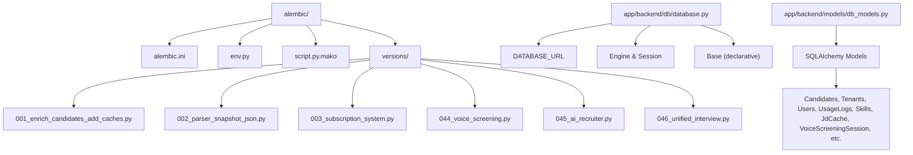
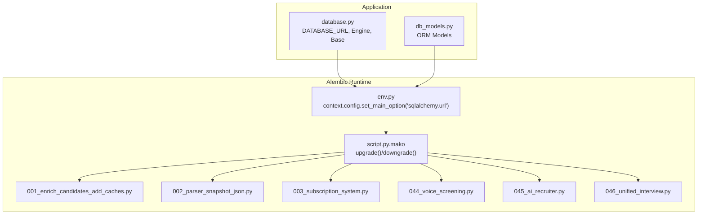
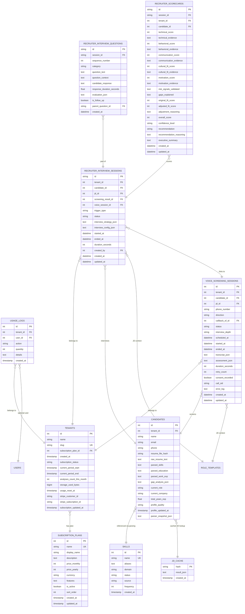
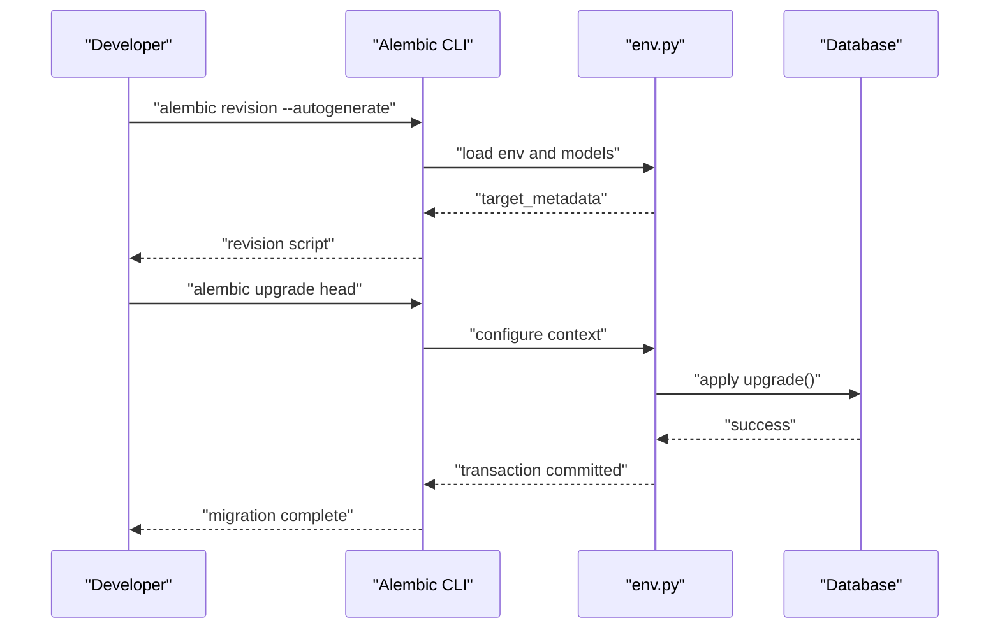
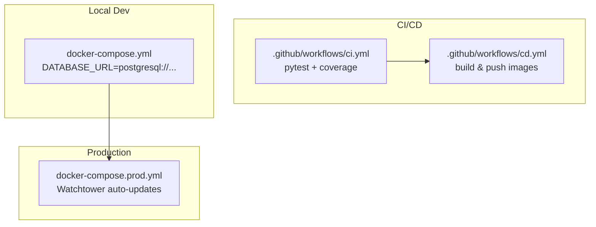
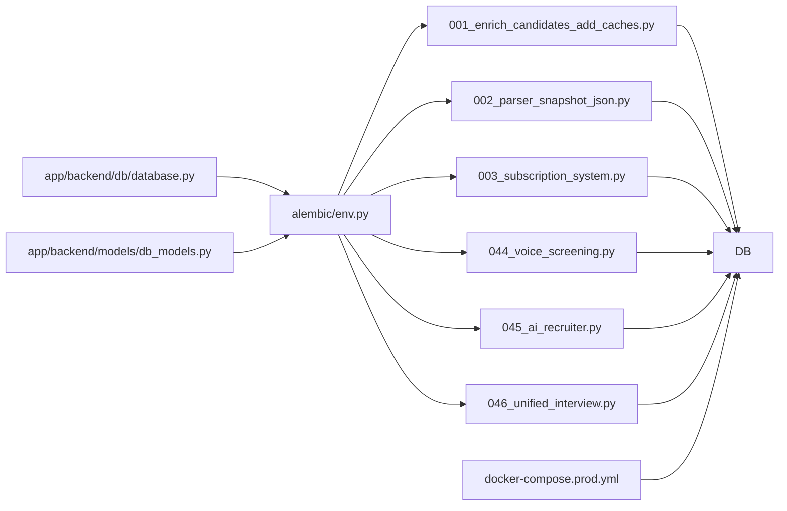

# Migration Management

<cite>
**Referenced Files in This Document**
- [alembic.ini](file://alembic.ini)
- [env.py](file://alembic/env.py)
- [script.py.mako](file://alembic/script.py.mako)
- [001_enrich_candidates_add_caches.py](file://alembic/versions/001_enrich_candidates_add_caches.py)
- [002_parser_snapshot_json.py](file://alembic/versions/002_parser_snapshot_json.py)
- [003_subscription_system.py](file://alembic/versions/003_subscription_system.py)
- [044_voice_screening.py](file://alembic/versions/044_voice_screening.py)
- [045_ai_recruiter.py](file://alembic/versions/045_ai_recruiter.py)
- [046_unified_interview.py](file://alembic/versions/046_unified_interview.py)
- [database.py](file://app/backend/db/database.py)
- [db_models.py](file://app/backend/models/db_models.py)
- [docker-compose.yml](file://docker-compose.yml)
- [docker-compose.prod.yml](file://docker-compose.prod.yml)
- [ci.yml](file://.github/workflows/ci.yml)
- [cd.yml](file://.github/workflows/cd.yml)
- [DEPLOYMENT_GUIDE.md](file://DEPLOYMENT_GUIDE.md)
- [README.md](file://README.md)
- [conversation.py](file://app/voice_agent/conversation.py)
- [interviews.py](file://app/backend/routes/interviews.py)
</cite>

## Update Summary
**Changes Made**
- Added documentation for migration 046_unified_interview.py covering interview depth tracking
- Updated migration version history to include 044, 045, and 046
- Enhanced interview depth feature documentation with unified interview tracking
- Added comprehensive coverage of voice screening session enhancements
- Updated database schema diagrams to reflect interview depth column addition

## Table of Contents
1. [Introduction](#introduction)
2. [Project Structure](#project-structure)
3. [Core Components](#core-components)
4. [Architecture Overview](#architecture-overview)
5. [Detailed Component Analysis](#detailed-component-analysis)
6. [Dependency Analysis](#dependency-analysis)
7. [Performance Considerations](#performance-considerations)
8. [Troubleshooting Guide](#troubleshooting-guide)
9. [Conclusion](#conclusion)
10. [Appendices](#appendices)

## Introduction
This document explains the database migration system for Resume AI by ThetaLogics, focusing on Alembic-managed schema evolution from version 001 through 046. It covers migration workflow, database initialization, seed data insertion, production deployment strategies, best practices, testing, rollback procedures, and operational safety measures. The migration history introduces enriched candidate profiles, parser snapshots, subscription systems, voice screening capabilities, AI recruiter functionality, and unified interview tracking with depth management.

## Project Structure
The migration system is organized under the alembic directory with configuration, environment setup, and versioned migration scripts. Application models and database configuration reside under app/backend.

**Diagram sources**
- [alembic.ini:1-148](file://alembic.ini#L1-L148)
- [env.py:1-51](file://alembic/env.py#L1-L51)
- [script.py.mako:1-29](file://alembic/script.py.mako#L1-L29)
- [001_enrich_candidates_add_caches.py:1-130](file://alembic/versions/001_enrich_candidates_add_caches.py#L1-L130)
- [002_parser_snapshot_json.py:1-34](file://alembic/versions/002_parser_snapshot_json.py#L1-L34)
- [003_subscription_system.py:1-290](file://alembic/versions/003_subscription_system.py#L1-L290)
- [044_voice_screening.py:1-72](file://alembic/versions/044_voice_screening.py#L1-L72)
- [045_ai_recruiter.py:1-125](file://alembic/versions/045_ai_recruiter.py#L1-L125)
- [046_unified_interview.py:1-49](file://alembic/versions/046_unified_interview.py#L1-L49)
- [database.py:1-50](file://app/backend/db/database.py#L1-L50)
- [db_models.py:1-1091](file://app/backend/models/db_models.py#L1-L1091)

**Section sources**
- [alembic.ini:1-148](file://alembic.ini#L1-L148)
- [env.py:1-51](file://alembic/env.py#L1-L51)
- [script.py.mako:1-29](file://alembic/script.py.mako#L1-L29)
- [database.py:1-50](file://app/backend/db/database.py#L1-L50)
- [db_models.py:1-1091](file://app/backend/models/db_models.py#L1-L1091)

## Core Components
- Alembic configuration and environment
  - alembic.ini sets script_location, path_separator, and logging configuration.
  - env.py wires Alembic to the application's Base and DATABASE_URL, enabling offline and online migrations.
  - script.py.mako is the Jinja template for generating revision scripts.
- Migration versions
  - 001: Adds enriched candidate profile columns and caches (jd_cache, skills).
  - 002: Adds parser_snapshot_json to candidates for auditability.
  - 003: Introduces subscription plans, tenant usage tracking, and usage_logs with seed data and default plan linkage.
  - 044: Implements voice screening session infrastructure with comprehensive call tracking.
  - 045: Adds AI recruiter tables for automated interview orchestration.
  - 046: Introduces interview depth tracking for unified interview management.
- Database configuration and models
  - database.py defines DATABASE_URL normalization, engine creation, and Base for ORM.
  - db_models.py defines SQLAlchemy models that reflect the evolving schema.

**Section sources**
- [alembic.ini:1-148](file://alembic.ini#L1-L148)
- [env.py:1-51](file://alembic/env.py#L1-L51)
- [script.py.mako:1-29](file://alembic/script.py.mako#L1-L29)
- [001_enrich_candidates_add_caches.py:1-130](file://alembic/versions/001_enrich_candidates_add_caches.py#L1-L130)
- [002_parser_snapshot_json.py:1-34](file://alembic/versions/002_parser_snapshot_json.py#L1-L34)
- [003_subscription_system.py:1-290](file://alembic/versions/003_subscription_system.py#L1-L290)
- [044_voice_screening.py:1-72](file://alembic/versions/044_voice_screening.py#L1-L72)
- [045_ai_recruiter.py:1-125](file://alembic/versions/045_ai_recruiter.py#L1-L125)
- [046_unified_interview.py:1-49](file://alembic/versions/046_unified_interview.py#L1-L49)
- [database.py:1-50](file://app/backend/db/database.py#L1-L50)
- [db_models.py:1-1091](file://app/backend/models/db_models.py#L1-L1091)

## Architecture Overview
The migration architecture integrates Alembic with the application's SQLAlchemy models and environment. Alembic reads DATABASE_URL from the app configuration and applies migrations either offline or online against the target database.

**Diagram sources**
- [env.py:1-51](file://alembic/env.py#L1-L51)
- [script.py.mako:1-29](file://alembic/script.py.mako#L1-L29)
- [001_enrich_candidates_add_caches.py:1-130](file://alembic/versions/001_enrich_candidates_add_caches.py#L1-L130)
- [002_parser_snapshot_json.py:1-34](file://alembic/versions/002_parser_snapshot_json.py#L1-L34)
- [003_subscription_system.py:1-290](file://alembic/versions/003_subscription_system.py#L1-L290)
- [044_voice_screening.py:1-72](file://alembic/versions/044_voice_screening.py#L1-L72)
- [045_ai_recruiter.py:1-125](file://alembic/versions/045_ai_recruiter.py#L1-L125)
- [046_unified_interview.py:1-49](file://alembic/versions/046_unified_interview.py#L1-L49)
- [database.py:1-50](file://app/backend/db/database.py#L1-L50)
- [db_models.py:1-1091](file://app/backend/models/db_models.py#L1-L1091)

## Detailed Component Analysis

### Migration Version History: 001 → 046
- Version 001: Enriched candidates and caches
  - Extends candidates with profile enrichment columns and adds indexes for resume_file_hash.
  - Creates jd_cache for MD5-keyed job description parsing results.
  - Creates skills registry with unique constraints and indexes; ensures id/name indexes exist.
  - Downgrade removes skills and jd_cache tables, drops candidate profile columns and resume_file_hash index.
- Version 002: Parser snapshot storage
  - Adds parser_snapshot_json to candidates to persist full parse output for auditability.
  - Downgrade removes the column.
- Version 003: Subscription and usage system
  - Enhances subscription_plans with pricing, descriptions, features, and activation flags; adds composite index.
  - Adds usage tracking columns to tenants (status, periods, counts, storage, Stripe IDs).
  - Creates usage_logs with tenant/user relations and indexes.
  - Seeds initial plans (Free, Pro, Enterprise) with JSON-encoded limits/features; inserts only missing rows.
  - Links existing tenants without a plan to the Pro plan with default timestamps and resets.
  - Downgrade removes usage_logs and tenant columns, drops subscription_plans indexes and columns.
- Version 044: Voice screening infrastructure
  - Creates voice_screening_sessions table with comprehensive call tracking fields.
  - Adds indexes for tenant_id and phone_number combinations.
  - Supports outbound/inbound call directions with callback relationships.
- Version 045: AI recruiter system
  - Adds recruiter_interview_sessions table linking to voice screening sessions.
  - Creates recruiter_interview_questions and recruiter_scorecards tables.
  - Implements auto-trigger configurations for automated interview scheduling.
  - Establishes relationships between recruiters, candidates, and voice sessions.
- Version 046: Unified interview tracking
  - Adds interview_depth column to voice_screening_sessions with 'quick'/'deep' values.
  - Includes backfill logic to mark sessions linked to recruiter_interview_sessions as 'deep'.
  - Creates ix_vss_interview_depth index for efficient querying by interview depth.
  - Maintains backward compatibility with existing 'quick' sessions.

**Diagram sources**
- [001_enrich_candidates_add_caches.py:42-130](file://alembic/versions/001_enrich_candidates_add_caches.py#L42-L130)
- [002_parser_snapshot_json.py:21-34](file://alembic/versions/002_parser_snapshot_json.py#L21-L34)
- [003_subscription_system.py:43-252](file://alembic/versions/003_subscription_system.py#L43-L252)
- [044_voice_screening.py:17-72](file://alembic/versions/044_voice_screening.py#L17-L72)
- [045_ai_recruiter.py:17-110](file://alembic/versions/045_ai_recruiter.py#L17-L110)
- [046_unified_interview.py:23-43](file://alembic/versions/046_unified_interview.py#L23-L43)
- [db_models.py:908-1091](file://app/backend/models/db_models.py#L908-L1091)

**Section sources**
- [001_enrich_candidates_add_caches.py:1-130](file://alembic/versions/001_enrich_candidates_add_caches.py#L1-L130)
- [002_parser_snapshot_json.py:1-34](file://alembic/versions/002_parser_snapshot_json.py#L1-L34)
- [003_subscription_system.py:1-290](file://alembic/versions/003_subscription_system.py#L1-L290)
- [044_voice_screening.py:1-72](file://alembic/versions/044_voice_screening.py#L1-L72)
- [045_ai_recruiter.py:1-125](file://alembic/versions/045_ai_recruiter.py#L1-L125)
- [046_unified_interview.py:1-49](file://alembic/versions/046_unified_interview.py#L1-L49)
- [db_models.py:908-1091](file://app/backend/models/db_models.py#L908-L1091)

### Migration Workflow
- Revision creation
  - Use Alembic CLI to generate a new revision script from script.py.mako.
  - The template defines upgrade() and downgrade() entry points and revision metadata.
- Execution
  - Online mode connects to DATABASE_URL and applies migrations transactionally.
  - Offline mode writes SQL for external application.
- Rollback
  - Downgrade by one revision or to a specific revision ID.
- Idempotency
  - Migrations check for existence of tables/columns/indexes before altering to support repeated runs.

**Diagram sources**
- [script.py.mako:1-29](file://alembic/script.py.mako#L1-L29)
- [env.py:23-51](file://alembic/env.py#L23-L51)

**Section sources**
- [script.py.mako:1-29](file://alembic/script.py.mako#L1-L29)
- [env.py:23-51](file://alembic/env.py#L23-L51)

### Database Initialization and Seed Data
- Initialization
  - DATABASE_URL is normalized to sqlite or postgresql depending on scheme and used to create the engine.
  - Base is registered in env.py for Alembic to inspect and migrate.
- Seed data
  - Version 003 seeds subscription_plans with Free, Pro, Enterprise entries and links existing tenants to Pro by default.

**Section sources**
- [database.py:1-50](file://app/backend/db/database.py#L1-L50)
- [env.py:11-20](file://alembic/env.py#L11-L20)
- [003_subscription_system.py:119-251](file://alembic/versions/003_subscription_system.py#L119-L251)

### Production Deployment Strategies
- Development vs Production
  - docker-compose.yml defines a development stack with PostgreSQL and environment variables for DATABASE_URL.
  - docker-compose.prod.yml defines a production stack with tuned Postgres parameters and Watchtower auto-update.
- CI/CD
  - CI workflow validates backend and frontend tests.
  - CD workflow builds and pushes images, then deploys via Watchtower on the VPS.

**Diagram sources**
- [ci.yml:1-63](file://.github/workflows/ci.yml#L1-L63)
- [cd.yml:1-185](file://.github/workflows/cd.yml#L1-L185)
- [docker-compose.yml:70-72](file://docker-compose.yml#L70-L72)
- [docker-compose.prod.yml:94-96](file://docker-compose.prod.yml#L94-L96)

**Section sources**
- [docker-compose.yml:70-72](file://docker-compose.yml#L70-L72)
- [docker-compose.prod.yml:94-96](file://docker-compose.prod.yml#L94-L96)
- [ci.yml:1-63](file://.github/workflows/ci.yml#L1-L63)
- [cd.yml:1-185](file://.github/workflows/cd.yml#L1-L185)

### Best Practices and Testing Procedures
- Idempotent migrations
  - Check for table/column existence before altering; create indexes only if missing.
- Backward compatibility
  - Use nullable columns and defaults; avoid dropping columns without a prior deprecation cycle.
- Testing
  - Run backend tests in CI; ensure migrations apply cleanly in isolated environments.
- Rollback scenarios
  - Maintain downgrade paths for all schema changes; test downgrade to the previous version.

**Section sources**
- [001_enrich_candidates_add_caches.py:42-130](file://alembic/versions/001_enrich_candidates_add_caches.py#L42-L130)
- [002_parser_snapshot_json.py:21-34](file://alembic/versions/002_parser_snapshot_json.py#L21-L34)
- [003_subscription_system.py:254-290](file://alembic/versions/003_subscription_system.py#L254-L290)
- [046_unified_interview.py:13-48](file://alembic/versions/046_unified_interview.py#L13-L48)
- [ci.yml:27-37](file://.github/workflows/ci.yml#L27-L37)

### Examples and Patterns
- Adding a new migration
  - Create a new revision script from the template; implement upgrade() and downgrade().
  - Use inspector helpers to guard against duplicates.
- Handling complex schema changes
  - Add multiple columns and indexes in a single upgrade block; ensure composite indexes are created only once.
- Managing backward compatibility
  - Add optional columns with defaults; drop only after sufficient rollout and data migration.
- Interview depth management
  - Use string enumeration ('quick', 'deep') for interview_depth column.
  - Implement backfill logic to maintain data consistency across existing sessions.
  - Create specialized indexes for efficient filtering by interview depth.

**Section sources**
- [script.py.mako:21-29](file://alembic/script.py.mako#L21-L29)
- [003_subscription_system.py:43-118](file://alembic/versions/003_subscription_system.py#L43-L118)
- [046_unified_interview.py:23-43](file://alembic/versions/046_unified_interview.py#L23-L43)

## Dependency Analysis
- Alembic depends on:
  - database.py for DATABASE_URL and Base.
  - db_models.py for model registration and metadata inspection.
- Migrations depend on each other via down_revision metadata.
- Production relies on docker-compose.prod.yml and Watchtower for rolling updates.

**Diagram sources**
- [database.py:1-50](file://app/backend/db/database.py#L1-L50)
- [db_models.py:1-1091](file://app/backend/models/db_models.py#L1-L1091)
- [env.py:1-51](file://alembic/env.py#L1-L51)
- [001_enrich_candidates_add_caches.py:1-130](file://alembic/versions/001_enrich_candidates_add_caches.py#L1-L130)
- [002_parser_snapshot_json.py:1-34](file://alembic/versions/002_parser_snapshot_json.py#L1-L34)
- [003_subscription_system.py:1-290](file://alembic/versions/003_subscription_system.py#L1-L290)
- [044_voice_screening.py:1-72](file://alembic/versions/044_voice_screening.py#L1-L72)
- [045_ai_recruiter.py:1-125](file://alembic/versions/045_ai_recruiter.py#L1-L125)
- [046_unified_interview.py:1-49](file://alembic/versions/046_unified_interview.py#L1-L49)
- [docker-compose.prod.yml:94-96](file://docker-compose.prod.yml#L94-L96)

**Section sources**
- [env.py:11-20](file://alembic/env.py#L11-L20)
- [database.py:1-50](file://app/backend/db/database.py#L1-L50)
- [db_models.py:1-1091](file://app/backend/models/db_models.py#L1-L1091)
- [docker-compose.prod.yml:94-96](file://docker-compose.prod.yml#L94-L96)

## Performance Considerations
- PostgreSQL tuning in production improves connection handling and query performance.
- Alembic operations should be performed during maintenance windows to minimize downtime.
- Use batch_alter_table for large-scale column changes to reduce lock contention.
- Interview depth indexing enables efficient filtering of voice screening sessions by depth level.
- Composite indexes on voice screening sessions optimize common query patterns.

## Troubleshooting Guide
- Migration conflicts
  - Ensure DATABASE_URL points to the correct database; verify env.py wiring.
  - Confirm models are imported so Alembic can inspect metadata.
- Rollback issues
  - Use alembic downgrade -1 to step back; verify downgrade paths exist.
- Production safety
  - Back up the database before upgrading; monitor logs and health checks.
  - Use Watchtower for rolling updates; validate with CI/CD before pushing.
- Interview depth migration issues
  - Verify voice_screening_sessions table exists before running migration.
  - Check that recruiter_interview_sessions table exists for proper backfill logic.
  - Monitor index creation for ix_vss_interview_depth.

**Section sources**
- [DEPLOYMENT_GUIDE.md:26-48](file://DEPLOYMENT_GUIDE.md#L26-L48)
- [DEPLOYMENT_GUIDE.md:110-118](file://DEPLOYMENT_GUIDE.md#L110-L118)
- [ci.yml:27-37](file://.github/workflows/ci.yml#L27-L37)
- [cd.yml:172-185](file://.github/workflows/cd.yml#L172-L185)
- [046_unified_interview.py:13-48](file://alembic/versions/046_unified_interview.py#L13-L48)

## Conclusion
The Resume AI migration system evolves from enriched candidate profiles to a comprehensive voice screening and AI recruiter platform with unified interview tracking. The latest migration 046 introduces interview depth management that bridges voice screening sessions with AI recruiter functionality, enabling flexible interview strategies from quick screening to deep assessment. By following idempotent, tested, and rollback-capable practices, teams can safely evolve schema changes in both development and production environments.

## Appendices
- Additional migration files beyond 046 are referenced in the project structure and can be analyzed similarly using the same patterns.
- Interview depth feature integrates seamlessly with the unified conversation engine supporting QUICK, STANDARD, and DEEP interview modes.
- Backfill logic ensures existing voice screening sessions linked to AI recruiter sessions are properly categorized as DEEP interviews.