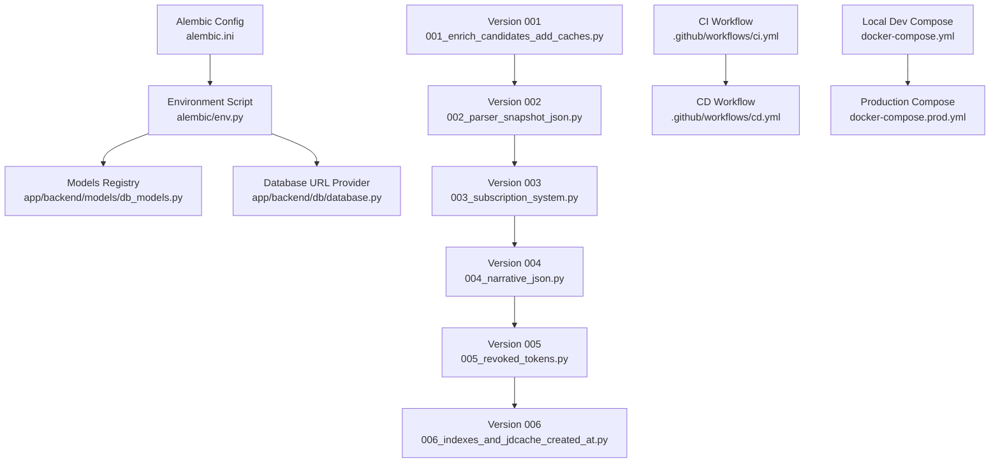
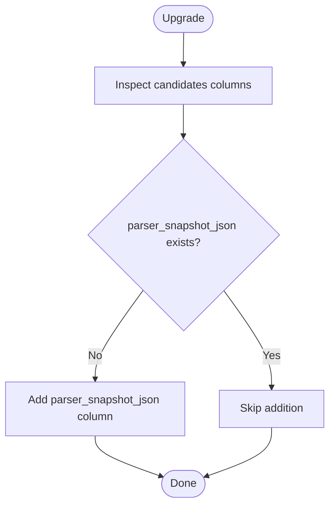
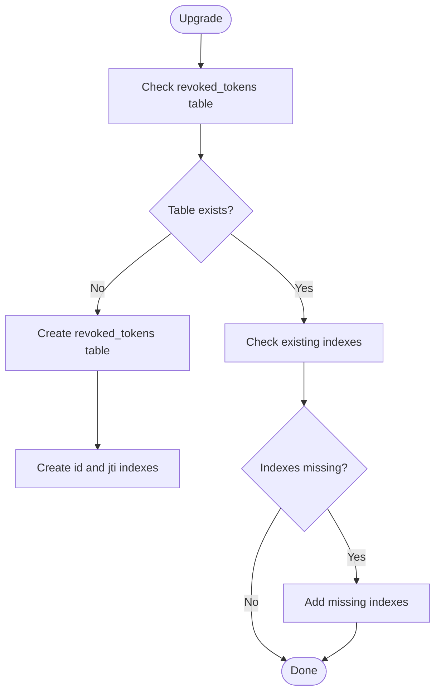
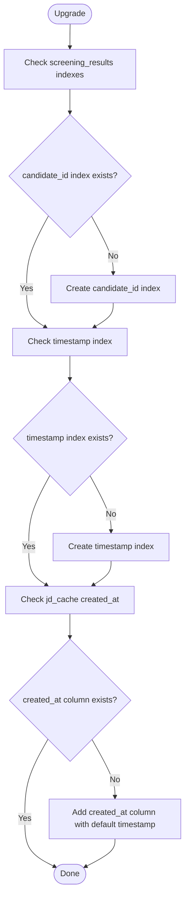
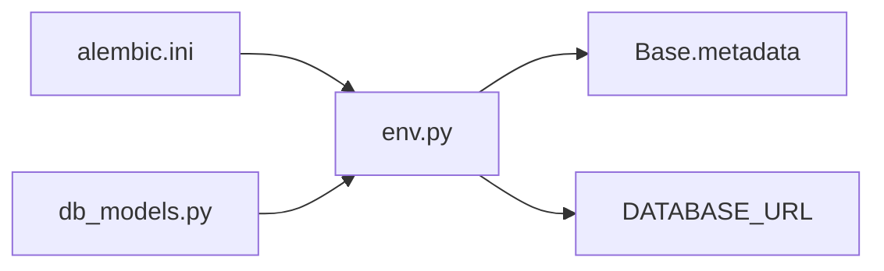
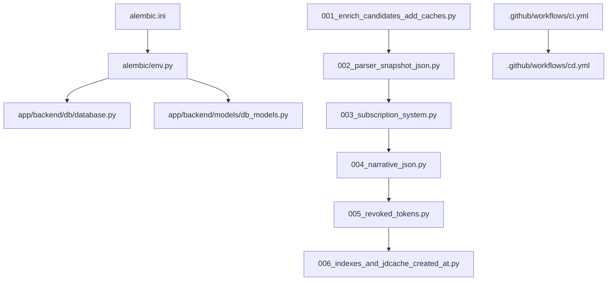

# Migration Management

<cite>
**Referenced Files in This Document**
- [alembic/versions/001_enrich_candidates_add_caches.py](file://alembic/versions/001_enrich_candidates_add_caches.py)
- [alembic/versions/002_parser_snapshot_json.py](file://alembic/versions/002_parser_snapshot_json.py)
- [alembic/versions/003_subscription_system.py](file://alembic/versions/003_subscription_system.py)
- [alembic/versions/004_narrative_json.py](file://alembic/versions/004_narrative_json.py)
- [alembic/versions/005_revoked_tokens.py](file://alembic/versions/005_revoked_tokens.py)
- [alembic/versions/006_indexes_and_jdcache_created_at.py](file://alembic/versions/006_indexes_and_jdcache_created_at.py)
- [alembic/env.py](file://alembic/env.py)
- [alembic.ini](file://alembic.ini)
- [app/backend/db/database.py](file://app/backend/db/database.py)
- [app/backend/models/db_models.py](file://app/backend/models/db_models.py)
- [.github/workflows/ci.yml](file://.github/workflows/ci.yml)
- [.github/workflows/cd.yml](file://.github/workflows/cd.yml)
- [docker-compose.yml](file://docker-compose.yml)
- [docker-compose.prod.yml](file://docker-compose.prod.yml)
</cite>

## Update Summary
**Changes Made**
- Added three new migration versions (004, 005, 006) to the migration chain
- Fixed Alembic multiple heads error by correcting migration dependency chain
- Enhanced database schema with performance indexes and timestamp tracking
- Added JWT token revocation support with revoked_tokens table
- Improved screening_results performance with new indexes
- Added created_at timestamps to jd_cache table

## Table of Contents
1. [Introduction](#introduction)
2. [Project Structure](#project-structure)
3. [Core Components](#core-components)
4. [Architecture Overview](#architecture-overview)
5. [Detailed Component Analysis](#detailed-component-analysis)
6. [Dependency Analysis](#dependency-analysis)
7. [Performance Considerations](#performance-considerations)
8. [Troubleshooting Guide](#troubleshooting-guide)
9. [Conclusion](#conclusion)
10. [Appendices](#appendices)

## Introduction
This document explains the database migration system for Resume AI by ThetaLogics, powered by Alembic. It covers the complete migration version history from 001 through 006, detailing schema evolution and feature additions. The system now includes JWT token revocation support, enhanced performance indexing, and improved timestamp tracking. It also documents the migration workflow (revision creation, execution, and rollback), database initialization, seed data insertion, and production deployment strategies. Best practices, testing procedures, rollback scenarios, and troubleshooting guidance are included to ensure safe and reliable migrations in development and production environments.

## Project Structure
The migration system is organized under the alembic directory with dedicated revision files for each version. The Alembic environment integrates with the application's SQLAlchemy models and database configuration. The current migration chain consists of six versions, each building upon previous changes. CI/CD pipelines automate testing and deployment, while Docker Compose configurations define local and production runtime environments.

**Diagram sources**
- [alembic.ini:1-148](file://alembic.ini#L1-L148)
- [alembic/env.py:1-51](file://alembic/env.py#L1-L51)
- [app/backend/models/db_models.py:1-264](file://app/backend/models/db_models.py#L1-L264)
- [app/backend/db/database.py:1-50](file://app/backend/db/database.py#L1-L50)
- [alembic/versions/001_enrich_candidates_add_caches.py:1-129](file://alembic/versions/001_enrich_candidates_add_caches.py#L1-L129)
- [alembic/versions/002_parser_snapshot_json.py:1-34](file://alembic/versions/002_parser_snapshot_json.py#L1-L34)
- [alembic/versions/003_subscription_system.py:1-290](file://alembic/versions/003_subscription_system.py#L1-L290)
- [alembic/versions/004_narrative_json.py:1-37](file://alembic/versions/004_narrative_json.py#L1-L37)
- [alembic/versions/005_revoked_tokens.py:1-67](file://alembic/versions/005_revoked_tokens.py#L1-L67)
- [alembic/versions/006_indexes_and_jdcache_created_at.py:1-73](file://alembic/versions/006_indexes_and_jdcache_created_at.py#L1-L73)
- [.github/workflows/ci.yml:1-63](file://.github/workflows/ci.yml#L1-L63)
- [.github/workflows/cd.yml:1-101](file://.github/workflows/cd.yml#L1-L101)
- [docker-compose.yml:1-102](file://docker-compose.yml#L1-L102)
- [docker-compose.prod.yml:1-236](file://docker-compose.prod.yml#L1-L236)

**Section sources**
- [alembic.ini:1-148](file://alembic.ini#L1-L148)
- [alembic/env.py:1-51](file://alembic/env.py#L1-L51)
- [app/backend/db/database.py:1-50](file://app/backend/db/database.py#L1-L50)
- [app/backend/models/db_models.py:1-264](file://app/backend/models/db_models.py#L1-L264)
- [alembic/versions/001_enrich_candidates_add_caches.py:1-129](file://alembic/versions/001_enrich_candidates_add_caches.py#L1-L129)
- [alembic/versions/002_parser_snapshot_json.py:1-34](file://alembic/versions/002_parser_snapshot_json.py#L1-L34)
- [alembic/versions/003_subscription_system.py:1-290](file://alembic/versions/003_subscription_system.py#L1-L290)
- [alembic/versions/004_narrative_json.py:1-37](file://alembic/versions/004_narrative_json.py#L1-L37)
- [alembic/versions/005_revoked_tokens.py:1-67](file://alembic/versions/005_revoked_tokens.py#L1-L67)
- [alembic/versions/006_indexes_and_jdcache_created_at.py:1-73](file://alembic/versions/006_indexes_and_jdcache_created_at.py#L1-L73)
- [.github/workflows/ci.yml:1-63](file://.github/workflows/ci.yml#L1-L63)
- [.github/workflows/cd.yml:1-101](file://.github/workflows/cd.yml#L1-L101)
- [docker-compose.yml:1-102](file://docker-compose.yml#L1-L102)
- [docker-compose.prod.yml:1-236](file://docker-compose.prod.yml#L1-L236)

## Core Components
- Alembic configuration and environment:
  - alembic.ini controls script locations, logging, and database URL.
  - alembic/env.py wires Alembic to the application's Base metadata and DATABASE_URL, and sets up offline/online migration modes.
- SQLAlchemy models and database:
  - app/backend/db/database.py defines DATABASE_URL normalization and engine creation.
  - app/backend/models/db_models.py declares all database tables used by migrations, including the new RevokedToken model.
- Migration versions:
  - 001: Enrich candidates and add caches.
  - 002: Add parser snapshot JSON to candidates.
  - 003: Subscription system with usage tracking and seeding.
  - 004: Add narrative JSON column to screening results for async LLM narratives.
  - 005: Add revoked tokens table for JWT token revocation support.
  - 006: Add performance indexes and created_at timestamps.

**Section sources**
- [alembic.ini:1-148](file://alembic.ini#L1-L148)
- [alembic/env.py:1-51](file://alembic/env.py#L1-L51)
- [app/backend/db/database.py:1-50](file://app/backend/db/database.py#L1-L50)
- [app/backend/models/db_models.py:1-264](file://app/backend/models/db_models.py#L1-L264)
- [alembic/versions/001_enrich_candidates_add_caches.py:1-129](file://alembic/versions/001_enrich_candidates_add_caches.py#L1-L129)
- [alembic/versions/002_parser_snapshot_json.py:1-34](file://alembic/versions/002_parser_snapshot_json.py#L1-L34)
- [alembic/versions/003_subscription_system.py:1-290](file://alembic/versions/003_subscription_system.py#L1-L290)
- [alembic/versions/004_narrative_json.py:1-37](file://alembic/versions/004_narrative_json.py#L1-L37)
- [alembic/versions/005_revoked_tokens.py:1-67](file://alembic/versions/005_revoked_tokens.py#L1-L67)
- [alembic/versions/006_indexes_and_jdcache_created_at.py:1-73](file://alembic/versions/006_indexes_and_jdcache_created_at.py#L1-L73)

## Architecture Overview
The migration system integrates Alembic with the application's SQLAlchemy models and database configuration. Migrations are executed against the configured DATABASE_URL, and the environment script ensures Alembic targets the correct metadata and connection. The system now supports JWT token revocation and enhanced performance monitoring through strategic indexing.

**Diagram sources**
- [alembic/env.py:1-51](file://alembic/env.py#L1-L51)
- [app/backend/db/database.py:1-50](file://app/backend/db/database.py#L1-L50)
- [app/backend/models/db_models.py:1-264](file://app/backend/models/db_models.py#L1-L264)
- [alembic/versions/001_enrich_candidates_add_caches.py:1-129](file://alembic/versions/001_enrich_candidates_add_caches.py#L1-L129)
- [alembic/versions/002_parser_snapshot_json.py:1-34](file://alembic/versions/002_parser_snapshot_json.py#L1-L34)
- [alembic/versions/003_subscription_system.py:1-290](file://alembic/versions/003_subscription_system.py#L1-L290)
- [alembic/versions/004_narrative_json.py:1-37](file://alembic/versions/004_narrative_json.py#L1-L37)
- [alembic/versions/005_revoked_tokens.py:1-67](file://alembic/versions/005_revoked_tokens.py#L1-L67)
- [alembic/versions/006_indexes_and_jdcache_created_at.py:1-73](file://alembic/versions/006_indexes_and_jdcache_created_at.py#L1-L73)

## Detailed Component Analysis

### Version 001: Enrich candidates and add caches
- Purpose: Adds enriched candidate profile columns and introduces caching tables for job descriptions and skills.
- Key changes:
  - Extends candidates with profile enrichment fields and adds an index on resume hash.
  - Creates jd_cache and skills tables with indexes.
- Idempotency: Skips operations if tables/columns already exist; safe for legacy setups.
- Downgrade: Drops tables and columns in reverse order.

**Diagram sources**
- [alembic/versions/001_enrich_candidates_add_caches.py:42-111](file://alembic/versions/001_enrich_candidates_add_caches.py#L42-L111)

**Section sources**
- [alembic/versions/001_enrich_candidates_add_caches.py:1-129](file://alembic/versions/001_enrich_candidates_add_caches.py#L1-L129)

### Version 002: Parser snapshot JSON
- Purpose: Stores the complete parser output for auditability and re-analysis without reparsing.
- Key changes:
  - Adds parser_snapshot_json column to candidates.
- Idempotency: Skips if column already exists.
- Downgrade: Drops the column.

**Diagram sources**
- [alembic/versions/002_parser_snapshot_json.py:21-29](file://alembic/versions/002_parser_snapshot_json.py#L21-L29)

**Section sources**
- [alembic/versions/002_parser_snapshot_json.py:1-34](file://alembic/versions/002_parser_snapshot_json.py#L1-L34)

### Version 003: Subscription system with usage tracking and seeding
- Purpose: Introduces subscription plans, tenant usage tracking, and usage logs; seeds initial plans and links existing tenants.
- Key changes:
  - Enhances subscription_plans with pricing, descriptions, features, and sorting.
  - Adds usage tracking columns to tenants.
  - Creates usage_logs table with foreign keys and indexes.
  - Seeds initial plans (Free, Pro, Enterprise) and updates existing tenants to default Pro plan.
- Idempotency: Safe for legacy setups; inserts only missing plan records.
- Downgrade: Drops usage_logs and removes tenant and plan columns in reverse order.

**Diagram sources**
- [alembic/versions/003_subscription_system.py:43-252](file://alembic/versions/003_subscription_system.py#L43-L252)

**Section sources**
- [alembic/versions/003_subscription_system.py:1-290](file://alembic/versions/003_subscription_system.py#L1-L290)

### Version 004: Narrative JSON for async LLM processing
- Purpose: Adds narrative_json column to screening_results to support asynchronous LLM narrative generation.
- Key changes:
  - Adds nullable narrative_json TEXT column to screening_results table.
  - Allows immediate Python scoring results while LLM narrative generates in background.
- Idempotency: Skips if column already exists.
- Downgrade: Drops the narrative_json column.

**Section sources**
- [alembic/versions/004_narrative_json.py:1-37](file://alembic/versions/004_narrative_json.py#L1-L37)

### Version 005: JWT token revocation support
- Purpose: Implements token revocation system to prevent logout refresh token reuse.
- Key changes:
  - Creates revoked_tokens table with primary key, unique JWT ID, and timestamps.
  - Adds indexes on id and jti columns for efficient lookups.
  - Supports periodic cleanup of expired tokens.
- Idempotency: Safe when table already exists; ensures indexes are present.
- Downgrade: Drops indexes and table in reverse order.

**Diagram sources**
- [alembic/versions/005_revoked_tokens.py:41-61](file://alembic/versions/005_revoked_tokens.py#L41-L61)

**Section sources**
- [alembic/versions/005_revoked_tokens.py:1-67](file://alembic/versions/005_revoked_tokens.py#L1-L67)

### Version 006: Performance indexes and timestamp tracking
- Purpose: Enhances database performance through strategic indexing and adds timestamp tracking.
- Key changes:
  - Adds index on screening_results.candidate_id for improved query performance.
  - Adds index on screening_results.timestamp for time-based queries.
  - Adds created_at column to jd_cache table with timezone-aware timestamps.
- Idempotency: Safe when indexes/columns already exist.
- Downgrade: Drops indexes and drops created_at column.

**Diagram sources**
- [alembic/versions/006_indexes_and_jdcache_created_at.py:35-63](file://alembic/versions/006_indexes_and_jdcache_created_at.py#L35-L63)

**Section sources**
- [alembic/versions/006_indexes_and_jdcache_created_at.py:1-73](file://alembic/versions/006_indexes_and_jdcache_created_at.py#L1-L73)

### Environment and Configuration
- alembic/env.py:
  - Loads application models to register them with Alembic metadata.
  - Sets the database URL from the application's DATABASE_URL.
  - Supports offline and online migration modes.
- alembic.ini:
  - Defines script location, path handling, logging, and database URL placeholder.
  - Provides hooks for formatting and linting generated revisions.

**Diagram sources**
- [alembic/env.py:1-51](file://alembic/env.py#L1-L51)
- [alembic.ini:1-148](file://alembic.ini#L1-L148)
- [app/backend/models/db_models.py:1-264](file://app/backend/models/db_models.py#L1-L264)
- [app/backend/db/database.py:1-50](file://app/backend/db/database.py#L1-L50)

**Section sources**
- [alembic/env.py:1-51](file://alembic/env.py#L1-L51)
- [alembic.ini:1-148](file://alembic.ini#L1-L148)
- [app/backend/db/database.py:1-50](file://app/backend/db/database.py#L1-L50)
- [app/backend/models/db_models.py:1-264](file://app/backend/models/db_models.py#L1-L264)

## Dependency Analysis
- Alembic depends on:
  - Application models registered in env.py.
  - DATABASE_URL from app/backend/db/database.py.
  - alembic.ini for configuration and logging.
- Migrations depend on:
  - Correct ordering (001 → 002 → 003 → 004 → 005 → 006).
  - Idempotent operations to handle partial runs or legacy setups.
  - Fixed dependency chain ensuring proper migration sequencing.
- CI/CD:
  - CI workflow validates backend tests; CD workflow builds and pushes images and deploys to production.

**Diagram sources**
- [alembic.ini:1-148](file://alembic.ini#L1-L148)
- [alembic/env.py:1-51](file://alembic/env.py#L1-L51)
- [app/backend/db/database.py:1-50](file://app/backend/db/database.py#L1-L50)
- [app/backend/models/db_models.py:1-264](file://app/backend/models/db_models.py#L1-L264)
- [alembic/versions/001_enrich_candidates_add_caches.py:1-129](file://alembic/versions/001_enrich_candidates_add_caches.py#L1-L129)
- [alembic/versions/002_parser_snapshot_json.py:1-34](file://alembic/versions/002_parser_snapshot_json.py#L1-L34)
- [alembic/versions/003_subscription_system.py:1-290](file://alembic/versions/003_subscription_system.py#L1-L290)
- [alembic/versions/004_narrative_json.py:1-37](file://alembic/versions/004_narrative_json.py#L1-L37)
- [alembic/versions/005_revoked_tokens.py:1-67](file://alembic/versions/005_revoked_tokens.py#L1-L67)
- [alembic/versions/006_indexes_and_jdcache_created_at.py:1-73](file://alembic/versions/006_indexes_and_jdcache_created_at.py#L1-L73)
- [.github/workflows/ci.yml:1-63](file://.github/workflows/ci.yml#L1-L63)
- [.github/workflows/cd.yml:1-101](file://.github/workflows/cd.yml#L1-L101)

**Section sources**
- [alembic/env.py:1-51](file://alembic/env.py#L1-L51)
- [app/backend/db/database.py:1-50](file://app/backend/db/database.py#L1-L50)
- [app/backend/models/db_models.py:1-264](file://app/backend/models/db_models.py#L1-L264)
- [alembic/versions/001_enrich_candidates_add_caches.py:1-129](file://alembic/versions/001_enrich_candidates_add_caches.py#L1-L129)
- [alembic/versions/002_parser_snapshot_json.py:1-34](file://alembic/versions/002_parser_snapshot_json.py#L1-L34)
- [alembic/versions/003_subscription_system.py:1-290](file://alembic/versions/003_subscription_system.py#L1-L290)
- [alembic/versions/004_narrative_json.py:1-37](file://alembic/versions/004_narrative_json.py#L1-L37)
- [alembic/versions/005_revoked_tokens.py:1-67](file://alembic/versions/005_revoked_tokens.py#L1-L67)
- [alembic/versions/006_indexes_and_jdcache_created_at.py:1-73](file://alembic/versions/006_indexes_and_jdcache_created_at.py#L1-L73)
- [.github/workflows/ci.yml:1-63](file://.github/workflows/ci.yml#L1-L63)
- [.github/workflows/cd.yml:1-101](file://.github/workflows/cd.yml#L1-L101)

## Performance Considerations
- Idempotent migrations reduce repeated work and improve reliability across environments.
- Strategic indexing improves query performance for frequently accessed columns.
- Timestamp tracking enables better audit trails and time-based analytics.
- Using batch_alter_table for dropping multiple columns minimizes transaction overhead.
- Production deployments rely on Docker Compose and Watchtower for automated updates; ensure migrations are run before deploying new backend images to avoid downtime.

**Updated** Enhanced with new performance optimizations from versions 004-006, including JWT token revocation support and improved indexing strategy.

## Troubleshooting Guide
Common issues and resolutions:
- Database URL mismatch:
  - Verify DATABASE_URL in env.py and application configuration.
- Migration conflicts:
  - Ensure migrations are applied in order (001 → 002 → 003 → 004 → 005 → 006).
  - Use downgrade to revert problematic versions before retrying.
- Multiple heads error:
  - Verify correct down_revision chain (004 → 005 → 006).
  - Check that each migration properly references its parent revision.
- Idempotency failures:
  - Confirm that idempotent checks (existence checks) are functioning as intended.
- CI/CD pipeline failures:
  - Review CI workflow logs for backend test failures.
  - For CD, confirm Docker images are built and pushed, and Watchtower is running in production.

**Updated** Added troubleshooting guidance for the new migration chain and token revocation features.

**Section sources**
- [alembic/env.py:1-51](file://alembic/env.py#L1-L51)
- [alembic/versions/001_enrich_candidates_add_caches.py:1-129](file://alembic/versions/001_enrich_candidates_add_caches.py#L1-L129)
- [alembic/versions/002_parser_snapshot_json.py:1-34](file://alembic/versions/002_parser_snapshot_json.py#L1-L34)
- [alembic/versions/003_subscription_system.py:1-290](file://alembic/versions/003_subscription_system.py#L1-L290)
- [alembic/versions/004_narrative_json.py:1-37](file://alembic/versions/004_narrative_json.py#L1-L37)
- [alembic/versions/005_revoked_tokens.py:1-67](file://alembic/versions/005_revoked_tokens.py#L1-L67)
- [alembic/versions/006_indexes_and_jdcache_created_at.py:1-73](file://alembic/versions/006_indexes_and_jdcache_created_at.py#L1-L73)
- [.github/workflows/ci.yml:1-63](file://.github/workflows/ci.yml#L1-L63)
- [.github/workflows/cd.yml:1-101](file://.github/workflows/cd.yml#L1-L101)

## Conclusion
The Resume AI migration system uses Alembic to evolve the schema safely and predictably. Versions 001 through 006 introduce candidate enrichment, parser snapshots, subscription/usage systems, JWT token revocation, and performance optimizations. The environment and configuration integrate tightly with the application's models and database URL. Recent improvements include fixing the multiple heads error through proper dependency chaining and implementing comprehensive performance indexing. CI/CD pipelines support automated testing and deployment, while idempotent migrations and careful downgrade procedures help maintain safety across environments.

**Updated** Enhanced with the latest migration chain supporting JWT token revocation and improved database performance.

## Appendices

### Migration Workflow
- Create a revision:
  - Use Alembic's revision command to generate a new file under alembic/versions.
  - Edit the generated file to implement upgrade() and downgrade() operations.
  - Ensure proper down_revision reference to maintain dependency chain.
- Execute migrations:
  - Upgrade: alembic upgrade head
  - Downgrade: alembic downgrade -1 or alembic downgrade <target_rev>
- Rollback procedures:
  - Use downgrade to revert to a known-good revision.
  - For production, coordinate with CI/CD to roll back images if necessary.

**Section sources**
- [alembic.ini:1-148](file://alembic.ini#L1-L148)
- [alembic/env.py:1-51](file://alembic/env.py#L1-L51)

### Database Initialization and Seed Data
- Initialization:
  - Alembic env.py loads models and DATABASE_URL; migrations target Base.metadata.
- Seed data:
  - Version 003 seeds subscription plans and links existing tenants to the Pro plan.
  - New migrations maintain idempotent seeding patterns.

**Section sources**
- [alembic/env.py:1-51](file://alembic/env.py#L1-L51)
- [alembic/versions/003_subscription_system.py:119-251](file://alembic/versions/003_subscription_system.py#L119-L251)

### Production Deployment Strategies
- Local development:
  - docker-compose.yml defines services and environment variables for local testing.
- Production:
  - docker-compose.prod.yml manages production resources, Watchtower for updates, and health checks.
- CI/CD:
  - CI workflow runs backend tests; CD workflow builds images and deploys to production.

**Section sources**
- [docker-compose.yml:1-102](file://docker-compose.yml#L1-L102)
- [docker-compose.prod.yml:1-236](file://docker-compose.prod.yml#L1-L236)
- [.github/workflows/ci.yml:1-63](file://.github/workflows/ci.yml#L1-L63)
- [.github/workflows/cd.yml:1-101](file://.github/workflows/cd.yml#L1-L101)

### Best Practices and Testing
- Idempotency:
  - Guard operations with existence checks for tables, columns, and indexes.
- Backward compatibility:
  - Use nullable columns and defaults when extending existing tables.
- Testing:
  - Run backend tests in CI to catch migration-related regressions.
- Rollback scenarios:
  - Maintain downgrade paths for all changes; test downgrades in staging.
- Performance optimization:
  - Implement strategic indexing for frequently queried columns.
  - Monitor migration performance and adjust indexing strategy as needed.

**Section sources**
- [alembic/versions/001_enrich_candidates_add_caches.py:1-129](file://alembic/versions/001_enrich_candidates_add_caches.py#L1-L129)
- [alembic/versions/002_parser_snapshot_json.py:1-34](file://alembic/versions/002_parser_snapshot_json.py#L1-L34)
- [alembic/versions/003_subscription_system.py:1-290](file://alembic/versions/003_subscription_system.py#L1-L290)
- [alembic/versions/004_narrative_json.py:1-37](file://alembic/versions/004_narrative_json.py#L1-L37)
- [alembic/versions/005_revoked_tokens.py:1-67](file://alembic/versions/005_revoked_tokens.py#L1-L67)
- [alembic/versions/006_indexes_and_jdcache_created_at.py:1-73](file://alembic/versions/006_indexes_and_jdcache_created_at.py#L1-L73)
- [.github/workflows/ci.yml:1-63](file://.github/workflows/ci.yml#L1-L63)