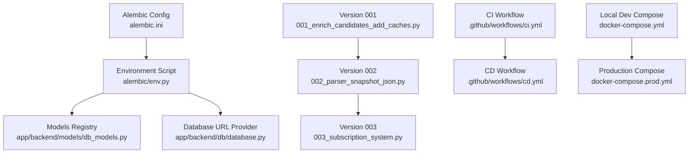
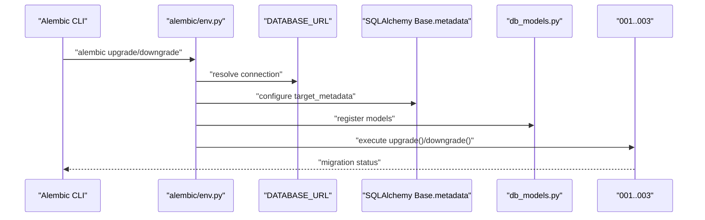
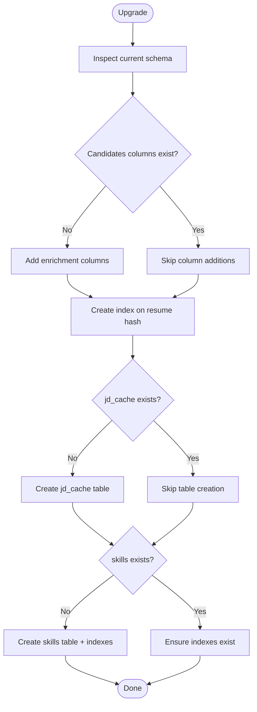
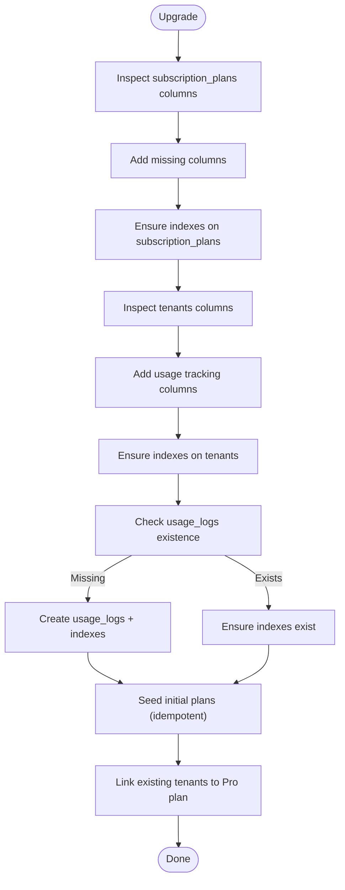
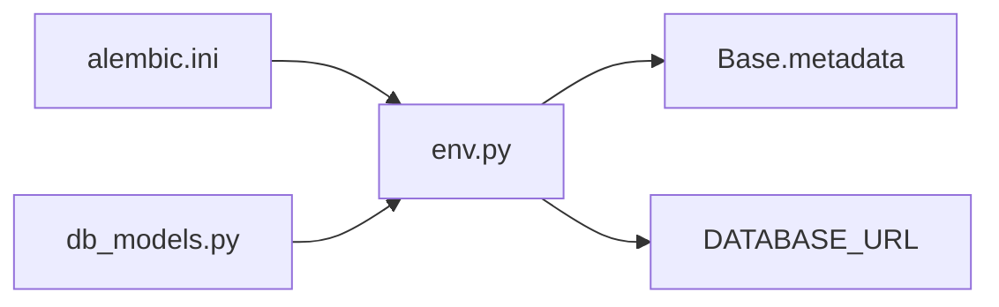
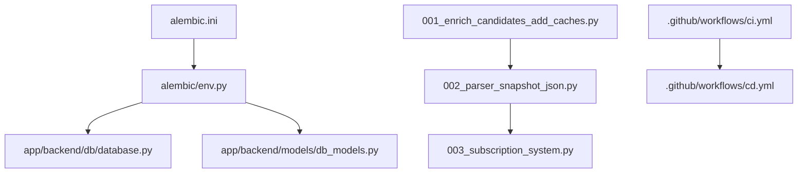

# Migration Management

<cite>
**Referenced Files in This Document**
- [alembic/versions/001_enrich_candidates_add_caches.py](file://alembic/versions/001_enrich_candidates_add_caches.py)
- [alembic/versions/002_parser_snapshot_json.py](file://alembic/versions/002_parser_snapshot_json.py)
- [alembic/versions/003_subscription_system.py](file://alembic/versions/003_subscription_system.py)
- [alembic/env.py](file://alembic/env.py)
- [alembic.ini](file://alembic.ini)
- [app/backend/db/database.py](file://app/backend/db/database.py)
- [app/backend/models/db_models.py](file://app/backend/models/db_models.py)
- [.github/workflows/ci.yml](file://.github/workflows/ci.yml)
- [.github/workflows/cd.yml](file://.github/workflows/cd.yml)
- [docker-compose.yml](file://docker-compose.yml)
- [docker-compose.prod.yml](file://docker-compose.prod.yml)
</cite>

## Table of Contents
1. [Introduction](#introduction)
2. [Project Structure](#project-structure)
3. [Core Components](#core-components)
4. [Architecture Overview](#architecture-overview)
5. [Detailed Component Analysis](#detailed-component-analysis)
6. [Dependency Analysis](#dependency-analysis)
7. [Performance Considerations](#performance-considerations)
8. [Troubleshooting Guide](#troubleshooting-guide)
9. [Conclusion](#conclusion)
10. [Appendices](#appendices)

## Introduction
This document explains the database migration system for Resume AI by ThetaLogics, powered by Alembic. It covers the migration version history from 001 through 003, detailing schema evolution and feature additions. It also documents the migration workflow (revision creation, execution, and rollback), database initialization, seed data insertion, and production deployment strategies. Best practices, testing procedures, rollback scenarios, and troubleshooting guidance are included to ensure safe and reliable migrations in development and production environments.

## Project Structure
The migration system is organized under the alembic directory with dedicated revision files for each version. The Alembic environment integrates with the application’s SQLAlchemy models and database configuration. CI/CD pipelines automate testing and deployment, while Docker Compose configurations define local and production runtime environments.

**Diagram sources**
- [alembic.ini:1-148](file://alembic.ini#L1-L148)
- [alembic/env.py:1-51](file://alembic/env.py#L1-L51)
- [app/backend/models/db_models.py:1-250](file://app/backend/models/db_models.py#L1-L250)
- [app/backend/db/database.py:1-33](file://app/backend/db/database.py#L1-L33)
- [alembic/versions/001_enrich_candidates_add_caches.py:1-129](file://alembic/versions/001_enrich_candidates_add_caches.py#L1-L129)
- [alembic/versions/002_parser_snapshot_json.py:1-34](file://alembic/versions/002_parser_snapshot_json.py#L1-L34)
- [alembic/versions/003_subscription_system.py:1-290](file://alembic/versions/003_subscription_system.py#L1-L290)
- [.github/workflows/ci.yml:1-63](file://.github/workflows/ci.yml#L1-L63)
- [.github/workflows/cd.yml:1-101](file://.github/workflows/cd.yml#L1-L101)
- [docker-compose.yml:1-101](file://docker-compose.yml#L1-L101)
- [docker-compose.prod.yml:1-227](file://docker-compose.prod.yml#L1-L227)

**Section sources**
- [alembic.ini:1-148](file://alembic.ini#L1-L148)
- [alembic/env.py:1-51](file://alembic/env.py#L1-L51)
- [app/backend/db/database.py:1-33](file://app/backend/db/database.py#L1-L33)
- [app/backend/models/db_models.py:1-250](file://app/backend/models/db_models.py#L1-L250)
- [alembic/versions/001_enrich_candidates_add_caches.py:1-129](file://alembic/versions/001_enrich_candidates_add_caches.py#L1-L129)
- [alembic/versions/002_parser_snapshot_json.py:1-34](file://alembic/versions/002_parser_snapshot_json.py#L1-L34)
- [alembic/versions/003_subscription_system.py:1-290](file://alembic/versions/003_subscription_system.py#L1-L290)
- [.github/workflows/ci.yml:1-63](file://.github/workflows/ci.yml#L1-L63)
- [.github/workflows/cd.yml:1-101](file://.github/workflows/cd.yml#L1-L101)
- [docker-compose.yml:1-101](file://docker-compose.yml#L1-L101)
- [docker-compose.prod.yml:1-227](file://docker-compose.prod.yml#L1-L227)

## Core Components
- Alembic configuration and environment:
  - alembic.ini controls script locations, logging, and database URL.
  - alembic/env.py wires Alembic to the application’s Base metadata and DATABASE_URL, and sets up offline/online migration modes.
- SQLAlchemy models and database:
  - app/backend/db/database.py defines DATABASE_URL normalization and engine creation.
  - app/backend/models/db_models.py declares all database tables used by migrations.
- Migration versions:
  - 001: Enrich candidates and add caches.
  - 002: Add parser snapshot JSON to candidates.
  - 003: Subscription system with usage tracking and seeding.

**Section sources**
- [alembic.ini:1-148](file://alembic.ini#L1-L148)
- [alembic/env.py:1-51](file://alembic/env.py#L1-L51)
- [app/backend/db/database.py:1-33](file://app/backend/db/database.py#L1-L33)
- [app/backend/models/db_models.py:1-250](file://app/backend/models/db_models.py#L1-L250)
- [alembic/versions/001_enrich_candidates_add_caches.py:1-129](file://alembic/versions/001_enrich_candidates_add_caches.py#L1-L129)
- [alembic/versions/002_parser_snapshot_json.py:1-34](file://alembic/versions/002_parser_snapshot_json.py#L1-L34)
- [alembic/versions/003_subscription_system.py:1-290](file://alembic/versions/003_subscription_system.py#L1-L290)

## Architecture Overview
The migration system integrates Alembic with the application’s SQLAlchemy models and database configuration. Migrations are executed against the configured DATABASE_URL, and the environment script ensures Alembic targets the correct metadata and connection.

**Diagram sources**
- [alembic/env.py:1-51](file://alembic/env.py#L1-L51)
- [app/backend/db/database.py:1-33](file://app/backend/db/database.py#L1-L33)
- [app/backend/models/db_models.py:1-250](file://app/backend/models/db_models.py#L1-L250)
- [alembic/versions/001_enrich_candidates_add_caches.py:1-129](file://alembic/versions/001_enrich_candidates_add_caches.py#L1-L129)
- [alembic/versions/002_parser_snapshot_json.py:1-34](file://alembic/versions/002_parser_snapshot_json.py#L1-L34)
- [alembic/versions/003_subscription_system.py:1-290](file://alembic/versions/003_subscription_system.py#L1-L290)

## Detailed Component Analysis

### Version 001: Enrich candidates and add caches
- Purpose: Adds enriched candidate profile columns and introduces caching tables for job descriptions and skills.
- Key changes:
  - Extends candidates with profile enrichment fields and adds an index on resume hash.
  - Creates jd_cache and skills tables with indexes.
- Idempotency: Skips operations if tables/columns already exist; safe for legacy setups.
- Downgrade: Drops tables and columns in reverse order.

**Diagram sources**
- [alembic/versions/001_enrich_candidates_add_caches.py:42-111](file://alembic/versions/001_enrich_candidates_add_caches.py#L42-L111)

**Section sources**
- [alembic/versions/001_enrich_candidates_add_caches.py:1-129](file://alembic/versions/001_enrich_candidates_add_caches.py#L1-L129)

### Version 002: Parser snapshot JSON
- Purpose: Stores the complete parser output for auditability and re-analysis without reparsing.
- Key changes:
  - Adds parser_snapshot_json column to candidates.
- Idempotency: Skips if column already exists.
- Downgrade: Drops the column.

**Diagram sources**
- [alembic/versions/002_parser_snapshot_json.py:21-29](file://alembic/versions/002_parser_snapshot_json.py#L21-L29)

**Section sources**
- [alembic/versions/002_parser_snapshot_json.py:1-34](file://alembic/versions/002_parser_snapshot_json.py#L1-L34)

### Version 003: Subscription system with usage tracking and seeding
- Purpose: Introduces subscription plans, tenant usage tracking, and usage logs; seeds initial plans and links existing tenants.
- Key changes:
  - Enhances subscription_plans with pricing, descriptions, features, and sorting.
  - Adds usage tracking columns to tenants.
  - Creates usage_logs table with foreign keys and indexes.
  - Seeds initial plans (Free, Pro, Enterprise) and updates existing tenants to default Pro plan.
- Idempotency: Safe for legacy setups; inserts only missing plan records.
- Downgrade: Drops usage_logs and removes tenant and plan columns in reverse order.

**Diagram sources**
- [alembic/versions/003_subscription_system.py:43-252](file://alembic/versions/003_subscription_system.py#L43-L252)

**Section sources**
- [alembic/versions/003_subscription_system.py:1-290](file://alembic/versions/003_subscription_system.py#L1-L290)

### Environment and Configuration
- alembic/env.py:
  - Loads application models to register them with Alembic metadata.
  - Sets the database URL from the application’s DATABASE_URL.
  - Supports offline and online migration modes.
- alembic.ini:
  - Defines script location, path handling, logging, and database URL placeholder.
  - Provides hooks for formatting and linting generated revisions.

**Diagram sources**
- [alembic/env.py:1-51](file://alembic/env.py#L1-L51)
- [alembic.ini:1-148](file://alembic.ini#L1-L148)
- [app/backend/models/db_models.py:1-250](file://app/backend/models/db_models.py#L1-L250)
- [app/backend/db/database.py:1-33](file://app/backend/db/database.py#L1-L33)

**Section sources**
- [alembic/env.py:1-51](file://alembic/env.py#L1-L51)
- [alembic.ini:1-148](file://alembic.ini#L1-L148)
- [app/backend/db/database.py:1-33](file://app/backend/db/database.py#L1-L33)
- [app/backend/models/db_models.py:1-250](file://app/backend/models/db_models.py#L1-L250)

## Dependency Analysis
- Alembic depends on:
  - Application models registered in env.py.
  - DATABASE_URL from app/backend/db/database.py.
  - alembic.ini for configuration and logging.
- Migrations depend on:
  - Correct ordering (001 → 002 → 003).
  - Idempotent operations to handle partial runs or legacy setups.
- CI/CD:
  - CI workflow validates backend tests; CD workflow builds and pushes images and deploys to production.

**Diagram sources**
- [alembic.ini:1-148](file://alembic.ini#L1-L148)
- [alembic/env.py:1-51](file://alembic/env.py#L1-L51)
- [app/backend/db/database.py:1-33](file://app/backend/db/database.py#L1-L33)
- [app/backend/models/db_models.py:1-250](file://app/backend/models/db_models.py#L1-L250)
- [alembic/versions/001_enrich_candidates_add_caches.py:1-129](file://alembic/versions/001_enrich_candidates_add_caches.py#L1-L129)
- [alembic/versions/002_parser_snapshot_json.py:1-34](file://alembic/versions/002_parser_snapshot_json.py#L1-L34)
- [alembic/versions/003_subscription_system.py:1-290](file://alembic/versions/003_subscription_system.py#L1-L290)
- [.github/workflows/ci.yml:1-63](file://.github/workflows/ci.yml#L1-L63)
- [.github/workflows/cd.yml:1-101](file://.github/workflows/cd.yml#L1-L101)

**Section sources**
- [alembic/env.py:1-51](file://alembic/env.py#L1-L51)
- [app/backend/db/database.py:1-33](file://app/backend/db/database.py#L1-L33)
- [app/backend/models/db_models.py:1-250](file://app/backend/models/db_models.py#L1-L250)
- [alembic/versions/001_enrich_candidates_add_caches.py:1-129](file://alembic/versions/001_enrich_candidates_add_caches.py#L1-L129)
- [alembic/versions/002_parser_snapshot_json.py:1-34](file://alembic/versions/002_parser_snapshot_json.py#L1-L34)
- [alembic/versions/003_subscription_system.py:1-290](file://alembic/versions/003_subscription_system.py#L1-L290)
- [.github/workflows/ci.yml:1-63](file://.github/workflows/ci.yml#L1-L63)
- [.github/workflows/cd.yml:1-101](file://.github/workflows/cd.yml#L1-L101)

## Performance Considerations
- Idempotent migrations reduce repeated work and improve reliability across environments.
- Index creation is guarded to prevent redundant operations.
- Using batch_alter_table for dropping multiple columns minimizes transaction overhead.
- Production deployments rely on Docker Compose and Watchtower for automated updates; ensure migrations are run before deploying new backend images to avoid downtime.

[No sources needed since this section provides general guidance]

## Troubleshooting Guide
Common issues and resolutions:
- Database URL mismatch:
  - Verify DATABASE_URL in env.py and application configuration.
- Migration conflicts:
  - Ensure migrations are applied in order (001 → 002 → 003).
  - Use downgrade to revert problematic versions before retrying.
- Idempotency failures:
  - Confirm that idempotent checks (existence checks) are functioning as intended.
- CI/CD pipeline failures:
  - Review CI workflow logs for backend test failures.
  - For CD, confirm Docker images are built and pushed, and Watchtower is running in production.

**Section sources**
- [alembic/env.py:1-51](file://alembic/env.py#L1-L51)
- [alembic/versions/001_enrich_candidates_add_caches.py:1-129](file://alembic/versions/001_enrich_candidates_add_caches.py#L1-L129)
- [alembic/versions/002_parser_snapshot_json.py:1-34](file://alembic/versions/002_parser_snapshot_json.py#L1-L34)
- [alembic/versions/003_subscription_system.py:1-290](file://alembic/versions/003_subscription_system.py#L1-L290)
- [.github/workflows/ci.yml:1-63](file://.github/workflows/ci.yml#L1-L63)
- [.github/workflows/cd.yml:1-101](file://.github/workflows/cd.yml#L1-L101)

## Conclusion
The Resume AI migration system uses Alembic to evolve the schema safely and predictably. Versions 001 through 003 introduce candidate enrichment, parser snapshots, and a subscription/usage system with seeding. The environment and configuration integrate tightly with the application’s models and database URL. CI/CD pipelines support automated testing and deployment, while idempotent migrations and careful downgrade procedures help maintain safety across environments.

[No sources needed since this section summarizes without analyzing specific files]

## Appendices

### Migration Workflow
- Create a revision:
  - Use Alembic’s revision command to generate a new file under alembic/versions.
  - Edit the generated file to implement upgrade() and downgrade() operations.
- Execute migrations:
  - Upgrade: alembic upgrade head
  - Downgrade: alembic downgrade -1 or alembic downgrade <target_rev>
- Rollback procedures:
  - Use downgrade to revert to a known-good revision.
  - For production, coordinate with CI/CD to roll back images if necessary.

**Section sources**
- [alembic.ini:1-148](file://alembic.ini#L1-L148)
- [alembic/env.py:1-51](file://alembic/env.py#L1-L51)

### Database Initialization and Seed Data
- Initialization:
  - Alembic env.py loads models and DATABASE_URL; migrations target Base.metadata.
- Seed data:
  - Version 003 seeds subscription plans and links existing tenants to the Pro plan.

**Section sources**
- [alembic/env.py:1-51](file://alembic/env.py#L1-L51)
- [alembic/versions/003_subscription_system.py:119-251](file://alembic/versions/003_subscription_system.py#L119-L251)

### Production Deployment Strategies
- Local development:
  - docker-compose.yml defines services and environment variables for local testing.
- Production:
  - docker-compose.prod.yml manages production resources, Watchtower for updates, and health checks.
- CI/CD:
  - CI workflow runs backend tests; CD workflow builds images and deploys to production.

**Section sources**
- [docker-compose.yml:1-101](file://docker-compose.yml#L1-L101)
- [docker-compose.prod.yml:1-227](file://docker-compose.prod.yml#L1-L227)
- [.github/workflows/ci.yml:1-63](file://.github/workflows/ci.yml#L1-L63)
- [.github/workflows/cd.yml:1-101](file://.github/workflows/cd.yml#L1-L101)

### Best Practices and Testing
- Idempotency:
  - Guard operations with existence checks for tables, columns, and indexes.
- Backward compatibility:
  - Use nullable columns and defaults when extending existing tables.
- Testing:
  - Run backend tests in CI to catch migration-related regressions.
- Rollback scenarios:
  - Maintain downgrade paths for all changes; test downgrades in staging.

**Section sources**
- [alembic/versions/001_enrich_candidates_add_caches.py:1-129](file://alembic/versions/001_enrich_candidates_add_caches.py#L1-L129)
- [alembic/versions/002_parser_snapshot_json.py:1-34](file://alembic/versions/002_parser_snapshot_json.py#L1-L34)
- [alembic/versions/003_subscription_system.py:1-290](file://alembic/versions/003_subscription_system.py#L1-L290)
- [.github/workflows/ci.yml:1-63](file://.github/workflows/ci.yml#L1-L63)