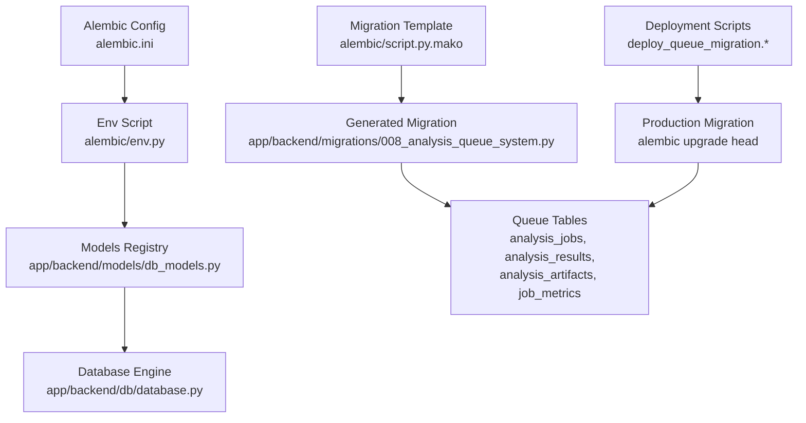
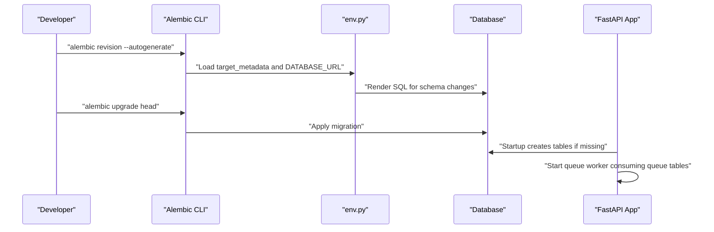
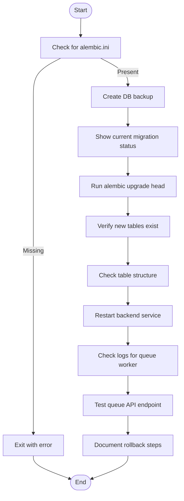
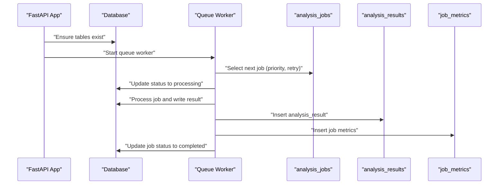
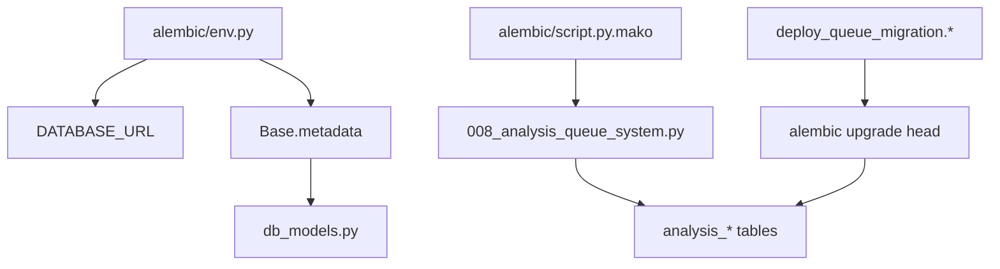

# Migration Management

<cite>
**Referenced Files in This Document**
- [alembic\README](file://alembic\README)
- [alembic\env.py](file://alembic\env.py)
- [alembic\script.py.mako](file://alembic\script.py.mako)
- [alembic.ini](file://alembic.ini)
- [app\backend\db\database.py](file://app\backend\db\database.py)
- [app\backend\models\db_models.py](file://app\backend\models\db_models.py)
- [app\backend\migrations\008_analysis_queue_system.py](file://app\backend\migrations\008_analysis_queue_system.py)
- [deploy_queue_migration.sh](file://deploy_queue_migration.sh)
- [deploy_queue_migration.ps1](file://deploy_queue_migration.ps1)
- [app\backend\main.py](file://app\backend\main.py)
- [app\backend\services\queue_manager.py](file://app\backend\services\queue_manager.py)
- [app\backend\routes\queue_api.py](file://app\backend\routes\queue_api.py)
</cite>

## Table of Contents
1. [Introduction](#introduction)
2. [Project Structure](#project-structure)
3. [Core Components](#core-components)
4. [Architecture Overview](#architecture-overview)
5. [Detailed Component Analysis](#detailed-component-analysis)
6. [Dependency Analysis](#dependency-analysis)
7. [Performance Considerations](#performance-considerations)
8. [Troubleshooting Guide](#troubleshooting-guide)
9. [Conclusion](#conclusion)

## Introduction
This document explains the Migration Management system used by the Resume AI platform. It covers how database schema changes are defined, applied, and monitored, with a focus on the Alembic-based migration framework and the queue system migration that introduced scalable job processing. The guide includes practical deployment procedures, operational insights, and troubleshooting tips for maintaining a reliable and auditable database schema across environments.

## Project Structure
The migration management system spans three main areas:
- Alembic configuration and templates for generating and applying migrations
- Database model definitions that define the canonical schema
- Application-level queue system migration and supporting services

**Diagram sources**
- [alembic.ini:1-148](file://alembic.ini#L1-L148)
- [alembic\env.py:1-51](file://alembic\env.py#L1-L51)
- [app\backend\models\db_models.py:1-833](file://app\backend\models\db_models.py#L1-L833)
- [app\backend\db\database.py:1-50](file://app\backend\db\database.py#L1-L50)
- [alembic\script.py.mako:1-29](file://alembic\script.py.mako#L1-L29)
- [app\backend\migrations\008_analysis_queue_system.py:1-326](file://app\backend\migrations\008_analysis_queue_system.py#L1-L326)
- [deploy_queue_migration.sh:1-67](file://deploy_queue_migration.sh#L1-L67)
- [deploy_queue_migration.ps1:1-66](file://deploy_queue_migration.ps1#L1-L66)

**Section sources**
- [alembic\README:1-1](file://alembic\README#L1-L1)
- [alembic\env.py:1-51](file://alembic\env.py#L1-L51)
- [alembic\script.py.mako:1-29](file://alembic\script.py.mako#L1-L29)
- [alembic.ini:1-148](file://alembic.ini#L1-L148)
- [app\backend\db\database.py:1-50](file://app\backend\db\database.py#L1-L50)
- [app\backend\models\db_models.py:1-833](file://app\backend\models\db_models.py#L1-L833)
- [app\backend\migrations\008_analysis_queue_system.py:1-326](file://app\backend\migrations\008_analysis_queue_system.py#L1-L326)
- [deploy_queue_migration.sh:1-67](file://deploy_queue_migration.sh#L1-L67)
- [deploy_queue_migration.ps1:1-66](file://deploy_queue_migration.ps1#L1-L66)

## Core Components
- Alembic configuration and environment script: Defines how migrations are discovered, executed, and connected to the database.
- Database engine and model registry: Provides the SQLAlchemy Base and engine used by Alembic to render schema changes.
- Migration template: Generates boilerplate migration files with upgrade/downgrade functions.
- Queue system migration: Introduces four core tables for a scalable job queue and associated views/triggers.
- Deployment scripts: Automate safe production migrations with pre-flight checks and rollback procedures.
- Application integration: The FastAPI application creates tables on startup and starts a queue worker that consumes the queue tables.

**Section sources**
- [alembic\env.py:1-51](file://alembic\env.py#L1-L51)
- [app\backend\db\database.py:1-50](file://app\backend\db\database.py#L1-L50)
- [app\backend\models\db_models.py:1-833](file://app\backend\models\db_models.py#L1-L833)
- [alembic\script.py.mako:1-29](file://alembic\script.py.mako#L1-L29)
- [app\backend\migrations\008_analysis_queue_system.py:1-326](file://app\backend\migrations\008_analysis_queue_system.py#L1-L326)
- [deploy_queue_migration.sh:1-67](file://deploy_queue_migration.sh#L1-L67)
- [deploy_queue_migration.ps1:1-66](file://deploy_queue_migration.ps1#L1-L66)
- [app\backend\main.py:281-289](file://app\backend\main.py#L281-L289)

## Architecture Overview
The migration architecture consists of:
- Configuration-driven generation and execution via Alembic
- Strong typing and schema definition through SQLAlchemy models
- Operational safety with deployment scripts and database backups
- Runtime integration with the application’s queue worker

**Diagram sources**
- [alembic\env.py:1-51](file://alembic\env.py#L1-L51)
- [alembic.ini:1-148](file://alembic.ini#L1-L148)
- [app\backend\main.py:256-258](file://app\backend\main.py#L256-L258)
- [app\backend\services\queue_manager.py:600-611](file://app\backend\services\queue_manager.py#L600-L611)

## Detailed Component Analysis

### Alembic Configuration and Environment
- The environment script registers models and sets the database URL from the application’s configuration, enabling Alembic to introspect the target metadata and generate accurate migrations.
- It supports both offline and online modes, allowing migrations to be rendered without a live database connection.

**Section sources**
- [alembic\env.py:1-51](file://alembic\env.py#L1-L51)
- [alembic.ini:1-148](file://alembic.ini#L1-L148)

### Database Model Registry
- The SQLAlchemy declarative Base is shared between the application and Alembic, ensuring migrations reflect the latest schema.
- The database engine supports both SQLite and PostgreSQL, with appropriate pooling and connection settings.

**Section sources**
- [app\backend\models\db_models.py:1-833](file://app\backend\models\db_models.py#L1-L833)
- [app\backend\db\database.py:1-50](file://app\backend\db\database.py#L1-L50)

### Migration Template
- The Mako template provides a standardized structure for migration files, including placeholders for upgrades and downgrades, imports, and revision identifiers.

**Section sources**
- [alembic\script.py.mako:1-29](file://alembic\script.py.mako#L1-L29)

### Queue System Migration (008_analysis_queue_system)
This migration introduces a scalable job queue architecture with:
- analysis_jobs: Central queue with deduplication, priority, retry, and worker assignment
- analysis_results: Immutable storage for completed analyses with quality and confidence metrics
- analysis_artifacts: Input caching and metadata for resumes/JDs
- job_metrics: Performance and quality tracking for monitoring

It also adds:
- Views for active queue and tenant job statistics
- Triggers for artifact access tracking and result validation

```mermaid
erDiagram
ANALYSIS_JOBS {
uuid id PK
int tenant_id FK
int candidate_id FK
int user_id FK
string job_type
string resume_hash
string jd_hash
string input_hash UK
string status
int priority
int retry_count
int max_retries
datetime created_at
datetime queued_at
datetime started_at
datetime completed_at
datetime failed_at
datetime next_retry_at
string worker_id
datetime worker_heartbeat
uuid artifact_id FK
string processing_stage
int progress_percent
datetime estimated_completion
text error_message
string error_type
text error_stack_trace
jsonb error_context
uuid result_id FK
jsonb job_config
}
ANALYSIS_RESULTS {
uuid id PK
uuid job_id FK
int tenant_id FK
int candidate_id FK
int fit_score
string final_recommendation
string risk_level
jsonb analysis_data
jsonb parsed_resume
jsonb parsed_jd
string narrative_status
jsonb narrative_data
datetime narrative_generated_at
boolean ai_enhanced
string analysis_version
string model_used
int processing_time_ms
datetime created_at
string analysis_quality
float confidence_score
uuid artifact_id FK
}
ANALYSIS_ARTIFACTS {
uuid id PK
int tenant_id FK
string resume_filename
int resume_size_bytes
string resume_hash
string resume_mime_type
string jd_filename
int jd_size_bytes
string jd_hash
text jd_text
string resume_storage_path
string resume_storage_bucket
text resume_text
int resume_text_length
jsonb parsed_resume_cache
jsonb parsed_jd_cache
datetime created_at
datetime expires_at
int access_count
datetime last_accessed_at
}
JOB_METRICS {
uuid id PK
uuid job_id FK
int tenant_id FK
int queue_wait_time_ms
int parsing_time_ms
int llm_time_ms
int narrative_time_ms
int total_time_ms
int llm_tokens_input
int llm_tokens_output
int llm_calls_count
int memory_peak_mb
float parsing_confidence
float analysis_confidence
int json_parse_retries
jsonb stage_timings
string error_stage
int retry_attempts
string worker_id
string worker_version
datetime created_at
}
ANALYSIS_JOBS }o--|| ANALYSIS_RESULTS : "produces"
ANALYSIS_JOBS }o--o| ANALYSIS_ARTIFACTS : "references"
ANALYSIS_RESULTS }o--o| ANALYSIS_ARTIFACTS : "references"
JOB_METRICS }o--|| ANALYSIS_JOBS : "measures"
```

**Diagram sources**
- [app\backend\migrations\008_analysis_queue_system.py:18-326](file://app\backend\migrations\008_analysis_queue_system.py#L18-L326)

**Section sources**
- [app\backend\migrations\008_analysis_queue_system.py:1-326](file://app\backend\migrations\008_analysis_queue_system.py#L1-L326)

### Deployment Scripts
Both shell and PowerShell scripts automate production migrations:
- Pre-flight checks: verify working directory, create database backup, show current migration status
- Apply migration: run alembic upgrade head
- Verification: list new tables and inspect structure
- Post-deployment: restart backend, check logs, test queue API, document rollback procedure

**Diagram sources**
- [deploy_queue_migration.sh:1-67](file://deploy_queue_migration.sh#L1-L67)
- [deploy_queue_migration.ps1:1-66](file://deploy_queue_migration.ps1#L1-L66)

**Section sources**
- [deploy_queue_migration.sh:1-67](file://deploy_queue_migration.sh#L1-L67)
- [deploy_queue_migration.ps1:1-66](file://deploy_queue_migration.ps1#L1-L66)

### Application Integration
- Startup: The FastAPI application ensures tables exist and starts background tasks including the queue worker.
- Queue worker: Consumes jobs from analysis_jobs, processes them, writes results to analysis_results, and collects metrics in job_metrics.

**Diagram sources**
- [app\backend\main.py:281-289](file://app\backend\main.py#L281-L289)
- [app\backend\services\queue_manager.py:526-562](file://app\backend\services\queue_manager.py#L526-L562)
- [app\backend\routes\queue_api.py:39-76](file://app\backend\routes\queue_api.py#L39-L76)

**Section sources**
- [app\backend\main.py:281-289](file://app\backend\main.py#L281-L289)
- [app\backend\services\queue_manager.py:189-582](file://app\backend\services\queue_manager.py#L189-L582)
- [app\backend\routes\queue_api.py:39-76](file://app\backend\routes\queue_api.py#L39-L76)

## Dependency Analysis
Key dependencies and relationships:
- Alembic env.py depends on the application’s database configuration and model registry
- The migration template generates files that modify the shared Base metadata
- The queue system migration introduces interdependent tables with foreign keys and constraints
- Deployment scripts depend on alembic.ini and database connectivity

**Diagram sources**
- [alembic\env.py:1-51](file://alembic\env.py#L1-L51)
- [alembic\script.py.mako:1-29](file://alembic\script.py.mako#L1-L29)
- [app\backend\migrations\008_analysis_queue_system.py:1-326](file://app\backend\migrations\008_analysis_queue_system.py#L1-L326)
- [deploy_queue_migration.sh:1-67](file://deploy_queue_migration.sh#L1-L67)
- [deploy_queue_migration.ps1:1-66](file://deploy_queue_migration.ps1#L1-L66)

**Section sources**
- [alembic\env.py:1-51](file://alembic\env.py#L1-L51)
- [alembic\script.py.mako:1-29](file://alembic\script.py.mako#L1-L29)
- [app\backend\migrations\008_analysis_queue_system.py:1-326](file://app\backend\migrations\008_analysis_queue_system.py#L1-L326)
- [deploy_queue_migration.sh:1-67](file://deploy_queue_migration.sh#L1-L67)
- [deploy_queue_migration.ps1:1-66](file://deploy_queue_migration.ps1#L1-L66)

## Performance Considerations
- Queue indexing: The migration defines strategic indexes on status, priority, timestamps, and hash fields to optimize queue retrieval and filtering.
- Immutable results: Storing completed analyses in analysis_results prevents repeated computation and enables efficient reporting.
- Metrics collection: job_metrics captures timing and resource usage for performance monitoring and tuning.
- Concurrency: SELECT FOR UPDATE SKIP LOCKED pattern in the queue worker avoids contention and improves throughput under load.

[No sources needed since this section provides general guidance]

## Troubleshooting Guide
Common issues and resolutions:
- Migration fails due to missing alembic.ini: Ensure commands are run from the project root.
- Database connectivity errors: Verify DATABASE_URL and credentials; confirm the database is reachable.
- Duplicate job insertion: The queue system deduplicates by input_hash; check for existing jobs with the same resume/JD combination.
- Queue worker not processing jobs: Confirm the worker is started during application startup and monitor logs for errors.
- Rollback procedure: Use alembic downgrade -1 and restore the pre-migration backup created by the deployment scripts.

**Section sources**
- [deploy_queue_migration.sh:12-16](file://deploy_queue_migration.sh#L12-L16)
- [deploy_queue_migration.ps1:11-15](file://deploy_queue_migration.ps1#L11-L15)
- [app\backend\services\queue_manager.py:248-303](file://app\backend\services\queue_manager.py#L248-L303)
- [app\backend\main.py:281-289](file://app\backend\main.py#L281-L289)

## Conclusion
The Migration Management system combines Alembic’s robust migration framework with application-integrated queue processing to deliver a scalable, observable, and operable database schema. By leveraging standardized templates, automated deployment scripts, and strong operational safeguards, teams can confidently evolve the schema while maintaining system stability and performance.