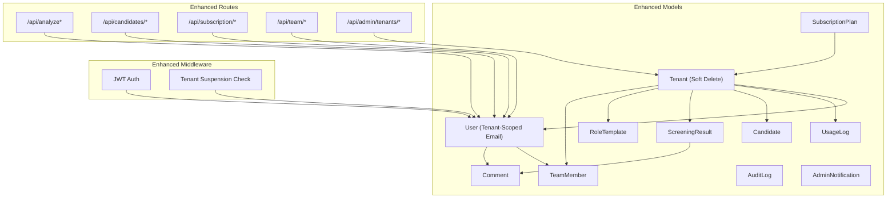
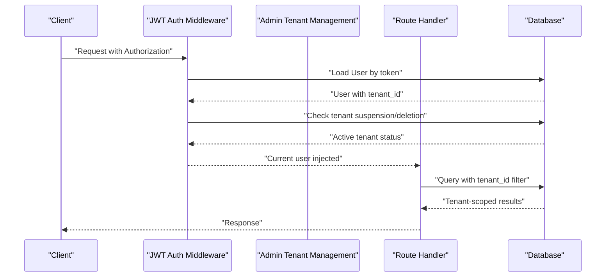
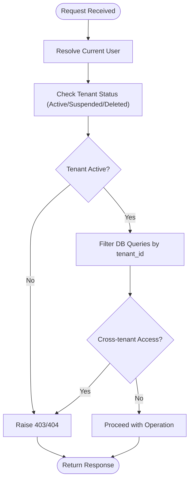
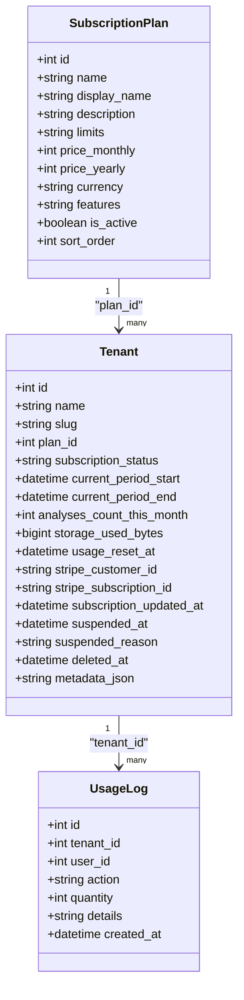
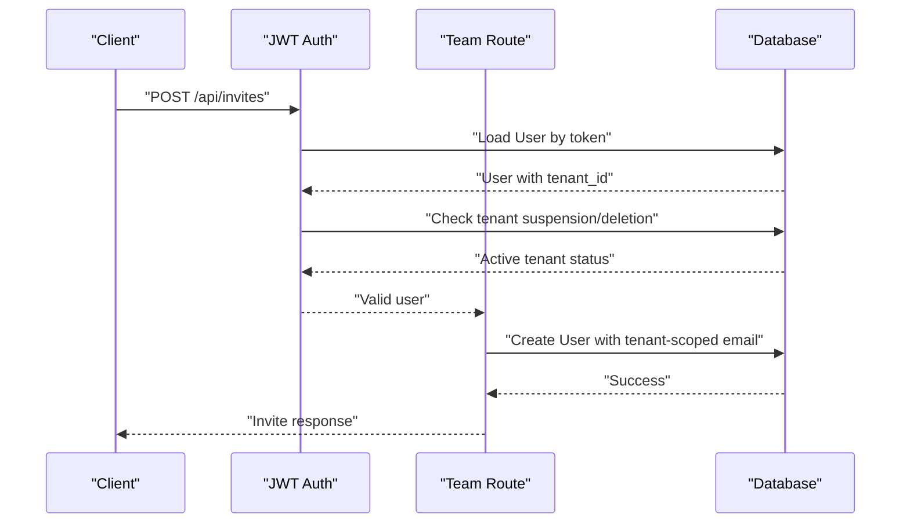
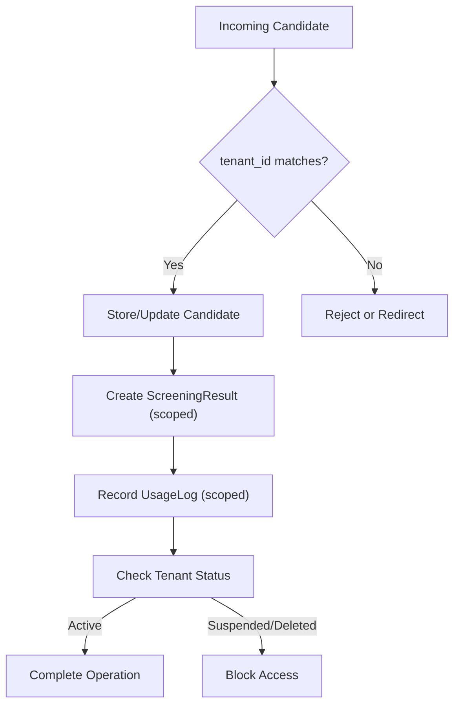
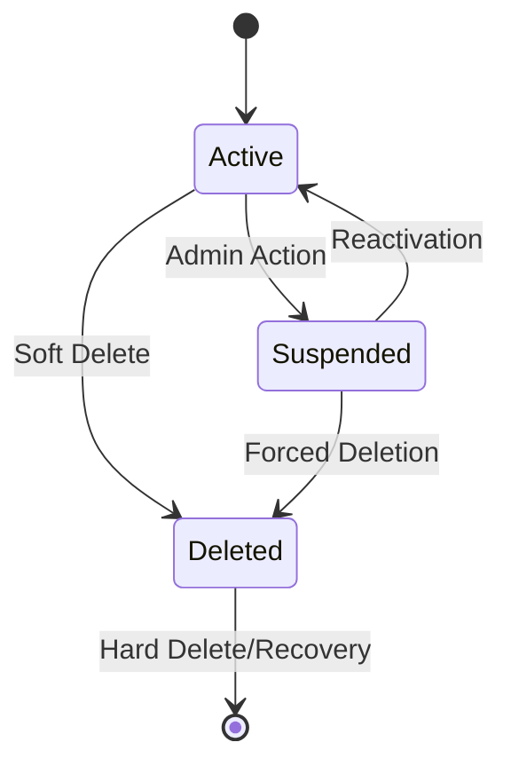
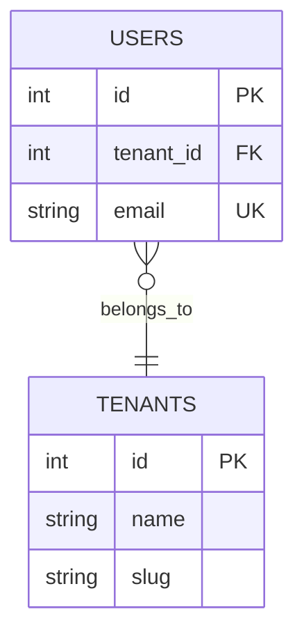
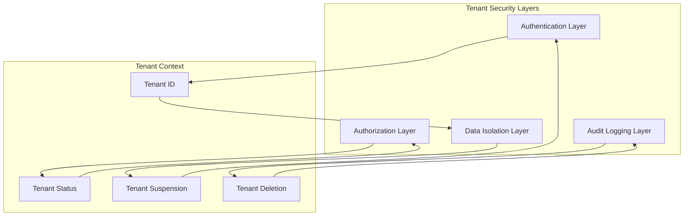
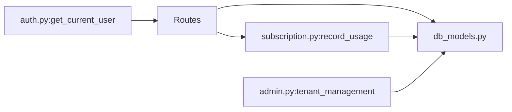

# Multi-Tenant Architecture

<cite>
**Referenced Files in This Document**
- [db_models.py](file://app/backend/models/db_models.py)
- [schemas.py](file://app/backend/models/schemas.py)
- [003_subscription_system.py](file://alembic/versions/003_subscription_system.py)
- [038_tenant_soft_delete.py](file://alembic/versions/038_tenant_soft_delete.py)
- [039_tenant_scoped_email.py](file://alembic/versions/039_tenant_scoped_email.py)
- [auth.py](file://app/backend/middleware/auth.py)
- [team.py](file://app/backend/routes/team.py)
- [subscription.py](file://app/backend/routes/subscription.py)
- [admin.py](file://app/backend/routes/admin.py)
- [analyze.py](file://app/backend/routes/analyze.py)
- [candidates.py](file://app/backend/routes/candidates.py)
- [test_subscription.py](file://app/backend/tests/test_subscription.py)
- [test_usage_enforcement.py](file://app/backend/tests/test_usage_enforcement.py)
- [env.py](file://alembic/env.py)
</cite>

## Update Summary
**Changes Made**
- Enhanced tenant management with comprehensive soft delete functionality
- Implemented tenant-scoped email constraints for improved data integrity
- Added improved tenant isolation mechanisms with deleted_at tracking
- Updated administrative controls for tenant lifecycle management
- Strengthened data partitioning and security boundaries

## Table of Contents
1. [Introduction](#introduction)
2. [Project Structure](#project-structure)
3. [Core Components](#core-components)
4. [Architecture Overview](#architecture-overview)
5. [Detailed Component Analysis](#detailed-component-analysis)
6. [Enhanced Tenant Management](#enhanced-tenant-management)
7. [Tenant Isolation and Security](#tenant-isolation-and-security)
8. [Dependency Analysis](#dependency-analysis)
9. [Performance Considerations](#performance-considerations)
10. [Troubleshooting Guide](#troubleshooting-guide)
11. [Conclusion](#conclusion)
12. [Appendices](#appendices)

## Introduction
This document explains the enhanced multi-tenant architecture implemented in Resume AI by ThetaLogics. The system now features comprehensive tenant management capabilities with soft delete functionality, tenant-scoped email constraints, and improved tenant isolation mechanisms. It focuses on tenant isolation via tenant_id foreign keys across all models, the subscription system with SubscriptionPlan and Tenant models, usage tracking and billing integration hooks, user-role-based access control, tenant-specific data partitioning, and strengthened security boundaries.

## Project Structure
The enhanced multi-tenant implementation spans models, routes, middleware, migrations, and tests with additional administrative controls:
- Models define tenant-scoped entities with soft delete support and enhanced constraints
- Routes enforce tenant scoping, role-based access, and tenant lifecycle management
- Middleware authenticates users, resolves current tenant context, and handles tenant suspension
- Migrations evolve the schema to support soft deletes, tenant-scoped emails, and improved isolation
- Tests validate usage enforcement, subscription behavior, and tenant management operations

**Diagram sources**
- [db_models.py:33-102](file://app/backend/models/db_models.py#L33-L102)
- [admin.py:212-276](file://app/backend/routes/admin.py#L212-L276)
- [auth.py:140-144](file://app/backend/middleware/auth.py#L140-L144)

**Section sources**
- [db_models.py:33-102](file://app/backend/models/db_models.py#L33-L102)
- [admin.py:212-276](file://app/backend/routes/admin.py#L212-L276)
- [auth.py:140-144](file://app/backend/middleware/auth.py#L140-L144)

## Core Components
- **SubscriptionPlan**: Defines pricing tiers and limits (JSON fields for limits and features)
- **Tenant**: Enhanced with soft delete functionality via deleted_at column, links to plan, tracks subscription status and usage counters, integrates with Stripe identifiers
- **User**: Scoped to Tenant via tenant_id with tenant-scoped email uniqueness constraint, supports roles (admin/recruiter/viewer)
- **UsageLog**: Tracks per-tenant, per-user actions for billing/analytics
- **Candidate, ScreeningResult, RoleTemplate, TeamMember, Comment**: All scoped to Tenant via tenant_id
- **AuditLog**: Enhanced with tenant_id tracking for administrative oversight
- **AdminNotification**: Platform-level notifications with tenant association

These components form a robust tenant-isolation layer with enhanced lifecycle management and improved data integrity.

**Section sources**
- [db_models.py:33-102](file://app/backend/models/db_models.py#L33-L102)
- [db_models.py:417-449](file://app/backend/models/db_models.py#L417-L449)
- [db_models.py:826-861](file://app/backend/models/db_models.py#L826-L861)

## Architecture Overview
The enhanced system enforces tenant isolation at four layers with improved administrative controls:
- **Data model level**: Every entity includes tenant_id foreign keys with enhanced constraints
- **Route level**: Queries filter by current_user.tenant_id with tenant lifecycle awareness
- **Authentication middleware**: Resolves current user, tenant context, and handles tenant suspension
- **Administrative layer**: Provides comprehensive tenant management with soft delete capabilities

**Diagram sources**
- [auth.py:140-144](file://app/backend/middleware/auth.py#L140-L144)
- [admin.py:732-765](file://app/backend/routes/admin.py#L732-L765)
- [db_models.py:56](file://app/backend/models/db_models.py#L56)

**Section sources**
- [auth.py:140-144](file://app/backend/middleware/auth.py#L140-L144)
- [admin.py:732-765](file://app/backend/routes/admin.py#L732-L765)
- [db_models.py:56](file://app/backend/models/db_models.py#L56)

## Detailed Component Analysis

### Enhanced Tenant Isolation Strategy
- All entities include tenant_id foreign keys, ensuring data stays within tenant boundaries
- Routes consistently filter by current_user.tenant_id to prevent cross-tenant access
- Admin role checks restrict sensitive operations to authorized users
- **New**: Soft delete functionality via deleted_at column prevents data loss during tenant removal
- **New**: Tenant suspension mechanism temporarily disables access while preserving data

**Diagram sources**
- [auth.py:140-144](file://app/backend/middleware/auth.py#L140-L144)
- [db_models.py:56](file://app/backend/models/db_models.py#L56)

**Section sources**
- [db_models.py:33-75](file://app/backend/models/db_models.py#L33-L75)
- [auth.py:140-144](file://app/backend/middleware/auth.py#L140-L144)
- [db_models.py:56](file://app/backend/models/db_models.py#L56)

### Enhanced Subscription System and Usage Tracking
- SubscriptionPlan defines pricing, currency, features, and limits (JSON)
- Tenant stores subscription_status, billing periods, monthly usage counters, Stripe identifiers, and **new** soft delete capability
- UsageLog records per-action usage with tenant_id and optional user_id
- Routes expose plan listing, current subscription details, usage checks, and usage history
- Helper functions handle monthly resets, plan limits parsing, and usage recording
- **New**: Tenant suspension affects subscription status and access controls

**Diagram sources**
- [db_models.py:12-75](file://app/backend/models/db_models.py#L12-L75)

**Section sources**
- [db_models.py:12-75](file://app/backend/models/db_models.py#L12-L75)
- [admin.py:368-401](file://app/backend/routes/admin.py#L368-L401)

### Enhanced User-Role-Based Access Control
- Users belong to a Tenant and carry a role field with **tenant-scoped email uniqueness**
- Admin role is enforced for sensitive operations (e.g., inviting/removing team members)
- Team routes filter users by tenant_id and disallow self-removal
- **New**: Tenant suspension affects user access regardless of individual user status
- **New**: Soft delete prevents email conflicts when tenants are reactivated

**Diagram sources**
- [auth.py:140-144](file://app/backend/middleware/auth.py#L140-L144)
- [db_models.py:100-102](file://app/backend/models/db_models.py#L100-L102)

**Section sources**
- [db_models.py:77-102](file://app/backend/models/db_models.py#L77-L102)
- [auth.py:140-144](file://app/backend/middleware/auth.py#L140-L144)
- [db_models.py:100-102](file://app/backend/models/db_models.py#L100-L102)

### Enhanced Tenant-Specific Data Partitioning and Security Boundaries
- All entities include tenant_id, enforcing strict partitioning
- Deduplication and candidate creation honor tenant_id to avoid cross-tenant matches
- ScreeningResult and related entities are scoped to Tenant to maintain analysis isolation
- Usage logs are partitioned by tenant_id with optional user_id linkage
- **New**: Soft delete maintains referential integrity while allowing tenant recovery
- **New**: Tenant-scoped email constraints prevent cross-tenant identity conflicts

**Diagram sources**
- [auth.py:140-144](file://app/backend/middleware/auth.py#L140-L144)
- [db_models.py:56](file://app/backend/models/db_models.py#L56)

**Section sources**
- [auth.py:140-144](file://app/backend/middleware/auth.py#L140-L144)
- [db_models.py:56](file://app/backend/models/db_models.py#L56)

### Examples of Enhanced Tenant-Aware Queries
- Team listing: Filters users by tenant_id and active status
- Comments retrieval: Ensures result belongs to the same tenant as the current user
- Subscription usage: Aggregates usage per tenant and calculates limits
- Candidate listing/search: Restricts to tenant_id with optional search filters
- **New**: Tenant listing: Includes soft delete status and suspension information
- **New**: Administrative tenant management: Supports bulk operations and lifecycle changes

**Section sources**
- [admin.py:212-276](file://app/backend/routes/admin.py#L212-L276)
- [admin.py:732-765](file://app/backend/routes/admin.py#L732-L765)

### Cross-Tenant Operations and Enhanced Risks
- Cross-tenant access is prevented by tenant_id filters in all routes
- Admin operations are further restricted by role checks and tenant status validation
- **New**: Soft delete prevents accidental cross-tenant data exposure
- **New**: Tenant suspension temporarily blocks access while preserving data integrity
- Tests demonstrate that unauthorized access attempts are blocked and tenant lifecycle operations are handled securely

**Section sources**
- [auth.py:140-144](file://app/backend/middleware/auth.py#L140-L144)
- [admin.py:368-401](file://app/backend/routes/admin.py#L368-L401)

### Enhanced Data Migration Scenarios
- Alembic revision 038 adds soft delete functionality to tenants with deleted_at column and index
- Alembic revision 039 implements tenant-scoped email uniqueness constraint
- Seeding inserts default plans and assigns a default plan to existing tenants
- Downgrade safely removes soft delete and email constraints
- **New**: Administrative interfaces support tenant suspension, reactivation, and deletion

**Section sources**
- [038_tenant_soft_delete.py:12-38](file://alembic/versions/038_tenant_soft_delete.py#L12-L38)
- [039_tenant_scoped_email.py:12-46](file://alembic/versions/039_tenant_scoped_email.py#L12-L46)
- [admin.py:732-765](file://app/backend/routes/admin.py#L732-L765)

## Enhanced Tenant Management

### Soft Delete Functionality
The enhanced system introduces comprehensive tenant lifecycle management through soft delete capabilities:

**Key Features:**
- **deleted_at column**: Tracks when tenants are soft-deleted with automatic indexing
- **Tenant suspension**: Temporarily disables access while preserving data
- **Bulk operations**: Administrative interface supports mass tenant management
- **Audit trails**: Comprehensive logging of tenant lifecycle changes

**Section sources**
- [db_models.py:56](file://app/backend/models/db_models.py#L56)
- [038_tenant_soft_delete.py:12-38](file://alembic/versions/038_tenant_soft_delete.py#L12-L38)
- [admin.py:732-765](file://app/backend/routes/admin.py#L732-L765)

### Tenant-Scoped Email Constraints
Enhanced email uniqueness ensures proper tenant isolation:

**Implementation Details:**
- Composite unique constraint: (`tenant_id`, `email`)
- Prevents email conflicts across different tenants
- Allows identical emails for different tenants
- Maintains backward compatibility during migration

**Section sources**
- [db_models.py:100-102](file://app/backend/models/db_models.py#L100-L102)
- [039_tenant_scoped_email.py:29-41](file://alembic/versions/039_tenant_scoped_email.py#L29-L41)

### Administrative Controls
Comprehensive administrative interfaces provide tenant management capabilities:

**Supported Operations:**
- Tenant listing with filtering and pagination
- Tenant detail view with usage statistics
- Tenant suspension with reason tracking
- Tenant reactivation
- Soft deletion with confirmation
- Bulk tenant operations
- Plan assignment and modification

**Section sources**
- [admin.py:212-276](file://app/backend/routes/admin.py#L212-L276)
- [admin.py:368-401](file://app/backend/routes/admin.py#L368-L401)
- [admin.py:732-765](file://app/backend/routes/admin.py#L732-L765)

## Tenant Isolation and Security

### Enhanced Security Boundaries
The system maintains strict security boundaries through multiple layers:

**Security Measures:**
- **Tenant ID enforcement**: Every query includes tenant_id filtering
- **Status validation**: Real-time tenant status checking prevents unauthorized access
- **Suspension handling**: Automatic blocking of suspended tenants
- **Soft delete protection**: Prevents data exposure from deleted tenants
- **Audit logging**: Comprehensive tracking of tenant-related activities

**Section sources**
- [auth.py:140-144](file://app/backend/middleware/auth.py#L140-L144)
- [db_models.py:56](file://app/backend/models/db_models.py#L56)
- [db_models.py:417-449](file://app/backend/models/db_models.py#L417-L449)

### Data Integrity and Recovery
Enhanced data management ensures integrity and recoverability:

**Data Protection Features:**
- **Soft delete preservation**: Deleted tenant data remains accessible for recovery
- **Referential integrity**: Foreign key constraints maintained during tenant lifecycle changes
- **Email uniqueness**: Prevents identity conflicts across tenants
- **Usage tracking**: Complete audit trail of tenant resource consumption
- **Index optimization**: Strategic indexing for performance and security

**Section sources**
- [038_tenant_soft_delete.py:12-38](file://alembic/versions/038_tenant_soft_delete.py#L12-L38)
- [039_tenant_scoped_email.py:12-46](file://alembic/versions/039_tenant_scoped_email.py#L12-L46)
- [db_models.py:56](file://app/backend/models/db_models.py#L56)

## Dependency Analysis
- Routes depend on models and middleware to enforce tenant scoping, roles, and tenant status
- Subscription routes depend on UsageLog and Tenant models for usage tracking
- Analysis routes depend on Candidate and ScreeningResult models and call usage recording helpers
- **New**: Admin routes depend on enhanced Tenant model with soft delete and status fields
- **New**: Authentication middleware integrates tenant suspension and deletion checks

**Diagram sources**
- [auth.py:140-144](file://app/backend/middleware/auth.py#L140-L144)
- [admin.py:732-765](file://app/backend/routes/admin.py#L732-L765)

**Section sources**
- [auth.py:140-144](file://app/backend/middleware/auth.py#L140-L144)
- [admin.py:732-765](file://app/backend/routes/admin.py#L732-L765)

## Performance Considerations
- Indexes on tenant_id and composite tenant filters improve query performance
- Usage tracking aggregates are computed per-tenant to avoid cross-tenant scans
- Deduplication uses multiple indices (email, hash, name+phone) scoped by tenant_id
- **New**: Soft delete index on deleted_at column for efficient tenant filtering
- **New**: Tenant status checks optimized for minimal performance impact
- **New**: Composite unique constraints on tenant_id and email pairs

## Troubleshooting Guide
Common issues and resolutions:
- Unauthorized access: Ensure tenant_id filters are applied in all routes and role checks are enforced
- Usage limit errors: Verify monthly reset logic and plan limits parsing
- Storage calculation discrepancies: Confirm storage bytes are recalculated and persisted
- **New**: Tenant suspension issues: Verify tenant.suspended_at is properly checked in authentication middleware
- **New**: Soft delete conflicts: Ensure deleted_at column is considered in tenant queries
- **New**: Email uniqueness violations: Check for tenant-scoped email constraint conflicts
- **New**: Administrative access denied: Verify platform admin privileges for tenant management operations

**Section sources**
- [auth.py:140-144](file://app/backend/middleware/auth.py#L140-L144)
- [admin.py:732-765](file://app/backend/routes/admin.py#L732-L765)

## Conclusion
The enhanced Resume AI multi-tenant architecture provides comprehensive tenant management capabilities with soft delete functionality, tenant-scoped email constraints, and improved tenant isolation mechanisms. The system enforces strict tenant isolation via tenant_id foreign keys across all models, tenant-scoped route filters, and role-based access control. The enhanced subscription system provides plan management, usage tracking, and billing integration hooks with improved administrative controls. Tests validate usage enforcement, subscription behavior, and tenant lifecycle management, while migrations evolve schema safely with backward compatibility.

## Appendices

### Enhanced Relationship Between Tenants, Users, and Data Access Patterns
- Tenants own Users, Candidates, ScreeningResults, RoleTemplates, TeamMembers, UsageLogs, and enhanced administrative entities
- Users can collaborate within a Tenant with tenant-scoped email uniqueness and role-based permissions
- Data access patterns consistently apply tenant_id filters and tenant status validation to maintain security boundaries
- **New**: Tenant lifecycle operations are fully integrated into the access control system
- **New**: Soft delete and suspension states are transparently handled by the authentication middleware

**Section sources**
- [db_models.py:33-75](file://app/backend/models/db_models.py#L33-L75)
- [db_models.py:77-102](file://app/backend/models/db_models.py#L77-L102)
- [db_models.py:97-192](file://app/backend/models/db_models.py#L97-L192)
- [auth.py:140-144](file://app/backend/middleware/auth.py#L140-L144)