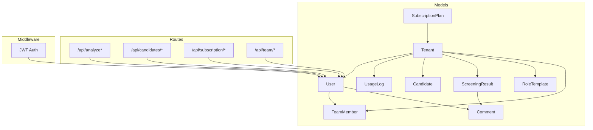
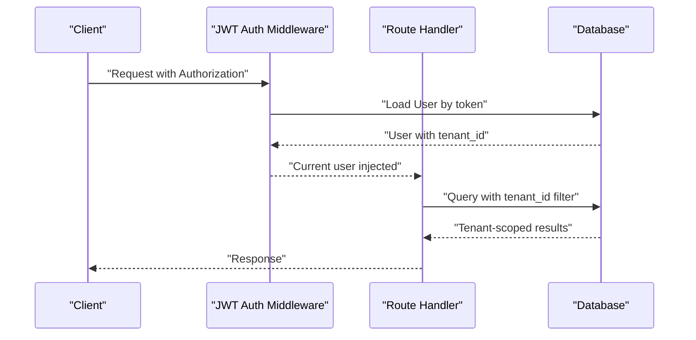
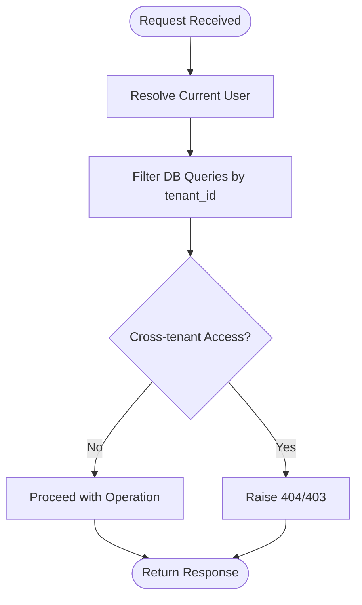
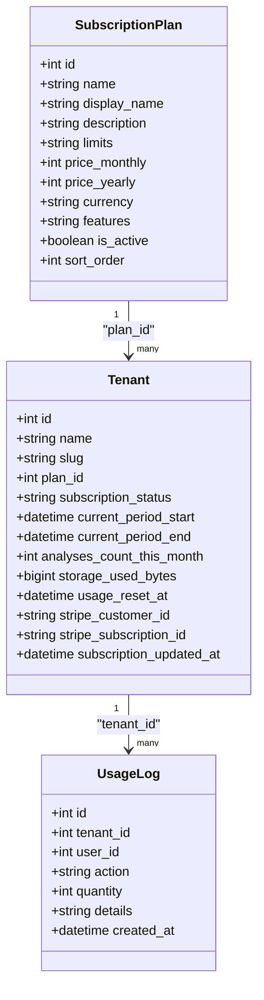
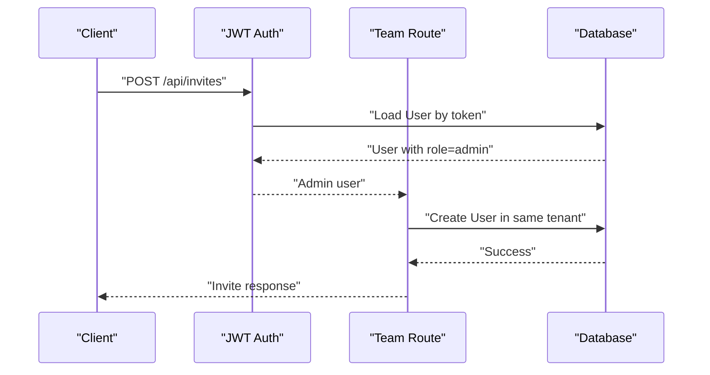
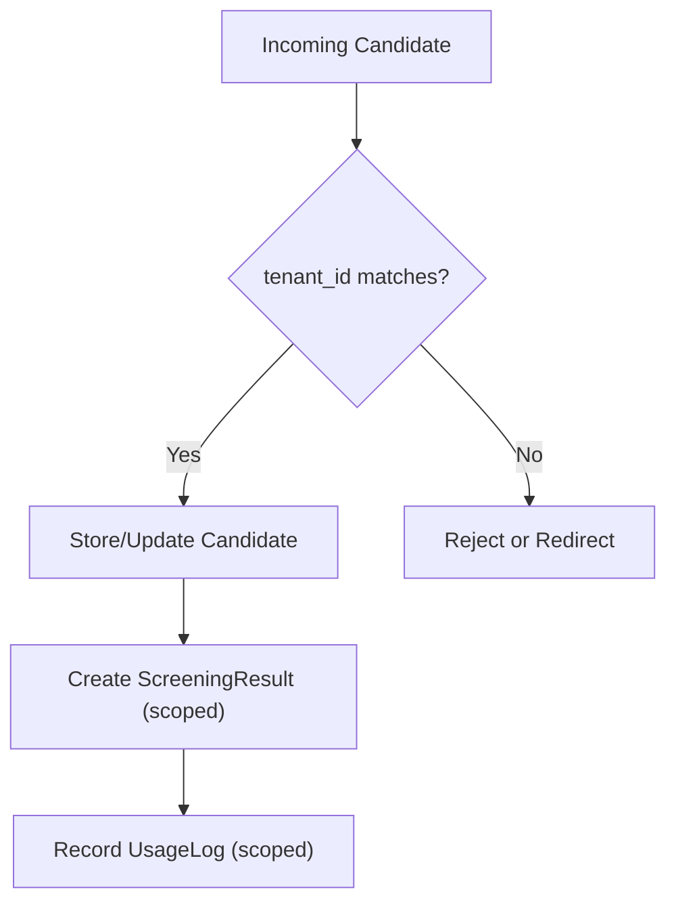
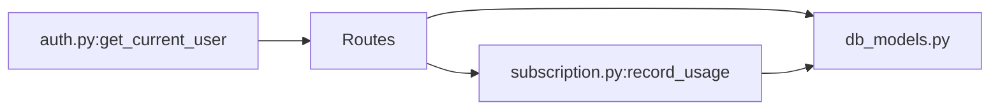

# Multi-Tenant Architecture

<cite>
**Referenced Files in This Document**
- [db_models.py](file://app/backend/models/db_models.py)
- [schemas.py](file://app/backend/models/schemas.py)
- [003_subscription_system.py](file://alembic/versions/003_subscription_system.py)
- [auth.py](file://app/backend/middleware/auth.py)
- [team.py](file://app/backend/routes/team.py)
- [subscription.py](file://app/backend/routes/subscription.py)
- [analyze.py](file://app/backend/routes/analyze.py)
- [candidates.py](file://app/backend/routes/candidates.py)
- [test_subscription.py](file://app/backend/tests/test_subscription.py)
- [test_usage_enforcement.py](file://app/backend/tests/test_usage_enforcement.py)
- [env.py](file://alembic/env.py)
</cite>

## Table of Contents
1. [Introduction](#introduction)
2. [Project Structure](#project-structure)
3. [Core Components](#core-components)
4. [Architecture Overview](#architecture-overview)
5. [Detailed Component Analysis](#detailed-component-analysis)
6. [Dependency Analysis](#dependency-analysis)
7. [Performance Considerations](#performance-considerations)
8. [Troubleshooting Guide](#troubleshooting-guide)
9. [Conclusion](#conclusion)
10. [Appendices](#appendices)

## Introduction
This document explains the multi-tenant architecture implemented in Resume AI by ThetaLogics. It focuses on tenant isolation via tenant_id foreign keys across all models, the subscription system with SubscriptionPlan and Tenant models, usage tracking and billing integration hooks, user-role-based access control, tenant-specific data partitioning, and security boundaries. It also covers tenant-aware queries, cross-tenant operation risks, and migration patterns.

## Project Structure
The multi-tenant implementation spans models, routes, middleware, migrations, and tests:
- Models define tenant-scoped entities and relationships.
- Routes enforce tenant scoping and role-based access.
- Middleware authenticates users and resolves current tenant context.
- Migrations evolve the schema to support subscriptions and usage tracking.
- Tests validate usage enforcement and subscription behavior.

**Diagram sources**
- [db_models.py:11-250](file://app/backend/models/db_models.py#L11-L250)
- [subscription.py:15-18](file://app/backend/routes/subscription.py#L15-L18)
- [team.py:10-13](file://app/backend/routes/team.py#L10-L13)
- [analyze.py:27-31](file://app/backend/routes/analyze.py#L27-L31)
- [candidates.py:19-21](file://app/backend/routes/candidates.py#L19-L21)

**Section sources**
- [db_models.py:11-250](file://app/backend/models/db_models.py#L11-L250)
- [subscription.py:15-18](file://app/backend/routes/subscription.py#L15-L18)
- [team.py:10-13](file://app/backend/routes/team.py#L10-L13)
- [analyze.py:27-31](file://app/backend/routes/analyze.py#L27-L31)
- [candidates.py:19-21](file://app/backend/routes/candidates.py#L19-L21)

## Core Components
- SubscriptionPlan: Defines pricing tiers and limits (JSON fields for limits and features).
- Tenant: Links to a plan, tracks subscription status and usage counters, integrates with Stripe identifiers.
- User: Scoped to Tenant via tenant_id, supports roles (admin/recruiter/viewer).
- UsageLog: Tracks per-tenant, per-user actions for billing/analytics.
- Candidate, ScreeningResult, RoleTemplate, TeamMember, Comment: All scoped to Tenant via tenant_id.

These components form a cohesive tenant-isolation layer where every write/read includes tenant_id filters.

**Section sources**
- [db_models.py:11-250](file://app/backend/models/db_models.py#L11-L250)

## Architecture Overview
The system enforces tenant isolation at three layers:
- Data model level: Every entity includes tenant_id foreign keys.
- Route level: Queries filter by current_user.tenant_id.
- Authentication middleware: Resolves current user and tenant context.

**Diagram sources**
- [auth.py:19-46](file://app/backend/middleware/auth.py#L19-L46)
- [subscription.py:172-253](file://app/backend/routes/subscription.py#L172-L253)
- [team.py:18-31](file://app/backend/routes/team.py#L18-L31)
- [candidates.py:26-80](file://app/backend/routes/candidates.py#L26-L80)

## Detailed Component Analysis

### Tenant Isolation Strategy
- All entities include tenant_id foreign keys, ensuring data stays within tenant boundaries.
- Routes consistently filter by current_user.tenant_id to prevent cross-tenant access.
- Admin role checks restrict sensitive operations to authorized users.

**Diagram sources**
- [auth.py:19-46](file://app/backend/middleware/auth.py#L19-L46)
- [team.py:23-31](file://app/backend/routes/team.py#L23-L31)
- [candidates.py:34](file://app/backend/routes/candidates.py#L34)

**Section sources**
- [db_models.py:62-192](file://app/backend/models/db_models.py#L62-L192)
- [auth.py:19-46](file://app/backend/middleware/auth.py#L19-L46)
- [team.py:18-82](file://app/backend/routes/team.py#L18-L82)
- [candidates.py:26-100](file://app/backend/routes/candidates.py#L26-L100)

### Subscription System and Usage Tracking
- SubscriptionPlan defines pricing, currency, features, and limits (JSON).
- Tenant stores subscription_status, billing periods, monthly usage counters, and Stripe identifiers.
- UsageLog records per-action usage with tenant_id and optional user_id.
- Routes expose plan listing, current subscription details, usage checks, and usage history.
- Helper functions handle monthly resets, plan limits parsing, and usage recording.

**Diagram sources**
- [db_models.py:11-93](file://app/backend/models/db_models.py#L11-L93)
- [003_subscription_system.py:43-252](file://alembic/versions/003_subscription_system.py#L43-L252)

**Section sources**
- [db_models.py:11-93](file://app/backend/models/db_models.py#L11-L93)
- [003_subscription_system.py:43-252](file://alembic/versions/003_subscription_system.py#L43-L252)
- [subscription.py:70-477](file://app/backend/routes/subscription.py#L70-L477)

### User-Role-Based Access Control
- Users belong to a Tenant and carry a role field.
- Admin role is enforced for sensitive operations (e.g., inviting/removing team members).
- Team routes filter users by tenant_id and disallow self-removal.

**Diagram sources**
- [auth.py:43-46](file://app/backend/middleware/auth.py#L43-L46)
- [team.py:34-61](file://app/backend/routes/team.py#L34-L61)

**Section sources**
- [db_models.py:62-77](file://app/backend/models/db_models.py#L62-L77)
- [auth.py:43-46](file://app/backend/middleware/auth.py#L43-L46)
- [team.py:34-82](file://app/backend/routes/team.py#L34-L82)

### Tenant-Specific Data Partitioning and Security Boundaries
- All entities include tenant_id, enforcing strict partitioning.
- Deduplication and candidate creation honor tenant_id to avoid cross-tenant matches.
- ScreeningResult and related entities are scoped to Tenant to maintain analysis isolation.
- Usage logs are partitioned by tenant_id with optional user_id linkage.

**Diagram sources**
- [analyze.py:147-214](file://app/backend/routes/analyze.py#L147-L214)
- [db_models.py:97-146](file://app/backend/models/db_models.py#L97-L146)

**Section sources**
- [analyze.py:147-214](file://app/backend/routes/analyze.py#L147-L214)
- [db_models.py:97-146](file://app/backend/models/db_models.py#L97-L146)

### Examples of Tenant-Aware Queries
- Team listing: Filters users by tenant_id and active status.
- Comments retrieval: Ensures result belongs to the same tenant as the current user.
- Subscription usage: Aggregates usage per tenant and calculates limits.
- Candidate listing/search: Restricts to tenant_id with optional search filters.

**Section sources**
- [team.py:18-31](file://app/backend/routes/team.py#L18-L31)
- [team.py:85-107](file://app/backend/routes/team.py#L85-L107)
- [subscription.py:172-253](file://app/backend/routes/subscription.py#L172-L253)
- [candidates.py:26-80](file://app/backend/routes/candidates.py#L26-L80)

### Cross-Tenant Operations and Risks
- Cross-tenant access is prevented by tenant_id filters in all routes.
- Admin operations are further restricted by role checks.
- Tests demonstrate that unauthorized access attempts are blocked.

**Section sources**
- [team.py:64-82](file://app/backend/routes/team.py#L64-L82)
- [test_subscription.py:241-308](file://app/backend/tests/test_subscription.py#L241-L308)

### Data Migration Scenarios
- Alembic revision adds subscription plan fields, usage tracking columns to Tenant, and creates UsageLog table with appropriate indexes.
- Seeding inserts default plans and assigns a default plan to existing tenants.
- Downgrade removes usage tracking and plan columns safely.

**Section sources**
- [003_subscription_system.py:43-290](file://alembic/versions/003_subscription_system.py#L43-L290)
- [env.py:11-12](file://alembic/env.py#L11-L12)

## Dependency Analysis
- Routes depend on models and middleware to enforce tenant scoping and roles.
- Subscription routes depend on UsageLog and Tenant models for usage tracking.
- Analysis routes depend on Candidate and ScreeningResult models and call usage recording helpers.

**Diagram sources**
- [auth.py:19-46](file://app/backend/middleware/auth.py#L19-L46)
- [subscription.py:427-477](file://app/backend/routes/subscription.py#L427-L477)
- [db_models.py:11-93](file://app/backend/models/db_models.py#L11-L93)

**Section sources**
- [auth.py:19-46](file://app/backend/middleware/auth.py#L19-L46)
- [subscription.py:427-477](file://app/backend/routes/subscription.py#L427-L477)
- [db_models.py:11-93](file://app/backend/models/db_models.py#L11-L93)

## Performance Considerations
- Indexes on tenant_id and composite tenant filters improve query performance.
- Usage tracking aggregates are computed per-tenant to avoid cross-tenant scans.
- Deduplication uses multiple indices (email, hash, name+phone) scoped by tenant_id.

[No sources needed since this section provides general guidance]

## Troubleshooting Guide
Common issues and resolutions:
- Unauthorized access: Ensure tenant_id filters are applied in all routes and role checks are enforced.
- Usage limit errors: Verify monthly reset logic and plan limits parsing.
- Storage calculation discrepancies: Confirm storage bytes are recalculated and persisted.

**Section sources**
- [subscription.py:70-158](file://app/backend/routes/subscription.py#L70-L158)
- [test_subscription.py:135-185](file://app/backend/tests/test_subscription.py#L135-L185)
- [test_usage_enforcement.py:53-191](file://app/backend/tests/test_usage_enforcement.py#L53-L191)

## Conclusion
The Resume AI multi-tenant architecture enforces strict tenant isolation via tenant_id foreign keys across all models, tenant-scoped route filters, and role-based access control. The subscription system provides plan management, usage tracking, and billing integration hooks. Tests validate usage enforcement and subscription behavior, while migrations evolve schema safely.

## Appendices

### Relationship Between Tenants, Users, and Data Access Patterns
- Tenants own Users, Candidates, ScreeningResults, RoleTemplates, TeamMembers, and UsageLogs.
- Users can collaborate within a Tenant and are constrained by role-based permissions.
- Data access patterns consistently apply tenant_id filters to maintain security boundaries.

**Section sources**
- [db_models.py:31-59](file://app/backend/models/db_models.py#L31-L59)
- [db_models.py:62-77](file://app/backend/models/db_models.py#L62-L77)
- [db_models.py:97-192](file://app/backend/models/db_models.py#L97-L192)