# CI/CD Pipelines

<cite>
**Referenced Files in This Document**
- [.github/workflows/ci.yml](file://.github/workflows/ci.yml)
- [.github/workflows/cd.yml](file://.github/workflows/cd.yml)
- [app/backend/Dockerfile](file://app/backend/Dockerfile)
- [app/frontend/Dockerfile](file://app/frontend/Dockerfile)
- [app/speech_service/Dockerfile](file://app/speech_service/Dockerfile)
- [app/voice_agent/Dockerfile](file://app/voice_agent/Dockerfile)
- [app/voice_agent/Dockerfile.livekit](file://app/voice_agent/Dockerfile.livekit)
- [app/speech_service/main.py](file://app/speech_service/main.py)
- [app/voice_agent/agent.py](file://app/voice_agent/agent.py)
- [app/voice_agent/livekit.yaml](file://app/voice_agent/livekit.yaml)
- [docker-compose.prod.yml](file://docker-compose.prod.yml)
- [requirements.txt](file://requirements.txt)
- [app/backend/tests/conftest.py](file://app/backend/tests/conftest.py)
- [app/frontend/package.json](file://app/frontend/package.json)
- [app/frontend/vite.config.js](file://app/frontend/vite.config.js)
- [scripts/run-full-tests.sh](file://scripts/run-full-tests.sh)
- [scripts/pre-commit-check.ps1](file://scripts/pre-commit-check.ps1)
</cite>

## Update Summary
**Changes Made**
- Added three new Docker build and push jobs for LiveKit video conferencing, speech-service, and voice-agent microservices
- Enhanced continuous deployment pipeline with automated containerization for all four microservices
- Updated deployment configuration to support the new voice screening microservices architecture
- Expanded production deployment orchestration with Watchtower-based rolling updates

## Table of Contents
1. [Introduction](#introduction)
2. [Project Structure](#project-structure)
3. [Core Components](#core-components)
4. [Architecture Overview](#architecture-overview)
5. [Detailed Component Analysis](#detailed-component-analysis)
6. [Microservices Architecture](#microservices-architecture)
7. [Dependency Analysis](#dependency-analysis)
8. [Performance Considerations](#performance-considerations)
9. [Troubleshooting Guide](#troubleshooting-guide)
10. [Conclusion](#conclusion)
11. [Appendices](#appendices)

## Introduction
This document describes the CI/CD pipelines for Resume AI by ThetaLogics, focusing on:
- Continuous Integration (CI) via GitHub Actions for automated testing and code quality checks
- Continuous Deployment (CD) via GitHub Actions for container image builds and publishing
- Test automation setup for backend (pytest) and frontend (Jest/Vitest)
- Build artifacts, container image publishing, and deployment triggers
- Pull request validation, branch protection alignment, and manual approval gates
- Troubleshooting failed builds, deployment rollbacks, and pipeline optimization
- Security scanning, vulnerability assessment, and compliance considerations
- **Updated**: Enhanced with LiveKit video conferencing, speech-service, and voice-agent microservices deployment

## Project Structure
The repository organizes CI/CD around GitHub Actions workflows, Docker-based services, and test suites:
- Workflows: .github/workflows/ci.yml (PR and push validation), .github/workflows/cd.yml (image build and publish)
- Backend: FastAPI application with Dockerfile, tests, and Alembic migrations
- Frontend: React application with Vite, Vitest, and Tailwind CSS
- Microservices: Speech service (CPU-optimized STT/TTS/VAD), Voice agent (LiveKit integration), LiveKit server (WebRTC/SIP)
- Compose: Local development (docker-compose.yml) and production orchestration (docker-compose.prod.yml)
- Scripts: Pre-commit and full-test runners for local validation

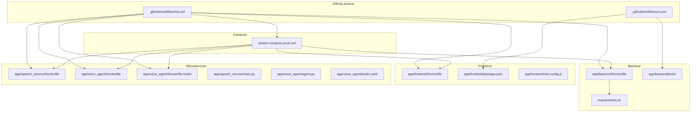

**Diagram sources**
- [.github/workflows/ci.yml:1-63](file://.github/workflows/ci.yml#L1-L63)
- [.github/workflows/cd.yml:1-134](file://.github/workflows/cd.yml#L1-L134)
- [app/backend/Dockerfile:1-39](file://app/backend/Dockerfile#L1-L39)
- [app/frontend/Dockerfile:1-26](file://app/frontend/Dockerfile#L1-L26)
- [app/speech_service/Dockerfile:1-32](file://app/speech_service/Dockerfile#L1-L32)
- [app/voice_agent/Dockerfile:1-31](file://app/voice_agent/Dockerfile#L1-L31)
- [app/voice_agent/Dockerfile.livekit:1-3](file://app/voice_agent/Dockerfile.livekit#L1-L3)
- [docker-compose.prod.yml:1-311](file://docker-compose.prod.yml#L1-L311)

**Section sources**
- [.github/workflows/ci.yml:1-63](file://.github/workflows/ci.yml#L1-L63)
- [.github/workflows/cd.yml:1-134](file://.github/workflows/cd.yml#L1-L134)
- [docker-compose.prod.yml:1-311](file://docker-compose.prod.yml#L1-L311)

## Core Components
- CI workflow validates pull requests and pushes to main and staging by running backend and frontend tests.
- CD workflow builds and pushes backend, frontend, nginx, LiveKit, speech-service, and voice-agent images to Docker Hub.
- Backend testing uses pytest with coverage reporting and shared fixtures for database, authentication, and service mocks.
- Frontend testing uses Vitest with jsdom and a dedicated setup file; package.json defines test scripts.
- Containerization uses multi-stage Dockerfiles for all services, with nginx serving the built frontend assets.
- **Updated**: Production deployment now includes automated rolling updates via Watchtower for all microservices.

Key capabilities:
- Automated testing on PRs and pushes
- Coverage upload via Codecov
- Docker image publishing to Docker Hub for 6 services
- Manual deployment gate via SSH and docker-compose commands
- Local pre-commit and full-test validation scripts
- **Updated**: Watchtower-based rolling updates for zero-downtime deployments

**Section sources**
- [.github/workflows/ci.yml:1-63](file://.github/workflows/ci.yml#L1-L63)
- [.github/workflows/cd.yml:1-134](file://.github/workflows/cd.yml#L1-L134)
- [app/backend/tests/conftest.py:1-589](file://app/backend/tests/conftest.py#L1-L589)
- [app/frontend/package.json:1-41](file://app/frontend/package.json#L1-L41)
- [app/frontend/vite.config.js:1-26](file://app/frontend/vite.config.js#L1-L26)
- [app/backend/Dockerfile:1-39](file://app/backend/Dockerfile#L1-L39)
- [app/frontend/Dockerfile:1-26](file://app/frontend/Dockerfile#L1-L26)
- [app/speech_service/Dockerfile:1-32](file://app/speech_service/Dockerfile#L1-L32)
- [app/voice_agent/Dockerfile:1-31](file://app/voice_agent/Dockerfile#L1-L31)
- [app/voice_agent/Dockerfile.livekit:1-3](file://app/voice_agent/Dockerfile.livekit#L1-L3)

## Architecture Overview
The CI/CD architecture integrates GitHub Actions with Docker and deployment orchestration:

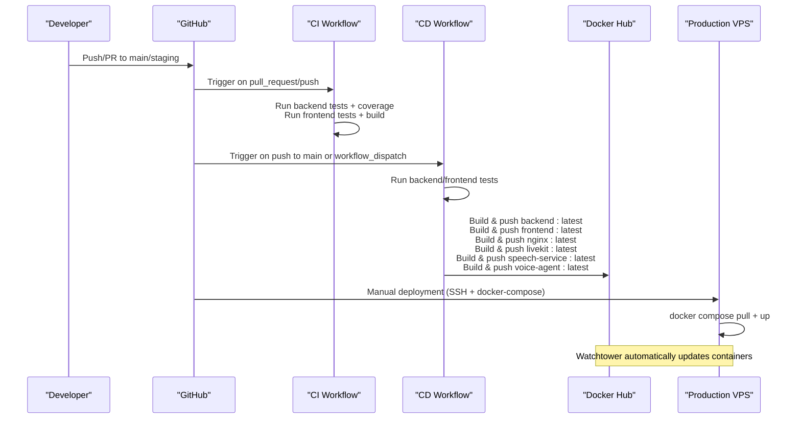

**Diagram sources**
- [.github/workflows/ci.yml:1-63](file://.github/workflows/ci.yml#L1-L63)
- [.github/workflows/cd.yml:1-134](file://.github/workflows/cd.yml#L1-L134)

## Detailed Component Analysis

### CI Workflow (.github/workflows/ci.yml)
- Triggers: pull_request and push to main and staging
- Jobs:
  - test-backend: sets up Python, installs dependencies (including pytest and pytest-cov), runs backend tests with coverage, uploads coverage to Codecov
  - test-frontend: sets up Node.js, installs npm dependencies, runs frontend tests, and builds the frontend

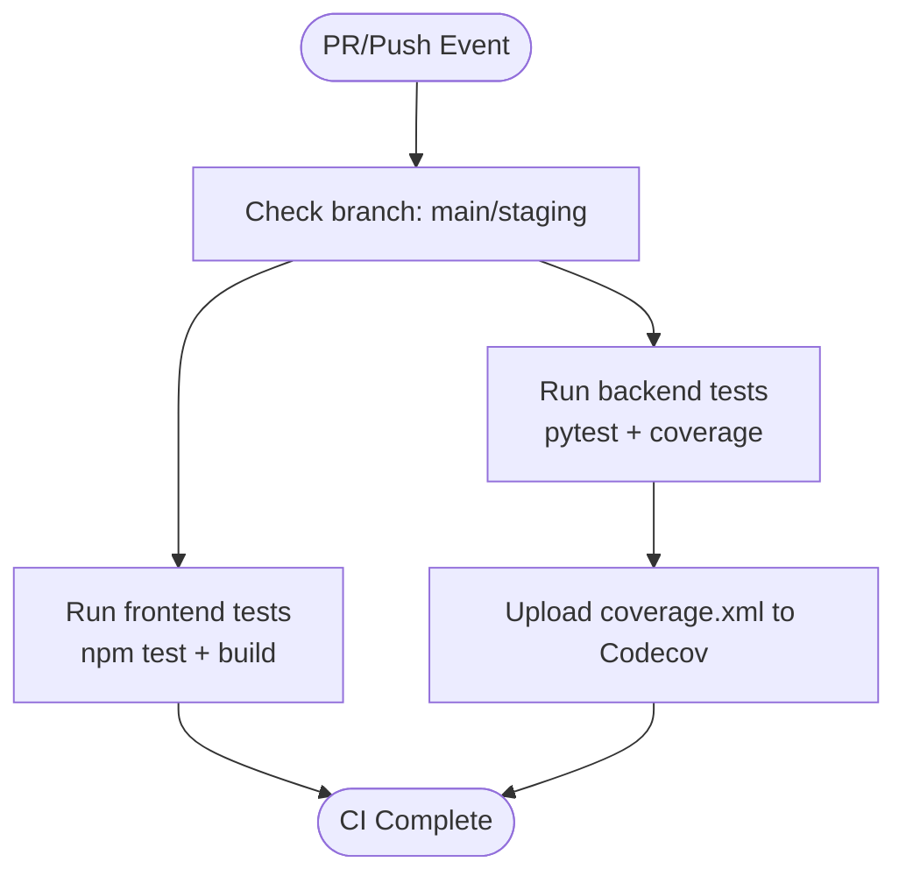

**Diagram sources**
- [.github/workflows/ci.yml:1-63](file://.github/workflows/ci.yml#L1-L63)

**Section sources**
- [.github/workflows/ci.yml:1-63](file://.github/workflows/ci.yml#L1-L63)

### CD Workflow (.github/workflows/cd.yml)
- Triggers: push to main and workflow_dispatch
- Concurrency: cancels in-progress runs for the same ref
- Jobs:
  - test: runs backend and frontend tests to validate before building images
  - build-and-push: builds and pushes backend, frontend, nginx, LiveKit, speech-service, and voice-agent images tagged as latest to Docker Hub
- Deployment: manual step described to SSH into VPS and run docker-compose commands to pull and start services

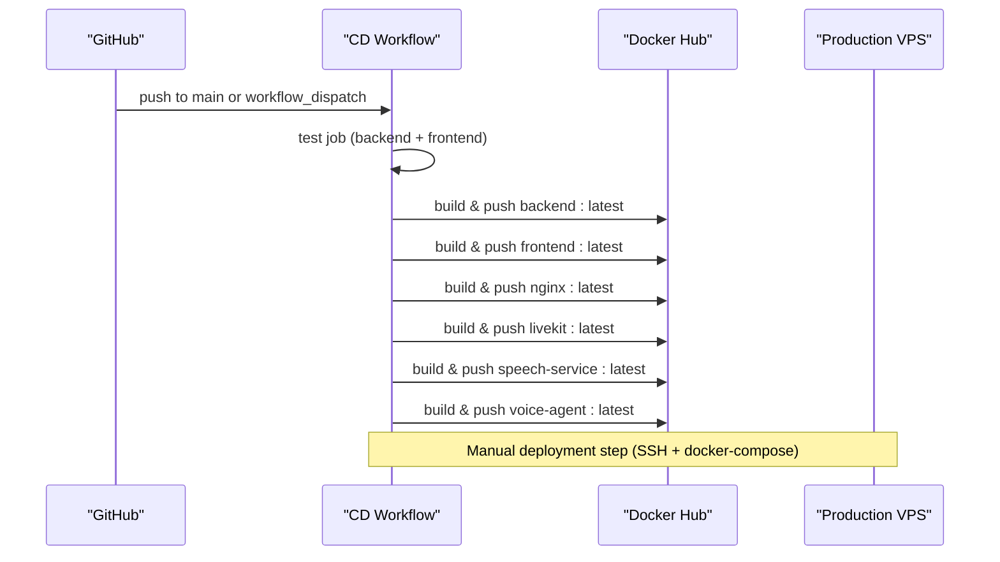

**Diagram sources**
- [.github/workflows/cd.yml:1-134](file://.github/workflows/cd.yml#L1-L134)

**Section sources**
- [.github/workflows/cd.yml:1-134](file://.github/workflows/cd.yml#L1-L134)

### Backend Testing with Pytest
- Shared fixtures in conftest.py configure an in-memory SQLite database, dependency overrides, authentication tokens, and service mocks for Ollama and Whisper
- Tests run with pytest and coverage reporting; coverage XML is uploaded to Codecov

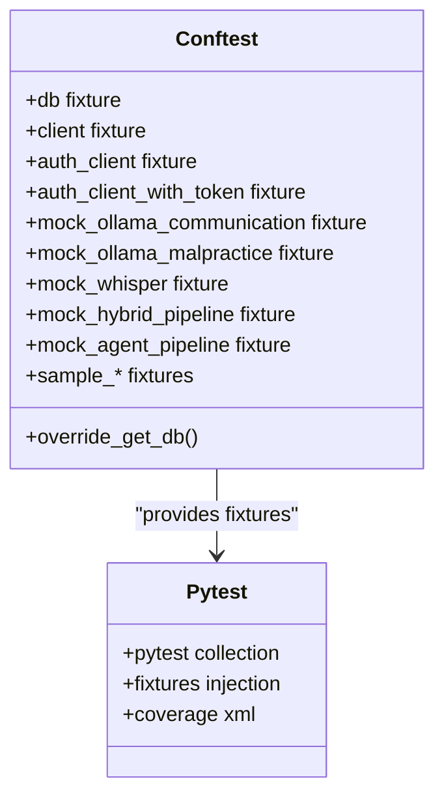

**Diagram sources**
- [app/backend/tests/conftest.py:1-589](file://app/backend/tests/conftest.py#L1-L589)

**Section sources**
- [app/backend/tests/conftest.py:1-589](file://app/backend/tests/conftest.py#L1-L589)
- [.github/workflows/ci.yml:27-37](file://.github/workflows/ci.yml#L27-L37)

### Frontend Testing with Vitest
- Package scripts define test commands using Vitest
- Vite config enables test environment with jsdom and a setup file
- Tests are organized under src/__tests__ and executed via npm test

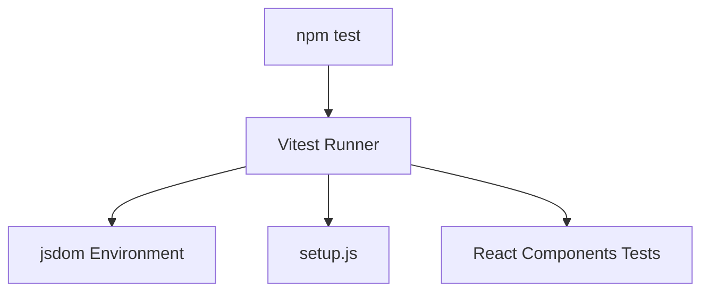

**Diagram sources**
- [app/frontend/package.json:6-12](file://app/frontend/package.json#L6-L12)
- [app/frontend/vite.config.js:20-24](file://app/frontend/vite.config.js#L20-L24)

**Section sources**
- [app/frontend/package.json:1-41](file://app/frontend/package.json#L1-L41)
- [app/frontend/vite.config.js:1-26](file://app/frontend/vite.config.js#L1-L26)

### Container Image Publishing
- Backend image built from app/backend/Dockerfile and pushed as resume-backend:latest
- Frontend image built from app/frontend/Dockerfile and pushed as resume-frontend:latest
- Nginx image built from nginx directory and pushed as resume-nginx:latest
- **Updated**: LiveKit image built from app/voice_agent/Dockerfile.livekit and pushed as resume-livekit:latest
- **Updated**: Speech service image built from app/speech_service/Dockerfile and pushed as resume-speech-service:latest
- **Updated**: Voice agent image built from app/voice_agent/Dockerfile and pushed as resume-voice-agent:latest
- Docker Hub credentials are supplied via GitHub secrets

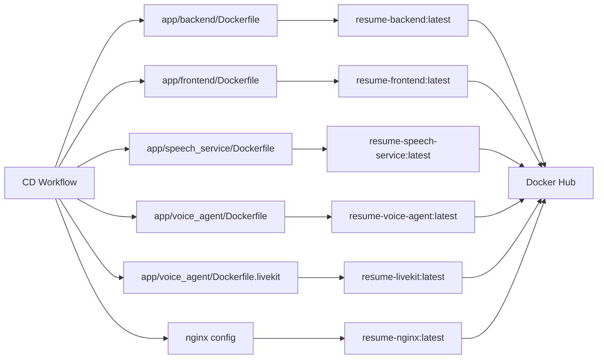

**Diagram sources**
- [.github/workflows/cd.yml:66-128](file://.github/workflows/cd.yml#L66-L128)
- [app/backend/Dockerfile:1-39](file://app/backend/Dockerfile#L1-L39)
- [app/frontend/Dockerfile:1-26](file://app/frontend/Dockerfile#L1-L26)
- [app/speech_service/Dockerfile:1-32](file://app/speech_service/Dockerfile#L1-L32)
- [app/voice_agent/Dockerfile:1-31](file://app/voice_agent/Dockerfile#L1-L31)
- [app/voice_agent/Dockerfile.livekit:1-3](file://app/voice_agent/Dockerfile.livekit#L1-L3)

**Section sources**
- [.github/workflows/cd.yml:60-128](file://.github/workflows/cd.yml#L60-L128)
- [app/backend/Dockerfile:1-39](file://app/backend/Dockerfile#L1-L39)
- [app/frontend/Dockerfile:1-26](file://app/frontend/Dockerfile#L1-L26)
- [app/speech_service/Dockerfile:1-32](file://app/speech_service/Dockerfile#L1-L32)
- [app/voice_agent/Dockerfile:1-31](file://app/voice_agent/Dockerfile#L1-L31)
- [app/voice_agent/Dockerfile.livekit:1-3](file://app/voice_agent/Dockerfile.livekit#L1-L3)

### Deployment Triggers and Manual Gates
- CD workflow triggers on push to main and supports manual dispatch
- Production deployment is documented as a manual SSH step to pull images and restart services with docker-compose
- **Updated**: Production deployment now includes Watchtower-based automatic rolling updates for all services
- No automatic production rollout is defined in the workflow; manual approval is required before deploying to production

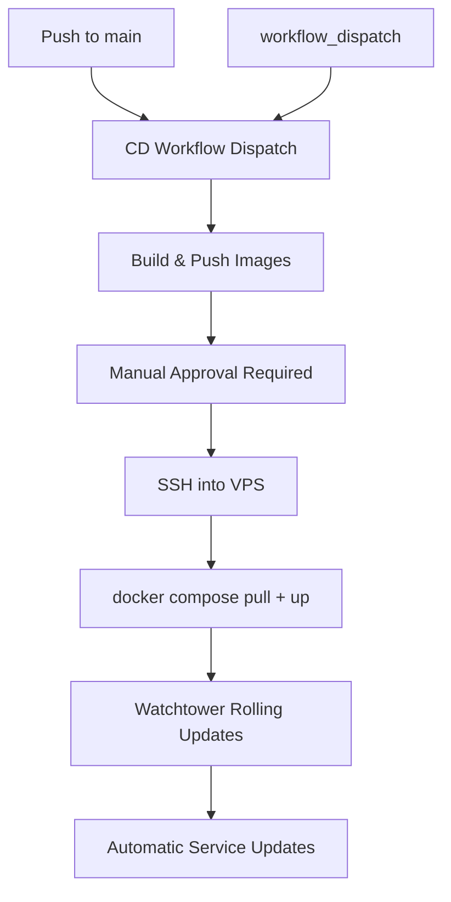

**Diagram sources**
- [.github/workflows/cd.yml:3-11](file://.github/workflows/cd.yml#L3-L11)
- [.github/workflows/cd.yml:130-134](file://.github/workflows/cd.yml#L130-L134)
- [docker-compose.prod.yml:192-221](file://docker-compose.prod.yml#L192-L221)

**Section sources**
- [.github/workflows/cd.yml:3-11](file://.github/workflows/cd.yml#L3-L11)
- [.github/workflows/cd.yml:130-134](file://.github/workflows/cd.yml#L130-L134)
- [docker-compose.prod.yml:192-221](file://docker-compose.prod.yml#L192-L221)

### Pull Request Validation and Branch Protection Alignment
- CI validates PRs and pushes to main and staging
- Align branch protection rules with these branches to require successful CI runs before merging
- Use workflow_dispatch to re-run CD for hotfixes or emergency releases

**Section sources**
- [.github/workflows/ci.yml:3-7](file://.github/workflows/ci.yml#L3-L7)
- [.github/workflows/cd.yml:3-7](file://.github/workflows/cd.yml#L3-L7)

### Local Test Automation and Pre-commit Validation
- scripts/run-full-tests.sh performs comprehensive checks including Python syntax, test file syntax, imports, migrations, route registration, frontend file presence, and integration patterns
- scripts/pre-commit-check.ps1 enforces pre-commit checks on Windows, validating Python and frontend files, migrations, and integration patterns

**Section sources**
- [scripts/run-full-tests.sh:1-256](file://scripts/run-full-tests.sh#L1-L256)
- [scripts/pre-commit-check.ps1:1-183](file://scripts/pre-commit-check.ps1#L1-L183)

## Microservices Architecture

### LiveKit Video Conferencing Service
The LiveKit service provides WebRTC SFU (Selective Forwarding Unit) functionality for voice screening:
- Built from app/voice_agent/Dockerfile.livekit using livekit/livekit-server:latest base image
- Configured via app/voice_agent/livekit.yaml with SIP trunking for PSTN integration
- Exposes ports 7880 (WebSocket), 7881 (RTC), and 7882/udp (TURN)
- Supports outbound SIP calls through Twilio integration

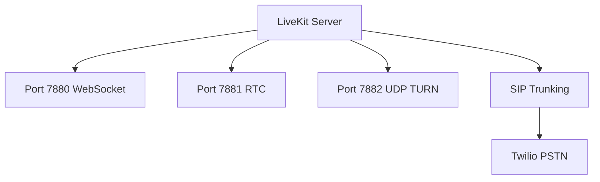

**Diagram sources**
- [app/voice_agent/Dockerfile.livekit:1-3](file://app/voice_agent/Dockerfile.livekit#L1-L3)
- [app/voice_agent/livekit.yaml:1-42](file://app/voice_agent/livekit.yaml#L1-L42)

**Section sources**
- [app/voice_agent/Dockerfile.livekit:1-3](file://app/voice_agent/Dockerfile.livekit#L1-L3)
- [app/voice_agent/livekit.yaml:1-42](file://app/voice_agent/livekit.yaml#L1-L42)

### Speech Service
The speech service provides CPU-optimized speech processing capabilities:
- Built from app/speech_service/Dockerfile with Python 3.11 slim base
- Implements STT (Parakeet TDT 1.1B), TTS (Kokoro 82M), and VAD (Silero VAD v5)
- Exposes REST endpoints: /stt/transcribe, /tts/synthesize, /vad/detect, /health
- Requires system dependencies: gcc, curl, libsndfile1
- Health checks with model warmup on startup

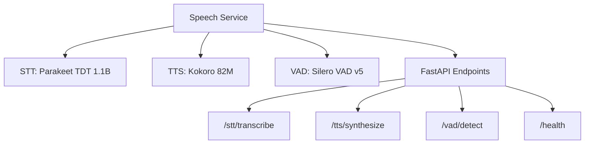

**Diagram sources**
- [app/speech_service/Dockerfile:1-32](file://app/speech_service/Dockerfile#L1-L32)
- [app/speech_service/main.py:1-387](file://app/speech_service/main.py#L1-L387)

**Section sources**
- [app/speech_service/Dockerfile:1-32](file://app/speech_service/Dockerfile#L1-L32)
- [app/speech_service/main.py:1-387](file://app/speech_service/main.py#L1-L387)

### Voice Agent Service
The voice agent orchestrates the complete voice screening conversation:
- Built from app/voice_agent/Dockerfile with Python 3.11 slim base
- Integrates LiveKit for WebRTC audio/video, Speech Service for audio processing, and Ollama Cloud for LLM
- Implements conversation state machine with 6 states: GREETING, CONSENT, INTRODUCTION, SCREENING, FOLLOW_UP, WRAP_UP, ANALYSIS, ENDED
- Provides HTTP dispatch API for creating LiveKit rooms and initiating SIP calls
- Includes LiveKit Agent Worker for audio processing and conversation management

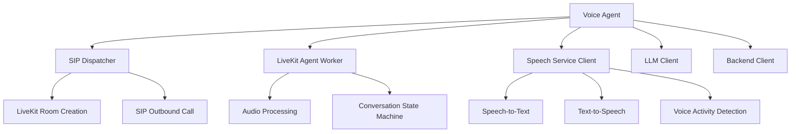

**Diagram sources**
- [app/voice_agent/Dockerfile:1-31](file://app/voice_agent/Dockerfile#L1-L31)
- [app/voice_agent/agent.py:1-883](file://app/voice_agent/agent.py#L1-L883)

**Section sources**
- [app/voice_agent/Dockerfile:1-31](file://app/voice_agent/Dockerfile#L1-L31)
- [app/voice_agent/agent.py:1-883](file://app/voice_agent/agent.py#L1-L883)

### Production Deployment Orchestration
Production deployment leverages Docker Compose with Watchtower for automated updates:
- Watchtower monitors Docker Hub for image updates and automatically restarts containers
- Supports rolling restarts for zero-downtime deployments across all 6 services
- Includes health checks for all services with appropriate start periods
- Configures resource limits and CPU/memory constraints for optimal performance

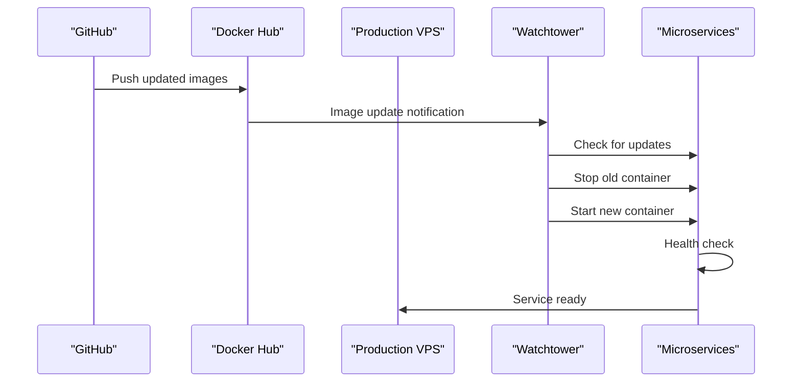

**Diagram sources**
- [docker-compose.prod.yml:192-221](file://docker-compose.prod.yml#L192-L221)

**Section sources**
- [docker-compose.prod.yml:192-221](file://docker-compose.prod.yml#L192-L221)

## Dependency Analysis
- Backend dependencies are declared in requirements.txt and installed during CI/CD jobs
- Frontend dependencies are managed via package.json and installed in CI/CD jobs
- **Updated**: Speech service requires torch, torchaudio, transformers, accelerate, and numpy for CPU inference
- **Updated**: Voice agent requires livekit ecosystem packages and FastAPI for HTTP dispatch
- **Updated**: LiveKit service uses official livekit/livekit-server:latest image with custom configuration
- Docker images encapsulate runtime environments and reduce CI/CD job variability
- Compose files define service dependencies and resource limits for local and production environments

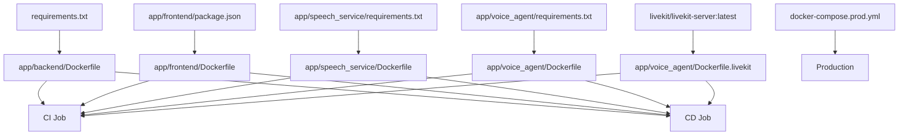

**Diagram sources**
- [requirements.txt:1-48](file://requirements.txt#L1-L48)
- [app/frontend/package.json:1-41](file://app/frontend/package.json#L1-L41)
- [app/speech_service/requirements.txt:1-14](file://app/speech_service/requirements.txt#L1-L14)
- [app/voice_agent/requirements.txt:1-10](file://app/voice_agent/requirements.txt#L1-L10)
- [app/backend/Dockerfile:1-39](file://app/backend/Dockerfile#L1-L39)
- [app/frontend/Dockerfile:1-26](file://app/frontend/Dockerfile#L1-L26)
- [app/speech_service/Dockerfile:1-32](file://app/speech_service/Dockerfile#L1-L32)
- [app/voice_agent/Dockerfile:1-31](file://app/voice_agent/Dockerfile#L1-L31)
- [app/voice_agent/Dockerfile.livekit:1-3](file://app/voice_agent/Dockerfile.livekit#L1-L3)
- [docker-compose.prod.yml:1-311](file://docker-compose.prod.yml#L1-L311)

**Section sources**
- [requirements.txt:1-48](file://requirements.txt#L1-L48)
- [app/frontend/package.json:1-41](file://app/frontend/package.json#L1-L41)
- [app/speech_service/requirements.txt:1-14](file://app/speech_service/requirements.txt#L1-L14)
- [app/voice_agent/requirements.txt:1-10](file://app/voice_agent/requirements.txt#L1-L10)
- [docker-compose.prod.yml:1-311](file://docker-compose.prod.yml#L1-L311)

## Performance Considerations
- Use caching for Python pip and npm to speed up CI/CD jobs
- Parallelize backend and frontend test jobs in CI
- Enable build cache for Docker Buildx in CD to reduce rebuild times
- **Updated**: Consider separate build jobs for each microservice to optimize parallelization
- **Updated**: Implement build matrix strategy for multi-version testing across microservices
- **Updated**: Use Docker layer caching effectively by ordering COPY instructions appropriately
- Optimize docker-compose resource limits in production to balance performance and cost
- **Updated**: Configure Watchtower intervals appropriately to balance update frequency and resource usage

## Troubleshooting Guide
Common issues and resolutions:
- CI failures due to backend tests
  - Verify Python dependencies installation and pytest configuration
  - Check coverage report generation and Codecov upload
- CI failures due to frontend tests
  - Confirm Node.js version and npm ci usage
  - Review Vitest configuration and jsdom setup
- **Updated**: CD failures during microservice image build/push
  - Validate Docker Hub credentials in secrets
  - Ensure Docker Buildx is enabled and cache is configured
  - Check individual microservice requirements and dependencies
  - Verify system dependencies for speech service (gcc, curl, libsndfile1)
- **Updated**: Deployment rollbacks
  - Manually SSH into VPS and run docker compose pull + up to redeploy previous images
  - Optionally tag images with timestamps for safer rollbacks
  - Monitor Watchtower logs for failed updates
- **Updated**: Microservice connectivity issues
  - Verify service dependencies in docker-compose.prod.yml
  - Check network configuration and port mappings
  - Validate environment variables for inter-service communication
  - Monitor health checks for all services
- Pipeline optimization
  - Add job dependencies to prevent unnecessary parallel work
  - Use matrix strategies for multi-version testing
  - Reduce Docker image sizes by pruning build dependencies
  - **Updated**: Implement parallel microservice builds in CD workflow

**Section sources**
- [.github/workflows/ci.yml:27-62](file://.github/workflows/ci.yml#L27-L62)
- [.github/workflows/cd.yml:50-128](file://.github/workflows/cd.yml#L50-L128)
- [scripts/run-full-tests.sh:1-256](file://scripts/run-full-tests.sh#L1-L256)
- [docker-compose.prod.yml:192-221](file://docker-compose.prod.yml#L192-L221)

## Conclusion
The CI/CD setup for Resume AI provides robust automation for testing and image publishing, with a clear manual deployment gate for production. **Updated**: The enhanced pipeline now supports six microservices including LiveKit video conferencing, speech processing, and voice agent orchestration. By aligning branch protection rules with workflow triggers, leveraging caching, maintaining strong local validation scripts, and utilizing Watchtower for automated rolling updates, teams can ensure reliable and secure deployments of the complete voice screening platform.

## Appendices

### Security Scanning and Compliance
- Add static analysis and secret scanning in CI using tools compatible with GitHub Actions
- Integrate dependency scanning for Python and npm packages
- Enforce signed commits and required reviews for production merges
- Store Docker Hub credentials securely in GitHub Secrets
- **Updated**: Monitor microservice-specific dependencies for security vulnerabilities
- **Updated**: Implement proper environment variable management for production secrets
- **Updated**: Regularly update LiveKit and speech processing model dependencies