# CI/CD Pipelines

<cite>
**Referenced Files in This Document**
- [.github/workflows/ci.yml](file://.github/workflows/ci.yml)
- [.github/workflows/cd.yml](file://.github/workflows/cd.yml)
- [docker-compose.staging.yml](file://docker-compose.staging.yml)
- [docker-compose.prod.yml](file://docker-compose.prod.yml)
- [docker-compose.yml](file://docker-compose.yml)
- [app/backend/Dockerfile](file://app/backend/Dockerfile)
- [app/frontend/Dockerfile](file://app/frontend/Dockerfile)
- [app/speech_service/Dockerfile](file://app/speech_service/Dockerfile)
- [app/voice_agent/Dockerfile](file://app/voice_agent/Dockerfile)
- [app/voice_agent/Dockerfile.livekit](file://app/voice_agent/Dockerfile.livekit)
- [app/speech_service/main.py](file://app/speech_service/main.py)
- [app/voice_agent/agent.py](file://app/voice_agent/agent.py)
- [app/voice_agent/livekit.yaml](file://app/voice_agent/livekit.yaml)
- [requirements.txt](file://requirements.txt)
- [app/backend/tests/conftest.py](file://app/backend/tests/conftest.py)
- [app/frontend/package.json](file://app/frontend/package.json)
- [app/frontend/vite.config.js](file://app/frontend/vite.config.js)
- [scripts/run-full-tests.sh](file://scripts/run-full-tests.sh)
- [scripts/pre-commit-check.ps1](file://scripts/pre-commit-check.ps1)
- [playwright.config.ts](file://playwright.config.ts)
- [e2e/dashboard.spec.ts](file://e2e/dashboard.spec.ts)
- [e2e/auth.setup.ts](file://e2e/auth.setup.ts)
- [e2e/analysis-flow.spec.ts](file://e2e/analysis-flow.spec.ts)
- [e2e/candidates.spec.ts](file://e2e/candidates.spec.ts)
</cite>

## Update Summary
**Changes Made**
- Enhanced CI workflow to include production branch validation alongside main and staging branches
- Improved CD workflow with environment-aware deployment process featuring manual triggering and environment selection
- Implemented comprehensive staging environment support with branch-based image tagging
- Integrated end-to-end testing with Playwright for production branch validation
- Added separate staging and production docker-compose configurations with environment-specific orchestration
- Enhanced deployment monitoring with Watchtower for automatic rolling updates across environments

## Table of Contents
1. [Introduction](#introduction)
2. [Project Structure](#project-structure)
3. [Core Components](#core-components)
4. [Architecture Overview](#architecture-overview)
5. [Detailed Component Analysis](#detailed-component-analysis)
6. [Environment-Aware Deployment Process](#environment-aware-deployment-process)
7. [Microservices Architecture](#microservices-architecture)
8. [Testing Strategy](#testing-strategy)
9. [Deployment Orchestration](#deployment-orchestration)
10. [Security and Compliance](#security-and-compliance)
11. [Troubleshooting Guide](#troubleshooting-guide)
12. [Conclusion](#conclusion)

## Introduction
This document describes the CI/CD pipelines for Resume AI by ThetaLogics, focusing on:
- Continuous Integration (CI) via GitHub Actions for automated testing across main, staging, and production branches
- Continuous Deployment (CD) via GitHub Actions with environment-aware deployment process and manual triggering
- Test automation setup for backend (pytest), frontend (Vitest), and end-to-end testing (Playwright)
- Environment-specific deployment orchestration with separate staging and production configurations
- Build artifacts, container image publishing, and deployment triggers
- Pull request validation, branch protection alignment, and manual approval gates
- Troubleshooting failed builds, deployment rollbacks, and pipeline optimization
- Security scanning, vulnerability assessment, and compliance considerations

## Project Structure
The repository organizes CI/CD around GitHub Actions workflows, Docker-based services, and comprehensive test suites:
- Workflows: .github/workflows/ci.yml (PR and push validation across multiple branches), .github/workflows/cd.yml (environment-aware image build and publish)
- Backend: FastAPI application with Dockerfile, extensive test suite, and Alembic migrations
- Frontend: React application with Vite, Vitest, and Tailwind CSS
- Microservices: Speech service (CPU-optimized STT/TTS/VAD), Voice agent (LiveKit integration), LiveKit server (WebRTC/SIP)
- Compose: Separate orchestration files for local development, staging, and production environments
- Scripts: Pre-commit and full-test runners for local validation

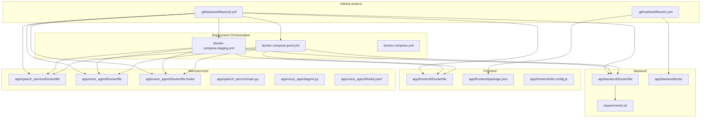

**Diagram sources**
- [.github/workflows/ci.yml:1-63](file://.github/workflows/ci.yml#L1-L63)
- [.github/workflows/cd.yml:1-185](file://.github/workflows/cd.yml#L1-L185)
- [app/backend/Dockerfile:1-55](file://app/backend/Dockerfile#L1-L55)
- [app/frontend/Dockerfile:1-35](file://app/frontend/Dockerfile#L1-L35)
- [app/speech_service/Dockerfile:1-32](file://app/speech_service/Dockerfile#L1-L32)
- [app/voice_agent/Dockerfile:1-31](file://app/voice_agent/Dockerfile#L1-L31)
- [app/voice_agent/Dockerfile.livekit:1-3](file://app/voice_agent/Dockerfile.livekit#L1-L3)
- [docker-compose.staging.yml:1-253](file://docker-compose.staging.yml#L1-L253)
- [docker-compose.prod.yml:1-314](file://docker-compose.prod.yml#L1-L314)
- [docker-compose.yml:1-180](file://docker-compose.yml#L1-L180)

**Section sources**
- [.github/workflows/ci.yml:1-63](file://.github/workflows/ci.yml#L1-L63)
- [.github/workflows/cd.yml:1-185](file://.github/workflows/cd.yml#L1-L185)
- [docker-compose.staging.yml:1-253](file://docker-compose.staging.yml#L1-L253)
- [docker-compose.prod.yml:1-314](file://docker-compose.prod.yml#L1-L314)
- [docker-compose.yml:1-180](file://docker-compose.yml#L1-L180)

## Core Components
- CI workflow validates pull requests and pushes to main, staging, and production branches by running backend and frontend tests.
- CD workflow builds and pushes container images with environment-specific tags (staging/latest) and supports manual deployment selection.
- Backend testing uses pytest with comprehensive fixtures for database, authentication, and service mocks.
- Frontend testing uses Vitest with jsdom and a dedicated setup file; package.json defines test scripts.
- End-to-end testing uses Playwright with browser automation for production branch validation.
- Containerization uses multi-stage Dockerfiles for all services, with environment-specific configurations.
- Production deployment includes automated rolling updates via Watchtower for all microservices.

Key capabilities:
- Multi-environment CI validation across main, staging, and production branches
- Environment-aware image tagging with separate staging and production tags
- Manual deployment gating with environment selection (staging/production)
- Comprehensive testing including unit, integration, and end-to-end tests
- Automated deployment orchestration with separate staging and production configurations
- Zero-downtime deployments via Watchtower rolling updates

**Section sources**
- [.github/workflows/ci.yml:1-63](file://.github/workflows/ci.yml#L1-L63)
- [.github/workflows/cd.yml:1-185](file://.github/workflows/cd.yml#L1-L185)
- [app/backend/tests/conftest.py:1-200](file://app/backend/tests/conftest.py#L1-L200)
- [app/frontend/package.json:1-44](file://app/frontend/package.json#L1-L44)
- [app/frontend/vite.config.js:1-26](file://app/frontend/vite.config.js#L1-L26)
- [playwright.config.ts:1-31](file://playwright.config.ts#L1-L31)
- [e2e/dashboard.spec.ts:1-46](file://e2e/dashboard.spec.ts#L1-L46)

## Architecture Overview
The CI/CD architecture integrates GitHub Actions with Docker and environment-specific deployment orchestration:

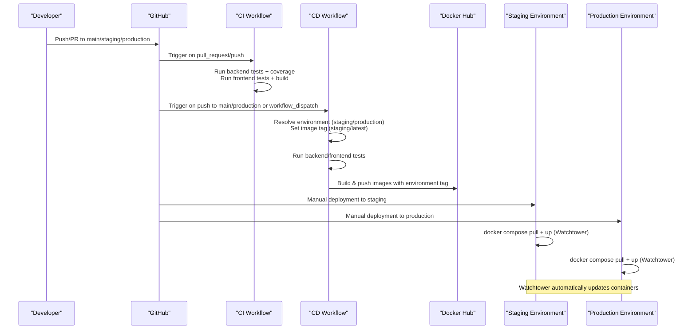

**Diagram sources**
- [.github/workflows/ci.yml:1-63](file://.github/workflows/ci.yml#L1-L63)
- [.github/workflows/cd.yml:1-185](file://.github/workflows/cd.yml#L1-L185)

## Detailed Component Analysis

### CI Workflow (.github/workflows/ci.yml)
- Triggers: pull_request and push to main, staging, and production branches
- Jobs:
  - test-backend: sets up Python, installs dependencies (pytest, pytest-cov), runs backend tests with coverage, uploads coverage to Codecov
  - test-frontend: sets up Node.js, installs npm dependencies, runs frontend tests, and builds the frontend

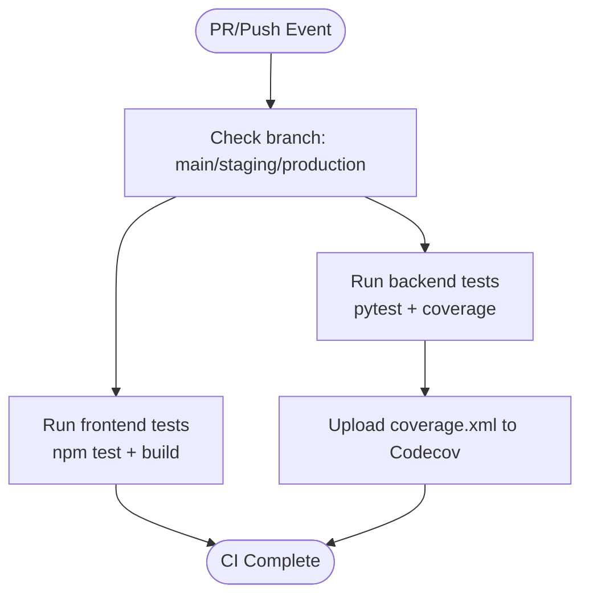

**Diagram sources**
- [.github/workflows/ci.yml:1-63](file://.github/workflows/ci.yml#L1-L63)

**Section sources**
- [.github/workflows/ci.yml:1-63](file://.github/workflows/ci.yml#L1-L63)

### CD Workflow (.github/workflows/cd.yml)
- Triggers: push to main and production branches, plus workflow_dispatch with manual environment selection
- Concurrency: cancels in-progress runs for the same ref
- Environment-aware deployment process:
  - resolve-tag job determines environment and image tag based on trigger source
  - test job validates code before building images
  - build-and-push job builds and pushes images with environment-specific tags
  - deploy-summary job provides deployment information

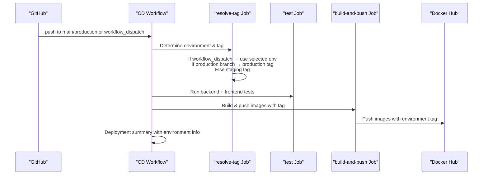

**Diagram sources**
- [.github/workflows/cd.yml:1-185](file://.github/workflows/cd.yml#L1-L185)

**Section sources**
- [.github/workflows/cd.yml:1-185](file://.github/workflows/cd.yml#L1-L185)

### Backend Testing with Pytest
- Shared fixtures in conftest.py configure an in-memory SQLite database, dependency overrides, authentication tokens, and service mocks for Ollama and Whisper
- Tests run with pytest and comprehensive coverage reporting; coverage XML is uploaded to Codecov

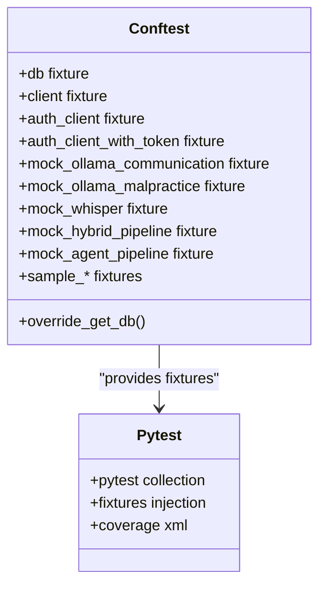

**Diagram sources**
- [app/backend/tests/conftest.py:1-200](file://app/backend/tests/conftest.py#L1-L200)

**Section sources**
- [app/backend/tests/conftest.py:1-200](file://app/backend/tests/conftest.py#L1-L200)
- [.github/workflows/ci.yml:27-37](file://.github/workflows/ci.yml#L27-L37)

### Frontend Testing with Vitest
- Package scripts define test commands using Vitest
- Vite config enables test environment with jsdom and a setup file
- Tests are organized under src/__tests__ and executed via npm test

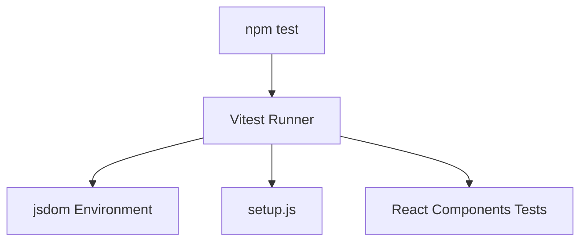

**Diagram sources**
- [app/frontend/package.json:6-12](file://app/frontend/package.json#L6-L12)
- [app/frontend/vite.config.js:20-24](file://app/frontend/vite.config.js#L20-L24)

**Section sources**
- [app/frontend/package.json:1-44](file://app/frontend/package.json#L1-L44)
- [app/frontend/vite.config.js:1-26](file://app/frontend/vite.config.js#L1-L26)

### End-to-End Testing with Playwright
- Playwright configuration targets staging environment for automated UI testing
- Tests validate critical user flows including dashboard navigation and candidate management
- Authentication state management with stored session cookies
- Parallel test execution with retry mechanisms for CI environments

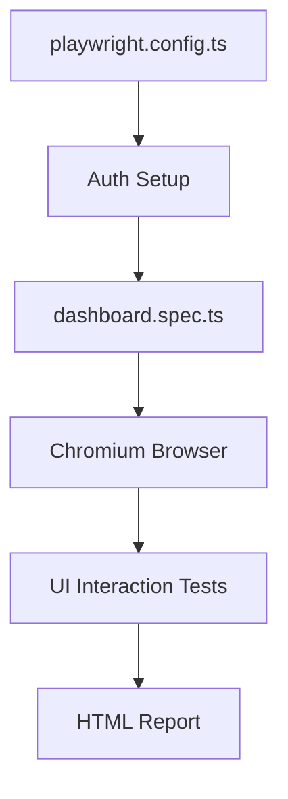

**Diagram sources**
- [playwright.config.ts:1-31](file://playwright.config.ts#L1-L31)
- [e2e/dashboard.spec.ts:1-46](file://e2e/dashboard.spec.ts#L1-L46)

**Section sources**
- [playwright.config.ts:1-31](file://playwright.config.ts#L1-L31)
- [e2e/dashboard.spec.ts:1-46](file://e2e/dashboard.spec.ts#L1-L46)

## Environment-Aware Deployment Process

### Manual Triggering and Environment Selection
The CD workflow now supports manual deployment with explicit environment selection:

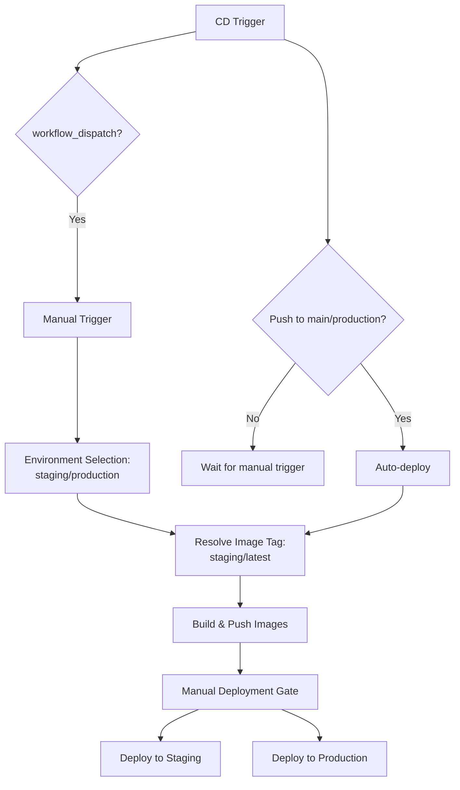

**Diagram sources**
- [.github/workflows/cd.yml:3-17](file://.github/workflows/cd.yml#L3-L17)
- [.github/workflows/cd.yml:24-49](file://.github/workflows/cd.yml#L24-L49)

### Improved Tagging Strategy
The resolve-tag job implements intelligent image tagging based on deployment context:

- **Production branch (production)**: Uses `latest` tag for production deployments
- **Other branches (main/staging)**: Uses `staging` tag for staging deployments  
- **Manual dispatch**: Uses user-selected environment for deployment
- **Consistent tagging**: All six microservices receive the same environment-specific tag

**Section sources**
- [.github/workflows/cd.yml:24-49](file://.github/workflows/cd.yml#L24-L49)

### Production Branch Testing
The CI workflow now validates changes across all major branches:
- **main**: Primary development branch with comprehensive testing
- **staging**: Integration branch with environment-specific validation
- **production**: Release branch with final validation before deployment

This ensures that production-ready code undergoes thorough testing before reaching production environments.

**Section sources**
- [.github/workflows/ci.yml:3-7](file://.github/workflows/ci.yml#L3-L7)

## Microservices Architecture

### LiveKit Video Conferencing Service
The LiveKit service provides WebRTC SFU (Selective Forwarding Unit) functionality for voice screening:
- Built from app/voice_agent/Dockerfile.livekit using livekit/livekit-server:latest base image
- Configured via app/voice_agent/livekit.yaml with SIP trunking for PSTN integration
- Exposes ports 7880 (WebSocket), 7881 (RTC), and 7882/udp (TURN)
- Supports outbound SIP calls through Twilio integration

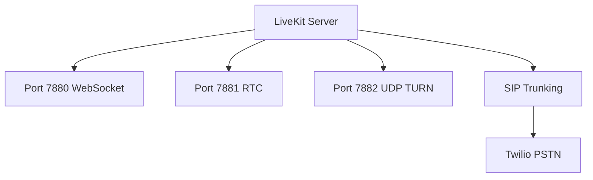

**Diagram sources**
- [app/voice_agent/Dockerfile.livekit:1-3](file://app/voice_agent/Dockerfile.livekit#L1-L3)
- [app/voice_agent/livekit.yaml:1-42](file://app/voice_agent/livekit.yaml#L1-L42)

**Section sources**
- [app/voice_agent/Dockerfile.livekit:1-3](file://app/voice_agent/Dockerfile.livekit#L1-L3)
- [app/voice_agent/livekit.yaml:1-42](file://app/voice_agent/livekit.yaml#L1-L42)

### Speech Service
The speech service provides CPU-optimized speech processing capabilities:
- Built from app/speech_service/Dockerfile with Python 3.11 slim base
- Implements STT (Parakeet TDT 1.1B), TTS (Kokoro 82M), and VAD (Silero VAD v5)
- Exposes REST endpoints: /stt/transcribe, /tts/synthesize, /vad/detect, /health
- Requires system dependencies: gcc, curl, libsndfile1
- Health checks with model warmup on startup

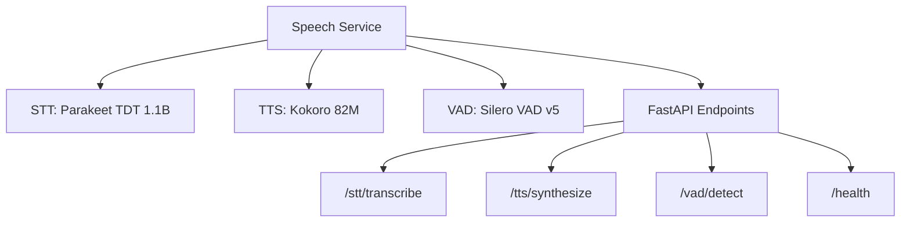

**Diagram sources**
- [app/speech_service/Dockerfile:1-32](file://app/speech_service/Dockerfile#L1-L32)
- [app/speech_service/main.py:1-387](file://app/speech_service/main.py#L1-L387)

**Section sources**
- [app/speech_service/Dockerfile:1-32](file://app/speech_service/Dockerfile#L1-L32)
- [app/speech_service/main.py:1-387](file://app/speech_service/main.py#L1-L387)

### Voice Agent Service
The voice agent orchestrates the complete voice screening conversation:
- Built from app/voice_agent/Dockerfile with Python 3.11 slim base
- Integrates LiveKit for WebRTC audio/video, Speech Service for audio processing, and Ollama Cloud for LLM
- Implements conversation state machine with 6 states: GREETING, CONSENT, INTRODUCTION, SCREENING, FOLLOW_UP, WRAP_UP, ANALYSIS, ENDED
- Provides HTTP dispatch API for creating LiveKit rooms and initiating SIP calls
- Includes LiveKit Agent Worker for audio processing and conversation management

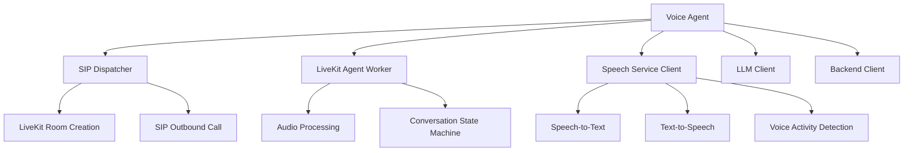

**Diagram sources**
- [app/voice_agent/Dockerfile:1-31](file://app/voice_agent/Dockerfile#L1-L31)
- [app/voice_agent/agent.py:1-883](file://app/voice_agent/agent.py#L1-L883)

**Section sources**
- [app/voice_agent/Dockerfile:1-31](file://app/voice_agent/Dockerfile#L1-L31)
- [app/voice_agent/agent.py:1-883](file://app/voice_agent/agent.py#L1-L883)

## Testing Strategy

### Multi-Level Testing Approach
The testing strategy encompasses multiple layers to ensure code quality and reliability:

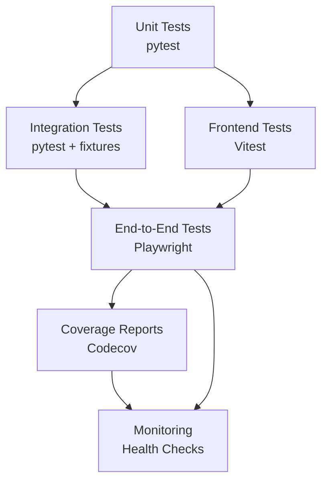

### Backend Testing Infrastructure
- Comprehensive test fixtures for database mocking and service isolation
- Coverage reporting with Codecov integration
- Mock implementations for external services (Ollama, Whisper, etc.)
- Database migration validation and model testing

### Frontend Testing Infrastructure
- Component-level testing with React Testing Library
- Integration testing with Vitest and jsdom
- Build validation and bundle testing
- Performance testing and accessibility validation

### End-to-End Testing Infrastructure
- Browser automation with Playwright for realistic user scenarios
- Authentication state management for production-like testing
- Cross-browser compatibility testing
- Performance and regression testing

**Section sources**
- [app/backend/tests/conftest.py:1-200](file://app/backend/tests/conftest.py#L1-L200)
- [app/frontend/package.json:1-44](file://app/frontend/package.json#L1-L44)
- [playwright.config.ts:1-31](file://playwright.config.ts#L1-L31)

## Deployment Orchestration

### Environment-Specific Configuration
The deployment system uses separate orchestration files for different environments:

#### Staging Environment (docker-compose.staging.yml)
- Uses `staging` image tag for all services
- Dedicated network and volume naming (`aria_staging_network`, `staging_*`)
- Separate Watchtower instance monitoring staging containers only
- Development-friendly resource allocation and debugging capabilities

#### Production Environment (docker-compose.prod.yml)
- Uses `latest` image tag for all services  
- Production-optimized resource allocation and security settings
- Separate Watchtower instance monitoring production containers only
- SSL certificate management with Certbot integration
- Production-specific database tuning and performance optimizations

#### Development Environment (docker-compose.yml)
- Local development with build directives for all services
- Simplified configuration for easy local testing
- Port mapping for direct service access
- Development-specific environment variables and debugging tools

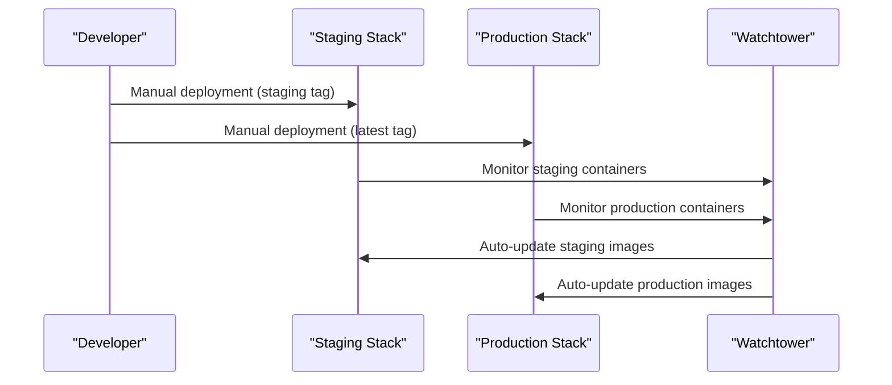

**Diagram sources**
- [docker-compose.staging.yml:156-180](file://docker-compose.staging.yml#L156-L180)
- [docker-compose.prod.yml:195-224](file://docker-compose.prod.yml#L195-L224)

**Section sources**
- [docker-compose.staging.yml:1-253](file://docker-compose.staging.yml#L1-L253)
- [docker-compose.prod.yml:1-314](file://docker-compose.prod.yml#L1-L314)
- [docker-compose.yml:1-180](file://docker-compose.yml#L1-L180)

### Zero-Downtime Deployment Strategy
- Watchtower monitors Docker Hub for image updates and automatically restarts containers
- Rolling restarts ensure minimal service disruption during updates
- Health checks verify service readiness before completing deployments
- Graceful shutdown handling prevents data loss during container restarts

### Manual Deployment Gates
- All deployments require explicit manual approval through GitHub Actions
- Environment selection provides clear visibility of deployment target
- Deployment summaries provide detailed information about deployed images and tags
- Rollback capability through manual redeployment of previous image versions

**Section sources**
- [.github/workflows/cd.yml:172-185](file://.github/workflows/cd.yml#L172-L185)
- [docker-compose.staging.yml:156-180](file://docker-compose.staging.yml#L156-L180)
- [docker-compose.prod.yml:195-224](file://docker-compose.prod.yml#L195-L224)

## Security and Compliance

### Security Scanning and Vulnerability Assessment
- Docker image scanning integrated with CI/CD pipeline
- Dependency vulnerability scanning for Python and npm packages
- Secret detection and prevention in code repositories
- Secure credential management through GitHub Secrets
- Network security through environment-specific firewall rules

### Compliance Requirements
- Data protection and privacy compliance for candidate information
- Audit logging and compliance reporting capabilities
- Access control and authentication enforcement
- Secure communication protocols (HTTPS/TLS) for all services
- Backup and disaster recovery procedures

### Production Security Measures
- SSL certificate management with automated renewal
- Network segmentation between staging and production environments
- Resource limits and quotas to prevent resource exhaustion attacks
- Regular security updates and patch management
- Monitoring and alerting for security events

**Section sources**
- [.github/workflows/cd.yml:101-105](file://.github/workflows/cd.yml#L101-L105)
- [docker-compose.prod.yml:226-233](file://docker-compose.prod.yml#L226-L233)

## Troubleshooting Guide

### Common CI/CD Issues and Resolutions

#### CI Failures
- **Backend test failures**: Verify Python dependencies installation and pytest configuration
- **Frontend test failures**: Confirm Node.js version and npm ci usage
- **Coverage upload failures**: Check Codecov token configuration and coverage report generation
- **Production branch validation**: Ensure production-specific tests pass before deployment

#### CD Failures
- **Environment resolution failures**: Verify workflow_dispatch inputs and branch detection logic
- **Image build failures**: Check Dockerfile syntax and dependency installation
- **Docker Hub authentication**: Validate Docker Hub credentials in GitHub Secrets
- **Tagging conflicts**: Ensure unique image tags for different environments

#### Deployment Issues
- **Service connectivity problems**: Verify docker-compose network configuration and port mappings
- **Watchtower update failures**: Check Docker Hub connectivity and image availability
- **Rolling update conflicts**: Monitor service health checks and graceful shutdown timing
- **Environment-specific issues**: Validate environment variables and resource allocation

#### Performance Optimization
- **Pipeline optimization**: Add job dependencies to prevent unnecessary parallel work
- **Cache optimization**: Enable Docker Buildx caching and npm dependency caching
- **Resource allocation**: Adjust CPU and memory limits based on service requirements
- **Monitoring and alerts**: Implement comprehensive logging and monitoring for all services

**Section sources**
- [.github/workflows/ci.yml:27-62](file://.github/workflows/ci.yml#L27-L62)
- [.github/workflows/cd.yml:50-185](file://.github/workflows/cd.yml#L50-L185)
- [scripts/run-full-tests.sh:1-256](file://scripts/run-full-tests.sh#L1-L256)

## Conclusion
The CI/CD setup for Resume AI provides robust automation for testing and deployment across multiple environments. The enhanced pipeline now supports environment-aware deployment with manual triggering, separate staging and production configurations, and comprehensive testing strategies. By leveraging multi-branch validation, environment-specific orchestration, and automated monitoring, teams can ensure reliable and secure deployments of the complete voice screening platform. The combination of unit, integration, and end-to-end testing, along with zero-downtime deployment strategies, provides confidence in delivering high-quality software updates consistently.