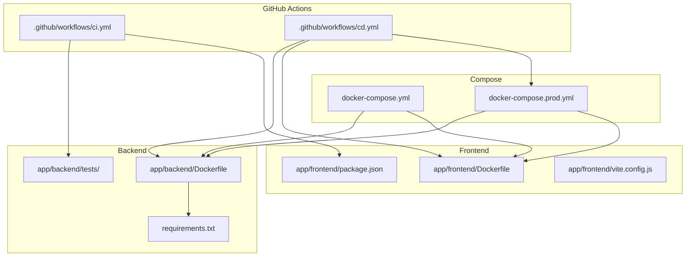
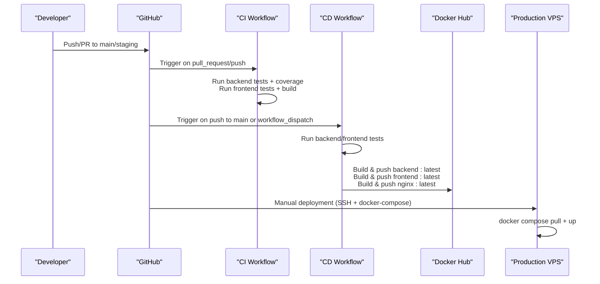
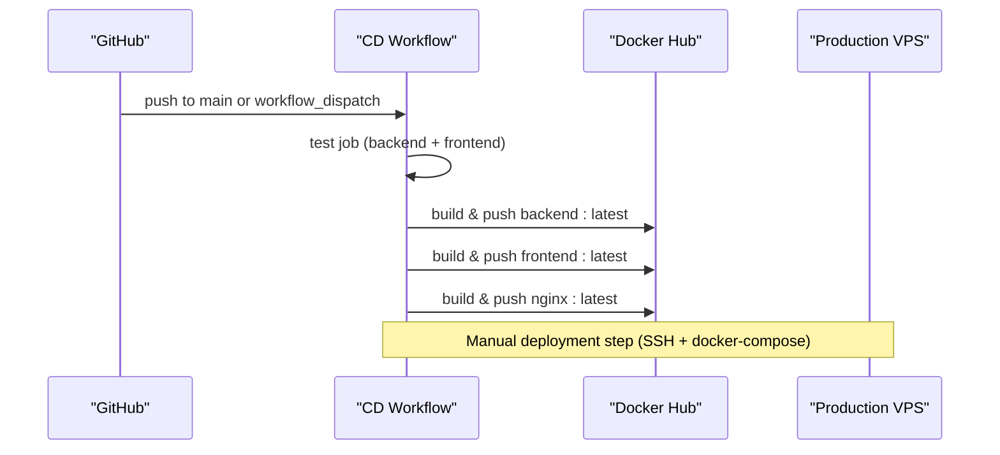
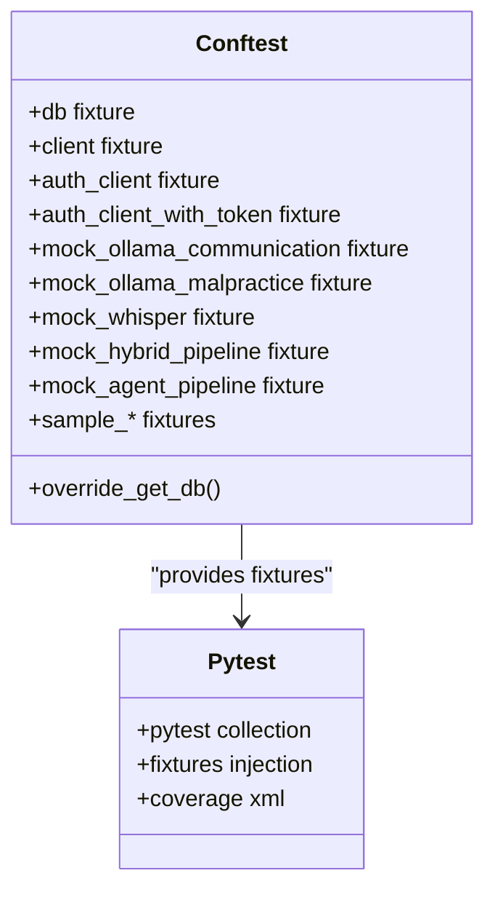
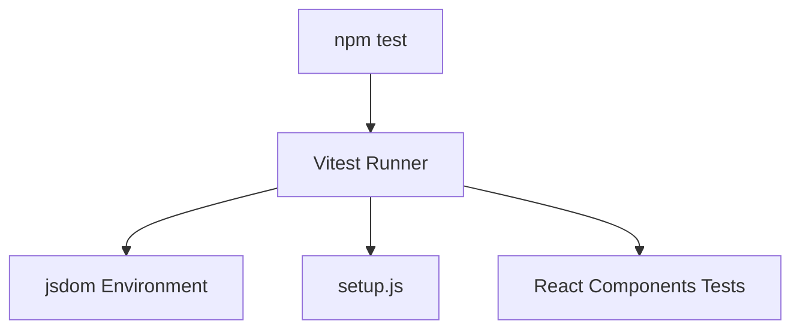
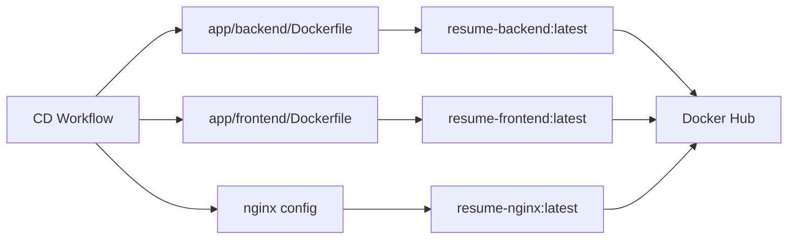
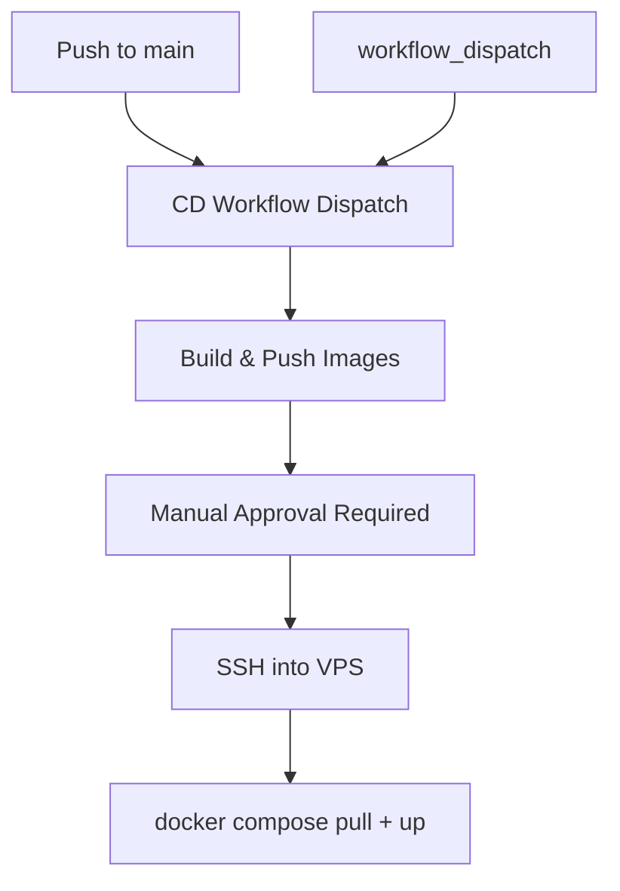
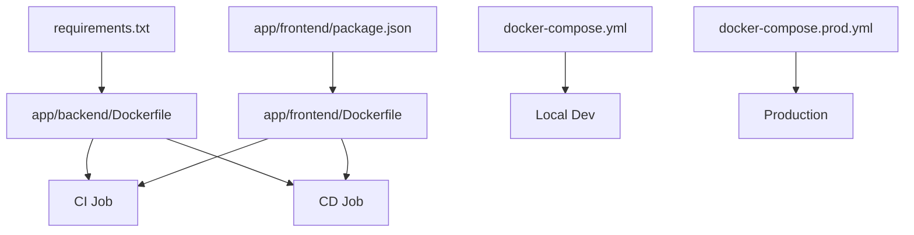

# CI/CD Pipelines

<cite>
**Referenced Files in This Document**
- [ci.yml](file://.github/workflows/ci.yml)
- [cd.yml](file://.github/workflows/cd.yml)
- [requirements.txt](file://requirements.txt)
- [app/backend/Dockerfile](file://app/backend/Dockerfile)
- [app/frontend/Dockerfile](file://app/frontend/Dockerfile)
- [docker-compose.yml](file://docker-compose.yml)
- [docker-compose.prod.yml](file://docker-compose.prod.yml)
- [app/backend/tests/conftest.py](file://app/backend/tests/conftest.py)
- [app/frontend/package.json](file://app/frontend/package.json)
- [app/frontend/vite.config.js](file://app/frontend/vite.config.js)
- [scripts/run-full-tests.sh](file://scripts/run-full-tests.sh)
- [scripts/pre-commit-check.ps1](file://scripts/pre-commit-check.ps1)
</cite>

## Table of Contents
1. [Introduction](#introduction)
2. [Project Structure](#project-structure)
3. [Core Components](#core-components)
4. [Architecture Overview](#architecture-overview)
5. [Detailed Component Analysis](#detailed-component-analysis)
6. [Dependency Analysis](#dependency-analysis)
7. [Performance Considerations](#performance-considerations)
8. [Troubleshooting Guide](#troubleshooting-guide)
9. [Conclusion](#conclusion)
10. [Appendices](#appendices)

## Introduction
This document describes the CI/CD pipelines for Resume AI by ThetaLogics, focusing on:
- Continuous Integration (CI) via GitHub Actions for automated testing and code quality checks
- Continuous Deployment (CD) via GitHub Actions for container image builds and publishing
- Test automation setup for backend (pytest) and frontend (Jest/Vitest)
- Build artifacts, container image publishing, and deployment triggers
- Pull request validation, branch protection alignment, and manual approval gates
- Troubleshooting failed builds, deployment rollbacks, and pipeline optimization
- Security scanning, vulnerability assessment, and compliance considerations

## Project Structure
The repository organizes CI/CD around GitHub Actions workflows, Docker-based services, and test suites:
- Workflows: .github/workflows/ci.yml (PR and push validation), .github/workflows/cd.yml (image build and publish)
- Backend: FastAPI application with Dockerfile, tests, and Alembic migrations
- Frontend: React application with Vite, Vitest, and Tailwind CSS
- Compose: Local development (docker-compose.yml) and production orchestration (docker-compose.prod.yml)
- Scripts: Pre-commit and full-test runners for local validation

**Diagram sources**
- [ci.yml:1-63](file://.github/workflows/ci.yml#L1-L63)
- [cd.yml:1-101](file://.github/workflows/cd.yml#L1-L101)
- [app/backend/Dockerfile:1-39](file://app/backend/Dockerfile#L1-L39)
- [app/frontend/Dockerfile:1-26](file://app/frontend/Dockerfile#L1-L26)
- [docker-compose.yml:1-101](file://docker-compose.yml#L1-L101)
- [docker-compose.prod.yml:1-227](file://docker-compose.prod.yml#L1-L227)
- [requirements.txt:1-48](file://requirements.txt#L1-L48)
- [app/frontend/package.json:1-41](file://app/frontend/package.json#L1-L41)
- [app/frontend/vite.config.js:1-26](file://app/frontend/vite.config.js#L1-L26)

**Section sources**
- [.github/workflows/ci.yml:1-63](file://.github/workflows/ci.yml#L1-L63)
- [.github/workflows/cd.yml:1-101](file://.github/workflows/cd.yml#L1-L101)
- [docker-compose.yml:1-101](file://docker-compose.yml#L1-L101)
- [docker-compose.prod.yml:1-227](file://docker-compose.prod.yml#L1-L227)

## Core Components
- CI workflow validates pull requests and pushes to main and staging by running backend and frontend tests.
- CD workflow builds and pushes backend, frontend, and nginx images to Docker Hub and documents a manual deployment process.
- Backend testing uses pytest with coverage reporting and shared fixtures for database, authentication, and service mocks.
- Frontend testing uses Vitest with jsdom and a dedicated setup file; package.json defines test scripts.
- Containerization uses multi-stage Dockerfiles for backend and frontend, with nginx serving the built frontend assets.

Key capabilities:
- Automated testing on PRs and pushes
- Coverage upload via Codecov
- Docker image publishing to Docker Hub
- Manual deployment gate via SSH and docker-compose commands
- Local pre-commit and full-test validation scripts

**Section sources**
- [.github/workflows/ci.yml:1-63](file://.github/workflows/ci.yml#L1-L63)
- [.github/workflows/cd.yml:1-101](file://.github/workflows/cd.yml#L1-L101)
- [app/backend/tests/conftest.py:1-589](file://app/backend/tests/conftest.py#L1-L589)
- [app/frontend/package.json:1-41](file://app/frontend/package.json#L1-L41)
- [app/frontend/vite.config.js:1-26](file://app/frontend/vite.config.js#L1-L26)
- [app/backend/Dockerfile:1-39](file://app/backend/Dockerfile#L1-L39)
- [app/frontend/Dockerfile:1-26](file://app/frontend/Dockerfile#L1-L26)

## Architecture Overview
The CI/CD architecture integrates GitHub Actions with Docker and deployment orchestration:

**Diagram sources**
- [ci.yml:1-63](file://.github/workflows/ci.yml#L1-L63)
- [cd.yml:1-101](file://.github/workflows/cd.yml#L1-L101)

## Detailed Component Analysis

### CI Workflow (.github/workflows/ci.yml)
- Triggers: pull_request and push to main and staging
- Jobs:
  - test-backend: sets up Python, installs dependencies (including pytest and pytest-cov), runs backend tests with coverage, uploads coverage to Codecov
  - test-frontend: sets up Node.js, installs npm dependencies, runs frontend tests, and builds the frontend

**Diagram sources**
- [ci.yml:1-63](file://.github/workflows/ci.yml#L1-L63)

**Section sources**
- [.github/workflows/ci.yml:1-63](file://.github/workflows/ci.yml#L1-L63)

### CD Workflow (.github/workflows/cd.yml)
- Triggers: push to main and workflow_dispatch
- Concurrency: cancels in-progress runs for the same ref
- Jobs:
  - test: runs backend and frontend tests to validate before building images
  - build-and-push: builds and pushes backend, frontend, and nginx images tagged as latest to Docker Hub
- Deployment: manual step described to SSH into VPS and run docker-compose commands to pull and start services

**Diagram sources**
- [cd.yml:1-101](file://.github/workflows/cd.yml#L1-L101)

**Section sources**
- [.github/workflows/cd.yml:1-101](file://.github/workflows/cd.yml#L1-L101)

### Backend Testing with Pytest
- Shared fixtures in conftest.py configure an in-memory SQLite database, dependency overrides, authentication tokens, and service mocks for Ollama and Whisper
- Tests run with pytest and coverage reporting; coverage XML is uploaded to Codecov

**Diagram sources**
- [app/backend/tests/conftest.py:1-589](file://app/backend/tests/conftest.py#L1-L589)

**Section sources**
- [app/backend/tests/conftest.py:1-589](file://app/backend/tests/conftest.py#L1-L589)
- [.github/workflows/ci.yml:27-37](file://.github/workflows/ci.yml#L27-L37)

### Frontend Testing with Vitest
- Package scripts define test commands using Vitest
- Vite config enables test environment with jsdom and a setup file
- Tests are organized under src/__tests__ and executed via npm test

**Diagram sources**
- [app/frontend/package.json:6-12](file://app/frontend/package.json#L6-L12)
- [app/frontend/vite.config.js:20-24](file://app/frontend/vite.config.js#L20-L24)

**Section sources**
- [app/frontend/package.json:1-41](file://app/frontend/package.json#L1-L41)
- [app/frontend/vite.config.js:1-26](file://app/frontend/vite.config.js#L1-L26)

### Container Image Publishing
- Backend image built from app/backend/Dockerfile and pushed as resume-backend:latest
- Frontend image built from app/frontend/Dockerfile and pushed as resume-frontend:latest
- Nginx image built from nginx directory and pushed as resume-nginx:latest
- Docker Hub credentials are supplied via GitHub secrets

**Diagram sources**
- [cd.yml:66-95](file://.github/workflows/cd.yml#L66-L95)
- [app/backend/Dockerfile:1-39](file://app/backend/Dockerfile#L1-L39)
- [app/frontend/Dockerfile:1-26](file://app/frontend/Dockerfile#L1-L26)

**Section sources**
- [.github/workflows/cd.yml:60-95](file://.github/workflows/cd.yml#L60-L95)
- [app/backend/Dockerfile:1-39](file://app/backend/Dockerfile#L1-L39)
- [app/frontend/Dockerfile:1-26](file://app/frontend/Dockerfile#L1-L26)

### Deployment Triggers and Manual Gates
- CD workflow triggers on push to main and supports manual dispatch
- Production deployment is documented as a manual SSH step to pull images and restart services with docker-compose
- No automatic production rollout is defined in the workflow; manual approval is required before deploying to production

**Diagram sources**
- [cd.yml:3-11](file://.github/workflows/cd.yml#L3-L11)
- [cd.yml:97-101](file://.github/workflows/cd.yml#L97-L101)

**Section sources**
- [.github/workflows/cd.yml:3-11](file://.github/workflows/cd.yml#L3-L11)
- [.github/workflows/cd.yml:97-101](file://.github/workflows/cd.yml#L97-L101)

### Pull Request Validation and Branch Protection Alignment
- CI validates PRs and pushes to main and staging
- Align branch protection rules with these branches to require successful CI runs before merging
- Use workflow_dispatch to re-run CD for hotfixes or emergency releases

**Section sources**
- [.github/workflows/ci.yml:3-7](file://.github/workflows/ci.yml#L3-L7)
- [.github/workflows/cd.yml:3-7](file://.github/workflows/cd.yml#L3-L7)

### Local Test Automation and Pre-commit Validation
- scripts/run-full-tests.sh performs comprehensive checks including Python syntax, test file syntax, imports, migrations, route registration, frontend file presence, and integration patterns
- scripts/pre-commit-check.ps1 enforces pre-commit checks on Windows, validating Python and frontend files, migrations, and integration patterns

**Section sources**
- [scripts/run-full-tests.sh:1-256](file://scripts/run-full-tests.sh#L1-L256)
- [scripts/pre-commit-check.ps1:1-183](file://scripts/pre-commit-check.ps1#L1-L183)

## Dependency Analysis
- Backend dependencies are declared in requirements.txt and installed during CI/CD jobs
- Frontend dependencies are managed via package.json and installed in CI/CD jobs
- Docker images encapsulate runtime environments and reduce CI/CD job variability
- Compose files define service dependencies and resource limits for local and production environments

**Diagram sources**
- [requirements.txt:1-48](file://requirements.txt#L1-L48)
- [app/frontend/package.json:1-41](file://app/frontend/package.json#L1-L41)
- [app/backend/Dockerfile:1-39](file://app/backend/Dockerfile#L1-L39)
- [app/frontend/Dockerfile:1-26](file://app/frontend/Dockerfile#L1-L26)
- [docker-compose.yml:1-101](file://docker-compose.yml#L1-L101)
- [docker-compose.prod.yml:1-227](file://docker-compose.prod.yml#L1-L227)

**Section sources**
- [requirements.txt:1-48](file://requirements.txt#L1-L48)
- [app/frontend/package.json:1-41](file://app/frontend/package.json#L1-L41)
- [docker-compose.yml:1-101](file://docker-compose.yml#L1-L101)
- [docker-compose.prod.yml:1-227](file://docker-compose.prod.yml#L1-L227)

## Performance Considerations
- Use caching for Python pip and npm to speed up CI/CD jobs
- Parallelize backend and frontend test jobs in CI
- Enable build cache for Docker Buildx in CD to reduce rebuild times
- Consider splitting large test suites into smaller batches for faster feedback
- Optimize docker-compose resource limits in production to balance performance and cost

[No sources needed since this section provides general guidance]

## Troubleshooting Guide
Common issues and resolutions:
- CI failures due to backend tests
  - Verify Python dependencies installation and pytest configuration
  - Check coverage report generation and Codecov upload
- CI failures due to frontend tests
  - Confirm Node.js version and npm ci usage
  - Review Vitest configuration and jsdom setup
- CD failures during image build/push
  - Validate Docker Hub credentials in secrets
  - Ensure Docker Buildx is enabled and cache is configured
- Deployment rollbacks
  - Manually SSH into VPS and run docker compose pull + up to redeploy previous images
  - Optionally tag images with timestamps for safer rollbacks
- Pipeline optimization
  - Add job dependencies to prevent unnecessary parallel work
  - Use matrix strategies for multi-version testing
  - Reduce Docker image sizes by pruning build dependencies

**Section sources**
- [.github/workflows/ci.yml:27-62](file://.github/workflows/ci.yml#L27-L62)
- [.github/workflows/cd.yml:50-95](file://.github/workflows/cd.yml#L50-L95)
- [scripts/run-full-tests.sh:1-256](file://scripts/run-full-tests.sh#L1-L256)

## Conclusion
The CI/CD setup for Resume AI provides robust automation for testing and image publishing, with a clear manual deployment gate for production. By aligning branch protection rules with workflow triggers, leveraging caching, and maintaining strong local validation scripts, teams can ensure reliable and secure deployments.

[No sources needed since this section summarizes without analyzing specific files]

## Appendices

### Security Scanning and Compliance
- Add static analysis and secret scanning in CI using tools compatible with GitHub Actions
- Integrate dependency scanning for Python and npm packages
- Enforce signed commits and required reviews for production merges
- Store Docker Hub credentials securely in GitHub Secrets

[No sources needed since this section provides general guidance]