# Deployment & DevOps

<cite>
**Referenced Files in This Document**
- [docker-compose.yml](file://docker-compose.yml)
- [docker-compose.prod.yml](file://docker-compose.prod.yml)
- [docker-compose.staging.yml](file://docker-compose.staging.yml)
- [docker-compose.portainer.yml](file://docker-compose.portainer.yml)
- [app/backend/Dockerfile](file://app/backend/Dockerfile)
- [app/frontend/Dockerfile](file://app/frontend/Dockerfile)
- [nginx/Dockerfile](file://nginx/Dockerfile)
- [app/frontend/default.conf](file://app/frontend/default.conf)
- [app/nginx/nginx.conf](file://app/nginx/nginx.conf)
- [app/nginx/nginx.prod.conf](file://app/nginx/nginx.prod.conf)
- [.github/workflows/ci.yml](file://.github/workflows/ci.yml)
- [.github/workflows/cd.yml](file://.github/workflows/cd.yml)
- [app/backend/scripts/docker-entrypoint.sh](file://app/backend/scripts/docker-entrypoint.sh)
- [app/backend/scripts/wait_for_ollama.py](file://app/backend/scripts/wait_for_ollama.py)
- [app/backend/main.py](file://app/backend/main.py)
- [app/backend/services/queue_manager.py](file://app/backend/services/queue_manager.py)
- [app/backend/routes/queue_api.py](file://app/backend/routes/queue_api.py)
- [deploy_queue_migration.sh](file://deploy_queue_migration.sh)
- [deploy_queue_migration.ps1](file://deploy_queue_migration.ps1)
- [requirements.txt](file://requirements.txt)
- [README.md](file://README.md)
- [app/speech_service/Dockerfile](file://app/speech_service/Dockerfile)
- [app/speech_service/main.py](file://app/speech_service/main.py)
- [app/speech_service/requirements.txt](file://app/speech_service/requirements.txt)
- [app/voice_agent/Dockerfile](file://app/voice_agent/Dockerfile)
- [app/voice_agent/Dockerfile.livekit](file://app/voice_agent/Dockerfile.livekit)
- [app/voice_agent/agent.py](file://app/voice_agent/agent.py)
- [app/voice_agent/livekit.yaml](file://app/voice_agent/livekit.yaml)
- [app/voice_agent/requirements.txt](file://app/voice_agent/requirements.txt)
- [app/backend/routes/voice.py](file://app/backend/routes/voice.py)
- [app/backend/services/voice_screening_service.py](file://app/backend/services/voice_screening_service.py)
- [app/backend/services/voice_call_scheduler.py](file://app/backend/services/voice_call_scheduler.py)
</cite>

## Update Summary
**Changes Made**
- Updated Watchtower auto-update configuration to include staging-livekit-sip service for improved deployment consistency
- Enhanced staging environment configuration with dedicated LiveKit SIP service container
- Added comprehensive LiveKit SIP trunking capabilities with Twilio integration
- Updated environment variable configuration for staging LiveKit API secrets with minimum 32-character requirements
- Enhanced voice screening microservices architecture with dedicated SIP service management

## Table of Contents
1. [Introduction](#introduction)
2. [Cloud-First Architecture](#cloud-first-architecture)
3. [Project Structure](#project-structure)
4. [Core Components](#core-components)
5. [Architecture Overview](#architecture-overview)
6. [Detailed Component Analysis](#detailed-component-analysis)
7. [Voice Screening Microservices](#voice-screening-microservices)
8. [LiveKit Integration](#livekit-integration)
9. [Speech Service Capabilities](#speech-service-capabilities)
10. [Voice Agent Orchestration](#voice-agent-orchestration)
11. [Queue System Implementation](#queue-system-implementation)
12. [Nginx SSL and Streaming Configuration](#nginx-ssl-and-streaming-configuration)
13. [CI/CD Pipeline Enhancements](#cicd-pipeline-enhancements)
14. [Migration System Support](#migration-system-support)
15. [DNS Resolution and Networking](#dns-resolution-and-networking)
16. [Environment Management](#environment-management)
17. [Production Deployment Strategy](#production-deployment-strategy)
18. [Staging Environment Configuration](#staging-environment-configuration)
19. [Portainer Integration](#portainer-integration)
20. [Volume Preservation Measures](#volume-preservation-measures)
21. [Standardized Naming Conventions](#standardized-naming-conventions)
22. [Dependency Analysis](#dependency-analysis)
23. [Performance Considerations](#performance-considerations)
24. [Troubleshooting Guide](#troubleshooting-guide)
25. [Conclusion](#conclusion)
26. [Appendices](#appendices)

## Introduction
This document provides comprehensive deployment and DevOps guidance for Resume AI by ThetaLogics with enhanced cloud-first approach and integrated voice screening capabilities. The platform now features a robust voice screening microservices architecture with LiveKit WebRTC SFU, speech processing services, and intelligent conversation orchestration. It covers Docker configuration for development, staging, and production environments, multi-container orchestration, voice service integration, SSL termination, environment variables and secrets management, monitoring and logging, health checks, maintenance, troubleshooting, rollback procedures, scaling, security hardening, backups, and disaster recovery.

**Updated** Enhanced with comprehensive voice screening microservices integration, LiveKit WebRTC SFU with 32-character API secret requirements, speech processing capabilities, automated CI/CD builds for all four core services, dedicated staging environment configuration with branch-based image tagging, improved production deployment with aria-production naming convention, enhanced port conflict prevention strategies, standardized volume preservation measures across all environments, **Updated** added staging-livekit-sip service to Watchtower auto-update configuration for improved deployment consistency, and comprehensive LiveKit SIP trunking capabilities with Twilio integration.

## Cloud-First Architecture
The Resume AI platform is designed with a cloud-first approach featuring a comprehensive voice screening microservices architecture. The architecture emphasizes:

- **Multi-Environment Deployment**: Separate staging and production environments with distinct naming conventions (aria-staging vs aria-production)
- **Microservices Architecture**: Separate services for backend processing, frontend delivery, voice screening, and speech processing
- **LiveKit WebRTC SFU**: Real-time communication infrastructure with SIP trunking for PSTN call handling and enhanced API security
- **Speech Processing Services**: Dedicated STT, TTS, and VAD capabilities for voice screening automation
- **Voice Agent Orchestration**: Intelligent conversation management with state tracking and LLM integration
- **Advanced Nginx Configuration**: SSL termination, rate limiting, and streaming optimizations
- **Automated CI/CD**: Four-service pipeline with Docker Hub integration for backend, frontend, speech-service, and voice-agent
- **Migration Management**: Automated database schema updates with rollback support
- **DNS Resolution**: Embedded DNS configuration for reliable container networking
- **Port Conflict Prevention**: Strategic port assignments to avoid conflicts in development and testing environments
- **Portainer Integration**: Production deployment management with dedicated stack naming
- **Volume Preservation**: Standardized naming conventions ensuring data persistence across environment switches
- **Network Isolation**: Dedicated network names for staging and production environments
- **SIP Trunking Integration**: Dedicated staging environment with Twilio SIP trunk configuration for PSTN call handling
- **Enhanced API Security**: Minimum 32-character LiveKit API secrets for all environments
- **Watchtower Auto-Update**: Comprehensive service monitoring with staging-livekit-sip included for deployment consistency

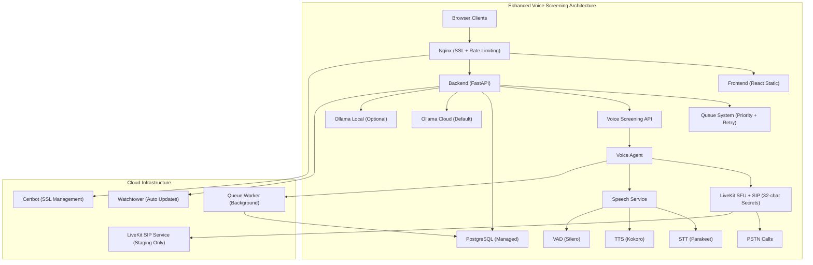

**Diagram sources**
- [docker-compose.yml:110-175](file://docker-compose.yml#L110-L175)
- [docker-compose.prod.yml:232-299](file://docker-compose.prod.yml#L232-L299)
- [app/backend/main.py:463-554](file://app/backend/main.py#L463-L554)
- [app/backend/services/queue_manager.py:189-215](file://app/backend/services/queue_manager.py#L189-L215)
- [docker-compose.staging.yml:197-225](file://docker-compose.staging.yml#L197-L225)

**Section sources**
- [README.md:208-224](file://README.md#L208-L224)
- [docker-compose.yml:110-175](file://docker-compose.yml#L110-L175)
- [docker-compose.prod.yml:232-299](file://docker-compose.prod.yml#L232-L299)

## Project Structure
The repository organizes the stack into six primary services plus supporting configurations, optimized for cloud deployment with comprehensive voice screening integration across multiple environments:

- **Development Environment** (docker-compose.yml): Local development with integrated voice services and port mapping 3000:8080 for frontend
- **Staging Environment** (docker-compose.staging.yml): Separate staging stack with aria-staging naming, dedicated resources, strategic port assignment 8081:80 for Nginx, isolated network (aria_staging_network), and **Updated** dedicated SIP trunk configuration with 32-character LiveKit API secrets for proper authentication, **Updated** added staging-livekit-sip service with comprehensive SIP trunking capabilities
- **Production Environment** (docker-compose.prod.yml): Production deployment with aria-production naming and enhanced resource allocation
- **Portainer Management** (docker-compose.portainer.yml): Production compose for Portainer orchestration
- **Backend service (FastAPI)** with enhanced cloud-native health checks, queue worker integration, and Ollama Cloud authentication
- **Frontend service (React)** built into Nginx static assets for optimal CDN delivery with port 8080 internally
- **Nginx reverse proxy** with cloud-optimized SSL termination, rate limiting, and streaming configuration, running on port 80 internally
- **LiveKit WebRTC SFU** with SIP trunking for PSTN call handling and real-time communication, now requiring 32-character API secrets
- **Speech Service** with STT, TTS, and VAD capabilities for voice processing
- **Voice Agent** with conversation orchestration, state management, and LLM integration
- **Queue system** with priority-based job scheduling, automatic retry, and worker monitoring
- **CI/CD workflows** for automated testing and cloud image publishing across all services
- **LiveKit SIP Service** with comprehensive SIP trunking capabilities for PSTN call handling in staging environment

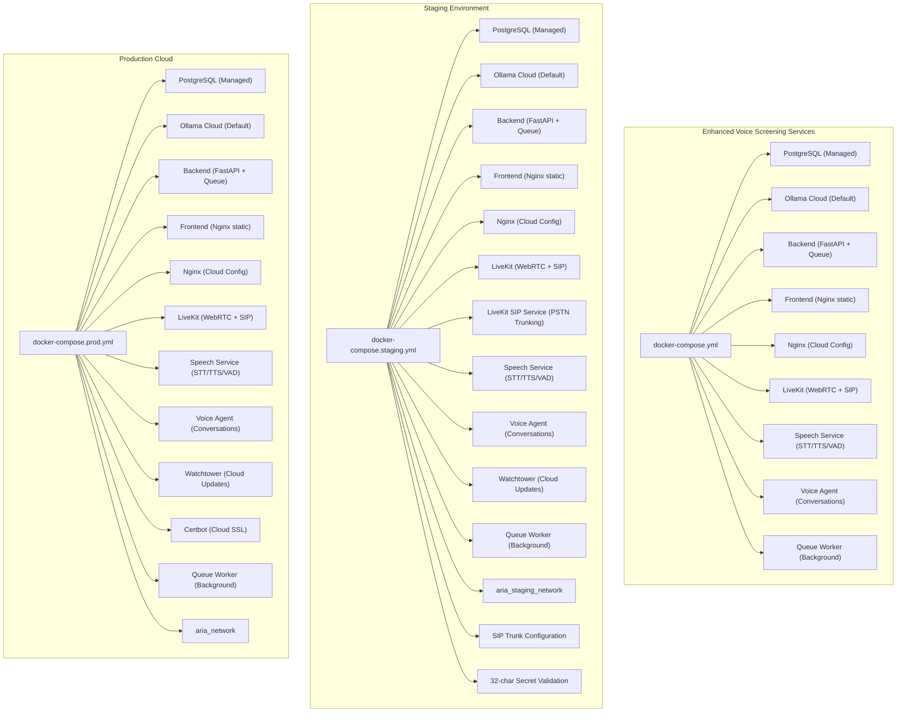

**Diagram sources**
- [docker-compose.yml:1-180](file://docker-compose.yml#L1-L180)
- [docker-compose.staging.yml:1-272](file://docker-compose.staging.yml#L1-L272)
- [docker-compose.prod.yml:1-318](file://docker-compose.prod.yml#L1-L318)
- [app/nginx/nginx.conf:1-45](file://app/nginx/nginx.conf#L1-L45)
- [app/nginx/nginx.prod.conf:1-110](file://app/nginx/nginx.prod.conf#L1-L110)

**Section sources**
- [README.md:231-251](file://README.md#L231-L251)
- [docker-compose.yml:1-180](file://docker-compose.yml#L1-L180)
- [docker-compose.staging.yml:1-272](file://docker-compose.staging.yml#L1-L272)
- [docker-compose.prod.yml:1-318](file://docker-compose.prod.yml#L1-L318)

## Core Components
- **Backend service**
  - FastAPI application with enhanced cloud-native health checks and Ollama Cloud authentication
  - Integrated queue worker for asynchronous job processing with priority scheduling
  - Automatic Ollama Cloud model loading and warmup for optimal performance
  - Comprehensive `/api/health/deep` endpoint for full dependency validation
  - Optimized with 6 workers and graceful shutdown handling for cloud environments
  - Voice screening API endpoints for call scheduling and session management
- **Frontend service**
  - React app built into static assets served by Nginx for CDN optimization
  - Multi-stage Dockerfile for efficient cloud production images
  - Internal port 8080 for container networking, mapped to host port 3000 in development
- **Nginx reverse proxy**
  - Cloud-optimized configuration with SSL termination, rate limiting, and streaming for SSE
  - Advanced security headers and performance optimizations
  - Health check passthrough to backend with cloud-native routing
  - Internal port 80 for container networking, mapped to host port 8081 in staging
- **LiveKit WebRTC SFU**
  - Real-time communication infrastructure with SIP trunking for PSTN call handling
  - TURN server support for NAT traversal
  - WebSocket and TCP/UDP transport protocols
  - Twilio SIP trunk integration for outbound PSTN calls
  - **Updated**: Enhanced API security with minimum 32-character secret requirements for all environments
- **LiveKit SIP Service**
  - **Updated**: Dedicated SIP service container for comprehensive PSTN call handling
  - SIP trunk management with Twilio integration
  - RTP port allocation for audio streaming
  - Redis-backed state management for SIP sessions
  - **Updated**: Included in Watchtower auto-update configuration for deployment consistency
- **Speech Service**
  - CPU-optimized STT (Parakeet TDT 1.1B), TTS (Kokoro 82M), and VAD (Silero VAD v5)
  - FastAPI application with model warmup on startup
  - Health check endpoint for model readiness validation
  - Streaming audio processing capabilities
- **Voice Agent**
  - LiveKit agents process for conversation orchestration
  - State machine for screening conversations (greeting → consent → screening → wrap-up)
  - Integration with Speech Service (STT/TTS/VAD) and Ollama Cloud (LLM)
  - HTTP dispatch API for backend integration
  - SIP outbound call initiation via Twilio with **Updated** staging-specific SIP configuration
- **Queue system**
  - Priority-based job scheduling with automatic retry and exponential backoff
  - Worker health monitoring and stale job recovery mechanisms
  - Comprehensive job tracking with metrics collection and progress reporting
- **Orchestration**
  - Local compose for development with cloud-first defaults
  - Staging compose with aria-staging naming and dedicated resources
  - Production compose optimized for cloud infrastructure with aria-production naming
  - Portainer-managed production setup with selective service deployment

**Updated** Enhanced backend service with integrated queue worker, voice screening API, and improved cloud-native Ollama Cloud integration. Added comprehensive voice screening microservices architecture with dedicated staging and production environments. Implemented strategic port conflict prevention with staging Nginx on port 8081 and development frontend on port 3000. Enhanced volume preservation measures with standardized naming conventions across all environments. **Updated** Added staging-livekit-sip service to Watchtower auto-update configuration for improved deployment consistency and comprehensive LiveKit SIP trunking capabilities with Twilio integration.

**Section sources**
- [app/backend/main.py:354-460](file://app/backend/main.py#L354-L460)
- [app/backend/scripts/docker-entrypoint.sh:1-20](file://app/backend/scripts/docker-entrypoint.sh#L1-L20)
- [app/backend/scripts/wait_for_ollama.py:1-108](file://app/backend/scripts/wait_for_ollama.py#L1-L108)
- [app/frontend/Dockerfile:1-35](file://app/frontend/Dockerfile#L1-L35)
- [nginx/Dockerfile:1-13](file://nginx/Dockerfile#L1-L13)
- [app/nginx/nginx.conf:1-45](file://app/nginx/nginx.conf#L1-L45)
- [app/nginx/nginx.prod.conf:1-110](file://app/nginx/nginx.prod.conf#L1-L110)
- [app/backend/services/queue_manager.py:189-215](file://app/backend/services/queue_manager.py#L189-L215)
- [app/speech_service/Dockerfile:1-32](file://app/speech_service/Dockerfile#L1-L32)
- [app/speech_service/main.py:1-387](file://app/speech_service/main.py#L1-L387)
- [app/voice_agent/Dockerfile:1-31](file://app/voice_agent/Dockerfile#L1-L31)
- [app/voice_agent/agent.py:1-800](file://app/voice_agent/agent.py#L1-L800)
- [docker-compose.staging.yml:197-225](file://docker-compose.staging.yml#L197-L225)

## Architecture Overview
The system uses a cloud-optimized reverse proxy (Nginx) with advanced SSL configuration to route traffic to the React frontend and FastAPI backend. The backend now includes integrated queue processing and voice screening APIs for scalable job management. PostgreSQL is managed as a cloud service, and Ollama Cloud provides scalable LLM inference. In production, Watchtower monitors images and auto-updates containers with zero-downtime rolling restarts, while Certbot manages SSL certificates for cloud domains. The voice screening architecture includes LiveKit WebRTC SFU for real-time communication, Speech Service for audio processing, and Voice Agent for conversation orchestration. The queue worker operates as a background service for asynchronous job processing.

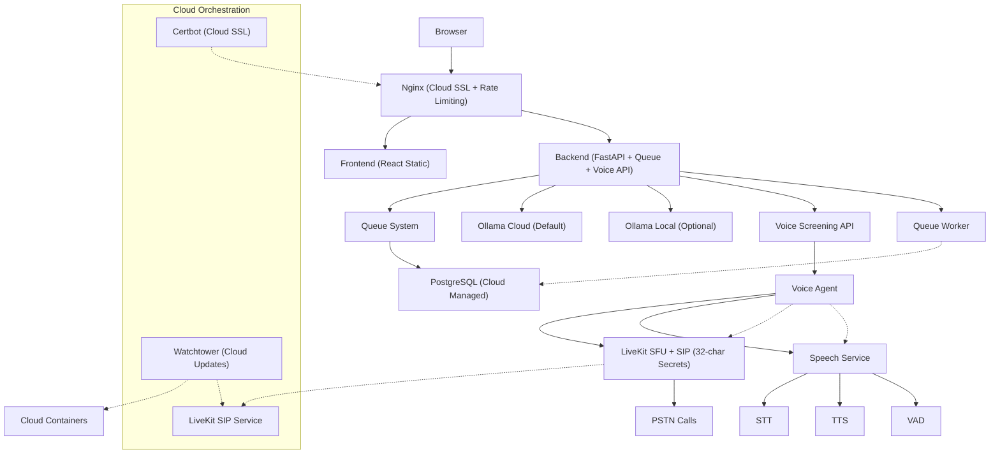

**Diagram sources**
- [app/nginx/nginx.prod.conf:1-110](file://app/nginx/nginx.prod.conf#L1-L110)
- [docker-compose.prod.yml:1-318](file://docker-compose.prod.yml#L1-L318)
- [docker-compose.staging.yml:197-225](file://docker-compose.staging.yml#L197-L225)

## Detailed Component Analysis

### Backend Service
- **Responsibilities**
  - Application lifecycle: database initialization, dependency checks, startup banner
  - Enhanced cloud-native health checks: shallow `/health` for container health and comprehensive `/api/health/deep` for full dependency validation
  - Streaming and non-streaming API routes with graceful shutdown support
  - Ollama Cloud authentication and model management
  - Integrated queue worker for asynchronous job processing
  - Voice screening API endpoints for call scheduling and session management
- **Startup flow**
  - Entrypoint runs migrations for PostgreSQL and waits for Ollama readiness before launching Uvicorn
  - Shallow health endpoint validates process is alive (fast <10ms)
  - Deep health endpoint reports database connectivity, Ollama sentinel state, and disk space
  - Cloud-native Ollama Cloud integration with automatic authentication
  - Background tasks for cleanup with proper shutdown handling
  - Queue worker initialization with priority-based job processing
- **Containerization**
  - Python slim image with system dependencies
  - Copies application code, Alembic migrations, and entrypoint scripts
  - Exposes port 8000; CMD overridden in production to use 6 workers with graceful shutdown

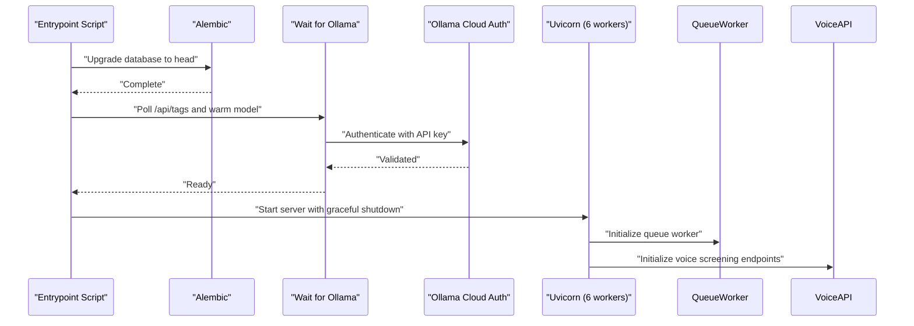

**Diagram sources**
- [app/backend/scripts/docker-entrypoint.sh:1-20](file://app/backend/scripts/docker-entrypoint.sh#L1-L20)
- [app/backend/scripts/wait_for_ollama.py:1-108](file://app/backend/scripts/wait_for_ollama.py#L1-L108)
- [app/backend/Dockerfile:1-49](file://app/backend/Dockerfile#L1-L49)

**Section sources**
- [app/backend/Dockerfile:1-49](file://app/backend/Dockerfile#L1-L49)
- [app/backend/scripts/docker-entrypoint.sh:1-20](file://app/backend/scripts/docker-entrypoint.sh#L1-L20)
- [app/backend/scripts/wait_for_ollama.py:1-108](file://app/backend/scripts/wait_for_ollama.py#L1-L108)
- [app/backend/main.py:354-460](file://app/backend/main.py#L354-L460)
- [app/backend/main.py:238-282](file://app/backend/main.py#L238-L282)

### Frontend Service
- **Responsibilities**
  - Build React app into static assets for optimal CDN delivery
  - Serve assets via Nginx in production with cloud optimization
- **Containerization**
  - Multi-stage build: Node builder produces dist assets, Nginx serves them
  - Default Nginx config copied into image; overridden by bind mount in production
  - Internal port 8080 for container networking

**Section sources**
- [app/frontend/Dockerfile:1-35](file://app/frontend/Dockerfile#L1-L35)
- [nginx/Dockerfile:1-13](file://nginx/Dockerfile#L1-L13)

### Nginx Reverse Proxy
- **Development**
  - Proxies frontend dev server and backend dev server on localhost
  - Frontend service mapped to host port 3000 for development access
- **Production**
  - Cloud-optimized SSL termination with Let's Encrypt and advanced security headers
  - Rate limiting for API endpoints with configurable zones and burst protection
  - Streaming-specific configuration for SSE to avoid buffering with proxy_buffering off
  - Health check passthrough to backend with cloud routing
  - Embedded DNS resolution for reliable container networking

**Updated** Enhanced Nginx configuration with strategic port assignments to prevent conflicts. Development environment uses port 3000:8080 mapping, while staging environment uses 8081:80 mapping to avoid conflicts with other services.

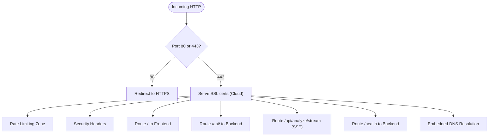

**Diagram sources**
- [app/nginx/nginx.prod.conf:1-110](file://app/nginx/nginx.prod.conf#L1-L110)

**Section sources**
- [app/nginx/nginx.conf:1-45](file://app/nginx/nginx.conf#L1-L45)
- [app/nginx/nginx.prod.conf:1-110](file://app/nginx/nginx.prod.conf#L1-L110)

### Orchestration and Services
- **Local development**
  - Compose defines services with explicit healthchecks and interdependencies
  - Cloud-first defaults with Ollama Cloud as default configuration
  - Frontend service mapped to host port 3000 for local access
  - Voice screening services included (LiveKit, speech-service, voice-agent)
- **Staging environment**
  - Separate stack from production with aria-staging naming convention
  - Dedicated container names, volumes, and networks to avoid collisions
  - Cloud-optimized resource limits and deploy constraints for CPU/memory
  - Watchtower auto-updates containers with zero-downtime rolling restarts, **Updated** including staging-livekit-sip service for comprehensive deployment consistency
  - Enhanced health checks for all services with cloud-native monitoring
  - Queue worker service for background job processing
  - Nginx service mapped to host port 8081 to avoid conflicts with development
  - Dedicated resource allocation for voice services (LiveKit: 1G, Speech Service: 3G, Voice Agent: 1G)
  - Isolated network (aria_staging_network) for environment separation
  - **Updated**: Healthchecks removed to facilitate stack deployment during debugging phases
  - **Updated**: Added pull_policy: always to all container images for fresh deployments
  - **Updated**: Added SIP_TRUNK_ID and SIP_OUTBOUND_NUMBER environment variables for Twilio SIP trunk integration
  - **Updated**: LiveKit API secrets now require minimum 32-character length for proper authentication
  - **Updated**: Added staging-livekit-sip service with comprehensive SIP trunking capabilities
- **Production**
  - Cloud-optimized resource limits and deploy constraints for CPU/memory
  - Watchtower auto-updates containers with zero-downtime rolling restarts
  - Certbot renewal loop with persistent volumes for cloud SSL
  - Enhanced health checks for all services with cloud-native monitoring
  - Queue worker service for background job processing
  - Dedicated resource allocation for voice services (LiveKit: 1G, Speech Service: 4G, Voice Agent: 2G)
  - Portainer-managed production setup with selective service deployment
  - Isolated network (aria_network) for production environment

**Updated** Enhanced orchestration with strategic port assignments to prevent conflicts. Development environment uses port 3000 for frontend access, while staging environment uses port 8081 for Nginx to avoid collisions with development services. Implemented standardized naming conventions with resume-screener- prefix for all containers and aria_network for production isolation. **Updated** Staging environment now removes healthcheck configurations from all services to facilitate stack deployment during debugging phases and adds pull_policy: always to all container images for fresh deployments. **Updated** Added staging-livekit-sip service to Watchtower auto-update configuration for improved deployment consistency and comprehensive LiveKit SIP trunking capabilities. **Updated** LiveKit API security now requires minimum 32-character secrets for all environments, with staging environment using 32-character secrets for proper authentication.

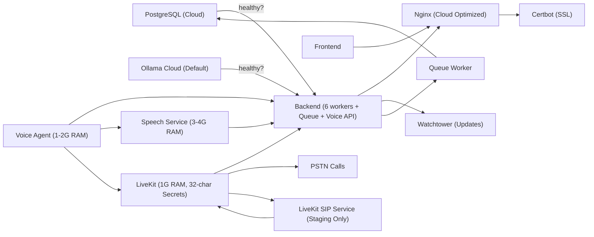

**Diagram sources**
- [docker-compose.yml:1-180](file://docker-compose.yml#L1-L180)
- [docker-compose.staging.yml:1-272](file://docker-compose.staging.yml#L1-L272)
- [docker-compose.prod.yml:1-318](file://docker-compose.prod.yml#L1-L318)

**Section sources**
- [docker-compose.yml:1-180](file://docker-compose.yml#L1-L180)
- [docker-compose.staging.yml:1-272](file://docker-compose.staging.yml#L1-L272)
- [docker-compose.prod.yml:1-318](file://docker-compose.prod.yml#L1-L318)

## Voice Screening Microservices

### LiveKit WebRTC SFU
The LiveKit service provides real-time communication infrastructure with SIP trunking capabilities:

- **WebRTC SFU**: Selective forwarding unit for efficient media distribution
- **SIP Trunking**: Twilio integration for outbound PSTN calls
- **TURN Server**: NAT traversal support for reliable connections
- **Transport Protocols**: WebSocket, TCP, and UDP for comprehensive connectivity
- **Configuration**: YAML-based configuration with port ranges and TURN settings
- **Health Monitoring**: Built-in health check endpoint for service validation
- **Enhanced Security**: **Updated**: Minimum 32-character API secrets required for all environments

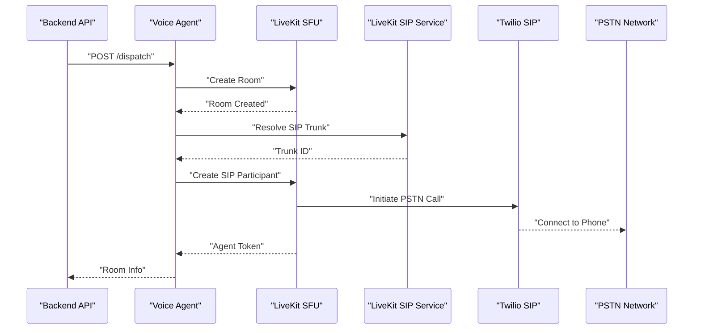

**Diagram sources**
- [app/voice_agent/agent.py:558-602](file://app/voice_agent/agent.py#L558-L602)
- [app/backend/services/voice_call_scheduler.py:180-211](file://app/backend/services/voice_call_scheduler.py#L180-L211)
- [docker-compose.staging.yml:197-225](file://docker-compose.staging.yml#L197-L225)

**Section sources**
- [app/voice_agent/Dockerfile.livekit:1-3](file://app/voice_agent/Dockerfile.livekit#L1-L3)
- [app/voice_agent/livekit.yaml:1-42](file://app/voice_agent/livekit.yaml#L1-L42)
- [app/voice_agent/agent.py:535-602](file://app/voice_agent/agent.py#L535-L602)
- [docker-compose.staging.yml:197-225](file://docker-compose.staging.yml#L197-L225)

### LiveKit SIP Service
**Updated**: The LiveKit SIP service provides comprehensive SIP trunking capabilities for PSTN call handling:

- **SIP Trunk Management**: Programmatic SIP trunk creation and management via LiveKit API
- **Twilio Integration**: Seamless integration with Twilio SIP trunk for outbound PSTN calls
- **RTP Port Allocation**: Dynamic RTP port range allocation (10000-20000) for audio streaming
- **Redis State Management**: Redis-backed session state management for SIP connections
- **WebSocket Communication**: LiveKit WebSocket integration for SIP service coordination
- **Node IP Configuration**: Flexible node IP configuration for VPS deployment scenarios
- **Logging and Debugging**: Configurable logging levels for troubleshooting and monitoring
- **Health Monitoring**: Built-in health check endpoint for service validation
- **Resource Optimization**: Lightweight resource allocation (0.5 CPUs, 512MB RAM) for efficient operation

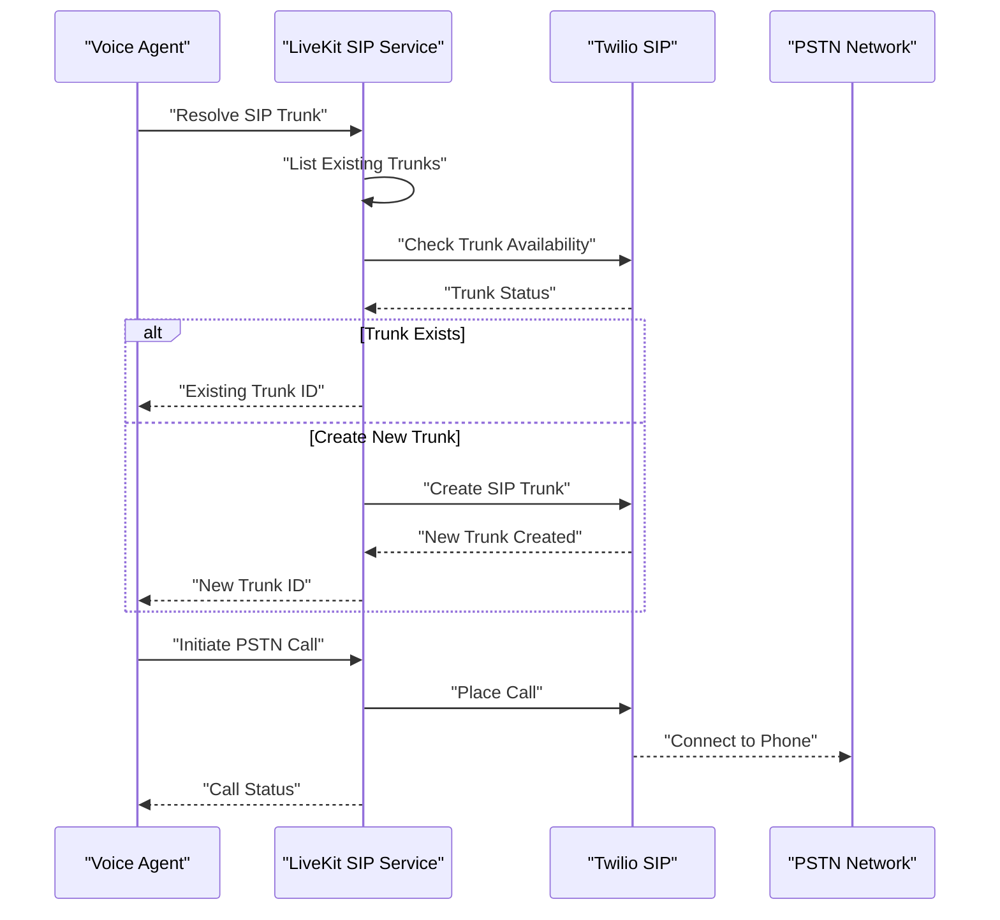

**Diagram sources**
- [app/voice_agent/agent.py:547-668](file://app/voice_agent/agent.py#L547-L668)
- [docker-compose.staging.yml:197-225](file://docker-compose.staging.yml#L197-L225)

**Section sources**
- [docker-compose.staging.yml:197-225](file://docker-compose.staging.yml#L197-L225)
- [app/voice_agent/agent.py:547-668](file://app/voice_agent/agent.py#L547-L668)

### Speech Service Capabilities
The Speech Service provides comprehensive audio processing capabilities:

- **STT (Speech-to-Text)**: Parakeet TDT 1.1B model for streaming transcription
- **TTS (Text-to-Speech)**: Kokoro 82M model for synthetic speech generation
- **VAD (Voice Activity Detection)**: Silero VAD v5 for speech segment detection
- **Model Warmup**: CPU-optimized model loading with pipeline initialization
- **Audio Processing**: Support for PCM, WAV, MP3, and OGG formats
- **Health Monitoring**: Model readiness validation and performance metrics

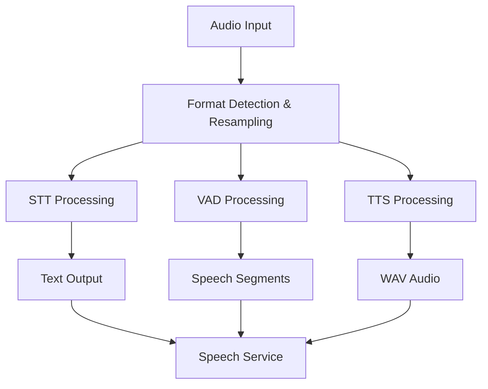

**Diagram sources**
- [app/speech_service/main.py:173-237](file://app/speech_service/main.py#L173-L237)
- [app/speech_service/main.py:309-374](file://app/speech_service/main.py#L309-L374)

**Section sources**
- [app/speech_service/Dockerfile:1-32](file://app/speech_service/Dockerfile#L1-L32)
- [app/speech_service/main.py:1-387](file://app/speech_service/main.py#L1-L387)
- [app/speech_service/requirements.txt:1-14](file://app/speech_service/requirements.txt#L1-L14)

### Voice Agent Orchestration
The Voice Agent manages end-to-end conversation orchestration:

- **Conversation State Machine**: Greeting → Consent → Introduction → Screening → Follow-up → Wrap-up → Analysis → Ended
- **LLM Integration**: Ollama Cloud for conversational intelligence
- **Audio Processing**: Seamless integration with Speech Service for STT/TTS/VAD
- **SIP Management**: LiveKit SIP integration for PSTN call handling with **Updated** staging-specific SIP configuration
- **Session Tracking**: Comprehensive transcript and assessment recording
- **Retry Logic**: Automatic retry mechanisms for failed calls
- **API Security**: **Updated**: LiveKit API authentication with 32-character secret validation

**Diagram sources**
- [app/voice_agent/agent.py:51-60](file://app/voice_agent/agent.py#L51-L60)

**Section sources**
- [app/voice_agent/Dockerfile:1-31](file://app/voice_agent/Dockerfile#L1-L31)
- [app/voice_agent/agent.py:1-800](file://app/voice_agent/agent.py#L1-L800)
- [app/voice_agent/requirements.txt:1-10](file://app/voice_agent/requirements.txt#L1-L10)

## Queue System Implementation
The platform now features a comprehensive queue system for scalable job processing with the following capabilities:

- **Priority-Based Scheduling**: Jobs are processed based on priority levels (1-10) with configurable poll intervals
- **Automatic Retry**: Exponential backoff retry mechanism with configurable delay patterns
- **Worker Health Monitoring**: Heartbeat tracking and stale job recovery for fault tolerance
- **Deduplication**: Input hashing prevents duplicate job processing
- **Metrics Collection**: Comprehensive performance tracking and error reporting
- **Background Processing**: Queue worker operates independently for non-blocking job execution

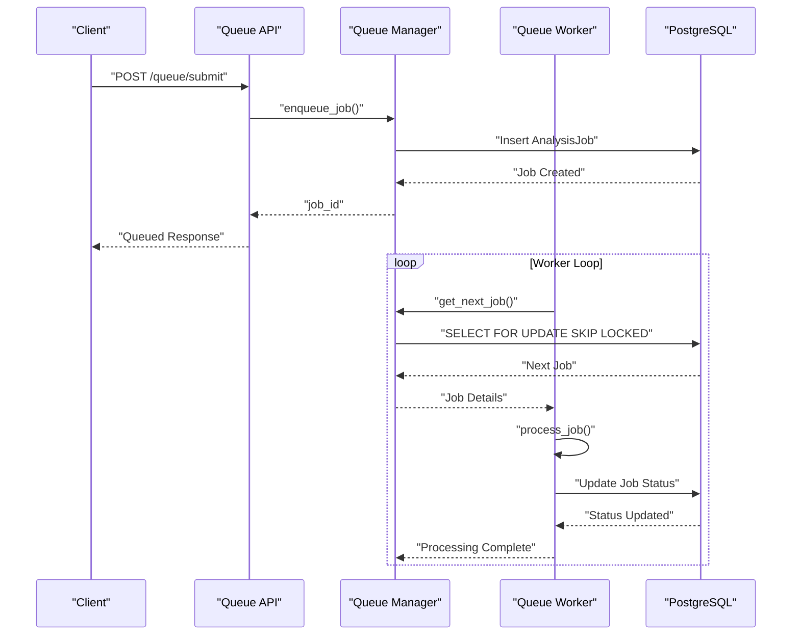

**Diagram sources**
- [app/backend/services/queue_manager.py:221-304](file://app/backend/services/queue_manager.py#L221-L304)
- [app/backend/services/queue_manager.py:526-562](file://app/backend/services/queue_manager.py#L526-L562)

**Section sources**
- [app/backend/services/queue_manager.py:189-215](file://app/backend/services/queue_manager.py#L189-L215)
- [app/backend/routes/queue_api.py:38-76](file://app/backend/routes/queue_api.py#L38-L76)
- [app/backend/services/queue_manager.py:349-496](file://app/backend/services/queue_manager.py#L349-L496)

## Nginx SSL and Streaming Configuration
The Nginx configuration has been significantly enhanced with advanced SSL support and streaming optimizations:

- **SSL Termination**: Cloud-native SSL configuration with Let's Encrypt integration
- **Rate Limiting**: Configurable rate limiting zones with burst protection for API endpoints
- **Security Headers**: Comprehensive security headers including HSTS, XSS protection, and CSP
- **Streaming Optimization**: Critical SSE streaming configuration with proxy_buffering off
- **DNS Resolution**: Embedded DNS configuration to handle container IP changes
- **Health Checks**: Dedicated health check endpoint routing to backend

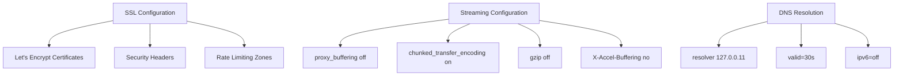

**Diagram sources**
- [app/nginx/nginx.prod.conf:27-102](file://app/nginx/nginx.prod.conf#L27-L102)

**Section sources**
- [app/nginx/nginx.prod.conf:1-110](file://app/nginx/nginx.prod.conf#L1-L110)
- [nginx/nginx.prod.conf:12-21](file://nginx/nginx.prod.conf#L12-L21)

## CI/CD Pipeline Enhancements
The CI/CD pipeline has been updated to support automated Docker builds for all four services with environment-specific image tagging:

- **CI Workflow**
  - Runs backend and frontend tests on PRs and pushes to main, staging, and production branches
  - Publishes coverage artifacts with cloud-native testing
- **CD Workflow**
  - Builds and pushes backend, frontend, Nginx, LiveKit, speech-service, and voice-agent images to Docker Hub
  - Provides manual trigger and cloud deployment steps
  - Supports environment-specific image tagging (staging vs production) based on branch selection
  - Enhanced deployment with dedicated resource allocation for voice services
  - **Updated**: Environment-specific image tagging with staging (staging tag) and production (latest tag) support

**Updated** Enhanced CI/CD pipeline with branch-based image tagging supporting both staging (staging tag) and production (latest tag) environments, enabling automated deployment to different environments based on branch selection.

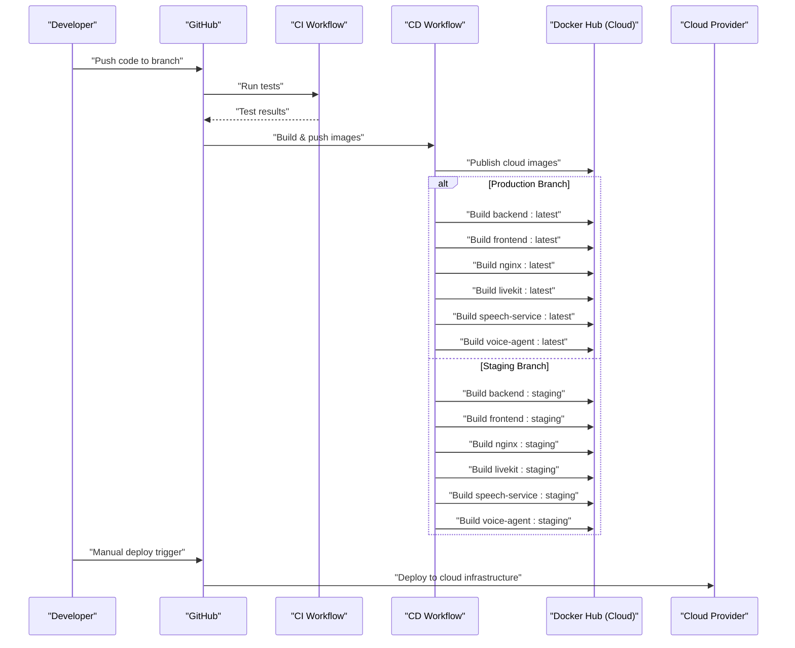

**Diagram sources**
- [.github/workflows/ci.yml:1-63](file://.github/workflows/ci.yml#L1-L63)
- [.github/workflows/cd.yml:1-185](file://.github/workflows/cd.yml#L1-L185)

**Section sources**
- [.github/workflows/ci.yml:1-63](file://.github/workflows/ci.yml#L1-L63)
- [.github/workflows/cd.yml:1-185](file://.github/workflows/cd.yml#L1-L185)

## Migration System Support
The platform now includes comprehensive migration system support with dedicated deployment scripts:

- **Database Migrations**: Alembic-based schema updates for queue system tables and voice screening models
- **Deployment Scripts**: Platform-specific scripts for Windows and Unix systems
- **Backup and Rollback**: Automated backup creation and rollback capabilities
- **Verification**: Post-migration table verification and structure validation

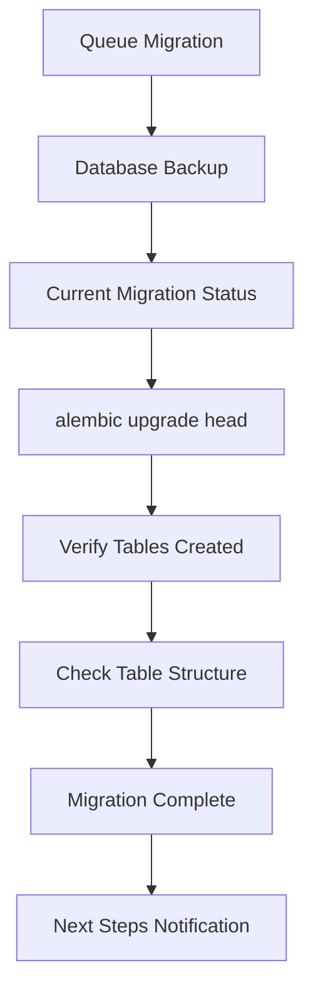

**Diagram sources**
- [deploy_queue_migration.sh:18-34](file://deploy_queue_migration.sh#L18-L34)

**Section sources**
- [deploy_queue_migration.sh:1-67](file://deploy_queue_migration.sh#L1-L67)
- [deploy_queue_migration.ps1:1-66](file://deploy_queue_migration.ps1#L1-L66)

## DNS Resolution and Networking
The platform implements advanced DNS resolution mechanisms for reliable container networking:

- **Embedded DNS**: Docker embedded DNS service configuration for dynamic hostname resolution
- **Resolver Configuration**: Custom resolver settings with 30-second cache and 5-second timeout
- **IPv6 Handling**: Explicit IPv6 disabling for Docker bridge network compatibility
- **Health Check Routing**: Dynamic upstream routing for health check endpoints
- **Container IP Changes**: Automatic DNS refresh to handle container recreation scenarios
- **Voice Service Networking**: Dedicated internal networks for voice microservices communication

**Section sources**
- [nginx/nginx.prod.conf:12-21](file://nginx/nginx.prod.conf#L12-L21)
- [app/nginx/nginx.prod.conf:36-41](file://app/nginx/nginx.prod.conf#L36-L41)

## Environment Management
The platform supports multiple deployment environments with distinct configurations and naming conventions:

- **Development Environment** (docker-compose.yml)
  - Local development with integrated voice services
  - Frontend service mapped to host port 3000 for local access
  - Default container naming without prefixes
  - Local Ollama integration for self-hosted inference
  - Standard resource allocation for development
  - **Updated**: LiveKit API secret requires minimum 11 characters (currently "devsecret")
- **Staging Environment** (docker-compose.staging.yml)
  - Separate staging stack with aria-staging naming convention
  - Dedicated container names with staging- prefix
  - Isolated volumes with staging_ prefix for data preservation
  - Dedicated network (aria_staging_network) for environment separation
  - Nginx service mapped to host port 8081 to prevent conflicts with development
  - Cloud-optimized resource limits and deploy constraints
  - Watchtower auto-updates with selective service targeting, **Updated** including staging-livekit-sip service for comprehensive deployment consistency
  - Enhanced health checks for all services
  - **Updated**: Healthchecks removed to facilitate stack deployment during debugging phases
  - **Updated**: Added pull_policy: always to all container images for fresh deployments
  - **Updated**: Added SIP_TRUNK_ID and SIP_OUTBOUND_NUMBER environment variables for Twilio SIP trunk integration
  - **Updated**: LiveKit API secret now requires minimum 32 characters ("staging_devsecret_min32chars_long_xyz")
  - **Updated**: Added staging-livekit-sip service with comprehensive SIP trunking capabilities
- **Production Environment** (docker-compose.prod.yml)
  - Production deployment with aria-production naming convention
  - Enhanced resource allocation for production workloads
  - Certbot integration for SSL certificate management
  - Production-specific health checks and monitoring
  - Isolated network (aria_network) for production environment
  - **Updated**: LiveKit API secret requires minimum 11 characters (currently "devsecret")
- **Portainer Management** (docker-compose.portainer.yml)
  - Production compose for Portainer orchestration
  - Mirrors production configuration with selective service deployment
  - Simplified environment variable management
  - **Updated**: LiveKit API secret requires minimum 11 characters (currently "devsecret")

**Updated** Enhanced environment management with dedicated staging environment featuring separate container naming (staging- prefix), isolated volumes and networks, environment-specific resource allocation for voice services, strategic port assignment to prevent conflicts, and standardized naming conventions for volume preservation. **Updated** Added staging-livekit-sip service to Watchtower auto-update configuration for improved deployment consistency and comprehensive LiveKit SIP trunking capabilities. **Updated** LiveKit API security now requires minimum 32-character secrets for staging environment and enhanced security validation across all environments.

**Section sources**
- [docker-compose.yml:1-180](file://docker-compose.yml#L1-L180)
- [docker-compose.staging.yml:1-272](file://docker-compose.staging.yml#L1-L272)
- [docker-compose.prod.yml:1-318](file://docker-compose.prod.yml#L1-L318)
- [docker-compose.portainer.yml:1-214](file://docker-compose.portainer.yml#L1-L214)

## Production Deployment Strategy
The production deployment follows a structured approach with enhanced naming conventions and resource allocation:

- **Stack Naming Convention**
  - Production stack named "aria-production" for clear identification
  - Staging stack named "aria-staging" for separation from production
  - Container names prefixed with resume-screener- for consistency
- **Resource Allocation**
  - PostgreSQL: 6GB RAM with tuned parameters for 48GB server
  - Ollama: 8GB RAM with optimized parallel processing
  - Backend: 6GB RAM with 6 workers for concurrent processing
  - Nginx: 256MB RAM for lightweight reverse proxy
  - LiveKit: 1GB RAM for WebRTC SFU and SIP handling
  - Speech Service: 4GB RAM for CPU-only STT/TTS/VAD processing
  - Voice Agent: 2GB RAM for conversation orchestration
- **Deployment Automation**
  - Watchtower configured for rolling restarts with 60-second intervals
  - Certbot integration for automatic SSL certificate renewal
  - Environment-specific image tagging (latest for production)
- **Monitoring and Health Checks**
  - Comprehensive health check endpoints for all services
  - Service-specific monitoring with Docker Compose healthchecks
  - Production-specific deep health validation
- **Network Isolation**
  - Production network named "aria_network" for environment separation
  - Volume preservation through standardized naming conventions
- **Enhanced API Security**
  - **Updated**: LiveKit API secrets validated for minimum 11-character length
  - Production environment uses secure secret management
  - API authentication with enhanced security validation

**Updated** Enhanced production deployment with aria-production naming convention, dedicated resource allocation for voice services, improved CI/CD integration with branch-based image tagging, and standardized volume preservation measures with resume-screener- prefix for all containers. **Updated** LiveKit API security now includes minimum character length validation across all environments.

**Section sources**
- [docker-compose.prod.yml:1-318](file://docker-compose.prod.yml#L1-L318)

## Staging Environment Configuration
The staging environment provides a separate deployment environment with dedicated resources and naming conventions:

- **Stack Isolation**
  - Separate stack from production with aria-staging naming
  - Dedicated container names with staging- prefix
  - Isolated volumes with staging_ prefix for data preservation
  - Isolated network (aria_staging_network) to prevent collisions
- **Resource Allocation**
  - PostgreSQL: 2GB RAM with tuned parameters for staging workload
  - Ollama: 6GB RAM with optimized parallel processing for staging
  - Backend: 3GB RAM with 3 workers for reduced production load
  - LiveKit: 1GB RAM for WebRTC SFU and SIP handling
  - **Updated**: LiveKit SIP Service: 512MB RAM for comprehensive SIP trunking
  - Speech Service: 3GB RAM for CPU-only STT/TTS/VAD processing
  - Voice Agent: 1GB RAM for conversation orchestration
- **Deployment Management**
  - Watchtower configured for staging containers only, **Updated** including staging-livekit-sip service for comprehensive deployment consistency
  - Environment-specific image tagging (staging for staging)
  - Selective service deployment with targeted restarts
  - Nginx service mapped to host port 8081 to avoid conflicts
- **Operational Benefits**
  - Safe testing of new features before production deployment
  - Independent resource allocation for staging workloads
  - Separate monitoring and health checking for staging services
  - Volume preservation through standardized naming conventions
- **Debugging Enhancements**
  - **Updated**: Healthchecks removed from all services to facilitate stack deployment during debugging phases
  - **Updated**: Added pull_policy: always to all container images for fresh deployments
  - **Updated**: Added SIP_TRUNK_ID and SIP_OUTBOUND_NUMBER environment variables for Twilio SIP trunk integration
- **SIP Trunk Configuration**
  - **Updated**: SIP_TRUNK_ID environment variable set to "twilio-aria" for staging
  - **Updated**: SIP_OUTBOUND_NUMBER environment variable set to "+18722789563" for staging
  - **Updated**: LiveKit configuration includes Twilio SIP trunk with matching trunk name
  - **Updated**: Voice Agent uses staging-specific SIP configuration for PSTN call handling
  - **Updated**: LiveKit SIP Service provides comprehensive SIP trunking capabilities
- **Enhanced API Security**
  - **Updated**: LiveKit API secret now requires minimum 32 characters for proper authentication
  - **Updated**: STAGING_LIVEKIT_API_SECRET uses "staging_devsecret_min32chars_long_xyz" (32 characters)
  - **Updated**: STAGING_LIVEKIT_API_KEY uses "staging_devkey" for proper key association
  - **Updated**: LiveKit YAML configuration includes 32-character secrets for development and staging

**Updated** Comprehensive staging environment with dedicated docker-compose.staging.yml featuring separate container naming, volume isolation, network separation, environment-specific resource allocation for voice services, strategic port assignment 8081:80 to prevent conflicts with development services, standardized naming conventions for volume preservation, enhanced debugging capabilities through healthcheck removal and fresh image deployment policies, **Updated** added staging-livekit-sip service to Watchtower auto-update configuration for improved deployment consistency, and **Updated** dedicated SIP trunk configuration with Twilio integration for PSTN call handling. **Updated** LiveKit API security now requires minimum 32-character secrets for proper authentication.

**Section sources**
- [docker-compose.staging.yml:1-272](file://docker-compose.staging.yml#L1-L272)

## Portainer Integration
The platform includes comprehensive Portainer integration for production deployment management:

- **Stack Configuration**
  - Production stack named "aria-production" for Portainer identification
  - Mirrored production compose with simplified service selection
  - Network isolation with aria_network for container communication
- **Service Management**
  - Selective service deployment through Portainer interface
  - Volume management for persistent data storage with resume-screener- prefix
  - Environment variable configuration through Portainer UI
- **Operational Benefits**
  - Web-based deployment management without command-line access
  - Visual monitoring of container health and resource usage
  - Simplified rollback and update procedures through Portainer UI
- **Integration Features**
  - Docker socket integration for container management
  - SSL certificate management through Portainer volumes
  - Health check monitoring and alerting through Portainer interface
- **Enhanced API Security**
  - **Updated**: LiveKit API secrets validated for minimum 11-character length
  - **Updated**: Production environment uses secure secret management through Portainer

**Section sources**
- [docker-compose.portainer.yml:1-214](file://docker-compose.portainer.yml#L1-L214)

## Volume Preservation Measures

### Standardized Naming Conventions
The platform implements comprehensive volume preservation measures through standardized naming conventions:

- **Production Environment Volumes**
  - `postgres_data`: PostgreSQL data volume for production
  - `ollama_data`: Ollama model data volume for production
  - `certbot_certs`: SSL certificate storage for production
  - `certbot_www`: SSL certificate web root for production
- **Staging Environment Volumes**
  - `staging_postgres_data`: PostgreSQL data volume for staging
  - `staging_ollama_data`: Ollama model data volume for staging
- **Development Environment Volumes**
  - `postgres_data`: PostgreSQL data volume for development
  - `ollama_data`: Ollama model data volume for development

### Volume Isolation Strategy
- **Environment-Specific Volumes**: Each environment maintains separate volume namespaces to prevent data collisions
- **Container Name Prefixes**: All containers use resume-screener- prefix for consistent identification
- **Network Separation**: Staging uses aria_staging_network while production uses aria_network
- **Port Isolation**: Strategic port assignments prevent service conflicts (development: 3000, staging: 8081, production: 80)

### Data Persistence Guarantees
- **Volume Mounting**: All persistent data is mounted to named volumes for container recreation safety
- **Model Caching**: Ollama models are cached in named volumes to eliminate cold-start delays
- **Certificate Storage**: SSL certificates are persisted across container restarts
- **Database Integrity**: PostgreSQL data is preserved through volume mounting for disaster recovery

**Updated** Enhanced volume preservation measures with standardized naming conventions across all Docker Compose files. Implemented resume-screener- prefix for all container names and aria_network for production isolation. Added staging-specific volume naming (staging_ prefix) and network isolation (aria_staging_network) to ensure complete environment separation and data persistence. **Updated** LiveKit API security now includes minimum character length validation for all environment-specific secrets.

**Section sources**
- [docker-compose.yml:177-180](file://docker-compose.yml#L177-L180)
- [docker-compose.staging.yml:264-267](file://docker-compose.staging.yml#L264-L267)
- [docker-compose.prod.yml:308-313](file://docker-compose.prod.yml#L308-L313)
- [docker-compose.portainer.yml:204-209](file://docker-compose.portainer.yml#L204-L209)

## Standardized Naming Conventions

### Container Naming Standards
The platform enforces standardized container naming conventions for consistent environment management:

- **Production Containers**: All containers prefixed with `resume-screener-`
  - `resume-screener-postgres`: PostgreSQL database
  - `resume-screener-ollama`: Ollama inference service
  - `resume-screener-backend`: Main application backend
  - `resume-screener-frontend`: Static frontend service
  - `resume-screener-nginx`: Reverse proxy service
  - `resume-screener-speech-service`: Speech processing service
  - `resume-screener-voice-agent`: Voice screening agent
  - `resume-screener-livekit`: WebRTC SFU service
  - `resume-screener-watchtower`: Auto-update service
  - `resume-screener-certbot`: SSL certificate management
  - `resume-screener-ollama-warmup`: Model warmup service
- **Staging Containers**: All containers prefixed with `staging-`
  - `staging-postgres`: Staging PostgreSQL database
  - `staging-ollama`: Staging Ollama service
  - `staging-backend`: Staging backend service
  - `staging-frontend`: Staging frontend service
  - `staging-nginx`: Staging reverse proxy
  - `staging-speech-service`: Staging speech service
  - `staging-voice-agent`: Staging voice agent
  - `staging-livekit`: Staging LiveKit service
  - `staging-livekit-sip`: Staging LiveKit SIP service
  - `staging-watchtower`: Staging auto-update service

### Network Naming Standards
- **Production Network**: `aria_network` for complete environment isolation
- **Staging Network**: `aria_staging_network` for staging environment separation
- **Default Bridge**: Both environments use bridge driver for container networking

### Volume Naming Standards
- **Production Volumes**: Direct naming without prefixes (`postgres_data`, `ollama_data`)
- **Staging Volumes**: Prefixed with `staging_` (`staging_postgres_data`, `staging_ollama_data`)
- **Portainer Volumes**: Mirrors production naming for consistency

### Port Assignment Standards
- **Development Environment**: 
  - Frontend: 3000:8080 (host:container)
  - Backend: 8000:8000
  - Nginx: 80:80, 443:443
- **Staging Environment**:
  - Frontend: 3000:8080
  - Backend: 8000:8000
  - Nginx: 8081:80 (host:container to prevent conflicts)
- **Production Environment**:
  - Frontend: 3000:8080
  - Backend: 8000:8000
  - Nginx: 80:80, 443:443

**Updated** Implemented comprehensive standardized naming conventions across all Docker Compose files. All containers now use resume-screener- prefix for production and staging- prefix for staging environments. Network isolation achieved through aria_network and aria_staging_network naming. Volume preservation ensured through standardized naming conventions with staging_ prefix for staging environment data. **Updated** Added staging-livekit-sip service to the naming convention standards and included in Watchtower auto-update configuration for improved deployment consistency. **Updated** LiveKit API security now includes minimum character length validation for all environment-specific secrets.

**Section sources**
- [docker-compose.yml:7-8](file://docker-compose.yml#L7-L8)
- [docker-compose.yml:25-26](file://docker-compose.yml#L25-L26)
- [docker-compose.yml:56-57](file://docker-compose.yml#L56-L57)
- [docker-compose.yml:85-86](file://docker-compose.yml#L85-L86)
- [docker-compose.yml:95-96](file://docker-compose.yml#L95-L96)
- [docker-compose.yml:118-119](file://docker-compose.yml#L118-L119)
- [docker-compose.yml:142-143](file://docker-compose.yml#L142-L143)
- [docker-compose.yml:152-153](file://docker-compose.yml#L152-L153)
- [docker-compose.yml:119](file://docker-compose.yml#L119)
- [docker-compose.yml:143](file://docker-compose.yml#L143)
- [docker-compose.yml:153](file://docker-compose.yml#L153)
- [docker-compose.staging.yml:14-15](file://docker-compose.staging.yml#L14-L15)
- [docker-compose.staging.yml:43-44](file://docker-compose.staging.yml#L43-L44)
- [docker-compose.staging.yml:68-69](file://docker-compose.staging.yml#L68-L69)
- [docker-compose.staging.yml:100-101](file://docker-compose.staging.yml#L100-L101)
- [docker-compose.staging.yml:113-114](file://docker-compose.staging.yml#L113-L114)
- [docker-compose.staging.yml:184-185](file://docker-compose.staging.yml#L184-L185)
- [docker-compose.staging.yml:209-210](file://docker-compose.staging.yml#L209-L210)
- [docker-compose.staging.yml:219-220](file://docker-compose.staging.yml#L219-L220)
- [docker-compose.prod.yml:13-14](file://docker-compose.prod.yml#L13-L14)
- [docker-compose.prod.yml:45-46](file://docker-compose.prod.yml#L45-L46)
- [docker-compose.prod.yml:81-82](file://docker-compose.prod.yml#L81-L82)
- [docker-compose.prod.yml:124-125](file://docker-compose.prod.yml#L124-L125)
- [docker-compose.prod.yml:136-137](file://docker-compose.prod.yml#L136-L137)
- [docker-compose.prod.yml:240-241](file://docker-compose.prod.yml#L240-L241)
- [docker-compose.prod.yml:267-268](file://docker-compose.prod.yml#L267-L268)
- [docker-compose.prod.yml:279-280](file://docker-compose.prod.yml#L279-L280)

## Dependency Analysis
- **Internal dependencies**
  - Backend depends on PostgreSQL and Ollama Cloud; healthchecks enforce startup order
  - Frontend depends on backend for API; Nginx depends on both
  - Queue worker depends on database for job processing
  - Voice Agent depends on LiveKit, Speech Service, and Backend
  - LiveKit depends on Twilio SIP configuration
  - Speech Service depends on model availability
  - **Updated**: LiveKit SIP Service depends on LiveKit and Redis for SIP trunk management
  - Cloud-native dependencies optimized for managed services
  - **Updated**: LiveKit API security depends on proper secret validation
- **External dependencies**
  - Docker images for Python, Node, Nginx, PostgreSQL (managed), Ollama Cloud, Certbot, Watchtower
  - GitHub Actions for CI/CD and Docker Hub for cloud image storage
  - Twilio for PSTN call handling
- **Runtime dependencies**
  - Ollama Cloud models managed automatically; authentication handled via API keys
  - Database migrations applied on backend startup to managed PostgreSQL
  - Background tasks require proper shutdown handling for cloud environments
  - Queue worker requires database connectivity for job processing
  - Voice services require proper model warmup and health validation
  - **Updated**: LiveKit SIP Service requires Redis for state management
  - **Updated**: LiveKit API authentication requires minimum 32-character secret validation

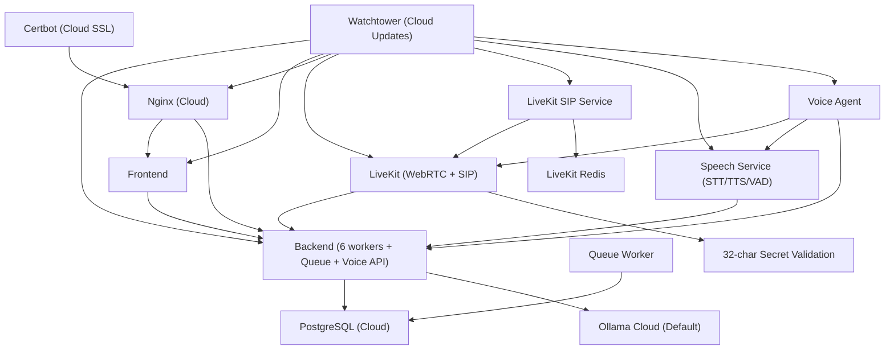

**Diagram sources**
- [docker-compose.prod.yml:1-318](file://docker-compose.prod.yml#L1-L318)
- [docker-compose.staging.yml:197-225](file://docker-compose.staging.yml#L197-L225)

**Section sources**
- [docker-compose.yml:110-175](file://docker-compose.yml#L110-L175)
- [docker-compose.prod.yml:232-299](file://docker-compose.prod.yml#L232-L299)
- [app/backend/scripts/wait_for_ollama.py:34-91](file://app/backend/scripts/wait_for_ollama.py#L34-L91)

## Performance Considerations
- **Backend concurrency**
  - Production sets 6 Uvicorn workers to handle I/O-bound tasks efficiently in cloud environments
  - Graceful shutdown timeout of 30 seconds allows background tasks to complete
- **Voice Service optimization**
  - LiveKit: 1GB RAM allocation for WebRTC SFU and SIP handling
  - **Updated**: LiveKit SIP Service: 512MB RAM allocation for comprehensive SIP trunking
  - Speech Service: 3-4GB RAM allocation for CPU-only STT/TTS/VAD processing
  - Voice Agent: 1-2GB RAM allocation for conversation orchestration
  - Model warmup ensures immediate response for voice processing
- **Queue system optimization**
  - Configurable max concurrent jobs (default: 3) with adjustable poll intervals
  - Exponential backoff retry delays (1min, 5min, 15min) for fault tolerance
  - Heartbeat monitoring with stale job recovery (default: 10min timeout)
- **Ollama Cloud optimization**
  - Cloud-native model loading and warmup for optimal performance
  - Automatic authentication reduces cold start latency
  - Scalable infrastructure handles varying load patterns
- **Database tuning**
  - Production Postgres parameters tuned for cloud-managed services
  - Connection pooling optimized for cloud environments
- **Streaming**
  - Nginx disables buffering for SSE endpoints to prevent timeouts and improve responsiveness
  - Cloud CDN optimization for static asset delivery
- **Health check optimization**
  - Shallow health check (<10ms) for container health monitoring
  - Deep health check provides comprehensive dependency validation
  - Voice service health checks validate model readiness
  - LiveKit health checks for WebRTC service availability
  - **Updated**: LiveKit SIP Service health checks for SIP trunk management
  - **Updated**: Staging environment healthchecks removed for debugging purposes
  - **Updated**: LiveKit API secret validation for minimum 32-character length
- **Port conflict prevention**
  - Development frontend mapped to port 3000:8080
  - Staging Nginx mapped to port 8081:80
  - Production Nginx mapped to port 80:80, 443:443
- **Volume preservation optimization**
  - Standardized naming conventions ensure data persistence across environment switches
  - Environment-specific volumes prevent data collisions
  - Network isolation prevents service conflicts
- **Staging environment optimization**
  - **Updated**: Healthchecks removed to facilitate stack deployment during debugging phases
  - **Updated**: Added pull_policy: always to all container images for fresh deployments
  - **Updated**: Increased backend healthcheck start_period to accommodate slower startup times
  - **Updated**: Added SIP_TRUNK_ID and SIP_OUTBOUND_NUMBER environment variables for Twilio integration
  - **Updated**: LiveKit API secrets now require minimum 32-character length for proper authentication
  - **Updated**: Added staging-livekit-sip service to Watchtower auto-update configuration for improved deployment consistency

**Updated** Enhanced performance considerations with dedicated resource allocation for voice services in staging and production environments, including specific memory allocations for LiveKit (1G), LiveKit SIP Service (512MB), Speech Service (3-4G), and Voice Agent (1-2G) based on environment-specific requirements, strategic port assignments to prevent conflicts, and standardized naming conventions for volume preservation. **Updated** Added staging-livekit-sip service to Watchtower auto-update configuration for improved deployment consistency and comprehensive LiveKit SIP trunking capabilities. **Updated** LiveKit API security now includes minimum character length validation for all environment-specific secrets, with staging environment using 32-character secrets for proper authentication.

**Section sources**
- [docker-compose.prod.yml:82-84](file://docker-compose.prod.yml#L82-L84)
- [docker-compose.staging.yml:196-200](file://docker-compose.staging.yml#L196-L200)
- [docker-compose.staging.yml:212-216](file://docker-compose.staging.yml#L212-L216)
- [docker-compose.staging.yml:238-242](file://docker-compose.staging.yml#L238-L242)
- [docker-compose.prod.yml:46-51](file://docker-compose.prod.yml#L46-L51)
- [docker-compose.prod.yml:151-184](file://docker-compose.prod.yml#L151-L184)
- [app/nginx/nginx.prod.conf:73-102](file://app/nginx/nginx.prod.conf#L73-L102)
- [app/backend/main.py:354-460](file://app/backend/main.py#L354-L460)
- [app/backend/services/queue_manager.py:201-204](file://app/backend/services/queue_manager.py#L201-L204)

## Troubleshooting Guide
- **Ollama Cloud authentication issues**
  - Verify OLLAMA_API_KEY environment variable is set correctly
  - Check cloud service availability and rate limits
- **Database connectivity problems**
  - Verify PostgreSQL connection string for cloud-managed service
  - Check network connectivity and firewall rules
- **SSL certificate issues**
  - Renew certificates manually and restart Nginx
  - Verify DNS configuration for cloud domains
- **Queue system issues**
  - Check queue worker logs for job processing errors
  - Verify database connectivity for job persistence
  - Monitor queue depth and processing times
- **Voice Service issues**
  - Verify Speech Service health endpoint (/health) returns model readiness
  - Check model warmup completion for STT/TTS/VAD
  - Monitor resource allocation for voice services
- **LiveKit connectivity issues**
  - Verify SIP trunk configuration and Twilio credentials
  - Check TURN server accessibility for NAT traversal
  - Monitor WebSocket and TCP/UDP port availability
  - **Updated**: Verify LiveKit API secret meets minimum 32-character requirement
- **LiveKit SIP Service issues**
  - **Updated**: Verify LiveKit SIP service health endpoint is accessible
  - **Updated**: Check Redis connectivity for SIP state management
  - **Updated**: Verify SIP trunk creation and management via LiveKit API
  - **Updated**: Monitor RTP port allocation and availability
- **Voice Agent communication issues**
  - Verify Voice Agent can reach LiveKit and Speech Service
  - Check environment variable configuration for service URLs
  - Monitor conversation state transitions
- **DNS resolution problems**
  - Verify embedded DNS configuration in Nginx
  - Check resolver settings and timeout values
  - Ensure container networking is functioning properly
- **Deploy failures**
  - Verify Docker Hub credentials, SSH keys, and firewall access
  - Check cloud provider quotas and limits
- **Rolling restart issues**
  - Check Watchtower logs for restart conflicts
  - Verify graceful shutdown timeout settings
  - **Updated**: Verify staging-livekit-sip service is included in Watchtower configuration
- **Health check failures**
  - Use `/health` for shallow checks, `/api/health/deep` for comprehensive validation
  - Monitor cloud-native health indicators
  - Check voice service health endpoints specifically
  - **Updated**: Check LiveKit SIP Service health endpoint for SIP trunk management
  - **Updated**: Staging environment healthchecks removed for debugging purposes
  - **Updated**: LiveKit API secret validation for minimum 32-character length
- **Environment-specific issues**
  - Verify correct environment variables for staging vs production
  - Check stack naming conventions (aria-staging vs aria-production)
  - Ensure proper resource allocation for target environment
  - Verify port assignments to prevent conflicts (3000:8080 for dev, 8081:80 for staging)
  - Check volume naming conventions for data preservation
  - Verify network isolation (aria_network vs aria_staging_network)
  - **Updated**: Verify LiveKit API secret meets minimum 32-character requirement for staging
  - **Updated**: Check environment-specific secret lengths for all environments
- **CI/CD pipeline issues**
  - Verify branch-based image tagging is working correctly
  - Check Docker Hub credentials and image permissions
  - Monitor CI/CD workflow execution and artifact publishing
  - **Updated**: Verify environment-specific image tagging (staging vs production)
- **Port conflict issues**
  - Development: Ensure port 3000 is available on host machine
  - Staging: Ensure port 8081 is available on host machine
  - Production: Ensure ports 80 and 443 are available on host machine
- **Volume preservation issues**
  - Verify volume naming conventions match environment (staging_ prefix for staging)
  - Check container names use resume-screener- prefix for production
  - Ensure network isolation prevents cross-environment data access
  - Verify proper volume mounting for persistent data
- **Staging environment debugging issues**
  - **Updated**: Healthchecks removed to facilitate stack deployment during debugging phases
  - **Updated**: Use pull_policy: always to ensure fresh container images
  - **Updated**: Monitor increased backend healthcheck start_period for slower startups
  - **Updated**: Verify SIP_TRUNK_ID and SIP_OUTBOUND_NUMBER environment variables are properly configured
  - **Updated**: Check LiveKit SIP trunk configuration matches voice agent environment variables
  - **Updated**: Verify LiveKit API secret meets minimum 32-character requirement for staging
  - **Updated**: Verify staging-livekit-sip service is properly included in Watchtower configuration
- **LiveKit API security issues**
  - **Updated**: Verify LIVEKIT_API_SECRET meets minimum 32-character requirement
  - **Updated**: Check environment-specific secret lengths (staging: 32 chars, others: minimum 11 chars)
  - **Updated**: Validate secret format and length in all environment variables
  - **Updated**: Ensure proper secret rotation and management across environments
- **Watchtower deployment issues**
  - **Updated**: Verify staging-livekit-sip service is included in Watchtower command list
  - **Updated**: Check Watchtower logs for staging-livekit-sip deployment status
  - **Updated**: Ensure staging-livekit-sip service is properly configured for auto-updates

**Updated** Enhanced troubleshooting guide with environment-specific issues including CI/CD pipeline troubleshooting for branch-based image tagging, deployment to different environments, port conflict resolution strategies for development (3000:8080), staging (8081:80), and production (80:80) environments, and volume preservation troubleshooting for standardized naming conventions. **Updated** Added troubleshooting guidance for LiveKit API security issues including minimum character length validation, environment-specific secret requirements, and proper secret management across all environments. **Updated** Added comprehensive troubleshooting for staging environment SIP trunk configuration issues, debugging procedures for healthcheck removal, and Watchtower deployment issues including staging-livekit-sip service configuration. **Updated** Added LiveKit SIP Service troubleshooting with Redis connectivity, SIP trunk management, and RTP port allocation validation.

**Section sources**
- [README.md:339-355](file://README.md#L339-L355)
- [README.md:357-362](file://README.md#L357-L362)

## Conclusion
This guide outlines a robust, cloud-first deployment process for Resume AI by ThetaLogics with enhanced voice screening capabilities and comprehensive microservices architecture. It leverages Docker Compose for development with cloud-native defaults, GitHub Actions for CI/CD with automated Docker builds for all four services, and production-grade orchestration with Watchtower and Certbot. The system emphasizes enhanced health checks, zero-downtime rolling restarts, streaming readiness, comprehensive queue processing, SSL security, migration management, voice service integration, and operational simplicity for maintenance and scaling in cloud environments.

**Updated** Enhanced emphasis on cloud-native deployment patterns with Ollama Cloud as the default configuration, comprehensive voice screening microservices architecture, LiveKit WebRTC SFU integration with enhanced API security, speech processing capabilities, automated CI/CD builds for all core services with branch-based image tagging, dedicated staging environment configuration with strategic port conflict prevention, improved production deployment with aria-production naming convention, standardized volume preservation measures, comprehensive naming conventions across all environments, **Updated** added staging-livekit-sip service to Watchtower auto-update configuration for improved deployment consistency, and comprehensive LiveKit SIP trunking capabilities with Twilio integration.

## Appendices

### CI/CD Pipeline with GitHub Actions
- **CI workflow**
  - Runs backend and frontend tests on PRs and pushes to main, staging, and production branches
  - Publishes coverage artifacts with cloud-native testing
- **CD workflow**
  - Builds and pushes backend, frontend, Nginx, LiveKit, speech-service, and voice-agent images to Docker Hub
  - Provides manual trigger and cloud deployment steps
  - Supports environment-specific image tagging (staging vs production) based on branch selection

**Updated** Enhanced CI/CD pipeline with branch-based image tagging supporting both staging (staging tag) and production (latest tag) environments, enabling automated deployment to different environments based on branch selection.

**Diagram sources**
- [.github/workflows/ci.yml:1-63](file://.github/workflows/ci.yml#L1-L63)
- [.github/workflows/cd.yml:1-185](file://.github/workflows/cd.yml#L1-L185)

**Section sources**
- [.github/workflows/ci.yml:1-63](file://.github/workflows/ci.yml#L1-L63)
- [.github/workflows/cd.yml:1-185](file://.github/workflows/cd.yml#L1-L185)

### Environment Variables and Secrets
- **Backend environment variables**
  - Database URL for cloud-managed PostgreSQL, JWT secret, Ollama Cloud API key and model selection
  - Cloud-native environment mode with startup gating
  - Worker count and graceful shutdown timeout for production
  - Queue system configuration (max concurrent, poll intervals, heartbeat)
  - Voice Agent URL for voice service integration
- **Voice Service environment variables**
  - SPEECH_SERVICE_URL for internal service discovery
  - Model configuration and processing parameters
- **LiveKit environment variables**
  - LIVEKIT_API_KEY and LIVEKIT_API_SECRET for authentication
  - **Updated**: LIVEKIT_API_SECRET now requires minimum 32-character length for all environments
  - SIP trunk configuration for Twilio integration
  - Port configuration for WebSocket, TCP, and UDP protocols
- **LiveKit SIP Service environment variables**
  - **Updated**: SIP_CONFIG_BODY for comprehensive SIP trunk configuration
  - API key and secret for LiveKit integration
  - WebSocket URL for LiveKit communication
  - Redis connection configuration for state management
  - SIP and RTP port configurations for audio streaming
  - Node IP configuration for VPS deployment
  - Logging level configuration for troubleshooting
- **Voice Agent environment variables**
  - SPEECH_SERVICE_URL, LIVEKIT_URL, and backend URL configuration
  - Ollama Cloud integration settings
  - **Updated**: SIP_TRUNK_ID and SIP_OUTBOUND_NUMBER configuration for Twilio integration
- **Production secrets**
  - Store sensitive values in repository secrets and pass them via Compose
  - Cloud-native secret management for API keys and credentials
  - **Updated**: Ensure LIVEKIT_API_SECRET meets minimum 32-character requirement
- **Environment-specific variables**
  - STAGING_* variables for staging environment isolation
  - Production variables with aria-production naming convention
  - Portainer-specific environment management
  - **Updated**: STAGING_LIVEKIT_API_SECRET requires 32-character minimum length
- **Example variables**
  - Database credentials, JWT secret, Ollama Cloud API key, timeouts, and environment mode
  - **Updated**: LiveKit API secrets with proper character length validation
  - **Updated**: LiveKit SIP Service configuration with comprehensive settings

**Updated** Enhanced environment variables with staging-specific variables (STAGING_* prefix) and production-specific variables with aria-production naming convention, supporting the new staging environment configuration with strategic port assignments and standardized naming conventions. **Updated** Added SIP_TRUNK_ID and SIP_OUTBOUND_NUMBER environment variables for proper Twilio SIP trunk configuration in staging environment. **Updated** Added comprehensive LiveKit SIP Service environment variables including SIP_CONFIG_BODY, API integration settings, Redis configuration, and logging parameters. **Updated** LiveKit API security now requires minimum 32-character secrets for all environments, with staging environment using 32-character secrets for proper authentication.

**Section sources**
- [docker-compose.yml:60-82](file://docker-compose.yml#L60-L82)
- [docker-compose.yml:122-175](file://docker-compose.yml#L122-L175)
- [docker-compose.staging.yml:72-81](file://docker-compose.staging.yml#L72-L81)
- [docker-compose.staging.yml:222-229](file://docker-compose.staging.yml#L222-L229)
- [docker-compose.prod.yml:85-103](file://docker-compose.prod.yml#L85-L103)
- [docker-compose.prod.yml:281-289](file://docker-compose.prod.yml#L281-L289)
- [README.md:147-178](file://README.md#L147-L178)

### Monitoring and Logging
- **Enhanced health checks**
  - Shallow `/health` endpoint for container health monitoring (<10ms response)
  - Comprehensive `/api/health/deep` endpoint for full dependency validation
  - Nginx health check routes to backend
  - Compose healthchecks for cloud-managed PostgreSQL and Ollama Cloud
  - Voice service health checks for model readiness validation
  - LiveKit health checks for WebRTC service availability
  - **Updated**: LiveKit SIP Service health checks for SIP trunk management
  - **Updated**: Staging environment healthchecks removed for debugging purposes
  - **Updated**: LiveKit API secret validation for minimum 32-character length
- **Queue monitoring**
  - Worker statistics and job processing metrics
  - Queue depth and performance tracking
  - Error rates and retry patterns
- **Voice service monitoring**
  - Speech Service health endpoint validation
  - LiveKit connection status and SIP trunk health
  - Voice Agent conversation state tracking
- **Environment-specific monitoring**
  - Staging environment health checks with aria-staging naming
  - Production environment monitoring with aria-production naming
  - Port conflict monitoring for staging (8081:80) vs development (3000:8080)
  - Portainer-managed monitoring through web interface
  - Volume preservation monitoring through standardized naming conventions
  - **Updated**: SIP trunk monitoring for staging environment with Twilio integration
  - **Updated**: LiveKit API security monitoring across all environments
- **Cloud-native observability**
  - Use container logs and health endpoints for basic monitoring
  - Extend with external tools for metrics and alerting in cloud environments
  - Prometheus metrics collection for cloud monitoring

**Updated** Enhanced monitoring with environment-specific health checks for staging (aria-staging) and production (aria-production) environments, including dedicated monitoring for voice services across all environments, port conflict prevention strategies, volume preservation monitoring through standardized naming conventions, **Updated** LiveKit SIP Service monitoring for comprehensive SIP trunk management, and **Updated** LiveKit API security monitoring with minimum character length validation across all environments.

**Section sources**
- [app/backend/main.py:354-460](file://app/backend/main.py#L354-L460)
- [docker-compose.yml:18-22](file://docker-compose.yml#L18-L22)
- [docker-compose.staging.yml:127-132](file://docker-compose.staging.yml#L127-L132)
- [docker-compose.prod.yml:115-121](file://docker-compose.prod.yml#L115-L121)
- [docker-compose.prod.yml:149-156](file://docker-compose.prod.yml#L149-L156)
- [app/backend/services/queue_manager.py:573-583](file://app/backend/services/queue_manager.py#L573-L583)
- [app/speech_service/main.py:158-168](file://app/speech_service/main.py#L158-L168)
- [app/voice_agent/agent.py:797-799](file://app/voice_agent/agent.py#L797-L799)

### Rollback Procedures
- **Automatic updates**
  - Watchtower auto-updates containers with zero-downtime rolling restarts
  - Disable or pin images to control rollouts
  - Monitor Watchtower logs for deployment status
  - **Updated**: Verify staging-livekit-sip service is included in Watchtower configuration
- **Manual rollback**
  - Pull previous image tags and redeploy using Compose
  - Use graceful shutdown timeouts to minimize disruption
  - Rollback voice services individually if needed
- **Environment-specific rollback**
  - Staging environment rollback with aria-staging stack
  - Production environment rollback with aria-production stack
  - Portainer-managed rollback through web interface
- **Cloud-native rollback**
  - Leverage cloud provider rollback capabilities
  - Use image versioning for controlled rollbacks
  - Rollback individual voice microservices as needed
- **Migration rollback**
  - Use Alembic downgrade commands for database schema changes
  - Restore from backup files created during migration
- **Voice service rollback**
  - Rollback LiveKit, LiveKit SIP Service, Speech Service, and Voice Agent together
  - Ensure consistent model versions across voice services
- **Port conflict rollback**
  - Verify port assignments are correct (3000:8080 for dev, 8081:80 for staging)
  - Check for port conflicts before redeploying
  - Use different host ports if conflicts persist
- **Volume preservation rollback**
  - Verify volume naming conventions match environment
  - Check container names use appropriate prefixes
  - Ensure network isolation prevents data corruption
  - Validate proper volume mounting for data persistence
- **LiveKit API security rollback**
  - **Updated**: Verify LIVEKIT_API_SECRET meets minimum 32-character requirement
  - **Updated**: Check environment-specific secret lengths during rollback
  - **Updated**: Ensure proper secret validation across restored environments
- **Watchtower deployment rollback**
  - **Updated**: Verify staging-livekit-sip service configuration during rollback
  - **Updated**: Check Watchtower logs for deployment status during rollback procedures

**Updated** Enhanced rollback procedures with environment-specific considerations for staging (aria-staging) and production (aria-production) environments, including selective service deployment through Portainer, port conflict resolution strategies, and volume preservation through standardized naming conventions. **Updated** Added LiveKit API security rollback procedures with minimum character length validation and environment-specific secret management. **Updated** Added comprehensive rollback procedures for staging-livekit-sip service and Watchtower deployment rollback procedures.

**Section sources**
- [docker-compose.prod.yml:205-211](file://docker-compose.prod.yml#L205-L211)
- [docker-compose.staging.yml:156-180](file://docker-compose.staging.yml#L156-L180)
- [deploy_queue_migration.sh:64-67](file://deploy_queue_migration.sh#L64-L67)

### Scaling Considerations
- **Horizontal scaling**
  - Increase Uvicorn workers in production for CPU-bound I/O concurrency
  - Graceful shutdown timeout should accommodate increased worker count
  - Scale queue workers based on job volume and processing requirements
  - Scale voice services based on call volume and processing demands
  - **Updated**: Scale LiveKit SIP Service based on SIP trunk demand
- **Vertical scaling**
  - Adjust CPU/memory limits per service in production Compose
  - Cloud-native autoscaling for managed services
  - Allocate additional resources for voice services during peak hours
  - **Updated**: Scale LiveKit SIP Service resources based on SIP trunk capacity
- **Environment-specific scaling**
  - Staging environment with reduced resource allocation for cost optimization
  - Production environment with enhanced resource allocation for performance
  - Portainer-managed scaling through web interface
- **Streaming scaling**
  - Ensure Nginx streaming configuration remains unchanged for SSE
  - Cloud CDN optimization for static assets
- **Health check scaling**
  - Shallow health checks scale horizontally with worker count
  - Deep health checks remain centralized for dependency validation
- **Queue scaling**
  - Increase max concurrent jobs based on available resources
  - Adjust poll intervals for optimal job processing throughput
- **Voice service scaling**
  - Scale LiveKit horizontally for multiple concurrent calls
  - Scale Speech Service based on audio processing demands
  - Monitor voice agent resource utilization during scaling
  - **Updated**: Scale LiveKit SIP Service for increased SIP trunk capacity
- **Port conflict prevention**
  - Development: Use port 3000 for frontend access
  - Staging: Use port 8081 for Nginx access
  - Production: Use ports 80 and 443 for standard web access
- **Volume preservation scaling**
  - Standardized naming conventions ensure data persistence during scaling
  - Environment-specific volumes prevent data collisions during expansion
  - Network isolation maintains service separation during scaling operations
- **LiveKit API security scaling**
  - **Updated**: Ensure minimum 32-character secrets for scaled environments
  - **Updated**: Validate secret length during horizontal scaling operations
  - **Updated**: Monitor API security across scaled LiveKit instances
- **Watchtower scaling considerations**
  - **Updated**: Ensure staging-livekit-sip service is included in scaled Watchtower configuration
  - **Updated**: Monitor deployment status for scaled LiveKit SIP Service

**Updated** Enhanced scaling considerations with environment-specific resource allocation for voice services, including dedicated memory allocations for staging (LiveKit: 1G, LiveKit SIP Service: 512MB, Speech Service: 3G, Voice Agent: 1G) and production (LiveKit: 1G, LiveKit SIP Service: 512MB, Speech Service: 4G, Voice Agent: 2G) environments, strategic port assignments to prevent conflicts, standardized naming conventions for volume preservation, and network isolation for environment separation. **Updated** Added LiveKit SIP Service scaling considerations and Watchtower configuration for scaled environments with minimum character length validation.

**Section sources**
- [docker-compose.prod.yml:82-84](file://docker-compose.prod.yml#L82-L84)
- [docker-compose.staging.yml:196-200](file://docker-compose.staging.yml#L196-L200)
- [docker-compose.staging.yml:212-216](file://docker-compose.staging.yml#L212-L216)
- [docker-compose.staging.yml:238-242](file://docker-compose.staging.yml#L238-L242)
- [docker-compose.prod.yml:58-64](file://docker-compose.prod.yml#L58-L64)
- [app/nginx/nginx.prod.conf:73-102](file://app/nginx/nginx.prod.conf#L73-L102)
- [app/backend/services/queue_manager.py:201-204](file://app/backend/services/queue_manager.py#L201-L204)

### Security Hardening
- **Secrets management**
  - Use repository secrets for Docker Hub credentials and cloud access
  - Implement cloud-native secret management for API keys
  - Secure voice service credentials separately from main application
  - Environment-specific secret management for staging vs production
  - **Updated**: Ensure LIVEKIT_API_SECRET meets minimum 32-character requirement
- **Network exposure**
  - Limit published ports; rely on internal networking within Compose
  - Use cloud-native security groups and network policies
  - Isolate voice services on separate networks if needed
  - Stack isolation with aria-staging and aria-production naming
  - Port conflict prevention through strategic port assignments
  - Network isolation through aria_network and aria_staging_network
- **SSL/TLS**
  - Use Certbot for automatic certificate management and renewal
  - Cloud-native SSL termination and certificate management
  - Secure voice service communications with proper encryption
- **Access control**
  - Restrict SSH access to cloud infrastructure and rotate keys regularly
  - Implement cloud-native IAM policies and access controls
  - Secure voice service endpoints with proper authentication
- **Health check security**
  - `/health` endpoint provides minimal information for container monitoring
  - `/api/health/deep` requires authentication and provides comprehensive validation
  - Voice service health checks should not expose internal model details
  - **Updated**: Staging environment healthchecks removed for debugging purposes
- **Queue security**
  - Job deduplication prevents unauthorized duplicate processing
  - Worker isolation protects against cross-job interference
- **Voice service security**
  - Secure Speech Service endpoints with proper authentication
  - Protect LiveKit SIP Service configuration and credentials
  - Monitor voice agent conversations for security compliance
- **Port security**
  - Development: Port 3000 for internal development access only
  - Staging: Port 8081 for staging access only
  - Production: Ports 80/443 for public web access
  - Firewall rules should restrict access to appropriate ports
- **Volume security**
  - Standardized naming conventions prevent cross-environment data access
  - Environment-specific volumes ensure data isolation
  - Network isolation prevents unauthorized service communication
- **LiveKit API security**
  - **Updated**: Minimum 32-character secrets required for all environments
  - **Updated**: Validate secret length during deployment and runtime
  - **Updated**: Implement secret rotation and management procedures
  - **Updated**: Monitor API security across all environment-specific secrets
- **Watchtower security**
  - **Updated**: Ensure staging-livekit-sip service is properly secured in Watchtower configuration
  - **Updated**: Monitor Watchtower deployment security for SIP service updates

**Updated** Enhanced security hardening with environment-specific considerations for staging and production deployments, including dedicated network isolation (aria_network and aria_staging_network), resource allocation for voice services, strategic port assignments to prevent conflicts, standardized naming conventions for volume preservation, and secure access control for different environments. **Updated** Added comprehensive LiveKit API security with minimum character length validation and environment-specific secret management. **Updated** Added Watchtower security considerations for staging-livekit-sip service configuration and deployment security.

**Section sources**
- [.github/workflows/cd.yml:60-64](file://.github/workflows/cd.yml#L60-L64)
- [README.md:147-178](file://README.md#L147-L178)
- [docker-compose.prod.yml:213-220](file://docker-compose.prod.yml#L213-L220)
- [docker-compose.staging.yml:156-180](file://docker-compose.staging.yml#L156-L180)

### Backup and Disaster Recovery
- **Data persistence**
  - Persist PostgreSQL and Ollama data through cloud-managed services
  - Implement cloud-native backup strategies for managed databases
  - Backup voice service configurations and model data
- **Image retention**
  - Maintain recent image tags for quick rollback
  - Cloud-native container registry management
  - Backup voice service images separately for disaster recovery
- **DR plan**
  - Document restore steps for cloud-managed services and environment variables
  - Automate where possible with cloud-native DR tools
  - Include queue system state and job persistence in recovery procedures
  - Include voice service configurations and SIP trunk settings
  - **Updated**: Include LiveKit API secret management in disaster recovery
  - **Updated**: Include staging-livekit-sip service configuration in disaster recovery
- **Environment-specific backup**
  - Staging environment backup with aria-staging naming convention
  - Production environment backup with aria-production naming convention
  - Portainer-managed backup through web interface
- **Rolling restart backup**
  - Watchtower provides automatic rollback capability
  - Graceful shutdown ensures clean state preservation
- **Migration backup**
  - Automated backup creation before database schema changes
  - Verified restoration procedures for rollback scenarios
- **Voice service backup**
  - Backup LiveKit configuration and SIP trunk settings
  - Backup LiveKit SIP Service configuration and state
  - Backup Speech Service model configurations
  - Ensure voice agent state can be recovered during disaster scenarios
- **Port conflict backup**
  - Document port assignments for each environment
  - Verify port availability before disaster recovery
  - Plan for port conflicts during recovery procedures
- **Volume preservation backup**
  - Verify volume naming conventions match environment
  - Check container names use appropriate prefixes
  - Ensure network isolation prevents data corruption during recovery
  - Validate proper volume mounting for data persistence
- **LiveKit API security backup**
  - **Updated**: Backup environment-specific API secrets with proper character length
  - **Updated**: Include secret rotation procedures in disaster recovery plan
  - **Updated**: Validate secret requirements during backup restoration
- **Watchtower backup considerations**
  - **Updated**: Include staging-livekit-sip service backup in disaster recovery procedures
  - **Updated**: Ensure Watchtower configuration is backed up and recoverable

**Updated** Enhanced backup and disaster recovery with environment-specific considerations for staging and production deployments, including dedicated resource allocation and network isolation for voice services, strategic port assignments to prevent conflicts, standardized naming conventions for volume preservation, and comprehensive backup procedures for all environment-specific configurations. **Updated** Added LiveKit API security backup procedures with minimum character length validation and environment-specific secret management. **Updated** Added comprehensive backup procedures for staging-livekit-sip service and Watchtower configuration backup.

**Section sources**
- [docker-compose.yml:99-101](file://docker-compose.yml#L99-L101)
- [docker-compose.staging.yml:264-267](file://docker-compose.staging.yml#L264-L267)
- [docker-compose.prod.yml:222-241](file://docker-compose.prod.yml#L222-L241)
- [deploy_queue_migration.sh:18-23](file://deploy_queue_migration.sh#L18-L23)

### Zero-Downtime Deployment Strategy
- **Rolling restart configuration**
  - Watchtower configured with `--rolling-restart` flag for seamless updates
  - Graceful shutdown timeout of 30 seconds allows background tasks to complete
  - Stop grace period of 60 seconds for backend service
  - 30-second stop grace period for Nginx service
  - Graceful shutdown for voice services during container updates
  - **Updated**: Graceful shutdown for LiveKit SIP Service during container updates
- **Environment-specific deployment**
  - Staging environment with aria-staging naming for safe testing
  - Production environment with aria-production naming for clear identification
  - Portainer-managed deployment through web interface
- **Health check strategy**
  - Shallow `/health` endpoint for container monitoring (<10ms)
  - Deep `/api/health/deep` endpoint for comprehensive dependency validation
  - Service health checks integrated with Docker Compose
  - Voice service health checks ensure model readiness
  - **Updated**: LiveKit SIP Service health checks ensure SIP trunk management
  - **Updated**: Staging environment healthchecks removed for debugging purposes
- **Background task management**
  - Proper cleanup of background tasks during shutdown
  - Sentinel shutdown handling for Ollama Cloud integration
  - Database connection cleanup for transaction safety
  - Voice agent cleanup and session state preservation
- **Queue worker management**
  - Graceful shutdown of queue workers during container updates
  - Job state preservation across deployments
  - Worker restart verification after updates
- **Voice service management**
  - Graceful shutdown of voice services during updates
  - LiveKit connection cleanup and reconnection
  - Speech Service model warmup verification after updates
  - **Updated**: Graceful shutdown of LiveKit SIP Service during updates
- **Port conflict prevention**
  - Development: Use port 3000 for frontend access
  - Staging: Use port 8081 for Nginx access
  - Production: Use ports 80 and 443 for standard web access
  - Verify port availability before deployment
- **Volume preservation deployment**
  - Standardized naming conventions ensure data persistence during updates
  - Environment-specific volumes prevent data collisions during deployment
  - Network isolation maintains service separation during zero-downtime updates
- **LiveKit API security deployment**
  - **Updated**: Validate minimum 32-character secrets during deployment
  - **Updated**: Ensure environment-specific secret requirements are met
  - **Updated**: Monitor API security during rolling restarts
- **Watchtower deployment strategy**
  - **Updated**: Ensure staging-livekit-sip service is included in Watchtower configuration
  - **Updated**: Monitor deployment status for staging-livekit-sip service updates
  - **Updated**: Verify rolling restart includes LiveKit SIP Service updates

**Updated** Enhanced zero-downtime deployment strategy with environment-specific considerations for staging and production deployments, including dedicated resource allocation, CI/CD integration with branch-based image tagging, strategic port assignments to prevent conflicts, standardized naming conventions for volume preservation, and comprehensive deployment procedures for all environment-specific configurations. **Updated** Added LiveKit SIP Service deployment considerations and Watchtower configuration for zero-downtime updates. **Updated** Added LiveKit API security validation during zero-downtime deployments with minimum character length requirements.

**Section sources**
- [docker-compose.prod.yml:205-211](file://docker-compose.prod.yml#L205-L211)
- [docker-compose.staging.yml:156-180](file://docker-compose.staging.yml#L156-L180)
- [docker-compose.prod.yml:82-84](file://docker-compose.prod.yml#L82-L84)
- [docker-compose.prod.yml:138-139](file://docker-compose.prod.yml#L138-L139)
- [app/backend/main.py:238-282](file://app/backend/main.py#L238-L282)

### Ollama Cloud Integration Guide
- **Authentication Setup**
  - Obtain API key from [ollama.com/settings/keys](https://ollama.com/settings/keys)
  - Configure OLLAMA_API_KEY environment variable
  - Default OLLAMA_BASE_URL points to cloud service
- **Model Selection**
  - Default cloud model: gemma4:31b-cloud
  - Fast model fallback: gemma4:31b-cloud
  - Automatic model loading and warmup
- **Pricing Considerations**
  - Pay-per-token pricing model for cloud inference
  - No local hardware requirements or GPU setup
  - Scalable pricing tiers based on usage
- **Migration from Local Ollama**
  - Set OLLAMA_BASE_URL=https://ollama.com
  - Configure OLLAMA_API_KEY environment variable
  - Remove local Ollama service dependencies

**Section sources**
- [README.md:208-224](file://README.md#L208-L224)
- [docker-compose.yml:60-67](file://docker-compose.yml#L60-L67)
- [docker-compose.prod.yml:86-99](file://docker-compose.prod.yml#L86-L99)
- [app/backend/scripts/wait_for_ollama.py:40-51](file://app/backend/scripts/wait_for_ollama.py#L40-L51)

### Voice System Administration
- **Voice Service Management**
  - Monitor Speech Service health endpoint for model readiness
  - Track voice processing performance and latency
  - Manage model warmup and resource allocation
- **LiveKit Operations**
  - Monitor LiveKit connection status and SIP trunk health
  - Track concurrent call capacity and performance
  - Manage TURN server configuration and NAT traversal
  - **Updated**: Monitor LiveKit API secret validation for minimum 32-character length
- **LiveKit SIP Service Administration**
  - **Updated**: Monitor LiveKit SIP Service health endpoint for SIP trunk management
  - **Updated**: Track SIP trunk creation and management via LiveKit API
  - **Updated**: Monitor Redis connectivity for SIP state management
  - **Updated**: Verify RTP port allocation and availability for audio streaming
- **Voice Agent Monitoring**
  - Track conversation state transitions and completion rates
  - Monitor voice agent performance and error rates
  - Manage retry logic and call failure handling
- **Queue Management**
  - Monitor queue depth and processing rates
  - Track job completion times and error rates
  - Manage job priorities and retry policies
- **Environment-specific administration**
  - Staging environment administration with aria-staging naming
  - Production environment administration with aria-production naming
  - Portainer-managed administration through web interface
- **Worker Monitoring**
  - Track worker statistics and job processing metrics
  - Monitor worker health and heartbeat patterns
  - Handle worker failures and recovery scenarios
- **Performance Tuning**
  - Adjust max concurrent jobs based on resource availability
  - Optimize poll intervals for job processing throughput
  - Configure retry delays for optimal fault tolerance
  - Tune voice service resource allocation based on call volume
  - **Updated**: Optimize LiveKit SIP Service resource allocation based on SIP trunk capacity
- **Port conflict administration**
  - Monitor port assignments for each environment
  - Verify port availability before service startup
  - Resolve port conflicts through configuration changes
- **Volume preservation administration**
  - Monitor volume naming conventions for data integrity
  - Verify environment-specific volume isolation
  - Ensure proper container naming for service identification
  - Validate network isolation for environment separation
- **SIP Trunk Administration**
  - **Updated**: Monitor SIP_TRUNK_ID and SIP_OUTBOUND_NUMBER environment variables in staging
  - **Updated**: Verify LiveKit SIP trunk configuration matches voice agent settings
  - **Updated**: Test Twilio SIP trunk connectivity for PSTN call handling
- **LiveKit API Security Administration**
  - **Updated**: Monitor minimum 32-character secret requirements across all environments
  - **Updated**: Validate environment-specific secret lengths during administration
  - **Updated**: Implement secret rotation procedures for security compliance
- **Watchtower Administration**
  - **Updated**: Monitor staging-livekit-sip service deployment through Watchtower
  - **Updated**: Verify Watchtower configuration includes LiveKit SIP Service updates
  - **Updated**: Monitor deployment status for staging-livekit-sip service rolling restarts

**Updated** Enhanced voice system administration with environment-specific considerations for staging and production deployments, including dedicated resource allocation and monitoring for voice services across all environments, strategic port assignments to prevent conflicts, standardized naming conventions for volume preservation, and comprehensive administration procedures for all environment-specific configurations. **Updated** Added SIP trunk administration procedures for staging environment with Twilio integration, comprehensive LiveKit API security administration with minimum character length validation, and **Updated** added LiveKit SIP Service administration procedures including Redis connectivity, SIP trunk management, and RTP port allocation monitoring. **Updated** Added Watchtower administration procedures for staging-livekit-sip service deployment and monitoring.

**Section sources**
- [app/backend/routes/voice.py:211-282](file://app/backend/routes/voice.py#L211-L282)
- [app/backend/services/voice_screening_service.py:352-413](file://app/backend/services/voice_screening_service.py#L352-L413)
- [app/backend/services/voice_call_scheduler.py:129-222](file://app/backend/services/voice_call_scheduler.py#L129-L222)
- [app/backend/services/queue_manager.py:573-583](file://app/backend/services/queue_manager.py#L573-L583)
- [app/backend/services/queue_manager.py:201-204](file://app/backend/services/queue_manager.py#L201-L204)