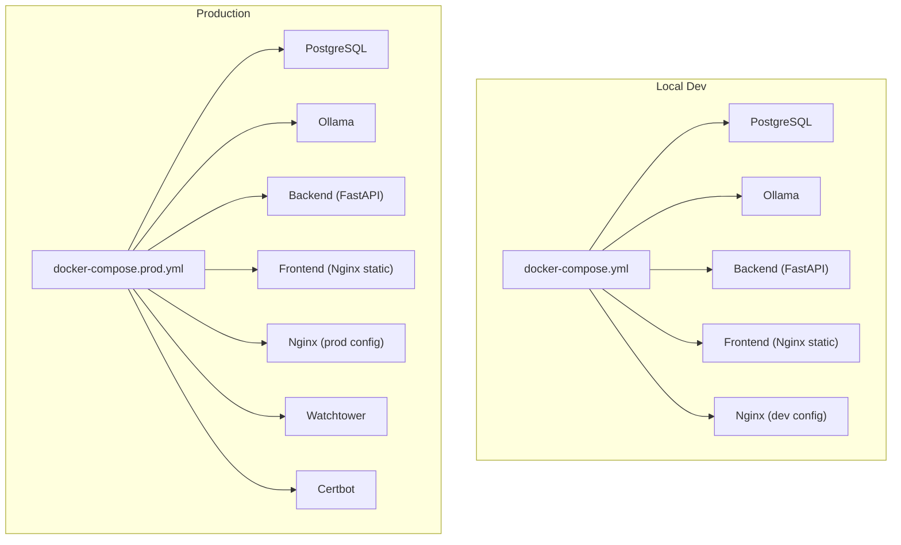
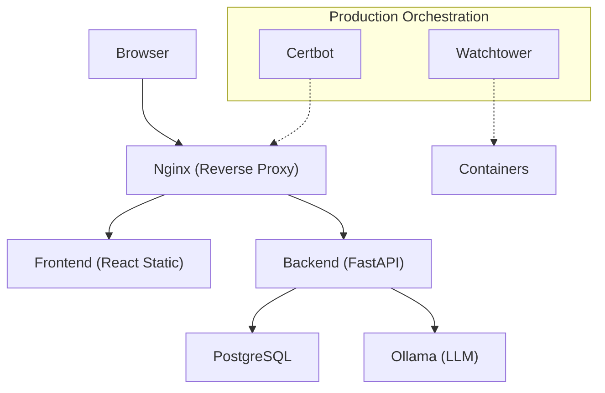
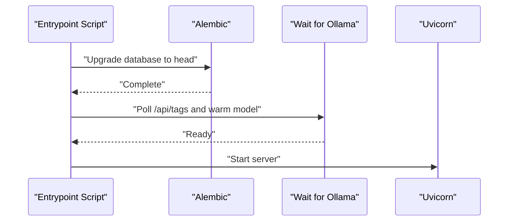
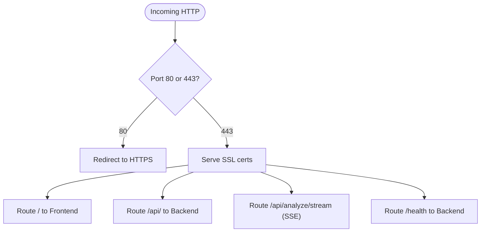
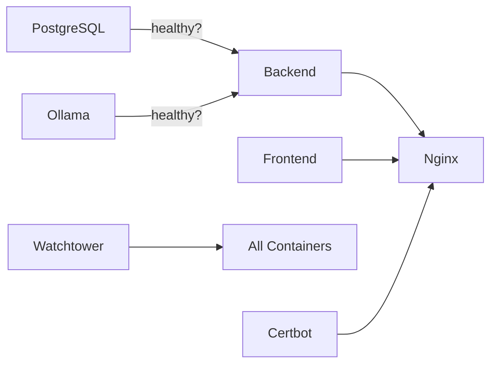
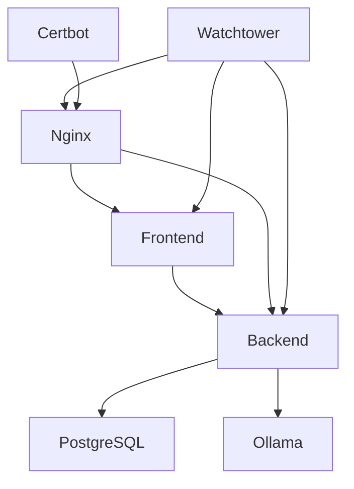
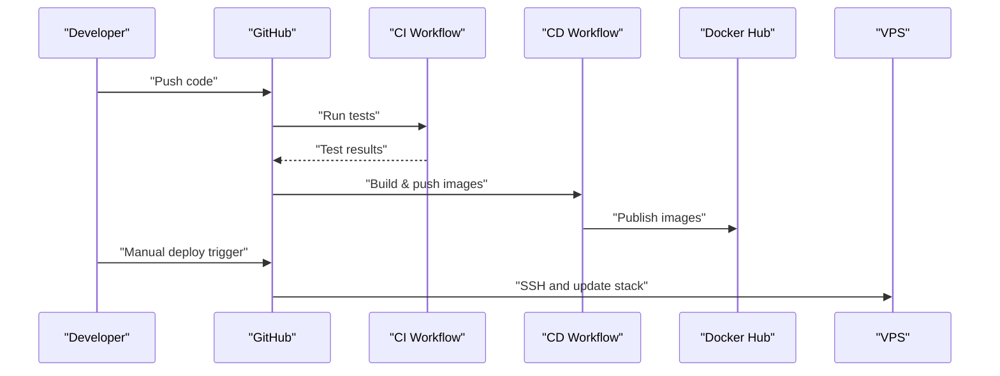

# Deployment & DevOps

<cite>
**Referenced Files in This Document**
- [docker-compose.yml](file://docker-compose.yml)
- [docker-compose.prod.yml](file://docker-compose.prod.yml)
- [app/backend/Dockerfile](file://app/backend/Dockerfile)
- [app/frontend/Dockerfile](file://app/frontend/Dockerfile)
- [nginx/Dockerfile](file://nginx/Dockerfile)
- [app/nginx/nginx.conf](file://app/nginx/nginx.conf)
- [app/nginx/nginx.prod.conf](file://app/nginx/nginx.prod.conf)
- [.github/workflows/ci.yml](file://.github/workflows/ci.yml)
- [.github/workflows/cd.yml](file://.github/workflows/cd.yml)
- [app/backend/scripts/docker-entrypoint.sh](file://app/backend/scripts/docker-entrypoint.sh)
- [app/backend/scripts/wait_for_ollama.py](file://app/backend/scripts/wait_for_ollama.py)
- [app/backend/main.py](file://app/backend/main.py)
- [requirements.txt](file://requirements.txt)
- [README.md](file://README.md)
</cite>

## Table of Contents
1. [Introduction](#introduction)
2. [Project Structure](#project-structure)
3. [Core Components](#core-components)
4. [Architecture Overview](#architecture-overview)
5. [Detailed Component Analysis](#detailed-component-analysis)
6. [Dependency Analysis](#dependency-analysis)
7. [Performance Considerations](#performance-considerations)
8. [Troubleshooting Guide](#troubleshooting-guide)
9. [Conclusion](#conclusion)
10. [Appendices](#appendices)

## Introduction
This document provides comprehensive deployment and DevOps guidance for Resume AI by ThetaLogics. It covers Docker configuration for development and production, multi-container orchestration, CI/CD with GitHub Actions, production deployment to a VPS, Nginx reverse proxy and SSL, environment variables and secrets, monitoring and logging, health checks, maintenance, troubleshooting, rollback procedures, scaling, security hardening, backups, and disaster recovery.

## Project Structure
The repository organizes the stack into three primary services plus supporting configurations:
- Backend service (FastAPI) with Dockerfile and entrypoint scripts
- Frontend service (React) built into Nginx static assets
- Nginx reverse proxy with distinct development and production configurations
- Orchestration via Docker Compose for local development and production
- CI/CD workflows for automated testing and image publishing

**Diagram sources**
- [docker-compose.yml:1-101](file://docker-compose.yml#L1-L101)
- [docker-compose.prod.yml:1-227](file://docker-compose.prod.yml#L1-L227)
- [app/nginx/nginx.conf:1-37](file://app/nginx/nginx.conf#L1-L37)
- [app/nginx/nginx.prod.conf:1-103](file://app/nginx/nginx.prod.conf#L1-L103)

**Section sources**
- [README.md:231-251](file://README.md#L231-L251)
- [docker-compose.yml:1-101](file://docker-compose.yml#L1-L101)
- [docker-compose.prod.yml:1-227](file://docker-compose.prod.yml#L1-L227)

## Core Components
- Backend service
  - FastAPI application with health checks and diagnostic endpoints
  - Entrypoint applies database migrations and waits for Ollama readiness
  - Exposes health and diagnostics endpoints for monitoring
- Frontend service
  - React app built into static assets served by Nginx
  - Multi-stage Dockerfile for efficient production images
- Nginx reverse proxy
  - Development configuration proxies to local dev servers
  - Production configuration handles SSL termination, rate limiting, and streaming
- Orchestration
  - Local compose for development
  - Production compose with resource limits, healthchecks, and Watchtower auto-updates

**Section sources**
- [app/backend/main.py:228-259](file://app/backend/main.py#L228-L259)
- [app/backend/main.py:262-326](file://app/backend/main.py#L262-L326)
- [app/backend/scripts/docker-entrypoint.sh:1-20](file://app/backend/scripts/docker-entrypoint.sh#L1-L20)
- [app/backend/scripts/wait_for_ollama.py:1-96](file://app/backend/scripts/wait_for_ollama.py#L1-L96)
- [app/frontend/Dockerfile:1-26](file://app/frontend/Dockerfile#L1-L26)
- [nginx/Dockerfile:1-13](file://nginx/Dockerfile#L1-L13)
- [app/nginx/nginx.conf:1-37](file://app/nginx/nginx.conf#L1-L37)
- [app/nginx/nginx.prod.conf:1-103](file://app/nginx/nginx.prod.conf#L1-L103)

## Architecture Overview
The system uses a reverse proxy (Nginx) to route traffic to the React frontend and FastAPI backend. PostgreSQL stores application data, and Ollama provides local LLM inference. In production, Watchtower monitors images and auto-updates containers, while Certbot manages SSL certificates.

**Diagram sources**
- [app/nginx/nginx.prod.conf:1-103](file://app/nginx/nginx.prod.conf#L1-L103)
- [docker-compose.prod.yml:1-227](file://docker-compose.prod.yml#L1-L227)

## Detailed Component Analysis

### Backend Service
- Responsibilities
  - Application lifecycle: database initialization, dependency checks, startup banner
  - Health checks and diagnostics for DB and Ollama
  - Streaming and non-streaming API routes
- Startup flow
  - Entrypoint runs migrations for PostgreSQL and waits for Ollama readiness before launching Uvicorn
  - Health endpoint validates connectivity to DB and Ollama
  - Diagnostics endpoint reports model availability and runtime status
- Containerization
  - Python slim image with system dependencies
  - Copies application code, Alembic migrations, and entrypoint scripts
  - Exposes port 8000; CMD overridden in production to use multiple workers

**Diagram sources**
- [app/backend/scripts/docker-entrypoint.sh:1-20](file://app/backend/scripts/docker-entrypoint.sh#L1-L20)
- [app/backend/scripts/wait_for_ollama.py:1-96](file://app/backend/scripts/wait_for_ollama.py#L1-L96)
- [app/backend/Dockerfile:1-39](file://app/backend/Dockerfile#L1-L39)

**Section sources**
- [app/backend/Dockerfile:1-39](file://app/backend/Dockerfile#L1-L39)
- [app/backend/scripts/docker-entrypoint.sh:1-20](file://app/backend/scripts/docker-entrypoint.sh#L1-L20)
- [app/backend/scripts/wait_for_ollama.py:1-96](file://app/backend/scripts/wait_for_ollama.py#L1-L96)
- [app/backend/main.py:68-149](file://app/backend/main.py#L68-L149)
- [app/backend/main.py:228-259](file://app/backend/main.py#L228-L259)
- [app/backend/main.py:262-326](file://app/backend/main.py#L262-L326)

### Frontend Service
- Responsibilities
  - Build React app into static assets
  - Serve assets via Nginx in production
- Containerization
  - Multi-stage build: Node builder produces dist assets, Nginx serves them
  - Default Nginx config copied into image; overridden by bind mount in production

**Section sources**
- [app/frontend/Dockerfile:1-26](file://app/frontend/Dockerfile#L1-L26)
- [nginx/Dockerfile:1-13](file://nginx/Dockerfile#L1-L13)

### Nginx Reverse Proxy
- Development
  - Proxies frontend dev server and backend dev server on localhost
- Production
  - SSL termination with Let’s Encrypt
  - Rate limiting for API endpoints
  - Streaming-specific configuration for SSE to avoid buffering
  - Health check passthrough to backend

**Diagram sources**
- [app/nginx/nginx.prod.conf:1-103](file://app/nginx/nginx.prod.conf#L1-L103)

**Section sources**
- [app/nginx/nginx.conf:1-37](file://app/nginx/nginx.conf#L1-L37)
- [app/nginx/nginx.prod.conf:1-103](file://app/nginx/nginx.prod.conf#L1-L103)

### Orchestration and Services
- Local development
  - Compose defines services with explicit healthchecks and interdependencies
  - Ports exposed for local access
- Production
  - Resource limits and deploy constraints for CPU/memory
  - Watchtower auto-updates containers by polling Docker Hub
  - Certbot renewal loop with persistent volumes

**Diagram sources**
- [docker-compose.yml:1-101](file://docker-compose.yml#L1-L101)
- [docker-compose.prod.yml:1-227](file://docker-compose.prod.yml#L1-L227)

**Section sources**
- [docker-compose.yml:1-101](file://docker-compose.yml#L1-L101)
- [docker-compose.prod.yml:1-227](file://docker-compose.prod.yml#L1-L227)

## Dependency Analysis
- Internal dependencies
  - Backend depends on PostgreSQL and Ollama; healthchecks enforce startup order
  - Frontend depends on backend for API; Nginx depends on both
- External dependencies
  - Docker images for Python, Node, Nginx, PostgreSQL, Ollama, Certbot, Watchtower
  - GitHub Actions for CI/CD and Docker Hub for image storage
- Runtime dependencies
  - Ollama models must be pulled and warmed in production
  - Database migrations are applied on backend startup

**Diagram sources**
- [docker-compose.prod.yml:1-227](file://docker-compose.prod.yml#L1-L227)

**Section sources**
- [docker-compose.yml:70-74](file://docker-compose.yml#L70-L74)
- [docker-compose.prod.yml:96-100](file://docker-compose.prod.yml#L96-L100)
- [app/backend/scripts/wait_for_ollama.py:34-91](file://app/backend/scripts/wait_for_ollama.py#L34-L91)

## Performance Considerations
- Backend concurrency
  - Production sets multiple Uvicorn workers to handle I/O-bound tasks efficiently
- Ollama tuning
  - Parallelism and memory settings optimized for model throughput and stability
  - Warmup job ensures first requests are not delayed by cold starts
- Database tuning
  - Production Postgres parameters tuned for memory and connections
- Streaming
  - Nginx disables buffering for SSE endpoints to prevent timeouts and improve responsiveness

**Section sources**
- [docker-compose.prod.yml:78-80](file://docker-compose.prod.yml#L78-L80)
- [docker-compose.prod.yml:46-55](file://docker-compose.prod.yml#L46-L55)
- [docker-compose.prod.yml:151-184](file://docker-compose.prod.yml#L151-L184)
- [app/nginx/nginx.prod.conf:66-95](file://app/nginx/nginx.prod.conf#L66-L95)

## Troubleshooting Guide
- Ollama not responding
  - Inspect container logs and ensure the required model is pulled
- Database locked errors
  - Restart backend container to resolve SQLite contention
- SSL certificate issues
  - Renew certificates manually and restart Nginx
- Deploy failures
  - Verify Docker Hub credentials, SSH keys, and firewall access

**Section sources**
- [README.md:339-355](file://README.md#L339-L355)
- [README.md:357-362](file://README.md#L357-L362)

## Conclusion
This guide outlines a robust, repeatable deployment process for Resume AI by ThetaLogics. It leverages Docker Compose for development, GitHub Actions for CI/CD, and production-grade orchestration with Watchtower and Certbot. The system emphasizes health checks, streaming readiness, and operational simplicity for maintenance and scaling.

## Appendices

### CI/CD Pipeline with GitHub Actions
- CI workflow
  - Runs backend and frontend tests on PRs and pushes
  - Publishes coverage artifacts
- CD workflow
  - Builds and pushes backend, frontend, and Nginx images to Docker Hub
  - Provides manual trigger and VPS deployment steps

**Diagram sources**
- [.github/workflows/ci.yml:1-63](file://.github/workflows/ci.yml#L1-L63)
- [.github/workflows/cd.yml:1-101](file://.github/workflows/cd.yml#L1-L101)

**Section sources**
- [.github/workflows/ci.yml:1-63](file://.github/workflows/ci.yml#L1-L63)
- [.github/workflows/cd.yml:1-101](file://.github/workflows/cd.yml#L1-L101)

### Environment Variables and Secrets
- Backend environment variables
  - Database URL, JWT secret, Ollama base URL and model selection, environment mode, startup gating
- Production secrets
  - Store sensitive values in repository secrets and pass them via Compose
- Example variables
  - Database credentials, JWT secret, Ollama model names, timeouts, and environment mode

**Section sources**
- [docker-compose.yml:59-69](file://docker-compose.yml#L59-L69)
- [docker-compose.prod.yml:81-95](file://docker-compose.prod.yml#L81-L95)
- [README.md:147-178](file://README.md#L147-L178)

### Monitoring and Logging
- Health checks
  - Backend exposes a health endpoint for readiness and liveness
  - Nginx health check routes to backend
  - Compose healthchecks for PostgreSQL and Ollama
- Observability
  - Use container logs and health endpoints for basic monitoring
  - Extend with external tools for metrics and alerting

**Section sources**
- [app/backend/main.py:228-259](file://app/backend/main.py#L228-L259)
- [docker-compose.yml:18-22](file://docker-compose.yml#L18-L22)
- [docker-compose.prod.yml:107-112](file://docker-compose.prod.yml#L107-L112)
- [docker-compose.prod.yml:140-144](file://docker-compose.prod.yml#L140-L144)

### Rollback Procedures
- Automatic updates
  - Watchtower auto-updates containers; disable or pin images to control rollouts
- Manual rollback
  - Pull previous image tags and redeploy using Compose

**Section sources**
- [docker-compose.prod.yml:192-211](file://docker-compose.prod.yml#L192-L211)

### Scaling Considerations
- Horizontal scaling
  - Increase Uvicorn workers in production for CPU-bound I/O concurrency
- Vertical scaling
  - Adjust CPU/memory limits per service in production Compose
- Streaming scaling
  - Ensure Nginx streaming configuration remains unchanged for SSE

**Section sources**
- [docker-compose.prod.yml:80-80](file://docker-compose.prod.yml#L80-L80)
- [docker-compose.prod.yml:58-64](file://docker-compose.prod.yml#L58-L64)
- [app/nginx/nginx.prod.conf:66-95](file://app/nginx/nginx.prod.conf#L66-L95)

### Security Hardening
- Secrets management
  - Use repository secrets for Docker Hub credentials and VPS access
- Network exposure
  - Limit published ports; rely on internal networking within Compose
- SSL/TLS
  - Use Certbot for automatic certificate management and renewal
- Access control
  - Restrict SSH access to VPS and rotate keys regularly

**Section sources**
- [.github/workflows/cd.yml:60-64](file://.github/workflows/cd.yml#L60-L64)
- [README.md:147-178](file://README.md#L147-L178)
- [docker-compose.prod.yml:213-220](file://docker-compose.prod.yml#L213-L220)

### Backup and Disaster Recovery
- Data persistence
  - Persist PostgreSQL and Ollama data volumes
- Image retention
  - Maintain recent image tags for quick rollback
- DR plan
  - Document restore steps for volumes and environment variables; automate where possible

**Section sources**
- [docker-compose.yml:98-100](file://docker-compose.yml#L98-L100)
- [docker-compose.prod.yml:26-27](file://docker-compose.prod.yml#L26-L27)
- [docker-compose.prod.yml:222-226](file://docker-compose.prod.yml#L222-L226)