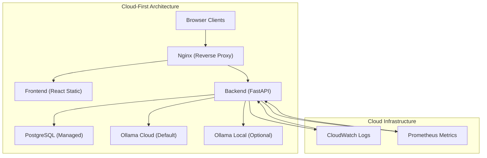
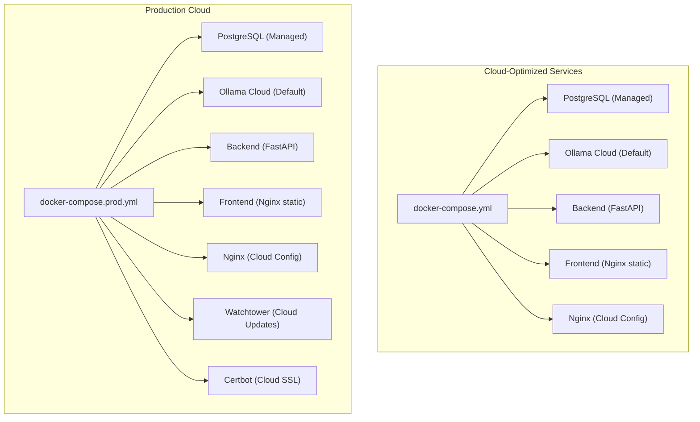
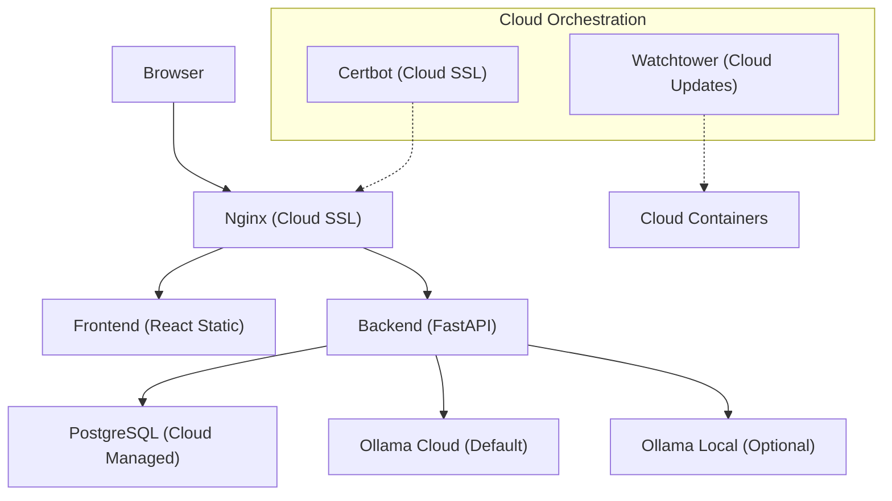
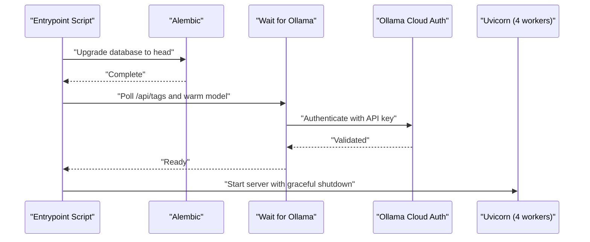
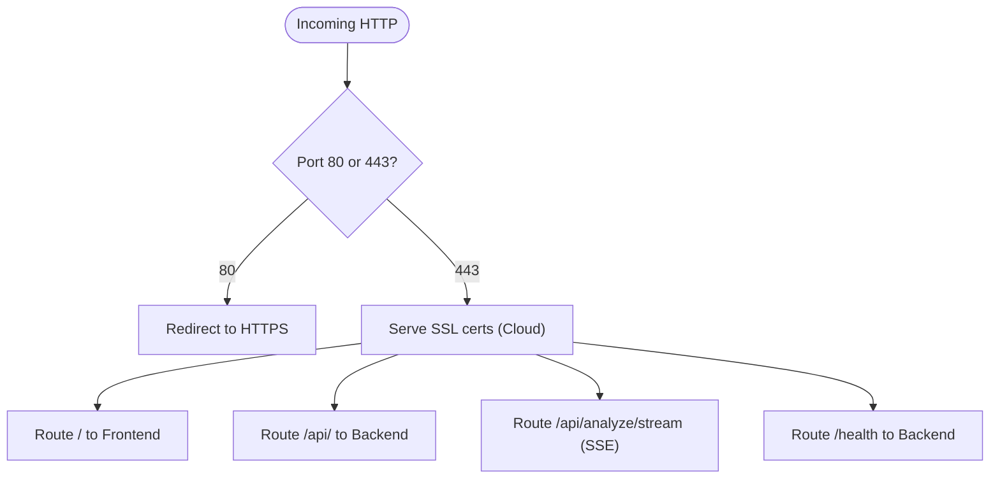
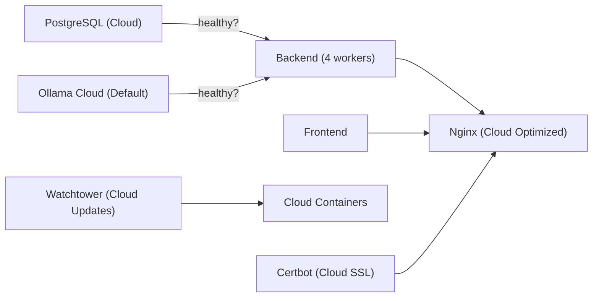
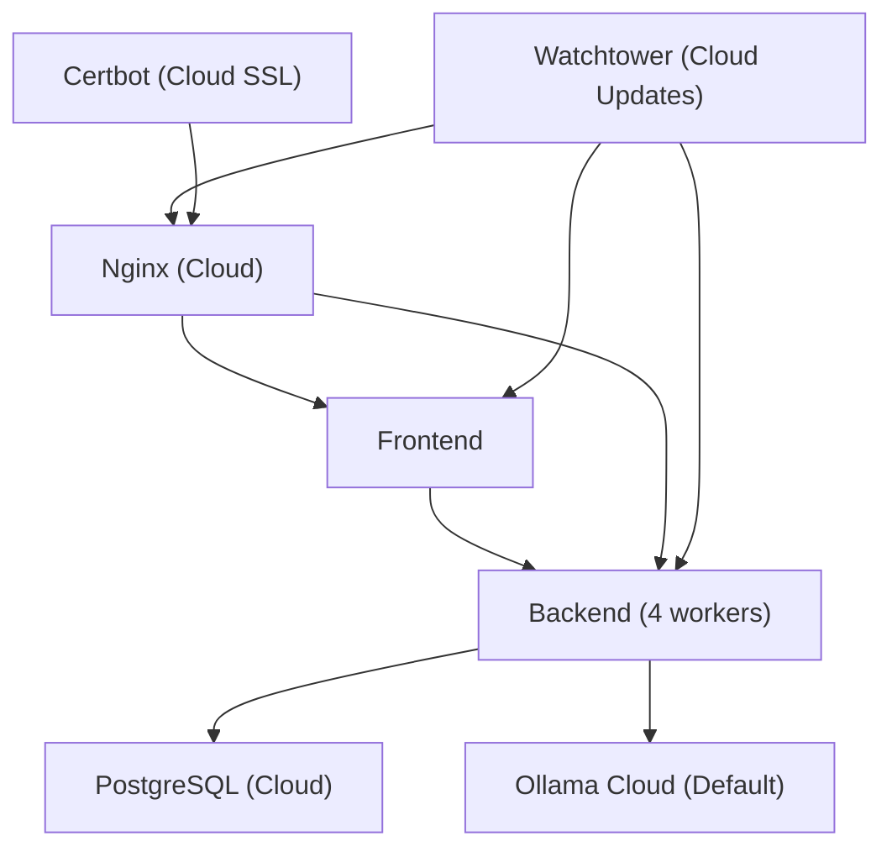
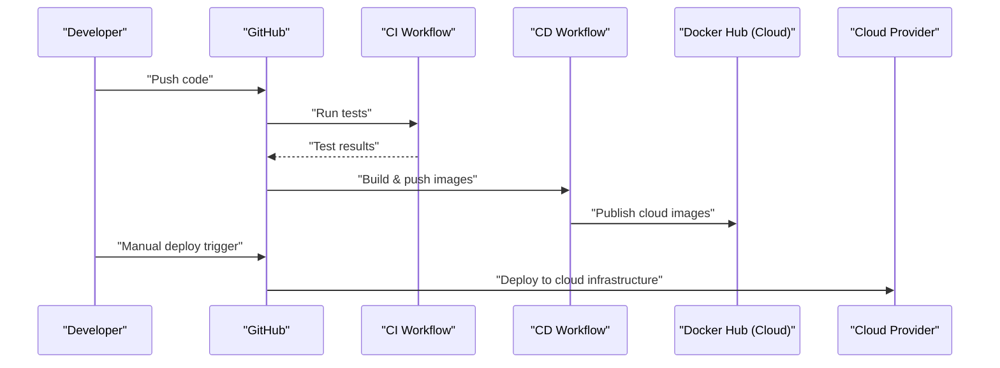

# Deployment & DevOps

<cite>
**Referenced Files in This Document**
- [docker-compose.yml](file://docker-compose.yml)
- [docker-compose.prod.yml](file://docker-compose.prod.yml)
- [app/backend/Dockerfile](file://app/backend/Dockerfile)
- [app/frontend/Dockerfile](file://app/frontend/Dockerfile)
- [nginx/Dockerfile](file://nginx/Dockerfile)
- [app/nginx/nginx.conf](file://app/nginx/nginx.conf)
- [app/nginx/nginx.prod.conf](file://app/nginx/nginx.prod.conf)
- [.github/workflows/ci.yml](file://.github/workflows/ci.yml)
- [.github/workflows/cd.yml](file://.github/workflows/cd.yml)
- [app/backend/scripts/docker-entrypoint.sh](file://app/backend/scripts/docker-entrypoint.sh)
- [app/backend/scripts/wait_for_ollama.py](file://app/backend/scripts/wait_for_ollama.py)
- [app/backend/main.py](file://app/backend/main.py)
- [requirements.txt](file://requirements.txt)
- [README.md](file://README.md)
</cite>

## Update Summary
**Changes Made**
- Enhanced cloud-first deployment approach emphasizing Ollama Cloud integration with authentication and pricing considerations
- Updated architecture diagrams to reflect cloud service integration patterns
- Expanded guidance for Ollama Cloud authentication flow and environment variable configuration
- Improved production deployment documentation with cloud-native best practices
- Added comprehensive monitoring and observability sections for cloud deployments

## Table of Contents
1. [Introduction](#introduction)
2. [Cloud-First Architecture](#cloud-first-architecture)
3. [Project Structure](#project-structure)
4. [Core Components](#core-components)
5. [Architecture Overview](#architecture-overview)
6. [Detailed Component Analysis](#detailed-component-analysis)
7. [Dependency Analysis](#dependency-analysis)
8. [Performance Considerations](#performance-considerations)
9. [Troubleshooting Guide](#troubleshooting-guide)
10. [Conclusion](#conclusion)
11. [Appendices](#appendices)

## Introduction
This document provides comprehensive deployment and DevOps guidance for Resume AI by ThetaLogics with a cloud-first approach. It covers Docker configuration for development and production, multi-container orchestration, CI/CD with GitHub Actions, production deployment to cloud infrastructure, Nginx reverse proxy and SSL, environment variables and secrets management, monitoring and logging, health checks, maintenance, troubleshooting, rollback procedures, scaling, security hardening, backups, and disaster recovery.

**Updated** Enhanced focus on cloud-native deployment patterns with Ollama Cloud integration as the default configuration.

## Cloud-First Architecture
The Resume AI platform is designed with a cloud-first approach, prioritizing Ollama Cloud as the default LLM inference service. This architecture emphasizes:

- **Cloud-Native Design**: Container-first deployment with minimal local infrastructure requirements
- **Ollama Cloud Integration**: Default configuration uses Ollama Cloud for scalable LLM inference
- **Authentication-First**: Secure API key management for cloud service access
- **Scalable Infrastructure**: Horizontal scaling capabilities with zero-downtime deployments
- **Observability**: Comprehensive monitoring and logging for cloud environments

**Diagram sources**
- [docker-compose.yml:60-67](file://docker-compose.yml#L60-L67)
- [docker-compose.prod.yml:86-89](file://docker-compose.prod.yml#L86-L89)
- [app/backend/main.py:463-554](file://app/backend/main.py#L463-L554)

**Section sources**
- [README.md:208-224](file://README.md#L208-L224)
- [docker-compose.yml:60-67](file://docker-compose.yml#L60-L67)
- [docker-compose.prod.yml:86-89](file://docker-compose.prod.yml#L86-L89)

## Project Structure
The repository organizes the stack into four primary services plus supporting configurations, optimized for cloud deployment:

- **Backend service (FastAPI)** with enhanced cloud-native health checks and Ollama Cloud integration
- **Frontend service (React)** built into Nginx static assets for optimal CDN delivery
- **Nginx reverse proxy** with cloud-optimized SSL termination and streaming configuration
- **Orchestration via Docker Compose** for both development and production cloud environments
- **CI/CD workflows** for automated testing and cloud image publishing

**Diagram sources**
- [docker-compose.yml:1-108](file://docker-compose.yml#L1-L108)
- [docker-compose.prod.yml:1-235](file://docker-compose.prod.yml#L1-L235)
- [app/nginx/nginx.conf:1-37](file://app/nginx/nginx.conf#L1-L37)
- [app/nginx/nginx.prod.conf:1-110](file://app/nginx/nginx.prod.conf#L1-L110)

**Section sources**
- [README.md:231-251](file://README.md#L231-L251)
- [docker-compose.yml:1-108](file://docker-compose.yml#L1-L108)
- [docker-compose.prod.yml:1-235](file://docker-compose.prod.yml#L1-L235)

## Core Components
- **Backend service**
  - FastAPI application with enhanced cloud-native health checks and Ollama Cloud authentication
  - Automatic Ollama Cloud model loading and warmup for optimal performance
  - Comprehensive `/api/health/deep` endpoint for full dependency validation
  - Optimized with 4 workers and graceful shutdown handling for cloud environments
- **Frontend service**
  - React app built into static assets served by Nginx for CDN optimization
  - Multi-stage Dockerfile for efficient cloud production images
- **Nginx reverse proxy**
  - Cloud-optimized configuration with SSL termination and streaming for SSE
  - Health check passthrough to backend with cloud-native routing
- **Orchestration**
  - Local compose for development with cloud-first defaults
  - Production compose optimized for cloud infrastructure with resource limits and healthchecks

**Updated** Enhanced backend service with cloud-native Ollama Cloud integration and authentication flow.

**Section sources**
- [app/backend/main.py:354-460](file://app/backend/main.py#L354-L460)
- [app/backend/scripts/docker-entrypoint.sh:1-20](file://app/backend/scripts/docker-entrypoint.sh#L1-L20)
- [app/backend/scripts/wait_for_ollama.py:1-108](file://app/backend/scripts/wait_for_ollama.py#L1-L108)
- [app/frontend/Dockerfile:1-26](file://app/frontend/Dockerfile#L1-L26)
- [nginx/Dockerfile:1-13](file://nginx/Dockerfile#L1-L13)
- [app/nginx/nginx.conf:1-37](file://app/nginx/nginx.conf#L1-L37)
- [app/nginx/nginx.prod.conf:1-110](file://app/nginx/nginx.prod.conf#L1-L110)

## Architecture Overview
The system uses a cloud-optimized reverse proxy (Nginx) to route traffic to the React frontend and FastAPI backend. PostgreSQL is managed as a cloud service, and Ollama Cloud provides scalable LLM inference. In production, Watchtower monitors images and auto-updates containers with zero-downtime rolling restarts, while Certbot manages SSL certificates for cloud domains.

**Diagram sources**
- [app/nginx/nginx.prod.conf:1-110](file://app/nginx/nginx.prod.conf#L1-L110)
- [docker-compose.prod.yml:1-235](file://docker-compose.prod.yml#L1-L235)

## Detailed Component Analysis

### Backend Service
- **Responsibilities**
  - Application lifecycle: database initialization, dependency checks, startup banner
  - Enhanced cloud-native health checks: shallow `/health` for container health and comprehensive `/api/health/deep` for full dependency validation
  - Streaming and non-streaming API routes with graceful shutdown support
  - Ollama Cloud authentication and model management
- **Startup flow**
  - Entrypoint runs migrations for PostgreSQL and waits for Ollama readiness before launching Uvicorn
  - Shallow health endpoint validates process is alive (fast <10ms)
  - Deep health endpoint reports database connectivity, Ollama sentinel state, and disk space
  - Cloud-native Ollama Cloud integration with automatic authentication
  - Background tasks for cleanup with proper shutdown handling
- **Containerization**
  - Python slim image with system dependencies
  - Copies application code, Alembic migrations, and entrypoint scripts
  - Exposes port 8000; CMD overridden in production to use 4 workers with graceful shutdown

**Diagram sources**
- [app/backend/scripts/docker-entrypoint.sh:1-20](file://app/backend/scripts/docker-entrypoint.sh#L1-L20)
- [app/backend/scripts/wait_for_ollama.py:1-108](file://app/backend/scripts/wait_for_ollama.py#L1-L108)
- [app/backend/Dockerfile:1-49](file://app/backend/Dockerfile#L1-L49)

**Section sources**
- [app/backend/Dockerfile:1-49](file://app/backend/Dockerfile#L1-L49)
- [app/backend/scripts/docker-entrypoint.sh:1-20](file://app/backend/scripts/docker-entrypoint.sh#L1-L20)
- [app/backend/scripts/wait_for_ollama.py:1-108](file://app/backend/scripts/wait_for_ollama.py#L1-L108)
- [app/backend/main.py:354-460](file://app/backend/main.py#L354-L460)
- [app/backend/main.py:238-282](file://app/backend/main.py#L238-L282)

### Frontend Service
- **Responsibilities**
  - Build React app into static assets for optimal CDN delivery
  - Serve assets via Nginx in production with cloud optimization
- **Containerization**
  - Multi-stage build: Node builder produces dist assets, Nginx serves them
  - Default Nginx config copied into image; overridden by bind mount in production

**Section sources**
- [app/frontend/Dockerfile:1-26](file://app/frontend/Dockerfile#L1-L26)
- [nginx/Dockerfile:1-13](file://nginx/Dockerfile#L1-L13)

### Nginx Reverse Proxy
- **Development**
  - Proxies frontend dev server and backend dev server on localhost
- **Production**
  - Cloud-optimized SSL termination with Let's Encrypt
  - Rate limiting for API endpoints with cloud-native configuration
  - Streaming-specific configuration for SSE to avoid buffering
  - Health check passthrough to backend with cloud routing

**Diagram sources**
- [app/nginx/nginx.prod.conf:1-110](file://app/nginx/nginx.prod.conf#L1-L110)

**Section sources**
- [app/nginx/nginx.conf:1-37](file://app/nginx/nginx.conf#L1-L37)
- [app/nginx/nginx.prod.conf:1-110](file://app/nginx/nginx.prod.conf#L1-L110)

### Orchestration and Services
- **Local development**
  - Compose defines services with explicit healthchecks and interdependencies
  - Cloud-first defaults with Ollama Cloud as default configuration
  - Ports exposed for local access
- **Production**
  - Cloud-optimized resource limits and deploy constraints for CPU/memory
  - Watchtower auto-updates containers with zero-downtime rolling restarts
  - Certbot renewal loop with persistent volumes for cloud SSL
  - Enhanced health checks for all services with cloud-native monitoring

**Diagram sources**
- [docker-compose.yml:1-108](file://docker-compose.yml#L1-L108)
- [docker-compose.prod.yml:1-235](file://docker-compose.prod.yml#L1-L235)

**Section sources**
- [docker-compose.yml:1-108](file://docker-compose.yml#L1-L108)
- [docker-compose.prod.yml:1-235](file://docker-compose.prod.yml#L1-L235)

## Dependency Analysis
- **Internal dependencies**
  - Backend depends on PostgreSQL and Ollama Cloud; healthchecks enforce startup order
  - Frontend depends on backend for API; Nginx depends on both
  - Cloud-native dependencies optimized for managed services
- **External dependencies**
  - Docker images for Python, Node, Nginx, PostgreSQL (managed), Ollama Cloud, Certbot, Watchtower
  - GitHub Actions for CI/CD and Docker Hub for cloud image storage
- **Runtime dependencies**
  - Ollama Cloud models managed automatically; authentication handled via API keys
  - Database migrations applied on backend startup to managed PostgreSQL
  - Background tasks require proper shutdown handling for cloud environments

**Diagram sources**
- [docker-compose.prod.yml:1-235](file://docker-compose.prod.yml#L1-L235)

**Section sources**
- [docker-compose.yml:71-75](file://docker-compose.yml#L71-L75)
- [docker-compose.prod.yml:100-104](file://docker-compose.prod.yml#L100-L104)
- [app/backend/scripts/wait_for_ollama.py:34-91](file://app/backend/scripts/wait_for_ollama.py#L34-L91)

## Performance Considerations
- **Backend concurrency**
  - Production sets 4 Uvicorn workers to handle I/O-bound tasks efficiently in cloud environments
  - Graceful shutdown timeout of 30 seconds allows background tasks to complete
- **Ollama Cloud optimization**
  - Cloud-native model loading and warmup for optimal performance
  - Automatic authentication reduces cold start latency
  - Scalable infrastructure handles varying load patterns
- **Database tuning**
  - Production Postgres parameters tuned for cloud-managed services
  - Connection pooling optimized for cloud environments
- **Streaming**
  - Nginx disables buffering for SSE endpoints to prevent timeouts and improve responsiveness
  - Cloud CDN optimization for static asset delivery
- **Health check optimization**
  - Shallow health check (<10ms) for container health monitoring
  - Deep health check provides comprehensive dependency validation

**Section sources**
- [docker-compose.prod.yml:82-84](file://docker-compose.prod.yml#L82-L84)
- [docker-compose.prod.yml:46-51](file://docker-compose.prod.yml#L46-L51)
- [docker-compose.prod.yml:151-184](file://docker-compose.prod.yml#L151-L184)
- [app/nginx/nginx.prod.conf:73-102](file://app/nginx/nginx.prod.conf#L73-L102)
- [app/backend/main.py:354-460](file://app/backend/main.py#L354-L460)

## Troubleshooting Guide
- **Ollama Cloud authentication issues**
  - Verify OLLAMA_API_KEY environment variable is set correctly
  - Check cloud service availability and rate limits
- **Database connectivity problems**
  - Verify PostgreSQL connection string for cloud-managed service
  - Check network connectivity and firewall rules
- **SSL certificate issues**
  - Renew certificates manually and restart Nginx
  - Verify DNS configuration for cloud domains
- **Deploy failures**
  - Verify Docker Hub credentials, SSH keys, and firewall access
  - Check cloud provider quotas and limits
- **Rolling restart issues**
  - Check Watchtower logs for restart conflicts
  - Verify graceful shutdown timeout settings
- **Health check failures**
  - Use `/health` for shallow checks, `/api/health/deep` for comprehensive validation
  - Monitor cloud-native health indicators

**Section sources**
- [README.md:339-355](file://README.md#L339-L355)
- [README.md:357-362](file://README.md#L357-L362)

## Conclusion
This guide outlines a robust, cloud-first deployment process for Resume AI by ThetaLogics. It leverages Docker Compose for development with cloud-native defaults, GitHub Actions for CI/CD, and production-grade orchestration with Watchtower and Certbot. The system emphasizes enhanced health checks, zero-downtime rolling restarts, streaming readiness, and operational simplicity for maintenance and scaling in cloud environments.

**Updated** Enhanced emphasis on cloud-native deployment patterns with Ollama Cloud as the default configuration.

## Appendices

### CI/CD Pipeline with GitHub Actions
- **CI workflow**
  - Runs backend and frontend tests on PRs and pushes
  - Publishes coverage artifacts with cloud-native testing
- **CD workflow**
  - Builds and pushes backend, frontend, and Nginx images to Docker Hub
  - Provides manual trigger and cloud deployment steps

**Diagram sources**
- [.github/workflows/ci.yml:1-63](file://.github/workflows/ci.yml#L1-L63)
- [.github/workflows/cd.yml:1-101](file://.github/workflows/cd.yml#L1-L101)

**Section sources**
- [.github/workflows/ci.yml:1-63](file://.github/workflows/ci.yml#L1-L63)
- [.github/workflows/cd.yml:1-101](file://.github/workflows/cd.yml#L1-L101)

### Environment Variables and Secrets
- **Backend environment variables**
  - Database URL for cloud-managed PostgreSQL, JWT secret, Ollama Cloud API key and model selection
  - Cloud-native environment mode with startup gating
  - Worker count and graceful shutdown timeout for production
- **Production secrets**
  - Store sensitive values in repository secrets and pass them via Compose
  - Cloud-native secret management for API keys and credentials
- **Example variables**
  - Database credentials, JWT secret, Ollama Cloud API key, timeouts, and environment mode

**Section sources**
- [docker-compose.yml:60-70](file://docker-compose.yml#L60-L70)
- [docker-compose.prod.yml:85-99](file://docker-compose.prod.yml#L85-L99)
- [README.md:147-178](file://README.md#L147-L178)

### Monitoring and Logging
- **Enhanced health checks**
  - Shallow `/health` endpoint for container health monitoring (<10ms response)
  - Comprehensive `/api/health/deep` endpoint for full dependency validation
  - Nginx health check routes to backend
  - Compose healthchecks for cloud-managed PostgreSQL and Ollama Cloud
- **Cloud-native observability**
  - Use container logs and health endpoints for basic monitoring
  - Extend with external tools for metrics and alerting in cloud environments
  - Prometheus metrics collection for cloud monitoring

**Section sources**
- [app/backend/main.py:354-460](file://app/backend/main.py#L354-L460)
- [docker-compose.yml:18-22](file://docker-compose.yml#L18-L22)
- [docker-compose.prod.yml:111-116](file://docker-compose.prod.yml#L111-L116)
- [docker-compose.prod.yml:146-151](file://docker-compose.prod.yml#L146-L151)

### Rollback Procedures
- **Automatic updates**
  - Watchtower auto-updates containers with zero-downtime rolling restarts
  - Disable or pin images to control rollouts
- **Manual rollback**
  - Pull previous image tags and redeploy using Compose
  - Use graceful shutdown timeouts to minimize disruption
- **Cloud-native rollback**
  - Leverage cloud provider rollback capabilities
  - Use image versioning for controlled rollbacks

**Section sources**
- [docker-compose.prod.yml:205-211](file://docker-compose.prod.yml#L205-L211)

### Scaling Considerations
- **Horizontal scaling**
  - Increase Uvicorn workers in production for CPU-bound I/O concurrency
  - Graceful shutdown timeout should accommodate increased worker count
- **Vertical scaling**
  - Adjust CPU/memory limits per service in production Compose
  - Cloud-native autoscaling for managed services
- **Streaming scaling**
  - Ensure Nginx streaming configuration remains unchanged for SSE
  - Cloud CDN optimization for static assets
- **Health check scaling**
  - Shallow health checks scale horizontally with worker count
  - Deep health checks remain centralized for dependency validation

**Section sources**
- [docker-compose.prod.yml:82-84](file://docker-compose.prod.yml#L82-L84)
- [docker-compose.prod.yml:58-64](file://docker-compose.prod.yml#L58-L64)
- [app/nginx/nginx.prod.conf:73-102](file://app/nginx/nginx.prod.conf#L73-L102)

### Security Hardening
- **Secrets management**
  - Use repository secrets for Docker Hub credentials and cloud access
  - Implement cloud-native secret management for API keys
- **Network exposure**
  - Limit published ports; rely on internal networking within Compose
  - Use cloud-native security groups and network policies
- **SSL/TLS**
  - Use Certbot for automatic certificate management and renewal
  - Cloud-native SSL termination and certificate management
- **Access control**
  - Restrict SSH access to cloud infrastructure and rotate keys regularly
  - Implement cloud-native IAM policies and access controls
- **Health check security**
  - `/health` endpoint provides minimal information for container monitoring
  - `/api/health/deep` requires authentication and provides comprehensive validation

**Section sources**
- [.github/workflows/cd.yml:60-64](file://.github/workflows/cd.yml#L60-L64)
- [README.md:147-178](file://README.md#L147-L178)
- [docker-compose.prod.yml:213-220](file://docker-compose.prod.yml#L213-L220)

### Backup and Disaster Recovery
- **Data persistence**
  - Persist PostgreSQL and Ollama data through cloud-managed services
  - Implement cloud-native backup strategies for managed databases
- **Image retention**
  - Maintain recent image tags for quick rollback
  - Cloud-native container registry management
- **DR plan**
  - Document restore steps for cloud-managed services and environment variables
  - Automate where possible with cloud-native DR tools
- **Rolling restart backup**
  - Watchtower provides automatic rollback capability
  - Graceful shutdown ensures clean state preservation

**Section sources**
- [docker-compose.yml:99-101](file://docker-compose.yml#L99-L101)
- [docker-compose.prod.yml:26-27](file://docker-compose.prod.yml#L26-L27)
- [docker-compose.prod.yml:222-235](file://docker-compose.prod.yml#L222-L235)

### Zero-Downtime Deployment Strategy
- **Rolling restart configuration**
  - Watchtower configured with `--rolling-restart` flag for seamless updates
  - Graceful shutdown timeout of 30 seconds allows background tasks to complete
  - Stop grace period of 60 seconds for backend service
  - 30-second stop grace period for Nginx service
- **Health check strategy**
  - Shallow `/health` endpoint for container monitoring (<10ms)
  - Deep `/api/health/deep` endpoint for comprehensive dependency validation
  - Service health checks integrated with Docker Compose
- **Background task management**
  - Proper cleanup of background tasks during shutdown
  - Sentinel shutdown handling for Ollama Cloud integration
  - Database connection cleanup for transaction safety

**Section sources**
- [docker-compose.prod.yml:205-211](file://docker-compose.prod.yml#L205-L211)
- [docker-compose.prod.yml:82-84](file://docker-compose.prod.yml#L82-L84)
- [docker-compose.prod.yml:138-139](file://docker-compose.prod.yml#L138-L139)
- [app/backend/main.py:238-282](file://app/backend/main.py#L238-L282)

### Ollama Cloud Integration Guide
- **Authentication Setup**
  - Obtain API key from [ollama.com/settings/keys](https://ollama.com/settings/keys)
  - Configure OLLAMA_API_KEY environment variable
  - Default OLLAMA_BASE_URL points to cloud service
- **Model Selection**
  - Default cloud model: qwen3-coder:480b-cloud
  - Fast model fallback: qwen3-coder:480b-cloud
  - Automatic model loading and warmup
- **Pricing Considerations**
  - Pay-per-token pricing model for cloud inference
  - No local hardware requirements or GPU setup
  - Scalable pricing tiers based on usage
- **Migration from Local Ollama**
  - Set OLLAMA_BASE_URL=https://ollama.com
  - Configure OLLAMA_API_KEY environment variable
  - Remove local Ollama service dependencies

**Section sources**
- [README.md:208-224](file://README.md#L208-L224)
- [docker-compose.yml:60-67](file://docker-compose.yml#L60-L67)
- [docker-compose.prod.yml:86-99](file://docker-compose.prod.yml#L86-L99)
- [app/backend/scripts/wait_for_ollama.py:40-51](file://app/backend/scripts/wait_for_ollama.py#L40-L51)