# Deployment & DevOps

<cite>
**Referenced Files in This Document**
- [docker-compose.yml](file://docker-compose.yml)
- [docker-compose.prod.yml](file://docker-compose.prod.yml)
- [app/backend/Dockerfile](file://app/backend/Dockerfile)
- [app/frontend/Dockerfile](file://app/frontend/Dockerfile)
- [nginx/Dockerfile](file://nginx/Dockerfile)
- [app/nginx/nginx.conf](file://app/nginx/nginx.conf)
- [app/nginx/nginx.prod.conf](file://app/nginx/nginx.prod.conf)
- [.github/workflows/ci.yml](file://.github/workflows/ci.yml)
- [.github/workflows/cd.yml](file://.github/workflows/cd.yml)
- [app/backend/scripts/docker-entrypoint.sh](file://app/backend/scripts/docker-entrypoint.sh)
- [app/backend/scripts/wait_for_ollama.py](file://app/backend/scripts/wait_for_ollama.py)
- [app/backend/main.py](file://app/backend/main.py)
- [app/backend/services/queue_manager.py](file://app/backend/services/queue_manager.py)
- [app/backend/routes/queue_api.py](file://app/backend/routes/queue_api.py)
- [deploy_queue_migration.sh](file://deploy_queue_migration.sh)
- [deploy_queue_migration.ps1](file://deploy_queue_migration.ps1)
- [requirements.txt](file://requirements.txt)
- [README.md](file://README.md)
- [app/speech_service/Dockerfile](file://app/speech_service/Dockerfile)
- [app/speech_service/main.py](file://app/speech_service/main.py)
- [app/speech_service/requirements.txt](file://app/speech_service/requirements.txt)
- [app/voice_agent/Dockerfile](file://app/voice_agent/Dockerfile)
- [app/voice_agent/Dockerfile.livekit](file://app/voice_agent/Dockerfile.livekit)
- [app/voice_agent/agent.py](file://app/voice_agent/agent.py)
- [app/voice_agent/livekit.yaml](file://app/voice_agent/livekit.yaml)
- [app/voice_agent/requirements.txt](file://app/voice_agent/requirements.txt)
- [app/backend/routes/voice.py](file://app/backend/routes/voice.py)
- [app/backend/services/voice_screening_service.py](file://app/backend/services/voice_screening_service.py)
- [app/backend/services/voice_call_scheduler.py](file://app/backend/services/voice_call_scheduler.py)
</cite>

## Update Summary
**Changes Made**
- Enhanced CI/CD infrastructure with new voice-related microservices integration
- Expanded deployment capabilities to include LiveKit, speech-service, and voice-agent container deployments
- Added comprehensive voice screening architecture with STT/TTS/VAD capabilities
- Integrated LiveKit WebRTC SFU with SIP trunking for PSTN call handling
- Implemented voice agent orchestration with conversation state management
- Updated Docker Compose configurations for multi-service voice screening pipeline
- Enhanced production deployment with dedicated resource allocation for voice services

## Table of Contents
1. [Introduction](#introduction)
2. [Cloud-First Architecture](#cloud-first-architecture)
3. [Project Structure](#project-structure)
4. [Core Components](#core-components)
5. [Architecture Overview](#architecture-overview)
6. [Detailed Component Analysis](#detailed-component-analysis)
7. [Voice Screening Microservices](#voice-screening-microservices)
8. [LiveKit Integration](#livekit-integration)
9. [Speech Service Capabilities](#speech-service-capabilities)
10. [Voice Agent Orchestration](#voice-agent-orchestration)
11. [Queue System Implementation](#queue-system-implementation)
12. [Nginx SSL and Streaming Configuration](#nginx-ssl-and-streaming-configuration)
13. [CI/CD Pipeline Enhancements](#cicd-pipeline-enhancements)
14. [Migration System Support](#migration-system-support)
15. [DNS Resolution and Networking](#dns-resolution-and-networking)
16. [Dependency Analysis](#dependency-analysis)
17. [Performance Considerations](#performance-considerations)
18. [Troubleshooting Guide](#troubleshooting-guide)
19. [Conclusion](#conclusion)
20. [Appendices](#appendices)

## Introduction
This document provides comprehensive deployment and DevOps guidance for Resume AI by ThetaLogics with enhanced cloud-first approach and integrated voice screening capabilities. The platform now features a robust voice screening microservices architecture with LiveKit WebRTC SFU, speech processing services, and intelligent conversation orchestration. It covers Docker configuration for development and production, multi-container orchestration, voice service integration, SSL termination, environment variables and secrets management, monitoring and logging, health checks, maintenance, troubleshooting, rollback procedures, scaling, security hardening, backups, and disaster recovery.

**Updated** Enhanced with comprehensive voice screening microservices integration, LiveKit WebRTC SFU, speech processing capabilities, and automated CI/CD builds for all four core services.

## Cloud-First Architecture
The Resume AI platform is designed with a cloud-first approach featuring a comprehensive voice screening microservices architecture. The architecture emphasizes:

- **Microservices Architecture**: Separate services for backend processing, frontend delivery, voice screening, and speech processing
- **LiveKit WebRTC SFU**: Real-time communication infrastructure with SIP trunking for PSTN call handling
- **Speech Processing Services**: Dedicated STT, TTS, and VAD capabilities for voice screening automation
- **Voice Agent Orchestration**: Intelligent conversation management with state tracking and LLM integration
- **Advanced Nginx Configuration**: SSL termination, rate limiting, and streaming optimizations
- **Automated CI/CD**: Four-service pipeline with Docker Hub integration for backend, frontend, speech-service, and voice-agent
- **Migration Management**: Automated database schema updates with rollback support
- **DNS Resolution**: Embedded DNS configuration for reliable container networking

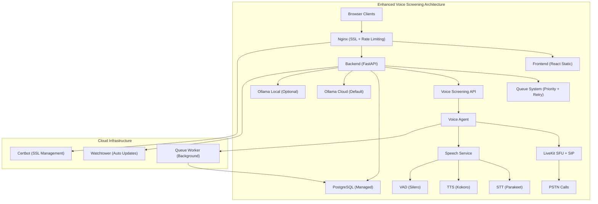

**Diagram sources**
- [docker-compose.yml:110-175](file://docker-compose.yml#L110-L175)
- [docker-compose.prod.yml:232-299](file://docker-compose.prod.yml#L232-L299)
- [app/backend/main.py:463-554](file://app/backend/main.py#L463-L554)
- [app/backend/services/queue_manager.py:189-215](file://app/backend/services/queue_manager.py#L189-L215)

**Section sources**
- [README.md:208-224](file://README.md#L208-L224)
- [docker-compose.yml:110-175](file://docker-compose.yml#L110-L175)
- [docker-compose.prod.yml:232-299](file://docker-compose.prod.yml#L232-L299)

## Project Structure
The repository organizes the stack into six primary services plus supporting configurations, optimized for cloud deployment with comprehensive voice screening integration:

- **Backend service (FastAPI)** with enhanced cloud-native health checks, queue worker integration, and Ollama Cloud authentication
- **Frontend service (React)** built into Nginx static assets for optimal CDN delivery
- **Nginx reverse proxy** with cloud-optimized SSL termination, rate limiting, and streaming configuration
- **LiveKit WebRTC SFU** with SIP trunking for PSTN call handling and real-time communication
- **Speech Service** with STT, TTS, and VAD capabilities for voice processing
- **Voice Agent** with conversation orchestration, state management, and LLM integration
- **Queue system** with priority-based job scheduling, automatic retry, and worker monitoring
- **CI/CD workflows** for automated testing and cloud image publishing across all services

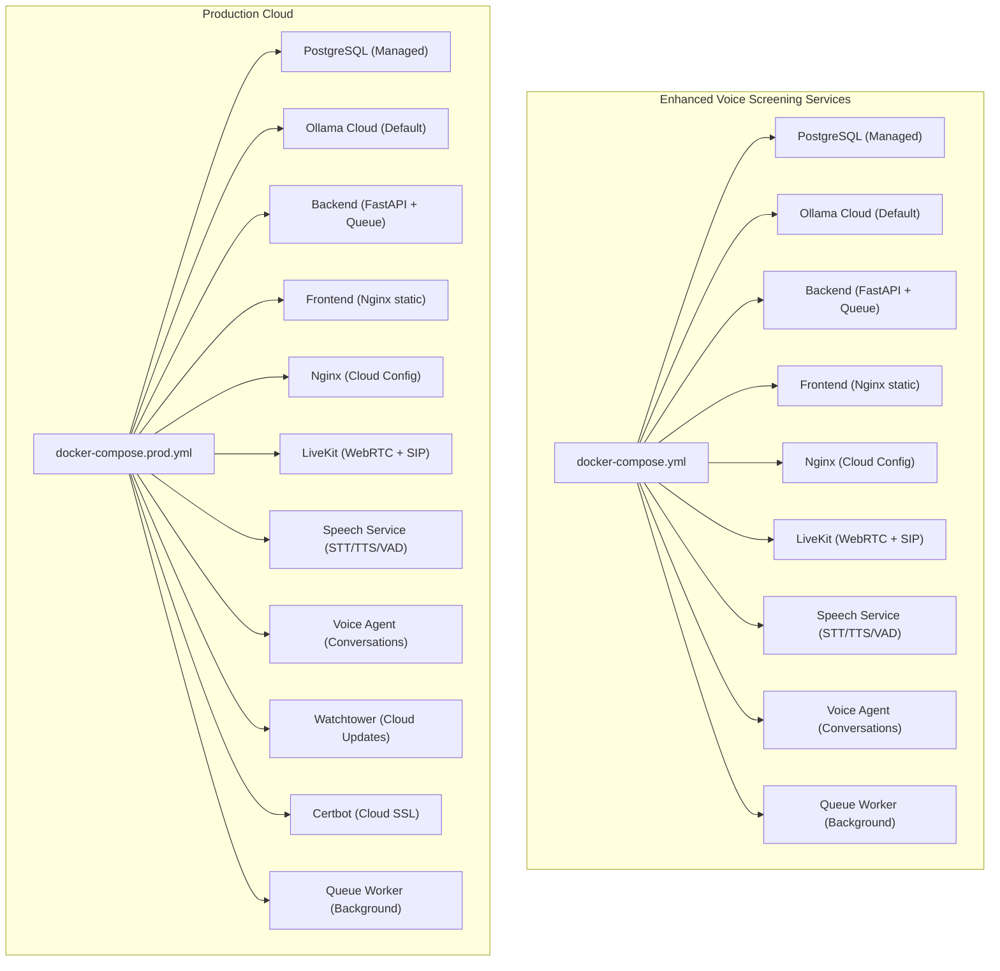

**Diagram sources**
- [docker-compose.yml:1-180](file://docker-compose.yml#L1-L180)
- [docker-compose.prod.yml:1-311](file://docker-compose.prod.yml#L1-L311)
- [app/nginx/nginx.conf:1-45](file://app/nginx/nginx.conf#L1-L45)
- [app/nginx/nginx.prod.conf:1-110](file://app/nginx/nginx.prod.conf#L1-L110)

**Section sources**
- [README.md:231-251](file://README.md#L231-L251)
- [docker-compose.yml:1-180](file://docker-compose.yml#L1-L180)
- [docker-compose.prod.yml:1-311](file://docker-compose.prod.yml#L1-L311)

## Core Components
- **Backend service**
  - FastAPI application with enhanced cloud-native health checks and Ollama Cloud authentication
  - Integrated queue worker for asynchronous job processing with priority scheduling
  - Automatic Ollama Cloud model loading and warmup for optimal performance
  - Comprehensive `/api/health/deep` endpoint for full dependency validation
  - Optimized with 6 workers and graceful shutdown handling for cloud environments
  - Voice screening API endpoints for call scheduling and session management
- **Frontend service**
  - React app built into static assets served by Nginx for CDN optimization
  - Multi-stage Dockerfile for efficient cloud production images
- **Nginx reverse proxy**
  - Cloud-optimized configuration with SSL termination, rate limiting, and streaming for SSE
  - Advanced security headers and performance optimizations
  - Health check passthrough to backend with cloud-native routing
- **LiveKit WebRTC SFU**
  - Real-time communication infrastructure with SIP trunking for PSTN call handling
  - TURN server support for NAT traversal
  - WebSocket and TCP/UDP transport protocols
  - Twilio SIP trunk integration for outbound PSTN calls
- **Speech Service**
  - CPU-optimized STT (Parakeet TDT 1.1B), TTS (Kokoro 82M), and VAD (Silero VAD v5)
  - FastAPI application with model warmup on startup
  - Health check endpoint for model readiness validation
  - Streaming audio processing capabilities
- **Voice Agent**
  - LiveKit agents process for conversation orchestration
  - State machine for screening conversations (greeting → consent → screening → wrap-up)
  - Integration with Speech Service (STT/TTS/VAD) and Ollama Cloud (LLM)
  - HTTP dispatch API for backend integration
  - SIP outbound call initiation via Twilio
- **Queue system**
  - Priority-based job scheduling with automatic retry and exponential backoff
  - Worker health monitoring and stale job recovery mechanisms
  - Comprehensive job tracking with metrics collection and progress reporting
- **Orchestration**
  - Local compose for development with cloud-first defaults
  - Production compose optimized for cloud infrastructure with resource limits and healthchecks

**Updated** Enhanced backend service with integrated queue worker, voice screening API, and improved cloud-native Ollama Cloud integration. Added comprehensive voice screening microservices architecture.

**Section sources**
- [app/backend/main.py:354-460](file://app/backend/main.py#L354-L460)
- [app/backend/scripts/docker-entrypoint.sh:1-20](file://app/backend/scripts/docker-entrypoint.sh#L1-L20)
- [app/backend/scripts/wait_for_ollama.py:1-108](file://app/backend/scripts/wait_for_ollama.py#L1-L108)
- [app/frontend/Dockerfile:1-35](file://app/frontend/Dockerfile#L1-L35)
- [nginx/Dockerfile:1-13](file://nginx/Dockerfile#L1-L13)
- [app/nginx/nginx.conf:1-45](file://app/nginx/nginx.conf#L1-L45)
- [app/nginx/nginx.prod.conf:1-110](file://app/nginx/nginx.prod.conf#L1-L110)
- [app/backend/services/queue_manager.py:189-215](file://app/backend/services/queue_manager.py#L189-L215)
- [app/speech_service/Dockerfile:1-32](file://app/speech_service/Dockerfile#L1-L32)
- [app/speech_service/main.py:1-387](file://app/speech_service/main.py#L1-L387)
- [app/voice_agent/Dockerfile:1-31](file://app/voice_agent/Dockerfile#L1-L31)
- [app/voice_agent/agent.py:1-800](file://app/voice_agent/agent.py#L1-L800)

## Architecture Overview
The system uses a cloud-optimized reverse proxy (Nginx) with advanced SSL configuration to route traffic to the React frontend and FastAPI backend. The backend now includes integrated queue processing and voice screening APIs for scalable job management. PostgreSQL is managed as a cloud service, and Ollama Cloud provides scalable LLM inference. In production, Watchtower monitors images and auto-updates containers with zero-downtime rolling restarts, while Certbot manages SSL certificates for cloud domains. The voice screening architecture includes LiveKit WebRTC SFU for real-time communication, Speech Service for audio processing, and Voice Agent for conversation orchestration. The queue worker operates as a background service for asynchronous job processing.

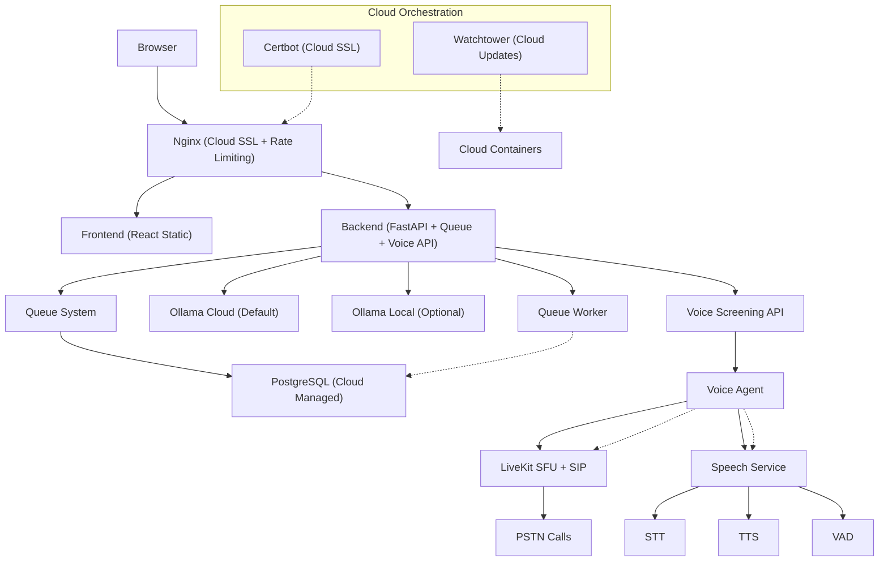

**Diagram sources**
- [app/nginx/nginx.prod.conf:1-110](file://app/nginx/nginx.prod.conf#L1-L110)
- [docker-compose.prod.yml:1-311](file://docker-compose.prod.yml#L1-L311)

## Detailed Component Analysis

### Backend Service
- **Responsibilities**
  - Application lifecycle: database initialization, dependency checks, startup banner
  - Enhanced cloud-native health checks: shallow `/health` for container health and comprehensive `/api/health/deep` for full dependency validation
  - Streaming and non-streaming API routes with graceful shutdown support
  - Ollama Cloud authentication and model management
  - Integrated queue worker for asynchronous job processing
  - Voice screening API endpoints for call scheduling and session management
- **Startup flow**
  - Entrypoint runs migrations for PostgreSQL and waits for Ollama readiness before launching Uvicorn
  - Shallow health endpoint validates process is alive (fast <10ms)
  - Deep health endpoint reports database connectivity, Ollama sentinel state, and disk space
  - Cloud-native Ollama Cloud integration with automatic authentication
  - Background tasks for cleanup with proper shutdown handling
  - Queue worker initialization with priority-based job processing
- **Containerization**
  - Python slim image with system dependencies
  - Copies application code, Alembic migrations, and entrypoint scripts
  - Exposes port 8000; CMD overridden in production to use 6 workers with graceful shutdown

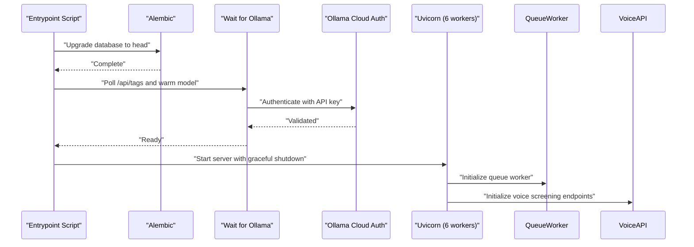

**Diagram sources**
- [app/backend/scripts/docker-entrypoint.sh:1-20](file://app/backend/scripts/docker-entrypoint.sh#L1-L20)
- [app/backend/scripts/wait_for_ollama.py:1-108](file://app/backend/scripts/wait_for_ollama.py#L1-L108)
- [app/backend/Dockerfile:1-49](file://app/backend/Dockerfile#L1-L49)

**Section sources**
- [app/backend/Dockerfile:1-49](file://app/backend/Dockerfile#L1-L49)
- [app/backend/scripts/docker-entrypoint.sh:1-20](file://app/backend/scripts/docker-entrypoint.sh#L1-L20)
- [app/backend/scripts/wait_for_ollama.py:1-108](file://app/backend/scripts/wait_for_ollama.py#L1-L108)
- [app/backend/main.py:354-460](file://app/backend/main.py#L354-L460)
- [app/backend/main.py:238-282](file://app/backend/main.py#L238-L282)

### Frontend Service
- **Responsibilities**
  - Build React app into static assets for optimal CDN delivery
  - Serve assets via Nginx in production with cloud optimization
- **Containerization**
  - Multi-stage build: Node builder produces dist assets, Nginx serves them
  - Default Nginx config copied into image; overridden by bind mount in production

**Section sources**
- [app/frontend/Dockerfile:1-35](file://app/frontend/Dockerfile#L1-L35)
- [nginx/Dockerfile:1-13](file://nginx/Dockerfile#L1-L13)

### Nginx Reverse Proxy
- **Development**
  - Proxies frontend dev server and backend dev server on localhost
- **Production**
  - Cloud-optimized SSL termination with Let's Encrypt and advanced security headers
  - Rate limiting for API endpoints with configurable zones and burst protection
  - Streaming-specific configuration for SSE to avoid buffering with proxy_buffering off
  - Health check passthrough to backend with cloud routing
  - Embedded DNS resolution for reliable container networking

**Diagram sources**
- [app/nginx/nginx.prod.conf:1-110](file://app/nginx/nginx.prod.conf#L1-L110)

**Section sources**
- [app/nginx/nginx.conf:1-45](file://app/nginx/nginx.conf#L1-L45)
- [app/nginx/nginx.prod.conf:1-110](file://app/nginx/nginx.prod.conf#L1-L110)

### Orchestration and Services
- **Local development**
  - Compose defines services with explicit healthchecks and interdependencies
  - Cloud-first defaults with Ollama Cloud as default configuration
  - Ports exposed for local access
  - Voice screening services included (LiveKit, speech-service, voice-agent)
- **Production**
  - Cloud-optimized resource limits and deploy constraints for CPU/memory
  - Watchtower auto-updates containers with zero-downtime rolling restarts
  - Certbot renewal loop with persistent volumes for cloud SSL
  - Enhanced health checks for all services with cloud-native monitoring
  - Queue worker service for background job processing
  - Dedicated resource allocation for voice services (LiveKit: 1G, Speech Service: 4G, Voice Agent: 2G)

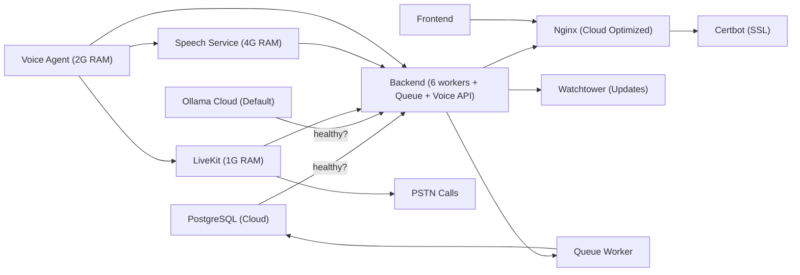

**Diagram sources**
- [docker-compose.yml:1-180](file://docker-compose.yml#L1-L180)
- [docker-compose.prod.yml:1-311](file://docker-compose.prod.yml#L1-L311)

**Section sources**
- [docker-compose.yml:1-180](file://docker-compose.yml#L1-L180)
- [docker-compose.prod.yml:1-311](file://docker-compose.prod.yml#L1-L311)

## Voice Screening Microservices

### LiveKit WebRTC SFU
The LiveKit service provides real-time communication infrastructure with SIP trunking capabilities:

- **WebRTC SFU**: Selective forwarding unit for efficient media distribution
- **SIP Trunking**: Twilio integration for outbound PSTN calls
- **TURN Server**: NAT traversal support for reliable connections
- **Transport Protocols**: WebSocket, TCP, and UDP for comprehensive connectivity
- **Configuration**: YAML-based configuration with port ranges and TURN settings
- **Health Monitoring**: Built-in health check endpoint for service validation

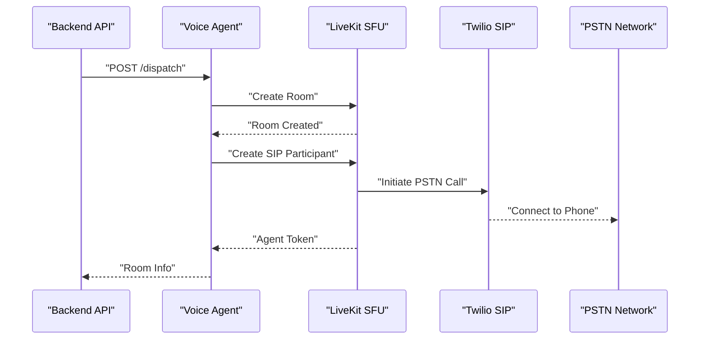

**Diagram sources**
- [app/voice_agent/agent.py:558-602](file://app/voice_agent/agent.py#L558-L602)
- [app/backend/services/voice_call_scheduler.py:180-211](file://app/backend/services/voice_call_scheduler.py#L180-L211)

**Section sources**
- [app/voice_agent/Dockerfile.livekit:1-3](file://app/voice_agent/Dockerfile.livekit#L1-L3)
- [app/voice_agent/livekit.yaml:1-42](file://app/voice_agent/livekit.yaml#L1-L42)
- [app/voice_agent/agent.py:535-602](file://app/voice_agent/agent.py#L535-L602)

### Speech Service Capabilities
The Speech Service provides comprehensive audio processing capabilities:

- **STT (Speech-to-Text)**: Parakeet TDT 1.1B model for streaming transcription
- **TTS (Text-to-Speech)**: Kokoro 82M model for synthetic speech generation
- **VAD (Voice Activity Detection)**: Silero VAD v5 for speech segment detection
- **Model Warmup**: CPU-optimized model loading with pipeline initialization
- **Audio Processing**: Support for PCM, WAV, MP3, and OGG formats
- **Health Monitoring**: Model readiness validation and performance metrics

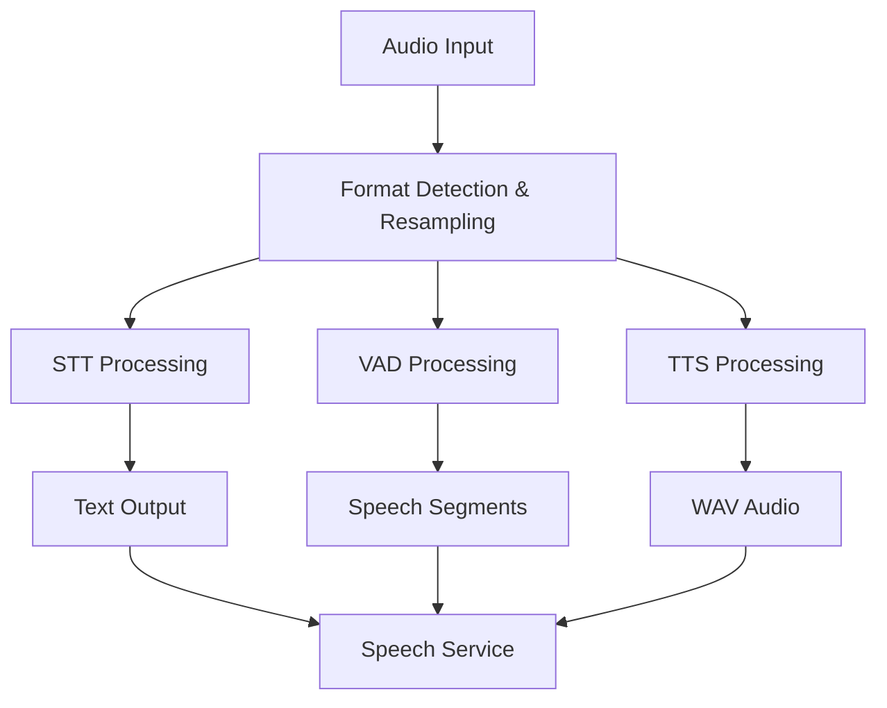

**Diagram sources**
- [app/speech_service/main.py:173-237](file://app/speech_service/main.py#L173-L237)
- [app/speech_service/main.py:309-374](file://app/speech_service/main.py#L309-L374)

**Section sources**
- [app/speech_service/Dockerfile:1-32](file://app/speech_service/Dockerfile#L1-L32)
- [app/speech_service/main.py:1-387](file://app/speech_service/main.py#L1-L387)
- [app/speech_service/requirements.txt:1-14](file://app/speech_service/requirements.txt#L1-L14)

### Voice Agent Orchestration
The Voice Agent manages end-to-end conversation orchestration:

- **Conversation State Machine**: Greeting → Consent → Introduction → Screening → Follow-up → Wrap-up → Analysis → Ended
- **LLM Integration**: Ollama Cloud for conversational intelligence
- **Audio Processing**: Seamless integration with Speech Service for STT/TTS/VAD
- **SIP Management**: LiveKit SIP integration for PSTN call handling
- **Session Tracking**: Comprehensive transcript and assessment recording
- **Retry Logic**: Automatic retry mechanisms for failed calls

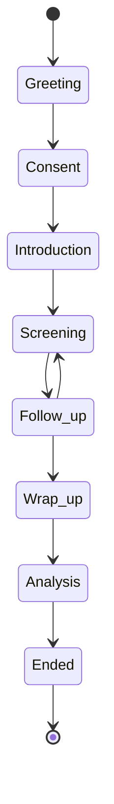

**Diagram sources**
- [app/voice_agent/agent.py:51-60](file://app/voice_agent/agent.py#L51-L60)

**Section sources**
- [app/voice_agent/Dockerfile:1-31](file://app/voice_agent/Dockerfile#L1-L31)
- [app/voice_agent/agent.py:1-800](file://app/voice_agent/agent.py#L1-L800)
- [app/voice_agent/requirements.txt:1-10](file://app/voice_agent/requirements.txt#L1-L10)

## Queue System Implementation
The platform now features a comprehensive queue system for scalable job processing with the following capabilities:

- **Priority-Based Scheduling**: Jobs are processed based on priority levels (1-10) with configurable poll intervals
- **Automatic Retry**: Exponential backoff retry mechanism with configurable delay patterns
- **Worker Health Monitoring**: Heartbeat tracking and stale job recovery for fault tolerance
- **Deduplication**: Input hashing prevents duplicate job processing
- **Metrics Collection**: Comprehensive performance tracking and error reporting
- **Background Processing**: Queue worker operates independently for non-blocking job execution

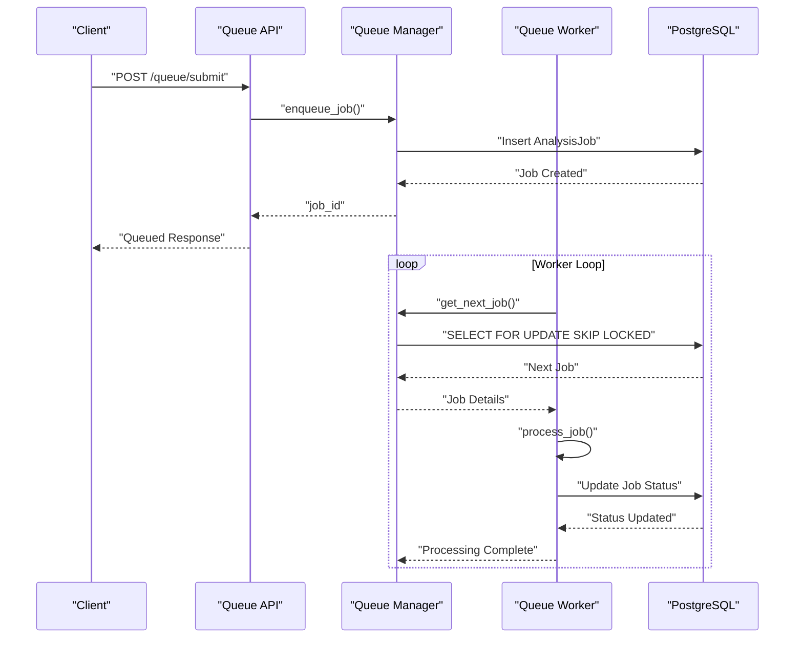

**Diagram sources**
- [app/backend/services/queue_manager.py:221-304](file://app/backend/services/queue_manager.py#L221-L304)
- [app/backend/services/queue_manager.py:526-562](file://app/backend/services/queue_manager.py#L526-L562)

**Section sources**
- [app/backend/services/queue_manager.py:189-215](file://app/backend/services/queue_manager.py#L189-L215)
- [app/backend/routes/queue_api.py:38-76](file://app/backend/routes/queue_api.py#L38-L76)
- [app/backend/services/queue_manager.py:349-496](file://app/backend/services/queue_manager.py#L349-L496)

## Nginx SSL and Streaming Configuration
The Nginx configuration has been significantly enhanced with advanced SSL support and streaming optimizations:

- **SSL Termination**: Cloud-native SSL configuration with Let's Encrypt integration
- **Rate Limiting**: Configurable rate limiting zones with burst protection for API endpoints
- **Security Headers**: Comprehensive security headers including HSTS, XSS protection, and CSP
- **Streaming Optimization**: Critical SSE streaming configuration with proxy_buffering off
- **DNS Resolution**: Embedded DNS configuration to handle container IP changes
- **Health Checks**: Dedicated health check endpoint routing to backend

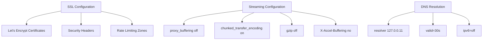

**Diagram sources**
- [app/nginx/nginx.prod.conf:27-102](file://app/nginx/nginx.prod.conf#L27-L102)

**Section sources**
- [app/nginx/nginx.prod.conf:1-110](file://app/nginx/nginx.prod.conf#L1-L110)
- [nginx/nginx.prod.conf:12-21](file://nginx/nginx.prod.conf#L12-L21)

## CI/CD Pipeline Enhancements
The CI/CD pipeline has been updated to support automated Docker builds for all four services:

- **CI Workflow**
  - Runs backend and frontend tests on PRs and pushes
  - Publishes coverage artifacts with cloud-native testing
- **CD Workflow**
  - Builds and pushes backend, frontend, Nginx, LiveKit, speech-service, and voice-agent images to Docker Hub
  - Provides manual trigger and cloud deployment steps
  - Supports concurrent builds with caching optimization
  - Enhanced deployment with dedicated resource allocation for voice services

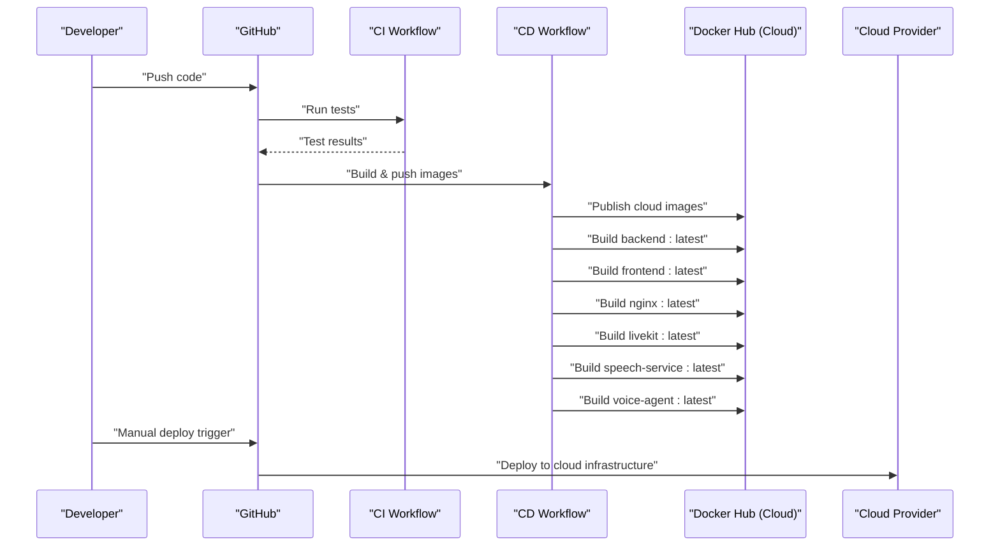

**Diagram sources**
- [.github/workflows/ci.yml:1-63](file://.github/workflows/ci.yml#L1-L63)
- [.github/workflows/cd.yml:1-134](file://.github/workflows/cd.yml#L1-L134)

**Section sources**
- [.github/workflows/ci.yml:1-63](file://.github/workflows/ci.yml#L1-L63)
- [.github/workflows/cd.yml:1-134](file://.github/workflows/cd.yml#L1-L134)

## Migration System Support
The platform now includes comprehensive migration system support with dedicated deployment scripts:

- **Database Migrations**: Alembic-based schema updates for queue system tables and voice screening models
- **Deployment Scripts**: Platform-specific scripts for Windows and Unix systems
- **Backup and Rollback**: Automated backup creation and rollback capabilities
- **Verification**: Post-migration table verification and structure validation

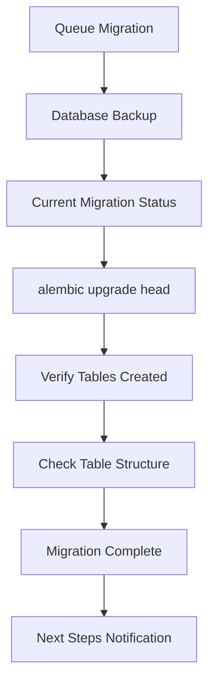

**Diagram sources**
- [deploy_queue_migration.sh:18-34](file://deploy_queue_migration.sh#L18-L34)

**Section sources**
- [deploy_queue_migration.sh:1-67](file://deploy_queue_migration.sh#L1-L67)
- [deploy_queue_migration.ps1:1-66](file://deploy_queue_migration.ps1#L1-L66)

## DNS Resolution and Networking
The platform implements advanced DNS resolution mechanisms for reliable container networking:

- **Embedded DNS**: Docker embedded DNS service configuration for dynamic hostname resolution
- **Resolver Configuration**: Custom resolver settings with 30-second cache and 5-second timeout
- **IPv6 Handling**: Explicit IPv6 disabling for Docker bridge network compatibility
- **Health Check Routing**: Dynamic upstream routing for health check endpoints
- **Container IP Changes**: Automatic DNS refresh to handle container recreation scenarios
- **Voice Service Networking**: Dedicated internal networks for voice microservices communication

**Section sources**
- [nginx/nginx.prod.conf:12-21](file://nginx/nginx.prod.conf#L12-L21)
- [app/nginx/nginx.prod.conf:36-41](file://app/nginx/nginx.prod.conf#L36-L41)

## Dependency Analysis
- **Internal dependencies**
  - Backend depends on PostgreSQL and Ollama Cloud; healthchecks enforce startup order
  - Frontend depends on backend for API; Nginx depends on both
  - Queue worker depends on database for job processing
  - Voice Agent depends on LiveKit, Speech Service, and Backend
  - LiveKit depends on Twilio SIP configuration
  - Speech Service depends on model availability
  - Cloud-native dependencies optimized for managed services
- **External dependencies**
  - Docker images for Python, Node, Nginx, PostgreSQL (managed), Ollama Cloud, Certbot, Watchtower
  - GitHub Actions for CI/CD and Docker Hub for cloud image storage
  - Twilio for PSTN call handling
- **Runtime dependencies**
  - Ollama Cloud models managed automatically; authentication handled via API keys
  - Database migrations applied on backend startup to managed PostgreSQL
  - Background tasks require proper shutdown handling for cloud environments
  - Queue worker requires database connectivity for job processing
  - Voice services require proper model warmup and health validation

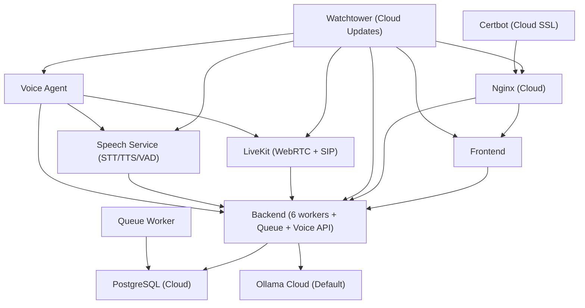

**Diagram sources**
- [docker-compose.prod.yml:1-311](file://docker-compose.prod.yml#L1-L311)

**Section sources**
- [docker-compose.yml:110-175](file://docker-compose.yml#L110-L175)
- [docker-compose.prod.yml:232-299](file://docker-compose.prod.yml#L232-L299)
- [app/backend/scripts/wait_for_ollama.py:34-91](file://app/backend/scripts/wait_for_ollama.py#L34-L91)

## Performance Considerations
- **Backend concurrency**
  - Production sets 6 Uvicorn workers to handle I/O-bound tasks efficiently in cloud environments
  - Graceful shutdown timeout of 30 seconds allows background tasks to complete
- **Voice Service optimization**
  - LiveKit: 1GB RAM allocation for WebRTC SFU and SIP handling
  - Speech Service: 4GB RAM allocation for CPU-only STT/TTS/VAD processing
  - Voice Agent: 2GB RAM allocation for conversation orchestration
  - Model warmup ensures immediate response for voice processing
- **Queue system optimization**
  - Configurable max concurrent jobs (default: 3) with adjustable poll intervals
  - Exponential backoff retry delays (1min, 5min, 15min) for fault tolerance
  - Heartbeat monitoring with stale job recovery (default: 10min timeout)
- **Ollama Cloud optimization**
  - Cloud-native model loading and warmup for optimal performance
  - Automatic authentication reduces cold start latency
  - Scalable infrastructure handles varying load patterns
- **Database tuning**
  - Production Postgres parameters tuned for cloud-managed services
  - Connection pooling optimized for cloud environments
- **Streaming**
  - Nginx disables buffering for SSE endpoints to prevent timeouts and improve responsiveness
  - Cloud CDN optimization for static asset delivery
- **Health check optimization**
  - Shallow health check (<10ms) for container health monitoring
  - Deep health check provides comprehensive dependency validation
  - Voice service health checks validate model readiness

**Section sources**
- [docker-compose.prod.yml:82-84](file://docker-compose.prod.yml#L82-L84)
- [docker-compose.prod.yml:248-252](file://docker-compose.prod.yml#L248-L252)
- [docker-compose.prod.yml:266-270](file://docker-compose.prod.yml#L266-L270)
- [docker-compose.prod.yml:296-298](file://docker-compose.prod.yml#L296-L298)
- [docker-compose.prod.yml:46-51](file://docker-compose.prod.yml#L46-L51)
- [docker-compose.prod.yml:151-184](file://docker-compose.prod.yml#L151-L184)
- [app/nginx/nginx.prod.conf:73-102](file://app/nginx/nginx.prod.conf#L73-L102)
- [app/backend/main.py:354-460](file://app/backend/main.py#L354-L460)
- [app/backend/services/queue_manager.py:201-204](file://app/backend/services/queue_manager.py#L201-L204)

## Troubleshooting Guide
- **Ollama Cloud authentication issues**
  - Verify OLLAMA_API_KEY environment variable is set correctly
  - Check cloud service availability and rate limits
- **Database connectivity problems**
  - Verify PostgreSQL connection string for cloud-managed service
  - Check network connectivity and firewall rules
- **SSL certificate issues**
  - Renew certificates manually and restart Nginx
  - Verify DNS configuration for cloud domains
- **Queue system issues**
  - Check queue worker logs for job processing errors
  - Verify database connectivity for job persistence
  - Monitor queue depth and processing times
- **Voice Service issues**
  - Verify Speech Service health endpoint (/health) returns model readiness
  - Check model warmup completion for STT/TTS/VAD
  - Monitor resource allocation for voice services
- **LiveKit connectivity issues**
  - Verify SIP trunk configuration and Twilio credentials
  - Check TURN server accessibility for NAT traversal
  - Monitor WebSocket and TCP/UDP port availability
- **Voice Agent communication issues**
  - Verify Voice Agent can reach LiveKit and Speech Service
  - Check environment variable configuration for service URLs
  - Monitor conversation state transitions
- **DNS resolution problems**
  - Verify embedded DNS configuration in Nginx
  - Check resolver settings and timeout values
  - Ensure container networking is functioning properly
- **Deploy failures**
  - Verify Docker Hub credentials, SSH keys, and firewall access
  - Check cloud provider quotas and limits
- **Rolling restart issues**
  - Check Watchtower logs for restart conflicts
  - Verify graceful shutdown timeout settings
- **Health check failures**
  - Use `/health` for shallow checks, `/api/health/deep` for comprehensive validation
  - Monitor cloud-native health indicators
  - Check voice service health endpoints specifically

**Section sources**
- [README.md:339-355](file://README.md#L339-L355)
- [README.md:357-362](file://README.md#L357-L362)

## Conclusion
This guide outlines a robust, cloud-first deployment process for Resume AI by ThetaLogics with enhanced voice screening capabilities and comprehensive microservices architecture. It leverages Docker Compose for development with cloud-native defaults, GitHub Actions for CI/CD with automated Docker builds for all four services, and production-grade orchestration with Watchtower and Certbot. The system emphasizes enhanced health checks, zero-downtime rolling restarts, streaming readiness, comprehensive queue processing, SSL security, migration management, voice service integration, and operational simplicity for maintenance and scaling in cloud environments.

**Updated** Enhanced emphasis on cloud-native deployment patterns with Ollama Cloud as the default configuration, comprehensive voice screening microservices architecture, LiveKit WebRTC SFU integration, speech processing capabilities, and automated CI/CD builds for all core services.

## Appendices

### CI/CD Pipeline with GitHub Actions
- **CI workflow**
  - Runs backend and frontend tests on PRs and pushes
  - Publishes coverage artifacts with cloud-native testing
- **CD workflow**
  - Builds and pushes backend, frontend, Nginx, LiveKit, speech-service, and voice-agent images to Docker Hub
  - Provides manual trigger and cloud deployment steps

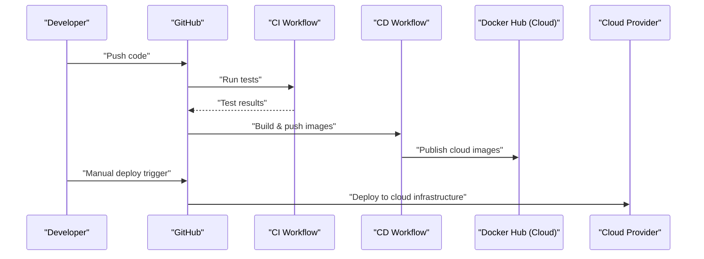

**Diagram sources**
- [.github/workflows/ci.yml:1-63](file://.github/workflows/ci.yml#L1-L63)
- [.github/workflows/cd.yml:1-134](file://.github/workflows/cd.yml#L1-L134)

**Section sources**
- [.github/workflows/ci.yml:1-63](file://.github/workflows/ci.yml#L1-L63)
- [.github/workflows/cd.yml:1-134](file://.github/workflows/cd.yml#L1-L134)

### Environment Variables and Secrets
- **Backend environment variables**
  - Database URL for cloud-managed PostgreSQL, JWT secret, Ollama Cloud API key and model selection
  - Cloud-native environment mode with startup gating
  - Worker count and graceful shutdown timeout for production
  - Queue system configuration (max concurrent, poll intervals, heartbeat)
  - Voice Agent URL for voice service integration
- **Voice Service environment variables**
  - SPEECH_SERVICE_URL for internal service discovery
  - Model configuration and processing parameters
- **LiveKit environment variables**
  - LIVEKIT_API_KEY and LIVEKIT_API_SECRET for authentication
  - SIP trunk configuration for Twilio integration
  - Port configuration for WebSocket, TCP, and UDP protocols
- **Voice Agent environment variables**
  - SPEECH_SERVICE_URL, LIVEKIT_URL, and backend URL configuration
  - Ollama Cloud integration settings
  - SIP trunk ID and outbound number configuration
- **Production secrets**
  - Store sensitive values in repository secrets and pass them via Compose
  - Cloud-native secret management for API keys and credentials
- **Example variables**
  - Database credentials, JWT secret, Ollama Cloud API key, timeouts, and environment mode

**Section sources**
- [docker-compose.yml:60-82](file://docker-compose.yml#L60-L82)
- [docker-compose.yml:122-175](file://docker-compose.yml#L122-L175)
- [docker-compose.prod.yml:85-103](file://docker-compose.prod.yml#L85-L103)
- [docker-compose.prod.yml:241-299](file://docker-compose.prod.yml#L241-L299)
- [README.md:147-178](file://README.md#L147-L178)

### Monitoring and Logging
- **Enhanced health checks**
  - Shallow `/health` endpoint for container health monitoring (<10ms response)
  - Comprehensive `/api/health/deep` endpoint for full dependency validation
  - Nginx health check routes to backend
  - Compose healthchecks for cloud-managed PostgreSQL and Ollama Cloud
  - Voice service health checks for model readiness validation
  - LiveKit health checks for WebRTC service availability
- **Queue monitoring**
  - Worker statistics and job processing metrics
  - Queue depth and performance tracking
  - Error rates and retry patterns
- **Voice service monitoring**
  - Speech Service health endpoint validation
  - LiveKit connection status and SIP trunk health
  - Voice Agent conversation state tracking
- **Cloud-native observability**
  - Use container logs and health endpoints for basic monitoring
  - Extend with external tools for metrics and alerting in cloud environments
  - Prometheus metrics collection for cloud monitoring

**Section sources**
- [app/backend/main.py:354-460](file://app/backend/main.py#L354-L460)
- [docker-compose.yml:18-22](file://docker-compose.yml#L18-L22)
- [docker-compose.prod.yml:115-121](file://docker-compose.prod.yml#L115-L121)
- [docker-compose.prod.yml:149-156](file://docker-compose.prod.yml#L149-L156)
- [app/backend/services/queue_manager.py:573-583](file://app/backend/services/queue_manager.py#L573-L583)
- [app/speech_service/main.py:158-168](file://app/speech_service/main.py#L158-L168)
- [app/voice_agent/agent.py:797-799](file://app/voice_agent/agent.py#L797-L799)

### Rollback Procedures
- **Automatic updates**
  - Watchtower auto-updates containers with zero-downtime rolling restarts
  - Disable or pin images to control rollouts
  - Monitor Watchtower logs for deployment status
- **Manual rollback**
  - Pull previous image tags and redeploy using Compose
  - Use graceful shutdown timeouts to minimize disruption
  - Rollback voice services individually if needed
- **Cloud-native rollback**
  - Leverage cloud provider rollback capabilities
  - Use image versioning for controlled rollbacks
  - Rollback individual voice microservices as needed
- **Migration rollback**
  - Use Alembic downgrade commands for database schema changes
  - Restore from backup files created during migration
- **Voice service rollback**
  - Rollback LiveKit, Speech Service, and Voice Agent together
  - Ensure consistent model versions across voice services

**Section sources**
- [docker-compose.prod.yml:205-211](file://docker-compose.prod.yml#L205-L211)
- [deploy_queue_migration.sh:64-67](file://deploy_queue_migration.sh#L64-L67)

### Scaling Considerations
- **Horizontal scaling**
  - Increase Uvicorn workers in production for CPU-bound I/O concurrency
  - Graceful shutdown timeout should accommodate increased worker count
  - Scale queue workers based on job volume and processing requirements
  - Scale voice services based on call volume and processing demands
- **Vertical scaling**
  - Adjust CPU/memory limits per service in production Compose
  - Cloud-native autoscaling for managed services
  - Allocate additional resources for voice services during peak hours
- **Streaming scaling**
  - Ensure Nginx streaming configuration remains unchanged for SSE
  - Cloud CDN optimization for static assets
- **Health check scaling**
  - Shallow health checks scale horizontally with worker count
  - Deep health checks remain centralized for dependency validation
- **Queue scaling**
  - Increase max concurrent jobs based on available resources
  - Adjust poll intervals for optimal job processing throughput
- **Voice service scaling**
  - Scale LiveKit horizontally for multiple concurrent calls
  - Scale Speech Service based on audio processing demands
  - Monitor voice agent resource utilization during scaling

**Section sources**
- [docker-compose.prod.yml:82-84](file://docker-compose.prod.yml#L82-L84)
- [docker-compose.prod.yml:58-64](file://docker-compose.prod.yml#L58-L64)
- [docker-compose.prod.yml:248-252](file://docker-compose.prod.yml#L248-L252)
- [docker-compose.prod.yml:266-270](file://docker-compose.prod.yml#L266-L270)
- [docker-compose.prod.yml:296-298](file://docker-compose.prod.yml#L296-L298)
- [app/nginx/nginx.prod.conf:73-102](file://app/nginx/nginx.prod.conf#L73-L102)
- [app/backend/services/queue_manager.py:201-204](file://app/backend/services/queue_manager.py#L201-L204)

### Security Hardening
- **Secrets management**
  - Use repository secrets for Docker Hub credentials and cloud access
  - Implement cloud-native secret management for API keys
  - Secure voice service credentials separately from main application
- **Network exposure**
  - Limit published ports; rely on internal networking within Compose
  - Use cloud-native security groups and network policies
  - Isolate voice services on separate networks if needed
- **SSL/TLS**
  - Use Certbot for automatic certificate management and renewal
  - Cloud-native SSL termination and certificate management
  - Secure voice service communications with proper encryption
- **Access control**
  - Restrict SSH access to cloud infrastructure and rotate keys regularly
  - Implement cloud-native IAM policies and access controls
  - Secure voice service endpoints with proper authentication
- **Health check security**
  - `/health` endpoint provides minimal information for container monitoring
  - `/api/health/deep` requires authentication and provides comprehensive validation
  - Voice service health checks should not expose internal model details
- **Queue security**
  - Job deduplication prevents unauthorized duplicate processing
  - Worker isolation protects against cross-job interference
- **Voice service security**
  - Secure Speech Service endpoints with proper authentication
  - Protect LiveKit SIP credentials and Twilio integration
  - Monitor voice agent conversations for security compliance

**Section sources**
- [.github/workflows/cd.yml:60-64](file://.github/workflows/cd.yml#L60-L64)
- [README.md:147-178](file://README.md#L147-L178)
- [docker-compose.prod.yml:213-220](file://docker-compose.prod.yml#L213-L220)

### Backup and Disaster Recovery
- **Data persistence**
  - Persist PostgreSQL and Ollama data through cloud-managed services
  - Implement cloud-native backup strategies for managed databases
  - Backup voice service configurations and model data
- **Image retention**
  - Maintain recent image tags for quick rollback
  - Cloud-native container registry management
  - Backup voice service images separately for disaster recovery
- **DR plan**
  - Document restore steps for cloud-managed services and environment variables
  - Automate where possible with cloud-native DR tools
  - Include queue system state and job persistence in recovery procedures
  - Include voice service configurations and SIP trunk settings
- **Rolling restart backup**
  - Watchtower provides automatic rollback capability
  - Graceful shutdown ensures clean state preservation
- **Migration backup**
  - Automated backup creation before database schema changes
  - Verified restoration procedures for rollback scenarios
- **Voice service backup**
  - Backup LiveKit configuration and SIP trunk settings
  - Backup Speech Service model configurations
  - Ensure voice agent state can be recovered during disaster scenarios

**Section sources**
- [docker-compose.yml:99-101](file://docker-compose.yml#L99-L101)
- [docker-compose.prod.yml:26-27](file://docker-compose.prod.yml#L26-L27)
- [docker-compose.prod.yml:222-241](file://docker-compose.prod.yml#L222-L241)
- [deploy_queue_migration.sh:18-23](file://deploy_queue_migration.sh#L18-L23)

### Zero-Downtime Deployment Strategy
- **Rolling restart configuration**
  - Watchtower configured with `--rolling-restart` flag for seamless updates
  - Graceful shutdown timeout of 30 seconds allows background tasks to complete
  - Stop grace period of 60 seconds for backend service
  - 30-second stop grace period for Nginx service
  - Graceful shutdown for voice services during container updates
- **Health check strategy**
  - Shallow `/health` endpoint for container monitoring (<10ms)
  - Deep `/api/health/deep` endpoint for comprehensive dependency validation
  - Service health checks integrated with Docker Compose
  - Voice service health checks ensure model readiness
- **Background task management**
  - Proper cleanup of background tasks during shutdown
  - Sentinel shutdown handling for Ollama Cloud integration
  - Database connection cleanup for transaction safety
  - Voice agent cleanup and session state preservation
- **Queue worker management**
  - Graceful shutdown of queue workers during container updates
  - Job state preservation across deployments
  - Worker restart verification after updates
- **Voice service management**
  - Graceful shutdown of voice services during updates
  - LiveKit connection cleanup and reconnection
  - Speech Service model warmup verification after updates

**Section sources**
- [docker-compose.prod.yml:205-211](file://docker-compose.prod.yml#L205-L211)
- [docker-compose.prod.yml:82-84](file://docker-compose.prod.yml#L82-L84)
- [docker-compose.prod.yml:138-139](file://docker-compose.prod.yml#L138-L139)
- [app/backend/main.py:238-282](file://app/backend/main.py#L238-L282)

### Ollama Cloud Integration Guide
- **Authentication Setup**
  - Obtain API key from [ollama.com/settings/keys](https://ollama.com/settings/keys)
  - Configure OLLAMA_API_KEY environment variable
  - Default OLLAMA_BASE_URL points to cloud service
- **Model Selection**
  - Default cloud model: gemma4:31b-cloud
  - Fast model fallback: gemma4:31b-cloud
  - Automatic model loading and warmup
- **Pricing Considerations**
  - Pay-per-token pricing model for cloud inference
  - No local hardware requirements or GPU setup
  - Scalable pricing tiers based on usage
- **Migration from Local Ollama**
  - Set OLLAMA_BASE_URL=https://ollama.com
  - Configure OLLAMA_API_KEY environment variable
  - Remove local Ollama service dependencies

**Section sources**
- [README.md:208-224](file://README.md#L208-L224)
- [docker-compose.yml:60-67](file://docker-compose.yml#L60-L67)
- [docker-compose.prod.yml:86-99](file://docker-compose.prod.yml#L86-L99)
- [app/backend/scripts/wait_for_ollama.py:40-51](file://app/backend/scripts/wait_for_ollama.py#L40-L51)

### Voice System Administration
- **Voice Service Management**
  - Monitor Speech Service health endpoint for model readiness
  - Track voice processing performance and latency
  - Manage model warmup and resource allocation
- **LiveKit Operations**
  - Monitor LiveKit connection status and SIP trunk health
  - Track concurrent call capacity and performance
  - Manage TURN server configuration and NAT traversal
- **Voice Agent Monitoring**
  - Track conversation state transitions and completion rates
  - Monitor voice agent performance and error rates
  - Manage retry logic and call failure handling
- **Queue Management**
  - Monitor queue depth and processing rates
  - Track job completion times and error rates
  - Manage job priorities and retry policies
- **Worker Monitoring**
  - Track worker statistics and job processing metrics
  - Monitor worker health and heartbeat patterns
  - Handle worker failures and recovery scenarios
- **Performance Tuning**
  - Adjust max concurrent jobs based on resource availability
  - Optimize poll intervals for job processing throughput
  - Configure retry delays for optimal fault tolerance
  - Tune voice service resource allocation based on call volume

**Section sources**
- [app/backend/routes/voice.py:211-282](file://app/backend/routes/voice.py#L211-L282)
- [app/backend/services/voice_screening_service.py:352-413](file://app/backend/services/voice_screening_service.py#L352-L413)
- [app/backend/services/voice_call_scheduler.py:129-222](file://app/backend/services/voice_call_scheduler.py#L129-L222)
- [app/backend/services/queue_manager.py:573-583](file://app/backend/services/queue_manager.py#L573-L583)
- [app/backend/services/queue_manager.py:201-204](file://app/backend/services/queue_manager.py#L201-L204)