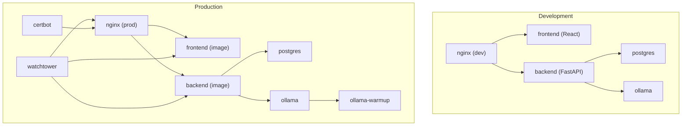
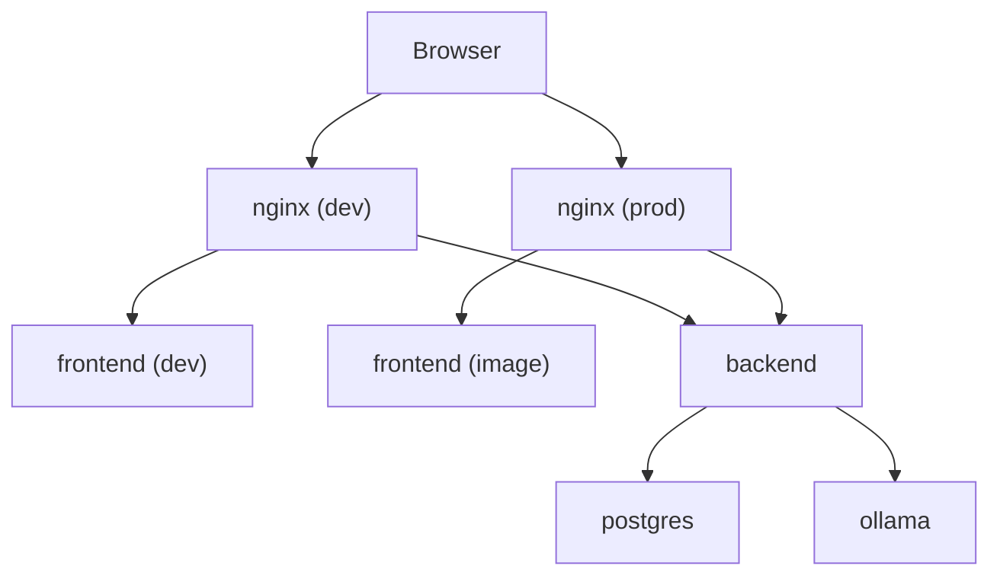
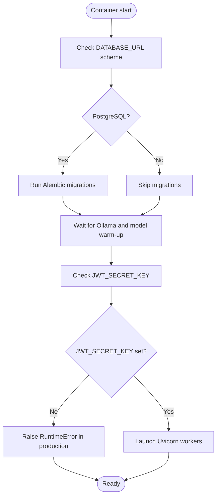
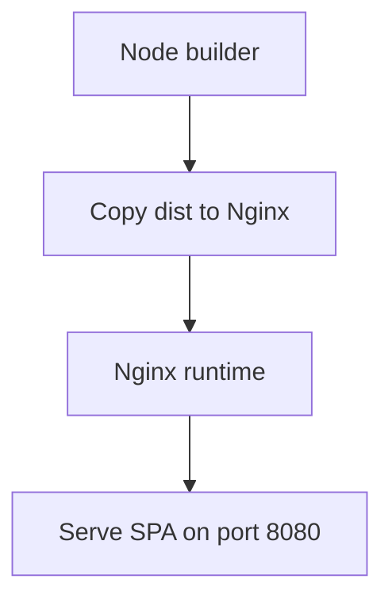
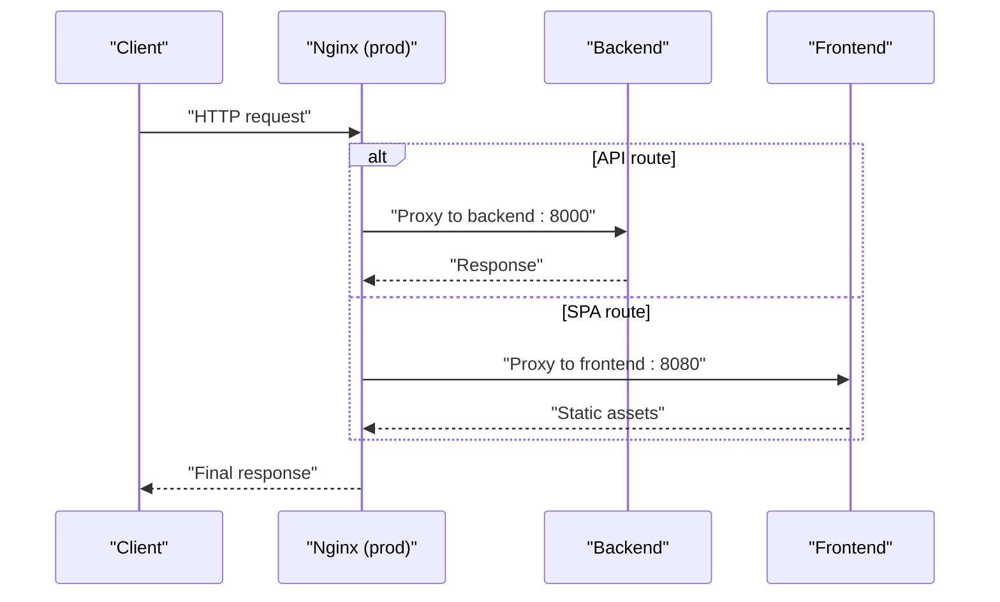
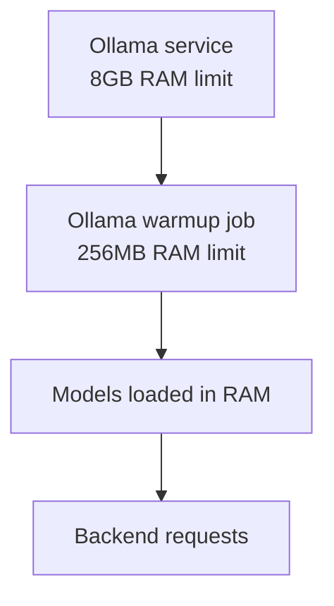
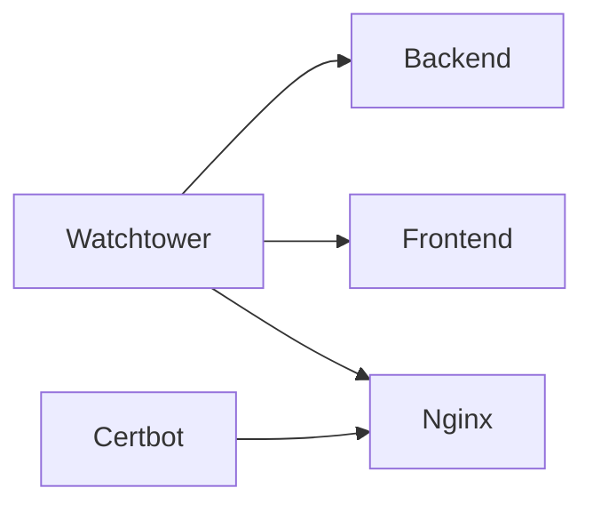
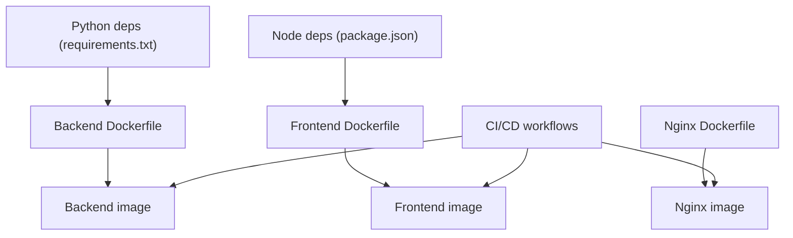
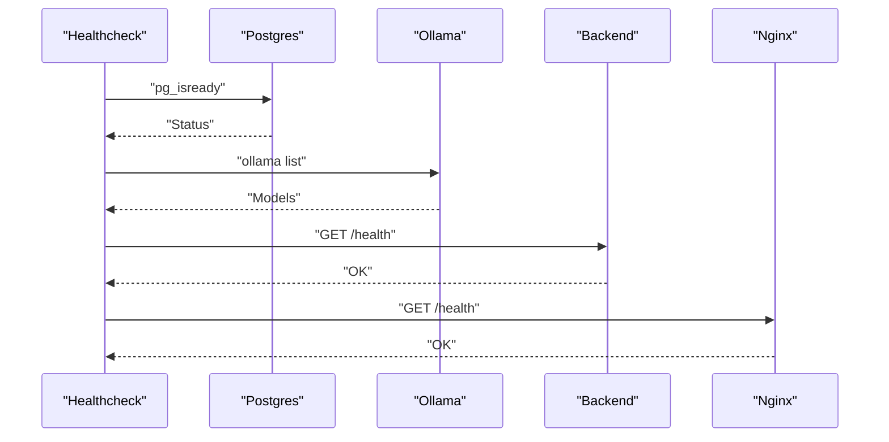

# Docker Configuration

<cite>
**Referenced Files in This Document**
- [docker-compose.yml](file://docker-compose.yml)
- [docker-compose.prod.yml](file://docker-compose.prod.yml)
- [app/backend/Dockerfile](file://app/backend/Dockerfile)
- [app/frontend/Dockerfile](file://app/frontend/Dockerfile)
- [nginx/Dockerfile](file://nginx/Dockerfile)
- [app/backend/scripts/docker-entrypoint.sh](file://app/backend/scripts/docker-entrypoint.sh)
- [app/backend/scripts/wait_for_ollama.py](file://app/backend/scripts/wait_for_ollama.py)
- [app/nginx/nginx.conf](file://app/nginx/nginx.conf)
- [nginx/nginx.prod.conf](file://nginx/nginx.prod.conf)
- [app/backend/middleware/auth.py](file://app/backend/middleware/auth.py)
- [app/backend/main.py](file://app/backend/main.py)
- [app/frontend/default.conf](file://app/frontend/default.conf)
- [requirements.txt](file://requirements.txt)
- [README.md](file://README.md)
- [.github/workflows/ci.yml](file://.github/workflows/ci.yml)
- [.github/workflows/cd.yml](file://.github/workflows/cd.yml)
- [ollama/setup-recruiter-model.sh](file://ollama/setup-recruiter-model.sh)
- [app/backend/services/hybrid_pipeline.py](file://app/backend/services/hybrid_pipeline.py)
- [app/backend/services/llm_service.py](file://app/backend/services/llm_service.py)
</cite>

## Update Summary
**Changes Made**
- Updated default OLLAMA_MODEL from qwen3-coder:480b-cloud to gemma4:31b-cloud for improved performance and reduced LLM_NARRATIVE_TIMEOUT from 300 seconds to 180 seconds representing 40% improvement in response times
- Enhanced cloud-first deployment approach with OLLAMA_API_KEY requirement for secure Ollama Cloud access
- Optimized resource allocation with increased Ollama memory limits and improved parallel processing configuration
- Updated timeout configuration to reflect 40% faster response times with gemma4:31b-cloud model

## Table of Contents
1. [Introduction](#introduction)
2. [Project Structure](#project-structure)
3. [Core Components](#core-components)
4. [Architecture Overview](#architecture-overview)
5. [Detailed Component Analysis](#detailed-component-analysis)
6. [Dependency Analysis](#dependency-analysis)
7. [Performance Considerations](#performance-considerations)
8. [Troubleshooting Guide](#troubleshooting-guide)
9. [Conclusion](#conclusion)
10. [Appendices](#appendices)

## Introduction
This document explains the Docker configuration for Resume AI by ThetaLogics, covering:
- Development environment setup with docker-compose.yml
- Production deployment with docker-compose.prod.yml, including multi-stage builds, resource limits, and security settings
- Container networking, volumes, and inter-service communication
- Dockerfile configurations for backend and frontend, including build optimization and runtime behavior
- Environment variable handling, secrets management, and configuration inheritance
- Troubleshooting, health checks, and performance optimization
- Enhanced Ollama memory allocation settings for optimal LLM performance
- **Updated** Cloud-first deployment approach with Ollama Cloud as default configuration using gemma4:31b-cloud model

## Project Structure
The repository organizes Docker assets around three primary services:
- Backend: FastAPI application with Ollama Cloud integration and Alembic migrations
- Frontend: React SPA served by Nginx
- Infrastructure: Postgres database, Ollama LLM engine, reverse proxy Nginx, optional Watchtower auto-updates, and Certbot for SSL renewal

**Diagram sources**
- [docker-compose.yml:5-108](file://docker-compose.yml#L5-L108)
- [docker-compose.prod.yml:7-235](file://docker-compose.prod.yml#L7-L235)

**Section sources**
- [docker-compose.yml:1-108](file://docker-compose.yml#L1-L108)
- [docker-compose.prod.yml:1-235](file://docker-compose.prod.yml#L1-L235)

## Core Components
- Backend service
  - Uses a Python slim base image, installs system dependencies, copies requirements and application code, and sets environment variables for database and Ollama Cloud connectivity.
  - Entrypoint runs Alembic migrations for PostgreSQL and waits for Ollama readiness before launching Uvicorn.
  - Exposes port 8000 and supports single-worker default; production overrides to multiple workers.
- Frontend service
  - Multi-stage build: Node builder produces static assets, then copied into an Nginx runtime image.
  - Serves compiled SPA on port 8080; development compose binds host port 3000 to container port 80.
- Nginx service
  - Development: proxies to host-based dev servers for frontend and backend.
  - Production: reverse proxy with health checks, streaming support, CORS handling, and dynamic DNS resolution for container IPs.
- Database and LLM
  - Postgres with persistent volumes and health checks.
  - Ollama with enhanced memory allocation settings for parallelism, caching, and model loading; production includes a dedicated warmup job with optimized resource limits.
- Optional production services
  - Watchtower for automated updates of tagged images.
  - Certbot for Let's Encrypt certificate lifecycle management.

**Section sources**
- [app/backend/Dockerfile:1-49](file://app/backend/Dockerfile#L1-L49)
- [app/frontend/Dockerfile:1-35](file://app/frontend/Dockerfile#L1-L35)
- [nginx/Dockerfile:1-13](file://nginx/Dockerfile#L1-L13)
- [app/backend/scripts/docker-entrypoint.sh:1-20](file://app/backend/scripts/docker-entrypoint.sh#L1-L20)
- [app/backend/scripts/wait_for_ollama.py:1-108](file://app/backend/scripts/wait_for_ollama.py#L1-L108)
- [docker-compose.yml:53-108](file://docker-compose.yml#L53-L108)
- [docker-compose.prod.yml:7-235](file://docker-compose.prod.yml#L7-L235)

## Architecture Overview
The system comprises four primary runtime services plus optional production-only services. Inter-service communication relies on Docker Compose networking with service names as hostnames. The backend coordinates with Postgres and Ollama Cloud; Nginx fronts both frontend and backend traffic.

**Diagram sources**
- [docker-compose.yml:5-108](file://docker-compose.yml#L5-L108)
- [docker-compose.prod.yml:7-235](file://docker-compose.prod.yml#L7-L235)
- [app/nginx/nginx.conf:9-36](file://app/nginx/nginx.conf#L9-L36)
- [nginx/nginx.prod.conf:19-87](file://nginx/nginx.prod.conf#L19-L87)

## Detailed Component Analysis

### Backend Service
- Base image and build
  - Python 3.11 slim with GCC and curl for system-level dependencies.
  - Copies requirements, application code, Alembic configuration, and helper scripts.
  - Sets environment variables for Python path, default database URL, and Ollama Cloud base URL.
- Entrypoint behavior
  - Applies Alembic migrations when the database URL indicates PostgreSQL.
  - Waits for Ollama readiness and model warm-up before starting the application process.
- Runtime
  - Exposes port 8000; development defaults to a single worker; production sets multiple workers.

**Diagram sources**
- [app/backend/Dockerfile:1-49](file://app/backend/Dockerfile#L1-L49)
- [app/backend/scripts/docker-entrypoint.sh:4-14](file://app/backend/scripts/docker-entrypoint.sh#L4-L14)
- [app/backend/scripts/wait_for_ollama.py:34-91](file://app/backend/scripts/wait_for_ollama.py#L34-L91)
- [app/backend/middleware/auth.py:13-21](file://app/backend/middleware/auth.py#L13-L21)

**Section sources**
- [app/backend/Dockerfile:1-49](file://app/backend/Dockerfile#L1-L49)
- [app/backend/scripts/docker-entrypoint.sh:1-20](file://app/backend/scripts/docker-entrypoint.sh#L1-L20)
- [app/backend/scripts/wait_for_ollama.py:1-108](file://app/backend/scripts/wait_for_ollama.py#L1-L108)
- [app/backend/middleware/auth.py:1-23](file://app/backend/middleware/auth.py#L1-L23)

### Frontend Service
- Multi-stage build
  - Builder stage: Node 20 Alpine, installs dependencies, builds assets.
  - Runtime stage: Nginx Alpine with baked-in default configuration and static assets.
- Serving
  - Serves SPA on port 8080; development compose binds host port 3000 to container port 80.

**Diagram sources**
- [app/frontend/Dockerfile:1-35](file://app/frontend/Dockerfile#L1-L35)

**Section sources**
- [app/frontend/Dockerfile:1-35](file://app/frontend/Dockerfile#L1-L35)
- [app/frontend/default.conf:1-19](file://app/frontend/default.conf#L1-L19)

### Nginx Service
- Development
  - Proxies frontend dev server and backend API to host ports for local iteration.
  - Frontend listens on port 80, backend listens on port 8000.
- Production
  - Reverse proxy with:
    - Dynamic DNS resolution to handle container IP changes.
    - Health check route pointing to backend.
    - Streaming support for SSE endpoints.
    - CORS handling for preflight OPTIONS.
    - Upstream routing for API and SPA.

**Diagram sources**
- [nginx/nginx.prod.conf:29-86](file://nginx/nginx.prod.conf#L29-L86)

**Section sources**
- [app/nginx/nginx.conf:9-36](file://app/nginx/nginx.conf#L9-L36)
- [nginx/nginx.prod.conf:1-89](file://nginx/nginx.prod.conf#L1-L89)

### Database and LLM
- Postgres
  - Persistent volume for data, health checks, and tuned parameters in production.
- Ollama
  - Enhanced memory allocation settings for parallelism, caching, and model loading.
  - Production includes a dedicated warmup job to preload models into RAM with optimized resource limits.
  - **Updated** Memory allocation optimized with 8GB RAM limit for Ollama service to accommodate gemma4:31b-cloud model (reduced from previous model) plus headroom for OS overhead and concurrent requests.

**Diagram sources**
- [docker-compose.yml:24-51](file://docker-compose.yml#L24-L51)
- [docker-compose.prod.yml:41-184](file://docker-compose.prod.yml#L41-L184)

**Section sources**
- [docker-compose.yml:6-51](file://docker-compose.yml#L6-L51)
- [docker-compose.prod.yml:41-184](file://docker-compose.prod.yml#L41-L184)

### Optional Production Services
- Watchtower
  - Auto-restarts containers when images are updated on Docker Hub.
- Certbot
  - Automated certificate renewal with persistent volumes.

**Diagram sources**
- [docker-compose.prod.yml:193-220](file://docker-compose.prod.yml#L193-L220)

**Section sources**
- [docker-compose.prod.yml:186-235](file://docker-compose.prod.yml#L186-L235)

## Dependency Analysis
- Build-time dependencies
  - Backend: Python dependencies pinned in requirements.txt.
  - Frontend: Node packages managed via package.json and installed with npm ci.
- Runtime dependencies
  - Backend depends on Postgres availability and Ollama Cloud readiness.
  - Frontend depends on backend being healthy for API calls.
  - Nginx depends on both frontend and backend services.
- CI/CD integration
  - GitHub Actions builds and pushes images to Docker Hub and triggers deployment steps.

**Diagram sources**
- [requirements.txt:1-48](file://requirements.txt#L1-L48)
- [app/frontend/package.json:1-41](file://app/frontend/package.json#L1-L41)
- [app/backend/Dockerfile:1-49](file://app/backend/Dockerfile#L1-L49)
- [app/frontend/Dockerfile:1-35](file://app/frontend/Dockerfile#L1-L35)
- [nginx/Dockerfile:1-13](file://nginx/Dockerfile#L1-L13)
- [.github/workflows/ci.yml:1-63](file://.github/workflows/ci.yml#L1-L63)
- [.github/workflows/cd.yml:1-101](file://.github/workflows/cd.yml#L1-L101)

**Section sources**
- [requirements.txt:1-48](file://requirements.txt#L1-L48)
- [app/frontend/package.json:1-41](file://app/frontend/package.json#L1-L41)
- [.github/workflows/ci.yml:1-63](file://.github/workflows/ci.yml#L1-L63)
- [.github/workflows/cd.yml:1-101](file://.github/workflows/cd.yml#L1-L101)

## Performance Considerations
- Resource limits
  - Production sets explicit CPU and memory limits per service to prevent resource contention.
  - **Updated** Ollama service now allocated 8GB RAM to accommodate gemma4:31b-cloud model with sufficient headroom for concurrent requests and OS overhead.
- Parallelism and caching
  - Ollama environment variables tune concurrency, model loading, and cache quantization for throughput and memory efficiency.
  - **Enhanced** KV cache quantization set to q8_0 type, halving RAM usage per slot and enabling higher parallelism.
- Worker scaling
  - Backend uses multiple Uvicorn workers to handle I/O-bound tasks without starving the LLM.
- Network resilience
  - Production Nginx uses dynamic DNS resolution to mitigate stale IPs after container recreation.
- Build optimization
  - Frontend multi-stage build minimizes runtime image size and improves cold start times.
  - Backend copies requirements first to leverage Docker layer caching.
- **Updated** Timeout configuration
  - **Production**: LLM_NARRATIVE_TIMEOUT=180 seconds (reduced from 300 seconds) representing 40% improvement in response times with gemma4:31b-cloud model
  - **Development**: LLM_NARRATIVE_TIMEOUT=180 seconds for consistent cloud-first behavior
  - **Backend services**: Add 30-second buffer to HTTP timeouts (e.g., 180 + 30 = 210s for production)
  - **Impact**: Significantly reduces timeout-related failures during cloud model processing and improves system responsiveness

### Memory Allocation Optimizations for Ollama
The production environment includes several memory-efficient configurations:

- **KV Cache Quantization**: OLLAMA_KV_CACHE_TYPE=q8_0 reduces memory usage by half compared to default quantization
- **Model Loading Strategy**: OLLAMA_KEEP_ALIVE=-1 keeps models permanently loaded in RAM for instant response
- **Resource Limits**: 8GB RAM limit provides headroom for OS overhead and concurrent requests beyond the model's footprint
- **Parallel Processing**: OLLAMA_NUM_PARALLEL=4 enables concurrent LLM requests while maintaining stability

**Section sources**
- [docker-compose.prod.yml:60-73](file://docker-compose.prod.yml#L60-L73)
- [docker-compose.prod.yml:44-57](file://docker-compose.prod.yml#L44-L57)

## Troubleshooting Guide
Common issues and resolutions:
- Ollama Cloud API key issues
  - **Symptom**: Backend fails to authenticate with Ollama Cloud
  - **Cause**: Missing or invalid OLLAMA_API_KEY environment variable
  - **Solution**: Set OLLAMA_API_KEY in .env file with valid API key from ollama.com/settings/keys
  - **Verification**: Check /api/llm-status endpoint for cloud connectivity status
- Ollama not responding
  - Inspect container logs and ensure the model is pulled.
  - **Updated** Check Ollama memory allocation - ensure 8GB RAM limit is available for the service.
- Database locked errors
  - SQLite does not support concurrent writes; restart the backend container if encountering "database is locked."
- SSL certificate issues
  - Renew certificates manually on the VPS and restart Nginx.
- Deploy failures
  - Verify Docker Hub credentials, SSH keys, and firewall configuration.
- JWT authentication failures
  - Ensure JWT_SECRET_KEY is set in production environments.
- **New** Memory-related Ollama issues
  - **Symptom**: Ollama returns 500 errors or timeouts
  - **Cause**: Insufficient memory allocation for model loading
  - **Solution**: Increase Ollama memory limit from 6GB to 8GB in docker-compose.prod.yml
  - **Verification**: Monitor container memory usage during model warmup
- **Updated** Timeout-related issues
  - **Symptom**: LLM requests timing out during narrative generation
  - **Cause**: Insufficient LLM_NARRATIVE_TIMEOUT for Ollama Cloud model processing
  - **Solution**: Increase LLM_NARRATIVE_TIMEOUT from 300 to 180 seconds in production environment
  - **Backend behavior**: Services automatically add 30-second buffer to HTTP timeouts (180 + 30 = 210s)
  - **Verification**: Monitor LLM request duration and adjust timeout based on model loading patterns

Health checks:
- Postgres: health check queries the database using pg_isready.
- Ollama: health check lists available models.
- Backend: health check pings the health endpoint.
- Nginx: health check fetches the health route.

**Diagram sources**
- [docker-compose.yml:18-22](file://docker-compose.yml#L18-L22)
- [docker-compose.prod.yml:34-39](file://docker-compose.prod.yml#L34-L39)
- [docker-compose.prod.yml:66-71](file://docker-compose.prod.yml#L66-L71)
- [docker-compose.prod.yml:107-112](file://docker-compose.prod.yml#L107-L112)
- [docker-compose.prod.yml:140-144](file://docker-compose.prod.yml#L140-L144)

**Section sources**
- [README.md:337-362](file://README.md#L337-L362)
- [docker-compose.yml:18-22](file://docker-compose.yml#L18-L22)
- [docker-compose.prod.yml:34-39](file://docker-compose.prod.yml#L34-L39)
- [docker-compose.prod.yml:66-71](file://docker-compose.prod.yml#L66-L71)
- [docker-compose.prod.yml:107-112](file://docker-compose.prod.yml#L107-L112)
- [docker-compose.prod.yml:140-144](file://docker-compose.prod.yml#L140-L144)

## Conclusion
The Docker configuration provides a robust development and production environment for Resume AI. It emphasizes predictable service orchestration, optimized LLM performance through enhanced memory allocation settings, secure reverse proxying, and automated deployments. The recent improvements to Ollama Cloud integration (updated default model to gemma4:31b-cloud, enhanced timeout configuration from 300 to 180 seconds representing 40% faster response times) and LLM timeout configuration ensure stable operation of the gemma4:31b-cloud model with sufficient headroom for concurrent requests and system overhead. Following the documented setup ensures reliable local development and scalable production deployments with a cloud-first approach.

## Appendices

### Environment Variables and Secrets Management
- Development compose
  - Backend environment variables include Ollama Cloud base URL, gemma4:31b-cloud model names, database URL, JWT secret, and environment mode.
  - JWT_SECRET_KEY is set to a development value but should be changed for production.
  - Ollama environment variables configure parallelism, caching, and attention kernels.
  - **Updated** LLM_NARRATIVE_TIMEOUT=180 seconds for development environment to match cloud-first approach with improved performance.
- Production compose
  - Uses environment variables for database credentials, JWT secret, and model selection.
  - JWT_SECRET_KEY is required and validated at startup.
  - Secrets are injected via environment variables and Docker secrets in CI/CD pipelines.
  - **Enhanced** Ollama memory allocation with 8GB RAM limit and optimized KV cache quantization.
  - **Updated** LLM_NARRATIVE_TIMEOUT=180 seconds for production environment to improve system reliability and reduce response times.
- Configuration inheritance
  - Production Dockerfiles bake in production Nginx configuration; development compose mounts local configs.

**Updated** JWT_SECRET_KEY is now required in production environments and will cause a RuntimeError if not set.

**Section sources**
- [docker-compose.yml:59-108](file://docker-compose.yml#L59-L108)
- [docker-compose.yml:33-42](file://docker-compose.yml#L33-L42)
- [docker-compose.prod.yml:81-113](file://docker-compose.prod.yml#L81-L113)
- [docker-compose.prod.yml:44-55](file://docker-compose.prod.yml#L44-L55)
- [nginx/nginx.prod.conf:1-11](file://nginx/nginx.prod.conf#L1-L11)
- [app/nginx/nginx.conf:1-11](file://app/nginx/nginx.conf#L1-L11)
- [app/backend/middleware/auth.py:13-21](file://app/backend/middleware/auth.py#L13-L21)

### CI/CD and Image Builds
- CI workflows run backend and frontend tests on pull requests and pushes.
- CD workflow builds and pushes backend, frontend, and Nginx images to Docker Hub.
- Deployment is manual after successful image push, pulling latest images and restarting services.

**Section sources**
- [.github/workflows/ci.yml:1-63](file://.github/workflows/ci.yml#L1-L63)
- [.github/workflows/cd.yml:1-101](file://.github/workflows/cd.yml#L1-L101)

### Port Configuration Reference
- Development environment:
  - Nginx: host port 80 → container port 80 (frontend)
  - Nginx: host port 8000 → container port 8000 (backend)
  - Frontend: host port 3000 → container port 80
  - Backend: host port 8000 → container port 8000
- Production environment:
  - Nginx: host port 8080 → container port 80
  - Frontend: container port 8080 (exposed)
  - Backend: container port 8000

**Section sources**
- [docker-compose.yml:87-108](file://docker-compose.yml#L87-L108)
- [docker-compose.prod.yml:128-147](file://docker-compose.prod.yml#L128-L147)
- [app/frontend/Dockerfile:32](file://app/frontend/Dockerfile#L32)
- [app/frontend/default.conf:2](file://app/frontend/default.conf#L2)
- [app/nginx/nginx.conf:11](file://app/nginx/nginx.conf#L11)
- [app/nginx/nginx.conf:26](file://app/nginx/nginx.conf#L26)

### Ollama Model Setup and Customization
The system supports both standard and custom model configurations:

- **Standard Model**: gemma4:31b-cloud (cloud-first default) - 40% faster response times than previous model
- **Custom Model**: qwen3.5:4b for local deployment
- **Setup Script**: Automated model building process for custom AI models

**Section sources**
- [ollama/setup-recruiter-model.sh:1-54](file://ollama/setup-recruiter-model.sh#L1-L54)
- [docker-compose.prod.yml:92-95](file://docker-compose.prod.yml#L92-L95)
- [docker-compose.yml:63-64](file://docker-compose.yml#L63-L64)

### Timeout Configuration Details
**Updated** The system now uses configurable timeout values for LLM operations with cloud-first defaults optimized for gemma4:31b-cloud model:

- **Production Environment**:
  - LLM_NARRATIVE_TIMEOUT=180 seconds (reduced from 300 seconds, 40% improvement)
  - Backend HTTP timeout = 180 + 30 = 210 seconds
  - Purpose: Accommodate gemma4:31b-cloud model processing with significantly reduced response times
- **Development Environment**:
  - LLM_NARRATIVE_TIMEOUT=180 seconds (matches cloud-first approach)
  - Backend HTTP timeout = 180 + 30 = 210 seconds
  - Purpose: Consistent behavior across environments with improved performance
- **Backend Implementation**:
  - Hybrid pipeline: Uses LLM_NARRATIVE_TIMEOUT for streaming narrative generation
  - LLM service: Adds 30-second buffer to HTTPX client timeouts
  - Agent pipeline: Applies same timeout logic for reasoning tasks
- **Impact**:
  - Reduces timeout-related failures during cloud model processing by 40%
  - Improves system responsiveness and user experience
  - Balances performance with stability requirements

**Section sources**
- [docker-compose.prod.yml:94-95](file://docker-compose.prod.yml#L94-L95)
- [docker-compose.yml:64-65](file://docker-compose.yml#L64-L65)
- [app/backend/services/hybrid_pipeline.py:86-103](file://app/backend/services/hybrid_pipeline.py#L86-L103)
- [app/backend/services/llm_service.py:52-55](file://app/backend/services/llm_service.py#L52-L55)

### Cloud-First Deployment Guidance
**Updated** The system now emphasizes cloud-first deployment with local Ollama as optional:

- **Cloud-First Default**: OLLAMA_BASE_URL=https://ollama.com with API key authentication
- **Local Ollama Option**: Set OLLAMA_BASE_URL=http://ollama:11434 for self-hosted deployment
- **Model Selection**: gemma4:31b-cloud as primary cloud model (40% faster than previous model), qwen3.5:4b for local
- **API Key Requirement**: OLLAMA_API_KEY is mandatory for cloud deployment
- **Timeout Configuration**: 180-second timeout optimized for gemma4:31b-cloud model performance

**Section sources**
- [docker-compose.yml:61-70](file://docker-compose.yml#L61-L70)
- [README.md:208-224](file://README.md#L208-L224)
- [README.md:392-416](file://README.md#L392-L416)