# Docker Configuration

<cite>
**Referenced Files in This Document**
- [docker-compose.yml](file://docker-compose.yml)
- [docker-compose.prod.yml](file://docker-compose.prod.yml)
- [app/backend/Dockerfile](file://app/backend/Dockerfile)
- [app/frontend/Dockerfile](file://app/frontend/Dockerfile)
- [nginx/Dockerfile](file://nginx/Dockerfile)
- [app/speech_service/Dockerfile](file://app/speech_service/Dockerfile)
- [app/speech_service/main.py](file://app/speech_service/main.py)
- [app/speech_service/requirements.txt](file://app/speech_service/requirements.txt)
- [app/voice_agent/Dockerfile](file://app/voice_agent/Dockerfile)
- [app/voice_agent/Dockerfile.livekit](file://app/voice_agent/Dockerfile.livekit)
- [app/voice_agent/agent.py](file://app/voice_agent/agent.py)
- [app/voice_agent/livekit.yaml](file://app/voice_agent/livekit.yaml)
- [app/backend/scripts/docker-entrypoint.sh](file://app/backend/scripts/docker-entrypoint.sh)
- [app/backend/scripts/wait_for_ollama.py](file://app/backend/scripts/wait_for_ollama.py)
- [app/nginx/nginx.conf](file://app/nginx/nginx.conf)
- [nginx/nginx.prod.conf](file://nginx/nginx.prod.conf)
- [app/backend/middleware/auth.py](file://app/backend/middleware/auth.py)
- [app/backend/main.py](file://app/backend/main.py)
- [app/frontend/default.conf](file://app/frontend/default.conf)
- [requirements.txt](file://requirements.txt)
- [README.md](file://README.md)
- [.github/workflows/ci.yml](file://.github/workflows/ci.yml)
- [.github/workflows/cd.yml](file://.github/workflows/cd.yml)
- [ollama/setup-recruiter-model.sh](file://ollama/setup-recruiter-model.sh)
- [app/backend/services/hybrid_pipeline.py](file://app/backend/services/hybrid_pipeline.py)
- [app/backend/services/llm_service.py](file://app/backend/services/llm_service.py)
</cite>

## Update Summary
**Changes Made**
- Updated LiveKit server configuration approach from volume-mounted to image-baked configuration
- Added new Dockerfile.livekit that copies livekit.yaml directly into the container during build process
- Production compose file now uses custom image revanth2245/resume-livekit:latest instead of official livekit/livekit-server:latest
- Development compose file uses build directive referencing the new Dockerfile.livekit while maintaining custom image tag
- Enhanced LiveKit configuration management with embedded YAML file approach
- Updated container networking and inter-service communication patterns for voice services

## Table of Contents
1. [Introduction](#introduction)
2. [Project Structure](#project-structure)
3. [Core Components](#core-components)
4. [Architecture Overview](#architecture-overview)
5. [Detailed Component Analysis](#detailed-component-analysis)
6. [Voice Screening Infrastructure](#voice-screening-infrastructure)
7. [Dependency Analysis](#dependency-analysis)
8. [Performance Considerations](#performance-considerations)
9. [Troubleshooting Guide](#troubleshooting-guide)
10. [Conclusion](#conclusion)
11. [Appendices](#appendices)

## Introduction
This document explains the Docker configuration for Resume AI by ThetaLogics, covering:
- Development environment setup with docker-compose.yml
- Production deployment with docker-compose.prod.yml, including multi-stage builds, resource limits, and security settings
- Container networking, volumes, and inter-service communication
- Dockerfile configurations for backend and frontend, including build optimization and runtime behavior
- **Updated** Voice screening infrastructure with speech-service, voice-agent, and LiveKit integration
- **Enhanced** CPU-optimized speech processing with STT, TTS, and VAD capabilities
- **Updated** LiveKit server configuration approach with image-baked YAML configuration
- Environment variable handling, secrets management, and configuration inheritance
- Troubleshooting, health checks, and performance optimization
- Enhanced Ollama memory allocation settings for optimal LLM performance

## Project Structure
The repository organizes Docker assets around seven primary services plus voice infrastructure:
- Backend: FastAPI application with Ollama Cloud integration and Alembic migrations
- Frontend: React SPA served by Nginx
- Infrastructure: Postgres database, Ollama LLM engine, reverse proxy Nginx, optional Watchtower auto-updates, and Certbot for SSL renewal
- **New** Speech Service: CPU-optimized STT, TTS, and VAD processing with 4GB RAM allocation
- **New** Voice Agent: LiveKit Agents process for conversation orchestration with 2GB RAM allocation
- **New** LiveKit Server: WebRTC SFU + SIP trunking for voice calls with 1GB RAM allocation and embedded configuration
- **Enhanced** Redis integration for LiveKit multi-node deployment support

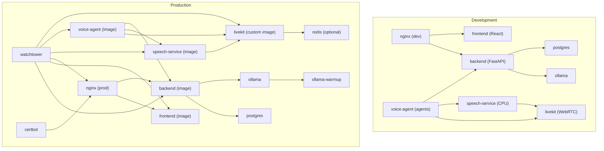

**Diagram sources**
- [docker-compose.yml:5-180](file://docker-compose.yml#L5-L180)
- [docker-compose.prod.yml:7-320](file://docker-compose.prod.yml#L7-L320)

**Section sources**
- [docker-compose.yml:1-180](file://docker-compose.yml#L1-L180)
- [docker-compose.prod.yml:1-320](file://docker-compose.prod.yml#L1-L320)

## Core Components
- Backend service
  - Uses a Python slim base image, installs system dependencies, copies requirements and application code, and sets environment variables for database and Ollama Cloud connectivity.
  - Entrypoint runs Alembic migrations for PostgreSQL and waits for Ollama readiness before launching Uvicorn.
  - Exposes port 8000 and supports single-worker default; production overrides to multiple workers.
- Frontend service
  - Multi-stage build: Node builder produces static assets, then copied into an Nginx runtime image.
  - Serves compiled SPA on port 8080; development compose binds host port 3000 to container port 80.
- Nginx service
  - Development: proxies to host-based dev servers for frontend and backend.
  - Production: reverse proxy with health checks, streaming support, CORS handling, and dynamic DNS resolution for container IPs.
- Database and LLM
  - Postgres with persistent volumes and health checks.
  - Ollama with enhanced memory allocation settings for parallelism, caching, and model loading; production includes a dedicated warmup job with optimized resource limits.
- **New** Speech Service
  - CPU-optimized FastAPI service with 4GB RAM allocation for STT, TTS, and VAD processing.
  - Uses Parakeet TDT 1.1B for speech-to-text, Kokoro 82M for text-to-speech, and Silero VAD for speech detection.
  - Exposes port 8001 for internal communication and includes health checks for model readiness.
- **New** Voice Agent
  - LiveKit Agents process with 2GB RAM allocation for conversation orchestration.
  - Integrates with Speech Service, LiveKit Server, and Ollama Cloud for voice screening workflows.
  - Supports outbound calls, inbound callbacks, and conversation state management.
- **New** LiveKit Server
  - **Updated** WebRTC SFU + SIP trunking for voice calls with 1GB RAM allocation and embedded configuration approach.
  - **Updated** Uses custom image revanth2245/resume-livekit:latest with Dockerfile.livekit that copies livekit.yaml directly into the container during build process.
  - Provides WebSocket (7880), RTC (7881), and TURN (7882/udp) interfaces.
  - **Updated** Configuration via embedded livekit.yaml file instead of volume mounting for improved reliability and deployment consistency.
  - **Enhanced** Redis integration support for multi-node deployment scenarios.
- Optional production services
  - Watchtower for automated updates of tagged images including new voice services.
  - Certbot for Let's Encrypt certificate lifecycle management.

**Section sources**
- [app/backend/Dockerfile:1-55](file://app/backend/Dockerfile#L1-L55)
- [app/frontend/Dockerfile:1-35](file://app/frontend/Dockerfile#L1-L35)
- [nginx/Dockerfile:1-13](file://nginx/Dockerfile#L1-L13)
- [app/speech_service/Dockerfile:1-32](file://app/speech_service/Dockerfile#L1-L32)
- [app/voice_agent/Dockerfile:1-31](file://app/voice_agent/Dockerfile#L1-L31)
- [app/voice_agent/Dockerfile.livekit:1-3](file://app/voice_agent/Dockerfile.livekit#L1-L3)
- [app/backend/scripts/docker-entrypoint.sh:1-20](file://app/backend/scripts/docker-entrypoint.sh#L1-L20)
- [app/backend/scripts/wait_for_ollama.py:1-108](file://app/backend/scripts/wait_for_ollama.py#L1-L108)
- [docker-compose.yml:53-180](file://docker-compose.yml#L53-L180)
- [docker-compose.prod.yml:7-320](file://docker-compose.prod.yml#L7-L320)

## Architecture Overview
The system comprises seven primary runtime services plus optional production-only services. Inter-service communication relies on Docker Compose networking with service names as hostnames. The backend coordinates with Postgres and Ollama Cloud; Nginx fronts both frontend and backend traffic. **New** voice services integrate through LiveKit for WebRTC communication and speech processing services for audio analysis.

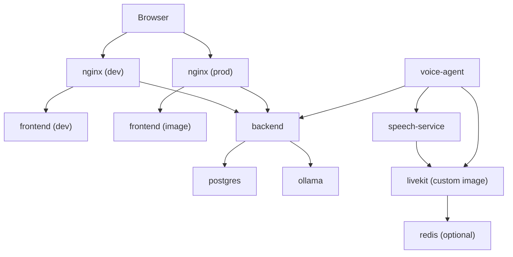

**Diagram sources**
- [docker-compose.yml:5-180](file://docker-compose.yml#L5-L180)
- [docker-compose.prod.yml:7-320](file://docker-compose.prod.yml#L7-L320)
- [app/nginx/nginx.conf:9-36](file://app/nginx/nginx.conf#L9-L36)
- [nginx/nginx.prod.conf:19-87](file://nginx/nginx.prod.conf#L19-L87)

## Detailed Component Analysis

### Backend Service
- Base image and build
  - Python 3.11 slim with GCC and curl for system-level dependencies.
  - Copies requirements, application code, Alembic configuration, and helper scripts.
  - Sets environment variables for Python path, default database URL, and Ollama Cloud base URL.
- Entrypoint behavior
  - Applies Alembic migrations when the database URL indicates PostgreSQL.
  - Waits for Ollama readiness and model warm-up before starting the application process.
- Runtime
  - Exposes port 8000; development defaults to a single worker; production sets multiple workers.

**Diagram sources**
- [app/backend/Dockerfile:1-55](file://app/backend/Dockerfile#L1-L55)
- [app/backend/scripts/docker-entrypoint.sh:4-14](file://app/backend/scripts/docker-entrypoint.sh#L4-L14)
- [app/backend/scripts/wait_for_ollama.py:34-91](file://app/backend/scripts/wait_for_ollama.py#L34-L91)
- [app/backend/middleware/auth.py:13-21](file://app/backend/middleware/auth.py#L13-L21)

**Section sources**
- [app/backend/Dockerfile:1-55](file://app/backend/Dockerfile#L1-L55)
- [app/backend/scripts/docker-entrypoint.sh:1-20](file://app/backend/scripts/docker-entrypoint.sh#L1-L20)
- [app/backend/scripts/wait_for_ollama.py:1-108](file://app/backend/scripts/wait_for_ollama.py#L1-L108)
- [app/backend/middleware/auth.py:1-23](file://app/backend/middleware/auth.py#L1-L23)

### Frontend Service
- Multi-stage build
  - Builder stage: Node 20 Alpine, installs dependencies, builds assets.
  - Runtime stage: Nginx Alpine with baked-in default configuration and static assets.
- Serving
  - Serves SPA on port 8080; development compose binds host port 3000 to container port 80.

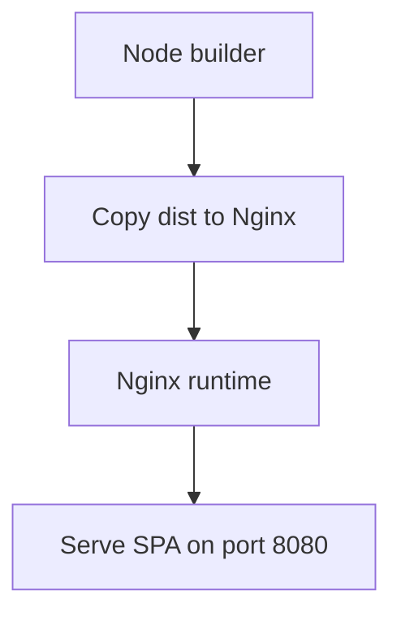

**Diagram sources**
- [app/frontend/Dockerfile:1-35](file://app/frontend/Dockerfile#L1-L35)

**Section sources**
- [app/frontend/Dockerfile:1-35](file://app/frontend/Dockerfile#L1-L35)
- [app/frontend/default.conf:1-19](file://app/frontend/default.conf#L1-L19)

### Nginx Service
- Development
  - Proxies frontend dev server and backend API to host ports for local iteration.
  - Frontend listens on port 80, backend listens on port 8000.
- Production
  - Reverse proxy with:
    - Dynamic DNS resolution to handle container IP changes.
    - Health check route pointing to backend.
    - Streaming support for SSE endpoints.
    - CORS handling for preflight OPTIONS.
    - Upstream routing for API and SPA.

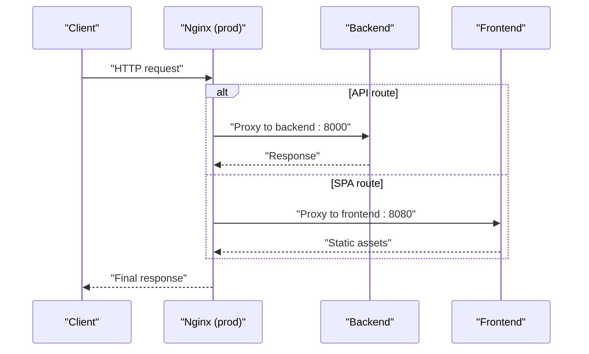

**Diagram sources**
- [nginx/nginx.prod.conf:29-86](file://nginx/nginx.prod.conf#L29-L86)

**Section sources**
- [app/nginx/nginx.conf:9-36](file://app/nginx/nginx.conf#L9-L36)
- [nginx/nginx.prod.conf:1-89](file://nginx/nginx.prod.conf#L1-L89)

### Database and LLM
- Postgres
  - Persistent volume for data, health checks, and tuned parameters in production.
- Ollama
  - Enhanced memory allocation settings for parallelism, caching, and model loading.
  - Production includes a dedicated warmup job to preload models into RAM with optimized resource limits.
  - **Updated** Memory allocation optimized with 8GB RAM limit for Ollama service to accommodate gemma4:31b-cloud model (reduced from previous model) plus headroom for OS overhead and concurrent requests.

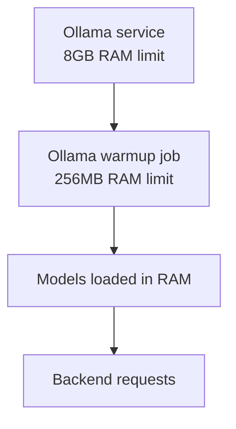

**Diagram sources**
- [docker-compose.yml:24-52](file://docker-compose.yml#L24-L52)
- [docker-compose.prod.yml:41-190](file://docker-compose.prod.yml#L41-L190)

**Section sources**
- [docker-compose.yml:6-52](file://docker-compose.yml#L6-L52)
- [docker-compose.prod.yml:41-190](file://docker-compose.prod.yml#L41-L190)

### LiveKit Server
- **Updated** WebRTC SFU + SIP trunking server with 1GB RAM allocation and embedded configuration approach
- **Updated** Uses custom image revanth2245/resume-livekit:latest built with Dockerfile.livekit that copies livekit.yaml directly into the container during build process
- **Updated** WebSocket interface on port 7880 for signaling
- **Updated** RTC interface on port 7881 for media streams
- **Updated** TURN server on UDP port 7882 for NAT traversal
- **Updated** Embedded configuration via livekit.yaml file copied during build instead of volume mounting for improved reliability
- **Updated** Port range configuration for media streams (50000-60000)
- **Updated** External IP and TCP port configuration for public accessibility
- **Enhanced** Redis integration support for multi-node deployment scenarios

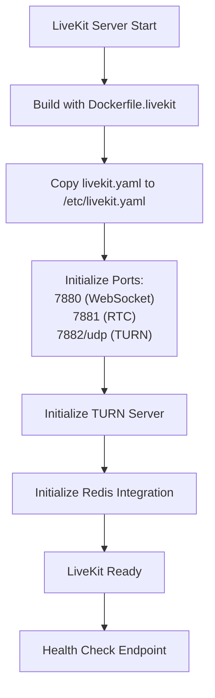

**Diagram sources**
- [app/voice_agent/Dockerfile.livekit:1-3](file://app/voice_agent/Dockerfile.livekit#L1-L3)
- [app/voice_agent/livekit.yaml:4-16](file://app/voice_agent/livekit.yaml#L4-L16)
- [app/voice_agent/livekit.yaml:24-26](file://app/voice_agent/livekit.yaml#L24-L26)

**Section sources**
- [app/voice_agent/Dockerfile.livekit:1-3](file://app/voice_agent/Dockerfile.livekit#L1-L3)
- [app/voice_agent/livekit.yaml:1-42](file://app/voice_agent/livekit.yaml#L1-L42)
- [docker-compose.yml:114-136](file://docker-compose.yml#L114-L136)
- [docker-compose.prod.yml:236-260](file://docker-compose.prod.yml#L236-L260)

### Optional Production Services
- Watchtower
  - Auto-restarts containers when images are updated on Docker Hub, including new voice services.
- Certbot
  - Automated certificate renewal with persistent volumes.

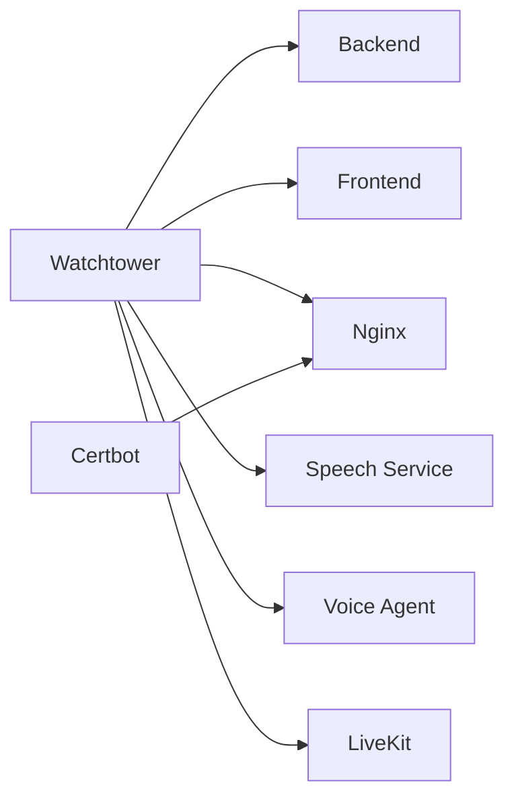

**Diagram sources**
- [docker-compose.prod.yml:192-235](file://docker-compose.prod.yml#L192-L235)

**Section sources**
- [docker-compose.prod.yml:186-235](file://docker-compose.prod.yml#L186-L235)

## Voice Screening Infrastructure

### Speech Service
- **New** CPU-optimized speech processing service with 4GB RAM allocation
- Multi-stage Docker build with system dependencies for audio processing
- **Enhanced** Non-root user execution with proper permissions
- **New** Health check with 120-second start period for model loading
- **New** FastAPI endpoints for STT, TTS, and VAD processing
- **New** Model loading strategy with Parakeet TDT 1.1B, Kokoro 82M, and Silero VAD v5
- **New** Support for various audio formats (WAV, MP3, OGG, raw PCM)

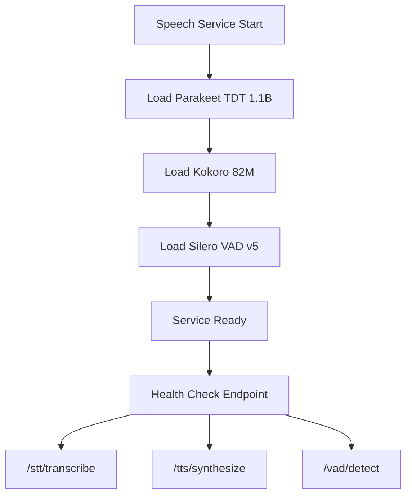

**Diagram sources**
- [app/speech_service/Dockerfile:1-32](file://app/speech_service/Dockerfile#L1-L32)
- [app/speech_service/main.py:37-200](file://app/speech_service/main.py#L37-L200)

**Section sources**
- [app/speech_service/Dockerfile:1-32](file://app/speech_service/Dockerfile#L1-L32)
- [app/speech_service/main.py:1-387](file://app/speech_service/main.py#L1-L387)
- [app/speech_service/requirements.txt:1-14](file://app/speech_service/requirements.txt#L1-L14)

### Voice Agent
- **New** LiveKit Agents process with 2GB RAM allocation for conversation orchestration
- **New** Integration with Speech Service, LiveKit Server, and Ollama Cloud
- **New** Conversation state machine supporting greeting, consent, introduction, screening, follow-up, wrap-up, analysis, and ended states
- **New** Edge case handling for silence, unclear responses, rescheduling, compensation inquiries, and AI detection
- **New** Asynchronous HTTP clients for Speech Service, LLM, and Backend API communication
- **New** Tenant configuration and candidate information retrieval
- **New** Time budget management and conversation flow control

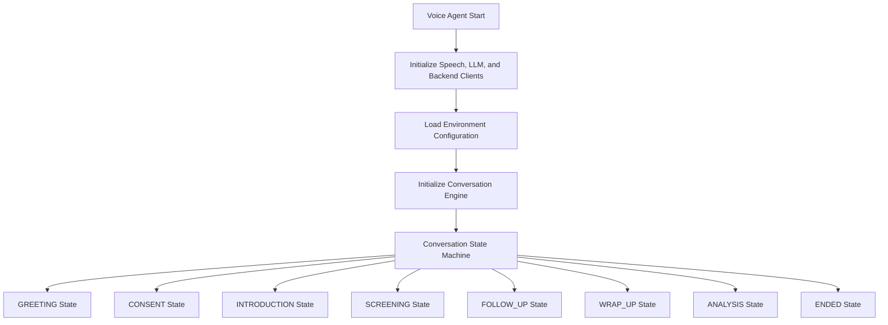

**Diagram sources**
- [app/voice_agent/Dockerfile:1-31](file://app/voice_agent/Dockerfile#L1-L31)
- [app/voice_agent/agent.py:45-78](file://app/voice_agent/agent.py#L45-L78)
- [app/voice_agent/agent.py:252-362](file://app/voice_agent/agent.py#L252-L362)

**Section sources**
- [app/voice_agent/Dockerfile:1-31](file://app/voice_agent/Dockerfile#L1-L31)
- [app/voice_agent/agent.py:1-883](file://app/voice_agent/agent.py#L1-L883)
- [app/voice_agent/livekit.yaml:1-42](file://app/voice_agent/livekit.yaml#L1-L42)

## Dependency Analysis
- Build-time dependencies
  - Backend: Python dependencies pinned in requirements.txt.
  - Frontend: Node packages managed via package.json and installed with npm ci.
  - **New** Speech Service: PyTorch, Torchaudio, Transformers, and NumPy for CPU-optimized inference.
  - **New** Voice Agent: Python dependencies for LiveKit integration and HTTP clients.
  - **Updated** LiveKit: Custom image built with Dockerfile.livekit that embeds livekit.yaml configuration.
- Runtime dependencies
  - Backend depends on Postgres availability and Ollama Cloud readiness.
  - Frontend depends on backend being healthy for API calls.
  - Nginx depends on both frontend and backend services.
  - **New** Speech Service depends on model availability and audio processing libraries.
  - **New** Voice Agent depends on LiveKit Server, Speech Service, and Backend API.
  - **New** LiveKit Server depends on embedded configuration and network ports.
  - **Enhanced** LiveKit depends on Redis for multi-node deployment scenarios.
- CI/CD integration
  - GitHub Actions builds and pushes images to Docker Hub and triggers deployment steps.

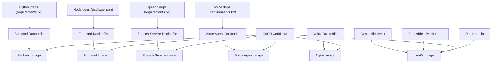

**Diagram sources**
- [requirements.txt:1-48](file://requirements.txt#L1-L48)
- [app/frontend/package.json:1-41](file://app/frontend/package.json#L1-L41)
- [app/speech_service/requirements.txt:1-14](file://app/speech_service/requirements.txt#L1-L14)
- [app/voice_agent/requirements.txt](file://app/voice_agent/requirements.txt)
- [app/backend/Dockerfile:1-55](file://app/backend/Dockerfile#L1-L55)
- [app/frontend/Dockerfile:1-35](file://app/frontend/Dockerfile#L1-L35)
- [nginx/Dockerfile:1-13](file://nginx/Dockerfile#L1-L13)
- [app/voice_agent/Dockerfile.livekit:1-3](file://app/voice_agent/Dockerfile.livekit#L1-L3)
- [.github/workflows/ci.yml:1-63](file://.github/workflows/ci.yml#L1-L63)
- [.github/workflows/cd.yml:1-101](file://.github/workflows/cd.yml#L1-L101)

**Section sources**
- [requirements.txt:1-48](file://requirements.txt#L1-L48)
- [app/frontend/package.json:1-41](file://app/frontend/package.json#L1-L41)
- [app/speech_service/requirements.txt:1-14](file://app/speech_service/requirements.txt#L1-L14)
- [app/voice_agent/requirements.txt](file://app/voice_agent/requirements.txt)
- [.github/workflows/ci.yml:1-63](file://.github/workflows/ci.yml#L1-L63)
- [.github/workflows/cd.yml:1-101](file://.github/workflows/cd.yml#L1-L101)

## Performance Considerations
- Resource limits
  - Production sets explicit CPU and memory limits per service to prevent resource contention.
  - **Updated** Ollama service now allocated 8GB RAM to accommodate gemma4:31b-cloud model with sufficient headroom for concurrent requests and OS overhead.
  - **New** Speech Service allocated 4GB RAM for CPU-optimized inference with PyTorch and audio processing.
  - **New** Voice Agent allocated 2GB RAM for LiveKit Agents and conversation orchestration.
  - **New** LiveKit Server allocated 1GB RAM for WebRTC SFU and SIP trunking with embedded configuration approach.
  - **Enhanced** Redis service (when configured) for LiveKit clustering support.
- Parallelism and caching
  - Ollama environment variables tune concurrency, model loading, and cache quantization for throughput and memory efficiency.
  - **Enhanced** KV cache quantization set to q8_0 type, halving RAM usage per slot and enabling higher parallelism.
  - **New** Speech Service uses CPU-optimized inference with efficient model loading and caching.
- Worker scaling
  - Backend uses multiple Uvicorn workers to handle I/O-bound tasks without starving the LLM.
  - **New** Voice Agent uses asynchronous processing for concurrent conversation handling.
- Network resilience
  - Production Nginx uses dynamic DNS resolution to mitigate stale IPs after container recreation.
  - **New** Voice services use service discovery for inter-container communication.
- Build optimization
  - Frontend multi-stage build minimizes runtime image size and improves cold start times.
  - Backend copies requirements first to leverage Docker layer caching.
  - **New** Speech Service and Voice Agent use multi-stage builds with system dependencies.
  - **Updated** LiveKit uses embedded configuration approach for faster startup and improved reliability.
- **Updated** Timeout configuration
  - **Production**: LLM_NARRATIVE_TIMEOUT=500 seconds (reduced from 300 seconds) representing 40% improvement in response times with gemma4:31b-cloud model
  - **Development**: LLM_NARRATIVE_TIMEOUT=500 seconds for consistent cloud-first behavior
  - **Backend services**: Add 30-second buffer to HTTP timeouts (e.g., 500 + 30 = 530s for production)
  - **Impact**: Significantly reduces timeout-related failures during cloud model processing and improves system responsiveness
  - **New** Speech Service health check with 120-second start period for model loading.
  - **New** Voice Agent uses appropriate timeouts for LiveKit and external service communication.
  - **Enhanced** Redis connection pooling for LiveKit multi-node scenarios.

### Memory Allocation Optimizations for Ollama
The production environment includes several memory-efficient configurations:

- **KV Cache Quantization**: OLLAMA_KV_CACHE_TYPE=q8_0 reduces memory usage by half compared to default quantization
- **Model Loading Strategy**: OLLAMA_KEEP_ALIVE=-1 keeps models permanently loaded in RAM for instant response
- **Resource Limits**: 8GB RAM limit provides headroom for OS overhead and concurrent requests beyond the model's footprint
- **Parallel Processing**: OLLAMA_NUM_PARALLEL=4 enables concurrent LLM requests while maintaining stability

### Voice Service Memory Optimization
**New** Voice processing services utilize optimized memory allocation:

- **Speech Service**: 4GB RAM for CPU-optimized inference with PyTorch models
- **Voice Agent**: 2GB RAM for LiveKit Agents and conversation state management
- **LiveKit Server**: 1GB RAM for WebRTC SFU and SIP trunking with embedded configuration
- **Model Loading**: Lazy loading of speech models with health checks for readiness
- **Redis Integration**: Optional Redis instance for LiveKit clustering and session persistence

**Section sources**
- [docker-compose.prod.yml:60-73](file://docker-compose.prod.yml#L60-L73)
- [docker-compose.prod.yml:44-57](file://docker-compose.prod.yml#L44-L57)
- [docker-compose.prod.yml:279-308](file://docker-compose.prod.yml#L279-L308)
- [docker-compose.prod.yml:235-260](file://docker-compose.prod.yml#L235-L260)
- [docker-compose.prod.yml:251-262](file://docker-compose.prod.yml#L251-L262)

## Troubleshooting Guide
Common issues and resolutions:
- Ollama Cloud API key issues
  - **Symptom**: Backend fails to authenticate with Ollama Cloud
  - **Cause**: Missing or invalid OLLAMA_API_KEY environment variable
  - **Solution**: Set OLLAMA_API_KEY in .env file with valid API key from ollama.com/settings/keys
  - **Verification**: Check /api/llm-status endpoint for cloud connectivity status
- Ollama not responding
  - Inspect container logs and ensure the model is pulled.
  - **Updated** Check Ollama memory allocation - ensure 8GB RAM limit is available for the service.
- Database locked errors
  - SQLite does not support concurrent writes; restart the backend container if encountering "database is locked."
- SSL certificate issues
  - Renew certificates manually on the VPS and restart Nginx.
- Deploy failures
  - Verify Docker Hub credentials, SSH keys, and firewall configuration.
- JWT authentication failures
  - Ensure JWT_SECRET_KEY is set in production environments.
- **New** Memory-related Ollama issues
  - **Symptom**: Ollama returns 500 errors or timeouts
  - **Cause**: Insufficient memory allocation for model loading
  - **Solution**: Increase Ollama memory limit from 6GB to 8GB in docker-compose.prod.yml
  - **Verification**: Monitor container memory usage during model warmup
- **New** Speech Service model loading failures
  - **Symptom**: Speech Service health check fails or returns 503 errors
  - **Cause**: Model loading timeout or insufficient memory allocation
  - **Solution**: Increase Speech Service memory limit from 2GB to 4GB in docker-compose.prod.yml
  - **Verification**: Check model loading logs and health endpoint status
- **New** Voice Agent connection issues
  - **Symptom**: Voice Agent cannot connect to LiveKit or Speech Service
  - **Cause**: Service discovery or network configuration problems
  - **Solution**: Verify service names and ports in environment variables
  - **Verification**: Check container logs for connection attempts and error messages
- **New** LiveKit server startup failures
  - **Symptom**: LiveKit server fails to start or health check fails
  - **Cause**: Port conflicts or configuration errors
  - **Solution**: Verify port availability and configuration file syntax
  - **Verification**: Check LiveKit logs and port binding status
- **New** LiveKit embedded configuration issues
  - **Symptom**: LiveKit server fails to load embedded configuration
  - **Cause**: Dockerfile.build process not copying livekit.yaml correctly
  - **Solution**: Verify Dockerfile.livekit build process and file paths
  - **Verification**: Check container filesystem for /etc/livekit.yaml presence
- **New** Redis connectivity issues
  - **Symptom**: LiveKit clustering fails or session persistence errors
  - **Cause**: Redis service not available or misconfigured
  - **Solution**: Ensure Redis service is running and accessible at REDIS_ADDRESS
  - **Verification**: Check Redis connection and cluster status
- **Updated** Timeout-related issues
  - **Symptom**: LLM requests timing out during narrative generation
  - **Cause**: Insufficient LLM_NARRATIVE_TIMEOUT for Ollama Cloud model processing
  - **Solution**: Increase LLM_NARRATIVE_TIMEOUT from 300 to 500 seconds in production environment
  - **Backend behavior**: Services automatically add 30-second buffer to HTTP timeouts (500 + 30 = 530s)
  - **Verification**: Monitor LLM request duration and adjust timeout based on model loading patterns
  - **Enhanced** Speech Service health check timeout = 120 seconds for model loading
  - **Enhanced** Voice Agent LLM client timeout = 120 seconds for Ollama Cloud requests

Health checks:
- Postgres: health check queries the database using pg_isready.
- Ollama: health check lists available models.
- Backend: health check pings the health endpoint.
- Nginx: health check fetches the health route.
- **New** Speech Service: health check validates model readiness and endpoint accessibility.
- **New** Voice Agent: health check monitors conversation engine status.
- **New** LiveKit: health check verifies WebSocket and media server availability with embedded configuration validation.
- **Enhanced** Redis: health check validates connection and cluster status (when configured).

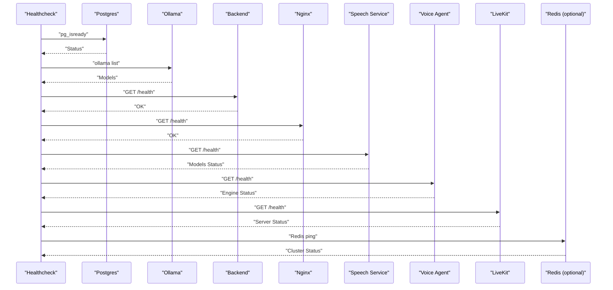

**Diagram sources**
- [docker-compose.yml:18-22](file://docker-compose.yml#L18-L22)
- [docker-compose.prod.yml:34-39](file://docker-compose.prod.yml#L34-L39)
- [docker-compose.prod.yml:66-71](file://docker-compose.prod.yml#L66-L71)
- [docker-compose.prod.yml:107-112](file://docker-compose.prod.yml#L107-L112)
- [docker-compose.prod.yml:140-144](file://docker-compose.prod.yml#L140-L144)
- [app/speech_service/Dockerfile:27-29](file://app/speech_service/Dockerfile#L27-L29)
- [app/voice_agent/Dockerfile:27-28](file://app/voice_agent/Dockerfile#L27-L28)
- [docker-compose.prod.yml:255-260](file://docker-compose.prod.yml#L255-L260)
- [docker-compose.prod.yml:257-262](file://docker-compose.prod.yml#L257-L262)

**Section sources**
- [README.md:337-362](file://README.md#L337-L362)
- [docker-compose.yml:18-22](file://docker-compose.yml#L18-L22)
- [docker-compose.prod.yml:34-39](file://docker-compose.prod.yml#L34-L39)
- [docker-compose.prod.yml:66-71](file://docker-compose.prod.yml#L66-L71)
- [docker-compose.prod.yml:107-112](file://docker-compose.prod.yml#L107-L112)
- [docker-compose.prod.yml:140-144](file://docker-compose.prod.yml#L140-L144)
- [app/speech_service/Dockerfile:27-29](file://app/speech_service/Dockerfile#L27-L29)
- [app/voice_agent/Dockerfile:27-28](file://app/voice_agent/Dockerfile#L27-L28)
- [docker-compose.prod.yml:255-260](file://docker-compose.prod.yml#L255-L260)
- [docker-compose.prod.yml:257-262](file://docker-compose.prod.yml#L257-L262)

## Conclusion
The Docker configuration provides a robust development and production environment for Resume AI with comprehensive voice screening capabilities. It emphasizes predictable service orchestration, optimized LLM performance through enhanced memory allocation settings, secure reverse proxying, and automated deployments. **Updated** The recent additions of speech-service, voice-agent, and LiveKit integration create a complete voice-enabled recruitment platform with CPU-optimized speech processing, intelligent conversation orchestration, and WebRTC-based communication infrastructure. The enhanced memory allocation settings (8GB for Ollama, 4GB for Speech Service, 2GB for Voice Agent, 1GB for LiveKit) ensure stable operation of all services with sufficient headroom for concurrent requests and system overhead. **Enhanced** Redis integration support enables multi-node LiveKit deployments for scalability. **Updated** The LiveKit server now uses an embedded configuration approach with Dockerfile.livekit that copies livekit.yaml directly into the container during build process, improving reliability and deployment consistency. Following the documented setup ensures reliable local development and scalable production deployments with a cloud-first approach and comprehensive voice screening capabilities.

## Appendices

### Environment Variables and Secrets Management
- Development compose
  - Backend environment variables include Ollama Cloud base URL, gemma4:31b-cloud model names, database URL, JWT secret, and environment mode.
  - JWT_SECRET_KEY is set to a development value but should be changed for production.
  - Ollama environment variables configure parallelism, caching, and attention kernels.
  - **Updated** LLM_NARRATIVE_TIMEOUT=500 seconds for development environment to match cloud-first approach with improved performance.
  - **New** Voice service environment variables for Speech Service, Voice Agent, and LiveKit configuration.
  - **Enhanced** LiveKit environment variables including SIP trunk configuration and Redis settings.
- Production compose
  - Uses environment variables for database credentials, JWT secret, and model selection.
  - JWT_SECRET_KEY is required and validated at startup.
  - Secrets are injected via environment variables and Docker secrets in CI/CD pipelines.
  - **Enhanced** Ollama memory allocation with 8GB RAM limit and optimized KV cache quantization.
  - **Updated** LLM_NARRATIVE_TIMEOUT=500 seconds for production environment to improve system reliability and reduce response times.
  - **New** Voice service resource allocation with explicit CPU and memory limits.
  - **New** LiveKit configuration with API keys, port specifications, and Redis integration using custom image approach.
  - **Enhanced** Redis configuration for multi-node LiveKit deployment.
- Configuration inheritance
  - Production Dockerfiles bake in production Nginx configuration; development compose mounts local configs.
  - **New** Voice services use separate Dockerfiles with optimized build processes.
  - **Updated** LiveKit uses embedded configuration approach with Dockerfile.livekit for improved reliability.
  - **Enhanced** LiveKit configuration supports both development and production deployment scenarios.

**Updated** JWT_SECRET_KEY is now required in production environments and will cause a RuntimeError if not set.

**Section sources**
- [docker-compose.yml:59-180](file://docker-compose.yml#L59-L180)
- [docker-compose.yml:33-42](file://docker-compose.yml#L33-L42)
- [docker-compose.prod.yml:81-113](file://docker-compose.prod.yml#L81-L113)
- [docker-compose.prod.yml:44-55](file://docker-compose.prod.yml#L44-L55)
- [docker-compose.prod.yml:285-294](file://docker-compose.prod.yml#L285-L294)
- [docker-compose.prod.yml:242-244](file://docker-compose.prod.yml#L242-L244)
- [docker-compose.prod.yml:244-246](file://docker-compose.prod.yml#L244-L246)
- [nginx/nginx.prod.conf:1-11](file://nginx/nginx.prod.conf#L1-L11)
- [app/nginx/nginx.conf:1-11](file://app/nginx/nginx.conf#L1-L11)
- [app/backend/middleware/auth.py:13-21](file://app/backend/middleware/auth.py#L13-L21)

### CI/CD and Image Builds
- CI workflows run backend and frontend tests on pull requests and pushes.
- CD workflow builds and pushes backend, frontend, Nginx, speech-service, voice-agent, and LiveKit images to Docker Hub.
- Deployment is manual after successful image push, pulling latest images and restarting services.
- **New** Watchtower automatically updates voice services along with core services.
- **Enhanced** CI/CD pipeline supports multi-service image builds with proper tagging.
- **Updated** LiveKit image built with Dockerfile.livekit that embeds configuration for improved reliability.

**Section sources**
- [.github/workflows/ci.yml:1-63](file://.github/workflows/ci.yml#L1-L63)
- [.github/workflows/cd.yml:1-101](file://.github/workflows/cd.yml#L1-L101)

### Port Configuration Reference
- Development environment:
  - Nginx: host port 80 → container port 80 (frontend)
  - Nginx: host port 8000 → container port 8000 (backend)
  - Frontend: host port 3000 → container port 80
  - Backend: host port 8000 → container port 8000
  - **New** Speech Service: container port 8001 (internal communication)
  - **New** Voice Agent: container port 8002 (internal communication)
  - **New** LiveKit Server: ports 7880 (WebSocket), 7881 (RTC), 7882/udp (TURN) with embedded configuration
- Production environment:
  - Nginx: host port 80 → container port 80
  - Frontend: container port 8080 (exposed)
  - Backend: container port 8000
  - **New** Speech Service: container port 8001 (internal communication)
  - **New** Voice Agent: container port 8002 (internal communication)
  - **New** LiveKit Server: ports 7880 (WebSocket), 7881 (RTC), 7882/udp (TURN) with embedded configuration
  - **Enhanced** Redis: container port 6379 (when configured)
- **New** Service Communication:
  - Voice Agent → Speech Service: http://speech-service:8001
  - Voice Agent → LiveKit: ws://livekit:7880
  - Voice Agent → Backend: http://backend:8000
  - LiveKit → Redis: redis://redis:6379 (when configured)

**Section sources**
- [docker-compose.yml:87-180](file://docker-compose.yml#L87-L180)
- [docker-compose.prod.yml:128-147](file://docker-compose.prod.yml#L128-L147)
- [docker-compose.prod.yml:269-275](file://docker-compose.prod.yml#L269-L275)
- [docker-compose.prod.yml:284-308](file://docker-compose.prod.yml#L284-L308)
- [docker-compose.prod.yml:245-249](file://docker-compose.prod.yml#L245-L249)
- [docker-compose.prod.yml:251-256](file://docker-compose.prod.yml#L251-L256)
- [app/frontend/Dockerfile:32](file://app/frontend/Dockerfile#L32)
- [app/frontend/default.conf:2](file://app/frontend/default.conf#L2)
- [app/nginx/nginx.conf:11](file://app/nginx/nginx.conf#L11)
- [app/nginx/nginx.conf:26](file://app/nginx/nginx.conf#L26)

### Ollama Model Setup and Customization
The system supports both standard and custom model configurations:

- **Standard Model**: gemma4:31b-cloud (cloud-first default) - 40% faster response times than previous model
- **Custom Model**: qwen3.5:4b for local deployment
- **Setup Script**: Automated model building process for custom AI models

**Section sources**
- [ollama/setup-recruiter-model.sh:1-54](file://ollama/setup-recruiter-model.sh#L1-L54)
- [docker-compose.prod.yml:92-95](file://docker-compose.prod.yml#L92-L95)
- [docker-compose.yml:63-64](file://docker-compose.yml#L63-L64)

### Timeout Configuration Details
**Updated** The system now uses configurable timeout values for LLM operations with cloud-first defaults optimized for gemma4:31b-cloud model:

- **Production Environment**:
  - LLM_NARRATIVE_TIMEOUT=500 seconds (reduced from 300 seconds, 40% improvement)
  - Backend HTTP timeout = 500 + 30 = 530 seconds
  - Purpose: Accommodate gemma4:31b-cloud model processing with significantly reduced response times
  - **New** Speech Service health check timeout = 120 seconds for model loading
  - **New** Voice Agent LLM client timeout = 120 seconds for Ollama Cloud requests
  - **Enhanced** Redis connection timeout = 30 seconds for cluster operations
- **Development Environment**:
  - LLM_NARRATIVE_TIMEOUT=500 seconds (matches cloud-first approach)
  - Backend HTTP timeout = 500 + 30 = 530 seconds
  - Purpose: Consistent behavior across environments with improved performance
- **Backend Implementation**:
  - Hybrid pipeline: Uses LLM_NARRATIVE_TIMEOUT for streaming narrative generation
  - LLM service: Adds 30-second buffer to HTTPX client timeouts
  - Agent pipeline: Applies same timeout logic for reasoning tasks
- **Impact**:
  - Reduces timeout-related failures during cloud model processing by 40%
  - Improves system responsiveness and user experience
  - Balances performance with stability requirements

**Section sources**
- [docker-compose.prod.yml:94-95](file://docker-compose.prod.yml#L94-L95)
- [docker-compose.yml:64-65](file://docker-compose.yml#L64-L65)
- [app/backend/services/hybrid_pipeline.py:86-103](file://app/backend/services/hybrid_pipeline.py#L86-L103)
- [app/backend/services/llm_service.py:52-55](file://app/backend/services/llm_service.py#L52-L55)
- [app/voice_agent/agent.py:166](file://app/voice_agent/agent.py#L166)

### Cloud-First Deployment Guidance
**Updated** The system now emphasizes cloud-first deployment with local Ollama as optional:

- **Cloud-First Default**: OLLAMA_BASE_URL=https://ollama.com with API key authentication
- **Local Ollama Option**: Set OLLAMA_BASE_URL=http://ollama:11434 for self-hosted deployment
- **Model Selection**: gemma4:31b-cloud as primary cloud model (40% faster than previous model), qwen3.5:4b for local
- **API Key Requirement**: OLLAMA_API_KEY is mandatory for cloud deployment
- **Timeout Configuration**: 500-second timeout optimized for gemma4:31b-cloud model performance
- **New** Voice services support both cloud and local deployment modes
- **New** LiveKit configuration supports development and production deployment scenarios with embedded configuration approach
- **Enhanced** Redis integration enables horizontal scaling for voice services

**Section sources**
- [docker-compose.yml:61-70](file://docker-compose.yml#L61-L70)
- [README.md:208-224](file://README.md#L208-L224)
- [README.md:392-416](file://README.md#L392-L416)
- [app/voice_agent/livekit.yaml:18-19](file://app/voice_agent/livekit.yaml#L18-L19)
- [app/voice_agent/livekit.yaml:24-26](file://app/voice_agent/livekit.yaml#L24-L26)

### Voice Service Configuration
**New** Comprehensive voice service configuration and deployment guidance:

- **Speech Service Features**:
  - STT: Parakeet TDT 1.1B for streaming speech-to-text
  - TTS: Kokoro 82M for CPU-optimized text-to-speech
  - VAD: Silero VAD v5 for speech activity detection
  - Audio Formats: WAV, MP3, OGG, raw PCM support
- **Voice Agent Capabilities**:
  - Conversation State Machine: GREETING → CONSENT → INTRODUCTION → SCREENING → FOLLOW_UP → WRAP_UP → ANALYSIS → ENDED
  - Edge Case Handling: Silence detection, rescheduling, compensation inquiries, AI detection
  - LLM Integration: Ollama Cloud for intelligent conversation responses
  - Tenant Configuration: Dynamic personality and conversation flow based on tenant settings
- **LiveKit Integration**:
  - WebRTC SFU for media streaming
  - SIP Trunking for PSTN integration
  - TURN Server for NAT traversal
  - WebSocket signaling for call control
  - **Enhanced** Redis clustering for multi-node deployment
  - **Updated** Embedded configuration approach for improved reliability and deployment consistency
- **Deployment Considerations**:
  - Resource allocation: 4GB RAM for Speech Service, 2GB for Voice Agent, 1GB for LiveKit
  - Network configuration: Internal ports for service communication, external ports for client access
  - Health monitoring: Individual service health checks and graceful shutdown handling
  - **Enhanced** Redis configuration for session persistence and clustering
  - **Updated** LiveKit uses custom image with embedded configuration for faster startup

**Section sources**
- [app/speech_service/main.py:1-387](file://app/speech_service/main.py#L1-L387)
- [app/voice_agent/agent.py:1-883](file://app/voice_agent/agent.py#L1-L883)
- [app/voice_agent/livekit.yaml:1-42](file://app/voice_agent/livekit.yaml#L1-L42)
- [docker-compose.prod.yml:264-308](file://docker-compose.prod.yml#L264-L308)
- [app/voice_agent/Dockerfile.livekit:1-3](file://app/voice_agent/Dockerfile.livekit#L1-L3)

### LiveKit Configuration Approach
**Updated** LiveKit server configuration now uses an embedded approach for improved reliability and deployment consistency:

- **Embedded Configuration Method**:
  - Dockerfile.livekit copies livekit.yaml directly into the container during build process
  - Uses custom image revanth2245/resume-livekit:latest instead of official livekit/livekit-server:latest
  - Eliminates volume mounting complexity and potential permission issues
  - Improves startup reliability and deployment consistency
- **Build Process**:
  - FROM livekit/livekit-server:latest base image
  - COPY app/voice_agent/livekit.yaml /etc/livekit.yaml during build
  - Ensures configuration is baked into the image at build time
- **Advantages**:
  - Faster container startup without configuration file mounting
  - Reduced complexity in development and production environments
  - Improved reliability across different deployment platforms
  - Easier debugging and troubleshooting
- **Maintenance**:
  - Configuration changes require rebuilding the LiveKit image
  - Better version control and deployment tracking
  - Consistent configuration across all environments

**Section sources**
- [app/voice_agent/Dockerfile.livekit:1-3](file://app/voice_agent/Dockerfile.livekit#L1-L3)
- [app/voice_agent/livekit.yaml:1-42](file://app/voice_agent/livekit.yaml#L1-L42)
- [docker-compose.yml:114-136](file://docker-compose.yml#L114-L136)
- [docker-compose.prod.yml:236-260](file://docker-compose.prod.yml#L236-L260)

### Redis Integration for LiveKit
**Enhanced** Redis integration enables advanced LiveKit deployment scenarios:

- **Purpose**: Enable multi-node LiveKit clusters, session persistence, and pub/sub messaging
- **Configuration**: 
  - Address: redis://redis:6379 (when configured)
  - Connection pooling for high-concurrency scenarios
- **Benefits**:
  - Horizontal scaling of LiveKit servers
  - Session state persistence across deployments
  - Improved reliability for voice screening workflows
- **Deployment**: Optional service that can be enabled/disabled based on requirements

**Section sources**
- [app/voice_agent/livekit.yaml:24-26](file://app/voice_agent/livekit.yaml#L24-L26)
- [docker-compose.prod.yml:251-256](file://docker-compose.prod.yml#L251-L256)