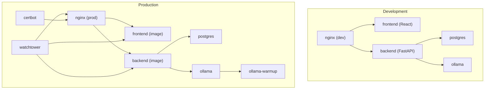
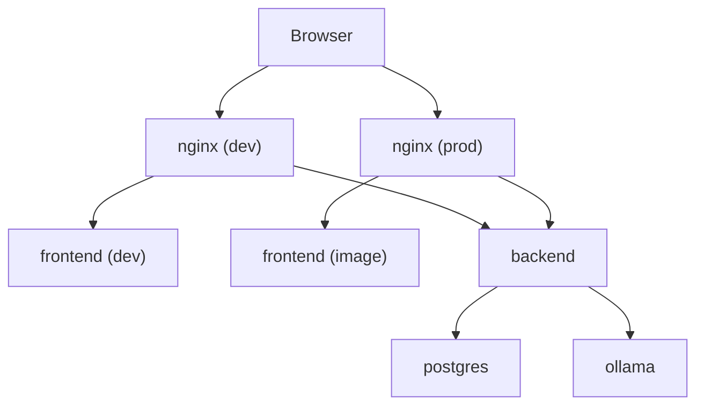
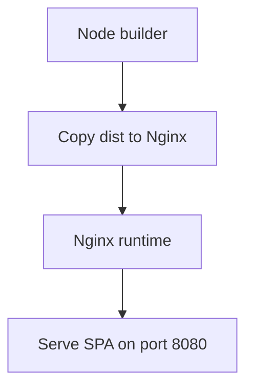
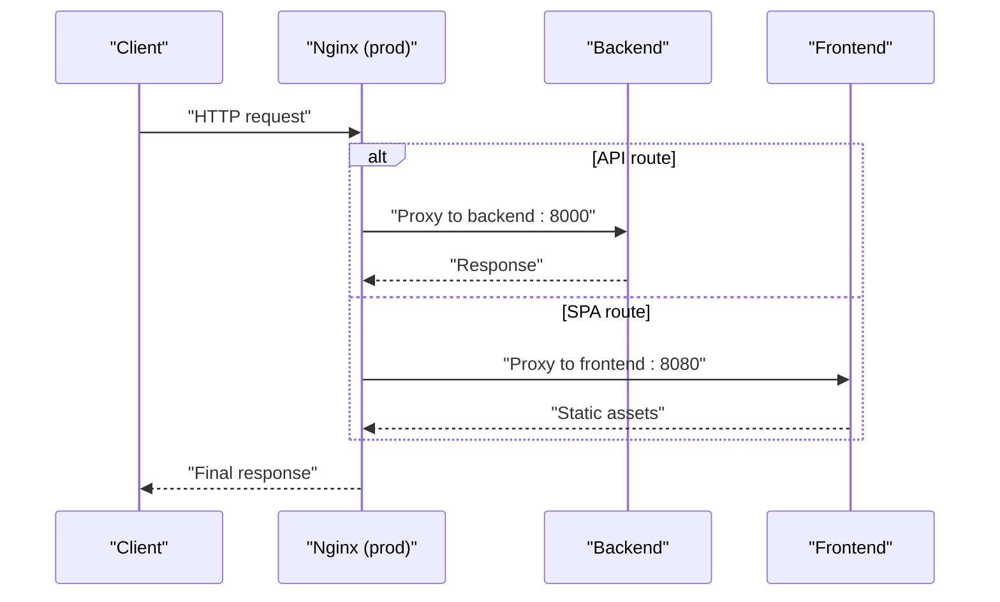
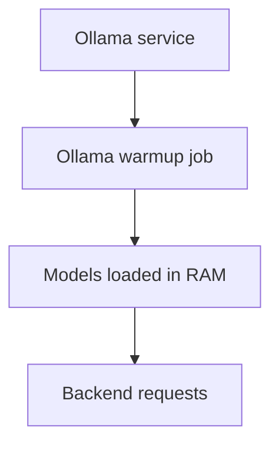
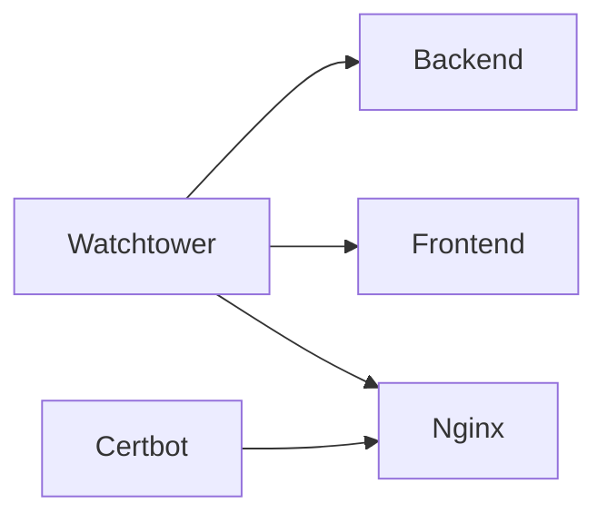
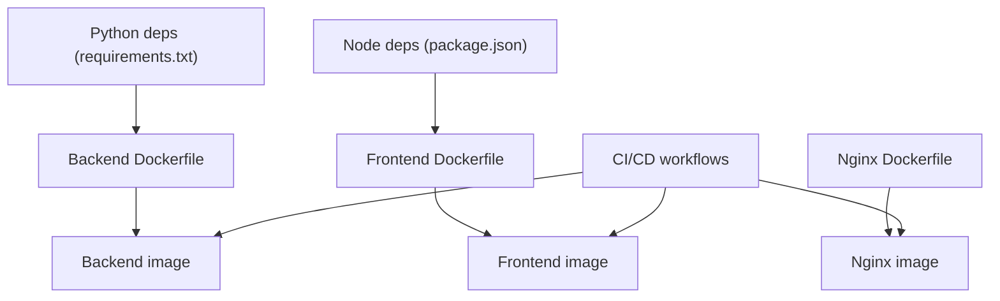
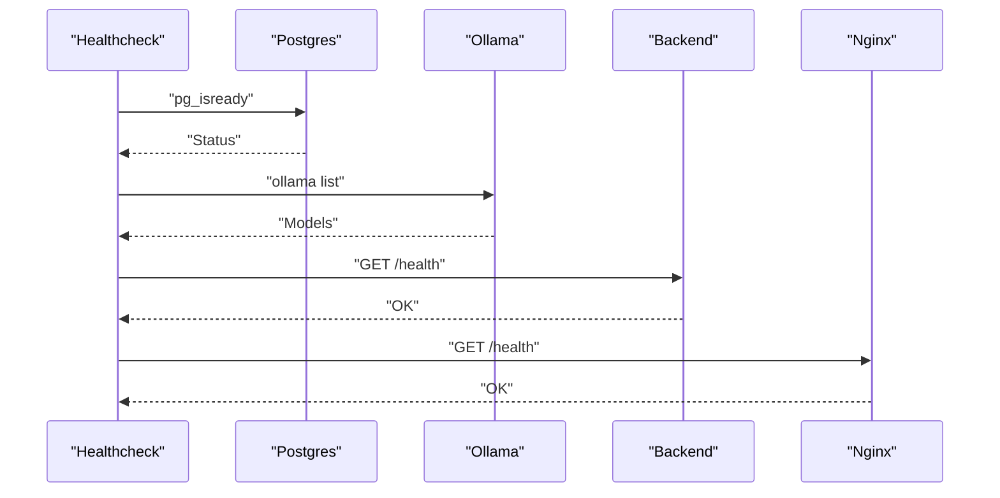

# Docker Configuration

<cite>
**Referenced Files in This Document**
- [docker-compose.yml](file://docker-compose.yml)
- [docker-compose.prod.yml](file://docker-compose.prod.yml)
- [app/backend/Dockerfile](file://app/backend/Dockerfile)
- [app/frontend/Dockerfile](file://app/frontend/Dockerfile)
- [nginx/Dockerfile](file://nginx/Dockerfile)
- [app/backend/scripts/docker-entrypoint.sh](file://app/backend/scripts/docker-entrypoint.sh)
- [app/backend/scripts/wait_for_ollama.py](file://app/backend/scripts/wait_for_ollama.py)
- [app/nginx/nginx.conf](file://app/nginx/nginx.conf)
- [nginx/nginx.prod.conf](file://nginx/nginx.prod.conf)
- [app/backend/middleware/auth.py](file://app/backend/middleware/auth.py)
- [app/backend/main.py](file://app/backend/main.py)
- [app/frontend/default.conf](file://app/frontend/default.conf)
- [requirements.txt](file://requirements.txt)
- [README.md](file://README.md)
- [.github/workflows/ci.yml](file://.github/workflows/ci.yml)
- [.github/workflows/cd.yml](file://.github/workflows/cd.yml)
</cite>

## Update Summary
**Changes Made**
- Updated JWT_SECRET_KEY environment variable requirement documentation
- Updated nginx port configuration documentation reflecting development and production differences
- Enhanced security considerations for JWT authentication
- Updated environment variable handling and secrets management

## Table of Contents
1. [Introduction](#introduction)
2. [Project Structure](#project-structure)
3. [Core Components](#core-components)
4. [Architecture Overview](#architecture-overview)
5. [Detailed Component Analysis](#detailed-component-analysis)
6. [Dependency Analysis](#dependency-analysis)
7. [Performance Considerations](#performance-considerations)
8. [Troubleshooting Guide](#troubleshooting-guide)
9. [Conclusion](#conclusion)
10. [Appendices](#appendices)

## Introduction
This document explains the Docker configuration for Resume AI by ThetaLogics, covering:
- Development environment setup with docker-compose.yml
- Production deployment with docker-compose.prod.yml, including multi-stage builds, resource limits, and security settings
- Container networking, volumes, and inter-service communication
- Dockerfile configurations for backend and frontend, including build optimization and runtime behavior
- Environment variable handling, secrets management, and configuration inheritance
- Troubleshooting, health checks, and performance optimization

## Project Structure
The repository organizes Docker assets around three primary services:
- Backend: FastAPI application with Ollama integration and Alembic migrations
- Frontend: React SPA served by Nginx
- Infrastructure: Postgres database, Ollama LLM engine, reverse proxy Nginx, optional Watchtower auto-updates, and Certbot for SSL renewal

**Diagram sources**
- [docker-compose.yml:5-101](file://docker-compose.yml#L5-L101)
- [docker-compose.prod.yml:7-227](file://docker-compose.prod.yml#L7-L227)

**Section sources**
- [docker-compose.yml:1-101](file://docker-compose.yml#L1-L101)
- [docker-compose.prod.yml:1-227](file://docker-compose.prod.yml#L1-L227)

## Core Components
- Backend service
  - Uses a Python slim base image, installs system dependencies, copies requirements and application code, and sets environment variables for database and Ollama connectivity.
  - Entrypoint runs Alembic migrations for PostgreSQL and waits for Ollama readiness before launching Uvicorn.
  - Exposes port 8000 and supports single-worker default; production overrides to multiple workers.
- Frontend service
  - Multi-stage build: Node builder produces static assets, then copied into an Nginx runtime image.
  - Serves compiled SPA on port 8080; development compose binds host port 3000 to container port 80.
- Nginx service
  - Development: proxies to host-based dev servers for frontend and backend.
  - Production: reverse proxy with health checks, streaming support, CORS handling, and dynamic DNS resolution for container IPs.
- Database and LLM
  - Postgres with persistent volumes and health checks.
  - Ollama with environment tuning for parallelism, caching, and model loading; production includes a dedicated warmup job.
- Optional production services
  - Watchtower for automated updates of tagged images.
  - Certbot for Let's Encrypt certificate lifecycle management.

**Section sources**
- [app/backend/Dockerfile:1-39](file://app/backend/Dockerfile#L1-L39)
- [app/frontend/Dockerfile:1-26](file://app/frontend/Dockerfile#L1-L26)
- [nginx/Dockerfile:1-13](file://nginx/Dockerfile#L1-L13)
- [app/backend/scripts/docker-entrypoint.sh:1-20](file://app/backend/scripts/docker-entrypoint.sh#L1-L20)
- [app/backend/scripts/wait_for_ollama.py:1-96](file://app/backend/scripts/wait_for_ollama.py#L1-L96)
- [docker-compose.yml:52-96](file://docker-compose.yml#L52-L96)
- [docker-compose.prod.yml:7-227](file://docker-compose.prod.yml#L7-L227)

## Architecture Overview
The system comprises four primary runtime services plus optional production-only services. Inter-service communication relies on Docker Compose networking with service names as hostnames. The backend coordinates with Postgres and Ollama; Nginx fronts both frontend and backend traffic.

**Diagram sources**
- [docker-compose.yml:5-101](file://docker-compose.yml#L5-L101)
- [docker-compose.prod.yml:7-227](file://docker-compose.prod.yml#L7-L227)
- [app/nginx/nginx.conf:9-36](file://app/nginx/nginx.conf#L9-L36)
- [nginx/nginx.prod.conf:19-87](file://nginx/nginx.prod.conf#L19-L87)

## Detailed Component Analysis

### Backend Service
- Base image and build
  - Python 3.11 slim with GCC and curl for system-level dependencies.
  - Copies requirements, application code, Alembic configuration, and helper scripts.
  - Sets environment variables for Python path, default database URL, and Ollama base URL.
- Entrypoint behavior
  - Applies Alembic migrations when the database URL indicates PostgreSQL.
  - Waits for Ollama readiness and model warm-up before starting the application process.
- Runtime
  - Exposes port 8000; development defaults to a single worker; production sets multiple workers.

**Diagram sources**
- [app/backend/Dockerfile:1-39](file://app/backend/Dockerfile#L1-L39)
- [app/backend/scripts/docker-entrypoint.sh:4-14](file://app/backend/scripts/docker-entrypoint.sh#L4-L14)
- [app/backend/scripts/wait_for_ollama.py:34-91](file://app/backend/scripts/wait_for_ollama.py#L34-L91)
- [app/backend/middleware/auth.py:13-21](file://app/backend/middleware/auth.py#L13-L21)

**Section sources**
- [app/backend/Dockerfile:1-39](file://app/backend/Dockerfile#L1-L39)
- [app/backend/scripts/docker-entrypoint.sh:1-20](file://app/backend/scripts/docker-entrypoint.sh#L1-L20)
- [app/backend/scripts/wait_for_ollama.py:1-96](file://app/backend/scripts/wait_for_ollama.py#L1-L96)
- [app/backend/middleware/auth.py:1-23](file://app/backend/middleware/auth.py#L1-L23)

### Frontend Service
- Multi-stage build
  - Builder stage: Node 20 Alpine, installs dependencies, builds assets.
  - Runtime stage: Nginx Alpine with baked-in default configuration and static assets.
- Serving
  - Serves SPA on port 8080; development compose binds host port 3000 to container port 80.

**Diagram sources**
- [app/frontend/Dockerfile:1-26](file://app/frontend/Dockerfile#L1-L26)

**Section sources**
- [app/frontend/Dockerfile:1-26](file://app/frontend/Dockerfile#L1-L26)
- [app/frontend/default.conf:1-19](file://app/frontend/default.conf#L1-L19)

### Nginx Service
- Development
  - Proxies frontend dev server and backend API to host ports for local iteration.
  - Frontend listens on port 80, backend listens on port 8000.
- Production
  - Reverse proxy with:
    - Dynamic DNS resolution to handle container IP changes.
    - Health check route pointing to backend.
    - Streaming support for SSE endpoints.
    - CORS handling for preflight OPTIONS.
    - Upstream routing for API and SPA.

**Diagram sources**
- [nginx/nginx.prod.conf:29-86](file://nginx/nginx.prod.conf#L29-L86)

**Section sources**
- [app/nginx/nginx.conf:9-36](file://app/nginx/nginx.conf#L9-L36)
- [nginx/nginx.prod.conf:1-89](file://nginx/nginx.prod.conf#L1-L89)

### Database and LLM
- Postgres
  - Persistent volume for data, health checks, and tuned parameters in production.
- Ollama
  - Tuned environment variables for parallelism, caching, and model loading.
  - Production includes a dedicated warmup job to preload models into RAM.

**Diagram sources**
- [docker-compose.yml:24-50](file://docker-compose.yml#L24-L50)
- [docker-compose.prod.yml:41-184](file://docker-compose.prod.yml#L41-L184)

**Section sources**
- [docker-compose.yml:6-50](file://docker-compose.yml#L6-L50)
- [docker-compose.prod.yml:41-184](file://docker-compose.prod.yml#L41-L184)

### Optional Production Services
- Watchtower
  - Auto-restarts containers when images are updated on Docker Hub.
- Certbot
  - Automated certificate renewal with persistent volumes.

**Diagram sources**
- [docker-compose.prod.yml:192-220](file://docker-compose.prod.yml#L192-L220)

**Section sources**
- [docker-compose.prod.yml:186-227](file://docker-compose.prod.yml#L186-L227)

## Dependency Analysis
- Build-time dependencies
  - Backend: Python dependencies pinned in requirements.txt.
  - Frontend: Node packages managed via package.json and installed with npm ci.
- Runtime dependencies
  - Backend depends on Postgres availability and Ollama readiness.
  - Frontend depends on backend being healthy for API calls.
  - Nginx depends on both frontend and backend services.
- CI/CD integration
  - GitHub Actions builds and pushes images to Docker Hub and triggers deployment steps.

**Diagram sources**
- [requirements.txt:1-48](file://requirements.txt#L1-L48)
- [app/frontend/package.json:1-41](file://app/frontend/package.json#L1-L41)
- [app/backend/Dockerfile:1-39](file://app/backend/Dockerfile#L1-L39)
- [app/frontend/Dockerfile:1-26](file://app/frontend/Dockerfile#L1-L26)
- [nginx/Dockerfile:1-13](file://nginx/Dockerfile#L1-L13)
- [.github/workflows/ci.yml:1-63](file://.github/workflows/ci.yml#L1-L63)
- [.github/workflows/cd.yml:1-101](file://.github/workflows/cd.yml#L1-L101)

**Section sources**
- [requirements.txt:1-48](file://requirements.txt#L1-L48)
- [app/frontend/package.json:1-41](file://app/frontend/package.json#L1-L41)
- [.github/workflows/ci.yml:1-63](file://.github/workflows/ci.yml#L1-L63)
- [.github/workflows/cd.yml:1-101](file://.github/workflows/cd.yml#L1-L101)

## Performance Considerations
- Resource limits
  - Production sets explicit CPU and memory limits per service to prevent resource contention.
- Parallelism and caching
  - Ollama environment variables tune concurrency, model loading, and cache quantization for throughput and memory efficiency.
- Worker scaling
  - Backend uses multiple Uvicorn workers to handle I/O-bound tasks without starving the LLM.
- Network resilience
  - Production Nginx uses dynamic DNS resolution to mitigate stale IPs after container recreation.
- Build optimization
  - Frontend multi-stage build minimizes runtime image size and improves cold start times.
  - Backend copies requirements first to leverage Docker layer caching.

## Troubleshooting Guide
Common issues and resolutions:
- Ollama not responding
  - Inspect container logs and ensure the model is pulled.
- Database locked errors
  - SQLite does not support concurrent writes; restart the backend container if encountering "database is locked."
- SSL certificate issues
  - Renew certificates manually on the VPS and restart Nginx.
- Deploy failures
  - Verify Docker Hub credentials, SSH keys, and firewall configuration.
- JWT authentication failures
  - Ensure JWT_SECRET_KEY is set in production environments.

Health checks:
- Postgres: health check queries the database using pg_isready.
- Ollama: health check lists available models.
- Backend: health check pings the health endpoint.
- Nginx: health check fetches the health route.

**Diagram sources**
- [docker-compose.yml:18-22](file://docker-compose.yml#L18-L22)
- [docker-compose.prod.yml:34-39](file://docker-compose.prod.yml#L34-L39)
- [docker-compose.prod.yml:66-71](file://docker-compose.prod.yml#L66-L71)
- [docker-compose.prod.yml:107-112](file://docker-compose.prod.yml#L107-L112)
- [docker-compose.prod.yml:140-144](file://docker-compose.prod.yml#L140-L144)

**Section sources**
- [README.md:337-362](file://README.md#L337-L362)
- [docker-compose.yml:18-22](file://docker-compose.yml#L18-L22)
- [docker-compose.prod.yml:34-39](file://docker-compose.prod.yml#L34-L39)
- [docker-compose.prod.yml:66-71](file://docker-compose.prod.yml#L66-L71)
- [docker-compose.prod.yml:107-112](file://docker-compose.prod.yml#L107-L112)
- [docker-compose.prod.yml:140-144](file://docker-compose.prod.yml#L140-L144)

## Conclusion
The Docker configuration provides a robust development and production environment for Resume AI. It emphasizes predictable service orchestration, optimized LLM performance, secure reverse proxying, and automated deployments. Following the documented setup ensures reliable local development and scalable production deployments.

## Appendices

### Environment Variables and Secrets Management
- Development compose
  - Backend environment variables include Ollama base URL, model names, database URL, JWT secret, and environment mode.
  - JWT_SECRET_KEY is set to a development value but should be changed for production.
  - Ollama environment variables configure parallelism, caching, and attention kernels.
- Production compose
  - Uses environment variables for database credentials, JWT secret, and model selection.
  - JWT_SECRET_KEY is required and validated at startup.
  - Secrets are injected via environment variables and Docker secrets in CI/CD pipelines.
- Configuration inheritance
  - Production Dockerfiles bake in production Nginx configuration; development compose mounts local configs.

**Updated** JWT_SECRET_KEY is now required in production environments and will cause a RuntimeError if not set.

**Section sources**
- [docker-compose.yml:59-75](file://docker-compose.yml#L59-L75)
- [docker-compose.yml:33-42](file://docker-compose.yml#L33-L42)
- [docker-compose.prod.yml:81-95](file://docker-compose.prod.yml#L81-L95)
- [docker-compose.prod.yml:44-55](file://docker-compose.prod.yml#L44-L55)
- [nginx/nginx.prod.conf:1-11](file://nginx/nginx.prod.conf#L1-L11)
- [app/nginx/nginx.conf:1-11](file://app/nginx/nginx.conf#L1-L11)
- [app/backend/middleware/auth.py:13-21](file://app/backend/middleware/auth.py#L13-L21)

### CI/CD and Image Builds
- CI workflows run backend and frontend tests on pull requests and pushes.
- CD workflow builds and pushes backend, frontend, and Nginx images to Docker Hub.
- Deployment is manual after successful image push, pulling latest images and restarting services.

**Section sources**
- [.github/workflows/ci.yml:1-63](file://.github/workflows/ci.yml#L1-L63)
- [.github/workflows/cd.yml:1-101](file://.github/workflows/cd.yml#L1-L101)

### Port Configuration Reference
- Development environment:
  - Nginx: host port 80 → container port 80 (frontend)
  - Nginx: host port 8000 → container port 8000 (backend)
  - Frontend: host port 3000 → container port 80
  - Backend: host port 8000 → container port 8000
- Production environment:
  - Nginx: host port 8080 → container port 80
  - Frontend: container port 8080 (exposed)
  - Backend: container port 8000

**Section sources**
- [docker-compose.yml:87-97](file://docker-compose.yml#L87-L97)
- [docker-compose.prod.yml:128-147](file://docker-compose.prod.yml#L128-L147)
- [app/frontend/Dockerfile:32](file://app/frontend/Dockerfile#L32)
- [app/frontend/default.conf:2](file://app/frontend/default.conf#L2)
- [app/nginx/nginx.conf:11](file://app/nginx/nginx.conf#L11)
- [app/nginx/nginx.conf:26](file://app/nginx/nginx.conf#L26)