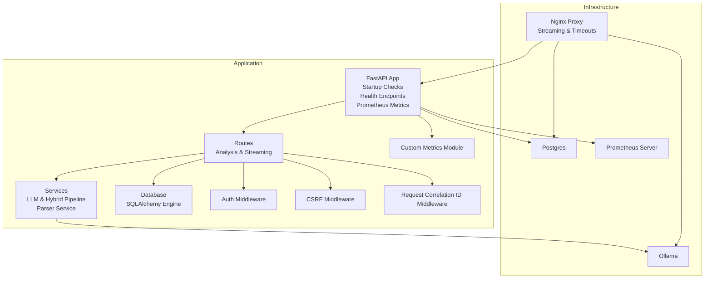
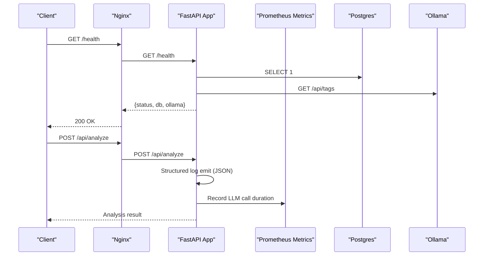
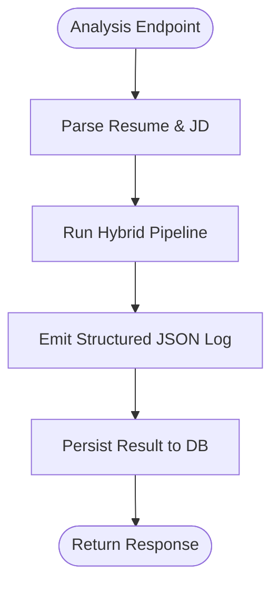
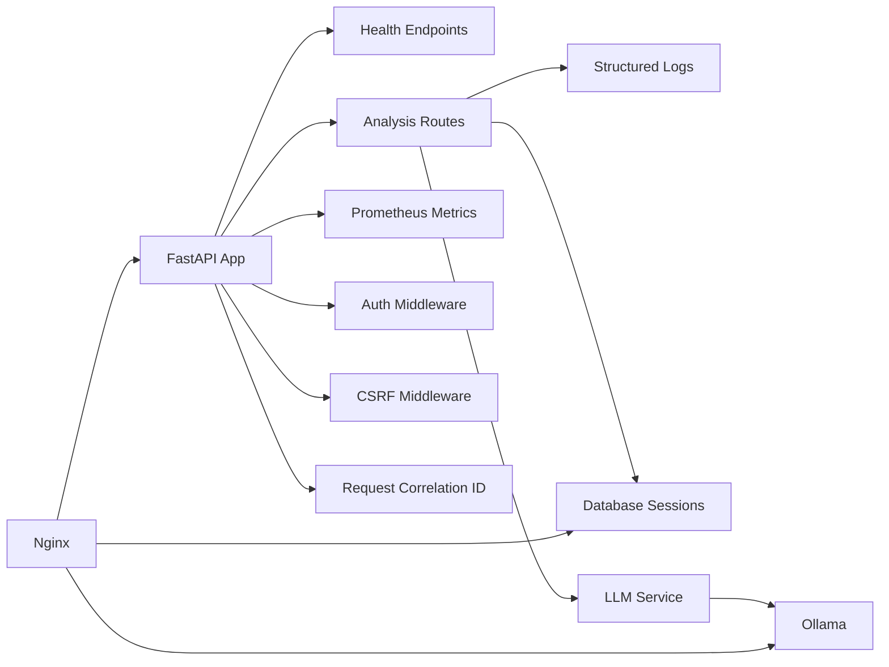

# Monitoring & Logging

<cite>
**Referenced Files in This Document**
- [app/backend/main.py](file://app/backend/main.py)
- [app/backend/db/database.py](file://app/backend/db/database.py)
- [app/backend/routes/analyze.py](file://app/backend/routes/analyze.py)
- [app/backend/services/llm_service.py](file://app/backend/services/llm_service.py)
- [app/backend/services/hybrid_pipeline.py](file://app/backend/services/hybrid_pipeline.py)
- [app/backend/services/parser_service.py](file://app/backend/services/parser_service.py)
- [app/backend/services/metrics.py](file://app/backend/services/metrics.py)
- [app/backend/middleware/auth.py](file://app/backend/middleware/auth.py)
- [app/backend/middleware/csrf.py](file://app/backend/middleware/csrf.py)
- [docker-compose.yml](file://docker-compose.yml)
- [docker-compose.prod.yml](file://docker-compose.prod.yml)
- [app/nginx/nginx.prod.conf](file://app/nginx/nginx.prod.conf)
- [alembic.ini](file://alembic.ini)
- [requirements.txt](file://requirements.txt)
</cite>

## Update Summary
**Changes Made**
- Added comprehensive Prometheus metrics integration with custom histograms and counters
- Implemented structured JSON logging for production environments with configurable formatting
- Introduced request correlation IDs with middleware for cross-service tracing
- Enhanced observability with detailed performance metrics collection for LLM calls and batch operations
- Updated middleware stack to include Prometheus instrumentation and request correlation

## Table of Contents
1. [Introduction](#introduction)
2. [Project Structure](#project-structure)
3. [Core Components](#core-components)
4. [Architecture Overview](#architecture-overview)
5. [Detailed Component Analysis](#detailed-component-analysis)
6. [Dependency Analysis](#dependency-analysis)
7. [Performance Considerations](#performance-considerations)
8. [Troubleshooting Guide](#troubleshooting-guide)
9. [Conclusion](#conclusion)
10. [Appendices](#appendices)

## Introduction
This document provides comprehensive monitoring and logging guidance for Resume AI by ThetaLogics. It covers application logging configuration using Python's logging module, structured logging for analysis operations, and strategies for log aggregation. It also explains health check endpoints, service monitoring, uptime tracking, performance monitoring for AI model inference, database queries, and API response times, along with error tracking, exception handling, alerting mechanisms, metrics collection, log rotation and retention, compliance considerations, and troubleshooting procedures. Centralized logging with ELK stack, APM tools, and custom dashboards is addressed.

**Updated** Added comprehensive Prometheus metrics integration, structured JSON logging for production environments, request correlation IDs, and detailed performance metrics collection with custom histograms for LLM call durations and batch operations.

## Project Structure
The monitoring and logging surface spans several layers:
- Application entry and lifecycle management with startup checks and health endpoints
- Database connectivity and ORM session management
- Route handlers that perform structured logging for analysis operations
- LLM service integration with timeouts and fallbacks
- Container orchestration with health checks and environment configuration
- Nginx proxy configuration for streaming and timeouts
- Alembic logging configuration for SQLAlchemy and Alembic
- Prometheus metrics collection with custom histograms and counters
- Request correlation ID middleware for cross-service tracing

**Diagram sources**
- [app/backend/main.py:174-260](file://app/backend/main.py#L174-L260)
- [app/backend/routes/analyze.py:354-501](file://app/backend/routes/analyze.py#L354-L501)
- [app/backend/services/llm_service.py:13-58](file://app/backend/services/llm_service.py#L13-L58)
- [app/backend/db/database.py:1-33](file://app/backend/db/database.py#L1-L33)
- [app/backend/middleware/auth.py:19-46](file://app/backend/middleware/auth.py#L19-L46)
- [app/backend/middleware/csrf.py:40-69](file://app/backend/middleware/csrf.py#L40-L69)
- [app/backend/services/metrics.py:1-34](file://app/backend/services/metrics.py#L1-L34)
- [app/nginx/nginx.prod.conf:50-100](file://app/nginx/nginx.prod.conf#L50-L100)
- [docker-compose.yml:52-101](file://docker-compose.yml#L52-L101)
- [docker-compose.prod.yml:75-145](file://docker-compose.prod.yml#L75-L145)

**Section sources**
- [app/backend/main.py:174-260](file://app/backend/main.py#L174-L260)
- [app/backend/db/database.py:1-33](file://app/backend/db/database.py#L1-L33)
- [app/backend/routes/analyze.py:354-501](file://app/backend/routes/analyze.py#L354-L501)
- [app/backend/services/llm_service.py:13-58](file://app/backend/services/llm_service.py#L13-L58)
- [app/backend/middleware/auth.py:19-46](file://app/backend/middleware/auth.py#L19-L46)
- [app/backend/middleware/csrf.py:40-69](file://app/backend/middleware/csrf.py#L40-L69)
- [app/backend/services/metrics.py:1-34](file://app/backend/services/metrics.py#L1-L34)
- [docker-compose.yml:52-101](file://docker-compose.yml#L52-L101)
- [docker-compose.prod.yml:75-145](file://docker-compose.prod.yml#L75-L145)
- [app/nginx/nginx.prod.conf:50-100](file://app/nginx/nginx.prod.conf#L50-L100)

## Core Components
- Application startup checks and banner printing for dependency readiness
- Health endpoints for database and LLM connectivity
- Structured logging in analysis routes for operational insights
- Database engine configuration with pooling and pre-ping
- LLM service with timeouts and fallback responses
- Streaming endpoints with Nginx buffering and timeout tuning
- Container health checks for Postgres, Ollama, backend, and Nginx
- **New** Comprehensive Prometheus metrics integration with custom histograms
- **New** Structured JSON logging for production environments
- **New** Request correlation ID middleware for cross-service tracing

**Section sources**
- [app/backend/main.py:68-169](file://app/backend/main.py#L68-L169)
- [app/backend/main.py:228-259](file://app/backend/main.py#L228-L259)
- [app/backend/routes/analyze.py:491-501](file://app/backend/routes/analyze.py#L491-L501)
- [app/backend/db/database.py:20-33](file://app/backend/db/database.py#L20-L33)
- [app/backend/services/llm_service.py:53-57](file://app/backend/services/llm_service.py#L53-L57)
- [app/nginx/nginx.prod.conf:66-95](file://app/nginx/nginx.prod.conf#L66-L95)
- [docker-compose.yml:18-46](file://docker-compose.yml#L18-L46)
- [docker-compose.prod.yml:34-112](file://docker-compose.prod.yml#L34-L112)
- [app/backend/services/metrics.py:1-34](file://app/backend/services/metrics.py#L1-L34)
- [app/backend/main.py:44-56](file://app/backend/main.py#L44-L56)

## Architecture Overview
The monitoring architecture integrates:
- Startup checks and banner reporting for immediate visibility
- Active health checks for DB and LLM
- Structured JSON logs emitted during analysis
- Container-level health checks feeding uptime metrics
- Nginx proxy timeouts and streaming behavior for SSE
- Alembic logging configuration for SQL and migration logs
- **New** Prometheus metrics collection with custom histograms
- **New** Request correlation ID propagation across services

**Diagram sources**
- [app/backend/main.py:228-259](file://app/backend/main.py#L228-L259)
- [app/backend/routes/analyze.py:491-501](file://app/backend/routes/analyze.py#L491-L501)
- [app/backend/services/metrics.py:11-20](file://app/backend/services/metrics.py#L11-L20)
- [app/nginx/nginx.prod.conf:97-100](file://app/nginx/nginx.prod.conf#L97-L100)

## Detailed Component Analysis

### Application Logging Configuration
- Python logging is used for startup banner and warnings during dependency checks.
- Alembic logging is configured separately for SQLAlchemy engine and Alembic migrations.
- Structured JSON logging is emitted by analysis routes for downstream ingestion.
- **New** Production environment uses structured JSON logging with configurable formatter.

Implementation highlights:
- Startup banner and checks are printed to stdout for container logs.
- Alembic logging levels and handler are defined for SQL and Alembic namespaces.
- Analysis route emits a structured JSON event with fields such as tenant_id, filename, skills_found, fit_score, quality, and total_ms.
- **New** Production JSON logging uses custom formatter with timestamp, level, logger, message, and function fields.

Operational impact:
- Enables quick diagnostics of startup failures and dependency readiness.
- Provides a standardized log format for correlation across services.
- **New** Structured JSON logs enable easy ingestion by centralized logging systems.

**Section sources**
- [app/backend/main.py:23-65](file://app/backend/main.py#L23-L65)
- [app/backend/main.py:68-169](file://app/backend/main.py#L68-L169)
- [app/backend/main.py:25-43](file://app/backend/main.py#L25-L43)
- [alembic.ini:124-147](file://alembic.ini#L124-L147)
- [app/backend/routes/analyze.py:491-501](file://app/backend/routes/analyze.py#L491-L501)

### Structured Logging for Analysis Operations
- The analysis route logs a JSON event upon completion, capturing:
  - event: analysis_complete
  - tenant_id
  - filename
  - skills_found
  - fit_score
  - llm_used
  - quality
  - total_ms

This structured event enables:
- Real-time dashboards and alerts
- Usage analytics and performance benchmarking
- Correlation with database writes and LLM calls

**Diagram sources**
- [app/backend/routes/analyze.py:491-501](file://app/backend/routes/analyze.py#L491-L501)
- [app/backend/routes/analyze.py:449-476](file://app/backend/routes/analyze.py#L449-L476)

**Section sources**
- [app/backend/routes/analyze.py:491-501](file://app/backend/routes/analyze.py#L491-L501)

### Health Check Endpoints and Service Monitoring
- Active health check endpoint validates database connectivity and Ollama reachability.
- LLM status endpoint reports model readiness and diagnosis for troubleshooting.
- Container health checks are defined for Postgres, Ollama, backend, and Nginx.

Monitoring outcomes:
- Uptime tracking via container health checks
- Load balancer routing decisions based on health responses
- Proactive alerts when status degrades

**Section sources**
- [app/backend/main.py:228-259](file://app/backend/main.py#L228-L259)
- [app/backend/main.py:262-326](file://app/backend/main.py#L262-L326)
- [docker-compose.yml:18-46](file://docker-compose.yml#L18-L46)
- [docker-compose.prod.yml:34-112](file://docker-compose.prod.yml#L34-L112)

### Performance Monitoring for AI Model Inference
- LLM service sets a strict timeout for LLM calls and returns a deterministic fallback on failure.
- Hybrid pipeline initializes a singleton LLM client with constrained context and prediction sizes to reduce memory footprint and improve throughput.
- Streaming endpoint supports long-running LLM narratives with explicit proxy buffering and timeout configuration.
- **New** Custom Prometheus histograms track LLM call durations with predefined bucket ranges.

Metrics and observability:
- Structured logs capture total_ms for analysis completion
- LLM status endpoint provides model hot/cold diagnostics
- Container resource limits and Ollama environment variables tune performance
- **New** LLM_CALL_DURATION histogram tracks call durations with buckets: [5, 10, 20, 30, 60, 120, 180, 300] seconds
- **New** LLM_FALLBACK_TOTAL counter tracks fallback occurrences

**Section sources**
- [app/backend/services/llm_service.py:53-57](file://app/backend/services/llm_service.py#L53-L57)
- [app/backend/services/llm_service.py:128-136](file://app/backend/services/llm_service.py#L128-L136)
- [app/backend/services/hybrid_pipeline.py:45-66](file://app/backend/services/hybrid_pipeline.py#L45-L66)
- [app/backend/services/metrics.py:11-20](file://app/backend/services/metrics.py#L11-L20)
- [app/nginx/nginx.prod.conf:66-95](file://app/nginx/nginx.prod.conf#L66-L95)

### Database Connectivity and Query Monitoring
- Database engine is configured with connection pooling and pre-ping enabled.
- Session management ensures proper closure and rollback handling.
- Health check endpoint executes a simple query to validate connectivity.

Best practices:
- Monitor slow queries and connection pool saturation
- Use database profiling tools and connection metrics
- Ensure adequate pool size for concurrent workers

**Section sources**
- [app/backend/db/database.py:20-33](file://app/backend/db/database.py#L20-L33)
- [app/backend/main.py:239-247](file://app/backend/main.py#L239-L247)

### API Response Times and Streaming Behavior
- Nginx proxy configurations define timeouts and buffering behavior for streaming endpoints.
- Streaming endpoint disables proxy buffering and gzip to ensure timely delivery of SSE events.
- Non-streaming endpoints have conservative read/send timeouts.

Operational guidance:
- Tune proxy timeouts according to expected LLM latency
- Monitor upstream response latencies and error rates
- Validate buffering behavior for SSE clients behind CDN/proxies

**Section sources**
- [app/nginx/nginx.prod.conf:66-95](file://app/nginx/nginx.prod.conf#L66-L95)

### Error Tracking, Exception Handling, and Alerting
- Startup checks catch exceptions and continue serving to avoid 5xx during degraded states.
- LLM service wraps calls with retries and returns a fallback response on errors.
- Analysis route catches parsing and pipeline errors, returning graceful fallback results.
- Structured logs include pipeline errors for traceability.

Alerting recommendations:
- Monitor health endpoint status transitions
- Alert on frequent fallback responses from LLM service
- Track structured log fields for anomaly detection

**Section sources**
- [app/backend/main.py:164-169](file://app/backend/main.py#L164-L169)
- [app/backend/services/llm_service.py:37-41](file://app/backend/services/llm_service.py#L37-L41)
- [app/backend/routes/analyze.py:279-290](file://app/backend/routes/analyze.py#L279-L290)
- [app/backend/routes/analyze.py:312-314](file://app/backend/routes/analyze.py#L312-L314)

### Metrics Collection for Usage Analytics and Benchmarks
- Structured logs include fit_score, skills_found, quality, and total_ms for performance benchmarking.
- Usage enforcement increments counters and records usage per tenant.
- LLM status endpoint provides model readiness diagnostics for capacity planning.
- **New** Custom Prometheus metrics provide detailed performance insights.

Suggested metrics:
- Throughput (requests per second)
- Latency distributions (p50, p95, p99)
- Error rates and fallback frequency
- Tenant usage consumption against plan limits
- **New** LLM call duration percentiles and fallback rates
- **New** Resume parsing duration distributions
- **New** Batch operation size distributions

**Section sources**
- [app/backend/routes/analyze.py:491-501](file://app/backend/routes/analyze.py#L491-L501)
- [app/backend/routes/analyze.py:323-351](file://app/backend/routes/analyze.py#L323-L351)
- [app/backend/main.py:262-326](file://app/backend/main.py#L262-L326)
- [app/backend/services/metrics.py:1-34](file://app/backend/services/metrics.py#L1-L34)

### Request Correlation and Distributed Tracing
- **New** Request correlation ID middleware generates unique identifiers for each request.
- Correlation IDs are propagated through request headers and included in log messages.
- Enables end-to-end tracing across microservices and external API calls.

Implementation details:
- Generates UUID-based correlation IDs if not provided in X-Request-ID header
- Sets correlation ID in response headers for client-side tracing
- Integrates with structured logging for unified correlation tracking

**Section sources**
- [app/backend/main.py:44-56](file://app/backend/main.py#L44-L56)

### Prometheus Metrics Integration
- **New** Comprehensive Prometheus metrics integration using prometheus-fastapi-instrumentator.
- Custom metrics module defines specialized histograms and counters for business logic.
- Automatic endpoint exposure at /metrics for Prometheus scraping.

Custom metrics defined:
- LLM_CALL_DURATION: Histogram for LLM call durations (5-300 seconds)
- LLM_FALLBACK_TOTAL: Counter for fallback occurrences
- RESUME_PARSE_DURATION: Histogram for resume parsing durations (0.1-10 seconds)
- BATCH_SIZE: Histogram for batch operation sizes (1-50 resumes)

Instrumentation configuration:
- Groups status codes for better metric cardinality
- Ignores untemplated endpoints to reduce noise
- Excludes health and metrics endpoints from automatic instrumentation

**Section sources**
- [app/backend/main.py:291-298](file://app/backend/main.py#L291-L298)
- [app/backend/services/metrics.py:1-34](file://app/backend/services/metrics.py#L1-L34)
- [requirements.txt:47](file://requirements.txt#L47)

### Log Rotation, Retention, and Compliance
- Container logs are written to stdout/stderr by default.
- Recommended practices:
  - Use a logging agent (e.g., Fluent Bit/Fluentd) to ship logs to a central collector
  - Configure log rotation at the host/container level
  - Define retention policies aligned with compliance requirements
  - Encrypt logs at rest and in transit
  - Anonymize or redact sensitive fields before shipping logs

**Section sources**
- [app/backend/main.py:25-43](file://app/backend/main.py#L25-L43)

### Centralized Logging and Dashboards
- Centralized logging stack (ELK/EFK) can ingest structured JSON logs from the analysis route.
- APM tools can instrument FastAPI endpoints and LLM service calls.
- Custom dashboards can track health status, usage trends, and performance metrics.
- **New** Prometheus metrics enable advanced visualization and alerting capabilities.

**Section sources**
- [app/backend/services/metrics.py:1-34](file://app/backend/services/metrics.py#L1-L34)

## Dependency Analysis
The monitoring and logging ecosystem depends on:
- FastAPI app lifecycle and health endpoints
- Database engine and sessions
- LLM service and hybrid pipeline
- Nginx proxy configuration
- Container health checks
- **New** Prometheus metrics collection and exposure
- **New** Request correlation ID middleware

**Diagram sources**
- [app/backend/main.py:174-260](file://app/backend/main.py#L174-L260)
- [app/backend/routes/analyze.py:354-501](file://app/backend/routes/analyze.py#L354-L501)
- [app/backend/services/llm_service.py:13-58](file://app/backend/services/llm_service.py#L13-L58)
- [app/backend/db/database.py:20-33](file://app/backend/db/database.py#L20-L33)
- [app/backend/middleware/auth.py:19-46](file://app/backend/middleware/auth.py#L19-L46)
- [app/backend/middleware/csrf.py:40-69](file://app/backend/middleware/csrf.py#L40-L69)
- [app/backend/services/metrics.py:1-34](file://app/backend/services/metrics.py#L1-L34)
- [app/nginx/nginx.prod.conf:50-100](file://app/nginx/nginx.prod.conf#L50-L100)

**Section sources**
- [app/backend/main.py:174-260](file://app/backend/main.py#L174-L260)
- [app/backend/routes/analyze.py:354-501](file://app/backend/routes/analyze.py#L354-L501)
- [app/backend/services/llm_service.py:13-58](file://app/backend/services/llm_service.py#L13-L58)
- [app/backend/db/database.py:20-33](file://app/backend/db/database.py#L20-L33)
- [app/backend/middleware/auth.py:19-46](file://app/backend/middleware/auth.py#L19-L46)
- [app/backend/middleware/csrf.py:40-69](file://app/backend/middleware/csrf.py#L40-L69)
- [app/backend/services/metrics.py:1-34](file://app/backend/services/metrics.py#L1-L34)
- [app/nginx/nginx.prod.conf:50-100](file://app/nginx/nginx.prod.conf#L50-L100)

## Performance Considerations
- Concurrency and throughput:
  - Backend workers and Ollama parallelism are tuned in production compose file.
  - Streaming endpoint disables proxy buffering to prevent delays.
- Memory and model loading:
  - Hybrid pipeline constrains context and prediction sizes to reduce memory usage.
  - Ollama warmup ensures models are loaded into RAM for predictable latency.
- Database performance:
  - Pool pre-ping and connection arguments improve reliability under load.
- **New** Metrics-driven performance optimization:
  - Custom histograms provide detailed latency distributions
  - Fallback tracking helps identify performance bottlenecks
  - Batch size monitoring optimizes throughput

**Section sources**
- [docker-compose.prod.yml:75-112](file://docker-compose.prod.yml#L75-L112)
- [app/backend/services/hybrid_pipeline.py:45-66](file://app/backend/services/hybrid_pipeline.py#L45-L66)
- [app/nginx/nginx.prod.conf:66-95](file://app/nginx/nginx.prod.conf#L66-L95)
- [app/backend/db/database.py:20-33](file://app/backend/db/database.py#L20-L33)
- [app/backend/services/metrics.py:11-34](file://app/backend/services/metrics.py#L11-L34)

## Troubleshooting Guide
Common scenarios and resolutions:
- Database connectivity issues:
  - Verify health endpoint status and database URL configuration.
  - Check connection pool exhaustion and slow queries.
- LLM unavailability or slowness:
  - Use LLM status endpoint to diagnose model readiness.
  - Confirm Ollama warmup and model hot/cold status.
  - Adjust LLM service timeout and retry settings.
  - **New** Monitor LLM_CALL_DURATION histogram for performance regressions.
- Streaming endpoint delays:
  - Ensure proxy buffering is disabled for SSE.
  - Increase proxy timeouts for long-running LLM narratives.
- Authentication and authorization:
  - Validate JWT secret and token decoding in middleware.
- Startup failures:
  - Review startup banner output and exception logs.
- **New** Metrics-based troubleshooting:
  - Check LLM_FALLBACK_TOTAL counter for increased fallback frequency.
  - Analyze RESUME_PARSE_DURATION distribution for parsing bottlenecks.
  - Monitor batch processing performance via BATCH_SIZE histogram.
- **New** Request correlation debugging:
  - Use X-Request-ID header to trace requests across services.
  - Correlate logs with distributed tracing systems.

**Section sources**
- [app/backend/main.py:228-259](file://app/backend/main.py#L228-L259)
- [app/backend/main.py:262-326](file://app/backend/main.py#L262-L326)
- [app/backend/middleware/auth.py:19-46](file://app/backend/middleware/auth.py#L19-L46)
- [app/nginx/nginx.prod.conf:66-95](file://app/nginx/nginx.prod.conf#L66-L95)
- [docker-compose.prod.yml:147-184](file://docker-compose.prod.yml#L147-L184)
- [app/backend/services/metrics.py:11-34](file://app/backend/services/metrics.py#L11-L34)
- [app/backend/main.py:44-56](file://app/backend/main.py#L44-L56)

## Conclusion
The Resume AI platform integrates startup checks, health endpoints, structured logging, containerized health checks, and comprehensive observability through Prometheus metrics to provide robust monitoring and observability. The addition of structured JSON logging for production, request correlation IDs, and detailed performance metrics collection significantly enhances the platform's monitoring capabilities. By leveraging these components and adopting centralized logging and APM practices, operators can achieve reliable uptime, performance insights, efficient troubleshooting, and comprehensive operational visibility.

## Appendices

### Appendix A: Environment Variables and Configuration
- Database URL and connection arguments
- Ollama base URL and model settings
- JWT secret and environment mode
- LLM narrative timeout and startup requirements
- **New** ENVIRONMENT variable controls JSON logging format
- **New** CORS_ORIGINS variable for cross-origin configuration

**Section sources**
- [app/backend/db/database.py:5-18](file://app/backend/db/database.py#L5-L18)
- [docker-compose.yml:59-69](file://docker-compose.yml#L59-L69)
- [docker-compose.prod.yml:81-95](file://docker-compose.prod.yml#L81-L95)
- [app/backend/services/llm_service.py:9-11](file://app/backend/services/llm_service.py#L9-L11)
- [app/backend/main.py:304-308](file://app/backend/main.py#L304-L308)

### Appendix B: Dependencies and Logging Libraries
- FastAPI, Uvicorn, SQLAlchemy, Pydantic, httpx
- Alembic logging configuration for SQL and migrations
- **New** prometheus-fastapi-instrumentator for metrics instrumentation
- **New** prometheus_client for custom metrics definition

**Section sources**
- [requirements.txt:1-48](file://requirements.txt#L1-L48)
- [requirements.txt:47](file://requirements.txt#L47)
- [alembic.ini:124-147](file://alembic.ini#L124-L147)

### Appendix C: Custom Metrics Reference
- **LLM_CALL_DURATION**: Histogram for LLM call durations with buckets [5, 10, 20, 30, 60, 120, 180, 300] seconds
- **LLM_FALLBACK_TOTAL**: Counter for fallback occurrences during LLM calls
- **RESUME_PARSE_DURATION**: Histogram for resume parsing durations with buckets [0.1, 0.5, 1, 2, 5, 10] seconds
- **BATCH_SIZE**: Histogram for batch operation sizes with buckets [1, 5, 10, 20, 30, 50]

**Section sources**
- [app/backend/services/metrics.py:1-34](file://app/backend/services/metrics.py#L1-L34)