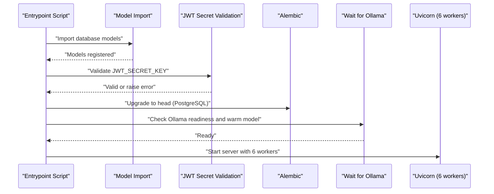
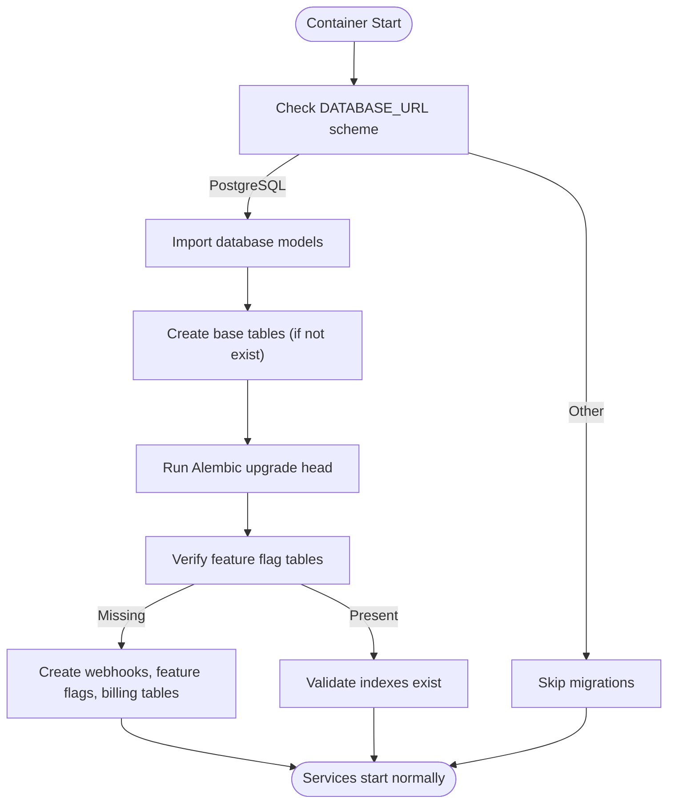
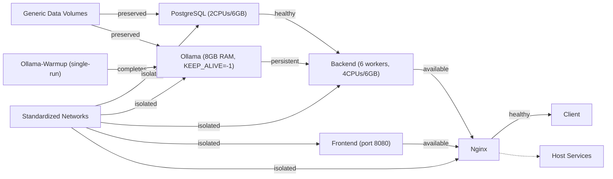

# Production Deployment

<cite>
**Referenced Files in This Document**
- [docker-compose.prod.yml](file://docker-compose.prod.yml)
- [docker-compose.portainer.yml](file://docker-compose.portainer.yml)
- [docker-compose.staging.yml](file://docker-compose.staging.yml)
- [nginx.prod.conf](file://nginx/nginx.prod.conf)
- [Dockerfile (backend)](file://app/backend/Dockerfile)
- [Dockerfile (frontend)](file://app/frontend/Dockerfile)
- [Dockerfile (nginx)](file://nginx/Dockerfile)
- [docker-entrypoint.sh](file://app/backend/scripts/docker-entrypoint.sh)
- [wait_for_ollama.py](file://app/backend/scripts/wait_for_ollama.py)
- [main.py](file://app/backend/main.py)
- [database.py](file://app/backend/db/database.py)
- [db_models.py](file://app/backend/models/db_models.py)
- [auth.py](file://app/backend/middleware/auth.py)
- [env.py](file://alembic/env.py)
- [alembic.ini](file://alembic.ini)
- [README.md](file://README.md)
- [ci.yml](file://.github/workflows/ci.yml)
- [cd.yml](file://.github/workflows/cd.yml)
- [requirements.txt](file://requirements.txt)
- [llm_service.py](file://app/backend/services/llm_service.py)
- [hybrid_pipeline.py](file://app/backend/services/hybrid_pipeline.py)
- [012_admin_foundation.py](file://alembic/versions/012_admin_foundation.py)
- [013_webhooks_and_notifications.py](file://alembic/versions/013_webhooks_and_notifications.py)
- [014_billing_system.py](file://alembic/versions/014_billing_system.py)
- [webhook_service.py](file://app/backend/services/webhook_service.py)
</cite>

## Update Summary
**Changes Made**
- Enhanced Docker entrypoint script with model import statement before table creation for improved database initialization
- Updated volume preservation documentation with standardized naming conventions for PostgreSQL and Ollama data volumes
- Added network configuration documentation with standardized network naming for production and staging environments
- Enhanced database migration system with improved compatibility for feature flag seeding and webhook delivery tables
- Implemented Docker volume preservation measures by reverting volume names from prefixed versions back to generic names to maintain backward compatibility
- Added comprehensive database schema support for webhooks, webhook deliveries, and billing configurations
- Implemented idempotent migration patterns ensuring consistent behavior across database systems
- Expanded feature flag infrastructure with tenant-specific override capabilities
- Introduced billing system configuration tables for payment provider settings
- **Updated**: Enhanced host routing capabilities via extra_hosts configuration enabling seamless communication between containers and host services
- **Updated**: Added host.docker.internal routing for development and staging environments allowing access to host services

## Table of Contents
1. [Introduction](#introduction)
2. [Project Structure](#project-structure)
3. [Core Components](#core-components)
4. [Architecture Overview](#architecture-overview)
5. [Detailed Component Analysis](#detailed-component-analysis)
6. [Dependency Analysis](#dependency-analysis)
7. [Performance Considerations](#performance-considerations)
8. [Troubleshooting Guide](#troubleshooting-guide)
9. [Conclusion](#conclusion)
10. [Appendices](#appendices)

## Introduction
This document provides comprehensive production deployment guidance for Resume AI by ThetaLogics. It covers server preparation, container orchestration with Docker Compose, Nginx reverse proxy configuration, environment variable management, secrets handling, database migrations and backups, monitoring and alerting, scaling and auto-scaling, performance tuning, deployment checklists, rollback procedures, and security hardening.

## Project Structure
The repository organizes the stack into four primary services:
- Backend: FastAPI application with Uvicorn, Alembic migrations, and Ollama integration
- Frontend: Static React SPA served by Nginx on port 8080
- Nginx: Reverse proxy and static asset server with production configuration baked into the image
- **Updated**: Ollama-warmup: Dedicated service for model warmup with persistent loading

```mermaid
graph TB
subgraph "Production Stack"
NGINX["Nginx (reverse proxy)"]
FRONT["React Frontend (static on port 8080)"]
BACK["FastAPI Backend (6 workers)"]
DB["PostgreSQL"]
OLL["Ollama (8GB RAM)"]
WARM["Ollama-Warmup (single-run)"]
NET["aria_network (bridge)"]
HOST["Host Services"]
END
CLIENT["Browser"] --> NGINX
NGINX --> FRONT
NGINX --> BACK
BACK --> DB
BACK --> OLL
OLL --> WARM
NET --> DB
NET --> OLL
NET --> BACK
NET --> FRONT
NET --> NGINX
HOST -.-> NGINX
```

**Diagram sources**
- [docker-compose.prod.yml:126-145](file://docker-compose.prod.yml#L126-L145)
- [docker-compose.prod.yml:156-188](file://docker-compose.prod.yml#L156-L188)
- [docker-compose.prod.yml:311-315](file://docker-compose.prod.yml#L311-L315)
- [nginx.prod.conf:19-87](file://nginx/nginx.prod.conf#L19-L87)
- [Dockerfile (backend):1-39](file://app/backend/Dockerfile#L1-L39)
- [Dockerfile (frontend):1-26](file://app/frontend/Dockerfile#L1-L26)

**Section sources**
- [docker-compose.prod.yml:7-227](file://docker-compose.prod.yml#L7-L227)
- [nginx.prod.conf:1-89](file://nginx/nginx.prod.conf#L1-L89)
- [Dockerfile (backend):1-39](file://app/backend/Dockerfile#L1-L39)
- [Dockerfile (frontend):1-26](file://app/frontend/Dockerfile#L1-L26)
- [Dockerfile (nginx):1-13](file://nginx/Dockerfile#L1-L13)

## Core Components
- Backend service
  - **Updated**: Uvicorn with 6 workers for enhanced I/O-bound concurrency
  - Alembic migrations executed at startup for PostgreSQL
  - Startup gating for Ollama readiness and model warm-up
  - Health endpoint validating database and LLM connectivity
  - **Critical**: JWT_SECRET_KEY must be set in production environment
- Frontend service
  - Nginx static hosting of built React assets on port 8080
- Nginx service
  - Production configuration with reverse proxy, streaming, and SPA fallback
  - Health check endpoint proxied to backend
  - **Updated**: Enhanced host routing capabilities via extra_hosts configuration
- **Updated**: Ollama-warmup service
  - Dedicated single-run container that loads the model into RAM
  - Uses OLLAMA_KEEP_ALIVE=-1 to persist model in memory
  - Exits after successful warmup, leaving the model loaded in Ollama
- **Updated**: Volume management with preserved naming conventions
  - PostgreSQL data volume: `postgres_data` (generic name for backward compatibility)
  - Ollama data volume: `ollama_data` (generic name for backward compatibility)
  - These generic volume names prevent data loss during redeployments by maintaining consistent volume identifiers
- **Updated**: Network configuration with standardized naming
  - Production network: `aria_network` (bridge driver)
  - Staging network: `aria_staging_network` (bridge driver)
  - Ensures isolation between environments while maintaining consistent naming
- **Updated**: Enhanced host routing capabilities
  - Nginx service configured with `extra_hosts` to enable communication with host services
  - `host.docker.internal:host-gateway` mapping allows containers to access host services
  - Essential for development and staging environments where local services may run on the host

Key production configuration highlights:
- **Updated**: Resource limits and health checks for enhanced resilience with 4CPUs/6GB backend allocation
- Dynamic DNS resolution for Docker embedded DNS to avoid stale IPs
- Streaming and CORS handling for SSE and cross-origin requests
- **Enhanced**: Dedicated warmup job with persistent model loading using OLLAMA_KEEP_ALIVE=-1
- **Updated**: Increased LLM_NARRATIVE_TIMEOUT from 120s to 180s for better concurrent request handling
- **Enhanced**: Mandatory JWT_SECRET_KEY environment variable for production security
- **Updated**: Ollama memory allocation increased from 6GB to 8GB for improved stability
- **Updated**: Volume naming strategy ensures data preservation across deployments
- **Updated**: Network isolation between production and staging environments
- **Updated**: Enhanced host routing via extra_hosts configuration for seamless container-to-host communication

**Section sources**
- [docker-compose.prod.yml:75-112](file://docker-compose.prod.yml#L75-L112)
- [docker-compose.prod.yml:126-145](file://docker-compose.prod.yml#L126-L145)
- [docker-compose.prod.yml:41-71](file://docker-compose.prod.yml#L41-L71)
- [docker-compose.prod.yml:22-39](file://docker-compose.prod.yml#L22-L39)
- [docker-compose.prod.yml:156-188](file://docker-compose.prod.yml#L156-L188)
- [docker-compose.prod.yml:192-211](file://docker-compose.prod.yml#L192-L211)
- [docker-compose.prod.yml:213-221](file://docker-compose.prod.yml#L213-L221)
- [docker-compose.prod.yml:305-315](file://docker-compose.prod.yml#L305-L315)
- [docker-compose.prod.yml:311-315](file://docker-compose.prod.yml#L311-L315)
- [docker-compose.prod.yml:144-146](file://docker-compose.prod.yml#L144-L146)
- [nginx.prod.conf:19-87](file://nginx/nginx.prod.conf#L19-L87)
- [docker-entrypoint.sh:4-14](file://app/backend/scripts/docker-entrypoint.sh#L4-L14)
- [wait_for_ollama.py:34-91](file://app/backend/scripts/wait_for_ollama.py#L34-L91)
- [main.py:228-259](file://app/backend/main.py#L228-L259)
- [auth.py:13-21](file://app/backend/middleware/auth.py#L13-L21)

## Architecture Overview
The production architecture uses Docker Compose to orchestrate services behind Nginx. Nginx terminates HTTP/HTTPS traffic, proxies API and streaming endpoints to the backend, and serves the frontend SPA on port 8080. The backend connects to PostgreSQL and interacts with Ollama for AI analysis. A dedicated warmup service ensures the model is loaded into RAM before serving requests. **Updated**: Enhanced host routing capabilities enable seamless communication between containers and host services through the extra_hosts configuration.

```mermaid
graph TB
subgraph "External"
U["User Agent"]
end
subgraph "Load Balancer / Edge"
LB["Optional external LB"]
end
subgraph "Reverse Proxy Layer"
NX["Nginx (nginx.prod.conf)"]
END
subgraph "Application Layer"
FE["Frontend (Nginx static on port 8080)"]
BE["Backend (FastAPI/Uvicorn with 6 workers)"]
end
subgraph "Data Layer"
PG["PostgreSQL (2CPUs/6GB)"]
OL["Ollama (8GB RAM)"]
WU["Ollama-Warmup (single-run)"]
NET["aria_network (bridge)"]
HOST["Host Services"]
END
U --> NX
NX --> FE
NX --> BE
BE --> PG
BE --> OL
OL --> WU
NET --> PG
NET --> OL
NET --> BE
NET --> FE
NET --> NX
HOST -.-> NX
```

**Diagram sources**
- [nginx.prod.conf:19-87](file://nginx/nginx.prod.conf#L19-L87)
- [docker-compose.prod.yml:126-145](file://docker-compose.prod.yml#L126-L145)
- [docker-compose.prod.yml:156-188](file://docker-compose.prod.yml#L156-L188)
- [docker-compose.prod.yml:311-315](file://docker-compose.prod.yml#L311-L315)
- [Dockerfile (backend):36-38](file://app/backend/Dockerfile#L36-L38)
- [Dockerfile (frontend):15-25](file://app/frontend/Dockerfile#L15-L25)

## Detailed Component Analysis

### Nginx Reverse Proxy and SSL Termination
Nginx is configured with:
- Production configuration baked into the image
- Resolver with short TTL to refresh backend/frontend IPs
- Health endpoint proxying to backend
- Streaming endpoint for SSE with appropriate timeouts and buffer settings
- **Updated**: SPA fallback now proxies to frontend service on port 8080
- **Updated**: Enhanced host routing capabilities via extra_hosts configuration
- Logging and performance tuning (keepalive, gzip)

**Updated**: Enhanced host routing capabilities via extra_hosts configuration

The Nginx service now includes enhanced host routing capabilities through the `extra_hosts` configuration:

```yaml
nginx:
  # ... other configuration ...
  extra_hosts:
    - "host.docker.internal:host-gateway"
```

This configuration enables seamless communication between containers and host services by:
- Mapping `host.docker.internal` to the Docker gateway IP address
- Allowing containers to access host services running on the Docker host
- Essential for development and staging environments where local services may run on the host
- Facilitating debugging and development workflows where developers need to access host services from within containers

Operational notes:
- The configuration listens on port 80 internally but is mapped to port 8080 externally via Docker port mapping
- The resolver directive ensures dynamic upstream resolution to avoid stale container IPs after recreation
- Frontend service is now exposed on port 8080 internally, requiring the frontend proxy to target `frontend:8080`
- **Updated**: Enhanced host routing enables access to host services for development and debugging scenarios

**Section sources**
- [nginx.prod.conf:19-87](file://nginx/nginx.prod.conf#L19-L87)
- [Dockerfile (nginx):1-13](file://nginx/Dockerfile#L1-L13)
- [docker-compose.prod.yml:126-145](file://docker-compose.prod.yml#L126-L145)
- [docker-compose.prod.yml:144-146](file://docker-compose.prod.yml#L144-L146)

### Backend Service: Startup, Migrations, and Health
- Startup flow
  - Alembic migrations run on PostgreSQL URLs at container start
  - Optional Ollama readiness gate with warm-up
  - Startup banner prints dependency checks
- **Critical Security Enhancement**: JWT_SECRET_KEY validation
  - Backend enforces JWT_SECRET_KEY environment variable in production
  - Raises RuntimeError if JWT_SECRET_KEY is not set in production environment
  - Uses development fallback only in non-production environments
- **Updated**: Enhanced concurrency with 6 Uvicorn workers for improved I/O-bound performance
- Health endpoint
  - Validates database connectivity and Ollama availability
  - Returns degraded status without raising errors to prevent upstream failures
- Database configuration
  - Supports both SQLite and PostgreSQL with normalization and connection pooling

**Updated**: Enhanced Docker entrypoint script with model import statement before table creation

The entrypoint script now includes a critical enhancement that ensures database models are properly registered before table creation:

```bash
# Apply DB migrations when using PostgreSQL (production). Idempotent: safe on every start.
case "${DATABASE_URL:-}" in
  postgresql*|postgres://*)
    echo "[entrypoint] Creating base tables (if not exist)..."
    cd /app && python -c "from app.backend.db.database import Base, engine; import app.backend.models.db_models; Base.metadata.create_all(bind=engine)"
    echo "[entrypoint] Running Alembic migrations..."
    cd /app && alembic -c alembic.ini upgrade heads
    echo "[entrypoint] Migrations complete."
    ;;
  *)
    echo "[entrypoint] Skipping Alembic (not a PostgreSQL DATABASE_URL)."
    ;;
esac
```

This change ensures that:
- Database models are imported before attempting to create tables
- Alembic migrations run after model registration
- Improved reliability of database initialization process



**Diagram sources**
- [docker-entrypoint.sh:4-14](file://app/backend/scripts/docker-entrypoint.sh#L4-L14)
- [auth.py:13-21](file://app/backend/middleware/auth.py#L13-L21)
- [wait_for_ollama.py:34-91](file://app/backend/scripts/wait_for_ollama.py#L34-L91)
- [Dockerfile (backend):36-38](file://app/backend/Dockerfile#L36-L38)

**Section sources**
- [docker-entrypoint.sh:4-14](file://app/backend/scripts/docker-entrypoint.sh#L4-L14)
- [auth.py:13-21](file://app/backend/middleware/auth.py#L13-L21)
- [wait_for_ollama.py:34-91](file://app/backend/scripts/wait_for_ollama.py#L34-L91)
- [main.py:68-149](file://app/backend/main.py#L68-L149)
- [main.py:228-259](file://app/backend/main.py#L228-L259)
- [database.py:1-33](file://app/backend/db/database.py#L1-L33)

### Frontend Service: Static Hosting
- Built assets served by Nginx from the frontend build output
- **Updated**: Production image exposes port 8080 internally for Nginx proxying
- Non-root user execution for security

**Section sources**
- [Dockerfile (frontend):1-26](file://app/frontend/Dockerfile#L1-L26)

### Database: PostgreSQL Tuning and Migration
- PostgreSQL tuned for 6 GB RAM allocation with shared buffers, work_mem, and max connections
- Alembic migrations executed at startup for PostgreSQL deployments
- Environment variables for credentials and database name

**Updated**: Enhanced PostgreSQL migration system with improved compatibility for feature flag seeding and webhook delivery tables

The migration system now includes comprehensive database schema support through recent additions:

#### Feature Flag Infrastructure
- **Admin Foundation Migration (012)**: Establishes core feature flag tables including `feature_flags`, `tenant_feature_overrides`, and audit logging
- **Webhook System Migration (013)**: Adds `webhooks` and `webhook_deliveries` tables with proper foreign key relationships and indexing
- **Billing System Migration (014)**: Introduces `platform_configs` table for payment provider settings

#### PostgreSQL Compatibility Improvements
- **Idempotent Operations**: All migrations use `_table_exists()` and `_index_names()` checks to ensure safe repeated execution
- **Consistent Indexing**: Standardized index creation patterns across all migration scripts
- **Foreign Key Constraints**: Proper CASCADE deletion handling for dependent records
- **Timezone Support**: Consistent use of `DateTime(timezone=True)` for temporal data
- **JSON Data Handling**: Appropriate TEXT column types for JSON payload storage



**Diagram sources**
- [docker-entrypoint.sh:4-14](file://app/backend/scripts/docker-entrypoint.sh#L4-L14)
- [env.py:14-20](file://alembic/env.py#L14-L20)
- [alembic.ini:84-87](file://alembic.ini#L84-L87)

**Section sources**
- [docker-compose.prod.yml:22-39](file://docker-compose.prod.yml#L22-L39)
- [docker-entrypoint.sh:4-14](file://app/backend/scripts/docker-entrypoint.sh#L4-L14)
- [env.py:14-20](file://alembic/env.py#L14-L20)
- [alembic.ini:84-87](file://alembic.ini#L84-L87)
- [012_admin_foundation.py:90-109](file://alembic/versions/012_admin_foundation.py#L90-L109)
- [013_webhooks_and_notifications.py:36-114](file://alembic/versions/013_webhooks_and_notifications.py#L36-L114)
- [014_billing_system.py:33-56](file://alembic/versions/014_billing_system.py#L33-L56)

### Enhanced Ollama and Model Warm-Up
- **Updated**: Ollama configured with thread and parallelism settings for throughput
- **Enhanced**: Dedicated warmup service with single-run approach using OLLAMA_KEEP_ALIVE=-1
- **Updated**: Increased memory allocation from 6GB to 8GB for improved stability under load
- **Enhanced**: Persistent model loading eliminates need for continuous keep-alive loops
- **Updated**: LLM_NARRATIVE_TIMEOUT increased from 120s to 180s for better concurrent request handling
- Backend startup can gate on Ollama readiness and warm model presence
- Memory calculation: qwen3.5:4b actual: 3.6 GiB weights + 1.3 GiB KV-cache + 394 MiB compute = 5.3 GiB with 8GB headroom for OS overhead and concurrent requests

**Section sources**
- [docker-compose.prod.yml:41-71](file://docker-compose.prod.yml#L41-L71)
- [docker-compose.prod.yml:156-188](file://docker-compose.prod.yml#L156-L188)
- [docker-compose.prod.yml:96-97](file://docker-compose.prod.yml#L96-L97)
- [wait_for_ollama.py:34-91](file://app/backend/scripts/wait_for_ollama.py#L34-L91)
- [main.py:262-326](file://app/backend/main.py#L262-L326)
- [llm_service.py:138-175](file://app/backend/services/llm_service.py#L138-L175)
- [hybrid_pipeline.py:107-130](file://app/backend/services/hybrid_pipeline.py#L107-L130)

### Volume Preservation Strategy
**Updated**: Docker volume preservation measures implemented to prevent data loss during redeployments

The production deployment now uses generic volume names instead of prefixed ones to maintain backward compatibility:

- **PostgreSQL volume**: `postgres_data` (was previously `prod_postgres_data`)
- **Ollama volume**: `ollama_data` (was previously `prod_ollama_data`)

This change ensures that:
- Existing data volumes are automatically recognized by Docker Compose
- Redeployments preserve existing PostgreSQL and Ollama data
- No manual volume migration steps are required during updates
- Container names remain consistent across deployments

**Important**: This volume naming strategy applies specifically to the production environment. The staging environment continues to use prefixed volume names (`staging_postgres_data`, `staging_ollama_data`) to maintain separation between environments.

**Updated**: Network configuration with standardized naming conventions

The Docker Compose files now define standardized network configurations:

- **Production network**: `aria_network` (bridge driver)
- **Staging network**: `aria_staging_network` (bridge driver)
- Both networks use the bridge driver for container communication
- Network isolation ensures production and staging environments remain separate

**Section sources**
- [docker-compose.prod.yml:30-31](file://docker-compose.prod.yml#L30-L31)
- [docker-compose.prod.yml:62-63](file://docker-compose.prod.yml#L62-L63)
- [docker-compose.prod.yml:305-315](file://docker-compose.prod.yml#L305-L315)
- [docker-compose.prod.yml:311-315](file://docker-compose.prod.yml#L311-L315)
- [docker-compose.portainer.yml:27-28](file://docker-compose.portainer.yml#L27-L28)
- [docker-compose.portainer.yml:47-48](file://docker-compose.portainer.yml#L47-L48)
- [docker-compose.staging.yml:27-28](file://docker-compose.staging.yml#L27-L28)
- [docker-compose.staging.yml:52-53](file://docker-compose.staging.yml#L52-L53)

### Watchtower and Certbot
- Watchtower monitors ARIA containers and auto-restarts when images change
- Certbot runs as a long-lived container to renew certificates

**Section sources**
- [docker-compose.prod.yml:192-211](file://docker-compose.prod.yml#L192-L211)
- [docker-compose.prod.yml:213-221](file://docker-compose.prod.yml#L213-L221)

## Dependency Analysis
Inter-service dependencies and health checks:
- Backend depends on PostgreSQL and Ollama being healthy
- **Updated**: Nginx depends on frontend (on port 8080) and backend
- **Enhanced**: Warmup service depends on Ollama health and exits after completion
- **Updated**: Ollama service maintains persistent model loading with OLLAMA_KEEP_ALIVE=-1
- **Updated**: Volume dependencies maintained through generic naming for data preservation
- **Updated**: Network dependencies maintained through standardized network naming
- **Updated**: Enhanced host routing capabilities enable seamless communication between containers and host services



**Diagram sources**
- [docker-compose.prod.yml:96-100](file://docker-compose.prod.yml#L96-L100)
- [docker-compose.prod.yml:131-133](file://docker-compose.prod.yml#L131-L133)
- [docker-compose.prod.yml:140-144](file://docker-compose.prod.yml#L140-L144)
- [docker-compose.prod.yml:156-188](file://docker-compose.prod.yml#L156-L188)
- [docker-compose.prod.yml:305-315](file://docker-compose.prod.yml#L305-L315)
- [docker-compose.prod.yml:311-315](file://docker-compose.prod.yml#L311-L315)

**Section sources**
- [docker-compose.prod.yml:96-100](file://docker-compose.prod.yml#L96-L100)
- [docker-compose.prod.yml:131-133](file://docker-compose.prod.yml#L131-L133)
- [docker-compose.prod.yml:140-144](file://docker-compose.prod.yml#L140-L144)
- [docker-compose.prod.yml:156-188](file://docker-compose.prod.yml#L156-L188)

## Performance Considerations
- **Updated**: Backend workers: increased from 4 to 6 workers for enhanced I/O-bound concurrency; adjust based on CPU and memory headroom
- **Updated**: Backend resource allocation: 4CPUs/6GB provides optimal balance for 6 workers with sufficient headroom
- PostgreSQL tuning: shared_buffers, work_mem, and max_connections optimized for 6 GB RAM allocation
- **Updated**: Ollama settings: thread count, parallel requests, and KV cache quantization to maximize throughput and reduce memory pressure with increased 8GB allocation
- **Enhanced**: Persistent model loading eliminates warmup overhead for subsequent requests
- **Updated**: LLM_NARRATIVE_TIMEOUT increased to 180s provides better handling of concurrent requests and model loading
- Nginx: keepalive, gzip, and streaming timeouts tuned for SSE and SPA behavior
- **Updated**: Frontend proxy port optimization for better separation of concerns
- **Updated**: Volume placement: persistent volumes for PostgreSQL and Ollama data using generic names for durability and performance
- **Updated**: Network isolation: bridge driver networks provide optimal container communication while maintaining environment separation
- **Updated**: Enhanced host routing capabilities: extra_hosts configuration enables efficient container-to-host communication
- **Memory headroom**: 8GB Ollama allocation provides sufficient headroom for OS overhead and concurrent requests beyond the 5.3GB model footprint

## Troubleshooting Guide
Common operational issues and remedies:
- **JWT_SECRET_KEY errors in production**
  - Error: "JWT_SECRET_KEY environment variable must be set in production"
  - Solution: Set JWT_SECRET_KEY environment variable with a strong random value
  - Check: `docker-compose.prod.yml` line 86 requires JWT_SECRET_KEY
- **Ollama memory overflow under load**
  - **Updated**: Error: Ollama running out of memory during concurrent requests
  - Solution: Verify Ollama memory allocation is set to 8GB in `docker-compose.prod.yml` line 66
  - Check: Monitor Ollama container memory usage and consider adjusting OLLAMA_NUM_PARALLEL setting
- **Model not warming up properly**
  - **Updated**: Verify Ollama-warmup service completes successfully
  - Check: OLLAMA_KEEP_ALIVE=-1 persists model in memory
  - Verify: LLM_NARRATIVE_TIMEOUT=180 allows sufficient time for concurrent requests
- **Backend performance issues**
  - **Updated**: Verify backend has sufficient resources with 4CPUs/6GB allocation
  - Check: Uvicorn workers count is set to 6 in `docker-compose.prod.yml` line 82
  - Monitor: Backend CPU utilization and worker thread saturation
- **Database migration failures**
  - **Updated**: Verify PostgreSQL migration compatibility with recent changes
  - Check: Feature flag tables (`feature_flags`, `tenant_feature_overrides`) exist and are indexed
  - Verify: Webhook tables (`webhooks`, `webhook_deliveries`) have proper foreign key constraints
  - Monitor: Alembic migration logs for idempotent operation errors
  - **Updated**: Verify model import occurs before table creation in entrypoint script
- **Volume data loss during redeployment**
  - **Updated**: Verify volume names use generic naming convention (`postgres_data`, `ollama_data`)
  - Check: Generic volume names prevent data loss during redeployments
  - Verify: Production environment uses generic volumes, staging uses prefixed volumes
- **Network connectivity issues**
  - **Updated**: Verify network names match between services
  - Check: Production network `aria_network` vs staging network `aria_staging_network`
  - Verify: Bridge driver configuration for optimal container communication
- **Enhanced host routing issues**
  - **Updated**: Verify extra_hosts configuration is present in nginx service
  - Check: `host.docker.internal:host-gateway` mapping in `docker-compose.prod.yml` line 145
  - Verify: Containers can resolve `host.docker.internal` to access host services
  - **Updated**: Test connectivity to host services from within containers using `host.docker.internal`
- **Ollama not responding**
  - Inspect container logs and ensure the model is pulled and warmed
- **Database locked errors**
  - SQLite does not support concurrent writes; restart backend if encountering locks
- **SSL certificate issues**
  - Renew certificates and restart Nginx
- **Frontend not loading**
  - Verify port 8080 mapping in `docker-compose.prod.yml` line 132
  - Check frontend service health and port configuration

**Section sources**
- [README.md:339-355](file://README.md#L339-L355)
- [auth.py:13-21](file://app/backend/middleware/auth.py#L13-L21)
- [docker-compose.prod.yml:86](file://docker-compose.prod.yml#L86)
- [docker-compose.prod.yml:66](file://docker-compose.prod.yml#L66)
- [docker-compose.prod.yml:132](file://docker-compose.prod.yml#L132)
- [docker-compose.prod.yml:96-97](file://docker-compose.prod.yml#L96-L97)
- [docker-compose.prod.yml:305-315](file://docker-compose.prod.yml#L305-L315)
- [docker-compose.prod.yml:311-315](file://docker-compose.prod.yml#L311-L315)
- [docker-compose.prod.yml:144-146](file://docker-compose.prod.yml#L144-L146)

## Conclusion
This production deployment leverages Docker Compose to orchestrate a resilient stack with Nginx as the reverse proxy, Alembic-managed PostgreSQL migrations, and Ollama for AI inference. The configuration emphasizes health checks, dynamic DNS resolution, streaming support, and automated image updates via Watchtower. **Critical security enhancements** include mandatory JWT_SECRET_KEY enforcement in production environments. **Enhanced**: The Ollama model warmup mechanism now uses a dedicated single-run container with persistent loading via OLLAMA_KEEP_ALIVE=-1, eliminating continuous keep-alive loops. **Updated**: LLM_NARRATIVE_TIMEOUT has been increased to 180s to better handle concurrent requests and improve system stability under load conditions. **Updated**: Backend service now operates with 6 Uvicorn workers and 4CPUs/6GB resource allocation for optimal performance. **Enhanced**: The PostgreSQL migration system now includes comprehensive compatibility improvements for feature flag seeding, webhook delivery tables, and billing configurations, ensuring consistent behavior across database systems. **Updated**: Volume preservation measures implemented using generic naming conventions to prevent data loss during redeployments. **Updated**: Network isolation achieved through standardized network naming for production and staging environments. **Updated**: Enhanced host routing capabilities via extra_hosts configuration enable seamless communication between containers and host services, facilitating development and debugging workflows. For production hardening, integrate external load balancing, SSL termination, and centralized monitoring/alerting.

## Appendices

### A. Server Preparation Checklist
- Install Docker Engine and add the deployment user to the docker group
- Create application directory and set ownership
- Install Certbot and obtain a certificate for the domain
- Configure DNS A record to point to the VPS

**Section sources**
- [README.md:113-138](file://README.md#L113-L138)

### B. Environment Variables and Secrets Management
- **Updated**: Required secrets and variables for deployment
  - Docker Hub credentials for image pulls
  - VPS host, username, and SSH key for automated deployment
  - **Critical**: JWT_SECRET_KEY must be set in production environment
  - **Updated**: Ollama memory allocation set to 8GB for production stability
  - **Enhanced**: LLM_NARRATIVE_TIMEOUT=180 for improved concurrent request handling
  - **Updated**: Generic volume names (`postgres_data`, `ollama_data`) for data preservation
  - **Updated**: Network names (`aria_network`, `aria_staging_network`) for environment isolation
  - **Updated**: Enhanced host routing via extra_hosts configuration for container-to-host communication
- Runtime environment variables
  - JWT secret key (required), database URL, Ollama base URL, model names, and timeouts
- Storage
  - Use Docker named volumes for PostgreSQL and Ollama data with generic names

**Section sources**
- [README.md:147-178](file://README.md#L147-L178)
- [docker-compose.prod.yml:81-95](file://docker-compose.prod.yml#L81-L95)
- [docker-compose.prod.yml:222-226](file://docker-compose.prod.yml#L222-L226)
- [docker-compose.prod.yml:305-315](file://docker-compose.prod.yml#L305-L315)
- [docker-compose.prod.yml:311-315](file://docker-compose.prod.yml#L311-L315)
- [docker-compose.prod.yml:144-146](file://docker-compose.prod.yml#L144-L146)
- [auth.py:13-21](file://app/backend/middleware/auth.py#L13-L21)

### C. CI/CD and Automated Deployment
- CI workflow validates backend and frontend tests
- CD workflow builds and pushes images to Docker Hub
- Manual deployment step pulls latest images and restarts services

**Section sources**
- [ci.yml:1-63](file://.github/workflows/ci.yml#L1-L63)
- [cd.yml:1-101](file://.github/workflows/cd.yml#L1-L101)

### D. Monitoring, Metrics, and Alerting
- Health endpoints
  - Backend health endpoint returns status and degraded indicators
  - Nginx health endpoint proxies to backend
- Recommendations
  - Integrate Prometheus and Grafana for metrics collection
  - Configure alerts for backend health, database connectivity, Ollama status, JWT_SECRET_KEY validation, Ollama memory usage, model warmup completion, volume data preservation, network isolation, and enhanced host routing capabilities

**Section sources**
- [main.py:228-259](file://app/backend/main.py#L228-L259)
- [nginx.prod.conf:29-34](file://nginx/nginx.prod.conf#L29-L34)
- [docker-compose.prod.yml:140-144](file://docker-compose.prod.yml#L140-L144)

### E. Scaling and Auto-Scaling
- Horizontal scaling
  - **Updated**: Backend service already configured with 6 Uvicorn workers for optimal CPU-bound tasks
  - Use an external load balancer to distribute traffic across replicas
- Auto-scaling
  - Scale backend pods based on CPU utilization and response latency
  - Ensure stateless backend and shared PostgreSQL/Ollama configuration
  - **Consider**: JWT_SECRET_KEY must be synchronized across scaled instances
  - **Updated**: Consider Ollama memory constraints when scaling multiple instances
  - **Enhanced**: Persistent model loading reduces scaling complexity as models remain loaded
  - **Updated**: Backend resource allocation (4CPUs/6GB) provides headroom for horizontal scaling
  - **Updated**: Enhanced host routing capabilities scale efficiently with container orchestration

**Section sources**
- [docker-compose.prod.yml:101-112](file://docker-compose.prod.yml#L101-L112)
- [docker-compose.prod.yml:129-133](file://docker-compose.prod.yml#L129-L133)

### F. Database Migration Strategies
- Automated migrations
  - Alembic upgrades run at container start for PostgreSQL
- Version control
  - Migration scripts under alembic/versions
- Safe rollouts
  - Prefer zero-downtime migrations and maintain backups before updates
- **Updated**: PostgreSQL compatibility improvements
  - Idempotent operations ensure safe repeated execution
  - Consistent indexing patterns across all migration scripts
  - Foreign key constraints with proper CASCADE handling
  - Timezone-aware datetime columns for temporal data consistency
  - **Updated**: Model import occurs before table creation for reliable initialization

**Section sources**
- [docker-entrypoint.sh:4-14](file://app/backend/scripts/docker-entrypoint.sh#L4-L14)
- [env.py:14-20](file://alembic/env.py#L14-L20)
- [alembic.ini:84-87](file://alembic.ini#L84-L87)
- [012_admin_foundation.py:24-34](file://alembic/versions/012_admin_foundation.py#L24-L34)
- [013_webhooks_and_notifications.py:24-34](file://alembic/versions/013_webhooks_and_notifications.py#L24-L34)
- [014_billing_system.py:21-31](file://alembic/versions/014_billing_system.py#L21-L31)

### G. Backup and Disaster Recovery
- Backups
  - Snapshot PostgreSQL volume and Ollama data volume regularly
- Recovery
  - Restore volumes to a new stack and redeploy; verify health endpoints and model warm-up
  - **Include**: Verify JWT_SECRET_KEY consistency during recovery
  - **Updated**: Ensure Ollama memory allocation is properly restored during recovery
  - **Enhanced**: Verify persistent model loading continues to work after recovery
  - **Updated**: Validate PostgreSQL migration compatibility with restored database schema
  - **Updated**: Confirm generic volume names are preserved during recovery process
  - **Updated**: Verify network isolation between environments during recovery
  - **Updated**: Verify enhanced host routing capabilities are maintained during recovery

**Section sources**
- [docker-compose.prod.yml:26-27](file://docker-compose.prod.yml#L26-L27)
- [docker-compose.prod.yml:56-57](file://docker-compose.prod.yml#L56-L57)
- [docker-compose.prod.yml:305-315](file://docker-compose.prod.yml#L305-L315)
- [docker-compose.prod.yml:311-315](file://docker-compose.prod.yml#L311-L315)

### H. Security Hardening and Access Control
- **Updated**: Network security
  - Restrict inbound ports; allow only necessary ports (e.g., 8080 for Nginx)
  - JWT_SECRET_KEY enforcement prevents unauthorized authentication
  - **Updated**: Network isolation between production and staging environments
  - **Updated**: Enhanced host routing security considerations
- **Enhanced**: Secrets management
  - Store JWT_SECRET_KEY in repository secrets and pass via environment variables
  - Use strong, randomly generated JWT_SECRET_KEY values
- TLS
  - Use external SSL termination or Certbot within the stack
- Access control
  - Limit SSH access to trusted keys and restrict administrative users

**Section sources**
- [README.md:147-178](file://README.md#L147-L178)
- [docker-compose.prod.yml:213-221](file://docker-compose.prod.yml#L213-L221)
- [auth.py:13-21](file://app/backend/middleware/auth.py#L13-L21)

### I. Deployment Checklists
- Pre-deploy
  - Verify environment variables and secrets including JWT_SECRET_KEY
  - Confirm model is pulled and warmed
  - **Verify**: JWT_SECRET_KEY is set in production environment
  - **Verify**: Ollama memory allocation is set to 8GB
  - **Verify**: LLM_NARRATIVE_TIMEOUT=180 for concurrent request handling
  - **Verify**: Backend has 6 Uvicorn workers configured
  - **Verify**: Backend resource allocation is 4CPUs/6GB
  - **Updated**: Verify PostgreSQL migration compatibility with feature flag and webhook tables
  - **Updated**: Confirm generic volume names (`postgres_data`, `ollama_data`) are preserved
  - **Updated**: Verify network names (`aria_network`, `aria_staging_network`) are correct
  - **Updated**: Verify model import occurs before table creation in entrypoint script
  - **Updated**: Verify enhanced host routing via extra_hosts configuration is properly set up
- Deploy
  - Pull latest images and restart services
- Post-deploy
  - Validate health endpoints and streaming
  - Monitor logs and metrics
  - **Test**: Authentication endpoints with JWT_SECRET_KEY
  - **Monitor**: Ollama memory usage under load conditions
  - **Verify**: Ollama-warmup service completes successfully and model remains loaded
  - **Updated**: Test database connectivity with new migration tables
  - **Updated**: Verify volume data preservation during deployment
  - **Updated**: Verify network isolation between environments
  - **Updated**: Test enhanced host routing capabilities for container-to-host communication

**Section sources**
- [cd.yml:97-101](file://.github/workflows/cd.yml#L97-L101)
- [main.py:228-259](file://app/backend/main.py#L228-L259)
- [nginx.prod.conf:29-34](file://nginx/nginx.prod.conf#L29-L34)
- [auth.py:13-21](file://app/backend/middleware/auth.py#L13-L21)

### J. Rollback Procedures
- Rollback images
  - Use Watchtower or redeploy previous image tags
- Database rollback
  - Use Alembic downgrade to the prior migration if reversible
  - **Updated**: Consider rolling back to migration 012 if webhook functionality is problematic
- **Include**: JWT_SECRET_KEY rollback considerations for authentication continuity
- **Updated**: Consider reverting Ollama memory allocation if stability issues arise
- **Enhanced**: If persistent model loading fails, revert to continuous warmup approach
- **Updated**: Consider reducing backend workers from 6 back to 4 if performance issues occur
- **Updated**: Ensure volume names remain compatible during rollback process
- **Updated**: Verify network isolation is maintained during rollback
- **Updated**: Verify enhanced host routing capabilities are restored during rollback

**Section sources**
- [docker-compose.prod.yml:192-211](file://docker-compose.prod.yml#L192-L211)
- [docker-entrypoint.sh:4-14](file://app/backend/scripts/docker-entrypoint.sh#L4-L14)

### K. Maintenance Schedule
- Weekly
  - Renew certificates
  - Review logs and metrics
  - **Monitor**: Ollama memory usage patterns
  - **Verify**: Persistent model loading continues to work correctly
  - **Monitor**: Backend worker utilization and performance
  - **Updated**: Validate PostgreSQL migration compatibility after updates
  - **Updated**: Verify volume data preservation during maintenance windows
  - **Updated**: Verify network isolation between environments
  - **Updated**: Monitor enhanced host routing capabilities for any connectivity issues
- Monthly
  - Rotate JWT_SECRET_KEY and update repository secrets
  - Validate database and Ollama volume snapshots
- Quarterly
  - **Review**: JWT_SECRET_KEY security audit and rotation policy compliance
  - **Review**: Ollama memory allocation effectiveness under production load
  - **Review**: LLM_NARRATIVE_TIMEOUT effectiveness for concurrent request handling
  - **Review**: Backend worker configuration effectiveness and resource utilization
  - **Updated**: Review PostgreSQL migration system performance and compatibility
  - **Updated**: Verify volume naming strategy effectiveness for data preservation
  - **Updated**: Review network isolation effectiveness between environments
  - **Updated**: Evaluate enhanced host routing capabilities for development and debugging workflows

**Section sources**
- [docker-compose.prod.yml:213-221](file://docker-compose.prod.yml#L213-L221)
- [README.md:147-178](file://README.md#L147-L178)