# Speech Service Microservice

<cite>
**Referenced Files in This Document**
- [main.py](file://app/speech_service/main.py)
- [Dockerfile](file://app/speech_service/Dockerfile)
- [requirements.txt](file://app/speech_service/requirements.txt)
- [voice_screening_service.py](file://app/backend/services/voice_screening_service.py)
- [voice.py](file://app/backend/routes/voice.py)
- [agent.py](file://app/voice_agent/agent.py)
- [docker-compose.prod.yml](file://docker-compose.prod.yml)
- [docker-compose.yml](file://docker-compose.yml)
- [docker-compose.staging.yml](file://docker-compose.staging.yml)
- [nginx.prod.conf](file://nginx/nginx.prod.conf)
- [livekit.yaml](file://app/voice_agent/livekit.yaml)
- [Dockerfile](file://app/voice_agent/Dockerfile)
- [Dockerfile.livekit](file://app/voice_agent/Dockerfile.livekit)
- [requirements.txt](file://app/voice_agent/requirements.txt)
- [ci.yml](file://.github/workflows/ci.yml)
- [cd.yml](file://.github/workflows/cd.yml)
</cite>

## Update Summary
**Changes Made**
- **Updated TTS Endpoint Processing**: Replaced torchaudio-based MP3-to-WAV conversion with pydub-based approach for improved memory efficiency and real-time processing capabilities
- **Added pydub Dependency**: Integrated pydub>=0.25.0 for in-memory MP3 stream processing with ffmpeg support
- **Enhanced Audio Processing Pipeline**: TTS endpoint now uses AudioSegment.from_mp3() for efficient MP3-to-WAV conversion
- **Maintained torchaudio Usage**: Preserved torchaudio for STT and VAD audio processing where it remains optimal
- **Updated System Dependencies**: FFmpeg system dependency maintained for audio format conversion support

## Table of Contents
1. [Introduction](#introduction)
2. [Project Structure](#project-structure)
3. [Core Components](#core-components)
4. [Architecture Overview](#architecture-overview)
5. [Automated CI/CD Pipeline](#automated-cicd-pipeline)
6. [Detailed Component Analysis](#detailed-component-analysis)
7. [Dependency Analysis](#dependency-analysis)
8. [Performance Considerations](#performance-considerations)
9. [Troubleshooting Guide](#troubleshooting-guide)
10. [Conclusion](#conclusion)

## Introduction
The Speech Service Microservice provides CPU-optimized inference capabilities for three core speech processing tasks: automatic speech recognition (STT), text-to-speech (TTS), and voice activity detection (VAD). Built with FastAPI and optimized for deployment in containerized environments, this microservice serves as a foundational component for voice-enabled applications, particularly supporting automated phone screening workflows.

The service integrates seamlessly with the broader Resume AI platform, providing real-time audio processing capabilities that power conversational agents, voice transcripts, and automated assessments. It leverages state-of-the-art open-source models including OpenAI's Whisper base for STT, Microsoft Edge TTS for TTS, and Silero VAD v5 for voice activity detection.

**Updated** Complete migration to CPU-friendly models with enhanced performance optimization, simplified deployment architecture, comprehensive audio processing capabilities with FFmpeg integration, integrated LiveKit SIP service for telephony infrastructure support, and enhanced audio processing reliability through pydub-based MP3-to-WAV conversion for improved memory efficiency and real-time processing capabilities.

## Project Structure
The Speech Service follows a modular architecture with clear separation of concerns and enhanced telephony integration:

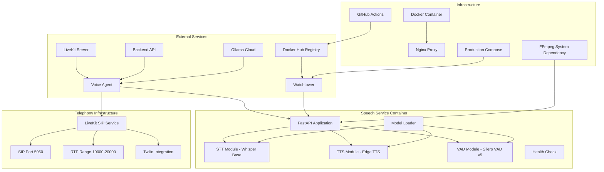

**Diagram sources**
- [main.py:13-35](file://app/speech_service/main.py#L13-L35)
- [Dockerfile:6-11](file://app/speech_service/Dockerfile#L6-L11)
- [docker-compose.staging.yml:196-224](file://docker-compose.staging.yml#L196-L224)
- [cd.yml:108-117](file://.github/workflows/cd.yml#L108-L117)

**Section sources**
- [main.py:1-345](file://app/speech_service/main.py#L1-L345)
- [Dockerfile:1-33](file://app/speech_service/Dockerfile#L1-L33)
- [requirements.txt:1-20](file://app/speech_service/requirements.txt#L1-L20)

## Core Components

### Speech Processing Endpoints
The service exposes four primary endpoints for different speech processing tasks:

**STT Transcription Endpoint**
- Accepts raw PCM (16kHz, 16-bit, mono) or WAV audio
- Returns transcribed text with timestamp chunks using OpenAI Whisper base
- Utilizes CPU-optimized Whisper model with 74M parameters for reliable inference
- **Enhanced**: Maintains torchaudio dependency for optimal WAV/MP3 loading and resampling

**TTS Synthesis Endpoint**
- Converts text to speech audio using Microsoft Edge TTS neural voices
- Returns WAV audio bytes with configurable voice and speed parameters
- **Updated**: Enhanced MP3-to-WAV conversion using pydub for improved memory efficiency and real-time processing
- Integrates FFmpeg for seamless audio format conversion and resampling
- **Enhanced**: Pydub-based AudioSegment.from_mp3() provides efficient in-memory stream processing

**VAD Detection Endpoint**
- Identifies speech segments in audio streams using Silero VAD v5
- Returns precise start/end timestamps for detected speech segments
- Leverages efficient voice activity detection with configurable thresholds

**Health Check Endpoint**
- Provides model readiness status for all loaded components
- Returns comprehensive health information for STT, TTS, and VAD models

### LiveKit SIP Service Integration
The system now includes a dedicated SIP service for telephony infrastructure:

**SIP Service Configuration**
- Standalone container running LiveKit SIP server
- SIP port 5060 exposed for inbound/outbound call handling
- UDP transport support for SIP signaling
- Integration with LiveKit conference server

**RTP Media Streaming**
- RTP port range 10000-20000 UDP for media transmission
- Separate from SIP signaling for optimal performance
- Supports WebRTC audio/video streaming

**Twilio Telephony Integration**
- Programmatic SIP trunk creation via LiveKit API
- Outbound PSTN call routing through Twilio infrastructure
- Configurable trunk credentials and outbound numbers

### Model Management System
The service implements a streamlined model loading and lifecycle management system optimized for CPU deployment:

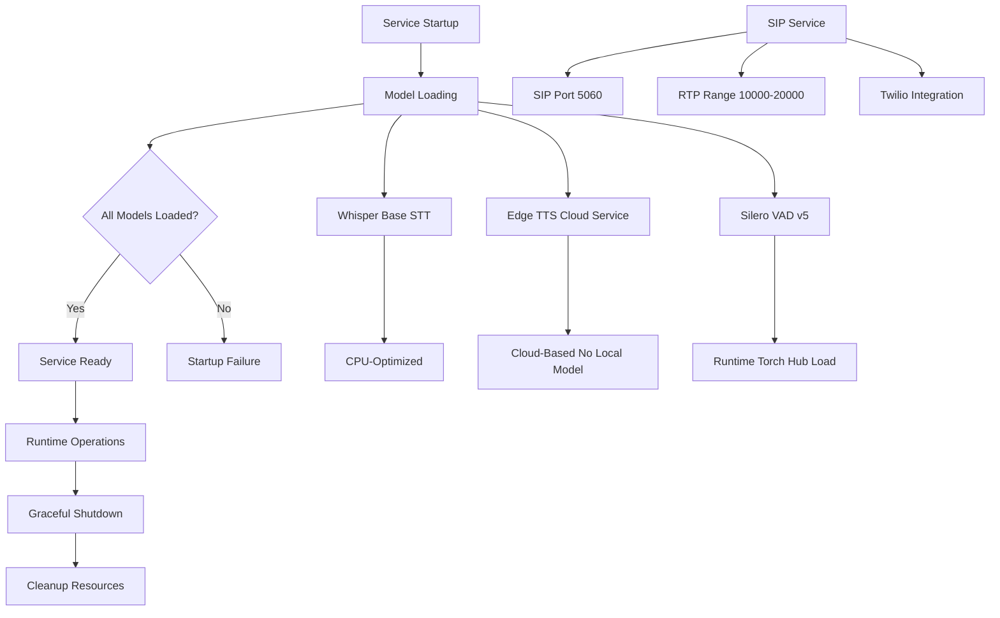

**Diagram sources**
- [main.py:74-106](file://app/speech_service/main.py#L74-L106)
- [main.py:40-71](file://app/speech_service/main.py#L40-L71)
- [docker-compose.staging.yml:196-224](file://docker-compose.staging.yml#L196-L224)

**Section sources**
- [main.py:132-191](file://app/speech_service/main.py#L132-L191)
- [main.py:196-266](file://app/speech_service/main.py#L196-L266)
- [main.py:271-336](file://app/speech_service/main.py#L271-L336)
- [main.py:117-127](file://app/speech_service/main.py#L117-L127)

## Architecture Overview

The Speech Service operates within a distributed microservices architecture, serving as a specialized audio processing layer with enhanced telephony capabilities:

```mermaid
sequenceDiagram
participant VA as Voice Agent
participant SS as Speech Service
participant SIP as LiveKit SIP Service
participant STT as Whisper Base
participant TTS as Edge TTS
participant VAD as Silero VAD
Note over VA,SS,SIP : Audio Processing Workflow
VA->>SS : POST /stt/transcribe
SS->>STT : Inference Request
STT-->>SS : Transcription Result
SS-->>VA : Text + Timestamps
VA->>SS : POST /tts/synthesize
SS->>TTS : Text Input (Cloud Service)
TTS-->>SS : MP3 Audio Stream
SS->>SS : Pydub MP3-to-WAV Conversion
SS-->>VA : WAV Stream
VA->>SS : POST /vad/detect
SS->>VAD : Audio Analysis
VAD-->>SS : Speech Segments
SS-->>VA : Segment Metadata
Note over SIP,VA : Telephony Integration
SIP->>VA : SIP Trunk Status
VA->>SIP : Create SIP Trunk (Twilio)
SIP-->>VA : Trunk Created
VA->>SIP : Outbound Call Request
SIP-->>VA : Call Established
```

**Diagram sources**
- [agent.py:102-147](file://app/voice_agent/agent.py#L102-L147)
- [main.py:132-191](file://app/speech_service/main.py#L132-L191)
- [main.py:196-266](file://app/speech_service/main.py#L196-L266)
- [main.py:271-336](file://app/speech_service/main.py#L271-L336)
- [docker-compose.staging.yml:196-224](file://docker-compose.staging.yml#L196-L224)

### Integration Points
The Speech Service integrates with several key components:

**Voice Agent Integration**
- Real-time audio processing for conversational flows
- Seamless transcription and synthesis capabilities
- Support for inbound and outbound call scenarios
- SIP trunk management and telephony integration

**LiveKit Server Integration**
- WebSocket-based real-time audio streaming
- SIP trunk integration for telephony
- Conference bridge capabilities
- Dedicated SIP service for enhanced telephony

**Backend API Integration**
- Session management and state synchronization
- Transcript persistence and retrieval
- Assessment and evaluation workflows
- Voice screening orchestration

**External LLM Integration**
- Ollama Cloud for advanced conversational AI
- Structured response generation
- Quality assessment capabilities

**SIP Telephony Integration**
- Twilio PSTN connectivity for outbound calls
- SIP trunk provisioning and management
- RTP media streaming for audio quality
- Telephony infrastructure abstraction

**Section sources**
- [agent.py:31](file://app/voice_agent/agent.py#L31)
- [voice.py:211-232](file://app/backend/routes/voice.py#L211-L232)
- [voice_screening_service.py:35-100](file://app/backend/services/voice_screening_service.py#L35-L100)

## Automated CI/CD Pipeline

The Speech Service now features a comprehensive automated CI/CD pipeline that ensures reliable and streamlined deployment:

### Continuous Integration (CI) Pipeline
The CI pipeline automatically validates code changes through comprehensive testing:

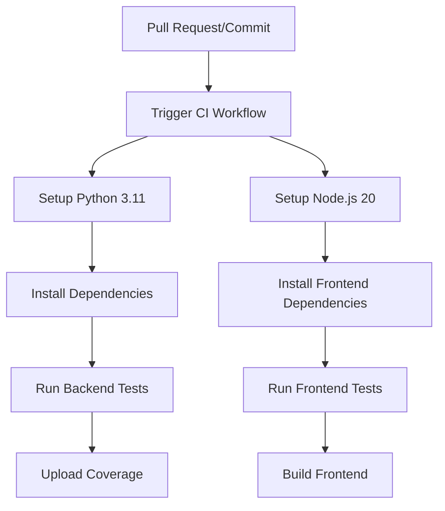

**Diagram sources**
- [ci.yml:10-37](file://.github/workflows/ci.yml#L10-L37)
- [ci.yml:39-62](file://.github/workflows/ci.yml#L39-L62)

### Continuous Deployment (CD) Pipeline
The CD pipeline automates the entire deployment process from code commit to production:

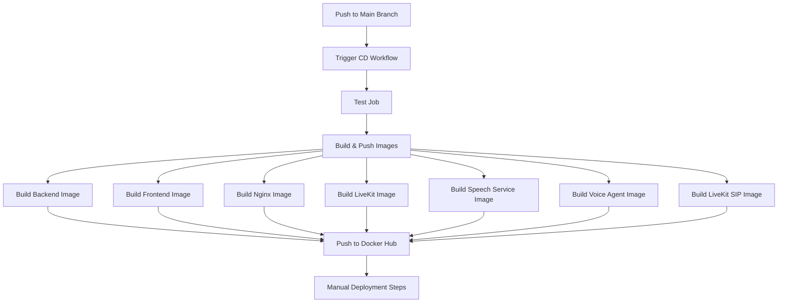

**Diagram sources**
- [cd.yml:13-34](file://.github/workflows/cd.yml#L13-L34)
- [cd.yml:50-129](file://.github/workflows/cd.yml#L50-L129)

### Production Deployment Automation
The production environment benefits from automated deployment through Watchtower:

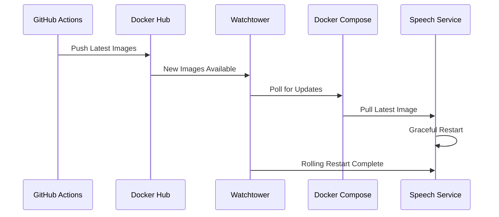

**Diagram sources**
- [cd.yml:108-117](file://.github/workflows/cd.yml#L108-L117)
- [docker-compose.prod.yml:199-221](file://docker-compose.prod.yml#L199-L221)

**Section sources**
- [ci.yml:1-63](file://.github/workflows/ci.yml#L1-L63)
- [cd.yml:1-134](file://.github/workflows/cd.yml#L1-L134)
- [docker-compose.prod.yml:199-221](file://docker-compose.prod.yml#L199-L221)

## Detailed Component Analysis

### STT Processing Module
The Speech-to-Text module provides robust audio transcription capabilities using OpenAI Whisper base:

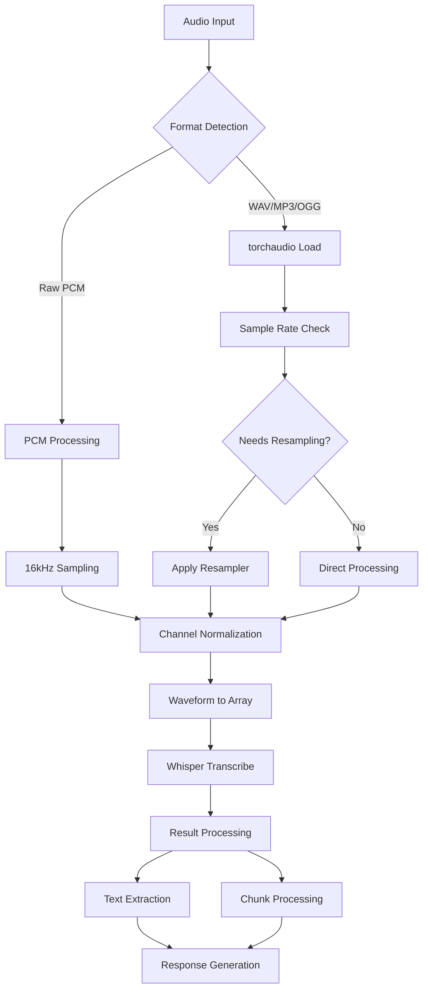

**Diagram sources**
- [main.py:147-185](file://app/speech_service/main.py#L147-L185)

**Key Features:**
- Support for multiple audio formats (PCM, WAV, MP3, OGG)
- Automatic sample rate conversion to 16kHz using torchaudio
- Stereo-to-mono channel normalization
- Whisper base model inference with timestamp support
- Comprehensive error handling and logging

### TTS Synthesis Module
The Text-to-Speech module enables natural audio synthesis using Microsoft Edge TTS with enhanced pydub-based MP3-to-WAV conversion:

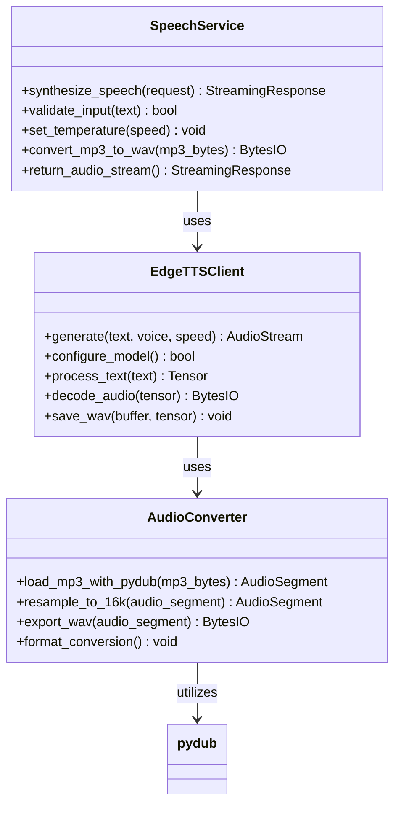

**Diagram sources**
- [main.py:196-266](file://app/speech_service/main.py#L196-L266)
- [main.py:203-247](file://app/speech_service/main.py#L203-L247)

**Processing Pipeline:**
- Text tokenization with padding
- Edge TTS cloud service inference with configurable speed
- **Updated**: MP3 audio stream processing using pydub AudioSegment.from_mp3() for efficient in-memory stream processing
- **Enhanced**: Pydub-based format conversion and resampling with improved memory efficiency
- WAV encoding with 16kHz mono output using pydub
- Streaming response generation with metadata headers

**Updated** Enhanced MP3-to-WAV conversion using pydub for improved memory efficiency and real-time processing capabilities. The TTS endpoint now leverages pydub's AudioSegment.from_mp3() for efficient in-memory stream processing with ffmpeg support, replacing previous torchaudio-based approaches for better performance and reduced memory usage.

**Section sources**
- [main.py:232-247](file://app/speech_service/main.py#L232-L247)

### VAD Detection Module
The Voice Activity Detection module provides precise speech segmentation using Silero VAD:

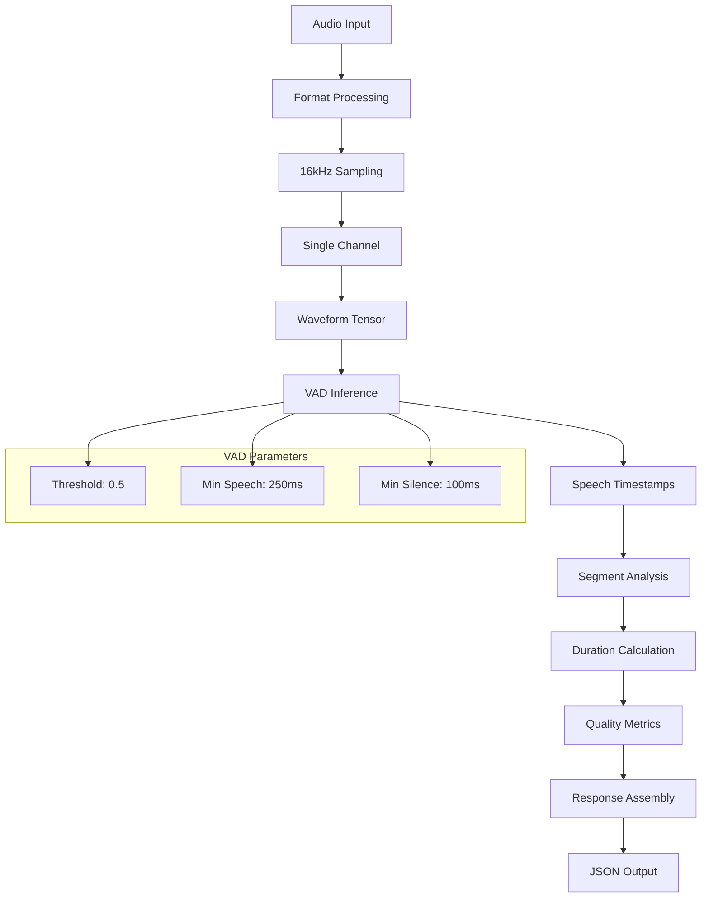

**Diagram sources**
- [main.py:271-336](file://app/speech_service/main.py#L271-L336)

**Detection Capabilities:**
- 32ms frame analysis (512-sample chunks)
- Configurable sensitivity thresholds
- Precise start/end time detection
- Total speech duration calculation
- Performance metrics and logging

### LiveKit SIP Service
The dedicated SIP service provides comprehensive telephony infrastructure:

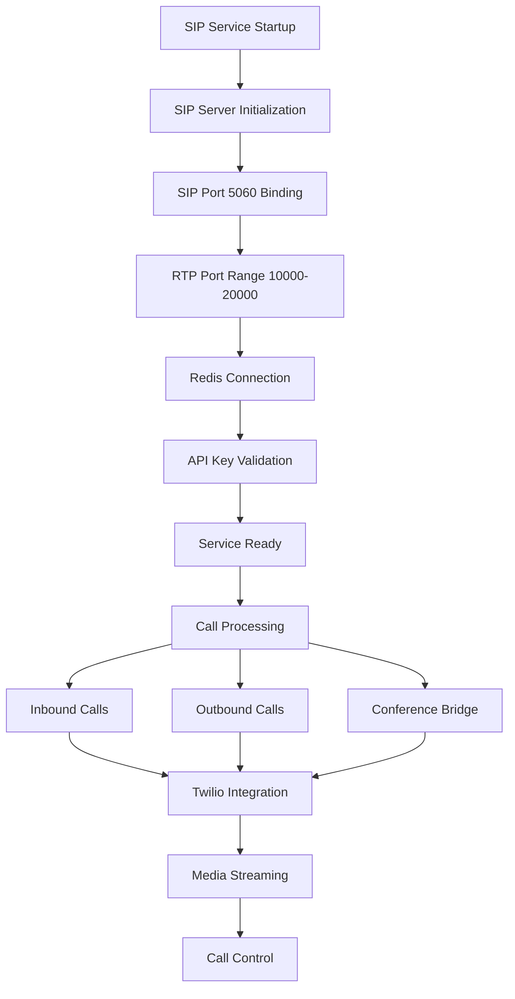

**Diagram sources**
- [docker-compose.staging.yml:196-224](file://docker-compose.staging.yml#L196-L224)
- [agent.py:547-619](file://app/voice_agent/agent.py#L547-L619)

**SIP Configuration Features:**
- SIP port 5060 exposed for TCP and UDP transport
- RTP media streaming on ports 10000-20000 UDP
- Redis-backed session management
- Twilio PSTN integration
- Programmatic trunk provisioning

### Container Deployment Architecture
The service is designed for optimal containerized deployment with FFmpeg integration and automated CI/CD:

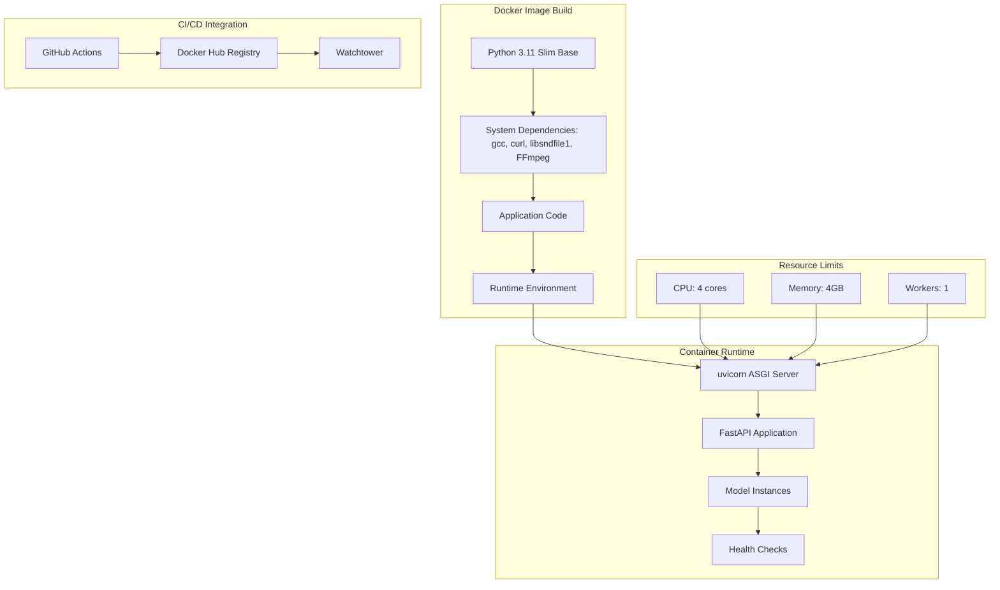

**Diagram sources**
- [Dockerfile:6-11](file://app/speech_service/Dockerfile#L6-L11)
- [docker-compose.prod.yml:264-275](file://docker-compose.prod.yml#L264-L275)
- [cd.yml:108-117](file://.github/workflows/cd.yml#L108-L117)

**Deployment Features:**
- Non-root user execution for security
- FFmpeg system dependency for audio format conversion
- Optimized system dependencies
- Health check integration
- Resource constraint configuration
- Production-ready logging
- Automated image building and pushing
- Watchtower-based rolling restarts

**Section sources**
- [Dockerfile:1-33](file://app/speech_service/Dockerfile#L1-L33)
- [docker-compose.prod.yml:262-286](file://docker-compose.prod.yml#L262-L286)
- [docker-compose.yml:137-153](file://docker-compose.yml#L137-L153)

## Dependency Analysis

### External Dependencies
The Speech Service maintains minimal external dependencies optimized for CPU deployment:

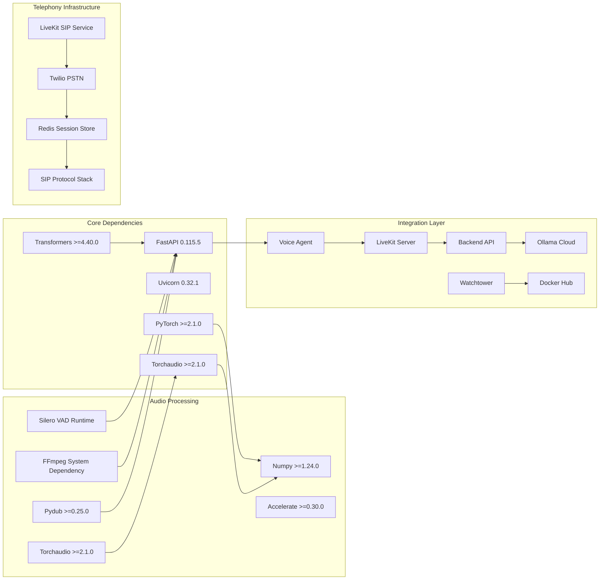

**Diagram sources**
- [requirements.txt:2-19](file://app/speech_service/requirements.txt#L2-L19)
- [agent.py:31](file://app/voice_agent/agent.py#L31)

### Internal Service Dependencies
The microservice coordinates with several backend services:

**Backend Integration Points:**
- Voice screening session management
- Transcript persistence and retrieval
- Assessment generation and evaluation
- Tenant configuration management

**Voice Agent Coordination:**
- Real-time audio processing requests
- Conversation state synchronization
- Call flow orchestration
- SIP trunk management and telephony integration
- Error handling and recovery

**CI/CD Integration Points:**
- GitHub Actions workflow triggers
- Docker Hub image publishing
- Watchtower deployment automation
- Automated testing and validation

**Section sources**
- [requirements.txt:1-20](file://app/speech_service/requirements.txt#L1-L20)
- [voice.py:211-282](file://app/backend/routes/voice.py#L211-L282)
- [voice_screening_service.py:35-100](file://app/backend/services/voice_screening_service.py#L35-L100)
- [cd.yml:108-117](file://.github/workflows/cd.yml#L108-L117)

## Performance Considerations

### CPU Optimization Strategies
The Speech Service is specifically optimized for CPU-only inference with enhanced performance characteristics:

**Model Selection:**
- Whisper Base: 74M parameters, balanced accuracy and performance for STT
- Edge TTS: Cloud-based neural voices, no local model required
- Silero VAD v5: Efficient voice activity detection with minimal footprint

**Memory Management:**
- Optimized tensor operations for CPU inference
- Efficient audio buffer handling with torchaudio for STT/VAD
- **Updated**: Pydub-based MP3-to-WAV conversion for improved memory efficiency in TTS
- Streaming response architecture for reduced memory usage
- Minimal preprocessing overhead

**Processing Efficiency:**
- 16kHz sampling rate for optimal balance
- FFmpeg integration for efficient format conversion
- Batch-friendly inference patterns
- Reduced latency through optimized pipelines

### Scalability Architecture
The service supports horizontal scaling through containerization with automated deployment:

**Container Design:**
- Single worker process per container
- Resource isolation through Docker limits
- Health check integration for load balancers
- Stateless processing model

**Deployment Scaling:**
- Multiple container instances
- Reverse proxy distribution
- Health-based routing
- Graceful degradation support

**Automated Scaling:**
- Watchtower-based rolling restarts
- Docker Hub image versioning
- CI/CD-triggered deployments
- Zero-downtime deployment strategy

### Telephony Infrastructure Optimization
The dedicated SIP service provides optimized telephony infrastructure:

**Resource Allocation:**
- Separate container for SIP processing reduces contention
- Dedicated CPU/memory limits for telephony services
- Isolated network namespace for SIP/RTP traffic
- Independent scaling from speech processing

**Network Optimization:**
- SIP port 5060 for signaling efficiency
- RTP range 10000-20000 for media streaming
- UDP transport for real-time telephony
- Redis-backed session management for low latency

### Enhanced Audio Processing Reliability
**Updated** The integration of pydub dependency (>=0.25.0) significantly improves audio processing reliability and memory efficiency:

**MP3 Loading Compatibility:**
- Enhanced MP3-to-WAV conversion using pydub AudioSegment.from_mp3()
- Improved memory efficiency for real-time processing scenarios
- Reduced memory overhead compared to torchaudio-based approaches
- Better performance for streaming audio processing

**System Dependencies:**
- Pydub provides native MP3 decoding capabilities
- FFmpeg integration ensures robust audio format conversion
- Reduces reliance on external MP3 libraries
- Improves performance for MP3 audio processing
- Ensures consistent behavior across deployment environments

**Real-time Processing Benefits:**
- In-memory stream processing eliminates disk I/O overhead
- Pydub's AudioSegment.from_mp3() provides efficient MP3 parsing
- Reduced latency in TTS endpoint operations
- Better resource utilization for high-throughput scenarios

## Troubleshooting Guide

### Common Issues and Solutions

**Model Loading Failures**
- Verify CPU-only deployment compatibility
- Check model cache permissions
- Validate transformer library versions
- Monitor memory allocation during startup

**Audio Processing Errors**
- Validate audio format compliance
- Check sample rate conversion accuracy
- Ensure proper PCM encoding
- Monitor torchaudio compatibility for STT/VAD
- Verify FFmpeg installation for format conversion
- **Updated**: Check pydub installation for MP3 loading compatibility
- **Updated**: Verify pydub AudioSegment.from_mp3() functionality for TTS endpoint

**Network Connectivity Problems**
- Verify service endpoint accessibility
- Check container networking configuration
- Validate health check responses
- Monitor inter-service communication
- Verify SIP port exposure (5060/tcp, 5060/udp)

**SIP Service Issues**
- Verify SIP service container health
- Check SIP port binding and exposure
- Validate Twilio credentials and connectivity
- Monitor RTP port range availability
- Ensure Redis connection for session storage

**CI/CD Pipeline Issues**
- Verify GitHub Actions workflow permissions
- Check Docker Hub credentials and authentication
- Monitor build logs for dependency resolution errors
- Validate image push permissions

**Deployment Automation Problems**
- Check Watchtower container logs
- Verify Docker Hub image availability
- Monitor rolling restart progress
- Validate service health after deployment

**Performance Degradation**
- Monitor CPU utilization patterns
- Check memory consumption trends
- Validate model inference times
- Review container resource limits
- Monitor SIP service performance

**Pydub Compatibility Issues**
- **New**: Verify pydub>=0.25.0 installation
- Check Python version compatibility (3.11)
- Ensure FFmpeg system dependency is available
- Monitor MP3 loading performance improvements
- Validate edge-tts integration stability
- **Updated**: Check pydub AudioSegment.from_mp3() memory efficiency

### Monitoring and Logging
The service provides comprehensive logging for operational visibility:

**Logging Levels:**
- Info: Model loading progress and success
- Error: Processing failures and exceptions
- Debug: Detailed inference metrics and timing
- SIP: Telephony service status and call events
- **Updated**: Audio processing: MP3 loading and conversion details with pydub efficiency metrics

**Health Monitoring:**
- Model readiness probes
- Response time metrics
- Error rate tracking
- Resource utilization monitoring
- SIP service health checks

**CI/CD Monitoring:**
- Workflow execution status
- Build artifact publication
- Deployment automation progress
- Rollout verification

**Section sources**
- [main.py:74-106](file://app/speech_service/main.py#L74-L106)
- [main.py:117-127](file://app/speech_service/main.py#L117-L127)
- [main.py:271-336](file://app/speech_service/main.py#L271-L336)
- [cd.yml:108-117](file://.github/workflows/cd.yml#L108-L117)

## Conclusion

The Speech Service Microservice represents a robust, production-ready solution for CPU-optimized speech processing with comprehensive CI/CD automation and enhanced telephony infrastructure. Its modular architecture, comprehensive error handling, efficient resource utilization, and fully automated deployment pipeline make it an ideal foundation for voice-enabled applications within the Resume AI platform.

Key strengths include:
- **Optimized Performance**: CPU-only inference with minimal resource requirements using Whisper base and Edge TTS
- **Production-Ready**: Containerized deployment with health checks and monitoring
- **Scalable Design**: Horizontal scaling support through containerization
- **Comprehensive Integration**: Seamless coordination with voice agents, backend services, and telephony infrastructure
- **Reliable Operation**: Robust error handling and graceful degradation
- **Automated CI/CD**: Streamlined development workflow with GitHub Actions
- **Zero-Downtime Deployments**: Watchtower-based rolling restart automation
- **Enhanced Telephony Support**: Dedicated SIP service with comprehensive telephony infrastructure
- **SIP Port Exposure**: 5060/tcp and 5060/udp for telephony integration
- **RTP Media Streaming**: 10000-20000/udp range for optimal audio quality
- **Twilio Integration**: Programmatic SIP trunk provisioning and PSTN connectivity
- **Improved Audio Processing**: Enhanced MP3 loading compatibility through pydub dependency for improved memory efficiency and real-time processing capabilities

The service successfully bridges the gap between real-time audio processing and automated conversational workflows, enabling sophisticated voice screening capabilities while maintaining operational simplicity, reliability, and streamlined development processes through comprehensive CI/CD automation. The addition of dedicated SIP service infrastructure, pydub dependency for enhanced audio processing, and the fix to TTS rate calculation logic makes it a cornerstone of the Resume AI voice-enabled platform with comprehensive telephony support and streamlined development workflow.

**Updated** Complete migration to CPU-friendly models with FFmpeg integration, enhanced performance optimization, simplified deployment architecture, comprehensive audio processing capabilities, dedicated LiveKit SIP service with SIP port exposure, integrated telephony infrastructure support, pydub dependency for improved MP3 loading compatibility and memory efficiency, and enhanced audio processing reliability for edge-tts integration with real-time processing capabilities.