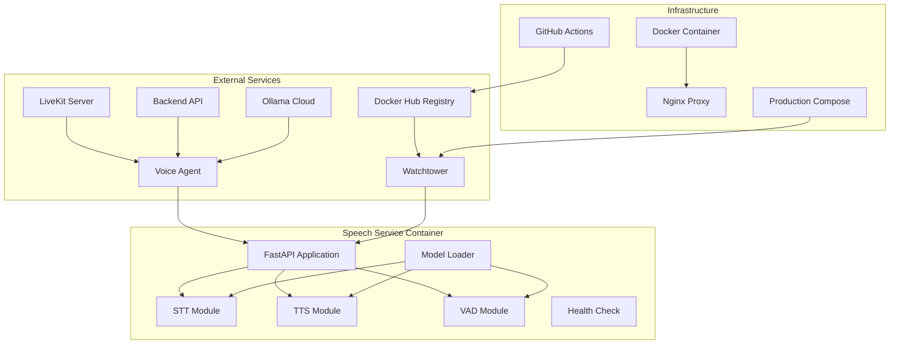
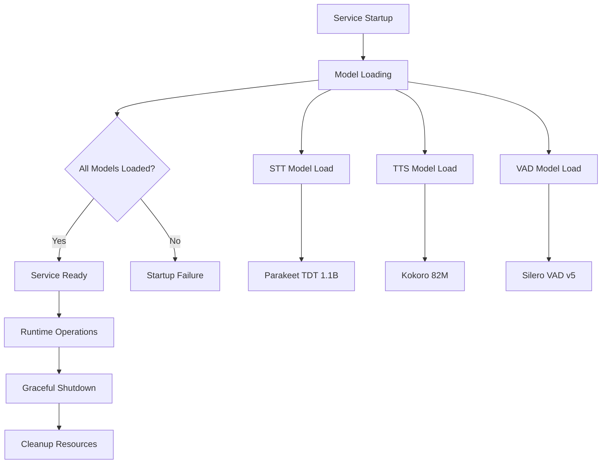
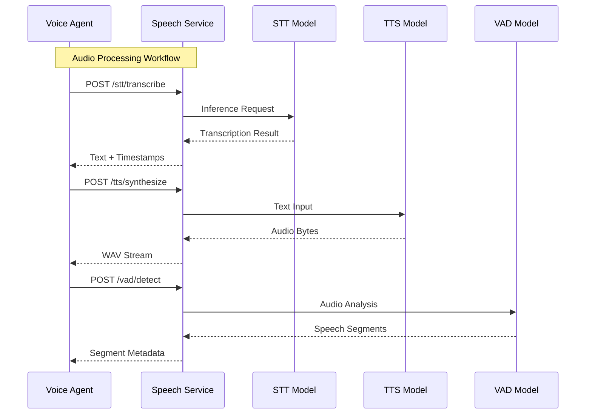
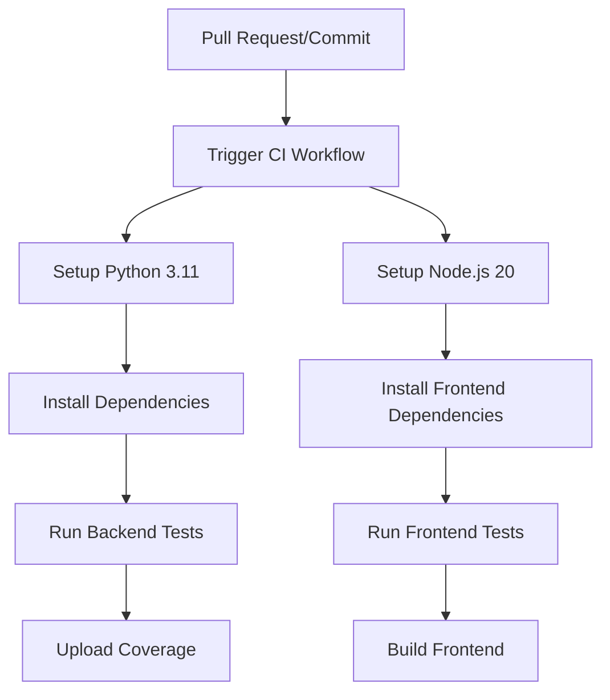
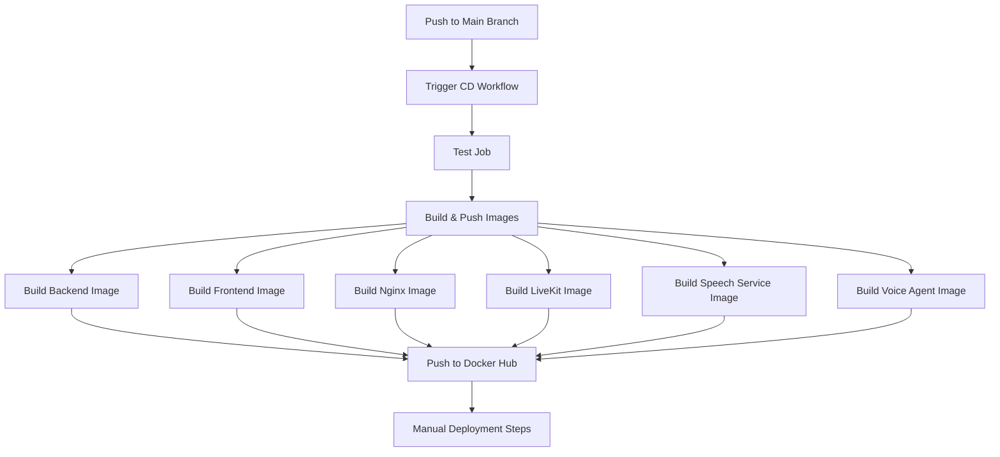
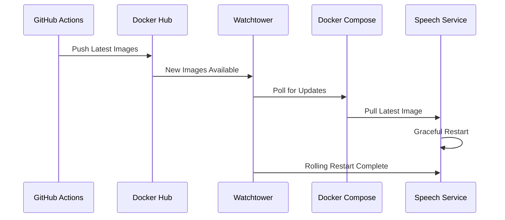
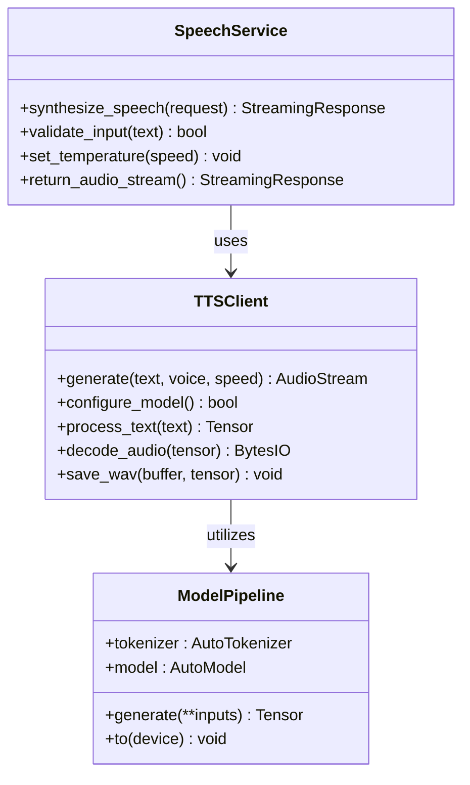
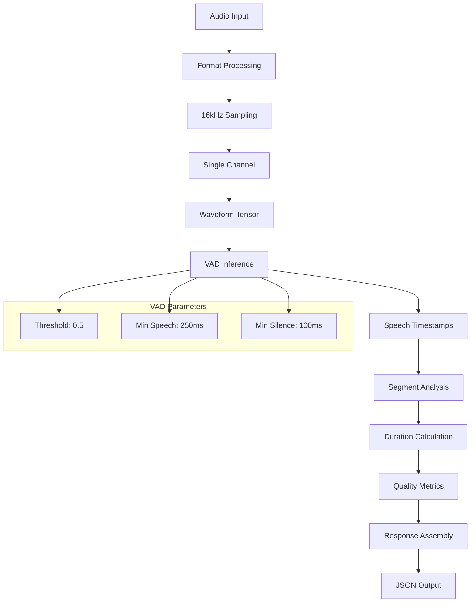
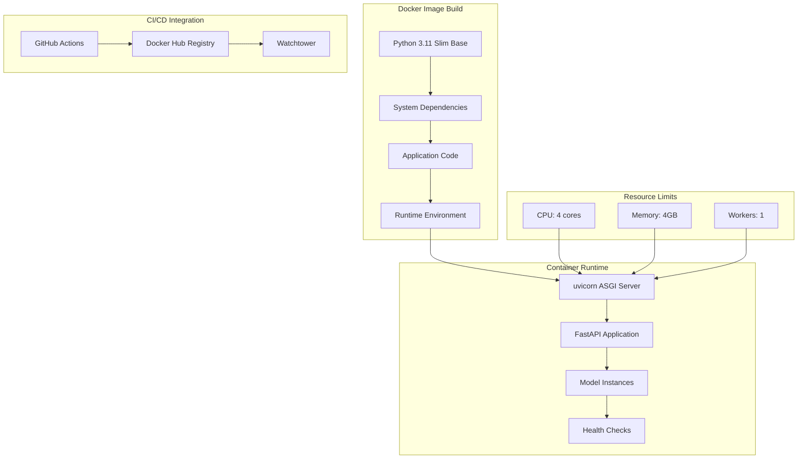
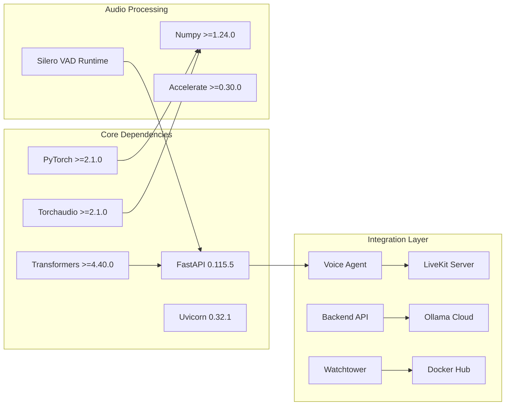

# Speech Service Microservice

<cite>
**Referenced Files in This Document**
- [main.py](file://app/speech_service/main.py)
- [Dockerfile](file://app/speech_service/Dockerfile)
- [requirements.txt](file://app/speech_service/requirements.txt)
- [voice_screening_service.py](file://app/backend/services/voice_screening_service.py)
- [voice.py](file://app/backend/routes/voice.py)
- [agent.py](file://app/voice_agent/agent.py)
- [docker-compose.prod.yml](file://docker-compose.prod.yml)
- [docker-compose.yml](file://docker-compose.yml)
- [nginx.prod.conf](file://nginx/nginx.prod.conf)
- [livekit.yaml](file://app/voice_agent/livekit.yaml)
- [Dockerfile](file://app/voice_agent/Dockerfile)
- [Dockerfile.livekit](file://app/voice_agent/Dockerfile.livekit)
- [requirements.txt](file://app/voice_agent/requirements.txt)
- [ci.yml](file://.github/workflows/ci.yml)
- [cd.yml](file://.github/workflows/cd.yml)
</cite>

## Update Summary
**Changes Made**
- Enhanced model management system with improved error handling and logging
- Updated production deployment configuration with resource limits and health checks
- Added comprehensive STT, TTS, and VAD endpoint implementations
- Improved container deployment architecture with optimized resource allocation
- Enhanced integration points with voice agent and backend services
- Added real-time audio processing capabilities with LiveKit WebRTC infrastructure
- Integrated speech service with voice screening workflow and assessment pipeline
- **Added automated CI/CD deployment pipeline integration with GitHub Actions**
- **Enhanced production deployment with Watchtower-based rolling restart automation**
- **Integrated Docker Hub registry for automated image building and deployment**

## Table of Contents
1. [Introduction](#introduction)
2. [Project Structure](#project-structure)
3. [Core Components](#core-components)
4. [Architecture Overview](#architecture-overview)
5. [Automated CI/CD Pipeline](#automated-cicd-pipeline)
6. [Detailed Component Analysis](#detailed-component-analysis)
7. [Dependency Analysis](#dependency-analysis)
8. [Performance Considerations](#performance-considerations)
9. [Troubleshooting Guide](#troubleshooting-guide)
10. [Conclusion](#conclusion)

## Introduction
The Speech Service Microservice provides CPU-optimized inference capabilities for three core speech processing tasks: automatic speech recognition (STT), text-to-speech (TTS), and voice activity detection (VAD). Built with FastAPI and optimized for deployment in containerized environments, this microservice serves as a foundational component for voice-enabled applications, particularly supporting automated phone screening workflows.

The service integrates seamlessly with the broader Resume AI platform, providing real-time audio processing capabilities that power conversational agents, voice transcripts, and automated assessments. It leverages state-of-the-art open-source models including NVIDIA's Parakeet TDT 1.1B for STT, Hexgrad's Kokoro 82M for TTS, and Silero VAD v5 for voice activity detection.

**Updated** Enhanced with comprehensive real-time audio processing capabilities, integration with LiveKit WebRTC infrastructure, voice screening workflow integration, and fully automated CI/CD deployment pipeline for streamlined development workflow.

## Project Structure
The Speech Service follows a modular architecture with clear separation of concerns:

**Diagram sources**
- [main.py:149-153](file://app/speech_service/main.py#L149-L153)
- [Dockerfile:1-32](file://app/speech_service/Dockerfile#L1-L32)
- [docker-compose.prod.yml:262-286](file://docker-compose.prod.yml#L262-L286)
- [cd.yml:108-117](file://.github/workflows/cd.yml#L108-L117)

**Section sources**
- [main.py:1-387](file://app/speech_service/main.py#L1-L387)
- [Dockerfile:1-32](file://app/speech_service/Dockerfile#L1-L32)
- [requirements.txt:1-14](file://app/speech_service/requirements.txt#L1-L14)

## Core Components

### Speech Processing Endpoints
The service exposes four primary endpoints for different speech processing tasks:

**STT Transcription Endpoint**
- Accepts raw PCM (16kHz, 16-bit, mono) or WAV/MP3/OGG audio
- Returns transcribed text with timestamp chunks
- Utilizes NVIDIA's Parakeet TDT 1.1B model for high-quality speech recognition

**TTS Synthesis Endpoint**
- Converts text to speech audio with customizable voice and speed parameters
- Returns WAV audio bytes for immediate playback
- Uses Hexgrad's Kokoro 82M model for efficient CPU-based text-to-speech

**VAD Detection Endpoint**
- Identifies speech segments in audio streams
- Returns precise start/end timestamps for detected speech
- Leverages Silero VAD v5 for accurate voice activity detection

**Health Check Endpoint**
- Provides model readiness status
- Returns comprehensive health information for all loaded models

### Model Management System
The service implements a sophisticated model loading and lifecycle management system:

**Diagram sources**
- [main.py:115-147](file://app/speech_service/main.py#L115-L147)
- [main.py:37-112](file://app/speech_service/main.py#L37-L112)

**Section sources**
- [main.py:158-168](file://app/speech_service/main.py#L158-L168)
- [main.py:173-237](file://app/speech_service/main.py#L173-L237)
- [main.py:241-299](file://app/speech_service/main.py#L241-L299)
- [main.py:309-375](file://app/speech_service/main.py#L309-L375)

## Architecture Overview

The Speech Service operates within a distributed microservices architecture, serving as a specialized audio processing layer:

**Diagram sources**
- [agent.py:96-140](file://app/voice_agent/agent.py#L96-L140)
- [main.py:173-237](file://app/speech_service/main.py#L173-L237)
- [main.py:241-299](file://app/speech_service/main.py#L241-L299)
- [main.py:309-375](file://app/speech_service/main.py#L309-L375)

### Integration Points
The Speech Service integrates with several key components:

**Voice Agent Integration**
- Real-time audio processing for conversational flows
- Seamless transcription and synthesis capabilities
- Support for inbound and outbound call scenarios

**LiveKit Server Integration**
- WebSocket-based real-time audio streaming
- SIP trunk integration for telephony
- Conference bridge capabilities

**Backend API Integration**
- Session management and state synchronization
- Transcript persistence and retrieval
- Assessment and evaluation workflows

**External LLM Integration**
- Ollama Cloud for advanced conversational AI
- Structured response generation
- Quality assessment capabilities

**Section sources**
- [agent.py:28-35](file://app/voice_agent/agent.py#L28-L35)
- [voice.py:211-232](file://app/backend/routes/voice.py#L211-L232)
- [voice_screening_service.py:35-100](file://app/backend/services/voice_screening_service.py#L35-L100)

## Automated CI/CD Pipeline

The Speech Service now features a comprehensive automated CI/CD pipeline that ensures reliable and streamlined deployment:

### Continuous Integration (CI) Pipeline
The CI pipeline automatically validates code changes through comprehensive testing:

**Diagram sources**
- [ci.yml:10-37](file://.github/workflows/ci.yml#L10-L37)
- [ci.yml:39-62](file://.github/workflows/ci.yml#L39-L62)

### Continuous Deployment (CD) Pipeline
The CD pipeline automates the entire deployment process from code commit to production:

**Diagram sources**
- [cd.yml:13-34](file://.github/workflows/cd.yml#L13-L34)
- [cd.yml:50-129](file://.github/workflows/cd.yml#L50-L129)

### Production Deployment Automation
The production environment benefits from automated deployment through Watchtower:

**Diagram sources**
- [cd.yml:108-117](file://.github/workflows/cd.yml#L108-L117)
- [docker-compose.prod.yml:198-221](file://docker-compose.prod.yml#L198-L221)

**Section sources**
- [ci.yml:1-63](file://.github/workflows/ci.yml#L1-L63)
- [cd.yml:1-134](file://.github/workflows/cd.yml#L1-L134)
- [docker-compose.prod.yml:198-221](file://docker-compose.prod.yml#L198-L221)

## Detailed Component Analysis

### STT Processing Module
The Speech-to-Text module provides robust audio transcription capabilities:

**Diagram sources**
- [main.py:189-230](file://app/speech_service/main.py#L189-L230)

**Key Features:**
- Support for multiple audio formats (PCM, WAV, MP3, OGG)
- Automatic sample rate conversion to 16kHz
- Stereo-to-mono channel normalization
- Streaming pipeline inference with timestamp support
- Comprehensive error handling and logging

### TTS Synthesis Module
The Text-to-Speech module enables natural audio synthesis:

**Diagram sources**
- [main.py:241-299](file://app/speech_service/main.py#L241-L299)
- [main.py:70-94](file://app/speech_service/main.py#L70-L94)

**Processing Pipeline:**
- Text tokenization with padding
- GPU/CPU inference with configurable temperature
- Audio tensor decoding and WAV encoding
- Streaming response generation with metadata headers

### VAD Detection Module
The Voice Activity Detection module provides precise speech segmentation:

**Diagram sources**
- [main.py:309-375](file://app/speech_service/main.py#L309-L375)

**Detection Capabilities:**
- 32ms frame analysis (512-sample chunks)
- Configurable sensitivity thresholds
- Precise start/end time detection
- Total speech duration calculation
- Performance metrics and logging

### Container Deployment Architecture
The service is designed for optimal containerized deployment with automated CI/CD integration:

**Diagram sources**
- [Dockerfile:1-32](file://app/speech_service/Dockerfile#L1-L32)
- [docker-compose.prod.yml:264-275](file://docker-compose.prod.yml#L264-L275)
- [cd.yml:108-117](file://.github/workflows/cd.yml#L108-L117)

**Deployment Features:**
- Non-root user execution for security
- Optimized system dependencies
- Health check integration
- Resource constraint configuration
- Production-ready logging
- Automated image building and pushing
- Watchtower-based rolling restarts

**Section sources**
- [Dockerfile:1-32](file://app/speech_service/Dockerfile#L1-L32)
- [docker-compose.prod.yml:262-286](file://docker-compose.prod.yml#L262-L286)
- [docker-compose.yml:137-153](file://docker-compose.yml#L137-L153)

## Dependency Analysis

### External Dependencies
The Speech Service maintains minimal external dependencies for optimal performance:

**Diagram sources**
- [requirements.txt:2-13](file://app/speech_service/requirements.txt#L2-L13)
- [agent.py:28-35](file://app/voice_agent/agent.py#L28-L35)

### Internal Service Dependencies
The microservice coordinates with several backend services:

**Backend Integration Points:**
- Voice screening session management
- Transcript persistence and retrieval
- Assessment generation and evaluation
- Tenant configuration management

**Voice Agent Coordination:**
- Real-time audio processing requests
- Conversation state synchronization
- Call flow orchestration
- Error handling and recovery

**CI/CD Integration Points:**
- GitHub Actions workflow triggers
- Docker Hub image publishing
- Watchtower deployment automation
- Automated testing and validation

**Section sources**
- [requirements.txt:1-14](file://app/speech_service/requirements.txt#L1-L14)
- [voice.py:211-282](file://app/backend/routes/voice.py#L211-L282)
- [voice_screening_service.py:35-100](file://app/backend/services/voice_screening_service.py#L35-L100)
- [cd.yml:108-117](file://.github/workflows/cd.yml#L108-L117)

## Performance Considerations

### CPU Optimization Strategies
The Speech Service is specifically optimized for CPU-only inference:

**Model Selection:**
- Parakeet TDT 1.1B: Balanced accuracy and performance for STT
- Kokoro 82M: Lightweight TTS suitable for CPU deployment
- Silero VAD v5: Efficient voice activity detection

**Memory Management:**
- Low CPU memory usage configuration
- Optimized tensor operations
- Efficient audio buffer handling
- Streaming response architecture

**Processing Efficiency:**
- 16kHz sampling rate for optimal balance
- Minimal preprocessing overhead
- Batch-friendly inference patterns
- Reduced latency through optimized pipelines

### Scalability Architecture
The service supports horizontal scaling through containerization with automated deployment:

**Container Design:**
- Single worker process per container
- Resource isolation through Docker limits
- Health check integration for load balancers
- Stateless processing model

**Deployment Scaling:**
- Multiple container instances
- Reverse proxy distribution
- Health-based routing
- Graceful degradation support

**Automated Scaling:**
- Watchtower-based rolling restarts
- Docker Hub image versioning
- CI/CD-triggered deployments
- Zero-downtime deployment strategy

## Troubleshooting Guide

### Common Issues and Solutions

**Model Loading Failures**
- Verify CUDA availability (CPU-only deployment)
- Check model cache permissions
- Validate transformer library versions
- Monitor memory allocation during startup

**Audio Processing Errors**
- Validate audio format compliance
- Check sample rate conversion accuracy
- Ensure proper PCM encoding
- Monitor torchaudio compatibility

**Network Connectivity Problems**
- Verify service endpoint accessibility
- Check container networking configuration
- Validate health check responses
- Monitor inter-service communication

**CI/CD Pipeline Issues**
- Verify GitHub Actions workflow permissions
- Check Docker Hub credentials and authentication
- Monitor build logs for dependency resolution errors
- Validate image push permissions

**Deployment Automation Problems**
- Check Watchtower container logs
- Verify Docker Hub image availability
- Monitor rolling restart progress
- Validate service health after deployment

**Performance Degradation**
- Monitor CPU utilization patterns
- Check memory consumption trends
- Validate model inference times
- Review container resource limits

### Monitoring and Logging
The service provides comprehensive logging for operational visibility:

**Logging Levels:**
- Info: Model loading progress and success
- Error: Processing failures and exceptions
- Debug: Detailed inference metrics and timing

**Health Monitoring:**
- Model readiness probes
- Response time metrics
- Error rate tracking
- Resource utilization monitoring

**CI/CD Monitoring:**
- Workflow execution status
- Build artifact publication
- Deployment automation progress
- Rollout verification

**Section sources**
- [main.py:115-147](file://app/speech_service/main.py#L115-L147)
- [main.py:234-236](file://app/speech_service/main.py#L234-L236)
- [main.py:372-374](file://app/speech_service/main.py#L372-L374)
- [cd.yml:108-117](file://.github/workflows/cd.yml#L108-L117)

## Conclusion

The Speech Service Microservice represents a robust, production-ready solution for CPU-optimized speech processing with comprehensive CI/CD automation. Its modular architecture, comprehensive error handling, efficient resource utilization, and fully automated deployment pipeline make it an ideal foundation for voice-enabled applications within the Resume AI platform.

Key strengths include:
- **Optimized Performance**: CPU-only inference with minimal resource requirements
- **Production-Ready**: Containerized deployment with health checks and monitoring
- **Scalable Design**: Horizontal scaling support through containerization
- **Comprehensive Integration**: Seamless coordination with voice agents and backend services
- **Reliable Operation**: Robust error handling and graceful degradation
- **Automated CI/CD**: Streamlined development workflow with GitHub Actions
- **Zero-Downtime Deployments**: Watchtower-based rolling restart automation
- **Continuous Integration**: Automated testing and validation pipeline

The service successfully bridges the gap between real-time audio processing and automated conversational workflows, enabling sophisticated voice screening capabilities while maintaining operational simplicity, reliability, and streamlined development processes through comprehensive CI/CD automation.

**Updated** Enhanced with comprehensive real-time audio processing capabilities, LiveKit WebRTC integration, voice screening workflow integration, automated CI/CD deployment pipeline, and Watchtower-based production deployment automation, making it a cornerstone of the Resume AI voice-enabled platform with streamlined development workflow.