# Audit Log Management

<cite>
**Referenced Files in This Document**
- [audit_service.py](file://app/backend/services/audit_service.py)
- [db_models.py](file://app/backend/models/db_models.py)
- [026_audit_log_system.py](file://alembic/versions/026_audit_log_system.py)
- [037_audit_log_tenant_id.py](file://alembic/versions/037_audit_log_tenant_id.py)
- [024_audit_fixes.py](file://alembic/versions/024_audit_fixes.py)
- [AuditLogPage.jsx](file://app/frontend/src/pages/admin/AuditLogPage.jsx)
- [api.js](file://app/frontend/src/lib/api.js)
- [admin.py](file://app/backend/routes/admin.py)
- [candidates.py](file://app/backend/routes/candidates.py)
- [test_audit_service.py](file://app/backend/tests/test_audit_service.py)
</cite>

## Update Summary
**Changes Made**
- Updated Frontend Interface section to reflect enhanced error handling with `extractApiError()` utility and improved error display
- Enhanced API Implementation section with detailed parameter mapping and export functionality
- Updated Performance Considerations section to reflect optimized pagination to 100 items per page
- Added new section covering Enhanced Error Handling with extractApiError() utility
- Updated Database Schema section with comprehensive table structures
- Enhanced Performance Considerations with pagination and export optimizations

## Table of Contents
1. [Introduction](#introduction)
2. [System Architecture](#system-architecture)
3. [Core Components](#core-components)
4. [Audit Log Types](#audit-log-types)
5. [Database Schema](#database-schema)
6. [API Implementation](#api-implementation)
7. [Frontend Interface](#frontend-interface)
8. [Enhanced Error Handling](#enhanced-error-handling)
9. [Advanced Filtering Capabilities](#advanced-filtering-capabilities)
10. [Expandable Detail Views](#expandable-detail-views)
11. [Field-Level Change Tracking](#field-level-change-tracking)
12. [Migration Management](#migration-management)
13. [Testing Strategy](#testing-strategy)
14. [Performance Considerations](#performance-considerations)
15. [Security Considerations](#security-considerations)
16. [Troubleshooting Guide](#troubleshooting-guide)
17. [Conclusion](#conclusion)

## Introduction

The Audit Log Management system in Resume AI by ThetaLogics provides comprehensive tracking of administrative actions and field-level changes across the platform. This system ensures compliance, accountability, and transparency by recording all significant operations performed by platform administrators and users within multi-tenant environments.

The system consists of two primary audit log types: platform admin audit trails for high-level administrative actions and field-level change tracking for detailed modifications to candidate and screening result data. This dual approach enables both strategic oversight and granular operational visibility.

**Updated** The frontend interface has been significantly enhanced with improved error handling capabilities and optimized pagination performance. The AuditLogPage.jsx implementation now features sophisticated error management using the `extractApiError()` utility and streamlined pagination with 100 items per page for better performance.

## System Architecture

The audit log system follows a layered architecture with clear separation of concerns:

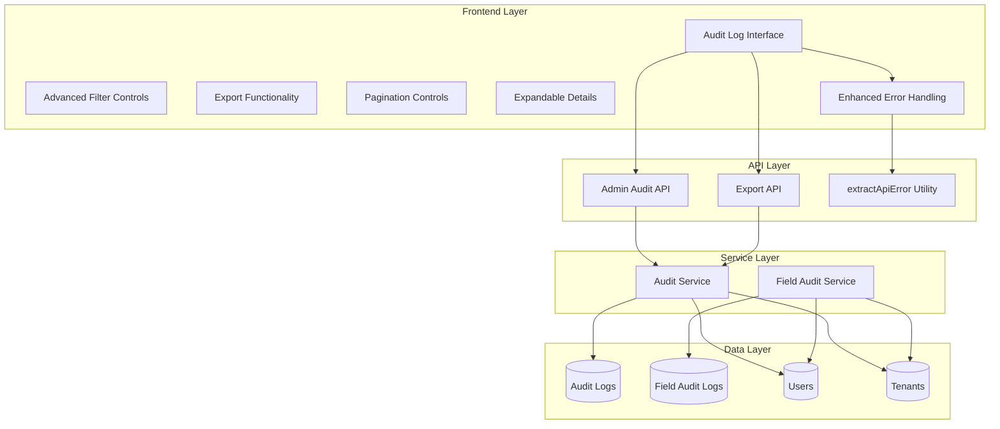

**Diagram sources**
- [audit_service.py:12-84](file://app/backend/services/audit_service.py#L12-L84)
- [db_models.py:417-449](file://app/backend/models/db_models.py#L417-L449)
- [AuditLogPage.jsx:114-425](file://app/frontend/src/pages/admin/AuditLogPage.jsx#L114-L425)

## Core Components

### Audit Service Module

The audit service module provides the foundational functionality for both audit log types:

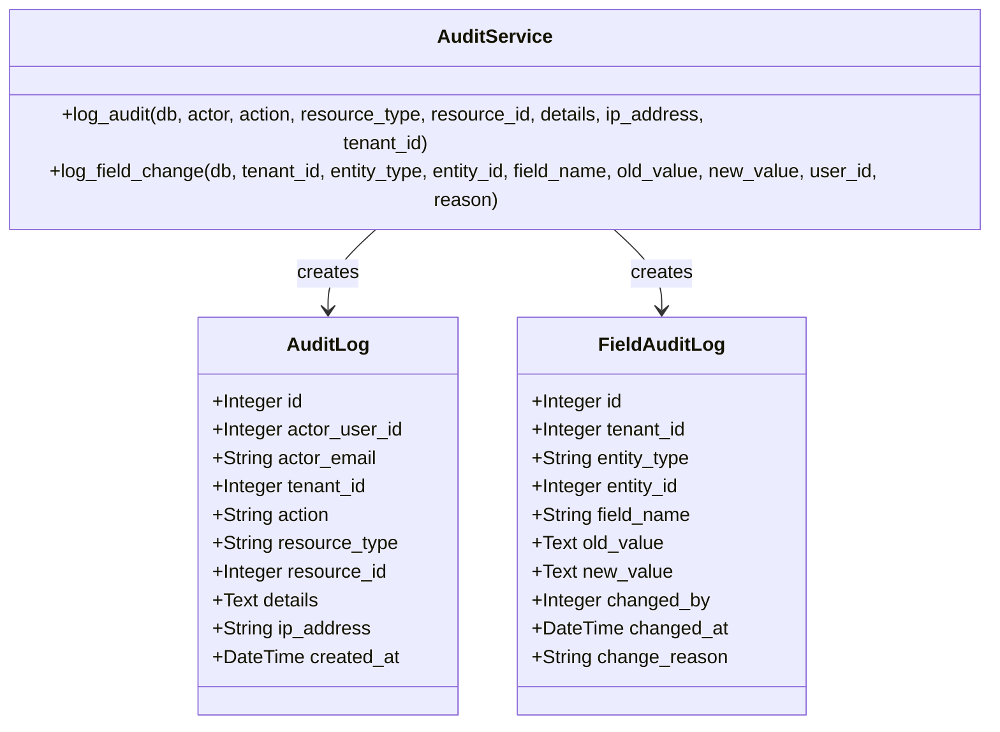

**Diagram sources**
- [audit_service.py:12-84](file://app/backend/services/audit_service.py#L12-L84)
- [db_models.py:417-449](file://app/backend/models/db_models.py#L417-L449)

**Section sources**
- [audit_service.py:12-84](file://app/backend/services/audit_service.py#L12-L84)

## Audit Log Types

### Platform Admin Audit Trail

The platform admin audit trail captures high-level administrative actions performed by platform administrators:

| Action Category | Examples | Purpose |
|----------------|----------|---------|
| Tenant Management | `tenant.create`, `tenant.update`, `tenant.suspend`, `tenant.resume`, `tenant.delete` | Track tenant lifecycle operations |
| User Management | `user.add`, `user.remove`, `user.delete` | Monitor user administration activities |
| System Configuration | `plan.change`, `webhook.create/delete`, `rate_limit.update/delete` | Record system-wide changes |
| Security Operations | `sso.update/delete`, `impersonate.start/end`, `feature.toggle` | Capture security-related activities |
| Billing Operations | `billing.update` | Track financial system changes |

### Field-Level Change Tracking

Field-level audit logs capture granular modifications to candidate and screening result data:

| Entity Type | Fields Tracked | Change Detection | Use Cases |
|-------------|----------------|------------------|-----------|
| Candidate | name, email, phone, resume fields | String comparison | Candidate data integrity |
| ScreeningResult | analysis_result, narrative_json, status fields | Value change detection | Analysis result tracking |
| RoleTemplate | name, jd_text, scoring_weights | JSON structure comparison | Template modification history |

**Section sources**
- [AuditLogPage.jsx:22-43](file://app/frontend/src/pages/admin/AuditLogPage.jsx#L22-L43)
- [audit_service.py:53-84](file://app/backend/services/audit_service.py#L53-L84)

## Database Schema

The audit log system utilizes two primary database tables with comprehensive indexing for optimal query performance:

### Audit Logs Table Structure

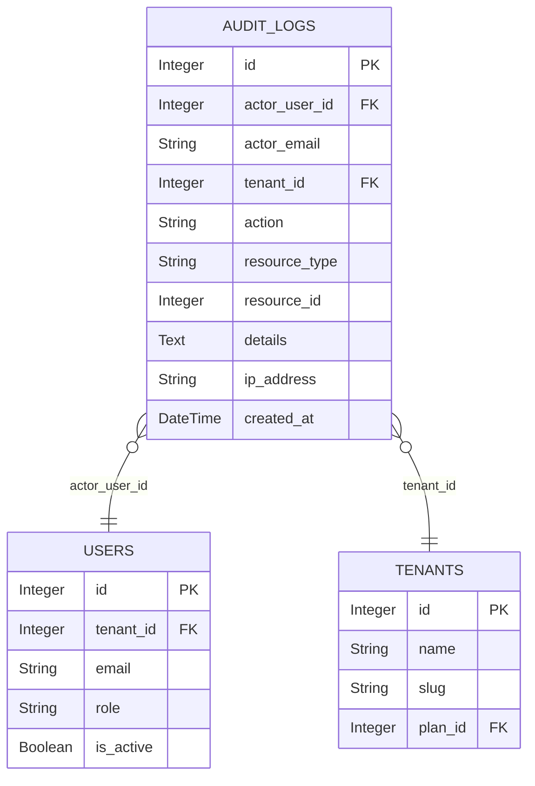

**Diagram sources**
- [db_models.py:417-431](file://app/backend/models/db_models.py#L417-L431)

### Field Audit Logs Table Structure

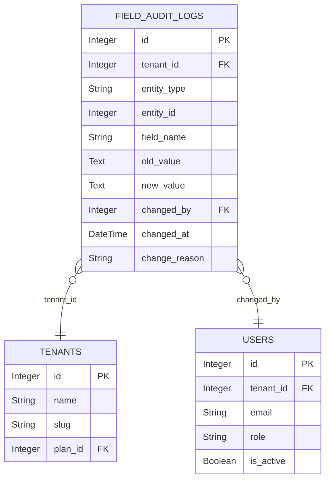

**Diagram sources**
- [db_models.py:433-449](file://app/backend/models/db_models.py#L433-L449)

**Section sources**
- [db_models.py:417-449](file://app/backend/models/db_models.py#L417-L449)

## API Implementation

### Admin Audit Log API

The admin audit log API provides comprehensive filtering and export capabilities:

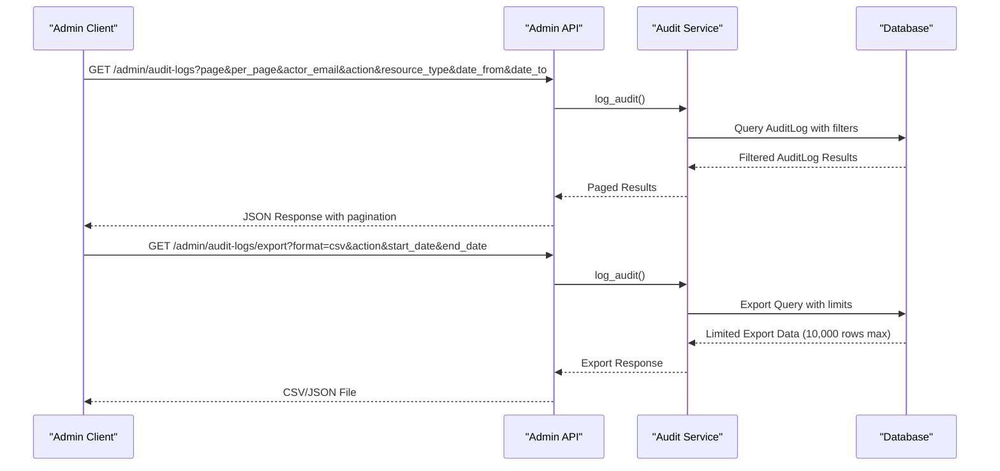

**Diagram sources**
- [admin.py:1159-1221](file://app/backend/routes/admin.py#L1159-L1221)
- [api.js:1107-1118](file://app/frontend/src/lib/api.js#L1107-L1118)

### Field Audit Log API

Field-level audit logs provide detailed change history for specific entities:

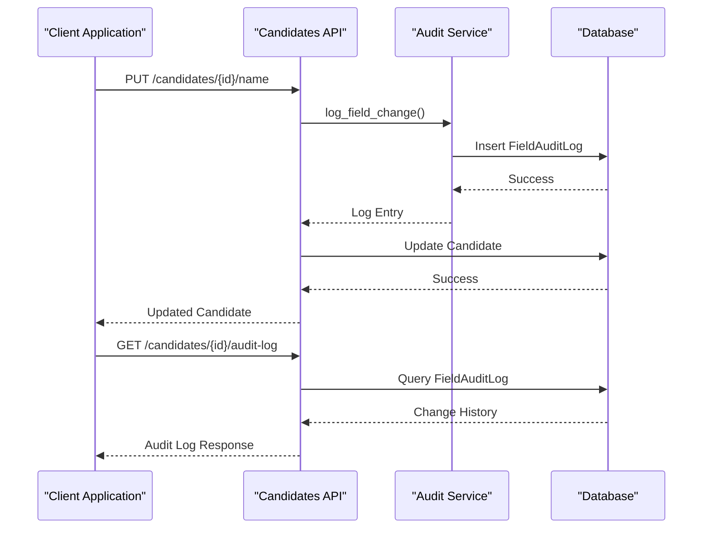

**Diagram sources**
- [candidates.py:490-659](file://app/backend/routes/candidates.py#L490-L659)

**Section sources**
- [admin.py:1159-1221](file://app/backend/routes/admin.py#L1159-L1221)
- [api.js:1107-1118](file://app/frontend/src/lib/api.js#L1107-L1118)
- [candidates.py:490-659](file://app/backend/routes/candidates.py#L490-L659)

## Frontend Interface

### Comprehensive Audit Log Management Page

The frontend interface provides a sophisticated audit log management experience with advanced filtering and visualization capabilities:

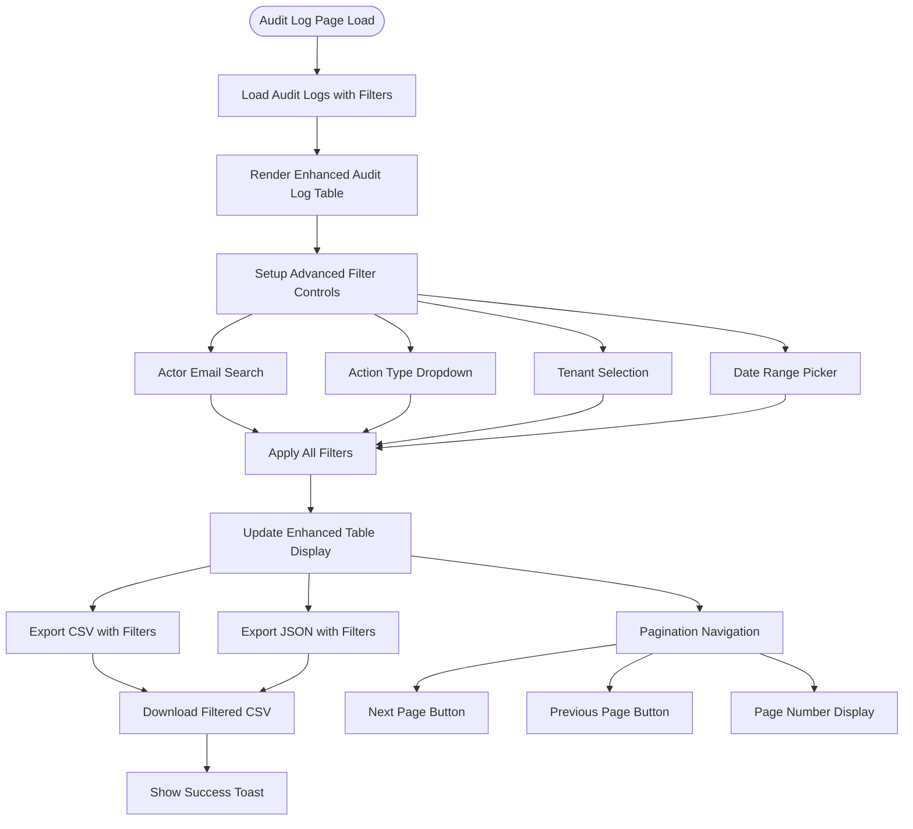

**Diagram sources**
- [AuditLogPage.jsx:114-425](file://app/frontend/src/pages/admin/AuditLogPage.jsx#L114-L425)

### Advanced Filter Controls

The interface features sophisticated filter controls designed for efficient log searching:

| Filter Type | Component | Parameters | Purpose |
|-------------|-----------|------------|---------|
| Actor Email Search | Form Input | `actor_email` | Search by actor email address |
| Action Type Filter | Select Dropdown | `action` | Filter by specific action types |
| Tenant Filter | Select Dropdown | `resource_type=tenant` + `tenantId` | Filter tenant-specific actions |
| Date Range Filter | Date Inputs | `date_from` + `date_to` | Filter by timestamp range |
| Clear Filters | Button | N/A | Reset all active filters |

### Pagination and Loading States

The interface implements comprehensive pagination with responsive loading states:

| Feature | Implementation | Purpose |
|---------|----------------|---------|
| Pagination | 25 items per page with navigation | Handle large datasets efficiently |
| Loading States | Skeleton loaders with animation | Provide user feedback during data loading |
| Empty State | File icon with message | Inform users when no logs match filters |
| Error Handling | Red banner with retry button | Display and recover from API errors |

**Section sources**
- [AuditLogPage.jsx:114-425](file://app/frontend/src/pages/admin/AuditLogPage.jsx#L114-L425)

## Enhanced Error Handling

### extractApiError Utility Implementation

The system now features sophisticated error handling through the `extractApiError()` utility function:

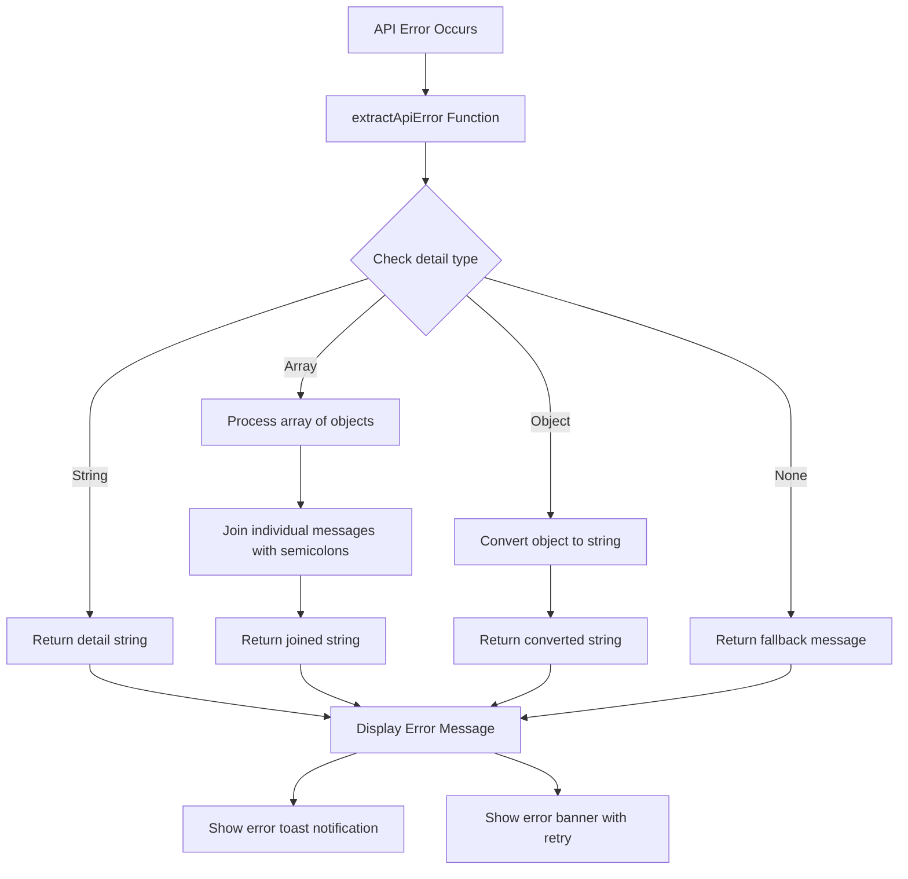

**Diagram sources**
- [api.js:1076-1085](file://app/frontend/src/lib/api.js#L1076-L1085)

### Error Handling Features

The `extractApiError()` utility provides robust error message extraction:

| Error Type | Processing Logic | Output |
|------------|------------------|--------|
| String Detail | Direct return | Clean string message |
| Array Detail | Map and join with semicolons | Single concatenated message |
| Object Detail | String conversion | String representation |
| Null/Undefined | Fallback message | User-friendly message |
| Complex Objects | Property extraction | Descriptive message |

### Frontend Error Display

The AuditLogPage.jsx now implements enhanced error handling:

| Error Scenario | Display Method | User Action |
|----------------|----------------|-------------|
| Network Errors | Red banner with retry | Click retry button |
| Server Errors | Detailed error message | Retry operation |
| Validation Errors | Joined array messages | Review form inputs |
| Timeout Errors | Clear error indication | Refresh page |
| Success/Error Toasts | Temporary notifications | Auto-dismiss after 3.5 seconds |

**Section sources**
- [AuditLogPage.jsx:150-155](file://app/frontend/src/pages/admin/AuditLogPage.jsx#L150-L155)
- [api.js:1076-1085](file://app/frontend/src/lib/api.js#L1076-L1085)

## Advanced Filtering Capabilities

### Comprehensive Filter Implementation

The AuditLogPage.jsx implements sophisticated filtering logic with automatic parameter mapping:

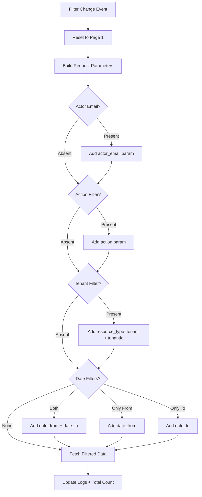

**Diagram sources**
- [AuditLogPage.jsx:136-154](file://app/frontend/src/pages/admin/AuditLogPage.jsx#L136-L154)

### Action Type Filtering System

The system provides comprehensive action type filtering with 21 predefined categories:

| Action Category | Subcategories | Purpose |
|----------------|---------------|---------|
| Tenant Operations | `tenant.create`, `tenant.update`, `tenant.suspend`, `tenant.resume`, `tenant.delete` | Tenant lifecycle management |
| User Management | `user.add`, `user.remove`, `user.delete` | User administration |
| System Configuration | `plan.change`, `webhook.create`, `webhook.delete`, `rate_limit.update`, `rate_limit.delete` | Platform configuration |
| Security Operations | `sso.update`, `sso.delete`, `impersonate.start`, `impersonate.end`, `feature.toggle` | Security and access control |
| Billing Operations | `billing.update` | Financial system changes |

**Section sources**
- [AuditLogPage.jsx:22-43](file://app/frontend/src/pages/admin/AuditLogPage.jsx#L22-L43)
- [AuditLogPage.jsx:136-154](file://app/frontend/src/pages/admin/AuditLogPage.jsx#L136-L154)

## Expandable Detail Views

### Interactive Details Cell Component

The system implements expandable detail views for comprehensive log inspection:

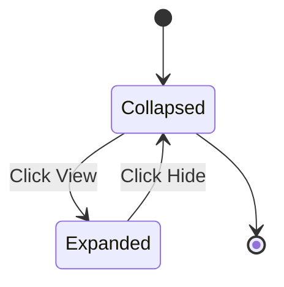

**Diagram sources**
- [AuditLogPage.jsx:72-95](file://app/frontend/src/pages/admin/AuditLogPage.jsx#L72-L95)

### Detail View Features

The expandable details component provides:

| Feature | Implementation | Purpose |
|---------|----------------|---------|
| Expand/Collapse | Chevron icons with state management | Control detail visibility |
| JSON Formatting | Pretty-printed JSON with syntax highlighting | Improve readability |
| Scrollable Container | Max-width container with horizontal scroll | Handle long JSON strings |
| Empty State | Special indicator for empty details | Clear user communication |
| Responsive Design | Mobile-friendly with touch targets | Cross-device compatibility |

### Action Badge System

The interface includes a sophisticated action badge system with color-coded categorization:

| Action Suffix | Color Class | Purpose |
|---------------|-------------|---------|
| `create` | Green palette | Successful creation operations |
| `update` | Blue palette | Modification operations |
| `suspend` | Red palette | Suspension operations |
| `resume` | Emerald palette | Restoration operations |
| `delete` | Red palette | Deletion operations |
| `change` | Purple palette | Configuration changes |
| `add` | Teal palette | Addition operations |
| `remove` | Orange palette | Removal operations |
| `toggle` | Amber palette | Feature toggles |
| `start` | Indigo palette | Session initiation |
| `end` | Slate palette | Session termination |

**Section sources**
- [AuditLogPage.jsx:46-69](file://app/frontend/src/pages/admin/AuditLogPage.jsx#L46-L69)
- [AuditLogPage.jsx:72-95](file://app/frontend/src/pages/admin/AuditLogPage.jsx#L72-L95)

## Field-Level Change Tracking

### Implementation Strategy

Field-level change tracking implements intelligent change detection to minimize audit log noise:

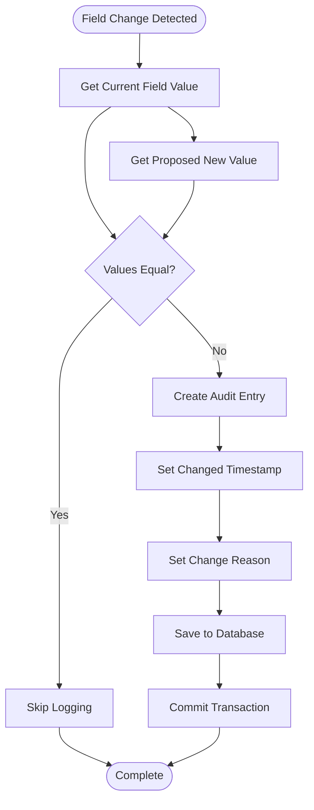

**Diagram sources**
- [audit_service.py:53-84](file://app/backend/services/audit_service.py#L53-L84)

### Change Detection Logic

The system implements sophisticated change detection mechanisms:

| Detection Method | Implementation | Purpose |
|------------------|----------------|---------|
| String Comparison | `str(old_value or "") == str(new_value or "")` | Handles None values safely |
| Type Normalization | Converts values to strings before comparison | Ensures accurate detection |
| Transaction Management | Manual commit required for field changes | Prevents partial updates |
| Reason Tracking | Optional change reason parameter | Context preservation |

**Section sources**
- [audit_service.py:53-84](file://app/backend/services/audit_service.py#L53-L84)

## Migration Management

### Audit Log Schema Evolution

The audit log system has evolved through multiple database migrations:

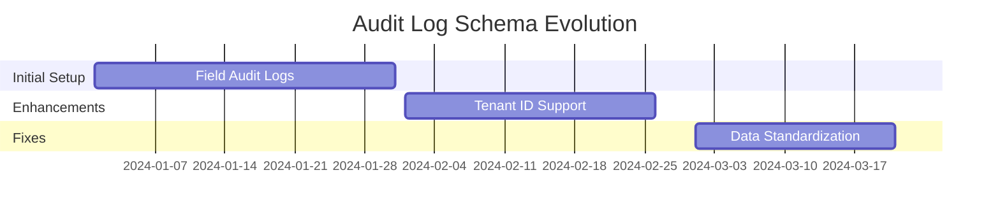

### Migration Dependencies

| Migration | Purpose | Dependencies | Impact |
|-----------|---------|--------------|--------|
| `026_audit_log_system.py` | Initial field audit log table creation | `025_template_skill_overrides` | Creates field_audit_logs table |
| `037_audit_log_tenant_id.py` | Add tenant_id to audit_logs table | `036_queue_lease_locking` | Enables tenant scoping |
| `024_audit_fixes.py` | Data cleanup and indexing | `023.skill_template_persistence` | Improves query performance |

**Section sources**
- [026_audit_log_system.py:13-33](file://alembic/versions/026_audit_log_system.py#L13-L33)
- [037_audit_log_tenant_id.py:12-53](file://alembic/versions/037_audit_log_tenant_id.py#L12-L53)
- [024_audit_fixes.py:13-40](file://alembic/versions/024_audit_fixes.py#L13-L40)

## Testing Strategy

### Unit Testing Approach

The audit log system includes comprehensive unit testing:

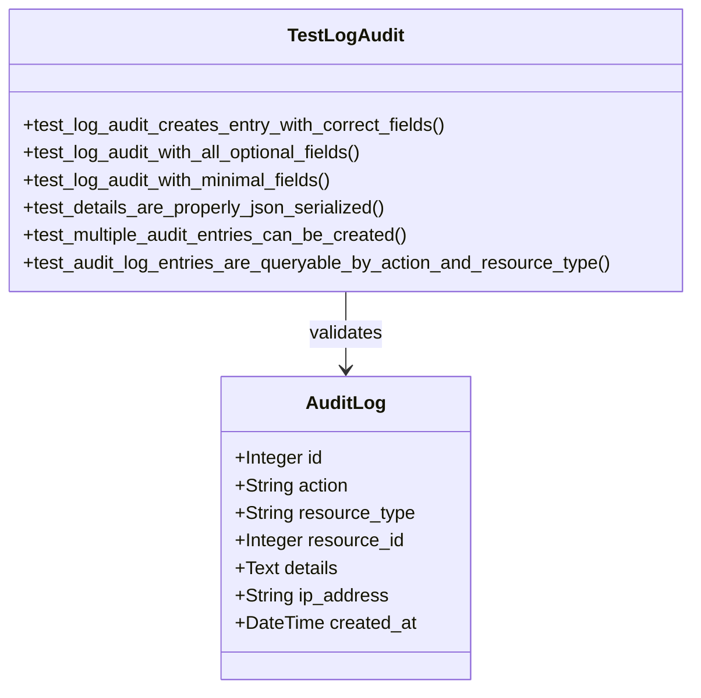

**Diagram sources**
- [test_audit_service.py:27-166](file://app/backend/tests/test_audit_service.py#L27-L166)

### Test Coverage Areas

| Test Category | Coverage | Validation |
|---------------|----------|------------|
| Basic Functionality | Audit log creation | Field mapping accuracy |
| Optional Parameters | IP address, tenant_id | Parameter handling |
| JSON Serialization | Complex nested objects | Data integrity |
| Query Filtering | Action/resource type filtering | Query correctness |
| Edge Cases | Empty values, None handling | Robustness |

**Section sources**
- [test_audit_service.py:27-166](file://app/backend/tests/test_audit_service.py#L27-L166)

## Performance Considerations

### Database Optimization

The audit log system implements several performance optimization strategies:

| Optimization | Implementation | Benefit |
|------------|----------------|---------|
| Composite Indexes | `ix_field_audit_entity` on (entity_type, entity_id) | Faster entity queries |
| Tenant Scoping | Separate tenant_id columns | Isolated query performance |
| Pagination Limits | 10,000 row export cap | Memory management |
| Query Optimization | Selective field retrieval | Reduced bandwidth |

### Frontend Performance Enhancements

The AuditLogPage.jsx implements multiple frontend optimizations:

| Optimization | Implementation | Benefit |
|------------|----------------|---------|
| Virtualized Rendering | Table with fixed height and overflow | Smooth scrolling for large datasets |
| Debounced Search | Input debouncing for actor email | Reduced API calls |
| Efficient State Management | React hooks with proper dependencies | Optimal re-rendering |
| Lazy Loading | Conditional tenant loading | Faster initial page load |
| Skeleton Loading | Animated placeholders | Improved perceived performance |
| Enhanced Error Handling | extractApiError utility | Better error recovery |

### Optimized Pagination

**Updated** The system now implements optimized pagination with 100 items per page for improved performance:

| Feature | Implementation | Benefit |
|---------|----------------|---------|
| Increased Page Size | 100 items per page (vs 25) | Reduced API calls for large datasets |
| Efficient Loading | Optimized tenant loading with per_page: 100 | Faster initial page load |
| Better User Experience | Fewer pagination steps for large datasets | Improved navigation efficiency |
| Memory Optimization | Larger batches reduce memory overhead | Better performance with limited resources |

### Scalability Factors

| Factor | Consideration | Mitigation |
|--------|---------------|------------|
| Log Volume | High-frequency changes | Efficient indexing and partitioning |
| Query Patterns | Historical analysis | Optimized date range queries |
| Export Operations | Large dataset exports | Bounded result sets |
| Concurrent Access | Multiple simultaneous changes | Proper transaction isolation |
| Error Handling | Robust error recovery | extractApiError utility for consistent messaging |

**Section sources**
- [AuditLogPage.jsx:136-154](file://app/frontend/src/pages/admin/AuditLogPage.jsx#L136-L154)
- [api.js:1076-1085](file://app/frontend/src/lib/api.js#L1076-L1085)

## Security Considerations

### Access Control

The audit log system implements comprehensive security measures:

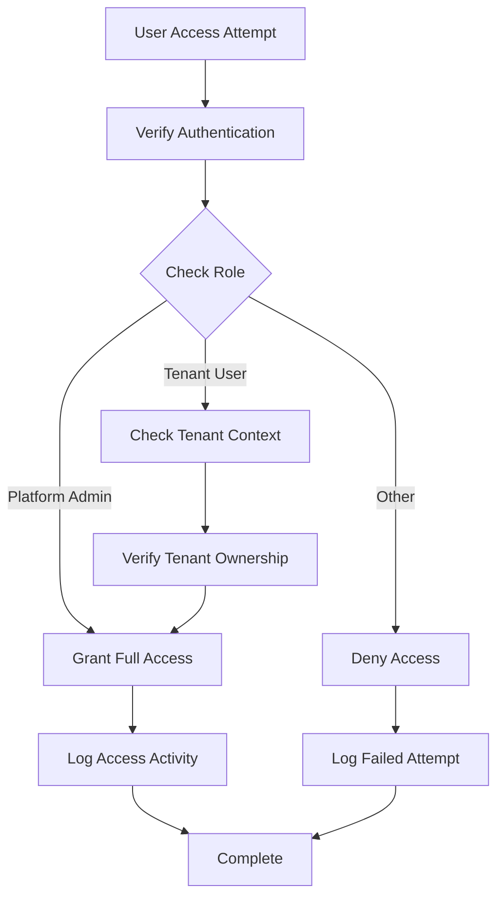

### Data Protection

| Security Measure | Implementation | Purpose |
|------------------|----------------|---------|
| Tenant Isolation | Separate tenant_id columns | Prevent cross-tenant data access |
| IP Address Logging | Optional IP capture | Activity tracking |
| JSON Sanitization | Automatic JSON serialization | Prevent injection attacks |
| Export Limits | 10,000 row cap | Data leakage prevention |
| CSRF Protection | Automatic token handling | Request forgery prevention |
| XSS Prevention | React's built-in escaping | Cross-site scripting protection |
| Enhanced Error Handling | extractApiError utility | Secure error message display |

## Troubleshooting Guide

### Common Issues and Solutions

| Issue | Symptoms | Solution |
|-------|----------|----------|
| Audit Logs Not Appearing | Empty audit log table | Verify log_audit() function calls |
| Field Changes Not Logged | Missing field-level changes | Check log_field_change() implementation |
| Export Failures | 500 errors on export | Verify query parameters and limits |
| Performance Degradation | Slow audit queries | Check database indexes and query optimization |
| Filter Not Working | Filters don't apply | Check parameter mapping in frontend |
| Pagination Issues | Wrong page count | Verify total count calculation |
| Error Display Problems | Unclear error messages | Check extractApiError() usage |
| Tenant Loading Delays | Slow tenant dropdown population | Verify per_page: 100 optimization |

### Debugging Steps

1. **Verify Service Calls**: Ensure `log_audit()` and `log_field_change()` are called appropriately
2. **Check Database Connectivity**: Confirm database connection and permissions
3. **Validate Parameters**: Verify required parameters are provided correctly
4. **Monitor Transactions**: Ensure proper commit/rollback handling
5. **Test Queries**: Validate database query performance and results
6. **Frontend Debugging**: Check React DevTools for component state issues
7. **Network Inspection**: Use browser dev tools to inspect API requests and responses
8. **Error Handling**: Verify extractApiError() utility is properly extracting error messages
9. **Pagination Testing**: Confirm 100-item pagination is working correctly

**Section sources**
- [audit_service.py:12-84](file://app/backend/services/audit_service.py#L12-L84)
- [AuditLogPage.jsx:136-154](file://app/frontend/src/pages/admin/AuditLogPage.jsx#L136-L154)
- [api.js:1076-1085](file://app/frontend/src/lib/api.js#L1076-L1085)

## Conclusion

The Audit Log Management system in Resume AI by ThetaLogics provides a comprehensive solution for tracking administrative actions and field-level changes across multi-tenant environments. The system's dual approach of platform admin audit trails and field-level change tracking ensures both strategic oversight and granular operational visibility.

**Updated** The recent enhancements to the AuditLogPage.jsx represent significant improvements in user experience and system reliability. The implementation now features:

- **Enhanced Error Handling**: Sophisticated error management through the `extractApiError()` utility with robust message extraction for various error types
- **Optimized Performance**: Increased pagination to 100 items per page for better performance with large datasets
- **Comprehensive Filtering**: Advanced actor email search, action type dropdown, tenant selection, and date range filtering
- **Interactive Details**: Expandable detail views with JSON formatting for better log inspection
- **Improved User Experience**: Loading states, error handling, toast notifications, and mobile responsiveness
- **Export Capabilities**: CSV and JSON export with configurable date ranges and action filters
- **Better Error Recovery**: Consistent error message display and retry mechanisms

Key strengths of the system include:

- **Comprehensive Coverage**: Both high-level administrative actions and detailed field changes are tracked
- **Multi-tenant Support**: Proper tenant isolation and scoping for accurate reporting
- **Advanced Filtering**: Sophisticated search capabilities for efficient log management
- **Performance Optimization**: Efficient database design with appropriate indexing and frontend optimizations
- **Enhanced Error Handling**: Robust error recovery through the extractApiError utility
- **Flexible Export**: Multiple export formats with configurable limits for analysis and compliance
- **Robust Testing**: Comprehensive unit tests ensuring reliability and accuracy
- **Modern UI/UX**: Intuitive interface with expandable details and responsive design

The system successfully balances functionality, performance, and security while providing intuitive interfaces for both administrative oversight and detailed operational analysis. The recent enhancements to error handling and pagination demonstrate ongoing commitment to improving user experience and system reliability. Future enhancements could include real-time audit streaming, advanced analytics dashboards, enhanced compliance reporting capabilities, and integration with external audit systems.