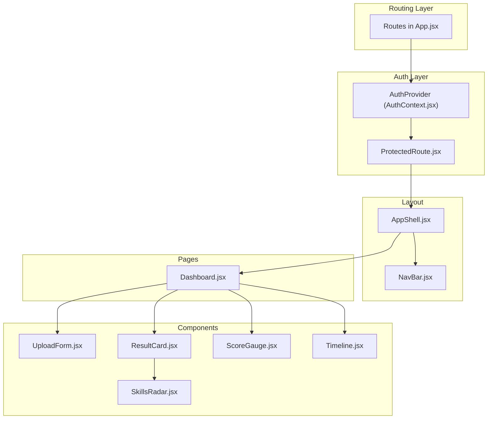
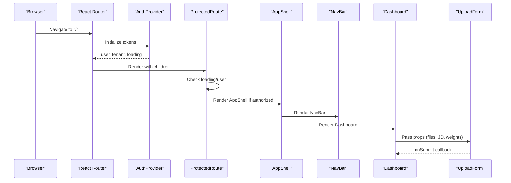
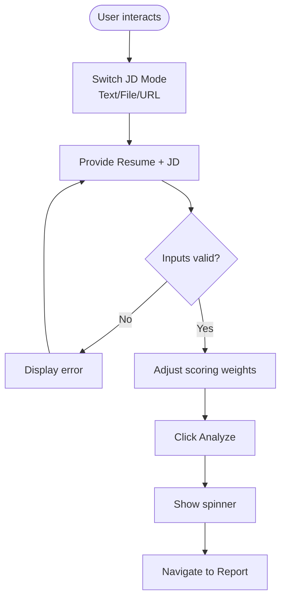
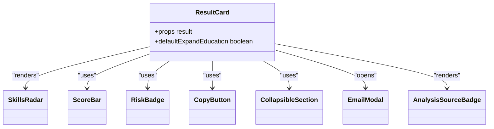
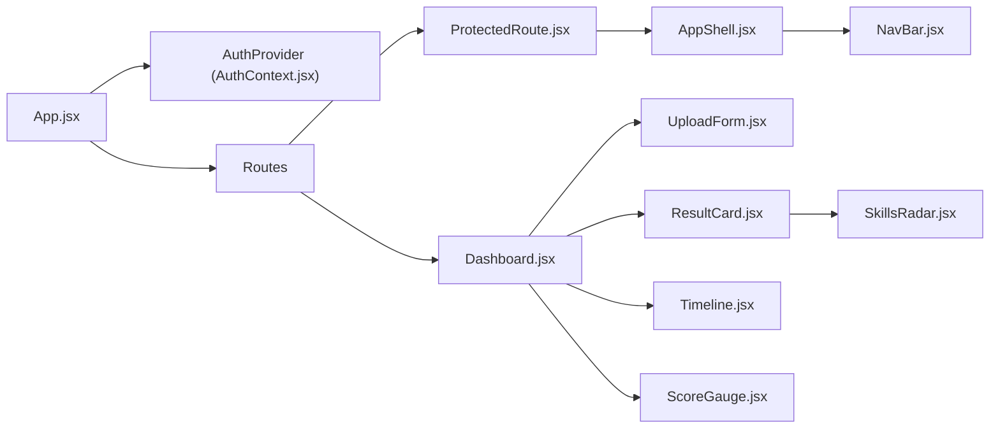

# Component Library

<cite>
**Referenced Files in This Document**
- [App.jsx](file://app/frontend/src/App.jsx)
- [main.jsx](file://app/frontend/src/main.jsx)
- [AuthContext.jsx](file://app/frontend/src/contexts/AuthContext.jsx)
- [AppShell.jsx](file://app/frontend/src/components/AppShell.jsx)
- [NavBar.jsx](file://app/frontend/src/components/NavBar.jsx)
- [ProtectedRoute.jsx](file://app/frontend/src/components/ProtectedRoute.jsx)
- [UploadForm.jsx](file://app/frontend/src/components/UploadForm.jsx)
- [ResultCard.jsx](file://app/frontend/src/components/ResultCard.jsx)
- [ScoreGauge.jsx](file://app/frontend/src/components/ScoreGauge.jsx)
- [Timeline.jsx](file://app/frontend/src/components/Timeline.jsx)
- [SkillsRadar.jsx](file://app/frontend/src/components/SkillsRadar.jsx)
- [Dashboard.jsx](file://app/frontend/src/pages/Dashboard.jsx)
- [UploadForm.test.jsx](file://app/frontend/src/__tests__/UploadForm.test.jsx)
- [ResultCard.test.jsx](file://app/frontend/src/__tests__/ResultCard.test.jsx)
- [ScoreGauge.test.jsx](file://app/frontend/src/__tests__/ScoreGauge.test.jsx)
</cite>

## Table of Contents
1. [Introduction](#introduction)
2. [Project Structure](#project-structure)
3. [Core Components](#core-components)
4. [Architecture Overview](#architecture-overview)
5. [Detailed Component Analysis](#detailed-component-analysis)
6. [Dependency Analysis](#dependency-analysis)
7. [Performance Considerations](#performance-considerations)
8. [Troubleshooting Guide](#troubleshooting-guide)
9. [Conclusion](#conclusion)
10. [Appendices](#appendices)

## Introduction
This document describes the reusable UI component library used by Resume AI’s frontend. It covers layout and navigation wrappers, authentication gating, and specialized analysis visualization components. For each component, we outline purpose, props interface, event handlers, composition patterns, styling customization with TailwindCSS, accessibility considerations, and integration examples. The components are designed for responsiveness, cross-browser compatibility, and maintainable composition across pages.

## Project Structure
The frontend is a React application bootstrapped with Vite and routed via React Router. Components live under src/components, pages under src/pages, shared contexts under src/contexts, and shared hooks under src/hooks. Styling leverages TailwindCSS with a consistent brand palette and backdrop blur effects.

**Diagram sources**
- [App.jsx:39-61](file://app/frontend/src/App.jsx#L39-L61)
- [AuthContext.jsx:6-62](file://app/frontend/src/contexts/AuthContext.jsx#L6-L62)
- [ProtectedRoute.jsx:4-23](file://app/frontend/src/components/ProtectedRoute.jsx#L4-L23)
- [AppShell.jsx:3-11](file://app/frontend/src/components/AppShell.jsx#L3-L11)
- [NavBar.jsx:17-116](file://app/frontend/src/components/NavBar.jsx#L17-L116)
- [Dashboard.jsx:204-329](file://app/frontend/src/pages/Dashboard.jsx#L204-L329)
- [UploadForm.jsx:77-89](file://app/frontend/src/components/UploadForm.jsx#L77-L89)
- [ResultCard.jsx:265-279](file://app/frontend/src/components/ResultCard.jsx#L265-L279)
- [ScoreGauge.jsx:1-97](file://app/frontend/src/components/ScoreGauge.jsx#L1-L97)
- [Timeline.jsx:3-115](file://app/frontend/src/components/Timeline.jsx#L3-L115)
- [SkillsRadar.jsx:110-261](file://app/frontend/src/components/SkillsRadar.jsx#L110-L261)

**Section sources**
- [main.jsx:7-13](file://app/frontend/src/main.jsx#L7-L13)
- [App.jsx:39-61](file://app/frontend/src/App.jsx#L39-L61)

## Core Components
- AppShell: A minimal layout wrapper that renders the navigation bar and wraps page content with a scrollable container.
- NavBar: A responsive header with logo, navigation links, and a user menu powered by AuthContext.
- ProtectedRoute: A route guard that blocks unauthenticated users and shows a loading spinner while checking auth state.
- UploadForm: Drag-and-drop resume and job description upload with multiple input modes (text, file, URL), scoring weight controls, and submission.
- ResultCard: A comprehensive results display with score breakdown, strengths/weaknesses/risk signals, explainability, education analysis, domain fit, and interview kit.
- ScoreGauge: A circular gauge indicating recommendation fit level with thresholds and pending state.
- Timeline: Employment history visualization with short-tenure indicators and gap severity.
- SkillsRadar: A category-based skills visualization with matched/missing counts and a bar chart breakdown.

**Section sources**
- [AppShell.jsx:3-11](file://app/frontend/src/components/AppShell.jsx#L3-L11)
- [NavBar.jsx:17-116](file://app/frontend/src/components/NavBar.jsx#L17-L116)
- [ProtectedRoute.jsx:4-23](file://app/frontend/src/components/ProtectedRoute.jsx#L4-L23)
- [UploadForm.jsx:77-89](file://app/frontend/src/components/UploadForm.jsx#L77-L89)
- [ResultCard.jsx:265-279](file://app/frontend/src/components/ResultCard.jsx#L265-L279)
- [ScoreGauge.jsx:1-97](file://app/frontend/src/components/ScoreGauge.jsx#L1-L97)
- [Timeline.jsx:3-115](file://app/frontend/src/components/Timeline.jsx#L3-L115)
- [SkillsRadar.jsx:110-261](file://app/frontend/src/components/SkillsRadar.jsx#L110-L261)

## Architecture Overview
The routing layer mounts providers for authentication and subscription, then wraps page content with ProtectedRoute and AppShell. Pages like Dashboard orchestrate state and pass props to UploadForm and ResultCard. ResultCard composes SkillsRadar and Timeline to visualize analysis results.

**Diagram sources**
- [App.jsx:39-61](file://app/frontend/src/App.jsx#L39-L61)
- [AuthContext.jsx:6-62](file://app/frontend/src/contexts/AuthContext.jsx#L6-L62)
- [ProtectedRoute.jsx:4-23](file://app/frontend/src/components/ProtectedRoute.jsx#L4-L23)
- [AppShell.jsx:3-11](file://app/frontend/src/components/AppShell.jsx#L3-L11)
- [NavBar.jsx:17-116](file://app/frontend/src/components/NavBar.jsx#L17-L116)
- [Dashboard.jsx:204-329](file://app/frontend/src/pages/Dashboard.jsx#L204-L329)
- [UploadForm.jsx:77-89](file://app/frontend/src/components/UploadForm.jsx#L77-L89)

## Detailed Component Analysis

### AppShell
- Purpose: Provides a consistent layout scaffold with a fixed header and scrollable content area.
- Props: children (ReactNode).
- Behavior: Renders NavBar and wraps children in a flex column with overflow handling.
- Accessibility: Uses semantic headings and maintains focus order; relies on NavBar for global navigation.
- Styling: Tailwind classes define height, spacing, and backdrop blur; responsive padding and overflow control.

**Section sources**
- [AppShell.jsx:3-11](file://app/frontend/src/components/AppShell.jsx#L3-L11)

### NavBar
- Purpose: Global navigation and user menu with branding, nav links, and account actions.
- Props: None.
- Behavior: Reads current user and tenant from AuthContext; toggles user dropdown; navigates to settings and logs out.
- Accessibility: Keyboard-friendly buttons, aria-aware icons, and controlled open/close state.
- Styling: Responsive layout with mobile-first design; backdrop blur and brand accents.

**Section sources**
- [NavBar.jsx:17-116](file://app/frontend/src/components/NavBar.jsx#L17-L116)
- [AuthContext.jsx:65-69](file://app/frontend/src/contexts/AuthContext.jsx#L65-L69)

### ProtectedRoute
- Purpose: Enforces authentication at the route level.
- Props: children (ReactNode).
- Behavior: Shows a spinner while loading; redirects to login if no user; otherwise renders children.
- Accessibility: Minimal DOM; spinner is visually centered and labeled by animation.
- Styling: Centered loader with brand colors.

**Section sources**
- [ProtectedRoute.jsx:4-23](file://app/frontend/src/components/ProtectedRoute.jsx#L4-L23)
- [AuthContext.jsx:65-69](file://app/frontend/src/contexts/AuthContext.jsx#L65-L69)

### UploadForm
- Purpose: Accepts resume and job description via drag-and-drop, URL extraction, or file upload; exposes scoring weights.
- Props:
  - onFileSelect(file)
  - jobDescription(string)
  - onJobDescriptionChange(text)
  - onJobFileSelect(file)
  - onSubmit(event)
  - isLoading(boolean)
  - selectedFile(File|null)
  - selectedJobFile(File|null)
  - error(string|null)
  - scoringWeights(object|null)
  - onScoringWeightsChange(weights)
- Events: Triggers onSubmit when conditions are met; updates internal state for JD modes and weights.
- Validation: Disables submit when required inputs are missing; shows errors; enforces file size/type limits.
- Composition: Integrates react-dropzone for drag-and-drop; includes a Weight presets panel; supports saved JD templates.
- Accessibility: Clear labels, keyboard navigation, disabled states, and visual feedback for drag-active states.
- Styling: Tailwind cards, borders, and brand accents; responsive grid and typography.

**Diagram sources**
- [UploadForm.jsx:77-89](file://app/frontend/src/components/UploadForm.jsx#L77-L89)
- [UploadForm.jsx:137-194](file://app/frontend/src/components/UploadForm.jsx#L137-L194)
- [UploadForm.jsx:459-479](file://app/frontend/src/components/UploadForm.jsx#L459-L479)

**Section sources**
- [UploadForm.jsx:77-89](file://app/frontend/src/components/UploadForm.jsx#L77-L89)
- [UploadForm.jsx:137-194](file://app/frontend/src/components/UploadForm.jsx#L137-L194)
- [UploadForm.jsx:459-479](file://app/frontend/src/components/UploadForm.jsx#L459-L479)
- [UploadForm.test.jsx:26-58](file://app/frontend/src/__tests__/UploadForm.test.jsx#L26-L58)

### ResultCard
- Purpose: Presents a comprehensive analysis report with recommendation, score breakdown, strengths/weaknesses/risk signals, explainability, education analysis, domain fit, and interview kit.
- Props: result(object) with keys such as fit_score, strengths, weaknesses, risk_level, final_recommendation, score_breakdown, matched_skills, missing_skills, risk_signals, interview_questions, explainability, skill_analysis, edu_timeline_analysis, recommendation_rationale, narrative_pending, analysis_quality.
- Composition: Uses ScoreBar, RiskBadge, CopyButton, CollapsibleSection, EmailModal, and AnalysisSourceBadge internally.
- Accessibility: Expandable/collapsible sections with chevrons; copy buttons with tooltips; readable typography hierarchy.
- Styling: Card-based layout with brand accents, colored badges, and subtle shadows.

**Diagram sources**
- [ResultCard.jsx:265-279](file://app/frontend/src/components/ResultCard.jsx#L265-L279)
- [SkillsRadar.jsx:110-261](file://app/frontend/src/components/SkillsRadar.jsx#L110-L261)
- [ResultCard.jsx:13-37](file://app/frontend/src/components/ResultCard.jsx#L13-L37)
- [ResultCard.jsx:39-50](file://app/frontend/src/components/ResultCard.jsx#L39-L50)
- [ResultCard.jsx:52-63](file://app/frontend/src/components/ResultCard.jsx#L52-L63)
- [ResultCard.jsx:65-90](file://app/frontend/src/components/ResultCard.jsx#L65-L90)
- [ResultCard.jsx:94-194](file://app/frontend/src/components/ResultCard.jsx#L94-L194)
- [ResultCard.jsx:198-247](file://app/frontend/src/components/ResultCard.jsx#L198-L247)

**Section sources**
- [ResultCard.jsx:265-279](file://app/frontend/src/components/ResultCard.jsx#L265-L279)
- [ResultCard.jsx:13-37](file://app/frontend/src/components/ResultCard.jsx#L13-L37)
- [ResultCard.jsx:39-50](file://app/frontend/src/components/ResultCard.jsx#L39-L50)
- [ResultCard.jsx:52-63](file://app/frontend/src/components/ResultCard.jsx#L52-L63)
- [ResultCard.jsx:65-90](file://app/frontend/src/components/ResultCard.jsx#L65-L90)
- [ResultCard.jsx:94-194](file://app/frontend/src/components/ResultCard.jsx#L94-L194)
- [ResultCard.jsx:198-247](file://app/frontend/src/components/ResultCard.jsx#L198-L247)
- [ResultCard.test.jsx:14-43](file://app/frontend/src/__tests__/ResultCard.test.jsx#L14-L43)

### ScoreGauge
- Purpose: Visualizes a single-fit score with threshold-based coloring and a pending state indicator.
- Props: score(number|null).
- Behavior: Computes arc offset based on score; displays “Pending” when score is null/undefined.
- Accessibility: Clear numeric labeling and threshold labels; transitions for smooth arc rendering.
- Styling: SVG-based circular progress with brand shadows and color-coded labels.

**Section sources**
- [ScoreGauge.jsx:1-97](file://app/frontend/src/components/ScoreGauge.jsx#L1-L97)
- [ScoreGauge.test.jsx:5-24](file://app/frontend/src/__tests__/ScoreGauge.test.jsx#L5-L24)

### Timeline
- Purpose: Renders employment history with optional gaps and short-tenure warnings.
- Props: workExperience(array), gaps(array|null).
- Behavior: Sorts jobs by start date; marks short tenures; renders gap metadata with severity.
- Accessibility: Semantic headings and readable date formatting; minimal interactive elements.
- Styling: Vertical timeline with brand accents and severity badges.

**Section sources**
- [Timeline.jsx:3-115](file://app/frontend/src/components/Timeline.jsx#L3-L115)

### SkillsRadar
- Purpose: Visualizes matched vs missing skills grouped by categories with a bar chart and summary metrics.
- Props: matchedSkills(array), missingSkills(array).
- Behavior: Categorizes skills, tallies counts, computes match percentage, and renders a bar chart with tooltips.
- Accessibility: Tooltips for chart details; readable legends and category labels.
- Styling: Responsive chart container, category-specific colors, and summary progress indicator.

**Section sources**
- [SkillsRadar.jsx:110-261](file://app/frontend/src/components/SkillsRadar.jsx#L110-L261)

## Dependency Analysis
- App.jsx orchestrates providers and routes, wrapping page shells with ProtectedRoute and AppShell.
- Dashboard integrates UploadForm and drives state for analysis submission and progress.
- ResultCard composes SkillsRadar and Timeline for visualization.
- AuthContext supplies authentication state to NavBar and ProtectedRoute.

**Diagram sources**
- [App.jsx:39-61](file://app/frontend/src/App.jsx#L39-L61)
- [AuthContext.jsx:6-62](file://app/frontend/src/contexts/AuthContext.jsx#L6-L62)
- [ProtectedRoute.jsx:4-23](file://app/frontend/src/components/ProtectedRoute.jsx#L4-L23)
- [AppShell.jsx:3-11](file://app/frontend/src/components/AppShell.jsx#L3-L11)
- [NavBar.jsx:17-116](file://app/frontend/src/components/NavBar.jsx#L17-L116)
- [Dashboard.jsx:204-329](file://app/frontend/src/pages/Dashboard.jsx#L204-L329)
- [UploadForm.jsx:77-89](file://app/frontend/src/components/UploadForm.jsx#L77-L89)
- [ResultCard.jsx:265-279](file://app/frontend/src/components/ResultCard.jsx#L265-L279)
- [SkillsRadar.jsx:110-261](file://app/frontend/src/components/SkillsRadar.jsx#L110-L261)
- [Timeline.jsx:3-115](file://app/frontend/src/components/Timeline.jsx#L3-L115)
- [ScoreGauge.jsx:1-97](file://app/frontend/src/components/ScoreGauge.jsx#L1-L97)

**Section sources**
- [App.jsx:39-61](file://app/frontend/src/App.jsx#L39-L61)
- [Dashboard.jsx:204-329](file://app/frontend/src/pages/Dashboard.jsx#L204-L329)

## Performance Considerations
- Lazy-load routes to reduce initial bundle size.
- Use responsive containers (e.g., SkillsRadar) to avoid layout thrashing on small screens.
- Debounce or throttle heavy UI updates (e.g., real-time progress) to minimize re-renders.
- Prefer memoization for expensive computations in ResultCard (e.g., explainability sections).
- Keep SVG animations minimal; rely on transitions for gauge updates.

## Troubleshooting Guide
- Authentication not persisting:
  - Verify tokens are stored in localStorage and AuthProvider fetches /auth/me on mount.
- ProtectedRoute shows spinner indefinitely:
  - Ensure AuthProvider resolves user or clears stale tokens.
- UploadForm submit disabled:
  - Confirm selectedFile exists and jobDescription is present for text mode or selectedJobFile for file mode.
- ResultCard sections not expanding:
  - Check defaultOpen prop and state toggles; ensure collapsible sections receive proper children.
- ScoreGauge shows pending:
  - Indicates score is null/undefined; trigger re-analysis after resolving backend issues.
- Timeline gaps misreported:
  - Validate date parsing and ensure gaps array aligns with job indices.

**Section sources**
- [AuthContext.jsx:11-27](file://app/frontend/src/contexts/AuthContext.jsx#L11-L27)
- [ProtectedRoute.jsx:7-16](file://app/frontend/src/components/ProtectedRoute.jsx#L7-L16)
- [UploadForm.jsx:190-194](file://app/frontend/src/components/UploadForm.jsx#L190-L194)
- [ResultCard.jsx:65-90](file://app/frontend/src/components/ResultCard.jsx#L65-L90)
- [ScoreGauge.jsx:2-3](file://app/frontend/src/components/ScoreGauge.jsx#L2-L3)
- [Timeline.jsx:96-114](file://app/frontend/src/components/Timeline.jsx#L96-L114)

## Conclusion
The component library emphasizes composability, accessibility, and responsive design. Layout and navigation are centralized via AppShell and NavBar, while ProtectedRoute ensures secure access. UploadForm and ResultCard integrate tightly with page-level state to deliver a seamless analysis workflow. Visualization components (ScoreGauge, Timeline, SkillsRadar) provide actionable insights with clear thresholds and category breakdowns.

## Appendices

### Component Composition Patterns
- Provider-first routing: AuthProvider -> ProtectedRoute -> AppShell -> Page -> Component.
- Page-driven orchestration: Dashboard manages file/weight/state and passes callbacks to UploadForm; Dashboard also renders ResultCard and auxiliary components.
- Reusable subcomponents: ResultCard composes ScoreBar, RiskBadge, CollapsibleSection, and EmailModal.

**Section sources**
- [App.jsx:29-37](file://app/frontend/src/App.jsx#L29-L37)
- [Dashboard.jsx:204-329](file://app/frontend/src/pages/Dashboard.jsx#L204-L329)
- [ResultCard.jsx:65-90](file://app/frontend/src/components/ResultCard.jsx#L65-L90)

### Prop Validation and Error Handling
- UploadForm validates inputs and displays errors; disables submit until ready.
- ResultCard handles missing data gracefully and shows placeholders.
- ScoreGauge and Timeline handle null/undefined inputs and render safe defaults.

**Section sources**
- [UploadForm.jsx:190-194](file://app/frontend/src/components/UploadForm.jsx#L190-L194)
- [ResultCard.jsx:281-282](file://app/frontend/src/components/ResultCard.jsx#L281-L282)
- [ScoreGauge.jsx:2-3](file://app/frontend/src/components/ScoreGauge.jsx#L2-L3)
- [Timeline.jsx:4-11](file://app/frontend/src/components/Timeline.jsx#L4-L11)

### Accessibility Features
- Semantic headings and labels.
- Keyboard operable buttons and collapsible sections.
- Focus management in modals (e.g., EmailModal).
- Sufficient color contrast and readable typography.

**Section sources**
- [NavBar.jsx:67-111](file://app/frontend/src/components/NavBar.jsx#L67-L111)
- [ResultCard.jsx:94-194](file://app/frontend/src/components/ResultCard.jsx#L94-L194)

### Styling Customization with TailwindCSS
- Brand tokens: Use bg-brand-*, text-brand-*, ring-brand-* for consistent theming.
- Backdrop blur: backdrop-blur-md for glass-like UIs.
- Responsive grids and spacing: Use md:/lg: prefixes for breakpoints.
- Interactive states: Hover/focus rings and transitions for feedback.

**Section sources**
- [AppShell.jsx:5](file://app/frontend/src/components/AppShell.jsx#L5)
- [NavBar.jsx:26](file://app/frontend/src/components/NavBar.jsx#L26)
- [UploadForm.jsx:198](file://app/frontend/src/components/UploadForm.jsx#L198)
- [ResultCard.jsx:304](file://app/frontend/src/components/ResultCard.jsx#L304)

### State Management Integration
- Dashboard holds file, JD, weights, and loading/error state; passes callbacks to UploadForm.
- AuthContext centralizes login/logout and user/tenant state.
- ProtectedRoute reads AuthContext to gate routes.

**Section sources**
- [Dashboard.jsx:209-214](file://app/frontend/src/pages/Dashboard.jsx#L209-L214)
- [Dashboard.jsx:243-275](file://app/frontend/src/pages/Dashboard.jsx#L243-L275)
- [AuthContext.jsx:65-69](file://app/frontend/src/contexts/AuthContext.jsx#L65-L69)
- [ProtectedRoute.jsx:5](file://app/frontend/src/components/ProtectedRoute.jsx#L5)