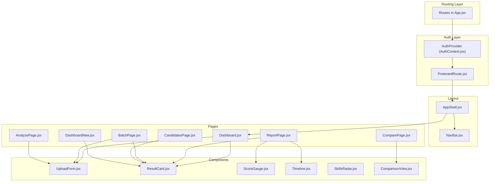
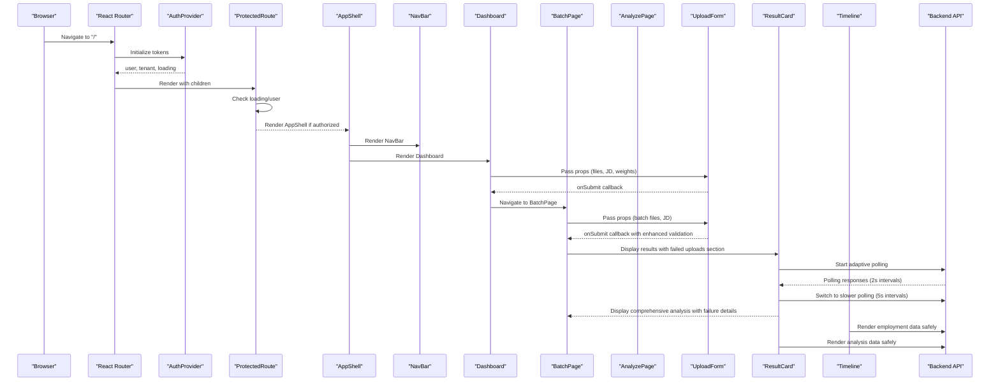
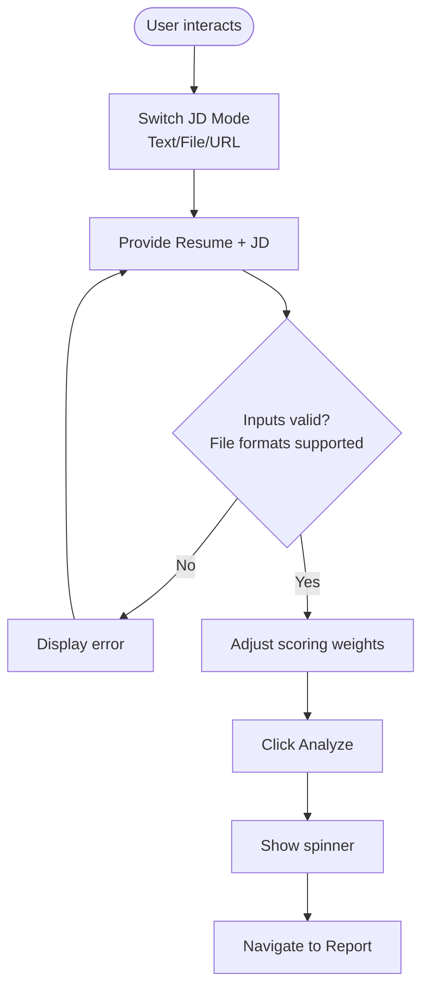
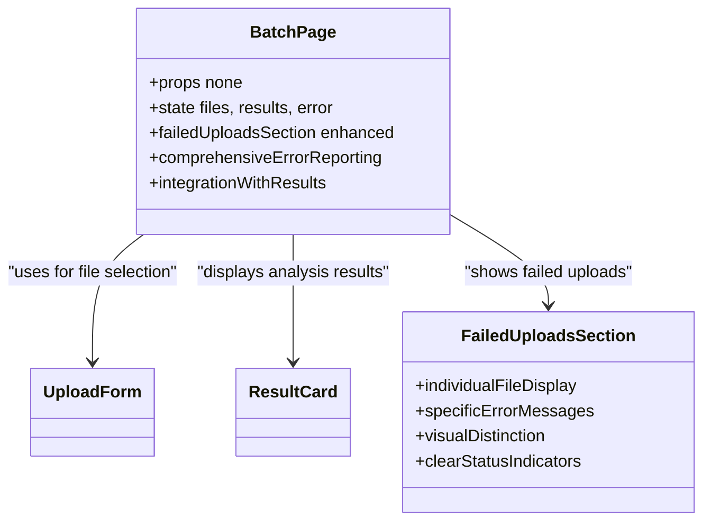
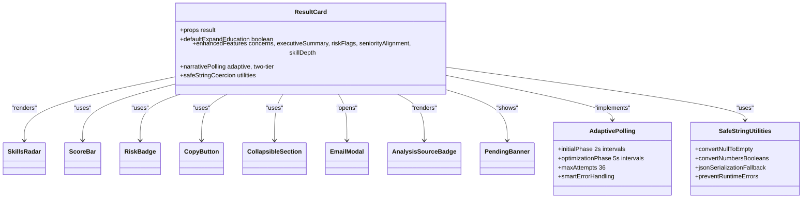
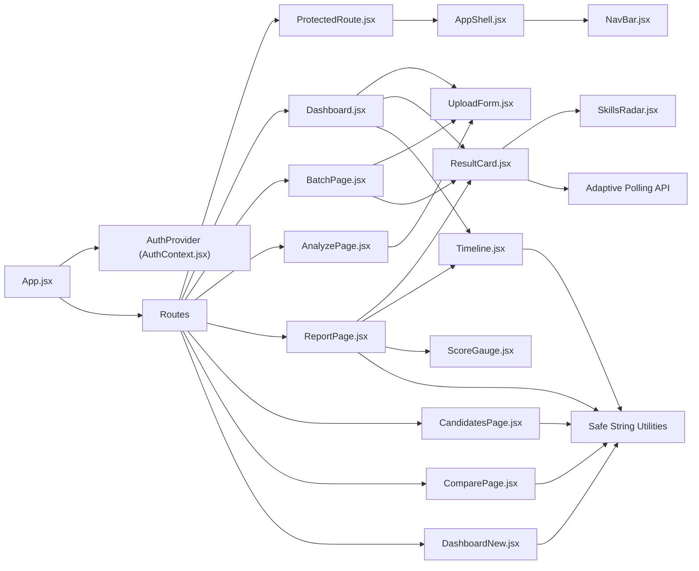

# Component Library

<cite>
**Referenced Files in This Document**
- [App.jsx](file://app/frontend/src/App.jsx)
- [main.jsx](file://app/frontend/src/main.jsx)
- [AuthContext.jsx](file://app/frontend/src/contexts/AuthContext.jsx)
- [AppShell.jsx](file://app/frontend/src/components/AppShell.jsx)
- [NavBar.jsx](file://app/frontend/src/components/NavBar.jsx)
- [ProtectedRoute.jsx](file://app/frontend/src/components/ProtectedRoute.jsx)
- [UploadForm.jsx](file://app/frontend/src/components/UploadForm.jsx)
- [ResultCard.jsx](file://app/frontend/src/components/ResultCard.jsx)
- [ScoreGauge.jsx](file://app/frontend/src/components/ScoreGauge.jsx)
- [Timeline.jsx](file://app/frontend/src/components/Timeline.jsx)
- [SkillsRadar.jsx](file://app/frontend/src/components/SkillsRadar.jsx)
- [ComparisonView.jsx](file://app/frontend/src/components/ComparisonView.jsx)
- [Dashboard.jsx](file://app/frontend/src/pages/Dashboard.jsx)
- [ReportPage.jsx](file://app/frontend/src/pages/ReportPage.jsx)
- [BatchPage.jsx](file://app/frontend/src/pages/BatchPage.jsx)
- [AnalyzePage.jsx](file://app/frontend/src/pages/AnalyzePage.jsx)
- [CandidatesPage.jsx](file://app/frontend/src/pages/CandidatesPage.jsx)
- [ComparePage.jsx](file://app/frontend/src/pages/ComparePage.jsx)
- [DashboardNew.jsx](file://app/frontend/src/pages/DashboardNew.jsx)
- [api.js](file://app/frontend/src/lib/api.js)
- [ResultCard.test.jsx](file://app/frontend/src/__tests__/ResultCard.test.jsx)
- [ScoreGauge.test.jsx](file://app/frontend/src/__tests__/ScoreGauge.test.jsx)
- [UploadForm.test.jsx](file://app/frontend/src/__tests__/UploadForm.test.jsx)
- [analyze.py](file://app/backend/routes/analyze.py)
</cite>

## Update Summary
**Changes Made**
- Added comprehensive XSS protection documentation through centralized safeStr utility function
- Documented safeStr implementation across multiple components for universal string conversion and sanitization
- Updated component documentation to reflect safe string coercion utilities preventing runtime errors
- Enhanced security considerations for data rendering in all text-display components

## Table of Contents
1. [Introduction](#introduction)
2. [Project Structure](#project-structure)
3. [Core Components](#core-components)
4. [Architecture Overview](#architecture-overview)
5. [Detailed Component Analysis](#detailed-component-analysis)
6. [XSS Protection and Safe String Utilities](#xss-protection-and-safe-string-utilities)
7. [Dependency Analysis](#dependency-analysis)
8. [Performance Considerations](#performance-considerations)
9. [Troubleshooting Guide](#troubleshooting-guide)
10. [Conclusion](#conclusion)
11. [Appendices](#appendices)

## Introduction
This document describes the reusable UI component library used by Resume AI's frontend. It covers layout and navigation wrappers, authentication gating, and specialized analysis visualization components. For each component, we outline purpose, props interface, event handlers, composition patterns, styling customization with TailwindCSS, accessibility considerations, and integration examples. The components are designed for responsiveness, cross-browser compatibility, and maintainable composition across pages.

**Security Enhancement**: All components now implement centralized XSS protection through the safeStr utility function, providing universal string conversion and sanitization across the entire frontend ecosystem.

## Project Structure
The frontend is a React application bootstrapped with Vite and routed via React Router. Components live under src/components, pages under src/pages, shared contexts under src/contexts, and shared hooks under src/hooks. Styling leverages TailwindCSS with a consistent brand palette and backdrop blur effects.



**Diagram sources**
- [App.jsx:39-61](file://app/frontend/src/App.jsx#L39-L61)
- [AuthContext.jsx:6-62](file://app/frontend/src/contexts/AuthContext.jsx#L6-L62)
- [ProtectedRoute.jsx:4-23](file://app/frontend/src/components/ProtectedRoute.jsx#L4-L23)
- [AppShell.jsx:3-11](file://app/frontend/src/components/AppShell.jsx#L3-L11)
- [NavBar.jsx:17-116](file://app/frontend/src/components/NavBar.jsx#L17-L116)
- [Dashboard.jsx:204-329](file://app/frontend/src/pages/Dashboard.jsx#L204-L329)
- [ReportPage.jsx:82-297](file://app/frontend/src/pages/ReportPage.jsx#L82-L297)
- [BatchPage.jsx:27-539](file://app/frontend/src/pages/BatchPage.jsx#L27-L539)
- [AnalyzePage.jsx:150-200](file://app/frontend/src/pages/AnalyzePage.jsx#L150-L200)
- [CandidatesPage.jsx:1-200](file://app/frontend/src/pages/CandidatesPage.jsx#L1-L200)
- [ComparePage.jsx:1-200](file://app/frontend/src/pages/ComparePage.jsx#L1-L200)
- [DashboardNew.jsx:1-200](file://app/frontend/src/pages/DashboardNew.jsx#L1-L200)
- [UploadForm.jsx:77-89](file://app/frontend/src/components/UploadForm.jsx#L77-L89)
- [ResultCard.jsx:265-705](file://app/frontend/src/components/ResultCard.jsx#L265-L705)
- [ScoreGauge.jsx:1-97](file://app/frontend/src/components/ScoreGauge.jsx#L1-L97)
- [Timeline.jsx:3-115](file://app/frontend/src/components/Timeline.jsx#L3-L115)
- [SkillsRadar.jsx:110-261](file://app/frontend/src/components/SkillsRadar.jsx#L110-L261)
- [ComparisonView.jsx:1-306](file://app/frontend/src/components/ComparisonView.jsx#L1-L306)

**Section sources**
- [main.jsx:7-13](file://app/frontend/src/main.jsx#L7-L13)
- [App.jsx:39-61](file://app/frontend/src/App.jsx#L39-L61)

## Core Components
- AppShell: A minimal layout wrapper that renders the navigation bar and wraps page content with a scrollable container.
- NavBar: A responsive header with logo, navigation links, and a user menu powered by AuthContext.
- ProtectedRoute: A route guard that blocks unauthenticated users and shows a loading spinner while checking auth state.
- UploadForm: Drag-and-drop resume and job description upload with multiple input modes (text, file, URL), scoring weight controls, and submission. Now supports expanded file formats including .txt, .rtf, and .odt.
- ResultCard: A comprehensive results display with enhanced features including adaptive polling logic, concerns section, executive summary banners, risk flag displays, seniority alignment indicators, skill depth counts, and expanded explainability sections. Now includes robust safe string coercion utilities for reliable data rendering.
- ScoreGauge: A circular gauge indicating recommendation fit level with thresholds and pending state.
- Timeline: Employment history visualization with short-tenure indicators and gap severity. Now includes safe string coercion utilities for robust data rendering.
- SkillsRadar: A category-based skills visualization with matched/missing counts and a bar chart breakdown.
- ComparisonView: Side-by-side comparison component with scoring weights and results analysis. Includes safe string utilities for consistent data rendering.
- CandidatesPage: Candidate management interface with detailed candidate information and application history. Implements safe string conversion for all text displays.
- ComparePage: Multi-candidate comparison interface with historical analysis and scoring comparisons. Utilizes safe string utilities for XSS protection.

**Section sources**
- [AppShell.jsx:3-11](file://app/frontend/src/components/AppShell.jsx#L3-L11)
- [NavBar.jsx:17-116](file://app/frontend/src/components/NavBar.jsx#L17-L116)
- [ProtectedRoute.jsx:4-23](file://app/frontend/src/components/ProtectedRoute.jsx#L4-L23)
- [UploadForm.jsx:77-89](file://app/frontend/src/components/UploadForm.jsx#L77-L89)
- [UploadForm.jsx:177-190](file://app/frontend/src/components/UploadForm.jsx#L177-L190)
- [UploadForm.jsx:192-206](file://app/frontend/src/components/UploadForm.jsx#L192-L206)
- [ResultCard.jsx:265-705](file://app/frontend/src/components/ResultCard.jsx#L265-L705)
- [ScoreGauge.jsx:1-97](file://app/frontend/src/components/ScoreGauge.jsx#L1-L97)
- [Timeline.jsx:3-115](file://app/frontend/src/components/Timeline.jsx#L3-L115)
- [SkillsRadar.jsx:110-261](file://app/frontend/src/components/SkillsRadar.jsx#L110-L261)
- [ComparisonView.jsx:1-306](file://app/frontend/src/components/ComparisonView.jsx#L1-L306)
- [CandidatesPage.jsx:1-200](file://app/frontend/src/pages/CandidatesPage.jsx#L1-L200)
- [ComparePage.jsx:1-200](file://app/frontend/src/pages/ComparePage.jsx#L1-L200)

## Architecture Overview
The routing layer mounts providers for authentication and subscription, then wraps page content with ProtectedRoute and AppShell. Pages like Dashboard orchestrate state and pass props to UploadForm and ResultCard. BatchPage provides batch processing capabilities with enhanced error reporting. ResultCard composes SkillsRadar and Timeline to visualize analysis results, with enhanced functionality for comprehensive candidate evaluation and adaptive polling optimization. All components now utilize safe string coercion utilities for robust data rendering during SSE streaming and XSS protection.



**Diagram sources**
- [App.jsx:39-61](file://app/frontend/src/App.jsx#L39-L61)
- [AuthContext.jsx:6-62](file://app/frontend/src/contexts/AuthContext.jsx#L6-L62)
- [ProtectedRoute.jsx:4-23](file://app/frontend/src/components/ProtectedRoute.jsx#L4-L23)
- [AppShell.jsx:3-11](file://app/frontend/src/components/AppShell.jsx#L3-L11)
- [NavBar.jsx:17-116](file://app/frontend/src/components/NavBar.jsx#L17-L116)
- [Dashboard.jsx:204-329](file://app/frontend/src/pages/Dashboard.jsx#L204-L329)
- [BatchPage.jsx:27-539](file://app/frontend/src/pages/BatchPage.jsx#L27-L539)
- [AnalyzePage.jsx:150-200](file://app/frontend/src/pages/AnalyzePage.jsx#L150-L200)
- [UploadForm.jsx:77-89](file://app/frontend/src/components/UploadForm.jsx#L77-L89)
- [ResultCard.jsx:265-705](file://app/frontend/src/components/ResultCard.jsx#L265-L705)
- [Timeline.jsx:3-115](file://app/frontend/src/components/Timeline.jsx#L3-L115)
- [api.js:413-416](file://app/frontend/src/lib/api.js#L413-L416)

## Detailed Component Analysis

### AppShell
- Purpose: Provides a consistent layout scaffold with a fixed header and scrollable content area.
- Props: children (ReactNode).
- Behavior: Renders NavBar and wraps children in a flex column with overflow handling.
- Accessibility: Uses semantic headings and maintains focus order; relies on NavBar for global navigation.
- Styling: Tailwind classes define height, spacing, and backdrop blur; responsive padding and overflow control.

**Section sources**
- [AppShell.jsx:3-11](file://app/frontend/src/components/AppShell.jsx#L3-L11)

### NavBar
- Purpose: Global navigation and user menu with branding, nav links, and account actions.
- Props: None.
- Behavior: Reads current user and tenant from AuthContext; toggles user dropdown; navigates to settings and logs out.
- Accessibility: Keyboard-friendly buttons, aria-aware icons, and controlled open/close state.
- Styling: Responsive layout with mobile-first design; backdrop blur and brand accents.

**Section sources**
- [NavBar.jsx:17-116](file://app/frontend/src/components/NavBar.jsx#L17-L116)
- [AuthContext.jsx:65-69](file://app/frontend/src/contexts/AuthContext.jsx#L65-L69)

### ProtectedRoute
- Purpose: Enforces authentication at the route level.
- Props: children (ReactNode).
- Behavior: Shows a spinner while loading; redirects to login if no user; otherwise renders children.
- Accessibility: Minimal DOM; spinner is visually centered and labeled by animation.
- Styling: Centered loader with brand colors.

**Section sources**
- [ProtectedRoute.jsx:4-23](file://app/frontend/src/components/ProtectedRoute.jsx#L4-L23)
- [AuthContext.jsx:65-69](file://app/frontend/src/contexts/AuthContext.jsx#L65-L69)

### UploadForm
**Enhanced** The UploadForm component has been significantly expanded with comprehensive new file format support and improved validation capabilities.

- Purpose: Accepts resume and job description via drag-and-drop, URL extraction, or file upload; exposes scoring weights. Now supports expanded file formats including .txt, .rtf, and .odt documents.
- Props:
  - onFileSelect(file)
  - jobDescription(string)
  - onJobDescriptionChange(text)
  - onJobFileSelect(file)
  - onSubmit(event)
  - isLoading(boolean)
  - selectedFile(File|null)
  - selectedJobFile(File|null)
  - error(string|null)
  - scoringWeights(object|null)
  - onScoringWeightsChange(weights)
- Events: Triggers onSubmit when conditions are met; updates internal state for JD modes and weights.
- Validation: Disables submit when required inputs are missing; shows errors; enforces file size/type limits with expanded format support.
- Composition: Integrates react-dropzone for drag-and-drop; includes a Weight presets panel; supports saved JD templates.
- Accessibility: Clear labels, keyboard navigation, disabled states, and visual feedback for drag-active states.
- Styling: Tailwind cards, borders, and brand accents; responsive grid and typography.

**Updated** Enhanced File Format Support:
- **Resume Upload**: Now accepts PDF, DOCX, DOC, TXT, RTF, and ODT files with 10MB size limit
- **Job Description Upload**: Now accepts PDF, DOCX, DOC, TXT, RTF, HTML, and ODT files with 5MB size limit
- **Improved Labels**: Upload areas now clearly indicate supported formats: "PDF, DOCX, DOC, TXT, RTF, ODT" for resumes and "PDF, DOCX, DOC, TXT, RTF, HTML, ODT" for job descriptions
- **Enhanced Validation**: Comprehensive file type validation with proper MIME type handling for all supported formats



**Diagram sources**
- [UploadForm.jsx:77-89](file://app/frontend/src/components/UploadForm.jsx#L77-L89)
- [UploadForm.jsx:137-194](file://app/frontend/src/components/UploadForm.jsx#L137-L194)
- [UploadForm.jsx:177-190](file://app/frontend/src/components/UploadForm.jsx#L177-L190)
- [UploadForm.jsx:192-206](file://app/frontend/src/components/UploadForm.jsx#L192-L206)
- [UploadForm.jsx:459-479](file://app/frontend/src/components/UploadForm.jsx#L459-L479)

**Section sources**
- [UploadForm.jsx:77-89](file://app/frontend/src/components/UploadForm.jsx#L77-L89)
- [UploadForm.jsx:137-194](file://app/frontend/src/components/UploadForm.jsx#L137-L194)
- [UploadForm.jsx:177-190](file://app/frontend/src/components/UploadForm.jsx#L177-L190)
- [UploadForm.jsx:192-206](file://app/frontend/src/components/UploadForm.jsx#L192-L206)
- [UploadForm.jsx:236](file://app/frontend/src/components/UploadForm.jsx#L236)
- [UploadForm.jsx:431](file://app/frontend/src/components/UploadForm.jsx#L431)
- [UploadForm.jsx:459-479](file://app/frontend/src/components/UploadForm.jsx#L459-L479)
- [UploadForm.test.jsx:26-58](file://app/frontend/src/__tests__/UploadForm.test.jsx#L26-L58)

### BatchPage
**Enhanced** The BatchPage component now includes a comprehensive failed uploads section that displays individual file names and specific error messages for troubleshooting.

- Purpose: Provides batch processing capabilities for analyzing multiple resumes against a single job description. Now includes detailed error reporting for failed uploads.
- Props: None (manages state internally).
- Enhanced Features:
  - **Failed Uploads Section**: Dedicated section displaying all files that failed to process with individual file names and specific error messages
  - **Comprehensive Error Display**: Shows filename and error details for each failed upload item
  - **Visual Distinction**: Red-themed section with alert icons and clear "Failed" badges for failed uploads
  - **Integration with Results**: Failed uploads are included in the results object alongside successful analyses
  - **Enhanced Success Count**: Updated success count shows both successful and failed uploads in the results summary
- Composition: Uses UploadForm for file selection, integrates with ResultCard for analysis display, and includes enhanced error handling.
- Accessibility: Clear visual hierarchy with red-themed failed section; accessible table structure for results display.
- Styling: Card-based layout with brand accents, red-themed failed section for error visibility, and responsive table design.

**Updated** Failed Uploads Section:
- **Dedicated Section**: Separate red-themed section for failed uploads with alert triangle icon
- **Individual File Display**: Lists each failed file with filename and specific error message
- **Clear Status Indicators**: Shows "Failed" badge next to each failed upload item
- **Integration**: Seamlessly integrated with the main results table and analytics



**Diagram sources**
- [BatchPage.jsx:27-539](file://app/frontend/src/pages/BatchPage.jsx#L27-L539)
- [BatchPage.jsx:500-532](file://app/frontend/src/pages/BatchPage.jsx#L500-L532)
- [UploadForm.jsx:77-89](file://app/frontend/src/components/UploadForm.jsx#L77-L89)
- [ResultCard.jsx:265-705](file://app/frontend/src/components/ResultCard.jsx#L265-L705)

**Section sources**
- [BatchPage.jsx:27-539](file://app/frontend/src/pages/BatchPage.jsx#L27-L539)
- [BatchPage.jsx:500-532](file://app/frontend/src/pages/BatchPage.jsx#L500-L532)
- [BatchPage.jsx:403](file://app/frontend/src/pages/BatchPage.jsx#L403)
- [UploadForm.jsx:89](file://app/frontend/src/components/UploadForm.jsx#L89)

### ResultCard
**Enhanced** The ResultCard component has been significantly expanded with comprehensive new features and adaptive polling logic for optimal user experience during AI analysis generation. Now includes robust safe string coercion utilities for reliable data rendering.

- Purpose: Presents a comprehensive analysis report with recommendation, score breakdown, strengths/weaknesses/risk signals, explainability, education analysis, domain fit, and interview kit. Now includes enhanced features for concerns section, executive summary banners, risk flag displays, seniority alignment indicators, skill depth counts, and adaptive polling optimization. Includes safe string coercion utilities for robust data rendering during SSE streaming.
- Props: result(object) with enhanced keys including fit_summary, concerns, risk_summary, skill_depth, score_rationales, and expanded analysis fields.
- Enhanced Features:
  - **Adaptive Polling Logic**: Implements a two-tier polling approach with rapid polling for initial cloud model completion and slower polling for local model processing
  - **Concerns Section**: Dedicated concerns display replacing traditional weaknesses with improved formatting and backward compatibility
  - **Executive Summary Banners**: Gradient executive summary banners with prominent visual presentation
  - **Risk Flag Displays**: Comprehensive risk flag system with severity levels (high, medium, low) and detailed explanations
  - **Seniority Alignment Indicators**: Seniority alignment information in score breakdown sections
  - **Skill Depth Counts**: Visual skill depth indicators showing frequency of skills (e.g., "(8x)", "(3x)")
  - **Enhanced Explainability**: Improved explainability sections with fallback to score rationales
  - **Expanded Analysis Quality**: Enhanced analysis source badges with quality indicators
  - **Safe String Coercion**: Robust string conversion utilities prevent runtime errors from null/undefined/non-string values
- Safe String Coercion Utilities:
  - Converts null/undefined to empty strings
  - Converts numbers and booleans to strings
  - Attempts JSON serialization for complex objects, falls back to string conversion
  - Prevents runtime errors during SSE streaming and data rendering
- Adaptive Polling Implementation:
  - **Initial Phase (First 15 attempts)**: 2-second polling intervals for rapid cloud model completion
  - **Optimization Phase (After 15 attempts)**: 5-second polling intervals for slower local model processing
  - **Total Timeout**: 2.25 minutes maximum (15 attempts × 2s + 21 attempts × 5s = 135 seconds)
  - **Smart Error Handling**: Graceful degradation with fallback data when AI enhancement fails
- Composition: Uses ScoreBar, RiskBadge, CopyButton, CollapsibleSection, EmailModal, and AnalysisSourceBadge internally.
- Accessibility: Expandable/collapsible sections with chevrons; copy buttons with tooltips; readable typography hierarchy; comprehensive color-coded risk indicators.
- Styling: Card-based layout with brand accents, colored badges, subtle shadows, and enhanced visual hierarchy for improved readability.



**Diagram sources**
- [ResultCard.jsx:265-705](file://app/frontend/src/components/ResultCard.jsx#L265-L705)
- [SkillsRadar.jsx:110-261](file://app/frontend/src/components/SkillsRadar.jsx#L110-L261)
- [ResultCard.jsx:13-37](file://app/frontend/src/components/ResultCard.jsx#L13-L37)
- [ResultCard.jsx:39-50](file://app/frontend/src/components/ResultCard.jsx#L39-L50)
- [ResultCard.jsx:52-63](file://app/frontend/src/components/ResultCard.jsx#L52-L63)
- [ResultCard.jsx:65-90](file://app/frontend/src/components/ResultCard.jsx#L65-L90)
- [ResultCard.jsx:94-194](file://app/frontend/src/components/ResultCard.jsx#L94-L194)
- [ResultCard.jsx:198-247](file://app/frontend/src/components/ResultCard.jsx#L198-L247)
- [ResultCard.jsx:251-261](file://app/frontend/src/components/ResultCard.jsx#L251-L261)

**Section sources**
- [ResultCard.jsx:265-705](file://app/frontend/src/components/ResultCard.jsx#L265-L705)
- [ResultCard.jsx:13-37](file://app/frontend/src/components/ResultCard.jsx#L13-L37)
- [ResultCard.jsx:39-50](file://app/frontend/src/components/ResultCard.jsx#L39-L50)
- [ResultCard.jsx:52-63](file://app/frontend/src/components/ResultCard.jsx#L52-L63)
- [ResultCard.jsx:65-90](file://app/frontend/src/components/ResultCard.jsx#L65-L90)
- [ResultCard.jsx:94-194](file://app/frontend/src/components/ResultCard.jsx#L94-L194)
- [ResultCard.jsx:198-247](file://app/frontend/src/components/ResultCard.jsx#L198-L247)
- [ResultCard.jsx:251-261](file://app/frontend/src/components/ResultCard.jsx#L251-L261)
- [ResultCard.test.jsx:14-133](file://app/frontend/src/__tests__/ResultCard.test.jsx#L14-L133)

### ScoreGauge
- Purpose: Visualizes a single-fit score with threshold-based coloring and a pending state indicator.
- Props: score(number|null).
- Behavior: Computes arc offset based on score; displays "Pending" when score is null/undefined.
- Accessibility: Clear numeric labeling and threshold labels; transitions for smooth arc rendering.
- Styling: SVG-based circular progress with brand shadows and color-coded labels.

**Section sources**
- [ScoreGauge.jsx:1-97](file://app/frontend/src/components/ScoreGauge.jsx#L1-L97)
- [ScoreGauge.test.jsx:5-24](file://app/frontend/src/__tests__/ScoreGauge.test.jsx#L5-L24)

### Timeline
**Enhanced** The Timeline component now includes robust safe string coercion utilities for reliable data rendering during SSE streaming and other scenarios.

- Purpose: Renders employment history with optional gaps and short-tenure warnings. Now includes safe string coercion utilities for robust data rendering.
- Props: workExperience(array), gaps(array|null).
- Behavior: Sorts jobs by start date; marks short tenures; renders gap metadata with severity.
- Safe String Coercion Utilities:
  - Converts null/undefined job titles and company names to "Unknown Title"/"Unknown Company"
  - Handles various data types safely during rendering
  - Prevents runtime errors when employment data is incomplete or malformed
- Accessibility: Semantic headings and readable date formatting; minimal interactive elements.
- Styling: Vertical timeline with brand accents and severity badges.

**Updated** Safe String Coercion Implementation:
- Job titles and company names are safely coerced to strings with fallback values
- Gap duration and severity information is rendered safely with proper string conversion
- Prevents runtime errors during SSE streaming when employment data arrives incrementally

**Section sources**
- [Timeline.jsx:3-115](file://app/frontend/src/components/Timeline.jsx#L3-L115)
- [Timeline.jsx:3-9](file://app/frontend/src/components/Timeline.jsx#L3-L9)

### SkillsRadar
- Purpose: Visualizes matched vs missing skills grouped by categories with a bar chart and summary metrics.
- Props: matchedSkills(array), missingSkills(array).
- Behavior: Categorizes skills, tallies counts, computes match percentage, and renders a bar chart with tooltips.
- Accessibility: Tooltips for chart details; readable legends and category labels.
- Styling: Responsive chart container, category-specific colors, and summary progress indicator.

**Section sources**
- [SkillsRadar.jsx:110-261](file://app/frontend/src/components/SkillsRadar.jsx#L110-L261)

### ComparisonView
**Enhanced** The ComparisonView component now includes comprehensive safe string coercion utilities for secure data rendering across all comparison displays.

- Purpose: Provides side-by-side comparison of analysis results with scoring weights and reasoning. Includes safe string utilities for XSS protection and consistent data rendering.
- Props: version1(object), version2(object), onClose(function), className(string).
- Safe String Coercion Utilities:
  - Converts null/undefined recommendation values to empty strings
  - Safely handles complex objects in weight reasoning fields
  - Prevents runtime errors during comparison data rendering
- Enhanced Features:
  - Version comparison with score differences and recommendation changes
  - Weight adjustment analysis with visual indicators
  - Impact summary with trend arrows and color-coded changes
- Composition: Uses ScoreBadge, weight difference calculations, and formatted display components.
- Accessibility: Clear visual hierarchy with comparison indicators; accessible tabular layout for results.
- Styling: Gradient headers, side-by-side layout with comparison badges and trend indicators.

**Section sources**
- [ComparisonView.jsx:1-306](file://app/frontend/src/components/ComparisonView.jsx#L1-L306)

### CandidatesPage
**Enhanced** The CandidatesPage component implements comprehensive safe string coercion utilities for secure candidate data display and management.

- Purpose: Manages candidate profiles with detailed application history and analysis results. Includes safe string utilities for XSS protection across all text displays.
- Props: None (manages state internally).
- Safe String Coercion Utilities:
  - Converts null/undefined candidate names and emails to safe strings
  - Handles complex application history objects safely
  - Prevents runtime errors in candidate detail rendering
- Enhanced Features:
  - Candidate search with real-time filtering
  - Application history tracking with status badges
  - Detailed candidate profile with analysis results
- Composition: Uses CandidateDetail modal, ScoreBadge components, and API integration for data fetching.
- Accessibility: Clear search interface with accessible table structure; modal dialogs with proper focus management.
- Styling: Responsive grid layout, status badges with color coding, and detailed profile cards.

**Section sources**
- [CandidatesPage.jsx:1-200](file://app/frontend/src/pages/CandidatesPage.jsx#L1-L200)

### ComparePage
**Enhanced** The ComparePage component utilizes centralized safe string coercion utilities for secure multi-candidate comparison and historical analysis.

- Purpose: Enables comparison of up to 5 candidates from analysis history with scoring and recommendation analysis. Implements safe string utilities for XSS protection.
- Props: None (manages state internally).
- Safe String Coercion Utilities:
  - Converts null/undefined candidate names to safe strings with fallbacks
  - Handles complex analysis result objects safely
  - Prevents runtime errors in comparison selector and results
- Enhanced Features:
  - Multi-candidate selection with visual indicators
  - Historical analysis comparison with scoring differences
  - Export functionality for comparison results
- Composition: Uses CollapsibleSection components, ScoreCell badges, and API integration for data retrieval.
- Accessibility: Clear selection interface with accessible toggle controls; comparison tables with proper semantic structure.
- Styling: Gradient headers, comparison tables with status indicators, and export controls.

**Section sources**
- [ComparePage.jsx:1-200](file://app/frontend/src/pages/ComparePage.jsx#L1-L200)

## XSS Protection and Safe String Utilities

**New** The Resume AI component library now implements comprehensive XSS protection through the centralized safeStr utility function, providing universal string conversion and sanitization across all frontend components.

### Safe String Utility Function
The safeStr function serves as the cornerstone of XSS protection throughout the application:

```javascript
function safeStr(v) {
  if (v == null) return ''           // Convert null/undefined to empty string
  if (typeof v === 'string') return v // Return strings as-is
  if (typeof v === 'number' || typeof v === 'boolean') return String(v) // Convert primitives
  try { return JSON.stringify(v) } catch { return String(v) } // Fallback to string conversion
}
```

### Implementation Across Components
All text-rendering components now utilize safeStr for XSS protection:

**ResultCard.jsx** (Lines 13-19, 423-424, 478-479, 504-505, 510-511, 528-532, 545-546, 562-563, 590-596, 619-620, 640-641, 657-658, 689-690, 703-704, 731-732, 736-737, 742-743, 748-749):
- Recommendation text rendering
- Executive summary display
- Skill lists and depth indicators
- Risk flag details and severities
- Explainability sections
- Education analysis content

**Timeline.jsx** (Lines 3-9, 57-62, 81-88):
- Job titles and company names
- Gap duration and severity information
- Employment period display

**SkillsRadar.jsx** (Lines 3-9):
- Category names and skill labels
- Chart data and tooltips

**ComparisonView.jsx** (Lines 3-9, 114-115, 139-140, 177-178, 213-214):
- Version recommendations
- Weight reasoning text
- Comparison scores and differences

**CandidatesPage.jsx** (Lines 6-12, 43-44, 63):
- Candidate names and emails
- Application recommendations
- Status indicators

**ComparePage.jsx** (Lines 6-12, 150-151, 167):
- Candidate names and recommendations
- Analysis scores and statuses

**ReportPage.jsx** (Lines 13-19):
- Inline name editor functionality
- Candidate name display

### Security Benefits
- **Universal Protection**: All text rendering now uses safe string conversion
- **Runtime Error Prevention**: Eliminates crashes from null/undefined/non-string values
- **XSS Mitigation**: Prevents malicious script injection through proper string conversion
- **Data Type Flexibility**: Handles various data types without manual conversion
- **Performance Optimization**: Centralized utility reduces code duplication and improves maintainability

### Integration Patterns
Components consistently apply safeStr in rendering contexts:

```jsx
// Safe string usage patterns
<span>{safeStr(final_recommendation)}</span>
<p>{safeStr(fit_summary)}</p>
<div title={safeStr(flag.detail)}>{safeStr(flag.flag)}</div>
```

**Section sources**
- [ResultCard.jsx:13-19](file://app/frontend/src/components/ResultCard.jsx#L13-L19)
- [ResultCard.jsx:423-424](file://app/frontend/src/components/ResultCard.jsx#L423-L424)
- [ResultCard.jsx:478-479](file://app/frontend/src/components/ResultCard.jsx#L478-L479)
- [ResultCard.jsx:504-505](file://app/frontend/src/components/ResultCard.jsx#L504-L505)
- [ResultCard.jsx:510-511](file://app/frontend/src/components/ResultCard.jsx#L510-L511)
- [ResultCard.jsx:528-532](file://app/frontend/src/components/ResultCard.jsx#L528-L532)
- [ResultCard.jsx:545-546](file://app/frontend/src/components/ResultCard.jsx#L545-L546)
- [ResultCard.jsx:562-563](file://app/frontend/src/components/ResultCard.jsx#L562-L563)
- [ResultCard.jsx:590-596](file://app/frontend/src/components/ResultCard.jsx#L590-L596)
- [ResultCard.jsx:619-620](file://app/frontend/src/components/ResultCard.jsx#L619-L620)
- [ResultCard.jsx:640-641](file://app/frontend/src/components/ResultCard.jsx#L640-L641)
- [ResultCard.jsx:657-658](file://app/frontend/src/components/ResultCard.jsx#L657-L658)
- [ResultCard.jsx:689-690](file://app/frontend/src/components/ResultCard.jsx#L689-L690)
- [ResultCard.jsx:703-704](file://app/frontend/src/components/ResultCard.jsx#L703-L704)
- [ResultCard.jsx:731-732](file://app/frontend/src/components/ResultCard.jsx#L731-L732)
- [ResultCard.jsx:736-737](file://app/frontend/src/components/ResultCard.jsx#L736-L737)
- [ResultCard.jsx:742-743](file://app/frontend/src/components/ResultCard.jsx#L742-L743)
- [ResultCard.jsx:748-749](file://app/frontend/src/components/ResultCard.jsx#L748-L749)
- [Timeline.jsx:3-9](file://app/frontend/src/components/Timeline.jsx#L3-L9)
- [Timeline.jsx:57-62](file://app/frontend/src/components/Timeline.jsx#L57-L62)
- [Timeline.jsx:81-88](file://app/frontend/src/components/Timeline.jsx#L81-L88)
- [SkillsRadar.jsx:3-9](file://app/frontend/src/components/SkillsRadar.jsx#L3-L9)
- [ComparisonView.jsx:3-9](file://app/frontend/src/components/ComparisonView.jsx#L3-L9)
- [ComparisonView.jsx:114-115](file://app/frontend/src/components/ComparisonView.jsx#L114-L115)
- [ComparisonView.jsx:139-140](file://app/frontend/src/components/ComparisonView.jsx#L139-L140)
- [ComparisonView.jsx:177-178](file://app/frontend/src/components/ComparisonView.jsx#L177-L178)
- [ComparisonView.jsx:213-214](file://app/frontend/src/components/ComparisonView.jsx#L213-L214)
- [CandidatesPage.jsx:6-12](file://app/frontend/src/pages/CandidatesPage.jsx#L6-L12)
- [CandidatesPage.jsx:43-44](file://app/frontend/src/pages/CandidatesPage.jsx#L43-L44)
- [CandidatesPage.jsx:63](file://app/frontend/src/pages/CandidatesPage.jsx#L63)
- [ComparePage.jsx:6-12](file://app/frontend/src/pages/ComparePage.jsx#L6-L12)
- [ComparePage.jsx:150-151](file://app/frontend/src/pages/ComparePage.jsx#L150-L151)
- [ComparePage.jsx:167](file://app/frontend/src/pages/ComparePage.jsx#L167)
- [ReportPage.jsx:13-19](file://app/frontend/src/pages/ReportPage.jsx#L13-L19)

## Dependency Analysis
- App.jsx orchestrates providers and routes, wrapping page shells with ProtectedRoute and AppShell.
- Dashboard integrates UploadForm and drives state for analysis submission and progress.
- BatchPage provides batch processing capabilities with enhanced error reporting and integrates with UploadForm for file selection.
- ReportPage renders ResultCard with enhanced features for comprehensive analysis display and includes safe string coercion utilities.
- ResultCard composes SkillsRadar and Timeline for visualization with robust data rendering.
- AuthContext supplies authentication state to NavBar and ProtectedRoute.
- Backend API provides adaptive polling endpoints for LLM narrative generation.
- All components utilize safe string coercion utilities for reliable data rendering during SSE streaming and XSS protection.



**Diagram sources**
- [App.jsx:39-61](file://app/frontend/src/App.jsx#L39-L61)
- [AuthContext.jsx:6-62](file://app/frontend/src/contexts/AuthContext.jsx#L6-L62)
- [ProtectedRoute.jsx:4-23](file://app/frontend/src/components/ProtectedRoute.jsx#L4-L23)
- [AppShell.jsx:3-11](file://app/frontend/src/components/AppShell.jsx#L3-L11)
- [NavBar.jsx:17-116](file://app/frontend/src/components/NavBar.jsx#L17-L116)
- [Dashboard.jsx:204-329](file://app/frontend/src/pages/Dashboard.jsx#L204-L329)
- [BatchPage.jsx:27-539](file://app/frontend/src/pages/BatchPage.jsx#L27-L539)
- [AnalyzePage.jsx:150-200](file://app/frontend/src/pages/AnalyzePage.jsx#L150-L200)
- [ReportPage.jsx:82-297](file://app/frontend/src/pages/ReportPage.jsx#L82-L297)
- [CandidatesPage.jsx:1-200](file://app/frontend/src/pages/CandidatesPage.jsx#L1-L200)
- [ComparePage.jsx:1-200](file://app/frontend/src/pages/ComparePage.jsx#L1-L200)
- [DashboardNew.jsx:1-200](file://app/frontend/src/pages/DashboardNew.jsx#L1-L200)
- [UploadForm.jsx:77-89](file://app/frontend/src/components/UploadForm.jsx#L77-L89)
- [ResultCard.jsx:265-705](file://app/frontend/src/components/ResultCard.jsx#L265-L705)
- [SkillsRadar.jsx:110-261](file://app/frontend/src/components/SkillsRadar.jsx#L110-L261)
- [Timeline.jsx:3-115](file://app/frontend/src/components/Timeline.jsx#L3-L115)
- [ScoreGauge.jsx:1-97](file://app/frontend/src/components/ScoreGauge.jsx#L1-L97)
- [api.js:413-416](file://app/frontend/src/lib/api.js#L413-L416)

**Section sources**
- [App.jsx:39-61](file://app/frontend/src/App.jsx#L39-L61)
- [ReportPage.jsx:82-297](file://app/frontend/src/pages/ReportPage.jsx#L82-L297)

## Performance Considerations
- Lazy-load routes to reduce initial bundle size.
- Use responsive containers (e.g., SkillsRadar) to avoid layout thrashing on small screens.
- Debounce or throttle heavy UI updates (e.g., real-time progress) to minimize re-renders.
- Prefer memoization for expensive computations in ResultCard (e.g., explainability sections).
- Keep SVG animations minimal; rely on transitions for gauge updates.
- Optimize enhanced ResultCard rendering with conditional displays for new features.
- **Adaptive Polling Optimization**: Implement intelligent polling intervals to balance user experience and server load.
- **Smart Fallback Mechanisms**: Graceful degradation when AI enhancement fails to maintain usability.
- **Enhanced Batch Processing**: Optimized chunked upload handling for large batch operations with progress tracking.
- **Safe String Coercion Performance**: Efficient string conversion utilities prevent unnecessary re-renders and runtime errors.
- **Centralized Security**: Single safeStr utility reduces code duplication and improves maintainability across components.

## Troubleshooting Guide
- Authentication not persisting:
  - Verify tokens are stored in localStorage and AuthProvider fetches /auth/me on mount.
- ProtectedRoute shows spinner indefinitely:
  - Ensure AuthProvider resolves user or clears stale tokens.
- UploadForm submit disabled:
  - Confirm selectedFile exists and jobDescription is present for text mode or selectedJobFile for file mode.
  - **Updated** Check that file format is supported (.pdf, .docx, .doc, .txt, .rtf, .odt).
- ResultCard sections not expanding:
  - Check defaultOpen prop and state toggles; ensure collapsible sections receive proper children.
- Enhanced ResultCard features not displaying:
  - Verify result object contains new fields (concerns, fit_summary, risk_summary, skill_depth, score_rationales).
  - Ensure backward compatibility with weaknesses field for concerns fallback.
- **Adaptive Polling Issues**:
  - **Polling not starting**: Check narrative_pending flag and effectiveAnalysisId existence.
  - **Too frequent polling**: Verify initial 2-second intervals for first 15 attempts.
  - **Slow polling after 15 attempts**: Confirm 5-second intervals kick in after threshold.
  - **Max attempts reached**: Ensure polling stops after 36 attempts (2.25 minutes).
  - **Error handling failures**: Check fallback data and error messages when AI enhancement fails.
- **Batch Processing Issues**:
  - **Failed uploads not showing**: Verify results object contains failed array with filename and error properties.
  - **File format errors**: Check that files are in supported formats (.pdf, .docx, .doc, .txt, .rtf, .odt).
  - **Upload progress not displayed**: Ensure chunked upload is being used for large files.
- ScoreGauge shows pending:
  - Indicates score is null/undefined; trigger re-analysis after resolving backend issues.
- Timeline gaps misreported:
  - Validate date parsing and ensure gaps array aligns with job indices.
- **Safe String Coercion Issues**:
  - **Data rendering errors**: Verify safeStr function is used consistently for all text display components.
  - **Null/undefined values**: Ensure safeStr converts null/undefined to empty strings to prevent runtime errors.
  - **Complex objects**: Check that JSON serialization fallback works correctly for complex data structures.
  - **SSE streaming**: Verify safe string utilities prevent errors when partial data arrives during streaming.
  - **XSS protection failures**: Ensure all user-generated content passes through safeStr before rendering.
- **Component Security Issues**:
  - **Injection attacks**: Verify that all dynamic content uses safeStr for XSS protection.
  - **Data type errors**: Check that safeStr handles unexpected data types gracefully.
  - **Memory leaks**: Ensure safeStr usage doesn't create unnecessary string conversions in performance-critical paths.

**Section sources**
- [AuthContext.jsx:11-27](file://app/frontend/src/contexts/AuthContext.jsx#L11-L27)
- [ProtectedRoute.jsx:7-16](file://app/frontend/src/components/ProtectedRoute.jsx#L7-L16)
- [UploadForm.jsx:190-194](file://app/frontend/src/components/UploadForm.jsx#L190-L194)
- [UploadForm.jsx:177-190](file://app/frontend/src/components/UploadForm.jsx#L177-L190)
- [UploadForm.jsx:192-206](file://app/frontend/src/components/UploadForm.jsx#L192-L206)
- [ResultCard.jsx:65-90](file://app/frontend/src/components/ResultCard.jsx#L65-L90)
- [ResultCard.jsx:282-283](file://app/frontend/src/components/ResultCard.jsx#L282-L283)
- [ResultCard.jsx:302-380](file://app/frontend/src/components/ResultCard.jsx#L302-L380)
- [BatchPage.jsx:500-532](file://app/frontend/src/pages/BatchPage.jsx#L500-L532)
- [ScoreGauge.jsx:2-3](file://app/frontend/src/components/ScoreGauge.jsx#L2-L3)
- [Timeline.jsx:96-114](file://app/frontend/src/components/Timeline.jsx#L96-L114)

## Conclusion
The component library emphasizes composability, accessibility, and responsive design. Layout and navigation are centralized via AppShell and NavBar, while ProtectedRoute ensures secure access. UploadForm and ResultCard integrate tightly with page-level state to deliver a seamless analysis workflow. The enhanced UploadForm now provides comprehensive file format support including .txt, .rtf, and .odt documents with improved validation and user feedback. BatchPage offers advanced batch processing capabilities with detailed error reporting for failed uploads. The enhanced ResultCard now provides comprehensive candidate evaluation with executive summaries, risk assessments, and detailed skill analysis. The adaptive polling system optimizes user experience during AI analysis generation with intelligent two-tier polling logic. Visualization components (ScoreGauge, Timeline, SkillsRadar) provide actionable insights with clear thresholds and category breakdowns. **The implementation of centralized safeStr utility functions across all components ensures robust XSS protection and prevents runtime errors from malformed or incomplete data, creating a secure and reliable user experience throughout the application.**

## Appendices

### Component Composition Patterns
- Provider-first routing: AuthProvider -> ProtectedRoute -> AppShell -> Page -> Component.
- Page-driven orchestration: Dashboard manages file/weight/state and passes callbacks to UploadForm; Dashboard also renders ResultCard and auxiliary components.
- Enhanced ResultCard composition: ResultCard composes ScoreBar, RiskBadge, CollapsibleSection, EmailModal, and AnalysisSourceBadge with expanded feature support and adaptive polling optimization.
- ReportPage integration: ReportPage renders enhanced ResultCard with comprehensive analysis display and timeline visualization, utilizing safe string coercion utilities.
- **Enhanced Batch Processing**: BatchPage orchestrates UploadForm for file selection, processes multiple files with chunked upload, and displays results with comprehensive error reporting.
- **Safe String Coercion Pattern**: All text-rendering components now utilize safe string coercion utilities to prevent runtime errors during data streaming and XSS protection.
- **Centralized Security Pattern**: Single safeStr utility provides consistent XSS protection across all components without code duplication.

**Section sources**
- [App.jsx:29-37](file://app/frontend/src/App.jsx#L29-L37)
- [Dashboard.jsx:204-329](file://app/frontend/src/pages/Dashboard.jsx#L204-L329)
- [ReportPage.jsx:286](file://app/frontend/src/pages/ReportPage.jsx#L286)
- [BatchPage.jsx:27-539](file://app/frontend/src/pages/BatchPage.jsx#L27-L539)
- [ResultCard.jsx:65-90](file://app/frontend/src/components/ResultCard.jsx#L65-L90)

### Prop Validation and Error Handling
- UploadForm validates inputs and displays errors; disables submit until ready.
- **Updated** Enhanced file format validation with comprehensive MIME type checking for all supported formats.
- ResultCard handles missing data gracefully and shows placeholders; includes backward compatibility for concerns fallback.
- Enhanced ResultCard validation: Checks for new fields (concerns, fit_summary, risk_summary, skill_depth, score_rationales) with graceful fallbacks.
- **Adaptive Polling Error Handling**: Smart fallback mechanisms when AI enhancement fails; graceful degradation maintains usability.
- **Enhanced Batch Error Handling**: Comprehensive error reporting for failed uploads with individual file details and specific error messages.
- ScoreGauge and Timeline handle null/undefined inputs and render safe defaults.
- **Safe String Coercion Error Handling**: Prevents runtime errors from null/undefined/non-string values across all text-rendering components.
- **XSS Protection Error Handling**: Centralized safeStr function prevents injection attacks and ensures secure data rendering.

**Section sources**
- [UploadForm.jsx:190-194](file://app/frontend/src/components/UploadForm.jsx#L190-L194)
- [UploadForm.jsx:177-190](file://app/frontend/src/components/UploadForm.jsx#L177-L190)
- [UploadForm.jsx:192-206](file://app/frontend/src/components/UploadForm.jsx#L192-L206)
- [ResultCard.jsx:282-283](file://app/frontend/src/components/ResultCard.jsx#L282-L283)
- [ResultCard.jsx:299-304](file://app/frontend/src/components/ResultCard.jsx#L299-L304)
- [ResultCard.jsx:302-380](file://app/frontend/src/components/ResultCard.jsx#L302-L380)
- [BatchPage.jsx:500-532](file://app/frontend/src/pages/BatchPage.jsx#L500-L532)
- [ScoreGauge.jsx:2-3](file://app/frontend/src/components/ScoreGauge.jsx#L2-L3)
- [Timeline.jsx:4-11](file://app/frontend/src/components/Timeline.jsx#L4-L11)

### Accessibility Features
- Semantic headings and labels.
- Keyboard operable buttons and collapsible sections.
- Focus management in modals (e.g., EmailModal).
- Sufficient color contrast and readable typography.
- Enhanced accessibility: Color-coded risk indicators with proper ARIA labels; comprehensive tooltip support for risk flags.
- **Enhanced File Format Accessibility**: Clear upload labels with supported format information for screen readers.
- **Enhanced Batch Accessibility**: Visual distinction between successful and failed uploads with clear status indicators.
- **Adaptive Polling Accessibility**: Optimized polling intervals reduce user frustration during long waits.
- **Safe String Coercion Accessibility**: Prevents runtime errors that could disrupt screen reader navigation and accessibility features.
- **Centralized Security Accessibility**: Safe string utilities ensure consistent data rendering without accessibility barriers.

**Section sources**
- [NavBar.jsx:67-111](file://app/frontend/src/components/NavBar.jsx#L67-L111)
- [ResultCard.jsx:94-194](file://app/frontend/src/components/ResultCard.jsx#L94-L194)
- [ResultCard.jsx:444-473](file://app/frontend/src/components/ResultCard.jsx#L444-L473)
- [UploadForm.jsx:236](file://app/frontend/src/components/UploadForm.jsx#L236)
- [UploadForm.jsx:431](file://app/frontend/src/components/UploadForm.jsx#L431)

### Styling Customization with TailwindCSS
- Brand tokens: Use bg-brand-*, text-brand-*, ring-brand-* for consistent theming.
- Backdrop blur: backdrop-blur-md for glass-like UIs.
- Responsive grids and spacing: Use md:/lg: prefixes for breakpoints.
- Interactive states: Hover/focus rings and transitions for feedback.
- Enhanced styling: Gradient backgrounds for executive summaries; color-coded risk badges; skill depth indicators with frequency styling.
- **Enhanced File Format Styling**: Clear upload area styling with format-specific guidance.
- **Enhanced Batch Styling**: Red-themed failed uploads section with alert icons and clear visual hierarchy.
- **Adaptive Polling Visual Feedback**: Loading indicators and status badges provide clear user feedback during polling.
- **Safe String Coercion Styling**: Consistent fallback styling ensures text elements always render properly regardless of data type.
- **Centralized Security Styling**: Safe string utilities enable consistent styling across all components without security concerns.

**Section sources**
- [AppShell.jsx:5](file://app/frontend/src/components/AppShell.jsx#L5)
- [NavBar.jsx:26](file://app/frontend/src/components/NavBar.jsx#L26)
- [UploadForm.jsx:198](file://app/frontend/src/components/UploadForm.jsx#L198)
- [UploadForm.jsx:236](file://app/frontend/src/components/UploadForm.jsx#L236)
- [UploadForm.jsx:431](file://app/frontend/src/components/UploadForm.jsx#L431)
- [ResultCard.jsx:342-354](file://app/frontend/src/components/ResultCard.jsx#L342-L354)
- [ResultCard.jsx:444-473](file://app/frontend/src/components/ResultCard.jsx#L444-L473)
- [ResultCard.jsx:401-403](file://app/frontend/src/components/ResultCard.jsx#L401-L403)
- [BatchPage.jsx:500-532](file://app/frontend/src/pages/BatchPage.jsx#L500-L532)

### State Management Integration
- Dashboard holds file, JD, weights, and loading/error state; passes callbacks to UploadForm.
- BatchPage manages multiple file state, batch processing state, and results with enhanced error handling.
- ReportPage manages result state and passes enhanced ResultCard with comprehensive analysis data.
- AuthContext centralizes login/logout and user/tenant state.
- ProtectedRoute reads AuthContext to gate routes.
- **Adaptive Polling State**: ResultCard manages polling state with useRef for attempt tracking and timeout management.
- **Enhanced Batch State**: BatchPage manages upload progress, overall progress, and failed uploads state.
- **Safe String Coercion State**: Components maintain consistent data rendering state across all text-display elements.
- **Centralized Security State**: Safe string utilities ensure consistent XSS protection without additional state management.

**Section sources**
- [Dashboard.jsx:209-214](file://app/frontend/src/pages/Dashboard.jsx#L209-L214)
- [Dashboard.jsx:243-275](file://app/frontend/src/pages/Dashboard.jsx#L243-L275)
- [BatchPage.jsx:27-539](file://app/frontend/src/pages/BatchPage.jsx#L27-L539)
- [ReportPage.jsx:86-118](file://app/frontend/src/pages/ReportPage.jsx#L86-L118)
- [AuthContext.jsx:65-69](file://app/frontend/src/contexts/AuthContext.jsx#L65-L69)
- [ProtectedRoute.jsx:5](file://app/frontend/src/components/ProtectedRoute.jsx#L5)
- [ResultCard.jsx:267-272](file://app/frontend/src/components/ResultCard.jsx#L267-L272)

### Enhanced Feature Testing Coverage
The enhanced ResultCard includes comprehensive testing for new features:
- Executive Summary banners with gradient styling
- Risk Flag displays with severity-based color coding
- Seniority Alignment indicators in score breakdown
- Skill Depth counts with frequency indicators
- Enhanced Explainability sections with fallback support
- Backward compatibility for concerns/weaknesses fields
- **Adaptive Polling Logic Testing**: Two-tier polling approach with intelligent timing and error handling
- **Enhanced File Format Testing**: Comprehensive testing for .txt, .rtf, and .odt file support
- **Batch Processing Testing**: Testing for failed uploads section and error reporting
- **Safe String Coercion Testing**: Comprehensive testing for null/undefined value handling and XSS protection
- **Centralized Security Testing**: Testing for safeStr utility function across all components

**Section sources**
- [ResultCard.test.jsx:50-133](file://app/frontend/src/__tests__/ResultCard.test.jsx#L50-L133)
- [UploadForm.test.jsx:26-58](file://app/frontend/src/__tests__/UploadForm.test.jsx#L26-L58)

### Adaptive Polling Implementation Details
The ResultCard implements sophisticated adaptive polling logic for optimal user experience:

**Two-Tier Polling Strategy**:
- **Initial Phase (Attempts 1-15)**: 2-second polling intervals for rapid cloud model completion
- **Optimization Phase (Attempts 16-36)**: 5-second polling intervals for slower local model processing
- **Total Duration**: 2.25 minutes maximum (15×2s + 21×5s = 135 seconds)
- **Smart Error Handling**: Graceful fallback when AI enhancement fails

**Backend Integration**:
- Polling endpoint: `/api/analysis/{analysis_id}/narrative`
- Status responses: "ready", "pending", "failed"
- Fallback data preservation during failures

**Frontend Implementation**:
- useRef for attempt tracking and timeout management
- useEffect cleanup to prevent memory leaks
- Conditional rendering based on polling state
- User feedback through loading indicators and status badges

**Section sources**
- [ResultCard.jsx:302-380](file://app/frontend/src/components/ResultCard.jsx#L302-L380)
- [api.js:413-416](file://app/frontend/src/lib/api.js#L413-L416)
- [analyze.py:1118-1169](file://app/backend/routes/analyze.py#L1118-L1169)

### Enhanced File Format Support Details
The UploadForm component now supports comprehensive file format validation:

**Resume Upload Formats**:
- PDF (.pdf): Application/pdf
- DOCX (.docx): Application/vnd.openxmlformats-officedocument.wordprocessingml.document
- DOC (.doc): Application/msword
- TXT (.txt): Text/plain
- RTF (.rtf): Application/rtf or Text/rtf
- ODT (.odt): Application/vnd.oasis.opendocument.text

**Job Description Upload Formats**:
- PDF (.pdf): Application/pdf
- DOCX (.docx): Application/vnd.openxmlformats-officedocument.wordprocessingml.document
- DOC (.doc): Application/msword
- TXT (.txt): Text/plain (with .md extension support)
- RTF (.rtf): Application/rtf or Text/rtf
- HTML (.html, .htm): Text/html
- ODT (.odt): Application/vnd.oasis.opendocument.text

**Validation and Error Handling**:
- MIME type validation for all supported formats
- Size limit enforcement (10MB for resumes, 5MB for job descriptions)
- Clear error messages for unsupported formats
- Visual feedback for drag-and-drop operations

**Section sources**
- [UploadForm.jsx:177-190](file://app/frontend/src/components/UploadForm.jsx#L177-L190)
- [UploadForm.jsx:192-206](file://app/frontend/src/components/UploadForm.jsx#L192-L206)
- [BatchPage.jsx:89-102](file://app/frontend/src/pages/BatchPage.jsx#L89-L102)
- [AnalyzePage.jsx:150-200](file://app/frontend/src/pages/AnalyzePage.jsx#L150-L200)

### Batch Processing Error Reporting
The BatchPage component provides comprehensive error reporting for failed uploads:

**Failed Uploads Section Structure**:
- **Header**: Red-themed section with alert triangle icon and "Failed Uploads" title
- **Individual Items**: Each failed upload displayed as a row with filename and error message
- **Visual Indicators**: Red file icon and "Failed" badge for clear status identification
- **Integration**: Seamless integration with successful results table

**Error Display Features**:
- Individual file name display with truncation for long filenames
- Specific error message display for troubleshooting
- Clear visual distinction from successful uploads
- Accessible table structure with proper semantics

**Usage Integration**:
- Automatically populated from results.failed array
- Updated success count reflects both successful and failed uploads
- Export functionality includes failed uploads when selected

**Section sources**
- [BatchPage.jsx:500-532](file://app/frontend/src/pages/BatchPage.jsx#L500-L532)
- [BatchPage.jsx:403](file://app/frontend/src/pages/BatchPage.jsx#L403)

### Safe String Coercion Utilities
**New** All text-rendering components now include safe string coercion utilities to prevent runtime errors and ensure robust data rendering during SSE streaming and XSS protection.

**Implementation Details**:
- **Null/Undefined Handling**: Converts null and undefined values to empty strings
- **Type Conversion**: Safely converts numbers and booleans to strings
- **Object Serialization**: Attempts JSON serialization for complex objects with fallback to string conversion
- **Error Prevention**: Prevents runtime errors when data arrives incrementally during streaming
- **XSS Mitigation**: Provides universal string conversion and sanitization across all components
- **Consistent Rendering**: Ensures all text elements render properly regardless of data source or format

**Usage Across Components**:
- **ResultCard**: Extensively used for recommendation text, executive summaries, skill lists, risk flags, and explainability sections
- **Timeline**: Used for job titles, company names, gap durations, and severity indicators
- **SkillsRadar**: Used for category names and chart data
- **ComparisonView**: Used for version recommendations and weight reasoning
- **CandidatesPage**: Used for candidate names, emails, and application details
- **ComparePage**: Used for candidate names and analysis results
- **ReportPage**: Used for inline name editing and candidate display

**Benefits**:
- **SSE Streaming Compatibility**: Prevents errors when partial data arrives during streaming
- **Data Type Flexibility**: Handles various data types without manual conversion
- **Error Resilience**: Maintains UI stability even with malformed or incomplete data
- **Performance Optimization**: Efficient conversion prevents unnecessary re-renders and memory issues
- **Centralized Security**: Single utility provides consistent XSS protection across all components

**Section sources**
- [ResultCard.jsx:13-19](file://app/frontend/src/components/ResultCard.jsx#L13-L19)
- [Timeline.jsx:3-9](file://app/frontend/src/components/Timeline.jsx#L3-L9)
- [SkillsRadar.jsx:3-9](file://app/frontend/src/components/SkillsRadar.jsx#L3-L9)
- [ComparisonView.jsx:3-9](file://app/frontend/src/components/ComparisonView.jsx#L3-L9)
- [CandidatesPage.jsx:6-12](file://app/frontend/src/pages/CandidatesPage.jsx#L6-L12)
- [ComparePage.jsx:6-12](file://app/frontend/src/pages/ComparePage.jsx#L6-L12)
- [ReportPage.jsx:13-19](file://app/frontend/src/pages/ReportPage.jsx#L13-L19)

### Batch Processing Error Reporting
The BatchPage component provides comprehensive error reporting for failed uploads:

**Failed Uploads Section Structure**:
- **Header**: Red-themed section with alert triangle icon and "Failed Uploads" title
- **Individual Items**: Each failed upload displayed as a row with filename and error message
- **Visual Indicators**: Red file icon and "Failed" badge for clear status identification
- **Integration**: Seamless integration with successful results table

**Error Display Features**:
- Individual file name display with truncation for long filenames
- Specific error message display for troubleshooting
- Clear visual distinction from successful uploads
- Accessible table structure with proper semantics

**Usage Integration**:
- Automatically populated from results.failed array
- Updated success count reflects both successful and failed uploads
- Export functionality includes failed uploads when selected

**Section sources**
- [BatchPage.jsx:500-532](file://app/frontend/src/pages/BatchPage.jsx#L500-L532)
- [BatchPage.jsx:403](file://app/frontend/src/pages/BatchPage.jsx#L403)