# Component Library

<cite>
**Referenced Files in This Document**
- [AppShell.jsx](file://app/frontend/src/components/AppShell.jsx)
- [NavBar.jsx](file://app/frontend/src/components/NavBar.jsx)
- [ProtectedRoute.jsx](file://app/frontend/src/components/ProtectedRoute.jsx)
- [UploadForm.jsx](file://app/frontend/src/components/UploadForm.jsx)
- [ResultCard.jsx](file://app/frontend/src/components/ResultCard.jsx)
- [ScoreGauge.jsx](file://app/frontend/src/components/ScoreGauge.jsx)
- [Timeline.jsx](file://app/frontend/src/components/Timeline.jsx)
- [SkillsRadar.jsx](file://app/frontend/src/components/SkillsRadar.jsx)
- [VoiceScheduleModal.jsx](file://app/frontend/src/components/VoiceScheduleModal.jsx)
- [ToastProvider.jsx](file://app/frontend/src/components/ToastProvider.jsx)
- [AuthContext.jsx](file://app/frontend/src/contexts/AuthContext.jsx)
- [api.js](file://app/frontend/src/lib/api.js)
- [Dashboard.jsx](file://app/frontend/src/pages/Dashboard.jsx)
- [VoiceScreeningPage.jsx](file://app/frontend/src/pages/VoiceScreeningPage.jsx)
- [App.jsx](file://app/frontend/src/App.jsx)
- [main.jsx](file://app/frontend/src/main.jsx)
- [useSubscription.jsx](file://app/frontend/src/hooks/useSubscription.jsx)
</cite>

## Update Summary
**Changes Made**
- Enhanced VoiceScheduleModal component documentation with improved error handling capabilities
- Added details about structured error message extraction for both single and array validation errors
- Updated error handling patterns and user feedback mechanisms
- Integrated VoiceScheduleModal into VoiceScreeningPage component documentation

## Table of Contents
1. [Introduction](#introduction)
2. [Project Structure](#project-structure)
3. [Core Components](#core-components)
4. [Architecture Overview](#architecture-overview)
5. [Detailed Component Analysis](#detailed-component-analysis)
6. [Dependency Analysis](#dependency-analysis)
7. [Performance Considerations](#performance-considerations)
8. [Troubleshooting Guide](#troubleshooting-guide)
9. [Conclusion](#conclusion)
10. [Appendices](#appendices)

## Introduction
This document describes the reusable UI component library used by Resume AI's frontend. It focuses on the main layout wrapper (AppShell), navigation (NavBar), authentication gating (ProtectedRoute), and the core analysis UI components: UploadForm for resume and job description uploads with drag-and-drop and AI suggestions, ResultCard for displaying analysis results, ScoreGauge for visual score representation, Timeline for employment history visualization, SkillsRadar for skills assessment charts, and VoiceScheduleModal for voice screening call scheduling. It also covers composition patterns, prop validation, error handling, accessibility, styling customization with TailwindCSS, state management integration, and responsive design considerations.

## Project Structure
The frontend is a React application bootstrapped with Vite and styled with TailwindCSS. Components live under src/components, pages under src/pages, shared utilities under src/lib, and global providers under src/contexts and src/hooks. Routing is configured in App.jsx with protected routes and nested layouts.

```mermaid
graph TB
subgraph "Routing Layer"
APP["App.jsx"]
ROUTES["React Router Routes"]
END
subgraph "Providers"
AUTH["AuthContext.jsx"]
SUB["useSubscription.jsx"]
THEME["ThemeContext (referenced)"]
TOAST["ToastProvider.jsx"]
END
subgraph "Layout"
SHELL["AppShell.jsx"]
NAV["NavBar.jsx"]
END
subgraph "Pages"
DASH["Dashboard.jsx"]
VOICE["VoiceScreeningPage.jsx"]
REPORT["ReportPage (referenced)"]
END
subgraph "Components"
UPLOAD["UploadForm.jsx"]
RESULT["ResultCard.jsx"]
GAUGE["ScoreGauge.jsx"]
TIME["Timeline.jsx"]
SKILL["SkillsRadar.jsx"]
VOICESCHED["VoiceScheduleModal.jsx"]
PROTECT["ProtectedRoute.jsx"]
END
APP --> ROUTES
ROUTES --> DASH
ROUTES --> VOICE
DASH --> UPLOAD
DASH --> SHELL
VOICE --> VOICESCHED
SHELL --> NAV
SHELL --> TOAST
DASH --> RESULT
RESULT --> GAUGE
RESULT --> TIME
RESULT --> SKILL
APP --> AUTH
APP --> SUB
APP --> THEME
```

**Diagram sources**
- [App.jsx:104-196](file://app/frontend/src/App.jsx#L104-L196)
- [Dashboard.jsx:204-335](file://app/frontend/src/pages/Dashboard.jsx#L204-L335)
- [VoiceScreeningPage.jsx:767-781](file://app/frontend/src/pages/VoiceScreeningPage.jsx#L767-L781)
- [AppShell.jsx:1-15](file://app/frontend/src/components/AppShell.jsx#L1-L15)
- [NavBar.jsx:251-364](file://app/frontend/src/components/NavBar.jsx#L251-L364)
- [ToastProvider.jsx:1-51](file://app/frontend/src/components/ToastProvider.jsx#L1-L51)
- [UploadForm.jsx:85-99](file://app/frontend/src/components/UploadForm.jsx#L85-L99)
- [ResultCard.jsx:558-640](file://app/frontend/src/components/ResultCard.jsx#L558-L640)
- [ScoreGauge.jsx:1-97](file://app/frontend/src/components/ScoreGauge.jsx#L1-L97)
- [Timeline.jsx:11-123](file://app/frontend/src/components/Timeline.jsx#L11-L123)
- [SkillsRadar.jsx:118-140](file://app/frontend/src/components/SkillsRadar.jsx#L118-L140)
- [ProtectedRoute.jsx:4-24](file://app/frontend/src/components/ProtectedRoute.jsx#L4-L24)

**Section sources**
- [App.jsx:104-196](file://app/frontend/src/App.jsx#L104-L196)
- [main.jsx:17-26](file://app/frontend/src/main.jsx#L17-L26)

## Core Components
This section summarizes each component's purpose, key props, event handlers, and usage patterns.

- AppShell
  - Purpose: Provides the main layout shell with fixed header, navigation, and scrollable content area.
  - Props: children (ReactNode)
  - Behavior: Renders NavBar and ToastProvider, wraps children in a scrollable container.
  - Accessibility: Uses semantic header and proper z-index stacking.
  - Styling: Tailwind classes define layout, spacing, and backdrop blur.

- NavBar
  - Purpose: Application navigation bar with desktop and mobile variants, user menu, and theme toggle.
  - Props: None (uses AuthContext and ThemeContext internally)
  - Behavior: Desktop nav links, mobile bottom tab bar, user menu dropdown, logout, admin link for platform admins.
  - Accessibility: Proper aria-labels and keyboard focus management for interactive elements.

- ProtectedRoute
  - Purpose: Authentication gating for routes.
  - Props: children (ReactNode)
  - Behavior: Redirects unauthenticated users to login; shows loading spinner while auth state resolves.
  - Error handling: Gracefully handles loading state and absence of user.

- UploadForm
  - Purpose: Upload resume and job description with drag-and-drop, JD parsing previews, skill confirmation, AI weight suggestions, and scoring weights panels.
  - Key props:
    - onFileSelect(file)
    - jobDescription(string)
    - onJobDescriptionChange(text)
    - onJobFileSelect(file)
    - onSubmit()
    - isLoading(boolean)
    - selectedFile(File?)
    - selectedJobFile(File?)
    - error(string?)
    - scoringWeights(object?)
    - onScoringWeightsChange(weights)
    - skillOverrides(object?)
    - onSkillOverridesChange(overrides?)
  - Event handlers: Drag-and-drop handlers via react-dropzone, URL extraction, saving/loading JD templates, toggling weight panels, confirming skills.
  - Validation: Disables submit when required fields are missing; debounced JD text parsing; file size/type constraints.
  - Accessibility: Proper labels, ARIA attributes on interactive elements, focus states.

- ResultCard
  - Purpose: Displays analysis results including recommendation, risk, score breakdown, narrative, and action buttons.
  - Key props: result(object) with keys such as fit_score, strengths, weaknesses, education_analysis, risk_signals, final_recommendation, score_breakdown, matched_skills, missing_skills, risk_level, result_id, candidate_id, explainability, adjacent_skills, skill_analysis, edu_timeline_analysis, jd_analysis, recommendation_rationale, narrative_pending, analysis_quality, fit_summary, concerns, score_rationales, risk_summary, analysis_id, onet_hot_skills.
  - Behavior: Merges polled narrative data; shows AI-enhanced badge; collapsible sections; outcome recording; feedback collection; email generation modal.
  - Accessibility: Collapsible sections use buttons with chevrons; copy-to-clipboard actions include aria-labels.

- ScoreGauge
  - Purpose: Visual gauge showing normalized fit score with threshold-based coloring and "Pending" state.
  - Key props: score(number|null)
  - Behavior: Calculates arc offsets and colors based on thresholds; displays pending state with dashed ring and label.
  - Accessibility: Uses semantic labels and color contrast appropriate for thresholds.

- Timeline
  - Purpose: Visualizes work experience entries with optional gaps and short-tenure indicators.
  - Key props: workExperience(array), gaps(array)
  - Behavior: Sorts jobs by start date; renders timeline dots/icons; highlights short tenures; formats dates; shows gap severity.
  - Accessibility: Safe string coercion for labels; readable typography and color coding.

- SkillsRadar
  - Purpose: Bar chart and summary of matched/missing skills grouped by categories with percentage coverage.
  - Key props: matchedSkills(array), missingSkills(array)
  - Behavior: Categorizes skills, tallies counts, sorts categories, renders bar chart with responsive container, and category chips.
  - Accessibility: Tooltip and legend included; readable colors and labels.

- VoiceScheduleModal
  - Purpose: Modal component for scheduling and rescheduling voice screening calls with enhanced error handling.
  - Key props: onClose(function), onScheduled(function), preselectedCandidate(object|null), preselectedJdId(string|null), editSession(object|null)
  - Behavior: Handles candidate selection, phone number input, scheduling time selection, and submission with improved error processing.
  - Error handling: Processes both single error responses and arrays of validation errors from backend with structured message extraction.
  - Accessibility: Proper form controls, error messaging, and success states with visual feedback.

**Section sources**
- [AppShell.jsx:4-14](file://app/frontend/src/components/AppShell.jsx#L4-L14)
- [NavBar.jsx:251-364](file://app/frontend/src/components/NavBar.jsx#L251-L364)
- [ProtectedRoute.jsx:4-24](file://app/frontend/src/components/ProtectedRoute.jsx#L4-L24)
- [UploadForm.jsx:85-99](file://app/frontend/src/components/UploadForm.jsx#L85-L99)
- [ResultCard.jsx:558-640](file://app/frontend/src/components/ResultCard.jsx#L558-L640)
- [ScoreGauge.jsx:1-97](file://app/frontend/src/components/ScoreGauge.jsx#L1-L97)
- [Timeline.jsx:11-123](file://app/frontend/src/components/Timeline.jsx#L11-L123)
- [SkillsRadar.jsx:118-140](file://app/frontend/src/components/SkillsRadar.jsx#L118-L140)
- [VoiceScheduleModal.jsx:12-98](file://app/frontend/src/components/VoiceScheduleModal.jsx#L12-L98)

## Architecture Overview
The routing layer composes providers and layout wrappers around pages. ProtectedRoute ensures authenticated access; AppShell hosts NavBar and Toast notifications. Dashboard integrates UploadForm and drives analysis via SSE streaming. VoiceScreeningPage integrates VoiceScheduleModal for voice call scheduling. ResultCard consumes analysis results and presents them with supporting components.

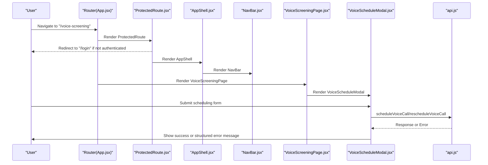

**Diagram sources**
- [App.jsx:115-186](file://app/frontend/src/App.jsx#L115-L186)
- [ProtectedRoute.jsx:4-24](file://app/frontend/src/components/ProtectedRoute.jsx#L4-L24)
- [AppShell.jsx:1-15](file://app/frontend/src/components/AppShell.jsx#L1-L15)
- [NavBar.jsx:251-364](file://app/frontend/src/components/NavBar.jsx#L251-L364)
- [VoiceScreeningPage.jsx:767-781](file://app/frontend/src/pages/VoiceScreeningPage.jsx#L767-L781)
- [VoiceScheduleModal.jsx:57-98](file://app/frontend/src/components/VoiceScheduleModal.jsx#L57-L98)
- [api.js:1585-1613](file://app/frontend/src/lib/api.js#L1585-L1613)

## Detailed Component Analysis

### AppShell
- Composition: Wraps children in a flex column with a sticky header and scrollable content area.
- Providers: Includes ToastProvider for global notifications.
- Styling: Uses Tailwind utilities for sizing, backdrop blur, and shadows.

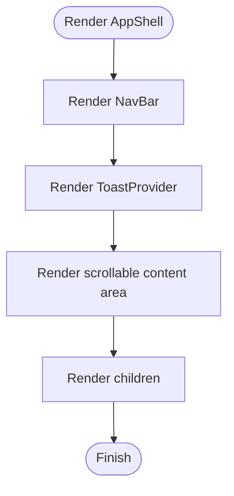

**Diagram sources**
- [AppShell.jsx:4-14](file://app/frontend/src/components/AppShell.jsx#L4-L14)
- [ToastProvider.jsx:3-50](file://app/frontend/src/components/ToastProvider.jsx#L3-L50)

**Section sources**
- [AppShell.jsx:1-15](file://app/frontend/src/components/AppShell.jsx#L1-L15)
- [ToastProvider.jsx:1-51](file://app/frontend/src/components/ToastProvider.jsx#L1-L51)

### NavBar
- Desktop navigation: Primary links with animated active underline.
- Mobile navigation: Bottom tab bar with "More" sheet and backdrop.
- User menu: Avatar dropdown with theme toggle, logout, and admin link.
- Accessibility: Buttons and menus use aria-labels and focus management.

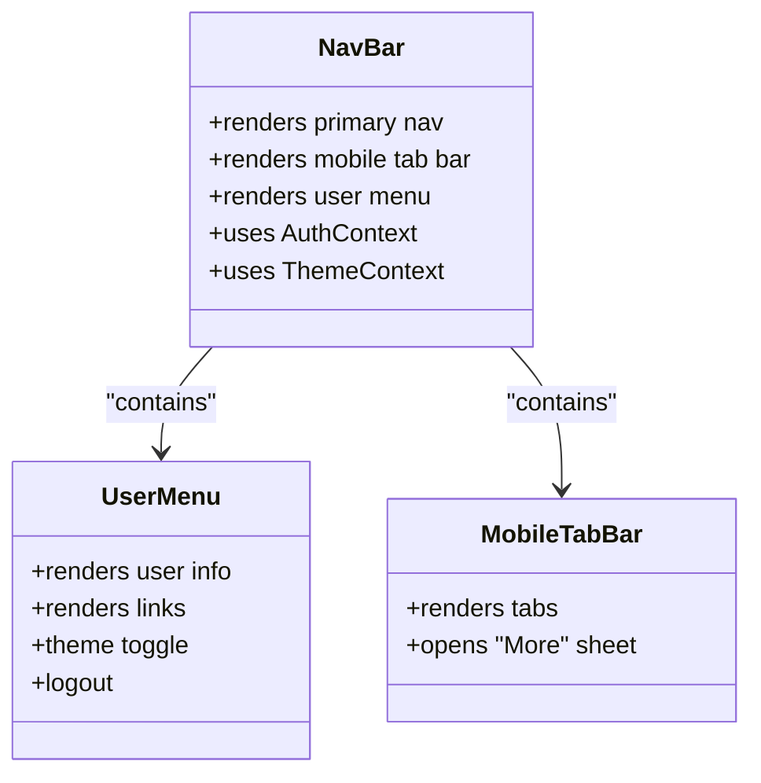

**Diagram sources**
- [NavBar.jsx:34-103](file://app/frontend/src/components/NavBar.jsx#L34-L103)
- [NavBar.jsx:107-191](file://app/frontend/src/components/NavBar.jsx#L107-L191)
- [NavBar.jsx:251-364](file://app/frontend/src/components/NavBar.jsx#L251-L364)

**Section sources**
- [NavBar.jsx:1-364](file://app/frontend/src/components/NavBar.jsx#L1-L364)

### ProtectedRoute
- Gate: Checks user and loading state; redirects to login if not authenticated.
- UX: Loading spinner while resolving auth state.

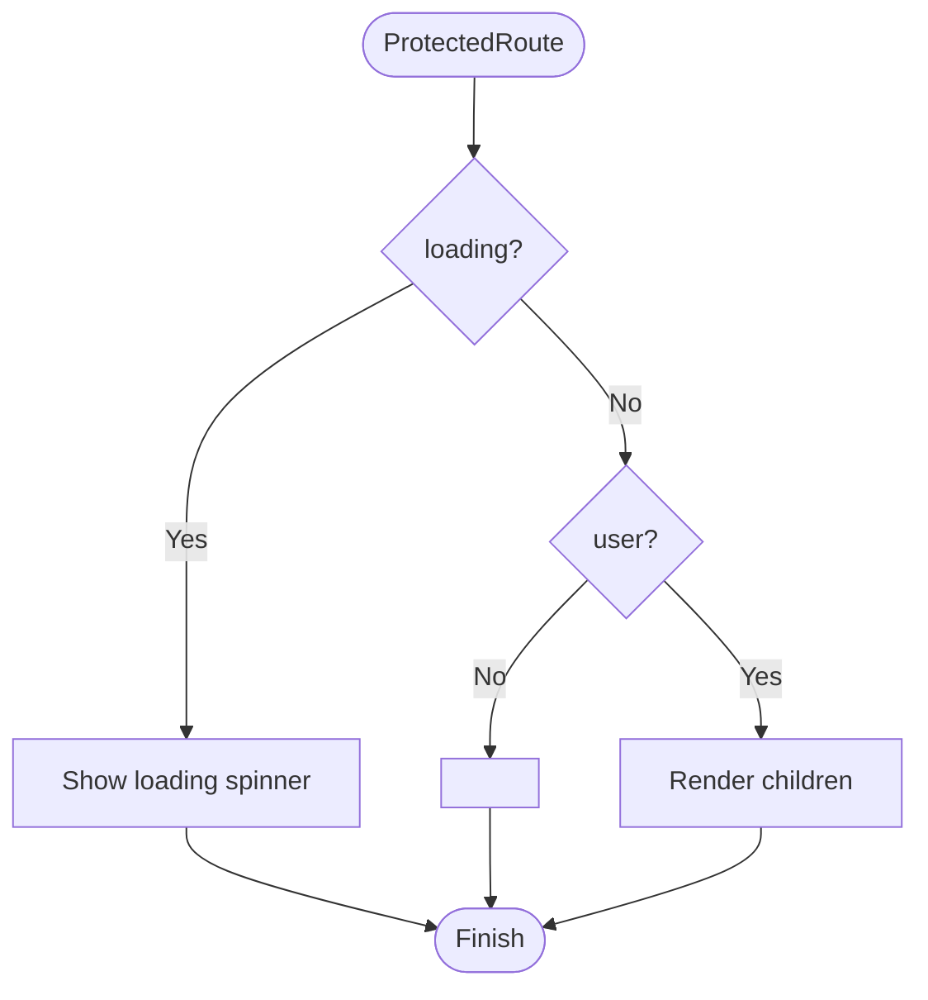

**Diagram sources**
- [ProtectedRoute.jsx:4-24](file://app/frontend/src/components/ProtectedRoute.jsx#L4-L24)

**Section sources**
- [ProtectedRoute.jsx:1-24](file://app/frontend/src/components/ProtectedRoute.jsx#L1-L24)

### UploadForm
- Features:
  - Drag-and-drop resume upload with react-dropzone.
  - Job description modes: text, file, URL with auto-extraction.
  - JD parsing preview with debounced text parsing and file parsing.
  - Skill classification editor with mandatory confirmation.
  - AI weight suggestion panel and manual weight controls (legacy 4-factor and universal 7-factor).
  - Error handling and notices for save/load JD templates.
- Props and handlers:
  - onFileSelect, onJobDescriptionChange, onJobFileSelect, onSubmit, isLoading, selectedFile, selectedJobFile, error, scoringWeights, onScoringWeightsChange, skillOverrides, onSkillOverridesChange.
- Validation:
  - Submit disabled when required fields are missing; short JD warning; file size/type constraints.

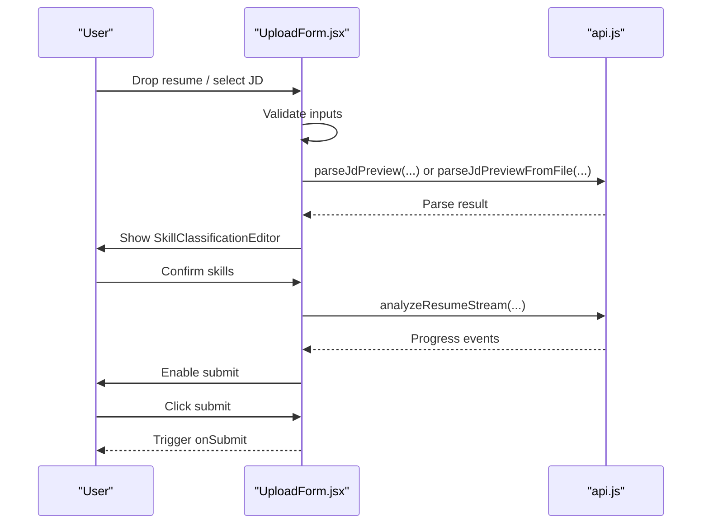

**Diagram sources**
- [UploadForm.jsx:248-356](file://app/frontend/src/components/UploadForm.jsx#L248-L356)
- [UploadForm.jsx:782-800](file://app/frontend/src/components/UploadForm.jsx#L782-L800)
- [api.js:272-385](file://app/frontend/src/lib/api.js#L272-L385)

**Section sources**
- [UploadForm.jsx:85-99](file://app/frontend/src/components/UploadForm.jsx#L85-L99)
- [UploadForm.jsx:161-220](file://app/frontend/src/components/UploadForm.jsx#L161-L220)
- [UploadForm.jsx:248-356](file://app/frontend/src/components/UploadForm.jsx#L248-L356)
- [UploadForm.jsx:707-772](file://app/frontend/src/components/UploadForm.jsx#L707-L772)

### ResultCard
- Displays recommendation, risk badge, and score breakdown with expandable details.
- Integrates narrative polling with adaptive delays and fallback handling.
- Outcome recording and feedback collection.
- Email generation modal with draft management.

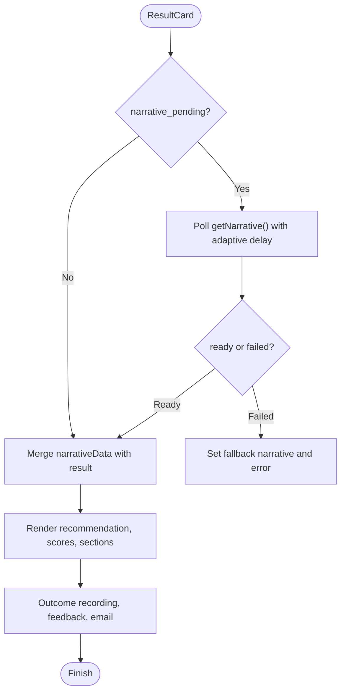

**Diagram sources**
- [ResultCard.jsx:657-735](file://app/frontend/src/components/ResultCard.jsx#L657-L735)
- [ResultCard.jsx:558-640](file://app/frontend/src/components/ResultCard.jsx#L558-L640)

**Section sources**
- [ResultCard.jsx:558-640](file://app/frontend/src/components/ResultCard.jsx#L558-L640)
- [ResultCard.jsx:200-490](file://app/frontend/src/components/ResultCard.jsx#L200-L490)

### ScoreGauge
- Visualizes fit score with threshold-based color and label.
- Handles pending state with dashed ring and "Pending" label.

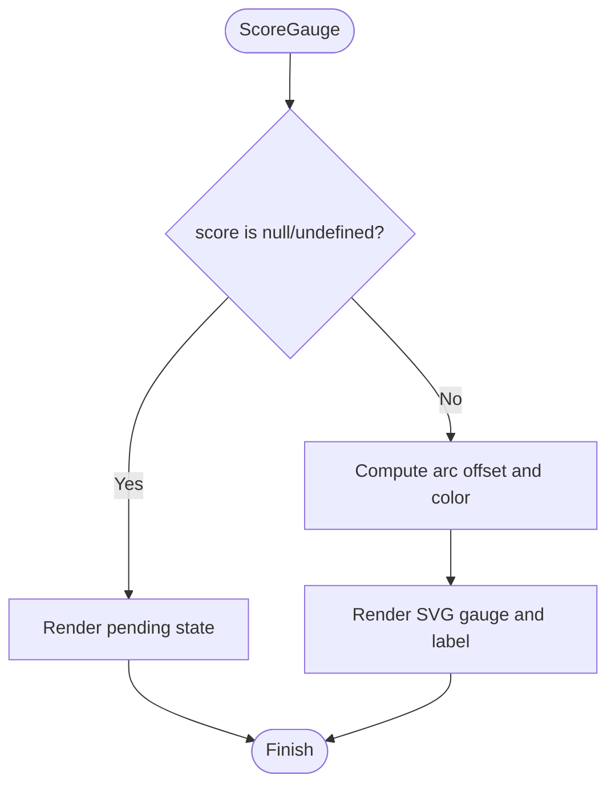

**Diagram sources**
- [ScoreGauge.jsx:1-97](file://app/frontend/src/components/ScoreGauge.jsx#L1-L97)

**Section sources**
- [ScoreGauge.jsx:1-97](file://app/frontend/src/components/ScoreGauge.jsx#L1-L97)

### Timeline
- Sorts and renders work history with optional gaps and short-tenure indicators.

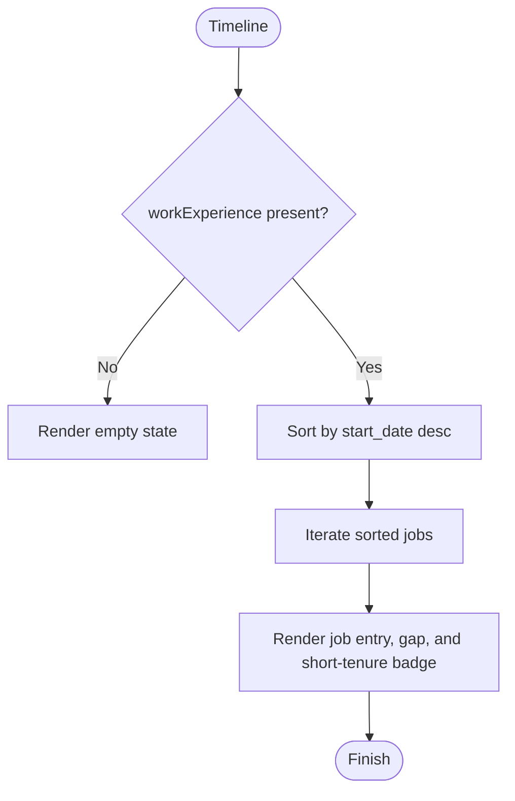

**Diagram sources**
- [Timeline.jsx:11-123](file://app/frontend/src/components/Timeline.jsx#L11-L123)

**Section sources**
- [Timeline.jsx:11-123](file://app/frontend/src/components/Timeline.jsx#L11-L123)

### SkillsRadar
- Categorizes skills, computes totals, and renders a responsive bar chart with category chips.

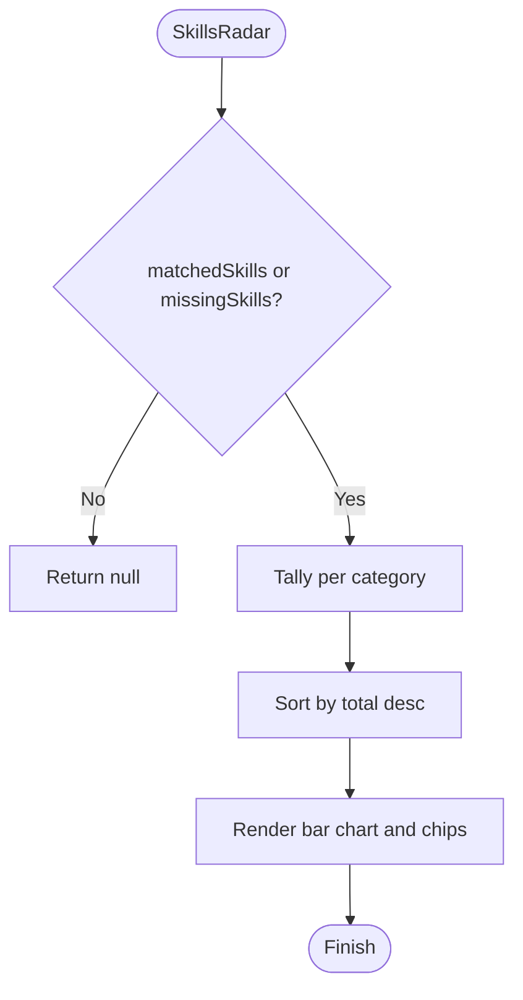

**Diagram sources**
- [SkillsRadar.jsx:118-140](file://app/frontend/src/components/SkillsRadar.jsx#L118-L140)
- [SkillsRadar.jsx:200-239](file://app/frontend/src/components/SkillsRadar.jsx#L200-L239)

**Section sources**
- [SkillsRadar.jsx:118-140](file://app/frontend/src/components/SkillsRadar.jsx#L118-L140)
- [SkillsRadar.jsx:200-239](file://app/frontend/src/components/SkillsRadar.jsx#L200-L239)

### VoiceScheduleModal
- **Enhanced** Improved error handling with support for both single error responses and arrays of validation errors from backend.
- Features:
  - Candidate selection with pre-selection support for existing sessions.
  - Phone number input with E.164 format validation.
  - DateTime picker for scheduling future calls.
  - Success state with animated confirmation.
  - Structured error message extraction from backend validation responses.
- Error handling improvements:
  - Processes `err.response?.data?.detail` as either a single error object or array of validation errors.
  - Extracts user-friendly messages using `msg || message || JSON.stringify(e)` for each validation error.
  - Joins multiple error messages with comma separation for comprehensive feedback.
- Props and handlers:
  - onClose, onScheduled, preselectedCandidate, preselectedJdId, editSession.
- Validation:
  - Client-side validation for required fields before submission.
  - Server-side validation with enhanced error reporting.

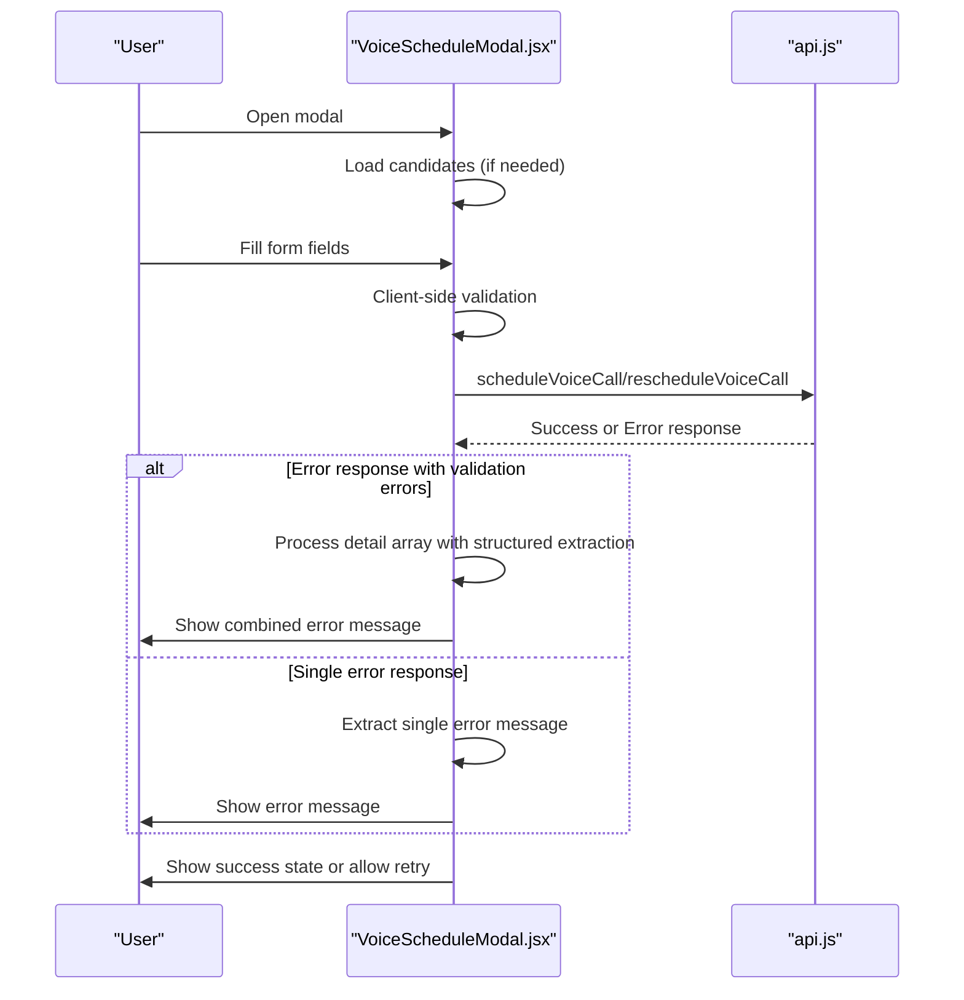

**Diagram sources**
- [VoiceScheduleModal.jsx:57-98](file://app/frontend/src/components/VoiceScheduleModal.jsx#L57-L98)
- [VoiceScheduleModal.jsx:89-98](file://app/frontend/src/components/VoiceScheduleModal.jsx#L89-L98)
- [api.js:1585-1613](file://app/frontend/src/lib/api.js#L1585-L1613)

**Section sources**
- [VoiceScheduleModal.jsx:12-98](file://app/frontend/src/components/VoiceScheduleModal.jsx#L12-L98)
- [VoiceScheduleModal.jsx:89-98](file://app/frontend/src/components/VoiceScheduleModal.jsx#L89-L98)

## Dependency Analysis
- Routing and layout:
  - App.jsx composes ProtectedRoute, SubscriptionProvider, and AppShell around pages.
  - Dashboard.jsx composes UploadForm and orchestrates analysis via SSE.
  - VoiceScreeningPage.jsx composes VoiceScheduleModal for voice call scheduling.
- Authentication:
  - ProtectedRoute depends on AuthContext for user and loading state.
  - AuthContext manages login, logout, refresh, and idle timeout.
- State and subscriptions:
  - useSubscription provides usage checks, plan limits, and optimistic refresh after analysis.
- API integration:
  - api.js centralizes Axios configuration, interceptors, retries, and analysis endpoints (SSE streaming).
  - Voice API functions for scheduling and managing voice screening sessions.
- Notifications:
  - ToastProvider provides global toast styling and behavior.

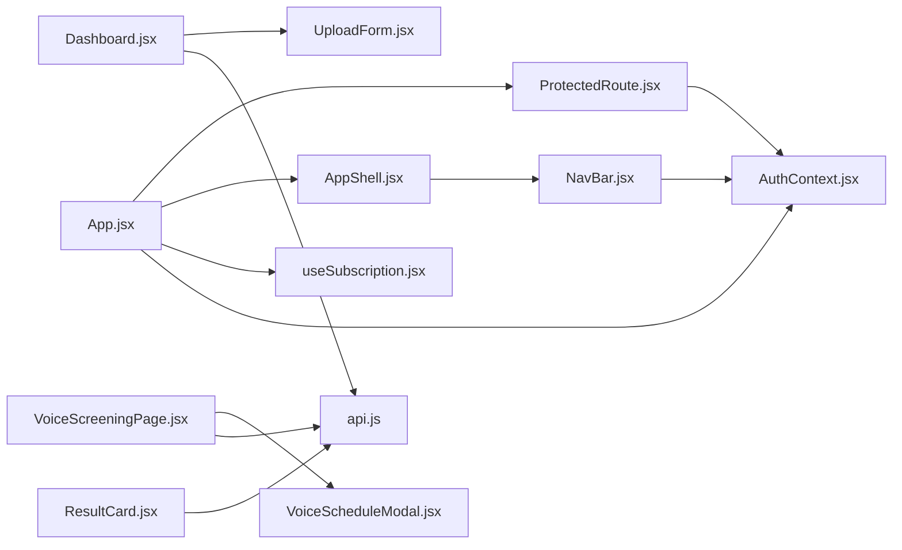

**Diagram sources**
- [App.jsx:104-196](file://app/frontend/src/App.jsx#L104-L196)
- [ProtectedRoute.jsx:4-24](file://app/frontend/src/components/ProtectedRoute.jsx#L4-L24)
- [AppShell.jsx:1-15](file://app/frontend/src/components/AppShell.jsx#L1-L15)
- [NavBar.jsx:251-364](file://app/frontend/src/components/NavBar.jsx#L251-L364)
- [Dashboard.jsx:204-335](file://app/frontend/src/pages/Dashboard.jsx#L204-L335)
- [VoiceScreeningPage.jsx:767-781](file://app/frontend/src/pages/VoiceScreeningPage.jsx#L767-L781)
- [useSubscription.jsx:7-164](file://app/frontend/src/hooks/useSubscription.jsx#L7-L164)
- [AuthContext.jsx:8-137](file://app/frontend/src/contexts/AuthContext.jsx#L8-L137)
- [api.js:1-141](file://app/frontend/src/lib/api.js#L1-L141)

**Section sources**
- [App.jsx:104-196](file://app/frontend/src/App.jsx#L104-L196)
- [Dashboard.jsx:204-335](file://app/frontend/src/pages/Dashboard.jsx#L204-L335)
- [VoiceScreeningPage.jsx:767-781](file://app/frontend/src/pages/VoiceScreeningPage.jsx#L767-L781)
- [useSubscription.jsx:1-200](file://app/frontend/src/hooks/useSubscription.jsx#L1-L200)
- [AuthContext.jsx:1-144](file://app/frontend/src/contexts/AuthContext.jsx#L1-L144)
- [api.js:1-141](file://app/frontend/src/lib/api.js#L1-L141)

## Performance Considerations
- Debounced JD parsing reduces unnecessary API calls during typing.
- Adaptive polling for narrative minimizes network overhead and respects backend latency.
- SSE streaming avoids long polling and provides progressive updates.
- Lazy loading of routes and pages improves initial load performance.
- Tailwind utilities enable efficient styling without heavy CSS frameworks.
- VoiceScheduleModal uses client-side validation to reduce unnecessary API calls.

## Troubleshooting Guide
- Authentication issues:
  - ProtectedRoute shows a loading spinner while resolving auth state; redirects to login if user is absent.
  - AuthContext handles refresh failures and dispatches a logout event; idle timeout triggers logout.
- Network and retries:
  - api.js retries transient 5xx and network errors with exponential backoff; CSRF tokens refreshed automatically.
- UploadForm:
  - Submit disabled when required fields are missing; short JD warning; file size/type constraints enforced.
  - JD parsing errors show retry option; saved JD library loads templates on mount.
- ResultCard:
  - Polling stops when narrative is ready or fails; fallback narrative displayed with notice; error banners shown for narrative failures.
- VoiceScheduleModal:
  - **Enhanced** Error handling now processes both single error responses and arrays of validation errors from backend.
  - Structured error message extraction provides comprehensive user feedback for form validation failures.
  - Success state with animated confirmation provides clear user feedback for successful scheduling.

**Section sources**
- [ProtectedRoute.jsx:4-24](file://app/frontend/src/components/ProtectedRoute.jsx#L4-L24)
- [AuthContext.jsx:56-107](file://app/frontend/src/contexts/AuthContext.jsx#L56-L107)
- [api.js:60-140](file://app/frontend/src/lib/api.js#L60-L140)
- [UploadForm.jsx:161-220](file://app/frontend/src/components/UploadForm.jsx#L161-L220)
- [ResultCard.jsx:657-735](file://app/frontend/src/components/ResultCard.jsx#L657-L735)
- [VoiceScheduleModal.jsx:89-98](file://app/frontend/src/components/VoiceScheduleModal.jsx#L89-L98)

## Conclusion
The component library provides a cohesive, accessible, and responsive foundation for Resume AI's analysis workflow. AppShell and NavBar establish consistent layout and navigation; ProtectedRoute enforces authentication; UploadForm and ResultCard orchestrate the core user journey with robust validation, error handling, and progressive feedback. VoiceScheduleModal enhances the voice screening experience with improved error handling that processes both single error responses and arrays of validation errors from the backend. Supporting providers and hooks manage subscriptions, auth, and global notifications, enabling scalable and maintainable UI composition.

## Appendices

### Component Composition Patterns
- Layout composition: AppShell wraps pages; ProtectedRoute guards routes; SubscriptionProvider injects usage state.
- Form composition: UploadForm delegates JD parsing, skill confirmation, and weight management to child panels and editors.
- Result composition: ResultCard composes ScoreGauge, Timeline, and SkillsRadar; supports collapsible sections and modals.
- Voice screening composition: VoiceScreeningPage composes VoiceScheduleModal for scheduling and managing voice calls.

**Section sources**
- [App.jsx:73-102](file://app/frontend/src/App.jsx#L73-L102)
- [Dashboard.jsx:294-308](file://app/frontend/src/pages/Dashboard.jsx#L294-L308)
- [ResultCard.jsx:558-640](file://app/frontend/src/components/ResultCard.jsx#L558-L640)
- [VoiceScreeningPage.jsx:767-781](file://app/frontend/src/pages/VoiceScreeningPage.jsx#L767-L781)

### Prop Validation and Accessibility
- Props: Components expose explicit props for state and callbacks; internal validation prevents rendering errors.
- Accessibility: Buttons include aria-labels; collapsible sections use buttons; tooltips and legends improve readability.
- VoiceScheduleModal: Enhanced error handling with proper ARIA labels for error messages and success states.

**Section sources**
- [UploadForm.jsx:85-99](file://app/frontend/src/components/UploadForm.jsx#L85-L99)
- [ResultCard.jsx:59-67](file://app/frontend/src/components/ResultCard.jsx#L59-L67)
- [NavBar.jsx:334-346](file://app/frontend/src/components/NavBar.jsx#L334-L346)
- [VoiceScheduleModal.jsx:162-167](file://app/frontend/src/components/VoiceScheduleModal.jsx#L162-L167)

### Styling Customization with TailwindCSS
- Components rely on Tailwind utilities for layout, colors, spacing, and responsiveness.
- Providers like ToastProvider customize toast appearance globally.
- Theme-aware components integrate with ThemeContext (referenced).
- VoiceScheduleModal uses brand-specific colors and animations for visual feedback.

**Section sources**
- [ToastProvider.jsx:3-50](file://app/frontend/src/components/ToastProvider.jsx#L3-L50)
- [NavBar.jsx:272-361](file://app/frontend/src/components/NavBar.jsx#L272-L361)
- [VoiceScheduleModal.jsx:100-130](file://app/frontend/src/components/VoiceScheduleModal.jsx#L100-L130)

### State Management Integration
- AuthContext: Centralized authentication state and lifecycle.
- useSubscription: Usage checks, plan limits, and optimistic refresh after analysis.
- Dashboard: Manages local state for selected files, JD, weights, and SSE progress.
- VoiceScreeningPage: Manages voice screening state including sessions, settings, and modal visibility.

**Section sources**
- [AuthContext.jsx:8-137](file://app/frontend/src/contexts/AuthContext.jsx#L8-L137)
- [useSubscription.jsx:7-164](file://app/frontend/src/hooks/useSubscription.jsx#L7-L164)
- [Dashboard.jsx:209-242](file://app/frontend/src/pages/Dashboard.jsx#L209-L242)
- [VoiceScreeningPage.jsx:168-182](file://app/frontend/src/pages/VoiceScreeningPage.jsx#L168-L182)

### Responsive Design and Cross-Browser Compatibility
- Responsive breakpoints and mobile-first patterns are evident in NavBar and ResultCard.
- Drag-and-drop and form controls adapt across devices.
- Cross-browser compatibility is supported by modern React toolchain and Tailwind utilities.
- VoiceScheduleModal uses Framer Motion for smooth animations across different browsers.

**Section sources**
- [NavBar.jsx:107-191](file://app/frontend/src/components/NavBar.jsx#L107-L191)
- [ResultCard.jsx:200-490](file://app/frontend/src/components/ResultCard.jsx#L200-L490)
- [VoiceScheduleModal.jsx:100-130](file://app/frontend/src/components/VoiceScheduleModal.jsx#L100-L130)