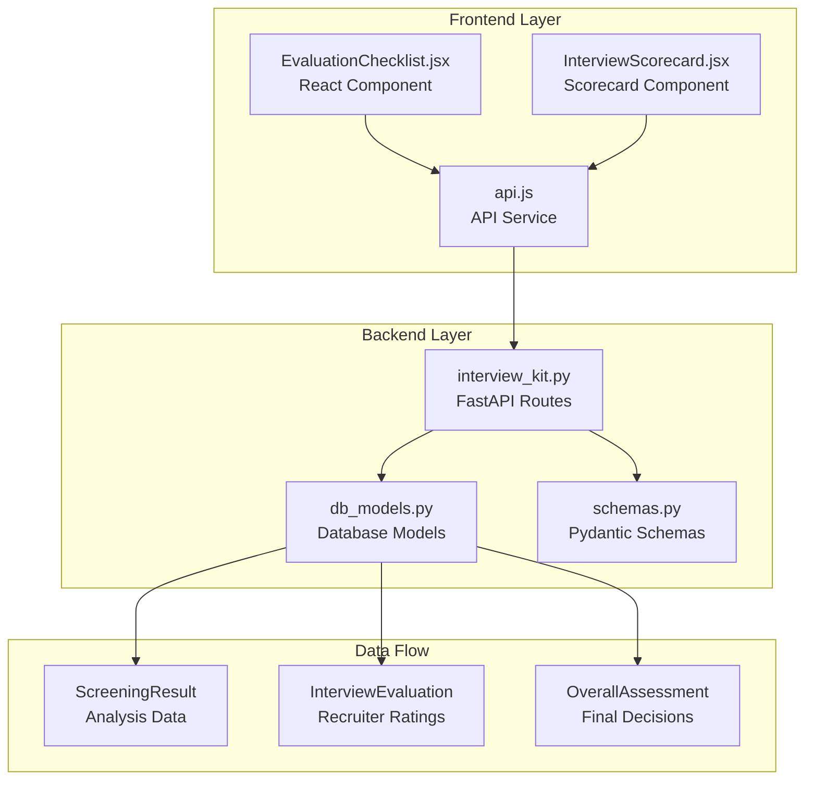
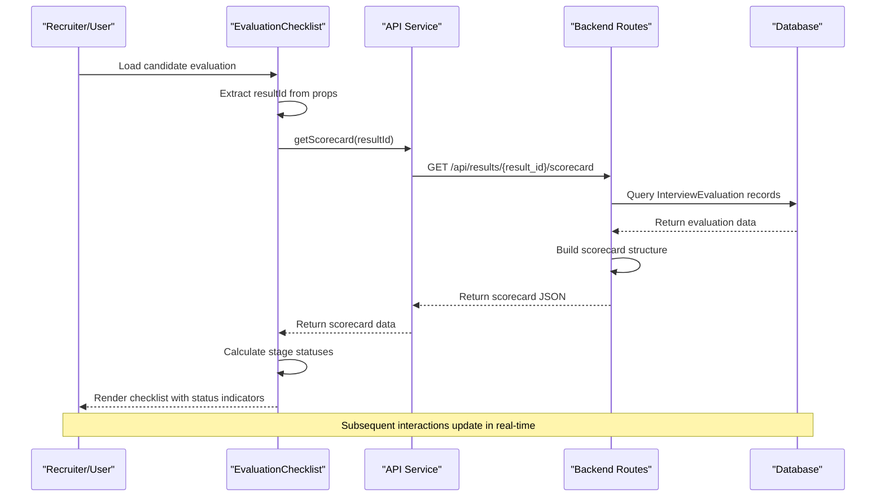
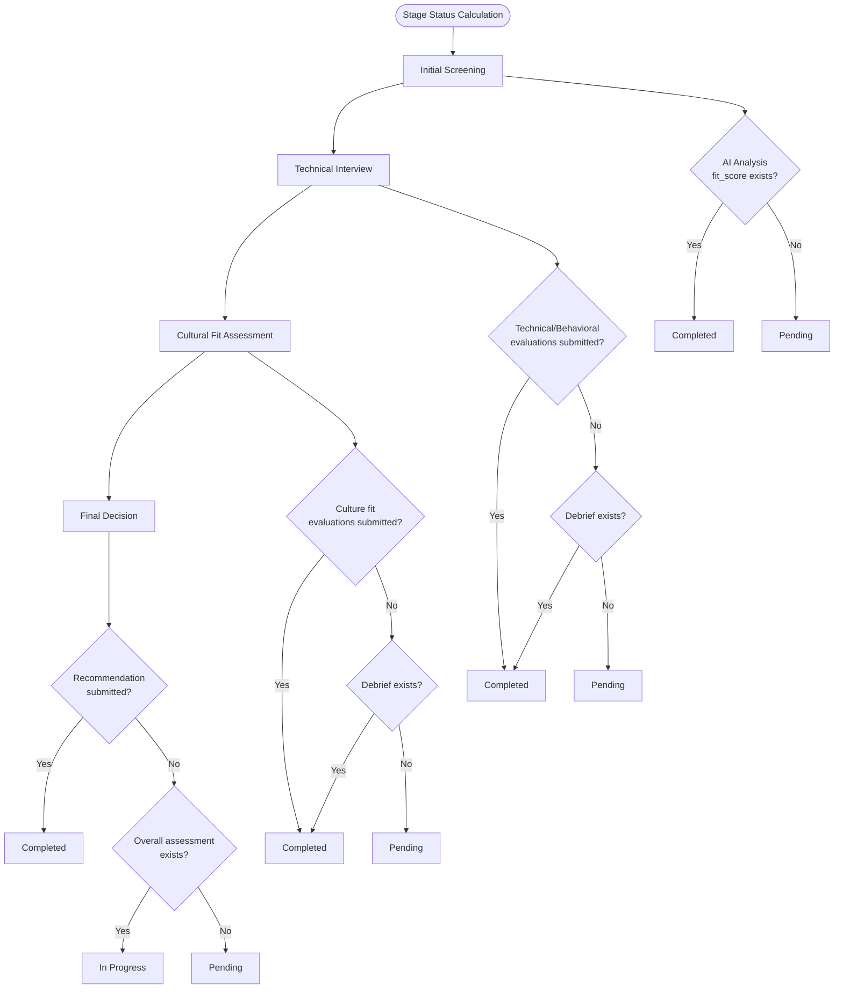
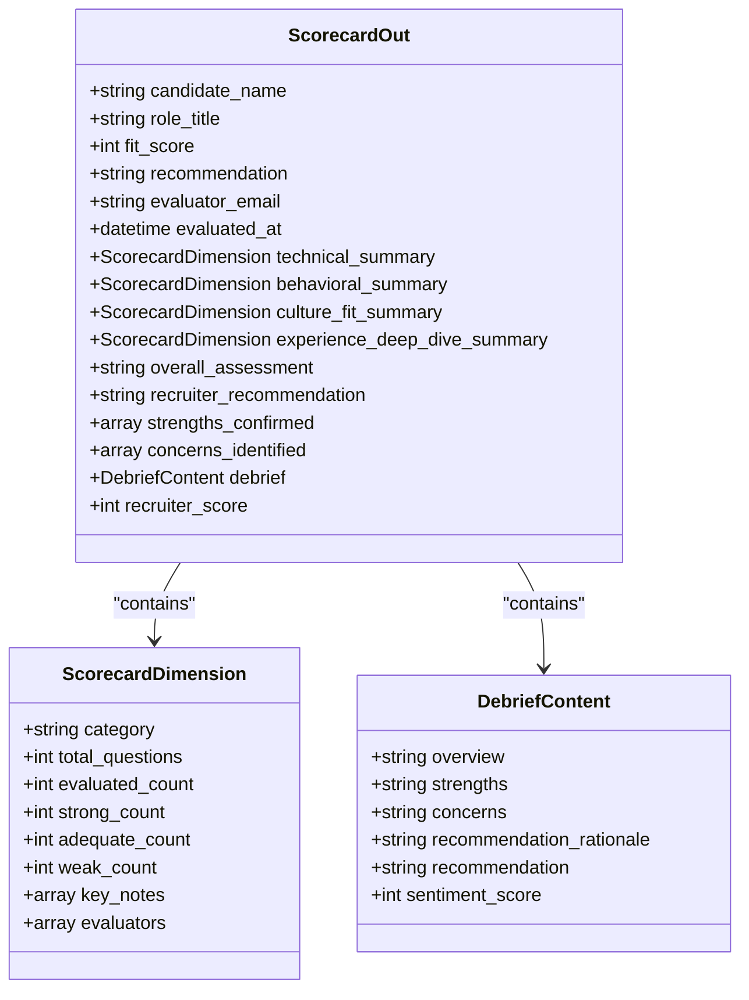
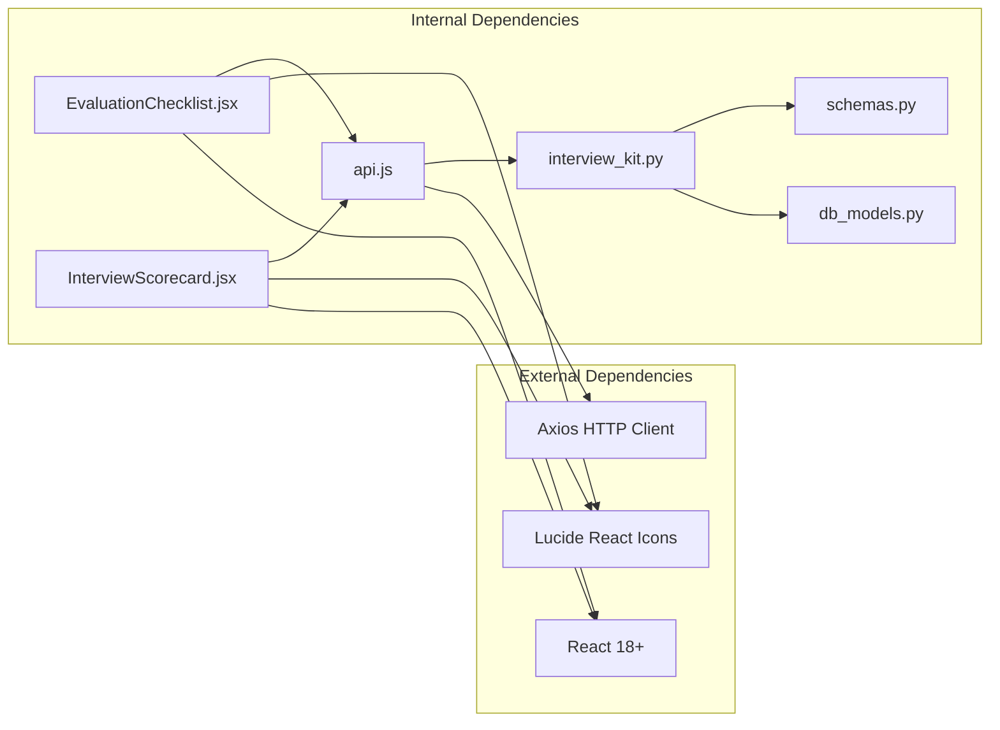

# Evaluation Checklist Component

<cite>
**Referenced Files in This Document**
- [EvaluationChecklist.jsx](file://app/frontend/src/components/EvaluationChecklist.jsx)
- [InterviewScorecard.jsx](file://app/frontend/src/components/InterviewScorecard.jsx)
- [api.js](file://app/frontend/src/lib/api.js)
- [interview_kit.py](file://app/backend/routes/interview_kit.py)
- [db_models.py](file://app/backend/models/db_models.py)
- [schemas.py](file://app/backend/models/schemas.py)
- [CandidateProfilePage.jsx](file://app/frontend/src/pages/CandidateProfilePage.jsx)
</cite>

## Table of Contents
1. [Introduction](#introduction)
2. [Project Structure](#project-structure)
3. [Core Components](#core-components)
4. [Architecture Overview](#architecture-overview)
5. [Detailed Component Analysis](#detailed-component-analysis)
6. [Dependency Analysis](#dependency-analysis)
7. [Performance Considerations](#performance-considerations)
8. [Troubleshooting Guide](#troubleshooting-guide)
9. [Conclusion](#conclusion)

## Introduction
The Evaluation Checklist Component is a frontend React component designed to visualize the end-to-end candidate evaluation pipeline. It displays four key stages of the recruitment process: Initial Screening, Technical Interview, Cultural Fit Assessment, and Final Decision. The component dynamically determines each stage's status based on AI analysis results and recruiter evaluations, providing stakeholders with real-time visibility into the candidate's journey through the evaluation funnel.

## Project Structure
The Evaluation Checklist integrates seamlessly with the broader Resume AI platform, connecting frontend React components with backend FastAPI services and database models. The component leverages the existing API infrastructure to fetch scorecard data and presents it in an intuitive, status-driven interface.

**Diagram sources**
- [EvaluationChecklist.jsx:1-223](file://app/frontend/src/components/EvaluationChecklist.jsx#L1-L223)
- [InterviewScorecard.jsx:1-335](file://app/frontend/src/components/InterviewScorecard.jsx#L1-L335)
- [api.js:1-800](file://app/frontend/src/lib/api.js#L1-L800)
- [interview_kit.py:1-435](file://app/backend/routes/interview_kit.py#L1-L435)

**Section sources**
- [EvaluationChecklist.jsx:1-223](file://app/frontend/src/components/EvaluationChecklist.jsx#L1-L223)
- [InterviewScorecard.jsx:1-335](file://app/frontend/src/components/InterviewScorecard.jsx#L1-L335)
- [api.js:1-800](file://app/frontend/src/lib/api.js#L1-L800)
- [interview_kit.py:1-435](file://app/backend/routes/interview_kit.py#L1-L435)

## Core Components
The Evaluation Checklist consists of several interconnected components that work together to provide comprehensive evaluation visibility:

### Primary Components
- **EvaluationChecklist**: Main component displaying the four-stage evaluation pipeline
- **InterviewScorecard**: Detailed scorecard component for technical interviews
- **API Service**: Centralized communication layer for backend integration
- **Backend Routes**: FastAPI endpoints managing evaluation data

### Key Features
- Dynamic stage status calculation based on AI analysis and recruiter input
- Real-time progress tracking with visual indicators
- Responsive design supporting various screen sizes
- Comprehensive error handling and loading states

**Section sources**
- [EvaluationChecklist.jsx:50-121](file://app/frontend/src/components/EvaluationChecklist.jsx#L50-L121)
- [InterviewScorecard.jsx:87-111](file://app/frontend/src/components/InterviewScorecard.jsx#L87-L111)

## Architecture Overview
The Evaluation Checklist follows a client-server architecture pattern with clear separation of concerns between frontend presentation and backend data processing.

**Diagram sources**
- [EvaluationChecklist.jsx:63-75](file://app/frontend/src/components/EvaluationChecklist.jsx#L63-L75)
- [api.js:145-186](file://app/frontend/src/lib/api.js#L145-L186)
- [interview_kit.py:145-243](file://app/backend/routes/interview_kit.py#L145-L243)

## Detailed Component Analysis

### EvaluationChecklist Component
The EvaluationChecklist component serves as the primary interface for tracking candidate evaluation progress through four distinct stages.

#### Stage Definitions and Status Logic
Each evaluation stage has specific criteria for determining completion status:

**Diagram sources**
- [EvaluationChecklist.jsx:78-121](file://app/frontend/src/components/EvaluationChecklist.jsx#L78-L121)

#### Visual Design and User Experience
The component implements a clean, status-driven interface with three distinct visual states:

| Status | Visual Indicator | Color Scheme | Meaning |
|--------|------------------|--------------|---------|
| Completed | Green checkmark circle | Emerald 50/500 | Stage fully completed |
| In Progress | Blue animated pulse | Blue 50/500 | Active evaluation in progress |
| Pending | Gray outline circle | Amber 50/400 | Stage awaiting evaluation |

**Section sources**
- [EvaluationChecklist.jsx:32-48](file://app/frontend/src/components/EvaluationChecklist.jsx#L32-L48)
- [EvaluationChecklist.jsx:168-218](file://app/frontend/src/components/EvaluationChecklist.jsx#L168-L218)

### InterviewScorecard Component
The InterviewScorecard provides detailed evaluation data and integrates with the checklist to provide comprehensive assessment visibility.

#### Data Structure and Integration
The scorecard component consumes backend data through the `/api/results/{result_id}/scorecard` endpoint, aggregating evaluation data from multiple sources:

**Diagram sources**
- [interview_kit.py:146-243](file://app/backend/routes/interview_kit.py#L146-L243)
- [schemas.py:1-200](file://app/backend/models/schemas.py#L1-L200)

**Section sources**
- [InterviewScorecard.jsx:87-111](file://app/frontend/src/components/InterviewScorecard.jsx#L87-L111)
- [interview_kit.py:146-243](file://app/backend/routes/interview_kit.py#L146-L243)

### API Integration and Data Flow
The component relies on a robust API layer that handles authentication, error handling, and data transformation.

#### Backend Data Model Integration
The evaluation system integrates with multiple database models to provide comprehensive evaluation tracking:

| Model | Purpose | Relationship |
|-------|---------|--------------|
| ScreeningResult | Stores AI analysis results and candidate data | Primary data source |
| InterviewEvaluation | Captures individual question ratings | Many-to-one relationship |
| OverallAssessment | Contains final recommendations and debriefs | One-to-one per evaluator |
| User | Authentication and authorization context | Many-to-one relationship |

**Section sources**
- [db_models.py:187-200](file://app/backend/models/db_models.py#L187-L200)
- [interview_kit.py:13-21](file://app/backend/routes/interview_kit.py#L13-L21)

## Dependency Analysis
The Evaluation Checklist component has well-defined dependencies that ensure maintainable and testable code.

**Diagram sources**
- [EvaluationChecklist.jsx:1-3](file://app/frontend/src/components/EvaluationChecklist.jsx#L1-L3)
- [api.js:1-8](file://app/frontend/src/lib/api.js#L1-L8)
- [interview_kit.py:1-26](file://app/backend/routes/interview_kit.py#L1-L26)

### Component Coupling and Cohesion
The component maintains high cohesion around evaluation tracking while minimizing coupling through the centralized API service. The design allows for easy testing and maintenance.

**Section sources**
- [EvaluationChecklist.jsx:1-223](file://app/frontend/src/components/EvaluationChecklist.jsx#L1-L223)
- [api.js:1-800](file://app/frontend/src/lib/api.js#L1-L800)

## Performance Considerations
The Evaluation Checklist is optimized for performance through several key strategies:

### Loading States and User Experience
- Skeleton loading indicators during initial data fetch
- Graceful degradation when scorecard data is unavailable
- Efficient status calculations using memoized computations

### Network Optimization
- Single API call per evaluation to minimize network overhead
- Conditional data fetching based on result availability
- Error boundaries to prevent cascading failures

### Memory Management
- Proper cleanup of event listeners and timers
- Efficient rendering of large evaluation lists
- Minimal state updates to reduce re-renders

## Troubleshooting Guide

### Common Issues and Solutions

#### Evaluation Data Not Loading
**Symptoms**: Checklist shows loading state indefinitely
**Causes**: 
- Missing resultId prop
- Network connectivity issues
- Backend API unavailability

**Solutions**:
- Verify result object contains valid result_id property
- Check browser developer tools for network errors
- Confirm backend service health and authentication

#### Stage Status Incorrect
**Symptoms**: Stages show wrong completion status
**Causes**:
- Missing fit_score in screening result
- Incomplete evaluation submissions
- Database synchronization delays

**Solutions**:
- Ensure AI analysis has completed and fit_score is populated
- Verify all evaluation questions have been rated
- Check for database transaction conflicts

#### Visual Rendering Issues
**Symptoms**: Checklist displays incorrectly or crashes
**Causes**:
- Missing or corrupted evaluation data
- React component lifecycle issues
- CSS styling conflicts

**Solutions**:
- Validate evaluation data structure matches expected schema
- Check for proper component mounting/unmounting
- Inspect CSS specificity conflicts

**Section sources**
- [EvaluationChecklist.jsx:63-75](file://app/frontend/src/components/EvaluationChecklist.jsx#L63-L75)
- [InterviewScorecard.jsx:96-111](file://app/frontend/src/components/InterviewScorecard.jsx#L96-L111)

## Conclusion
The Evaluation Checklist Component represents a sophisticated solution for tracking candidate evaluation progress in the Resume AI platform. Its modular design, comprehensive status tracking, and seamless integration with backend systems provide recruiters and stakeholders with valuable insights into the evaluation pipeline. The component's emphasis on user experience, performance optimization, and maintainable architecture ensures it will serve as a reliable foundation for the platform's evaluation capabilities.

The implementation demonstrates best practices in frontend development, including proper state management, error handling, and responsive design. The component's integration with the broader evaluation ecosystem showcases the platform's commitment to providing comprehensive, data-driven recruitment solutions.