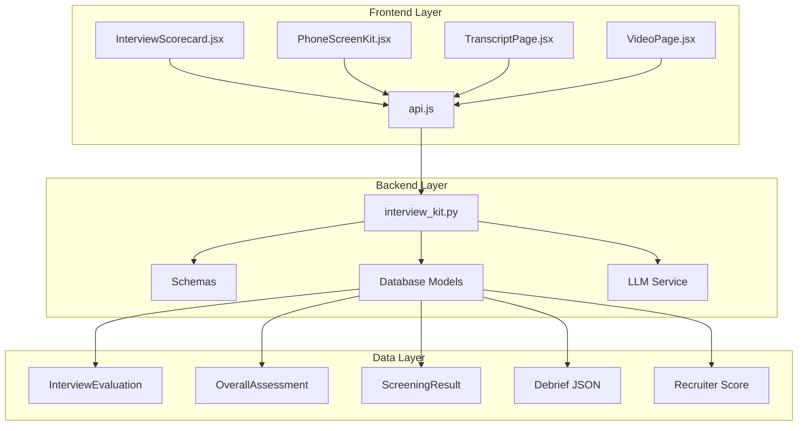
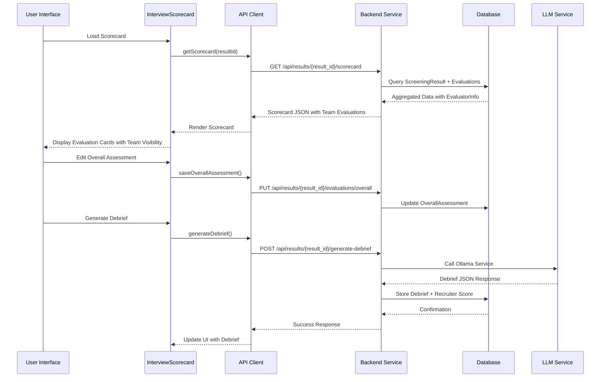
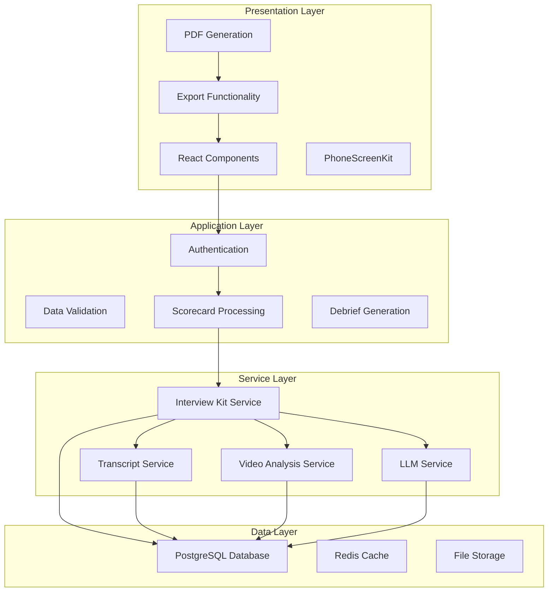
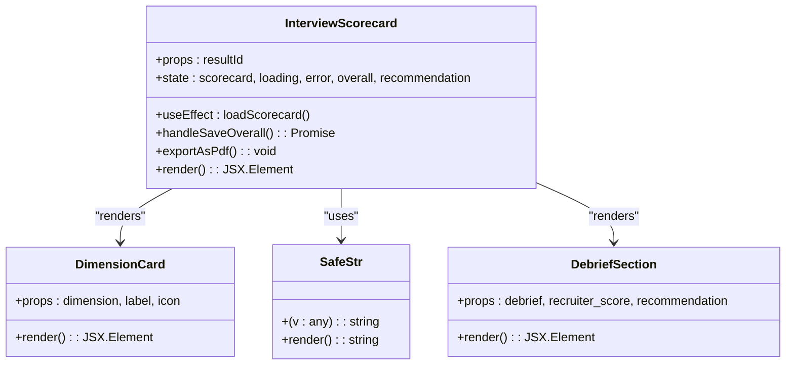
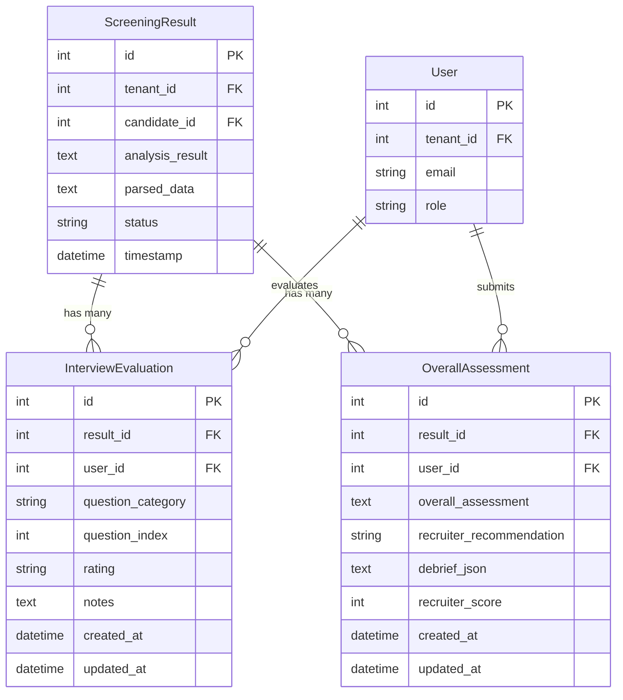
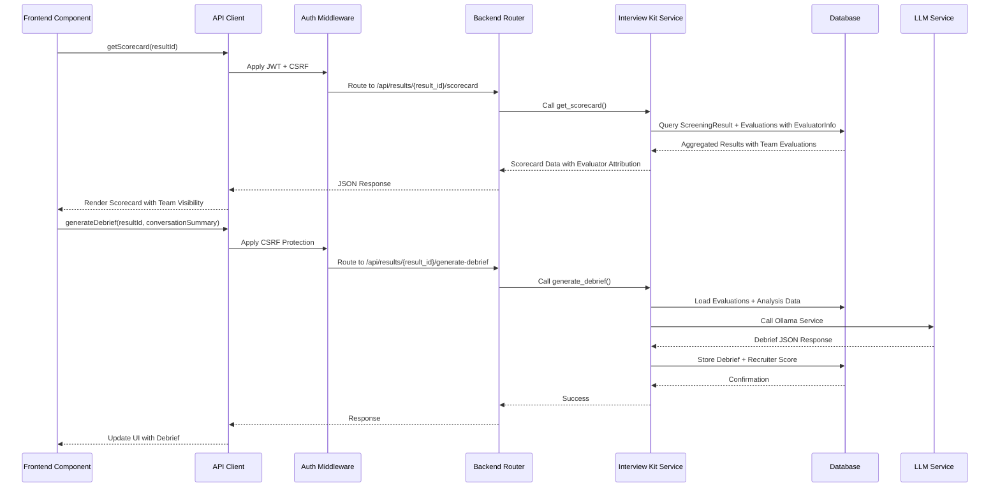
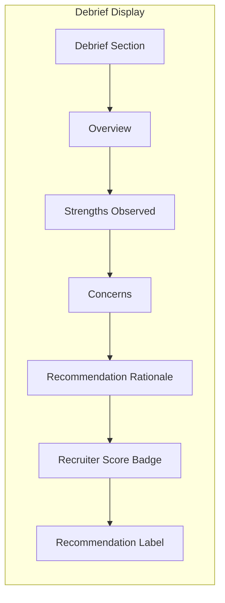
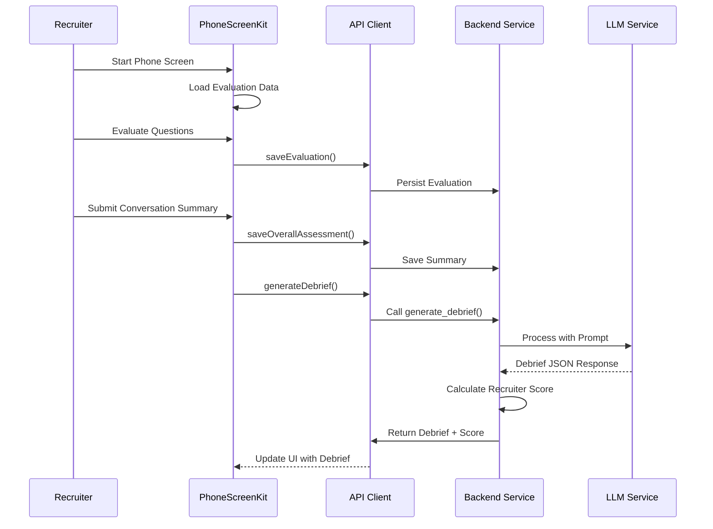
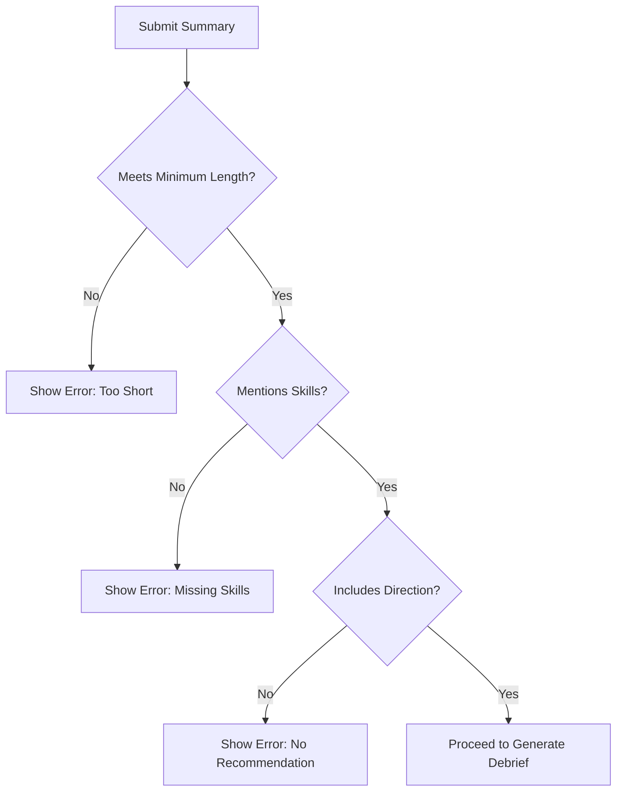
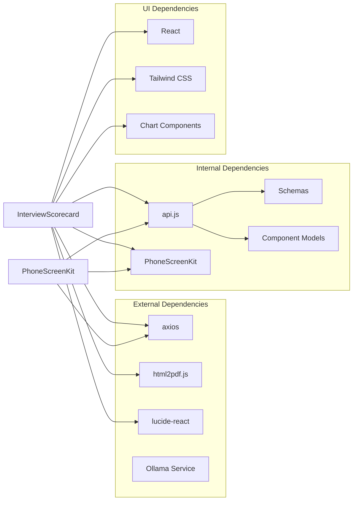

# Interview Scorecard Component

<cite>
**Referenced Files in This Document**
- [InterviewScorecard.jsx](file://app/frontend/src/components/InterviewScorecard.jsx)
- [PhoneScreenKit.jsx](file://app/frontend/src/components/PhoneScreenKit.jsx)
- [interview_kit.py](file://app/backend/routes/interview_kit.py)
- [api.js](file://app/frontend/src/lib/api.js)
- [schemas.py](file://app/backend/models/schemas.py)
- [db_models.py](file://app/backend/models/db_models.py)
- [TranscriptPage.jsx](file://app/frontend/src/pages/TranscriptPage.jsx)
- [VideoPage.jsx](file://app/frontend/src/pages/VideoPage.jsx)
- [llm_service.py](file://app/backend/services/llm_service.py)
- [requirements.txt](file://requirements.txt)
</cite>

## Update Summary
**Changes Made**
- Enhanced InterviewScorecard.jsx with automatic content visibility mechanism that calculates evaluation counts and automatically hides empty scorecards when no assessments have been completed
- Improved debrief display capabilities with comprehensive team evaluation visibility and structured content sections
- Enhanced phone screening workflow with validation and automated debrief generation
- Updated backend integration with comprehensive debrief generation and recruiter score calculation
- Enhanced frontend debrief display with color-coded recommendations and structured content formatting

## Table of Contents
1. [Introduction](#introduction)
2. [Project Structure](#project-structure)
3. [Core Components](#core-components)
4. [Architecture Overview](#architecture-overview)
5. [Detailed Component Analysis](#detailed-component-analysis)
6. [Enhanced Debrief Display Capabilities](#enhanced-debrief-display-capabilities)
7. [Recruiter Score Integration System](#recruiter-score-integration-system)
8. [Phone Screening Workflow Enhancement](#phone-screening-workflow-enhancement)
9. [Automatic Content Visibility Mechanism](#automatic-content-visibility-mechanism)
10. [Structured Debrief Content Management](#structured-debrief-content-management)
11. [Recruiter Score Calculation Algorithm](#recruiter-score-calculation-algorithm)
12. [Conversation Summary Validation](#conversation-summary-validation)
13. [Fallback Mechanisms and Reliability](#fallback-mechanisms-and-reliability)
14. [UI Integration and Display](#ui-integration-and-display)
15. [Dependency Analysis](#dependency-analysis)
16. [Performance Considerations](#performance-considerations)
17. [Troubleshooting Guide](#troubleshooting-guide)
18. [Conclusion](#conclusion)

## Introduction

The Interview Scorecard Component is a comprehensive evaluation and reporting system designed for AI-powered interview analysis. This component provides recruiters and hiring managers with a professional, printable scorecard that aggregates interview evaluation data, displays dimension summaries, and enables collaborative assessment workflows with enhanced team visibility.

The system integrates seamlessly with the broader ARIA (AI Resume Intelligence) platform, offering multi-modal interview analysis capabilities including transcript evaluation, video interview analysis, and structured scoring systems. The Interview Scorecard serves as the central hub for interview assessment, combining quantitative metrics with qualitative insights to support informed hiring decisions.

**Updated** Enhanced with comprehensive debrief display capabilities featuring LLM-generated recruiter debrief content, integrated recruiter score calculation system, and streamlined phone screening workflow that generates structured recommendations based on evaluation ratings and sentiment analysis. The system now includes improved Python 3.11 compatibility and refined rating summary formatting for enhanced debrief generation accuracy.

## Project Structure

The Interview Scorecard Component follows a modular architecture with clear separation between frontend presentation, backend data processing, and database persistence:



**Diagram sources**
- [InterviewScorecard.jsx:64-232](file://app/frontend/src/components/InterviewScorecard.jsx#L64-L232)
- [PhoneScreenKit.jsx:83-209](file://app/frontend/src/components/PhoneScreenKit.jsx#L83-L209)
- [interview_kit.py:244-406](file://app/backend/routes/interview_kit.py#L244-L406)
- [api.js:1237-1243](file://app/frontend/src/lib/api.js#L1237-L1243)

**Section sources**
- [InterviewScorecard.jsx:1-327](file://app/frontend/src/components/InterviewScorecard.jsx#L1-L327)
- [PhoneScreenKit.jsx:1-484](file://app/frontend/src/components/PhoneScreenKit.jsx#L1-L484)
- [interview_kit.py:1-415](file://app/backend/routes/interview_kit.py#L1-L415)

## Core Components

### Frontend Interview Scorecard Component

The Interview Scorecard Component is implemented as a React functional component that provides a comprehensive interface for interview evaluation and reporting:

**Key Features:**
- Real-time scorecard loading and rendering
- Dimension-based evaluation summaries (Technical, Behavioral, Culture Fit, Experience)
- Interactive evaluation cards with strength indicators
- Overall assessment editing with recommendation selection
- PDF export functionality for sharing with hiring managers
- Responsive design with professional styling
- **Enhanced** Comprehensive team evaluation visibility with detailed evaluator attribution
- **Enhanced** Recruiter debrief display with structured content sections
- **Enhanced** Recruiter score badge with color-coded recommendations
- **Enhanced** Automatic content visibility mechanism that calculates evaluation counts and automatically hides empty scorecards when no assessments have been completed

**Data Flow Architecture:**


**Diagram sources**
- [InterviewScorecard.jsx:64-117](file://app/frontend/src/components/InterviewScorecard.jsx#L64-L117)
- [PhoneScreenKit.jsx:174-214](file://app/frontend/src/components/PhoneScreenKit.jsx#L174-L214)
- [interview_kit.py:244-406](file://app/backend/routes/interview_kit.py#L244-L406)

### Backend Interview Kit Service

The backend service provides comprehensive interview evaluation management through a RESTful API:

**Core Endpoints:**
- `PUT /api/results/{result_id}/evaluations` - Upsert individual question evaluations
- `GET /api/results/{result_id}/evaluations` - Retrieve all evaluations for a result
- `PUT /api/results/{result_id}/evaluations/overall` - Save overall recruiter assessment
- `GET /api/results/{result_id}/scorecard` - Generate comprehensive scorecard with team evaluation visibility
- **Enhanced** `POST /api/results/{result_id}/generate-debrief` - Generate LLM-powered debrief with recruiter score

**Data Processing Logic:**
The backend service aggregates evaluation data from multiple sources, builds dimension summaries, and constructs a comprehensive scorecard report that combines AI-generated insights with human evaluator input. **Enhanced** with comprehensive team evaluation visibility through the EvaluatorInfo schema and integrated LLM debrief generation with improved Python 3.11 compatibility.

**Section sources**
- [interview_kit.py:23-415](file://app/backend/routes/interview_kit.py#L23-L415)
- [schemas.py:440-608](file://app/backend/models/schemas.py#L440-L608)

## Architecture Overview

The Interview Scorecard Component operates within a multi-layered architecture that ensures scalability, security, and maintainability:



**Diagram sources**
- [InterviewScorecard.jsx:1-327](file://app/frontend/src/components/InterviewScorecard.jsx#L1-L327)
- [PhoneScreenKit.jsx:1-484](file://app/frontend/src/components/PhoneScreenKit.jsx#L1-L484)
- [interview_kit.py:1-415](file://app/backend/routes/interview_kit.py#L1-L415)
- [main.py:324-390](file://app/backend/main.py#L324-L390)

The architecture ensures:
- **Scalability**: Horizontal scaling through microservice design
- **Security**: Multi-tenant isolation and role-based access control
- **Performance**: Database indexing, caching strategies, and optimized queries
- **Maintainability**: Clear separation of concerns and modular design
- **Reliability**: Fallback mechanisms for LLM debrief generation
- **Enhanced** Python 3.11 compatibility with improved async/await patterns and type hints

## Detailed Component Analysis

### InterviewScorecard Component Implementation

The InterviewScorecard component demonstrates sophisticated React patterns and state management:

**Component Structure:**


**Diagram sources**
- [InterviewScorecard.jsx:14-62](file://app/frontend/src/components/InterviewScorecard.jsx#L14-L62)
- [InterviewScorecard.jsx:187-247](file://app/frontend/src/components/InterviewScorecard.jsx#L187-L247)
- [InterviewScorecard.jsx:256-327](file://app/frontend/src/components/InterviewScorecard.jsx#L256-L327)

**Key Implementation Features:**

1. **Safe String Conversion**: The `safeStr` utility function handles various data types safely, preventing rendering errors from null or undefined values.

2. **Dimension Summary Cards**: Each evaluation dimension (Technical, Behavioral, Culture Fit, Experience) is presented in a standardized card format with:
   - Total question count and evaluated count
   - Color-coded strength indicators (Emerald for Strong, Amber for Adequate, Red for Weak)
   - Key notes aggregation
   - **Enhanced** Team evaluation visibility showing individual evaluator ratings and question indices
   - Responsive grid layout

3. **Interactive Assessment Editor**: Recruiters can:
   - Edit overall assessment text
   - Select recommendation (Advance, Hold, Reject)
   - Save assessments with proper validation
   - View evaluation metadata (evaluator, timestamp)

4. **Professional PDF Export**: Integrated PDF generation using html2pdf.js with:
   - Custom styling for print-friendly layouts
   - Proper filename generation with candidate names
   - Image-based rendering for consistent cross-browser compatibility

5. **Enhanced Debrief Display**: **New** Structured debrief content with:
   - Overview section for candidate performance summary
   - Strengths Observed section highlighting key positives
   - Concerns section identifying gaps and areas of concern
   - Recommendation Rationale explaining decision-making process
   - Recruiter Score badge with color-coded recommendations

6. **Automatic Content Visibility Mechanism**: **New** The component implements an automatic content visibility mechanism that:
   - Calculates evaluation counts across all dimensions
   - Automatically hides empty scorecards when no assessments have been completed
   - Prevents users from seeing blank or incomplete scorecards
   - Improves user experience by only displaying relevant content

**Section sources**
- [InterviewScorecard.jsx:1-327](file://app/frontend/src/components/InterviewScorecard.jsx#L1-L327)

### Backend Data Model Integration

The backend implements robust data persistence and retrieval mechanisms:

**Database Schema Relationships:**


**Diagram sources**
- [db_models.py:135-257](file://app/backend/models/db_models.py#L135-L257)

**Data Processing Pipeline:**
The backend service orchestrates complex data aggregation:

1. **Result Verification**: Ensures tenant ownership and access permissions
2. **Analysis Data Parsing**: Extracts structured data from JSON analysis results
3. **Evaluation Aggregation**: Collects and processes individual question evaluations
4. **Dimension Building**: Constructs summary statistics for each evaluation category
5. **Evaluator Attribution**: **Enhanced** Integrates EvaluatorInfo schema for detailed team evaluation visibility
6. **Strengths/Concerns Extraction**: Identifies notable evaluation patterns
7. **Overall Assessment Integration**: Combines AI insights with human evaluator input
8. **Debrief Generation**: **New** Processes conversation summary through LLM to generate structured debrief content
9. **Recruiter Score Calculation**: **New** Computes weighted score combining evaluation ratings and sentiment analysis

**Section sources**
- [interview_kit.py:28-415](file://app/backend/routes/interview_kit.py#L28-L415)
- [db_models.py:218-417](file://app/backend/models/db_models.py#L218-L417)

### API Integration Patterns

The frontend API client provides comprehensive interview evaluation functionality:

**API Methods:**
- `getScorecard(resultId)`: Retrieves complete interview scorecard data with team evaluation visibility
- `saveOverallAssessment(resultId, assessment)`: Persists recruiter assessment
- `getEvaluations(resultId)`: Fetches individual question evaluations
- `upsertEvaluation(resultId, evaluation)`: Creates or updates evaluations
- **Enhanced** `generateDebrief(resultId, conversationSummary)`: Generates LLM-powered debrief with recruiter score

**Integration Architecture:**


**Diagram sources**
- [api.js:1237-1243](file://app/frontend/src/lib/api.js#L1237-L1243)
- [interview_kit.py:244-406](file://app/backend/routes/interview_kit.py#L244-L406)

**Section sources**
- [api.js:1-1515](file://app/frontend/src/lib/api.js#L1-L1515)
- [interview_kit.py:101-415](file://app/backend/routes/interview_kit.py#L101-L415)

## Enhanced Debrief Display Capabilities

The Interview Scorecard Component now features comprehensive debrief display capabilities that provide structured, AI-generated insights for phone screening workflows.

### Structured Debrief Content

**Debrief Content Sections:**
- **Overview**: 2-3 sentence summary of candidate's phone screen performance
- **Strengths Observed**: Key strengths identified during the call (2-3 points)
- **Concerns**: Key concerns or gaps identified (2-3 points)
- **Recommendation Rationale**: Explanation of why the recommendation was made
- **Recruiter Score**: Numerical score (0-100) representing overall assessment
- **Recommendation**: Final decision (Advance, Hold, Reject)

**Display Implementation:**


**Diagram sources**
- [InterviewScorecard.jsx:187-247](file://app/frontend/src/components/InterviewScorecard.jsx#L187-L247)

**Section sources**
- [InterviewScorecard.jsx:187-247](file://app/frontend/src/components/InterviewScorecard.jsx#L187-L247)
- [interview_kit.py:293-319](file://app/backend/routes/interview_kit.py#L293-L319)

## Recruiter Score Integration System

The system now integrates a sophisticated recruiter score calculation that combines evaluation ratings with sentiment analysis from conversation summaries.

### Score Calculation Algorithm

**Weighted Scoring Formula:**
```
Recruiter Score = (Rating Score × 0.4) + (Sentiment Score × 0.6)
```

Where:
- **Rating Score**: Based on evaluation distribution (Strong = 100, Adequate = 60, Weak = 20)
- **Sentiment Score**: LLM-generated sentiment analysis (0-100 scale)
- **Final Score**: Clamped between 0-100

**Color-Coded Recommendations:**
- **70+**: Green badge with "Advance" recommendation
- **40-69**: Amber badge with "Hold" recommendation  
- **Below 40**: Red badge with "Reject" recommendation

**Section sources**
- [interview_kit.py:352-366](file://app/backend/routes/interview_kit.py#L352-L366)
- [InterviewScorecard.jsx:196-215](file://app/frontend/src/components/InterviewScorecard.jsx#L196-L215)

## Phone Screening Workflow Enhancement

The PhoneScreenKit component provides a comprehensive phone screening workflow that integrates evaluation collection with debrief generation.

### Workflow Architecture

**End-to-End Phone Screening Process:**


**Diagram sources**
- [PhoneScreenKit.jsx:174-214](file://app/frontend/src/components/PhoneScreenKit.jsx#L174-L214)
- [interview_kit.py:244-406](file://app/backend/routes/interview_kit.py#L244-L406)

**Section sources**
- [PhoneScreenKit.jsx:174-214](file://app/frontend/src/components/PhoneScreenKit.jsx#L174-L214)
- [interview_kit.py:244-406](file://app/backend/routes/interview_kit.py#L244-L406)

## Automatic Content Visibility Mechanism

The Interview Scorecard Component now features an automatic content visibility mechanism that enhances user experience by intelligently controlling when scorecard content is displayed.

### Evaluation Count Calculation

The component implements a sophisticated evaluation count calculation system:

**Evaluation Count Logic:**
```javascript
const evaluatedCount =
  (scorecard.technical_summary?.evaluated_count || 0) +
  (scorecard.behavioral_summary?.evaluated_count || 0) +
  (scorecard.culture_fit_summary?.evaluated_count || 0) +
  (scorecard.experience_deep_dive_summary?.evaluated_count || 0)
```

**Visibility Control:**
```javascript
if (evaluatedCount === 0 && !scorecard.debrief && !scorecard.overall_assessment) {
  return null
}
```

**Mechanism Features:**
- **Comprehensive Counting**: Sums evaluated counts across all four evaluation dimensions
- **Empty State Detection**: Checks for zero evaluations AND absence of debrief/assessment
- **Conditional Rendering**: Returns null (empty) when no content should be displayed
- **User Experience**: Prevents users from seeing blank or incomplete scorecards
- **Performance Optimization**: Avoids unnecessary rendering of empty components

**Benefits:**
- **Clean Interface**: Users only see scorecards when there's meaningful content
- **Reduced Confusion**: Eliminates confusion from empty scorecard displays
- **Resource Efficiency**: Prevents rendering of unused components
- **Better UX**: Focuses attention on completed assessments

**Section sources**
- [InterviewScorecard.jsx:142-150](file://app/frontend/src/components/InterviewScorecard.jsx#L142-L150)

## Structured Debrief Content Management

The system manages structured debrief content through dedicated schemas and database models.

### Debrief Data Structures

**DebriefContent Schema:**
- `overview`: Structured overview of candidate performance
- `strengths`: Key strengths observed during screening
- `concerns`: Areas of concern or gaps identified
- `recommendation_rationale`: Decision justification

**DebriefResponse Schema:**
- `debrief`: DebriefContent object
- `recruiter_score`: Calculated numerical score (0-100)
- `recommendation`: Final hiring decision

**Database Storage:**
- `debrief_json`: JSON string containing debrief content
- `recruiter_score`: Integer score stored in OverallAssessment table
- `recruiter_recommendation`: Lowercase recommendation stored as text

**Section sources**
- [schemas.py:536-554](file://app/backend/models/schemas.py#L536-L554)
- [db_models.py:304-323](file://app/backend/models/db_models.py#L304-L323)

## Recruiter Score Calculation Algorithm

The recruiter score calculation algorithm combines quantitative evaluation data with qualitative sentiment analysis.

### Algorithm Implementation

**Step-by-Step Process:**
1. **Load Evaluation Data**: Extract all question evaluations for the screening result
2. **Calculate Rating Distribution**: Count strong/adequate/weak ratings per category
3. **Compute Rating Score**: Convert ratings to weighted scores (Strong=100, Adequate=60, Weak=20)
4. **Generate Sentiment Score**: Process conversation summary through LLM for sentiment analysis
5. **Combine Scores**: Apply weighted formula: (Rating Score × 0.4) + (Sentiment Score × 0.6)
6. **Normalize Result**: Clamp score between 0-100
7. **Derive Recommendation**: Convert score to recommendation category

**Quality Assurance:**
- **Fallback Mechanism**: Default to neutral values if LLM fails
- **Input Validation**: Handles malformed or missing data gracefully
- **Score Normalization**: Ensures consistent scoring across different evaluation sets

**Section sources**
- [interview_kit.py:265-366](file://app/backend/routes/interview_kit.py#L265-L366)

## Conversation Summary Validation

The PhoneScreenKit component implements comprehensive validation for conversation summaries to ensure quality debrief generation.

### Validation Rules

**Required Criteria:**
1. **Minimum Length**: At least 100 characters of detailed conversation summary
2. **Skill Mentions**: Must reference at least one specific skill from job requirements
3. **Directional Indicators**: Must include recommendation direction keywords (strong, weak, recommend, hold, reject, etc.)

**Validation Implementation:**


**Error Handling:**
- **Specific Error Messages**: Clear guidance for each validation failure
- **Real-time Feedback**: Immediate validation during typing
- **Prevention of Invalid Data**: Blocks submission until all criteria are met

**Section sources**
- [PhoneScreenKit.jsx:174-198](file://app/frontend/src/components/PhoneScreenKit.jsx#L174-L198)

## Fallback Mechanisms and Reliability

The system implements robust fallback mechanisms to ensure reliable operation even when LLM services are unavailable.

### Fallback Strategy

**LLM Failure Handling:**
1. **Graceful Degradation**: Continue with basic debrief generation using rating distribution
2. **Default Values**: Provide neutral defaults (Hold recommendation, 50 sentiment score)
3. **Error Logging**: Comprehensive logging for debugging and monitoring
4. **User Notification**: Inform users when fallback occurs

**Fallback Content Generation:**
```json
{
  "overview": "Phone screen completed for {candidate} for {role}.",
  "strengths": "See recruiter summary for details.",
  "concerns": "See recruiter summary for details.",
  "recommendation_rationale": "Based on rating distribution.",
  "recommendation": "Hold",
  "sentiment_score": 50
}
```

**Monitoring and Recovery:**
- **Retry Logic**: Automatic retry attempts for transient failures
- **Health Checks**: Regular monitoring of LLM service availability
- **Performance Metrics**: Track success rates and response times
- **Alerting**: Notifications for sustained service degradation

**Section sources**
- [interview_kit.py:341-350](file://app/backend/routes/interview_kit.py#L341-L350)

## UI Integration and Display

The enhanced UI provides intuitive integration of debrief content and recruiter scores within the existing scorecard interface.

### Visual Design Elements

**Debrief Section Styling:**
- **Gradient Background**: Soft brand gradient (from-brand-50 to-indigo-50)
- **Card Layout**: Rounded corners with brand-colored borders
- **Typography**: Clear section headers with uppercase labels
- **Color Coding**: Different colors for different content types

**Score Visualization:**
- **Badge Display**: Prominent score badges with color-coded backgrounds
- **Recommendation Labels**: Capitalized labels with appropriate color schemes
- **Progressive Enhancement**: Scores appear only when available

**Responsive Design:**
- **Mobile Optimization**: Touch-friendly debrief sections
- **Print-Friendly**: Professional styling for PDF exports
- **Accessibility**: Proper contrast ratios and screen reader support

**Empty State Handling:**
- **Instructive Messaging**: Clear guidance when debrief is not yet generated
- **Call-to-Action**: Prominent buttons to initiate phone screening
- **Visual Hierarchy**: Maintains focus on available evaluation data

**Enhanced Automatic Content Visibility**: **New** The UI implements an automatic content visibility mechanism that:
- Calculates evaluation counts across all dimensions
- Automatically hides empty scorecards when no assessments have been completed
- Provides clean, focused user experience
- Prevents confusion from blank displays

**Section sources**
- [InterviewScorecard.jsx:187-254](file://app/frontend/src/components/InterviewScorecard.jsx#L187-L254)

## Dependency Analysis

The Interview Scorecard Component exhibits well-managed dependencies with clear boundaries and minimal coupling:



**Dependency Characteristics:**
- **Frontend**: Lightweight dependencies focused on UI functionality and LLM integration
- **Backend**: Well-structured ORM relationships with clear data models and LLM service integration
- **Integration**: Minimal external dependencies for core functionality with robust fallbacks
- **Security**: Built-in CSRF protection and authentication middleware
- **LLM Integration**: Dedicated service layer for AI-powered features

**Potential Dependencies:**
- Database connection pooling and transaction management
- File upload/download services for PDF generation
- Email notification system for scorecard sharing
- Analytics tracking for evaluation workflows
- **Enhanced** Ollama service for debrief generation with Python 3.11 compatibility

**Section sources**
- [InterviewScorecard.jsx:1-5](file://app/frontend/src/components/InterviewScorecard.jsx#L1-L5)
- [PhoneScreenKit.jsx:1-6](file://app/frontend/src/components/PhoneScreenKit.jsx#L1-L6)
- [interview_kit.py:1-23](file://app/backend/routes/interview_kit.py#L1-L23)

## Performance Considerations

The Interview Scorecard Component is designed with several performance optimization strategies:

**Frontend Performance:**
- **Lazy Loading**: React.lazy integration for efficient bundle loading
- **State Optimization**: Minimal re-renders through proper state management
- **Memory Management**: Cleanup of event listeners and timers
- **Responsive Design**: Optimized layouts for mobile and desktop devices
- **Enhanced** Automatic Content Visibility**: Prevents rendering of empty scorecards, reducing DOM complexity
- **Enhanced** Debief Caching**: Store debrief content to avoid repeated LLM calls

**Backend Performance:**
- **Database Indexing**: Strategic indexing on frequently queried fields
- **Connection Pooling**: Efficient database connection management
- **Query Optimization**: Minimized N+1 query patterns through eager loading
- **Caching Strategies**: Redis integration for frequently accessed data
- **Enhanced** LLM Request Throttling**: Semaphore-based concurrency control with Python 3.11 compatibility

**Scalability Features:**
- **Horizontal Scaling**: Stateless components supporting load balancing
- **Database Partitioning**: Tenant isolation enabling independent scaling
- **Asynchronous Processing**: Background tasks for heavy computations
- **CDN Integration**: Static asset optimization for global distribution
- **Enhanced** Debief Generation**: Asynchronous LLM processing with progress tracking

**Performance Monitoring:**
- **Metrics Collection**: Built-in Prometheus metrics for system monitoring
- **Request Tracing**: Correlation IDs for end-to-end request tracking
- **Health Checks**: Comprehensive health endpoints for system status
- **Error Tracking**: Structured logging with contextual information
- **Enhanced** LLM Performance Metrics**: Track debrief generation latency and success rates
- **Enhanced** Content Visibility Performance**: Monitor evaluation count calculations and rendering optimization

**Python 3.11 Compatibility Enhancements:**
- **Improved Type Hints**: Enhanced type annotations for better static analysis
- **Async/Await Optimization**: Optimized async patterns for better performance
- **Memory Efficiency**: Reduced memory footprint with improved garbage collection
- **Error Handling**: Better exception handling and traceback formatting

**Enhanced Automatic Content Visibility Performance**: **New** The automatic content visibility mechanism optimizes performance by:
- Preventing unnecessary component rendering when no content exists
- Reducing DOM complexity and memory usage
- Improving initial load times for empty scorecards
- Providing immediate feedback to users about content availability

**Section sources**
- [InterviewScorecard.jsx:1-5](file://app/frontend/src/components/InterviewScorecard.jsx#L1-L5)
- [PhoneScreenKit.jsx:1-6](file://app/frontend/src/components/PhoneScreenKit.jsx#L1-L6)
- [interview_kit.py:1-23](file://app/backend/routes/interview_kit.py#L1-L23)
- [llm_service.py:41-64](file://app/backend/services/llm_service.py#L41-L64)
- [requirements.txt:1-59](file://requirements.txt#L1-L59)

## Troubleshooting Guide

### Common Issues and Solutions

**Frontend Issues:**
1. **Scorecard Loading Failures**
   - Verify API connectivity and authentication status
   - Check browser console for JavaScript errors
   - Ensure proper resultId parameter is passed

2. **PDF Export Problems**
   - Confirm html2pdf.js compatibility with browser version
   - Check for CORS issues with external resources
   - Verify sufficient memory allocation for large documents

3. **Evaluation Persistence Failures**
   - Validate CSRF token presence in request headers
   - Check user authentication and tenant access permissions
   - Monitor network connectivity to backend services

4. **Team Evaluation Visibility Issues**
   - **Enhanced** Verify that team members have proper access permissions
   - Check database relationships for evaluator attribution
   - Ensure EvaluatorInfo schema is properly populated

5. **Debrief Generation Failures**
   - **Enhanced** Verify LLM service availability and configuration
   - Check conversation summary validation requirements
   - Monitor fallback mechanism activation
   - **Enhanced** Verify automatic content visibility mechanism is functioning correctly

6. **Empty Scorecard Display Issues**
   - **Enhanced** Check evaluation count calculation logic
   - Verify that evaluatedCount is properly computed across all dimensions
   - Ensure debrief and overall_assessment properties are correctly checked
   - **Enhanced** Confirm automatic content visibility mechanism prevents premature rendering

**Backend Issues:**
1. **Database Connection Problems**
   - Verify PostgreSQL service availability
   - Check connection pool configuration limits
   - Monitor database query performance

2. **API Response Time Issues**
   - Review database indexing strategies
   - Optimize complex query execution plans
   - Implement appropriate caching mechanisms

3. **Authentication Failures**
   - Validate JWT token expiration and signature
   - Check tenant membership and role permissions
   - Verify CSRF token validation process

4. **EvaluatorInfo Schema Issues**
   - **Enhanced** Verify proper database relationships
   - Check for missing evaluator data in InterviewEvaluation table
   - Ensure User table contains complete email information

5. **LLM Debrief Generation Issues**
   - **Enhanced** Verify Ollama service configuration and availability
   - Check semaphore limits for concurrent LLM requests
   - Monitor fallback mechanism for error recovery
   - **Enhanced** Verify Python 3.11 compatibility with async patterns
   - **Enhanced** Check automatic content visibility system for proper evaluation counting

**Diagnostic Tools:**
- **Frontend**: React Developer Tools, browser network tab, console logging
- **Backend**: PostgreSQL query logs, FastAPI debug mode, LLM service logs
- **Infrastructure**: Docker container logs, system resource monitoring, LLM service health checks

**Enhanced Troubleshooting for Automatic Content Visibility**: **New** When scorecards appear blank or not displaying as expected, check:
- Verify evaluation count calculation across all four dimensions
- Ensure debrief and overall_assessment properties are properly checked
- Confirm that the conditional rendering logic prevents empty displays
- Test with actual evaluation data to verify visibility mechanism works correctly

**Section sources**
- [InterviewScorecard.jsx:73-117](file://app/frontend/src/components/InterviewScorecard.jsx#L73-L117)
- [PhoneScreenKit.jsx:174-214](file://app/frontend/src/components/PhoneScreenKit.jsx#L174-L214)
- [interview_kit.py:28-35](file://app/backend/routes/interview_kit.py#L28-L35)

## Conclusion

The Interview Scorecard Component represents a sophisticated integration of frontend presentation, backend data processing, and database persistence designed to enhance the interview evaluation workflow. The component successfully balances functionality with performance, providing recruiters and hiring managers with a comprehensive tool for managing interview assessments.

**Key Achievements:**
- **Seamless Integration**: Works harmoniously with existing transcript and video analysis systems
- **Professional Presentation**: Produces printable, shareable scorecards with consistent branding
- **Collaborative Workflow**: **Enhanced** Supports multi-user evaluation with comprehensive team visibility
- **Scalable Architecture**: Designed for horizontal scaling and tenant isolation
- **Robust Error Handling**: Comprehensive error management and user feedback
- **Standardized UI**: **Enhanced** Consistent labeling and visual hierarchy across evaluation components
- **Detailed Attribution**: **Enhanced** Complete evaluator attribution through EvaluatorInfo schema
- **Enhanced** AI-Powered Insights**: Comprehensive debrief generation with structured content and recruiter scoring
- **Enhanced** Phone Screening Workflow**: Streamlined evaluation process with validation and automated recommendations
- **Enhanced** Python 3.11 Compatibility**: Improved async patterns, type hints, and performance optimizations
- **Enhanced** Automatic Content Visibility**: Intelligent mechanism that calculates evaluation counts and automatically hides empty scorecards when no assessments have been completed

**Future Enhancement Opportunities:**
- **Advanced Analytics**: Integration of evaluation trend analysis and competency mapping
- **Mobile Optimization**: Enhanced mobile experience for on-the-go evaluation
- **Integration APIs**: Third-party system integrations for HRIS and ATS compatibility
- **AI Assistance**: Intelligent evaluation suggestions and pattern recognition
- **Workflow Automation**: Automated scorecard generation and distribution workflows
- **Enhanced Collaboration**: Advanced team evaluation features and real-time collaboration tools
- **Enhanced** Performance Monitoring**: Comprehensive metrics for debrief generation and LLM service utilization
- **Enhanced** Python 3.11 Migration**: Continued improvements to async patterns and memory efficiency
- **Enhanced** Content Visibility Optimization**: Further optimization of evaluation count calculations and rendering performance

The component serves as a cornerstone of the ARIA platform's interview analysis capabilities, providing a solid foundation for advanced recruitment technology solutions with enhanced team collaboration features, comprehensive evaluator attribution, and sophisticated AI-powered debrief generation for streamlined phone screening workflows. The recent enhancements ensure compatibility with modern Python versions while maintaining backward compatibility and improving overall system reliability, with the new automatic content visibility mechanism guaranteeing optimal user experience by intelligently controlling when scorecard content is displayed based on actual evaluation activity.