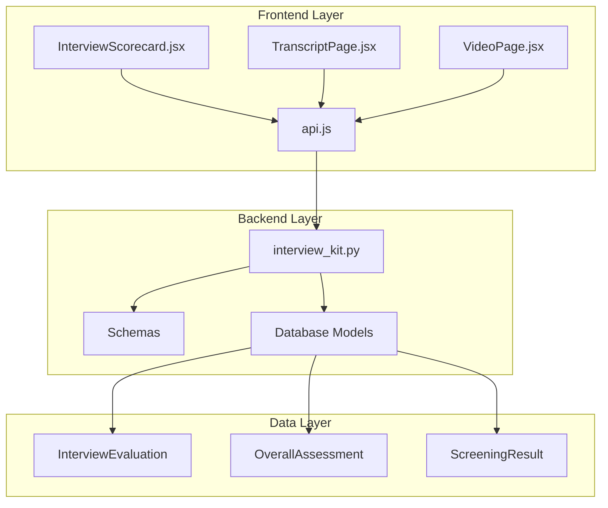
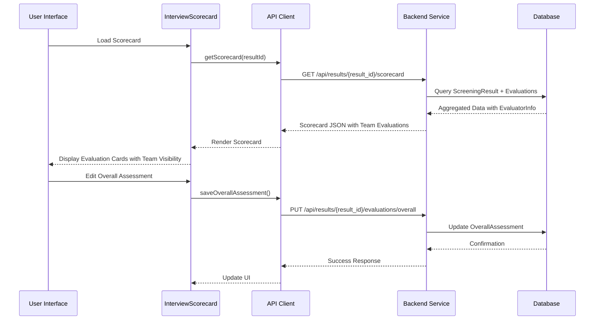
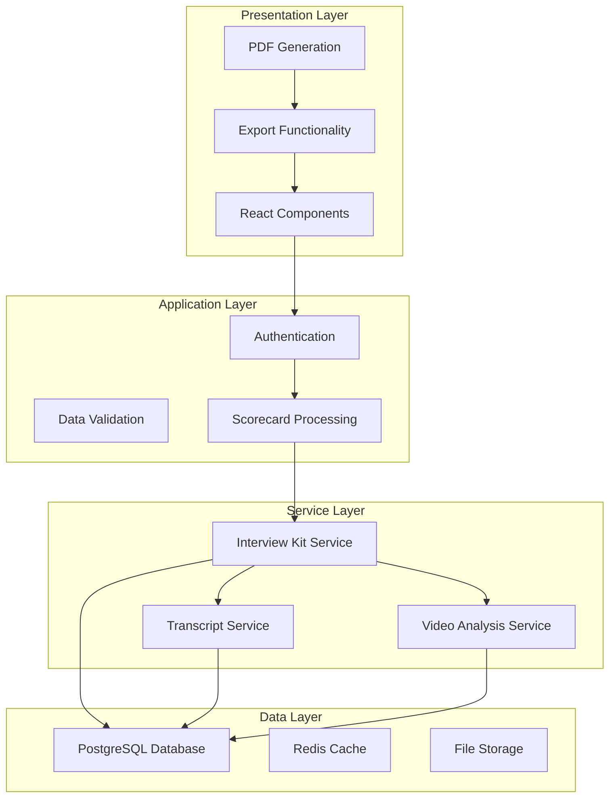
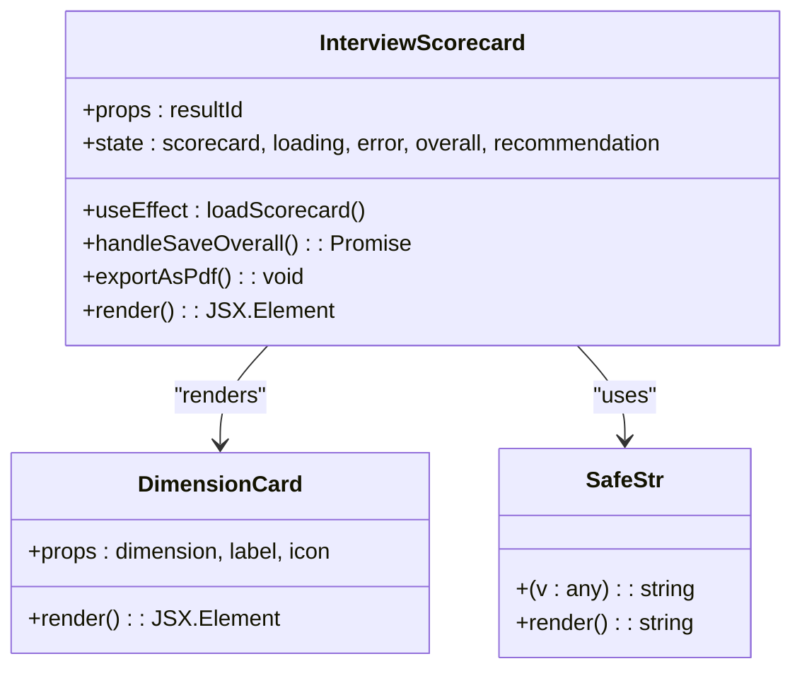
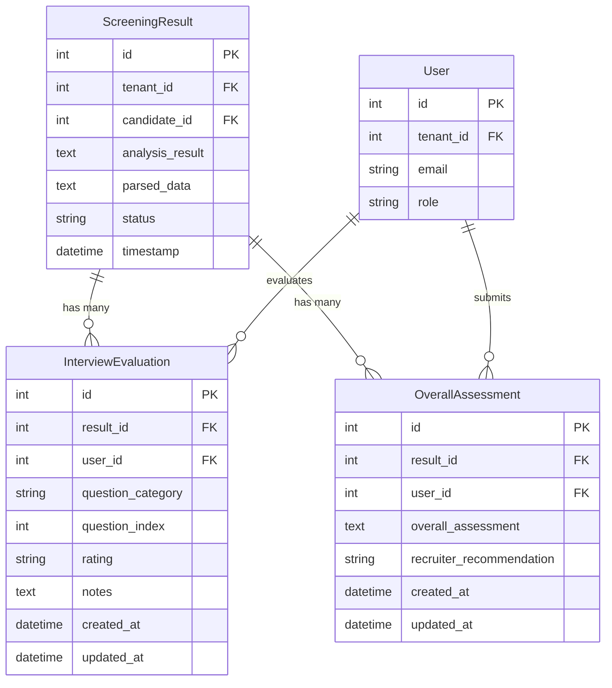
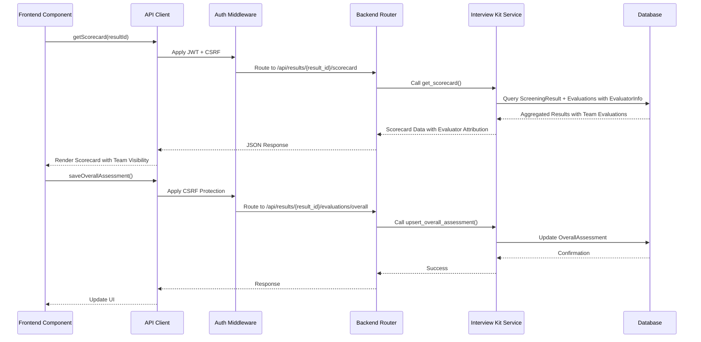
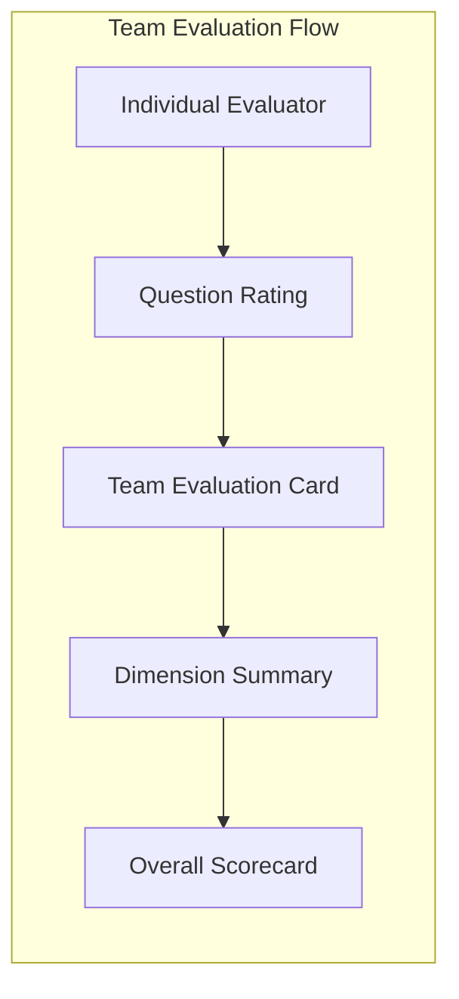
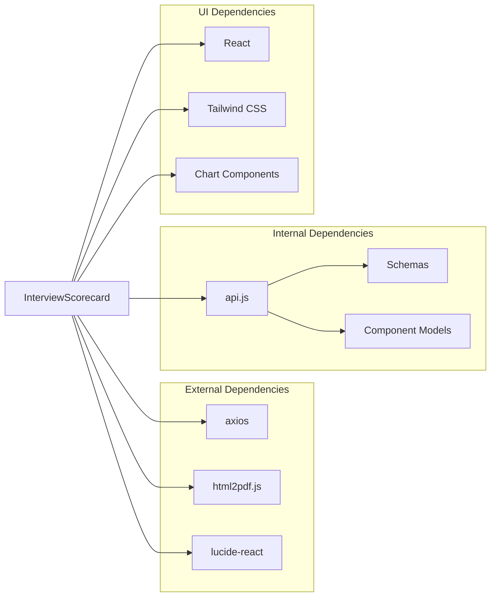

# Interview Scorecard Component

<cite>
**Referenced Files in This Document**
- [InterviewScorecard.jsx](file://app/frontend/src/components/InterviewScorecard.jsx)
- [interview_kit.py](file://app/backend/routes/interview_kit.py)
- [api.js](file://app/frontend/src/lib/api.js)
- [schemas.py](file://app/backend/models/schemas.py)
- [db_models.py](file://app/backend/models/db_models.py)
- [TranscriptPage.jsx](file://app/frontend/src/pages/TranscriptPage.jsx)
- [VideoPage.jsx](file://app/frontend/src/pages/VideoPage.jsx)
</cite>

## Update Summary
**Changes Made**
- Enhanced team collaboration features with comprehensive team evaluation visibility
- Introduced new EvaluatorInfo schema for detailed evaluator attribution
- Standardized UI labels with consistent "Team Evaluations" terminology
- Improved scorecard calculation logic with enhanced evaluator attribution
- Updated dimension summary cards to display team evaluation data

## Table of Contents
1. [Introduction](#introduction)
2. [Project Structure](#project-structure)
3. [Core Components](#core-components)
4. [Architecture Overview](#architecture-overview)
5. [Detailed Component Analysis](#detailed-component-analysis)
6. [Enhanced Team Collaboration Features](#enhanced-team-collaboration-features)
7. [EvaluatorInfo Schema Integration](#evaluatorinfo-schema-integration)
8. [UI Label Standardization](#ui-label-standardization)
9. [Dependency Analysis](#dependency-analysis)
10. [Performance Considerations](#performance-considerations)
11. [Troubleshooting Guide](#troubleshooting-guide)
12. [Conclusion](#conclusion)

## Introduction

The Interview Scorecard Component is a comprehensive evaluation and reporting system designed for AI-powered interview analysis. This component provides recruiters and hiring managers with a professional, printable scorecard that aggregates interview evaluation data, displays dimension summaries, and enables collaborative assessment workflows with enhanced team visibility.

The system integrates seamlessly with the broader ARIA (AI Resume Intelligence) platform, offering multi-modal interview analysis capabilities including transcript evaluation, video interview analysis, and structured scoring systems. The Interview Scorecard serves as the central hub for interview assessment, combining quantitative metrics with qualitative insights to support informed hiring decisions.

**Updated** Enhanced with comprehensive team collaboration features that provide visibility into all team member evaluations, detailed evaluator attribution through the new EvaluatorInfo schema, and standardized UI labeling for consistent user experience.

## Project Structure

The Interview Scorecard Component follows a modular architecture with clear separation between frontend presentation, backend data processing, and database persistence:

**Diagram sources**
- [InterviewScorecard.jsx:64-232](file://app/frontend/src/components/InterviewScorecard.jsx#L64-L232)
- [interview_kit.py:23-224](file://app/backend/routes/interview_kit.py#L23-L224)
- [api.js:1-997](file://app/frontend/src/lib/api.js#L1-L997)

**Section sources**
- [InterviewScorecard.jsx:1-255](file://app/frontend/src/components/InterviewScorecard.jsx#L1-L255)
- [interview_kit.py:1-239](file://app/backend/routes/interview_kit.py#L1-L239)

## Core Components

### Frontend Interview Scorecard Component

The Interview Scorecard Component is implemented as a React functional component that provides a comprehensive interface for interview evaluation and reporting:

**Key Features:**
- Real-time scorecard loading and rendering
- Dimension-based evaluation summaries (Technical, Behavioral, Culture Fit, Experience)
- Interactive evaluation cards with strength indicators
- Overall assessment editing with recommendation selection
- PDF export functionality for sharing with hiring managers
- Responsive design with professional styling
- **Enhanced** Comprehensive team evaluation visibility with detailed evaluator attribution

**Data Flow Architecture:**

**Diagram sources**
- [InterviewScorecard.jsx:64-117](file://app/frontend/src/components/InterviewScorecard.jsx#L64-L117)
- [api.js:1-997](file://app/frontend/src/lib/api.js#L1-L997)
- [interview_kit.py:142-239](file://app/backend/routes/interview_kit.py#L142-L239)

### Backend Interview Kit Service

The backend service provides comprehensive interview evaluation management through a RESTful API:

**Core Endpoints:**
- `PUT /api/results/{result_id}/evaluations` - Upsert individual question evaluations
- `GET /api/results/{result_id}/evaluations` - Retrieve all evaluations for a result
- `PUT /api/results/{result_id}/evaluations/overall` - Save overall recruiter assessment
- `GET /api/results/{result_id}/scorecard` - Generate comprehensive scorecard with team evaluation visibility

**Data Processing Logic:**
The backend service aggregates evaluation data from multiple sources, builds dimension summaries, and constructs a comprehensive scorecard report that combines AI-generated insights with human evaluator input. **Enhanced** with comprehensive team evaluation visibility through the EvaluatorInfo schema.

**Section sources**
- [interview_kit.py:23-239](file://app/backend/routes/interview_kit.py#L23-L239)
- [schemas.py:440-517](file://app/backend/models/schemas.py#L440-L517)

## Architecture Overview

The Interview Scorecard Component operates within a multi-layered architecture that ensures scalability, security, and maintainability:

**Diagram sources**
- [InterviewScorecard.jsx:1-255](file://app/frontend/src/components/InterviewScorecard.jsx#L1-L255)
- [interview_kit.py:1-239](file://app/backend/routes/interview_kit.py#L1-L239)
- [main.py:324-390](file://app/backend/main.py#L324-L390)

The architecture ensures:
- **Scalability**: Horizontal scaling through microservice design
- **Security**: Multi-tenant isolation and role-based access control
- **Performance**: Database indexing, caching strategies, and optimized queries
- **Maintainability**: Clear separation of concerns and modular design

## Detailed Component Analysis

### InterviewScorecard Component Implementation

The InterviewScorecard component demonstrates sophisticated React patterns and state management:

**Component Structure:**

**Diagram sources**
- [InterviewScorecard.jsx:14-62](file://app/frontend/src/components/InterviewScorecard.jsx#L14-L62)
- [InterviewScorecard.jsx:64-255](file://app/frontend/src/components/InterviewScorecard.jsx#L64-L255)

**Key Implementation Features:**

1. **Safe String Conversion**: The `safeStr` utility function handles various data types safely, preventing rendering errors from null or undefined values.

2. **Dimension Summary Cards**: Each evaluation dimension (Technical, Behavioral, Culture Fit, Experience) is presented in a standardized card format with:
   - Total question count and evaluated count
   - Color-coded strength indicators (Emerald for Strong, Amber for Adequate, Red for Weak)
   - Key notes aggregation
   - **Enhanced** Team evaluation visibility showing individual evaluator ratings and question indices
   - Responsive grid layout

3. **Interactive Assessment Editor**: Recruiters can:
   - Edit overall assessment text
   - Select recommendation (Advance, Hold, Reject)
   - Save assessments with proper validation
   - View evaluation metadata (evaluator, timestamp)

4. **Professional PDF Export**: Integrated PDF generation using html2pdf.js with:
   - Custom styling for print-friendly layouts
   - Proper filename generation with candidate names
   - Image-based rendering for consistent cross-browser compatibility

**Section sources**
- [InterviewScorecard.jsx:1-255](file://app/frontend/src/components/InterviewScorecard.jsx#L1-L255)

### Backend Data Model Integration

The backend implements robust data persistence and retrieval mechanisms:

**Database Schema Relationships:**

**Diagram sources**
- [db_models.py:135-257](file://app/backend/models/db_models.py#L135-L257)

**Data Processing Pipeline:**
The backend service orchestrates complex data aggregation:

1. **Result Verification**: Ensures tenant ownership and access permissions
2. **Analysis Data Parsing**: Extracts structured data from JSON analysis results
3. **Evaluation Aggregation**: Collects and processes individual question evaluations
4. **Dimension Building**: Constructs summary statistics for each evaluation category
5. **Evaluator Attribution**: **Enhanced** Integrates EvaluatorInfo schema for detailed team evaluation visibility
6. **Strengths/Concerns Extraction**: Identifies notable evaluation patterns
7. **Overall Assessment Integration**: Combines AI insights with human evaluator input

**Section sources**
- [interview_kit.py:28-239](file://app/backend/routes/interview_kit.py#L28-L239)
- [db_models.py:218-257](file://app/backend/models/db_models.py#L218-L257)

### API Integration Patterns

The frontend API client provides comprehensive interview evaluation functionality:

**API Methods:**
- `getScorecard(resultId)`: Retrieves complete interview scorecard data with team evaluation visibility
- `saveOverallAssessment(resultId, assessment)`: Persists recruiter assessment
- `getEvaluations(resultId)`: Fetches individual question evaluations
- `upsertEvaluation(resultId, evaluation)`: Creates or updates evaluations

**Integration Architecture:**

**Diagram sources**
- [api.js:1-997](file://app/frontend/src/lib/api.js#L1-L997)
- [interview_kit.py:142-138](file://app/backend/routes/interview_kit.py#L142-L138)

**Section sources**
- [api.js:1-997](file://app/frontend/src/lib/api.js#L1-L997)
- [interview_kit.py:101-138](file://app/backend/routes/interview_kit.py#L101-L138)

## Enhanced Team Collaboration Features

The Interview Scorecard Component now provides comprehensive team collaboration capabilities through enhanced evaluation visibility:

### Team Evaluation Visibility

**Key Features:**
- **Comprehensive Team View**: Displays all team member evaluations in dimension summary cards
- **Individual Evaluator Attribution**: Shows email addresses and evaluation timestamps
- **Question-Level Detail**: Displays which question was evaluated and the rating provided
- **Real-Time Collaboration**: Enables team members to see each other's evaluations instantly
- **Transparent Assessment Process**: Provides complete audit trail of evaluation decisions

**Implementation Details:**

**Diagram sources**
- [InterviewScorecard.jsx:68-82](file://app/frontend/src/components/InterviewScorecard.jsx#L68-L82)
- [interview_kit.py:177-186](file://app/backend/routes/interview_kit.py#L177-L186)

**Section sources**
- [InterviewScorecard.jsx:68-82](file://app/frontend/src/components/InterviewScorecard.jsx#L68-L82)
- [interview_kit.py:156-239](file://app/backend/routes/interview_kit.py#L156-L239)

## EvaluatorInfo Schema Integration

The new EvaluatorInfo schema provides detailed attribution for all team evaluations:

### Schema Definition

**EvaluatorInfo Fields:**
- `user_id`: Unique identifier of the evaluating team member
- `email`: Email address of the evaluator for attribution
- `rating`: Evaluation rating (strong, adequate, weak)
- `question_index`: Index of the evaluated question (0-based)
- `notes`: Additional evaluation notes provided by the team member

**Integration Benefits:**
- **Enhanced Transparency**: Complete visibility into who evaluated what and when
- **Accountability**: Clear attribution for all evaluation decisions
- **Audit Trail**: Comprehensive record of team evaluation activities
- **Performance Insights**: Ability to track evaluator consistency and expertise

**Section sources**
- [schemas.py:550-557](file://app/backend/models/schemas.py#L550-L557)
- [interview_kit.py:177-186](file://app/backend/routes/interview_kit.py#L177-L186)

## UI Label Standardization

The Interview Scorecard Component now features standardized UI labels for consistent user experience:

### Standardized Terminology

**Key Label Changes:**
- **Team Evaluations**: Consistent use of "Team Evaluations" across all dimension cards
- **Evaluator Attribution**: Standardized display of evaluator emails and timestamps
- **Rating Labels**: Unified "Q{question_index}: {rating}" format for question-level ratings
- **Consistent Styling**: Standardized color schemes and typography for evaluation indicators

**UI Components:**
- **Dimension Cards**: Consistent card layout with standardized header formatting
- **Evaluator Lists**: Uniform display of team member evaluations with clear visual hierarchy
- **Rating Indicators**: Standardized color coding (Emerald, Amber, Red) for evaluation strength
- **Metadata Display**: Consistent formatting for evaluator attribution and timestamps

**Section sources**
- [InterviewScorecard.jsx:69-82](file://app/frontend/src/components/InterviewScorecard.jsx#L69-L82)
- [InterviewScorecard.jsx:14-18](file://app/frontend/src/components/InterviewScorecard.jsx#L14-L18)

## Dependency Analysis

The Interview Scorecard Component exhibits well-managed dependencies with clear boundaries and minimal coupling:

**Dependency Characteristics:**
- **Frontend**: Lightweight dependencies focused on UI functionality
- **Backend**: Well-structured ORM relationships with clear data models
- **Integration**: Minimal external dependencies for core functionality
- **Security**: Built-in CSRF protection and authentication middleware

**Potential Dependencies:**
- Database connection pooling and transaction management
- File upload/download services for PDF generation
- Email notification system for scorecard sharing
- Analytics tracking for evaluation workflows

**Section sources**
- [InterviewScorecard.jsx:1-5](file://app/frontend/src/components/InterviewScorecard.jsx#L1-L5)
- [interview_kit.py:1-23](file://app/backend/routes/interview_kit.py#L1-L23)

## Performance Considerations

The Interview Scorecard Component is designed with several performance optimization strategies:

**Frontend Performance:**
- **Lazy Loading**: React.lazy integration for efficient bundle loading
- **State Optimization**: Minimal re-renders through proper state management
- **Memory Management**: Cleanup of event listeners and timers
- **Responsive Design**: Optimized layouts for mobile and desktop devices

**Backend Performance:**
- **Database Indexing**: Strategic indexing on frequently queried fields
- **Connection Pooling**: Efficient database connection management
- **Query Optimization**: Minimized N+1 query patterns through eager loading
- **Caching Strategies**: Redis integration for frequently accessed data

**Scalability Features:**
- **Horizontal Scaling**: Stateless components supporting load balancing
- **Database Partitioning**: Tenant isolation enabling independent scaling
- **Asynchronous Processing**: Background tasks for heavy computations
- **CDN Integration**: Static asset optimization for global distribution

**Performance Monitoring:**
- **Metrics Collection**: Built-in Prometheus metrics for system monitoring
- **Request Tracing**: Correlation IDs for end-to-end request tracking
- **Health Checks**: Comprehensive health endpoints for system status
- **Error Tracking**: Structured logging with contextual information

## Troubleshooting Guide

### Common Issues and Solutions

**Frontend Issues:**
1. **Scorecard Loading Failures**
   - Verify API connectivity and authentication status
   - Check browser console for JavaScript errors
   - Ensure proper resultId parameter is passed

2. **PDF Export Problems**
   - Confirm html2pdf.js compatibility with browser version
   - Check for CORS issues with external resources
   - Verify sufficient memory allocation for large documents

3. **Evaluation Persistence Failures**
   - Validate CSRF token presence in request headers
   - Check user authentication and tenant access permissions
   - Monitor network connectivity to backend services

4. **Team Evaluation Visibility Issues**
   - **Enhanced** Verify that team members have proper access permissions
   - Check database relationships for evaluator attribution
   - Ensure EvaluatorInfo schema is properly populated

**Backend Issues:**
1. **Database Connection Problems**
   - Verify PostgreSQL service availability
   - Check connection pool configuration limits
   - Monitor database query performance

2. **API Response Time Issues**
   - Review database indexing strategies
   - Optimize complex query execution plans
   - Implement appropriate caching mechanisms

3. **Authentication Failures**
   - Validate JWT token expiration and signature
   - Check tenant membership and role permissions
   - Verify CSRF token validation process

4. **EvaluatorInfo Schema Issues**
   - **Enhanced** Verify proper database relationships
   - Check for missing evaluator data in InterviewEvaluation table
   - Ensure User table contains complete email information

**Diagnostic Tools:**
- **Frontend**: React Developer Tools, browser network tab
- **Backend**: PostgreSQL query logs, FastAPI debug mode
- **Infrastructure**: Docker container logs, system resource monitoring

**Section sources**
- [InterviewScorecard.jsx:73-117](file://app/frontend/src/components/InterviewScorecard.jsx#L73-L117)
- [interview_kit.py:28-35](file://app/backend/routes/interview_kit.py#L28-L35)

## Conclusion

The Interview Scorecard Component represents a sophisticated integration of frontend presentation, backend data processing, and database persistence designed to enhance the interview evaluation workflow. The component successfully balances functionality with performance, providing recruiters and hiring managers with a comprehensive tool for managing interview assessments.

**Key Achievements:**
- **Seamless Integration**: Works harmoniously with existing transcript and video analysis systems
- **Professional Presentation**: Produces printable, shareable scorecards with consistent branding
- **Collaborative Workflow**: **Enhanced** Supports multi-user evaluation with comprehensive team visibility
- **Scalable Architecture**: Designed for horizontal scaling and tenant isolation
- **Robust Error Handling**: Comprehensive error management and user feedback
- **Standardized UI**: **Enhanced** Consistent labeling and visual hierarchy across evaluation components
- **Detailed Attribution**: **Enhanced** Complete evaluator attribution through EvaluatorInfo schema

**Future Enhancement Opportunities:**
- **Advanced Analytics**: Integration of evaluation trend analysis and competency mapping
- **Mobile Optimization**: Enhanced mobile experience for on-the-go evaluation
- **Integration APIs**: Third-party system integrations for HRIS and ATS compatibility
- **AI Assistance**: Intelligent evaluation suggestions and pattern recognition
- **Workflow Automation**: Automated scorecard generation and distribution workflows
- **Enhanced Collaboration**: Advanced team evaluation features and real-time collaboration tools

The component serves as a cornerstone of the ARIA platform's interview analysis capabilities, providing a solid foundation for advanced recruitment technology solutions with enhanced team collaboration features and comprehensive evaluator attribution.