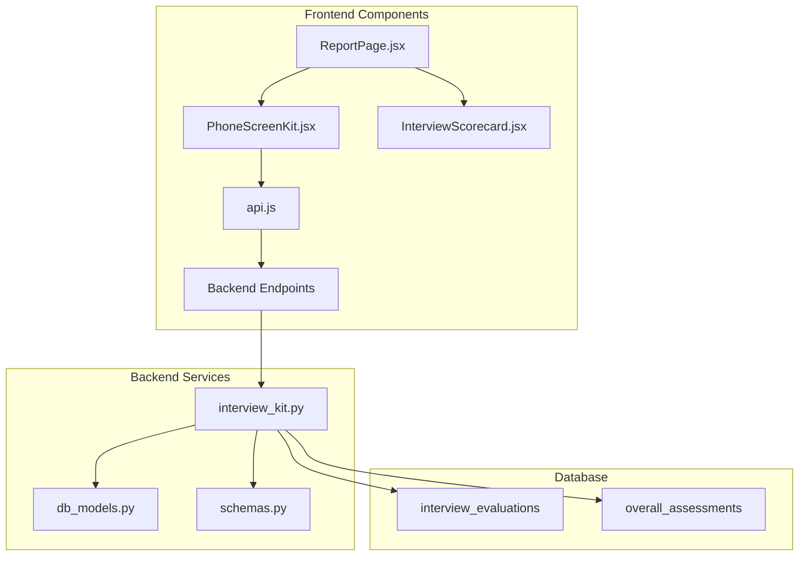
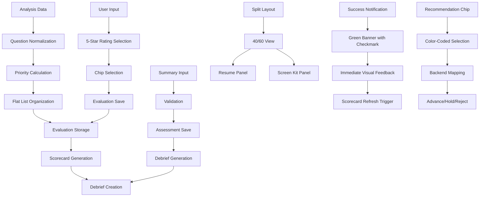
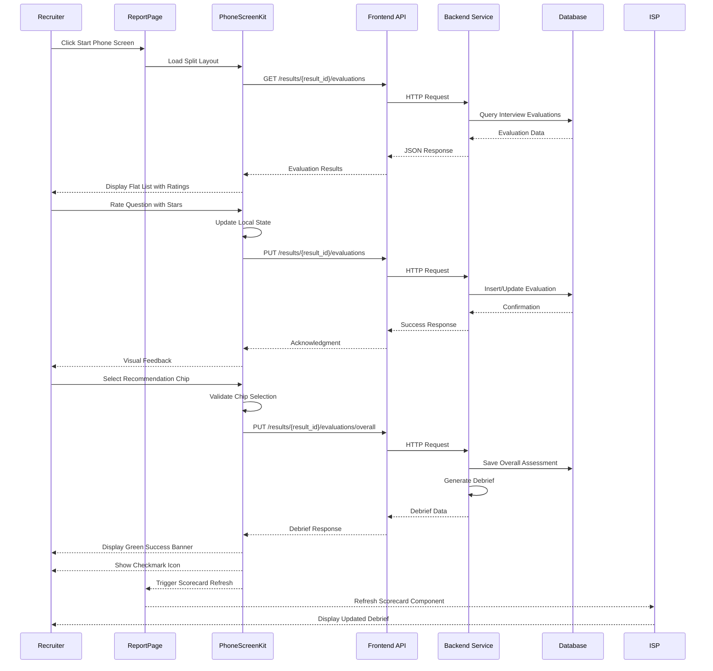
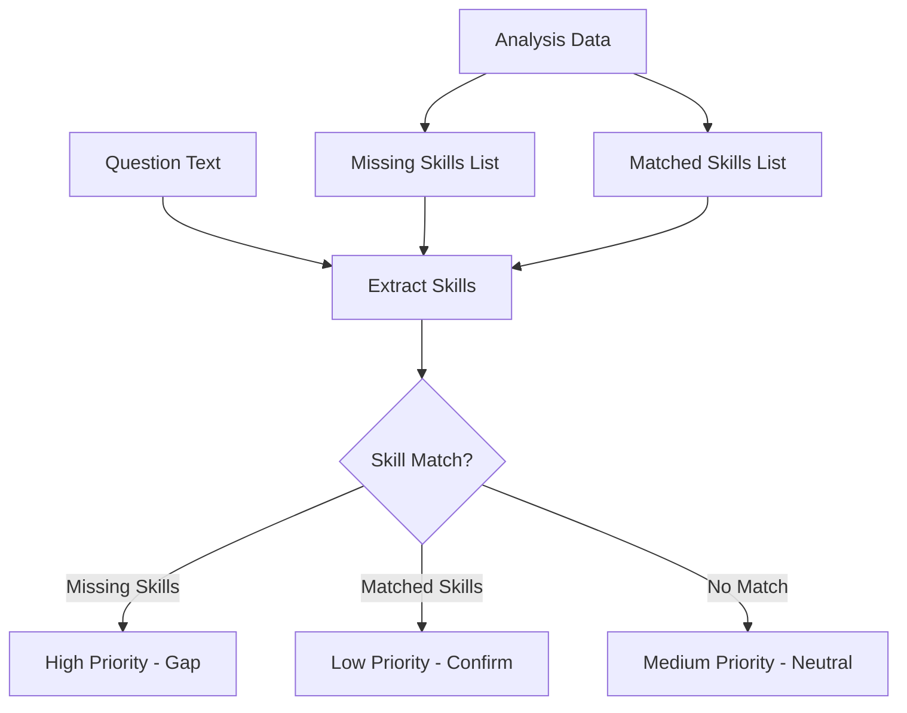
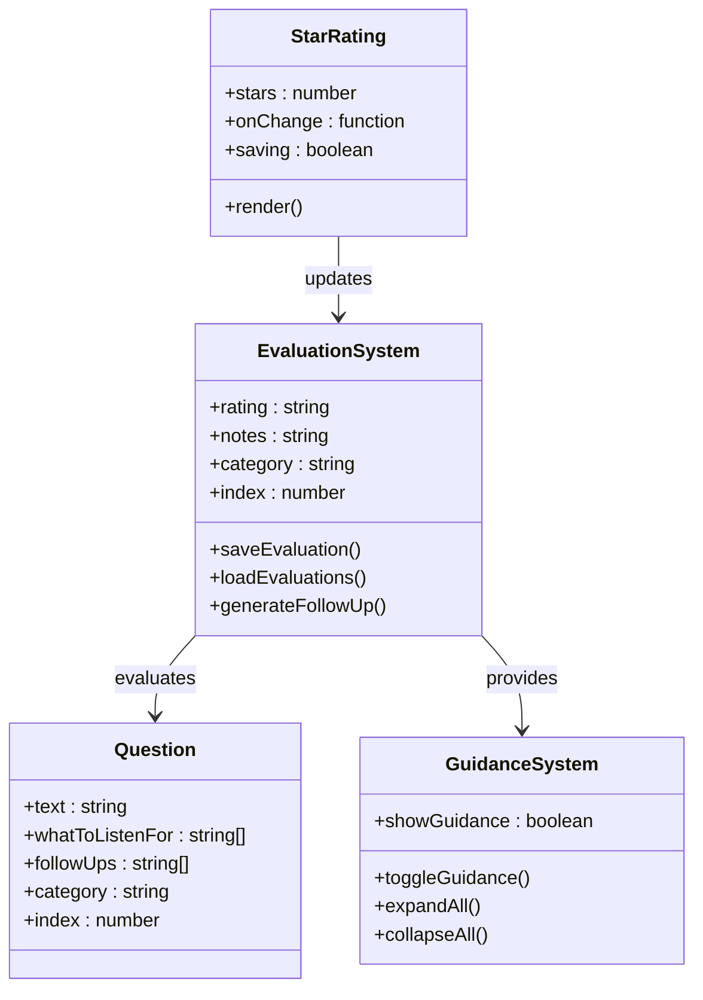
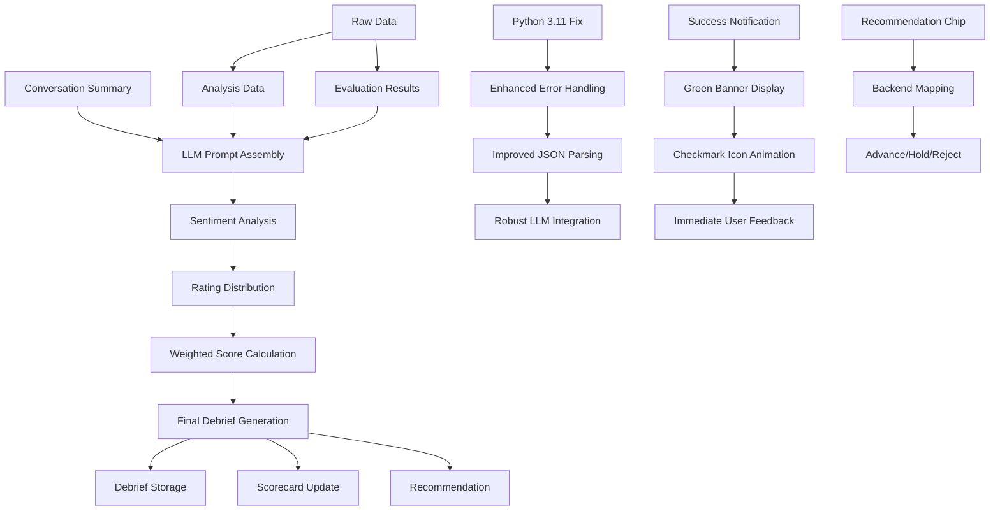
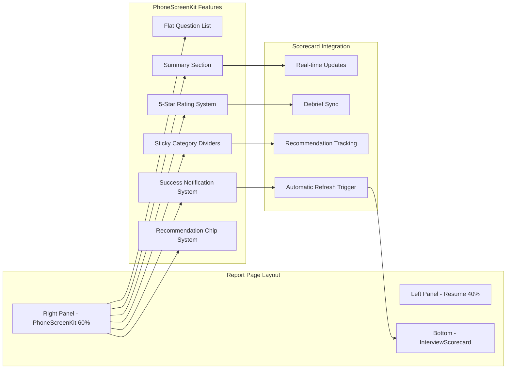
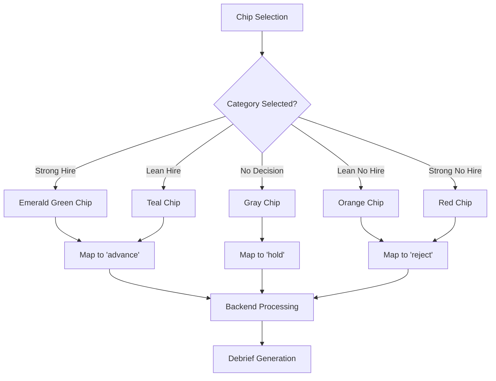
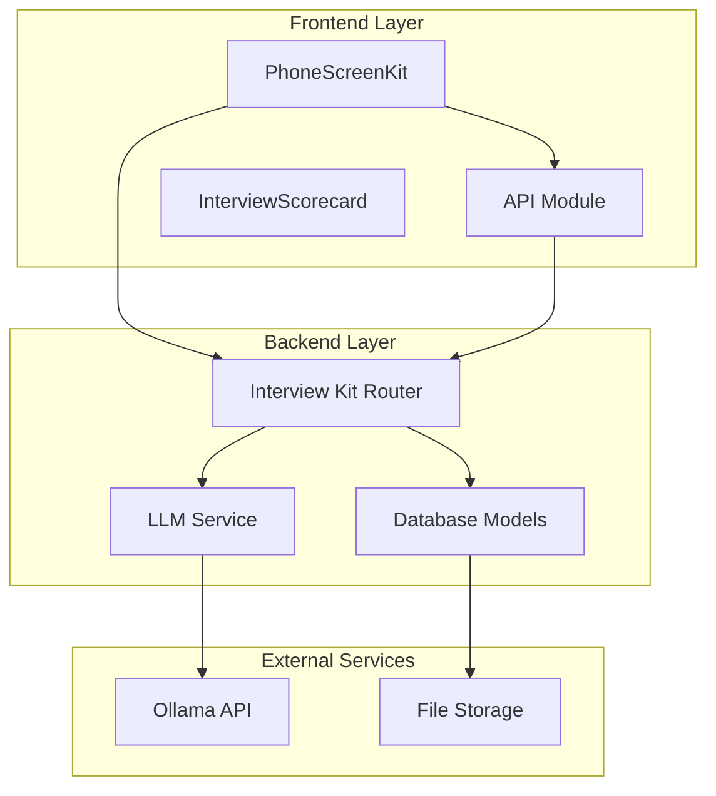

# PhoneScreenKit Component

<cite>
**Referenced Files in This Document**
- [PhoneScreenKit.jsx](file://app/frontend/src/components/PhoneScreenKit.jsx)
- [ReportPage.jsx](file://app/frontend/src/pages/ReportPage.jsx)
- [api.js](file://app/frontend/src/lib/api.js)
- [InterviewScorecard.jsx](file://app/frontend/src/components/InterviewScorecard.jsx)
- [interview_kit.py](file://app/backend/routes/interview_kit.py)
- [db_models.py](file://app/backend/models/db_models.py)
- [schemas.py](file://app/backend/models/schemas.py)
</cite>

## Update Summary
**Changes Made**
- Updated to reflect the major redesign from tabbed navigation to 40/60 split layout with ReportPage integration
- Enhanced star rating system with 5-star capabilities replacing Strong/Adequate/Weak buttons
- Implemented flat, scrollable list system with sticky category dividers
- Improved layout integration with ReportPage showing resume (40%) and Screen Kit (60%)
- Updated recommendation chip system with enhanced validation and backend mapping

## Table of Contents
1. [Introduction](#introduction)
2. [Project Structure](#project-structure)
3. [Core Components](#core-components)
4. [Architecture Overview](#architecture-overview)
5. [Detailed Component Analysis](#detailed-component-analysis)
6. [Enhanced Star Rating System](#enhanced-star-rating-system)
7. [40/60 Split Layout Integration](#4060-split-layout-integration)
8. [Recommendation Chip System](#recommendation-chip-system)
9. [Success Notification System](#success-notification-system)
10. [Mobile-First Design Enhancements](#mobile-first-design-enhancements)
11. [Dependency Analysis](#dependency-analysis)
12. [Performance Considerations](#performance-considerations)
13. [Troubleshooting Guide](#troubleshooting-guide)
14. [Conclusion](#conclusion)

## Introduction

The PhoneScreenKit component is a specialized React component designed for conducting phone interviews in a modern split-view interface. It provides recruiters with a comprehensive toolkit for evaluating candidates during telephone screenings, featuring structured interview questions, real-time evaluation capabilities, and automated debrief generation.

**Updated** The component has undergone a major redesign featuring a 40/60 split layout with ReportPage integration, showcasing the candidate's resume (40%) alongside the Screen Kit (60%). The component now features an enhanced 5-star rating system that replaces the previous Strong/Adequate/Weak buttons with intuitive star-based evaluation, significantly improving user experience and evaluation precision.

This component integrates seamlessly with the broader Resume AI platform, offering a streamlined workflow for phone screening processes. It combines candidate analysis data with interactive interview guidance to create an intelligent screening experience that enhances recruitment efficiency and consistency.

**Current Status**: The PhoneScreenKit component remains fully operational with complete functionality including the new split-view layout, enhanced star rating system, flat scrollable question list with sticky category dividers, automated debrief generation, and improved recommendation chip selector system.

## Project Structure

The PhoneScreenKit component is organized within the frontend application structure, working in conjunction with backend APIs and supporting components:



**Diagram sources**
- [PhoneScreenKit.jsx:1-545](file://app/frontend/src/components/PhoneScreenKit.jsx#L1-L545)
- [ReportPage.jsx:490-565](file://app/frontend/src/pages/ReportPage.jsx#L490-L565)
- [api.js:1271-1307](file://app/frontend/src/lib/api.js#L1271-L1307)
- [interview_kit.py:26-435](file://app/backend/routes/interview_kit.py#L26-L435)

**Section sources**
- [PhoneScreenKit.jsx:1-545](file://app/frontend/src/components/PhoneScreenKit.jsx#L1-L545)
- [ReportPage.jsx:490-565](file://app/frontend/src/pages/ReportPage.jsx#L490-L565)

## Core Components

### PhoneScreenKit Component Architecture

The PhoneScreenKit component serves as the primary interface for phone screening activities, featuring:

#### Key Features:
- **40/60 Split Layout Integration**: Seamlessly integrated with ReportPage showing resume (40%) and Screen Kit (60%)
- **Flat Scrollable Question List**: Single-column layout with sticky category dividers replacing tabbed navigation
- **Enhanced 5-Star Rating System**: Intuitive star-based evaluation replacing Strong/Adequate/Weak buttons
- **Dynamic Question Prioritization**: Automatic sorting based on candidate skill gaps and matches
- **Real-time Evaluation System**: Interactive rating and note-taking for each question
- **Integrated Guidance**: Contextual hints and follow-up suggestions for interviewers
- **Enhanced Recommendation System**: Five-color-coded chip selector replacing text-based validation
- **Automated Debrief Generation**: AI-powered summary creation and recommendation
- **Candidate Briefing**: Pre-screening insights and preparation guidance
- **Mobile-Responsive Design**: Optimized layout for phone screen split-view experiences
- **Success Notification System**: Immediate visual feedback for debrief generation completion

#### Data Flow:


**Diagram sources**
- [PhoneScreenKit.jsx:62-75](file://app/frontend/src/components/PhoneScreenKit.jsx#L62-L75)
- [PhoneScreenKit.jsx:444-448](file://app/frontend/src/components/PhoneScreenKit.jsx#L444-L448)
- [PhoneScreenKit.jsx:525-530](file://app/frontend/src/components/PhoneScreenKit.jsx#L525-L530)

**Section sources**
- [PhoneScreenKit.jsx:131-142](file://app/frontend/src/components/PhoneScreenKit.jsx#L131-L142)

### Backend Integration Points

The component interfaces with several backend services for comprehensive functionality:

#### API Endpoints:
- `/results/{result_id}/evaluations` - CRUD operations for individual question evaluations
- `/results/{result_id}/evaluations/overall` - Overall assessment management
- `/results/{result_id}/scorecard` - Scorecard generation and retrieval
- `/results/{result_id}/generate-debrief` - Automated debrief generation

#### Database Schema:
The backend utilizes two primary tables for evaluation persistence:
- `interview_evaluations`: Stores individual question ratings and notes
- `overall_assessments`: Maintains recruiter summaries and recommendations

**Section sources**
- [api.js:1271-1307](file://app/frontend/src/lib/api.js#L1271-L1307)
- [interview_kit.py:41-141](file://app/backend/routes/interview_kit.py#L41-L141)
- [db_models.py:292-333](file://app/backend/models/db_models.py#L292-L333)

## Architecture Overview

The PhoneScreenKit component follows a client-server architecture pattern with comprehensive state management and enhanced success notification system:



**Diagram sources**
- [PhoneScreenKit.jsx:163-184](file://app/frontend/src/components/PhoneScreenKit.jsx#L163-L184)
- [PhoneScreenKit.jsx:200-217](file://app/frontend/src/components/PhoneScreenKit.jsx#L200-L217)
- [PhoneScreenKit.jsx:223-251](file://app/frontend/src/components/PhoneScreenKit.jsx#L223-L251)

**Section sources**
- [PhoneScreenKit.jsx:143-198](file://app/frontend/src/components/PhoneScreenKit.jsx#L143-L198)
- [interview_kit.py:246-435](file://app/backend/routes/interview_kit.py#L246-L435)

## Detailed Component Analysis

### Question Management System

The PhoneScreenKit implements a sophisticated question management system that organizes interview questions into logical categories and prioritizes them based on candidate analysis:

#### Question Categories:
- **Technical Questions**: Domain-specific competency assessment
- **Behavioral Questions**: Soft skills and cultural alignment evaluation
- **Culture Fit Questions**: Organizational values and team dynamics assessment
- **Experience Deep-Dive Questions**: Detailed exploration of professional background

#### Priority Algorithm:
Questions are automatically prioritized using the following criteria:
1. **High Priority**: Questions containing missing skills from candidate analysis
2. **Medium Priority**: Neutral questions with no skill indicators
3. **Low Priority**: Questions confirming already matched skills



**Diagram sources**
- [PhoneScreenKit.jsx:44-60](file://app/frontend/src/components/PhoneScreenKit.jsx#L44-L60)
- [PhoneScreenKit.jsx:62-75](file://app/frontend/src/components/PhoneScreenKit.jsx#L62-L75)

**Section sources**
- [PhoneScreenKit.jsx:154-159](file://app/frontend/src/components/PhoneScreenKit.jsx#L154-L159)
- [PhoneScreenKit.jsx:334-474](file://app/frontend/src/components/PhoneScreenKit.jsx#L334-L474)

### Enhanced Star Rating System

**Updated** The PhoneScreenKit now features an innovative 5-star rating system that replaces the previous Strong/Adequate/Weak buttons with intuitive star-based evaluation:

#### Star Rating Features:
- **5-Star Scale**: Intuitive star-based evaluation system
- **Color Coding**: Emerald green for Strong (4-5 stars), Amber for Adequate (3 stars), Red for Weak (1-2 stars)
- **Hover Effects**: Interactive hover states showing star selection preview
- **Adaptive Follow-up Prompts**: Contextual guidance based on rating selection
- **Real-time Visual Feedback**: Immediate color and text updates based on rating

#### Rating Mapping:
- **4-5 Stars** → Strong rating (emerald green)
- **3 Stars** → Adequate rating (amber)
- **1-2 Stars** → Weak rating (red)

#### Adaptive Follow-up Prompts:
The system provides intelligent follow-up prompts based on star ratings:
- **Weak Ratings (1-2 stars)**: Questions to understand candidate competency levels
- **Adequate Ratings (3 stars)**: Prompts to dig deeper for clarification
- **Strong Ratings (4-5 stars)**: Confirmation questions to validate expertise



**Diagram sources**
- [PhoneScreenKit.jsx:85-122](file://app/frontend/src/components/PhoneScreenKit.jsx#L85-L122)
- [PhoneScreenKit.jsx:444-467](file://app/frontend/src/components/PhoneScreenKit.jsx#L444-L467)

**Section sources**
- [PhoneScreenKit.jsx:85-122](file://app/frontend/src/components/PhoneScreenKit.jsx#L85-L122)
- [PhoneScreenKit.jsx:444-467](file://app/frontend/src/components/PhoneScreenKit.jsx#L444-L467)

### Debrief Generation Pipeline

The automated debrief generation process creates comprehensive interview summaries:

#### Debrief Components:
- **Overview**: Executive summary of candidate performance
- **Strengths Observed**: Key positive attributes identified
- **Concerns**: Areas requiring attention or further investigation
- **Recommendation Rationale**: Justification for final recommendation
- **Sentiment Analysis**: Quantified emotional tone of the interview

#### Scoring Algorithm:
The final recruiter score combines:
- **40%**: Rating distribution analysis
- **60%**: LLM sentiment analysis of conversation summary

**Enhanced** With Python 3.11 compatibility fixes for improved LLM service integration and error handling.



**Diagram sources**
- [interview_kit.py:246-435](file://app/backend/routes/interview_kit.py#L246-L435)

**Section sources**
- [interview_kit.py:288-360](file://app/backend/routes/interview_kit.py#L288-L360)

### Integration with Report Page

**Updated** The PhoneScreenKit integrates seamlessly with the main report page in a sophisticated 40/60 split-view layout with enhanced success notification system:



**Diagram sources**
- [ReportPage.jsx:490-565](file://app/frontend/src/pages/ReportPage.jsx#L490-L565)
- [PhoneScreenKit.jsx:332-545](file://app/frontend/src/components/PhoneScreenKit.jsx#L332-L545)

**Section sources**
- [ReportPage.jsx:490-565](file://app/frontend/src/pages/ReportPage.jsx#L490-L565)

## Enhanced Star Rating System

### 5-Star Rating Capabilities

**Updated** The PhoneScreenKit now features an innovative 5-star rating system that replaces the previous Strong/Adequate/Weak buttons with intuitive star-based evaluation:

#### Star Rating Features:
- **Interactive Star Selection**: Click to rate questions from 1 to 5 stars
- **Visual Color Coding**: Emerald green for Strong (4-5 stars), Amber for Adequate (3 stars), Red for Weak (1-2 stars)
- **Hover Preview**: Hover effects show star selection preview
- **Adaptive Follow-up Prompts**: Contextual guidance based on rating selection
- **Real-time Visual Feedback**: Immediate color and text updates based on rating

#### Star Rating Logic:
Each star rating maps to backend rating system:
- **4-5 Stars** → Strong rating
- **3 Stars** → Adequate rating  
- **1-2 Stars** → Weak rating

#### Adaptive Follow-up Prompts:
The system provides intelligent follow-up prompts based on star ratings:
- **Weak Ratings (1-2 stars)**: "Understand their level" guidance with specific skill questions
- **Adequate Ratings (3 stars)**: "Dig deeper to decide" prompts for clarification
- **Strong Ratings (4-5 stars)**: Confirmation questions to validate expertise

```mermaid
flowchart TD
A[Star Selection] --> B{Stars Selected?}
B --> |1-2 Stars| C[Weak Rating - Red]
B --> |3 Stars| D[Adequate Rating - Amber]
B --> |4-5 Stars| E[Strong Rating - Emerald]
C --> F[Show "Understand their level" prompt]
D --> G[Show "Dig deeper to decide" prompt]
E --> H[Show confirmation questions]
F --> I[Extract Skill from Question]
G --> I
H --> I
I --> J[Display Contextual Prompt]
J --> K[Update Evaluation State]
K --> L[Save to Backend]
```

**Diagram sources**
- [PhoneScreenKit.jsx:62-75](file://app/frontend/src/components/PhoneScreenKit.jsx#L62-L75)
- [PhoneScreenKit.jsx:451-467](file://app/frontend/src/components/PhoneScreenKit.jsx#L451-L467)

#### Rating Mapping Enhancements:
The star rating system provides enhanced precision compared to text-based approaches:
- **Granular Evaluation**: 5 levels of evaluation precision vs 3 levels
- **Visual Clarity**: Immediate visual feedback through color coding
- **Contextual Guidance**: Intelligent follow-up prompts based on rating
- **Backend Consistency**: Seamless mapping to existing rating system

**Section sources**
- [PhoneScreenKit.jsx:62-75](file://app/frontend/src/components/PhoneScreenKit.jsx#L62-L75)
- [PhoneScreenKit.jsx:451-467](file://app/frontend/src/components/PhoneScreenKit.jsx#L451-L467)

## 40/60 Split Layout Integration

### Modern Split-View Architecture

**Updated** The PhoneScreenKit now features a sophisticated 40/60 split layout that integrates seamlessly with ReportPage:

#### Split Layout Features:
- **40% Resume Panel**: Dedicated space for candidate resume viewing
- **60% Screen Kit Panel**: Primary area for interview questions and evaluation
- **Responsive Design**: Adapts to different screen sizes and orientations
- **Sticky Category Dividers**: Fixed position category headers for easy navigation
- **Flat Question List**: Single-column layout replacing tabbed navigation

#### Layout Implementation:
The split layout is implemented in ReportPage with PhoneScreenKit as the right panel:

```jsx
<div className="flex-1 flex lg:flex-row flex-col min-h-0">
  {/* Left panel — Resume (40%) */}
  <div className="lg:w-[40%] w-full border-r border-slate-200 flex flex-col lg:h-full h-[45vh]">
    {/* Resume Content */}
  </div>
  {/* Right panel — Screen Kit (60%) */}
  <div className="lg:w-[60%] w-full flex flex-col min-h-0 lg:h-full">
    <PhoneScreenKit
      interview_questions={interviewQs}
      resultId={result?.result_id}
      analysisData={{
        missing_skills: result?.analysis_result?.missing_skills || result?.missing_skills || [],
        matched_skills: result?.analysis_result?.matched_skills || result?.matched_skills || [],
      }}
      onDebriefGenerated={() => setScorecardKey(prev => prev + 1)}
    />
  </div>
</div>
```

#### Responsive Behavior:
- **Desktop**: Full-height 40/60 split with fixed panels
- **Mobile**: Vertical stack with optimized heights (`h-[45vh]` for mobile)
- **Touch Optimization**: Larger touch targets for mobile interaction
- **Scroll Isolation**: Independent scrolling for resume and Screen Kit panels

```mermaid
flowchart TD
A[Screen Mode Active] --> B{Device Type?}
B --> |Desktop| C[Full 40/60 Split]
B --> |Mobile| D[Vertical Stack h-[45vh]]
C --> E[Fixed Panels]
D --> F[Responsive Layout]
E --> G[Independent Scrolling]
F --> G
G --> H[Enhanced User Experience]
```

**Section sources**
- [ReportPage.jsx:490-565](file://app/frontend/src/pages/ReportPage.jsx#L490-L565)
- [PhoneScreenKit.jsx:332-474](file://app/frontend/src/components/PhoneScreenKit.jsx#L332-L474)

## Recommendation Chip System

### Five-Color-Coded Chip Selector

**Updated** The PhoneScreenKit now features an innovative five-color-coded recommendation chip system that replaces traditional text-based validation with intuitive visual selection:

#### Chip Categories:
- **Strong Hire**: Emerald green chips (confirmed hire)
- **Lean Hire**: Teal chips (conditional hire)
- **No Decision**: Gray chips (inconclusive)
- **Lean No Hire**: Orange chips (strong no hire)
- **Strong No Hire**: Red chips (definitely no hire)

#### Chip Selection Logic:
Each chip category maps to backend recommendation states:
- **Strong Hire** → Advance
- **Lean Hire** → Advance  
- **No Decision** → Hold
- **Lean No Hire** → Reject
- **Strong No Hire** → Reject

#### Visual Design Features:
- **Color Coding**: Each chip uses distinct colors for immediate visual recognition
- **Selected State**: Chips display white text on colored backgrounds when selected
- **Hover Effects**: Subtle hover animations with ring borders
- **Responsive Layout**: Chips wrap responsively on smaller screens
- **Accessibility**: Clear color contrast and visual feedback



**Diagram sources**
- [PhoneScreenKit.jsx:491-511](file://app/frontend/src/components/PhoneScreenKit.jsx#L491-L511)
- [interview_kit.py:279-288](file://app/backend/routes/interview_kit.py#L279-L288)

#### Validation Enhancements:
The chip system provides enhanced validation compared to text-based approaches:
- **Visual Confirmation**: Immediate visual feedback when chips are selected
- **Prevents Empty Submissions**: Ensures recommendation selection before submission
- **Reduced Cognitive Load**: Intuitive color coding reduces decision fatigue
- **Consistent Terminology**: Standardized chip labels across all instances

**Section sources**
- [PhoneScreenKit.jsx:491-511](file://app/frontend/src/components/PhoneScreenKit.jsx#L491-L511)
- [interview_kit.py:279-288](file://app/backend/routes/interview_kit.py#L279-L288)

## Success Notification System

### Enhanced Success Feedback Mechanism

The PhoneScreenKit now features a comprehensive success notification system that provides immediate visual feedback upon debrief generation completion:

#### Success Notification Features:
- **Green Success Banner**: Distinctive green banner with subtle border for visual prominence
- **Checkmark Icon**: Animated checkmark icon with green color scheme for clear success indication
- **Immediate Feedback**: Real-time notification displayed immediately after successful debrief generation
- **Clear Messaging**: Descriptive success message directing users to view debrief in the Recruiter Scorecard
- **Visual Consistency**: Matches the platform's brand color scheme (green for success states)

#### Implementation Details:
The success notification appears as a green banner with a checkmark icon when `debriefGenerated` state becomes true:

```jsx
{debriefGenerated && (
  <div className="mt-3 p-3 bg-green-50 border border-green-200 rounded-lg flex items-center gap-2">
    <CheckCircle className="w-4 h-4 text-green-600 shrink-0" />
    <span className="text-sm text-green-700 font-medium">Debrief generated. View it in the Recruiter Scorecard below.</span>
  </div>
)}
```

#### User Experience Benefits:
- **Instant Confirmation**: Users receive immediate visual confirmation of successful debrief generation
- **Reduced Uncertainty**: Eliminates confusion about whether debrief generation completed successfully
- **Clear Next Steps**: Directs users to the appropriate location (Recruiter Scorecard) for viewing results
- **Consistent Branding**: Maintains visual consistency with other success states throughout the platform

**Section sources**
- [PhoneScreenKit.jsx:525-530](file://app/frontend/src/components/PhoneScreenKit.jsx#L525-L530)

### Automatic Scorecard Refresh Integration

The success notification system works in conjunction with the ReportPage component to provide seamless scorecard updates:

#### Integration Mechanism:
- **Callback Function**: The `onDebriefGenerated` prop triggers scorecard refresh
- **Key State Management**: Incrementing `scorecardKey` forces component re-render
- **Automatic Data Reload**: InterviewScorecard component reloads debrief data automatically
- **Real-time Updates**: Users see updated debrief information without manual refresh

#### Implementation Pattern:
```jsx
<PhoneScreenKit
  interview_questions={interviewQs}
  resultId={result?.result_id}
  analysisData={{
    missing_skills: result?.analysis_result?.missing_skills || result?.missing_skills || [],
    matched_skills: result?.analysis_result?.matched_skills || result?.matched_skills || [],
  }}
  onDebriefGenerated={() => setScorecardKey(prev => prev + 1)}
/>
```

**Section sources**
- [ReportPage.jsx:546-551](file://app/frontend/src/pages/ReportPage.jsx#L546-L551)

## Mobile-First Design Enhancements

### Responsive Layout Improvements

The PhoneScreenKit has been enhanced with mobile-responsive design considerations specifically tailored for phone screen split-view experiences:

#### Mobile Height Optimization:
- **`h-[45vh]` Class**: Dynamic height calculation for optimal mobile screen utilization
- **Flexible Container**: Adapts to different screen sizes and orientations
- **Touch-Friendly Elements**: Larger touch targets for easier interaction on mobile devices

#### Split-View Adaptations:
- **Vertical Stack on Small Screens**: Automatically switches to vertical layout on mobile
- **Optimized Spacing**: Adjusted padding and margins for mobile readability
- **Scalable Typography**: Responsive font sizing for various screen densities

```mermaid
flowchart TD
A[Mobile Detection] --> B{Screen Size?}
B --> |Small (<768px)| C[Vertical Layout h-[45vh]]
B --> |Medium (768-1024px)| D[Adaptive Layout]
B --> |Large (>1024px)| E[Standard Split View]
C --> F[Touch-Optimized Elements]
D --> G[Responsive Grid System]
E --> H[Full Desktop Experience]
F --> I[Enhanced User Experience]
G --> I
H --> I
```

**Section sources**
- [ReportPage.jsx:490-538](file://app/frontend/src/pages/ReportPage.jsx#L490-L538)

## Dependency Analysis

The PhoneScreenKit component has well-defined dependencies that ensure maintainable and scalable functionality:

### Frontend Dependencies:
- **React Hooks**: useState, useEffect for state management
- **Lucide Icons**: Consistent iconography across components (including CheckCircle for success notifications)
- **Custom API Module**: Centralized HTTP request handling
- **Parent Component**: ReportPage for integration context

### Backend Dependencies:
- **FastAPI Router**: RESTful API endpoint definitions
- **SQLAlchemy ORM**: Database interaction and modeling
- **Pydantic Schemas**: Data validation and serialization
- **LLM Service**: External AI model integration with Python 3.11 compatibility



**Diagram sources**
- [PhoneScreenKit.jsx:1-6](file://app/frontend/src/components/PhoneScreenKit.jsx#L1-L6)
- [interview_kit.py:1-26](file://app/backend/routes/interview_kit.py#L1-L26)

**Section sources**
- [PhoneScreenKit.jsx:1-6](file://app/frontend/src/components/PhoneScreenKit.jsx#L1-L6)
- [interview_kit.py:1-26](file://app/backend/routes/interview_kit.py#L1-L26)

## Performance Considerations

### Client-Side Optimization:
- **Lazy Loading**: Conditional loading of evaluation data prevents unnecessary API calls
- **State Management**: Efficient local state updates minimize re-renders
- **Memory Management**: Proper cleanup of blob URLs and event listeners
- **Mobile Optimization**: Reduced complexity for mobile device performance
- **Success Notification Optimization**: Minimal DOM overhead for instant visual feedback
- **Star Rating Optimization**: Efficient state management for 5-star rating system
- **Chip Selection Optimization**: Efficient state management for recommendation chips

### Server-Side Efficiency:
- **Database Indexing**: Optimized queries for evaluation retrieval
- **Connection Pooling**: Efficient database connection management
- **Caching Strategies**: Reduced repeated computation of rating distributions
- **Python 3.11 Compatibility**: Improved performance and stability with modern Python runtime
- **LLM Service Optimization**: Enhanced error handling and fallback mechanisms

### Scalability Factors:
- **Horizontal Scaling**: Stateless API design supports load balancing
- **Database Constraints**: Unique constraints prevent data inconsistencies
- **API Rate Limiting**: Built-in protection against abuse
- **Enhanced Error Handling**: Robust fallback mechanisms for improved reliability
- **Success Notification Caching**: Efficient state management for notification display
- **Recommendation Chip Mapping**: Optimized backend processing for chip selections

## Troubleshooting Guide

### Common Issues and Solutions:

#### Evaluation Persistence Failures:
**Symptoms**: Ratings not saving or appearing inconsistent
**Causes**: Network timeouts, authentication issues, database constraints
**Solutions**: 
- Verify network connectivity and API availability
- Check user authentication status
- Review database constraint violations

#### Star Rating System Issues:
**Symptoms**: Stars not selecting or rating not updating
**Causes**: State management issues, click handler problems, backend mapping errors
**Solutions**:
- Verify `stars` state updates correctly in StarRating component
- Check star click handlers and state assignments
- Ensure backend rating mapping is functioning
- Validate star selection logic and error messages

#### Debrief Generation Errors:
**Symptoms**: Debrief not generated despite successful summary submission
**Causes**: LLM service unavailability, JSON parsing failures, Python 3.11 compatibility issues
**Solutions**:
- Monitor LLM service health
- Validate conversation summary format
- Implement fallback mechanisms
- Ensure Python 3.11 compatibility requirements are met

#### Success Notification Issues:
**Symptoms**: Success banner not displaying or not animating properly
**Causes**: State management issues, CSS styling conflicts, component re-render problems
**Solutions**:
- Verify `debriefGenerated` state is properly set to true
- Check CSS class names and styling for green success banner
- Ensure component re-renders after state changes
- Validate icon rendering with Lucide CheckCircle component

#### Recommendation Chip Issues:
**Symptoms**: Chips not selecting or validation failing
**Causes**: State management issues, click handler problems, backend mapping errors
**Solutions**:
- Verify `recommendation` state updates correctly
- Check chip click handlers and state assignments
- Ensure backend recommendation mapping is functioning
- Validate chip selection logic and error messages

#### Split Layout Issues:
**Symptoms**: Poor split-view experience or layout problems
**Causes**: Inadequate responsive design, touch target sizing, viewport configuration
**Solutions**:
- Test on various mobile devices and screen sizes
- Adjust height classes and spacing for optimal mobile experience
- Verify touch target accessibility standards
- Implement proper viewport meta tags

#### Performance Issues:
**Symptoms**: Slow loading times or UI lag
**Causes**: Large dataset handling, inefficient rendering, mobile device limitations
**Solutions**:
- Implement virtual scrolling for long question lists
- Optimize API response sizes
- Add loading states and skeleton screens
- Consider mobile-specific optimizations

**Section sources**
- [PhoneScreenKit.jsx:163-184](file://app/frontend/src/components/PhoneScreenKit.jsx#L163-L184)
- [PhoneScreenKit.jsx:200-217](file://app/frontend/src/components/PhoneScreenKit.jsx#L200-L217)

## Conclusion

The PhoneScreenKit component represents a comprehensive solution for modern phone screening processes, combining intelligent question management with automated evaluation and debrief generation. Its modular architecture ensures maintainability while providing powerful functionality for recruitment teams.

**Updated** The component now features a revolutionary redesign with a 40/60 split layout integrating seamlessly with ReportPage, showcasing candidate resumes alongside Screen Kit content. The enhanced 5-star rating system provides precise evaluation capabilities replacing the previous Strong/Adequate/Weak buttons, while the flat scrollable list with sticky category dividers improves navigation efficiency.

Key strengths include:
- **Modern Split-View Layout**: 40/60 split with ReportPage integration for optimal phone screen experience
- **Enhanced 5-Star Rating System**: Precise star-based evaluation replacing text-based rating with adaptive guidance
- **Flat Scrollable Interface**: Single-column layout with sticky category dividers replacing tabbed navigation
- **Real-time Collaboration**: Supports team-based evaluation with shared insights
- **Automated Workflow**: Reduces administrative burden through AI-powered debrief generation
- **Seamless Integration**: Works harmoniously with existing candidate analysis workflows
- **Mobile-First Design**: Optimized for phone screen split-view experiences with responsive layouts
- **Enhanced Success Notifications**: Immediate visual feedback system with green success banners and checkmark icons
- **Automatic Scorecard Updates**: Seamless integration with ReportPage for real-time debrief visibility
- **Five-Color-Coded Recommendation System**: Revolutionary chip selector replacing text-based validation with intuitive visual selection
- **Python 3.11 Compatibility**: Enhanced stability and performance with modern Python runtime support

The component's design emphasizes scalability, performance, and user experience, making it an essential tool for efficient and effective phone screening processes in the Resume AI platform ecosystem.

**Current Status**: The PhoneScreenKit component remains fully operational with complete functionality, providing comprehensive interview evaluation capabilities and automated debrief generation as documented, now enhanced with the revolutionary 40/60 split layout, 5-star rating system, and improved recommendation chip selector system.