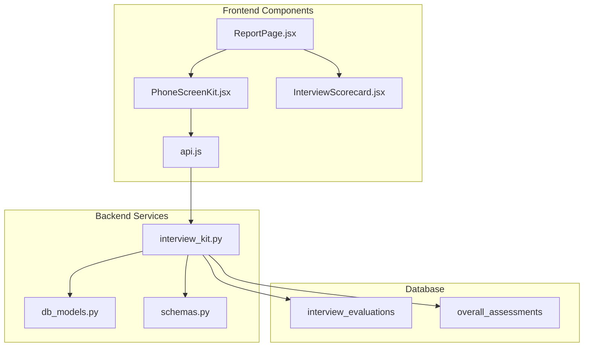
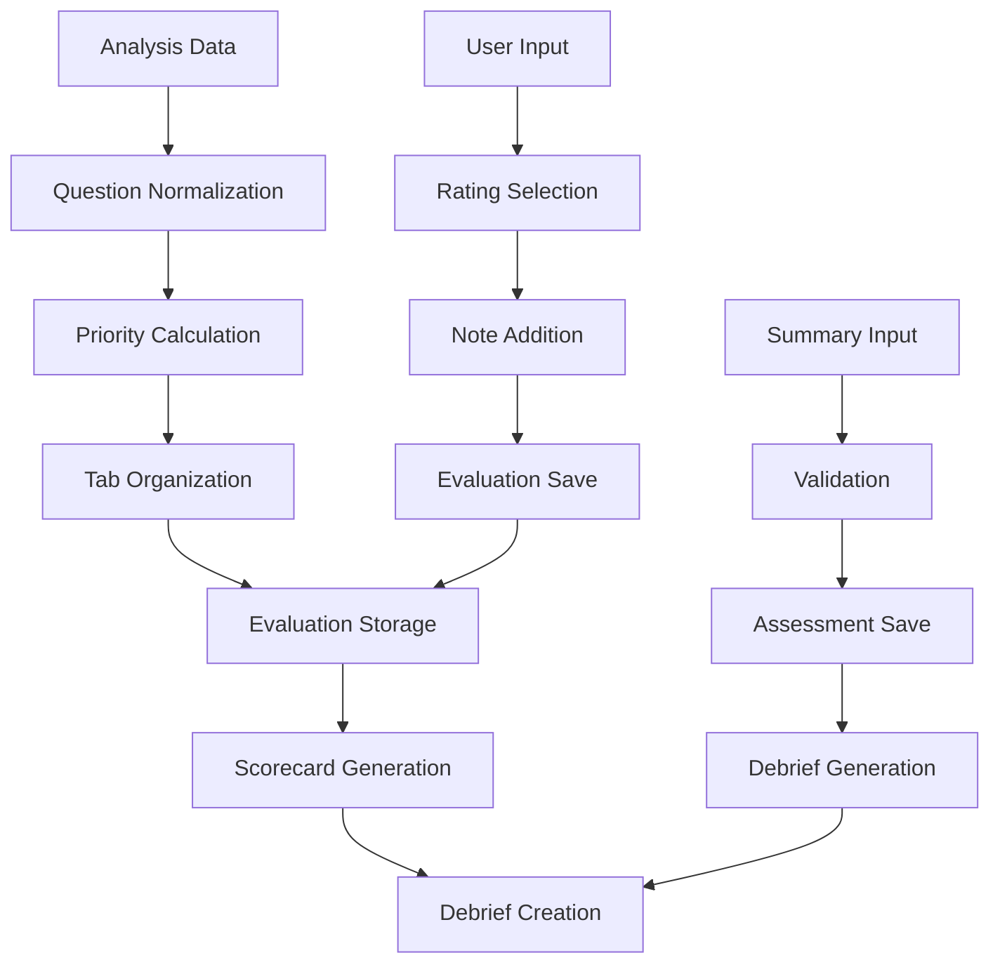
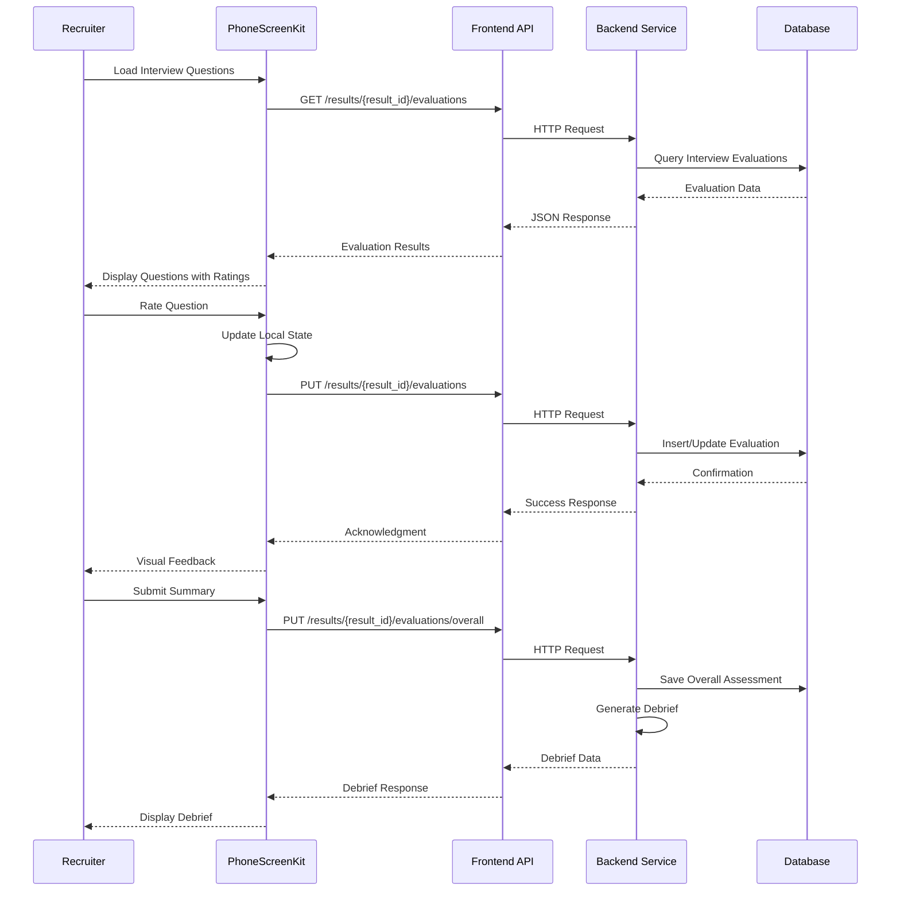
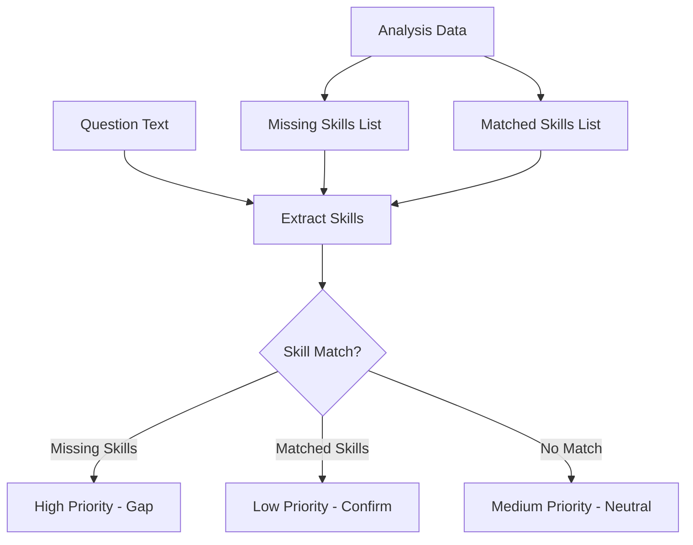
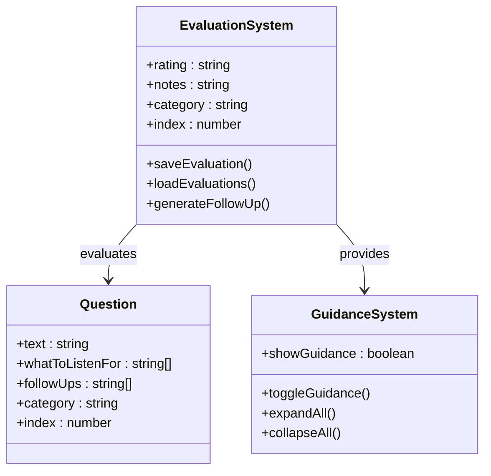
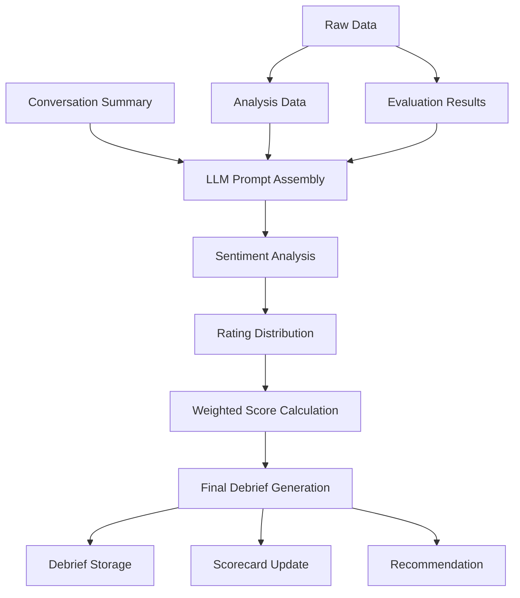
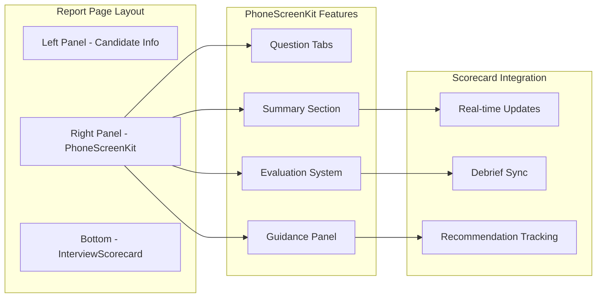
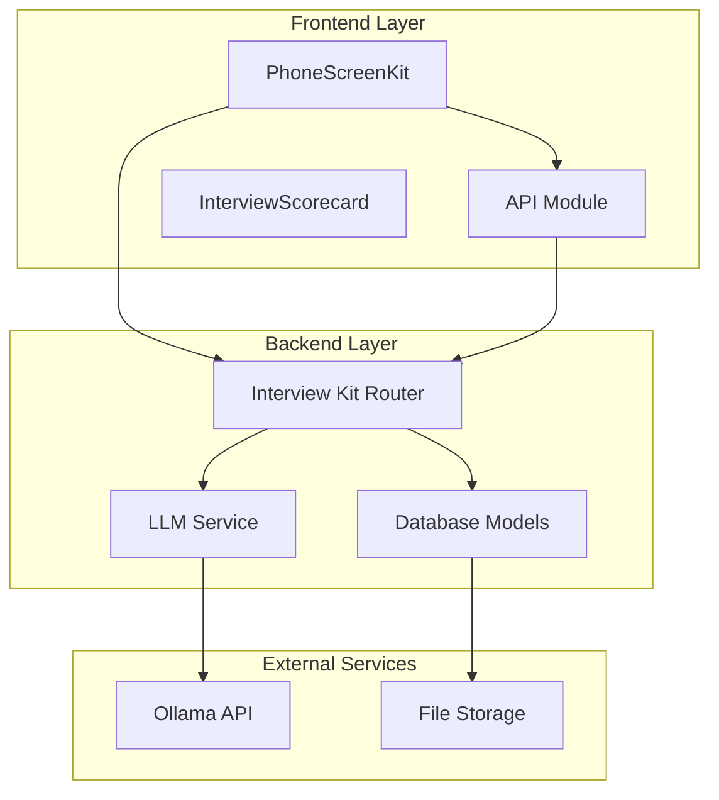

# PhoneScreenKit Component

<cite>
**Referenced Files in This Document**
- [PhoneScreenKit.jsx](file://app/frontend/src/components/PhoneScreenKit.jsx)
- [ReportPage.jsx](file://app/frontend/src/pages/ReportPage.jsx)
- [api.js](file://app/frontend/src/lib/api.js)
- [InterviewScorecard.jsx](file://app/frontend/src/components/InterviewScorecard.jsx)
- [interview_kit.py](file://app/backend/routes/interview_kit.py)
- [db_models.py](file://app/backend/models/db_models.py)
- [schemas.py](file://app/backend/models/schemas.py)
</cite>

## Table of Contents
1. [Introduction](#introduction)
2. [Project Structure](#project-structure)
3. [Core Components](#core-components)
4. [Architecture Overview](#architecture-overview)
5. [Detailed Component Analysis](#detailed-component-analysis)
6. [Dependency Analysis](#dependency-analysis)
7. [Performance Considerations](#performance-considerations)
8. [Troubleshooting Guide](#troubleshooting-guide)
9. [Conclusion](#conclusion)

## Introduction

The PhoneScreenKit component is a specialized React component designed for conducting phone interviews in a split-view interface. It provides recruiters with a comprehensive toolkit for evaluating candidates during telephone screenings, featuring structured interview questions, real-time evaluation capabilities, and automated debrief generation.

This component integrates seamlessly with the broader Resume AI platform, offering a streamlined workflow for phone screening processes. It combines candidate analysis data with interactive interview guidance to create an intelligent screening experience that enhances recruitment efficiency and consistency.

## Project Structure

The PhoneScreenKit component is organized within the frontend application structure, working in conjunction with backend APIs and supporting components:

**Diagram sources**
- [PhoneScreenKit.jsx:1-476](file://app/frontend/src/components/PhoneScreenKit.jsx#L1-L476)
- [ReportPage.jsx:522-548](file://app/frontend/src/pages/ReportPage.jsx#L522-L548)
- [api.js:1209-1243](file://app/frontend/src/lib/api.js#L1209-L1243)
- [interview_kit.py:24-406](file://app/backend/routes/interview_kit.py#L24-L406)

**Section sources**
- [PhoneScreenKit.jsx:1-476](file://app/frontend/src/components/PhoneScreenKit.jsx#L1-L476)
- [ReportPage.jsx:522-548](file://app/frontend/src/pages/ReportPage.jsx#L522-L548)

## Core Components

### PhoneScreenKit Component Architecture

The PhoneScreenKit component serves as the primary interface for phone screening activities, featuring:

#### Key Features:
- **Multi-tab Question Management**: Technical, Behavioral, Culture Fit, and Experience Deep-Dive categories
- **Dynamic Question Prioritization**: Automatic sorting based on candidate skill gaps and matches
- **Real-time Evaluation System**: Interactive rating and note-taking for each question
- **Integrated Guidance**: Contextual hints and follow-up suggestions for interviewers
- **Automated Debrief Generation**: AI-powered summary creation and recommendation
- **Candidate Briefing**: Pre-screening insights and preparation guidance

#### Data Flow:

**Diagram sources**
- [PhoneScreenKit.jsx:62-75](file://app/frontend/src/components/PhoneScreenKit.jsx#L62-L75)
- [PhoneScreenKit.jsx:151-168](file://app/frontend/src/components/PhoneScreenKit.jsx#L151-L168)

**Section sources**
- [PhoneScreenKit.jsx:77-85](file://app/frontend/src/components/PhoneScreenKit.jsx#L77-L85)

### Backend Integration Points

The component interfaces with several backend services for comprehensive functionality:

#### API Endpoints:
- `/results/{result_id}/evaluations` - CRUD operations for individual question evaluations
- `/results/{result_id}/evaluations/overall` - Overall assessment management
- `/results/{result_id}/scorecard` - Scorecard generation and retrieval
- `/results/{result_id}/generate-debrief` - Automated debrief generation

#### Database Schema:
The backend utilizes two primary tables for evaluation persistence:
- `interview_evaluations`: Stores individual question ratings and notes
- `overall_assessments`: Maintains recruiter summaries and recommendations

**Section sources**
- [api.js:1209-1243](file://app/frontend/src/lib/api.js#L1209-L1243)
- [interview_kit.py:41-139](file://app/backend/routes/interview_kit.py#L41-L139)
- [db_models.py:282-323](file://app/backend/models/db_models.py#L282-L323)

## Architecture Overview

The PhoneScreenKit component follows a client-server architecture pattern with comprehensive state management:

**Diagram sources**
- [PhoneScreenKit.jsx:114-133](file://app/frontend/src/components/PhoneScreenKit.jsx#L114-L133)
- [PhoneScreenKit.jsx:151-168](file://app/frontend/src/components/PhoneScreenKit.jsx#L151-L168)
- [PhoneScreenKit.jsx:174-214](file://app/frontend/src/components/PhoneScreenKit.jsx#L174-L214)

**Section sources**
- [PhoneScreenKit.jsx:86-168](file://app/frontend/src/components/PhoneScreenKit.jsx#L86-L168)
- [interview_kit.py:246-405](file://app/backend/routes/interview_kit.py#L246-L405)

## Detailed Component Analysis

### Question Management System

The PhoneScreenKit implements a sophisticated question management system that organizes interview questions into logical categories and prioritizes them based on candidate analysis:

#### Question Categories:
- **Technical Questions**: Domain-specific competency assessment
- **Behavioral Questions**: Soft skills and cultural alignment evaluation
- **Culture Fit Questions**: Organizational values and team dynamics assessment
- **Experience Deep-Dive Questions**: Detailed exploration of professional background

#### Priority Algorithm:
Questions are automatically prioritized using the following criteria:
1. **High Priority**: Questions containing missing skills from candidate analysis
2. **Medium Priority**: Neutral questions with no skill indicators
3. **Low Priority**: Questions confirming already matched skills

**Diagram sources**
- [PhoneScreenKit.jsx:44-60](file://app/frontend/src/components/PhoneScreenKit.jsx#L44-L60)
- [PhoneScreenKit.jsx:62-75](file://app/frontend/src/components/PhoneScreenKit.jsx#L62-L75)

**Section sources**
- [PhoneScreenKit.jsx:96-101](file://app/frontend/src/components/PhoneScreenKit.jsx#L96-L101)
- [PhoneScreenKit.jsx:303-304](file://app/frontend/src/components/PhoneScreenKit.jsx#L303-L304)

### Evaluation System

The evaluation system provides comprehensive rating capabilities with contextual guidance:

#### Rating Categories:
- **Strong**: Deep, specific, evidence-backed answers with measurable outcomes
- **Adequate**: General understanding with some relevant experience
- **Weak**: Surface-level or theoretical responses

#### Contextual Guidance:
The system provides intelligent follow-up prompts based on ratings:
- **Weak Ratings**: Questions to understand candidate competency levels
- **Adequate Ratings**: Prompts to dig deeper for clarification
- **Strong Ratings**: Confirmation questions to validate expertise

**Diagram sources**
- [PhoneScreenKit.jsx:387-434](file://app/frontend/src/components/PhoneScreenKit.jsx#L387-L434)
- [PhoneScreenKit.jsx:336-383](file://app/frontend/src/components/PhoneScreenKit.jsx#L336-L383)

**Section sources**
- [PhoneScreenKit.jsx:387-434](file://app/frontend/src/components/PhoneScreenKit.jsx#L387-L434)

### Debrief Generation Pipeline

The automated debrief generation process creates comprehensive interview summaries:

#### Debrief Components:
- **Overview**: Executive summary of candidate performance
- **Strengths Observed**: Key positive attributes identified
- **Concerns**: Areas requiring attention or further investigation
- **Recommendation Rationale**: Justification for final recommendation
- **Sentiment Analysis**: Quantified emotional tone of the interview

#### Scoring Algorithm:
The final recruiter score combines:
- **40%**: Rating distribution analysis
- **60%**: LLM sentiment analysis of conversation summary

**Diagram sources**
- [interview_kit.py:246-405](file://app/backend/routes/interview_kit.py#L246-L405)

**Section sources**
- [interview_kit.py:288-360](file://app/backend/routes/interview_kit.py#L288-L360)

### Integration with Report Page

The PhoneScreenKit integrates seamlessly with the main report page in a split-view layout:

**Diagram sources**
- [ReportPage.jsx:522-548](file://app/frontend/src/pages/ReportPage.jsx#L522-L548)
- [PhoneScreenKit.jsx:228-474](file://app/frontend/src/components/PhoneScreenKit.jsx#L228-L474)

**Section sources**
- [ReportPage.jsx:522-548](file://app/frontend/src/pages/ReportPage.jsx#L522-L548)

## Dependency Analysis

The PhoneScreenKit component has well-defined dependencies that ensure maintainable and scalable functionality:

### Frontend Dependencies:
- **React Hooks**: useState, useEffect for state management
- **Lucide Icons**: Consistent iconography across components
- **Custom API Module**: Centralized HTTP request handling
- **Parent Component**: ReportPage for integration context

### Backend Dependencies:
- **FastAPI Router**: RESTful API endpoint definitions
- **SQLAlchemy ORM**: Database interaction and modeling
- **Pydantic Schemas**: Data validation and serialization
- **LLM Service**: External AI model integration

**Diagram sources**
- [PhoneScreenKit.jsx:1-6](file://app/frontend/src/components/PhoneScreenKit.jsx#L1-L6)
- [interview_kit.py:1-24](file://app/backend/routes/interview_kit.py#L1-L24)

**Section sources**
- [PhoneScreenKit.jsx:1-6](file://app/frontend/src/components/PhoneScreenKit.jsx#L1-L6)
- [interview_kit.py:1-24](file://app/backend/routes/interview_kit.py#L1-L24)

## Performance Considerations

### Client-Side Optimization:
- **Lazy Loading**: Conditional loading of evaluation data prevents unnecessary API calls
- **State Management**: Efficient local state updates minimize re-renders
- **Memory Management**: Proper cleanup of blob URLs and event listeners

### Server-Side Efficiency:
- **Database Indexing**: Optimized queries for evaluation retrieval
- **Connection Pooling**: Efficient database connection management
- **Caching Strategies**: Reduced repeated computation of rating distributions

### Scalability Factors:
- **Horizontal Scaling**: Stateless API design supports load balancing
- **Database Constraints**: Unique constraints prevent data inconsistencies
- **API Rate Limiting**: Built-in protection against abuse

## Troubleshooting Guide

### Common Issues and Solutions:

#### Evaluation Persistence Failures:
**Symptoms**: Ratings not saving or appearing inconsistent
**Causes**: Network timeouts, authentication issues, database constraints
**Solutions**: 
- Verify network connectivity and API availability
- Check user authentication status
- Review database constraint violations

#### Debrief Generation Errors:
**Symptoms**: Debrief not generated despite successful summary submission
**Causes**: LLM service unavailability, JSON parsing failures
**Solutions**:
- Monitor LLM service health
- Validate conversation summary format
- Implement fallback mechanisms

#### Performance Issues:
**Symptoms**: Slow loading times or UI lag
**Causes**: Large dataset handling, inefficient rendering
**Solutions**:
- Implement virtual scrolling for long question lists
- Optimize API response sizes
- Add loading states and skeleton screens

**Section sources**
- [PhoneScreenKit.jsx:127-129](file://app/frontend/src/components/PhoneScreenKit.jsx#L127-L129)
- [PhoneScreenKit.jsx:209-211](file://app/frontend/src/components/PhoneScreenKit.jsx#L209-L211)

## Conclusion

The PhoneScreenKit component represents a comprehensive solution for modern phone screening processes, combining intelligent question management with automated evaluation and debrief generation. Its modular architecture ensures maintainability while providing powerful functionality for recruitment teams.

Key strengths include:
- **Intelligent Question Prioritization**: Enhances interview effectiveness by focusing on critical skill gaps
- **Real-time Collaboration**: Supports team-based evaluation with shared insights
- **Automated Workflow**: Reduces administrative burden through AI-powered debrief generation
- **Seamless Integration**: Works harmoniously with existing candidate analysis workflows

The component's design emphasizes scalability, performance, and user experience, making it an essential tool for efficient and effective phone screening processes in the Resume AI platform ecosystem.