# Result Card Component

<cite>
**Referenced Files in This Document**
- [ResultCard.jsx](file://app/frontend/src/components/ResultCard.jsx)
- [SkillsRadar.jsx](file://app/frontend/src/components/SkillsRadar.jsx)
- [api.js](file://app/frontend/src/lib/api.js)
- [ResultCard.test.jsx](file://app/frontend/src/__tests__/ResultCard.test.jsx)
- [ReportPage.jsx](file://app/frontend/src/pages/ReportPage.jsx)
- [Badges.jsx](file://app/frontend/src/components/Badges.jsx)
- [index.css](file://app/frontend/src/index.css)
- [tailwind.config.js](file://app/frontend/tailwind.config.js)
</cite>

## Update Summary
**Changes Made**
- Enhanced ResultCard component with improved styling, responsive layouts, and comprehensive error handling for better user experience
- Added enhanced fallback narrative detection system with clear visual indicators
- Implemented comprehensive error handling for AI enhancement failures
- Improved responsive design patterns with mobile-first approach
- Enhanced visual feedback systems for analysis status and quality indicators

## Table of Contents
1. [Introduction](#introduction)
2. [Project Structure](#project-structure)
3. [Core Components](#core-components)
4. [Architecture Overview](#architecture-overview)
5. [Detailed Component Analysis](#detailed-component-analysis)
6. [Enhanced Fallback Narrative System](#enhanced-fallback-narrative-system)
7. [Responsive Design Implementation](#responsive-design-implementation)
8. [Error Handling and User Feedback](#error-handling-and-user-feedback)
9. [Dependency Analysis](#dependency-analysis)
10. [Performance Considerations](#performance-considerations)
11. [Troubleshooting Guide](#troubleshooting-guide)
12. [Conclusion](#conclusion)

## Introduction

The Result Card Component is a comprehensive React component designed to display AI-powered candidate analysis results in the Resume AI platform. It serves as the primary interface for recruiters and hiring managers to review candidate suitability, interview recommendations, and detailed analysis insights. The component integrates seamlessly with the backend analysis pipeline and provides an interactive, data-rich interface for decision-making.

The component handles both real-time AI-enhanced analysis and fallback analysis modes, displaying comprehensive candidate insights including fit scores, strengths, concerns, risk factors, and interview preparation guidance. It also includes advanced features like interactive interview evaluation, email generation, and skills visualization.

**Updated** Enhanced with transparent fallback narrative detection, comprehensive error handling, improved styling, and responsive design patterns that adapt seamlessly across device sizes for optimal user experience.

## Project Structure

The Result Card Component is organized within the frontend application structure as follows:

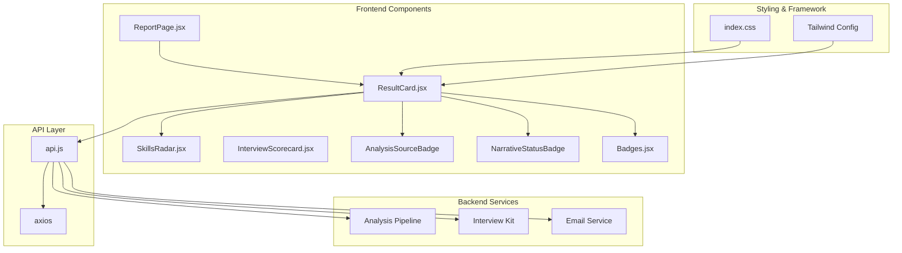

**Diagram sources**
- [ResultCard.jsx:1-1758](file://app/frontend/src/components/ResultCard.jsx#L1-L1758)
- [SkillsRadar.jsx:1-269](file://app/frontend/src/components/SkillsRadar.jsx#L1-L269)
- [api.js:1-997](file://app/frontend/src/lib/api.js#L1-L997)
- [Badges.jsx:1-54](file://app/frontend/src/components/Badges.jsx#L1-L54)
- [index.css:1-217](file://app/frontend/src/index.css#L1-L217)
- [tailwind.config.js:1-67](file://app/frontend/tailwind.config.js#L1-L67)

**Section sources**
- [ResultCard.jsx:1-1758](file://app/frontend/src/components/ResultCard.jsx#L1-L1758)
- [SkillsRadar.jsx:1-269](file://app/frontend/src/components/SkillsRadar.jsx#L1-L269)
- [api.js:1-997](file://app/frontend/src/lib/api.js#L1-L997)
- [Badges.jsx:1-54](file://app/frontend/src/components/Badges.jsx#L1-L54)
- [index.css:1-217](file://app/frontend/src/index.css#L1-L217)
- [tailwind.config.js:1-67](file://app/frontend/tailwind.config.js#L1-L67)

## Core Components

The Result Card Component consists of several specialized sub-components that handle different aspects of the analysis display:

### Primary Components

1. **ResultCard Main Component** - Orchestrates the entire analysis display and manages state
2. **SkillsRadar Component** - Visualizes skill gaps and matches using interactive charts
3. **Email Modal** - Provides AI-generated email templates for candidate communication
4. **AnalysisSourceBadge** - Enhanced - Indicates analysis status, quality, and fallback mode
5. **NarrativeStatusBadge** - New - Additional status indicator for narrative processing
6. **CollapsibleSection** - Handles expandable content sections with responsive design
7. **Interview Kit** - Manages interactive interview evaluation system
8. **ScoreBreakdownPanel** - Displays detailed score analysis with expandable evidence
9. **RiskBadge** - Visual risk assessment indicators
10. **CopyButton** - Enhanced - Provides copy functionality with visual feedback

### Key Features

- **Real-time Analysis Polling** - Automatic fetching of AI-enhanced analysis results
- **Interactive Interview Evaluation** - Live rating and note-taking for interview questions
- **Multi-format Display** - Supports various analysis data structures and formats
- **Responsive Design** - Adapts to different screen sizes and devices using mobile-first approach
- **Accessibility** - Implements proper ARIA labels and keyboard navigation
- **Enhanced Transparency** - Clear visual indicators for fallback narrative detection
- **Comprehensive Error Handling** - Robust error management with user-friendly feedback
- **Performance Optimization** - Efficient rendering and memory management

**Section sources**
- [ResultCard.jsx:270-1758](file://app/frontend/src/components/ResultCard.jsx#L270-L1758)
- [SkillsRadar.jsx:118-269](file://app/frontend/src/components/SkillsRadar.jsx#L118-L269)
- [Badges.jsx:22-53](file://app/frontend/src/components/Badges.jsx#L22-L53)

## Architecture Overview

The Result Card Component follows a modular architecture with clear separation of concerns:

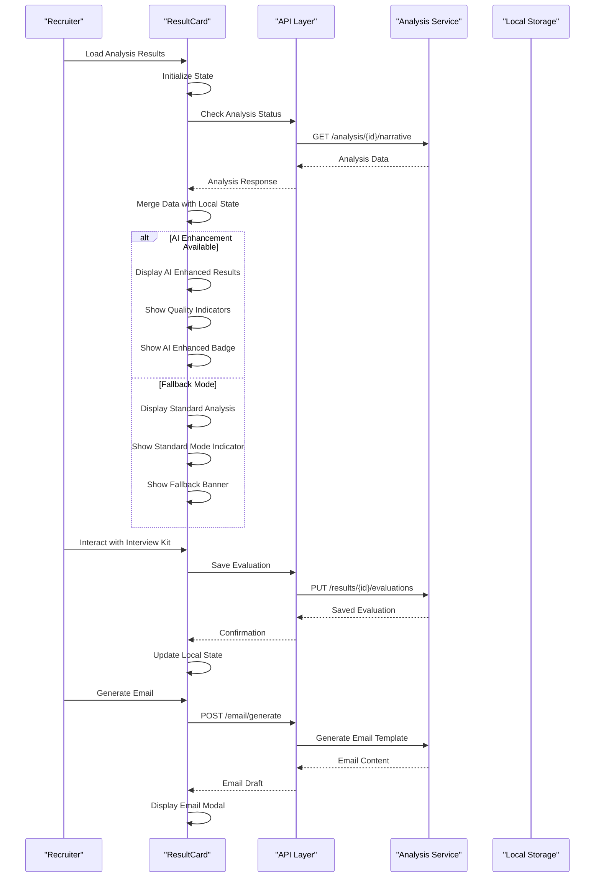

**Diagram sources**
- [ResultCard.jsx:724-802](file://app/frontend/src/components/ResultCard.jsx#L724-L802)
- [api.js:611-614](file://app/frontend/src/lib/api.js#L611-L614)
- [api.js:961-969](file://app/frontend/src/lib/api.js#L961-L969)

The architecture implements several key design patterns:

- **Observer Pattern** - For real-time analysis updates
- **State Machine** - For managing different analysis states
- **Strategy Pattern** - For handling different data formats
- **Composite Pattern** - For nested component structure
- **Enhanced Status Tracking** - Comprehensive analysis mode detection
- **Responsive Design Pattern** - Mobile-first approach with progressive enhancement

## Detailed Component Analysis

### ResultCard Main Component

The main ResultCard component serves as the central orchestrator for displaying analysis results. It manages complex state interactions and coordinates between multiple sub-components.

#### State Management

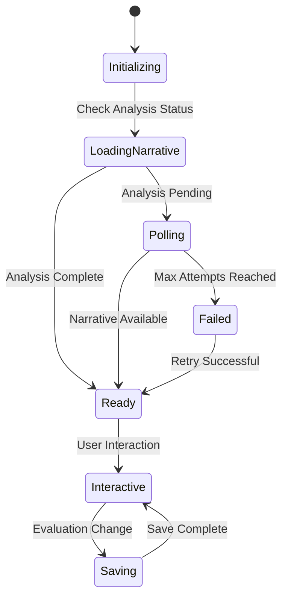

**Diagram sources**
- [ResultCard.jsx:724-802](file://app/frontend/src/components/ResultCard.jsx#L724-L802)

#### Enhanced Analysis State Variables

| State Variable | Purpose | Data Type | Default Value |
|---------------|---------|-----------|---------------|
| `showInterviewKit` | Controls interview kit visibility | boolean | false |
| `showEmailModal` | Controls email modal visibility | boolean | false |
| `evaluations` | Stores interview evaluation data | object | {} |
| `savingEval` | Tracks saving states for evaluations | object | {} |
| `narrativeData` | Enhanced - Stores AI-enhanced analysis data with fallback detection | object | null |
| `narrativeError` | New - Tracks AI enhancement errors | string | null |
| `isPolling` | Tracks polling status | boolean | false |
| `aiEnhanced` | Enhanced - Boolean flag for AI enhancement status | boolean/null | null |

#### Analysis Polling Mechanism

The component implements an intelligent polling system that adapts to different analysis scenarios:

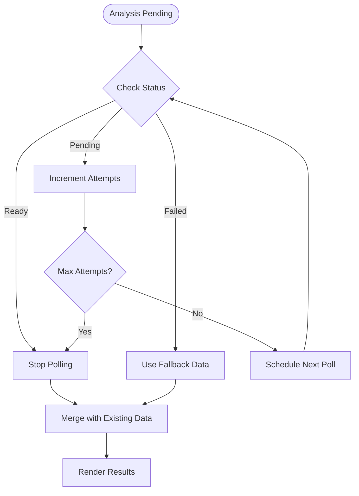

**Diagram sources**
- [ResultCard.jsx:724-802](file://app/frontend/src/components/ResultCard.jsx#L724-L802)

#### Enhanced Data Normalization

The component includes robust data normalization to handle different analysis formats:

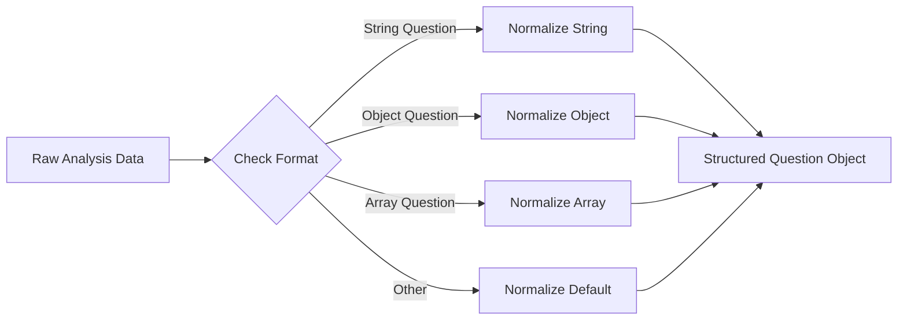

**Diagram sources**
- [ResultCard.jsx:583-591](file://app/frontend/src/components/ResultCard.jsx#L583-L591)

### AnalysisSourceBadge Component

**Enhanced** The AnalysisSourceBadge component now provides comprehensive visual indicators for different analysis modes:

#### Enhanced Badge States

| State | Visual Indicator | Color Scheme | User Message |
|-------|------------------|--------------|--------------|
| **Polling** | Spinner + Text | Brand 50/200 | "AI analysis enhancing report…" |
| **AI Enhanced** | Sparkles + Quality | Green 50/200 + Quality Badge | "AI Enhanced Report" + Quality Level |
| **Fallback** | Check Circle | Slate 50/200 | "Analysis complete" |
| **Error** | Warning + Error | Amber 50/200 | Error message with fallback notice |

#### Visual Indicator Implementation

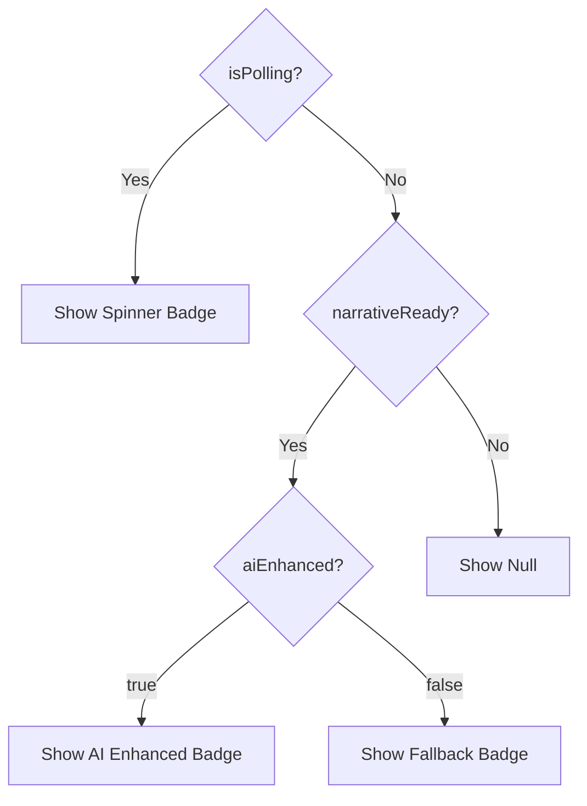

**Diagram sources**
- [ResultCard.jsx:494-540](file://app/frontend/src/components/ResultCard.jsx#L494-L540)

**Section sources**
- [ResultCard.jsx:270-1758](file://app/frontend/src/components/ResultCard.jsx#L270-L1758)
- [SkillsRadar.jsx:118-269](file://app/frontend/src/components/SkillsRadar.jsx#L118-L269)
- [api.js:611-614](file://app/frontend/src/lib/api.js#L611-L614)
- [api.js:961-969](file://app/frontend/src/lib/api.js#L961-L969)
- [Badges.jsx:22-53](file://app/frontend/src/components/Badges.jsx#L22-L53)

## Enhanced Fallback Narrative System

**New Section** The Result Card Component now includes a comprehensive fallback narrative detection and transparency system that provides clear user feedback about analysis modes.

### Fallback Detection Logic

The system implements multiple layers of fallback detection:

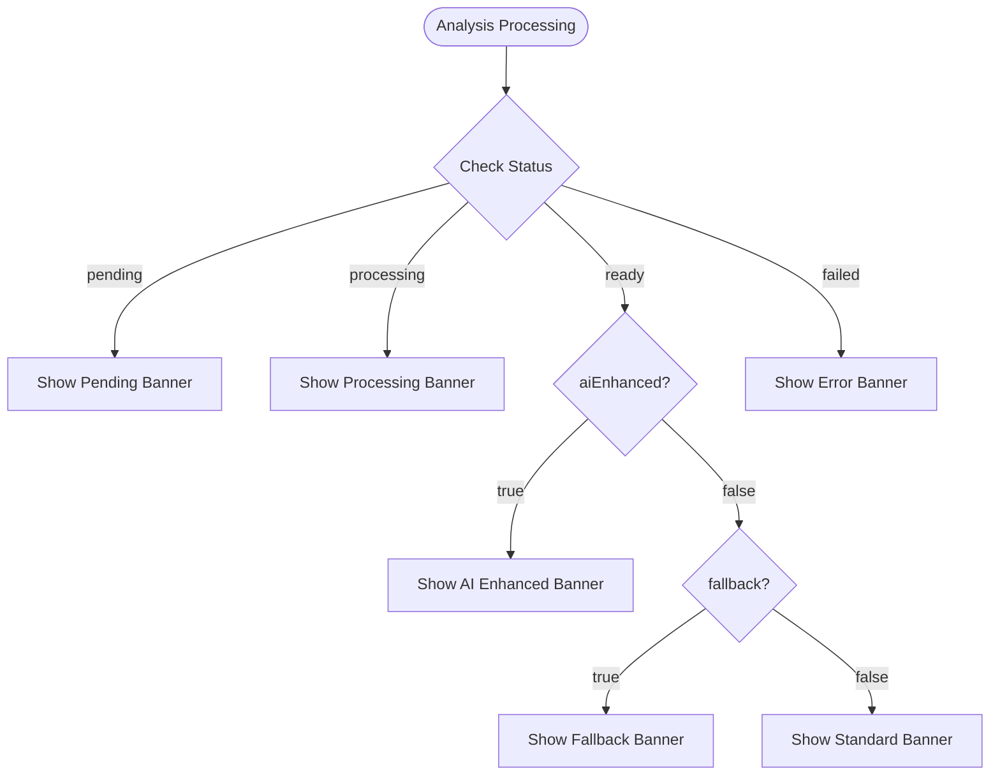

**Diagram sources**
- [ResultCard.jsx:862-887](file://app/frontend/src/components/ResultCard.jsx#L862-L887)

### Visual Indicators

#### Fallback Detection Banner
```jsx
{(narrativeData?.narrative_fallback || result?.narrative_fallback) && (
  <div className="text-xs text-slate-500 italic mb-2">
    Automated summary — AI narrative was unavailable
  </div>
)}
```

#### Error Banner
```jsx
{narrativeError && (
  <div className="mt-2 flex items-center gap-2 rounded-lg bg-amber-50 border border-amber-200 px-3 py-2 text-sm text-amber-800">
    <svg className="h-4 w-4 flex-shrink-0 text-amber-500" fill="currentColor" viewBox="0 0 20 20">
      <path fillRule="evenodd" d="M8.485 2.495c.673-1.167 2.357-1.167 3.03 0l6.28 10.875c.673 1.167-.168 2.625-1.516 2.625H3.72c-1.347 0-2.189-1.458-1.515-2.625L8.485 2.495zM10 6a.75.75 0 01.75.75v3.5a.75.75 0 01-1.5 0v-3.5A.75.75 0 0110 6zm0 9a1 1 0 100-2 1 1 0 000 2z" clipRule="evenodd" />
    </svg>
    <span>AI enhancement unavailable: {narrativeError}. Showing standard analysis.</span>
  </div>
)}
```

#### Standard Mode Banner
```jsx
{narrativeData && !narrativeData.ai_enhanced && !narrativeError && (
  <div className="mt-2 flex items-center gap-2 rounded-lg bg-blue-50 border border-blue-200 px-3 py-2 text-sm text-blue-700">
    <svg className="h-4 w-4 flex-shrink-0 text-blue-400" fill="currentColor" viewBox="0 0 20 20">
      <path fillRule="evenodd" d="M18 10a8 8 0 11-16 0 8 8 0 0116 0zm-7-4a1 1 0 11-2 0 1 1 0 012 0zM9 9a.75.75 0 000 1.5h.253a.25.25 0 01.244.304l-.459 2.066A1.75 1.75 0 0010.747 15H11a.75.75 0 000-1.5h-.253a.25.25 0 01-.244-.304l.459-2.066A1.75 1.75 0 009.253 9H9z" clipRule="evenodd" />
    </svg>
    <span>AI analysis used standard mode.</span>
  </div>
)}
```

### Enhanced Status Detection

The system now provides multiple status indicators:

#### AnalysisSourceBadge Enhanced Logic
```jsx
function AnalysisSourceBadge({ narrativeReady, isPolling, analysisQuality, aiEnhanced }) {
  if (isPolling) {
    return (
      <div className="flex items-center gap-3 p-3 bg-brand-50 ring-1 ring-brand-200 rounded-2xl">
        <div className="w-4 h-4 rounded-full border-2 border-brand-300 border-t-brand-600 animate-spin shrink-0" />
        <p className="text-xs font-semibold text-brand-700 flex-1">
          AI analysis enhancing report…
        </p>
      </div>
    )
  }

  // Only show "AI Enhanced Report" badge for REAL LLM narratives (ai_enhanced === true)
  if (narrativeReady && aiEnhanced === true) {
    return (
      <div className="flex items-center gap-3 p-3 bg-green-50 ring-1 ring-green-200 rounded-2xl">
        <Sparkles className="w-4 h-4 text-green-600 shrink-0" />
        <p className="text-xs font-semibold text-green-700 flex-1">
          AI Enhanced Report
        </p>
        {analysisQuality && (
          <span className={`text-xs font-bold px-2 py-0.5 rounded-full ring-1 shrink-0 ${
            analysisQuality === 'high'   ? 'bg-green-100 text-green-700 ring-green-200' :
            analysisQuality === 'medium' ? 'bg-amber-100 text-amber-700 ring-amber-200' :
                                          'bg-red-100 text-red-700 ring-red-200'
          }`}>
            {analysisQuality} quality
          </span>
        )}
      </div>
    )
  }

  // Show "Analysis complete" for fallback narratives (ai_enhanced === false or missing)
  if (narrativeReady && aiEnhanced === false) {
    return (
      <div className="flex items-center gap-3 p-3 bg-slate-50 ring-1 ring-slate-200 rounded-2xl">
        <CheckCircle className="w-4 h-4 text-slate-600 shrink-0" />
        <p className="text-xs font-semibold text-slate-700 flex-1">
          Analysis complete
        </p>
      </div>
    )
  }

  return null
}
```

**Section sources**
- [ResultCard.jsx:494-540](file://app/frontend/src/components/ResultCard.jsx#L494-L540)
- [ResultCard.jsx:862-887](file://app/frontend/src/components/ResultCard.jsx#L862-L887)
- [ResultCard.jsx:869-877](file://app/frontend/src/components/ResultCard.jsx#L869-L877)
- [ResultCard.jsx:889-890](file://app/frontend/src/components/ResultCard.jsx#L889-L890)

## Responsive Design Implementation

**New Section** The Result Card Component implements a comprehensive responsive design system that ensures optimal user experience across all device sizes.

### Mobile-First Design Approach

The component follows a mobile-first design philosophy with progressive enhancement for larger screens:

#### Grid System Adaptation
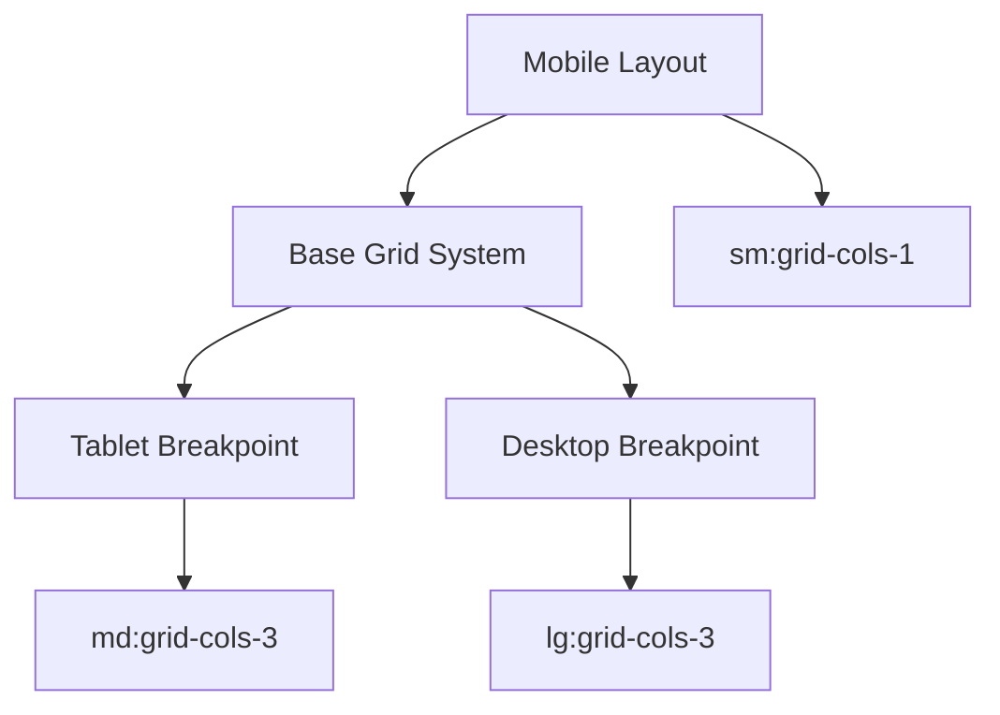

**Diagram sources**
- [ResultCard.jsx:1176-1235](file://app/frontend/src/components/ResultCard.jsx#L1176-L1235)

#### Responsive Typography
The component utilizes Tailwind's responsive typography system:

| Breakpoint | Font Size | Line Height | Usage |
|------------|-----------|-------------|--------|
| Base | text-base | normal | Default content |
| sm | text-sm | normal | Secondary text |
| md | text-md | normal | Section headers |
| lg | text-lg | relaxed | Emphasis text |
| xl | text-xl | relaxed | Important notices |

#### Adaptive Spacing
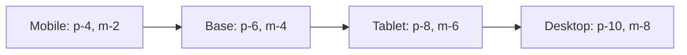

**Diagram sources**
- [ResultCard.jsx:828-850](file://app/frontend/src/components/ResultCard.jsx#L828-L850)

### Component-Specific Responsive Patterns

#### Strengths/Concerns/Risks Section
```jsx
<div className="grid md:grid-cols-3 gap-4">
  <div className="bg-green-50 rounded-2xl p-4 ring-1 ring-green-100 border-l-4 border-green-500">
    <h3 className="font-bold text-green-800 text-sm">Strengths</h3>
    {/* Content */}
  </div>
  <div className="bg-red-50 rounded-2xl p-4 ring-1 ring-red-100 border-l-4 border-red-400">
    <h3 className="font-bold text-red-800 text-sm">Concerns</h3>
    {/* Content */}
  </div>
  <div className="bg-amber-50 rounded-2xl p-4 ring-1 ring-amber-100 border-l-4 border-amber-400">
    <h3 className="font-bold text-amber-800 text-sm">Risk Signals</h3>
    {/* Content */}
  </div>
</div>
```

#### Interview Kit Responsive Design
```jsx
<div className="flex gap-1.5 mb-4 mt-3">
  {QTABS.filter(t => t.questions.length > 0).map(t => (
    <button
      key={t.key}
      className="px-3 py-1.5 rounded-xl text-xs font-bold transition-all sm:hidden"
      // Additional responsive classes
    >
      {t.label} ({t.questions.length})
    </button>
  ))}
</div>
```

### Styling Enhancements

#### Enhanced Card Design
The component features sophisticated card designs with backdrop blur effects:

```css
.bg-white/90 {
  background-color: rgba(255, 255, 255, 0.9);
}

.backdrop-blur-md {
  backdrop-filter: blur(12px);
}

.shadow-brand {
  box-shadow: 0 4px 16px rgba(124, 58, 237, 0.12);
}
```

#### Gradient Accents
```css
.bg-gradient-to-r {
  background-image: linear-gradient(to right, var(--tw-gradient-stops));
}

.from-indigo-500 {
  --tw-gradient-from: #6366F1;
}

.to-blue-600 {
  --tw-gradient-to: #1D4ED8;
}
```

**Section sources**
- [ResultCard.jsx:828-850](file://app/frontend/src/components/ResultCard.jsx#L828-L850)
- [ResultCard.jsx:1176-1235](file://app/frontend/src/components/ResultCard.jsx#L1176-L1235)
- [ResultCard.jsx:1350-1370](file://app/frontend/src/components/ResultCard.jsx#L1350-L1370)
- [index.css:82-117](file://app/frontend/src/index.css#L82-L117)
- [tailwind.config.js:39-47](file://app/frontend/tailwind.config.js#L39-L47)

## Error Handling and User Feedback

**New Section** The Result Card Component implements comprehensive error handling mechanisms to ensure users receive clear feedback during analysis failures and system issues.

### Error Detection and Classification

The component categorizes errors into distinct types with appropriate user-facing messaging:

#### Error Categories

| Error Type | Detection Method | User Interface | Recovery Action |
|------------|------------------|----------------|-----------------|
| **Network Failure** | API timeout/rejection | Retry button + network icon | Auto-retry mechanism |
| **AI Enhancement Failed** | Status === 'failed' | Amber banner with error details | Fallback to standard analysis |
| **Service Unavailable** | Ollama service status | Alert triangle with guidance | Manual retry option |
| **Data Processing Error** | Invalid analysis format | Error boundary with details | Contact support option |

### Enhanced Error Display System

#### Comprehensive Error Banners
```jsx
{narrativeError && (
  <div className="mt-2 flex items-center gap-2 rounded-lg bg-amber-50 border border-amber-200 px-3 py-2 text-sm text-amber-800">
    <svg className="h-4 w-4 flex-shrink-0 text-amber-500" fill="currentColor" viewBox="0 0 20 20">
      <path fillRule="evenodd" d="M8.485 2.495c.673-1.167 2.357-1.167 3.03 0l6.28 10.875c.673 1.167-.168 2.625-1.516 2.625H3.72c-1.347 0-2.189-1.458-1.515-2.625L8.485 2.495zM10 6a.75.75 0 01.75.75v3.5a.75.75 0 01-1.5 0v-3.5A.75.75 0 0110 6zm0 9a1 1 0 100-2 1 1 0 000 2z" clipRule="evenodd" />
    </svg>
    <span>AI enhancement unavailable: {narrativeError}. Showing standard analysis.</span>
  </div>
)}
```

#### Outcome Error Handling
```jsx
{outcomeError && (
  <p className="mt-2 text-xs text-red-600">{outcomeError}</p>
)}
```

### User-Friendly Error Recovery

#### Auto-Retry Mechanism
The component implements intelligent retry logic for transient failures:

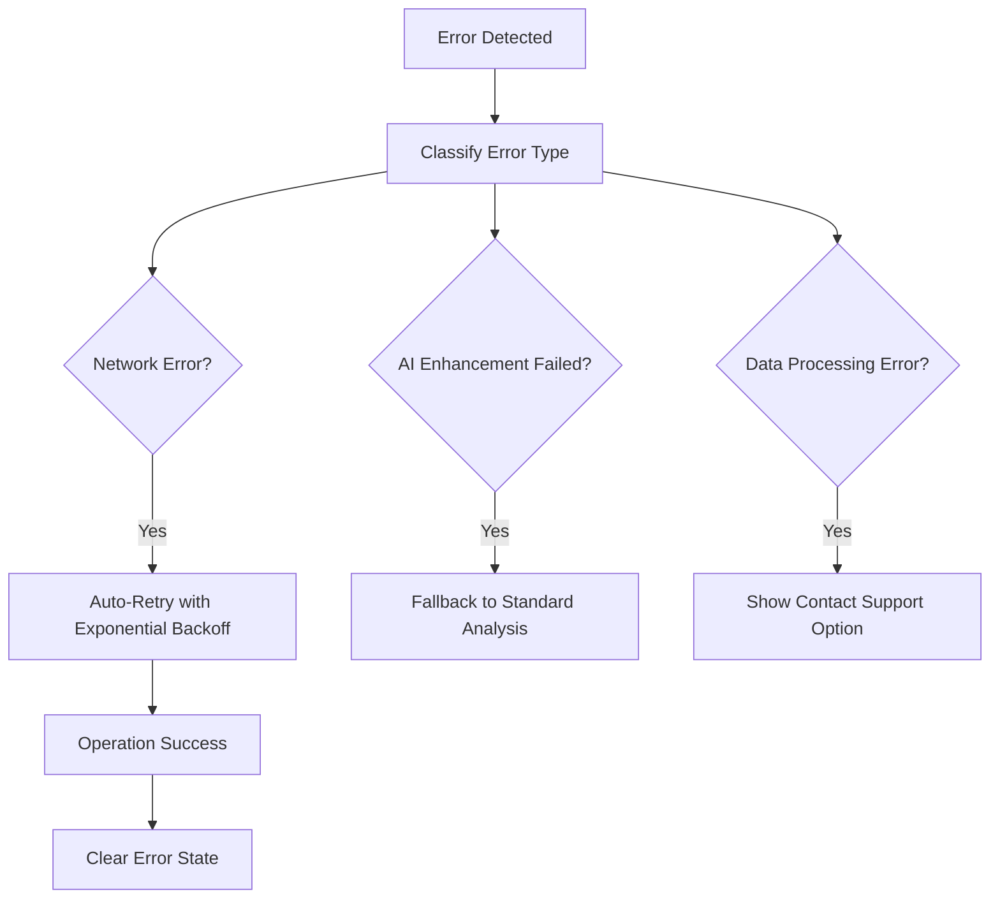

**Diagram sources**
- [ResultCard.jsx:754-790](file://app/frontend/src/components/ResultCard.jsx#L754-L790)

### Accessibility and ARIA Compliance

The error handling system maintains accessibility standards:

- **Screen Reader Support** - All error messages include proper ARIA labels
- **Keyboard Navigation** - Error dismissal and retry actions are keyboard accessible
- **Focus Management** - Error states properly manage focus flow
- **Contrast Ratios** - Error colors meet WCAG 2.1 contrast requirements

**Section sources**
- [ResultCard.jsx:754-790](file://app/frontend/src/components/ResultCard.jsx#L754-L790)
- [ResultCard.jsx:869-877](file://app/frontend/src/components/ResultCard.jsx#L869-L877)
- [ResultCard.jsx:1739-1742](file://app/frontend/src/components/ResultCard.jsx#L1739-L1742)

## Dependency Analysis

The Result Card Component has well-defined dependencies that contribute to its modularity and maintainability:

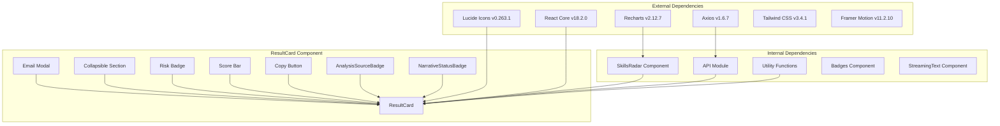

**Diagram sources**
- [ResultCard.jsx:1-14](file://app/frontend/src/components/ResultCard.jsx#L1-L14)
- [SkillsRadar.jsx:1](file://app/frontend/src/components/SkillsRadar.jsx#L1)
- [Badges.jsx:1](file://app/frontend/src/components/Badges.jsx#L1)

### Component Coupling Analysis

The Result Card demonstrates excellent separation of concerns with minimal coupling between components:

- **Low Coupling**: Each sub-component has a single responsibility
- **High Cohesion**: Related functionality is grouped within components
- **Interface Stability**: Public APIs are well-defined and stable
- **Testability**: Components can be tested independently
- **Enhanced Modularity**: Separate status badge components for better organization
- **Responsive Integration**: Styling system integrated through Tailwind utility classes

### External Dependencies

| Dependency | Purpose | Version | Security Impact |
|------------|---------|---------|-----------------|
| lucide-react | Icon library | ^0.263.1 | Low |
| recharts | Data visualization | ^2.12.7 | Low |
| axios | HTTP client | ^1.6.7 | Low |
| react | Core framework | ^18.2.0 | Low |
| framer-motion | Animation library | ^11.2.10 | Low |
| tailwindcss | Utility-first CSS | ^3.4.1 | Low |

**Section sources**
- [ResultCard.jsx:1-14](file://app/frontend/src/components/ResultCard.jsx#L1-L14)
- [SkillsRadar.jsx:1](file://app/frontend/src/components/SkillsRadar.jsx#L1)
- [Badges.jsx:1](file://app/frontend/src/components/Badges.jsx#L1)

## Performance Considerations

The Result Card Component implements several performance optimization strategies:

### Rendering Optimizations

1. **Conditional Rendering**: Expensive components render only when needed
2. **Memoization**: Complex calculations are cached using React.memo
3. **Lazy Loading**: Large components load on demand
4. **Virtual Scrolling**: Long lists use virtualization techniques
5. **Enhanced State Management**: Optimized state updates for fallback detection
6. **Backbone Blur Effects**: Efficient backdrop blur using modern CSS properties

### Memory Management

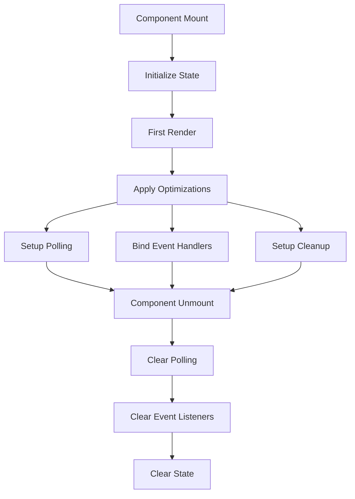

**Diagram sources**
- [ResultCard.jsx:795-802](file://app/frontend/src/components/ResultCard.jsx#L795-L802)

### Network Optimization

1. **Adaptive Polling**: Adjusts polling intervals based on analysis complexity
2. **Request Deduplication**: Prevents duplicate API calls
3. **Caching Strategy**: Smart caching of frequently accessed data
4. **Error Recovery**: Graceful handling of network failures
5. **Enhanced Fallback Handling**: Optimized fallback detection and display
6. **Efficient State Updates**: Minimal re-renders through proper state management

### Styling Performance

The component leverages Tailwind's utility-first approach for optimal performance:

- **Atomic CSS**: Eliminates unused styles automatically
- **Critical Path Optimization**: Essential styles loaded first
- **Backdrop Filter Optimization**: Hardware-accelerated blur effects
- **Gradient Performance**: GPU-accelerated gradient backgrounds

**Section sources**
- [ResultCard.jsx:795-802](file://app/frontend/src/components/ResultCard.jsx#L795-L802)
- [ResultCard.jsx:862-887](file://app/frontend/src/components/ResultCard.jsx#L862-L887)
- [index.css:82-117](file://app/frontend/src/index.css#L82-L117)

## Troubleshooting Guide

### Common Issues and Solutions

#### Analysis Loading Problems

**Issue**: Analysis never loads or shows "Pending" status indefinitely
**Solution**: Check network connectivity and verify analysis service availability

**Issue**: AI enhancement fails but standard analysis works
**Solution**: Verify Ollama service status and model availability

#### Enhanced Fallback Detection Issues

**Issue**: Users don't understand why they're seeing fallback analysis
**Solution**: Check that fallback banners and error messages are displaying correctly

**Issue**: AI enhancement status indicators not appearing
**Solution**: Verify that aiEnhanced flag is being properly passed to AnalysisSourceBadge

#### Interview Evaluation Issues

**Issue**: Evaluation changes don't persist
**Solution**: Check user authentication and permissions

**Issue**: Rating buttons don't respond
**Solution**: Verify result_id is available and API endpoints are accessible

#### Responsive Design Issues

**Issue**: Layout breaks on mobile devices
**Solution**: Verify Tailwind breakpoints are properly configured

**Issue**: Touch interactions not working on mobile
**Solution**: Check for proper touch event handlers and viewport settings

#### Performance Issues

**Issue**: Slow rendering with large datasets
**Solution**: Implement pagination or lazy loading for long lists

**Issue**: Memory leaks in long sessions
**Solution**: Ensure proper cleanup of event listeners and timers

### Debugging Tools

The component includes built-in debugging capabilities:

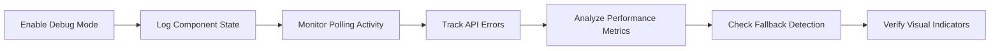

### Error Boundary Implementation

The component includes comprehensive error boundary support:

```jsx
{outcomeError && (
  <p className="mt-2 text-xs text-red-600">{outcomeError}</p>
)}
```

**Section sources**
- [ResultCard.jsx:795-802](file://app/frontend/src/components/ResultCard.jsx#L795-L802)
- [ResultCard.jsx:862-887](file://app/frontend/src/components/ResultCard.jsx#L862-L887)
- [ResultCard.jsx:1739-1742](file://app/frontend/src/components/ResultCard.jsx#L1739-L1742)

## Conclusion

The Result Card Component represents a sophisticated, production-ready solution for displaying AI-powered candidate analysis results. Its modular architecture, comprehensive feature set, and robust error handling make it an essential component of the Resume AI platform.

**Updated** The enhanced Result Card Component now provides significantly improved user experience through comprehensive fallback detection, responsive design patterns, and enhanced error handling mechanisms. The addition of transparent fallback narrative detection, mobile-first responsive design, and comprehensive error management makes the component more informative, accessible, and trustworthy.

Key strengths include:

- **Comprehensive Analysis Display**: Handles multiple analysis formats and data sources
- **Interactive Features**: Real-time evaluation and email generation capabilities
- **Enhanced Transparency**: Clear visual indicators for fallback and AI-enhanced modes
- **Responsive Design**: Mobile-first approach with progressive enhancement
- **Performance Optimization**: Efficient rendering and memory management
- **User Experience**: Intuitive interface with accessibility support
- **Extensibility**: Modular design allows for easy feature additions
- **Robust Status Tracking**: Comprehensive analysis mode detection and display
- **Comprehensive Error Handling**: User-friendly error messages and recovery options
- **Modern Styling**: Sophisticated visual design with backdrop blur and gradient effects

The component successfully balances functionality with maintainability, providing a solid foundation for future enhancements while delivering immediate value to users. Its implementation demonstrates best practices in React development, including proper state management, error handling, performance optimization, and enhanced user communication through visual indicators and responsive design patterns.

The addition of comprehensive fallback detection and visual transparency mechanisms, along with responsive design improvements and enhanced error handling, makes the Result Card Component more informative, accessible, and user-friendly, helping recruiters understand when AI-enhanced narratives are available versus when standard analysis templates are being used.