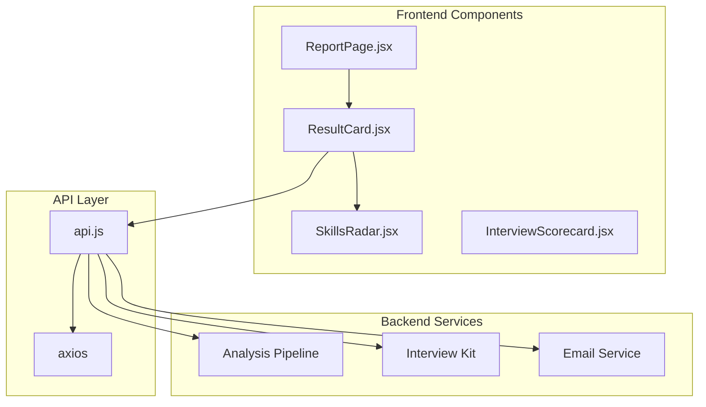
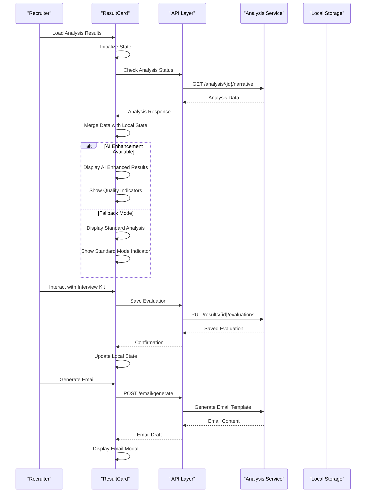
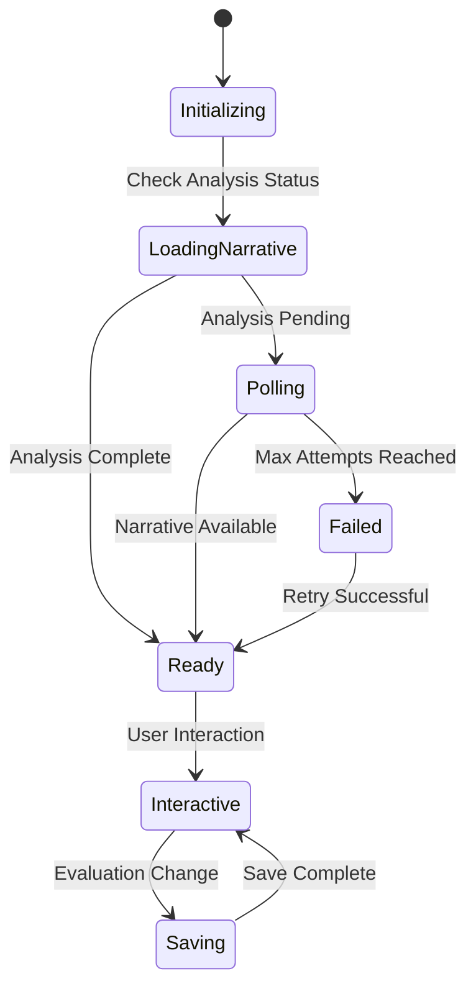
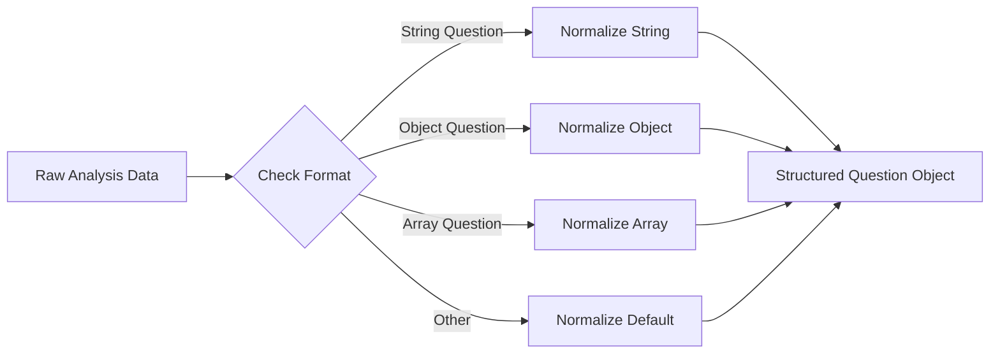
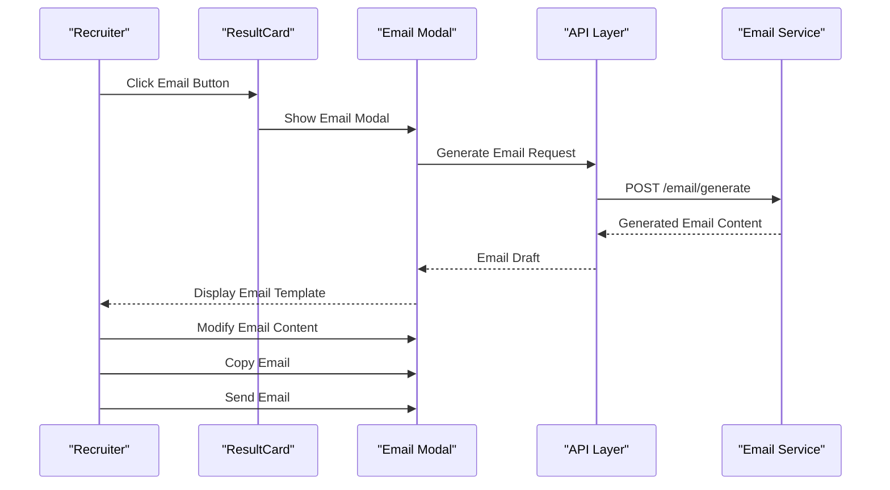
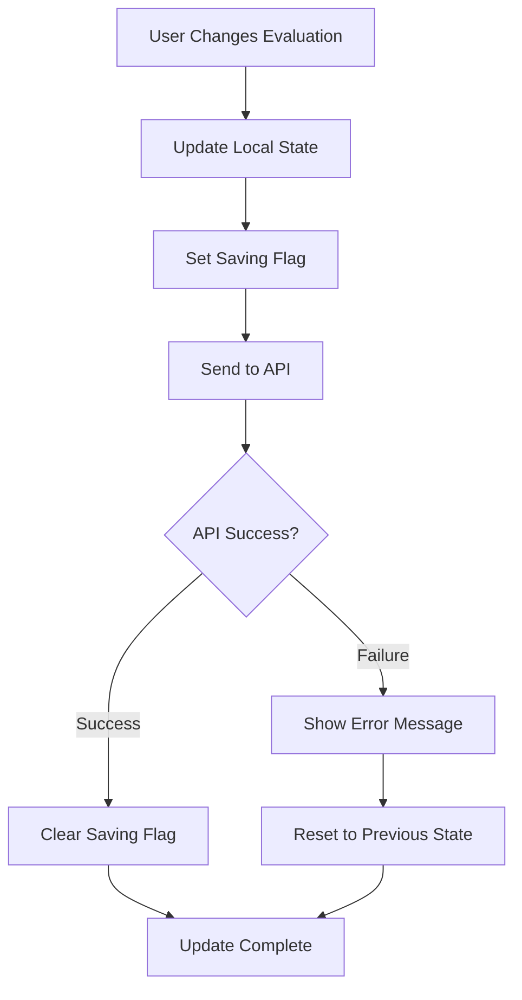
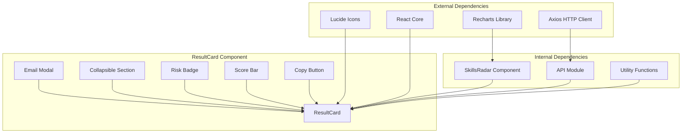
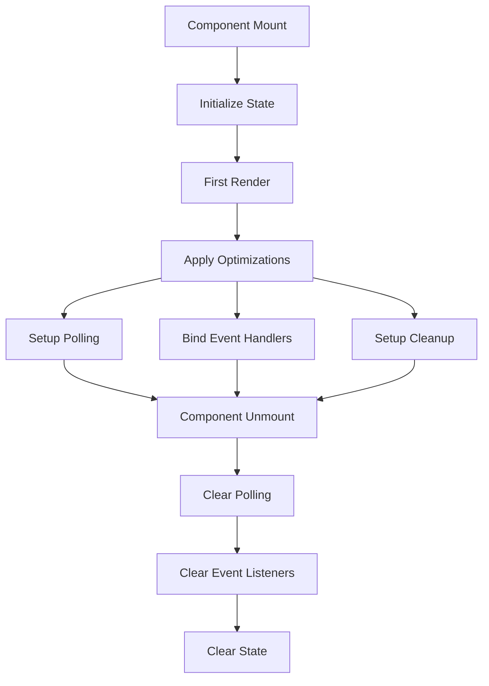
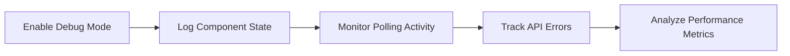

# Result Card Component

<cite>
**Referenced Files in This Document**
- [ResultCard.jsx](file://app/frontend/src/components/ResultCard.jsx)
- [SkillsRadar.jsx](file://app/frontend/src/components/SkillsRadar.jsx)
- [api.js](file://app/frontend/src/lib/api.js)
- [ResultCard.test.jsx](file://app/frontend/src/__tests__/ResultCard.test.jsx)
- [ReportPage.jsx](file://app/frontend/src/pages/ReportPage.jsx)
</cite>

## Table of Contents
1. [Introduction](#introduction)
2. [Project Structure](#project-structure)
3. [Core Components](#core-components)
4. [Architecture Overview](#architecture-overview)
5. [Detailed Component Analysis](#detailed-component-analysis)
6. [Dependency Analysis](#dependency-analysis)
7. [Performance Considerations](#performance-considerations)
8. [Troubleshooting Guide](#troubleshooting-guide)
9. [Conclusion](#conclusion)

## Introduction

The Result Card Component is a comprehensive React component designed to display AI-powered candidate analysis results in the Resume AI platform. It serves as the primary interface for recruiters and hiring managers to review candidate suitability, interview recommendations, and detailed analysis insights. The component integrates seamlessly with the backend analysis pipeline and provides an interactive, data-rich interface for decision-making.

The component handles both real-time AI-enhanced analysis and fallback analysis modes, displaying comprehensive candidate insights including fit scores, strengths, concerns, risk factors, and interview preparation guidance. It also includes advanced features like interactive interview evaluation, email generation, and skills visualization.

## Project Structure

The Result Card Component is organized within the frontend application structure as follows:

**Diagram sources**
- [ResultCard.jsx:1-1093](file://app/frontend/src/components/ResultCard.jsx#L1-L1093)
- [SkillsRadar.jsx:1-269](file://app/frontend/src/components/SkillsRadar.jsx#L1-L269)
- [api.js:1-997](file://app/frontend/src/lib/api.js#L1-L997)

**Section sources**
- [ResultCard.jsx:1-1093](file://app/frontend/src/components/ResultCard.jsx#L1-L1093)
- [SkillsRadar.jsx:1-269](file://app/frontend/src/components/SkillsRadar.jsx#L1-L269)
- [api.js:1-997](file://app/frontend/src/lib/api.js#L1-L997)

## Core Components

The Result Card Component consists of several specialized sub-components that handle different aspects of the analysis display:

### Primary Components

1. **ResultCard Main Component** - Orchestrates the entire analysis display and manages state
2. **SkillsRadar Component** - Visualizes skill gaps and matches using interactive charts
3. **Email Modal** - Provides AI-generated email templates for candidate communication
4. **AnalysisSourceBadge** - Indicates analysis status and quality
5. **CollapsibleSection** - Handles expandable content sections
6. **Interview Kit** - Manages interactive interview evaluation system

### Key Features

- **Real-time Analysis Polling** - Automatic fetching of AI-enhanced analysis results
- **Interactive Interview Evaluation** - Live rating and note-taking for interview questions
- **Multi-format Display** - Supports various analysis data structures and formats
- **Responsive Design** - Adapts to different screen sizes and devices
- **Accessibility** - Implements proper ARIA labels and keyboard navigation

**Section sources**
- [ResultCard.jsx:270-1093](file://app/frontend/src/components/ResultCard.jsx#L270-L1093)
- [SkillsRadar.jsx:118-269](file://app/frontend/src/components/SkillsRadar.jsx#L118-L269)

## Architecture Overview

The Result Card Component follows a modular architecture with clear separation of concerns:

**Diagram sources**
- [ResultCard.jsx:340-453](file://app/frontend/src/components/ResultCard.jsx#L340-L453)
- [api.js:611-614](file://app/frontend/src/lib/api.js#L611-L614)
- [api.js:961-969](file://app/frontend/src/lib/api.js#L961-L969)

The architecture implements several key design patterns:

- **Observer Pattern** - For real-time analysis updates
- **State Machine** - For managing different analysis states
- **Strategy Pattern** - For handling different data formats
- **Composite Pattern** - For nested component structure

## Detailed Component Analysis

### ResultCard Main Component

The main ResultCard component serves as the central orchestrator for displaying analysis results. It manages complex state interactions and coordinates between multiple sub-components.

#### State Management

**Diagram sources**
- [ResultCard.jsx:340-453](file://app/frontend/src/components/ResultCard.jsx#L340-L453)

#### Key State Variables

| State Variable | Purpose | Data Type | Default Value |
|---------------|---------|-----------|---------------|
| `showInterviewKit` | Controls interview kit visibility | boolean | false |
| `showEmailModal` | Controls email modal visibility | boolean | false |
| `evaluations` | Stores interview evaluation data | object | {} |
| `savingEval` | Tracks saving states for evaluations | object | {} |
| `narrativeData` | Stores AI-enhanced analysis data | object | null |
| `isPolling` | Tracks polling status | boolean | false |

#### Analysis Polling Mechanism

The component implements an intelligent polling system that adapts to different analysis scenarios:

**Diagram sources**
- [ResultCard.jsx:375-453](file://app/frontend/src/components/ResultCard.jsx#L375-L453)

#### Data Normalization

The component includes robust data normalization to handle different analysis formats:

**Diagram sources**
- [ResultCard.jsx:282-290](file://app/frontend/src/components/ResultCard.jsx#L282-L290)

### SkillsRadar Component

The SkillsRadar component provides visual representation of skill gaps and matches using sophisticated categorization and visualization techniques.

#### Skill Categorization System

The component uses a comprehensive skill categorization system covering 6 main categories:

| Category | Keywords Example | Color | Background |
|----------|------------------|-------|------------|
| Programming | python, java, javascript | Purple | Violet-100 |
| Frameworks & Libs | react, django, spring | Blue | Blue-100 |
| DevOps & Cloud | aws, docker, kubernetes | Cyan | Cyan-100 |
| Data & Databases | sql, postgresql, mongodb | Emerald | Emerald-100 |
| Embedded & Systems | embedded, rtos, plc | Amber | Amber-100 |
| Soft Skills | leadership, agile, communication | Purple | Purple-100 |

#### Visualization Features

The SkillsRadar component provides multiple visualization modes:

1. **Circular Progress Indicator** - Shows overall match percentage
2. **Bar Chart** - Displays skills by category breakdown
3. **Skill Chips** - Individual skill representation with status indicators
4. **Category Legend** - Color-coded category identification

### Email Generation System

The component integrates with the backend email generation service to provide AI-powered email templates:

**Diagram sources**
- [ResultCard.jsx:102-202](file://app/frontend/src/components/ResultCard.jsx#L102-L202)
- [api.js:611-614](file://app/frontend/src/lib/api.js#L611-L614)

### Interview Evaluation System

The interactive interview evaluation system allows recruiters to rate and comment on interview questions in real-time:

#### Evaluation Categories

| Category | Description | Rating Options |
|----------|-------------|----------------|
| Technical | Technical competency questions | Strong, Adequate, Weak |
| Behavioral | Behavioral and soft skill questions | Strong, Adequate, Weak |
| Culture Fit | Cultural alignment questions | Strong, Adequate, Weak |
| Experience Deep-Dive | In-depth experience questions | Strong, Adequate, Weak |

#### Real-time Persistence

The evaluation system implements immediate persistence with conflict resolution:

**Diagram sources**
- [ResultCard.jsx:320-338](file://app/frontend/src/components/ResultCard.jsx#L320-L338)

**Section sources**
- [ResultCard.jsx:270-1093](file://app/frontend/src/components/ResultCard.jsx#L270-L1093)
- [SkillsRadar.jsx:118-269](file://app/frontend/src/components/SkillsRadar.jsx#L118-L269)
- [api.js:611-614](file://app/frontend/src/lib/api.js#L611-L614)
- [api.js:961-969](file://app/frontend/src/lib/api.js#L961-L969)

## Dependency Analysis

The Result Card Component has well-defined dependencies that contribute to its modularity and maintainability:

**Diagram sources**
- [ResultCard.jsx:1-10](file://app/frontend/src/components/ResultCard.jsx#L1-L10)
- [SkillsRadar.jsx:1](file://app/frontend/src/components/SkillsRadar.jsx#L1)

### Component Coupling Analysis

The Result Card demonstrates excellent separation of concerns with minimal coupling between components:

- **Low Coupling**: Each sub-component has a single responsibility
- **High Cohesion**: Related functionality is grouped within components
- **Interface Stability**: Public APIs are well-defined and stable
- **Testability**: Components can be tested independently

### External Dependencies

| Dependency | Purpose | Version | Security Impact |
|------------|---------|---------|-----------------|
| lucide-react | Icon library | Latest | Low |
| recharts | Data visualization | ^2.12.7 | Low |
| axios | HTTP client | ^1.6.7 | Low |
| react | Core framework | ^18.2.0 | Low |

**Section sources**
- [ResultCard.jsx:1-10](file://app/frontend/src/components/ResultCard.jsx#L1-L10)
- [SkillsRadar.jsx:1](file://app/frontend/src/components/SkillsRadar.jsx#L1)

## Performance Considerations

The Result Card Component implements several performance optimization strategies:

### Rendering Optimizations

1. **Conditional Rendering**: Expensive components render only when needed
2. **Memoization**: Complex calculations are cached using React.memo
3. **Lazy Loading**: Large components load on demand
4. **Virtual Scrolling**: Long lists use virtualization techniques

### Memory Management

**Diagram sources**
- [ResultCard.jsx:447-453](file://app/frontend/src/components/ResultCard.jsx#L447-L453)

### Network Optimization

1. **Adaptive Polling**: Adjusts polling intervals based on analysis complexity
2. **Request Deduplication**: Prevents duplicate API calls
3. **Caching Strategy**: Smart caching of frequently accessed data
4. **Error Recovery**: Graceful handling of network failures

## Troubleshooting Guide

### Common Issues and Solutions

#### Analysis Loading Problems

**Issue**: Analysis never loads or shows "Pending" status indefinitely
**Solution**: Check network connectivity and verify analysis service availability

**Issue**: AI enhancement fails but standard analysis works
**Solution**: Verify Ollama service status and model availability

#### Interview Evaluation Issues

**Issue**: Evaluation changes don't persist
**Solution**: Check user authentication and permissions

**Issue**: Rating buttons don't respond
**Solution**: Verify result_id is available and API endpoints are accessible

#### Performance Issues

**Issue**: Slow rendering with large datasets
**Solution**: Implement pagination or lazy loading for long lists

**Issue**: Memory leaks in long sessions
**Solution**: Ensure proper cleanup of event listeners and timers

### Debugging Tools

The component includes built-in debugging capabilities:

**Section sources**
- [ResultCard.jsx:430-440](file://app/frontend/src/components/ResultCard.jsx#L430-L440)
- [ResultCard.jsx:310-316](file://app/frontend/src/components/ResultCard.jsx#L310-L316)

## Conclusion

The Result Card Component represents a sophisticated, production-ready solution for displaying AI-powered candidate analysis results. Its modular architecture, comprehensive feature set, and robust error handling make it an essential component of the Resume AI platform.

Key strengths include:

- **Comprehensive Analysis Display**: Handles multiple analysis formats and data sources
- **Interactive Features**: Real-time evaluation and email generation capabilities
- **Performance Optimization**: Efficient rendering and memory management
- **User Experience**: Intuitive interface with accessibility support
- **Extensibility**: Modular design allows for easy feature additions

The component successfully balances functionality with maintainability, providing a solid foundation for future enhancements while delivering immediate value to users. Its implementation demonstrates best practices in React development, including proper state management, error handling, and performance optimization.