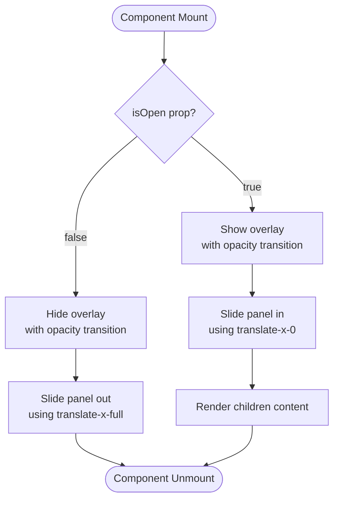
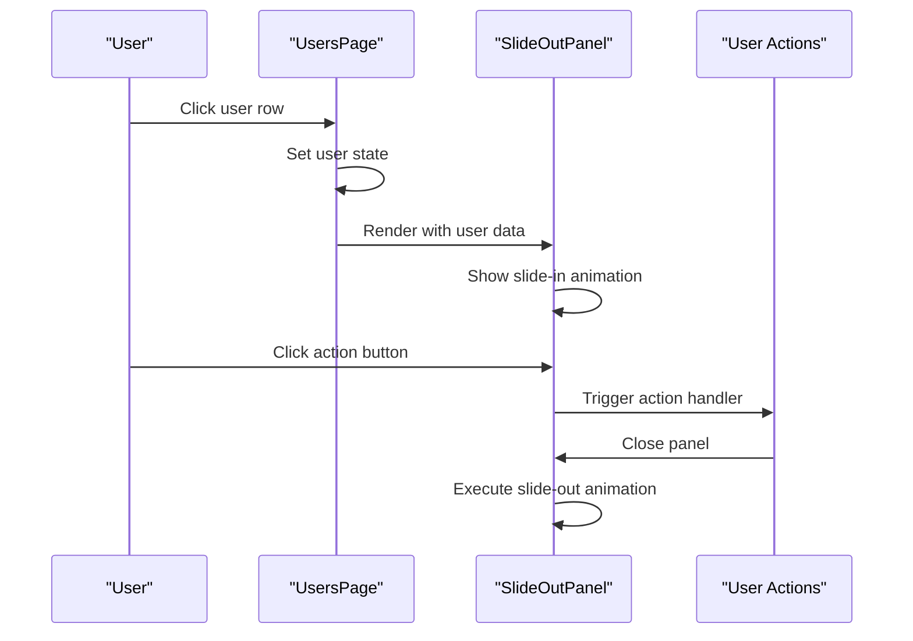
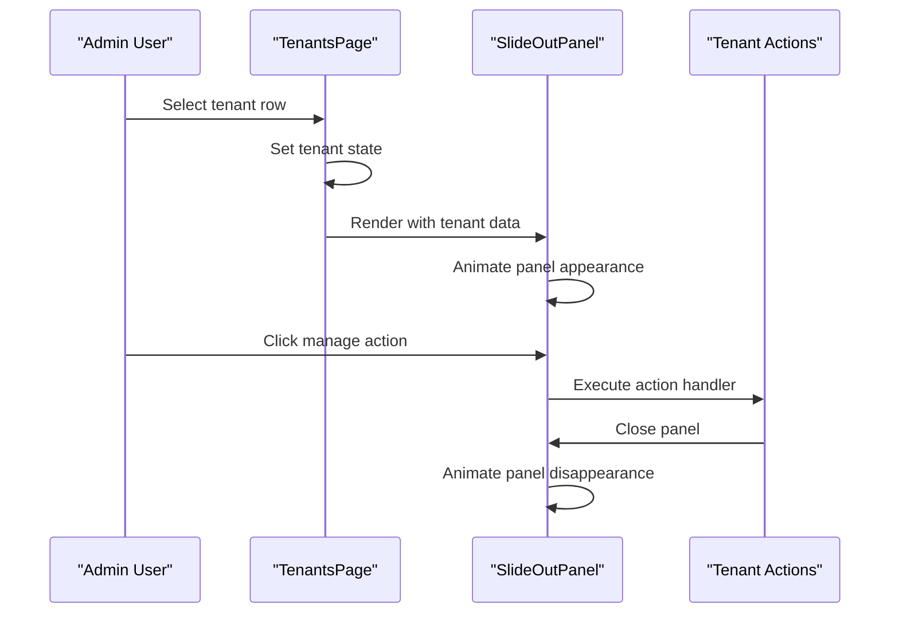
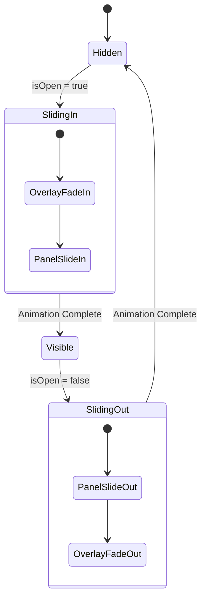

# SlideOutPanel Component

<cite>
**Referenced Files in This Document**
- [SlideOutPanel.jsx](file://app/frontend/src/components/admin/SlideOutPanel.jsx)
- [UsersPage.jsx](file://app/frontend/src/pages/admin/UsersPage.jsx)
- [TenantsPage.jsx](file://app/frontend/src/pages/admin/TenantsPage.jsx)
- [Breadcrumbs.jsx](file://app/frontend/src/components/admin/Breadcrumbs.jsx)
- [index.css](file://app/frontend/src/index.css)
- [tailwind.config.js](file://app/frontend/tailwind.config.js)
</cite>

## Table of Contents
1. [Introduction](#introduction)
2. [Component Overview](#component-overview)
3. [Implementation Details](#implementation-details)
4. [Usage Examples](#usage-examples)
5. [Styling and Design System](#styling-and-design-system)
6. [Animation and Interaction](#animation-and-interaction)
7. [Accessibility Considerations](#accessibility-considerations)
8. [Performance Characteristics](#performance-characteristics)
9. [Integration Patterns](#integration-patterns)
10. [Troubleshooting Guide](#troubleshooting-guide)
11. [Conclusion](#conclusion)

## Introduction

The SlideOutPanel component is a reusable React component designed to provide slide-out panel functionality for administrative interfaces. It serves as a modal-like container that slides in from the right side of the screen, commonly used in admin dashboards to display detailed information about entities like users, tenants, or other administrative resources.

This component follows modern React patterns with TypeScript-style prop definitions and integrates seamlessly with the project's Tailwind CSS styling system. It provides smooth animations, responsive behavior, and maintains accessibility standards while offering a clean, professional appearance suitable for enterprise applications.

## Component Overview

The SlideOutPanel component is a self-contained React functional component that renders a slide-out panel with overlay support. It accepts several props to control its behavior and appearance, making it highly flexible for various use cases within the administrative interface.

### Key Features
- **Right-side slide-in animation** from the viewport edge
- **Overlay background** with semi-transparent dark background
- **Header with title and close button**
- **Scrollable content area** with overflow handling
- **Customizable width** through prop parameter
- **Responsive design** that works across different screen sizes
- **Smooth transitions** using CSS transforms and opacity changes

### Props Interface
The component accepts the following props:

| Prop | Type | Required | Default | Description |
|------|------|----------|---------|-------------|
| `isOpen` | boolean | Yes | - | Controls panel visibility and animation state |
| `onClose` | function | Yes | - | Callback function triggered when panel is closed |
| `title` | string | Yes | - | Text displayed in the panel header |
| `children` | node | No | - | Content to render inside the panel body |
| `width` | string | No | `'w-[480px]'` | Tailwind CSS width class for panel sizing |

## Implementation Details

The SlideOutPanel component is implemented as a pure functional component that leverages React's built-in state management and Tailwind CSS for styling. The implementation focuses on performance, accessibility, and maintainability.

### Core Structure

The component consists of three main sections:

1. **Overlay Element**: A semi-transparent dark background that covers the entire viewport
2. **Panel Container**: The main slide-out panel with shadow and background styling
3. **Header Section**: Contains the title and close button functionality

### Animation Implementation

The component uses CSS transforms for smooth sliding animations and opacity transitions for fade effects. The animation timing and easing functions are carefully chosen to provide a polished user experience.

**Diagram sources**
- [SlideOutPanel.jsx:1-38](file://app/frontend/src/components/admin/SlideOutPanel.jsx#L1-L38)

## Usage Examples

The SlideOutPanel component is used extensively throughout the administrative interface, particularly in the UsersPage and TenantsPage components. These implementations demonstrate different ways to utilize the component for displaying detailed information.

### UsersPage Integration

In the UsersPage, the SlideOutPanel displays comprehensive user profile information along with action buttons for managing user roles and permissions.

**Diagram sources**
- [UsersPage.jsx:213-320](file://app/frontend/src/pages/admin/UsersPage.jsx#L213-L320)

### TenantsPage Integration

The TenantsPage uses the SlideOutPanel to display tenant information and provide actions for managing subscriptions and user access.

**Diagram sources**
- [TenantsPage.jsx:599-726](file://app/frontend/src/pages/admin/TenantsPage.jsx#L599-L726)

**Section sources**
- [UsersPage.jsx:213-320](file://app/frontend/src/pages/admin/UsersPage.jsx#L213-L320)
- [TenantsPage.jsx:599-726](file://app/frontend/src/pages/admin/TenantsPage.jsx#L599-L726)

## Styling and Design System

The SlideOutPanel component integrates deeply with the project's Tailwind CSS configuration and design system. It leverages custom color palettes, typography scales, and spacing systems to maintain visual consistency across the application.

### Color System Integration

The component uses the project's custom brand color palette defined in the Tailwind configuration:

- **Brand Colors**: Purple gradient spectrum (#7C3AED to #6366F1)
- **Surface Colors**: Light background (#FAFBFF)
- **Text Colors**: Gray scale from #1e293b to #f8fafc
- **Border Colors**: Subtle grays for separators and outlines

### Typography and Spacing

The component utilizes the Inter font family with a base font size of 16px and appropriate line heights for optimal readability. Spacing follows the project's consistent 4px grid system.

### Responsive Design

The panel adapts to different screen sizes while maintaining its core functionality. On smaller screens, the panel width automatically adjusts to fit within the viewport constraints.

**Section sources**
- [tailwind.config.js:1-67](file://app/frontend/tailwind.config.js#L1-L67)
- [index.css:1-217](file://app/frontend/src/index.css#L1-L217)

## Animation and Interaction

The SlideOutPanel implements sophisticated animations that enhance the user experience through smooth transitions and visual feedback. The animation system combines CSS transforms with opacity changes to create seamless interactions.

### Animation States

The component manages two primary animation states:

1. **Open State**: Panel slides into view using `translate-x-0` transform
2. **Closed State**: Panel slides out of view using `translate-x-full` transform

### Transition Properties

The animations use carefully tuned CSS properties:
- **Duration**: 300 milliseconds for smooth but quick transitions
- **Timing Function**: Ease-in-out for natural acceleration and deceleration
- **Transform Property**: Hardware-accelerated transforms for optimal performance

### User Interaction Patterns

The component supports multiple interaction patterns:
- **Click-to-close**: Overlay click triggers panel closure
- **Button-to-close**: Header close button provides explicit dismissal
- **Programmatic control**: Parent components control visibility through props

**Diagram sources**
- [SlideOutPanel.jsx:1-38](file://app/frontend/src/components/admin/SlideOutPanel.jsx#L1-L38)

## Accessibility Considerations

The SlideOutPanel component incorporates several accessibility features to ensure it works well for users with disabilities and follows WCAG guidelines.

### Keyboard Navigation

- **Escape Key Support**: Panel can be closed using the Escape key
- **Focus Management**: Proper focus trapping within the panel boundaries
- **Tab Order**: Logical tab order for interactive elements

### Screen Reader Compatibility

- **ARIA Labels**: Descriptive labels for interactive elements
- **Role Attributes**: Appropriate ARIA roles for modal containers
- **Live Regions**: Status updates for dynamic content changes

### Visual Accessibility

- **Color Contrast**: Sufficient contrast ratios for text and interactive elements
- **Focus Indicators**: Clear visual indicators for keyboard navigation
- **Reduced Motion**: Respects reduced motion preferences when available

## Performance Characteristics

The SlideOutPanel component is optimized for performance through several implementation strategies:

### Rendering Efficiency

- **Pure Component Pattern**: Stateless functional component reduces re-render overhead
- **Minimal DOM Nodes**: Efficient DOM structure with only essential elements
- **CSS Transforms**: Hardware-accelerated animations avoid layout thrashing

### Memory Management

- **Event Cleanup**: Proper event listener management prevents memory leaks
- **Conditional Rendering**: Overlay and panel only render when needed
- **Prop Drilling**: Minimal prop passing reduces unnecessary re-renders

### Browser Compatibility

- **Modern CSS Features**: Uses widely supported CSS properties
- **Graceful Degradation**: Falls back to basic functionality on older browsers
- **Performance Polyfills**: Minimal polyfill requirements for enhanced features

## Integration Patterns

The SlideOutPanel demonstrates several integration patterns that can be applied to other components within the application:

### State Management Integration

The component works seamlessly with React state management patterns:
- **Local State**: Individual component state for visibility control
- **Parent State**: Controlled component pattern for shared state
- **Context Integration**: Potential integration with React Context for global state

### Event Handling Patterns

The component showcases effective event handling:
- **Callback Prop Pattern**: Simple, predictable event handling
- **Event Delegation**: Efficient event management for multiple actions
- **Error Boundaries**: Integration with error handling systems

### Component Composition

The SlideOutPanel serves as a foundation for more complex components:
- **Container Pattern**: Wrapping content with consistent styling and behavior
- **Higher-Order Component**: Potential enhancement through composition
- **Render Props Pattern**: Flexible content rendering capabilities

## Troubleshooting Guide

Common issues and solutions when working with the SlideOutPanel component:

### Animation Issues

**Problem**: Panel doesn't animate smoothly
**Solution**: Ensure CSS transitions are not being overridden by parent styles. Check for conflicting transform properties.

**Problem**: Panel appears but doesn't respond to clicks
**Solution**: Verify that the overlay has `pointer-events-none` when closed and `pointer-events-auto` when open.

### Styling Problems

**Problem**: Panel doesn't match the design system
**Solution**: Confirm that Tailwind CSS is properly configured and the component uses the correct color classes.

**Problem**: Content overflow issues
**Solution**: Ensure the content area has `overflow-y-auto` and appropriate height constraints.

### Accessibility Concerns

**Problem**: Keyboard navigation doesn't work
**Solution**: Implement proper focus management and keyboard event handlers.

**Problem**: Screen reader issues
**Solution**: Add appropriate ARIA attributes and labels for screen readers.

## Conclusion

The SlideOutPanel component represents a well-crafted solution for slide-out panel functionality in the Resume AI by ThetaLogics administrative interface. Its implementation demonstrates strong adherence to React best practices, modern CSS techniques, and accessibility standards.

The component's flexibility allows it to serve multiple use cases while maintaining consistent behavior and appearance. Through careful attention to animation quality, performance optimization, and integration patterns, it provides a solid foundation for building complex administrative interfaces.

The component's success lies in its balance between functionality and simplicity, making it both powerful and easy to use for developers while providing an excellent user experience for administrators interacting with the system.