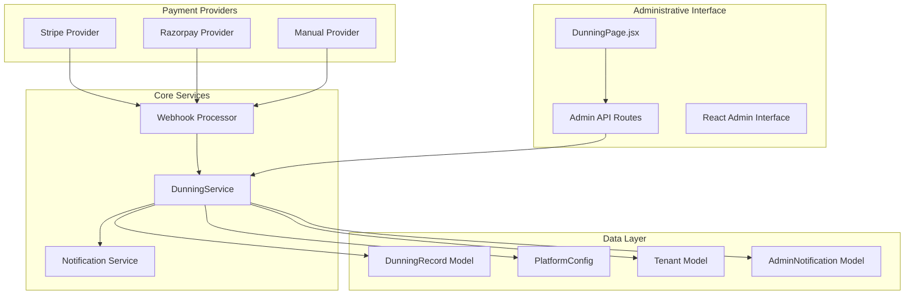
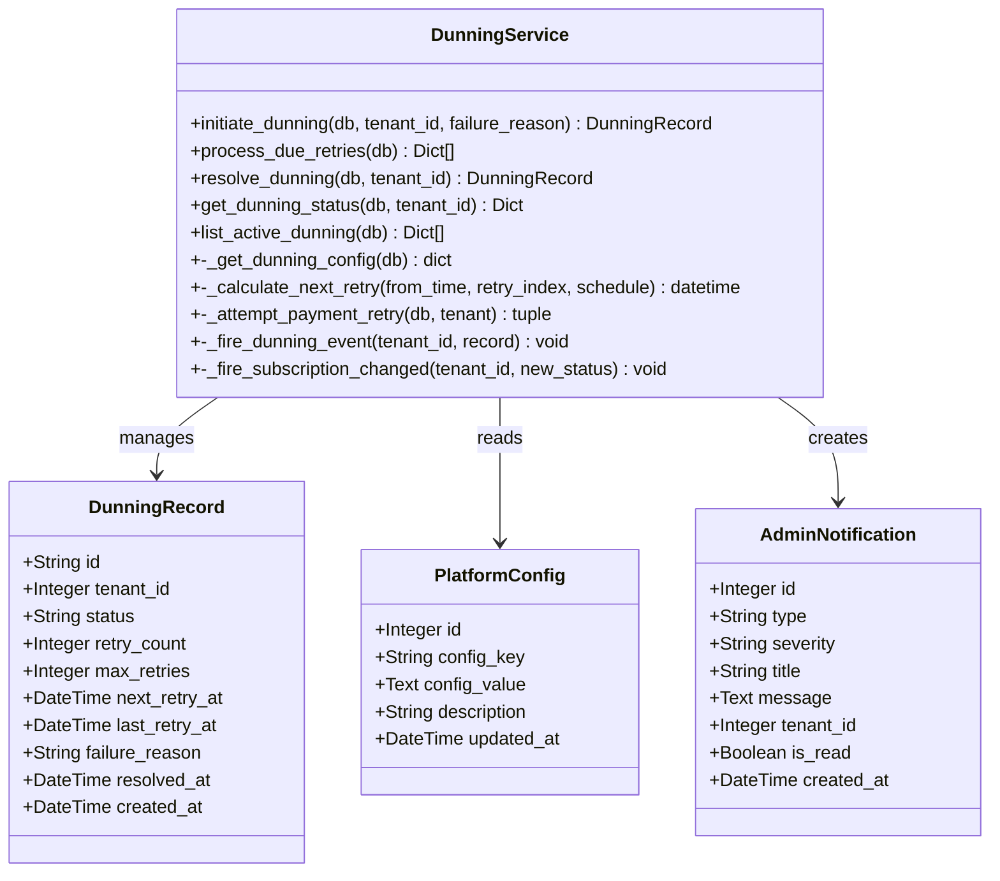
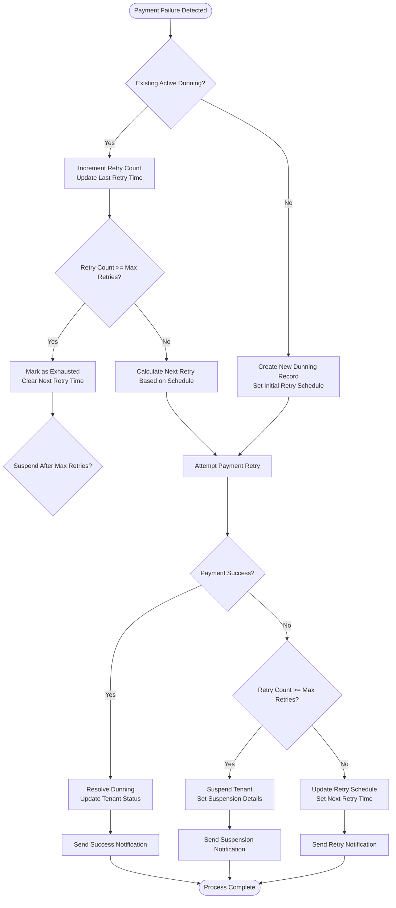
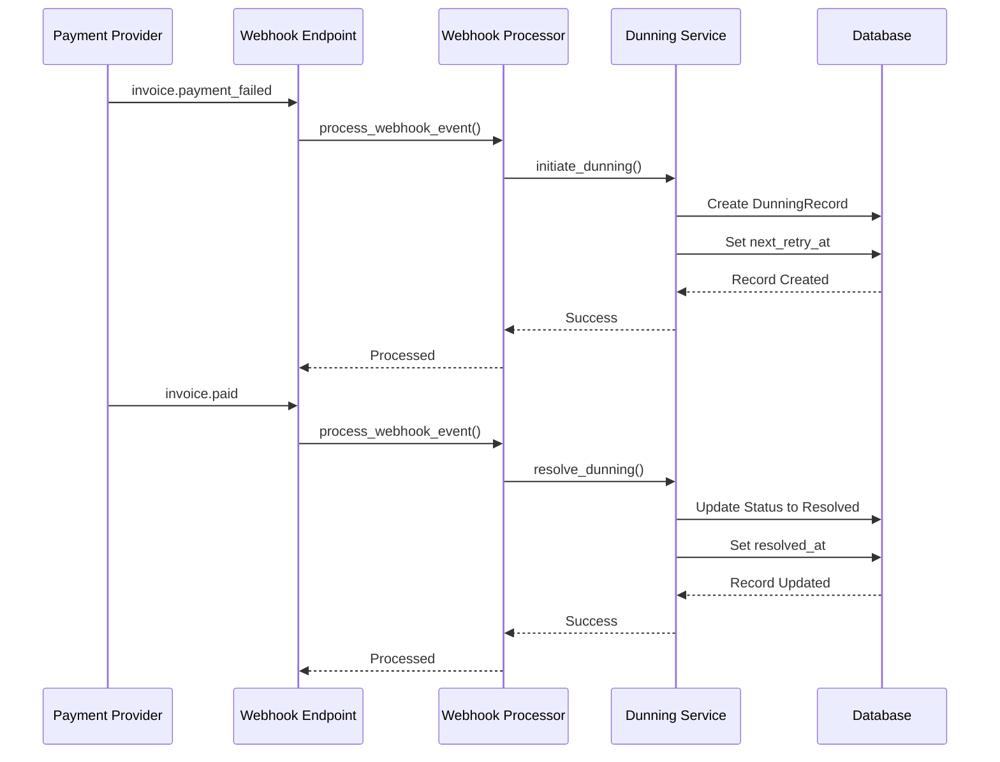
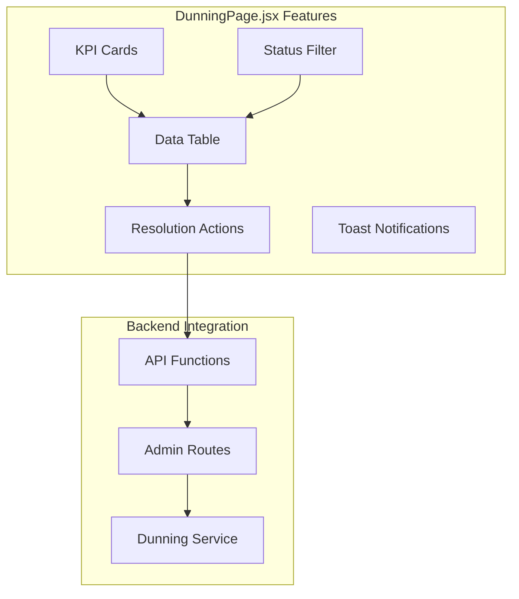
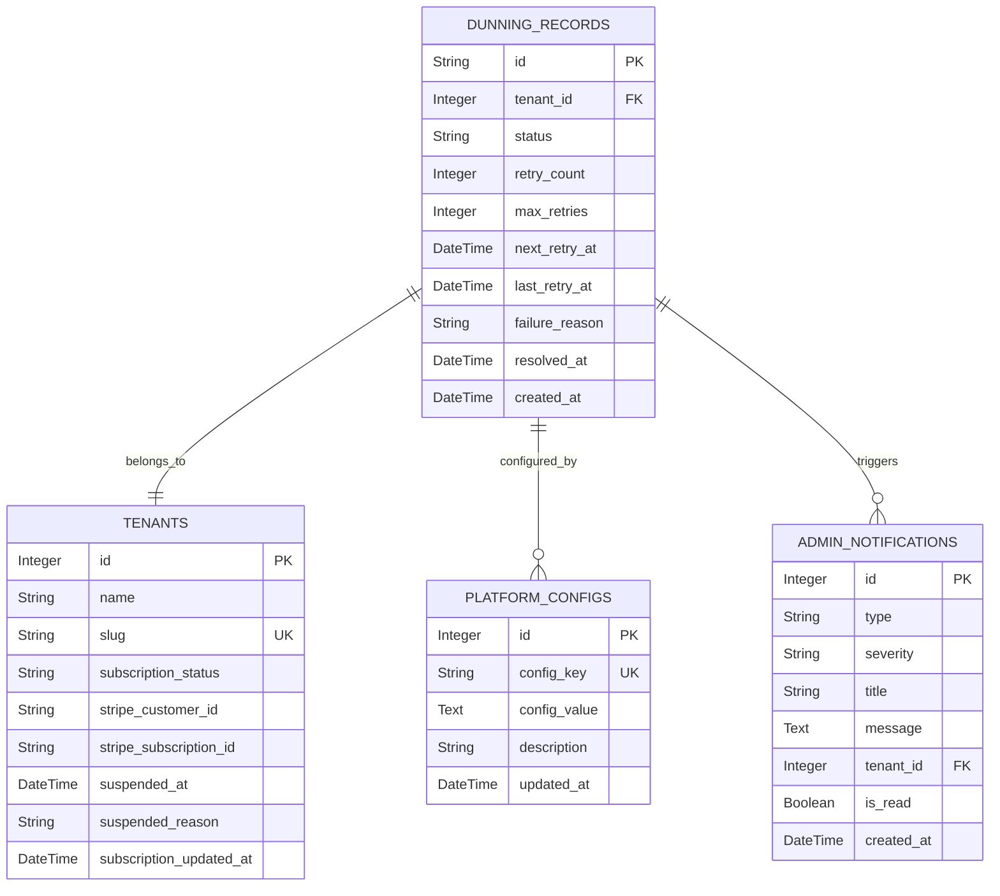

# Dunning Management

<cite>
**Referenced Files in This Document**
- [dunning_service.py](file://app/backend/services/billing/dunning_service.py)
- [029_dunning_system.py](file://alembic/versions/029_dunning_system.py)
- [test_dunning.py](file://app/backend/tests/test_dunning.py)
- [admin.py](file://app/backend/routes/admin.py)
- [DunningPage.jsx](file://app/frontend/src/pages/admin/DunningPage.jsx)
- [api.js](file://app/frontend/src/lib/api.js)
- [db_models.py](file://app/backend/models/db_models.py)
</cite>

## Update Summary
**Changes Made**
- Updated Administrative Interface section to reflect the comprehensive DunningPage.jsx implementation with real-time retry status tracking, resolution actions, and tenant-level collections management
- Enhanced Frontend Administration details with sophisticated UI components including KPI cards, progress visualization, and responsive design
- Added new section covering tenant-level payment failure monitoring capabilities with advanced filtering and status tracking
- Updated database schema documentation with DunningRecord model details and admin notification integration
- Enhanced troubleshooting guide with new UI-specific diagnostic information and error handling mechanisms
- Added comprehensive API integration details for the new administrative interface with real-time data synchronization

## Table of Contents
1. [Introduction](#introduction)
2. [System Architecture](#system-architecture)
3. [Core Components](#core-components)
4. [Configuration Management](#configuration-management)
5. [Payment Retry Logic](#payment-retry-logic)
6. [Webhook Integration](#webhook-integration)
7. [Administrative Interface](#administrative-interface)
8. [Database Schema](#database-schema)
9. [Testing Strategy](#testing-strategy)
10. [Operational Procedures](#operational-procedures)
11. [Troubleshooting Guide](#troubleshooting-guide)
12. [Conclusion](#conclusion)

## Introduction

The Dunning Management system is a critical component of the Resume AI platform's billing infrastructure. It automates the process of handling failed payment attempts, managing retry cycles, and escalating to suspension when necessary. The system ensures revenue collection continuity while providing transparency and control mechanisms for both automated processes and administrative intervention.

The system operates on a sophisticated retry schedule that progressively increases the time intervals between payment attempts, with configurable maximum retry limits and suspension policies. It integrates seamlessly with multiple payment providers (Stripe, Razorpay, Manual) and maintains comprehensive audit trails for all dunning activities.

**Updated** The system now features a comprehensive tenant-level payment failure monitoring interface with real-time retry status tracking, resolution actions, and advanced collections management tools, providing administrators with granular control over payment recovery workflows. The new DunningPage.jsx component delivers a sophisticated React-based administrative interface with real-time monitoring capabilities and intuitive resolution workflows.

## System Architecture

The Dunning Management system follows a modular architecture with clear separation of concerns:

**Diagram sources**
- [dunning_service.py:43-489](file://app/backend/services/billing/dunning_service.py#L43-L489)
- [admin.py:3147-3265](file://app/backend/routes/admin.py#L3147-L3265)

## Core Components

### DunningService Class

The `DunningService` class serves as the central orchestrator for all dunning-related operations. It implements a stateless design pattern where all methods explicitly receive database sessions, ensuring thread safety and predictable behavior.

Key responsibilities include:
- **Initiation**: Creating new dunning records upon payment failures
- **Processing**: Managing automated retry cycles based on configured schedules
- **Resolution**: Handling successful payments and marking dunning as resolved
- **Monitoring**: Providing status queries and administrative oversight

**Diagram sources**
- [dunning_service.py:43-489](file://app/backend/services/billing/dunning_service.py#L43-L489)
- [db_models.py:642-660](file://app/backend/models/db_models.py#L642-L660)
- [db_models.py:826-841](file://app/backend/models/db_models.py#L826-L841)

**Section sources**
- [dunning_service.py:43-489](file://app/backend/services/billing/dunning_service.py#L43-L489)

### Configuration Management

The system utilizes a flexible configuration approach through the `PlatformConfig` table, storing dunning parameters as JSON-encoded values. The default configuration provides a balanced retry schedule:

| Parameter | Default Value | Description |
|-----------|---------------|-------------|
| `retry_schedule_days` | [1, 3, 7, 14] | Days between consecutive retry attempts |
| `max_retries` | 4 | Maximum number of automated retry attempts |
| `suspend_after_max_retries` | true | Whether to suspend tenant after exhausting retries |
| `notify_on_each_retry` | true | Whether to send notifications for each retry |

**Section sources**
- [dunning_service.py:35-61](file://app/backend/services/billing/dunning_service.py#L35-L61)
- [029_dunning_system.py:29-37](file://alembic/versions/029_dunning_system.py#L29-L37)

## Payment Retry Logic

The payment retry mechanism implements a tiered approach that adapts to different payment provider capabilities and failure scenarios:

**Diagram sources**
- [dunning_service.py:65-293](file://app/backend/services/billing/dunning_service.py#L65-L293)

**Section sources**
- [dunning_service.py:158-293](file://app/backend/services/billing/dunning_service.py#L158-L293)

### Provider-Specific Integration

Different payment providers require distinct handling approaches:

**Stripe Integration**: Leverages invoice-based retry mechanisms, checking subscription status and attempting invoice payments for the latest open invoice.

**Razorpay Integration**: Manages provider-specific retry scheduling, flagging manual review requirements when auto-retry fails.

**Manual Provider**: Implements conservative approach requiring administrative intervention for payment resolution.

**Section sources**
- [dunning_service.py:391-448](file://app/backend/services/billing/dunning_service.py#L391-L448)

## Webhook Integration

The system integrates with external payment providers through webhook processing, automatically responding to payment lifecycle events:

**Diagram sources**
- [test_dunning.py:398-463](file://app/backend/tests/test_dunning.py#L398-L463)

**Section sources**
- [test_dunning.py:395-540](file://app/backend/tests/test_dunning.py#L395-L540)

## Administrative Interface

**Updated** The administrative interface now features a comprehensive React-based DunningPage.jsx component that provides tenant-level payment failure monitoring with advanced retry status tracking and resolution actions. This sophisticated interface delivers real-time visibility into payment recovery workflows with intuitive administrative controls.

### DunningPage.jsx Implementation

The new DunningPage.jsx component delivers a sophisticated administrative interface with the following key features:

#### Real-Time Monitoring Dashboard
- **KPI Cards**: Three comprehensive summary cards displaying Active Dunning (retrying), Exhausted (failed), and Recovered (resolved) tenant counts with color-coded visual indicators
- **Status Filtering**: Dropdown filter for viewing records by status (All, Retrying, Exhausted, Recovered) with real-time filtering capabilities
- **Live Data Refresh**: One-click refresh functionality for real-time status updates with loading states and error handling

#### Advanced Tenant Tracking
- **Tenant Information**: Displays tenant name, slug, and subscription status alongside dunning records with enhanced data presentation
- **Retry Progress Visualization**: Progress bars showing retry count progression toward maximum retries with dynamic width calculation
- **Timeline Tracking**: Detailed display of last retry attempts and next scheduled retry times with formatted date displays
- **Failure Reason Logging**: Clear display of payment failure reasons for each dunning record with truncation for long messages

#### Resolution Actions
- **One-Click Resolution**: Direct resolution button for manually resolving dunning records with confirmation workflow
- **Confirmation Workflow**: User confirmation prompts to prevent accidental resolutions with modal dialogs
- **Real-time Status Updates**: Immediate UI updates after successful resolution actions with success notifications
- **Error Handling**: Comprehensive error messaging for failed resolution attempts with dismissible notification system

#### User Experience Features
- **Loading States**: Skeleton loaders during data fetching operations with animated pulse effects
- **Toast Notifications**: Success and error notifications with dismiss functionality and visual icons
- **Responsive Design**: Mobile-friendly interface with appropriate spacing and typography across device sizes
- **Visual Indicators**: Color-coded status badges and icons for quick visual assessment with Lucide React icons
- **Interactive Elements**: Hover effects, disabled states, and loading animations for enhanced user feedback

**Diagram sources**
- [DunningPage.jsx:78-340](file://app/frontend/src/pages/admin/DunningPage.jsx#L78-L340)
- [api.js:1210-1219](file://app/frontend/src/lib/api.js#L1210-L1219)
- [admin.py:3147-3265](file://app/backend/routes/admin.py#L3147-L3265)

### Backend API Integration

The frontend integrates with comprehensive backend APIs:

#### Admin API Endpoints
- **GET /api/admin/dunning**: List active and exhausted dunning records with filtering capabilities and tenant details
- **POST /api/admin/dunning/{tenant_id}/resolve**: Manually resolve dunning for a tenant with administrative approval
- **GET /api/admin/dunning/process-retries**: Trigger manual processing of due retries with super admin authorization

#### Frontend API Functions
- **getAdminDunningRecords(params)**: Fetch dunning records with status filtering and pagination support
- **resolveDunning(tenantId)**: Execute manual dunning resolution with confirmation and error handling
- **getAdminTenantDetail(tenantId)**: Retrieve detailed tenant information for display in the interface

**Section sources**
- [DunningPage.jsx:78-340](file://app/frontend/src/pages/admin/DunningPage.jsx#L78-L340)
- [api.js:1210-1219](file://app/frontend/src/lib/api.js#L1210-L1219)
- [admin.py:3147-3265](file://app/backend/routes/admin.py#L3147-L3265)

## Database Schema

**Updated** The dunning system relies on a well-structured database schema supporting comprehensive tracking and reporting, with enhanced DunningRecord model details and admin notification integration:

**Diagram sources**
- [db_models.py:642-660](file://app/backend/models/db_models.py#L642-L660)
- [db_models.py:527-537](file://app/backend/models/db_models.py#L527-L537)
- [db_models.py:33-75](file://app/backend/models/db_models.py#L33-L75)
- [db_models.py:826-841](file://app/backend/models/db_models.py#L826-L841)

**Section sources**
- [db_models.py:642-660](file://app/backend/models/db_models.py#L642-L660)
- [029_dunning_system.py:14-27](file://alembic/versions/029_dunning_system.py#L14-L27)

## Testing Strategy

The system employs comprehensive testing methodologies ensuring reliability and correctness:

### Unit Testing Approach

The test suite covers critical scenarios including:
- **Initiation Logic**: Verifying proper record creation and schedule calculation
- **Retry Processing**: Testing automated retry cycles and schedule progression
- **Resolution Handling**: Validating successful payment resolution workflows
- **Configuration Management**: Ensuring proper fallback and override behavior
- **Provider Integration**: Testing different payment provider scenarios

### Test Coverage Areas

| Test Category | Coverage Focus | Test Methods |
|---------------|----------------|--------------|
| Service Logic | Core dunning operations | `initiate_dunning`, `process_due_retries`, `resolve_dunning` |
| Configuration | Platform config loading and validation | `_get_dunning_config`, default fallback behavior |
| Provider Integration | Multi-provider support | Stripe, Razorpay, Manual provider handling |
| Webhook Processing | Event-driven workflows | Payment failure/paid event handling |
| Administrative | API endpoints and UI integration | Admin dunning management operations |

**Section sources**
- [test_dunning.py:1-683](file://app/backend/tests/test_dunning.py#L1-L683)

## Operational Procedures

### Daily Operations

The dunning system requires minimal daily maintenance with automated processes handling most operations:

1. **Scheduled Processing**: Automated retry processing runs at configured intervals
2. **Monitoring**: Regular review of active dunning records and retry success rates
3. **Administrative Oversight**: Manual resolution of dunning records as needed
4. **Configuration Review**: Periodic evaluation of retry schedules and suspension policies

### Escalation Procedures

When dunning records reach maximum retry limits:

1. **Automatic Suspension**: Tenants are automatically suspended according to configuration
2. **Administrative Notification**: Critical alerts are sent to billing administrators
3. **Manual Intervention**: Administrative staff review and resolve cases
4. **Reinstatement Process**: Verified payments trigger tenant reinstatement

**Updated** The new DunningPage.jsx interface enables administrators to monitor and resolve payment failures in real-time, significantly improving response times and operational efficiency. The interface provides comprehensive collections management tools including batch resolution capabilities and detailed retry analytics with sophisticated filtering and status tracking.

## Troubleshooting Guide

### Common Issues and Solutions

**Issue**: Dunning records not being processed
- **Cause**: Scheduler not running or database connectivity issues
- **Solution**: Verify cron job configuration and database connection health

**Issue**: Payment retries failing consistently
- **Cause**: Provider-specific issues or invalid subscription state
- **Solution**: Check provider API status and subscription validity

**Issue**: Missing notifications
- **Cause**: Webhook dispatch failures or configuration errors
- **Solution**: Review notification service logs and webhook configurations

**Issue**: Incorrect retry scheduling
- **Cause**: Misconfigured platform settings or calculation errors
- **Solution**: Validate dunning configuration and schedule calculations

**Updated** UI-Specific Troubleshooting:
- **DunningPage.jsx Loading Issues**: Check network connectivity and API endpoint accessibility with error boundary handling
- **Filter Not Working**: Verify status filter parameters and backend filtering logic with real-time updates
- **Resolution Button Disabled**: Confirm user permissions and tenant subscription status with loading state management
- **Toast Notifications Missing**: Check browser notification permissions and JavaScript console errors with error boundary coverage
- **KPI Cards Not Updating**: Verify real-time data refresh functionality and backend API responses with fallback mechanisms
- **Table Display Issues**: Check responsive design breakpoints and mobile compatibility with skeleton loader states

### Diagnostic Commands

Administrative commands for system diagnostics:
- **List Active Dunning**: `GET /api/admin/dunning?status=active`
- **Process Due Retries**: `GET /api/admin/dunning/process-retries`
- **Check Configuration**: Query `platform_configs` table for billing.dunning key
- **UI Debugging**: Monitor browser console for API request/response errors and component lifecycle issues

## Conclusion

The Dunning Management system represents a robust, scalable solution for automated payment recovery in subscription-based platforms. Its modular architecture, comprehensive provider integration, and administrative controls ensure reliable revenue collection while maintaining operational flexibility.

**Updated** The recent enhancement with the comprehensive DunningPage.jsx interface demonstrates the system's evolution toward modern, user-friendly administrative experiences. The new tenant-level payment failure monitoring provides administrators with unprecedented visibility and control over payment recovery workflows.

Key strengths include:
- **Automated Intelligence**: Sophisticated retry scheduling with intelligent escalation
- **Multi-Provider Support**: Seamless integration with diverse payment systems
- **Administrative Control**: Comprehensive oversight and manual intervention capabilities
- **Audit Trail**: Complete logging and monitoring for compliance and troubleshooting
- **Extensible Design**: Flexible configuration allowing adaptation to changing business needs
- **Modern UI**: Intuitive React-based interface with real-time monitoring and resolution capabilities
- **Collections Management**: Advanced tools for managing payment recovery workflows and tenant relationships
- **Real-Time Monitoring**: Live data synchronization with comprehensive status tracking and resolution workflows

The system's implementation demonstrates best practices in financial software development, combining reliability engineering principles with user-friendly administrative interfaces to create a comprehensive dunning management solution that continues to evolve with modern web application standards.