# Frontend Architecture

<cite>
**Referenced Files in This Document**
- [main.jsx](file://app/frontend/src/main.jsx)
- [App.jsx](file://app/frontend/src/App.jsx)
- [ErrorBoundary.jsx](file://app/frontend/src/components/ErrorBoundary.jsx)
- [AppShell.jsx](file://app/frontend/src/components/AppShell.jsx)
- [NavBar.jsx](file://app/frontend/src/components/NavBar.jsx)
- [ProtectedRoute.jsx](file://app/frontend/src/components/ProtectedRoute.jsx)
- [AuthContext.jsx](file://app/frontend/src/contexts/AuthContext.jsx)
- [api.js](file://app/frontend/src/lib/api.js)
- [uploadChunked.js](file://app/frontend/src/lib/uploadChunked.js)
- [UploadForm.jsx](file://app/frontend/src/components/UploadForm.jsx)
- [ResultCard.jsx](file://app/frontend/src/components/ResultCard.jsx)
- [ScoreGauge.jsx](file://app/frontend/src/components/ScoreGauge.jsx)
- [Timeline.jsx](file://app/frontend/src/components/Timeline.jsx)
- [SkillsRadar.jsx](file://app/frontend/src/components/SkillsRadar.jsx)
- [UniversalWeightsPanel.jsx](file://app/frontend/src/components/UniversalWeightsPanel.jsx)
- [WeightSuggestionPanel.jsx](file://app/frontend/src/components/WeightSuggestionPanel.jsx)
- [VersionHistory.jsx](file://app/frontend/src/components/VersionHistory.jsx)
- [Dashboard.jsx](file://app/frontend/src/pages/Dashboard.jsx)
- [DashboardNew.jsx](file://app/frontend/src/pages/DashboardNew.jsx)
- [AnalyzePage.jsx](file://app/frontend/src/pages/AnalyzePage.jsx)
- [BatchPage.jsx](file://app/frontend/src/pages/BatchPage.jsx)
- [CandidatesPage.jsx](file://app/frontend/src/pages/CandidatesPage.jsx)
- [ReportPage.jsx](file://app/frontend/src/pages/ReportPage.jsx)
- [useSubscription.jsx](file://app/frontend/src/hooks/useSubscription.jsx)
- [package.json](file://app/frontend/package.json)
</cite>

## Update Summary
**Changes Made**
- Added new 3-step analysis flow with dedicated AnalyzePage component
- Introduced enhanced DashboardNew as landing page replacing legacy Dashboard
- Added UniversalWeightsPanel for customizable scoring weights
- Added WeightSuggestionPanel for AI-powered weight recommendations
- Added VersionHistory component for tracking analysis versions
- Implemented chunked upload functionality with uploadChunked.js utility
- Updated routing to support new analysis workflow and landing page
- Enhanced batch processing with chunked upload capabilities

## Table of Contents
1. [Introduction](#introduction)
2. [Project Structure](#project-structure)
3. [Core Components](#core-components)
4. [Architecture Overview](#architecture-overview)
5. [Detailed Component Analysis](#detailed-component-analysis)
6. [Dependency Analysis](#dependency-analysis)
7. [Performance Considerations](#performance-considerations)
8. [Testing Strategy](#testing-strategy)
9. [Extensibility Guidelines](#extensibility-guidelines)
10. [Accessibility and Responsive Design](#accessibility-and-responsive-design)
11. [Error Handling and Resilience](#error-handling-and-resilience)
12. [Troubleshooting Guide](#troubleshooting-guide)
13. [Conclusion](#conclusion)

## Introduction
This document describes the frontend architecture for Resume AI by ThetaLogics. It covers the React 18 component model, routing, state management, component library, styling and responsiveness, API integration, authentication and subscription management, error handling and resilience patterns, testing strategy, and extension guidelines. The system emphasizes a clean separation of concerns, composable UI components, robust integration with backend services via Axios interceptors and dedicated hooks, and comprehensive error handling for graceful degradation.

## Project Structure
The frontend is organized around a classic React 18 + Vite setup with modular components, pages, contexts, hooks, and a centralized API client. Routing is handled by React Router v7 with lazy-loaded pages and protected routes. Styling leverages TailwindCSS with a consistent design system and brand palette. The architecture now includes comprehensive error handling through React ErrorBoundary components and enhanced API retry mechanisms.

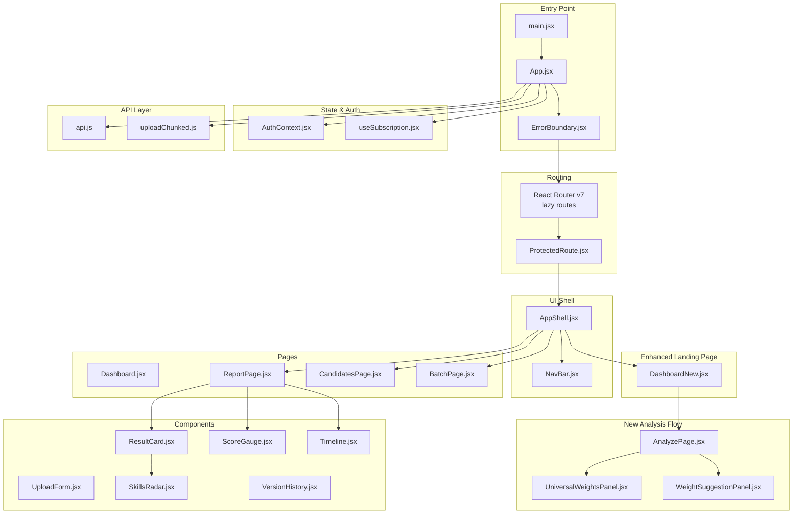

**Diagram sources**
- [main.jsx:1-23](file://app/frontend/src/main.jsx#L1-L23)
- [App.jsx:1-87](file://app/frontend/src/App.jsx#L1-L87)
- [ErrorBoundary.jsx:1-54](file://app/frontend/src/components/ErrorBoundary.jsx#L1-L54)
- [ProtectedRoute.jsx:1-24](file://app/frontend/src/components/ProtectedRoute.jsx#L1-L24)
- [AppShell.jsx:1-13](file://app/frontend/src/components/AppShell.jsx#L1-L13)
- [NavBar.jsx](file://app/frontend/src/components/NavBar.jsx)
- [DashboardNew.jsx:1-336](file://app/frontend/src/pages/DashboardNew.jsx#L1-L336)
- [AnalyzePage.jsx:1-686](file://app/frontend/src/pages/AnalyzePage.jsx#L1-L686)
- [UniversalWeightsPanel.jsx:1-295](file://app/frontend/src/components/UniversalWeightsPanel.jsx#L1-L295)
- [WeightSuggestionPanel.jsx:1-275](file://app/frontend/src/components/WeightSuggestionPanel.jsx#L1-L275)
- [ReportPage.jsx:1-297](file://app/frontend/src/pages/ReportPage.jsx#L1-L297)
- [CandidatesPage.jsx:1-204](file://app/frontend/src/pages/CandidatesPage.jsx#L1-L204)
- [BatchPage.jsx:1-514](file://app/frontend/src/pages/BatchPage.jsx#L1-L514)
- [UploadForm.jsx:1-484](file://app/frontend/src/components/UploadForm.jsx#L1-L484)
- [ResultCard.jsx:1-627](file://app/frontend/src/components/ResultCard.jsx#L1-L627)
- [ScoreGauge.jsx:1-97](file://app/frontend/src/components/ScoreGauge.jsx#L1-L97)
- [Timeline.jsx:1-115](file://app/frontend/src/components/Timeline.jsx#L1-L115)
- [SkillsRadar.jsx](file://app/frontend/src/components/SkillsRadar.jsx)
- [VersionHistory.jsx:1-260](file://app/frontend/src/components/VersionHistory.jsx#L1-L260)
- [AuthContext.jsx:1-71](file://app/frontend/src/contexts/AuthContext.jsx#L1-L71)
- [useSubscription.jsx:1-186](file://app/frontend/src/hooks/useSubscription.jsx#L1-L186)
- [api.js:1-486](file://app/frontend/src/lib/api.js#L1-L486)
- [uploadChunked.js:1-326](file://app/frontend/src/lib/uploadChunked.js#L1-L326)

**Section sources**
- [main.jsx:1-23](file://app/frontend/src/main.jsx#L1-L23)
- [App.jsx:1-87](file://app/frontend/src/App.jsx#L1-L87)
- [ErrorBoundary.jsx:1-54](file://app/frontend/src/components/ErrorBoundary.jsx#L1-L54)
- [package.json:1-41](file://app/frontend/package.json#L1-L41)

## Core Components
- **ErrorBoundary**: React ErrorBoundary component for graceful degradation with user-friendly error messages and retry options.
- **AppShell**: Provides a consistent layout with navigation and scrollable content area.
- **ProtectedRoute**: Guards routes requiring authentication.
- **DashboardNew**: Enhanced landing page serving as the new dashboard with analytics widgets, quick actions, and recent activity.
- **AnalyzePage**: New 3-step analysis workflow with job description input, AI weight suggestions, and resume upload.
- **UniversalWeightsPanel**: Comprehensive scoring weights configuration with adaptive labels and validation.
- **WeightSuggestionPanel**: AI-powered weight recommendations based on job description analysis.
- **VersionHistory**: Component for tracking and comparing analysis versions with scoring history.
- **UploadForm**: Multi-mode job description input (text, file, URL), scoring weights, and resume upload with drag-and-drop.
- **ResultCard**: Comprehensive analysis results with collapsible sections, explainability, skills radar, interview kit, and email generation.
- **ScoreGauge**: Visual fit score with thresholds and pending state.
- **Timeline**: Employment history visualization with gaps and severity indicators.
- **BatchPage**: Enhanced batch processing with chunked upload capabilities and progress tracking.
- **CandidatesPage**: List and search candidates with pagination and detail modal.
- **ReportPage**: Single-result presentation with sharing, printing, labeling, and inline editing.
- **AuthContext**: JWT lifecycle, login/register/logout, and tenant/user state.
- **useSubscription**: Subscription and usage checks, optimistic updates, and plan features with improved error handling.
- **uploadChunked**: Utility for handling large file uploads with chunking, retry logic, and progress tracking.

**Section sources**
- [ErrorBoundary.jsx:1-54](file://app/frontend/src/components/ErrorBoundary.jsx#L1-L54)
- [AppShell.jsx:1-13](file://app/frontend/src/components/AppShell.jsx#L1-L13)
- [ProtectedRoute.jsx:1-24](file://app/frontend/src/components/ProtectedRoute.jsx#L1-L24)
- [DashboardNew.jsx:1-336](file://app/frontend/src/pages/DashboardNew.jsx#L1-L336)
- [AnalyzePage.jsx:1-686](file://app/frontend/src/pages/AnalyzePage.jsx#L1-L686)
- [UniversalWeightsPanel.jsx:1-295](file://app/frontend/src/components/UniversalWeightsPanel.jsx#L1-L295)
- [WeightSuggestionPanel.jsx:1-275](file://app/frontend/src/components/WeightSuggestionPanel.jsx#L1-L275)
- [VersionHistory.jsx:1-260](file://app/frontend/src/components/VersionHistory.jsx#L1-L260)
- [UploadForm.jsx:1-484](file://app/frontend/src/components/UploadForm.jsx#L1-L484)
- [ResultCard.jsx:1-627](file://app/frontend/src/components/ResultCard.jsx#L1-L627)
- [ScoreGauge.jsx:1-97](file://app/frontend/src/components/ScoreGauge.jsx#L1-L97)
- [Timeline.jsx:1-115](file://app/frontend/src/components/Timeline.jsx#L1-L115)
- [BatchPage.jsx:1-514](file://app/frontend/src/pages/BatchPage.jsx#L1-L514)
- [CandidatesPage.jsx:1-204](file://app/frontend/src/pages/CandidatesPage.jsx#L1-L204)
- [ReportPage.jsx:1-297](file://app/frontend/src/pages/ReportPage.jsx#L1-L297)
- [AuthContext.jsx:1-71](file://app/frontend/src/contexts/AuthContext.jsx#L1-L71)
- [useSubscription.jsx:1-186](file://app/frontend/src/hooks/useSubscription.jsx#L1-L186)
- [uploadChunked.js:1-326](file://app/frontend/src/lib/uploadChunked.js#L1-L326)

## Architecture Overview
The frontend follows a layered architecture with enhanced error handling and redesigned analysis flow:
- Entry point initializes React 18 StrictMode, Router, global error handlers, and ErrorBoundary wrapper.
- App wraps routes with ErrorBoundary, AuthProvider, sets up lazy routes, and renders shell wrappers.
- ErrorBoundary provides graceful degradation with user-friendly error messages and retry options.
- AppShell hosts NavBar and page content.
- DashboardNew serves as the enhanced landing page with analytics and quick actions.
- AnalyzePage orchestrates the new 3-step analysis workflow with AI-powered features.
- Pages orchestrate UI components and API interactions with improved error handling.
- API client centralizes HTTP requests, JWT injection, automatic refresh, and enhanced retry mechanisms.
- Contexts and hooks manage authentication and subscription state with robust error handling.
- uploadChunked utility handles large file uploads with chunking and progress tracking.

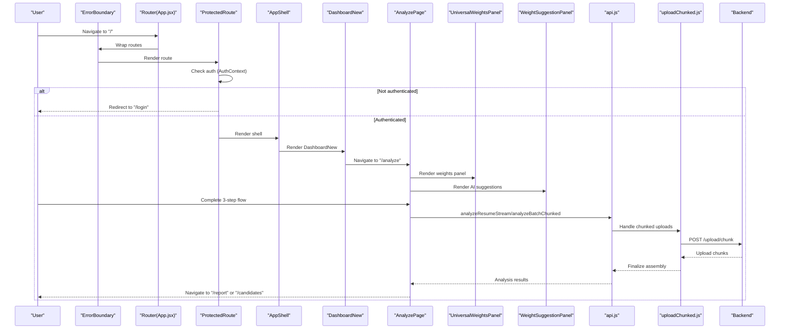

**Diagram sources**
- [App.jsx:1-87](file://app/frontend/src/App.jsx#L1-L87)
- [ErrorBoundary.jsx:1-54](file://app/frontend/src/components/ErrorBoundary.jsx#L1-L54)
- [ProtectedRoute.jsx:1-24](file://app/frontend/src/components/ProtectedRoute.jsx#L1-L24)
- [AppShell.jsx:1-13](file://app/frontend/src/components/AppShell.jsx#L1-L13)
- [DashboardNew.jsx:1-336](file://app/frontend/src/pages/DashboardNew.jsx#L1-L336)
- [AnalyzePage.jsx:1-686](file://app/frontend/src/pages/AnalyzePage.jsx#L1-L686)
- [UniversalWeightsPanel.jsx:1-295](file://app/frontend/src/components/UniversalWeightsPanel.jsx#L1-L295)
- [WeightSuggestionPanel.jsx:1-275](file://app/frontend/src/components/WeightSuggestionPanel.jsx#L1-L275)
- [api.js:1-486](file://app/frontend/src/lib/api.js#L1-L486)
- [uploadChunked.js:1-326](file://app/frontend/src/lib/uploadChunked.js#L1-L326)

**Section sources**
- [App.jsx:1-87](file://app/frontend/src/App.jsx#L1-L87)
- [ErrorBoundary.jsx:1-54](file://app/frontend/src/components/ErrorBoundary.jsx#L1-L54)
- [api.js:1-486](file://app/frontend/src/lib/api.js#L1-L486)
- [uploadChunked.js:1-326](file://app/frontend/src/lib/uploadChunked.js#L1-L326)

## Detailed Component Analysis

### Enhanced DashboardNew Landing Page
DashboardNew serves as the new primary landing page replacing the legacy Dashboard:
- Features gradient hero section with prominent call-to-action for new analysis
- Three-column statistics grid showing usage, plan info, and JD library
- Recent analyses quick access with clickable entries
- Saved JD library integration with one-click analysis initiation
- Feature highlights section showcasing AI weight suggestions, batch processing, and version history
- Responsive design with card animations and blur effects

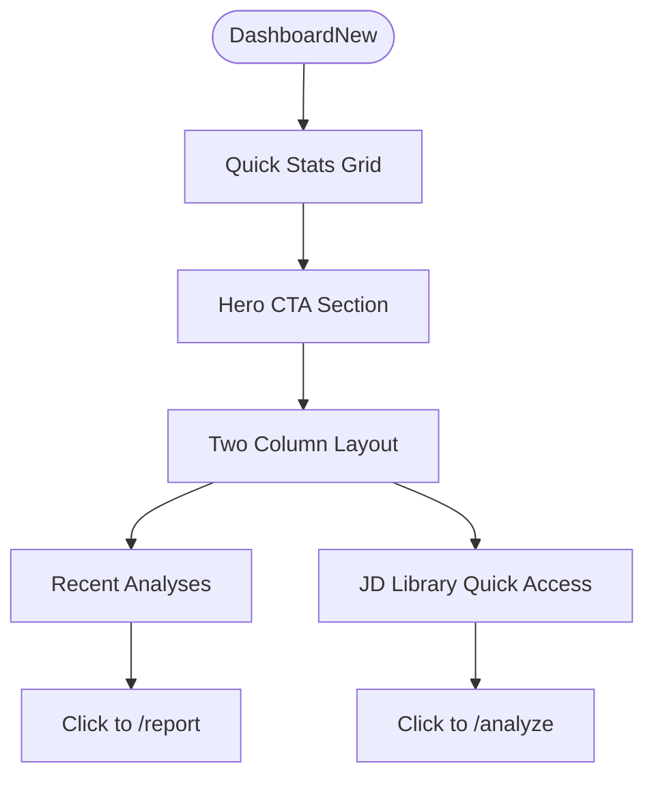

**Diagram sources**
- [DashboardNew.jsx:1-336](file://app/frontend/src/pages/DashboardNew.jsx#L1-L336)

**Section sources**
- [DashboardNew.jsx:1-336](file://app/frontend/src/pages/DashboardNew.jsx#L1-L336)

### New 3-Step Analysis Workflow
AnalyzePage implements a comprehensive three-step analysis process:
- Step 1: Job Description input with text, file upload, and URL extraction modes
- Step 2: Scoring weights configuration with UniversalWeightsPanel and AI suggestions
- Step 3: Resume upload with drag-and-drop and batch processing
- Local draft saving with localStorage persistence
- AI-powered weight suggestions with confidence indicators
- Adaptive role-based weight labels and tooltips
- Real-time validation with weight total tracking

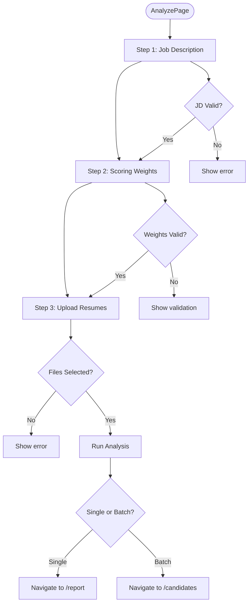

**Diagram sources**
- [AnalyzePage.jsx:1-686](file://app/frontend/src/pages/AnalyzePage.jsx#L1-L686)

**Section sources**
- [AnalyzePage.jsx:1-686](file://app/frontend/src/pages/AnalyzePage.jsx#L1-L686)

### UniversalWeightsPanel Component
UniversalWeightsPanel provides comprehensive scoring weights configuration:
- Default weight distribution with balanced scoring approach
- Preset configurations (Balanced, Skill-Heavy, Experience-Heavy, Domain-Focused)
- Adaptive labels based on role categories (technical, sales, hr, marketing, operations, leadership)
- Real-time validation with total percentage tracking (should equal 100% excluding risk)
- Risk penalty slider with negative weighting
- Tooltip-based explanations for each weight category
- Reset to defaults functionality

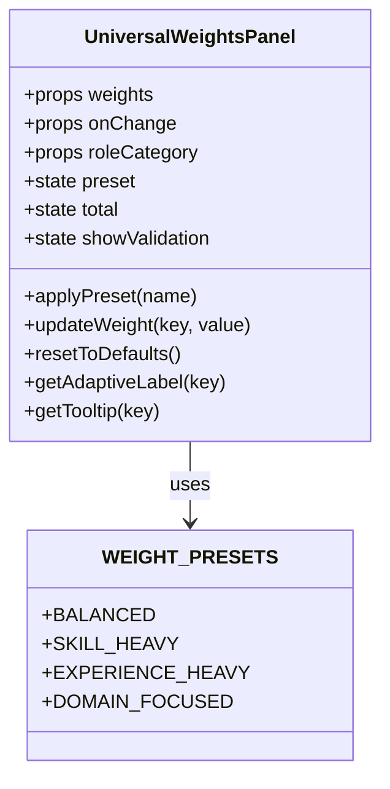

**Diagram sources**
- [UniversalWeightsPanel.jsx:1-295](file://app/frontend/src/components/UniversalWeightsPanel.jsx#L1-L295)

**Section sources**
- [UniversalWeightsPanel.jsx:1-295](file://app/frontend/src/components/UniversalWeightsPanel.jsx#L1-L295)

### WeightSuggestionPanel Component
WeightSuggestionPanel provides AI-powered weight recommendations:
- AI analysis of job descriptions for optimal weight distribution
- Confidence scoring with color-coded indicators
- Role and seniority detection with badge displays
- Visual weight distribution with gradient bars
- Detailed reasoning explanation for suggested weights
- One-click acceptance of AI recommendations
- Fallback to default weights when AI unavailable

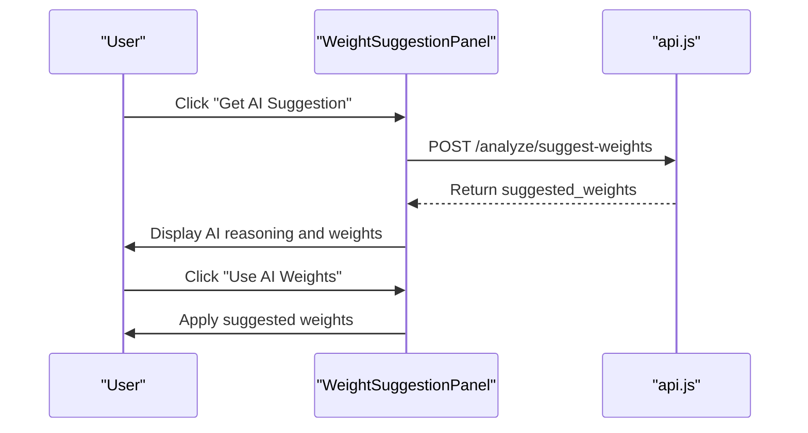

**Diagram sources**
- [WeightSuggestionPanel.jsx:1-275](file://app/frontend/src/components/WeightSuggestionPanel.jsx#L1-L275)

**Section sources**
- [WeightSuggestionPanel.jsx:1-275](file://app/frontend/src/components/WeightSuggestionPanel.jsx#L1-L275)

### VersionHistory Component
VersionHistory enables tracking and comparison of analysis versions:
- Comprehensive version listing with timestamps and scores
- Side-by-side comparison capability with selection toggle
- Score difference indicators with trend arrows
- Active version highlighting and restoration options
- Role category badges for quick identification
- Weight reasoning tracking and display
- Delete functionality for obsolete versions

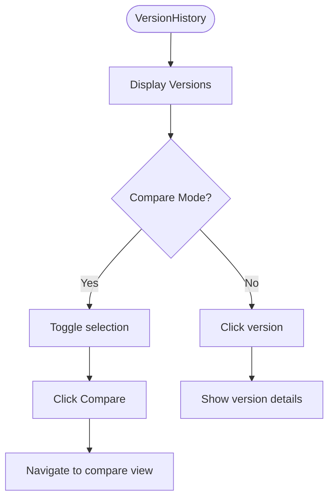

**Diagram sources**
- [VersionHistory.jsx:1-260](file://app/frontend/src/components/VersionHistory.jsx#L1-L260)

**Section sources**
- [VersionHistory.jsx:1-260](file://app/frontend/src/components/VersionHistory.jsx#L1-L260)

### Enhanced Chunked Upload System
uploadChunked.js provides robust large file upload handling:
- 10MB chunk size optimized for Cloudflare 100MB limit compliance
- Parallel chunk upload with concurrency control (3 concurrent uploads)
- Exponential backoff retry logic (3 retries with 1s, 2s, 4s delays)
- MD5 hash calculation for file integrity verification
- Real-time progress tracking with bytes uploaded, speed, and ETA
- Individual file and overall progress callbacks
- Server-side chunk assembly and cleanup functionality
- Abort functionality with server-side cancellation

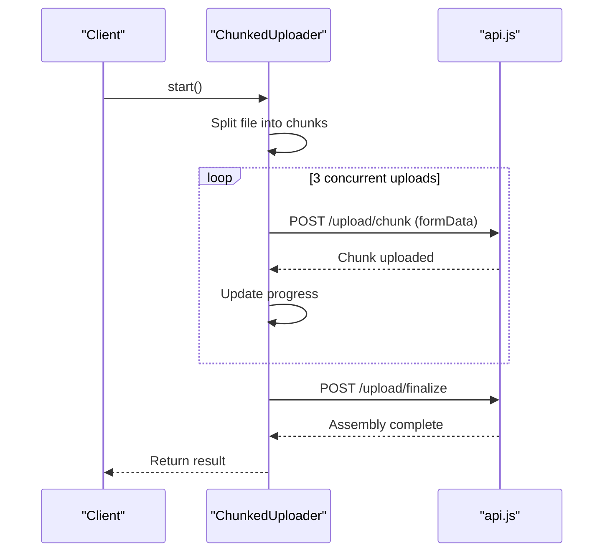

**Diagram sources**
- [uploadChunked.js:1-326](file://app/frontend/src/lib/uploadChunked.js#L1-L326)

**Section sources**
- [uploadChunked.js:1-326](file://app/frontend/src/lib/uploadChunked.js#L1-L326)

### Enhanced Batch Processing
BatchPage integrates chunked upload capabilities for large-scale processing:
- Drag-and-drop multi-file upload with progress tracking
- Cloudflare proxy bypass through chunked upload approach
- Real-time overall progress with individual file status
- Template library integration for job descriptions
- Export functionality for CSV and Excel formats
- Selection-based export with checkbox controls
- Usage limit enforcement with visual warnings

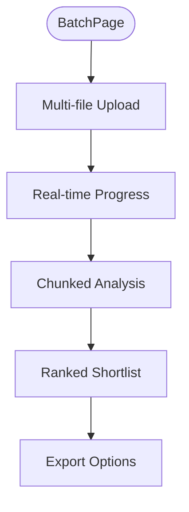

**Diagram sources**
- [BatchPage.jsx:1-514](file://app/frontend/src/pages/BatchPage.jsx#L1-L514)

**Section sources**
- [BatchPage.jsx:1-514](file://app/frontend/src/pages/BatchPage.jsx#L1-L514)

### ErrorBoundary Implementation
The ErrorBoundary component provides comprehensive error handling for the entire application:
- Catches JavaScript errors anywhere in the child component tree
- Displays user-friendly error messages with actionable retry options
- Implements exponential backoff retry mechanism
- Maintains application state during error conditions
- Provides both manual retry and automatic refresh options


**Diagram sources**
- [ErrorBoundary.jsx:1-54](file://app/frontend/src/components/ErrorBoundary.jsx#L1-L54)

**Section sources**
- [ErrorBoundary.jsx:1-54](file://app/frontend/src/components/ErrorBoundary.jsx#L1-L54)

### Authentication and Routing
- AuthContext manages user, tenant, and loading state. It loads persisted tokens via httpOnly cookies, logs in/out, and exposes helpers to child components.
- ProtectedRoute enforces authentication for protected shells and shows a loader while resolving session state.
- App.jsx defines lazy routes for all pages including the new DashboardNew and AnalyzePage, wrapping them in ErrorBoundary, ProtectedRoute, and SubscriptionProvider, then AppShell.


**Diagram sources**
- [App.jsx:1-87](file://app/frontend/src/App.jsx#L1-L87)
- [ProtectedRoute.jsx:1-24](file://app/frontend/src/components/ProtectedRoute.jsx#L1-L24)
- [AuthContext.jsx:1-71](file://app/frontend/src/contexts/AuthContext.jsx#L1-L71)

**Section sources**
- [AuthContext.jsx:1-71](file://app/frontend/src/contexts/AuthContext.jsx#L1-L71)
- [ProtectedRoute.jsx:1-24](file://app/frontend/src/components/ProtectedRoute.jsx#L1-L24)
- [App.jsx:1-87](file://app/frontend/src/App.jsx#L1-L87)

### Enhanced API Integration Layer
- api.js creates an Axios instance with base URL from environment.
- Request interceptor attaches CSRF token for non-GET requests and handles httpOnly cookies automatically.
- Response interceptor handles 401 by refreshing token via refresh endpoint and retrying the original request.
- **NEW**: Enhanced retry interceptor with exponential backoff for 5xx errors and network failures.
- **NEW**: Idempotency checking to prevent retrying non-idempotent POST requests.
- **NEW**: Configurable retry limits (MAX_RETRIES = 3) with delays [1s, 2s, 4s].
- **NEW**: Chunked upload endpoints (/upload/chunk, /upload/finalize, /upload/cancel) integrated.
- Exposes domain-specific functions for analysis, batch, history, comparison, exports, templates, candidates, email generation, JD URL extraction, team actions, training, video, transcript, health, and subscription management.

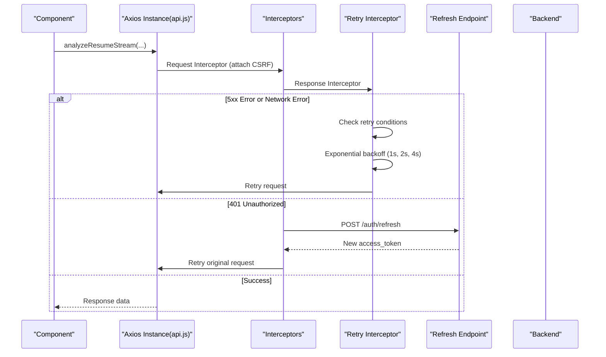

**Diagram sources**
- [api.js:64-90](file://app/frontend/src/lib/api.js#L64-L90)

**Section sources**
- [api.js:1-486](file://app/frontend/src/lib/api.js#L1-L486)

### UploadForm
- Supports three job description modes: text, file, URL.
- Drag-and-drop for resume and JD via react-dropzone with accept rules and size limits.
- Scoring weights presets and custom sliders.
- Saved JD templates picker with save-to-library flow.
- Submission guarded by validation and loading state.
- **Enhanced**: Improved error handling with user-friendly error messages and retry capabilities.

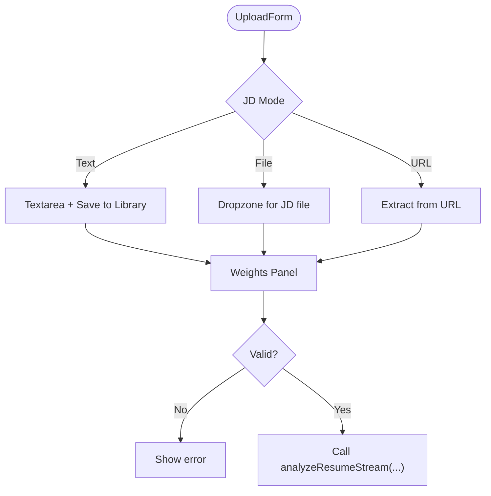

**Diagram sources**
- [UploadForm.jsx:1-484](file://app/frontend/src/components/UploadForm.jsx#L1-L484)
- [api.js:122-205](file://app/frontend/src/lib/api.js#L122-L205)

**Section sources**
- [UploadForm.jsx:1-484](file://app/frontend/src/components/UploadForm.jsx#L1-L484)

### ResultCard
- Renders recommendation badge, analysis source indicator, pending banner, score breakdown bars, matched/missing skills, adjacent skills, skills radar, strengths/weaknesses/risk signals, explainability, education analysis, domain fit/architecture, and interview kit tabs.
- Email modal integrates with backend email generation.

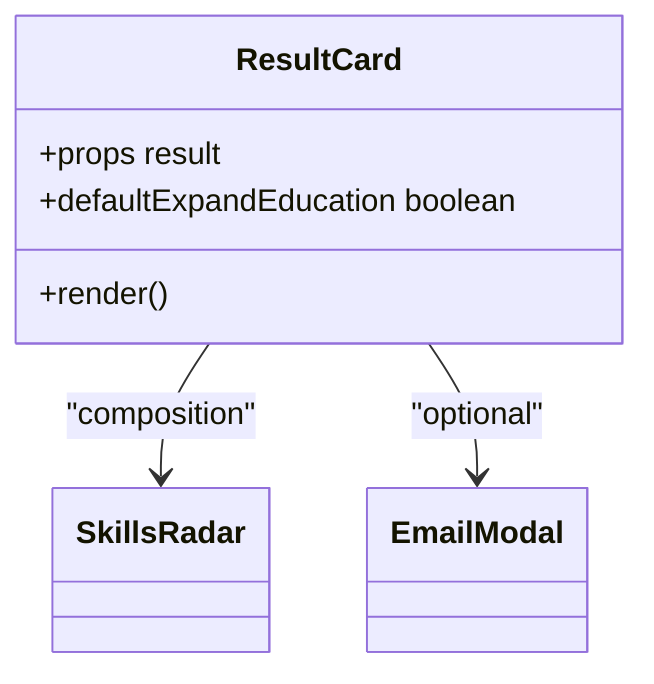

**Diagram sources**
- [ResultCard.jsx:1-627](file://app/frontend/src/components/ResultCard.jsx#L1-L627)
- [SkillsRadar.jsx](file://app/frontend/src/components/SkillsRadar.jsx)

**Section sources**
- [ResultCard.jsx:1-627](file://app/frontend/src/components/ResultCard.jsx#L1-L627)

### ScoreGauge
- Visualizes fit score with thresholds and pending state. Uses SVG arcs and transitions.


**Diagram sources**
- [ScoreGauge.jsx:1-97](file://app/frontend/src/components/ScoreGauge.jsx#L1-L97)

**Section sources**
- [ScoreGauge.jsx:1-97](file://app/frontend/src/components/ScoreGauge.jsx#L1-L97)

### Timeline
- Sorts and renders work experience with optional employment gaps and severity badges.


**Diagram sources**
- [Timeline.jsx:1-115](file://app/frontend/src/components/Timeline.jsx#L1-L115)

**Section sources**
- [Timeline.jsx:1-115](file://app/frontend/src/components/Timeline.jsx#L1-L115)

### Dashboard
- Orchestrates agent pipeline progress visualization during streaming analysis.
- Integrates usage widget via useSubscription and navigates to ReportPage upon completion.
- **Enhanced**: Improved error handling with graceful degradation and user feedback.

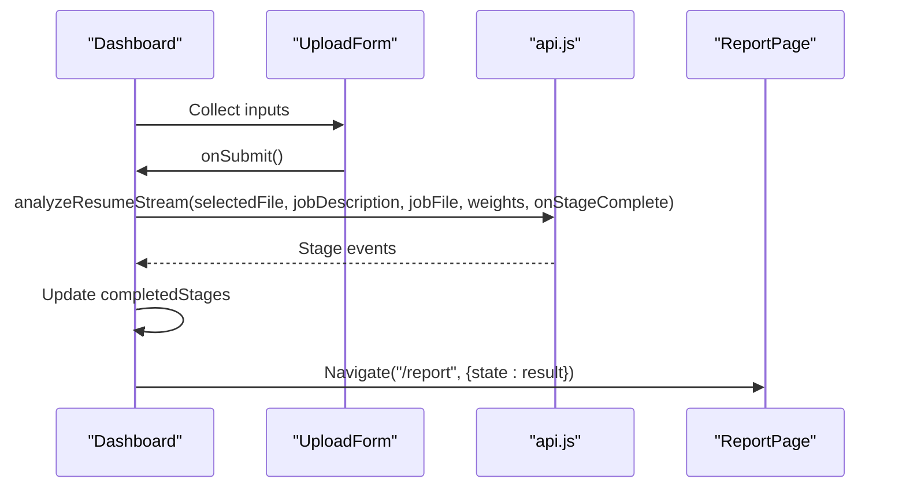

**Diagram sources**
- [Dashboard.jsx:1-330](file://app/frontend/src/pages/Dashboard.jsx#L1-L330)
- [api.js:122-205](file://app/frontend/src/lib/api.js#L122-L205)

**Section sources**
- [Dashboard.jsx:1-330](file://app/frontend/src/pages/Dashboard.jsx#L1-L330)

### CandidatesPage
- Lists candidates with search, pagination, and detail modal showing history and quick navigation to reports.

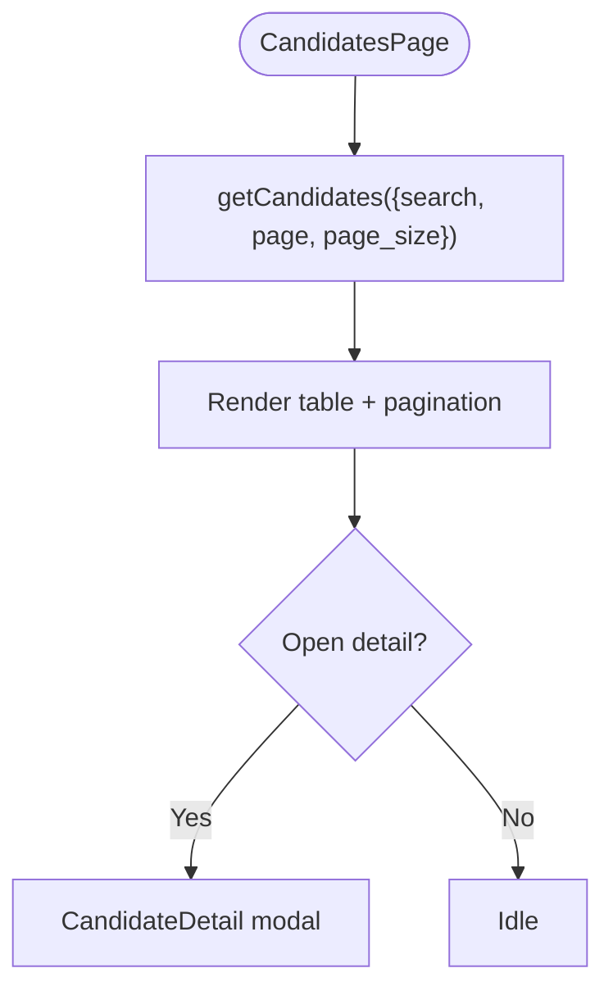

**Diagram sources**
- [CandidatesPage.jsx:1-204](file://app/frontend/src/pages/CandidatesPage.jsx#L1-L204)
- [api.js:287-295](file://app/frontend/src/lib/api.js#L287-L295)

**Section sources**
- [CandidatesPage.jsx:1-204](file://app/frontend/src/pages/CandidatesPage.jsx#L1-L204)

### ReportPage
- Presents a single result with sidebar actions (share, download PDF), inline candidate name editor, label training buttons, and full ResultCard plus Timeline.

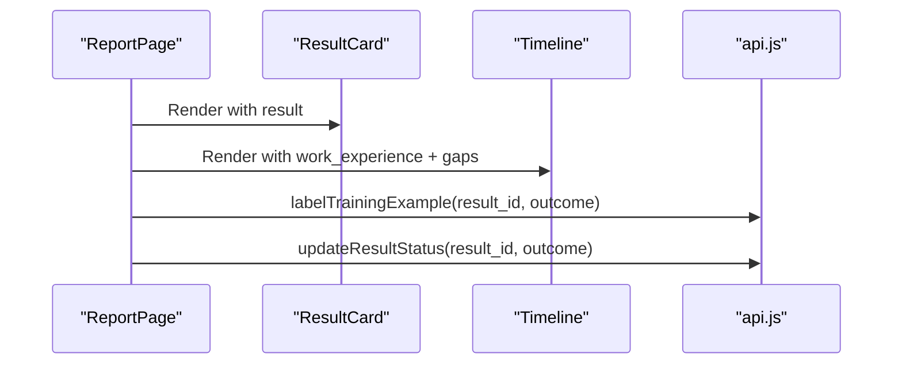

**Diagram sources**
- [ReportPage.jsx:1-297](file://app/frontend/src/pages/ReportPage.jsx#L1-L297)
- [ResultCard.jsx:1-627](file://app/frontend/src/components/ResultCard.jsx#L1-L627)
- [Timeline.jsx:1-115](file://app/frontend/src/components/Timeline.jsx#L1-L115)
- [api.js:340-343](file://app/frontend/src/lib/api.js#L340-L343)

**Section sources**
- [ReportPage.jsx:1-297](file://app/frontend/src/pages/ReportPage.jsx#L1-L297)

### Subscription Management Hooks
- useSubscription provides cached subscription data, available plans, usage stats, feature checks, and optimistic refresh after analysis.
- useUsageCheck performs preflight checks against remaining analyses and server-side limits.
- **Enhanced**: Improved error handling with graceful degradation and user feedback.


**Diagram sources**
- [useSubscription.jsx:1-186](file://app/frontend/src/hooks/useSubscription.jsx#L1-L186)

**Section sources**
- [useSubscription.jsx:1-186](file://app/frontend/src/hooks/useSubscription.jsx#L1-L186)

## Dependency Analysis
- React 18 with React DOM for rendering.
- React Router v7 for routing and lazy loading.
- Axios for HTTP with enhanced interceptors and retry mechanisms.
- lucide-react for icons.
- react-dropzone for drag-and-drop.
- recharts for optional visualizations.
- TailwindCSS for styling and responsive design.

```mermaid
graph LR
Pkg["package.json"] --> React["react@^18"]
Pkg --> Router["react-router-dom@^7"]
Pkg --> Axios["axios@^1.7"]
Pkg --> Icons["lucide-react@^0.469"]
Pkg --> Drop["react-dropzone@^14"]
Pkg --> Charts["recharts@^3"]
Pkg --> Tailwind["tailwindcss@^3"]
```

**Diagram sources**
- [package.json:1-41](file://app/frontend/package.json#L1-L41)

**Section sources**
- [package.json:1-41](file://app/frontend/package.json#L1-L41)

## Performance Considerations
- Lazy loading: Pages are lazy-imported to reduce initial bundle size.
- Suspense: Fallback spinner during page load.
- Optimistic updates: Subscription usage increments immediately, followed by server sync.
- Efficient rendering: Components use minimal state and avoid unnecessary re-renders; lists paginated.
- Streaming: SSE-based analysis updates UI progressively without polling.
- Image/icon assets: lucide-react icons are tree-shaken; keep only used icons.
- **Enhanced**: Error boundaries prevent cascading failures and improve perceived performance.
- **Enhanced**: Retry mechanisms with exponential backoff reduce user frustration from transient failures.
- **Enhanced**: Chunked upload reduces memory usage and improves reliability for large files.
- **Enhanced**: Parallel chunk processing maximizes throughput while maintaining reliability.

## Testing Strategy
- Unit and integration tests use React Testing Library and Vitest.
- Tests cover components like UploadForm, ResultCard, ScoreGauge, and pages like VideoPage.
- Mock services and API endpoints are used to isolate component behavior.
- Setup includes DOM testing with jsdom and React Testing Library matchers.
- **Enhanced**: Error boundary testing with user interaction scenarios and retry logic validation.
- **Enhanced**: Chunked upload testing with simulated network failures and progress tracking.
- **Enhanced**: Analysis workflow testing with step-by-step validation and error scenarios.

**Section sources**
- [UploadForm.test.jsx](file://app/frontend/src/__tests__/UploadForm.test.jsx)
- [ResultCard.test.jsx](file://app/frontend/src/__tests__/ResultCard.test.jsx)
- [ScoreGauge.test.jsx](file://app/frontend/src/__tests__/ScoreGauge.test.jsx)
- [VideoPage.test.jsx](file://app/frontend/src/__tests__/VideoPage.test.jsx)
- [api.test.js](file://app/frontend/src/__tests__/api.test.js)
- [setup.js](file://app/frontend/src/__tests__/setup.js)

## Extensibility Guidelines
- Add new pages under pages/ and register them in App.jsx with lazy import, ErrorBoundary wrapper, ProtectedRoute wrapper, and SubscriptionProvider.
- Create reusable components in components/ following existing patterns: props interface, controlled state, Tailwind classes, and accessibility attributes.
- Extend API client in lib/api.js with new endpoints and reuse enhanced interceptors for auth, refresh, and retry logic.
- Introduce new contexts or hooks under contexts/ or hooks/ respectively, and wrap providers at App.jsx level with ErrorBoundary.
- Keep styling consistent with existing Tailwind utilities and brand tokens; avoid ad-hoc CSS.
- For new features gated by plan, use useSubscription.isFeatureAvailable and guard UI accordingly.
- **Enhanced**: Implement ErrorBoundary for critical components that require graceful degradation.
- **Enhanced**: Use uploadChunked utility for any new file upload functionality requiring large file support.

## Accessibility and Responsive Design
- Accessible semantics: Buttons, inputs, and modals use appropriate roles and labels; focus management in dialogs.
- Keyboard navigation: Focus traps in modals, Enter/Escape handlers in editors.
- Responsive breakpoints: Use flex/grid utilities to adapt layouts across screen sizes; sidebar collapses on mobile.
- Color contrast: Maintain sufficient contrast for text and interactive elements; brand palette is used consistently.
- ARIA patterns: Dialogs and modals announce content; loading states expose spinners with accessible labels.
- **Enhanced**: Error messages provide clear guidance and actionable next steps for users.
- **Enhanced**: Progress indicators provide feedback for long-running operations like chunked uploads.
- **Enhanced**: Form validation provides immediate feedback with clear error messages.

## Error Handling and Resilience

### Global Error Handling
The application implements comprehensive error handling at multiple levels:

#### Application-Level Error Boundary
- Wraps the entire application to prevent crashes and provide graceful degradation
- Displays user-friendly error messages with retry options
- Handles both JavaScript errors and component rendering failures
- Provides manual retry and automatic refresh capabilities

#### API-Level Error Handling
- **Enhanced Retry Logic**: Automatic retry for 5xx errors and network failures with exponential backoff
- **Idempotency Protection**: Prevents retrying non-idempotent POST requests
- **Configurable Limits**: Maximum 3 retry attempts with delays of 1s, 2s, and 4s
- **Smart Error Classification**: Differentiates between retryable and non-retryable errors

#### Component-Level Error Handling
- Individual components implement specific error handling patterns
- User feedback through error banners and notifications
- Graceful degradation when features fail
- Clear messaging about recovery options

#### Chunked Upload Error Handling
- **Robust Retry Logic**: Automatic retry for failed chunks with exponential backoff
- **Progress Tracking**: Maintains upload progress despite individual chunk failures
- **Abort Support**: Allows users to cancel uploads with server-side cleanup
- **Integrity Verification**: MD5 hash calculation ensures file integrity

```mermaid
flowchart TD
Error["Error Occurs"] --> Level{"Error Level"}
Level --> |JavaScript| AppBoundary["Application ErrorBoundary"]
Level --> |API| ApiRetry["API Retry Logic"]
Level --> |Component| ComponentError["Component Error State"]
Level --> |Upload| UploadError["Chunked Upload Error"]
AppBoundary --> UserMsg["User-Friendly Message"]
UserMsg --> Retry["Retry Options"]
Retry --> Manual["Manual Retry"]
Retry --> Auto["Automatic Retry"]
ApiRetry --> Check{"Retry Conditions"}
Check --> |5xx Error| Backoff["Exponential Backoff"]
Check --> |Network Error| Backoff
Check --> |401| AuthRefresh["Authentication Refresh"]
Check --> |Other| FailFast["Fail Fast"]
Backoff --> Limit{"Retry Count < 3?"}
Limit --> |Yes| RetryRequest["Retry Request"]
Limit --> |No| Fail["Propagate Error"]
AuthRefresh --> RetryRequest
UploadError --> ChunkRetry["Retry Failed Chunks"]
UploadError --> Progress["Maintain Progress"]
UploadError --> Abort["Allow Abort"]
```

**Diagram sources**
- [ErrorBoundary.jsx:1-54](file://app/frontend/src/components/ErrorBoundary.jsx#L1-L54)
- [api.js:64-90](file://app/frontend/src/lib/api.js#L64-L90)
- [uploadChunked.js:130-165](file://app/frontend/src/lib/uploadChunked.js#L130-L165)

**Section sources**
- [ErrorBoundary.jsx:1-54](file://app/frontend/src/components/ErrorBoundary.jsx#L1-L54)
- [api.js:64-90](file://app/frontend/src/lib/api.js#L64-L90)
- [uploadChunked.js:1-326](file://app/frontend/src/lib/uploadChunked.js#L1-L326)

## Troubleshooting Guide
- Authentication issues: Verify tokens in localStorage; AuthContext clears tokens on 401; check interceptor retry flow.
- Streaming errors: analyzeResumeStream throws on invalid responses; ensure backend SSE endpoint availability.
- Usage limits: useUsageCheck returns remaining analyses and server-side checks; handle allowed=false gracefully.
- Network failures: Axios interceptors surface errors; confirm API_URL environment variable and CORS on backend.
- **Enhanced**: Error boundary failures: Check console for ErrorBoundary caught errors; verify retry logic and user feedback.
- **Enhanced**: API retry failures: Monitor retry counts and backoff delays; ensure idempotency for retryable requests.
- **Enhanced**: Global error handling: Check window.onerror and unhandledrejection handlers for uncaught exceptions.
- **Enhanced**: Chunked upload failures: Monitor upload progress and retry logic; verify server-side chunk assembly.
- **Enhanced**: Analysis workflow issues: Check step validation and error messages in AnalyzePage.
- **Enhanced**: Weight validation errors: Verify UniversalWeightsPanel total equals 100% (excluding risk penalty).

**Section sources**
- [AuthContext.jsx:1-71](file://app/frontend/src/contexts/AuthContext.jsx#L1-L71)
- [api.js:64-90](file://app/frontend/src/lib/api.js#L64-L90)
- [Dashboard.jsx:267-275](file://app/frontend/src/pages/Dashboard.jsx#L267-L275)
- [useSubscription.jsx:164-182](file://app/frontend/src/hooks/useSubscription.jsx#L164-L182)
- [ErrorBoundary.jsx:13-15](file://app/frontend/src/components/ErrorBoundary.jsx#L13-L15)
- [main.jsx:7-14](file://app/frontend/src/main.jsx#L7-L14)
- [uploadChunked.js:130-165](file://app/frontend/src/lib/uploadChunked.js#L130-L165)
- [AnalyzePage.jsx:226-298](file://app/frontend/src/pages/AnalyzePage.jsx#L226-L298)
- [UniversalWeightsPanel.jsx:158](file://app/frontend/src/components/UniversalWeightsPanel.jsx#L158)

## Conclusion
The Resume AI frontend is a modular, scalable React 18 application with clear separation between routing, state, UI components, and API integration. It leverages modern tooling, robust authentication and subscription management, comprehensive error handling through ErrorBoundary components, and enhanced API retry mechanisms with exponential backoff. The architecture now provides graceful degradation, improved resilience against transient failures, and a cohesive design system to deliver a responsive, accessible, and performant user experience even under adverse conditions. The new 3-step analysis workflow, enhanced dashboard, AI-powered weight suggestions, and chunked upload capabilities represent significant improvements in user experience and system reliability.