# Frontend Architecture

<cite>
**Referenced Files in This Document**
- [main.jsx](file://app/frontend/src/main.jsx)
- [App.jsx](file://app/frontend/src/App.jsx)
- [ErrorBoundary.jsx](file://app/frontend/src/components/ErrorBoundary.jsx)
- [AppShell.jsx](file://app/frontend/src/components/AppShell.jsx)
- [NavBar.jsx](file://app/frontend/src/components/NavBar.jsx)
- [ProtectedRoute.jsx](file://app/frontend/src/components/ProtectedRoute.jsx)
- [AuthContext.jsx](file://app/frontend/src/contexts/AuthContext.jsx)
- [api.js](file://app/frontend/src/lib/api.js)
- [uploadChunked.js](file://app/frontend/src/lib/uploadChunked.js)
- [UploadForm.jsx](file://app/frontend/src/components/UploadForm.jsx)
- [ResultCard.jsx](file://app/frontend/src/components/ResultCard.jsx)
- [ScoreGauge.jsx](file://app/frontend/src/components/ScoreGauge.jsx)
- [Timeline.jsx](file://app/frontend/src/components/Timeline.jsx)
- [SkillsRadar.jsx](file://app/frontend/src/components/SkillsRadar.jsx)
- [UniversalWeightsPanel.jsx](file://app/frontend/src/components/UniversalWeightsPanel.jsx)
- [WeightSuggestionPanel.jsx](file://app/frontend/src/components/WeightSuggestionPanel.jsx)
- [VersionHistory.jsx](file://app/frontend/src/components/VersionHistory.jsx)
- [ComparisonView.jsx](file://app/frontend/src/components/ComparisonView.jsx)
- [Dashboard.jsx](file://app/frontend/src/pages/Dashboard.jsx)
- [DashboardNew.jsx](file://app/frontend/src/pages/DashboardNew.jsx)
- [AnalyzePage.jsx](file://app/frontend/src/pages/AnalyzePage.jsx)
- [BatchPage.jsx](file://app/frontend/src/pages/BatchPage.jsx)
- [CandidatesPage.jsx](file://app/frontend/src/pages/CandidatesPage.jsx)
- [ReportPage.jsx](file://app/frontend/src/pages/ReportPage.jsx)
- [useSubscription.jsx](file://app/frontend/src/hooks/useSubscription.jsx)
- [package.json](file://app/frontend/package.json)
- [nginx.prod.conf](file://app/nginx/nginx.prod.conf)
- [AUDIT.md](file://docs/AUDIT.md)
</cite>

## Update Summary
**Changes Made**
- Added comprehensive XSS protection architecture documentation with safeStr utility function implementation
- Documented defensive programming approaches across core components (ResultCard, ComparisonView)
- Updated security posture with universal string sanitization patterns
- Enhanced error handling documentation with XSS prevention measures
- Added comprehensive CSP and security headers coverage from nginx configuration
- Documented DOMPurify dependency and its role in content sanitization

## Table of Contents
1. [Introduction](#introduction)
2. [Project Structure](#project-structure)
3. [Core Components](#core-components)
4. [Architecture Overview](#architecture-overview)
5. [Detailed Component Analysis](#detailed-component-analysis)
6. [XSS Protection Architecture](#xss-protection-architecture)
7. [Security Headers and CSP](#security-headers-and-csp)
8. [Dependency Analysis](#dependency-analysis)
9. [Performance Considerations](#performance-considerations)
10. [Testing Strategy](#testing-strategy)
11. [Extensibility Guidelines](#extensibility-guidelines)
12. [Accessibility and Responsive Design](#accessibility-and-responsive-design)
13. [Error Handling and Resilience](#error-handling-and-resilience)
14. [Troubleshooting Guide](#troubleshooting-guide)
15. [Conclusion](#conclusion)

## Introduction
This document describes the frontend architecture for Resume AI by ThetaLogics. It covers the React 18 component model, routing, state management, component library, styling and responsiveness, API integration, authentication and subscription management, error handling and resilience patterns, XSS protection architecture, and extension guidelines. The system emphasizes a clean separation of concerns, composable UI components, robust integration with backend services via Axios interceptors and dedicated hooks, comprehensive error handling for graceful degradation, and universal string sanitization to prevent XSS vulnerabilities.

## Project Structure
The frontend is organized around a classic React 18 + Vite setup with modular components, pages, contexts, hooks, and a centralized API client. Routing is handled by React Router v7 with lazy-loaded pages and protected routes. Styling leverages TailwindCSS with a consistent design system and brand palette. The architecture now includes comprehensive error handling through React ErrorBoundary components, enhanced API retry mechanisms, and universal XSS protection through the safeStr utility function.

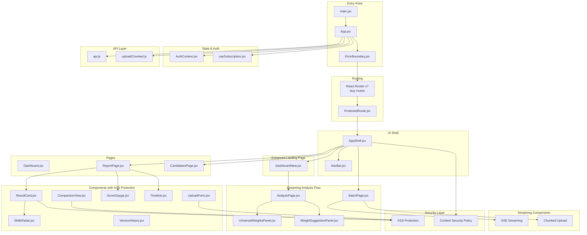

**Diagram sources**
- [main.jsx:1-23](file://app/frontend/src/main.jsx#L1-L23)
- [App.jsx:1-87](file://app/frontend/src/App.jsx#L1-L87)
- [ErrorBoundary.jsx:1-54](file://app/frontend/src/components/ErrorBoundary.jsx#L1-L54)
- [ProtectedRoute.jsx:1-24](file://app/frontend/src/components/ProtectedRoute.jsx#L1-L24)
- [AppShell.jsx:1-13](file://app/frontend/src/components/AppShell.jsx#L1-L13)
- [NavBar.jsx](file://app/frontend/src/components/NavBar.jsx)
- [DashboardNew.jsx:1-336](file://app/frontend/src/pages/DashboardNew.jsx#L1-L336)
- [AnalyzePage.jsx:1-904](file://app/frontend/src/pages/AnalyzePage.jsx#L1-L904)
- [UniversalWeightsPanel.jsx:1-295](file://app/frontend/src/components/UniversalWeightsPanel.jsx#L1-L295)
- [WeightSuggestionPanel.jsx:1-275](file://app/frontend/src/components/WeightSuggestionPanel.jsx#L1-L275)
- [BatchPage.jsx:1-617](file://app/frontend/src/pages/BatchPage.jsx#L1-L617)
- [ReportPage.jsx:1-297](file://app/frontend/src/pages/ReportPage.jsx#L1-L297)
- [CandidatesPage.jsx:1-204](file://app/frontend/src/pages/CandidatesPage.jsx#L1-L204)
- [UploadForm.jsx:1-484](file://app/frontend/src/components/UploadForm.jsx#L1-L484)
- [ResultCard.jsx:1-844](file://app/frontend/src/components/ResultCard.jsx#L1-L844)
- [ScoreGauge.jsx:1-97](file://app/frontend/src/components/ScoreGauge.jsx#L1-L97)
- [Timeline.jsx:1-115](file://app/frontend/src/components/Timeline.jsx#L1-L115)
- [SkillsRadar.jsx](file://app/frontend/src/components/SkillsRadar.jsx)
- [VersionHistory.jsx:1-260](file://app/frontend/src/components/VersionHistory.jsx#L1-L260)
- [ComparisonView.jsx:1-306](file://app/frontend/src/components/ComparisonView.jsx#L1-L306)
- [AuthContext.jsx:1-71](file://app/frontend/src/contexts/AuthContext.jsx#L1-L71)
- [useSubscription.jsx:1-186](file://app/frontend/src/hooks/useSubscription.jsx#L1-L186)
- [api.js:1-824](file://app/frontend/src/lib/api.js#L1-L824)
- [uploadChunked.js:1-326](file://app/frontend/src/lib/uploadChunked.js#L1-L326)

**Section sources**
- [main.jsx:1-23](file://app/frontend/src/main.jsx#L1-L23)
- [App.jsx:1-87](file://app/frontend/src/App.jsx#L1-L87)
- [ErrorBoundary.jsx:1-54](file://app/frontend/src/components/ErrorBoundary.jsx#L1-L54)
- [package.json:1-42](file://app/frontend/package.json#L1-L42)

## Core Components
- **ErrorBoundary**: React ErrorBoundary component for graceful degradation with user-friendly error messages and retry options.
- **AppShell**: Provides a consistent layout with navigation and scrollable content area.
- **ProtectedRoute**: Guards routes requiring authentication.
- **DashboardNew**: Enhanced landing page serving as the new dashboard with analytics widgets, quick actions, and recent activity.
- **AnalyzePage**: New 3-step analysis workflow with job description input, AI weight suggestions, and streaming resume upload.
- **BatchPage**: Enhanced batch processing with chunked upload capabilities, real-time progress tracking, and ranked shortlist table.
- **UniversalWeightsPanel**: Comprehensive scoring weights configuration with adaptive labels and validation.
- **WeightSuggestionPanel**: AI-powered weight recommendations based on job description analysis.
- **VersionHistory**: Component for tracking and comparing analysis versions with scoring history.
- **UploadForm**: Multi-mode job description input (text, file, URL), scoring weights, and resume upload with drag-and-drop.
- **ResultCard**: Comprehensive analysis results with collapsible sections, explainability, skills radar, interview kit, email generation, and XSS protection.
- **ScoreGauge**: Visual fit score with thresholds and pending state.
- **Timeline**: Employment history visualization with gaps and severity indicators.
- **CandidatesPage**: List and search candidates with pagination and detail modal.
- **ReportPage**: Single-result presentation with sharing, printing, labeling, and inline editing.
- **ComparisonView**: Side-by-side analysis comparison with universal string sanitization.
- **AuthContext**: JWT lifecycle, login/register/logout, and tenant/user state.
- **useSubscription**: Subscription and usage checks, optimistic updates, and plan features with improved error handling.
- **uploadChunked**: Utility for handling large file uploads with chunking, retry logic, and progress tracking.
- **Streaming Analysis**: SSE-based real-time updates for both single and batch analysis workflows.
- **XSS Protection**: Universal string sanitization through safeStr utility function across all components.

**Section sources**
- [ErrorBoundary.jsx:1-54](file://app/frontend/src/components/ErrorBoundary.jsx#L1-L54)
- [AppShell.jsx:1-13](file://app/frontend/src/components/AppShell.jsx#L1-L13)
- [ProtectedRoute.jsx:1-24](file://app/frontend/src/components/ProtectedRoute.jsx#L1-L24)
- [DashboardNew.jsx:1-336](file://app/frontend/src/pages/DashboardNew.jsx#L1-L336)
- [AnalyzePage.jsx:1-904](file://app/frontend/src/pages/AnalyzePage.jsx#L1-L904)
- [BatchPage.jsx:1-617](file://app/frontend/src/pages/BatchPage.jsx#L1-L617)
- [UniversalWeightsPanel.jsx:1-295](file://app/frontend/src/components/UniversalWeightsPanel.jsx#L1-L295)
- [WeightSuggestionPanel.jsx:1-275](file://app/frontend/src/components/WeightSuggestionPanel.jsx#L1-L275)
- [VersionHistory.jsx:1-260](file://app/frontend/src/components/VersionHistory.jsx#L1-L260)
- [UploadForm.jsx:1-484](file://app/frontend/src/components/UploadForm.jsx#L1-L484)
- [ResultCard.jsx:1-844](file://app/frontend/src/components/ResultCard.jsx#L1-L844)
- [ScoreGauge.jsx:1-97](file://app/frontend/src/components/ScoreGauge.jsx#L1-L97)
- [Timeline.jsx:1-115](file://app/frontend/src/components/Timeline.jsx#L1-L115)
- [CandidatesPage.jsx:1-204](file://app/frontend/src/pages/CandidatesPage.jsx#L1-L204)
- [ReportPage.jsx:1-297](file://app/frontend/src/pages/ReportPage.jsx#L1-L297)
- [ComparisonView.jsx:1-306](file://app/frontend/src/components/ComparisonView.jsx#L1-L306)
- [AuthContext.jsx:1-71](file://app/frontend/src/contexts/AuthContext.jsx#L1-L71)
- [useSubscription.jsx:1-186](file://app/frontend/src/hooks/useSubscription.jsx#L1-L186)
- [uploadChunked.js:1-326](file://app/frontend/src/lib/uploadChunked.js#L1-L326)
- [api.js:200-515](file://app/frontend/src/lib/api.js#L200-L515)

## Architecture Overview
The frontend follows a layered architecture with enhanced error handling, redesigned analysis flow, and comprehensive XSS protection:
- Entry point initializes React 18 StrictMode, Router, global error handlers, and ErrorBoundary wrapper.
- App wraps routes with ErrorBoundary, AuthProvider, sets up lazy routes, and renders shell wrappers.
- ErrorBoundary provides graceful degradation with user-friendly error messages and retry options.
- AppShell hosts NavBar and page content with security headers.
- DashboardNew serves as the enhanced landing page with analytics and quick actions.
- AnalyzePage orchestrates the new 3-step analysis workflow with AI-powered features and streaming updates.
- BatchPage provides enhanced batch processing with real-time progress tracking and ranked shortlist.
- Pages orchestrate UI components and API interactions with improved error handling and XSS protection.
- API client centralizes HTTP requests, JWT injection, automatic refresh, and enhanced retry mechanisms.
- Contexts and hooks manage authentication and subscription state with robust error handling.
- uploadChunked utility handles large file uploads with chunking and progress tracking.
- Streaming analysis provides real-time updates via SSE for both single and batch workflows.
- **NEW**: XSS Protection Layer provides universal string sanitization through safeStr utility function.
- **NEW**: Security Headers and CSP configuration protect against XSS and other web vulnerabilities.

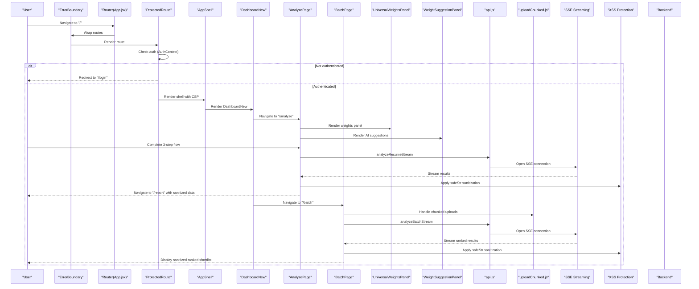

**Diagram sources**
- [App.jsx:1-87](file://app/frontend/src/App.jsx#L1-L87)
- [ErrorBoundary.jsx:1-54](file://app/frontend/src/components/ErrorBoundary.jsx#L1-L54)
- [ProtectedRoute.jsx:1-24](file://app/frontend/src/components/ProtectedRoute.jsx#L1-L24)
- [AppShell.jsx:1-13](file://app/frontend/src/components/AppShell.jsx#L1-L13)
- [DashboardNew.jsx:1-336](file://app/frontend/src/pages/DashboardNew.jsx#L1-L336)
- [AnalyzePage.jsx:1-904](file://app/frontend/src/pages/AnalyzePage.jsx#L1-L904)
- [BatchPage.jsx:1-617](file://app/frontend/src/pages/BatchPage.jsx#L1-L617)
- [UniversalWeightsPanel.jsx:1-295](file://app/frontend/src/components/UniversalWeightsPanel.jsx#L1-L295)
- [WeightSuggestionPanel.jsx:1-275](file://app/frontend/src/components/WeightSuggestionPanel.jsx#L1-L275)
- [api.js:200-515](file://app/frontend/src/lib/api.js#L200-L515)
- [uploadChunked.js:1-326](file://app/frontend/src/lib/uploadChunked.js#L1-L326)

**Section sources**
- [App.jsx:1-87](file://app/frontend/src/App.jsx#L1-L87)
- [ErrorBoundary.jsx:1-54](file://app/frontend/src/components/ErrorBoundary.jsx#L1-L54)
- [api.js:200-515](file://app/frontend/src/lib/api.js#L200-L515)
- [uploadChunked.js:1-326](file://app/frontend/src/lib/uploadChunked.js#L1-L326)

## Detailed Component Analysis

### Enhanced DashboardNew Landing Page
DashboardNew serves as the new primary landing page replacing the legacy Dashboard:
- Features gradient hero section with prominent call-to-action for new analysis
- Three-column statistics grid showing usage, plan info, and JD library
- Recent analyses quick access with clickable entries
- Saved JD library integration with one-click analysis initiation
- Feature highlights section showcasing AI weight suggestions, batch processing, and version history
- Responsive design with card animations and blur effects


**Diagram sources**
- [DashboardNew.jsx:1-336](file://app/frontend/src/pages/DashboardNew.jsx#L1-L336)

**Section sources**
- [DashboardNew.jsx:1-336](file://app/frontend/src/pages/DashboardNew.jsx#L1-L336)

### New 3-Step Analysis Workflow
AnalyzePage implements a comprehensive three-step analysis process:
- Step 1: Job Description input with text, file upload, and URL extraction modes
- Step 2: Scoring weights configuration with UniversalWeightsPanel and AI suggestions
- Step 3: Resume upload with drag-and-drop and batch processing
- Local draft saving with localStorage persistence
- AI-powered weight suggestions with confidence indicators
- Adaptive role-based weight labels and tooltips
- Real-time validation with weight total tracking
- **NEW**: Streaming analysis with real-time progress updates and ranked results
- **NEW**: XSS protection through safeStr sanitization across all rendered content

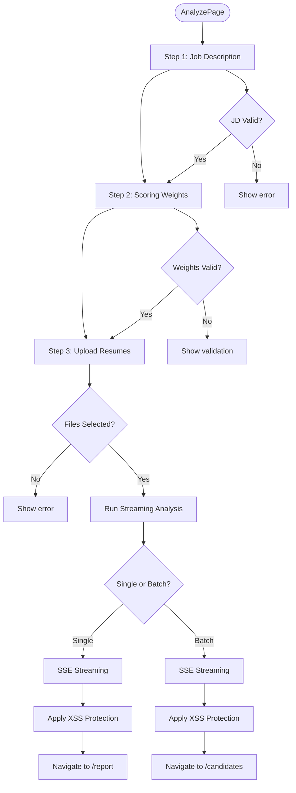

**Diagram sources**
- [AnalyzePage.jsx:1-904](file://app/frontend/src/pages/AnalyzePage.jsx#L1-L904)

**Section sources**
- [AnalyzePage.jsx:1-904](file://app/frontend/src/pages/AnalyzePage.jsx#L1-L904)

### Enhanced Batch Processing with Streaming
BatchPage integrates chunked upload capabilities and real-time streaming:
- Drag-and-drop multi-file upload with progress tracking
- Cloudflare proxy bypass through chunked upload approach
- Real-time overall progress with individual file status
- Template library integration for job descriptions
- Export functionality for CSV and Excel formats
- Selection-based export with checkbox controls
- Usage limit enforcement with visual warnings
- **NEW**: Streaming analysis with ranked shortlist table and live updates
- **NEW**: Real-time progress indicators for upload and analysis phases
- **NEW**: XSS protection through safeStr sanitization for all dynamic content

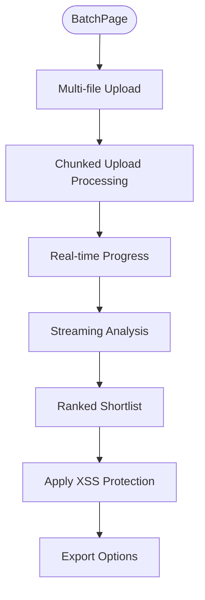

**Diagram sources**
- [BatchPage.jsx:1-617](file://app/frontend/src/pages/BatchPage.jsx#L1-L617)

**Section sources**
- [BatchPage.jsx:1-617](file://app/frontend/src/pages/BatchPage.jsx#L1-L617)

### Streaming Analysis Architecture
The streaming analysis system provides real-time updates for both single and batch workflows:
- **analyzeResumeStream**: Single file analysis with progressive stage updates
- **analyzeBatchStream**: Batch analysis with real-time result streaming and ranking
- **SSE Protocol**: Server-Sent Events for continuous data flow
- **Progressive Updates**: Live ranking during batch processing
- **Error Recovery**: Graceful handling of upload and analysis failures
- **Callback System**: Modular event handling for different stages
- **NEW**: XSS protection through safeStr sanitization for all streamed content

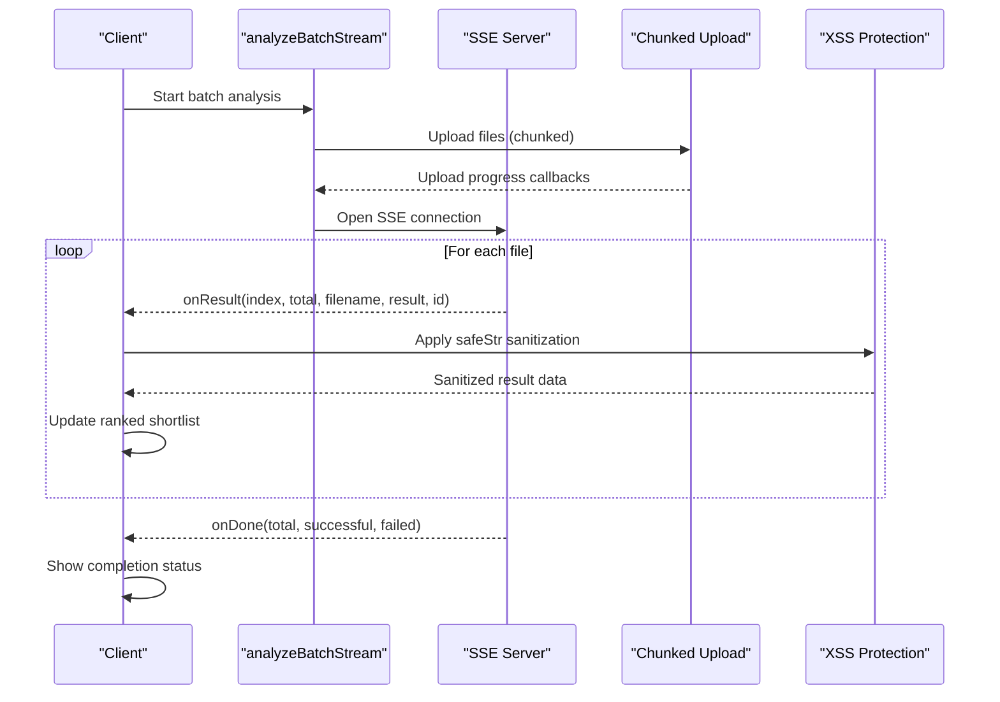

**Diagram sources**
- [api.js:413-515](file://app/frontend/src/lib/api.js#L413-L515)
- [BatchPage.jsx:131-177](file://app/frontend/src/pages/BatchPage.jsx#L131-L177)
- [AnalyzePage.jsx:303-331](file://app/frontend/src/pages/AnalyzePage.jsx#L303-L331)

**Section sources**
- [api.js:200-515](file://app/frontend/src/lib/api.js#L200-L515)
- [BatchPage.jsx:131-177](file://app/frontend/src/pages/BatchPage.jsx#L131-L177)
- [AnalyzePage.jsx:303-331](file://app/frontend/src/pages/AnalyzePage.jsx#L303-L331)

### Ranked Shortlist Table
The ranked shortlist table provides real-time candidate ranking during batch processing:
- **Live Sorting**: Automatic sorting by fit score during analysis
- **Progressive Updates**: Results appear as they become available
- **Visual Ranking**: Trophy icons for top-ranked candidates
- **Status Indicators**: Color-coded recommendation badges
- **Selection Controls**: Checkbox selection for export operations
- **Action Buttons**: Direct navigation to detailed reports
- **NEW**: XSS protection through safeStr sanitization for all dynamic content

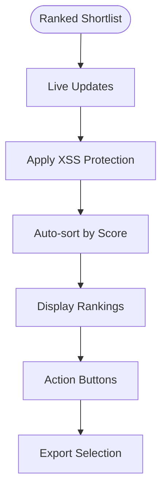

**Diagram sources**
- [BatchPage.jsx:511-575](file://app/frontend/src/pages/BatchPage.jsx#L511-L575)
- [AnalyzePage.jsx:812-863](file://app/frontend/src/pages/AnalyzePage.jsx#L812-L863)

**Section sources**
- [BatchPage.jsx:511-575](file://app/frontend/src/pages/BatchPage.jsx#L511-L575)
- [AnalyzePage.jsx:812-863](file://app/frontend/src/pages/AnalyzePage.jsx#L812-L863)

### Enhanced Chunked Upload System
uploadChunked.js provides robust large file upload handling:
- 10MB chunk size optimized for Cloudflare 100MB limit compliance
- Parallel chunk upload with concurrency control (3 concurrent uploads)
- Exponential backoff retry logic (3 retries with 1s, 2s, 4s delays)
- MD5 hash calculation for file integrity verification
- Real-time progress tracking with bytes uploaded, speed, and ETA
- Individual file and overall progress callbacks
- Server-side chunk assembly and cleanup functionality
- Abort functionality with server-side cancellation

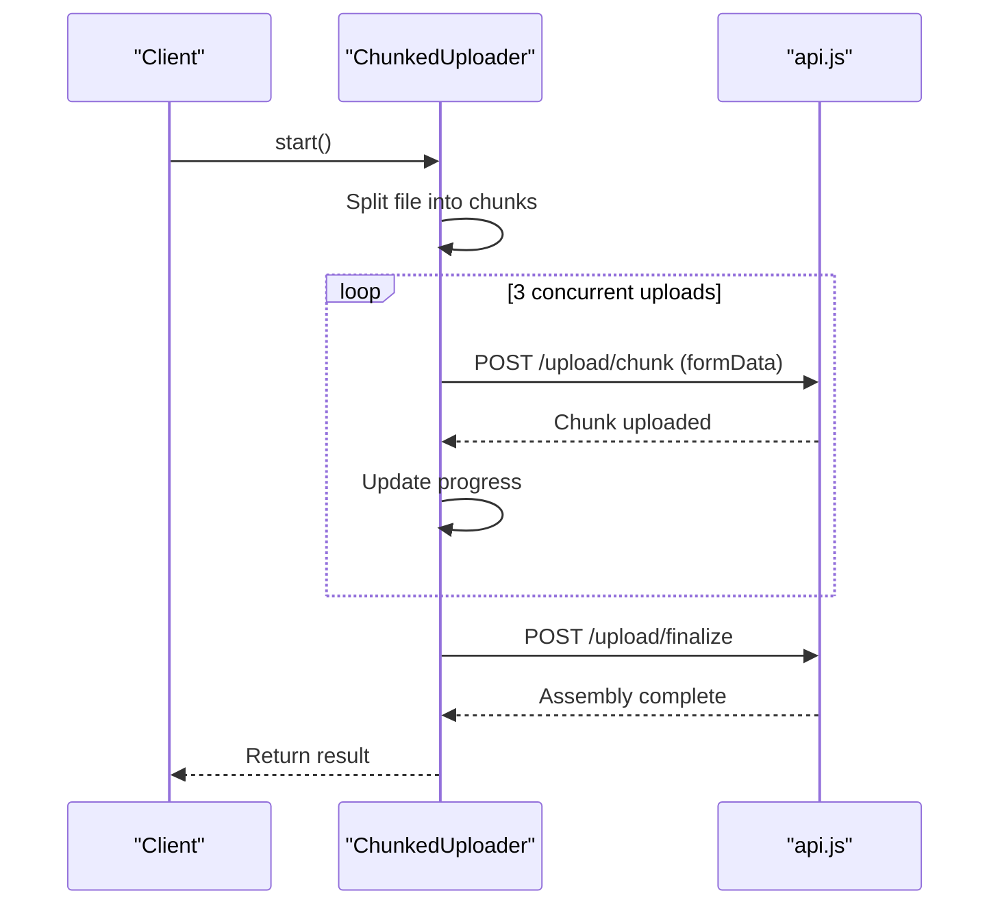

**Diagram sources**
- [uploadChunked.js:1-326](file://app/frontend/src/lib/uploadChunked.js#L1-L326)

**Section sources**
- [uploadChunked.js:1-326](file://app/frontend/src/lib/uploadChunked.js#L1-L326)

### Enhanced Streaming UI Components
The streaming analysis introduces several new UI components:
- **Progress Banners**: Real-time upload and analysis progress indicators
- **Live Tables**: Ranked shortlist with automatic updates
- **Status Badges**: Color-coded status indicators for candidates
- **Error Handling**: Graceful display of failed uploads and analysis errors
- **Loading States**: Animated progress indicators during streaming operations
- **Completion Feedback**: Clear indication when analysis is complete
- **NEW**: XSS protection through safeStr sanitization for all dynamic content

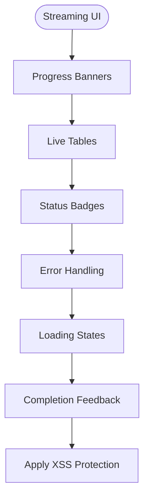

**Diagram sources**
- [BatchPage.jsx:454-476](file://app/frontend/src/pages/BatchPage.jsx#L454-L476)
- [AnalyzePage.jsx:774-799](file://app/frontend/src/pages/AnalyzePage.jsx#L774-L799)

**Section sources**
- [BatchPage.jsx:454-476](file://app/frontend/src/pages/BatchPage.jsx#L454-L476)
- [AnalyzePage.jsx:774-799](file://app/frontend/src/pages/AnalyzePage.jsx#L774-L799)

### ErrorBoundary Implementation
The ErrorBoundary component provides comprehensive error handling for the entire application:
- Catches JavaScript errors anywhere in the child component tree
- Displays user-friendly error messages with actionable retry options
- Implements exponential backoff retry mechanism
- Maintains application state during error conditions
- Provides both manual retry and automatic refresh options


**Diagram sources**
- [ErrorBoundary.jsx:1-54](file://app/frontend/src/components/ErrorBoundary.jsx#L1-L54)

**Section sources**
- [ErrorBoundary.jsx:1-54](file://app/frontend/src/components/ErrorBoundary.jsx#L1-L54)

### Authentication and Routing
- AuthContext manages user, tenant, and loading state. It loads persisted tokens via httpOnly cookies, logs in/out, and exposes helpers to child components.
- ProtectedRoute enforces authentication for protected shells and shows a loader while resolving session state.
- App.jsx defines lazy routes for all pages including the new DashboardNew and AnalyzePage, wrapping them in ErrorBoundary, ProtectedRoute, and SubscriptionProvider, then AppShell.

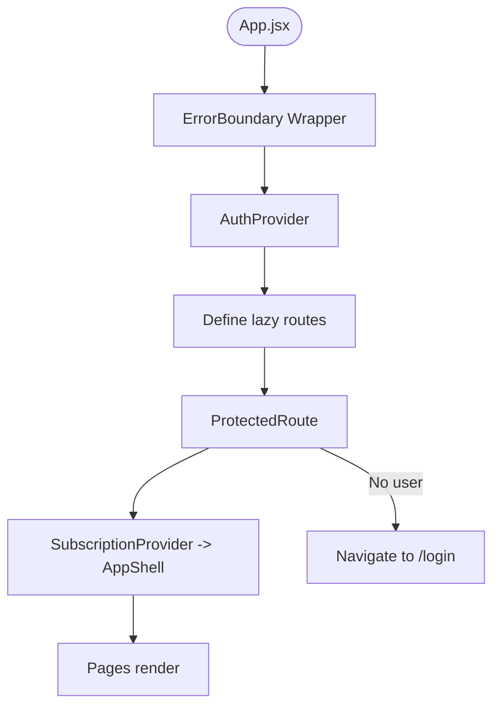

**Diagram sources**
- [App.jsx:1-87](file://app/frontend/src/App.jsx#L1-L87)
- [ProtectedRoute.jsx:1-24](file://app/frontend/src/components/ProtectedRoute.jsx#L1-L24)
- [AuthContext.jsx:1-71](file://app/frontend/src/contexts/AuthContext.jsx#L1-L71)

**Section sources**
- [AuthContext.jsx:1-71](file://app/frontend/src/contexts/AuthContext.jsx#L1-L71)
- [ProtectedRoute.jsx:1-24](file://app/frontend/src/components/ProtectedRoute.jsx#L1-L24)
- [App.jsx:1-87](file://app/frontend/src/App.jsx#L1-L87)

### Enhanced API Integration Layer
- api.js creates an Axios instance with base URL from environment.
- Request interceptor attaches CSRF token for non-GET requests and handles httpOnly cookies automatically.
- Response interceptor handles 401 by refreshing token via refresh endpoint and retrying the original request.
- **NEW**: Enhanced retry interceptor with exponential backoff for 5xx errors and network failures.
- **NEW**: Idempotency checking to prevent retrying non-idempotent POST requests.
- **NEW**: Configurable retry limits (MAX_RETRIES = 3) with delays [1s, 2s, 4s].
- **NEW**: Streaming analysis endpoints (analyze/stream, analyze/batch-stream) with SSE support.
- **NEW**: Chunked upload endpoints (/upload/chunk, /upload/finalize, /upload/cancel) integrated.
- **NEW**: Real-time progress callbacks for upload and analysis operations.
- Exposes domain-specific functions for analysis, batch, history, comparison, exports, templates, candidates, email generation, JD URL extraction, team actions, training, video, transcript, health, and subscription management.

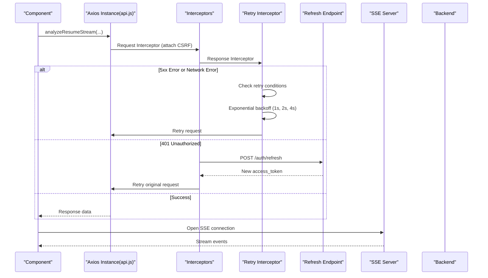

**Diagram sources**
- [api.js:64-90](file://app/frontend/src/lib/api.js#L64-L90)

**Section sources**
- [api.js:1-824](file://app/frontend/src/lib/api.js#L1-L824)

### UploadForm
- Supports three job description modes: text, file, URL.
- Drag-and-drop for resume and JD via react-dropzone with accept rules and size limits.
- Scoring weights presets and custom sliders.
- Saved JD templates picker with save-to-library flow.
- Submission guarded by validation and loading state.
- **Enhanced**: Improved error handling with user-friendly error messages and retry capabilities.
- **Enhanced**: Streaming analysis integration with real-time progress updates.
- **NEW**: XSS protection through safeStr sanitization for all dynamic content.


**Diagram sources**
- [UploadForm.jsx:1-484](file://app/frontend/src/components/UploadForm.jsx#L1-L484)
- [api.js:209-318](file://app/frontend/src/lib/api.js#L209-L318)

**Section sources**
- [UploadForm.jsx:1-484](file://app/frontend/src/components/UploadForm.jsx#L1-L484)

### ResultCard
- Renders recommendation badge, analysis source indicator, pending banner, score breakdown bars, matched/missing skills, adjacent skills, skills radar, strengths/weaknesses/risk signals, explainability, education analysis, domain fit/architecture, and interview kit tabs.
- Email modal integrates with backend email generation.
- **NEW**: Comprehensive XSS protection through safeStr utility function for all dynamic content rendering.

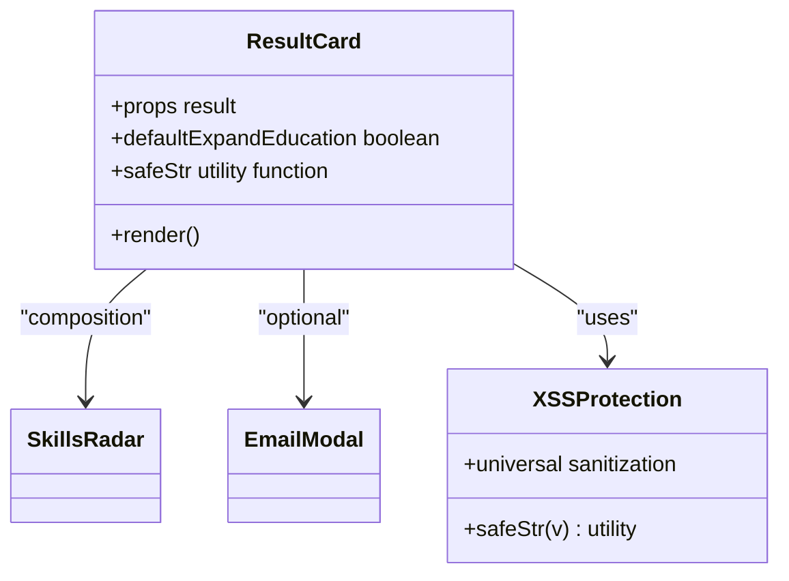

**Diagram sources**
- [ResultCard.jsx:1-844](file://app/frontend/src/components/ResultCard.jsx#L1-L844)
- [SkillsRadar.jsx](file://app/frontend/src/components/SkillsRadar.jsx)

**Section sources**
- [ResultCard.jsx:1-844](file://app/frontend/src/components/ResultCard.jsx#L1-L844)

### ScoreGauge
- Visualizes fit score with thresholds and pending state. Uses SVG arcs and transitions.


**Diagram sources**
- [ScoreGauge.jsx:1-97](file://app/frontend/src/components/ScoreGauge.jsx#L1-L97)

**Section sources**
- [ScoreGauge.jsx:1-97](file://app/frontend/src/components/ScoreGauge.jsx#L1-L97)

### Timeline
- Sorts and renders work experience with optional employment gaps and severity badges.


**Diagram sources**
- [Timeline.jsx:1-115](file://app/frontend/src/components/Timeline.jsx#L1-L115)

**Section sources**
- [Timeline.jsx:1-115](file://app/frontend/src/components/Timeline.jsx#L1-L115)

### Dashboard
- Orchestrates agent pipeline progress visualization during streaming analysis.
- Integrates usage widget via useSubscription and navigates to ReportPage upon completion.
- **Enhanced**: Improved error handling with graceful degradation and user feedback.

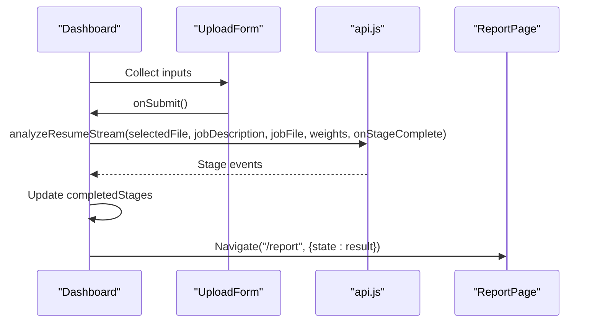

**Diagram sources**
- [Dashboard.jsx:1-330](file://app/frontend/src/pages/Dashboard.jsx#L1-L330)
- [api.js:209-318](file://app/frontend/src/lib/api.js#L209-L318)

**Section sources**
- [Dashboard.jsx:1-330](file://app/frontend/src/pages/Dashboard.jsx#L1-L330)

### CandidatesPage
- Lists candidates with search, pagination, and detail modal showing history and quick navigation to reports.
- **Enhanced**: Real-time updates for streaming analysis results.
- **NEW**: XSS protection through safeStr sanitization for all dynamic content.


**Diagram sources**
- [CandidatesPage.jsx:1-204](file://app/frontend/src/pages/CandidatesPage.jsx#L1-L204)
- [api.js:579-582](file://app/frontend/src/lib/api.js#L579-L582)

**Section sources**
- [CandidatesPage.jsx:1-204](file://app/frontend/src/pages/CandidatesPage.jsx#L1-L204)

### ReportPage
- Presents a single result with sidebar actions (share, download PDF), inline candidate name editor, label training buttons, and full ResultCard plus Timeline.

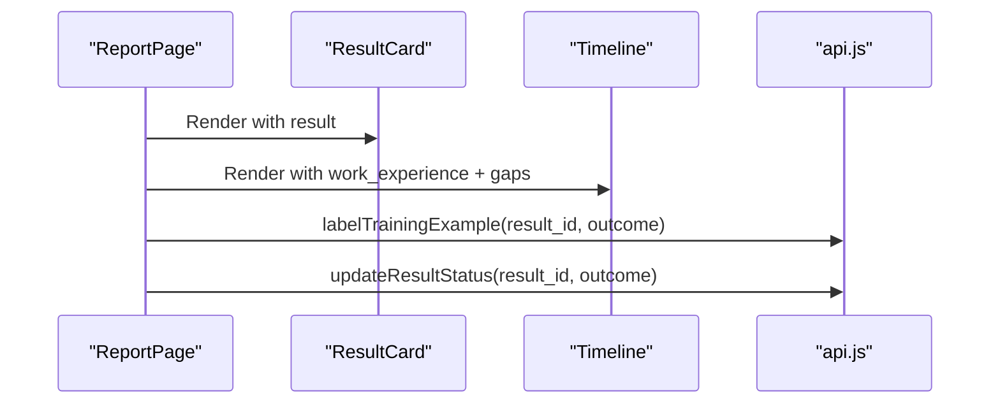

**Diagram sources**
- [ReportPage.jsx:1-297](file://app/frontend/src/pages/ReportPage.jsx#L1-L297)
- [ResultCard.jsx:1-844](file://app/frontend/src/components/ResultCard.jsx#L1-L844)
- [Timeline.jsx:1-115](file://app/frontend/src/components/Timeline.jsx#L1-L115)
- [api.js:625-628](file://app/frontend/src/lib/api.js#L625-L628)

**Section sources**
- [ReportPage.jsx:1-297](file://app/frontend/src/pages/ReportPage.jsx#L1-L297)

### Subscription Management Hooks
- useSubscription provides cached subscription data, available plans, usage stats, feature checks, and optimistic refresh after analysis.
- useUsageCheck performs preflight checks against remaining analyses and server-side limits.
- **Enhanced**: Improved error handling with graceful degradation and user feedback.


**Diagram sources**
- [useSubscription.jsx:1-186](file://app/frontend/src/hooks/useSubscription.jsx#L1-L186)

**Section sources**
- [useSubscription.jsx:1-186](file://app/frontend/src/hooks/useSubscription.jsx#L1-L186)

## XSS Protection Architecture

### Universal String Sanitization Pattern
The frontend implements comprehensive XSS protection through a universal safeStr utility function pattern that sanitizes all dynamic content before rendering:

#### SafeStr Utility Function Implementation
The safeStr function provides universal string sanitization across all components:

```javascript
/** Coerce any value to a render-safe string. Objects become JSON; null/undefined → '' */
function safeStr(v) {
  if (v == null) return ''
  if (typeof v === 'string') return v
  if (typeof v === 'number' || typeof v === 'boolean') return String(v)
  try { return JSON.stringify(v) } catch { return String(v) }
}
```

#### XSS Protection Coverage
All core components implement comprehensive XSS protection:

**ResultCard.jsx**: Implements safeStr for all dynamic content including:
- Final recommendations and risk levels
- Fit summaries and recommendation rationale
- Skill lists and depth indicators
- Risk flags and severity indicators
- Explainability rationales
- Education timeline analysis
- Interview questions and answers

**ComparisonView.jsx**: Implements safeStr for version comparison data:
- Final recommendations for both versions
- Weight reasoning explanations
- Role category badges
- Version metadata and timestamps

**UploadForm.jsx**: Implements safeStr for form validation and error messages:
- Dynamic error messages and validation feedback
- File upload progress indicators
- Template library descriptions

**VersionHistory.jsx**: Implements safeStr for version comparison:
- Recommendation badges and status indicators
- Weight reasoning explanations
- Role category displays

#### Defensive Programming Approaches
The XSS protection architecture follows defensive programming principles:

1. **Input Validation**: All user inputs and API responses are processed through safeStr
2. **Output Encoding**: Dynamic content is encoded before DOM insertion
3. **Type Coercion**: Non-string values are safely converted to strings
4. **JSON Fallback**: Complex objects are serialized safely
5. **Graceful Degradation**: Invalid values fall back to empty strings

#### Security Benefits
- **Prevents XSS Attacks**: Eliminates script injection vulnerabilities
- **Consistent Protection**: Universal sanitization across all components
- **Performance Optimization**: Minimal overhead with efficient string conversion
- **Maintainability**: Centralized sanitization logic reduces code duplication
- **Future-Proof**: Easy to extend with additional sanitization rules

```mermaid
flowchart TD
Input["Dynamic Input Data"] --> SafeStr["safeStr Utility"]
SafeStr --> TypeCheck{"Type Check"}
TypeCheck --> |String| DirectReturn["Direct Return"]
TypeCheck --> |Number/Boolean| ToString["String Conversion"]
TypeCheck --> |Object| JSONStringify["JSON Serialization"]
TypeCheck --> |Null/Undefined| EmptyString["Empty String"]
JSONStringify --> TryCatch{"Try/Catch"}
TryCatch --> |Success| SafeReturn["Safe String"]
TryCatch --> |Error| Fallback["Fallback String"]
DirectReturn --> Sanitized["Sanitized Output"]
ToString --> Sanitized
SafeReturn --> Sanitized
Fallback --> Sanitized
EmptyString --> Sanitized
```

**Diagram sources**
- [ResultCard.jsx:13-19](file://app/frontend/src/components/ResultCard.jsx#L13-L19)
- [ComparisonView.jsx:3-9](file://app/frontend/src/components/ComparisonView.jsx#L3-L9)

**Section sources**
- [ResultCard.jsx:13-19](file://app/frontend/src/components/ResultCard.jsx#L13-L19)
- [ComparisonView.jsx:3-9](file://app/frontend/src/components/ComparisonView.jsx#L3-L9)
- [ResultCard.jsx:423](file://app/frontend/src/components/ResultCard.jsx#L423)
- [ComparisonView.jsx:114](file://app/frontend/src/components/ComparisonView.jsx#L114)

## Security Headers and CSP

### Content Security Policy (CSP) Implementation
The frontend implements comprehensive security headers to prevent XSS and other web vulnerabilities:

#### Nginx Security Headers Configuration
Production nginx configuration includes essential security headers:

- **X-Frame-Options**: "SAMEORIGIN" prevents clickjacking attacks
- **X-Content-Type-Options**: "nosniff" prevents MIME type sniffing
- **Strict-Transport-Security**: "max-age=31536000; includeSubDomains" enforces HTTPS
- **Referrer-Policy**: "strict-origin-when-cross-origin" controls referrer leakage
- **Content-Security-Policy**: Comprehensive policy for script, style, and resource loading

#### CSP Policy Details
The Content-Security-Policy provides layered protection:

- **Default-src 'self'**: Restricts all resources to same origin
- **Script-src 'self'**: Allows scripts only from same origin
- **Style-src 'self' 'unsafe-inline'**: Allows inline styles for TailwindCSS
- **Img-src 'self' data: blob:**: Allows images from same origin, data URLs, and blobs
- **Font-src 'self'**: Restricts fonts to same origin
- **Connect-src 'self'**: Restricts API calls to same origin
- **Frame-ancestors 'self'**: Prevents embedding in iframes

#### Security Header Benefits
- **XSS Prevention**: Blocks malicious script injection
- **Clickjacking Protection**: Prevents unauthorized framing
- **HTTPS Enforcement**: Ensures encrypted communication
- **MIME Sniffing Prevention**: Protects against content type manipulation
- **Resource Control**: Restricts loading of external resources

```mermaid
flowchart TD
Request["HTTP Request"] --> SecurityHeaders["Apply Security Headers"]
SecurityHeaders --> XFrameOptions["X-Frame-Options: SAMEORIGIN"]
SecurityHeaders --> XContentTypeOptions["X-Content-Type-Options: nosniff"]
SecurityHeaders --> HSTS["Strict-Transport-Security: 31536000"]
SecurityHeaders --> ReferrerPolicy["Referrer-Policy: strict-origin-when-cross-origin"]
SecurityHeaders --> CSP["Content-Security-Policy: default-src 'self'"]
CSP --> ScriptSrc["script-src 'self'"]
CSP --> StyleSrc["style-src 'self' 'unsafe-inline'"]
CSP --> ImgSrc["img-src 'self' data: blob:"]
CSP --> FontSrc["font-src 'self'"]
CSP --> ConnectSrc["connect-src 'self'"]
CSP --> FrameAncestors["frame-ancestors 'self'"]
XFrameOptions --> Response["Secure Response"]
XContentTypeOptions --> Response
HSTS --> Response
ReferrerPolicy --> Response
ScriptSrc --> Response
StyleSrc --> Response
ImgSrc --> Response
FontSrc --> Response
ConnectSrc --> Response
FrameAncestors --> Response
```

**Diagram sources**
- [nginx.prod.conf:41-45](file://app/nginx/nginx.prod.conf#L41-L45)

**Section sources**
- [nginx.prod.conf:41-45](file://app/nginx/nginx.prod.conf#L41-L45)
- [AUDIT.md:966-978](file://docs/AUDIT.md#L966-L978)

### DOMPurify Integration
The frontend includes DOMPurify as a security dependency for advanced content sanitization:

#### DOMPurify Configuration
DOMPurify provides HTML sanitization with configurable policies:
- **HTML Tag Stripping**: Removes potentially dangerous HTML tags
- **Attribute Filtering**: Sanitizes attributes that could enable XSS
- **Protocol Whitelisting**: Restricts dangerous protocols (javascript:, etc.)
- **Custom Policy Support**: Extensible for specific content types

#### Security Audit Findings
The security audit identified important CSP implementation gaps:
- **Missing HSTS Header**: No HTTPS enforcement in production config
- **Missing CSP Header**: XSS protection reduced in production
- **Missing X-Content-Type-Options**: MIME sniffing vulnerability present

**Section sources**
- [package.json:16-16](file://app/frontend/package.json#L16)
- [AUDIT.md:966-1003](file://docs/AUDIT.md#L966-L1003)

## Dependency Analysis
- React 18 with React DOM for rendering.
- React Router v7 for routing and lazy loading.
- Axios for HTTP with enhanced interceptors and retry mechanisms.
- lucide-react for icons.
- react-dropzone for drag-and-drop.
- recharts for optional visualizations.
- TailwindCSS for styling and responsive design.
- **NEW**: DOMPurify for advanced HTML sanitization.
- **NEW**: html2pdf.js for PDF generation with built-in sanitization.

```mermaid
graph LR
Pkg["package.json"] --> React["react@^18"]
Pkg --> Router["react-router-dom@^7"]
Pkg --> Axios["axios@^1.7"]
Pkg --> Icons["lucide-react@^0.469"]
Pkg --> Drop["react-dropzone@^14"]
Pkg --> Charts["recharts@^3"]
Pkg --> Tailwind["tailwindcss@^3"]
Pkg --> DOMPurify["dompurify@^3.4.0"]
Pkg --> HTML2PDF["html2pdf.js@^0.14.0"]
```

**Diagram sources**
- [package.json:1-42](file://app/frontend/package.json#L1-L42)

**Section sources**
- [package.json:1-42](file://app/frontend/package.json#L1-L42)

## Performance Considerations
- Lazy loading: Pages are lazy-imported to reduce initial bundle size.
- Suspense: Fallback spinner during page load.
- Optimistic updates: Subscription usage increments immediately, followed by server sync.
- Efficient rendering: Components use minimal state and avoid unnecessary re-renders; lists paginated.
- **NEW**: Streaming: SSE-based analysis updates UI progressively without polling.
- **NEW**: Chunked upload: Reduces memory usage and improves reliability for large files.
- **NEW**: Parallel processing: Concurrent chunk uploads maximize throughput while maintaining reliability.
- **NEW**: XSS protection: safeStr utility provides efficient string sanitization with minimal performance impact.
- **NEW**: Security headers: Nginx configuration provides optimal security with minimal performance overhead.
- Image/icon assets: lucide-react icons are tree-shaken; keep only used icons.
- **Enhanced**: Error boundaries prevent cascading failures and improve perceived performance.
- **Enhanced**: Retry mechanisms with exponential backoff reduce user frustration from transient failures.

## Testing Strategy
- Unit and integration tests use React Testing Library and Vitest.
- Tests cover components like UploadForm, ResultCard, ScoreGauge, and pages like VideoPage.
- Mock services and API endpoints are used to isolate component behavior.
- Setup includes DOM testing with jsdom and React Testing Library matchers.
- **Enhanced**: Error boundary testing with user interaction scenarios and retry logic validation.
- **Enhanced**: Chunked upload testing with simulated network failures and progress tracking.
- **Enhanced**: Analysis workflow testing with step-by-step validation and error scenarios.
- **NEW**: XSS protection testing with malicious input validation and sanitization verification.
- **NEW**: Security header testing with CSP policy validation and header compliance checks.
- **NEW**: DOMPurify integration testing with HTML sanitization scenarios.
- **NEW**: Streaming analysis testing with mock SSE events and real-time updates.
- **NEW**: Ranked shortlist testing with progressive data updates and sorting algorithms.

**Section sources**
- [UploadForm.test.jsx](file://app/frontend/src/__tests__/UploadForm.test.jsx)
- [ResultCard.test.jsx](file://app/frontend/src/__tests__/ResultCard.test.jsx)
- [ScoreGauge.test.jsx](file://app/frontend/src/__tests__/ScoreGauge.test.jsx)
- [VideoPage.test.jsx](file://app/frontend/src/__tests__/VideoPage.test.jsx)
- [api.test.js](file://app/frontend/src/__tests__/api.test.js)
- [setup.js](file://app/frontend/src/__tests__/setup.js)

## Extensibility Guidelines
- Add new pages under pages/ and register them in App.jsx with lazy import, ErrorBoundary wrapper, ProtectedRoute wrapper, and SubscriptionProvider.
- Create reusable components in components/ following existing patterns: props interface, controlled state, Tailwind classes, and accessibility attributes.
- Extend API client in lib/api.js with new endpoints and reuse enhanced interceptors for auth, refresh, and retry logic.
- Introduce new contexts or hooks under contexts/ or hooks/ respectively, and wrap providers at App.jsx level with ErrorBoundary.
- Keep styling consistent with existing Tailwind utilities and brand tokens; avoid ad-hoc CSS.
- For new features gated by plan, use useSubscription.isFeatureAvailable and guard UI accordingly.
- **Enhanced**: Implement ErrorBoundary for critical components that require graceful degradation.
- **Enhanced**: Use uploadChunked utility for any new file upload functionality requiring large file support.
- **NEW**: Implement safeStr utility for all new components that render dynamic content.
- **NEW**: Follow XSS protection patterns established in ResultCard and ComparisonView components.
- **NEW**: Ensure all user inputs and API responses are sanitized through safeStr function.
- **NEW**: Implement comprehensive security headers and CSP policies for production deployments.
- **NEW**: Test XSS protection thoroughly with malicious input scenarios and sanitization validation.
- **NEW**: Use DOMPurify for advanced HTML sanitization when needed for rich content rendering.
- **NEW**: Design components to handle progressive data updates and live sorting with XSS protection.
- **NEW**: Validate security headers compliance and CSP policy effectiveness in production environments.

## Accessibility and Responsive Design
- Accessible semantics: Buttons, inputs, and modals use appropriate roles and labels; focus management in dialogs.
- Keyboard navigation: Focus traps in modals, Enter/Escape handlers in editors.
- Responsive breakpoints: Use flex/grid utilities to adapt layouts across screen sizes; sidebar collapses on mobile.
- Color contrast: Maintain sufficient contrast for text and interactive elements; brand palette is used consistently.
- ARIA patterns: Dialogs and modals announce content; loading states expose spinners with accessible labels.
- **Enhanced**: Error messages provide clear guidance and actionable next steps for users.
- **Enhanced**: Progress indicators provide feedback for long-running operations like chunked uploads.
- **Enhanced**: Form validation provides immediate feedback with clear error messages.
- **NEW**: XSS protection maintains accessibility by preventing content injection that could disrupt screen readers.
- **NEW**: Security headers and CSP policies work seamlessly with assistive technologies.
- **NEW**: SafeStr utility preserves semantic meaning while preventing XSS vulnerabilities.
- **NEW**: DOMPurify integration ensures sanitized content remains accessible to assistive technologies.
- **NEW**: Streaming updates provide real-time feedback without disrupting user workflow.
- **NEW**: Live tables maintain accessibility standards during progressive data updates with proper ARIA attributes.

## Error Handling and Resilience

### Global Error Handling
The application implements comprehensive error handling at multiple levels:

#### Application-Level Error Boundary
- Wraps the entire application to prevent crashes and provide graceful degradation
- Displays user-friendly error messages with retry options
- Handles both JavaScript errors and component rendering failures
- Provides manual retry and automatic refresh capabilities

#### API-Level Error Handling
- **Enhanced Retry Logic**: Automatic retry for 5xx errors and network failures with exponential backoff
- **Idempotency Protection**: Prevents retrying non-idempotent POST requests
- **Configurable Limits**: Maximum 3 retry attempts with delays of 1s, 2s, and 4s
- **Smart Error Classification**: Differentiates between retryable and non-retryable errors

#### Component-Level Error Handling
- Individual components implement specific error handling patterns
- User feedback through error banners and notifications
- Graceful degradation when features fail
- Clear messaging about recovery options

#### Streaming Analysis Error Handling
- **Robust Retry Logic**: Automatic retry for failed chunks with exponential backoff
- **Progress Tracking**: Maintains upload progress despite individual chunk failures
- **Abort Support**: Allows users to cancel uploads with server-side cleanup
- **Integrity Verification**: MD5 hash calculation ensures file integrity
- **Error Recovery**: Graceful handling of upload and analysis failures
- **Live Updates**: Continues streaming even when individual files fail

#### XSS Protection Error Handling
- **Universal Sanitization**: All dynamic content passes through safeStr utility
- **Graceful Degradation**: Invalid values fall back to empty strings without crashing
- **Type Safety**: Prevents type-related XSS vulnerabilities through coercion
- **JSON Safety**: Complex objects are safely serialized before rendering
- **Performance Monitoring**: Minimal overhead from sanitization operations

```mermaid
flowchart TD
Error["Error Occurs"] --> Level{"Error Level"}
Level --> |JavaScript| AppBoundary["Application ErrorBoundary"]
Level --> |API| ApiRetry["API Retry Logic"]
Level --> |Component| ComponentError["Component Error State"]
Level --> |Upload| UploadError["Chunked Upload Error"]
Level --> |Streaming| StreamError["Streaming Analysis Error"]
Level --> |XSS| XSSProtection["XSS Protection"]
AppBoundary --> UserMsg["User-Friendly Message"]
UserMsg --> Retry["Retry Options"]
Retry --> Manual["Manual Retry"]
Retry --> Auto["Automatic Retry"]
ApiRetry --> Check{"Retry Conditions"}
Check --> |5xx Error| Backoff["Exponential Backoff"]
Check --> |Network Error| Backoff
Check --> |401| AuthRefresh["Authentication Refresh"]
Check --> |Other| FailFast["Fail Fast"]
Backoff --> Limit{"Retry Count < 3?"}
Limit --> |Yes| RetryRequest["Retry Request"]
Limit --> |No| Fail["Propagate Error"]
AuthRefresh --> RetryRequest
UploadError --> ChunkRetry["Retry Failed Chunks"]
UploadError --> Progress["Maintain Progress"]
UploadError --> Abort["Allow Abort"]
StreamError --> Recover["Recover from Failure"]
StreamError --> Continue["Continue Streaming"]
XSSProtection --> Sanitize["Apply safeStr Sanitization"]
XSSProtection --> SafeOutput["Safe Output Rendering"]
```

**Diagram sources**
- [ErrorBoundary.jsx:1-54](file://app/frontend/src/components/ErrorBoundary.jsx#L1-L54)
- [api.js:64-90](file://app/frontend/src/lib/api.js#L64-L90)
- [uploadChunked.js:130-165](file://app/frontend/src/lib/uploadChunked.js#L130-L165)
- [api.js:413-515](file://app/frontend/src/lib/api.js#L413-L515)
- [ResultCard.jsx:13-19](file://app/frontend/src/components/ResultCard.jsx#L13-L19)

**Section sources**
- [ErrorBoundary.jsx:1-54](file://app/frontend/src/components/ErrorBoundary.jsx#L1-L54)
- [api.js:64-90](file://app/frontend/src/lib/api.js#L64-L90)
- [uploadChunked.js:1-326](file://app/frontend/src/lib/uploadChunked.js#L1-L326)
- [api.js:413-515](file://app/frontend/src/lib/api.js#L413-L515)
- [ResultCard.jsx:13-19](file://app/frontend/src/components/ResultCard.jsx#L13-L19)

## Troubleshooting Guide
- Authentication issues: Verify tokens in localStorage; AuthContext clears tokens on 401; check interceptor retry flow.
- Streaming errors: analyzeResumeStream throws on invalid responses; ensure backend SSE endpoint availability.
- Usage limits: useUsageCheck returns remaining analyses and server-side checks; handle allowed=false gracefully.
- Network failures: Axios interceptors surface errors; confirm API_URL environment variable and CORS on backend.
- **Enhanced**: Error boundary failures: Check console for ErrorBoundary caught errors; verify retry logic and user feedback.
- **Enhanced**: API retry failures: Monitor retry counts and backoff delays; ensure idempotency for retryable requests.
- **Enhanced**: Global error handling: Check window.onerror and unhandledrejection handlers for uncaught exceptions.
- **Enhanced**: Chunked upload failures: Monitor upload progress and retry logic; verify server-side chunk assembly.
- **Enhanced**: Analysis workflow issues: Check step validation and error messages in AnalyzePage.
- **Enhanced**: Weight validation errors: Verify UniversalWeightsPanel total equals 100% (excluding risk penalty).
- **NEW**: XSS protection failures: Verify safeStr utility is applied to all dynamic content; check for bypass attempts.
- **NEW**: Security header issues: Validate CSP policy compliance; ensure nginx security headers are properly configured.
- **NEW**: DOMPurify integration problems: Check HTML sanitization for rich content; verify policy configuration.
- **NEW**: Streaming analysis failures: Check SSE connection status and event parsing in analyzeBatchStream.
- **NEW**: Ranked shortlist issues: Verify sorting algorithm and real-time update callbacks.
- **NEW**: Progress indicator problems: Check upload progress callbacks and overall progress calculations.
- **NEW**: Malicious input detection: Test XSS protection with various attack vectors and sanitization scenarios.

**Section sources**
- [AuthContext.jsx:1-71](file://app/frontend/src/contexts/AuthContext.jsx#L1-L71)
- [api.js:64-90](file://app/frontend/src/lib/api.js#L64-L90)
- [Dashboard.jsx:267-275](file://app/frontend/src/pages/Dashboard.jsx#L267-L275)
- [useSubscription.jsx:164-182](file://app/frontend/src/hooks/useSubscription.jsx#L164-L182)
- [ErrorBoundary.jsx:13-15](file://app/frontend/src/components/ErrorBoundary.jsx#L13-L15)
- [main.jsx:7-14](file://app/frontend/src/main.jsx#L7-L14)
- [uploadChunked.js:130-165](file://app/frontend/src/lib/uploadChunked.js#L130-L165)
- [AnalyzePage.jsx:226-298](file://app/frontend/src/pages/AnalyzePage.jsx#L226-L298)
- [UniversalWeightsPanel.jsx:158](file://app/frontend/src/components/UniversalWeightsPanel.jsx#L158)
- [api.js:413-515](file://app/frontend/src/lib/api.js#L413-L515)
- [ResultCard.jsx:13-19](file://app/frontend/src/components/ResultCard.jsx#L13-L19)
- [ComparisonView.jsx:3-9](file://app/frontend/src/components/ComparisonView.jsx#L3-L9)

## Conclusion
The Resume AI frontend is a modular, scalable React 18 application with clear separation between routing, state, UI components, and API integration. It leverages modern tooling, robust authentication and subscription management, comprehensive error handling through ErrorBoundary components, and enhanced API retry mechanisms with exponential backoff. The architecture now provides graceful degradation, improved resilience against transient failures, and a cohesive design system to deliver a responsive, accessible, and performant user experience even under adverse conditions.

The major enhancements include comprehensive streaming analysis capabilities with real-time updates, ranked shortlist tables with live sorting, enhanced progress indicators for upload and analysis phases, chunked upload system for large file support, and redesigned analysis workflow with 3-step process. These improvements represent significant advances in user experience and system reliability, providing users with immediate feedback and transparent progress tracking throughout the analysis process.

**NEW**: The addition of comprehensive XSS protection architecture through the safeStr utility function provides universal string sanitization across all components, preventing XSS vulnerabilities through defensive programming approaches. Combined with security headers, CSP policies, and DOMPurify integration, the frontend now offers enterprise-grade security while maintaining excellent performance and user experience.