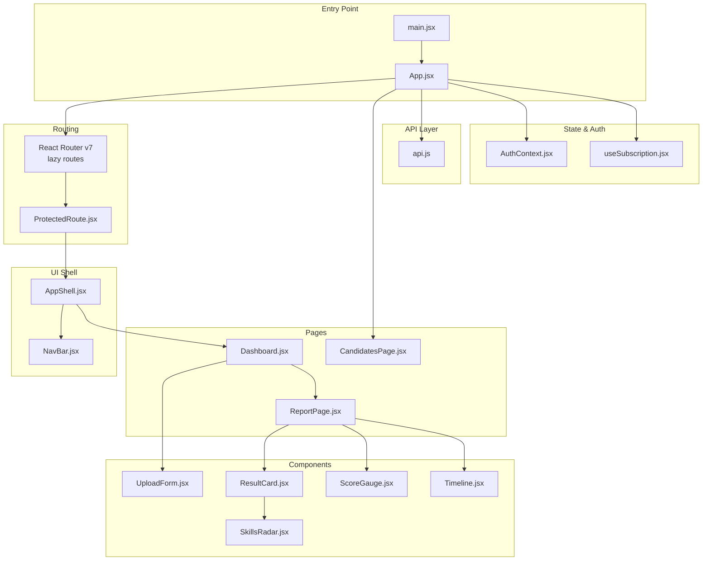
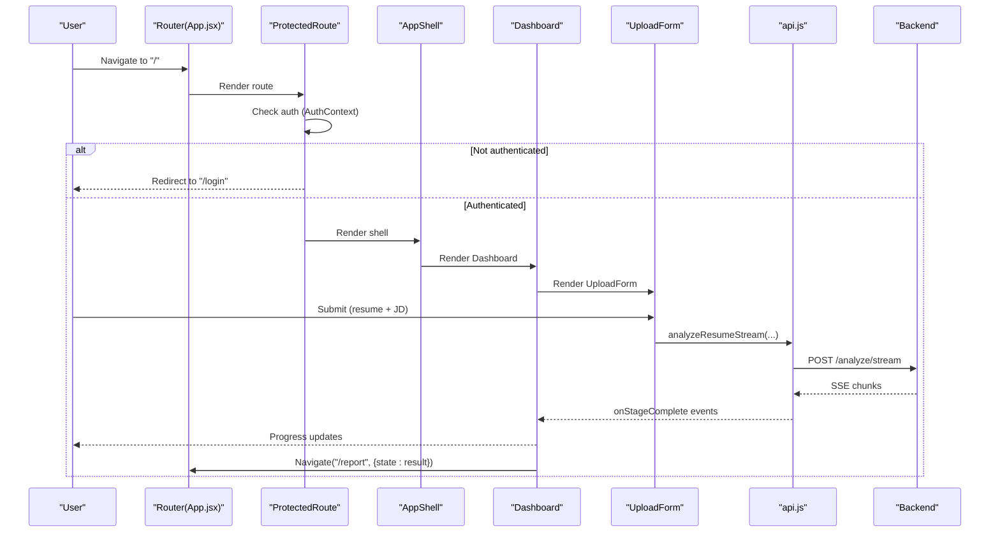
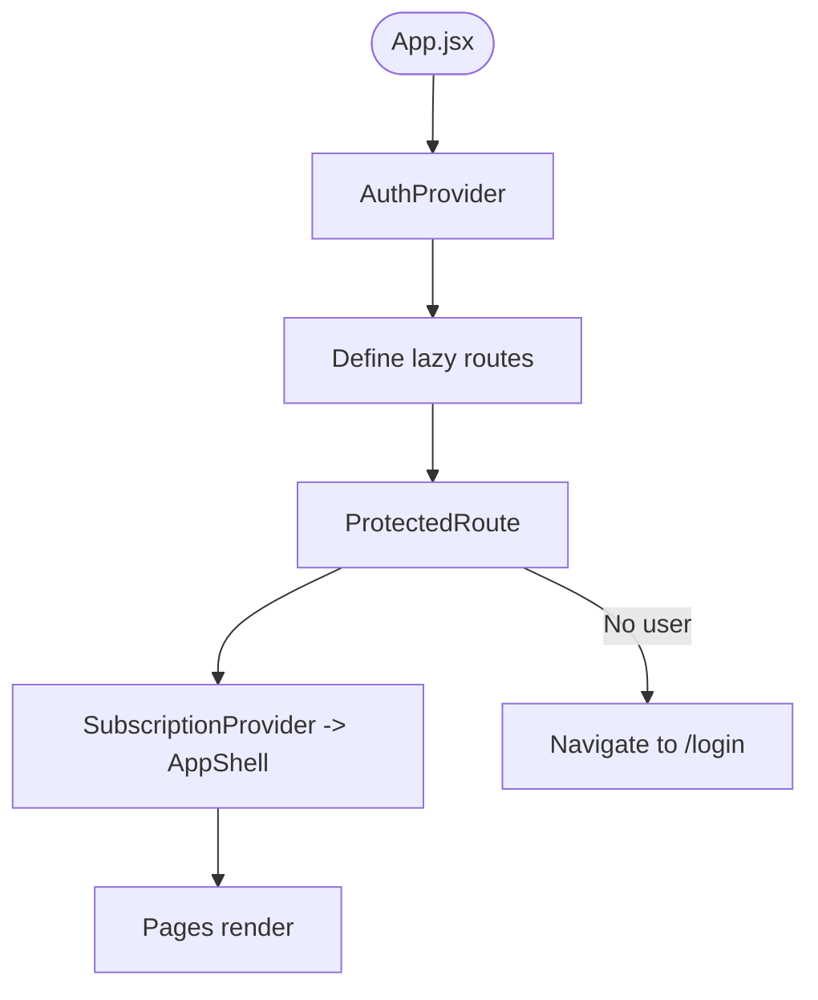
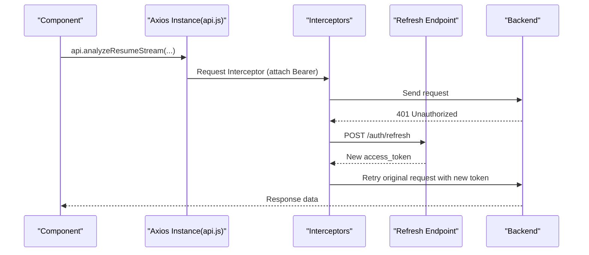
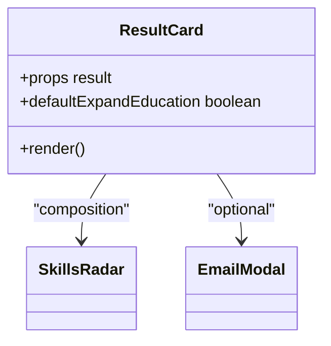
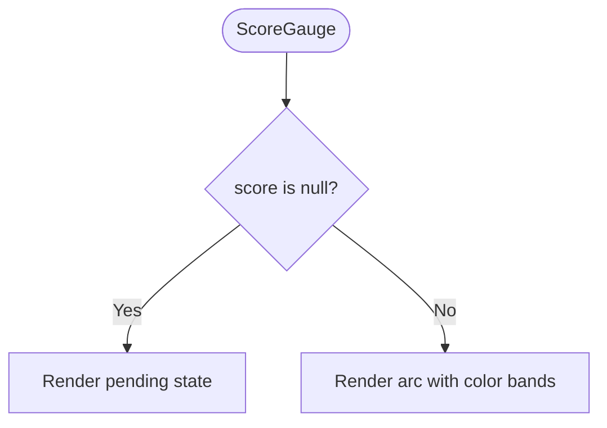
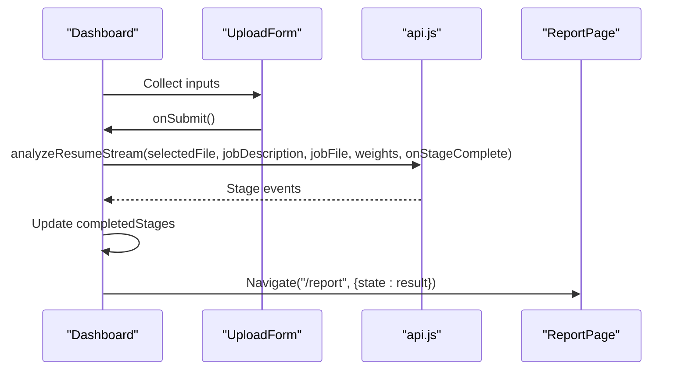
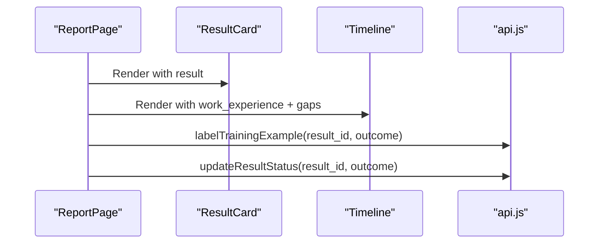
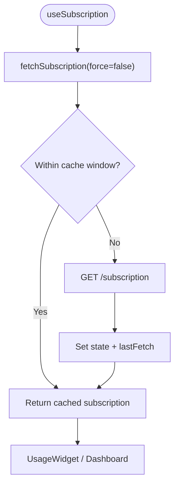
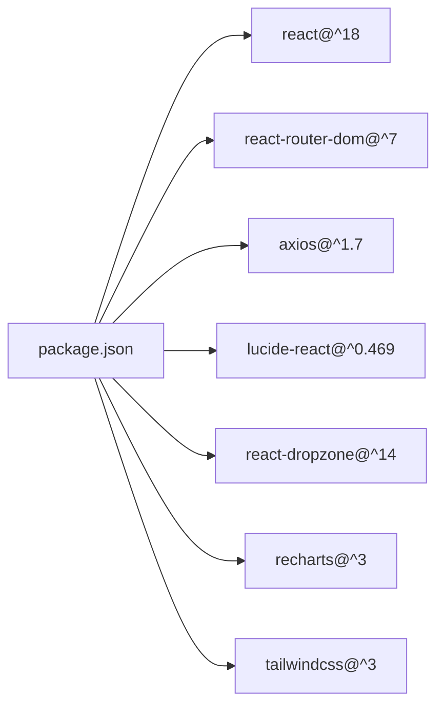

# Frontend Architecture

<cite>
**Referenced Files in This Document**
- [main.jsx](file://app/frontend/src/main.jsx)
- [App.jsx](file://app/frontend/src/App.jsx)
- [AppShell.jsx](file://app/frontend/src/components/AppShell.jsx)
- [NavBar.jsx](file://app/frontend/src/components/NavBar.jsx)
- [ProtectedRoute.jsx](file://app/frontend/src/components/ProtectedRoute.jsx)
- [AuthContext.jsx](file://app/frontend/src/contexts/AuthContext.jsx)
- [api.js](file://app/frontend/src/lib/api.js)
- [UploadForm.jsx](file://app/frontend/src/components/UploadForm.jsx)
- [ResultCard.jsx](file://app/frontend/src/components/ResultCard.jsx)
- [ScoreGauge.jsx](file://app/frontend/src/components/ScoreGauge.jsx)
- [Timeline.jsx](file://app/frontend/src/components/Timeline.jsx)
- [SkillsRadar.jsx](file://app/frontend/src/components/SkillsRadar.jsx)
- [Dashboard.jsx](file://app/frontend/src/pages/Dashboard.jsx)
- [CandidatesPage.jsx](file://app/frontend/src/pages/CandidatesPage.jsx)
- [ReportPage.jsx](file://app/frontend/src/pages/ReportPage.jsx)
- [useSubscription.jsx](file://app/frontend/src/hooks/useSubscription.jsx)
- [package.json](file://app/frontend/package.json)
</cite>

## Table of Contents
1. [Introduction](#introduction)
2. [Project Structure](#project-structure)
3. [Core Components](#core-components)
4. [Architecture Overview](#architecture-overview)
5. [Detailed Component Analysis](#detailed-component-analysis)
6. [Dependency Analysis](#dependency-analysis)
7. [Performance Considerations](#performance-considerations)
8. [Testing Strategy](#testing-strategy)
9. [Extensibility Guidelines](#extensibility-guidelines)
10. [Accessibility and Responsive Design](#accessibility-and-responsive-design)
11. [Troubleshooting Guide](#troubleshooting-guide)
12. [Conclusion](#conclusion)

## Introduction
This document describes the frontend architecture for Resume AI by ThetaLogics. It covers the React 18 component model, routing, state management, component library, styling and responsiveness, API integration, authentication and subscription management, testing strategy, and extension guidelines. The system emphasizes a clean separation of concerns, composable UI components, and robust integration with backend services via Axios interceptors and dedicated hooks.

## Project Structure
The frontend is organized around a classic React 18 + Vite setup with modular components, pages, contexts, hooks, and a centralized API client. Routing is handled by React Router v7 with lazy-loaded pages and protected routes. Styling leverages TailwindCSS with a consistent design system and brand palette.

**Diagram sources**
- [main.jsx:1-14](file://app/frontend/src/main.jsx#L1-L14)
- [App.jsx:1-64](file://app/frontend/src/App.jsx#L1-L64)
- [ProtectedRoute.jsx:1-24](file://app/frontend/src/components/ProtectedRoute.jsx#L1-L24)
- [AppShell.jsx:1-13](file://app/frontend/src/components/AppShell.jsx#L1-L13)
- [NavBar.jsx](file://app/frontend/src/components/NavBar.jsx)
- [Dashboard.jsx:1-330](file://app/frontend/src/pages/Dashboard.jsx#L1-L330)
- [ReportPage.jsx:1-297](file://app/frontend/src/pages/ReportPage.jsx#L1-L297)
- [CandidatesPage.jsx:1-204](file://app/frontend/src/pages/CandidatesPage.jsx#L1-L204)
- [UploadForm.jsx:1-484](file://app/frontend/src/components/UploadForm.jsx#L1-L484)
- [ResultCard.jsx:1-627](file://app/frontend/src/components/ResultCard.jsx#L1-L627)
- [ScoreGauge.jsx:1-97](file://app/frontend/src/components/ScoreGauge.jsx#L1-L97)
- [Timeline.jsx:1-115](file://app/frontend/src/components/Timeline.jsx#L1-L115)
- [SkillsRadar.jsx](file://app/frontend/src/components/SkillsRadar.jsx)
- [AuthContext.jsx:1-70](file://app/frontend/src/contexts/AuthContext.jsx#L1-L70)
- [useSubscription.jsx:1-186](file://app/frontend/src/hooks/useSubscription.jsx#L1-L186)
- [api.js:1-395](file://app/frontend/src/lib/api.js#L1-L395)

**Section sources**
- [main.jsx:1-14](file://app/frontend/src/main.jsx#L1-L14)
- [App.jsx:1-64](file://app/frontend/src/App.jsx#L1-L64)
- [package.json:1-41](file://app/frontend/package.json#L1-L41)

## Core Components
- AppShell: Provides a consistent layout with navigation and scrollable content area.
- ProtectedRoute: Guards routes requiring authentication.
- UploadForm: Multi-mode job description input (text, file, URL), scoring weights, and resume upload with drag-and-drop.
- ResultCard: Comprehensive analysis results with collapsible sections, explainability, skills radar, interview kit, and email generation.
- ScoreGauge: Visual fit score with thresholds and pending state.
- Timeline: Employment history visualization with gaps and severity indicators.
- Dashboard: Real-time agent pipeline progress, usage widget, and submission flow.
- CandidatesPage: List and search candidates with pagination and detail modal.
- ReportPage: Single-result presentation with sharing, printing, labeling, and inline editing.
- AuthContext: JWT lifecycle, login/register/logout, and tenant/user state.
- useSubscription: Subscription and usage checks, optimistic updates, and plan features.

**Section sources**
- [AppShell.jsx:1-13](file://app/frontend/src/components/AppShell.jsx#L1-L13)
- [ProtectedRoute.jsx:1-24](file://app/frontend/src/components/ProtectedRoute.jsx#L1-L24)
- [UploadForm.jsx:1-484](file://app/frontend/src/components/UploadForm.jsx#L1-L484)
- [ResultCard.jsx:1-627](file://app/frontend/src/components/ResultCard.jsx#L1-L627)
- [ScoreGauge.jsx:1-97](file://app/frontend/src/components/ScoreGauge.jsx#L1-L97)
- [Timeline.jsx:1-115](file://app/frontend/src/components/Timeline.jsx#L1-L115)
- [Dashboard.jsx:1-330](file://app/frontend/src/pages/Dashboard.jsx#L1-L330)
- [CandidatesPage.jsx:1-204](file://app/frontend/src/pages/CandidatesPage.jsx#L1-L204)
- [ReportPage.jsx:1-297](file://app/frontend/src/pages/ReportPage.jsx#L1-L297)
- [AuthContext.jsx:1-70](file://app/frontend/src/contexts/AuthContext.jsx#L1-L70)
- [useSubscription.jsx:1-186](file://app/frontend/src/hooks/useSubscription.jsx#L1-L186)

## Architecture Overview
The frontend follows a layered architecture:
- Entry point initializes React 18 StrictMode, Router, and global styles.
- App wraps routes with AuthProvider, sets up lazy routes, and renders shell wrappers.
- AppShell hosts NavBar and page content.
- Pages orchestrate UI components and API interactions.
- API client centralizes HTTP requests, JWT injection, and automatic refresh.
- Contexts and hooks manage authentication and subscription state.

**Diagram sources**
- [App.jsx:1-64](file://app/frontend/src/App.jsx#L1-L64)
- [ProtectedRoute.jsx:1-24](file://app/frontend/src/components/ProtectedRoute.jsx#L1-L24)
- [AppShell.jsx:1-13](file://app/frontend/src/components/AppShell.jsx#L1-L13)
- [Dashboard.jsx:1-330](file://app/frontend/src/pages/Dashboard.jsx#L1-L330)
- [UploadForm.jsx:1-484](file://app/frontend/src/components/UploadForm.jsx#L1-L484)
- [api.js:75-147](file://app/frontend/src/lib/api.js#L75-L147)

**Section sources**
- [App.jsx:1-64](file://app/frontend/src/App.jsx#L1-L64)
- [api.js:1-395](file://app/frontend/src/lib/api.js#L1-L395)

## Detailed Component Analysis

### Authentication and Routing
- AuthContext manages user, tenant, and loading state. It loads persisted tokens, logs in/out, and exposes helpers to child components.
- ProtectedRoute enforces authentication for protected shells and shows a loader while resolving session state.
- App.jsx defines lazy routes for all pages and wraps them in ProtectedRoute and SubscriptionProvider, then AppShell.

**Diagram sources**
- [App.jsx:1-64](file://app/frontend/src/App.jsx#L1-L64)
- [ProtectedRoute.jsx:1-24](file://app/frontend/src/components/ProtectedRoute.jsx#L1-L24)
- [AuthContext.jsx:1-70](file://app/frontend/src/contexts/AuthContext.jsx#L1-L70)

**Section sources**
- [AuthContext.jsx:1-70](file://app/frontend/src/contexts/AuthContext.jsx#L1-L70)
- [ProtectedRoute.jsx:1-24](file://app/frontend/src/components/ProtectedRoute.jsx#L1-L24)
- [App.jsx:1-64](file://app/frontend/src/App.jsx#L1-L64)

### API Integration Layer
- api.js creates an Axios instance with base URL from environment.
- Request interceptor attaches Authorization header when present.
- Response interceptor handles 401 by refreshing token via refresh endpoint and retrying the original request.
- Exposes domain-specific functions for analysis, batch, history, comparison, exports, templates, candidates, email generation, JD URL extraction, team actions, training, video, transcript, health, and subscription management.

**Diagram sources**
- [api.js:1-43](file://app/frontend/src/lib/api.js#L1-L43)

**Section sources**
- [api.js:1-395](file://app/frontend/src/lib/api.js#L1-L395)

### UploadForm
- Supports three job description modes: text, file, URL.
- Drag-and-drop for resume and JD via react-dropzone with accept rules and size limits.
- Scoring weights presets and custom sliders.
- Saved JD templates picker with save-to-library flow.
- Submission guarded by validation and loading state.

**Diagram sources**
- [UploadForm.jsx:1-484](file://app/frontend/src/components/UploadForm.jsx#L1-L484)
- [api.js:75-147](file://app/frontend/src/lib/api.js#L75-L147)

**Section sources**
- [UploadForm.jsx:1-484](file://app/frontend/src/components/UploadForm.jsx#L1-L484)

### ResultCard
- Renders recommendation badge, analysis source indicator, pending banner, score breakdown bars, matched/missing skills, adjacent skills, skills radar, strengths/weaknesses/risk signals, explainability, education analysis, domain fit/architecture, and interview kit tabs.
- Email modal integrates with backend email generation.

**Diagram sources**
- [ResultCard.jsx:1-627](file://app/frontend/src/components/ResultCard.jsx#L1-L627)
- [SkillsRadar.jsx](file://app/frontend/src/components/SkillsRadar.jsx)

**Section sources**
- [ResultCard.jsx:1-627](file://app/frontend/src/components/ResultCard.jsx#L1-L627)

### ScoreGauge
- Visualizes fit score with thresholds and pending state. Uses SVG arcs and transitions.

**Diagram sources**
- [ScoreGauge.jsx:1-97](file://app/frontend/src/components/ScoreGauge.jsx#L1-L97)

**Section sources**
- [ScoreGauge.jsx:1-97](file://app/frontend/src/components/ScoreGauge.jsx#L1-L97)

### Timeline
- Sorts and renders work experience with optional employment gaps and severity badges.

**Diagram sources**
- [Timeline.jsx:1-115](file://app/frontend/src/components/Timeline.jsx#L1-L115)

**Section sources**
- [Timeline.jsx:1-115](file://app/frontend/src/components/Timeline.jsx#L1-L115)

### Dashboard
- Orchestrates agent pipeline progress visualization during streaming analysis.
- Integrates usage widget via useSubscription and navigates to ReportPage upon completion.

**Diagram sources**
- [Dashboard.jsx:1-330](file://app/frontend/src/pages/Dashboard.jsx#L1-L330)
- [api.js:75-147](file://app/frontend/src/lib/api.js#L75-L147)

**Section sources**
- [Dashboard.jsx:1-330](file://app/frontend/src/pages/Dashboard.jsx#L1-L330)

### CandidatesPage
- Lists candidates with search, pagination, and detail modal showing history and quick navigation to reports.

**Diagram sources**
- [CandidatesPage.jsx:1-204](file://app/frontend/src/pages/CandidatesPage.jsx#L1-L204)
- [api.js:229-242](file://app/frontend/src/lib/api.js#L229-L242)

**Section sources**
- [CandidatesPage.jsx:1-204](file://app/frontend/src/pages/CandidatesPage.jsx#L1-L204)

### ReportPage
- Presents a single result with sidebar actions (share, download PDF), inline candidate name editor, label training buttons, and full ResultCard plus Timeline.

**Diagram sources**
- [ReportPage.jsx:1-297](file://app/frontend/src/pages/ReportPage.jsx#L1-L297)
- [ResultCard.jsx:1-627](file://app/frontend/src/components/ResultCard.jsx#L1-L627)
- [Timeline.jsx:1-115](file://app/frontend/src/components/Timeline.jsx#L1-L115)
- [api.js:282-285](file://app/frontend/src/lib/api.js#L282-L285)

**Section sources**
- [ReportPage.jsx:1-297](file://app/frontend/src/pages/ReportPage.jsx#L1-L297)

### Subscription Management Hooks
- useSubscription provides cached subscription data, available plans, usage stats, feature checks, and optimistic refresh after analysis.
- useUsageCheck performs preflight checks against remaining analyses and server-side limits.

**Diagram sources**
- [useSubscription.jsx:1-186](file://app/frontend/src/hooks/useSubscription.jsx#L1-L186)

**Section sources**
- [useSubscription.jsx:1-186](file://app/frontend/src/hooks/useSubscription.jsx#L1-L186)

## Dependency Analysis
- React 18 with React DOM for rendering.
- React Router v7 for routing and lazy loading.
- Axios for HTTP with interceptors.
- lucide-react for icons.
- react-dropzone for drag-and-drop.
- recharts for optional visualizations.
- TailwindCSS for styling and responsive design.

**Diagram sources**
- [package.json:1-41](file://app/frontend/package.json#L1-L41)

**Section sources**
- [package.json:1-41](file://app/frontend/package.json#L1-L41)

## Performance Considerations
- Lazy loading: Pages are lazy-imported to reduce initial bundle size.
- Suspense: Fallback spinner during page load.
- Optimistic updates: Subscription usage increments immediately, followed by server sync.
- Efficient rendering: Components use minimal state and avoid unnecessary re-renders; lists paginated.
- Streaming: SSE-based analysis updates UI progressively without polling.
- Image/icon assets: lucide-react icons are tree-shaken; keep only used icons.

[No sources needed since this section provides general guidance]

## Testing Strategy
- Unit and integration tests use React Testing Library and Vitest.
- Tests cover components like UploadForm, ResultCard, ScoreGauge, and pages like VideoPage.
- Mock services and API endpoints are used to isolate component behavior.
- Setup includes DOM testing with jsdom and React Testing Library matchers.

**Section sources**
- [UploadForm.test.jsx](file://app/frontend/src/__tests__/UploadForm.test.jsx)
- [ResultCard.test.jsx](file://app/frontend/src/__tests__/ResultCard.test.jsx)
- [ScoreGauge.test.jsx](file://app/frontend/src/__tests__/ScoreGauge.test.jsx)
- [VideoPage.test.jsx](file://app/frontend/src/__tests__/VideoPage.test.jsx)
- [api.test.js](file://app/frontend/src/__tests__/api.test.js)
- [setup.js](file://app/frontend/src/__tests__/setup.js)

## Extensibility Guidelines
- Add new pages under pages/ and register them in App.jsx with lazy import and ProtectedRoute wrapper.
- Create reusable components in components/ following existing patterns: props interface, controlled state, Tailwind classes, and accessibility attributes.
- Extend API client in lib/api.js with new endpoints and reuse interceptors for auth and refresh.
- Introduce new contexts or hooks under contexts/ or hooks/ respectively, and wrap providers at App.jsx level.
- Keep styling consistent with existing Tailwind utilities and brand tokens; avoid ad-hoc CSS.
- For new features gated by plan, use useSubscription.isFeatureAvailable and guard UI accordingly.

[No sources needed since this section provides general guidance]

## Accessibility and Responsive Design
- Accessible semantics: Buttons, inputs, and modals use appropriate roles and labels; focus management in dialogs.
- Keyboard navigation: Focus traps in modals, Enter/Escape handlers in editors.
- Responsive breakpoints: Use flex/grid utilities to adapt layouts across screen sizes; sidebar collapses on mobile.
- Color contrast: Maintain sufficient contrast for text and interactive elements; brand palette is used consistently.
- ARIA patterns: Dialogs and modals announce content; loading states expose spinners with accessible labels.

[No sources needed since this section provides general guidance]

## Troubleshooting Guide
- Authentication issues: Verify tokens in localStorage; AuthContext clears tokens on 401; check interceptor retry flow.
- Streaming errors: analyzeResumeStream throws on invalid responses; ensure backend SSE endpoint availability.
- Usage limits: useUsageCheck returns remaining analyses and server-side checks; handle allowed=false gracefully.
- Network failures: Axios interceptors surface errors; confirm API_URL environment variable and CORS on backend.

**Section sources**
- [AuthContext.jsx:1-70](file://app/frontend/src/contexts/AuthContext.jsx#L1-L70)
- [api.js:1-43](file://app/frontend/src/lib/api.js#L1-L43)
- [Dashboard.jsx:267-275](file://app/frontend/src/pages/Dashboard.jsx#L267-L275)
- [useSubscription.jsx:164-182](file://app/frontend/src/hooks/useSubscription.jsx#L164-L182)

## Conclusion
The Resume AI frontend is a modular, scalable React 18 application with clear separation between routing, state, UI components, and API integration. It leverages modern tooling, robust authentication and subscription management, and a cohesive design system to deliver a responsive, accessible, and performant user experience.