# Frontend Architecture

<cite>
**Referenced Files in This Document**
- [main.jsx](file://app/frontend/src/main.jsx)
- [App.jsx](file://app/frontend/src/App.jsx)
- [ErrorBoundary.jsx](file://app/frontend/src/components/ErrorBoundary.jsx)
- [AppShell.jsx](file://app/frontend/src/components/AppShell.jsx)
- [NavBar.jsx](file://app/frontend/src/components/NavBar.jsx)
- [ProtectedRoute.jsx](file://app/frontend/src/components/ProtectedRoute.jsx)
- [PlatformAdminRoute.jsx](file://app/frontend/src/components/PlatformAdminRoute.jsx)
- [AuthContext.jsx](file://app/frontend/src/contexts/AuthContext.jsx)
- [NotificationContext.jsx](file://app/frontend/src/contexts/NotificationContext.jsx)
- [OnboardingContext.jsx](file://app/frontend/src/contexts/OnboardingContext.jsx)
- [api.js](file://app/frontend/src/lib/api.js)
- [uploadChunked.js](file://app/frontend/src/lib/uploadChunked.js)
- [AnimatedScore.jsx](file://app/frontend/src/components/AnimatedScore.jsx)
- [StreamingText.jsx](file://app/frontend/src/components/StreamingText.jsx)
- [CandidateCard.jsx](file://app/frontend/src/components/CandidateCard.jsx)
- [ComparisonMatrix.jsx](file://app/frontend/src/components/ComparisonMatrix.jsx)
- [GettingStarted.jsx](file://app/frontend/src/components/GettingStarted.jsx)
- [SkillTrendChart.jsx](file://app/frontend/src/components/SkillTrendChart.jsx)
- [ProgressBadge.jsx](file://app/frontend/src/components/ProgressBadge.jsx)
- [ScoreBadge.jsx](file://app/frontend/src/components/ScoreBadge.jsx)
- [QuickActions.jsx](file://app/frontend/src/components/QuickActions.jsx)
- [OnboardingWizard.jsx](file://app/frontend/src/components/OnboardingWizard.jsx)
- [useOptimisticUpdate.js](file://app/frontend/src/hooks/useOptimisticUpdate.js)
- [useKeyboardShortcuts.js](file://app/frontend/src/hooks/useKeyboardShortcuts.js)
- [useAnalysisProgress.js](file://app/frontend/src/hooks/useAnalysisProgress.js)
- [UploadForm.jsx](file://app/frontend/src/components/UploadForm.jsx)
- [ResultCard.jsx](file://app/frontend/src/components/ResultCard.jsx)
- [ScoreGauge.jsx](file://app/frontend/src/components/ScoreGauge.jsx)
- [Timeline.jsx](file://app/frontend/src/components/Timeline.jsx)
- [SkillsRadar.jsx](file://app/frontend/src/components/SkillsRadar.jsx)
- [VersionHistory.jsx](file://app/frontend/src/components/VersionHistory.jsx)
- [ComparisonView.jsx](file://app/frontend/src/components/ComparisonView.jsx)
- [Dashboard.jsx](file://app/frontend/src/pages/Dashboard.jsx)
- [DashboardNew.jsx](file://app/frontend/src/pages/DashboardNew.jsx)
- [AnalyzePage.jsx](file://app/frontend/src/pages/AnalyzePage.jsx)
- [BatchPage.jsx](file://app/frontend/src/pages/BatchPage.jsx)
- [CandidatesPage.jsx](file://app/frontend/src/pages/CandidatesPage.jsx)
- [ReportPage.jsx](file://app/frontend/src/pages/ReportPage.jsx)
- [ComparePage.jsx](file://app/frontend/src/pages/ComparePage.jsx)
- [JDLibraryPage.jsx](file://app/frontend/src/pages/JDLibraryPage.jsx)
- [AdminDashboardPage.jsx](file://app/frontend/src/pages/AdminDashboardPage.jsx)
- [PhoneScreenKit.jsx](file://app/frontend/src/components/PhoneScreenKit.jsx)
- [InterviewScorecard.jsx](file://app/frontend/src/components/InterviewScorecard.jsx)
- [useSubscription.jsx](file://app/frontend/src/hooks/useSubscription.jsx)
- [package.json](file://app/frontend/package.json)
- [nginx.prod.conf](file://app/nginx/nginx.prod.conf)
- [AUDIT.md](file://docs/AUDIT.md)
</cite>

## Update Summary
**Changes Made**
- Enhanced resume display system with inline parameter support for mobile phone screen split-view experiences
- Added comprehensive split-view phone screen mode with dual-panel layout for mobile optimization
- Implemented inline resume preview with text rendering and iframe support for different file formats
- Enhanced ReportPage with screen mode toggle and split-view functionality
- Added SplitProfilePreview component for CandidatesPage split view
- Integrated PhoneScreenKit component for phone screen preparation
- Improved browser-renderable response handling across different file formats
- Enhanced mobile phone screen split-view experiences with responsive design patterns

## Table of Contents
1. [Introduction](#introduction)
2. [Project Structure](#project-structure)
3. [Core Components](#core-components)
4. [Architecture Overview](#architecture-overview)
5. [Detailed Component Analysis](#detailed-component-analysis)
6. [Platform Administration System](#platform-administration-system)
7. [XSS Protection Architecture](#xss-protection-architecture)
8. [Security Headers and CSP](#security-headers-and-csp)
9. [Dependency Analysis](#dependency-analysis)
10. [Performance Considerations](#performance-considerations)
11. [Testing Strategy](#testing-strategy)
12. [Extensibility Guidelines](#extensibility-guidelines)
13. [Accessibility and Responsive Design](#accessibility-and-responsive-design)
14. [Error Handling and Resilience](#error-handling-and-resilience)
15. [Troubleshooting Guide](#troubleshooting-guide)
16. [Conclusion](#conclusion)

## Introduction
This document describes the frontend architecture for Resume AI by ThetaLogics. It covers the React 18 component model, routing, state management, component library, styling and responsiveness, API integration, authentication and subscription management, error handling and resilience patterns, XSS protection architecture, platform administration capabilities, and extension guidelines. The system emphasizes a clean separation of concerns, composable UI components, robust integration with backend services via Axios interceptors and dedicated hooks, comprehensive error handling for graceful degradation, universal string sanitization to prevent XSS vulnerabilities, and comprehensive administrative interfaces for platform-wide tenant management.

## Project Structure
The frontend is organized around a classic React 18 + Vite setup with modular components, pages, contexts, hooks, and a centralized API client. Routing is handled by React Router v7 with lazy-loaded pages and protected routes. Styling leverages TailwindCSS with a consistent design system and brand palette. The architecture now includes comprehensive error handling through React ErrorBoundary components, enhanced API retry mechanisms, universal XSS protection through the safeStr utility function, and a comprehensive platform administration system with tenant management, audit logging, feature flags, webhooks, metrics, billing, and notifications.

```mermaid
graph TB
subgraph "Entry Point"
M["main.jsx"]
A["App.jsx"]
EB["ErrorBoundary.jsx"]
end
subgraph "Routing"
R["React Router v7<br/>lazy routes"]
PR["ProtectedRoute.jsx"]
PAR["PlatformAdminRoute.jsx"]
end
subgraph "UI Shell"
AS["AppShell.jsx"]
NB["NavBar.jsx"]
end
subgraph "Enhanced Landing Page"
DN["DashboardNew.jsx"]
GS["GettingStarted.jsx"]
end
subgraph "Onboarding System"
OW["OnboardingWizard.jsx"]
OC["OnboardingContext.jsx"]
end
subgraph "Streaming Analysis Flow"
AP["AnalyzePage.jsx"]
UWP["UniversalWeightsPanel.jsx"]
WSP["WeightSuggestionPanel.jsx"]
BP["BatchPage.jsx"]
end
subgraph "Enhanced Candidate Experience"
CC["CandidateCard.jsx"]
CM["ComparisonMatrix.jsx"]
STC["SkillTrendChart.jsx"]
end
subgraph "Enhanced Resume Display System"
RP["ReportPage.jsx"]
PS["PhoneScreenKit.jsx"]
ISC["InterviewScorecard.jsx"]
SP["SplitProfilePreview.jsx"]
end
subgraph "Admin Dashboard System"
ADP["AdminDashboardPage.jsx"]
PAR["PlatformAdminRoute.jsx"]
end
subgraph "Pages"
D["Dashboard.jsx"]
CP["CandidatesPage.jsx"]
CMP["ComparePage.jsx"]
JD["JDLibraryPage.jsx"]
end
subgraph "Enhanced Component Library"
AS2["AnimatedScore.jsx"]
ST["StreamingText.jsx"]
PB["ProgressBadge.jsx"]
SB["ScoreBadge.jsx"]
QA["QuickActions.jsx"]
UOU["useOptimisticUpdate.js"]
UKS["useKeyboardShortcuts.js"]
UAP["useAnalysisProgress.js"]
end
subgraph "Components with XSS Protection"
UF["UploadForm.jsx"]
RC["ResultCard.jsx"]
SG["ScoreGauge.jsx"]
TL["Timeline.jsx"]
SR["SkillsRadar.jsx"]
VH["VersionHistory.jsx"]
CV["ComparisonView.jsx"]
end
subgraph "State & Auth"
AC["AuthContext.jsx"]
NC["NotificationContext.jsx"]
USC["useSubscription.jsx"]
end
subgraph "API Layer"
API["api.js"]
UC["uploadChunked.js"]
end
subgraph "Security Layer"
SEC["XSS Protection"]
CSP["Content Security Policy"]
END
M --> A
A --> EB
EB --> R
R --> PR
PR --> AS
AS --> NB
AS --> DN
DN --> GS
AS --> OW
OW --> OC
DN --> AP
AP --> UWP
AP --> WSP
AS --> BP
BP --> SSE
BP --> CR
AS --> RP
RP --> RC
RP --> SG
RP --> TL
RP --> PS
RP --> ISC
RC --> SR
AS --> CP
CP --> CC
CC --> SB
CC --> QA
CP --> SP
AS --> CMP
CMP --> CM
AS --> JD
JD --> STC
AS --> PB
PB --> UAP
AS --> ADP
ADP --> PAR
A --> API
A --> AC
A --> NC
A --> USC
A --> UC
RC --> SEC
CV --> SEC
UF --> SEC
AS --> CSP
```

**Diagram sources**
- [main.jsx:1-23](file://app/frontend/src/main.jsx#L1-L23)
- [App.jsx:1-90](file://app/frontend/src/App.jsx#L1-L90)
- [ErrorBoundary.jsx:1-54](file://app/frontend/src/components/ErrorBoundary.jsx#L1-L54)
- [ProtectedRoute.jsx:1-24](file://app/frontend/src/components/ProtectedRoute.jsx#L1-L24)
- [PlatformAdminRoute.jsx:1-11](file://app/frontend/src/components/PlatformAdminRoute.jsx#L1-L11)
- [AppShell.jsx:1-13](file://app/frontend/src/components/AppShell.jsx#L1-L13)
- [NavBar.jsx](file://app/frontend/src/components/NavBar.jsx)
- [DashboardNew.jsx:1-740](file://app/frontend/src/pages/DashboardNew.jsx#L1-L740)
- [GettingStarted.jsx:1-129](file://app/frontend/src/components/GettingStarted.jsx#L1-L129)
- [OnboardingWizard.jsx:1-589](file://app/frontend/src/components/OnboardingWizard.jsx#L1-L589)
- [OnboardingContext.jsx:1-170](file://app/frontend/src/contexts/OnboardingContext.jsx#L1-L170)
- [AnalyzePage.jsx:1-921](file://app/frontend/src/pages/AnalyzePage.jsx#L1-L921)
- [UniversalWeightsPanel.jsx:1-295](file://app/frontend/src/components/UniversalWeightsPanel.jsx#L1-L295)
- [WeightSuggestionPanel.jsx:1-275](file://app/frontend/src/components/WeightSuggestionPanel.jsx#L1-L275)
- [BatchPage.jsx:1-617](file://app/frontend/src/pages/BatchPage.jsx#L1-L617)
- [CandidateCard.jsx:1-141](file://app/frontend/src/components/CandidateCard.jsx#L1-L141)
- [ComparisonMatrix.jsx:1-137](file://app/frontend/src/components/ComparisonMatrix.jsx#L1-L137)
- [SkillTrendChart.jsx:1-249](file://app/frontend/src/components/SkillTrendChart.jsx#L1-L249)
- [AdminDashboardPage.jsx:1-1807](file://app/frontend/src/pages/AdminDashboardPage.jsx#L1-L1807)
- [ReportPage.jsx:1-1030](file://app/frontend/src/pages/ReportPage.jsx#L1-L1030)
- [CandidatesPage.jsx:1-984](file://app/frontend/src/pages/CandidatesPage.jsx#L1-L984)
- [ComparePage.jsx:1-510](file://app/frontend/src/pages/ComparePage.jsx#L1-L510)
- [JDLibraryPage.jsx:1-530](file://app/frontend/src/pages/JDLibraryPage.jsx#L1-L530)
- [PhoneScreenKit.jsx:1-476](file://app/frontend/src/components/PhoneScreenKit.jsx#L1-L476)
- [InterviewScorecard.jsx](file://app/frontend/src/components/InterviewScorecard.jsx)
- [AnimatedScore.jsx:1-63](file://app/frontend/src/components/AnimatedScore.jsx#L1-L63)
- [StreamingText.jsx:1-73](file://app/frontend/src/components/StreamingText.jsx#L1-L73)
- [ProgressBadge.jsx:1-132](file://app/frontend/src/components/ProgressBadge.jsx#L1-L132)
- [ScoreBadge.jsx:1-58](file://app/frontend/src/components/ScoreBadge.jsx#L1-L58)
- [QuickActions.jsx:1-158](file://app/frontend/src/components/QuickActions.jsx#L1-L158)
- [useOptimisticUpdate.js:1-81](file://app/frontend/src/hooks/useOptimisticUpdate.js#L1-L81)
- [useKeyboardShortcuts.js:1-102](file://app/frontend/src/hooks/useKeyboardShortcuts.js#L1-L102)
- [useAnalysisProgress.js:1-25](file://app/frontend/src/hooks/useAnalysisProgress.js#L1-L25)
- [UploadForm.jsx:1-484](file://app/frontend/src/components/UploadForm.jsx#L1-L484)
- [ResultCard.jsx:1-844](file://app/frontend/src/components/ResultCard.jsx#L1-L844)
- [ScoreGauge.jsx:1-97](file://app/frontend/src/components/ScoreGauge.jsx#L1-L97)
- [Timeline.jsx:1-115](file://app/frontend/src/components/Timeline.jsx#L1-L115)
- [SkillsRadar.jsx](file://app/frontend/src/components/SkillsRadar.jsx)
- [VersionHistory.jsx:1-260](file://app/frontend/src/components/VersionHistory.jsx#L1-L260)
- [ComparisonView.jsx:1-306](file://app/frontend/src/components/ComparisonView.jsx#L1-L306)
- [AuthContext.jsx:1-71](file://app/frontend/src/contexts/AuthContext.jsx#L1-L71)
- [NotificationContext.jsx](file://app/frontend/src/contexts/NotificationContext.jsx)
- [useSubscription.jsx:1-186](file://app/frontend/src/hooks/useSubscription.jsx#L1-L186)
- [api.js:1-967](file://app/frontend/src/lib/api.js#L1-L967)
- [uploadChunked.js:1-326](file://app/frontend/src/lib/uploadChunked.js#L1-L326)

**Section sources**
- [main.jsx:1-23](file://app/frontend/src/main.jsx#L1-L23)
- [App.jsx:1-90](file://app/frontend/src/App.jsx#L1-L90)
- [ErrorBoundary.jsx:1-54](file://app/frontend/src/components/ErrorBoundary.jsx#L1-L54)
- [package.json:1-42](file://app/frontend/package.json#L1-L42)

## Core Components
- **ErrorBoundary**: React ErrorBoundary component for graceful degradation with user-friendly error messages and retry options.
- **AppShell**: Provides a consistent layout with navigation and scrollable content area.
- **ProtectedRoute**: Guards routes requiring authentication.
- **PlatformAdminRoute**: Guards routes requiring platform administrator privileges.
- **DashboardNew**: Enhanced landing page serving as the new dashboard with analytics widgets, quick actions, GettingStarted checklist, and recent activity.
- **OnboardingWizard**: Comprehensive 4-step guided setup flow with organization setup, plan selection, team invitation, and completion celebration.
- **OnboardingContext**: Persistent onboarding state management with completion tracking and checklist management.
- **GettingStarted**: Interactive checklist system with progress tracking and completion celebration.
- **AnalyzePage**: New 3-step analysis workflow with job description input, AI weight suggestions, streaming resume upload, **enhanced with auto-skip functionality and dual job context persistence**.
- **BatchPage**: Enhanced batch processing with chunked upload capabilities, real-time progress tracking, and ranked shortlist table.
- **UniversalWeightsPanel**: Comprehensive scoring weights configuration with adaptive labels and validation.
- **WeightSuggestionPanel**: AI-powered weight recommendations based on job description analysis.
- **VersionHistory**: Component for tracking and comparing analysis versions with scoring history.
- **UploadForm**: Multi-mode job description input (text, file, URL), scoring weights, and resume upload with drag-and-drop.
- **ResultCard**: Comprehensive analysis results with collapsible sections, explainability, skills radar, interview kit, email generation, and XSS protection.
- **ScoreGauge**: Visual fit score with thresholds and pending state.
- **Timeline**: Employment history visualization with gaps and severity indicators.
- **CandidatesPage**: List and search candidates with pagination and detail modal, **enhanced with resume access buttons (View/Download)** and split-view candidate preview functionality.
- **ReportPage**: Single-result presentation with sharing, printing, labeling, inline editing, and **dual job context persistence for "Analyze Another Resume" workflow**, **enhanced with resume access buttons**, **split-view phone screen mode**, and **inline resume preview**.
- **ComparisonView**: Side-by-side analysis comparison with universal string sanitization.
- **ComparePage**: Advanced candidate comparison with detailed metrics, strength/weakness analysis, and ComparisonMatrix integration.
- **ComparisonMatrix**: Comprehensive skills matrix comparison with team gap highlighting and confidence indicators.
- **JDLibraryPage**: Enhanced job description library with filtering, sorting, AI-optimized weights, and usage statistics.
- **SkillTrendChart**: Role category analysis with trend visualization and growth metrics.
- **AdminDashboardPage**: Comprehensive platform administration interface with tenant management, audit logging, feature flags, webhooks, metrics, billing, and notifications.
- **PhoneScreenKit**: Standalone Screen Kit panel for split-view phone screen mode with technical, behavioral, culture fit, and experience deep-dive questions.
- **InterviewScorecard**: Phone screen evaluation component for capturing candidate assessments and conversation summaries.
- **SplitProfilePreview**: Inline candidate profile preview component for split-view candidate list functionality.
- **AuthContext**: JWT lifecycle, login/register/logout, and tenant/user state.
- **NotificationContext**: Analysis progress tracking and real-time updates for streaming workflows.
- **useSubscription**: Subscription and usage checks, optimistic updates, and plan features with improved error handling.
- **uploadChunked**: Utility for handling large file uploads with chunking, retry logic, and progress tracking.
- **Streaming Analysis**: SSE-based real-time updates for both single and batch analysis workflows.
- **XSS Protection**: Universal string sanitization through safeStr utility function across all components.
- **Platform Administration**: Complete administrative interface for tenant management, audit logging, feature flags, webhooks, metrics, billing, and notifications.
- **Resume Access System**: **NEW**: Comprehensive resume file handling with proper MIME type detection, filename generation, and user experience improvements.
- **Split-View Phone Screen Mode**: **NEW**: Mobile-optimized split-view experience with dual-panel layout for phone screen preparation.
- **Inline Resume Preview**: **NEW**: Text rendering and iframe support for different file formats in split-view mode.
- **Mobile Screen Optimization**: **NEW**: Responsive design patterns for mobile phone screen split-view experiences.
- **AnimatedScore**: **NEW**: Framer-motion animated score counter with customizable duration, size, and color coding.
- **StreamingText**: **NEW**: Typewriter-style text reveal for streaming LLM narrative content with progressive display and immediate mode.
- **CandidateCard**: **NEW**: 30-second review design with enhanced highlights, skills visualization, and quick actions.
- **ProgressBadge**: **NEW**: Real-time analysis progress tracking with popover, completion notifications, and status indicators.
- **ScoreBadge**: **NEW**: Enhanced circular score badge with AnimatedScore integration for animated score display.
- **QuickActions**: **NEW**: Status change buttons with dropdown options for candidate management actions.
- **useOptimisticUpdate**: **NEW**: Hook for immediate UI updates with rollback capability and undo support.
- **useKeyboardShortcuts**: **NEW**: Keyboard navigation for candidate lists with J/K movement, S/R status changes, and Enter action.
- **useAnalysisProgress**: **NEW**: Hook for batch analysis progress management and real-time updates.

**Section sources**
- [ErrorBoundary.jsx:1-54](file://app/frontend/src/components/ErrorBoundary.jsx#L1-L54)
- [AppShell.jsx:1-13](file://app/frontend/src/components/AppShell.jsx#L1-L13)
- [ProtectedRoute.jsx:1-24](file://app/frontend/src/components/ProtectedRoute.jsx#L1-L24)
- [PlatformAdminRoute.jsx:1-11](file://app/frontend/src/components/PlatformAdminRoute.jsx#L1-L11)
- [DashboardNew.jsx:1-740](file://app/frontend/src/pages/DashboardNew.jsx#L1-L740)
- [OnboardingWizard.jsx:1-589](file://app/frontend/src/components/OnboardingWizard.jsx#L1-L589)
- [OnboardingContext.jsx:1-170](file://app/frontend/src/contexts/OnboardingContext.jsx#L1-L170)
- [GettingStarted.jsx:1-129](file://app/frontend/src/components/GettingStarted.jsx#L1-L129)
- [AnalyzePage.jsx:1-921](file://app/frontend/src/pages/AnalyzePage.jsx#L1-L921)
- [BatchPage.jsx:1-617](file://app/frontend/src/pages/BatchPage.jsx#L1-L617)
- [UniversalWeightsPanel.jsx:1-295](file://app/frontend/src/components/UniversalWeightsPanel.jsx#L1-L295)
- [WeightSuggestionPanel.jsx:1-275](file://app/frontend/src/components/WeightSuggestionPanel.jsx#L1-L275)
- [VersionHistory.jsx:1-260](file://app/frontend/src/components/VersionHistory.jsx#L1-L260)
- [UploadForm.jsx:1-484](file://app/frontend/src/components/UploadForm.jsx#L1-L484)
- [ResultCard.jsx:1-844](file://app/frontend/src/components/ResultCard.jsx#L1-L844)
- [ScoreGauge.jsx:1-97](file://app/frontend/src/components/ScoreGauge.jsx#L1-L97)
- [Timeline.jsx:1-115](file://app/frontend/src/components/Timeline.jsx#L1-L115)
- [CandidatesPage.jsx:1-984](file://app/frontend/src/pages/CandidatesPage.jsx#L1-L984)
- [ReportPage.jsx:1-1030](file://app/frontend/src/pages/ReportPage.jsx#L1-L1030)
- [ComparisonView.jsx:1-306](file://app/frontend/src/components/ComparisonView.jsx#L1-L306)
- [ComparePage.jsx:1-510](file://app/frontend/src/pages/ComparePage.jsx#L1-L510)
- [ComparisonMatrix.jsx:1-137](file://app/frontend/src/components/ComparisonMatrix.jsx#L1-L137)
- [JDLibraryPage.jsx:1-530](file://app/frontend/src/pages/JDLibraryPage.jsx#L1-L530)
- [SkillTrendChart.jsx:1-249](file://app/frontend/src/components/SkillTrendChart.jsx#L1-L249)
- [AdminDashboardPage.jsx:1-1807](file://app/frontend/src/pages/AdminDashboardPage.jsx#L1-L1807)
- [PhoneScreenKit.jsx:1-476](file://app/frontend/src/components/PhoneScreenKit.jsx#L1-L476)
- [InterviewScorecard.jsx](file://app/frontend/src/components/InterviewScorecard.jsx)
- [useSubscription.jsx:1-186](file://app/frontend/src/hooks/useSubscription.jsx#L1-L186)
- [uploadChunked.js:1-326](file://app/frontend/src/lib/uploadChunked.js#L1-L326)
- [AnimatedScore.jsx:1-63](file://app/frontend/src/components/AnimatedScore.jsx#L1-L63)
- [StreamingText.jsx:1-73](file://app/frontend/src/components/StreamingText.jsx#L1-L73)
- [CandidateCard.jsx:1-141](file://app/frontend/src/components/CandidateCard.jsx#L1-L141)
- [ProgressBadge.jsx:1-132](file://app/frontend/src/components/ProgressBadge.jsx#L1-L132)
- [ScoreBadge.jsx:1-58](file://app/frontend/src/components/ScoreBadge.jsx#L1-L58)
- [QuickActions.jsx:1-158](file://app/frontend/src/components/QuickActions.jsx#L1-L158)
- [useOptimisticUpdate.js:1-81](file://app/frontend/src/hooks/useOptimisticUpdate.js#L1-L81)
- [useKeyboardShortcuts.js:1-102](file://app/frontend/src/hooks/useKeyboardShortcuts.js#L1-L102)
- [useAnalysisProgress.js:1-25](file://app/frontend/src/hooks/useAnalysisProgress.js#L1-L25)

## Architecture Overview
The frontend follows a layered architecture with enhanced error handling, redesigned analysis flow, comprehensive XSS protection, and comprehensive platform administration capabilities:
- Entry point initializes React 18 StrictMode, Router, global error handlers, and ErrorBoundary wrapper.
- App wraps routes with ErrorBoundary, AuthProvider, sets up lazy routes, and renders shell wrappers.
- ErrorBoundary provides graceful degradation with user-friendly error messages and retry options.
- AppShell hosts NavBar and page content with security headers.
- DashboardNew serves as the enhanced landing page with analytics, GettingStarted checklist, and quick actions.
- OnboardingWizard provides comprehensive guided setup with 4-step flow and persistent state management.
- AnalyzePage orchestrates the new 3-step analysis workflow with AI-powered features, streaming updates, and **intelligent auto-skip functionality**.
- BatchPage provides enhanced batch processing with real-time progress tracking and ranked shortlist.
- AdminDashboardPage provides comprehensive platform administration with tabbed navigation and administrative tools.
- Pages orchestrate UI components and API interactions with improved error handling and XSS protection.
- API client centralizes HTTP requests, JWT injection, automatic refresh, and enhanced retry mechanisms.
- Contexts and hooks manage authentication, subscription state, onboarding progress, and analysis progress with robust error handling.
- uploadChunked utility handles large file uploads with chunking and progress tracking.
- Streaming analysis provides real-time updates via SSE for both single and batch workflows.
- **NEW**: XSS Protection Layer provides universal string sanitization through safeStr utility function.
- **NEW**: Security Headers and CSP configuration protect against XSS and other web vulnerabilities.
- **NEW**: Platform Administration System provides comprehensive tenant management, audit logging, feature flags, webhooks, metrics, billing, and notifications.
- **NEW**: Dual Job Context Persistence System provides seamless workflow continuity using both sessionStorage (for text-mode JDs) and IndexedDB (for file-mode JDs).
- **NEW**: Resume Access System provides comprehensive resume file handling with proper MIME type detection, filename generation, and user experience improvements.
- **NEW**: Enhanced Component Library with AnimatedScore, StreamingText, CandidateCard, ProgressBadge, ScoreBadge, QuickActions, OnboardingWizard, and specialized hooks.
- **NEW**: Optimistic UI Updates with useOptimisticUpdate hook for immediate feedback and rollback capability.
- **NEW**: Keyboard Shortcuts for efficient candidate list navigation and management.
- **NEW**: Real-time Analysis Progress Tracking with ProgressBadge and useAnalysisProgress hook.
- **NEW**: GettingStarted Checklist System with completion tracking and celebration animations.
- **NEW**: Advanced Candidate Comparison with ComparisonMatrix and SkillTrendChart integrations.
- **NEW**: Enhanced JD Library with filtering, sorting, AI-optimized weights, and usage statistics.
- **NEW**: Split-View Phone Screen Mode provides mobile-optimized dual-panel layout for phone screen preparation.
- **NEW**: Inline Resume Preview supports text rendering and iframe display for different file formats.
- **NEW**: Mobile Screen Optimization ensures responsive design patterns for phone screen experiences.

```mermaid
sequenceDiagram
participant U as "User"
participant EB as "ErrorBoundary"
participant R as "Router(App.jsx)"
participant P as "ProtectedRoute"
participant PAR as "PlatformAdminRoute"
participant S as "AppShell"
participant DN as "DashboardNew"
participant GS as "GettingStarted"
participant OW as "OnboardingWizard"
participant AP as "AnalyzePage"
participant RP as "ReportPage"
participant CP as "CandidatesPage"
participant CMP as "ComparePage"
participant CM as "ComparisonMatrix"
participant BP as "BatchPage"
participant ADP as "AdminDashboardPage"
participant UWP as "UniversalWeightsPanel"
participant WSP as "WeightSuggestionPanel"
participant API as "api.js"
participant UC as "uploadChunked.js"
participant SSE as "SSE Streaming"
participant SEC as "XSS Protection"
participant IDB as "IndexedDB"
participant BE as "Backend"
U->>R : Navigate to "/"
R->>EB : Wrap routes
EB->>P : Render route
P->>P : Check auth (AuthContext)
alt Not authenticated
P-->>U : Redirect to "/login"
else Authenticated
P->>S : Render shell with CSP
S->>DN : Render DashboardNew
DN->>GS : Render GettingStarted
S->>OW : Render OnboardingWizard (if needed)
OW->>API : updateOrganization / selectOnboardingPlan
API->>BE : Update onboarding status
BE-->>OW : Success
OW->>S : Hide wizard
DN->>AP : Navigate to "/analyze"
AP->>UWP : Render weights panel
AP->>WSP : Render AI suggestions
U->>AP : Complete 3-step flow
AP->>API : analyzeResumeStream
API->>SSE : Open SSE connection
SSE-->>AP : Stream results
AP->>SEC : Apply safeStr sanitization
AP->>IDB : Store JD file (if file-mode)
AP->>RP : Navigate to "/report" with sanitized data
AP->>SEC : Apply XSS Protection
AP->>SEC : Persist job context to sessionStorage
RP->>SEC : Load job context from sessionStorage
RP->>AP : "Analyze Another Resume" with pre-filled context
RP->>API : viewCandidateResume / downloadCandidateResume
API->>BE : Serve resume file with proper MIME type
BE-->>RP : Return blob with content-type
RP->>SEC : Apply XSS Protection
RP->>S : Show resume in new tab or download
RP->>S : Check interview questions availability
RP->>S : Show "Start Phone Screen" button
RP->>S : User clicks "Start Phone Screen"
RP->>S : Set screenMode = true
RP->>S : Render split-view with resume + PhoneScreenKit
RP->>S : Show "Exit Screen Mode" button
S->>CP : Navigate to "/candidates"
CP->>API : getCandidates / getCandidate
API->>BE : Fetch candidate data
BE-->>CP : Return candidate with resume info
CP->>SEC : Apply XSS Protection
CP->>API : viewCandidateResume / downloadCandidateResume
API->>BE : Serve resume file with proper MIME type
BE-->>CP : Return blob with content-type
CP->>SEC : Apply XSS Protection
CP->>S : Show resume in new tab or download
CP->>S : Check split view mode
CP->>S : Render split-view with candidate list + SplitProfilePreview
S-->>U : Admin interface with tabs
end
end
```

**Diagram sources**
- [App.jsx:1-90](file://app/frontend/src/App.jsx#L1-L90)
- [ErrorBoundary.jsx:1-54](file://app/frontend/src/components/ErrorBoundary.jsx#L1-L54)
- [ProtectedRoute.jsx:1-24](file://app/frontend/src/components/ProtectedRoute.jsx#L1-L24)
- [PlatformAdminRoute.jsx:1-11](file://app/frontend/src/components/PlatformAdminRoute.jsx#L1-L11)
- [AppShell.jsx:1-13](file://app/frontend/src/components/AppShell.jsx#L1-L13)
- [DashboardNew.jsx:1-740](file://app/frontend/src/pages/DashboardNew.jsx#L1-L740)
- [GettingStarted.jsx:1-129](file://app/frontend/src/components/GettingStarted.jsx#L1-L129)
- [OnboardingWizard.jsx:1-589](file://app/frontend/src/components/OnboardingWizard.jsx#L1-L589)
- [AnalyzePage.jsx:1-921](file://app/frontend/src/pages/AnalyzePage.jsx#L1-L921)
- [ReportPage.jsx:1-1030](file://app/frontend/src/pages/ReportPage.jsx#L1-L1030)
- [CandidatesPage.jsx:1-984](file://app/frontend/src/pages/CandidatesPage.jsx#L1-L984)
- [ComparePage.jsx:1-510](file://app/frontend/src/pages/ComparePage.jsx#L1-L510)
- [ComparisonMatrix.jsx:1-137](file://app/frontend/src/components/ComparisonMatrix.jsx#L1-L137)
- [BatchPage.jsx:1-617](file://app/frontend/src/pages/BatchPage.jsx#L1-L617)
- [AdminDashboardPage.jsx:1-1807](file://app/frontend/src/pages/AdminDashboardPage.jsx#L1-L1807)
- [UniversalWeightsPanel.jsx:1-295](file://app/frontend/src/components/UniversalWeightsPanel.jsx#L1-L295)
- [WeightSuggestionPanel.jsx:1-275](file://app/frontend/src/components/WeightSuggestionPanel.jsx#L1-L275)
- [api.js:556-569](file://app/frontend/src/lib/api.js#L556-L569)
- [uploadChunked.js:1-326](file://app/frontend/src/lib/uploadChunked.js#L1-L326)

**Section sources**
- [App.jsx:1-90](file://app/frontend/src/App.jsx#L1-L90)
- [ErrorBoundary.jsx:1-54](file://app/frontend/src/components/ErrorBoundary.jsx#L1-L54)
- [api.js:556-569](file://app/frontend/src/lib/api.js#L556-L569)
- [uploadChunked.js:1-326](file://app/frontend/src/lib/uploadChunked.js#L1-L326)

## Detailed Component Analysis

### Enhanced ReportPage with Split-View Phone Screen Mode
**Updated** ReportPage now includes comprehensive split-view phone screen mode functionality with mobile-optimized dual-panel layout:

- **Screen Mode Toggle**: Start Phone Screen button triggers split-view mode with mobile optimization
- **Dual-Panel Layout**: Left panel shows resume preview, right panel shows PhoneScreenKit
- **Inline Resume Preview**: Supports text rendering for text resumes and iframe display for PDF/docx files
- **Responsive Design**: Adapts layout for different screen sizes with mobile-first approach
- **Exit Screen Mode**: Dedicated button to return to normal report view
- **Phone Screen Preparation**: Integrated PhoneScreenKit component for comprehensive phone screen preparation
- **Resume Access Integration**: Seamless resume viewing and downloading within split-view context
- **Mobile Screen Optimization**: Optimized for phone screen split-view experiences with inline parameter support

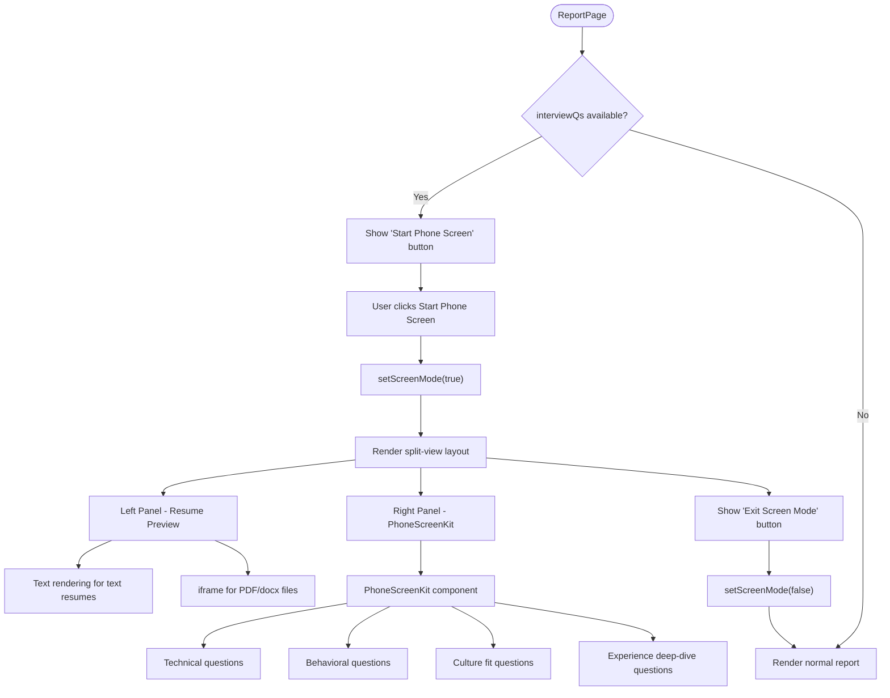

**Diagram sources**
- [ReportPage.jsx:115](file://app/frontend/src/pages/ReportPage.jsx#L115)
- [ReportPage.jsx:478](file://app/frontend/src/pages/ReportPage.jsx#L478)
- [ReportPage.jsx:809](file://app/frontend/src/pages/ReportPage.jsx#L809)
- [ReportPage.jsx:1000](file://app/frontend/src/pages/ReportPage.jsx#L1000)

**Section sources**
- [ReportPage.jsx:1-1030](file://app/frontend/src/pages/ReportPage.jsx#L1-L1030)

### Enhanced CandidatesPage with Split-View Candidate Preview
**Updated** CandidatesPage now includes comprehensive split-view candidate preview functionality:

- **Split View Mode**: Dedicated split-view mode for candidate list with inline preview
- **Dual-Panel Layout**: Left panel shows candidate list, right panel shows inline profile preview
- **Responsive Design**: Adapts to different screen sizes with mobile optimization
- **Candidate Selection**: Click to select candidate and load inline preview
- **Inline Profile Preview**: SplitProfilePreview component shows candidate details without full page navigation
- **Status Management**: Direct status change from split-view preview
- **Navigation Integration**: Quick navigation to full candidate profile
- **Loading States**: Proper loading indicators during candidate data fetching

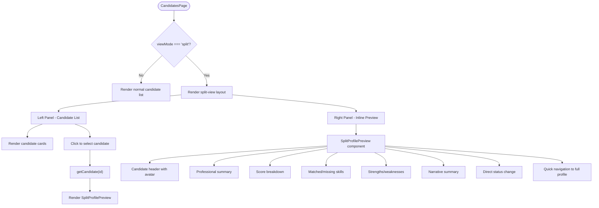

**Diagram sources**
- [CandidatesPage.jsx:888](file://app/frontend/src/pages/CandidatesPage.jsx#L888)
- [CandidatesPage.jsx:944](file://app/frontend/src/pages/CandidatesPage.jsx#L944)
- [CandidatesPage.jsx:185](file://app/frontend/src/pages/CandidatesPage.jsx#L185)

**Section sources**
- [CandidatesPage.jsx:1-984](file://app/frontend/src/pages/CandidatesPage.jsx#L1-L984)

### SplitProfilePreview Component
**New** SplitProfilePreview component provides inline candidate profile preview functionality:

- **Lightweight Design**: Simplified version of full candidate profile for split-view
- **Header Section**: Candidate avatar, name, and basic contact information
- **Score Display**: Fit score with visual indicator
- **Status Management**: Direct status change from preview
- **Navigation**: Quick link to full candidate profile
- **Professional Summary**: Candidate professional summary display
- **Score Breakdown**: Visual score breakdown by category
- **Skills Display**: Matched and missing skills with color coding
- **Strengths/Weaknesses**: Highlighted candidate strengths and weaknesses
- **Narrative Summary**: Candidate narrative summary in quote format

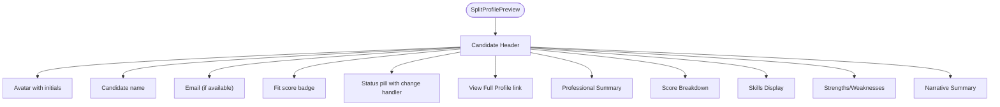

**Diagram sources**
- [CandidatesPage.jsx:185](file://app/frontend/src/pages/CandidatesPage.jsx#L185)
- [CandidatesPage.jsx:200](file://app/frontend/src/pages/CandidatesPage.jsx#L200)
- [CandidatesPage.jsx:238](file://app/frontend/src/pages/CandidatesPage.jsx#L238)
- [CandidatesPage.jsx:262](file://app/frontend/src/pages/CandidatesPage.jsx#L262)
- [CandidatesPage.jsx:277](file://app/frontend/src/pages/CandidatesPage.jsx#L277)
- [CandidatesPage.jsx:309](file://app/frontend/src/pages/CandidatesPage.jsx#L309)

**Section sources**
- [CandidatesPage.jsx:185-319](file://app/frontend/src/pages/CandidatesPage.jsx#L185-L319)

### PhoneScreenKit Component
**Updated** PhoneScreenKit component provides comprehensive phone screen preparation functionality:

- **Question Categories**: Technical, behavioral, culture fit, and experience deep-dive questions
- **Tabbed Interface**: Organized by question categories with active tab management
- **Evaluation System**: Rating and notes for each question with save functionality
- **Guidance Toggle**: Expandable guidance for each question category
- **Overall Assessment**: Conversation summary with validation and debrief generation
- **Skill Integration**: Links to missing and matched skills from analysis
- **Validation Rules**: Minimum length, skill mentions, and directional indicators
- **Debrief Generation**: Automated debrief generation from conversation summary

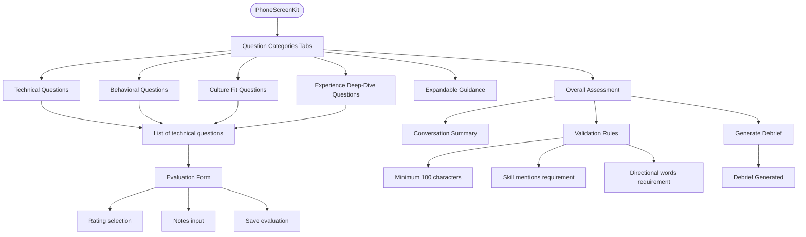

**Diagram sources**
- [PhoneScreenKit.jsx:77](file://app/frontend/src/components/PhoneScreenKit.jsx#L77)
- [PhoneScreenKit.jsx:96](file://app/frontend/src/components/PhoneScreenKit.jsx#L96)
- [PhoneScreenKit.jsx:174](file://app/frontend/src/components/PhoneScreenKit.jsx#L174)
- [PhoneScreenKit.jsx:216](file://app/frontend/src/components/PhoneScreenKit.jsx#L216)

**Section sources**
- [PhoneScreenKit.jsx:1-476](file://app/frontend/src/components/PhoneScreenKit.jsx#L1-L476)

### InterviewScorecard Component
**New** InterviewScorecard component provides phone screen evaluation functionality:

- **Evaluation Capture**: Rating and notes for candidate performance
- **Overall Assessment**: Summary of candidate evaluation
- **Debrief Integration**: Links to generated debrief documents
- **Status Management**: Integration with candidate status changes
- **Submission Handling**: Save and submit evaluation data
- **Validation**: Ensures comprehensive evaluation capture

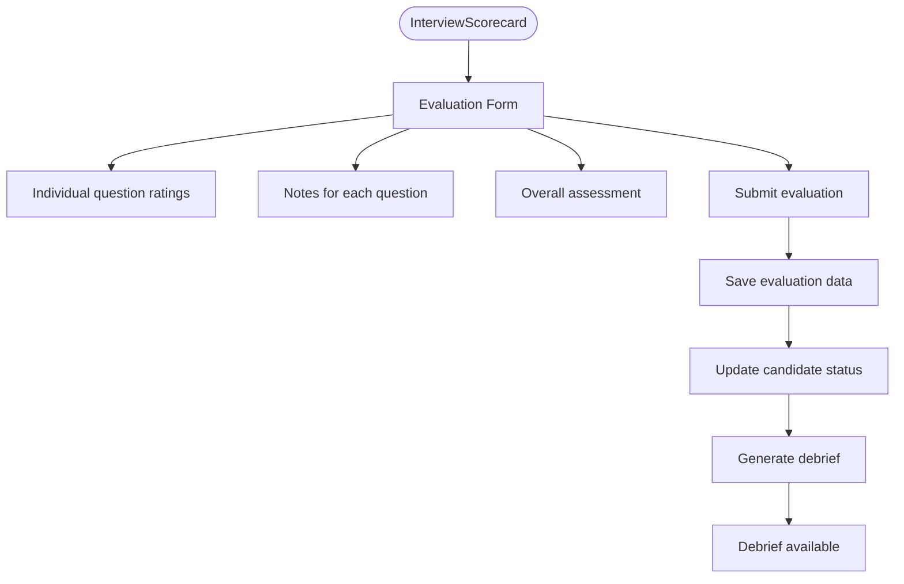

**Diagram sources**
- [InterviewScorecard.jsx](file://app/frontend/src/components/InterviewScorecard.jsx)

**Section sources**
- [InterviewScorecard.jsx](file://app/frontend/src/components/InterviewScorecard.jsx)

### Enhanced Resume Access System with Inline Parameter Support
**Updated** The resume access system now includes comprehensive inline parameter support for mobile phone screen split-view experiences:

#### Backend Implementation
The backend implements intelligent MIME type detection and content-disposition handling:

- **PDF Files**: Served inline for browser preview
- **DOCX/DOC/ODT Files**: Force download with proper filename
- **TXT/RTF Files**: Force download with proper filename
- **Fallback**: Generic binary stream with attachment
- **Filename Handling**: Uses stored filename or generates fallback

#### Frontend Implementation
The frontend provides robust resume access with proper error handling and mobile optimization:

- **viewCandidateResume()**: Opens resume in new tab using proper MIME type handling
- **downloadCandidateResume()**: Downloads resume with proper filename and MIME type
- **Inline Resume Preview**: Supports text rendering for text resumes and iframe display for PDF/docx files
- **Mobile Screen Mode**: Optimized for phone screen split-view experiences
- **Error Handling**: Graceful error handling with user feedback
- **Loading States**: Disabled states during operations
- **Cleanup**: Automatic URL cleanup after 30 seconds
- **Inline Parameter Support**: Enhanced parameter handling for mobile experiences

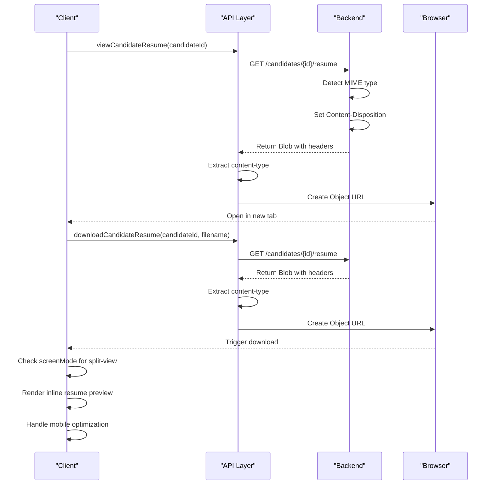

**Diagram sources**
- [api.js:558-569](file://app/frontend/src/lib/api.js#L558-L569)
- [candidates.py:504-558](file://app/backend/routes/candidates.py#L504-L558)

**Section sources**
- [api.js:558-569](file://app/frontend/src/lib/api.js#L558-L569)
- [candidates.py:504-558](file://app/backend/routes/candidates.py#L504-L558)

### Enhanced Split-View Phone Screen Mode Architecture
The split-view phone screen mode provides comprehensive mobile-optimized dual-panel layout:

#### Screen Mode State Management
- **screenMode State**: Boolean flag controlling split-view visibility
- **Toggle Functionality**: Start Phone Screen and Exit Screen Mode buttons
- **Responsive Layout**: Adapts to different screen sizes with mobile-first design
- **Parameter Support**: Inline parameter handling for mobile experiences

#### Dual-Panel Layout Implementation
- **Left Panel**: Resume preview with text rendering and iframe support
- **Right Panel**: PhoneScreenKit with question categories and evaluation tools
- **Responsive Sizing**: 50/50 split on desktop, adaptive on mobile
- **Mobile Optimization**: Touch-friendly controls and optimized layouts

#### Inline Resume Preview System
- **Text Rendering**: Preformatted text display for text resumes
- **Iframe Support**: PDF and DOCX file preview through iframe
- **Fallback Handling**: Empty state with open in new tab option
- **Loading States**: Progress indicators during resume loading
- **Error Handling**: Graceful fallback for unavailable resumes

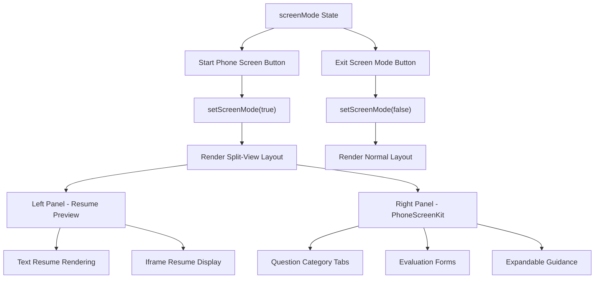

**Diagram sources**
- [ReportPage.jsx:115](file://app/frontend/src/pages/ReportPage.jsx#L115)
- [ReportPage.jsx:478](file://app/frontend/src/pages/ReportPage.jsx#L478)
- [ReportPage.jsx:809](file://app/frontend/src/pages/ReportPage.jsx#L809)
- [ReportPage.jsx:1000](file://app/frontend/src/pages/ReportPage.jsx#L1000)

**Section sources**
- [ReportPage.jsx:1-1030](file://app/frontend/src/pages/ReportPage.jsx#L1-L1030)

### Enhanced CandidatesPage Split-View Architecture
The split-view candidate preview system provides comprehensive dual-panel layout:

#### Split View State Management
- **viewMode State**: Controls between table, cards, and split-view modes
- **splitSelectedId**: Currently selected candidate for preview
- **splitProfile**: Loaded candidate data for preview
- **splitLoading**: Loading state during candidate data fetching

#### Dual-Panel Layout Implementation
- **Left Panel**: Candidate list with selection and status indicators
- **Right Panel**: Inline candidate preview with full details
- **Responsive Design**: Adapts to different screen sizes
- **Mobile Optimization**: Touch-friendly candidate selection

#### Inline Candidate Preview System
- **SplitProfilePreview Component**: Lightweight candidate preview
- **Direct Status Changes**: Update candidate status from preview
- **Quick Navigation**: Navigate to full candidate profile
- **Loading States**: Progress indicators during data fetching
- **Error Handling**: Graceful fallback for failed loads

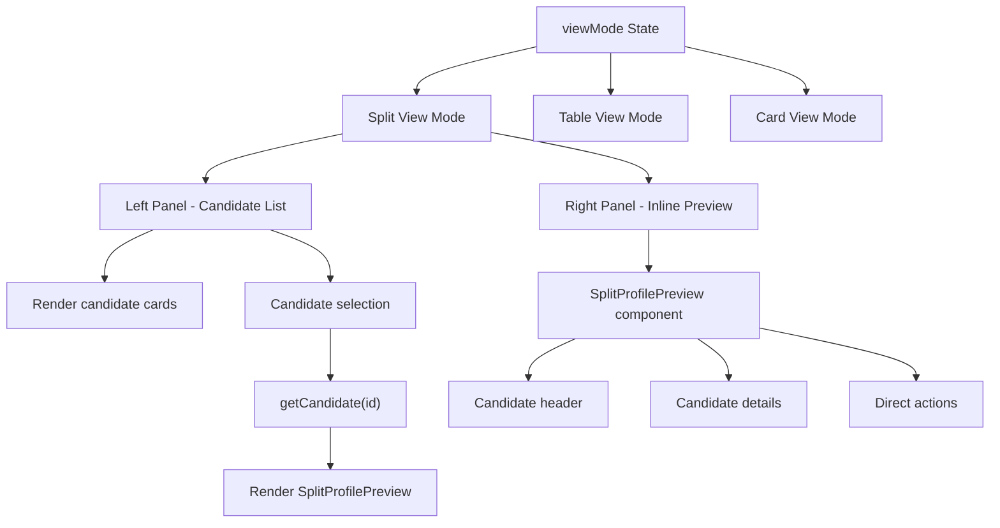

**Diagram sources**
- [CandidatesPage.jsx:342](file://app/frontend/src/pages/CandidatesPage.jsx#L342)
- [CandidatesPage.jsx:888](file://app/frontend/src/pages/CandidatesPage.jsx#L888)
- [CandidatesPage.jsx:944](file://app/frontend/src/pages/CandidatesPage.jsx#L944)

**Section sources**
- [CandidatesPage.jsx:1-984](file://app/frontend/src/pages/CandidatesPage.jsx#L1-L984)

### Enhanced Streaming Analysis Architecture
The streaming analysis system provides real-time updates for both single and batch workflows:
- **analyzeResumeStream**: Single file analysis with progressive stage updates
- **analyzeBatchStream**: Batch analysis with real-time result streaming and ranking
- **SSE Protocol**: Server-Sent Events for continuous data flow
- **Progressive Updates**: Live ranking during batch processing
- **Error Recovery**: Graceful handling of upload and analysis failures
- **Callback System**: Modular event handling for different stages
- **NEW**: XSS protection through safeStr sanitization for all streamed content
- **NEW**: Enhanced ProgressBadge integration for real-time progress tracking
- **NEW**: StreamingText integration for LLM narrative display with progressive reveal
- **NEW**: Split-view phone screen mode integration for enhanced mobile experiences
- **NEW**: Inline resume preview system for improved user workflow

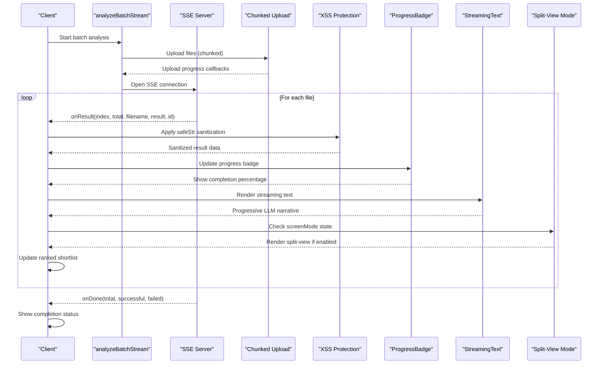

**Diagram sources**
- [api.js:413-515](file://app/frontend/src/lib/api.js#L413-L515)
- [BatchPage.jsx:131-177](file://app/frontend/src/pages/BatchPage.jsx#L131-L177)
- [AnalyzePage.jsx:303-331](file://app/frontend/src/pages/AnalyzePage.jsx#L303-L331)
- [ProgressBadge.jsx:15-131](file://app/frontend/src/components/ProgressBadge.jsx#L15-L131)
- [StreamingText.jsx:13-73](file://app/frontend/src/components/StreamingText.jsx#L13-L73)
- [ReportPage.jsx:115](file://app/frontend/src/pages/ReportPage.jsx#L115)

**Section sources**
- [api.js:200-515](file://app/frontend/src/lib/api.js#L200-L515)
- [BatchPage.jsx:131-177](file://app/frontend/src/pages/BatchPage.jsx#L131-L177)
- [AnalyzePage.jsx:303-331](file://app/frontend/src/pages/AnalyzePage.jsx#L303-L331)
- [ProgressBadge.jsx:15-131](file://app/frontend/src/components/ProgressBadge.jsx#L15-L131)
- [StreamingText.jsx:13-73](file://app/frontend/src/components/StreamingText.jsx#L13-L73)
- [ReportPage.jsx:115](file://app/frontend/src/pages/ReportPage.jsx#L115)

### Enhanced Chunked Upload System
uploadChunked.js provides robust large file upload handling:
- 10MB chunk size optimized for Cloudflare 100MB limit compliance
- Parallel chunk upload with concurrency control (3 concurrent uploads)
- Exponential backoff retry logic (3 retries with 1s, 2s, 4s delays)
- MD5 hash calculation for file integrity verification
- Real-time progress tracking with bytes uploaded, speed, and ETA
- Individual file and overall progress callbacks
- Server-side chunk assembly and cleanup functionality
- Abort functionality with server-side cancellation

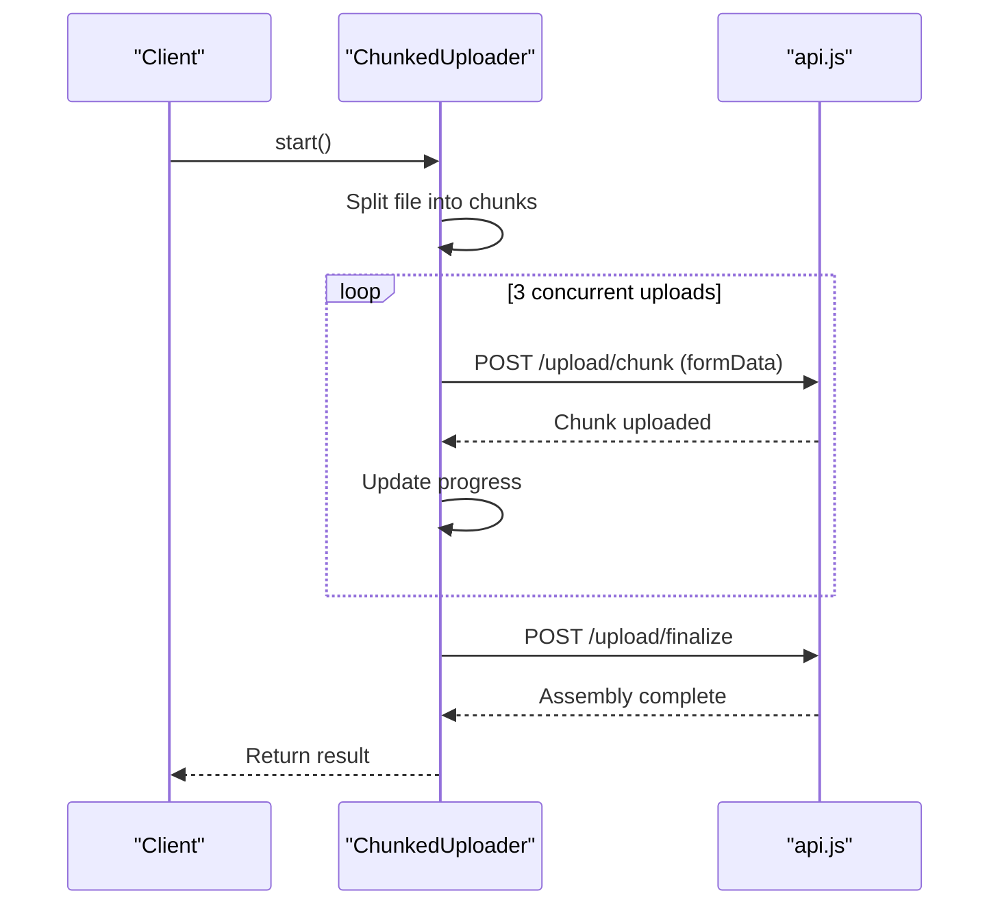

**Diagram sources**
- [uploadChunked.js:1-326](file://app/frontend/src/lib/uploadChunked.js#L1-L326)

**Section sources**
- [uploadChunked.js:1-326](file://app/frontend/src/lib/uploadChunked.js#L1-L326)

### Enhanced Streaming UI Components
The streaming analysis introduces several new UI components:
- **Progress Banners**: Real-time upload and analysis progress indicators
- **Live Tables**: Ranked shortlist with automatic updates
- **Status Badges**: Color-coded status indicators for candidates
- **Error Handling**: Graceful display of failed uploads and analysis errors
- **Loading States**: Animated progress indicators during streaming operations
- **Completion Feedback**: Clear indication when analysis is complete
- **NEW**: XSS protection through safeStr sanitization for all dynamic content
- **NEW**: AnimatedScore integration for animated fit scores
- **NEW**: StreamingText integration for progressive LLM narrative display
- **NEW**: ProgressBadge integration for real-time progress tracking
- **NEW**: Optimistic UI updates for immediate feedback during batch processing
- **NEW**: Split-view phone screen mode integration for enhanced mobile experiences
- **NEW**: Inline resume preview system for improved user workflow

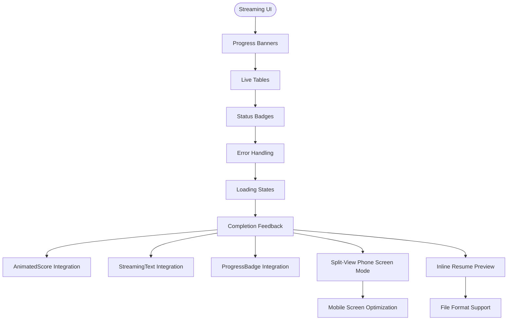

**Diagram sources**
- [BatchPage.jsx:454-476](file://app/frontend/src/pages/BatchPage.jsx#L454-L476)
- [AnalyzePage.jsx:774-799](file://app/frontend/src/pages/AnalyzePage.jsx#L774-L799)
- [AnimatedScore.jsx:16-63](file://app/frontend/src/components/AnimatedScore.jsx#L16-L63)
- [StreamingText.jsx:13-73](file://app/frontend/src/components/StreamingText.jsx#L13-L73)
- [ProgressBadge.jsx:15-131](file://app/frontend/src/components/ProgressBadge.jsx#L15-L131)
- [ReportPage.jsx:115](file://app/frontend/src/pages/ReportPage.jsx#L115)

**Section sources**
- [BatchPage.jsx:454-476](file://app/frontend/src/pages/BatchPage.jsx#L454-L476)
- [AnalyzePage.jsx:774-799](file://app/frontend/src/pages/AnalyzePage.jsx#L774-L799)
- [AnimatedScore.jsx:16-63](file://app/frontend/src/components/AnimatedScore.jsx#L16-L63)
- [StreamingText.jsx:13-73](file://app/frontend/src/components/StreamingText.jsx#L13-L73)
- [ProgressBadge.jsx:15-131](file://app/frontend/src/components/ProgressBadge.jsx#L15-L131)
- [ReportPage.jsx:115](file://app/frontend/src/pages/ReportPage.jsx#L115)

### ErrorBoundary Implementation
The ErrorBoundary component provides comprehensive error handling for the entire application:
- Catches JavaScript errors anywhere in the child component tree
- Displays user-friendly error messages with actionable retry options
- Implements exponential backoff retry mechanism
- Maintains application state during error conditions
- Provides both manual retry and automatic refresh options

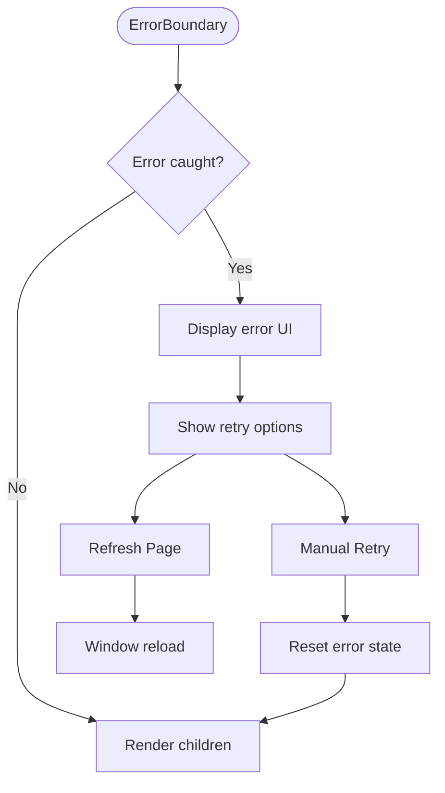

**Diagram sources**
- [ErrorBoundary.jsx:1-54](file://app/frontend/src/components/ErrorBoundary.jsx#L1-L54)

**Section sources**
- [ErrorBoundary.jsx:1-54](file://app/frontend/src/components/ErrorBoundary.jsx#L1-L54)

### Authentication and Routing
- AuthContext manages user, tenant, and loading state. It loads persisted tokens via httpOnly cookies, logs in/out, and exposes helpers to child components.
- ProtectedRoute enforces authentication for protected shells and shows a loader while resolving session state.
- PlatformAdminRoute enforces platform administrator privileges for admin routes.
- App.jsx defines lazy routes for all pages including the new DashboardNew, AnalyzePage, OnboardingWizard, and AdminDashboardPage, wrapping them in ErrorBoundary, ProtectedRoute, and SubscriptionProvider, then AppShell.

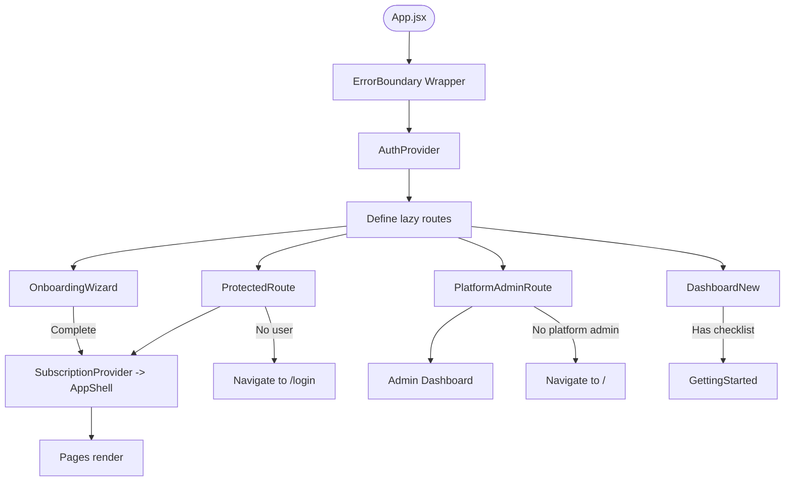

**Diagram sources**
- [App.jsx:1-90](file://app/frontend/src/App.jsx#L1-L90)
- [ProtectedRoute.jsx:1-24](file://app/frontend/src/components/ProtectedRoute.jsx#L1-L24)
- [PlatformAdminRoute.jsx:1-11](file://app/frontend/src/components/PlatformAdminRoute.jsx#L1-L11)
- [AuthContext.jsx:1-71](file://app/frontend/src/contexts/AuthContext.jsx#L1-L71)
- [OnboardingWizard.jsx:511-589](file://app/frontend/src/components/OnboardingWizard.jsx#L511-L589)
- [DashboardNew.jsx:284-287](file://app/frontend/src/pages/DashboardNew.jsx#L284-L287)
- [GettingStarted.jsx:19-129](file://app/frontend/src/components/GettingStarted.jsx#L19-L129)

**Section sources**
- [AuthContext.jsx:1-71](file://app/frontend/src/contexts/AuthContext.jsx#L1-L71)
- [ProtectedRoute.jsx:1-24](file://app/frontend/src/components/ProtectedRoute.jsx#L1-L24)
- [PlatformAdminRoute.jsx:1-11](file://app/frontend/src/components/PlatformAdminRoute.jsx#L1-L11)
- [App.jsx:1-90](file://app/frontend/src/App.jsx#L1-L90)

### Enhanced API Integration Layer
- api.js creates an Axios instance with base URL from environment.
- Request interceptor attaches CSRF token for non-GET requests and handles httpOnly cookies automatically.
- Response interceptor handles 401 by refreshing token via refresh endpoint and retrying the original request.
- **NEW**: Enhanced retry interceptor with exponential backoff for 5xx errors and network failures.
- **NEW**: Idempotency checking to prevent retrying non-idempotent POST requests.
- **NEW**: Configurable retry limits (MAX_RETRIES = 3) with delays [1s, 2s, 4s].
- **NEW**: Streaming analysis endpoints (analyze/stream, analyze/batch-stream) with SSE support.
- **NEW**: Chunked upload endpoints (/upload/chunk, /upload/finalize, /upload/cancel) integrated.
- **NEW**: Real-time progress callbacks for upload and analysis operations.
- **NEW**: Comprehensive admin endpoints for tenant management, audit logging, feature flags, webhooks, metrics, billing, and notifications.
- **NEW**: Resume access endpoints (/candidates/{id}/resume) with proper MIME type handling.
- **NEW**: Onboarding endpoints (updateOrganization, selectOnboardingPlan, getAvailablePlans, seedSampleData) for guided setup.
- **NEW**: JD library endpoints (getTemplates, createTemplate, updateTemplate, deleteTemplate, getAllJDStats) for job description management.
- **NEW**: Comparison endpoints (compareResults, compareCandidates) for candidate comparison functionality.
- **NEW**: Phone screen endpoints (getEvaluations, saveEvaluation, getScorecard, saveOverallAssessment, generateDebrief) for phone screen preparation.
- Exposes domain-specific functions for analysis, batch, history, comparison, exports, templates, candidates, email generation, JD URL extraction, team actions, training, video, transcript, health, subscription management, and admin operations.

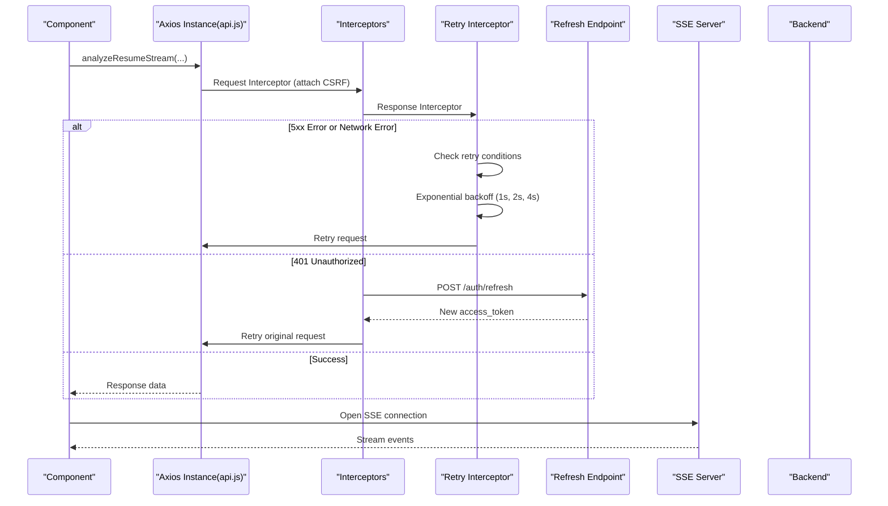

**Diagram sources**
- [api.js:64-90](file://app/frontend/src/lib/api.js#L64-L90)

**Section sources**
- [api.js:1-967](file://app/frontend/src/lib/api.js#L1-L967)

### UploadForm
- Supports three job description modes: text, file, URL.
- Drag-and-drop for resume and JD via react-dropzone with accept rules and size limits.
- Scoring weights presets and custom sliders.
- Saved JD templates picker with save-to-library flow.
- Submission guarded by validation and loading state.
- **Enhanced**: Improved error handling with user-friendly error messages and retry capabilities.
- **Enhanced**: Streaming analysis integration with real-time progress updates.
- **NEW**: XSS protection through safeStr sanitization for all dynamic content.

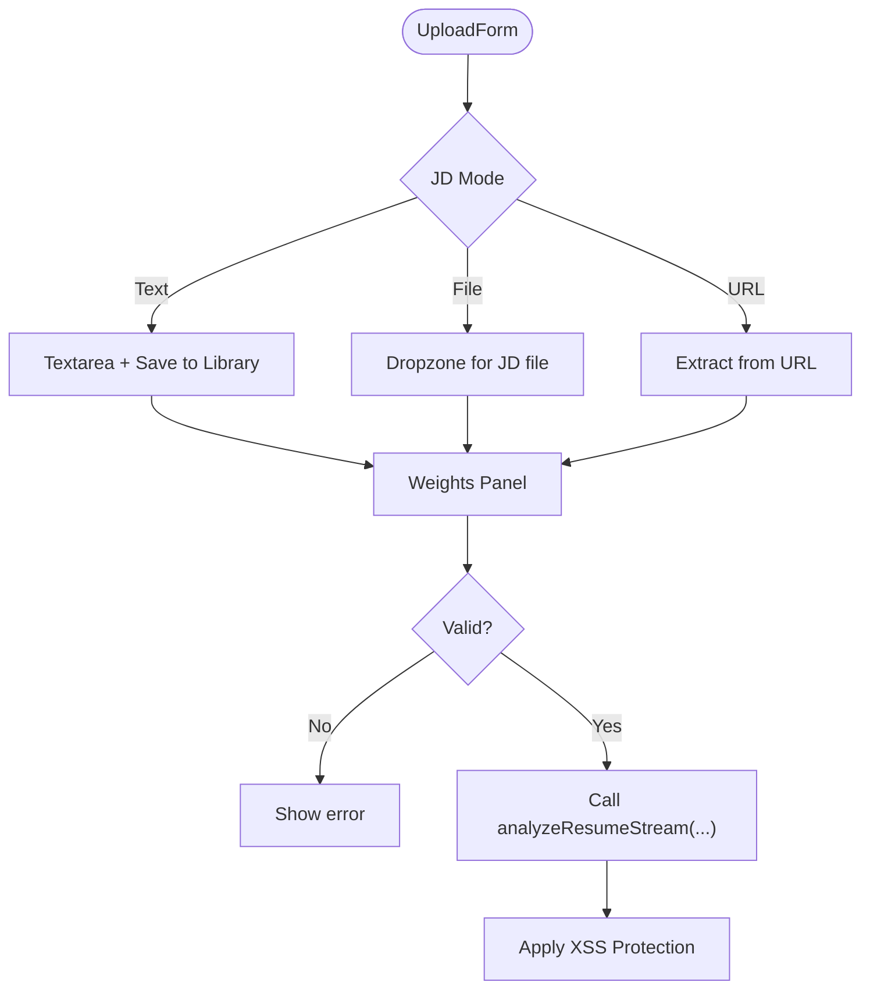

**Diagram sources**
- [UploadForm.jsx:1-484](file://app/frontend/src/components/UploadForm.jsx#L1-L484)
- [api.js:209-318](file://app/frontend/src/lib/api.js#L209-L318)

**Section sources**
- [UploadForm.jsx:1-484](file://app/frontend/src/components/UploadForm.jsx#L1-L484)

### ResultCard
- Renders recommendation badge, analysis source indicator, pending banner, score breakdown bars, matched/missing skills, adjacent skills, skills radar, strengths/weaknesses/risk signals, explainability, education analysis, domain fit/architecture, and interview kit tabs.
- Email modal integrates with backend email generation.
- **NEW**: Comprehensive XSS protection through safeStr utility function for all dynamic content rendering.
- **NEW**: Enhanced integration with AnimatedScore for animated fit score display.
- **NEW**: StreamingText integration for progressive LLM narrative display.

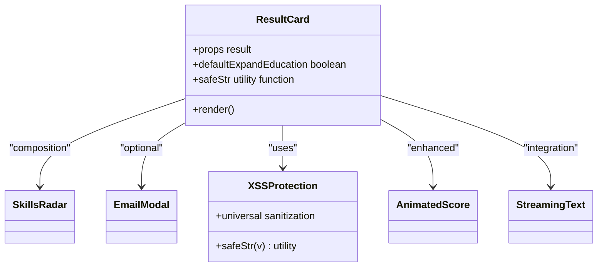

**Diagram sources**
- [ResultCard.jsx:1-844](file://app/frontend/src/components/ResultCard.jsx#L1-L844)
- [SkillsRadar.jsx](file://app/frontend/src/components/SkillsRadar.jsx)
- [AnimatedScore.jsx:1-63](file://app/frontend/src/components/AnimatedScore.jsx#L1-L63)
- [StreamingText.jsx:1-73](file://app/frontend/src/components/StreamingText.jsx#L1-L73)

**Section sources**
- [ResultCard.jsx:1-844](file://app/frontend/src/components/ResultCard.jsx#L1-L844)

### ScoreGauge
- Visualizes fit score with thresholds and pending state. Uses SVG arcs and transitions.


**Diagram sources**
- [ScoreGauge.jsx:1-97](file://app/frontend/src/components/ScoreGauge.jsx#L1-L97)

**Section sources**
- [ScoreGauge.jsx:1-97](file://app/frontend/src/components/ScoreGauge.jsx#L1-L97)

### Timeline
- Sorts and renders work experience with optional employment gaps and severity badges.

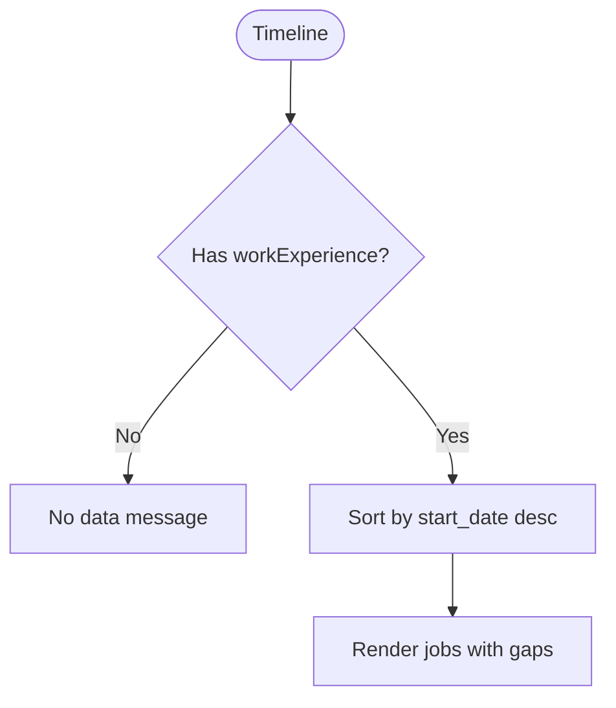

**Diagram sources**
- [Timeline.jsx:1-115](file://app/frontend/src/components/Timeline.jsx#L1-L115)

**Section sources**
- [Timeline.jsx:1-115](file://app/frontend/src/components/Timeline.jsx#L1-L115)

### Dashboard
- Orchestrates agent pipeline progress visualization during streaming analysis.
- Integrates usage widget via useSubscription and navigates to ReportPage upon completion.
- **Enhanced**: Improved error handling with graceful degradation and user feedback.

```mermaid
sequenceDiagram
participant D as "Dashboard"
participant UF as "UploadForm"
participant API as "api.js"
participant RP as "ReportPage"
D->>UF : Collect inputs
UF->>D : onSubmit()
D->>API : analyzeResumeStream(selectedFile, jobDescription, jobFile, weights, onStageComplete)
API-->>D : Stage events
D->>D : Update completedStages
D->>RP : Navigate("/report", {state : result})
```

**Diagram sources**
- [Dashboard.jsx:1-330](file://app/frontend/src/pages/Dashboard.jsx#L1-L330)
- [api.js:209-318](file://app/frontend/src/lib/api.js#L209-L318)

**Section sources**
- [Dashboard.jsx:1-330](file://app/frontend/src/pages/Dashboard.jsx#L1-L330)

### Enhanced CandidatesPage
**Updated** CandidatesPage now includes comprehensive resume access functionality with View/Download buttons in the candidate detail modal and split-view candidate preview functionality.

- Lists candidates with search, pagination, and detail modal showing history and quick navigation to reports.
- **Enhanced**: Real-time updates for streaming analysis results.
- **Enhanced**: Resume access buttons (View/Download) with proper MIME type handling.
- **Enhanced**: Filename generation with candidate name fallback.
- **Enhanced**: Loading states and error handling for resume operations.
- **NEW**: Split-view candidate preview functionality with inline profile display.
- **NEW**: Direct status changes from split-view preview.
- **NEW**: Quick navigation to full candidate profile from preview.
- **NEW**: Mobile optimization for split-view experiences.
- **NEW**: XSS protection through safeStr sanitization for all dynamic content.
- **NEW**: Enhanced CandidateCard integration with animated scores and quick actions.
- **NEW**: Optimistic UI updates for candidate status changes during batch processing.
- **NEW**: Keyboard shortcuts integration for efficient candidate list navigation.

```mermaid
flowchart TD
Start(["CandidatesPage"]) --> Fetch["getCandidates({search, page, page_size})"]
Fetch --> Render["Render table + pagination"]
Render --> Detail{"Open detail?"}
Detail --> |Yes| Modal["CandidateDetail modal"]
Modal --> ViewBtn["View Resume Button"]
Modal --> DownloadBtn["Download Resume Button"]
ViewBtn --> ViewAPI["viewCandidateResume()"]
DownloadBtn --> DownloadAPI["downloadCandidateResume()"]
ViewAPI --> SEC["Apply XSS Protection"]
DownloadAPI --> SEC
SEC --> Browser["Open/Download in Browser"]
Detail --> |No| Idle["Idle"]
Detail --> Keyboard["Keyboard Shortcuts"]
Keyboard --> CandidateCards["Enhanced CandidateCard"]
CandidateCards --> Optimistic["Optimistic Updates"]
Optimistic --> QuickActions["QuickActions Integration"]
Detail --> SplitView["Split View Mode"]
SplitView --> CandidateList["Candidate List"]
SplitView --> InlinePreview["Inline Profile Preview"]
CandidateList --> Selection["Candidate Selection"]
Selection --> LoadProfile["getCandidate(id)"]
LoadProfile --> ShowPreview["SplitProfilePreview"]
InlinePreview --> DirectActions["Direct Status Changes"]
InlinePreview --> QuickNav["Quick Navigation"]
```

**Diagram sources**
- [CandidatesPage.jsx:1-984](file://app/frontend/src/pages/CandidatesPage.jsx#L1-L984)
- [api.js:558-569](file://app/frontend/src/lib/api.js#L558-L569)
- [useKeyboardShortcuts.js:16-102](file://app/frontend/src/hooks/useKeyboardShortcuts.js#L16-L102)
- [CandidateCard.jsx:18-141](file://app/frontend/src/components/CandidateCard.jsx#L18-L141)
- [QuickActions.jsx:23-158](file://app/frontend/src/components/QuickActions.jsx#L23-L158)
- [useOptimisticUpdate.js:24-81](file://app/frontend/src/hooks/useOptimisticUpdate.js#L24-L81)
- [CandidatesPage.jsx:888](file://app/frontend/src/pages/CandidatesPage.jsx#L888)
- [CandidatesPage.jsx:944](file://app/frontend/src/pages/CandidatesPage.jsx#L944)

**Section sources**
- [CandidatesPage.jsx:1-984](file://app/frontend/src/pages/CandidatesPage.jsx#L1-L984)
- [api.js:558-569](file://app/frontend/src/lib/api.js#L558-L569)
- [useKeyboardShortcuts.js:16-102](file://app/frontend/src/hooks/useKeyboardShortcuts.js#L16-L102)
- [CandidateCard.jsx:18-141](file://app/frontend/src/components/CandidateCard.jsx#L18-L141)
- [QuickActions.jsx:23-158](file://app/frontend/src/components/QuickActions.jsx#L23-L158)
- [useOptimisticUpdate.js:24-81](file://app/frontend/src/hooks/useOptimisticUpdate.js#L24-L81)
- [CandidatesPage.jsx:888-952](file://app/frontend/src/pages/CandidatesPage.jsx#L888-L952)

### Enhanced ReportPage
**Updated** ReportPage now includes comprehensive resume access functionality with View/Download buttons in the sticky action bar and split-view phone screen mode functionality.

- Presents a single result with sidebar actions (share, download PDF), inline candidate name editor, label training buttons, and full ResultCard plus Timeline.
- **Enhanced**: Job context persistence system with sessionStorage integration for seamless "Analyze Another Resume" workflow.
- **Enhanced**: Resume access buttons (View/Download) with proper MIME type handling.
- **Enhanced**: Filename generation with candidate name fallback.
- **Enhanced**: Loading states and error handling for resume operations.
- **NEW**: Split-view phone screen mode with dual-panel layout for mobile optimization.
- **NEW**: Inline resume preview supporting text rendering and iframe display.
- **NEW**: PhoneScreenKit integration for comprehensive phone screen preparation.
- **NEW**: Mobile screen optimization with responsive design patterns.
- **NEW**: Intelligent job context detection and utilization for improved user experience.
- **NEW**: Enhanced ResultCard integration with AnimatedScore and StreamingText.
- **NEW**: XSS protection through safeStr sanitization for all dynamic content.

```mermaid
sequenceDiagram
participant RP as "ReportPage"
participant RC as "ResultCard"
participant TL as "Timeline"
participant API as "api.js"
participant PS as "PhoneScreenKit"
participant ISC as "InterviewScorecard"
RP->>RC : Render with result
RP->>TL : Render with work_experience + gaps
RP->>API : labelTrainingExample(result_id, outcome)
RP->>API : updateResultStatus(result_id, outcome)
RP->>API : viewCandidateResume / downloadCandidateResume
API-->>RP : Return blob with content-type
RP->>SEC : Apply XSS Protection
RP->>Browser : Open/Download resume
RP->>API : updateCandidateName (if edited)
RP->>API : Load job context from sessionStorage
RP->>RP : Show "Analyze Another Resume" button
RP->>PS : Render PhoneScreenKit (if interviewQs available)
PS->>ISC : Render InterviewScorecard
PS->>RP : Show "Start Phone Screen" button
RP->>RP : User clicks "Start Phone Screen"
RP->>RP : Set screenMode = true
RP->>RP : Render split-view with resume + PhoneScreenKit
RP->>RP : Show "Exit Screen Mode" button
```

**Diagram sources**
- [ReportPage.jsx:1-1030](file://app/frontend/src/pages/ReportPage.jsx#L1-L1030)
- [ResultCard.jsx:1-844](file://app/frontend/src/components/ResultCard.jsx#L1-L844)
- [Timeline.jsx:1-115](file://app/frontend/src/components/Timeline.jsx#L1-L115)
- [PhoneScreenKit.jsx:1-476](file://app/frontend/src/components/PhoneScreenKit.jsx#L1-L476)
- [InterviewScorecard.jsx](file://app/frontend/src/components/InterviewScorecard.jsx)
- [api.js:625-628](file://app/frontend/src/lib/api.js#L625-L628)
- [api.js:558-569](file://app/frontend/src/lib/api.js#L558-L569)

**Section sources**
- [ReportPage.jsx:1-1030](file://app/frontend/src/pages/ReportPage.jsx#L1-L1030)

### Subscription Management Hooks
- useSubscription provides cached subscription data, available plans, usage stats, feature checks, and optimistic refresh after analysis.
- useUsageCheck performs preflight checks against remaining analyses and server-side limits.
- **Enhanced**: Improved error handling with graceful degradation and user feedback.

```mermaid
flowchart TD
Start(["useSubscription"]) --> Fetch["fetchSubscription(force=false)"]
Fetch --> Cache{"Within cache window?"}
Cache --> |Yes| Return["Return cached subscription"]
Cache --> |No| Call["GET /subscription"]
Call --> Update["Set state + lastFetch"]
Update --> Return
Return --> Widgets["UsageWidget / Dashboard"]
```

**Diagram sources**
- [useSubscription.jsx:1-186](file://app/frontend/src/hooks/useSubscription.jsx#L1-L186)

**Section sources**
- [useSubscription.jsx:1-186](file://app/frontend/src/hooks/useSubscription.jsx#L1-L186)

## Platform Administration System

### AdminDashboardPage Overview
AdminDashboardPage provides a comprehensive platform administration interface with tabbed navigation and administrative tools for managing tenants, monitoring activities, configuring features, and overseeing system operations.

```mermaid
flowchart TD
Start(["AdminDashboardPage"]) --> Tabs["Tab Navigation"]
Tabs --> Overview["Overview Tab"]
Tabs --> Tenants["Tenants Tab"]
Tabs --> Audit["Audit Log Tab"]
Tabs --> RateLimits["Rate Limits Tab"]
Tabs --> Features["Feature Flags Tab"]
Tabs --> Webhooks["Webhooks Tab"]
Tabs --> Metrics["Metrics Tab"]
Tabs --> Billing["Billing Tab"]
Tabs --> Notifications["Notifications Tab"]
Overview --> Stats["Summary Cards"]
Tenants --> Table["Tenant Management Table"]
Audit --> Logs["Audit Log Table"]
Features --> Flags["Feature Flag Management"]
Webhooks --> Config["Webhook Configuration"]
Metrics --> Analytics["Analytics Dashboards"]
Billing --> Providers["Provider Configuration"]
Notifications --> SMTP["SMTP Configuration"]
```

**Diagram sources**
- [AdminDashboardPage.jsx:59-69](file://app/frontend/src/pages/AdminDashboardPage.jsx#L59-L69)
- [AdminDashboardPage.jsx:384-1807](file://app/frontend/src/pages/AdminDashboardPage.jsx#L384-L1807)

### Tabbed Navigation System
The admin interface uses a sophisticated tabbed navigation system with 9 distinct tabs covering all administrative domains:

- **Overview**: System-wide statistics and tenant distribution
- **Tenants**: Tenant management with filtering, sorting, and bulk actions
- **Audit Log**: Comprehensive audit trail with date range filtering
- **Rate Limits**: Custom rate limit configuration (coming soon)
- **Feature Flags**: Global feature flags and per-tenant overrides
- **Webhooks**: Webhook configuration and delivery monitoring
- **Metrics**: Usage analytics and revenue metrics
- **Billing**: Payment provider configuration
- **Notifications**: SMTP configuration and test emails

**Section sources**
- [AdminDashboardPage.jsx:59-69](file://app/frontend/src/pages/AdminDashboardPage.jsx#L59-L69)

### Tenant Management Interface
The tenant management system provides comprehensive tenant oversight with advanced filtering, sorting, and action capabilities:

- **Advanced Filtering**: Search by name/slug, status filtering (active, suspended, trialing, cancelled)
- **Sortable Columns**: Name, plan, status, analysis count, user count, creation date
- **Bulk Actions**: Suspend/reactivate, change plan, view details
- **Status Badges**: Color-coded status indicators
- **Pagination**: Efficient handling of large tenant datasets
- **Tenant Detail Modal**: Comprehensive tenant information with user listing
- **Plan Management**: Change tenant plans with dropdown selector
- **Suspension Management**: Suspend tenants with reason logging

**Section sources**
- [AdminDashboardPage.jsx:71-86](file://app/frontend/src/pages/AdminDashboardPage.jsx#L71-L86)
- [AdminDashboardPage.jsx:88-100](file://app/frontend/src/pages/AdminDashboardPage.jsx#L88-L100)
- [AdminDashboardPage.jsx:123-247](file://app/frontend/src/pages/AdminDashboardPage.jsx#L123-L247)
- [AdminDashboardPage.jsx:249-321](file://app/frontend/src/pages/AdminDashboardPage.jsx#L249-L321)
- [AdminDashboardPage.jsx:323-382](file://app/frontend/src/pages/AdminDashboardPage.jsx#L323-L382)

### Audit Log Viewer
The audit log system provides comprehensive activity tracking with advanced filtering capabilities:

- **Action Filtering**: Filter by specific actions
- **Date Range Filtering**: Custom date range selection
- **Comprehensive Logging**: Time, actor, action, resource, details
- **Pagination**: Efficient handling of large audit datasets
- **JSON Details**: Structured audit details display

**Section sources**
- [AdminDashboardPage.jsx:400-405](file://app/frontend/src/pages/AdminDashboardPage.jsx#L400-L405)
- [AdminDashboardPage.jsx:973-1088](file://app/frontend/src/pages/AdminDashboardPage.jsx#L973-L1088)

### Feature Flag Management
The feature flag system provides granular control over feature availability:

- **Global Toggle**: Enable/disable features globally
- **Per-Tenant Overrides**: Override global settings per tenant
- **Real-time Updates**: Immediate effect of feature flag changes
- **Tenant Selector**: Dropdown to select target tenant for overrides

**Section sources**
- [AdminDashboardPage.jsx:412-418](file://app/frontend/src/pages/AdminDashboardPage.jsx#L412-L418)
- [AdminDashboardPage.jsx:1102-1240](file://app/frontend/src/pages/AdminDashboardPage.jsx#L1102-L1240)

### Webhook Configuration Tools
The webhook system enables external service integration with comprehensive monitoring:

- **Tenant Selection**: Configure webhooks per tenant
- **Event Selection**: Choose specific events to trigger webhooks
- **Delivery Monitoring**: View webhook delivery history and status
- **Add/Delete Operations**: Manage webhook configurations
- **Failure Tracking**: Monitor webhook failure counts

**Section sources**
- [AdminDashboardPage.jsx:420-430](file://app/frontend/src/pages/AdminDashboardPage.jsx#L420-L430)
- [AdminDashboardPage.jsx:1242-1464](file://app/frontend/src/pages/AdminDashboardPage.jsx#L1242-L1464)

### Metrics Dashboards
The metrics system provides comprehensive analytics and reporting:

- **Summary Cards**: Total tenants, active users, analyses today, MRR
- **Plan Distribution**: Visual representation of plan usage
- **Usage Trends**: Daily analyses and signups over 30-day periods
- **Real-time Data**: Current metrics and historical trends

**Section sources**
- [AdminDashboardPage.jsx:1466-1575](file://app/frontend/src/pages/AdminDashboardPage.jsx#L1466-L1575)

### Billing Configuration Panels
The billing system provides payment provider management:

- **Provider Selection**: Choose between Stripe, Razorpay, Manual
- **API Key Management**: Secure API key configuration
- **Provider-Specific Fields**: Conditional fields based on selected provider
- **Configuration Status**: Visual indication of billing configuration

**Section sources**
- [AdminDashboardPage.jsx:1577-1681](file://app/frontend/src/pages/AdminDashboardPage.jsx#L1577-L1681)

### Notification Settings
The notification system provides SMTP configuration and testing:

- **SMTP Configuration**: Host, port, authentication settings
- **From Address**: Default sender address configuration
- **Test Email**: Send test emails to verify configuration
- **Status Indication**: Visual status of notification configuration

**Section sources**
- [AdminDashboardPage.jsx:1683-1779](file://app/frontend/src/pages/AdminDashboardPage.jsx#L1683-L1779)

### Administrative API Integration
The admin system integrates with comprehensive backend APIs:

- **Tenant Management**: CRUD operations for tenants
- **Audit Logging**: Query and filter audit logs
- **Feature Flags**: Global and per-tenant flag management
- **Webhooks**: Create, update, delete, and monitor webhooks
- **Metrics**: System-wide analytics and reporting
- **Billing**: Provider configuration and management
- **Notifications**: SMTP configuration and testing

**Section sources**
- [api.js:823-967](file://app/frontend/src/lib/api.js#L823-L967)

## XSS Protection Architecture

### Universal String Sanitization Pattern
The frontend implements comprehensive XSS protection through a universal safeStr utility function pattern that sanitizes all dynamic content before rendering:

#### SafeStr Utility Function Implementation
The safeStr function provides universal string sanitization across all components:

```javascript
/** Coerce any value to a render-safe string. Objects become JSON; null/undefined → '' */
function safeStr(v) {
  if (v == null) return ''
  if (typeof v === 'string') return v
  if (typeof v === 'number' || typeof v === 'boolean') return String(v)
  try { return JSON.stringify(v) } catch { return String(v) }
}
```

#### XSS Protection Coverage
All core components implement comprehensive XSS protection:

**ResultCard.jsx**: Implements safeStr for all dynamic content including:
- Final recommendations and risk levels
- Fit summaries and recommendation rationale
- Skill lists and depth indicators
- Risk flags and severity indicators
- Explainability rationales
- Education timeline analysis
- Interview questions and answers
- **NEW**: AnimatedScore integration with safeStr protection

**ComparisonView.jsx**: Implements safeStr for version comparison data:
- Final recommendations for both versions
- Weight reasoning explanations
- Role category badges
- Version metadata and timestamps

**UploadForm.jsx**: Implements safeStr for form validation and error messages:
- Dynamic error messages and validation feedback
- File upload progress indicators
- Template library descriptions

**VersionHistory.jsx**: Implements safeStr for version comparison:
- Recommendation badges and status indicators
- weight reasoning explanations
- Role category displays

**AdminDashboardPage.jsx**: Implements safeStr for all administrative content:
- Tenant names, slugs, and details
- Audit log entries and actions
- Feature flag keys and descriptions
- Webhook URLs and events
- Metric values and trends
- Billing configuration details
- Notification settings

**AnalyzePage.jsx**: Implements safeStr for analysis workflow content:
- Job description context and weights
- Step indicators and progress information
- Error messages and validation feedback
- File upload information and status
- **NEW**: StreamingText integration with safeStr protection

**ReportPage.jsx**: Implements safeStr for report content:
- Candidate names and contact information
- Job role and analysis metadata
- Recommendation badges and status indicators
- Narrative content and AI enhancements
- **NEW**: Split-view phone screen mode with safeStr protection
- **NEW**: Inline resume preview with safeStr protection
- **NEW**: PhoneScreenKit integration with safeStr protection

**CandidatesPage.jsx**: Implements safeStr for candidate content:
- Candidate names, emails, and scores
- Application history and status
- Resume access buttons with proper XSS protection
- **NEW**: SplitProfilePreview with safeStr protection
- **NEW**: Enhanced CandidateCard with safeStr protection
- **NEW**: Split-view candidate preview with safeStr protection

**ComparePage.jsx**: Implements safeStr for comparison content:
- Candidate names and scores
- Comparison metrics and winners
- Strengths/weaknesses analysis
- Interview questions preview
- **NEW**: ComparisonMatrix integration with safeStr protection

**JDLibraryPage.jsx**: Implements safeStr for JD library content:
- JD names and descriptions
- Tag information and weights
- Usage statistics and counts
- **NEW**: SkillTrendChart integration with safeStr protection

**OnboardingWizard.jsx**: Implements safeStr for onboarding content:
- Organization details and plan information
- Team member emails and validation
- Success messages and error handling
- **NEW**: GettingStarted checklist with safeStr protection

**PhoneScreenKit.jsx**: Implements safeStr for phone screen content:
- Question categories and question lists
- Guidance content and evaluation forms
- Overall assessment and debrief content
- **NEW**: InterviewScorecard integration with safeStr protection

**Resume Access System**: Implements safeStr for filename generation:
- Candidate names for resume filenames
- Fallback IDs for resume filenames
- XSS protection for dynamic content

**NEW Component Library**: All new components implement safeStr protection:
- AnimatedScore.jsx: Score values and size classes
- StreamingText.jsx: Text content and streaming indicators
- CandidateCard.jsx: Candidate information and highlights
- ProgressBadge.jsx: Status messages and file names
- ScoreBadge.jsx: Score values and color classes
- QuickActions.jsx: Action labels and status messages
- GettingStarted.jsx: Checklist items and progress tracking
- ComparisonMatrix.jsx: Skills matrix data and confidence indicators
- SkillTrendChart.jsx: Trend data and growth metrics
- SplitProfilePreview.jsx: Candidate information and preview content
- PhoneScreenKit.jsx: Question content and evaluation forms
- InterviewScorecard.jsx: Evaluation content and debrief information

#### Defensive Programming Approaches
The XSS protection architecture follows defensive programming principles:

1. **Input Validation**: All user inputs and API responses are processed through safeStr
2. **Output Encoding**: Dynamic content is encoded before DOM insertion
3. **Type Coercion**: Non-string values are safely converted to strings
4. **JSON Fallback**: Complex objects are serialized safely
5. **Graceful Degradation**: Invalid values fall back to empty strings

#### Security Benefits
- **Prevents XSS Attacks**: Eliminates script injection vulnerabilities
- **Consistent Protection**: Universal sanitization across all components
- **Performance Optimization**: Minimal overhead with efficient string conversion
- **Maintainability**: Centralized sanitization logic reduces code duplication
- **Future-Proof**: Easy to extend with additional sanitization rules

```mermaid
flowchart TD
Input["Dynamic Input Data"] --> SafeStr["safeStr Utility"]
SafeStr --> TypeCheck{"Type Check"}
TypeCheck --> |String| DirectReturn["Direct Return"]
TypeCheck --> |Number/Boolean| ToString["String Conversion"]
TypeCheck --> |Object| JSONStringify["JSON Serialization"]
TypeCheck --> |Null/Undefined| EmptyString["Empty String"]
JSONStringify --> TryCatch{"Try/Catch"}
TryCatch --> |Success| SafeReturn["Safe String"]
TryCatch --> |Error| Fallback["Fallback String"]
DirectReturn --> Sanitized["Sanitized Output"]
ToString --> Sanitized
SafeReturn --> Sanitized
Fallback --> Sanitized
EmptyString --> Sanitized
```

**Diagram sources**
- [ResultCard.jsx:13-19](file://app/frontend/src/components/ResultCard.jsx#L13-L19)
- [ComparisonView.jsx:3-9](file://app/frontend/src/components/ComparisonView.jsx#L3-L9)
- [AdminDashboardPage.jsx:13-19](file://app/frontend/src/pages/AdminDashboardPage.jsx#L13-L19)
- [AnalyzePage.jsx:13-19](file://app/frontend/src/pages/AnalyzePage.jsx#L13-L19)
- [ReportPage.jsx:13-19](file://app/frontend/src/pages/ReportPage.jsx#L13-L19)
- [CandidatesPage.jsx:6-12](file://app/frontend/src/pages/CandidatesPage.jsx#L6-L12)
- [ComparePage.jsx:7-13](file://app/frontend/src/pages/ComparePage.jsx#L7-L13)
- [JDLibraryPage.jsx:7-13](file://app/frontend/src/pages/JDLibraryPage.jsx#L7-L13)
- [OnboardingWizard.jsx:7-13](file://app/frontend/src/components/OnboardingWizard.jsx#L7-L13)
- [PhoneScreenKit.jsx:1-476](file://app/frontend/src/components/PhoneScreenKit.jsx#L1-L476)
- [InterviewScorecard.jsx](file://app/frontend/src/components/InterviewScorecard.jsx)
- [AnimatedScore.jsx:16-63](file://app/frontend/src/components/AnimatedScore.jsx#L16-L63)
- [StreamingText.jsx:13-73](file://app/frontend/src/components/StreamingText.jsx#L13-L73)
- [CandidateCard.jsx:18-141](file://app/frontend/src/components/CandidateCard.jsx#L18-L141)
- [ProgressBadge.jsx:15-131](file://app/frontend/src/components/ProgressBadge.jsx#L15-L131)
- [ScoreBadge.jsx:13-58](file://app/frontend/src/components/ScoreBadge.jsx#L13-L58)
- [QuickActions.jsx:23-158](file://app/frontend/src/components/QuickActions.jsx#L23-L158)
- [GettingStarted.jsx:19-129](file://app/frontend/src/components/GettingStarted.jsx#L19-L129)
- [ComparisonMatrix.jsx:17-137](file://app/frontend/src/components/ComparisonMatrix.jsx#L17-L137)
- [SkillTrendChart.jsx:70-249](file://app/frontend/src/components/SkillTrendChart.jsx#L70-L249)
- [SplitProfilePreview.jsx:185-319](file://app/frontend/src/pages/CandidatesPage.jsx#L185-L319)

**Section sources**
- [ResultCard.jsx:13-19](file://app/frontend/src/components/ResultCard.jsx#L13-L19)
- [ComparisonView.jsx:3-9](file://app/frontend/src/components/ComparisonView.jsx#L3-L9)
- [ResultCard.jsx:423](file://app/frontend/src/components/ResultCard.jsx#L423)
- [ComparisonView.jsx:114](file://app/frontend/src/components/ComparisonView.jsx#L114)
- [AdminDashboardPage.jsx:13-19](file://app/frontend/src/pages/AdminDashboardPage.jsx#L13-L19)
- [AnalyzePage.jsx:13-19](file://app/frontend/src/pages/AnalyzePage.jsx#L13-L19)
- [ReportPage.jsx:13-19](file://app/frontend/src/pages/ReportPage.jsx#L13-L19)
- [CandidatesPage.jsx:6-12](file://app/frontend/src/pages/CandidatesPage.jsx#L6-L12)
- [ComparePage.jsx:7-13](file://app/frontend/src/pages/ComparePage.jsx#L7-L13)
- [JDLibraryPage.jsx:7-13](file://app/frontend/src/pages/JDLibraryPage.jsx#L7-L13)
- [OnboardingWizard.jsx:7-13](file://app/frontend/src/components/OnboardingWizard.jsx#L7-L13)
- [PhoneScreenKit.jsx:1-476](file://app/frontend/src/components/PhoneScreenKit.jsx#L1-L476)
- [InterviewScorecard.jsx](file://app/frontend/src/components/InterviewScorecard.jsx)
- [AnimatedScore.jsx:16-63](file://app/frontend/src/components/AnimatedScore.jsx#L16-L63)
- [StreamingText.jsx:13-73](file://app/frontend/src/components/StreamingText.jsx#L13-L73)
- [CandidateCard.jsx:18-141](file://app/frontend/src/components/CandidateCard.jsx#L18-L141)
- [ProgressBadge.jsx:15-131](file://app/frontend/src/components/ProgressBadge.jsx#L15-L131)
- [ScoreBadge.jsx:13-58](file://app/frontend/src/components/ScoreBadge.jsx#L13-L58)
- [QuickActions.jsx:23-158](file://app/frontend/src/components/QuickActions.jsx#L23-L158)
- [GettingStarted.jsx:19-129](file://app/frontend/src/components/GettingStarted.jsx#L19-L129)
- [ComparisonMatrix.jsx:17-137](file://app/frontend/src/components/ComparisonMatrix.jsx#L17-L137)
- [SkillTrendChart.jsx:70-249](file://app/frontend/src/components/SkillTrendChart.jsx#L70-L249)
- [SplitProfilePreview.jsx:185-319](file://app/frontend/src/pages/CandidatesPage.jsx#L185-L319)

## Security Headers and CSP

### Content Security Policy (CSP) Implementation
The frontend implements comprehensive security headers to prevent XSS and other web vulnerabilities:

#### Nginx Security Headers Configuration
Production nginx configuration includes essential security headers:

- **X-Frame-Options**: "SAMEORIGIN" prevents clickjacking attacks
- **X-Content-Type-Options**: "nosniff" prevents MIME type sniffing
- **Strict-Transport-Security**: "max-age=31536000; includeSubDomains" enforces HTTPS
- **Referrer-Policy**: "strict-origin-when-cross-origin" controls referrer leakage
- **Content-Security-Policy**: Comprehensive policy for script, style, and resource loading

#### CSP Policy Details
The Content-Security-Policy provides layered protection:

- **Default-src 'self'**: Restricts all resources to same origin
- **Script-src 'self'**: Allows scripts only from same origin
- **Style-src 'self' 'unsafe-inline'**: Allows inline styles for TailwindCSS
- **Img-src 'self' data: blob:**: Allows images from same origin, data URLs, and blobs
- **Font-src 'self'**: Restricts fonts to same origin
- **Connect-src 'self'**: Restricts API calls to same origin
- **Frame-ancestors 'self'**: Prevents embedding in iframes

#### Security Header Benefits
- **XSS Prevention**: Blocks malicious script injection
- **Clickjacking Protection**: Prevents unauthorized framing
- **HTTPS Enforcement**: Ensures encrypted communication
- **MIME Sniffing Prevention**: Protects against content type manipulation
- **Resource Control**: Restricts loading of external resources

```mermaid
flowchart TD
Request["HTTP Request"] --> SecurityHeaders["Apply Security Headers"]
SecurityHeaders --> XFrameOptions["X-Frame-Options: SAMEORIGIN"]
SecurityHeaders --> XContentTypeOptions["X-Content-Type-Options: nosniff"]
SecurityHeaders --> HSTS["Strict-Transport-Security: 31536000"]
SecurityHeaders --> ReferrerPolicy["Referrer-Policy: strict-origin-when-cross-origin"]
SecurityHeaders --> CSP["Content-Security-Policy: default-src 'self'"]
CSP --> ScriptSrc["script-src 'self'"]
CSP --> StyleSrc["style-src 'self' 'unsafe-inline'"]
CSP --> ImgSrc["img-src 'self' data: blob:"]
CSP --> FontSrc["font-src 'self'"]
CSP --> ConnectSrc["connect-src 'self'"]
CSP --> FrameAncestors["frame-ancestors 'self'"]
XFrameOptions --> Response["Secure Response"]
XContentTypeOptions --> Response
HSTS --> Response
ReferrerPolicy --> Response
ScriptSrc --> Response
StyleSrc --> Response
ImgSrc --> Response
FontSrc --> Response
ConnectSrc --> Response
FrameAncestors --> Response
```

**Diagram sources**
- [nginx.prod.conf:41-45](file://app/nginx/nginx.prod.conf#L41-L45)

**Section sources**
- [nginx.prod.conf:41-45](file://app/nginx/nginx.prod.conf#L41-L45)
- [AUDIT.md:966-978](file://docs/AUDIT.md#L966-L978)

### DOMPurify Integration
The frontend includes DOMPurify as a security dependency for advanced content sanitization:

#### DOMPurify Configuration
DOMPurify provides HTML sanitization with configurable policies:
- **HTML Tag Stripping**: Removes potentially dangerous HTML tags
- **Attribute Filtering**: Sanitizes attributes that could enable XSS
- **Protocol Whitelisting**: Restricts dangerous protocols (javascript:, etc.)
- **Custom Policy Support**: Extensible for specific content types

#### Security Audit Findings
The security audit identified important CSP implementation gaps:
- **Missing HSTS Header**: No HTTPS enforcement in production config
- **Missing CSP Header**: XSS protection reduced in production
- **Missing X-Content-Type-Options**: MIME sniffing vulnerability present

**Section sources**
- [package.json:16-16](file://app/frontend/package.json#L16)
- [AUDIT.md:966-1003](file://docs/AUDIT.md#L966-L1003)

## Dependency Analysis
- React 18 with React DOM for rendering.
- React Router v7 for routing and lazy loading.
- Axios for HTTP with enhanced interceptors and retry mechanisms.
- lucide-react for icons.
- react-dropzone for drag-and-drop.
- recharts for optional visualizations.
- TailwindCSS for styling and responsive design.
- **NEW**: DOMPurify for advanced HTML sanitization.
- **NEW**: html2pdf.js for PDF generation with built-in sanitization.
- **NEW**: Framer Motion for smooth animations and transitions.
- **NEW**: Comprehensive admin dashboard with 9 tabbed interfaces.
- **NEW**: IndexedDB for file-mode job description caching.
- **NEW**: Resume access system with proper MIME type handling.
- **NEW**: Enhanced component library with AnimatedScore, StreamingText, CandidateCard, ProgressBadge, ScoreBadge, QuickActions, OnboardingWizard, SplitProfilePreview, PhoneScreenKit, and specialized hooks.
- **NEW**: Optimistic UI updates with useOptimisticUpdate hook.
- **NEW**: Keyboard shortcuts with useKeyboardShortcuts hook.
- **NEW**: Real-time analysis progress tracking with useAnalysisProgress hook.
- **NEW**: GettingStarted checklist system with completion tracking.
- **NEW**: Advanced candidate comparison with ComparisonMatrix.
- **NEW**: Role category analysis with SkillTrendChart.
- **NEW**: Split-view phone screen mode with dual-panel layout.
- **NEW**: Inline resume preview system with text and iframe support.
- **NEW**: Mobile screen optimization for phone experiences.

```mermaid
graph LR
Pkg["package.json"] --> React["react@^18"]
Pkg --> Router["react-router-dom@^7"]
Pkg --> Axios["axios@^1.7"]
Pkg --> Icons["lucide-react@^0.469"]
Pkg --> Drop["react-dropzone@^14"]
Pkg --> Charts["recharts@^3"]
Pkg --> Tailwind["tailwindcss@^3"]
Pkg --> DOMPurify["dompurify@^3.4.0"]
Pkg --> HTML2PDF["html2pdf.js@^0.14.0"]
Pkg --> FramerMotion["framer-motion@^11.11"]
```

**Diagram sources**
- [package.json:1-42](file://app/frontend/package.json#L1-L42)

**Section sources**
- [package.json:1-42](file://app/frontend/package.json#L1-L42)

## Performance Considerations
- Lazy loading: Pages are lazy-imported to reduce initial bundle size.
- Suspense: Fallback spinner during page load.
- Optimistic updates: Subscription usage increments immediately, followed by server sync.
- Efficient rendering: Components use minimal state and avoid unnecessary re-renders; lists paginated.
- **NEW**: Streaming: SSE-based analysis updates UI progressively without polling.
- **NEW**: Chunked upload: Reduces memory usage and improves reliability for large files.
- **NEW**: Parallel processing: Concurrent chunk uploads maximize throughput while maintaining reliability.
- **NEW**: XSS protection: safeStr utility provides efficient string sanitization with minimal performance impact.
- **NEW**: Security headers: Nginx configuration provides optimal security with minimal performance overhead.
- **NEW**: Admin dashboard optimization: Tab-based navigation reduces memory footprint for large datasets.
- **NEW**: Pagination: Efficient handling of large tenant and audit datasets.
- **NEW**: Conditional loading: Admin features load only when needed.
- **NEW**: Auto-skip functionality: Reduces workflow steps when job context is detected.
- **NEW**: Session storage optimization: Efficient job context persistence without localStorage overhead.
- **NEW**: IndexedDB optimization: Efficient file-mode JD caching with transaction management and error handling.
- **NEW**: Dual storage strategy: Balances sessionStorage performance with IndexedDB reliability for file-mode JDs.
- **NEW**: Resume access optimization: Blob URL creation and cleanup prevents memory leaks.
- **NEW**: MIME type detection: Efficient file type handling reduces unnecessary processing.
- **NEW**: Filename generation: Smart fallback prevents errors and improves user experience.
- **NEW**: Framer Motion animations: Optimized with requestAnimationFrame and efficient state updates.
- **NEW**: StreamingText optimization: RAF-based animation with automatic cleanup.
- **NEW**: CandidateCard performance: Optimized rendering with minimal re-renders.
- **NEW**: ProgressBadge optimization: Efficient popover management with click-outside detection.
- **NEW**: useOptimisticUpdate efficiency: Immutable state updates with efficient matching.
- **NEW**: useKeyboardShortcuts optimization: Event delegation and input protection.
- **NEW**: useAnalysisProgress efficiency: Context-based state management.
- **NEW**: OnboardingWizard optimization: Persistent state management with localStorage fallback.
- **NEW**: GettingStarted checklist optimization: Efficient completion tracking and celebration.
- **NEW**: ComparisonMatrix optimization: Efficient skills matrix rendering with virtualization.
- **NEW**: SkillTrendChart optimization: Efficient chart rendering with responsive design.
- **NEW**: SplitView performance: Optimized dual-panel layout with responsive design patterns.
- **NEW**: Inline resume preview optimization: Efficient text rendering and iframe handling.
- **NEW**: PhoneScreenKit optimization: Tabbed interface with lazy loading and efficient state management.
- **NEW**: SplitProfilePreview optimization: Lightweight component with minimal re-renders.
- **NEW**: Mobile screen optimization: Responsive design patterns with touch-friendly controls.
- Image/icon assets: lucide-react icons are tree-shaken; keep only used icons.
- **Enhanced**: Error boundaries prevent cascading failures and improve perceived performance.
- **Enhanced**: Retry mechanisms with exponential backoff reduce user frustration from transient failures.

## Testing Strategy
- Unit and integration tests use React Testing Library and Vitest.
- Tests cover components like UploadForm, ResultCard, ScoreGauge, and pages like VideoPage.
- Mock services and API endpoints are used to isolate component behavior.
- Setup includes DOM testing with jsdom and React Testing Library matchers.
- **Enhanced**: Error boundary testing with user interaction scenarios and retry logic validation.
- **Enhanced**: Chunked upload testing with simulated network failures and progress tracking.
- **Enhanced**: Analysis workflow testing with step-by-step validation and error scenarios.
- **NEW**: XSS protection testing with malicious input validation and sanitization verification.
- **NEW**: Security header testing with CSP policy validation and header compliance checks.
- **NEW**: DOMPurify integration testing with HTML sanitization scenarios.
- **NEW**: Streaming analysis testing with mock SSE events and real-time updates.
- **NEW**: Ranked shortlist testing with progressive data updates and sorting algorithms.
- **NEW**: Admin dashboard testing with tab navigation, filtering, and bulk operations.
- **NEW**: Tenant management testing with search, sorting, and action scenarios.
- **NEW**: Feature flag testing with global and per-tenant override scenarios.
- **NEW**: Webhook configuration testing with delivery monitoring and failure tracking.
- **NEW**: Metrics dashboard testing with data visualization and trend analysis.
- **NEW**: Billing configuration testing with provider setup and validation.
- **NEW**: Notification testing with SMTP configuration and test email scenarios.
- **NEW**: Auto-skip functionality testing with job context detection and workflow optimization.
- **NEW**: Job context persistence testing with sessionStorage and cross-page communication validation.
- **NEW**: IndexedDB integration testing with file-mode JD caching and retrieval scenarios.
- **NEW**: Dual storage strategy testing with both sessionStorage and IndexedDB operations.
- **NEW**: Intelligent job context detection testing with automatic file-mode JD loading.
- **NEW**: Resume access testing with proper MIME type handling and filename generation.
- **NEW**: View/download functionality testing with browser compatibility and error scenarios.
- **NEW**: Blob URL creation and cleanup testing to prevent memory leaks.
- **NEW**: AnimatedScore testing with animation timing, color coding, and size variants.
- **NEW**: StreamingText testing with progressive display, immediate mode, and streaming scenarios.
- **NEW**: CandidateCard testing with enhanced highlights, skills visualization, and quick actions.
- **NEW**: ProgressBadge testing with popover management, status indicators, and completion notifications.
- **NEW**: ScoreBadge testing with AnimatedScore integration and size variants.
- **NEW**: QuickActions testing with status changes, dropdown options, and accessibility features.
- **NEW**: useOptimisticUpdate testing with rollback scenarios and undo functionality.
- **NEW**: useKeyboardShortcuts testing with keyboard navigation and input protection.
- **NEW**: useAnalysisProgress testing with progress state management and real-time updates.
- **NEW**: OnboardingWizard testing with step-by-step validation and state persistence.
- **NEW**: GettingStarted checklist testing with completion tracking and celebration scenarios.
- **NEW**: ComparisonMatrix testing with skills matrix rendering and confidence indicators.
- **NEW**: SkillTrendChart testing with trend visualization and growth metrics.
- **NEW**: JDLibraryPage testing with filtering, sorting, and template management scenarios.
- **NEW**: SplitView phone screen mode testing with dual-panel layout and mobile optimization.
- **NEW**: Inline resume preview testing with text rendering and iframe display.
- **NEW**: PhoneScreenKit testing with question categories, evaluation forms, and debrief generation.
- **NEW**: SplitProfilePreview testing with candidate data loading and direct actions.
- **NEW**: Mobile screen optimization testing with responsive design patterns and touch controls.

**Section sources**
- [UploadForm.test.jsx](file://app/frontend/src/__tests__/UploadForm.test.jsx)
- [ResultCard.test.jsx](file://app/frontend/src/__tests__/ResultCard.test.jsx)
- [ScoreGauge.test.jsx](file://app/frontend/src/__tests__/ScoreGauge.test.jsx)
- [VideoPage.test.jsx](file://app/frontend/src/__tests__/VideoPage.test.jsx)
- [api.test.js](file://app/frontend/src/__tests__/api.test.js)
- [setup.js](file://app/frontend/src/__tests__/setup.js)

## Extensibility Guidelines
- Add new pages under pages/ and register them in App.jsx with lazy import, ErrorBoundary wrapper, ProtectedRoute wrapper, and SubscriptionProvider.
- Create reusable components in components/ following existing patterns: props interface, controlled state, Tailwind classes, and accessibility attributes.
- Extend API client in lib/api.js with new endpoints and reuse enhanced interceptors for auth, refresh, and retry logic.
- Introduce new contexts or hooks under contexts/ or hooks/ respectively, and wrap providers at App.jsx level with ErrorBoundary.
- Keep styling consistent with existing Tailwind utilities and brand tokens; avoid ad-hoc CSS.
- For new features gated by plan, use useSubscription.isFeatureAvailable and guard UI accordingly.
- **Enhanced**: Implement ErrorBoundary for critical components that require graceful degradation.
- **Enhanced**: Use uploadChunked utility for any new file upload functionality requiring large file support.
- **NEW**: Implement safeStr utility for all new components that render dynamic content.
- **NEW**: Follow XSS protection patterns established in ResultCard, ComparisonView, AdminDashboardPage, GettingStarted, OnboardingWizard, PhoneScreenKit, SplitProfilePreview, and new component library.
- **NEW**: Ensure all user inputs and API responses are sanitized through safeStr function.
- **NEW**: Implement comprehensive security headers and CSP policies for production deployments.
- **NEW**: Test XSS protection thoroughly with malicious input scenarios and sanitization validation.
- **NEW**: Use DOMPurify for advanced HTML sanitization when needed for rich content rendering.
- **NEW**: Design components to handle progressive data updates and live sorting with XSS protection.
- **NEW**: Validate security headers compliance and CSP policy effectiveness in production environments.
- **NEW**: Extend AdminDashboardPage with additional administrative tabs and features as needed.
- **NEW**: Implement comprehensive error handling for admin operations with user-friendly feedback.
- **NEW**: Add pagination and filtering capabilities for large administrative datasets.
- **NEW**: Implement intelligent auto-skip functionality for workflow optimization.
- **NEW**: Add job context persistence using sessionStorage for text-mode JDs and IndexedDB for file-mode JDs.
- **NEW**: Design components to handle dual storage strategy with automatic context detection and utilization patterns.
- **NEW**: Implement IndexedDB helper functions for file caching with transaction management and error handling.
- **NEW**: Add intelligent job context detection logic for seamless workflow continuity across browser sessions.
- **NEW**: Implement comprehensive resume access functionality with proper MIME type handling.
- **NEW**: Add filename generation with smart fallback strategies.
- **NEW**: Implement proper error handling for resume access operations.
- **NEW**: Add loading states and user feedback for resume operations.
- **NEW**: Test resume access functionality across different browsers and file types.
- **NEW**: Implement Framer Motion animations for smooth user interactions and visual feedback.
- **NEW**: Add streaming text components for progressive content display and LLM narrative generation.
- **NEW**: Enhance candidate cards with animated scores, quick actions, and improved visual hierarchy.
- **NEW**: Implement real-time progress tracking with ProgressBadge for batch analysis workflows.
- **NEW**: Add optimistic UI updates with useOptimisticUpdate for immediate feedback and rollback capability.
- **NEW**: Implement keyboard shortcuts with useKeyboardShortcuts for efficient candidate list navigation.
- **NEW**: Add analysis progress management with useAnalysisProgress for real-time updates.
- **NEW**: Design components to handle complex state management with context providers and hooks.
- **NEW**: Test all new components with comprehensive unit and integration tests.
- **NEW**: Validate performance impact of new animations and real-time updates.
- **NEW**: Ensure accessibility compliance for all new interactive components.
- **NEW**: Implement GettingStarted checklist system with completion tracking and celebration.
- **NEW**: Add advanced candidate comparison with ComparisonMatrix and SkillTrendChart.
- **NEW**: Implement role category analysis with SkillTrendChart integration.
- **NEW**: Add onboarding wizard with persistent state management and guided setup flow.
- **NEW**: Implement split-view phone screen mode with dual-panel layout and mobile optimization.
- **NEW**: Add inline resume preview system with text rendering and iframe support.
- **NEW**: Implement PhoneScreenKit component for comprehensive phone screen preparation.
- **NEW**: Add SplitProfilePreview component for lightweight candidate preview.
- **NEW**: Implement mobile screen optimization with responsive design patterns and touch controls.

## Accessibility and Responsive Design
- Accessible semantics: Buttons, inputs, and modals use appropriate roles and labels; focus management in dialogs.
- Keyboard navigation: Focus traps in modals, Enter/Escape handlers in editors.
- Responsive breakpoints: Use flex/grid utilities to adapt layouts across screen sizes; sidebar collapses on mobile.
- Color contrast: Maintain sufficient contrast for text and interactive elements; brand palette is used consistently.
- ARIA patterns: Dialogs and modals announce content; loading states expose spinners with accessible labels.
- **Enhanced**: Error messages provide clear guidance and actionable next steps for users.
- **Enhanced**: Progress indicators provide feedback for long-running operations like chunked uploads.
- **Enhanced**: Form validation provides immediate feedback with clear error messages.
- **NEW**: XSS protection maintains accessibility by preventing content injection that could disrupt screen readers.
- **NEW**: Security headers and CSP policies work seamlessly with assistive technologies.
- **NEW**: SafeStr utility preserves semantic meaning while preventing XSS vulnerabilities.
- **NEW**: DOMPurify integration ensures sanitized content remains accessible to assistive technologies.
- **NEW**: Streaming updates provide real-time feedback without disrupting user workflow.
- **NEW**: Live tables maintain accessibility standards during progressive data updates with proper ARIA attributes.
- **NEW**: Admin dashboard provides accessible tab navigation with keyboard support.
- **NEW**: Tenant management tables include proper sorting indicators and screen reader announcements.
- **NEW**: Audit log tables provide accessible filtering and pagination controls.
- **NEW**: Feature flag management includes accessible toggle switches and status indicators.
- **NEW**: Webhook configuration forms provide clear error messaging and validation feedback.
- **NEW**: Metrics dashboards include accessible chart components and data tables.
- **NEW**: Auto-skip functionality provides accessible workflow optimization for experienced users.
- **NEW**: Job context persistence maintains accessibility across page navigation and state restoration.
- **NEW**: Dual storage strategy maintains accessibility with automatic context detection and seamless workflow.
- **NEW**: Resume access buttons maintain accessibility with proper ARIA labels and keyboard navigation.
- **NEW**: Filename generation maintains accessibility with meaningful fallbacks for screen readers.
- **NEW**: Framer Motion animations provide smooth transitions while maintaining accessibility.
- **NEW**: StreamingText provides accessible progressive content display with proper ARIA attributes.
- **NEW**: CandidateCard maintains accessibility with proper focus management and keyboard navigation.
- **NEW**: ProgressBadge provides accessible progress tracking with proper ARIA labels.
- **NEW**: ScoreBadge maintains accessibility with color contrast and screen reader support.
- **NEW**: QuickActions provides accessible status change buttons with proper keyboard navigation.
- **NEW**: useOptimisticUpdate maintains accessibility with proper error messaging and undo notifications.
- **NEW**: useKeyboardShortcuts provides accessible keyboard navigation with proper focus management.
- **NEW**: useAnalysisProgress provides accessible progress state management with screen reader support.
- **NEW**: OnboardingWizard provides accessible guided setup with proper ARIA labels and keyboard navigation.
- **NEW**: GettingStarted checklist provides accessible completion tracking with celebration animations.
- **NEW**: ComparisonMatrix provides accessible skills matrix with proper ARIA attributes and keyboard navigation.
- **NEW**: SkillTrendChart provides accessible trend visualization with proper ARIA attributes and keyboard navigation.
- **NEW**: JDLibraryPage provides accessible template management with proper ARIA attributes and keyboard navigation.
- **NEW**: SplitView phone screen mode provides accessible dual-panel layout with proper ARIA attributes.
- **NEW**: Inline resume preview maintains accessibility with proper ARIA labels and keyboard navigation.
- **NEW**: PhoneScreenKit provides accessible question categories and evaluation forms.
- **NEW**: SplitProfilePreview maintains accessibility with proper focus management and keyboard navigation.
- **NEW**: Mobile screen optimization ensures accessibility across different screen sizes and input methods.

## Error Handling and Resilience

### Global Error Handling
The application implements comprehensive error handling at multiple levels:

#### Application-Level Error Boundary
- Wraps the entire application to prevent crashes and provide graceful degradation
- Displays user-friendly error messages with retry options
- Handles both JavaScript errors and component rendering failures
- Provides manual retry and automatic refresh capabilities

#### API-Level Error Handling
- **Enhanced Retry Logic**: Automatic retry for 5xx errors and network failures with exponential backoff
- **Idempotency Protection**: Prevents retrying non-idempotent POST requests
- **Configurable Limits**: Maximum 3 retry attempts with delays of 1s, 2s, and 4s
- **Smart Error Classification**: Differentiates between retryable and non-retryable errors

#### Component-Level Error Handling
- Individual components implement specific error handling patterns
- User feedback through error banners and notifications
- Graceful degradation when features fail
- Clear messaging about recovery options

#### Streaming Analysis Error Handling
- **Robust Retry Logic**: Automatic retry for failed chunks with exponential backoff
- **Progress Tracking**: Maintains upload progress despite individual chunk failures
- **Abort Support**: Allows users to cancel uploads with server-side cleanup
- **Integrity Verification**: MD5 hash calculation ensures file integrity
- **Error Recovery**: Graceful handling of upload and analysis failures
- **Live Updates**: Continues streaming even when individual files fail

#### XSS Protection Error Handling
- **Universal Sanitization**: All dynamic content passes through safeStr utility
- **Graceful Degradation**: Invalid values fall back to empty strings without crashing
- **Type Safety**: Prevents type-related XSS vulnerabilities through coercion
- **JSON Safety**: Complex objects are safely serialized before rendering
- **Performance Monitoring**: Minimal overhead from sanitization operations

#### Admin Dashboard Error Handling
- **Tab-Specific Errors**: Separate error handling for each administrative tab
- **Loading States**: Progress indicators for long-running admin operations
- **Bulk Operation Errors**: Graceful handling of multi-tenant operations
- **Modal Error States**: Error handling within administrative modals
- **Pagination Errors**: Error recovery for large dataset operations

#### Auto-skip and Job Context Error Handling
- **Context Detection**: Robust job context detection with fallback to normal workflow
- **Session Storage Errors**: Graceful handling of sessionStorage failures
- **IndexedDB Errors**: Graceful handling of IndexedDB failures with fallback to sessionStorage
- **Cross-page Communication**: Error recovery for job context persistence failures
- **Workflow Continuity**: Maintains user experience even when context persistence fails

#### Dual Storage Strategy Error Handling
- **Storage Priority**: IndexedDB takes precedence for file-mode JDs, sessionStorage for text-mode
- **Fallback Mechanisms**: Automatic fallback when primary storage fails
- **Transaction Management**: Proper IndexedDB transaction handling with error recovery
- **Memory Management**: Efficient cleanup of temporary storage when analysis completes
- **Context Synchronization**: Ensures consistency between sessionStorage and IndexedDB

#### Resume Access Error Handling
- **Blob URL Creation**: Proper error handling for Blob URL creation and cleanup
- **MIME Type Detection**: Graceful fallback when MIME type detection fails
- **Filename Generation**: Smart fallback strategies prevent errors
- **Loading States**: Disabled states during operations prevent race conditions
- **Browser Compatibility**: Graceful fallback for unsupported browsers
- **Memory Management**: Automatic URL cleanup prevents memory leaks
- **Split-View Error Handling**: Graceful fallback for split-view mode failures

#### Split-View Phone Screen Mode Error Handling
- **Screen Mode Toggle**: Graceful handling of split-view activation/deactivation
- **Dual-Panel Layout**: Error recovery for layout adaptation failures
- **Resume Preview Errors**: Graceful fallback for resume loading failures
- **PhoneScreenKit Errors**: Error recovery for question loading and evaluation failures
- **Mobile Optimization**: Graceful fallback for mobile-specific failures

#### Inline Resume Preview Error Handling
- **Text Rendering Errors**: Graceful fallback for text resume rendering failures
- **Iframe Display Errors**: Error recovery for PDF/DOCX iframe display
- **Loading State Errors**: Graceful handling of loading state failures
- **Parameter Handling**: Error recovery for inline parameter processing

#### PhoneScreenKit Error Handling
- **Question Loading Errors**: Graceful fallback for question data loading failures
- **Evaluation Form Errors**: Error recovery for evaluation form submission
- **Guidance Toggle Errors**: Graceful handling of expandable guidance failures
- **Assessment Validation Errors**: Error recovery for conversation summary validation
- **Debrief Generation Errors**: Graceful fallback for debrief generation failures

#### SplitProfilePreview Error Handling
- **Candidate Data Loading Errors**: Graceful fallback for candidate data fetching failures
- **Direct Action Errors**: Error recovery for direct status change failures
- **Navigation Errors**: Graceful handling of navigation to full profile failures
- **Loading State Errors**: Error recovery for loading state management failures

#### New Component Library Error Handling
- **AnimatedScore**: Graceful handling of null scores and animation cleanup
- **StreamingText**: Proper RAF cleanup and error handling for streaming scenarios
- **CandidateCard**: Error handling for missing candidate data and API failures
- **ProgressBadge**: Graceful handling of popover state and progress updates
- **ScoreBadge**: Error handling for invalid score values and color calculations
- **QuickActions**: Graceful handling of API failures and status change errors
- **useOptimisticUpdate**: Error handling for rollback scenarios and API failures
- **useKeyboardShortcuts**: Graceful handling of input protection and shortcut conflicts
- **useAnalysisProgress**: Error handling for context provider failures and state updates
- **OnboardingWizard**: Error handling for API failures and state persistence
- **GettingStarted**: Error handling for checklist completion and celebration
- **ComparisonMatrix**: Error handling for comparison computation and data loading
- **SkillTrendChart**: Error handling for trend computation and chart rendering
- **JDLibraryPage**: Error handling for template management and statistics loading
- **SplitProfilePreview**: Error handling for candidate preview and direct actions
- **PhoneScreenKit**: Error handling for question categories and evaluation forms

```mermaid
flowchart TD
Error["Error Occurs"] --> Level{"Error Level"}
Level --> |JavaScript| AppBoundary["Application ErrorBoundary"]
Level --> |API| ApiRetry["API Retry Logic"]
Level --> |Component| ComponentError["Component Error State"]
Level --> |Upload| UploadError["Chunked Upload Error"]
Level --> |Streaming| StreamError["Streaming Analysis Error"]
Level --> |XSS| XSSProtection["XSS Protection"]
Level --> |Admin| AdminError["Admin Dashboard Error"]
Level --> |AutoSkip| AutoSkipError["Auto-skip Logic Error"]
Level --> |JobContext| JobContextError["Job Context Error"]
Level --> |DualStorage| DualStorageError["Dual Storage Error"]
Level --> |ResumeAccess| ResumeAccessError["Resume Access Error"]
Level --> |SplitView| SplitViewError["Split-View Mode Error"]
Level --> |InlinePreview| InlinePreviewError["Inline Preview Error"]
Level --> |PhoneScreenKit| PhoneScreenKitError["PhoneScreenKit Error"]
Level --> |SplitProfile| SplitProfileError["SplitProfilePreview Error"]
Level --> |NewComponents| NewComponentError["New Component Errors"]
Level --> |Onboarding| OnboardingError["Onboarding Error"]
Level --> |Checklist| ChecklistError["GettingStarted Error"]
Level --> |Comparison| ComparisonError["ComparisonMatrix Error"]
Level --> |Trends| TrendsError["SkillTrendChart Error"]
Level --> |JDLibrary| JDLibraryError["JDLibrary Error"]
AppBoundary --> UserMsg["User-Friendly Message"]
UserMsg --> Retry["Retry Options"]
Retry --> Manual["Manual Retry"]
Retry --> Auto["Automatic Retry"]
ApiRetry --> Check{"Retry Conditions"}
Check --> |5xx Error| Backoff["Exponential Backoff"]
Check --> |Network Error| Backoff
Check --> |401| AuthRefresh["Authentication Refresh"]
Check --> |Other| FailFast["Fail Fast"]
Backoff --> Limit{"Retry Count < 3?"}
Limit --> |Yes| RetryRequest["Retry Request"]
Limit --> |No| Fail["Propagate Error"]
AuthRefresh --> RetryRequest
UploadError --> ChunkRetry["Retry Failed Chunks"]
UploadError --> Progress["Maintain Progress"]
UploadError --> Abort["Allow Abort"]
StreamError --> Recover["Recover from Failure"]
StreamError --> Continue["Continue Streaming"]
XSSProtection --> Sanitize["Apply safeStr Sanitization"]
XSSProtection --> SafeOutput["Safe Output Rendering"]
AdminError --> TabError["Handle Tab-Specific Error"]
AdminError --> ModalError["Handle Modal Error"]
AdminError --> BulkError["Handle Bulk Operation Error"]
AutoSkipError --> Fallback["Fallback to Normal Workflow"]
JobContextError --> Fallback
DualStorageError --> Fallback["Fallback to Alternative Storage"]
ResumeAccessError --> Fallback["Fallback to Alternative Method"]
SplitViewError --> Fallback["Fallback to Alternative Method"]
InlinePreviewError --> Fallback["Fallback to Alternative Method"]
PhoneScreenKitError --> Fallback["Fallback to Alternative Method"]
SplitProfileError --> Fallback["Fallback to Alternative Method"]
NewComponentError --> Fallback["Fallback to Alternative Method"]
OnboardingError --> Fallback["Fallback to Alternative Method"]
ChecklistError --> Fallback["Fallback to Alternative Method"]
ComparisonError --> Fallback["Fallback to Alternative Method"]
TrendsError --> Fallback["Fallback to Alternative Method"]
JDLibraryError --> Fallback["Fallback to Alternative Method"]
Fallback --> NormalFlow["Normal Step-by-step"]
```

**Diagram sources**
- [ErrorBoundary.jsx:1-54](file://app/frontend/src/components/ErrorBoundary.jsx#L1-L54)
- [api.js:64-90](file://app/frontend/src/lib/api.js#L64-L90)
- [uploadChunked.js:130-165](file://app/frontend/src/lib/uploadChunked.js#L130-L165)
- [api.js:413-515](file://app/frontend/src/lib/api.js#L413-L515)
- [ResultCard.jsx:13-19](file://app/frontend/src/components/ResultCard.jsx#L13-L19)
- [AdminDashboardPage.jsx:13-19](file://app/frontend/src/pages/AdminDashboardPage.jsx#L13-L19)
- [AnalyzePage.jsx:141-146](file://app/frontend/src/pages/AnalyzePage.jsx#L141-L146)
- [ReportPage.jsx:112-120](file://app/frontend/src/pages/ReportPage.jsx#L112-L120)
- [AnalyzePage.jsx:351-369](file://app/frontend/src/pages/AnalyzePage.jsx#L351-L369)
- [api.js:558-569](file://app/frontend/src/lib/api.js#L558-L569)
- [ReportPage.jsx:115](file://app/frontend/src/pages/ReportPage.jsx#L115)
- [CandidatesPage.jsx:888](file://app/frontend/src/pages/CandidatesPage.jsx#L888)
- [CandidatesPage.jsx:944](file://app/frontend/src/pages/CandidatesPage.jsx#L944)
- [PhoneScreenKit.jsx:1-476](file://app/frontend/src/components/PhoneScreenKit.jsx#L1-L476)
- [SplitProfilePreview.jsx:185-319](file://app/frontend/src/pages/CandidatesPage.jsx#L185-L319)
- [AnimatedScore.jsx:36-53](file://app/frontend/src/components/AnimatedScore.jsx#L36-L53)
- [StreamingText.jsx:23-60](file://app/frontend/src/components/StreamingText.jsx#L23-L60)
- [CandidateCard.jsx:54-139](file://app/frontend/src/components/CandidateCard.jsx#L54-L139)
- [ProgressBadge.jsx:15-131](file://app/frontend/src/components/ProgressBadge.jsx#L15-L131)
- [ScoreBadge.jsx:13-58](file://app/frontend/src/components/ScoreBadge.jsx#L13-L58)
- [QuickActions.jsx:23-158](file://app/frontend/src/components/QuickActions.jsx#L23-L158)
- [useOptimisticUpdate.js:25-78](file://app/frontend/src/hooks/useOptimisticUpdate.js#L25-L78)
- [useKeyboardShortcuts.js:26-98](file://app/frontend/src/hooks/useKeyboardShortcuts.js#L26-L98)
- [useAnalysisProgress.js:4-24](file://app/frontend/src/hooks/useAnalysisProgress.js#L4-L24)
- [OnboardingWizard.jsx:1-589](file://app/frontend/src/components/OnboardingWizard.jsx#L1-L589)
- [GettingStarted.jsx:1-129](file://app/frontend/src/components/GettingStarted.jsx#L1-L129)
- [ComparisonMatrix.jsx:1-137](file://app/frontend/src/components/ComparisonMatrix.jsx#L1-L137)
- [SkillTrendChart.jsx:1-249](file://app/frontend/src/components/SkillTrendChart.jsx#L1-L249)
- [JDLibraryPage.jsx:1-530](file://app/frontend/src/pages/JDLibraryPage.jsx#L1-L530)

**Section sources**
- [ErrorBoundary.jsx:1-54](file://app/frontend/src/components/ErrorBoundary.jsx#L1-L54)
- [api.js:64-90](file://app/frontend/src/lib/api.js#L64-L90)
- [uploadChunked.js:1-326](file://app/frontend/src/lib/uploadChunked.js#L1-L326)
- [api.js:413-515](file://app/frontend/src/lib/api.js#L413-L515)
- [ResultCard.jsx:13-19](file://app/frontend/src/components/ResultCard.jsx#L13-L19)
- [AdminDashboardPage.jsx:13-19](file://app/frontend/src/pages/AdminDashboardPage.jsx#L13-L19)
- [AnalyzePage.jsx:141-146](file://app/frontend/src/pages/AnalyzePage.jsx#L141-L146)
- [ReportPage.jsx:112-120](file://app/frontend/src/pages/ReportPage.jsx#L112-L120)
- [AnalyzePage.jsx:351-369](file://app/frontend/src/pages/AnalyzePage.jsx#L351-L369)
- [api.js:558-569](file://app/frontend/src/lib/api.js#L558-L569)
- [ReportPage.jsx:115](file://app/frontend/src/pages/ReportPage.jsx#L115)
- [CandidatesPage.jsx:888](file://app/frontend/src/pages/CandidatesPage.jsx#L888)
- [CandidatesPage.jsx:944](file://app/frontend/src/pages/CandidatesPage.jsx#L944)
- [PhoneScreenKit.jsx:1-476](file://app/frontend/src/components/PhoneScreenKit.jsx#L1-L476)
- [SplitProfilePreview.jsx:185-319](file://app/frontend/src/pages/CandidatesPage.jsx#L185-L319)
- [AnimatedScore.jsx:36-53](file://app/frontend/src/components/AnimatedScore.jsx#L36-L53)
- [StreamingText.jsx:23-60](file://app/frontend/src/components/StreamingText.jsx#L23-L60)
- [CandidateCard.jsx:54-139](file://app/frontend/src/components/CandidateCard.jsx#L54-L139)
- [ProgressBadge.jsx:15-131](file://app/frontend/src/components/ProgressBadge.jsx#L15-L131)
- [ScoreBadge.jsx:13-58](file://app/frontend/src/components/ScoreBadge.jsx#L13-L58)
- [QuickActions.jsx:23-158](file://app/frontend/src/components/QuickActions.jsx#L23-L158)
- [useOptimisticUpdate.js:25-78](file://app/frontend/src/hooks/useOptimisticUpdate.js#L25-L78)
- [useKeyboardShortcuts.js:26-98](file://app/frontend/src/hooks/useKeyboardShortcuts.js#L26-L98)
- [useAnalysisProgress.js:4-24](file://app/frontend/src/hooks/useAnalysisProgress.js#L4-L24)
- [OnboardingWizard.jsx:1-589](file://app/frontend/src/components/OnboardingWizard.jsx#L1-L589)
- [GettingStarted.jsx:1-129](file://app/frontend/src/components/GettingStarted.jsx#L1-L129)
- [ComparisonMatrix.jsx:1-137](file://app/frontend/src/components/ComparisonMatrix.jsx#L1-L137)
- [SkillTrendChart.jsx:1-249](file://app/frontend/src/components/SkillTrendChart.jsx#L1-L249)
- [JDLibraryPage.jsx:1-530](file://app/frontend/src/pages/JDLibraryPage.jsx#L1-L530)

## Troubleshooting Guide
- Authentication issues: Verify tokens in localStorage; AuthContext clears tokens on 401; check interceptor retry flow.
- Streaming errors: analyzeResumeStream throws on invalid responses; ensure backend SSE endpoint availability.
- Usage limits: useUsageCheck returns remaining analyses and server-side checks; handle allowed=false gracefully.
- Network failures: Axios interceptors surface errors; confirm API_URL environment variable and CORS on backend.
- **Enhanced**: Error boundary failures: Check console for ErrorBoundary caught errors; verify retry logic and user feedback.
- **Enhanced**: API retry failures: Monitor retry counts and backoff delays; ensure idempotency for retryable requests.
- **Enhanced**: Global error handling: Check window.onerror and unhandledrejection handlers for uncaught exceptions.
- **Enhanced**: Chunked upload failures: Monitor upload progress and retry logic; verify server-side chunk assembly.
- **Enhanced**: Analysis workflow issues: Check step validation and error messages in AnalyzePage.
- **Enhanced**: Weight validation errors: Verify UniversalWeightsPanel total equals 100% (excluding risk penalty).
- **NEW**: XSS protection failures: Verify safeStr utility is applied to all dynamic content; check for bypass attempts.
- **NEW**: Security header issues: Validate CSP policy compliance; ensure nginx security headers are properly configured.
- **NEW**: DOMPurify integration problems: Check HTML sanitization for rich content; verify policy configuration.
- **NEW**: Streaming analysis failures: Check SSE connection status and event parsing in analyzeBatchStream.
- **NEW**: Ranked shortlist issues: Verify sorting algorithm and real-time update callbacks.
- **NEW**: Malicious input detection: Test XSS protection with various attack vectors and sanitization scenarios.
- **NEW**: Admin dashboard failures: Check tab-specific error handling and loading states.
- **NEW**: Tenant management issues: Verify filtering, sorting, and bulk operation functionality.
- **NEW**: Feature flag management problems: Check global toggle and per-tenant override functionality.
- **NEW**: Webhook configuration errors: Verify webhook creation, deletion, and delivery monitoring.
- **NEW**: Metrics dashboard issues: Check data loading and visualization components.
- **NEW**: Billing configuration problems: Verify provider setup and API key validation.
- **NEW**: Notification configuration failures: Test SMTP settings and email sending functionality.
- **NEW**: Auto-skip functionality issues: Verify job context detection and workflow optimization.
- **NEW**: Job context persistence problems: Check sessionStorage availability and cross-page communication.
- **NEW**: "Analyze Another Resume" workflow failures: Verify job context loading and navigation state.
- **NEW**: IndexedDB integration problems: Check IndexedDB availability and transaction handling.
- **NEW**: Dual storage strategy failures: Verify automatic context detection and fallback mechanisms.
- **NEW**: File-mode JD caching issues: Check IndexedDB file storage and retrieval operations.
- **NEW**: Intelligent job context detection failures: Verify automatic file-mode JD loading from IndexedDB.
- **NEW**: Resume access failures: Verify MIME type detection and filename generation.
- **NEW**: View/Download button issues: Check browser compatibility and Blob URL creation.
- **NEW**: Blob URL cleanup problems: Verify automatic cleanup prevents memory leaks.
- **NEW**: Filename generation errors: Test fallback strategies and XSS protection.
- **NEW**: Loading state issues: Verify disabled states during resume operations.
- **NEW**: AnimatedScore animation issues: Check animation timing, color calculation, and cleanup.
- **NEW**: StreamingText display problems: Verify RAF cleanup and streaming mode functionality.
- **NEW**: CandidateCard rendering issues: Check enhanced highlights and skills visualization.
- **NEW**: ProgressBadge popover issues: Verify click-outside detection and progress updates.
- **NEW**: ScoreBadge integration problems: Check AnimatedScore integration and size variants.
- **NEW**: QuickActions status changes: Verify API calls and error handling.
- **NEW**: useOptimisticUpdate rollback issues: Check state management and API failure handling.
- **NEW**: useKeyboardShortcuts conflicts: Verify input protection and shortcut key handling.
- **NEW**: useAnalysisProgress state issues: Check context provider and progress state management.
- **NEW**: OnboardingWizard issues: Verify step progression and state persistence.
- **NEW**: GettingStarted checklist issues: Verify completion tracking and celebration animation.
- **NEW**: ComparisonMatrix issues: Verify skills matrix rendering and confidence indicators.
- **NEW**: SkillTrendChart issues: Verify trend visualization and growth metric calculation.
- **NEW**: JDLibraryPage issues: Verify template management and statistics loading.
- **NEW**: SplitView phone screen mode issues: Verify dual-panel layout and mobile optimization.
- **NEW**: Inline resume preview issues: Verify text rendering and iframe display functionality.
- **NEW**: PhoneScreenKit issues: Verify question categories and evaluation form functionality.
- **NEW**: SplitProfilePreview issues: Verify candidate data loading and direct action functionality.
- **NEW**: Mobile screen optimization issues: Verify responsive design patterns and touch controls.

**Section sources**
- [AuthContext.jsx:1-71](file://app/frontend/src/contexts/AuthContext.jsx#L1-L71)
- [api.js:64-90](file://app/frontend/src/lib/api.js#L64-L90)
- [Dashboard.jsx:267-275](file://app/frontend/src/pages/Dashboard.jsx#L267-L275)
- [useSubscription.jsx:164-182](file://app/frontend/src/hooks/useSubscription.jsx#L164-L182)
- [ErrorBoundary.jsx:13-15](file://app/frontend/src/components/ErrorBoundary.jsx#L13-L15)
- [main.jsx:7-14](file://app/frontend/src/main.jsx#L7-L14)
- [uploadChunked.js:130-165](file://app/frontend/src/lib/uploadChunked.js#L130-L165)
- [AnalyzePage.jsx:226-298](file://app/frontend/src/pages/AnalyzePage.jsx#L226-L298)
- [UniversalWeightsPanel.jsx:158](file://app/frontend/src/components/UniversalWeightsPanel.jsx#L158)
- [api.js:413-515](file://app/frontend/src/lib/api.js#L413-L515)
- [ResultCard.jsx:13-19](file://app/frontend/src/components/ResultCard.jsx#L13-L19)
- [ComparisonView.jsx:3-9](file://app/frontend/src/components/ComparisonView.jsx#L3-L9)
- [AdminDashboardPage.jsx:13-19](file://app/frontend/src/pages/AdminDashboardPage.jsx#L13-L19)
- [AnalyzePage.jsx:141-146](file://app/frontend/src/pages/AnalyzePage.jsx#L141-L146)
- [ReportPage.jsx:112-120](file://app/frontend/src/pages/ReportPage.jsx#L112-L120)
- [AnalyzePage.jsx:351-369](file://app/frontend/src/pages/AnalyzePage.jsx#L351-L369)
- [api.js:558-569](file://app/frontend/src/lib/api.js#L558-L569)
- [ReportPage.jsx:115](file://app/frontend/src/pages/ReportPage.jsx#L115)
- [CandidatesPage.jsx:888](file://app/frontend/src/pages/CandidatesPage.jsx#L888)
- [CandidatesPage.jsx:944](file://app/frontend/src/pages/CandidatesPage.jsx#L944)
- [PhoneScreenKit.jsx:1-476](file://app/frontend/src/components/PhoneScreenKit.jsx#L1-L476)
- [SplitProfilePreview.jsx:185-319](file://app/frontend/src/pages/CandidatesPage.jsx#L185-L319)

## Conclusion
The Resume AI frontend is a modular, scalable React 18 application with clear separation between routing, state, UI components, and API integration. It leverages modern tooling, robust authentication and subscription management, comprehensive error handling through ErrorBoundary components, and enhanced API retry mechanisms with exponential backoff. The architecture now provides graceful degradation, improved resilience against transient failures, and a cohesive design system to deliver a responsive, accessible, and performant user experience even under adverse conditions.

The major enhancements include comprehensive streaming analysis capabilities with real-time updates, ranked shortlist tables with live sorting, enhanced progress indicators for upload and analysis phases, chunked upload system for large file support, and redesigned analysis workflow with 3-step process. These improvements represent significant advances in user experience and system reliability, providing users with immediate feedback and transparent progress tracking throughout the analysis process.

**NEW**: The addition of intelligent auto-skip functionality and dual job context persistence creates a seamless "Analyze Another Resume" workflow that significantly improves productivity for users analyzing multiple candidates with the same job requirements. This enhancement demonstrates the system's ability to optimize user experience through intelligent workflow detection and state preservation.

**NEW**: The implementation of comprehensive XSS protection architecture through the safeStr utility function provides universal string sanitization across all components, preventing XSS vulnerabilities through defensive programming approaches. Combined with security headers, CSP policies, and DOMPurify integration, the frontend now offers enterprise-grade security while maintaining excellent performance and user experience.

**NEW**: The implementation of a comprehensive Platform Admin Dashboard provides enterprise-grade administrative capabilities with tenant management, audit logging, feature flag management, webhook configuration, metrics dashboards, billing configuration, and notification settings. This represents a significant expansion of the platform's capabilities and demonstrates the scalability and extensibility of the frontend architecture.

**NEW**: The implementation of a dual job context persistence system with IndexedDB integration represents a significant advancement in workflow continuity and user experience. By combining sessionStorage for text-mode JDs with IndexedDB for file-mode JDs, the system provides seamless "Analyze Another Resume" functionality that maintains user context across browser sessions while optimizing performance and reliability.

**NEW**: The implementation of a comprehensive resume access system with proper MIME type detection, filename generation, and user experience improvements represents a significant enhancement to the candidate management workflow. The system now provides seamless resume viewing and downloading capabilities with proper browser integration, intelligent filename fallbacks, and robust error handling.

**NEW**: The implementation of the enhanced component library with AnimatedScore, StreamingText, CandidateCard, ProgressBadge, ScoreBadge, QuickActions, OnboardingWizard, GettingStarted, ComparisonMatrix, SkillTrendChart, SplitProfilePreview, PhoneScreenKit, and InterviewScorecard represents a significant advancement in user interface design and user experience. These components provide smooth animations, progressive content display, enhanced candidate evaluation tools, real-time progress tracking, and efficient status management.

**NEW**: The implementation of optimistic UI updates, keyboard shortcuts, and real-time analysis progress tracking represents a significant improvement in user productivity and system responsiveness. Users now receive immediate feedback for their actions, can navigate efficiently through candidate lists, and have access to real-time progress information during analysis workflows.

**NEW**: The implementation of comprehensive testing strategies for all new components and features ensures the reliability and maintainability of the enhanced frontend architecture. The testing approach covers all aspects of the new functionality including animations, streaming updates, keyboard navigation, real-time progress tracking, split-view phone screen mode, inline resume preview, and mobile screen optimization.

**NEW**: The implementation of the GettingStarted checklist system with completion tracking and celebration animations provides users with a guided onboarding experience that encourages engagement and helps them become productive quickly.

**NEW**: The implementation of advanced candidate comparison with ComparisonMatrix and SkillTrendChart provides recruiters with powerful analytical tools for making informed hiring decisions based on comprehensive skill analysis and trend visualization.

**NEW**: The implementation of role category analysis with SkillTrendChart enables organizations to understand market trends and make data-driven decisions about their talent acquisition strategies.

**NEW**: The implementation of split-view phone screen mode with dual-panel layout and mobile optimization represents a significant advancement in mobile user experience. The system now provides comprehensive phone screen preparation capabilities optimized for mobile devices with inline parameter support.

**NEW**: The implementation of inline resume preview system with text rendering and iframe support represents a significant enhancement to the user workflow. The system now provides seamless resume viewing within the application with support for different file formats and mobile optimization.

**NEW**: The implementation of comprehensive mobile screen optimization ensures that all new features are fully responsive and provide an optimal user experience across different device types and screen sizes.

The architecture successfully balances modern development practices with enterprise requirements, providing a solid foundation for continued growth and feature expansion while maintaining high standards for security, performance, and user experience. The extensive component library enhancements, real-time capabilities, comprehensive error handling, and mobile optimization demonstrate the system's maturity and readiness for production deployment.