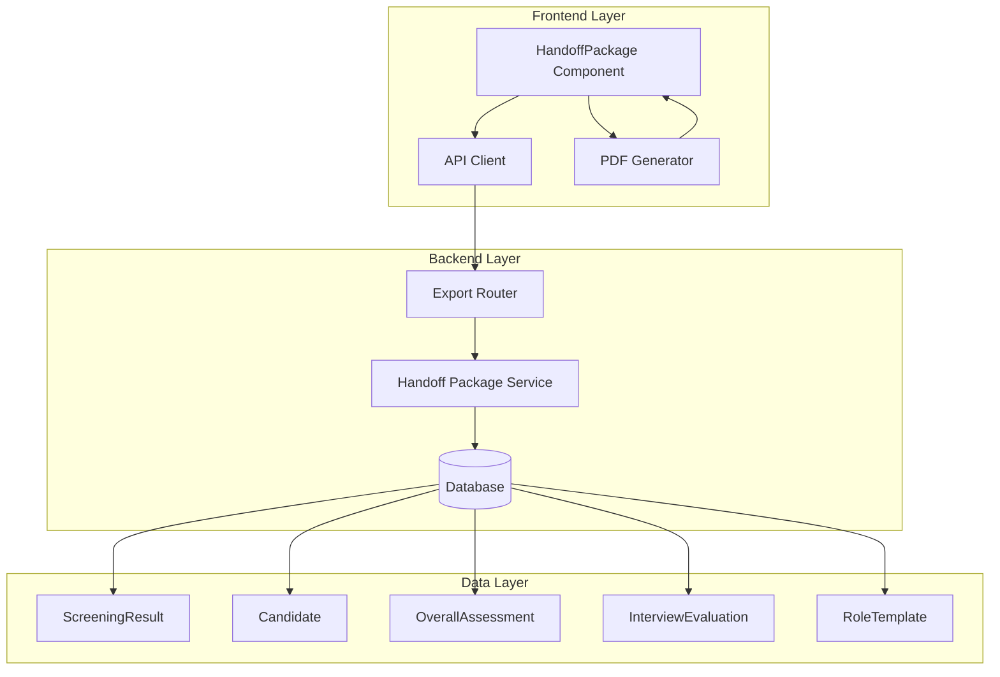
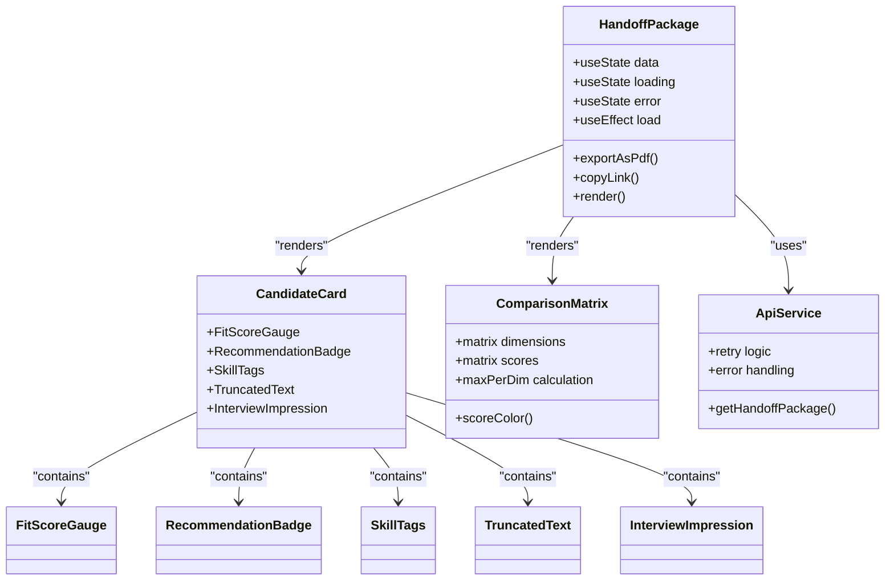
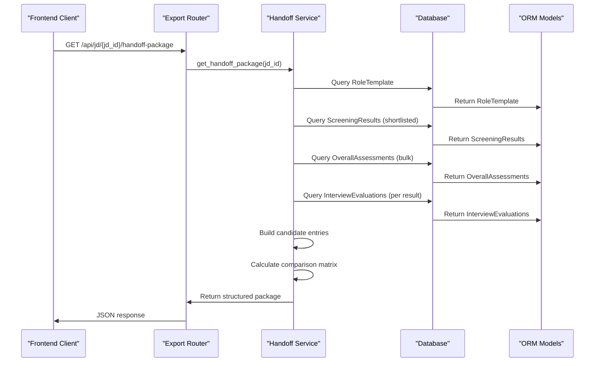
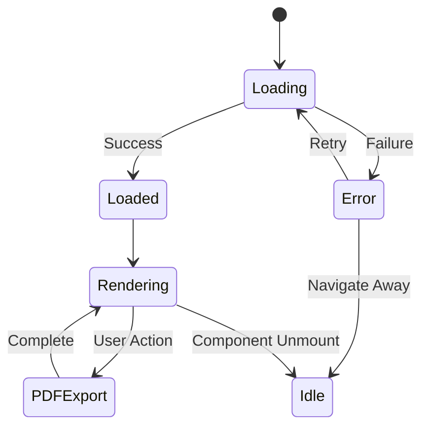
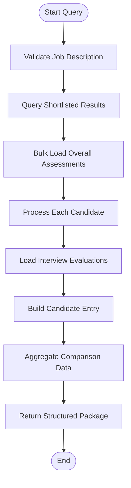
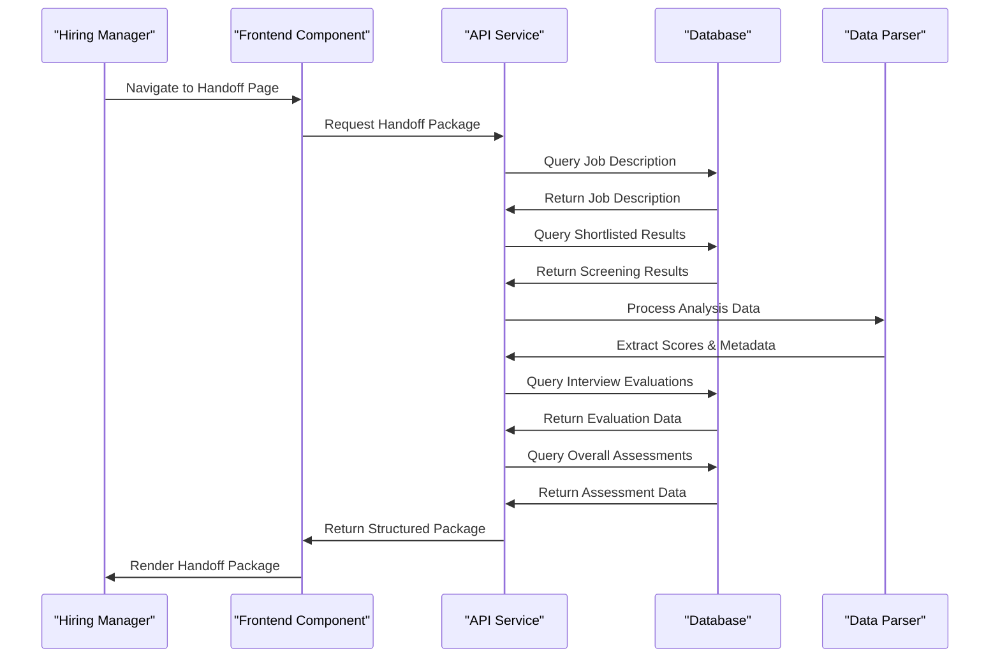
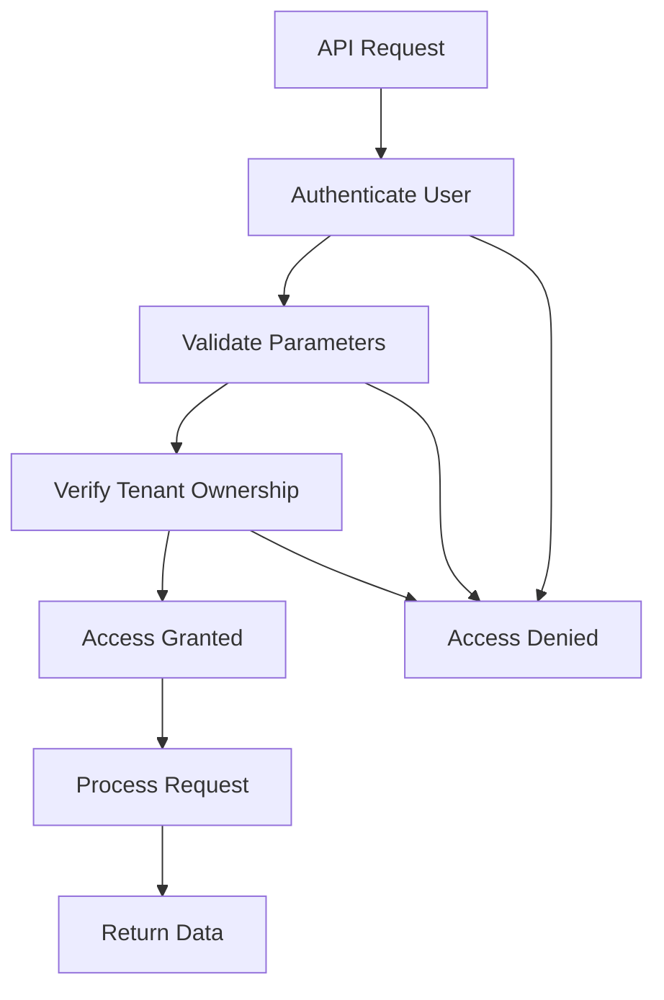

# Handoff Package Generation

<cite>
**Referenced Files in This Document**
- [HandoffPackage.jsx](file://app/frontend/src/components/HandoffPackage.jsx)
- [export.py](file://app/backend/routes/export.py)
- [api.js](file://app/frontend/src/lib/api.js)
- [db_models.py](file://app/backend/models/db_models.py)
- [schemas.py](file://app/backend/models/schemas.py)
</cite>

## Table of Contents
1. [Introduction](#introduction)
2. [System Architecture](#system-architecture)
3. [Core Components](#core-components)
4. [Handoff Package Data Model](#handoff-package-data-model)
5. [Frontend Implementation](#frontend-implementation)
6. [Backend Implementation](#backend-implementation)
7. [Data Flow and Processing](#data-flow-and-processing)
8. [Export and PDF Generation](#export-and-pdf-generation)
9. [Security and Access Control](#security-and-access-control)
10. [Performance Considerations](#performance-considerations)
11. [Troubleshooting Guide](#troubleshooting-guide)
12. [Conclusion](#conclusion)

## Introduction

The Handoff Package Generation system is a critical component of the Resume AI platform that enables hiring managers to receive comprehensive candidate evaluation packages for shortlisted candidates. This system aggregates analysis results, interview evaluations, and recruiter assessments into a structured format suitable for handoff to hiring stakeholders.

The system consists of two main components: a frontend React component that renders the handoff package interface and a backend FastAPI service that generates the structured data package. The handoff package includes individual candidate profiles, comparative analysis matrices, and interview performance summaries.

## System Architecture

The Handoff Package Generation follows a client-server architecture with clear separation of concerns:

**Diagram sources**
- [HandoffPackage.jsx:299-461](file://app/frontend/src/components/HandoffPackage.jsx#L299-L461)
- [export.py:162-308](file://app/backend/routes/export.py#L162-L308)

## Core Components

### Frontend Component Architecture

The frontend implementation centers around a sophisticated React component that handles data fetching, rendering, and export functionality:

**Diagram sources**
- [HandoffPackage.jsx:108-235](file://app/frontend/src/components/HandoffPackage.jsx#L108-L235)
- [HandoffPackage.jsx:237-295](file://app/frontend/src/components/HandoffPackage.jsx#L237-L295)

### Backend Service Architecture

The backend service implements a comprehensive data aggregation pipeline:

**Diagram sources**
- [export.py:162-308](file://app/backend/routes/export.py#L162-L308)

**Section sources**
- [HandoffPackage.jsx:1-462](file://app/frontend/src/components/HandoffPackage.jsx#L1-L462)
- [export.py:111-308](file://app/backend/routes/export.py#L111-L308)

## Handoff Package Data Model

The handoff package follows a structured JSON schema designed for comprehensive candidate evaluation:

### Core Package Structure

| Field | Type | Description |
|-------|------|-------------|
| `jd_name` | string | Job description name |
| `jd_id` | integer | Job description identifier |
| `generated_at` | datetime | Package generation timestamp |
| `generated_by` | string | Email of user who generated package |
| `shortlisted_candidates` | array | Candidate entries |
| `comparison_matrix` | object | Comparative analysis data |
| `total_shortlisted` | integer | Count of shortlisted candidates |

### Candidate Entry Schema

Each candidate entry contains comprehensive evaluation data:

| Field | Type | Description |
|-------|------|-------------|
| `candidate_id` | integer | Candidate identifier |
| `result_id` | integer | Screening result identifier |
| `name` | string | Candidate name |
| `fit_score` | integer | Overall fit percentage |
| `recommendation` | string | Final recommendation |
| `strengths` | array[string] | Candidate strengths |
| `weaknesses` | array[string] | Areas of concern |
| `matched_skills` | array[string] | Required skills present |
| `missing_skills` | array[string] | Required skills absent |
| `experience_summary` | string | Brief experience overview |
| `education_summary` | string | Educational background |
| `current_role` | string | Current position |
| `total_years_exp` | number | Total years of experience |
| `recruiter_notes` | string | Manual assessment notes |
| `recruiter_recommendation` | string | Manual recommendation |
| `interview_scores` | object | Interview performance summary |

### Comparison Matrix Structure

The comparison matrix provides multi-dimensional candidate evaluation:

| Dimension | Source Field | Description |
|-----------|--------------|-------------|
| Skill Match | `score_breakdown.skill_match` | Technical skill alignment |
| Experience | `score_breakdown.experience_match` | Work experience relevance |
| Education | `score_breakdown.education` | Educational qualifications |
| Domain Fit | `score_breakdown.domain_fit` | Industry/domain expertise |
| Timeline | `score_breakdown.timeline` | Availability and timeline |

**Section sources**
- [export.py:297-308](file://app/backend/routes/export.py#L297-L308)
- [export.py:268-285](file://app/backend/routes/export.py#L268-L285)
- [export.py:303-306](file://app/backend/routes/export.py#L303-L306)

## Frontend Implementation

### Component Lifecycle and State Management

The HandoffPackage component implements a robust state management system:

**Diagram sources**
- [HandoffPackage.jsx:309-322](file://app/frontend/src/components/HandoffPackage.jsx#L309-L322)

### PDF Generation Pipeline

The PDF export functionality utilizes html2pdf.js with comprehensive configuration:

| Configuration | Value | Purpose |
|---------------|-------|---------|
| Margin | 10mm all sides | Standard print margins |
| Filename | `Handoff_Package_{JD}_{Date}.pdf` | Descriptive naming |
| Image Quality | 0.98 JPEG | High-quality rendering |
| Scale | 2 | High-resolution output |
| Format | A4 Portrait | Standard paper size |

### Responsive Design Components

The frontend implements several specialized components for data presentation:

#### Candidate Card Component
- Fit score visualization with color-coded indicators
- Strengths and weaknesses display with icons
- Skill tag system for matched/missing skills
- Experience and education summaries
- Interview performance indicators
- Recruiter assessment integration

#### Comparison Matrix Component
- Multi-dimensional score visualization
- Automatic highlight of best performers
- Color-coded score ranges
- Dynamic dimension support

**Section sources**
- [HandoffPackage.jsx:108-235](file://app/frontend/src/components/HandoffPackage.jsx#L108-L235)
- [HandoffPackage.jsx:237-295](file://app/frontend/src/components/HandoffPackage.jsx#L237-L295)
- [HandoffPackage.jsx:324-336](file://app/frontend/src/components/HandoffPackage.jsx#L324-L336)

## Backend Implementation

### Database Query Optimization

The backend implements efficient query patterns to minimize database overhead:

**Diagram sources**
- [export.py:180-191](file://app/backend/routes/export.py#L180-L191)
- [export.py:208-294](file://app/backend/routes/export.py#L208-L294)

### Data Aggregation Logic

The backend performs sophisticated data aggregation from multiple sources:

#### Interview Score Calculation
- Groups evaluations by question category
- Calculates frequency distributions for ratings
- Determines average impressions per category
- Handles missing data gracefully

#### Experience and Education Processing
- Prefers analysis-derived summaries when available
- Falls back to candidate parsed data
- Provides sensible defaults for missing information
- Formats data for human-readable display

#### Comparison Matrix Construction
- Supports multiple scoring dimensions
- Handles missing values with zeros
- Provides dimensional fallbacks (timeline → stability)
- Enables meaningful candidate comparisons

**Section sources**
- [export.py:133-159](file://app/backend/routes/export.py#L133-L159)
- [export.py:222-294](file://app/backend/routes/export.py#L222-L294)

## Data Flow and Processing

### End-to-End Workflow

The handoff package generation follows a well-defined data flow:

**Diagram sources**
- [export.py:162-308](file://app/backend/routes/export.py#L162-L308)
- [HandoffPackage.jsx:309-322](file://app/frontend/src/components/HandoffPackage.jsx#L309-L322)

### Error Handling and Validation

The system implements comprehensive error handling:

#### Frontend Error Handling
- Network error detection and user-friendly messages
- Loading state management with spinner indicators
- Graceful degradation for partial failures
- Copy-to-clipboard fallback mechanisms

#### Backend Error Handling
- Job description validation with 404 responses
- Tenant isolation enforcement
- JSON parsing error recovery
- Database query optimization with bulk loading

**Section sources**
- [HandoffPackage.jsx:315-317](file://app/frontend/src/components/HandoffPackage.jsx#L315-L317)
- [export.py:172-178](file://app/backend/routes/export.py#L172-L178)

## Export and PDF Generation

### PDF Generation Features

The system provides comprehensive PDF export capabilities:

#### HTML to PDF Conversion
- Uses html2pdf.js library for reliable conversion
- Configurable margins and page settings
- High-resolution image output for crisp text
- A4 portrait format optimized for printing

#### File Naming Convention
- Descriptive filenames including JD name and date
- Automatic sanitization of special characters
- Timestamp-based uniqueness to prevent collisions

#### Print-Friendly Design
- Optimized layout for printed documents
- Color-coded score indicators
- Clear visual hierarchy
- Responsive design for various screen sizes

### Alternative Export Formats

While the primary focus is PDF generation, the system supports multiple export formats through the broader export infrastructure:

| Format | Endpoint | Use Case |
|--------|----------|----------|
| CSV | `/api/export/csv` | Spreadsheet analysis |
| Excel | `/api/export/excel` | Advanced data manipulation |
| PDF | Handoff Package | Printing and sharing |

**Section sources**
- [HandoffPackage.jsx:324-336](file://app/frontend/src/components/HandoffPackage.jsx#L324-L336)
- [export.py:59-108](file://app/backend/routes/export.py#L59-L108)

## Security and Access Control

### Authentication and Authorization

The handoff package system implements robust security measures:

#### Tenant Isolation
- All queries enforce tenant_id filtering
- Job description access restricted to owning tenant
- Candidate data visibility limited to authorized users
- Prevents cross-tenant data leakage

#### User Authentication
- JWT-based authentication for API access
- CSRF protection for browser requests
- Automatic session refresh handling
- Secure cookie-based token management

#### Data Validation
- Input parameter validation and sanitization
- JSON parsing with error recovery
- Type checking for all data transformations
- Graceful handling of malformed data

### Access Control Implementation

**Diagram sources**
- [export.py:172-178](file://app/backend/routes/export.py#L172-L178)

**Section sources**
- [export.py:172-178](file://app/backend/routes/export.py#L172-L178)
- [api.js:37-57](file://app/frontend/src/lib/api.js#L37-L57)

## Performance Considerations

### Database Optimization Strategies

The system employs several optimization techniques:

#### Query Optimization
- Single-pass bulk loading of related data
- Efficient JOIN operations for candidate data
- Index utilization for tenant and status filtering
- Minimal N+1 query patterns

#### Memory Management
- Streaming responses for large datasets
- Lazy loading of non-critical data
- Efficient JSON parsing with error recovery
- Proper cleanup of temporary data structures

#### Caching Strategies
- Database-level caching for frequently accessed data
- Application-level caching for repeated queries
- CDN optimization for static assets
- Browser caching for improved user experience

### Frontend Performance
- React.memo for expensive component rendering
- Virtual scrolling for large candidate lists
- Debounced search and filtering
- Efficient state updates with useState/useReducer

## Troubleshooting Guide

### Common Issues and Solutions

#### Handoff Package Not Loading
**Symptoms**: Loading spinner remains indefinitely
**Causes**: 
- Network connectivity issues
- Job description not found
- Tenant access violations
- Database timeouts

**Solutions**:
- Verify network connectivity and API availability
- Check job description ID validity
- Confirm user tenant membership
- Monitor database performance metrics

#### PDF Generation Failures
**Symptoms**: PDF export button disabled or fails silently
**Causes**:
- Missing DOM content for rendering
- Browser compatibility issues
- Large document size
- Memory constraints

**Solutions**:
- Ensure contentRef is properly initialized
- Test in supported browsers (Chrome/Firefox)
- Reduce candidate count for large packages
- Monitor memory usage during export

#### Data Display Issues
**Symptoms**: Incomplete or incorrect candidate information
**Causes**:
- Missing analysis data
- Database schema inconsistencies
- JSON parsing errors
- Missing interview evaluations

**Solutions**:
- Verify analysis pipeline completion
- Check database migration status
- Validate JSON data integrity
- Ensure interview evaluation data exists

### Debugging Tools and Techniques

#### Frontend Debugging
- React Developer Tools for component inspection
- Browser console for error logging
- Network tab for API request monitoring
- Performance tab for rendering optimization

#### Backend Debugging
- Database query logs for performance analysis
- Application logs for error tracking
- Database connection pool monitoring
- API response time measurements

**Section sources**
- [HandoffPackage.jsx:356-381](file://app/frontend/src/components/HandoffPackage.jsx#L356-L381)
- [export.py:172-178](file://app/backend/routes/export.py#L172-L178)

## Conclusion

The Handoff Package Generation system represents a sophisticated solution for transforming raw candidate analysis data into actionable hiring packages. The system successfully balances technical complexity with user accessibility, providing hiring managers with comprehensive candidate evaluation tools.

Key strengths of the implementation include:

- **Robust Architecture**: Clear separation of frontend and backend concerns with well-defined APIs
- **Data Integrity**: Comprehensive validation and error handling throughout the data pipeline
- **User Experience**: Intuitive interface with responsive design and multiple export formats
- **Performance Optimization**: Efficient database queries and frontend rendering optimizations
- **Security**: Strong tenant isolation and authentication mechanisms

The system's modular design allows for easy extension and customization, while maintaining reliability and performance at scale. Future enhancements could include additional export formats, advanced filtering capabilities, and integration with external HR systems.