# Interview Pages

<cite>
**Referenced Files in This Document**
- [InterviewPage.jsx](file://app/frontend/src/pages/InterviewPage.jsx)
- [RecruiterInterviewPage.jsx](file://app/frontend/src/pages/RecruiterInterviewPage.jsx)
- [InterviewDetailPage.jsx](file://app/frontend/src/pages/InterviewDetailPage.jsx)
- [RecruiterSessionDetailPage.jsx](file://app/frontend/src/pages/RecruiterSessionDetailPage.jsx)
- [InterviewComparisonPage.jsx](file://app/frontend/src/pages/InterviewComparisonPage.jsx)
- [InterviewStrategyPreview.jsx](file://app/frontend/src/components/InterviewStrategyPreview.jsx)
- [interviews.py](file://app/backend/route/interviews.py)
- [interview_kit.py](file://app/backend/route/interview_kit.py)
- [VoiceScreeningPage.jsx](file://app/frontend/src/pages/VoiceScreeningPage.jsx)
- [VideoPage.jsx](file://app/frontend/src/pages/VideoPage.jsx)
- [api.js](file://app/frontend/src/lib/api.js)
</cite>

## Update Summary
**Changes Made**
- Added new InterviewComparisonPage component for comprehensive candidate evaluation
- Enhanced InterviewDetailPage with improved error handling and unified session management
- Integrated InterviewStrategyPreview component into RecruiterSessionDetailPage
- Updated backend API integration for interview comparison functionality
- Enhanced session loading logic with better fallback mechanisms

## Table of Contents
1. [Introduction](#introduction)
2. [System Architecture](#system-architecture)
3. [Core Interview Components](#core-interview-components)
4. [Unified Interview Interface](#unified-interview-interface)
5. [Enhanced Interview Detail Management](#enhanced-interview-detail-management)
6. [Interview Strategy Preview System](#interview-strategy-preview-system)
7. [Candidate Comparison Analytics](#candidate-comparison-analytics)
8. [Recruiter Interview System](#recruiter-interview-system)
9. [Voice Screening Integration](#voice-screening-integration)
10. [Video Interview Analysis](#video-interview-analysis)
11. [Data Flow and Processing](#data-flow-and-processing)
12. [Configuration Management](#configuration-management)
13. [Performance and Scalability](#performance-and-scalability)
14. [Security and Access Control](#security-and-access-control)
15. [Troubleshooting Guide](#troubleshooting-guide)
16. [Conclusion](#conclusion)

## Introduction

The Interview Pages system represents a comprehensive AI-powered recruitment solution that combines voice screening, structured interviews, and video analysis into a unified platform. This system enables organizations to automate initial candidate screening through AI voice agents while providing advanced analytics and evaluation capabilities.

The platform supports three primary interview depths: Quick Screen (automated voice calls), Standard Interview (AI-powered structured interviews), and Deep Assessment (comprehensive AI evaluation). It integrates seamlessly with existing ATS systems and provides real-time analytics for hiring teams.

**Updated** Added new InterviewComparisonPage for comprehensive candidate evaluation and enhanced InterviewDetailPage with improved error handling and unified session management.

## System Architecture

The Interview Pages system follows a modern microservices architecture with clear separation between frontend presentation, backend APIs, and specialized services for AI processing.

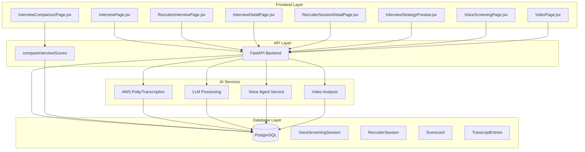

**Diagram sources**
- [InterviewPage.jsx:141-695](file://app/frontend/src/pages/InterviewPage.jsx#L141-L695)
- [RecruiterInterviewPage.jsx:92-565](file://app/frontend/src/pages/RecruiterInterviewPage.jsx#L92-L565)
- [InterviewDetailPage.jsx:164-584](file://app/frontend/src/pages/InterviewDetailPage.jsx#L164-L584)
- [RecruiterSessionDetailPage.jsx:71-320](file://app/frontend/src/pages/RecruiterSessionDetailPage.jsx#L71-L320)
- [InterviewComparisonPage.jsx:15-169](file://app/frontend/src/pages/InterviewComparisonPage.jsx#L15-L169)
- [InterviewStrategyPreview.jsx:29-104](file://app/frontend/src/components/InterviewStrategyPreview.jsx#L29-L104)
- [interviews.py:60-1034](file://app/backend/route/interviews.py#L60-L1034)

## Core Interview Components

### Interview Depth Classification System

The system categorizes interviews into three distinct depths, each serving different recruitment needs:

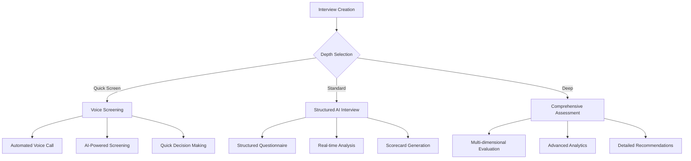

**Diagram sources**
- [InterviewPage.jsx:19-23](file://app/frontend/src/pages/InterviewPage.jsx#L19-L23)
- [InterviewPage.jsx:115-137](file://app/frontend/src/pages/InterviewPage.jsx#L115-L137)

### Unified Session Management

The system maintains a unified session management approach that normalizes data from different interview sources:

| Property | Voice Session | Recruiter Session | Normalized |
|----------|---------------|-------------------|------------|
| `id` | `v-{session_id}` | `r-{session_id}` | `v-{id}` or `r-{id}` |
| `source` | `voice` | `recruiter` | `voice` or `recruiter` |
| `depth` | `quick` | `standard`/`deep` | `quick`/`standard`/`deep` |
| `status` | Voice status | Recruiter status | Unified status mapping |
| `score` | `match_score` | `overall_score` | `score` or `match_score` |

**Section sources**
- [InterviewPage.jsx:95-137](file://app/frontend/src/pages/InterviewPage.jsx#L95-L137)

## Unified Interview Interface

### Main Interview Dashboard

The primary interface serves as a centralized hub for managing all interview activities across different channels:

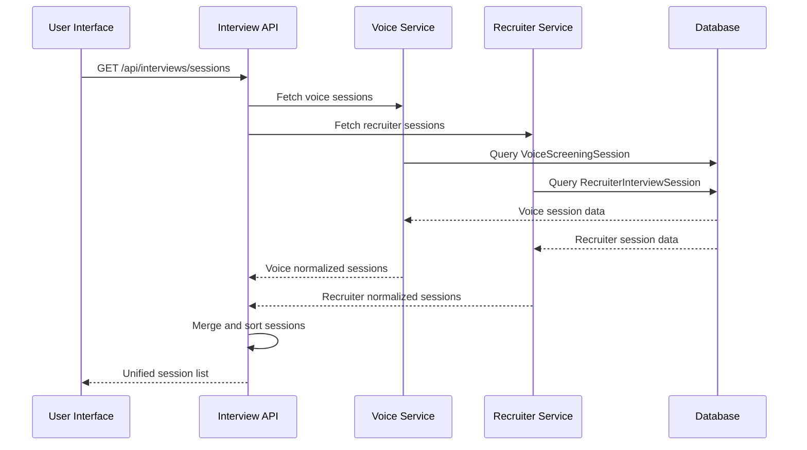

**Diagram sources**
- [InterviewPage.jsx:196-218](file://app/frontend/src/pages/InterviewPage.jsx#L196-L218)
- [interviews.py:271-322](file://app/backend/route/interviews.py#L271-L322)

### Session Filtering and Search

The interface provides sophisticated filtering capabilities:

- **Depth Filters**: Quick, Standard, Deep, All sessions
- **Status Filters**: Scheduled, In Progress, Completed, Failed, Cancelled
- **Search Functionality**: Candidate name and Job Description title search
- **Real-time Updates**: Automatic refresh of session lists

**Section sources**
- [InterviewPage.jsx:174-186](file://app/frontend/src/pages/InterviewPage.jsx#L174-L186)

## Enhanced Interview Detail Management

### Unified Session Loading Logic

The enhanced InterviewDetailPage provides sophisticated session loading with fallback mechanisms:

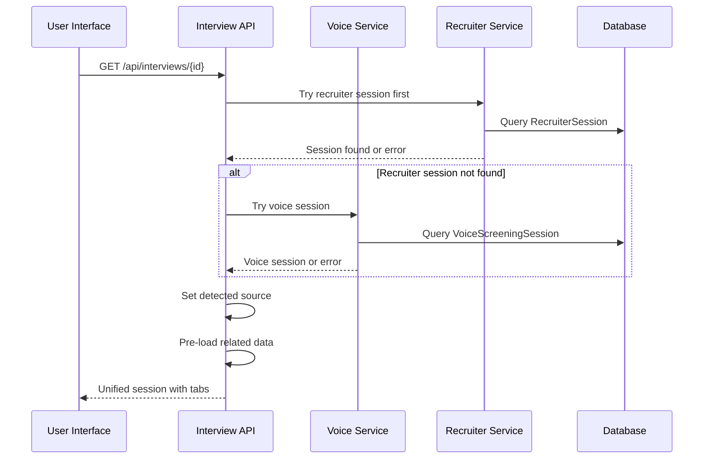

**Diagram sources**
- [InterviewDetailPage.jsx:181-240](file://app/frontend/src/pages/InterviewDetailPage.jsx#L181-L240)

### Improved Error Handling

The system now provides comprehensive error handling with user-friendly messages:

- **Session Not Found**: Graceful fallback between voice and recruiter sessions
- **Network Errors**: Automatic retry mechanisms with exponential backoff
- **Loading States**: Smooth loading indicators with skeleton screens
- **Permission Errors**: Clear guidance for access control issues

**Section sources**
- [InterviewDetailPage.jsx:233-240](file://app/frontend/src/pages/InterviewDetailPage.jsx#L233-L240)
- [InterviewDetailPage.jsx:311-323](file://app/frontend/src/pages/InterviewDetailPage.jsx#L311-L323)

## Interview Strategy Preview System

### Strategy Visualization Component

The new InterviewStrategyPreview component provides comprehensive interview strategy visualization:

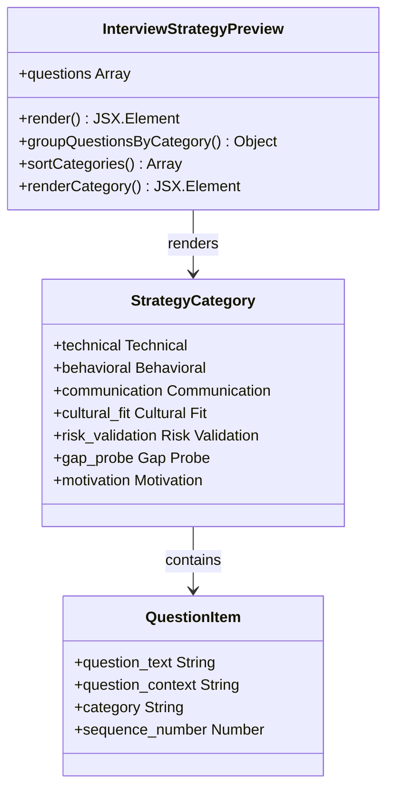

**Diagram sources**
- [InterviewStrategyPreview.jsx:29-104](file://app/frontend/src/components/InterviewStrategyPreview.jsx#L29-L104)

### Strategy Data Processing

The component handles various strategy data formats with intelligent parsing:

| Input Format | Processing Logic | Output |
|--------------|------------------|---------|
| `null`/`undefined` | Empty state with brain icon | Loading state |
| `string` | JSON.parse attempt | Array of questions |
| `array` | Direct usage | Questions array |
| `object` | Extract `.questions` property | Questions array |
| `unknown` | Fallback to technical category | Normalized array |

**Section sources**
- [InterviewStrategyPreview.jsx:30-69](file://app/frontend/src/components/InterviewStrategyPreview.jsx#L30-L69)

### Strategy Integration in Recruiter Sessions

The RecruiterSessionDetailPage now includes strategy preview functionality:

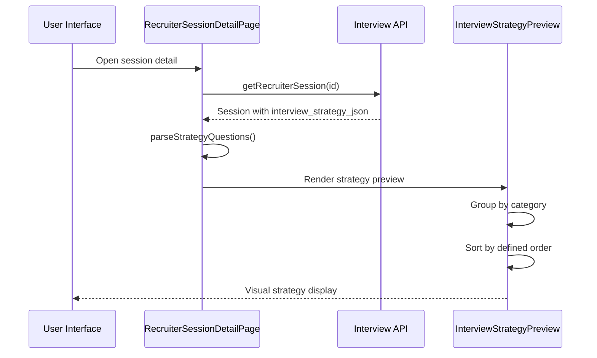

**Diagram sources**
- [RecruiterSessionDetailPage.jsx:54-69](file://app/frontend/src/pages/RecruiterSessionDetailPage.jsx#L54-L69)
- [RecruiterSessionDetailPage.jsx:310-315](file://app/frontend/src/pages/RecruiterSessionDetailPage.jsx#L310-L315)

**Section sources**
- [RecruiterSessionDetailPage.jsx:54-69](file://app/frontend/src/pages/RecruiterSessionDetailPage.jsx#L54-L69)
- [RecruiterSessionDetailPage.jsx:310-315](file://app/frontend/src/pages/RecruiterSessionDetailPage.jsx#L310-L315)

## Candidate Comparison Analytics

### Comprehensive Evaluation Dashboard

The new InterviewComparisonPage provides advanced candidate evaluation capabilities:

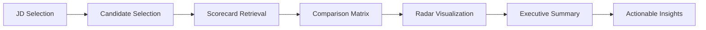

**Diagram sources**
- [InterviewComparisonPage.jsx:26-67](file://app/frontend/src/pages/InterviewComparisonPage.jsx#L26-L67)

### Data Validation and Processing

The comparison system implements robust data validation:

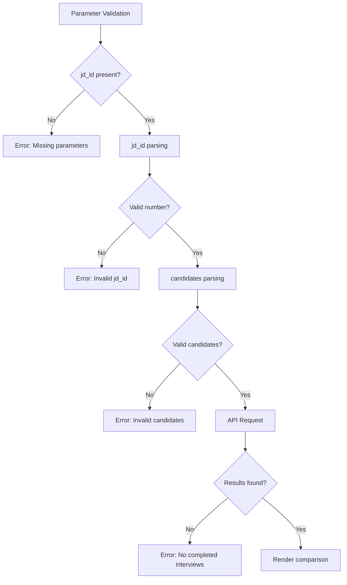

**Diagram sources**
- [InterviewComparisonPage.jsx:31-58](file://app/frontend/src/pages/InterviewComparisonPage.jsx#L31-L58)

### Comparison Visualization

The system generates comprehensive comparison insights:

| Metric | Visualization | Analysis |
|--------|---------------|----------|
| **Technical Skills** | Radar chart axes | Comparative strength assessment |
| **Communication** | Polar coordinates | Relative positioning analysis |
| **Cultural Fit** | Angular distance | Alignment measurement |
| **Overall Scores** | Bar comparison | Performance ranking |
| **Recommendations** | Color-coded indicators | Hiring decision patterns |

**Section sources**
- [InterviewComparisonPage.jsx:15-169](file://app/frontend/src/pages/InterviewComparisonPage.jsx#L15-L169)

## Recruiter Interview System

### Structured Interview Management

The recruiter interview system provides comprehensive AI-powered structured interviewing capabilities:

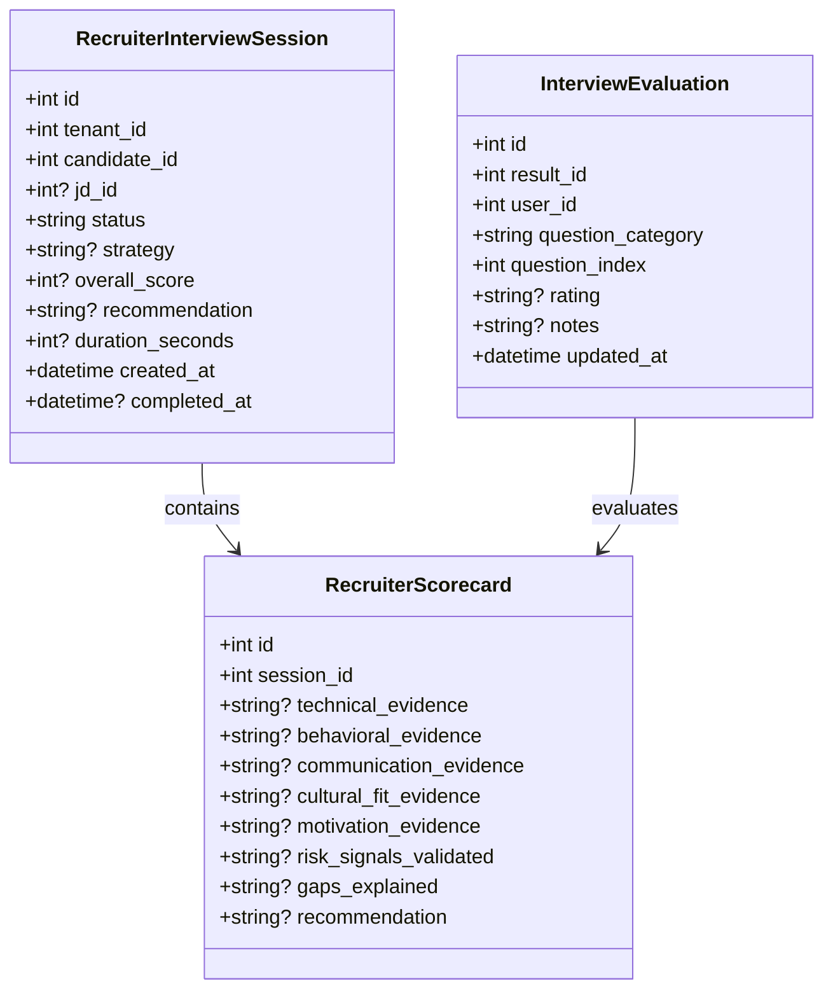

**Diagram sources**
- [RecruiterInterviewPage.jsx:92-565](file://app/frontend/src/pages/RecruiterInterviewPage.jsx#L92-L565)
- [interviews.py:325-477](file://app/backend/route/interviews.py#L325-L477)

### Auto-Trigger Configuration

The system supports intelligent auto-triggering of interviews based on predefined criteria:

| Configuration Parameter | Default Value | Description |
|------------------------|---------------|-------------|
| `auto_trigger_enabled` | `false` | Enable/disable automatic interview triggering |
| `min_score_threshold` | `60` | Minimum fit score for auto-trigger |
| `default_duration_minutes` | `30` | Default interview duration (10-60 minutes) |
| `max_concurrent` | `3` | Maximum concurrent interview sessions |

**Section sources**
- [RecruiterInterviewPage.jsx:466-552](file://app/frontend/src/pages/RecruiterInterviewPage.jsx#L466-L552)

## Voice Screening Integration

### Automated Voice Call System

The voice screening system provides automated phone-based candidate screening:

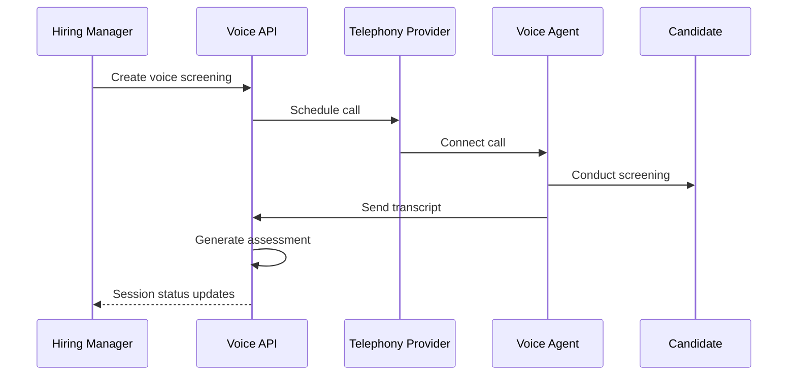

**Diagram sources**
- [VoiceScreeningPage.jsx:172-800](file://app/frontend/src/pages/VoiceScreeningPage.jsx#L172-L800)
- [interviews.py:147-187](file://app/backend/route/interviews.py#L147-L187)

### Voice Configuration Management

Voice screening settings include comprehensive customization options:

| Setting Category | Parameters | Description |
|------------------|------------|-------------|
| **Bot Identity** | `bot_name`, `bot_voice_gender`, `greeting_style` | AI bot personality and presentation |
| **Call Routing** | `caller_id_name`, `outbound_phone_number` | Call appearance and destination |
| **Business Hours** | `business_hours_start`, `business_hours_end`, `allowed_days` | Call scheduling constraints |
| **Call Behavior** | `call_duration_min/max`, `max_retries`, `retry_intervals` | Call attempt management |
| **Assessment Settings** | `assessment_detail_level`, `follow_up_aggressiveness` | Post-call analysis depth |

**Section sources**
- [VoiceScreeningPage.jsx:672-800](file://app/frontend/src/pages/VoiceScreeningPage.jsx#L672-L800)

## Video Interview Analysis

### Multi-modal Video Processing

The video interview analysis system provides comprehensive communication assessment:

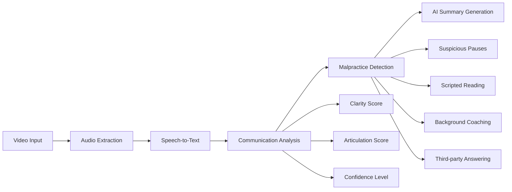

**Diagram sources**
- [VideoPage.jsx:508-809](file://app/frontend/src/pages/VideoPage.jsx#L508-L809)

### Communication Assessment Metrics

The system generates comprehensive communication scores:

| Metric | Range | Interpretation |
|--------|-------|----------------|
| **Communication Score** | 0-100 | Overall communication effectiveness |
| **Clarity Score** | 0-100 | Speech clarity and pronunciation |
| **Articulation Score** | 0-100 | Word enunciation quality |
| **Confidence Level** | Low/Medium/High | Self-assurance indicators |
| **Words per Minute** | Variable | Speaking pace analysis |

**Section sources**
- [VideoPage.jsx:325-455](file://app/frontend/src/pages/VideoPage.jsx#L325-L455)

### Malpractice Detection System

Advanced algorithms detect potential interview manipulation:

| Flag Type | Detection Method | Severity Levels |
|-----------|------------------|-----------------|
| **Scripted Reading** | Pattern recognition in speech flow | High/Medium/Low |
| **Background Coaching** | Speech pattern analysis and hesitation | High/Medium/Low |
| **Inconsistent Fluency** | Speech rhythm and pause pattern analysis | Medium/High |
| **Suspicious Pause** | Unnatural silence detection | High/Medium/Low |
| **Evasive Pattern** | Avoidance word detection | Medium/High |
| **Third-party Answering** | Voice similarity analysis | High |

**Section sources**
- [VideoPage.jsx:77-90](file://app/frontend/src/pages/VideoPage.jsx#L77-L90)

## Data Flow and Processing

### Real-time Session Updates

The system maintains real-time synchronization between frontend and backend:

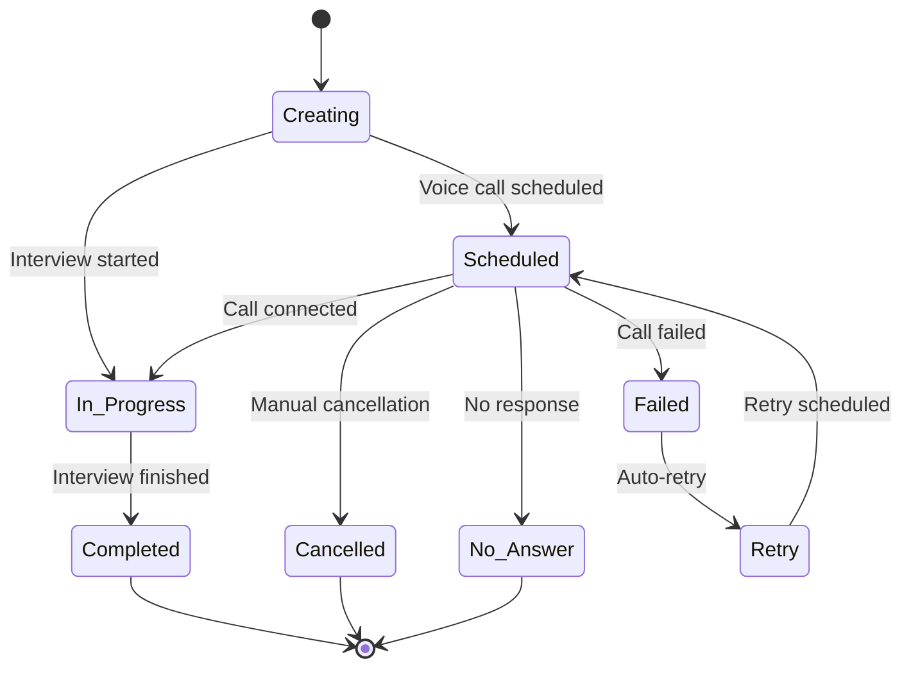

**Diagram sources**
- [InterviewDetailPage.jsx:71-488](file://app/frontend/src/pages/InterviewDetailPage.jsx#L71-L488)

### Data Normalization Pipeline

The system transforms diverse data sources into unified formats:

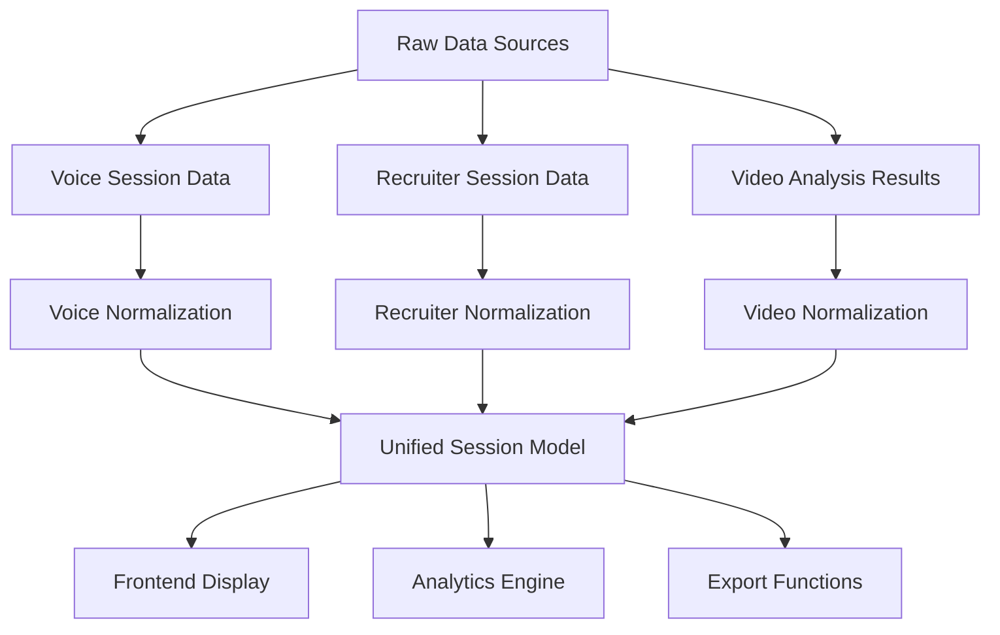

**Diagram sources**
- [InterviewPage.jsx:164-171](file://app/frontend/src/pages/InterviewPage.jsx#L164-L171)

**Section sources**
- [InterviewPage.jsx:164-186](file://app/frontend/src/pages/InterviewPage.jsx#L164-L186)

### Enhanced API Integration

The system now includes comprehensive interview comparison functionality:

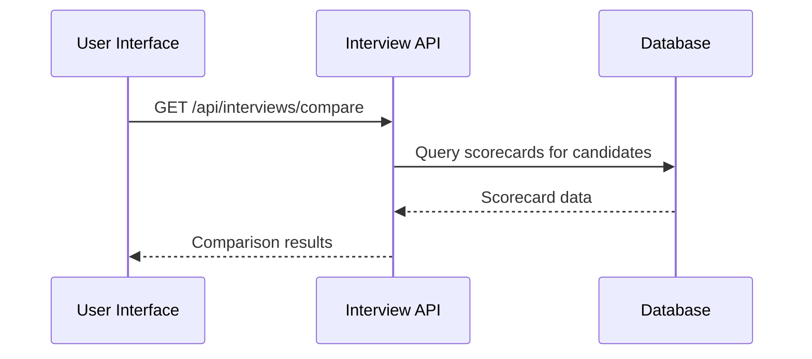

**Diagram sources**
- [api.js:1783-1788](file://app/frontend/src/lib/api.js#L1783-L1788)

**Section sources**
- [api.js:1783-1788](file://app/frontend/src/lib/api.js#L1783-L1788)

## Configuration Management

### Multi-layer Configuration System

The system provides granular control over interview behavior through layered configuration:

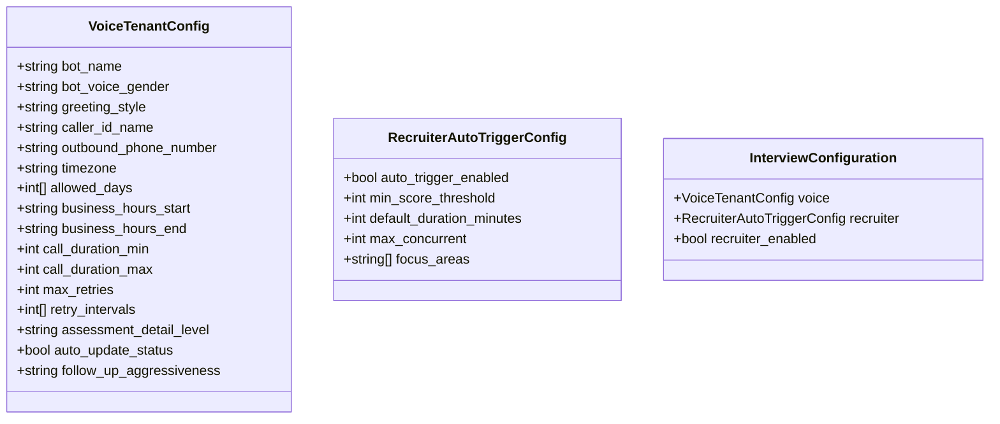

**Diagram sources**
- [interviews.py:608-703](file://app/backend/route/interviews.py#L608-L703)

### Configuration Validation and Defaults

The system ensures robust configuration management:

- **Validation**: All configuration updates are validated against predefined constraints
- **Defaults**: Missing configurations are automatically initialized with sensible defaults
- **Versioning**: Configuration changes maintain audit trails for compliance
- **Permissions**: Only authorized users can modify configuration settings

**Section sources**
- [interviews.py:608-703](file://app/backend/route/interviews.py#L608-L703)

## Performance and Scalability

### Load Balancing and Caching

The system implements comprehensive performance optimization:

- **Database Indexing**: Strategic indexing on frequently queried fields (status, tenant_id, created_at)
- **API Caching**: Response caching for frequently accessed session data
- **Background Processing**: Asynchronous processing for heavy operations (transcription, analysis)
- **Connection Pooling**: Optimized database connection management

### Scalability Features

- **Horizontal Scaling**: Stateless API design enabling easy horizontal scaling
- **Queue-based Processing**: Background job queues for non-critical operations
- **CDN Integration**: Static asset delivery optimization
- **Database Sharding**: Tenant-based data isolation and partitioning

## Security and Access Control

### Role-based Access Control

The system implements strict access controls:

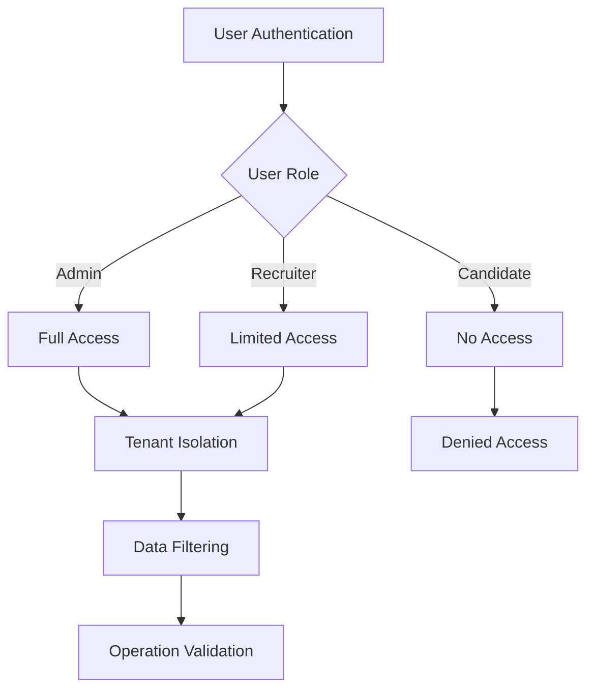

**Diagram sources**
- [interviews.py:79-86](file://app/backend/route/interviews.py#L79-L86)

### Data Protection Measures

- **Encryption**: All sensitive data encrypted at rest and in transit
- **Audit Logging**: Comprehensive logging of all access and modification events
- **Rate Limiting**: API rate limiting to prevent abuse
- **Input Validation**: Strict validation of all user inputs and API requests

**Section sources**
- [interviews.py:79-86](file://app/backend/route/interviews.py#L79-L86)

## Troubleshooting Guide

### Common Issues and Solutions

| Issue | Symptoms | Solution |
|-------|----------|----------|
| **Session Not Loading** | Blank session list | Check network connectivity and API availability |
| **Voice Call Failures** | Calls not connecting | Verify phone number format and carrier support |
| **Transcript Missing** | Empty transcript area | Wait for transcription processing completion |
| **Scorecard Not Available** | Scorecard loading indefinitely | Ensure interview completion before accessing |
| **Configuration Changes Not Saving** | Settings revert to defaults | Check user permissions and network stability |
| **Comparison Page Errors** | Error messages on comparison | Verify jd_id and candidate_ids parameters |

### Performance Optimization Tips

- **Browser Optimization**: Use supported browsers and disable ad blockers
- **Network Stability**: Ensure consistent internet connection during analysis
- **File Size Limits**: Keep video files under 200MB for optimal processing
- **Platform Compatibility**: Use supported video formats (MP4, WebM, MOV)

### Support Resources

- **API Documentation**: Comprehensive endpoint documentation available
- **Integration Examples**: Sample code for common integration scenarios
- **Community Forum**: User discussions and troubleshooting threads
- **Enterprise Support**: Dedicated support for enterprise customers

## Conclusion

The Interview Pages system provides a comprehensive, AI-powered recruitment solution that streamlines the entire candidate screening process. By combining automated voice screening, structured AI interviews, and advanced video analysis, organizations can significantly improve their hiring efficiency while maintaining high-quality candidate evaluation standards.

**Updated** The system now includes enhanced InterviewComparisonPage for comprehensive candidate evaluation, improved InterviewDetailPage with better error handling and unified session management, and integrated InterviewStrategyPreview component for better strategy visualization.

The system's modular architecture ensures scalability and flexibility, while robust security measures protect sensitive candidate data. The unified interface simplifies management across multiple interview channels, making it an essential tool for modern recruitment teams.

Key benefits include:
- **Automation**: Reduced manual effort in initial screening processes
- **Consistency**: Standardized evaluation criteria across all candidates
- **Insights**: Advanced analytics and reporting capabilities
- **Integration**: Seamless integration with existing ATS and HR systems
- **Scalability**: Enterprise-grade infrastructure supporting growing organizations
- **Enhanced Analytics**: Comprehensive candidate comparison and strategy visualization
- **Improved User Experience**: Better error handling and unified session management

The platform continues to evolve with new AI capabilities and integration features, positioning organizations at the forefront of recruitment technology innovation.